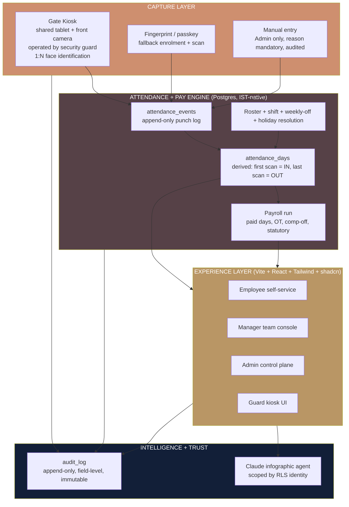
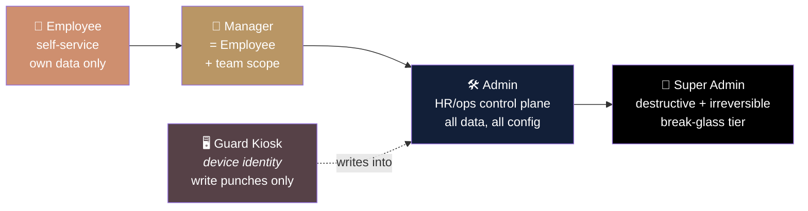
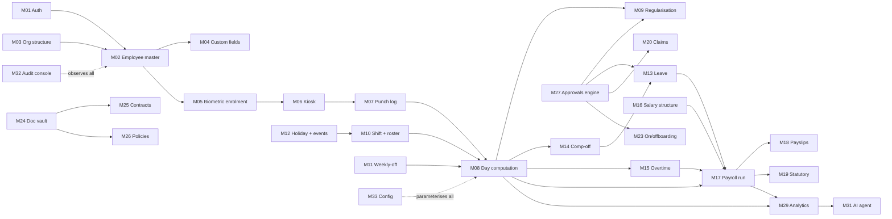
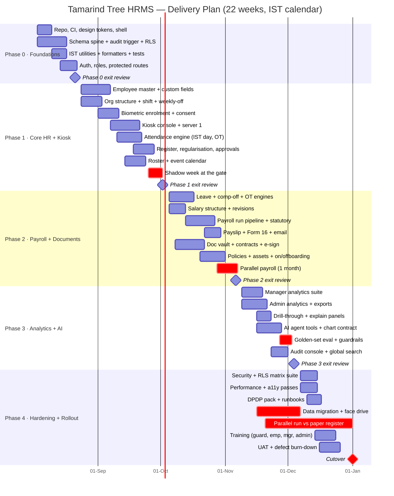
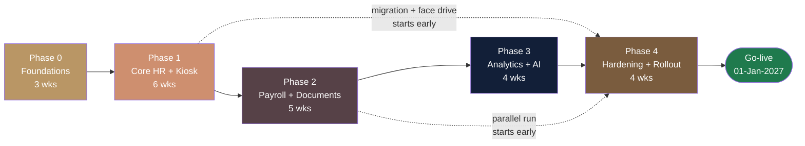

# 00 — Master Plan
### Tamarind Tree HRMS · Machani Hospitalities LLP · Build Bible, Document 0 of 9

**Purpose.** This is the document a CEO or CTO reads first. It states what we are building (a new, enterprise-grade Human Resource Management System for The Tamarind Tree, operated by Machani Hospitalities LLP), why we are building it (a weekend-heavy, shift-driven hospitality workforce is currently managed on registers and spreadsheets, with no auditable single source of truth for attendance, pay, or documents), who it is for (three product personas — Employee, Manager, Admin — plus one technical tier and one device role), what exactly is in and out of version 1, in what order we build it (five phases across 22 working weeks), how we get live data into it without corrupting it, what can go wrong, and how we will know we succeeded. Every downstream document in this set (`01-prd-employee.md` … `09-documents-contracts-comms.md`) elaborates a slice of what is decided here; where this document and a downstream document disagree, **this document wins on scope, sequencing and principles, and the downstream document wins on field-level specification**. Nothing here is a placeholder: every decision is stated as a decision, and every ambiguity in the client brief is stated as an explicit assumption with a chosen default so that no engineer is ever blocked waiting for an answer.

---

## Table of contents

1. [Executive summary](#1-executive-summary)
2. [The client brief, restated precisely](#2-the-client-brief-restated-precisely)
3. [Product vision and design principles](#3-product-vision-and-design-principles)
4. [Personas](#4-personas)
5. [Module map](#5-module-map)
6. [Scope: explicitly in, explicitly out](#6-scope-explicitly-in-explicitly-out)
7. [Phased roadmap](#7-phased-roadmap)
8. [Data migration and go-live plan](#8-data-migration-and-go-live-plan)
9. [Risk register](#9-risk-register)
10. [Success metrics and KPIs](#10-success-metrics-and-kpis)
11. [Team: the five hats](#11-team-the-five-hats)
12. [Open questions for the client](#12-open-questions-for-the-client)
13. [Appendix A — Document set index](#appendix-a--document-set-index)
14. [Appendix B — Glossary](#appendix-b--glossary)
15. [Appendix C — Defect-to-decision register](#appendix-c--defect-to-decision-register)

---

## 1. Executive summary

### 1.1 What we are building

A purpose-built HRMS for a five-acre heritage event venue in South Bengaluru that runs weddings and corporate events for up to ~1,000 guests. The product covers the complete employee lifecycle — hire, onboard, roster, attend, apply, approve, pay, document, separate — for a workforce of roughly 30–60 people today, architected to hold a few hundred without redesign.

The system has four distinguishing characteristics that separate it from an off-the-shelf Indian HRMS:

| # | Characteristic | Why it matters here |
|---|---|---|
| 1 | **Attendance is captured on one shared camera kiosk at the gate, operated by a security guard, using 1:N face identification** | Banquet, kitchen, housekeeping, security and gardening staff do not have company laptops or reliably have smartphones. One tablet at the gate is the single realistic capture point. The system must answer "who is this?" — not "is this Ramesh?" — because nobody logs in first. |
| 2 | **Everything is audited at field level, immutably** | The client's instruction was literal: "even a minute change should be audited." Every insert, update, delete, login, approval, reveal of masked data, and attendance event is recorded with actor, before/after values, IST and UTC timestamps, and reason. |
| 3 | **IST is the only clock** | Day boundaries, pay periods, shift lateness, and comp-off credit all derive from `Asia/Kolkata` civil dates — never from UTC dates, never from browser locale. This is the single largest source of silent corruption in the system we are replacing. |
| 4 | **The analytics layer is an AI agent that answers in infographics** | A Claude-powered agent lives in both the employee and admin dashboards. Employees ask about their own data; Admins ask about everyone's. Answers render as charts and stat tiles with a citation trail back to source rows — not as prose paragraphs. |

### 1.2 Why now

The client supplied 30 screenshots of an incumbent group HRMS (deployed for a sibling Machani Group entity under the "SSSRC" brand). We analysed all 30 in detail (`screens-digest.md`). The feature *surface* is a good benchmark and we will meet or beat it. The feature *quality* is not: we catalogued 15 distinct classes of defect in those screenshots, including a provident-fund number rendered as `1.0202E+11` (a float-import artifact destroying a statutory identifier), a late-arrival percentage displaying `1,700.00%`, an average-hours widget reading `Avg: 0Hrs` while every plotted day shows 9 hours, the same metric disagreeing between a dashboard card and its own drill-down modal (Weekly Offs 7 vs 8, Paid Days 15 vs 16), raw database column names (`Date_Dt`) leaking to end users, unmasked PAN and bank account numbers, and a sentinel date of `01-Jan-3000` standing in for "no expiry". Section [Appendix C](#appendix-c--defect-to-decision-register) converts each defect into the specific behaviour we implement instead. **Beating the benchmark is not about adding features; it is about every number being correct, consistent, formatted once, and traceable.**

### 1.3 The shape of the solution



### 1.4 Commercials of effort (not price)

| Dimension | Value |
|---|---|
| Total build duration | **22 working weeks** across 5 phases |
| Parallel-run with paper register | **6 weeks**, overlapping Phase 4 |
| Target go-live (cutover) | **01-Jan-2027**, aligned to a payroll month boundary |
| First usable increment in production | **End of Phase 1 (week 9)** — kiosk attendance live, read-only for payroll |
| Modules at v1 | **30** (24 P0, 4 P1, 2 P2) |
| Deferred to v2 | 6 named non-goals (§6.2) |
| Documents in this build bible | 10 (`00` … `09`) |

### 1.5 The one-sentence bet

If the gate kiosk identifies a housekeeping attendant in under 2.5 seconds without them touching anything, and the payroll that comes out at the end of the month needs zero manual corrections, every other feature in this system will be trusted by default.

---

## 2. The client brief, restated precisely

### 2.1 The organisation

| Attribute | Value |
|---|---|
| Brand / trading name | **The Tamarind Tree** (`https://www.thetamarindtree.in/`) |
| Legal entity | **MACHANI HOSPITALITIES LLP** |
| LLPIN | AAF-9371 |
| Incorporated | 15-Mar-2016, RoC Bengaluru |
| Registered office | Plot No. 04, Bommasandra Industrial Area, Anekal Taluk, Bengaluru, Karnataka 560099 |
| Operating venue address | 88, Avalahalli, Anjanapura Post, JP Nagar 9th Phase, Kanakapura Road, Bengaluru, Karnataka 560108 |
| Phone | +91 9888399994 · +91 8069451080 |
| Email | hello@tamarindtree.co |
| Public visiting hours | 9:30 am – 5:30 pm, all days |
| Business | Award-winning heritage wedding and event venue — five-acre garden, 400-year-old tamarind tree, colonial bandstand, pavilions, Indian art and antique collection; up to ~1,000 guests. First hospitality venture of the Machani Group. |
| Group context | Machani Group (Bengaluru) — SSS Springs, SSS Defence, Svasa Homes, Indivillage, Xarpie Labs, and hospitality via The Tamarind Tree. |

> **A polite one-line correction, noted once and then never repeated.** The brief referred to the entity as "MH LLP Machani Hospital". The correct legal name is **Machani Hospitalities LLP** — a *hospitality* company operating The Tamarind Tree event venue, not a hospital. Every artefact in this build (schema seeds, contract templates, payslip footers, email signatures, PDF headers) uses **Machani Hospitalities LLP** as the employer of record and **The Tamarind Tree** as the trading/venue brand. Where a document must show both, the convention is: `The Tamarind Tree · A unit of Machani Hospitalities LLP`.

### 2.2 Workforce reality (the constraint that shapes every design choice)

| Reality | Consequence for the product |
|---|---|
| Events run Friday–Sunday; weekends are the busiest days | "Weekly off" is **not** Saturday/Sunday. Weekly offs are rostered mid-week and rotate. Weekend work is normal work, not overtime by default. |
| Departments: Banquet / Kitchen (F&B production) / Housekeeping / Security / Gardening & Grounds / Sales & Events / Admin & Finance / Maintenance | Department is a first-class dimension on every roster, KPI and payroll register. Kitchen and Banquet need sub-sections (e.g. Kitchen → Hot Kitchen, Cold Kitchen, Bakery, Dishwash). |
| Shift work with real night spill — a wedding can end at 02:00 IST | Shifts must support `spans_midnight`. A 01:40 IST scan belongs to the *previous* roster day. §3.2 defines the exact rule. |
| Overtime is normal and expected, not exceptional | OT must be a first-class, rostered, pre-approvable, auditable quantity — not an exception report. |
| Contract and probation staff, plus casual/banquet-call labour for large events | Employment type is an enum with distinct policy behaviour, and a lightweight casual-labour register is in scope (§5, module M30). |
| ~30–60 employees today; must scale to a few hundred | No architectural shortcut that assumes small N (no client-side "fetch all employees and filter"). But also no premature multi-tenant complexity — see §6.2. |
| Most operational staff have no company device; many have a shared or basic phone | Self-service must be usable on a low-end personal phone in a browser, and must never be a *prerequisite* for being paid correctly. The kiosk is the source of truth. |

### 2.3 Hard requirements, restated as testable statements

| ID | Requirement (client's words in quotes) | Testable restatement |
|---|---|---|
| HR-1 | Attendance via **one shared mobile camera kiosk** at the gate, operated by a **security guard** | A single tablet, logged in as a device identity (not a person), streams the front camera. An employee walks up; the system performs **1:N identification** against all active enrolled templates and returns the identity — no name typed, no card, no login. |
| HR-2 | "the system identifies who it is … and which day it is, then logs it" | Every accepted scan writes one immutable `attendance_events` row with `occurred_at` (timestamptz) and derived `attendance_day` (IST civil date). |
| HR-3 | First scan of the IST day = check-in; last scan = check-out; multiple scans allowed; "the extreme last scan is check-out" | `check_in_at = MIN(occurred_at)`, `check_out_at = MAX(occurred_at)` per `(employee_id, attendance_day)`. Middle scans are retained and viewable ("View Punches") but do not change IN/OUT. A day with exactly one scan has an OUT of `NULL` and status `MISSING_PUNCH`. |
| HR-4 | All day boundaries and times in **IST (Asia/Kolkata)** | No code path derives a business date from `toISOString()`, `Date.getDate()`, or UTC. Enforced by lint rule + a DB-level generated column. |
| HR-5 | "or take the biometric" — support **fingerprint** enrolment/scan as an alternative | Fingerprint via platform authenticator (WebAuthn/passkey) on the kiosk device and on employee phones, server-verified. Available as an alternate identification path and as the accessibility fallback when a face cannot be enrolled. |
| HR-6 | A dedicated **guard/kiosk interface** — simple, fast, offline-tolerant, no HR data exposed | Separate route, separate device session, separate RLS role. Shows only: camera viewfinder, matched name + photo + employee code, IN/OUT confirmation, today's scan count. Shows **no** salary, contact, leave, document or performance data. Queues locally and syncs when the network returns. |
| HR-7 | **Facial/biometric registration for every employee**, centralised | Enrolment is performed by Admin/HR on the kiosk (guided 5-sample capture) **or** self-enrolled by the employee and then **approved by Admin** before it becomes active. Unapproved templates never participate in matching. |
| HR-8 | **Everything audited** — "even a minute change should be audited" | Append-only `audit_log` with field-level before/after JSON, actor id + actor role + actor IP + device, `occurred_at_utc` + `occurred_at_ist`, entity, entity id, action, reason. No UPDATE or DELETE grant to any application role. Queryable and exportable by Admin; purge only by Super Admin with dual confirmation. |
| HR-9 | **Admin side must be exhaustive** — every feature controllable and editable, with full analytics | Every enum, policy, threshold, shift, holiday, salary component, document template, email template, leave type, approval chain and feature flag is editable in the Admin console. No configuration lives only in code. |
| HR-10 | **Document control, email sending, contract creation** | Offer letters, employment contracts, e-signature with signer chain, policy acknowledgement with read-tracking, versioned document vault, transactional + broadcast email. Specified in `09-documents-contracts-comms.md`. |
| HR-11 | **AI agent that answers in infographics**, powered by the **Claude API**, present in both employee and admin dashboards | Employee scope = own rows only, enforced by RLS on the same JWT. Admin scope = all rows. Answers render as Recharts visuals + stat tiles + a "Sources" drawer listing the exact row ids and the SQL that produced them. Specified in `06-ai-agent.md`. |
| HR-12 | **Backend = Supabase**, project ref `aygxkkoltwltczfdbplr` | Postgres + Auth + RLS + Storage + Realtime + Edge Functions (Deno). MCP server is configured at `/Users/user/TT/HRMS_TT/.mcp.json`; OAuth is **pending**, so all schema is authored as ordered SQL migrations in-repo and applied when the connection is live. Nothing depends on interactive MCP access. |
| HR-13 | **We reuse no backend data from the reference repo** | `/Users/user/TT/HRMS_TT/hrms-digitalchemy` is **frontend inspiration only**: component patterns, shells, e-sign flow, face-api wiring. Its schema, its 128-D descriptor storage location, its RLS model and its UTC-date attendance logic are explicitly **not** carried over. |

### 2.4 Stack, already decided

| Layer | Choice | Note |
|---|---|---|
| Build / framework | Vite + React 18 + TypeScript | Strict mode, `noUncheckedIndexedAccess` |
| Styling / components | Tailwind CSS + shadcn/ui | Retokenised to the Tamarind Tree palette — see `07-design-system.md` |
| Data fetching | TanStack Query | All server state; no raw `supabase.from()` inside components |
| Routing | React Router | Real URL per screen (the reference repo's tab-only mega-pages are a defect we do not repeat) |
| Backend | Supabase — Postgres, Auth, RLS, Storage, Realtime, Edge Functions (Deno) | Project ref `aygxkkoltwltczfdbplr` |
| Charts | Recharts | Single chart theme module; no hardcoded hex in chart code |
| Face embeddings | `@vladmandic/face-api` | On-device 128-D descriptors; models served from `/models` |
| Fingerprint / passkey | `@simplewebauthn` (browser + server) | Server-verified assertions only |
| Documents | jsPDF (+ autotable) | One branded PDF renderer, token-driven |
| Email | Resend (primary), Supabase SMTP (fallback) | Templated, logged, retried |
| AI | Anthropic Claude API via Supabase Edge Function | Key never reaches the browser |
| Hosting | Vercel | SPA rewrite, preview per PR |

---

## 3. Product vision and design principles

### 3.1 Vision statement

> **The Tamarind Tree HRMS is the venue's operational memory.** A guard's two-second face scan at the gate becomes, without a single re-entry of data, the roster that was worked, the overtime that was earned, the comp-off that was credited, the payslip that was paid, and the audit line that proves it — in Indian Standard Time, for the record, forever.

Three consequences we hold ourselves to:

1. **Nobody re-types anything.** If the system already knows a fact, no human enters it again. Payroll reads the attendance engine; the attendance engine reads the punch log; the punch log is written once, by the kiosk.
2. **Every screen answers "why is this number what it is?"** Every aggregate is drillable to the rows that produced it, and every row is traceable to the event and actor that created it.
3. **Trust is earned by the boring parts.** Correct rounding, one date format, masked identifiers, honest empty states, and an average that actually averages.

### 3.2 Design principles

These are binding. A pull request that violates one is not merged.

---

#### P1 — Audit everything, immutably

Every mutation of every entity writes an `audit_log` row **in the same transaction** as the mutation, via database triggers — not application code, which can be bypassed or forgotten. The row carries: `entity`, `entity_id`, `action` (`INSERT|UPDATE|DELETE|LOGIN|LOGOUT|APPROVE|REJECT|REVEAL|EXPORT|OVERRIDE|ENROL|PURGE`), `changed_fields` (array), `before` / `after` (JSONB, restricted to changed keys), `actor_user_id`, `actor_role`, `actor_ip`, `actor_device`, `reason` (mandatory for `OVERRIDE`, `DELETE`, `PURGE`, `REVEAL` of statutory identifiers), `occurred_at_utc`, `occurred_at_ist`. Application roles hold `INSERT` only on `audit_log`; there is no `UPDATE` or `DELETE` grant to anyone including Admin. Only `super_admin`, through a dedicated Edge Function with dual confirmation and a mandatory legal justification, can trigger a retention purge — and that purge itself writes a final audit row.

*Rationale:* the client asked for it in absolute terms, and it is also the cheapest possible dispute-resolution mechanism for a workforce paid partly on attendance.

---

#### P2 — IST is the only clock

There is exactly one notion of "today": the civil date in `Asia/Kolkata`.

```sql
-- The only sanctioned derivation of a business date, as a stored generated column:
attendance_day date GENERATED ALWAYS AS
  (((occurred_at AT TIME ZONE 'Asia/Kolkata')::date)) STORED
```

Rules:

| Rule | Detail |
|---|---|
| Storage | All instants are `timestamptz` (UTC on the wire). All business dates are `date` derived in `Asia/Kolkata`. |
| Display | `dd-MMM-yyyy` for dates (`25-Jul-2026`), `dd-MMM-yyyy HH:mm IST` for instants (`25-Jul-2026 09:05 IST`), `MMM-yyyy` for month labels (`Jul-2026`). One formatter module, `src/lib/datetime.ts`. No `toLocaleDateString` calls outside it. |
| Night spill | For a shift with `spans_midnight = true`, a scan between `00:00` and `05:59:59` IST is attributed to the **previous** `attendance_day` if that previous day has a roster assignment for that employee whose `shift_end + grace` has not yet elapsed. Otherwise it opens a new day. The cutoff constant is `NIGHT_SPILL_CUTOFF = '06:00'` IST, configurable in Admin → Attendance Policy. |
| Pay period | Default **1st to last day of the calendar month** in IST. The incumbent's `01–25` window is *configurable* (`pay_periods.start_day`, `pay_periods.end_day`, `pay_periods.code`) but **not** our default — see Assumption A-3. |
| Never | No business logic reads a UTC date. No `new Date().toISOString().split('T')[0]`. A CI lint rule (`no-restricted-syntax`) fails the build on that pattern. |

*Rationale:* the reference implementation stored `attendance.date` as the **UTC** calendar date with a `UNIQUE(employee_id, date)` constraint. For an IST workforce this silently mis-buckets every scan between 00:00 and 05:29 IST — precisely the window in which a wedding shift ends. This single defect would corrupt payroll for the venue's busiest nights.

---

#### P3 — One camera, zero friction

The employee's interaction budget at the gate is: **walk up, look at the tablet, hear a chime, walk on.** No tap, no code, no name, no card. Everything else is the system's problem.

| Constraint | Target |
|---|---|
| Scan → identity resolved → confirmation shown (p95) | **< 2.5 s** |
| Employee taps required | **0** |
| Guard taps required per employee, happy path | **0** (auto-commit on confident match) |
| Guard taps required, ambiguous match | **1** (choose from top-3 candidate cards) |
| Behaviour when offline | Queue locally (IndexedDB), show "Saved — will sync", sync on reconnect with original `occurred_at` preserved |
| Behaviour when face unrecognised after 6 s | Offer fingerprint; if that fails, guard raises a "Manual punch request" that Admin must approve — the guard **cannot** self-approve an identity |

Match thresholds (Euclidean distance on 128-D descriptors; full derivation and tuning protocol in `05-attendance-kiosk.md`):

| Band | Condition | Kiosk behaviour |
|---|---|---|
| Auto-accept | `d_best ≤ 0.45` **and** `d_second − d_best ≥ 0.06` | Commit immediately, green chime, show name + photo for 2 s |
| Guard confirm | `0.45 < d_best ≤ 0.55`, **or** margin `< 0.06` | Show top-3 candidates with photos; guard taps one; commit records `resolution = 'guard_confirmed'` and the guard's identity |
| Reject | `d_best > 0.55` | "Not recognised — try again or use fingerprint" |

*Rationale:* the reference repo used a single 1:1 threshold of `0.52` with no margin test. In 1:N identification a margin test is mandatory — without it, the nearest of 60 templates always "wins", and false accepts scale with headcount. We tighten the auto-accept band and add the margin rule, then hand ambiguity to a human who is standing right there.

---

#### P4 — Masked by default, reveal is an audited event

| Field class | Default rendering | Reveal |
|---|---|---|
| Salary amounts (gross, net, CTC, component values, deductions) | `₹ •••••` | "Show" toggle; per-session; audited (`REVEAL`, entity `salary_structure`) |
| Bank account number | `XXXXXX9780` (last 4) | Full value on reveal; audited |
| PAN | `CWOPXXXXXB` (first 4 + last 1) | Full on reveal; audited |
| Aadhaar | `XXXX XXXX 0484` (last 4 only) | **Never fully revealed in the UI.** Full value is write-only at capture and readable only by an Edge Function for statutory filing. Audited on every access. |
| UAN / PF / ESI number | Full (not sensitive by itself) | n/a |
| Face descriptor / fingerprint credential | Never rendered, never returned to any client | Server-side only |
| Date of birth | Visible to Admin; `dd-MMM` only (no year) on peer-visible surfaces | Full year to Admin and self |

Reveal events are written to `audit_log` with the field name and the row id, and Admin can run a "who looked at what" report. Screenshots of the product are therefore safe by default — an operational property, not a nicety, given how often HR staff share screens.

*Rationale:* the incumbent renders full PAN, full Aadhaar, full bank account and full UAN on a page any HR user can screenshot, with no field-level masking whatsoever. Under India's DPDP Act 2023 that is an unnecessary and avoidable exposure surface.

---

#### P5 — Every number must be reproducible from the audit log

For any figure the product displays, there is a defined, single-implementation derivation, and a user with permission can walk from the figure to the rows to the events that created the rows.

| Mechanism | Rule |
|---|---|
| One definition, one implementation | Each derived quantity (`paid_days`, `late_minutes`, `ot_minutes`, `comp_off_credited`, `worked_minutes`, `lop_days`) is implemented **once**, as a SQL function in `04-data-model.md`, and consumed everywhere. Dashboards, registers, drill-down modals, exports, payroll and the AI agent all call the same function. |
| Drill-through | Every KPI tile and every chart segment is clickable and lands on the exact filtered row set that produced it, with the filter shown in the UI. |
| Explain panel | Every aggregate exposes an "How is this calculated?" panel showing the formula in words, the parameter values used (grace minutes, pay period, rounding rule), and the count of source rows. |
| Recomputability | Given `attendance_events` + `rosters` + `holidays` + `policy_versions` as of a timestamp, any historical figure can be recomputed exactly. Policy changes are versioned with `effective_from`; recomputation uses the policy version in force on the day, not today's. |

*Rationale:* the incumbent shows `Weekly Offs 7` on a dashboard and `Weekly Offs 8` in the modal that dashboard opens; `Paid Days 15` vs `16`; and a numerator whose meaning flips between two widgets on the same page (`133/17` total-hours in one, `9/17` average-hours in the next). Each of those is a second implementation of a definition. One definition, one implementation, forever.

---

#### P6 — Formatting is a system, not a per-component decision

| Concern | Single source of truth |
|---|---|
| Dates and times | `src/lib/datetime.ts` — `fmtDate`, `fmtDateTime`, `fmtMonth`, `fmtDuration` |
| Currency | `src/lib/money.ts` — INR, Indian digit grouping (`₹ 2,20,000`), `Intl.NumberFormat('en-IN')`, zero decimals for whole rupees, two for paise-bearing statutory values |
| Durations | `h:mm` (`8:45`), never `8.75`, never `9.000H`. Zero renders as `0:00`; unknown renders as `—` |
| Percentages | One decimal, clamped to `[0, 100]` where the quantity is a share of a whole; `—` when the denominator is zero |
| Empty / null | `—` (em dash). **Never** `0`, never blank, never a sentinel like `01-Jan-3000`, never `NA`, never `None1` |
| Enums shown to users | Every enum has a `label` in a lookup table; the UI never renders the code. `PP001` renders as "Monthly (1st–EOM)"; `G` renders as "General 09:30–18:30" |
| Column headers | Human labels from a schema-to-label map; a raw column name reaching the DOM fails a unit test |

*Rationale:* four separate formatting defects in the screenshots (`1.0202E+11`, `1,700.00%`, unformatted `110000` beside formatted `1,10,000`, three date formats on one page) all trace to per-component formatting.

---

#### P7 — Approvals are maker-checker, and the chain is data

No privileged change is a silent edit. Employees *request*; Managers and Admins *decide*. Every request carries `field_name`, `old_value`, `new_value`, `requested_by`, `requested_at`, `decided_by`, `decided_at`, `decision`, `decision_note`. Approval chains (who approves what, in what order, with what escalation after how many hours) are rows in `approval_chains`, editable in Admin — never `if (role === 'manager')` in code.

Admin *can* make direct edits (the client asked for exhaustive control), but a direct Admin edit to a governed field is recorded as `action = 'OVERRIDE'` with a **mandatory reason**, surfaced in the employee's History tab, and counted on an "Admin overrides" analytics tile. Power without opacity.

---

#### P8 — Hospitality-native, not office-native

The product's defaults assume shift work at a weekend venue, not a Monday–Friday desk job.

| Office-native default we reject | Hospitality-native default we ship |
|---|---|
| Weekly off = Sat + Sun | Weekly off = rostered, rotating, one per week per employee, per-week-of-month applicability (weeks 1–5) |
| Weekend work = overtime | Weekend work = normal rostered work; OT is computed against the *rostered shift*, not against the calendar |
| Attendance = "did they log in" | Attendance = "were they physically at the gate", per rostered shift, per department |
| Leave calendar is employee-driven | Leave requests are validated against **event load**: an event day with `staffing_status = 'critical'` warns the approver and requires an explicit override reason |
| Shift = one fixed timing | Shifts are a library (General, Morning, Mid, Evening, Night, Event-Long, Split) with `spans_midnight`, break rules, and event-day variants |
| One flat headcount | Department → Section → Designation → Grade, with contract/casual manpower tracked separately from payroll headcount |

---

#### P9 — Offline-tolerant at the edge, strongly consistent at the core

The kiosk is on venue Wi-Fi in a garden. It will lose connectivity. The kiosk therefore: caches the active face-template set locally (encrypted at rest in IndexedDB, refreshed on every successful sync, TTL 24 h, hard-expiry 72 h after which the kiosk refuses to operate), queues accepted punches locally with their true `occurred_at`, and reconciles on reconnect. Server-side, `attendance_events` is append-only with a `client_event_id` idempotency key so a replayed queue can never double-count. Everything *except* the kiosk queue is strongly consistent and server-authoritative — no client-side computation of a business fact.

---

#### P10 — The AI agent is grounded or silent

The Claude agent never answers from the model's own knowledge about the company's data. It answers only from tool calls against the database, executed under the asking user's own RLS identity. Every answer ships with a `sources` array (table + row ids + the parameters used). If the tools return no rows, the agent says so and offers the nearest question it *can* answer — it does not estimate, extrapolate, or narrate. Numeric values in an answer are rendered by the same formatters as the rest of the app, from the tool output, never re-typed by the model into prose.

---

#### P11 — Configuration over code

If an HR user could plausibly want to change it, it is a row, not a constant: grace minutes, OT multipliers, comp-off expiry, leave types and accrual, shift library, holiday calendar, weekly-off patterns, salary components and their formulas, document categories, email templates, approval chains, custom fields, match thresholds, retention windows, feature flags. `03-prd-admin.md` enumerates every setting with its type, default, allowed range and audit behaviour.

---

#### P12 — Warm heritage, not generic SaaS

The visual language is The Tamarind Tree's: terracotta `#CE8F6F`, muted gold `#B99665`, dark plum `#564147`, deep navy `#121F38`, on warm neutrals; serif display (Unna, with Cormorant fallback) for headings, Poppins for UI. Not the royal-blue pastel-gradient look of the screenshots. Data density is enterprise; the tone is heritage-hospitality: calm, warm, confident. Full specification in `07-design-system.md`.

---

## 4. Personas

Exactly **three product personas** (Employee, Manager, Admin), plus one **technical tier** (Super Admin) that we recommend, and one **device role** (Guard Kiosk) that is not a person at all.



---

### 4.1 Persona 1 — Employee

**Who they actually are here.** Ramesh, 34, Banquet Steward. Six-day week, rostered shifts, works most Fridays through Sundays. Android phone on a prepaid plan; uses WhatsApp fluently, uses browsers rarely. Reads Kannada and Hindi comfortably, English functionally. Has never had a payslip he could check himself. Cares about three things: was my attendance recorded, will my overtime be paid, and how much leave do I have left.

| Dimension | Detail |
|---|---|
| **Primary goals** | 1. Be recorded present, correctly, every day I work. 2. See my overtime and comp-off accrue. 3. Know my leave balance before I ask for leave. 4. Get my payslip without asking HR. 5. Fix a wrong attendance day without a fight. |
| **Daily jobs-to-be-done** | Scan at the gate on arrival · scan at the gate on departure · glance at "today's swipes" to confirm both registered · check next week's roster · check leave balance · apply for leave / comp-off · raise a regularisation when a scan is missing · read and acknowledge a policy · download a payslip |
| **Monthly / occasional JTBD** | Download payslip · download Form 16 · update phone number or address (goes to approval) · nominate a dependent · submit a local claim for a bus fare or a courier · view the holiday calendar · sign a contract renewal · ask the AI agent "how many extra hours did I do last month?" |
| **Pain points today** | Attendance is a paper register the guard fills; disputes are unwinnable. Overtime is "remembered" by a supervisor. Nobody knows their leave balance. Payslips arrive as printouts, sometimes. Any correction requires finding the right person physically. |
| **What success looks like** | The gate chime is instant and reliable. The phone screen confirms both punches for the day. Overtime shows up as a number, that day. A regularisation is submitted in three taps and resolved in a day. Payslip is downloadable on the 1st. Zero visits to the HR desk for information that the system already knows. |
| **Scope boundary (absolute)** | Own rows only. RLS enforced, not UI-enforced. An Employee cannot see any other employee's attendance, salary, documents, contact details, or performance — including their own manager's. The one exception: a Manager Info card showing their reporting manager's name, designation, work email and employee code (needed to escalate). |
| **Device reality** | Mobile-first at 360 px. Every self-service surface must be fully usable one-handed. Tap targets ≥ 44 px. No hover-only affordances. Total JS for the employee bundle ≤ 250 KB gzipped. |

---

### 4.2 Persona 2 — Manager

**Who they actually are here.** Priya, 41, Housekeeping Supervisor — or Anand, 38, Executive Chef. Manages 8–20 people. Is *also* an employee with her own attendance, leave and payslip. Spends the shift on the floor, not at a desk; uses a phone during the shift and a shared desktop in the back office at shift end. Owns two questions all day: **who is here right now**, and **can I release this person for leave without breaking Saturday's event**.

| Dimension | Detail |
|---|---|
| **Inherits** | Everything an Employee has, for themselves, unchanged. |
| **Primary goals** | 1. Know team presence in real time, before service starts. 2. Approve or reject leave, comp-off, regularisation, OT and claims quickly and defensibly. 3. Spot chronic lateness and absence early, with evidence. 4. Roster the team against the event calendar without over-committing. 5. Protect event days from staffing gaps. |
| **Daily JTBD** | Open team board 30 min before shift: Attended / Yet to Reach / Late In / On Leave · chase the "Yet to Reach" list · clear the approvals inbox · confirm tomorrow's roster · approve OT for last night's event · review a late-arrival outlier |
| **Weekly / monthly JTBD** | Publish next week's roster against booked events · review hours-worked distribution for fatigue and OT cost · review team late-arrival trend · run a per-employee insight before a one-on-one · export the direct-report roster · confirm probation review dates |
| **Scope model (explicit)** | Three selectable scopes, exactly as the incumbent: **Direct Reportees** (`reports_to = me`), **Indirect Reportees** (transitive closure below me, excluding direct), **All Reportees** (direct + indirect). Implemented as a recursive CTE materialised into `reporting_closure` and refreshed on any change to `reports_to`. A dotted-line manager (`dotted_line_manager_id`) gets **read** scope but **no** approval authority — approvals follow the solid line only. |
| **What a Manager may NOT do** | See a reportee's full salary structure (sees CTC band + OT/comp-off amounts only — see Assumption A-6) · see a reportee's Aadhaar, PAN, or bank details · edit a reportee's master record directly (may only approve a change request) · see any employee outside their closure · export bulk PII |
| **Pain points today** | Presence is unknown until someone doesn't show up. Leave is approved verbally and forgotten. Overtime is a negotiation. There is no evidence base for a performance conversation. Rostering happens on a whiteboard that the event team cannot see. |
| **What success looks like** | One board, refreshed live, that tells them who is in before service. An approvals inbox that is empty by end of shift. A late-arrival number they trust enough to quote to an employee. A roster that the event team, the kitchen and payroll all read from the same row. |
| **Device reality** | Phone for the board and approvals; desktop for rostering and analytics. The team board must be legible and actionable at 360 px. |

---

### 4.3 Persona 3 — Admin (HR / Operations control plane)

**Who they actually are here.** Meera, HR & Admin Manager — very likely the *only* full-time HR person for a 30–60 person venue, doubling as payroll, compliance, onboarding and asset custodian. Deeply competent, permanently interrupted, personally accountable for statutory filings. Needs the system to be complete, because there is no second HR person to cover a gap.

| Dimension | Detail |
|---|---|
| **Primary goals** | 1. Run payroll on time with zero manual corrections. 2. Keep statutory data (PF, ESI, PT, TDS) correct and filing-ready. 3. Onboard and offboard cleanly with a complete document trail. 4. Answer any question about any employee in under a minute. 5. Never be unable to prove what happened. |
| **Daily JTBD** | Review the attendance exception queue (missing punches, unmatched scans, manual punch requests from the guard) · action the approvals inbox · enrol new joiners' faces · issue documents · answer employee queries · monitor the kiosk's health |
| **Monthly JTBD** | Close the attendance period · resolve every exception before lock · run payroll (draft → review → approve → publish) · distribute payslips · file PF/ESI/PT · reconcile OT and comp-off · publish next month's holiday and event calendar · review the audit log for overrides |
| **Quarterly / annual JTBD** | Salary revisions and CTC restructuring · Form 16 Part A/B distribution · policy re-acknowledgement drive · probation confirmations · contract renewals for contract staff · biometric re-enrolment audit · access review (who has what role) |
| **Non-negotiable capabilities** | Full CRUD on every entity and every field · configure every policy, threshold, enum, template and chain · bulk import and bulk export · manual attendance entry with mandatory reason · impersonation-free "view as employee" (read-only preview of what an employee sees) · full audit search and export · full analytics on every dimension · the AI agent with org-wide scope |
| **Pain points today** | Payroll is assembled from a register, a WhatsApp thread and memory. Statutory identifiers live in a spreadsheet that has already damaged at least one PF number. Documents are in email. There is no way to answer "prove Ramesh was here on the 14th". |
| **What success looks like** | Attendance period closes with zero unresolved exceptions. Payroll draft needs no edits. Every employee question is answered from one screen. An auditor's question is answered with an export, not an investigation. |
| **Device reality** | Desktop-primary (1440 px design target), tablet-usable, mobile for the approvals inbox and exception queue only. |

---

### 4.4 Recommended fourth tier — `super_admin`

**We recommend, and will implement, a fourth technical tier: `super_admin`.** It is not a fourth product persona — no screen is designed "for" a Super Admin — it is a break-glass privilege boundary that keeps the Admin role safely powerful.

**Rationale (one line):** Admin must be able to run the company; Super Admin must be required to *destroy* or *re-grant*, so that no single day-to-day account can silently erase the evidence of its own actions.

| Operation | Admin | Super Admin | Why the split |
|---|---|---|---|
| Delete a published payroll run | ✗ | ✓ (dual confirm + reason) | A published run is a financial record. Deletion must be exceptional and attributable. |
| Export the full audit log | ✗ (may query and export filtered views) | ✓ | Bulk audit export is the tool you would use to reconstruct — or leak — everything. |
| Purge audit log under retention policy | ✗ | ✓ (dual confirm + legal reason) | Only irreversible operation that touches the trust anchor. |
| Grant or revoke `admin` / `super_admin` roles | ✗ | ✓ | Prevents privilege self-escalation and lateral grants. |
| Purge biometric templates (an individual's, or all) | ✗ | ✓ | DPDP-relevant: erasure of biometric data must be deliberate and logged, and must not be doable by the person who enrolled it. |
| Hard-delete an employee record (vs. soft archive) | ✗ | ✓ | Data-subject erasure request handling; also the only path that breaks referential history. |
| Reset another user's password directly | ✗ (may trigger a reset email) | ✓ | Direct password set is account takeover; keep it break-glass. |
| Rotate the Anthropic / Resend / service-role keys | ✗ | ✓ | Secret custody. |
| Change retention windows or audit configuration | ✗ | ✓ | You cannot let the audited configure the audit. |
| Un-lock a closed and published attendance period | ✗ | ✓ (reason mandatory, re-lock forced) | Reopening a closed period changes settled pay. |
| Everything else (all HR/ops configuration and data) | ✓ | ✓ | Admin runs the company. |

**Implementation notes.** `super_admin` implies `admin` (a `has_role()` SECURITY DEFINER function returns true for `admin` when the user is `super_admin`). Membership is small and named: initially the CTO account (`cto@digitalabbot.io`) plus one client-side owner nominated by Machani Hospitalities LLP. Every `super_admin` action requires re-authentication within the last 5 minutes, a typed confirmation phrase, and a free-text reason, and emits both an audit row and an immediate email to all other `super_admin` holders. Membership changes are reviewed quarterly (§10, KPI-24).

---

### 4.5 Non-persona — Guard Kiosk (device role)

The kiosk is authenticated as a **device**, not a person: a long-lived, revocable device credential bound to `kiosk_devices.id`, with a shift-scoped guard attestation on top (the guard taps their own name at shift start, recorded as `operator_employee_id`, so every punch has both a device and a human operator attributed).

| Property | Value |
|---|---|
| Can write | `attendance_events` (via a single `kiosk-punch` Edge Function; never direct table access) · `kiosk_health` heartbeats · `manual_punch_requests` |
| Can read | The active face-template set (descriptors + employee id + display name + photo thumbnail + employee code) and nothing else |
| Cannot read | Salary, contact details, leave, documents, statutory identifiers, any other employee's history, any aggregate |
| Cannot do | Approve anything · edit any past punch · delete anything · enrol a template without an Admin session on the same device |
| Session | Device credential + guard attestation; auto-locks to the scan screen after 20 s idle; no navigation away from the kiosk route |
| Audit | Every punch records `device_id`, `operator_employee_id`, `resolution` (`auto` \| `guard_confirmed` \| `fingerprint` \| `manual_request`), `match_distance`, `match_margin`, `client_event_id` |

---

### 4.6 Persona × module capability matrix

Cell values: `None` · `Read own` · `Read team` · `Read all` · `Write own` · `Write team` · `Write all` · `Approve` · `Configure` · `Request` (may only raise a change request). Multiple values combine with `+`. "team" = the Manager's selected reportee closure.

| # | Module | Employee | Manager | Admin | Super Admin | Guard-Kiosk |
|---|---|---|---|---|---|---|
| M01 | Auth, session & passkeys | Read own + Write own | Read own + Write own | Read all + Configure | Write all + Configure | Device session only |
| M02 | Employee master record | Read own + Request | Read own + Read team | Read all + Write all + Configure | Write all | None |
| M03 | Org structure (dept/section/designation/grade/location) | Read all | Read all | Read all + Write all + Configure | Write all | None |
| M04 | Custom-field engine | Read own + Request | Read team | Configure + Write all | Write all | None |
| M05 | Biometric enrolment (face + fingerprint) | Write own (self-enrol, needs approval) | Read team (status only) | Write all + Approve + Configure | Write all + Purge | Write all (capture on device, under Admin session) |
| M06 | Attendance kiosk (guard console) | None | None | Read all + Configure | Configure | **Write punches** |
| M07 | Attendance events & punch log | Read own | Read team | Read all + Write all | Write all | Write (append only) |
| M08 | Attendance day computation & register | Read own | Read team | Read all + Write all + Configure | Write all | None |
| M09 | Attendance regularisation | Request | Approve (team) | Approve + Write all + Configure | Write all | None |
| M10 | Shift library & roster (event-driven) | Read own | Read team + Write team | Write all + Configure | Write all | None |
| M11 | Weekly-off patterns | Read own | Read team | Write all + Configure | Write all | None |
| M12 | Holiday & event calendar | Read all | Read all | Write all + Configure | Write all | None |
| M13 | Leave types, balances & accrual | Read own + Request | Read team + Approve | Write all + Configure | Write all | None |
| M14 | Comp-off engine | Read own + Request | Read team + Approve | Write all + Configure | Write all | None |
| M15 | Overtime & event premium | Read own | Read team + Approve | Write all + Configure | Write all | None |
| M16 | Salary structure & revisions | Read own (masked) | None (see A-6) | Read all + Write all + Configure | Write all | None |
| M17 | Payroll run | None | None | Read all + Write all + Configure | Write all + Delete run | None |
| M18 | Payslips & Form 16 | Read own | Read own | Read all + Write all | Write all | None |
| M19 | Statutory registers (PF/ESI/PT/TDS) | Read own (own IDs, masked) | None | Read all + Write all + Configure | Write all | None |
| M20 | Expense / local claims | Write own + Request | Approve (team) | Approve + Write all + Configure | Write all | None |
| M21 | Travel requisition | Write own + Request | Approve (team) | Approve + Write all + Configure | Write all | None |
| M22 | Asset register & custody | Read own | Read team | Write all + Configure | Write all | None |
| M23 | Onboarding & offboarding (incl. resignation) | Request (resignation) | Approve (team resignation, stage 1) | Write all + Approve + Configure | Write all | None |
| M24 | Documents vault | Read own + Write own (uploads need approval) | Read team (category-scoped) | Read all + Write all + Configure | Write all | None |
| M25 | Contracts & e-signature | Read own + Sign | Read own + Sign (as signer in chain) | Write all + Configure | Write all | None |
| M26 | Policies & acknowledgement | Read all + Acknowledge | Read all + Acknowledge + Read team status | Write all + Configure | Write all | None |
| M27 | Approvals & workflow engine | Read own | Approve (team) | Approve + Write all + Configure | Write all | None |
| M28 | Notifications, email & comms | Read own | Read own | Write all + Configure | Write all | None |
| M29 | Analytics & dashboards | Read own | Read team | Read all + Configure | Read all | None |
| M30 | Contract / casual labour register | None | Read team | Write all + Configure | Write all | None |
| M31 | AI infographic agent | Read own (scoped) | Read team (scoped) | Read all (scoped) | Read all | None |
| M32 | Audit & compliance console | Read own history | Read team history (non-sensitive) | Read all + Export filtered | Export all + Purge | None |
| M33 | Admin configuration & feature flags | None | None | Configure (all business settings) | Configure (all, incl. security/retention) | None |
| M34 | Help desk (basic) | Write own + Read own | Read team + Respond | Write all + Configure | Write all | None |
| M35 | Global search | Own scope | Team scope | All scope | All scope | None |

---

## 5. Module map

Thirty-five modules. `P0` = required for go-live. `P1` = required within 8 weeks of go-live. `P2` = valuable, scheduled after the first payroll cycle is proven. The "Hosp." column marks modules that exist because this is a hospitality venue and are **absent from the 30 screenshots**.

| # | Module | One-line description | Spec doc | Priority | Hosp. |
|---|---|---|---|---|---|
| M01 | **Auth, session & passkeys** | Email/password + employee-code login, passkey (Face ID / Touch ID / fingerprint) login, forced first-login password change, session policy, device trust. | `08-architecture.md` | P0 | |
| M02 | **Employee master record** | The 8-tab employee 360: Basic Info, Employment, Payment, Personal, Custom, Documents, Salary, History — every field, with maker-checker on governed fields. | `01`, `03`, `04` | P0 | |
| M03 | **Org structure** | Department → Section → Designation → Grade → Location, plus reporting line (solid) and dotted line, with a materialised reporting closure. Seeded with Banquet, Kitchen, Housekeeping, Security, Gardening & Grounds, Sales & Events, Maintenance, Admin & Finance. | `03`, `04` | P0 | ✓ |
| M04 | **Custom-field engine** | Admin-defined typed fields (text, number, date, single-select, multi-select, boolean, file) attached to employees, with per-field visibility, editability and approval requirement. | `03-prd-admin.md` | P0 | |
| M05 | **Biometric enrolment** | Guided 5-sample face enrolment producing a quality-scored 128-D template set; fingerprint/passkey enrolment; Admin approval gate; re-enrolment; per-employee consent capture; template purge. | `05-attendance-kiosk.md` | P0 | |
| M06 | **Attendance kiosk (guard console)** | The gate tablet: viewfinder, 1:N identification, auto-commit / guard-confirm / reject bands, offline queue, guard shift attestation, health heartbeat, zero HR data. | `05-attendance-kiosk.md` | P0 | ✓ |
| M07 | **Attendance events (punch log)** | Append-only immutable event store: every scan with instant, IST day, method, resolution, match distance and margin, device, operator, idempotency key. Source of everything downstream. | `04`, `05` | P0 | |
| M08 | **Attendance day computation & register** | Derives per-employee-per-IST-day IN/OUT/worked/late/early/OT/status from events + roster + shift + weekly-off + holiday. The per-day register with "View Punches" drill-down and the 14 KPI summary. | `04`, `05` | P0 | |
| M09 | **Attendance regularisation** | Employee raises a missing-punch or wrong-time correction; manager then Admin decide; approved corrections write a *new* event marked `source = 'regularisation'` — the original is never edited. | `01`, `02`, `03` | P0 | |
| M10 | **Shift library & event roster** | Shift definitions (General, Morning, Mid, Evening, Night, Event-Long, Split) with `spans_midnight`, breaks, grace. Roster publishing per department per day, driven by the **event calendar**: an event with a guest count generates a staffing requirement per department that the roster must satisfy. Understaffing warnings. | `03-prd-admin.md` | P0 | ✓ |
| M11 | **Weekly-off patterns** | Per-employee first/second weekly off with week-of-month applicability (1,2,3,4,5) and rotating/dynamic calculation for shift staff. | `03`, `04` | P0 | ✓ |
| M12 | **Holiday & event calendar** | Statutory + festival holidays (Karnataka set), venue closure days, and the booked-event calendar that drives rostering and leave-approval friction. | `03-prd-admin.md` | P0 | ✓ |
| M13 | **Leave types, balances & accrual** | Configurable leave types (Earned/Privilege, Casual, Sick, Comp-off, Loss of Pay, Maternity, Paternity, Bereavement), accrual rules, pro-rata on join/exit, carry-forward caps, encashment flag, balance ledger with every credit/debit as a row. | `01`, `03`, `04` | P0 | |
| M14 | **Comp-off engine** | Working a weekly off, holiday or an unrostered event day credits comp-off: ≥ 6:00 worked → 1.0 day; ≥ 3:00 and < 6:00 → 0.5 day; < 3:00 → nil. Expiry 90 days from credit. Requires manager approval to *credit* and to *consume*. | `01`, `02`, `03` | P0 | ✓ |
| M15 | **Overtime & event premium** | OT = worked beyond rostered shift + 30 min tolerance, floored to 15-minute blocks. Multiplier 1.5× on a rostered working day, 2.0× on a weekly off or holiday. Pre-approval optional per department; post-approval mandatory. Monthly OT cap warning at 50 hours. | `03`, `04` | P0 | ✓ |
| M16 | **Salary structure & revisions** | Versioned, end-dated salary structures: Basic, HRA, Conveyance, LTA, Special Allowance, Children Education, Food Allowance, Service-charge share (hospitality), Employer PF, Employer ESI, Gratuity provision → Gross (A), Employer Contribution (C), CTC (A+C), monthly and yearly. Revision timeline, revision KPIs (duration since last revision, last revision period, last revision %), full history with end dates. | `03-prd-admin.md` | P0 | ✓ |
| M17 | **Payroll run** | Period lock → compute (paid days, LOP, OT, comp-off encash, arrears, statutory) → draft register → review with variance-vs-last-month flags → approve → publish → lock. Recomputable, reversible only before publish. | `03-prd-admin.md` | P0 | |
| M18 | **Payslips & Form 16** | Branded payslip PDF per employee per period, masked-by-default in-app snapshot with Show toggle, bulk generation, email distribution, download; Form 16 Part A/B bulk upload and per-employee distribution. | `09-documents-contracts-comms.md` | P0 | |
| M19 | **Statutory registers** | PF (UAN, employer + employee share, ECR-ready export), ESI (IP number, contributions), Professional Tax (Karnataka slabs), TDS (declaration-free computation at go-live — see §6.2), Form 16 mapping, Shops & Establishments register fields. | `03-prd-admin.md` | P0 | |
| M20 | **Expense / local claims** | Local conveyance and petty-expense claims with receipt upload, category, amount, GST flag, approval chain, payout batch, reimbursement in payroll or separately. | `01`, `03` | P1 | |
| M21 | **Travel requisition** | Advance request → approval → actuals → settlement. Low volume at a single-venue business; kept because sales staff travel for client meetings and expos. | `01`, `03` | P1 | |
| M22 | **Asset register & custody** | Consumable (uniforms, safety shoes, knives, radios) and non-consumable (laptops, phones, keys, access cards) with issue → return → recall → write-off history per employee, and a full asset-history audit. | `03-prd-admin.md` | P0 | ✓ |
| M23 | **Onboarding & offboarding** | Joining checklist (documents, biometric enrolment, asset issue, policy acknowledgement, bank + statutory capture, contract signature), probation tracking with confirmation dates, resignation → notice period → clearance checklist → full-and-final settlement → exit interview → access revocation. | `03`, `09` | P0 | |
| M24 | **Documents vault** | Categorised, versioned employee and company documents with upload approval, preview, download, expiry tracking (visa, police verification, food-handler certificate, driving licence), signed URLs, retention. | `09-documents-contracts-comms.md` | P0 | ✓ |
| M25 | **Contracts & e-signature** | Offer letter, employment contract, contract-staff agreement, NDA — template-driven with token substitution, ordered signer chain, identity gate, drawn/typed/uploaded signature, per-page apply, IP + timezone + location capture, immutable event log, final PDF into the vault. | `09-documents-contracts-comms.md` | P0 | |
| M26 | **Policies & acknowledgement** | Policy library with Category → Sub-category taxonomy, versioning, publish, targeted distribution, scroll-gated read tracking, acknowledgement capture, non-acknowledgement chasing, re-acknowledgement on new version. Includes venue-specific policies: grooming, guest interaction, alcohol service, food safety, night-shift transport. | `09-documents-contracts-comms.md` | P0 | ✓ |
| M27 | **Approvals & workflow engine** | One generic engine behind every request type: request → chain (role-based or named, sequential or parallel) → SLA → escalation → decision → effect. Unified approvals inbox with counts, filters, bulk action and full history. | `03-prd-admin.md` | P0 | |
| M28 | **Notifications, email & comms** | Templated transactional email (Resend), in-app notification centre, broadcast announcements, scheduled sends, delivery/open tracking, per-employee notification preferences, WhatsApp-ready payloads for a v2 channel. | `09-documents-contracts-comms.md` | P0 | |
| M29 | **Analytics & dashboards** | Employee dashboard, manager team board (Attendance Board + Leave Board, Late Arrivals, Hours Worked, Frequent Breaks, Personalised Insights), Admin analytics (headcount, attrition, attendance, OT cost, payroll cost, leave liability, department comparison, event-day staffing efficiency). Every widget with its own date range, drill-through and explain panel. | `01`, `02`, `03` | P0 | |
| M30 | **Contract / casual labour register** | Banquet-call and vendor-supplied manpower for large events: vendor master, day-rate cards, per-event headcount booked vs attended, kiosk-scannable temporary badges, invoice reconciliation. Kept outside payroll headcount and outside the employee master. | `03-prd-admin.md` | P1 | ✓ |
| M31 | **AI infographic agent** | Claude-powered agent in both dashboards. Natural-language question → tool calls under the caller's RLS identity → structured result → infographic (charts + stat tiles + table) + Sources drawer. Employee scope own-only; Admin scope all. | `06-ai-agent.md` | P0 | |
| M32 | **Audit & compliance console** | Search, filter and export the audit log by entity, actor, action, date range and field; per-employee History tab; override report; reveal report; DPDP consent register; retention configuration. | `04`, `08` | P0 | |
| M33 | **Admin configuration & feature flags** | Every policy, threshold, enum, label, template, chain and flag, with effective-dated versions and audited changes. | `03-prd-admin.md` | P0 | |
| M34 | **Help desk (basic)** | Category-routed employee query ticket with assignee, status, thread and SLA. Deliberately minimal — see §6.2. | `01`, `03` | P2 | |
| M35 | **Global search** | Scoped omni-search across employees, pages, policies, documents and quick links, with permission-aware results and keyboard-first UX (`⌘K` / `Ctrl-K`). | `07-design-system.md` | P2 | |

**Module dependency graph** (build order constraint, not a schedule):



---

## 6. Scope: explicitly in, explicitly out

### 6.1 Explicitly IN for v1

| Area | In scope, specifically |
|---|---|
| **Attendance capture** | One gate kiosk (with a second as hot spare — see §9 R-02), 1:N face identification, fingerprint/passkey alternative, guard-operated console, offline queue, manual punch request path, Admin manual entry with reason, regularisation workflow. |
| **Attendance computation** | IST day derivation with night-spill handling, first-scan IN / last-scan OUT, mid-day punches retained and viewable, worked hours, late, early-going, extra-working, OT, comp-off eligibility, day status enum (`PRESENT`, `HALF_DAY`, `ABSENT`, `WEEKLY_OFF`, `HOLIDAY`, `LEAVE`, `COMP_OFF`, `MISSING_PUNCH`, `ON_DUTY`, `HOLIDAY_WORKED`, `WEEKLY_OFF_WORKED`), paid days. |
| **Rostering** | Shift library, per-day per-department roster, event-driven staffing requirements from the booked-event calendar, publish + notify, roster-vs-actual variance. |
| **Leave** | Full configurable leave engine with balance ledger, accrual, pro-rata, carry-forward, half-day, comp-off integration, event-day approval friction, leave board for managers. |
| **Payroll** | Monthly run, Indian statutory components (PF, ESI, PT-Karnataka, TDS computation), OT, comp-off encashment, LOP, arrears, salary revisions with versioned structures, draft → review → approve → publish → lock, payslip PDF + email, Form 16 distribution. |
| **Employee lifecycle** | Onboarding checklist, probation tracking, confirmations, transfers/promotions with effective dates, resignation, notice, clearance, F&F, exit, access revocation. |
| **Documents** | Vault with categories and versions, upload approval, expiry tracking, contract creation from templates, ordered e-signature with identity gate, policy library with acknowledgement and read-tracking. |
| **Communications** | Transactional email for every workflow event, broadcast announcements, in-app notification centre, scheduled sends, delivery tracking. |
| **Assets** | Consumable and non-consumable registers with full custody history. |
| **Analytics** | Employee, Manager and Admin dashboards, every widget with independent date range, drill-through, explain panel and export. |
| **AI agent** | Claude-powered infographic agent in employee and admin dashboards, RLS-scoped, citation-backed. |
| **Audit** | Field-level immutable audit on every entity, plus login, approval, reveal, export, override and enrolment events; searchable and exportable console; per-employee History tab. |
| **Admin control** | Every policy, threshold, enum, label, template and chain editable in the console with effective-dating and audit. |
| **Casual labour** | Vendor manpower register for event-day supplementary staff (P1, in v1 window). |
| **Localisation** | English UI at v1, with the string layer externalised (`i18n` keys, no inline copy) so Kannada and Hindi can be added without touching components. INR, Indian digit grouping, IST, Indian statutory vocabulary. |

### 6.2 Explicitly OUT of v1 (deferred, with reasoning)

Each of these is a **deliberate deferral**, not an oversight. Each has a named trigger for reconsideration.

| # | Deferred | Why deferred | Reconsider when |
|---|---|---|---|
| OUT-1 | **"Go Social" internal social feed** | Zero measurable HR outcome; high moderation and content-liability cost; a 40-person single-site team already communicates on WhatsApp. Building it would consume Phase-3 capacity that belongs to payroll correctness and the AI agent. We ship **Announcements** (one-way, Admin-authored, acknowledged, audited) which covers the actual need. | Headcount > 150 **or** multi-site operation, where informal channels stop reaching everyone. |
| OUT-2 | **Full ITSM-grade help desk** (SLA tiers, escalation matrices, CSAT, knowledge-base search, asset-linked incidents) | The real volume is a handful of HR queries a week. A full ticketing system is a product in its own right. We ship a minimal category-routed ticket with assignee, status, thread and a single SLA clock (M34, P2). | Ticket volume exceeds 40/month **or** IT support is brought in-house. |
| OUT-3 | **Income-tax declaration & proof-verification engine** (80C/80D declarations, proof upload, verification workflow, regime comparison, projected-tax simulator) | This is the single largest sub-product in an Indian HRMS and it is only correct if it tracks Finance Act changes annually. For v1 we compute TDS from the salary structure using the **new regime** default with no declared deductions, publish it transparently on the payslip, and let the Admin enter a per-employee manual TDS override (audited). Employees are told, in copy, to route declarations through HR for the first year. | Before the FY 2027-28 declaration window (i.e. by Jan-2027 for an Apr-2027 launch) **or** when headcount > 100. |
| OUT-4 | **Multi-entity / multi-tenant architecture** | The incumbent screenshots show a group deployment (SSSRC brand, `@machanigroup.com` emails, `MIDCC001` manager codes) and that generality is exactly why it exposes codes like `PP001` and `None1` to users. We build for **one legal entity, one venue**: `company` and `location` exist as fields and as seeded rows (so nothing is hardcoded), but there is no tenant isolation, no per-tenant theming, no cross-entity reporting, and no tenant-scoped RLS. Retrofitting is a schema-additive change (`company_id` is already on every relevant table from day one), not a rewrite. | Machani Group asks for a second entity on the same instance — at which point we cost a 4–6 week tenancy phase. |
| OUT-5 | **Offline-capable native mobile app** (iOS/Android) | The kiosk covers the offline-critical path. Employee self-service is read-mostly and tolerant of connectivity; a well-built responsive PWA at 360 px covers it at a fraction of the cost, with no app-store release cycle blocking a payroll fix. We do ship a **PWA manifest + installable home-screen icon + service-worker caching of static assets**, so it *feels* like an app. | Employee self-service adoption < 60% after 8 weeks live **and** exit interviews cite the web app as the reason. |
| OUT-6 | **Third-party biometric hardware integration** (ESSL/Matrix/ZKTeco controllers, RFID access panels, turnstiles) | The client's requirement is explicitly a shared camera kiosk. Device SDKs are Windows-service-bound, poll-based, and would introduce a synchronous dependency on hardware we do not control before the attendance engine has ever been proven. We do build the **ingestion seam**: `attendance_events.source` is an enum (`kiosk_face`, `kiosk_fingerprint`, `regularisation`, `admin_manual`, `import`, `device_api`) and a documented, authenticated `POST /functions/v1/attendance-ingest` endpoint with the same idempotency contract, so a controller can be bolted on in days. | The venue installs turnstiles or an access-control system that must share identity with HR. |
| OUT-7 | **Performance management / appraisal cycle** (goals, KPIs, 360 feedback, ratings, calibration, increment letters) | Not in the client brief and not in the screenshots' scope. Attempting it would dilute the attendance/payroll core. Probation confirmation and salary revision — the two lifecycle events that actually gate pay — **are** in scope. | After the first two payroll cycles run clean. |
| OUT-8 | **Recruitment / ATS** | Not in brief. Contract and offer-letter generation (M25) covers the hand-off point from hiring to onboarding. | Hiring volume > 5 open roles at once. |
| OUT-9 | **Multi-currency payroll** | Single-entity, India-only, INR-only. The reference repo's exchange-rate machinery is explicitly not carried over. | Never, for this entity. |

### 6.3 Explicit non-goals of *approach* (things we will not do, however tempting)

| Non-goal | Why |
|---|---|
| Client-side trust for any biometric or attendance decision | The reference repo decides face matches in the browser and lets an authenticated employee insert any attendance row with any method and location. Our punch path is: kiosk sends descriptor + device credential → Edge Function performs the match server-side → Edge Function writes the event. Clients have **no** insert grant on `attendance_events`. |
| Storing face descriptors on the employee row, self-writable | Templates live in a separate `biometric_templates` table with **no** client select or write grant at all; only the matching Edge Function (service role) reads them. |
| Tab-state-only navigation | Every screen has a URL. Deep links, back button, and shareable filtered views all work. |
| Raw `supabase.from()` inside React components | All data access goes through typed query hooks in `src/api/`, so caching, error handling, retries and audit context are uniform. |
| Hardcoded brand values in export/PDF/chart code | One token source consumed by UI, charts and PDFs alike. |
| Two toast systems, dormant dark mode, unused wrappers | One toast system, one theme mechanism actually wired to a provider and a toggle, no dead scaffold. |
| Mandatory geolocation for a punch | The kiosk is at a fixed, known location — its coordinates are a property of the *device*, not of each scan. Making browser geolocation a hard gate (as the reference repo does) creates a failure mode where a denied permission blocks payroll-relevant data capture. We record the device's registered location and, optionally, a coarse network location for anomaly detection only. |

---

## 7. Phased roadmap

Five phases, 22 working weeks, starting Monday **03-Aug-2026**, cutover **01-Jan-2027**. Each phase ends on a hard, demonstrable exit criterion — not on "the code is written".

### 7.1 Phase table

| Phase | Weeks | Goals | Key deliverables | Exit criteria (all must pass) | Dependencies |
|---|---|---|---|---|---|
| **Phase 0 — Foundations** | 3 (03-Aug → 21-Aug-2026) | Make the ground safe: repo, tokens, schema spine, RLS pattern, audit trigger, IST utilities, CI. Nothing user-facing ships, and that is correct. | Vite/TS/Tailwind/shadcn app shell retokenised to Tamarind Tree palette · design system v1 with all primitives · Supabase project wired, migrations 001–020 applied (companies, locations, departments, sections, designations, grades, employees, roles, audit_log, policy_versions) · generic `fn_audit()` trigger installed on every table · `has_role()` + RLS templates · `datetime.ts` / `money.ts` / formatters with tests · seeded org structure and Karnataka holiday calendar 2026–27 · CI: typecheck, lint (incl. the no-UTC-date rule), unit tests, migration dry-run, preview deploy per PR · auth + login + role routing + protected routes · empty-state, data-grid, KPI-tile and chart primitives | 1. `pnpm verify` green on CI. 2. Audit trigger proven: an UPDATE on any seeded table produces a correct field-level `audit_log` row in the same transaction, verified by test. 3. RLS proven: an employee JWT cannot read another employee's row — verified by an automated negative test per table. 4. A round-trip test proves a 01:15 IST instant maps to the correct IST business date under three server timezones. 5. Design-system Storybook covers every primitive in light and dark. | Supabase project access; brand assets (already downloaded) |
| **Phase 1 — Core HR + Attendance Kiosk** | 6 (24-Aug → 02-Oct-2026) | The load-bearing half of the product: the employee master, the kiosk, and the attendance engine. | Employee master 8-tab CRUD (Admin) + read-only self-service · custom-field engine · org structure admin · biometric enrolment (face 5-sample + quality scoring, fingerprint, Admin approval gate, consent capture) · **kiosk console** with server-side 1:N matching, threshold bands, guard attestation, offline queue, health heartbeat · `attendance_events` append-only store with idempotency · attendance day computation (IST, night-spill, IN/OUT/worked/late/early/OT) · attendance register + 14-KPI summary + View Punches · shift library · weekly-off patterns · holiday + event calendar · roster publish · regularisation workflow · approvals engine v1 · employee dashboard v1 (swipes widget, holidays, quick links) · manager team board v1 (6 KPI cards, Attendance Board) | 1. 10 real employees enrolled and identified at the gate; **p95 scan-to-confirm < 2.5 s** measured on the actual tablet on venue Wi-Fi. 2. False-accept rate 0 across 500 supervised scans; false-reject ≤ 2%. 3. A 7-day shadow week reconciles 100% against the paper register, including one night event with post-midnight scans. 4. Offline test: kiosk disconnected 30 min, 20 punches queued, all sync with original timestamps, zero duplicates on forced replay. 5. Guard can operate unaided after a 10-minute briefing (observed). 6. Zero HR fields present in the kiosk network payload (verified by network capture). | Phase 0; kiosk tablet procured; enrolment consent copy approved by client |
| **Phase 2 — Payroll + Documents** | 5 (05-Oct → 06-Nov-2026) | Turn attendance into money, and paper into a controlled system of record. | Leave engine (types, balances ledger, accrual, pro-rata, carry-forward, half-day) · comp-off engine · OT engine with multipliers and caps · salary structure with versioning + revision timeline + revision KPIs · payroll run pipeline (lock → compute → draft → review with variance flags → approve → publish → lock) · statutory: PF, ESI, PT-Karnataka, TDS (new regime), ECR-ready export · payslip PDF + masked snapshot + email distribution · Form 16 bulk distribution · documents vault with categories/versions/expiry · contract templates + ordered e-signature + identity gate · policy library with acknowledgement + read tracking · asset register · onboarding/offboarding checklists · claims + travel requisition · notification + email layer | 1. A **parallel payroll** for one full month matches the client's manually computed payroll to the rupee for every employee; every divergence is explained and traced to a defined rule, not a bug. 2. Payslip PDF signed off by the client on brand, layout and statutory content. 3. Leave balances reconcile to an opening-balance import plus a full ledger — no balance is a stored scalar without a matching ledger trail. 4. One contract goes offer → sign chain → vault → linked to employee record, with a complete `contract_events` trail. 5. One policy published, distributed, read-tracked and acknowledged by 100% of a pilot group. 6. Recompute test: re-running a published period reproduces identical figures. | Phase 1 (attendance days must exist); client supplies current salary structures and opening leave balances |
| **Phase 3 — Analytics + AI Agent** | 4 (09-Nov → 04-Dec-2026) | Make the data answer questions — visually, and only from the data. | Manager analytics complete (Late Arrivals with correct percentage, Hours Worked with correct averages and buckets, Frequent Breaks, Personalised Employee Insights, Leave Board, Direct/Indirect/All scope toggle, per-widget date ranges) · Admin analytics (headcount, attrition, attendance completeness, OT cost, payroll cost, leave liability, department comparison, event-day staffing efficiency, roster-vs-actual variance) · drill-through + explain panel on every aggregate · exports (CSV, XLSX, PDF) · **AI infographic agent**: tool schema, RLS-scoped execution, chart-spec output contract, Sources drawer, cost + latency guardrails, refusal behaviour, prompt-injection defences · audit console with search/filter/export · global search | 1. Every KPI on every dashboard drills to rows whose count and sum match the tile exactly — verified by an automated cross-check suite over 90 days of seeded data. 2. AI agent: 40-question golden set, **100% of numeric claims carry a source citation**, 0 hallucinated entities, p95 latency < 8 s, median cost per answer < ₹ 6. 3. Scope test: an employee JWT asking "show me everyone's salary" is refused and the refusal is audited. 4. No widget displays a percentage outside [0,100] or an average that disagrees with its own series — enforced by property tests. | Phase 2 (needs payroll data to be interesting); Anthropic API key provisioned |
| **Phase 4 — Hardening + Rollout** | 4 (07-Dec-2026 → 01-Jan-2027) | Make it safe, fast, understood and adopted. Then cut over. | Security review (RLS matrix test suite covering every table × every role, secret audit, dependency audit, penetration pass on kiosk + public signing routes) · performance pass (p95 budgets per screen, index review, N+1 elimination, bundle budgets) · accessibility pass (WCAG 2.1 AA, keyboard-only, contrast on the terracotta palette, screen-reader labels on all data grids) · DPDP compliance pack (consent register, privacy notice, retention config, erasure runbook, biometric consent forms) · full data migration executed (§8) · **6-week parallel run** with the paper register · training: guard (kiosk), employees (self-service, in Kannada verbally + English screens), managers (approvals + roster), Admin (everything, twice) · runbooks: kiosk failure, payroll rollback, restore-from-backup, key rotation, on-call · UAT sign-off · cutover | 1. RLS matrix suite: 100% of table×role combinations asserted, all green. 2. Zero P1/P2 defects open; ≤ 3 P3 open with owners and dates. 3. Parallel run: **≥ 99.5% attendance-day agreement** with the register across 6 weeks, and every disagreement root-caused. 4. Payroll dry run for the cutover month needs **zero manual corrections**. 5. Restore drill: full restore from backup into a scratch project, verified, in < 60 min. 6. Signed UAT from the client Admin, one Manager and three Employees. 7. Guard operates the kiosk unaided for 5 consecutive days with no Admin intervention. | Phases 0–3; client availability for UAT and training; production Vercel + Supabase plans |

### 7.2 Gantt



### 7.3 Phase-level dependency chain



### 7.4 What gets cut first if we slip

Stated up front so the decision is never made under pressure. Cut in this order, and only in this order:

| Order | Cut | Impact accepted |
|---|---|---|
| 1 | M35 Global search → post-go-live | Navigation via menus and per-page search only. |
| 2 | M34 Help desk → post-go-live | Queries continue by email/WhatsApp to HR. |
| 3 | M21 Travel requisition → post-go-live | Handled as a claim (M20) with a "Travel" category. |
| 4 | M30 Casual-labour register → post-go-live | Vendor manpower stays on the existing spreadsheet for one more quarter. |
| 5 | Admin analytics depth (keep the 10 core tiles, defer department-comparison and event-efficiency views) | Managers and payroll unaffected. |
| **Never cut** | Kiosk, attendance engine, audit, payroll correctness, RLS, masking, IST correctness, parallel run | These are the product. |

---

## 8. Data migration and go-live plan

### 8.1 What we are migrating from

| Source | Contents | Format |
|---|---|---|
| HR spreadsheet(s) | Employee master: name, code, department, designation, DOJ, DOB, contact, address, statutory identifiers, bank details, current salary | Excel (`.xlsx`), likely with mixed types |
| Paper attendance register | Daily gate entries maintained by security | Physical, per-day pages |
| Payroll working file | Monthly computation sheet with components, OT, deductions | Excel |
| Leave records | Ad-hoc — probably a sheet plus institutional memory | Excel / none |
| Documents | Aadhaar/PAN copies, police verification, contracts, offer letters | Email attachments, physical files, possibly Google Drive |

### 8.2 The `1.0202E+11` rule — string-safe numeric identifiers

The single most damaging class of migration defect. A PF number of `102020106199` opened in Excel becomes the float `1.0202E+11`, and once saved, the original digits are **gone**. The incumbent product displays exactly this. Our controls:

| Control | Detail |
|---|---|
| **Never accept `.xlsx` as the migration wire format** | The client's spreadsheet is *converted by us* to CSV with every cell quoted, using a script that reads the workbook with a library that preserves the **cached formatted string** (not the float) for any cell whose number format is text or whose value exceeds 15 significant digits. If a cell's stored value is already a float with `E+` notation, the import **hard-fails** for that row with a `SOURCE_PRECISION_LOST` error — we go back to the source document, not to a guess. |
| **All identifier columns are `text` in Postgres** | `employee_code`, `pf_number`, `uan_number`, `esi_number`, `pan_number`, `aadhaar_number`, `bank_account_number`, `ifsc_code`, `passport_number`, `phone`, `pincode`. No `numeric`, no `bigint`, ever — these are identifiers, not quantities. |
| **CHECK constraints on shape** | `pan_number ~ '^[A-Z]{5}[0-9]{4}[A-Z]$'` · `uan_number ~ '^[0-9]{12}$'` · `aadhaar_number ~ '^[0-9]{12}$'` (plus Verhoeff checksum validation in the importer) · `ifsc_code ~ '^[A-Z]{4}0[A-Z0-9]{6}$'` · `pf_number ~ '^[A-Z0-9/]{5,30}$'` · `phone ~ '^[0-9]{10}$'` for Indian mobile. A value that fails the check never enters the database. |
| **Importer rejects, never coerces** | The importer has no silent-cast path. `E+`, leading-zero loss (a `pincode` of `060108` arriving as `60108`), whitespace-padded values, Unicode look-alikes and Excel date-serial-numbers-in-text-fields all produce a row-level rejection with the raw source cell quoted in the error report. |
| **Reconciliation before commit** | Import runs into a staging schema first. A reconciliation report compares row counts, per-column null counts, and a checksum of each identifier column against a manually spot-checked sample of 10 employees before anything is promoted to `public`. |
| **Round-trip proof** | For every imported identifier, the importer writes the raw source cell text into `import_batches.raw_payload` (JSONB). Any future dispute is resolved against the raw payload, not against a memory of the spreadsheet. |

### 8.3 Migration sequence

| Step | What | Owner | Timing | Gate |
|---|---|---|---|---|
| 1 | **Data request pack** issued to client: a defined workbook template per entity (employees, salary structures, opening leave balances, holiday list 2027, event calendar Q1-2027, asset register, vendor list) with column specs, allowed values and examples | PM | Week 12 (mid Phase 2) | Client acknowledges format |
| 2 | **Source freeze + snapshot** — client's live spreadsheets are copied to an immutable archive; further edits happen in the archive copy with a change log | PM + Admin | Week 14 | Archive hash recorded |
| 3 | **Dry-run import to staging** — full pipeline, all validations, no promotion | Coder | Week 15 | Rejection report reviewed line by line with client Admin |
| 4 | **Data cleanup loop** — client corrects source; re-run. Repeat until **zero** rejections | Admin + PM | Weeks 15–17 | Zero rejections, two consecutive clean runs |
| 5 | **Org structure + policy seed** — departments, sections, designations, grades, shifts, weekly-off patterns, leave types with accrual rules, holiday calendar 2027, salary component library, approval chains | Implementer | Week 15 | Client sign-off on every enum and label |
| 6 | **Employee master promotion** — staging → production, with `import_batch_id` on every row and an audit row per insert | Coder | Week 17 | Reconciliation report green; 10-employee manual spot check passes |
| 7 | **Opening balances** — leave balances as at 31-Dec-2026 loaded as **ledger credit rows** (not scalars), with `source = 'opening_balance'`; comp-off opening balances similarly, each with an expiry date | Coder | Week 17 | Sum of ledger = client's declared opening balance, per employee, exactly |
| 8 | **Salary structures** — current structure per employee, `effective_from` = joining date or last revision date, `effective_to` = NULL; historic revisions loaded where the client has records | Coder | Week 17 | Recomputed gross and CTC match the client's sheet to the rupee for 100% of employees |
| 9 | **Face enrolment drive** — see §8.4 | Implementer + Admin | Weeks 16–19 | ≥ 95% of active employees enrolled and Admin-approved before cutover; 100% before first payroll |
| 10 | **Document backfill** — statutory ID copies, contracts, offer letters, police verifications uploaded into the vault against the right employee and category, with `uploaded_by = 'migration'` and original dates preserved | Implementer | Weeks 17–19 | Every active employee has, at minimum: ID proof, address proof, signed contract or appointment letter, bank proof |
| 11 | **Parallel run** — see §8.5 | All | Weeks 16–21 | ≥ 99.5% agreement, all divergences root-caused |
| 12 | **Cutover** — see §8.6 | All | 01-Jan-2027 | Checklist 100% |

### 8.4 Face enrolment drive

The single riskiest human-logistics item: 40–60 people, many on rotating shifts, must each be physically present for a 90-second enrolment.

| Element | Decision |
|---|---|
| Who enrols | Admin/HR on the kiosk tablet, in a lit indoor spot at the gate office, with the guard present for the first day to learn the flow |
| Capture protocol | 5 samples, 350 ms apart, front camera, subject looking straight ahead; then 3 additional samples at slight left/right yaw to build a small template set (not a single average — see `05-attendance-kiosk.md` for why a template *set* beats an averaged descriptor for 1:N) |
| Quality gate | Each sample must pass: single face detected, detection score ≥ 0.60, inter-ocular distance ≥ 90 px, no motion blur (Laplacian variance threshold), brightness within band. A sample that fails is retaken, not accepted. |
| Approval | Every enrolment enters `pending_approval`. Admin reviews the captured thumbnails and approves. Only approved templates enter the matching set. |
| Consent | Before capture, the employee is shown a Kannada/English consent screen (purpose, data stored — a mathematical template not a photo, retention, right to withdraw, alternative if they decline), and taps to consent. Consent is stored with timestamp, version of the consent text, and device. **Declining is permitted**: the employee is enrolled on fingerprint instead, and if both are declined, on a supervisor-attested manual punch path. Nobody's pay depends on consenting to face capture. |
| Scheduling | Enrolment is scheduled *by shift*, in three waves across two weeks, with a target of 8–10 people per session. A published tracker shows who is enrolled, pending or outstanding; the outstanding list is chased daily by name from week 18. |
| Re-enrolment triggers | Beard/hairstyle change causing repeated rejects, spectacles change, > 3 guard-confirm events in a week, or 12 months elapsed. Re-enrolment supersedes but does not delete the prior template (audited), and the prior template is purged after 30 days. |
| Contract & casual staff | Long-term contract staff enrol identically. Event-day casual labour uses a **temporary badge** issued per event, scanned by code, not by face — no biometric capture of non-employees. |

### 8.5 Parallel-run period

**Six weeks, weeks 16–21 (20-Nov-2026 to 31-Dec-2026), overlapping Phase 4.** The kiosk runs live *and* the guard keeps the paper register.

| Aspect | Detail |
|---|---|
| Duration and rationale | Six weeks so that the run spans at least **four full weekends with events**, one month-end, one festival holiday, and at least one late-night event with post-midnight scans — the four conditions under which the engine is most likely to be wrong. |
| Daily reconciliation | Each morning, Admin runs the "Parallel Reconciliation" report: system attendance-day vs register entry, per employee per day. Output columns: `employee`, `date`, `system_in`, `register_in`, `system_out`, `register_out`, `system_status`, `register_status`, `variance_class`. |
| Variance classes and required action | `MATCH` (no action) · `MISSING_IN_SYSTEM` (root-cause: enrolment gap? kiosk down? employee bypassed gate?) · `MISSING_IN_REGISTER` (guard omission — coaching) · `TIME_DIFF_LE_5MIN` (accept; register is hand-written) · `TIME_DIFF_GT_5MIN` (investigate) · `STATUS_DIFF` (investigate — usually a roster or weekly-off configuration error) · `IDENTITY_DIFF` (**stop-the-line**: a possible false accept; kiosk goes to guard-confirm-always mode until root-caused) |
| Weekly review | Every Monday, PM + Admin + one Manager review the week's variance summary, the trend of agreement %, and the open root-cause list. Written minute. |
| Escalation trigger | Agreement < 98% in any single week, **or** any `IDENTITY_DIFF`, pauses the go-live date discussion until the cause is closed. |
| Payroll during parallel run | December-2026 payroll is computed by **both** methods. The client's manual computation remains authoritative and is what people are paid. The system's output is compared to the rupee. Zero-correction agreement on December payroll is a cutover gate. |
| Exit | 6 weeks complete · ≥ 99.5% overall agreement · last 2 weeks ≥ 99.8% · zero open `IDENTITY_DIFF` · December payroll matches to the rupee · guard confident (self-reported and observed) |

### 8.6 Cutover checklist (01-Jan-2027)

Every line is binary and owned. Cutover does not proceed with an unchecked line.

**T-14 days**

| ✓ | Item | Owner |
|---|---|---|
| ☐ | All employees enrolled (face or fingerprint) and Admin-approved; consent captured for 100% | Admin |
| ☐ | Opening leave and comp-off balances signed off by client Admin in writing | PM |
| ☐ | Salary structures signed off per employee (masked review session) | Admin |
| ☐ | Jan-2027 roster published for all departments, aligned to the booked-event calendar | Manager |
| ☐ | Holiday calendar 2027 approved and loaded | Admin |
| ☐ | Approval chains configured and dry-run tested for every request type | Implementer |
| ☐ | Email domain authenticated (SPF, DKIM, DMARC) and a test send lands in inbox, not spam | Coder |
| ☐ | Backup schedule verified; **restore drill executed and timed** | Coder |
| ☐ | Runbooks published: kiosk failure, payroll rollback, key rotation, restore, on-call rota | Tester |
| ☐ | Training complete: guard (2 sessions), Admin (2 sessions), Managers (1), Employees (2 group briefings + a printed one-pager in Kannada and English) | Implementer |

**T-2 days**

| ✓ | Item | Owner |
|---|---|---|
| ☐ | Second (spare) kiosk tablet imaged, enrolled as a device, tested, and stored at the gate office | Implementer |
| ☐ | Kiosk template cache pre-warmed on both devices | Implementer |
| ☐ | Feature flags set to go-live state; no debug or seed routes reachable in production | Coder |
| ☐ | RLS matrix suite re-run against production configuration — 100% green | Tester |
| ☐ | Production data snapshot taken and archived off-platform | Coder |
| ☐ | Freeze on schema changes begins | PM |

**Cutover day (01-Jan-2027)**

| ✓ | Item | Owner |
|---|---|---|
| ☐ | 06:00 IST — kiosk live for the first shift; Implementer physically present at the gate | Implementer |
| ☐ | First 20 punches manually verified against the people who made them | Admin |
| ☐ | Paper register continues for 14 more days as a **safety net only** (not reconciled daily; archived) | Admin |
| ☐ | Employee self-service opened; login credentials distributed (work email where available, printed slip otherwise, forced password change) | Admin |
| ☐ | Manager consoles opened; each Manager confirms their reportee list is correct | Manager |
| ☐ | Announcement published in-app and by email: what changed, what to do, who to ask | PM |
| ☐ | Hypercare rota active: 30 minutes on-site each morning for 10 working days, phone escalation for 30 days | All |

**T+30 days**

| ✓ | Item | Owner |
|---|---|---|
| ☐ | January-2027 payroll run in the system as the **authoritative** run; zero manual corrections | Admin |
| ☐ | Attendance data completeness ≥ 99% for January | Tester |
| ☐ | Paper register formally retired; retirement announced and archived | PM |
| ☐ | Post-go-live review: metrics vs §10 targets, defect log, top 5 improvements for the next increment | PM |

### 8.7 Rollback plan

| Scenario | Rollback |
|---|---|
| Kiosk unusable on day 1 | Guard reverts to paper register (still in place); Admin bulk-imports the register nightly via the `import` event source with `source = 'import'` and a reason. No payroll impact. |
| Attendance engine produces wrong days | Period is not locked; Admin corrects roster/policy configuration and re-runs day computation (idempotent, audited). Events are never edited. |
| Payroll run is wrong | A run is only authoritative once **published**. Before publish, discard and recompute freely. After publish, Super Admin reverses with a reason, which writes a reversal audit and restores the prior state; the corrected run is published as version 2 with a variance note on every affected payslip. |
| Total platform failure | Restore from the most recent point-in-time backup (RPO 5 minutes on the Supabase plan we will provision; RTO target 60 minutes, drilled in Phase 4). |

---

## 9. Risk register

Likelihood and Impact: **H** / **M** / **L**. Owner is a hat (see §11), not a name, so the register survives staffing changes.

| ID | Risk | L | I | Mitigation | Owner |
|---|---|---|---|---|---|
| R-01 | **Biometric consent & DPDP Act 2023 non-compliance.** Face templates are sensitive personal data. Capturing without informed, purpose-limited, withdrawable consent, or retaining beyond need, creates statutory exposure and destroys workforce trust. | M | **H** | Written consent screen in Kannada + English before capture, versioned and stored per employee. Purpose limitation stated (attendance only). Store **templates, not images** — enrolment thumbnails are retained only until Admin approval, then deleted. Right to withdraw honoured within 7 days, with fingerprint or supervisor-attested manual punch as the alternative, and **no pay consequence for declining**. Retention: templates purged 30 days after separation. Erasure runbook with a Super-Admin-only purge that is itself audited. Privacy notice published; DPO contact named. Data stays in the Supabase Mumbai (`ap-south-1`) region. Consent register exportable for audit. | PM |
| R-02 | **Single-camera single point of failure.** One tablet at one gate. If it dies at 06:00 on a Saturday with a 900-guest wedding, nobody's attendance is captured. | **H** | **H** | (1) A **second identical tablet** procured, imaged, device-enrolled and stored charged at the gate office as a hot spare — swap time target < 5 minutes. (2) Kiosk works offline with a 72-hour cached template set, so network loss is not device loss. (3) Fingerprint path on the same device and on a supervisor's phone as a secondary capture channel. (4) Documented paper-register fallback with a nightly bulk-import path that preserves audit provenance (`source = 'import'`, reason mandatory). (5) `kiosk_health` heartbeat every 60 s; missed heartbeat for 5 minutes alerts Admin by email and in-app. (6) Battery: tablet on permanent mains power with a UPS-backed socket. | Implementer |
| R-03 | **False accept in 1:N matching** — one employee's scan credited to another. Directly corrupts pay and destroys trust irrecoverably. | M | **H** | Tight auto-accept band (`d ≤ 0.45`) plus a **mandatory margin test** (`d_second − d_best ≥ 0.06`) — no auto-accept on an ambiguous nearest neighbour. Guard-confirm band with top-3 candidate photos for everything ambiguous. Server-side matching only; the client never decides. Every punch stores `match_distance` and `match_margin` for post-hoc analysis. Daily anomaly report: same employee scanned at two impossible places, or a match distance in the top decile. Any parallel-run `IDENTITY_DIFF` is stop-the-line and flips the kiosk to guard-confirm-always until root-caused. Threshold tuning is done on the venue's own enrolled population during Phase 1, not on library defaults. | Coder |
| R-04 | **False reject** — a genuine employee repeatedly not recognised (poor light at the gate at 06:00, chef's cap, mask, beard growth, spectacles). | **H** | M | Multi-sample template *set* per employee (frontal + slight yaw) rather than a single averaged descriptor. Fixed supplementary LED light at the kiosk, specified and installed. Fingerprint fallback one tap away. Guard-confirm path always available. Automatic re-enrolment prompt after 3 guard-confirms in a rolling week. Target false-reject ≤ 2%, measured weekly and reported as a KPI. | Coder |
| R-05 | **Guard misuse or coercion** — buddy punching, a guard confirming a candidate who is not present, punching for a late colleague, or being pressured to do so. | M | **H** | Every punch is attributed to **both** the device and the guard (`operator_employee_id`) via shift attestation. Guard-confirm rate per guard per week is a monitored metric with a threshold alert (> 15% of that guard's punches). The kiosk captures a low-resolution **audit frame** for every guard-confirmed and every rejected-then-manual punch, retained 90 days, viewable only by Admin, and its own access audited. A guard **cannot** create an identity — an unmatched person becomes a `manual_punch_request` that only Admin can approve. Anomaly report: punches clustered within 20 seconds of each other, or a punch for an employee who is on approved leave. Policy: buddy punching is a disciplinary matter, stated in the policy library and acknowledged. | Admin |
| R-06 | **Payroll incorrectness** — a wrong paid-days rule, a rounding error, a mis-mapped statutory component, or a boundary bug on month-end silently underpays or overpays people. | M | **H** | Single-implementation derivations (P5) with unit tests per rule and property tests on boundaries (month start/end, joining mid-month, exit mid-month, leap year, 28/29/30/31-day months, night-spill days, holiday-worked days). Parallel payroll for a full month matched to the rupee before go-live, and a second parallel month during hypercare. Draft → review → approve → publish with a **variance-vs-previous-month flag on every employee** above a configurable threshold (default ±10%). Publish is irreversible without Super Admin. Every payslip line item traceable to source rows. Statutory rates in effective-dated configuration, not code. | Tester |
| R-07 | **RLS misconfiguration** — one missing policy exposes salary or Aadhaar across the workforce. The highest-severity plausible security failure. | M | **H** | Deny-by-default: RLS enabled on **every** table at creation, in the same migration, with a CI check that fails if any table in `public` lacks `ROW LEVEL SECURITY` and at least one policy. An **RLS matrix test suite** asserts, for every table × every role (`employee`, `manager`, `admin`, `super_admin`, `kiosk_device`, `anon`), the expected outcome of SELECT/INSERT/UPDATE/DELETE — run on every PR and again against production configuration at T-2. Sensitive columns additionally protected by column-level `GRANT` revocation (biometric templates, Aadhaar, manager raw ratings) so even a policy mistake cannot leak them. No `service_role` key in any client bundle — enforced by a build-time secret scan. Security review in Phase 4 by a reviewer who did not write the policies. | Coder |
| R-08 | **Claude API cost overrun** — an unbounded agent, or one enthusiastic Admin, generates a large monthly bill. | M | M | Per-user daily question cap (default 30, configurable) and per-org monthly token budget with a hard stop and Admin alert at 80%. Prompt caching on the static system prompt and schema description. Tool results truncated to a bounded row count (default 500 rows) with aggregation pushed into SQL, not into the model. Model tiering: a small model classifies and routes; the large model only composes. Cost per answer logged per call; median target < ₹ 6 and p95 < ₹ 20, both reported as KPIs. Full spec in `06-ai-agent.md`. | PM |
| R-09 | **Claude API latency** — the agent feels slow and gets abandoned. | M | M | Streaming responses with a skeleton infographic rendered as soon as the chart spec arrives. Tool queries budgeted to < 800 ms server-side (indexed, pre-aggregated materialised views for the common questions). p95 end-to-end target < 8 s. A cached answer layer for the top 20 recurring questions per role, invalidated on relevant data change. If the API is unavailable, the agent degrades to a set of pre-built canned dashboards rather than erroring. | Coder |
| R-10 | **Claude hallucination** — the agent invents a number, an employee, or a trend, and someone acts on it. | M | **H** | The agent may **only** emit numbers that came from a tool result — enforced structurally: the model returns a chart/table *spec* referencing tool-result keys, and the client renders values from the tool result, so the model never types a figure into the output. Every answer carries a Sources drawer with table names, row ids and parameters. Zero-row results produce an explicit "no data for that period" answer. A 40-question golden-set evaluation runs in CI with 100%-citation and 0-hallucinated-entity gates. Copy on the panel states the agent answers only from your data. | Tester |
| R-11 | **Prompt injection via user-supplied content** — an employee puts instructions in a leave reason or a document, and the agent obeys them. | M | M | Tool results are wrapped in explicit data delimiters and the system prompt states that content inside them is data, never instructions. The agent has **no** write tools — it cannot mutate anything, so the worst case is a wrong answer, not a wrong action. Read tools execute under the caller's RLS identity, so injected instructions cannot widen scope. Injection attempts are logged and surfaced in the audit console. | Coder |
| R-12 | **Night-spill / midnight-boundary logic error** — a 01:40 IST scan after a wedding lands on the wrong day, mis-stating attendance, OT and pay for the venue's most important shifts. | M | **H** | Explicit, tested night-spill rule (§3.2) with a configurable cutoff. Property tests across every hour of the day for every shift definition, in both `spans_midnight` states. The parallel-run window is deliberately chosen to include at least one late-finishing event. A dedicated "post-midnight punches" report that Admin reviews the morning after every event. | Tester |
| R-13 | **Roster not published in time**, so attendance has no shift to be measured against and lateness/OT cannot be computed. | **H** | M | Default shift per employee (`employees.default_shift_id`) is always resolvable, so an unrostered day still computes against a sensible baseline and is flagged `ROSTER_MISSING` rather than failing. Roster-publish reminder to each Manager 5 days ahead, escalating to Admin at 2 days. "Unrostered days in the next 14 days" is a permanent Admin dashboard tile. Bulk roster copy-from-last-week and copy-from-template to make publishing a two-minute job. |  Manager |
| R-14 | **Adoption failure among operational staff** — self-service goes unused, so regularisations, leave applications and payslip access still land on HR's desk. | M | M | Employee surface is mobile-first at 360 px, ≤ 3 taps to every core job, no jargon, printed one-pager in Kannada and English, and two in-person group briefings. Payslip download and leave balance are the two "hook" features surfaced on the landing screen. Adoption is a tracked KPI (§10, KPI-16/17) reviewed weekly during hypercare, with a named intervention if it stalls. String layer externalised so a Kannada UI can ship in v1.1 if adoption data says it is the blocker. | Designer |
| R-15 | **Client data quality blocks migration** — statutory identifiers missing, salary structures undocumented, no leave-balance records. | **H** | M | Data request pack issued in week 12, six weeks before it is needed. Dry-run imports from week 15 with a line-by-line rejection review, so gaps surface early and visibly. A published "data readiness" tracker with a per-entity percentage. Where a record genuinely does not exist (e.g. historical leave balances), we agree a documented opening position with the client in writing rather than inventing one. Import is not on the critical path for kiosk go-live — attendance can start with a minimal employee record (name, code, department, shift, biometric) and be enriched later. | PM |
| R-16 | **Scope creep from the 30 screenshots** — "the other system has X" pulls in Go Social, income-tax declarations, multi-entity, ticketing. | **H** | M | §6.2 names every deferral with a reason and a reconsideration trigger, agreed with the client up front. Any addition requires an explicit trade against §7.4's cut list — nothing is added without naming what moves out. Weekly scope review in the PM's standing agenda. | PM |
| R-17 | **Key-person dependency** — a small team, and the whole build in a few heads. | M | M | Everything decision-worthy is in this document set, not in conversation. Migrations are ordered and re-runnable from zero. Runbooks for every operational procedure. No undocumented environment step: a fresh developer must go from clone to running app using only `README.md`, and that is verified once per phase by someone who did not write it. | PM |
| R-18 | **Supabase MCP OAuth still pending** at the time schema work must start. | **H** | L | Already mitigated by design: all schema is authored as ordered SQL migration files in-repo and applied via the Supabase CLI or the SQL editor. Nothing in the build depends on interactive MCP access; MCP is a convenience for inspection only. | Coder |
| R-19 | **Event-day staffing gaps caused by leave approvals** — a Manager approves leave that leaves Saturday's 900-guest event short. | M | M | Leave approval screen shows the event calendar and per-department staffing status for every affected date. Approving into a `critical` staffing day requires an explicit override reason, is flagged to Admin, and appears on an "approvals against staffing advice" report. Roster-vs-requirement variance is a permanent Manager dashboard tile. | Manager |
| R-20 | **Statutory change mid-build** (PF wage-ceiling revision, ESI rate change, PT slab change, Finance Act change). | M | M | All statutory rates, ceilings, slabs and formulas live in effective-dated configuration tables with an Admin UI, never in code. A payroll recompute for a past period uses the configuration in force on that period's dates. A quarterly statutory-review item is on the Admin's calendar from go-live. | Admin |

---

## 10. Success metrics and KPIs

Measured from go-live unless noted. Every metric has a defined instrument, because a metric without an instrument is an aspiration.

### 10.1 Attendance capture (the product's core promise)

| # | KPI | Target | Instrument |
|---|---|---|---|
| KPI-01 | Kiosk **scan-to-confirm latency, p95** | **< 2.5 s** | Client-side timing span written into `attendance_events.latency_ms`; p95 computed daily on the actual gate device |
| KPI-02 | Kiosk scan-to-confirm latency, p50 | < 1.2 s | Same |
| KPI-03 | **Attendance data completeness** — rostered employee-days with a valid IN | **> 99.0%** month 1, **> 99.5%** from month 3 | `COUNT(days with check_in) / COUNT(rostered working days)` |
| KPI-04 | Days with IN but no OUT (`MISSING_PUNCH`) | < 1.5% of present days | Attendance day status distribution |
| KPI-05 | **False accept rate** | **0** confirmed instances, ever | Parallel-run `IDENTITY_DIFF` count + anomaly report + employee disputes upheld |
| KPI-06 | False reject rate (scans requiring a retry or fallback) | < 2.0% of scan attempts | `rejected_attempts / total_attempts` from kiosk telemetry |
| KPI-07 | Auto-accept share (punches needing zero guard interaction) | > 92% | `resolution = 'auto'` share |
| KPI-08 | Guard-confirm rate, per guard | < 15% of that guard's punches | Per-operator breakdown, weekly |
| KPI-09 | Kiosk uptime (heartbeat present during rostered gate hours) | > 99.5% | `kiosk_health` heartbeat coverage |
| KPI-10 | Offline punches successfully synced | 100%, with 0 duplicates | Queue reconciliation report; idempotency-key collision count = 0 |

### 10.2 Payroll and data integrity

| # | KPI | Target | Instrument |
|---|---|---|---|
| KPI-11 | **Payroll run manual corrections** | **0** per run, from the first authoritative run | Count of post-draft edits to computed lines before publish |
| KPI-12 | Payroll published on or before the committed date | 100% of runs | Run publish timestamp vs `payroll_settings.commit_day` |
| KPI-13 | Payslip disputes raised per run | < 2% of employees, month 1; < 0.5% from month 3 | Help-desk tickets categorised `payslip_dispute` |
| KPI-14 | Payslip disputes upheld (i.e. system was wrong) | **0** | Ticket resolution classification |
| KPI-15 | **KPI cross-consistency** — dashboard tile vs its own drill-down vs export | **100% agreement**, always | Automated cross-check suite over 90 days of data, run in CI and nightly against production |
| KPI-16 | Leave balance ledger integrity — every balance equals the sum of its ledger | 100% | Nightly invariant check; any drift raises a P1 |
| KPI-17 | Records failing a format contract in production (percent outside [0,100], date not `dd-MMM-yyyy`, raw enum code rendered, `NaN`, sentinel date) | **0** | Property tests + a nightly UI-contract crawler over key screens |

### 10.3 Adoption and workflow health

| # | KPI | Target | Instrument |
|---|---|---|---|
| KPI-18 | Employee self-service **monthly active** share | > 60% by week 4, > 80% by week 12 | Distinct employee logins per month / active headcount |
| KPI-19 | Payslips downloaded via self-service (vs requested from HR) | > 85% by month 3 | Download events vs help-desk `payslip_request` tickets |
| KPI-20 | Leave applications submitted in-system (vs verbally) | > 95% by month 2 | Leave rows created by employee vs by Admin on behalf |
| KPI-21 | Approval turnaround, p50 / p90 | < 8 h / < 24 h | `decided_at − requested_at`, business hours |
| KPI-22 | Approvals breaching SLA | < 5% | Approval engine SLA tracking |
| KPI-23 | Regularisation requests per employee per month | < 0.5 (a proxy for capture quality) | Regularisation count / headcount |
| KPI-24 | HR time spent on attendance and payslip administration | **−70%** vs a baseline measured in week 1 of Phase 4 | Admin time diary, one week before and one week at T+60 |

### 10.4 AI agent

| # | KPI | Target | Instrument |
|---|---|---|---|
| KPI-25 | **Answer groundedness** — numeric claims backed by a citation | **100%** | Golden-set eval in CI + a nightly sample of 20 production answers audited automatically |
| KPI-26 | Hallucinated entities (a person, department or period that does not exist) | **0** | Same eval |
| KPI-27 | Scope violations (an employee's answer containing another employee's data) | **0** | Automated adversarial suite of 30 scope-probing prompts per release |
| KPI-28 | Answer latency, p95 | < 8 s | Server span timing |
| KPI-29 | Median cost per answer | < ₹ 6 (p95 < ₹ 20) | Token accounting per call |
| KPI-30 | Answers rated useful by the asker (thumbs up / total rated) | > 75% | In-panel rating control |
| KPI-31 | Agent questions per active Admin per week | > 5 (a usage-value signal; if it is near zero, the feature is not earning its keep) | Query log |

### 10.5 Security, compliance and reliability

| # | KPI | Target | Instrument |
|---|---|---|---|
| KPI-32 | **Audit coverage** — mutations with a corresponding audit row | **100%** | Nightly reconciliation: row-version counts vs audit counts per table |
| KPI-33 | RLS matrix suite pass rate | 100% on every PR and every production check | CI + scheduled production assertion |
| KPI-34 | Sensitive-field reveals without a corresponding audit row | **0** | Audit reconciliation |
| KPI-35 | Biometric consent coverage of enrolled employees | 100% | Consent register vs template register |
| KPI-36 | Erasure / withdrawal requests honoured within SLA | 100% within 7 days | Request register |
| KPI-37 | Super Admin actions per month | < 3 (a low number means Admin is correctly empowered; a high number means the boundary is wrong) | Audit log, `actor_role = 'super_admin'` |
| KPI-38 | Admin overrides on governed fields per month | < 10, each with a reason ≥ 10 characters | Override report |
| KPI-39 | Application uptime | > 99.5% monthly | Vercel + Supabase status + synthetic check every 5 min |
| KPI-40 | Restore drill executed and within RTO | Quarterly, < 60 min | Drill log |
| KPI-41 | P1 defects open at any time after go-live | 0 (fix-forward within 24 h) | Defect tracker |
| KPI-42 | Screen p95 load (employee dashboard, manager board, attendance register) | < 1.8 s on 4G | Real-user monitoring |

### 10.6 The five that go on the wall

If only five numbers are reviewed weekly, these are the five:

1. **Kiosk p95 scan-to-confirm** — target < 2.5 s
2. **Attendance completeness** — target > 99.5%
3. **Payroll manual corrections** — target 0
4. **KPI cross-consistency** — target 100%
5. **AI answer groundedness** — target 100%

---

## 11. Team: the five hats

Five hats, worn by a small team (one person may wear two, never three in the same week). The hats are roles, not headcount.

### 11.1 The hats

| Hat | Owns | Does not own | Primary artefacts |
|---|---|---|---|
| **Product Manager** | Scope, priority, sequencing, client relationship, assumption resolution, risk register, open questions, sign-offs, the definition of "done" for a phase | Implementation choices; visual design | This document set; weekly scope review; data request pack; UAT plan; go/no-go decision |
| **Product Designer** | Information architecture, interaction design, the design system, brand fidelity, copy (including error and empty states), accessibility, mobile ergonomics, the kiosk's 2-second experience | Data model; deployment | `07-design-system.md`; Figma/Storybook component library; every screen's states (empty, loading, error, partial, dense); copy deck; a11y audit |
| **Coder (staff engineer)** | Schema, migrations, RLS, triggers, Edge Functions, the attendance and payroll engines, the kiosk matching pipeline, the AI agent's tools, performance, CI | Priority; visual polish decisions | `04-data-model.md`, `05-attendance-kiosk.md`, `06-ai-agent.md`, `08-architecture.md`; the codebase; migration set; API surface |
| **Tester** | Test strategy, the RLS matrix suite, property tests on every derivation, the KPI cross-check suite, the AI golden set, the parallel-run reconciliation, defect triage, release gates | Writing features | Test plan per phase; automated suites in CI; parallel-run variance reports; defect log; phase exit evidence pack |
| **Implementer (delivery / field)** | Environment setup, data migration execution, the face-enrolment drive, training, runbooks, hypercare, on-site presence at cutover, the physical kiosk (mount, light, power, spare) | Product decisions | Migration run logs; enrolment tracker; training materials; runbooks; cutover checklist execution; hypercare log |

### 11.2 Hat loading per phase

Values are share of that hat's capacity applied to the phase. `▓▓▓▓` = primary, driving the phase. `▓▓` = substantial. `▓` = light/advisory.

| Phase | Product Manager | Product Designer | Coder | Tester | Implementer |
|---|---|---|---|---|---|
| **Phase 0** — Foundations | ▓▓ define done, freeze scope, issue assumption log | ▓▓▓▓ design system, tokens, primitives, IA | ▓▓▓▓ schema spine, audit trigger, RLS pattern, CI | ▓▓ test harness, RLS matrix skeleton, formatter tests | ▓ environments, Supabase project, Vercel, secrets |
| **Phase 1** — Core HR + Kiosk | ▓▓ daily client contact on kiosk realities | ▓▓▓▓ kiosk UX (the hardest 2 seconds in the product), employee master IA, manager board | ▓▓▓▓ enrolment, matching pipeline, attendance engine, roster | ▓▓▓ threshold tuning protocol, shadow-week reconciliation, night-spill property tests | ▓▓▓ kiosk hardware, gate light, shadow week on site, guard briefing |
| **Phase 2** — Payroll + Documents | ▓▓▓ statutory decisions, salary structure sign-off, parallel-payroll orchestration | ▓▓ payslip and document design, policy reading experience | ▓▓▓▓ leave/comp-off/OT/payroll engines, e-sign, vault | ▓▓▓▓ parallel payroll to the rupee, boundary property tests, ledger invariants | ▓▓ document backfill, data request follow-through |
| **Phase 3** — Analytics + AI | ▓▓ question inventory: what do the personas actually ask? | ▓▓▓ chart system, infographic composition rules, explain-panel pattern | ▓▓▓▓ analytics queries, materialised views, agent tools and guardrails | ▓▓▓▓ KPI cross-check suite, AI golden set, adversarial scope suite | ▓ dashboard walk-throughs with client |
| **Phase 4** — Hardening + Rollout | ▓▓▓▓ go/no-go, UAT, training plan, client comms | ▓▓ a11y remediation, copy finalisation, print one-pager | ▓▓▓ security and performance remediation, migration tooling | ▓▓▓▓ full regression, RLS matrix on production config, restore drill, parallel-run close-out | ▓▓▓▓ migration execution, enrolment drive, training delivery, cutover, hypercare |

### 11.3 Working agreements

| Agreement | Detail |
|---|---|
| Definition of done | Feature is behind a URL · has empty, loading, error and dense states · is keyboard-accessible · has an RLS test · has a derivation test if it computes anything · writes audit rows · formats through the shared formatters · is documented in its spec doc · has been seen by the Designer |
| No feature without an audit row | Reviewed at PR time. A mutation without a corresponding `audit_log` assertion in tests is not merged. |
| No number without a test | Any derived quantity ships with unit tests plus boundary property tests. |
| Phase exit is evidence-based | The Tester assembles an evidence pack against the exit criteria; the PM signs. "It works on my machine" is not evidence. |
| Client cadence | Weekly 45-minute review (demo + decisions + open questions), written minute within 24 h. Monthly steering with metrics vs §10. |
| Decision log | Every product decision that a future reader might question is appended to the relevant doc as a dated one-liner with rationale. |

---

## 12. Open questions for the client

Each question carries **our recommended default**, which is already assumed in this plan and already being built. **Work is never blocked.** A different answer costs the stated effort, and after the stated "decide by" date it costs more.

| # | Question | Our recommended default (in build now) | If answered differently | Decide by |
|---|---|---|---|---|
| 1 | What is the **pay period**? The incumbent uses 1st–25th. | **1st to last day of the calendar month**, IST. Payslips published by the 5th of the following month. Configurable in Admin. | Any custom window is configuration only (~0.5 day), but it changes every attendance report boundary — decide before the first parallel payroll. | End Phase 1 |
| 2 | What is the **payroll commit date** — when must payslips be published and salary credited? | Payslips by the **5th**, credit by the **7th**. Attendance period locks on the **1st at 12:00 IST**. | Configuration (~0.5 day). | End Phase 1 |
| 3 | Confirm the **department and section list**. | Banquet · Kitchen (Hot Kitchen, Cold Kitchen, Bakery, Dishwash) · Housekeeping · Security · Gardening & Grounds · Sales & Events · Maintenance · Admin & Finance. | Configuration (~0.5 day) if done before the employee master import; a rework if after. | Week 12 |
| 4 | Confirm the **shift library** with exact timings. | General 09:30–18:30 · Morning 06:00–14:30 · Mid 11:00–19:30 · Evening 14:00–22:30 · Night 22:00–06:30 (`spans_midnight`) · Event-Long 16:00–02:00 (`spans_midnight`) · Split 10:00–14:00 + 18:00–22:00. Grace 10 min. | Configuration (~1 day). | End Phase 1 |
| 5 | What is the **weekly-off policy** for operational staff? | **One rotating weekly off per week**, rostered by the Manager, never fixed to Saturday/Sunday; Admin & Sales staff get a fixed Sunday plus alternate Saturday (weeks 2 and 4). | Configuration (~1 day). | End Phase 1 |
| 6 | Should employees see the **full salary breakup** (Basic, HRA, LTA, employer PF, CTC) or only net pay? | **Full breakup, masked by default with a Show toggle** — transparency reduces HR query load. | Restricting to net-only is ~0.5 day. | End Phase 2 |
| 7 | Should **Managers** see reportees' salary? | **No.** Managers see CTC *band* (e.g. "Band 3") plus the OT and comp-off amounts they approve. Full structures are Admin-only. | Granting full visibility is ~1 day plus an RLS policy change and a masking review. | End Phase 2 |
| 8 | **Overtime multipliers** and eligibility. | 1.5× on a rostered working day beyond shift + 30 min tolerance · 2.0× on a weekly off or public holiday · floored to 15-minute blocks · Grade 1–3 (operational) eligible, Grade 4+ (managerial) not eligible but earn comp-off instead · monthly warning at 50 OT hours. | Configuration (~0.5 day). Eligibility-by-grade is a policy decision with cost implications. | End Phase 2 |
| 9 | **Comp-off** credit and expiry rules. | ≥ 6:00 worked on a weekly off/holiday → 1.0 day · ≥ 3:00 and < 6:00 → 0.5 day · < 3:00 → nil · expires **90 days** from credit · Manager approval required both to credit and to consume · not encashable. | Configuration (~0.5 day). Making it encashable adds a payroll component (~2 days). | End Phase 2 |
| 10 | **Leave types, annual entitlement, accrual and carry-forward.** | Earned Leave 18/yr accrued monthly at 1.5, carry-forward cap 30, encashable at exit · Casual Leave 6/yr credited annually, no carry-forward · Sick Leave 6/yr credited annually, no carry-forward, medical certificate for > 2 consecutive days · Comp-off as above · Maternity 26 weeks (statutory) · Paternity 5 days · Bereavement 3 days · Loss of Pay unlimited with approval. Pro-rata on join and exit. | Configuration (~1 day) but it determines the **opening balance import**, so it must be settled before migration. | Week 12 |
| 11 | **Opening leave balances** as at 31-Dec-2026 — do records exist per employee? | If no records exist: credit **Earned Leave pro-rata from date of joining capped at 12 days**, and zero for all other types, documented and communicated to employees in writing before go-live. | If records exist, we import them as ledger rows (~0.5 day). | Week 14 |
| 12 | **Probation** duration and confirmation process. | 6 months for operational grades, 3 months for managerial; a confirmation review task auto-raised 15 days before expiry; unconfirmed probation auto-extends by 1 month with an alert (never silently lapses). | Configuration (~0.5 day). | End Phase 2 |
| 13 | **Notice period** by employment type. | Probation 15 days · Permanent operational 30 days · Permanent managerial 60 days · Contract as per contract. Shortfall recovery computed on Basic. | Configuration (~0.5 day). | End Phase 2 |
| 14 | **Statutory applicability** — is the establishment PF-registered? ESI-registered? What is the PF wage ceiling treatment? | PF applicable, employee + employer 12% on Basic capped at ₹ 15,000 wage ceiling (restricted contribution), with an admin override per employee for above-ceiling contributors · ESI applicable for gross ≤ ₹ 21,000 at 0.75% employee / 3.25% employer · Karnataka Professional Tax slabs · TDS under the **new regime** with no declared deductions at v1 (see OUT-3). | Each variation is configuration (~0.5 day each), but registration numbers and the ceiling decision must be confirmed before the parallel payroll. | Week 14 |
| 15 | Is there a **service-charge or tip pool** distributed to staff? | Assume **no** at v1; the salary component library includes a disabled `SERVICE_CHARGE_SHARE` earning ready to enable. | Enabling with a distribution rule (per-department points, per-day-worked weighting) is ~3 days. | End Phase 2 |
| 16 | Is there **transport / conveyance** provided, and does it affect pay or night-shift policy? | Assume a **night-shift transport allowance** of a fixed amount per night shift worked, and `mode_of_transport` captured as a custom field (as the incumbent does). No cab-routing module. | A cab-roster module is out of v1 (~2 weeks if wanted). | End Phase 2 |
| 17 | Confirm the **holiday list for 2027** (Karnataka festivals plus venue closure days). | We seed the Karnataka statutory list plus common festivals and mark **10 as paid holidays**; Admin edits before go-live. | Configuration (~0.5 day). | Week 16 |
| 18 | Where does the **event calendar** live today, and can we ingest it? | Assume Admin/Sales enters booked events into the HRMS **manually** (date, event name, guest count, department requirements) — a 2-minute job per event that unlocks all roster intelligence. | An integration with an existing booking sheet or CRM is ~3–5 days depending on the source. | End Phase 1 |
| 19 | Do employees have **company email addresses**? | Assume **no** for operational staff. Login identifier is the **employee code**; a personal email or mobile is captured for password reset and payslip delivery; where neither exists, credentials are issued on a printed slip with a forced first-login change and payslips are collected in person or on the self-service portal. | Provisioning company email for all staff simplifies delivery but is a client IT decision. | Week 14 |
| 20 | Who are the **Super Admins**? | **Two**: the CTO account (`cto@digitalabbot.io`) and one owner nominated by Machani Hospitalities LLP. Never one (bus factor), never more than three (blast radius). | Naming is a 10-minute configuration; the *policy* of two matters more than who. | Week 16 |
| 21 | Who are the **Managers**, and what is the reporting line? | Derived from the employee master import's `reports_to` column; where blank, the Department Head is the default manager. Dotted-line managers get read-only visibility. | Corrections are configuration; the org chart must be right before Manager training. | Week 14 |
| 22 | Does the **guard** get an individual login for shift attestation, or does the device stand alone? | **Individual attestation.** Each guard on duty taps their own name at shift start, so every punch has a named human operator. Guards are employees in the system, so no extra accounts are needed. | Device-only attestation is simpler but loses accountability — we recommend against it. | End Phase 1 |
| 23 | Where exactly will the **kiosk be mounted**, and can we get mains power plus a fixed supplementary light? | A wall or pedestal mount at the staff gate, 1.45 m to screen centre, under cover, with a mains socket on a UPS-backed circuit and a fixed diffuse LED light aimed at the subject's face. This is a **hard dependency** for KPI-01 and KPI-06. | Any deviation (battery-only, outdoor unlit, direct sunlight behind the subject) materially degrades match accuracy and must be assessed on site. | Week 14 |
| 24 | Is **Kannada** required in the UI at v1, or is English acceptable with verbal support? | **English UI at v1**, all strings externalised, plus Kannada + English printed one-pagers and verbal training. Kannada UI ships in v1.1 if adoption data indicates it is the blocker. | Kannada at v1 is ~1 week (translation + review + RTL-safe layout checks) and must be decided before copy freeze. | End Phase 2 |
| 25 | **Data retention** windows. | `audit_log` **7 years** · `attendance_events` 7 years · payroll records 8 years (Income-tax Act comfort) · biometric templates purged 30 days after separation · kiosk audit frames 90 days · email delivery logs 1 year. | Configuration (~0.5 day); confirm with the client's auditor. | Week 16 |
| 26 | Is a **second kiosk tablet** (hot spare) approved for purchase? | **Yes — strongly recommended.** It is the single cheapest mitigation for the highest combined-severity risk in the register (R-02). | Without it, a device failure on an event Saturday means a full day of paper fallback. | Week 14 |
| 27 | Preferred **email sending domain** for HR mail. | `hr@tamarindtree.co`, with SPF/DKIM/DMARC configured on `tamarindtree.co` via Resend. Payslips and contracts sent from this address. | Using a different domain is configuration plus DNS access (~0.5 day, plus client DNS turnaround). | Week 16 |
| 28 | Should the **AI agent** be available to all employees at go-live, or Admin-only first? | **Both from go-live**, with the employee scope restricted to own data and a per-user daily cap of 30 questions. Shipping it to employees is where the goodwill is. | Admin-only first is a feature flag (0 days) and can be flipped later. | End Phase 3 |

### 12.1 Assumptions register

Assumptions we have made and are building on. Each is listed so it can be contradicted cheaply and early.

> **A-1 — One venue, one legal entity.** All employees belong to Machani Hospitalities LLP and work at the Kanakapura Road venue. `company_id` and `location_id` exist on every relevant table from day one so a second entity or site is additive, but no tenancy isolation is built (§6.2, OUT-4).

> **A-2 — Gate is the only capture point.** There is one staff gate through which everyone passes. If there is a second entrance in practical use, we need a second kiosk (which the architecture already supports — devices are first-class rows) and the KPI-03 target must account for it.

> **A-3 — Calendar-month pay period.** We reject the incumbent's 1st–25th window as a default because it makes "total days" and "paid days" diverge from the month in ways that confuse employees, and because it forces a 6-day estimation window at month end. Configurable if the client's banking cycle requires otherwise (Q1).

> **A-4 — Attendance drives pay, but attendance is not the only input.** Approved leave, holidays, weekly offs and on-duty days all produce paid days without a punch. A missing punch is therefore an *exception to resolve*, never an automatic absence: `MISSING_PUNCH` is a distinct status and is excluded from the absence count until Admin resolves it or the period locks.

> **A-5 — Employees may decline biometric enrolment.** Consent is genuine, so it can be refused. Fingerprint is the first alternative; a supervisor-attested manual punch is the second. No employee's pay is contingent on biometric consent (R-01).

> **A-6 — Managers do not see reportee salary.** We chose privacy over convenience because a supervisor at a venue works shoulder-to-shoulder with their team and salary visibility creates friction with no operational benefit. Managers see the OT and comp-off amounts they are approving, and a CTC band. Reversible via Q7.

> **A-7 — Casual/banquet-call labour is not in payroll.** Event-day supplementary manpower is tracked for cost and headcount (M30) and paid through vendor invoices, not the payroll run. If any casual worker is engaged directly and paid as an individual, they must be onboarded as a `CASUAL` employment type instead.

> **A-8 — English at v1.** With every string externalised and a Kannada one-pager in the field (Q24).

> **A-9 — Supabase region `ap-south-1` (Mumbai).** Data residency for personal and biometric data stays in India. If the existing project ref `aygxkkoltwltczfdbplr` is provisioned in a different region, **it must be recreated in `ap-south-1` before any real data is loaded** — this is a Phase 0 verification item, not a Phase 4 discovery.

> **A-10 — Face templates are mathematical descriptors, not images.** We store 128-dimension descriptor vectors plus a small display thumbnail for the guard-confirm UI. Enrolment source frames are deleted after Admin approval. This materially reduces the consequence of any breach and is stated in the consent copy.

> **A-11 — TDS at v1 is computed, not declared.** New regime, no declared deductions, transparent on the payslip, with an audited per-employee Admin override. Employees are told to route declarations through HR for FY 2026-27 (OUT-3).

> **A-12 — The client's spreadsheet has already damaged at least one statutory identifier.** We assume this because the incumbent product displays `1.0202E+11` for a PF number. Every long numeric field is therefore verified against a source document, not just imported (§8.2).

---

## Appendix A — Document set index

| Doc | Title | Owns | Reads this doc for |
|---|---|---|---|
| `00-master-plan.md` | **Master Plan** (this document) | Vision, principles, personas, module map, scope, roadmap, migration, risk, KPIs, team, open questions | — |
| `01-prd-employee.md` | Employee Self-Service PRD | Every employee screen, field, state, copy string and interaction: landing dashboard, attendance dashboard and register, 8-tab profile, payslip snapshot, swipes widget, holidays, applications (leave, comp-off, regularisation, claims, travel, resignation), documents, policies, assets, AI panel | Personas §4.1, principles §3, modules M02/M07-09/M13-14/M18/M20-26/M31 |
| `02-prd-manager.md` | Manager PRD | Team board, scope toggle, 6 KPI cards, Attendance Board, Leave Board, Late Arrivals, Hours Worked, Frequent Breaks, Personalised Insights, roster publishing, approvals inbox, reportee roster and export | Personas §4.2, matrix §4.6, modules M08-M15/M27/M29 |
| `03-prd-admin.md` | Admin Console PRD (largest) | Every admin surface and every setting: employee master CRUD, org structure, custom fields, shifts, rosters, events, holidays, leave config, payroll, statutory, salary structures, assets, on/offboarding, approval chains, templates, feature flags, analytics, audit console | Personas §4.3-4.4, matrix §4.6, modules M02-M04/M10-M12/M16-M19/M22-M23/M27/M30/M32-M33 |
| `04-data-model.md` | Data Model, RLS, Audit, IST | Every table, column, type, constraint, index, enum, RLS policy, trigger, SQL function (including every derivation named in §3.2 and P5), migration order, seed data | Principles P1/P2/P5, §8.2 string-safety rules, matrix §4.6 |
| `05-attendance-kiosk.md` | Attendance Kiosk & Engine | Enrolment protocol, quality gates, template sets, server-side 1:N matching, threshold derivation and tuning, offline queue and idempotency, guard console UX, health monitoring, day computation algorithm with night-spill, OT/comp-off/late/early formulas, exception queue | Principles P3/P9/P2, risks R-02 to R-05/R-12, KPIs 01-10 |
| `06-ai-agent.md` | Claude Infographic Agent | Tool schema, RLS-scoped execution, chart-spec output contract, infographic composition rules, citation model, guardrails (cost, latency, injection, scope), golden set, refusal behaviour, prompt design | Principle P10, risks R-08 to R-11, KPIs 25-31 |
| `07-design-system.md` | Brand & Design System | Palette, type scale, spacing, tokens, dark mode, component library, data-grid spec, chart theme, empty/loading/error states, iconography, kiosk visual design, accessibility, copy voice | Principle P12/P6, brand facts §2.1 |
| `08-architecture.md` | Technical Architecture | Repo structure, module boundaries, data-fetching conventions, Edge Function catalogue, auth and session, secrets, observability, testing strategy, CI/CD, environments, performance budgets, security review, backup and DR | Principles P9/P11, risks R-07/R-17/R-18, KPIs 32-42 |
| `09-documents-contracts-comms.md` | Documents, Contracts & Comms | Document vault taxonomy and versioning, PDF renderer and templates, contract templates and token substitution, signer chains, identity gates, signature capture, policy publishing and acknowledgement, email templates, delivery tracking, notification centre | Modules M18/M24-M26/M28 |

---

## Appendix B — Glossary

| Term | Meaning in this system |
|---|---|
| **Attendance day** | The IST civil date to which a punch is attributed. Derived, stored, never client-computed. |
| **Punch / scan** | A single `attendance_events` row. First of the day = check-in; last = check-out; middle punches retained and viewable. |
| **1:N identification** | Determining *who* a face is by comparing against all active templates. Contrast 1:1 *verification*, which confirms a claimed identity. The kiosk does 1:N. |
| **Template set** | The 5–8 descriptor vectors enrolled for one employee. Matching compares against the whole set and takes the best distance. |
| **Match distance** | Euclidean distance between the live descriptor and a stored one. Lower is more similar. |
| **Match margin** | `d_second_best − d_best`. A small margin means the identification is ambiguous even if the best distance is good. |
| **Guard-confirm** | The band where the kiosk shows top-3 candidates and the guard selects. Recorded with the guard's identity. |
| **Night spill** | A punch between 00:00 and 05:59 IST attributed to the previous attendance day because the employee is on a `spans_midnight` shift. |
| **Roster** | The published plan of who works which shift on which day, per department, driven by the event calendar. |
| **Weekly off** | A rostered non-working day. Rotating, not fixed to the weekend. |
| **Comp-off** | Compensatory time off credited for working a weekly off, holiday, or unrostered event day. |
| **Paid days** | The payroll-relevant day count for a period. One definition, one implementation (`fn_paid_days`). |
| **LOP** | Loss of Pay — an unpaid absence day. |
| **Regularisation** | An employee-raised correction to an attendance day. Approved corrections append a new event; the original is never altered. |
| **Maker-checker** | The pattern where the person requesting a change is never the person approving it. |
| **Override** | An Admin's direct edit to a governed field, requiring a reason and surfaced in the employee's History tab. |
| **Break glass** | A Super Admin operation: re-authentication, typed confirmation, mandatory reason, audit row, notification to other Super Admins. |
| **Reveal** | The act of unmasking a sensitive field. An audited event. |
| **Pay period** | The date window a payroll run covers. Default 1st to last day of the calendar month, IST. |
| **Grade** | The compensation/seniority band. Drives OT eligibility, notice period, probation length and approval limits. |
| **Section** | A sub-unit of a department (e.g. Kitchen → Hot Kitchen). |
| **Dotted line** | A secondary reporting relationship granting read visibility but no approval authority. |
| **Groundedness** | The property that every number in an AI answer came from a tool result and carries a citation. |
| **DPDP Act 2023** | India's Digital Personal Data Protection Act, which governs the biometric and personal data this system holds. |

---

## Appendix C — Defect-to-decision register

Every defect observed in the client's 30 screenshots, converted into the specific behaviour we implement instead. This table is the acceptance criteria for "better than the benchmark".

| # | Observed defect | Root cause | What we do instead | Enforced by |
|---|---|---|---|---|
| 1 | Modal titled **"Attendence Details"** | No copy review | Every user-visible string lives in one copy deck reviewed by the Designer; a spell/lint check runs on the string catalogue in CI | `07-design-system.md`; CI copy lint |
| 2 | Column header **`Date_Dt`** | Auto-bound grid over a stored procedure | Grids bind through an explicit column definition with a human label and a formatter. A unit test asserts that no rendered header matches `/_dt$|_id$|^[a-z_]+$/` | Data-grid component contract |
| 3 | PF number rendered **`1.0202E+11`** | Long numeric imported through Excel as a float | All identifiers are `text` with regex CHECK constraints; importer rejects `E+` and precision-lost values outright; raw source cell retained in `import_batches.raw_payload` | §8.2; `04-data-model.md` |
| 4 | **"Benificiary Name"** | No copy review | As #1 | CI copy lint |
| 5 | Late-arrival **`1,700.00%`** | A ratio already expressed as a percentage multiplied by 100 again | `late_pct = late_days / scheduled_working_days * 100`, clamped to `[0,100]`; `—` when the denominator is 0. One implementation, property-tested | `fn_late_pct`; property tests |
| 6 | **"Avg: 0Hrs"** while every plotted day is 9 h | Average computed over a different (empty) series than the one plotted | Averages are computed from the same array the chart renders; `avg = sum / count(non-null)`; `—` when count is 0. A property test asserts the displayed average lies within `[min, max]` of the rendered series | Chart contract; property tests |
| 7 | Numerator/denominator semantics flip between widgets (`133/17` total-hours vs `9/17` avg-hours) | Two components, two ad-hoc bindings | Every ratio has a named, labelled formatter (`fmtTotalOverDays`, `fmtAvgOverDays`) that renders its own unit text; the label is part of the formatter, not the component | `src/lib/metrics.ts` |
| 8 | Dashboard vs modal disagreement (Weekly Offs 7 vs 8; Paid Days 15 vs 16) | Two implementations of one definition, differing on boundary inclusivity | One SQL function per derivation, consumed by dashboard, modal, export, payroll and the AI agent alike. A nightly cross-check suite asserts tile = drill-down = export | P5; KPI-15 |
| 9 | Three date formats on one page (`24-JUL-2026`, `09/25/2000`, `JUN 2026`) | Per-component formatting | One `datetime.ts`; `dd-MMM-yyyy`, `dd-MMM-yyyy HH:mm IST`, `MMM-yyyy`. No `toLocaleDateString` outside it (lint-enforced) | P6; CI lint |
| 10 | Internal codes shown as values (`None1`, `PP001`, `G`) | Enums rendered as stored codes | Every enum has a label in a lookup table; the UI renders labels. `PP001` → "Monthly (1st–EOM)"; `G` → "General 09:30–18:30" | P6; `04-data-model.md` |
| 11 | **`01-Jan-3000`** as "no expiry" | Sentinel date instead of NULL | Open-ended validity is `NULL`, rendered as "No expiry". A CHECK constraint rejects any date after `2100-01-01` in validity columns | `04-data-model.md` |
| 12 | Unformatted `110000` in one table, `1,10,000` in another | Two serializers | One `money.ts` with `Intl.NumberFormat('en-IN')`. Numeric cells in grids are right-aligned, tabular-figure, and formatted by the column definition | P6 |
| 13 | Chatbot bubble covering the "Add Dependent" button | Fixed-position element with no layout awareness | The AI launcher is a fixed FAB with a reserved safe-area inset; page containers add bottom padding equal to the FAB envelope; the FAB auto-offsets when a sticky action bar is present. A visual-regression test covers the collision case at three breakpoints | `07-design-system.md` |
| 14 | Company Policy screen: blank area, no guidance, after a required dropdown | No empty state on that screen | Every screen defines four states: empty (illustrated, with the next action), loading (skeleton), error (cause + retry), partial. Empty states are a required review item in the definition of done | `07-design-system.md` |
| 15 | Full PAN, Aadhaar, bank account, UAN rendered unmasked | No field-level masking model | Masked by default with an audited reveal; Aadhaar never fully revealed in the UI | P4; `04-data-model.md` |
| 16 | Attendance `date` stored as the **UTC** calendar date (reference repo) | `toISOString().split('T')[0]` | `attendance_day` is a stored generated column in `Asia/Kolkata`; the UTC-date pattern is banned by lint | P2; CI lint |
| 17 | Face matching decided **client-side** with no server attestation (reference repo) | Trust in the browser | Matching runs server-side in an Edge Function; clients have no insert grant on `attendance_events`; templates are unreadable by any client | P3; `05-attendance-kiosk.md` |
| 18 | Fingerprint assertion never sent to a server (reference repo) | Local `navigator.credentials.get` treated as proof | All WebAuthn assertions are verified server-side against a stored public key and signature counter | `08-architecture.md` |
| 19 | Employees can self-write their own `face_descriptor` (reference repo RLS) | Row-ownership-only RLS on a security-critical column | Templates live in `biometric_templates` with no client grants; enrolment goes through an Edge Function with an Admin approval gate | P4; `04-data-model.md` |
| 20 | Mandatory browser geolocation gating a punch (reference repo) | Location treated as per-scan rather than per-device | The kiosk's location is a device property; coarse network location is captured for anomaly detection only and never blocks a punch | §6.3 |
| 21 | Navigation is tab state only, no URLs (reference repo) | Two mega-page dashboards | Every screen has a route; filters are URL state; back button and deep links work | §6.3; `08-architecture.md` |
| 22 | Dormant dark mode, dual toast systems, dead scaffold (reference repo) | Unpruned generated scaffold | One theme mechanism wired to a provider and a toggle, one toast system, no unrouted pages. A CI check fails on unreferenced modules | `07-design-system.md`; `08-architecture.md` |

---

*End of document. Next: `01-prd-employee.md`.*
