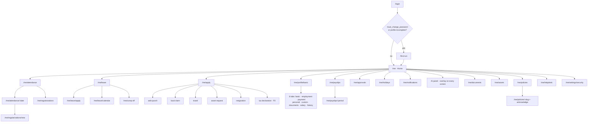
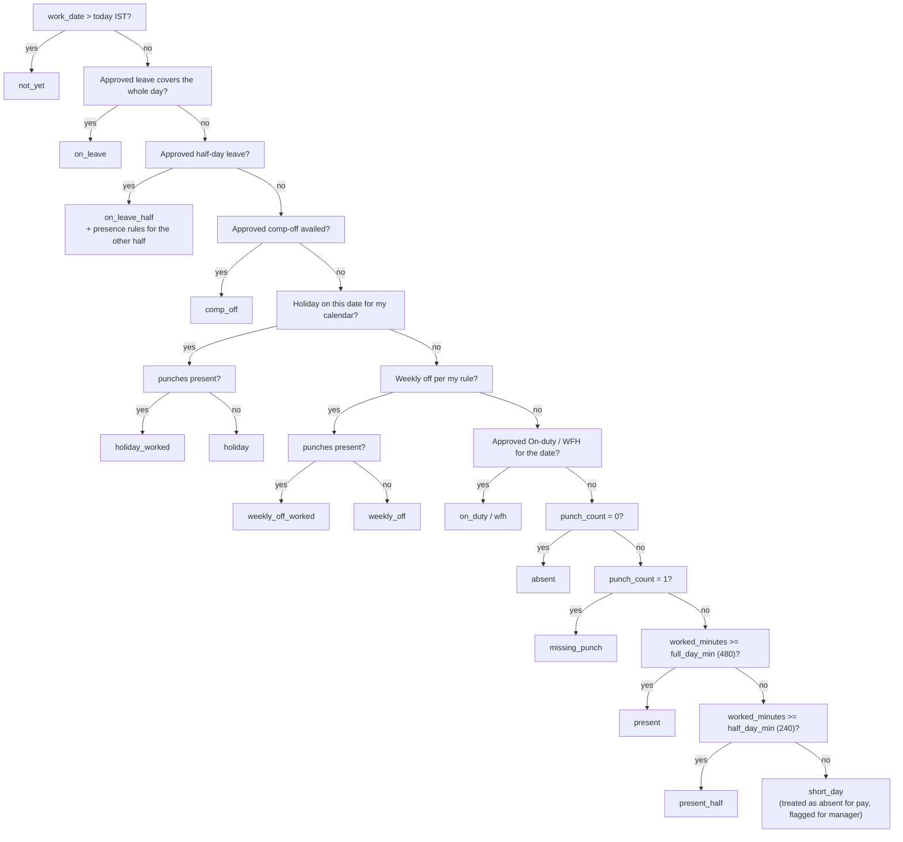
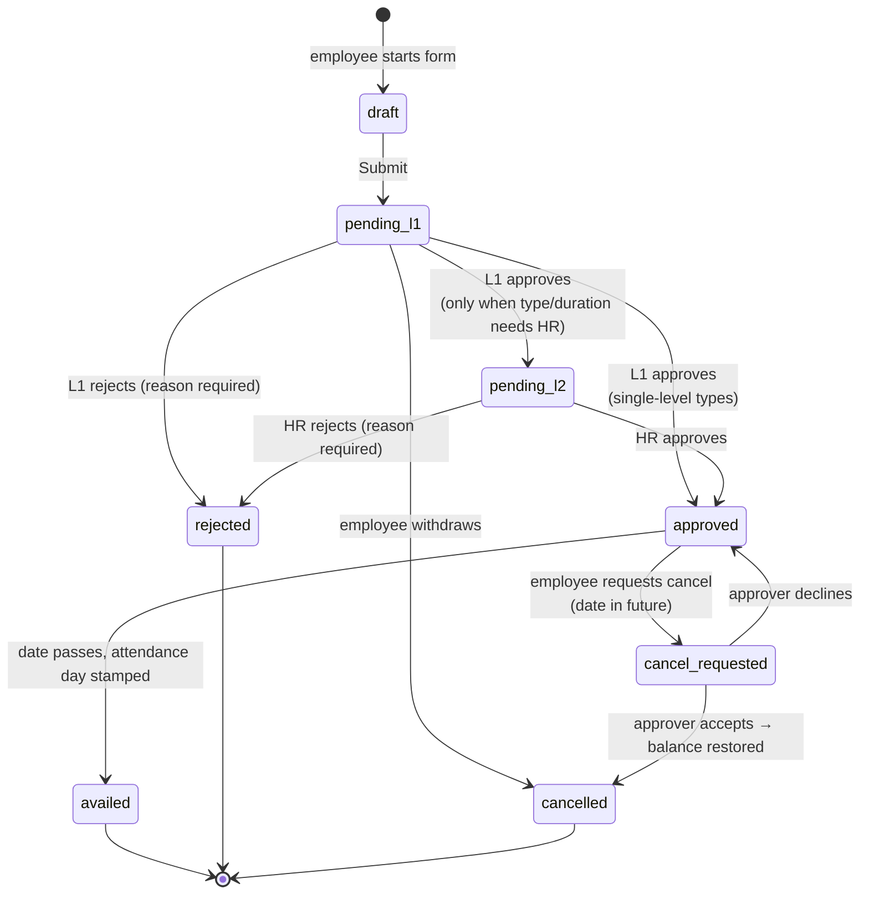
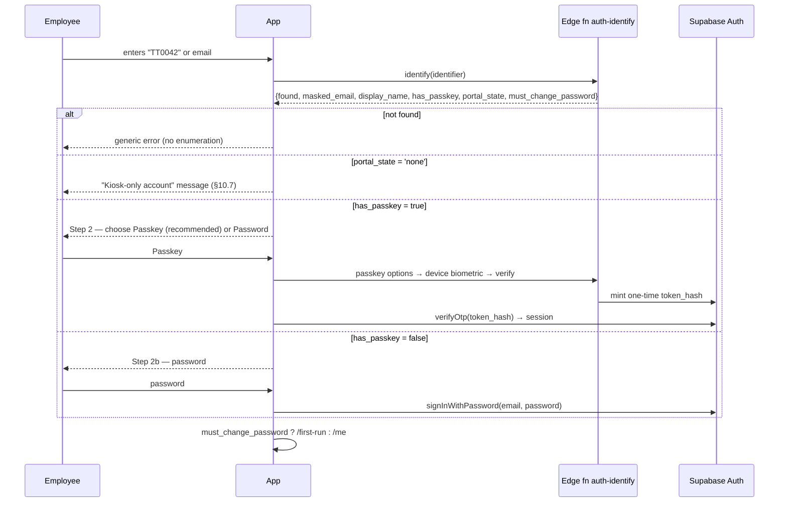
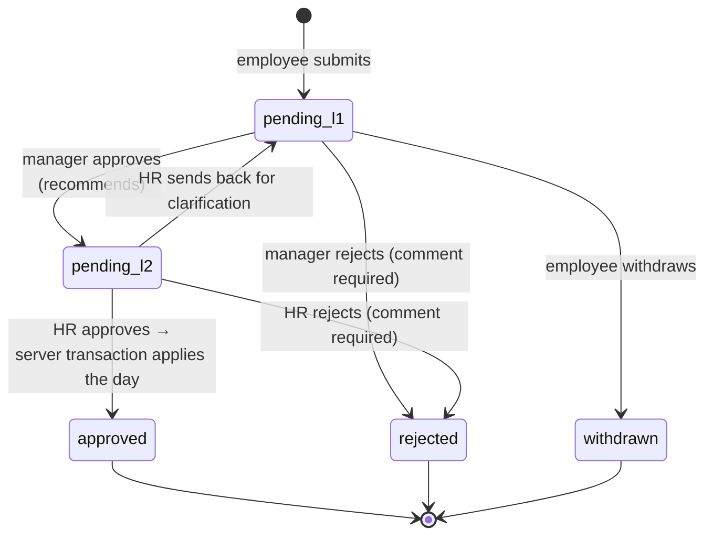
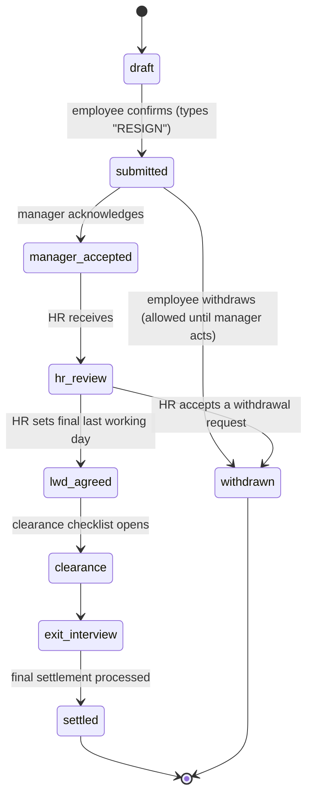

# 01 — Product Requirements: Employee Self-Service

**Product:** Tamarind Tree HRMS · **Legal entity:** Machani Hospitalities LLP (MH LLP, LLPIN AAF-9371) · **Doc owner:** Product · **Status:** Approved for build · **Version:** 1.0 · **Last updated:** 25-Jul-2026 (IST)

> **Purpose.** This document specifies the complete employee-facing surface of the Tamarind Tree HRMS at implementation fidelity: every screen an ordinary employee can reach, every region of every layout, every field with its backing `table.column`, every state (loading / empty / error / partial / no-permission / offline), every action with its validation rules and exact success and failure copy, and every audit event the screen emits. It is written for a venue workforce — banquet, kitchen, housekeeping, security, gardening, sales and admin staff at an 5-acre heritage wedding venue on Kanakapura Road, Bengaluru — where shifts are weekend-heavy, overtime is normal, most people are on an Android phone, and a meaningful number of employees will never log in at all because their attendance is captured for them at the gate kiosk. Where the client's reference product (the 30 screenshots) had a defect, this document states the correct behaviour we implement instead. Where a client instruction was ambiguous, the assumption is stated in §3 and the spec proceeds decisively.

**Sibling documents (cross-referenced by filename throughout):**
`00-master-plan.md` · `02-prd-manager.md` · `03-prd-admin.md` · `04-data-model.md` · `05-attendance-kiosk.md` · `06-ai-agent.md` · `07-design-system.md` · `08-architecture.md` · `09-documents-contracts-comms.md`

---

## Table of contents

| § | Section |
|---|---|
| 1 | [Scope, goals and non-goals](#1-scope-goals-and-non-goals) |
| 2 | [How to read this document](#2-how-to-read-this-document) |
| 3 | [Assumptions requiring client confirmation](#3-assumptions-requiring-client-confirmation) |
| 4 | [Employee personas at Tamarind Tree](#4-employee-personas-at-tamarind-tree) |
| 5 | [Information architecture, routes and navigation](#5-information-architecture-routes-and-navigation) |
| 6 | [Global shell and chrome](#6-global-shell-and-chrome) |
| 7 | [Cross-cutting UI standards](#7-cross-cutting-ui-standards) |
| 8 | [Canonical definitions: the IST day, the pay period, the attendance metrics](#8-canonical-definitions-the-ist-day-the-pay-period-the-attendance-metrics) |
| 9 | [Leave policy specification (Tamarind Tree / MH LLP)](#9-leave-policy-specification-tamarind-tree--mh-llp) |
| 10 | [E-01 · Login, first-run and account recovery](#10-e-01--login-first-run-and-account-recovery) |
| 11 | [E-02 · Home dashboard](#11-e-02--home-dashboard) |
| 12 | [E-03 · My Attendance](#12-e-03--my-attendance) |
| 13 | [E-04 · Regularization / attendance correction](#13-e-04--regularization--attendance-correction) |
| 14 | [E-05 · Leave](#14-e-05--leave) |
| 15 | [E-06 · Comp-off](#15-e-06--comp-off) |
| 16 | [E-07 · My Profile (8 tabs)](#16-e-07--my-profile-8-tabs) |
| 17 | [E-08 · Salary and payslips](#17-e-08--salary-and-payslips) |
| 18 | [E-09 · My Documents](#18-e-09--my-documents) |
| 19 | [E-10 · My Applications launcher](#19-e-10--my-applications-launcher) |
| 20 | [E-11 · My Assets](#20-e-11--my-assets) |
| 21 | [E-12 · Approvals inbox (employee scope)](#21-e-12--approvals-inbox-employee-scope) |
| 22 | [E-13 · Company Policy browser](#22-e-13--company-policy-browser) |
| 23 | [E-14 · Help Desk](#23-e-14--help-desk) |
| 24 | [E-15 · Holiday calendar](#24-e-15--holiday-calendar) |
| 25 | [E-16 · Notifications centre and preferences](#25-e-16--notifications-centre-and-preferences) |
| 26 | [E-17 · AI assistant panel (employee scope)](#26-e-17--ai-assistant-panel-employee-scope) |
| 27 | [E-18 · Security settings](#27-e-18--security-settings) |
| 28 | [Field edit-authority matrix](#28-field-edit-authority-matrix) |
| 29 | [Defect-fix register (what we do instead)](#29-defect-fix-register-what-we-do-instead) |
| 30 | [Mobile-first requirements](#30-mobile-first-requirements) |
| 31 | [Accessibility (WCAG 2.2 AA)](#31-accessibility-wcag-22-aa) |
| 32 | [Internationalisation readiness](#32-internationalisation-readiness) |
| 33 | [Notification matrix](#33-notification-matrix) |
| 34 | [Employee-triggered audit event catalogue](#34-employee-triggered-audit-event-catalogue) |
| 35 | [Non-functional requirements and acceptance gates](#35-non-functional-requirements-and-acceptance-gates) |
| 36 | [Open questions for the client](#36-open-questions-for-the-client) |

---

## 1. Scope, goals and non-goals

### 1.1 What "employee" means here

The Employee persona is the base role. **Every** person in the system — including Managers, Admins and the super_admin — has an employee identity and sees everything in this document about **their own** data. Managers get everything here **plus** the team surface in `02-prd-manager.md`. Admins get everything here **plus** the control plane in `03-prd-admin.md`. There is no separate "my profile" build for admins: the same components render, scoped by Row Level Security to `auth.uid()`.

### 1.2 Goals

| # | Goal | Measured by |
|---|---|---|
| G1 | A banquet steward on a ₹8,000 Android phone can see today's attendance, this month's leave balance and last month's payslip in under 15 seconds on 3G | Time-to-interactive on `/me` ≤ 2.5 s on Moto G-class device / Slow 4G; 3 taps max to each of the three answers |
| G2 | Zero disagreement between any two screens showing the same number | One server-computed period summary row per employee-month; UI never recomputes a KPI (§8.6) |
| G3 | Every employee-visible number is explainable | Every KPI tile has an "How is this calculated?" popover containing the literal formula from §8 |
| G4 | Employees stop walking to the HR desk for routine asks | ≥70 % of leave, regularization, comp-off, payslip and claim requests raised in-app within 90 days of go-live |
| G5 | Nothing an employee does is unrecorded | 1:1 mapping between every mutating action in this doc and a row in `audit_events` (§34) |
| G6 | Kiosk-only staff are first-class, not second-class | Assisted self-service (§10.7) covers 100 % of employee actions with `on_behalf_of` attribution |

### 1.3 Non-goals for the employee app (explicit decisions)

| Excluded | Decision & rationale |
|---|---|
| "Go Social" internal social network (seen in screenshots) | **Dropped from P1.** A 40-person venue does not need a social feed; the engagement need is met by Announcements + Birthdays/Anniversaries on the Home dashboard (§11) and a P2 "Kudos" reaction on announcements. Revisit only above 150 headcount. |
| Employee-side clock-in from the phone as the *default* attendance channel | **Excluded by design.** The client's attendance system of record is the shared gate kiosk (`05-attendance-kiosk.md`). Phone/web punch exists only as an exception, gated by an approved entitlement (§19.2), because self-punch from a personal phone is trivially spoofable. |
| Breaks widget for employees | **Excluded.** The kiosk does not emit break punches; a break metric would be a fabricated zero (exactly the reference product's "Avg: 0 breaks/day" defect). We instead show the *policy break deduction* applied to the day, labelled as such (§8.4). |
| Daily worksheet / timesheet entry | **Excluded from employee scope.** Venue work is shift-based, not project-based. Hours come from punches. (The reference repo's `daily_worksheets` concept is not carried over.) |
| Weekly planning module (reference repo) | **Not carried over.** Built for a software consultancy, irrelevant to banquet operations. |
| Income Tax Saving declaration engine | **Entry point in P1, engine in P2.** §19.6 specifies the launcher tile, the "opens in the payroll window" empty state, and the data contract; the computation lives with the payroll module. |
| Multi-currency | **Excluded.** Single currency INR, single legal entity MH LLP, single primary location. Schema keeps `entity_id` and `location_id` for future group entities (Machani Group has six verticals) but the UI does not expose an entity switcher in P1. |

### 1.4 Release phasing of employee screens

| Phase | Screens |
|---|---|
| **P1 — go-live** | E-01 Login, E-02 Home, E-03 My Attendance, E-04 Regularization, E-05 Leave, E-06 Comp-off, E-07 Profile (all 8 tabs), E-09 My Documents, E-12 Approvals inbox, E-13 Policy browser, E-15 Holiday calendar, E-16 Notifications, E-18 Security |
| **P1.5 — +30 days** | E-08 Salary & payslips (needs one payroll cycle run), E-10 launcher with Web-punch / Local Claim / Asset request, E-11 My Assets, E-14 Help Desk |
| **P2 — +90 days** | E-17 AI assistant (employee scope), E-10 Resignation & Travel Requisition, Income-tax declaration, Kannada/Hindi locales, WhatsApp notification channel, Kudos |

---

## 2. How to read this document

| Convention | Meaning |
|---|---|
| `table.column` | The Supabase (Postgres) source of a displayed value. `04-data-model.md` is the authority on DDL; the names used here are the agreed contract. A `→` means a join (`employees.reporting_manager_id → employees.display_name`). |
| **Computed** | Value derived server-side (SQL view / RPC / Edge Function), never in the browser. The formula is given inline or in §8. |
| Screen IDs `E-nn` | Stable identifiers used in Jira, tests and the other PRDs. |
| Copy in `"double quotes"` | The literal string to ship. British-Indian English. Sentence case for body, Title Case for buttons. |
| `AUDIT: event.code` | An `audit_events` row this action must write. Full catalogue in §34. |
| ⚠︎ FIX | A behaviour that deliberately differs from the screenshotted reference product because the reference is defective. Register in §29. |
| Times | Always IST (Asia/Kolkata) in the UI. Storage is `timestamptz` (UTC) plus a generated IST date/time; see §8.1. |
| Money | INR, Indian digit grouping, two decimals only when non-zero paise exist: `₹2,20,000`, `₹9,163.50`. Never a bare number, never `Rs.`, never scientific notation. |
| Durations | `7h 50m` (never `7.83 hrs`), except explicit averages which render `7h 50m/day`. Zero renders `0h 00m`, never `--` or `0:00` ambiguity. |

---

## 3. Assumptions requiring client confirmation

> **ASSUMPTION CALLOUT — 12 items. Each is implemented as stated; each is a one-line config change if the client differs.**

| # | Assumption | Where it bites | Config switch |
|---|---|---|---|
| A1 | **Pay period = calendar month** (1st 00:00:00 IST → last day 23:59:59.999 IST). The reference product's "01–25" window is an *attendance cutoff for payroll input*, not the period itself. | §8.2, all attendance and payslip screens | `pay_periods.start_day = 1`, `pay_periods.length = calendar_month` |
| A2 | **Payroll attendance cutoff = 25th.** Days 26 → EOM are computed, shown to the employee immediately, and paid as arrears in the following month's payslip. | §8.2, §17 | `payroll_settings.attendance_cutoff_day = 25` |
| A3 | **Standard shift `G` = 09:30–18:30 IST**, 60 min unpaid break, net 8h 00m. Event shifts `E1` 14:00–23:00, `E2` 17:00–02:00 (crosses midnight), security `S1/S2/S3` 8h rotating. | §8.3, §8.4 | `shifts` table |
| A4 | **Weekly off is rule-driven per employee, not fixed Sat/Sun.** Venue events run Fri–Sun; default rule for operations staff is one rotating weekly off (Mon or Tue), and Sat+Sun off applies only to Sales/Admin/Finance. | §8.5, §12 | `weekly_off_rules`, assigned on `employees.weekly_off_rule_id` |
| A5 | **Grace period 10 minutes** on check-in and check-out before late/early is counted. | §8.4 | `shifts.grace_in_minutes / grace_out_minutes` |
| A6 | **Late-deduction policy:** 3 free late instances per calendar month; thereafter every 3 late days deduct 0.5 day of Earned Leave, capped at 2.0 days/month. | §8.4 K11 | `late_policies` |
| A7 | **Overtime is approved, not automatic.** Minutes beyond shift + 30 min are logged as `ot_eligible`; only the manager-approved subset becomes payable `ot_approved`. OT rate 2× basic hourly for statutory compliance (Karnataka S&E Act s.7). | §8.4 K13, §14 | `overtime_policies` |
| A8 | **Comp-off, not OT pay, is the default compensation for working a weekly off or holiday.** Employee (or manager) chooses at the point of the extra-work approval. | §15 | `overtime_policies.default_compensation = 'comp_off'` |
| A9 | **~35 % of headcount will be kiosk-only** (`portal_access_state = 'none'`): no email address, no login. HR performs their self-service actions in Assisted mode. | §10.7 | per-employee flag |
| A10 | **Employee code format `TT` + 4 digits**, e.g. `TT0042`, allocated from a sequence, never reused. Login accepts either the code or the work email. | §10 | `employees.employee_code` |
| A11 | **Statutory framework:** Karnataka Shops & Commercial Establishments Act 1961 + Maternity Benefit Act 1961 (as amended 2017) + Payment of Gratuity Act. EPF and ESIC applicable. Leave entitlements in §9 are set at or above statutory minimums. | §9 | `leave_types` |
| A12 | **No biometric attendance data ever appears in the employee app.** Employees see *that* they were identified at the kiosk and the timestamp, plus the low-resolution capture thumbnail of their own scan; they never see match scores, embeddings or other employees' captures. | §12, §27 | RLS + column grants |

---

## 4. Employee personas at Tamarind Tree

These drive every layout decision below. Headcount split is the working assumption for ~45 staff today, scaling to ~300.

| Persona | Head-count share | Device & literacy | Shift reality | What they open the app for | Design consequence |
|---|---|---|---|---|---|
| **Banquet / F&B steward** ("Ravi") | ~30 % | Shared or entry Android, Kannada/Hindi first, low text confidence | `E1`/`E2` event shifts, Fri–Sun heavy, split shifts on wedding days | "Was my extra work on Saturday counted?", "How many comp-offs do I have?", payslip | Big tiles, icon+number, no dense grids on mobile, Kannada labels (P2), comp-off front and centre |
| **Kitchen / commis** ("Lakshmi") | ~15 % | Often no personal smartphone at work (no phones in kitchen), gloves/wet hands | Early `K1` 07:00–16:00 | Nothing during shift; checks payslip and leave at home | Kiosk is the only in-shift touchpoint; app must work fine on a home device days later; 48 px tap targets |
| **Housekeeping / gardening** ("Muniraju") | ~20 % | Feature-phone or basic Android, may be kiosk-only | 6-day week, one rotating weekly off | Leave balance, salary, holiday list | Assisted self-service via HR; SMS/WhatsApp payslip (P2); printable payslip |
| **Security guard** ("Shivanna") | ~8 % | Basic Android; **also operates the kiosk** | 12h rotating `S1/S2/S3`, night shift crosses midnight | Own attendance; kiosk duty is a *separate* app (`05-attendance-kiosk.md`) | Must never see HR data in kiosk mode; night-shift day-boundary logic must be visibly correct (§8.1) |
| **Sales / events executive** ("Priya") | ~10 % | Own iPhone/Android, English, laptop too | Mon–Sat, off-site client meetings, weekend site visits | Web-punch entitlement, travel requisition, local claim, leave | Web-punch and expense flows are for her; desktop layouts matter |
| **Admin / accounts / stores** ("Anitha") | ~10 % | Desktop-first | `G` shift, Sat+Sun off | Everything; also a Manager or Admin in many cases | Full-width desktop grid layouts, keyboard shortcuts, export |
| **Contract / probation staff** | overlays ~25 % of the above | — | Same as host department | Confirmation date, what leave they've accrued yet | Probation and contract-end badges everywhere; leave rules that differ pre-confirmation must be *shown*, not silently applied |

---

## 5. Information architecture, routes and navigation

### 5.1 Decision: real routes, not tabs

⚠︎ FIX — the reference repo put an entire app inside two mega-pages of shadcn `Tabs`, so nothing was deep-linkable, the browser back button was wrong, and no notification could link to a screen. **Every screen in this document has a real URL** under `/me`, code-split at the route boundary. Notifications, AI answers and QR codes all link to real URLs.

### 5.2 Route table

| Route | Screen | Access | Code-split chunk |
|---|---|---|---|
| `/login` | E-01 Login | public | `auth` |
| `/login/forgot` | E-01.4 Forgot password | public | `auth` |
| `/reset-password` | E-01.5 Set new password (recovery token) | token | `auth` |
| `/first-run` | E-01.3 Forced password change + profile confirm | authenticated, `must_change_password = true` | `auth` |
| `/me` | E-02 Home dashboard | employee | `home` |
| `/me/attendance` | E-03 My Attendance (month view) | employee | `attendance` |
| `/me/attendance/:date` | E-03.6 Day detail / punch timeline (`:date` = `YYYY-MM-DD` IST) | employee | `attendance` |
| `/me/regularizations` | E-04 Regularization list | employee | `attendance` |
| `/me/regularizations/new` | E-04.3 New regularization (query `?date=&type=`) | employee | `attendance` |
| `/me/leave` | E-05 Leave home (balances + history) | employee | `leave` |
| `/me/leave/apply` | E-05.4 Apply for leave | employee | `leave` |
| `/me/leave/calendar` | E-05.6 Leave calendar (team overlap) | employee | `leave` |
| `/me/leave/:id` | E-05.7 Leave request detail | employee, own | `leave` |
| `/me/comp-off` | E-06 Comp-off ledger, earn and avail | employee | `leave` |
| `/me/profile` | redirects to `/me/profile/basic` | employee | `profile` |
| `/me/profile/{basic,employment,payment,personal,custom,documents,salary,history}` | E-07 Profile tabs 1–8 | employee | `profile` |
| `/me/payslips` | E-08 Payslip list + YTD | employee | `pay` |
| `/me/payslips/:period` | E-08.4 Payslip viewer (`:period` = `YYYY-MM`) | employee, own | `pay` |
| `/me/documents` | E-09 My Documents | employee | `docs` |
| `/me/apply` | E-10 Applications launcher | employee | `home` |
| `/me/apply/web-punch` | E-10.2 Web/remote punch entitlement request | employee | `apply` |
| `/me/apply/claim` | E-10.5 Local claim / reimbursement | employee | `apply` |
| `/me/apply/travel` | E-10.4 Travel requisition | employee | `apply` |
| `/me/apply/asset` | E-10.7 Asset request | employee | `apply` |
| `/me/apply/resignation` | E-10.3 Resignation | employee | `apply` |
| `/me/apply/tax` | E-10.6 Income-tax saving declaration (P2 stub) | employee | `apply` |
| `/me/assets` | E-11 My Assets | employee | `assets` |
| `/me/approvals` | E-12 Approvals inbox | employee | `home` |
| `/me/policies` | E-13 Policy browser | employee | `policies` |
| `/me/policies/:slug` | E-13.4 Policy reader + acknowledge | employee | `policies` |
| `/me/helpdesk` | E-14 Help Desk list | employee | `helpdesk` |
| `/me/helpdesk/:id` | E-14.4 Ticket thread | employee, own | `helpdesk` |
| `/me/holidays` | E-15 Holiday calendar | employee | `home` |
| `/me/notifications` | E-16 Notification centre | employee | `home` |
| `/me/settings/notifications` | E-16.5 Preferences | employee | `settings` |
| `/me/settings/security` | E-18 Security settings | employee | `settings` |
| `/me/ask` | E-17 AI assistant, full page | employee, feature-flagged | `ai` |
| `/team/*` | Manager surface | manager | see `02-prd-manager.md` |
| `/admin/*` | Admin console | admin | see `03-prd-admin.md` |
| `/kiosk` | Guard kiosk | kiosk device token | see `05-attendance-kiosk.md` |

### 5.3 Navigation map



### 5.4 Primary navigation, by breakpoint

**Desktop ≥ 1024 px — persistent left rail, 264 px expanded / 72 px collapsed.** Order is by frequency of use for a venue employee, not alphabetical.

| Order | Item | Icon | Route | Badge |
|---|---|---|---|---|
| 1 | Home | house | `/me` | — |
| 2 | My Attendance | clock | `/me/attendance` | red dot if any unresolved `missing_punch` day in current period |
| 3 | Leave | calendar-check | `/me/leave` | count of own pending leave requests |
| 4 | Comp-off | arrow-repeat | `/me/comp-off` | count of credits expiring ≤ 15 days (amber) |
| 5 | Salary | receipt-rupee | `/me/payslips` | dot when a new payslip is published |
| 6 | My Profile | id-badge | `/me/profile/basic` | amber dot if profile completeness < 80 % |
| 7 | Apply | grid | `/me/apply` | — |
| 8 | Approvals | check-circle | `/me/approvals` | count awaiting **my** action |
| 9 | Documents | file-text | `/me/documents` | count of unacknowledged policies + unsigned documents |
| 10 | Assets | laptop | `/me/assets` | count awaiting handover acknowledgement |
| 11 | Policies | shield | `/me/policies` | — |
| 12 | Help Desk | life-buoy | `/me/helpdesk` | count of tickets with an unread HR reply |
| — | *(rail footer)* Holidays, Notifications, Security, Sign out | | | |

Managers see a rail divider then **My Team** (`02-prd-manager.md`); Admins see a second divider then **Admin**. The rail never shows a group the user cannot enter — no disabled teasers.

**Mobile < 768 px — bottom tab bar, exactly 5 slots, 56 px tall + safe-area inset.**

| Slot | Label | Route |
|---|---|---|
| 1 | Home | `/me` |
| 2 | Attendance | `/me/attendance` |
| 3 | Leave | `/me/leave` |
| 4 | Salary | `/me/payslips` |
| 5 | More | opens bottom sheet with the remaining rail items in a 3-column grid, ordered as above |

**Tablet 768–1023 px** — collapsed icon rail (72 px) with tooltips on long-press/hover; no bottom bar.

---

## 6. Global shell and chrome

```
┌──────────────────────────────────────────────────────────────────────────────────────────┐
│ [☰] [TTT mark] Tamarind Tree HRMS   ⌕ Search…            ⏱ 09:05:35 IST  🔔3  [◎ Ravi ▾] │  56px
├────────┬─────────────────────────────────────────────────────────────────────────────────┤
│ RAIL   │  BREADCRUMB / PAGE HEADER  (title · subtitle · page-level actions)               │
│ 264px  │  ─────────────────────────────────────────────────────────────────────────────   │
│        │                                                                                  │
│  …     │  CONTENT — max-width 1440px, 24px gutters, 12-col grid, 24px row gap             │
│        │                                                                                  │
│        │                                                                       ┌────────┐ │
│        │                                                                       │ Ask TT │ │ AI FAB
├────────┴───────────────────────────────────────────────────────────────────────└────────┘─┤
│ Machani Hospitalities LLP · 88 Avalahalli, Kanakapura Rd, Bengaluru 560108 · v1.0.0        │  footer
└──────────────────────────────────────────────────────────────────────────────────────────┘
```

### 6.1 Top bar components

| Component | Spec | Data source | Notes |
|---|---|---|---|
| Rail toggle `☰` | Persists collapsed state in `localStorage.tt_rail` | — | Hidden on mobile |
| Brand lockup | `TTT-1.png` monogram 32 px + wordmark in Unna 18px; links to `/me` | static asset | Wordmark hidden < 480 px |
| Global search | 360 px pill, placeholder `"Search pages, my records, policies or colleagues"`, `⌘K` / `Ctrl K`; results grouped **Pages · My records · Policies & holidays · Directory** | see §6.2 | Debounce 250 ms; min 2 chars |
| Live IST clock | `HH:mm:ss` + fixed suffix `IST`, ticking each second from a single app-level interval; **server-offset corrected** | `Date.now() + serverSkewMs` where skew comes from the `Server-Date` header on app boot | ⚠︎ FIX: the reference showed a bare local clock next to the employee code, which lies if the device clock is wrong. We show `IST` explicitly and correct for skew. Tooltip: `"Venue time (Asia/Kolkata). Your device is 43s behind; we've corrected for it."` when \|skew\| > 30 s |
| Notification bell | Badge = `count(notifications where read_at is null)`, capped display `9+`; opens a 400 px popover, "See all" → `/me/notifications` | `notifications` | Realtime channel `notifications:employee_id` |
| User chip | Avatar 32 px, `employees.display_name`, secondary line `employees.employee_code` + designation. Menu: My Profile · Security · Notification preferences · Language (P2) · Switch to Manager/Admin view (role-gated) · Sign out | `employees` | ⚠︎ FIX: reference concatenated the code and a clock into one string `[SSSRC062] - 09:05:35`; we keep identity and time separate |
| AI FAB | 56 px, bottom-right, `bottom: 88px` on mobile so it clears the tab bar; label "Ask TT" | §26 | ⚠︎ FIX for the reference's chatbot colliding with page buttons: the FAB lives in a dedicated 72 px right-edge safe gutter (`--fab-gutter`) that page layouts reserve; `z-index: 40` below dialogs (50) and toasts (60). Hidden while any dialog or bottom sheet is open. |

### 6.2 Global search scope for an Employee

| Group | Sources | Fields returned | Guardrail |
|---|---|---|---|
| Pages | static route registry | title, breadcrumb | Only routes the role can enter |
| My records | own `leave_requests`, `attendance_regularizations`, `expense_claims`, `travel_requests`, `payslips`, `documents`, `tickets`, `asset_assignments` | type, reference number, date, status | RLS: `employee_id = me` |
| Policies & holidays | `policies` (published), `holidays` (current + next year) | title, category, effective date | Published only |
| Directory | `employees` where `employment_status = 'active'` | `display_name`, `designation`, `department`, `work_email`, `work_phone`, `photo_path` | **Never** salary, DOB, personal contact, address, statutory IDs, attendance. Enforced by the `v_directory` view, not by front-end filtering. |

`AUDIT: search.directory.queried` (query string + result count) — because directory search is a PII surface.

### 6.3 Page header pattern

Every screen renders `<PageHeader>`: icon tile (44 px, brand terracotta wash) · H1 (Unna 24/28) · subtitle (Poppins 14, `--fg-muted`) · right slot for page actions. Subtitles are functional, not decorative — see each screen.

### 6.4 Offline and degraded behaviour

| Condition | Behaviour |
|---|---|
| Offline (`navigator.onLine === false` or fetch fails) | Sticky amber bar under the top bar: `"You're offline. Showing information saved at 09:02 IST. We'll refresh when you reconnect."` Read-only screens serve from the TanStack Query persisted cache (IndexedDB, 7-day TTL). All submit buttons disable with tooltip `"Needs an internet connection."` |
| Slow (> 4 s to first byte) | Skeletons stay; after 8 s show inline `"This is taking longer than usual — still trying."` with a Retry button |
| Session expired (401) | Non-destructive: modal `"You've been signed out for your security. Sign in again to continue — we've kept your unsaved changes."` Draft form state persisted to `sessionStorage` keyed by route |
| Server error (5xx) | Card-level error state with `error_ref` (request id) and copy `"Something went wrong on our side. Reference DA-8F2C1. Try again, or send this reference to HR."` |
| Feature flag off | Rail item hidden; direct URL renders `"This feature isn't switched on yet for Tamarind Tree."` |

---

## 7. Cross-cutting UI standards

### 7.1 Formats — one rule each, no exceptions

⚠︎ FIX for the reference product's mixed formats (`DD-MMM-YYYY`, `MM/DD/YYYY`, `JUN 2026`, `Date_Dt`).

| Kind | Format | Example | Notes |
|---|---|---|---|
| Date | `DD-MMM-YYYY` | `25-Jul-2026` | Month abbreviation Title Case, always 3 letters |
| Date, compact (tiles/chips) | `DD MMM` | `14 Sep` | Only where the year is unambiguous from context |
| Date + weekday | `DD-MMM-YYYY (Sat)` | `25-Jul-2026 (Sat)` | Used in every attendance and leave row — venue staff think in weekdays |
| Month | `MMM-YYYY` | `Jul-2026` | Never `JUL 2026`, never `July 2026`, never `2026-07` |
| Time | `HH:mm` 24-hour | `18:34` | 24-hour avoids AM/PM errors for night shifts. Shift labels may show `09:30–18:30` |
| Timestamp | `DD-MMM-YYYY HH:mm IST` | `25-Jul-2026 09:05 IST` | The `IST` suffix is mandatory on every timestamp |
| Duration | `Hh MMm` | `7h 50m`, `0h 00m` | Never decimal hours in a KPI; decimal allowed only inside chart tooltips with the unit spelled: `7.83 hours` |
| Money | `₹` + Indian grouping | `₹2,20,000`, `₹9,163.50` | `Intl.NumberFormat('en-IN', {style:'currency', currency:'INR', maximumFractionDigits: paise?2:0})`. Right-aligned in tables, tabular-nums |
| Percentage | 1 dp for distributions, 2 dp for rates | `28.0 %`, `+10.00 %` | Thin space before `%`. Always clamped to a sane domain (§8.7) |
| Days count | 1 dp only when fractional | `16 days`, `16.5 days` | |
| Long numeric IDs (PF, UAN, Aadhaar, account no.) | **String, monospace, never numeric** | `10202010619900` | ⚠︎ FIX for `1.0202E+11`. Column type is `text`; any import path must coerce with `::text` and reject `E` notation |
| Empty value | `—` (em dash), `--` never used | `—` | Distinct from `0`. Sentinel dates (`01-Jan-3000`) are forbidden; open-ended = `NULL` → rendered `"No expiry"` ⚠︎ FIX |
| Internal codes | Never shown bare | `General shift (09:30–18:30)` not `G`; `Monthly, 1st–31st` not `PP001`; `Standard late policy` not `None1` | ⚠︎ FIX. Code may appear in a muted trailing chip for HR: `General shift (09:30–18:30) · G` |

### 7.2 States — every data surface implements all seven

| State | Rule | Copy pattern |
|---|---|---|
| **Loading** | Skeleton matching final geometry (never a spinner over content). KPI tiles show shimmer rectangles at the exact tile size. Max 3 skeleton rows for tables. | — |
| **Empty (no data yet)** | Illustration (line-art tamarind leaf motif, 96 px), bold headline, one-sentence explanation, primary CTA when an action exists | `"No leave applied yet"` / `"When you apply for leave it will show up here."` / `[Apply for leave]` |
| **Empty (filtered to nothing)** | Different from above — must offer to clear filters | `"No records match these filters"` / `"Try a wider date range or clear the filters."` / `[Clear filters]` ⚠︎ FIX: reference used one generic "No records found" for both cases and gave no guidance at all on the Policy screen |
| **Partial** | Render what loaded; failed regions get an inline retry card. Never block the page on one widget | `"Couldn't load your comp-off balance."` `[Retry]` |
| **Error** | Card-scoped, with request reference | see §6.4 |
| **No permission** | Explain and route, never a bare 403 | `"This is only visible to HR. If you think you should see it, raise a Help Desk ticket."` `[Open Help Desk]` |
| **Locked / frozen** | Period locked after payroll close, or record locked by admin | `"July 2026 attendance was finalised on 26-Jul-2026 and can no longer be changed here. Raise a Help Desk ticket if something's wrong."` |

### 7.3 Data grid standard (`<DataGrid>`)

Used everywhere the reference used its enterprise grid. Single component, single behaviour.

| Capability | Spec |
|---|---|
| Header | Sortable columns show a sort affordance on hover/focus and a persistent one when active; filterable columns show a funnel that opens a type-aware popover (text contains / date range / enum multi-select / numeric range). Active filters render as removable chips above the grid |
| Search | One debounced (250 ms) free-text box, searches the columns declared `searchable` |
| Toolbar | Refresh · Export (CSV + XLSX; **PDF only where the artefact is a document**) · Column chooser (persisted per user per grid in `user_grid_prefs`) · Density toggle (comfortable/compact) |
| Paginator | `Rows per page: 10` (default 10, not 5 ⚠︎ FIX — 5 forced needless paging), options 10/25/50/100; range text `"1–10 of 47"`; first/prev/next/last |
| Row actions | Max 2 inline icon buttons + overflow menu. Every icon button has an `aria-label` and a tooltip |
| Mobile < 768 px | **Grid becomes a card list.** Each row renders as a card with a title line, 2–4 label:value pairs, a status chip and the actions row. No horizontal scrolling of tables on phones, ever |
| Export | Includes the *visible, filtered, sorted* set; filename `TT_<grid>_<employeecode>_<YYYYMMDD-HHmm>.csv`; every export writes `AUDIT: export.performed` with grid, row count, filters |
| Sticky | Header row sticky; first column sticky on horizontal scroll at ≥ 768 px |
| Zebra | Off. Row separators only (1 px `--border`). Zebra + our warm palette reads muddy |

### 7.4 Status chip vocabulary — one palette across the whole product

| Status | Token | Colour | Used by |
|---|---|---|---|
| Draft | `neutral` | slate 100 / slate 700 | claims, resignation |
| Pending / Awaiting L1 | `info` | `#EAF1F7` / `#1F4E79` | all requests |
| Awaiting L2 / With HR | `info-strong` | `#DDE7F2` / `#12305A` | regularizations, resignation |
| Approved | `success` | `#E8F3EC` / `#1F6B3B` | all |
| Rejected | `danger` | `#FBEAE7` / `#9B2C1B` | all |
| Cancelled / Withdrawn | `neutral-muted` | slate 50 / slate 500 | leave, claims |
| Expired / Lapsed | `warning` | `#FDF3E3` / `#8A5B12` | comp-off credits, documents |
| Action needed (you) | `attention` | `#F6ECE6` / `#8C4A28` (brand) | approvals inbox, policy ack |
| Present | `success` | as above | attendance |
| Absent | `danger` | as above | attendance |
| Weekly off | `neutral` | as above | attendance |
| Holiday | `accent` | `#F5EFE4` / `#7A6236` (gold) | attendance |
| On leave | `info` | as above | attendance |
| Half day | `success-soft` | `#F0F7F2` / `#2E7D51` | attendance |
| Missing punch | `warning` | as above | attendance |
| Not yet | `neutral-faint` | slate 25 / slate 400 | attendance (future dates) |

Chips carry both colour **and** a text label (never colour alone) and an icon in the two most consequential cases (Absent ✕, Missing punch ⚠).

### 7.5 Form standards

- Labels above inputs, always visible (no placeholder-as-label). Placeholders show format examples: `"e.g. 25-Jul-2026"`.
- Required fields marked with `*` and `aria-required`; **optional** fields marked "(optional)" when a form is mostly required.
- Validation: on blur for format, on submit for cross-field. Errors appear below the field, prefixed with the field name for screen readers, and the first error receives focus.
- Destructive or irreversible actions require a typed or explicit confirm (`AlertDialog`), never a bare button.
- Every form that can take > 30 s to fill autosaves a draft to `localStorage` every 5 s keyed `tt_draft_<route>`; on return: `"We kept your unfinished request from 14:22 IST."` `[Continue] [Start fresh]`.
- Submit buttons show an inline spinner and become `"Submitting…"`; the form is disabled but visible (never replaced by a spinner).
- Double-submit protection: an idempotency key (UUID v4 generated at form mount) is sent with every mutation; the server rejects a repeat with `409` and the UI treats it as success.

### 7.6 PII masking standard

| Field | Stored | Default display | Reveal | Step-up auth | Auto-hide |
|---|---|---|---|---|---|
| Aadhaar (`employee_statutory.aadhaar_number_enc`) | encrypted at rest (pgsodium), last 4 in `aadhaar_last4` | `XXXX XXXX 0484` | own record only | **Yes** — password or passkey | 30 s |
| PAN (`employee_statutory.pan`) | text | `••••••594B` | own record | No | 30 s |
| UAN, PF number, ESIC | text | last 4 visible | own record | No | 30 s |
| Bank account (`employee_bank_accounts.account_number_enc`) | encrypted, `account_last4` | `••••••9780` | own record | **Yes** | 30 s |
| IFSC, bank, branch, beneficiary name | text | full | — | — | — |
| Salary amounts | numeric | `₹•,••,•••` masked | `Show` toggle, session-scoped | No | on navigation away |
| Date of birth | date | full to self | — | — | — |
| Personal mobile / personal email | text | full to self; **masked in Directory to everyone else** | — | — | — |
| Face capture thumbnails | private bucket | own captures only, signed URL 60 s | — | — | — |
| Face embeddings, match scores, liveness scores | `face_templates`, `attendance_events` | **never exposed to employee role** (column-level revoke) | — | — | — |

Every reveal writes `AUDIT: pii.revealed` with `field_name`, `entity`, `entity_id`. Copy-to-clipboard of a revealed value writes `AUDIT: pii.copied`. The reveal control is labelled `"Reveal"` with helper text `"Revealing is recorded in the audit log."` — visible honesty is the deterrent.

### 7.7 Toast / feedback copy rules

| Result | Pattern | Example |
|---|---|---|
| Success | Past tense, states the consequence and who acts next | `"Leave applied. Sent to Priya Nair for approval."` |
| Success with side effect | Adds the effect | `"Regularization submitted. Your manager and HR have been notified."` |
| Blocked by rule | States the rule and the number | `"You have 1.5 days of Casual Leave left — this request needs 3."` |
| Server failure | States what to do | `"We couldn't save that. Try again in a moment. (Ref DA-8F2C1)"` |
| Partial | Names what did and didn't happen | `"Request saved, but we couldn't email your manager. HR has been notified."` |

Toasts: max 2 stacked, 5 s auto-dismiss for success, **sticky with dismiss** for errors, `role="status"` / `role="alert"` respectively. Never the only channel for a consequential outcome — the underlying list also updates.

---

## 8. Canonical definitions: the IST day, the pay period, the attendance metrics

This section is normative. Every screen, chart, export, payslip and AI answer reads these definitions from one server-side implementation. `05-attendance-kiosk.md` implements the punch → day rollup; `04-data-model.md` holds the DDL.

### 8.1 The IST day

- All punches arrive as `attendance_events.event_ts` (`timestamptz`, UTC). A **generated** column `event_date_ist date GENERATED ALWAYS AS ((event_ts AT TIME ZONE 'Asia/Kolkata')::date) STORED` is the only date used for bucketing. ⚠︎ FIX: the reference used the browser's `toISOString().split('T')[0]` — the **UTC** date — so any punch between 00:00 and 05:29 IST landed on the previous day.
- **Day boundary:** 00:00:00.000 → 23:59:59.999 IST.
- **First scan of the IST day = check-in. Last scan of the IST day = check-out.** Multiple scans allowed; everything between first and last is a `mid` punch and is displayed but does not change the in/out pair.
- **Night-shift exception (mandatory, security staff):** if the employee's assigned shift has `crosses_midnight = true`, the day's window is `shift_start − 4h` to `shift_start + 20h`, and the day is stamped with the **shift start date**. So a guard on `S3` 22:00–06:00 who scans at 21:52 on 25-Jul and 06:04 on 26-Jul produces **one** attendance day dated 25-Jul with `worked_minutes = 492`. The employee UI labels it `"25-Jul-2026 (Sat) · Night shift · out 26-Jul 06:04"`.
- A single scan on a day → `punch_count = 1`, `last_out = NULL`, `day_status = 'missing_punch'`. It is **not** an absence and **not** a full day. See K1.
- Duplicate suppression: two events for the same employee within `120 s` collapse; the later is stored with `is_duplicate = true` and is shown in the punch timeline greyed with tooltip `"Duplicate scan, ignored"`.

### 8.2 The pay period (and the 1–25 defect)

⚠︎ **FIX — the single most confusing thing in the reference product.** Its dashboard said `PAY PERIOD 01-25(Jul)` and `TOTAL DAYS 25`, then its detail modal said `Attendance Period 01-Jul-2026-25-Jul-2026` with `Weekly Offs 8` where the dashboard said `7`, and `Paid Days 16` where the dashboard said `15`. Two windows and two calculators were in play. We fix it structurally:

| Concept | Definition | Where shown |
|---|---|---|
| **Attendance month** | Calendar month, `01-MMM-YYYY` → last day, IST. `total_days` = real day count (28/29/30/31 — **never** 25). | The only period selector on E-03 |
| **Elapsed days** | Dates in the month that are `≤ today (IST)`. All percentages and all "of N" denominators use this. | E-03 KPI subtitles |
| **Payroll cutoff date** | `payroll_settings.attendance_cutoff_day` = 25. Days 1–25 are finalised into this month's payslip. | E-03 banner + E-08 |
| **Arrear window** | Days 26 → EOM. Computed and visible immediately, paid in next month's payslip as `Attendance arrears — Jul 2026`. | E-03 banner + payslip line |
| **Locked** | After payroll approval for the month, days 1–25 become `locked_at IS NOT NULL`; regularizations for locked days route to Help Desk instead. | E-03 rows show a lock icon |

The E-03 banner reads, literally:

> `"July 2026 · 01-Jul-2026 to 31-Jul-2026 · 31 days"`
> `"Days 1–25 are included in your July payslip. Work from 26-Jul to 31-Jul is paid with your August payslip as arrears."`

There is exactly **one** period selector on the screen and exactly **one** computed summary row behind every number on it (§8.6).

### 8.3 Shifts

| Code | Name (displayed) | Window IST | Break | Net paid | Crosses midnight | Grace in/out | Typical department |
|---|---|---|---|---|---|---|---|
| `G` | General shift | 09:30–18:30 | 60 m | 8h 00m | no | 10 / 10 | Sales, Admin, Accounts |
| `K1` | Kitchen morning | 07:00–16:00 | 60 m | 8h 00m | no | 10 / 10 | Kitchen |
| `K2` | Kitchen evening | 13:00–22:00 | 60 m | 8h 00m | no | 10 / 10 | Kitchen |
| `E1` | Event afternoon | 14:00–23:00 | 45 m | 8h 15m | no | 15 / 15 | Banquet, F&B |
| `E2` | Event night | 17:00–02:00 | 45 m | 8h 15m | **yes** | 15 / 15 | Banquet, F&B |
| `H1` | Housekeeping day | 08:00–17:00 | 60 m | 8h 00m | no | 10 / 10 | Housekeeping, Gardening |
| `S1` | Security morning | 06:00–14:00 | 30 m | 7h 30m | no | 5 / 5 | Security |
| `S2` | Security afternoon | 14:00–22:00 | 30 m | 7h 30m | no | 5 / 5 | Security |
| `S3` | Security night | 22:00–06:00 | 30 m | 7h 30m | **yes** | 5 / 5 | Security |
| `SPL` | Event special (long) | set per event | 60 m | per event | maybe | 15 / 15 | Assigned ad hoc by admin |

Shift for a date comes from `shift_assignments` (date-specific roster, authoritative) falling back to `employees.shift_id` (default). The employee sees the shift name and window on every attendance row and in the day detail. ⚠︎ FIX: never the bare code `G`.

### 8.4 Per-day computed fields (`attendance_days`)

Computed by the rollup function `fn_rollup_attendance_day(employee_id, work_date)` on every punch, every roster change, every leave/holiday change, and nightly at 02:15 IST for the trailing 45 days. `computed_version` is stamped so a formula change can be traced and back-filled.

| # | Field | Formula | Notes |
|---|---|---|---|
| D1 | `first_in_ts` | `MIN(event_ts)` over non-duplicate events in the day window | NULL if none |
| D2 | `last_out_ts` | `MAX(event_ts)` over the same set, **only if `punch_count ≥ 2`** | NULL when 1 punch |
| D3 | `punch_count` | count of non-duplicate events | |
| D4 | `gross_minutes` | `(last_out_ts − first_in_ts)/60` | 0 when `last_out_ts` NULL |
| D5 | `break_minutes_applied` | `shift.break_minutes` if `gross_minutes ≥ shift.break_deduct_threshold` (default 300) else `0` | Policy deduction, **not** measured breaks. Displayed as `"Break deducted per shift policy: 60m"` |
| D6 | `worked_minutes` | `MAX(0, gross_minutes − break_minutes_applied)` | |
| D7 | `late_minutes` | `MAX(0, first_in_ts − (shift_start + grace_in))` in minutes; `0` if the day is weekly off / holiday / full-day leave / on-duty | |
| D8 | `early_out_minutes` | `MAX(0, (shift_end − grace_out) − last_out_ts)`; `0` when `last_out_ts` NULL (that's a missing punch, not an early exit) | |
| D9 | `ot_eligible_minutes` | `MAX(0, worked_minutes − shift.net_paid_minutes − ot_grace(30))` on a working day | |
| D10 | `extra_work_minutes` | `worked_minutes` when the date is a weekly off or holiday and `worked_minutes ≥ 240` | Source of comp-off credit |
| D11 | `ot_approved_minutes` | Sum of `overtime_approvals.approved_minutes` for the day | 0 until a manager approves |
| D12 | `day_status` | precedence ladder below | Exactly one value |
| D13 | `paid_ratio` | table below | `numeric(3,2)` ∈ {0, 0.50, 1.00} |
| D14 | `source_flags` | array of distinct `attendance_events.source` for the day: `kiosk_face`, `kiosk_fingerprint`, `web`, `mobile_geo`, `manual_admin`, `regularized`, `import` | Shown as icons on the row |

**`day_status` precedence ladder** (first match wins — this is what makes every bucket mutually exclusive):



**`paid_ratio` by status:**

| `day_status` | `paid_ratio` | Counts toward "Attended" | Donut bucket |
|---|---|---|---|
| `present` | 1.00 | 1.0 | Attended |
| `present_half` | 0.50 | 0.5 | Attended (0.5) + Absents (0.5) |
| `wfh`, `on_duty` | 1.00 | 1.0 | Attended |
| `holiday_worked`, `weekly_off_worked` | 1.00 | 0 (already paid as an off) | Extra working |
| `holiday` | 1.00 | 0 | Holidays |
| `weekly_off` | 1.00 | 0 | Weekly offs |
| `on_leave` (paid type) | 1.00 | 0 | Leaves |
| `on_leave` (LOP type) | 0.00 | 0 | Leaves (unpaid) |
| `on_leave_half` (paid) | 0.50 + presence half | 0.5 | Leaves (0.5) + Attended (0.5) |
| `comp_off` | 1.00 | 0 | Comp-off |
| `missing_punch` | 0.00 **provisional** | 0 | Absents (flagged) |
| `short_day` | 0.00 | 0 | Absents |
| `absent` | 0.00 | 0 | Absents |
| `not_yet` | — | — | **excluded** |

`missing_punch` is shown to the employee as `"Missing check-out — regularize by 31-Jul"` with a direct CTA, and is treated as `0.00` only if unresolved at payroll cutoff. Before cutoff the employee's Paid Days tile shows it in an amber "at risk" sub-line: `"1 day at risk — a missing punch needs regularizing"`.

### 8.5 Weekly off rules

`weekly_off_rules`: `first_off_dow`, `first_off_weeks int[]`, `second_off_dow`, `second_off_weeks int[]`, `is_rotational`, `rotation_anchor_date`. Week-of-month = `CEIL(day_of_month / 7)` giving 1–5 (the Indian alternate-Saturday convention the reference exposed as `Weeks 1,2,3,4,5`).

| Rule | Displayed name | Applies to |
|---|---|---|
| `R-SATSUN` | "Saturday & Sunday off (all weeks)" | Sales, Admin, Accounts, Finance |
| `R-MON` | "Monday off (all weeks)" | Banquet, F&B, Housekeeping — because Fri–Sun are event days |
| `R-TUE` | "Tuesday off (all weeks)" | Kitchen, Gardening |
| `R-ALT-SAT` | "Sunday off + 2nd & 4th Saturday off" | Stores, Maintenance |
| `R-ROT` | "One rotating day off per week (as rostered)" | Security — the actual day comes from `shift_assignments.is_weekly_off` |

The employee sees their rule in plain language on E-07 Employment tab and as a chip on E-03: `"Your weekly off: Monday (every week)"`.

### 8.6 The one summary row (`v_attendance_period_summary`)

A single SQL view / RPC returns one row per `(employee_id, period_month)`. **Every** employee KPI, the donut, the AI agent, the export and the payslip read this row. No client-side aggregation of attendance is permitted anywhere in the codebase — enforced by a lint rule banning attendance reducers in `src/` and by a contract test that renders E-03 and E-08 from the same fixture and asserts identical numbers. ⚠︎ FIX for the dashboard-vs-modal disagreement.

Returned columns: `total_days, elapsed_days, remaining_days, attended_days, weekly_off_days, holiday_days, leave_days, leave_days_unpaid, comp_off_days, extra_working_days, absent_days, missing_punch_days, paid_days, at_risk_days, worked_minutes_total, worked_days_count, avg_worked_minutes_per_worked_day, late_minutes_total, late_days, early_out_minutes_total, early_days, extra_work_minutes_total, ot_eligible_minutes_total, ot_approved_minutes_total, late_deduction_days, attendance_percent, computed_at, computed_version`.

**Invariant (asserted in the view, tested in CI):**
`attended_days + weekly_off_days + holiday_days + leave_days + comp_off_days + extra_working_days + absent_days = elapsed_days` (exactly, with halves adding to whole numbers).

### 8.7 The KPI catalogue — every employee-visible attendance metric

| # | Tile label (exact) | Formula | Display | Guardrail |
|---|---|---|---|---|
| K1 | **Attended** | `Σ(1 for present/wfh/on_duty) + Σ(0.5 for present_half) + Σ(0.5 for on_leave_half worked half)` | `7 days` / `7.5 days` | ≤ elapsed |
| K2 | **Weekly offs** | `COUNT(day_status='weekly_off')` | `7 days` | Excludes weekly offs you worked (those are Extra working) — the reason the reference showed 7 in one place and 8 in another |
| K3 | **Holidays** | `COUNT(day_status='holiday')` | `1 day` | Excludes worked holidays |
| K4 | **Leaves** | `COUNT(on_leave) + 0.5×COUNT(on_leave_half)`, with an unpaid sub-line | `1 day` + `"of which 0 unpaid"` | |
| K5 | **Comp-off availed** | `COUNT(day_status='comp_off')` | `0 days` | |
| K6 | **Extra working** | `COUNT(holiday_worked) + COUNT(weekly_off_worked)` | `2 days` | New bucket; reference had no home for these |
| K7 | **Absents** | `COUNT(absent) + COUNT(short_day) + COUNT(missing_punch unresolved) + 0.5×COUNT(present_half)` | `2 days` | **Future dates never counted.** ⚠︎ FIX: the reference showed `Absents 10 (40 %)` on 25-Jul for a month in progress, because it counted unmarked future days as absent |
| K8 | **Paid days** | `Σ paid_ratio over elapsed days` | `16.0 of 25 elapsed` | Always states the denominator ⚠︎ FIX |
| K9 | **Late hours** | `late_minutes_total` | `1h 20m` | |
| K10 | **Late days** | `late_days` | `3 days` | |
| K11 | **Late-deduction leaves** | `chargeable = MAX(0, late_days − free_lates(3))`; `deduction = MIN(FLOOR(chargeable/3) × 0.5, cap(2.0))` | `0.5 day` | Popover shows the arithmetic with the employee's actual numbers |
| K12 | **Early-going hours** | `early_out_minutes_total` | `0h 25m` | |
| K13 | **Early-going days** | `early_days` | `1 day` | |
| K14 | **Extra working hours** | `extra_work_minutes_total` | `9h 10m` | Hours worked on offs/holidays |
| K15 | **Overtime hours (approved)** | `ot_approved_minutes_total`, with sub-line `"+2h 10m awaiting approval"` from `ot_eligible − ot_approved` | `6h 00m` | ⚠︎ FIX: never show `0:00` when eligible OT exists but is unapproved — that reads as a bug to the employee |
| K16 | **Average hours worked** | `worked_minutes_total / worked_days_count` | `7h 50m per worked day (137h 05m over 17 days)` | ⚠︎ FIX for the reference's `Avg: 0Hrs` while plotting 9h days, and for its numerator/denominator flip (`133/17` meaning total hours in one widget and average hours in another). **Rule: every ratio in this product names its numerator and denominator in words.** |
| K17 | **Attendance %** | `ROUND(paid_days / elapsed_days × 100, 1)`, clamped to `[0, 100]` | `64.0 %` | ⚠︎ FIX for `1,700.00 %`. A CI test asserts no percentage in the product can exceed its logical maximum; the clamp also logs a `data_quality` warning to the admin console if it ever engages |
| K18 | **Days remaining in month** | `total_days − elapsed_days` | `6 days` | Explains why buckets don't add to 31 |

**Donut percentage rule:** each slice's percent = `slice_days / elapsed_days × 100`, rounded to 1 dp using **largest-remainder** so the printed values sum to exactly `100.0 %`. Centre label = `elapsed_days`, with a small caption `"of 31 days"`. ⚠︎ FIX: the reference put `25 Total` in the centre while the month had 31 days and the visible percentages were computed against a shifting base.

---

## 9. Leave policy specification (Tamarind Tree / MH LLP)

Authored here because the employee screens are meaningless without it; `03-prd-admin.md` specifies the admin editors for the same tables.

### 9.1 Leave types (`leave_types`)

| Code | Name (displayed) | Annual entitlement | Accrual | Unit | Carry-forward | Encashment | Eligibility | Notice / rules | Docs |
|---|---|---|---|---|---|---|---|---|---|
| `EL` | Earned Leave | 18.0 days | 1.5 days credited on the 1st of each month; pro-rata in the joining month (`ROUND(1.5 × remaining_days/days_in_month, 1)`); accrues during probation but **availing** needs confirmation | day / half-day | up to **30.0** days; excess lapses on 31-Dec with a 15-Dec warning notification | at exit for full balance; annual encashment window in March for balance above 24.0 days | all permanent staff | ≥ 7 days notice for ≥ 3 consecutive days; max 15 consecutive | — |
| `CL` | Casual Leave | 12.0 days | 1.0 day on the 1st of each month, pro-rata on join | day / half-day | none — lapses 31-Dec | no | all staff incl. probation | ≥ 1 day notice; **max 3 consecutive days**; cannot be clubbed with EL | — |
| `SL` | Sick Leave | 12.0 days | 6.0 on 01-Jan + 6.0 on 01-Jul (pro-rata on join) | day / half-day | up to 12.0 days | no | all staff incl. probation | may be applied retrospectively up to 3 days | Medical certificate mandatory for > 2 consecutive days; upload required before approval |
| `COFF` | Compensatory Off | earned, not granted | 1 credit per qualifying extra-work day (§15) | day / half-day | n/a — each credit expires 60 days after it is earned | no | all staff | must be availed FIFO; max 8 live credits | — |
| `ML` | Maternity Leave | 26 weeks (first two children); 12 weeks (third onward); 6 weeks on miscarriage/MTP; 2 weeks on tubectomy; 12 weeks for commissioning/adopting mother | statutory, not accrued | week | n/a | n/a | female employees with ≥ 80 days service in the preceding 12 months (Maternity Benefit Act 1961 as amended 2017) | apply ≥ 8 weeks before expected date where possible; up to 8 weeks may be taken pre-delivery | Medical certificate / Form; HR-verified |
| `PL` | Paternity Leave | 10.0 days | company benefit, per event | day | n/a | no | male employees, ≤ 2 events | must be availed within 90 days of birth; may be split into max 2 blocks | Birth certificate within 30 days |
| `BL` | Bereavement Leave | 5.0 days per event | per event | day | n/a | no | all staff | immediate family (spouse, child, parent, sibling, parent-in-law); retrospective allowed | — |
| `MRL` | Marriage Leave | 5.0 days, once in tenure | one-time | day | n/a | no | after 12 months service | ≥ 30 days notice | Invitation or certificate |
| `LOP` | Loss of Pay | unlimited | n/a | day / half-day | n/a | n/a | all | used automatically when a paid balance is exhausted, or chosen deliberately | — |
| `OD` | On Duty | n/a | n/a | day / half-day | n/a | n/a | all | not a leave — marks off-site work as present (§13) | Purpose + location mandatory |
| `RH` | Optional Holiday | **2 elections per calendar year** from the optional-holiday list | n/a | day | no | no | all | elect by 31-Jan or ≥ 7 days before the date | — |
| `PERM` | Short Permission | **2 per calendar month, max 2h each** | n/a | hour | no | no | all | apply before or same day; deducted from EL only if exceeded | Reason mandatory |

### 9.2 Hospitality-specific rules (decisions)

| Rule | Specification | Rationale |
|---|---|---|
| **Event blackout windows** | `leave_blackout_windows(start_date, end_date, label, department_ids[], severity)`. `severity='warn'` shows a warning and requires Admin (not just manager) approval; `severity='block'` prevents submission with copy `"12-Dec-2026 to 14-Dec-2026 is a confirmed event blackout for Banquet. Only HR can approve leave in this window — raise it through Help Desk with your reason."` | A 1,000-guest wedding cannot lose its banquet team |
| **Peak-season default blackout (warn)** | 15-Nov → 15-Feb and 15-Apr → 15-Jun for Banquet, F&B, Kitchen, Housekeeping, Security | Bangalore wedding seasons |
| **Department concurrency guard** | If approving would put > 20 % of the department's active headcount on leave that date, the employee sees an amber notice at apply time: `"3 of 12 people in Banquet are already off on 18-Aug. Your manager may ask you to change dates."` Manager sees a hard warning (see `02-prd-manager.md`) | Prevents shift collapse |
| **Weekend definition** | Leave applied over a date that is the employee's weekly off does **not** consume balance; the day is skipped and the UI states `"18-Aug is your weekly off — it won't be deducted."` | Fairness for Mon-off staff |
| **Holiday inside leave** | Same treatment: skipped, not deducted, stated |
| **Sandwich rule** | **Not applied.** Decision: we do not charge intervening weekly offs/holidays between two leave days. Rationale: it is contested under Karnataka S&E, it is a top employee-relations irritant, and the concurrency guard already protects operations. `leave_types.sandwich_rule = false` exists for future policy change |
| **Retrospective limit** | CL/EL: 0 days back (must be applied on or before the date). SL/BL: 3 days back. Beyond that, Regularization or Help Desk | |
| **Probation** | EL accrues but cannot be availed before `confirmation_date`; CL and SL are available from day 1. The Leave screen shows EL as `"1.5 days accrued · available from 26-Mar-2027 (on confirmation)"` — visible, not silently blocked | |
| **Contract staff** | `employment_type IN ('contract','apprentice')`: CL 6, SL 6, no EL, no encashment. Shown with a note: `"Your leave entitlement follows your contract terms."` | |
| **Notice-period leave** | During notice period, only SL and LOP are permitted; EL/CL are blocked with `"Earned and Casual Leave can't be availed during your notice period. Your EL balance will be paid out in your final settlement."` | |
| **Half-day definition** | First half = shift start → shift midpoint; second half = midpoint → shift end. Midpoint computed from the assigned shift, so `E1` (14:00–23:00) halves at 18:30 | |
| **Year** | Leave year = calendar year, 01-Jan → 31-Dec | |

### 9.3 Leave request state machine



**Two-level rule:** L1 = reporting manager for all types. L2 = HR/Admin additionally required when any of: `leave_type IN ('ML','PL','MRL','LOP')`, or `days_count > 5`, or the request touches a blackout window, or it is retrospective, or the balance goes negative (LOP conversion). Everything else is single-level. Both levels are recorded on the request row with actor, timestamp and comment.

**Balance is reserved, not deducted, at submission.** `leave_balances.reserved` increments on submit, moves to `availed` on approval, releases on reject/cancel. This is why an employee cannot double-book the same 2 days.

---
## 10. E-01 · Login, first-run and account recovery

### 10.1 Purpose

Get a legitimate employee into their own data in the fewest possible steps, on a phone, with either an identifier they can remember (their employee code, printed on their ID card) or their work email — and never leave a temporary password in circulation. Also: make it explicit that a large slice of the workforce will never use this screen at all (§10.7).

### 10.2 Layout — `/login`

```
┌──────────────────────────────── viewport ────────────────────────────────┐
│  garden photograph, 40% warm scrim, fixed          ┌──────────────────┐  │
│                                                    │  [TTT monogram]  │  │
│   THE TAMARIND TREE                                │                  │  │
│   Heritage venue · Bengaluru                       │  Welcome back    │  │
│                                                    │  Sign in to your │  │
│   "An award-winning wedding venue"                 │  Tamarind Tree   │  │
│                                                    │  HRMS account.   │  │
│                                                    │                  │  │
│                                                    │ Employee code or │  │
│                                                    │ work email    *  │  │
│                                                    │ [TT0042........] │  │
│                                                    │                  │  │
│                                                    │  [   Continue  ] │  │
│                                                    │                  │  │
│                                                    │ Forgot password? │  │
│                                                    └──────────────────┘  │
│  Machani Hospitalities LLP · hello@tamarindtree.co · 09:05:35 IST        │
└──────────────────────────────────────────────────────────────────────────┘
```

Mobile: the photo becomes a 140 px header band; the card is full-width with 20 px gutters; the identifier field is auto-focused only on desktop (auto-focus on mobile pops the keyboard and hides the brand, which reads as broken).

### 10.3 The three-step sign-in



**Step 1 — Identify.** Single field, `autocomplete="username"`, `inputmode="text"`, `autocapitalize="characters"` when the value matches `^[Tt][Tt]\d*$`. Accepts:
- employee code, case-insensitive, `^TT\d{4}$` → resolved via `employees.employee_code`
- work email → `employees.work_email` (also `profiles.email`)

Resolution happens in the `auth-identify` Edge Function using the service role, because `employees` is not readable pre-auth. It returns **only** `{found, display_name (first name only), masked_email, has_passkey, portal_state}`. Rate limit: 10 attempts / 10 min / IP, 5 / 10 min / identifier; after that `429` with `"Too many attempts. Please try again in 10 minutes, or ask HR to help you sign in."`

Anti-enumeration: an unknown identifier returns the same generic screen-level error as a wrong password — `"We couldn't find that employee code or email. Check with HR if you're not sure."` — after a constant-time 400 ms delay. `AUDIT: auth.identify.failed` with the attempted identifier (hashed) and IP.

**Step 2 — Method.** Shown only when `has_passkey = true`:

| Option | Copy | Sub-copy |
|---|---|---|
| Passkey (primary) | `"Use fingerprint or face on this device"` | `"Fastest — nothing to type"` |
| Password (secondary link) | `"Use my password instead"` | — |

Passkey uses `@simplewebauthn/browser` `startAuthentication`; verification is **server-side** in the `webauthn-login` Edge Function against `webauthn_credentials.public_key` + signature counter, which then mints a one-time magic-link `token_hash` redeemed by `supabase.auth.verifyOtp`. rpID whitelist: `hrms.tamarindtree.co`, `localhost:5173`. ⚠︎ FIX: the reference repo also shipped a *client-trusted* WebAuthn path for attendance where the assertion was never sent to a server — we never do that anywhere (see `05-attendance-kiosk.md` and `08-architecture.md`).

**Step 3 — Password.** `type="password"`, show/hide eye (aria-labelled `"Show password"` / `"Hide password"`), `autocomplete="current-password"`, Caps-Lock warning. Failure copy is deliberately non-specific: `"That password doesn't match. Try again, or reset it below."` After 5 consecutive failures on one account: soft lock 15 min, `AUDIT: auth.login.locked`, and an email to the employee: `"Someone tried to sign in to your Tamarind Tree HRMS account 5 times."`

**Displayed identity confirmation.** Steps 2 and 3 show `"Signing in as Ravi Kumar · TT0042"` with a `Not you?` link resetting to step 1. This prevents the classic shared-device mistake in a venue back office.

### 10.4 Forgot password — `/login/forgot`

| Field | Rule |
|---|---|
| Employee code or work email * | Same resolver as step 1 |

On submit, **always** the same success screen regardless of existence: `"If that account exists, we've sent a reset link to the registered work email. The link works once and expires in 60 minutes."` Sends via `supabase.auth.resetPasswordForEmail` with `redirectTo=/reset-password`. If the account has no work email (`portal_state='none'`), the Edge Function instead notifies HR and the screen adds: `"Some roles don't have an email address on file. If you don't receive anything, ask HR at the front office to reset it for you."`

`AUDIT: auth.password_reset.requested`.

### 10.5 Set new password — `/reset-password`

Waits for the Supabase `PASSWORD_RECOVERY` event. Invalid/expired token gets its own state: `"This reset link has expired or was already used."` `[Request a new link]`.

**Password policy** (identical everywhere in the product):

| Rule | Value | Live indicator |
|---|---|---|
| Minimum length | 10 characters | ✓/✗ |
| Must contain | 1 letter, 1 digit | ✓/✗ |
| Must not contain | employee code, first name, `tamarind`, `venue`, `123456`, `password` | ✓/✗ |
| Must not be | any of the last 3 passwords | server-checked on submit |
| Confirm field | must match | ✓/✗ |

Strength meter is advisory only; the five rules are the gate. Success → `AUDIT: auth.password.changed`, all other sessions revoked (`signOut({scope:'others'})`), toast `"Password updated. We've signed you out everywhere else."`, redirect `/login`.

### 10.6 First run — `/first-run`

Triggered when `employees.must_change_password = true` (set when HR issues a temporary password) **or** `employees.profile_confirmed_at IS NULL`. Cannot be skipped or dismissed; the route guard blocks every other `/me/*` route.

Three steps in one card with a progress dots indicator:

| Step | Content | Validation |
|---|---|---|
| 1 · Set your password | Same policy as §10.5, plus a note `"Your temporary password stops working once you set this."` | as above |
| 2 · Check your details | Read-only: name, employee code, designation, department, date of joining, reporting manager, shift, weekly off. Editable: personal mobile, personal email (optional), emergency contact name + relationship + phone (**mandatory**) | Mobile `^[6-9]\d{9}$`; emergency phone must differ from own mobile |
| 3 · How you'll clock in | Explains the kiosk in plain language, shows face-enrolment status (`enrolled` / `not enrolled`), and either `"You're enrolled — just scan at the gate."` or `"Visit the front office to get your face enrolled at the kiosk."` No self-enrolment here (see §27.4) | — |

Completion sets `must_change_password = false`, `profile_confirmed_at = now()`. `AUDIT: auth.first_run.completed`, `employee.self_updated` (per field), `auth.password.changed`.

### 10.7 Kiosk-only staff — the accounts that never sign in

**Decision.** `employees.portal_access_state ∈ {none, invited, active, suspended}`.

| State | Meaning | Login behaviour | Their data |
|---|---|---|---|
| `none` | No auth user exists. Typical for housekeeping, gardening and some kitchen staff with no email address. | Identify step returns a dedicated screen: `"TT0087 is set up for gate attendance only. Your attendance is recorded when you scan at the gate. For payslips, leave or anything else, please see HR at the front office (9:30 am–5:30 pm)."` | Fully present in the system; attendance flows from the kiosk; HR acts on their behalf in **Assisted mode** |
| `invited` | Auth user created, welcome credentials sent, never signed in | Normal login; `must_change_password = true` | — |
| `active` | Signed in at least once | Normal | — |
| `suspended` | Exit or disciplinary hold | `"This account is not active. Please contact HR."` | Read-only for HR |

**Assisted mode** (specified in full in `03-prd-admin.md`, summarised here because it is the employee's only channel): HR opens the employee record and performs the action inside an explicit banner `"Acting on behalf of Muniraju S (TT0087)"`. Every write records `audit_events.actor_employee_id = HR` **and** `audit_events.on_behalf_of = TT0087`, plus `assist_reason` (free text, mandatory, min 10 chars) and `assist_channel ∈ {in_person, phone, whatsapp, paper_form}`. A paper acknowledgement can be scanned into `documents` and linked. Employees in `portal_access_state='none'` receive payslips as printed handouts logged in `payslip_deliveries`, and (P2) as a WhatsApp PDF.

### 10.8 States (E-01)

| State | Behaviour |
|---|---|
| Loading (identify) | Continue button → spinner + `"Checking…"`; field disabled |
| Offline | Card shows `"You're offline — sign-in needs an internet connection."`; Continue disabled |
| Rate-limited | Countdown chip `"Try again in 9:41"` |
| Passkey unsupported | Step 2 omitted; a one-line note `"Fingerprint sign-in isn't available on this device."` |
| Passkey cancelled by user | Stays on step 2, non-error tone: `"Sign-in with fingerprint was cancelled."` |
| Account suspended | Dedicated screen, no retry |
| Already signed in | `/login` redirects to `/me` |

### 10.9 Audit events (E-01)

| Event | When | Payload |
|---|---|---|
| `auth.identify.succeeded` | identifier resolved | hashed identifier, ip, ua |
| `auth.identify.failed` | not found / rate-limited | hashed identifier, reason, ip |
| `auth.login.succeeded` | session established | method `password\|passkey`, ip, ua, device fingerprint hash |
| `auth.login.failed` | wrong password / failed assertion | method, reason, ip |
| `auth.login.locked` | 5 failures | ip, unlock_at |
| `auth.logout` | explicit sign-out | session duration |
| `auth.password_reset.requested` | forgot flow | hashed identifier |
| `auth.password.changed` | reset or first-run or settings | trigger `reset\|first_run\|settings` |
| `auth.first_run.completed` | first-run finished | fields confirmed |
| `auth.session.expired` | silent refresh failed | last activity at |

---

## 11. E-02 · Home dashboard

### 11.1 Purpose

Answer, in one screen, the four questions a venue employee actually has: *Am I clocked in today and does it look right? What do I need to do? What's my leave and comp-off position? What's coming up?* It replaces the reference product's decorative greeting banner + 8 pastel tiles with the same warmth but real information density.

### 11.2 Layout — `/me`

Desktop 12-column; mobile single column in the order listed (the order is deliberate — attendance first, because that is the #1 daily anxiety).

```
┌────────────────────────────────────────────────────────────────────────────────┐
│ A. GREETING BAND (12 col, 132px)                                               │
│  Good morning, Ravi.               [photo]   Shift today: Event afternoon      │
│  Saturday, 25-Jul-2026 · 09:05 IST           14:00–23:00 · Weekly off: Monday  │
│  "3 events at the venue this weekend."                                         │
├──────────────────────────────────┬─────────────────────────────────────────────┤
│ B. TODAY (7 col)                 │ C. NEEDS YOUR ATTENTION (5 col)             │
│  ┌──────────┬──────────┬───────┐ │  • Acknowledge: Leave Policy v3   [Open]    │
│  │ Check-in │ Check-out│ Time  │ │  • Missing check-out on 23-Jul  [Fix]       │
│  │  14:03   │    —     │ 5h02m │ │  • Confirm handover: Nokia phone [Confirm]  │
│  └──────────┴──────────┴───────┘ │  • 2 comp-offs expire in 11 days [Use]      │
│  Status: ● Present (in progress) │                                             │
│  Kiosk · Face · Main Gate        │  (empty: "You're all caught up. Nothing     │
│  [View punches]  [Regularize]    │   needs your attention right now.")         │
├──────────────────────────────────┴─────────────────────────────────────────────┤
│ D. MY MONTH — July 2026 (12 col, 4 mini KPIs + link)                           │
│  Attended 7 d │ Paid 16.0 of 25 │ Late 1h 20m │ Extra work 9h 10m │ [See all →]│
├───────────────────────┬───────────────────────┬────────────────────────────────┤
│ E. LEAVE BALANCES     │ F. COMP-OFF           │ G. QUICK ACTIONS               │
│  EL 6.5 · CL 3.0      │  2 credits available  │  [Apply leave] [Regularize]    │
│  SL 8.0 · COFF 2      │  ⚠ 1 expires 05-Aug   │  [Payslip]     [Claim]         │
│  [Apply for leave →]  │  [Use a comp-off →]   │  [Comp-off]    [Help Desk]     │
├───────────────────────┴───────────┬────────────────────────────────────────────┤
│ H. UPCOMING HOLIDAYS & ROSTER     │ I. ANNOUNCEMENTS                           │
│  14 Sep Ganesh Chaturthi (Mon)    │  📌 Uniform change from 1-Aug   [Read]     │
│  02 Oct Gandhi Jayanti (Fri)      │  📌 Diwali roster published     [Read]     │
│  [All holidays →]                 │                                            │
├───────────────────────────────────┼────────────────────────────────────────────┤
│ J. LAST PAYSLIP                   │ K. TEAM MOMENTS                            │
│  Jun-2026 · Net ₹•,••,•••  [Show] │  🎂 Lakshmi R — birthday today             │
│  Paid days 30 · [View] [Download] │  🎉 Shivanna — 3 years today               │
└───────────────────────────────────┴────────────────────────────────────────────┘
```

### 11.3 Region specs

#### A. Greeting band

| Element | Source | Rule |
|---|---|---|
| Greeting word | **Computed** from IST hour | `< 12:00` "Good morning" · `12:00–16:59` "Good afternoon" · `17:00–20:59` "Good evening" · `≥ 21:00` "Working late, {first_name}?" (the night-shift acknowledgement matters to security staff) |
| Name | `employees.first_name` | Title Case, not SHOUTED. ⚠︎ FIX: reference rendered `ARGHYA GHOSH` in caps everywhere; we store and display natural case |
| Date line | **Computed** IST | `"Saturday, 25-Jul-2026 · 09:05 IST"` |
| Photo | `employees.photo_path` → signed URL | Fallback: initials on a terracotta tint |
| Shift today | `shift_assignments` for today → `shifts.name`, `start_time`, `end_time` | If no roster row: `employees.shift_id` default, with a muted `"(default shift)"`. If today is a weekly off: `"Weekly off today"`. If holiday: `"Holiday today — Ganesh Chaturthi"` |
| Weekly off | `weekly_off_rules` display name | |
| Contextual line | **Computed** from `events` count for the current week (venue events, `03-prd-admin.md` §Events) | `"3 events at the venue this weekend."` If none: falls back to nothing (no motivational filler). ⚠︎ DECISION: we do **not** ship the reference's "Thanks for trusting our HRM platform… Let's make today another productive one" copy or its "Ready for a productive day" trophy chip. Venue staff find it patronising; the space is worth more as roster information. |

#### B. Today (the "Swipes" widget, corrected)

| Field | Source | Rule |
|---|---|---|
| Check-in | `attendance_days.first_in_ts` (IST `HH:mm`) | `—` when none, with sub-line `"No scan recorded yet today"` |
| Check-out | `attendance_days.last_out_ts` | `—` while the day is in progress, with `"In progress"` not "Absent" ⚠︎ FIX: the reference showed `Status: Absent` at 09:07 on a day that had barely started, which is simply wrong and alarming |
| Time spent | `worked_minutes` if `last_out_ts` present, else **live** `now − first_in_ts` (ticking each minute) | `5h 02m`; sub-line `"Break of 45m will be deducted after 5h"` when applicable |
| Status chip | `attendance_days.day_status` mapped per §7.4, with an `in_progress` variant when `first_in_ts` present and `last_out_ts` null and the shift has not ended | `● Present (in progress)` |
| Source line | `attendance_days.source_flags` + `attendance_events.kiosk_id → kiosks.label` | `"Kiosk · Face · Main Gate"`; for web punch: `"Web punch · approved for 25-Jul"` |
| `[View punches]` | → `/me/attendance/2026-07-25` | Always enabled when `punch_count > 0` |
| `[Regularize]` | → `/me/regularizations/new?date=2026-07-25` | Disabled with tooltip when the date is locked |

Realtime: subscribes to `attendance_days` filtered to own `employee_id` so a gate scan updates this card within ~2 s without a refresh. On update, the card flashes a 600 ms terracotta highlight and announces via `aria-live="polite"`: `"Check-in recorded at 14:03."`

#### C. Needs your attention

A single prioritised list, max 5 items, built from one RPC `rpc_my_pending_actions()`. Ordering is by `severity DESC, due_at ASC`.

| Item type | Source | Copy | CTA |
|---|---|---|---|
| Unacknowledged policy | `policies` ⋈ `policy_acknowledgements` | `"Acknowledge: {title} v{version}"` + `"Due 31-Jul"` | `[Open]` → `/me/policies/:slug` |
| Missing punch | `attendance_days` where `day_status='missing_punch'` and unresolved and date ≥ period start | `"Missing check-out on 23-Jul"` | `[Fix]` → regularization prefilled |
| Absent day without leave | `attendance_days` where `absent` and no leave and date ≥ today−7 | `"Marked absent on 21-Jul"` | `[Explain]` |
| Asset handover to confirm | `asset_assignments` where `acknowledged_at IS NULL` | `"Confirm you received: {asset_name}"` | `[Confirm]` |
| Comp-off expiring ≤ 15 days | `comp_off_credits` | `"{n} comp-offs expire in {d} days"` | `[Use]` → `/me/comp-off` |
| Document rejected | `documents` where `status='rejected'` | `"HR needs a clearer copy of {title}"` | `[Re-upload]` |
| Unsigned contract / letter | `contract_signers` where `status='pending'` and signer = me | `"Sign: Appointment letter"` | `[Sign]` |
| Profile incomplete | **Computed** completeness < 80 % | `"Add your emergency contact"` | `[Complete]` |
| Leave doc missing | `leave_requests` needing a medical certificate | `"Upload medical certificate for 18-Jul sick leave"` | `[Upload]` |
| Optional holidays unelected | `RH` elections < 2 and date < 31-Jan | `"Choose your 2 optional holidays for 2026"` | `[Choose]` |

Empty state: `"You're all caught up."` / `"Nothing needs your attention right now."` with a small leaf illustration. This is the one empty state that should feel good.

#### D. My month strip

Four KPIs read from `v_attendance_period_summary` for the current month: Attended (K1), Paid days (K8, with denominator), Late hours (K9), Extra working hours (K14). Each is a link to E-03 with the corresponding tile highlighted. `[See all →]` → `/me/attendance`.

#### E. Leave balances

Compact chips per applicable `leave_types` where the employee is eligible, showing `available` = `opening + accrued − availed − reserved`. Sub-line for EL during probation: `"available from 26-Mar-2027"`. `[Apply for leave →]`.

#### F. Comp-off

Count of live credits, earliest expiry with an amber warning at ≤ 15 days and red at ≤ 5. `[Use a comp-off →]`.

#### G. Quick actions

Role-aware 2×3 grid of 44 px-tall buttons. Composition rules:

| Condition | Tiles shown |
|---|---|
| Everyone | Apply leave · Regularize · Payslip · Help Desk |
| `comp_off_credits > 0` | + Use comp-off |
| `web_punch_entitlement` active or department in (Sales, Admin) | + Web punch |
| Department in (Sales, Admin, Accounts) | + Local claim · Travel |
| `is_manager = true` | + Team approvals (routes to `/team/approvals`) |
| `is_admin = true` | + Admin console |
| Probation ending ≤ 30 days | + "My confirmation status" |

⚠︎ FIX: the reference showed a **Manager Dashboard** tile to a non-manager-looking employee and 8 fixed tiles regardless of role. Tiles here are derived from entitlements, and there are never more than 8.

#### H. Upcoming holidays & roster

Next 3 rows from `holidays` where `holiday_date ≥ today` for the employee's `holiday_calendar_id`, each showing `DD MMM · name · (weekday)` and a type chip (`National` / `Festival` / `Optional`). Optional holidays the employee has elected show a ✓. If the employee's next 7 days include a rostered event shift change, a fourth row appears: `"Roster changed: 27-Jul now Event night (17:00–02:00)"` linked to E-03.

#### I. Announcements

`announcements` where `published_at ≤ now` and (`audience = 'all'` or department/location match) and not dismissed, newest 2. Title + relative time (`"2 days ago"`). Click opens a right-side sheet with the full body (sanitised HTML), attachments, and a `[Mark as read]`. `AUDIT: announcement.read`.

#### J. Last payslip

| Field | Source |
|---|---|
| Period | `payslips.period_label` (`Jun-2026`) — latest where `status='published'` |
| Net pay | `payslips.net_pay`, **masked by default** `₹•,••,•••` |
| Paid days | `payslips.paid_days` |
| `[Show]` | Session-scoped unmask (§7.6) |
| `[View]` `[Download]` | → E-08 viewer / PDF |

If no published payslip: `"Your first payslip will appear here after your first full pay cycle."`

⚠︎ FIX: the reference put a donut chart of "30 Total" inside the payslip card with masked amounts — an unreadable chart of unlabelled segments. We show numbers, not a chart, at this size. The real breakdown lives on E-08.

#### K. Team moments

Birthdays and work anniversaries **today and in the next 7 days**, from `employees.dob` (day+month only) and `date_of_joining`, scoped to the employee's department + their manager's team + anyone they report to. Shows `display_name`, designation, `🎂`/`🎉` and the date. Privacy: `employees.show_birthday` (default true, employee-controllable in E-16.5) — if false the employee is excluded org-wide. Only day+month is ever exposed; the birth **year** is never shown to colleagues.

### 11.4 States (E-02)

| State | Behaviour |
|---|---|
| Loading | Per-region skeletons; the greeting band renders immediately from the cached `employees` row |
| Partial | Any region can fail independently with its own retry card; Today and Needs-attention are the only two that trigger a page-level warning if both fail |
| Empty (new joiner, day 1) | Greeting + Today (`"No scan recorded yet today"`) + a dedicated onboarding card: `"Welcome to Tamarind Tree, Ravi."` / `"Here's what to do first"` with a 3-item checklist (set emergency contact · read the 4 mandatory policies · get face-enrolled at the front office) |
| Offline | Cached render with the amber offline bar; Today shows `"Last synced 09:02 IST"` |
| No permission | Not applicable — every region is own-data |
| Locked period | Region D shows a small lock chip with tooltip |

### 11.5 Actions and audit (E-02)

| Action | Validation | Success copy | Audit |
|---|---|---|---|
| Reveal net pay | none | — | `pii.revealed` (`payslips.net_pay`) |
| Download payslip | published only | `"Payslip Jun-2026 downloaded."` | `payslip.downloaded` |
| Confirm asset handover | requires the acknowledgement checkbox | `"Thanks — we've recorded that you received the Nokia 105 (SN 8842)."` | `asset.handover.acknowledged` |
| Dismiss announcement | — | — | `announcement.read` |
| Open AI panel | feature flag | — | `ai.session.started` |

---

## 12. E-03 · My Attendance

### 12.1 Purpose

The single authoritative view of the employee's own attendance for a month: the shape of the month (donut), the numbers that will drive pay (KPIs, every one of them defined in §8.7 and explainable in-place), and the day-by-day register with every punch — so that a steward who worked a 14-hour wedding shift on Saturday can verify it was captured before payroll closes on the 25th.

### 12.2 Layout — `/me/attendance`

```
┌────────────────────────────────────────────────────────────────────────────────┐
│ ⏱ My Attendance                                          [◄ Jul-2026 ►] [Today]│
│ Your scans, hours and day-by-day record.                                       │
├────────────────────────────────────────────────────────────────────────────────┤
│ PERIOD BANNER (terracotta wash)                                                │
│  July 2026 · 01-Jul-2026 to 31-Jul-2026 · 31 days · 25 elapsed · 6 remaining   │
│  Days 1–25 are in your July payslip. 26–31 Jul is paid with August as arrears. │
│  Shift: Event afternoon (14:00–23:00) · Weekly off: Monday (every week)        │
├──────────────────────────────────┬─────────────────────────────────────────────┤
│ MONTH SHAPE (5 col)              │ THE NUMBERS (7 col) — 14 tiles, 2 rows      │
│      ╭──────────╮                │ ┌────────┬────────┬────────┬────────┐       │
│     ╱   25 days  ╲               │ │Attended│Paid    │Weekly  │Holidays│       │
│    │  of 31 total │              │ │ 7 d    │16.0/25 │offs 7 d│  0 d   │       │
│     ╲            ╱               │ ├────────┼────────┼────────┼────────┤       │
│      ╰──────────╯                │ │Leaves  │Comp-off│Extra   │Absents │       │
│  ● Attended        7   28.0 %    │ │ 1.0 d  │ 0 d    │work 2d │ 8.0 d  │       │
│  ● Weekly offs     7   28.0 %    │ ├────────┼────────┼────────┼────────┤       │
│  ● Leaves          1    4.0 %    │ │Late    │Late    │Early   │Early   │       │
│  ● Comp-off        0    0.0 %    │ │1h 20m  │3 days  │0h 25m  │1 day   │       │
│  ● Extra working   2    8.0 %    │ ├────────┼────────┼────────┼────────┤       │
│  ● Holidays        0    0.0 %    │ │Extra   │Overtime│Late-ded│Avg hrs │       │
│  ● Absents         8   32.0 %    │ │9h 10m  │6h 00m  │0.5 day │7h 50m  │       │
│  (bars sum to exactly 100.0 %)   │ └────────┴────────┴────────┴────────┘       │
│                                  │ every tile: (i) → formula popover           │
├──────────────────────────────────┴─────────────────────────────────────────────┤
│ DAY-BY-DAY  [⌕ search] [filters: status ▾ shift ▾] [⟳] [Export ▾] [⚙ columns]  │
│ ┌────────────┬──────────┬────────┬────────┬───────┬──────┬─────┬─────┬───────┐ │
│ │ Date       │ Status   │ Shift  │ In     │ Out   │Worked│Late │ OT  │Action │ │
│ ├────────────┼──────────┼────────┼────────┼───────┼──────┼─────┼─────┼───────┤ │
│ │25-Jul (Sat)│●Present  │E1 14–23│14:03 🔒│  —    │5h02m*│  —  │  —  │Punches│ │
│ │24-Jul (Fri)│●Present  │E1 14–23│13:58   │23:41  │8h43m │  —  │28m  │Punches│ │
│ │23-Jul (Thu)│⚠Missing  │E1 14–23│14:11   │  —    │  —   │  —  │  —  │Fix    │ │
│ │22-Jul (Wed)│●Weekly   │  —     │  —     │  —    │  —   │  —  │  —  │  —    │ │
│ │21-Jul (Tue)│●Extra work│E1 14–23│14:00  │20:15  │5h30m │  —  │  —  │Punches│ │
│ │…                                                                           │ │
│ └────────────┴──────────┴────────┴────────┴───────┴──────┴─────┴─────┴───────┘ │
│ Rows per page: 31 ▾            1–31 of 31            ◄ ►                        │
└────────────────────────────────────────────────────────────────────────────────┘
* live counter while the day is in progress    🔒 = day locked (payroll closed)
```

### 12.3 Period selector

Single control, top-right: `[◄ Jul-2026 ►]` opening a month-year picker. Constraints: cannot go earlier than `employees.date_of_joining` month; cannot go later than the current month. `[Today]` returns to the current month. The selected month is in the URL as `?m=2026-07` so it is shareable and back-button-correct. ⚠︎ FIX: the reference had a "Choose Month" picker *and* a separate pay-period chip showing a different window, plus a marketing caption `"UPDATED INSTANTLY WHEN YOU CHANGE THE MONTH"` — we delete the caption (of course it updates) and keep one window.

### 12.4 Month shape (donut)

Recharts `PieChart` with `innerRadius=68%`. Colours from the brand chart scale in `07-design-system.md` (terracotta → gold → plum → navy → sage → slate), never the reference's random blues.

| Slice | Value | Legend row |
|---|---|---|
| Attended | K1 | swatch · label · `7` · `28.0 %` · mini bar |
| Weekly offs | K2 | as above |
| Holidays | K3 | |
| Leaves | K4 | with `(0 unpaid)` suffix when relevant |
| Comp-off | K5 | |
| Extra working | K6 | |
| Absents | K7 | |

Centre: `25 days` / caption `of 31 total`. Below the legend, a muted line: `"6 days of July are still ahead — they aren't counted yet."` ⚠︎ FIX for the reference's 40 % absent figure caused by counting the future.

Interaction: hovering/tapping a slice highlights the matching legend row **and** filters the day-by-day grid below to that status (chip appears: `Status: Absents ✕`). Keyboard: legend rows are buttons, arrow-navigable, `Enter` applies the same filter.

Accessibility: the donut has `role="img"` with an `aria-label` enumerating all slices, and an adjacent visually-hidden `<table>` carrying the same numbers so screen readers get the data, not the picture.

### 12.5 KPI tiles

14 tiles, exactly the metrics in §8.7 (K1–K16 minus the two derived duplicates that live in the banner). Each tile: label (13px, muted, sentence case), value (24px, tabular-nums, brand ink), optional sub-line, and a 16px `(i)` button.

The `(i)` popover is a hard requirement, not a nicety. It contains: the metric name, the formula in words, **and the employee's own numbers substituted**. Example for K11:

> **Late-deduction leaves**
> Our policy allows 3 late arrivals a month. After that, every 3 late days deduct half a day of Earned Leave, up to 2 days a month.
> You had **6 late days** in July. 6 − 3 free = 3 chargeable. 3 ÷ 3 = 1 × 0.5 = **0.5 day deducted**.
> Grace period: 10 minutes after 14:00.
> `[See the 6 late days]` → filters the grid

⚠︎ FIX: the reference showed 14 KPI cards with two of them (`Late Hours`, `Early Going Hrs`) rendering **no value at all**, and no explanation anywhere. Every tile here always renders a value (`0h 00m` is a value) and always explains itself.

### 12.6 Day-by-day register

One row per date in the month, newest first by default (sortable). Columns (defaults; column chooser can add the rest):

| Column | Source | Rendering |
|---|---|---|
| Date | `attendance_days.work_date` | `25-Jul (Sat)`; today's row has a left terracotta bar and `Today` chip. Future rows are muted with status `Not yet` |
| Status | `day_status` | Chip per §7.4. `on_leave` shows the leave type: `On leave · CL`. `weekly_off_worked` shows `Extra work` |
| Shift | `attendance_days.shift_id → shifts.name/window` | `E1 14:00–23:00` on desktop, `E1` with tooltip on mobile card. Never the bare code alone ⚠︎ FIX |
| In | `first_in_ts` | `14:03`; if the punch was regularized, a small `✎` with tooltip `"Corrected — approved by Priya Nair on 24-Jul"` |
| Out | `last_out_ts` | `23:41`; for a cross-midnight shift: `06:04 (+1d)` |
| Worked | `worked_minutes` | `8h 43m`; live-ticking for today |
| Late | `late_minutes` | `12m` in amber when > 0, `—` when 0 |
| OT | `ot_approved_minutes` with a pending chip | `28m` / `28m pending` |
| Action | — | `[Punches]` (always, when `punch_count>0`) · `[Fix]` (when regularizable) · lock icon (when locked) |

Optional columns via the chooser: `Early out`, `Break deducted`, `Source`, `Location` (`kiosks.label` — the venue has Main Gate and Service Gate kiosks), `Department`, `Paid ratio`, `Regularization ref`.

⚠︎ FIX: the reference's grid exposed `EmployeeId`, `EmployeeName`, `Location`, `Department` and a raw `Date_Dt` column in the employee's own view. In self-service, identity columns are redundant and `Date_Dt` is a database artefact. Our column is labelled **Date**; the same `<DataGrid>` component in the admin build turns identity columns on via config, which is how one component serves both without leaking column names.

Mobile: each date becomes a card —
```
25-Jul (Sat) · Today            ● Present (in progress)
Event afternoon 14:00–23:00
In 14:03   Out —   Worked 5h 02m
[View punches]        [Regularize]
```

Row density: 31 rows fit one page (`Rows per page: 31` default for this grid specifically, because a month is a natural page).

### 12.7 Punch timeline drill-down — `/me/attendance/:date`

Opens as a right-side sheet on desktop (520 px) and a full-screen route on mobile. Deep-linkable.

```
┌─────────────────────────────────────────────┐
│ 24-Jul-2026 (Friday)                    [✕] │
│ Event afternoon · 14:00–23:00 · Grace 15m   │
│ ● Present · Worked 8h 43m · OT 28m approved │
├─────────────────────────────────────────────┤
│ TIMELINE                                    │
│  13:58  ● Check-in       Main Gate · Face   │
│         │                 [thumb] verified  │
│  16:22  ○ Scan (ignored) Main Gate · Face   │
│         │                 duplicate window  │
│  19:05  ○ Scan           Service Gate·Face  │
│         │                                    │
│  23:41  ● Check-out      Main Gate · Face   │
│                          [thumb] verified   │
├─────────────────────────────────────────────┤
│ HOW THIS DAY WAS CALCULATED                 │
│  Gross span 13:58 → 23:41       9h 43m      │
│  Break deducted (shift policy)  − 0h 45m    │
│  Worked                          8h 43m     │
│  Shift net hours                 8h 15m     │
│  Overtime eligible               0h 28m     │
│  Overtime approved by Priya Nair 0h 28m     │
│  Late (after 14:15 grace)        0h 00m     │
│  Early going                     0h 00m     │
│  Paid ratio                      1.00       │
├─────────────────────────────────────────────┤
│ [Request a correction]                      │
└─────────────────────────────────────────────┘
```

| Element | Source | Rule |
|---|---|---|
| Punch rows | `attendance_events` where `employee_id = me AND event_date_ist = :date` ordered `event_ts` | First and last are filled dots labelled Check-in / Check-out; middle are hollow `Scan`; duplicates are struck through with tooltip `"Duplicate scan within 2 minutes — ignored"` |
| Gate | `attendance_events.kiosk_id → kiosks.label` | `Main Gate`, `Service Gate`, or `Web punch` / `Corrected by HR` |
| Method | `attendance_events.source` | Rendered as `Face`, `Fingerprint`, `Web`, `Corrected` — **never** a match score, never a template version ⚠︎ per A12 |
| Thumbnail | `attendance_events.capture_path` | Own captures only; 96×96, signed URL valid 60 s, lazily loaded on tap with copy `"Your scan photo"`. If capture retention has expired (90 days, see `05-attendance-kiosk.md`): `"Photo no longer retained"` |
| Calculation block | `attendance_days` fields | Literal line-by-line arithmetic; the numbers must reconcile to the displayed Worked value or the render is a bug |
| `[Request a correction]` | — | Disabled with reason when the day is locked |

`AUDIT: attendance.day.viewed` (day detail opened) and `attendance.capture.viewed` (thumbnail loaded) — because a face capture is biometric-derived material and every access to it is logged, including the employee's own.

### 12.8 Filters, search, export

| Control | Spec |
|---|---|
| Search | Free text over date, status label, shift name, gate |
| Status filter | Multi-select of the 12 statuses, with counts |
| Shift filter | Multi-select of shifts appearing in the month |
| Export | CSV / XLSX of the visible set with a header block (employee code, name, period, generated-at IST, `computed_version`). **PDF** produces a signed "Attendance Statement" (used for visa and loan applications) — see `09-documents-contracts-comms.md`. `AUDIT: export.performed` |

### 12.9 States (E-03)

| State | Behaviour |
|---|---|
| Loading | Banner + donut + tile skeletons; grid shows 8 skeleton rows |
| Empty (month before joining) | `"You joined on 26-Dec-2023, so there's nothing for Nov-2023."` with `[Go to Dec-2023]` |
| Empty (future month) | Not reachable — the picker prevents it |
| Partial | If the summary RPC fails but day rows load: KPI area shows one retry card, the grid still renders, and a warning `"We couldn't work out your monthly totals just now. The day-by-day list below is up to date."` |
| Error | Card-level with `error_ref` |
| Locked | Banner gains a lock chip: `"July 2026 attendance was finalised on 26-Jul-2026."` `[Fix]` buttons become `[Ask HR]` → Help Desk with the date prefilled |
| No permission | n/a (own data) |
| Data-quality guard trip | If the §8.6 invariant fails for this employee-month (buckets ≠ elapsed), the screen shows an honest banner: `"Some of these totals don't add up and we've flagged it to HR. Your day-by-day record below is accurate."` and raises an admin alert. Silent wrong numbers are the worse failure ⚠︎ FIX |

### 12.10 Audit events (E-03)

`attendance.month.viewed` (employee_id, period) · `attendance.day.viewed` · `attendance.capture.viewed` · `export.performed` · `kpi.explainer.opened` (metric code — feeds the "which numbers confuse people" analytics in `03-prd-admin.md`).

---

## 13. E-04 · Regularization / attendance correction

### 13.1 Purpose

The employee's remedy when the kiosk record is wrong or incomplete — a shared camera at a busy gate will miss scans on a wedding night. Every correction is a request, never a direct edit: the employee proposes, the manager and HR dispose, and the resulting change is fully attributed. ⚠︎ FIX: the reference repo let the approval step write the attendance row from the browser; here the write happens only inside a server-side transaction.

### 13.2 Request types

| Type (`attendance_regularizations.request_type`) | Displayed label | When to use it | Required inputs | Levels |
|---|---|---|---|---|
| `missed_checkin` | Missed check-in | Scanned out but not in | Requested in-time, reason | L1 + L2 |
| `missed_checkout` | Missed check-out | Scanned in but not out | Requested out-time, reason | L1 + L2 |
| `wrong_time` | Wrong time recorded | Kiosk clock drift, wrong person matched | Correct in and/or out, reason | L1 + L2 |
| `marked_absent` | Marked absent by mistake | Worked but no scan at all exists | In-time, out-time, reason, **evidence mandatory** | L1 + L2 |
| `on_duty` | On duty / field work | Off-site: vendor visit, market run, client site | Purpose, location, in/out (or full day), reason | L1 only (L2 if > 2 days) |
| `wfh` | Work from home | Sales/Admin only, by entitlement | Full or half day, reason | L1 only |
| `short_day` | Short day with approval | Left early with manager's verbal permission | Actual out-time, reason | L1 only |

Type availability is entitlement-driven: `wfh` appears only if `employees.wfh_eligible = true` (default false for Banquet/Kitchen/Housekeeping/Security/Gardening — a housekeeper cannot work from home, and offering the option is confusing).

### 13.3 Layout — `/me/regularizations/new`

```
┌──────────────────────────────────────────────────────────────────┐
│ ✎ Request an attendance correction                               │
│ Tell us what happened. Your manager and HR will review it.       │
├──────────────────────────────────────────────────────────────────┤
│ 1 · WHICH DAY                                                    │
│   Date *  [23-Jul-2026 ▾]     (only correctable dates selectable)│
│   ┌────────────────────────────────────────────────────────────┐ │
│   │ What we have on record for 23-Jul-2026 (Thu)               │ │
│   │ Event afternoon 14:00–23:00 · In 14:11 · Out — · ⚠ Missing │ │
│   │ 1 scan recorded at Main Gate.            [View punches]     │ │
│   └────────────────────────────────────────────────────────────┘ │
│ 2 · WHAT'S WRONG                                                 │
│   ( ) Missed check-in     (•) Missed check-out                   │
│   ( ) Wrong time          ( ) Marked absent by mistake           │
│   ( ) On duty / field work                                       │
│ 3 · WHAT IT SHOULD BE                                            │
│   Check-in  14:11 (unchanged)                                    │
│   Check-out *  [23 : 30]        ← time spinner, 5-min steps      │
│   → This would make the day: Present · Worked 8h 34m · OT 19m   │
│ 4 · WHY                                                          │
│   Reason * [Gate camera was occupied at closing; I left at 23:30│
│             after the Sharma reception cleared.            ] 42/500│
│   Evidence (optional, recommended)  [ Attach ]  jpg/png/pdf ≤5MB │
│ 5 · WHO WILL SEE IT                                              │
│   Priya Nair (Manager) → then HR                                 │
├──────────────────────────────────────────────────────────────────┤
│                                [ Cancel ]   [ Submit request ]   │
└──────────────────────────────────────────────────────────────────┘
```

### 13.4 Fields and validation

| Field | Source / target | Validation | Failure copy |
|---|---|---|---|
| Date * | `attendance_regularizations.work_date` | Must be ≥ `today − regularization_window_days (30)`, ≤ today, ≥ `date_of_joining`, not `locked_at`, and not already have an open request | `"23-Jul is already under review — see your open requests."` / `"You can only correct the last 30 days. For older dates, raise a Help Desk ticket."` / `"July 2026 is closed for payroll. Raise a Help Desk ticket."` |
| Current record panel | `attendance_days` + `attendance_events` | Read-only, always shown before the employee chooses a type — most "corrections" evaporate once people see what's actually recorded | — |
| Type * | `request_type` | One of §13.2 filtered by entitlement | — |
| Requested in | `requested_in_ts` (built as `work_date` + time, IST → UTC) | Within `shift_start − 4h` to `shift_end + 6h`; must be < requested out | `"Check-in can't be more than 4 hours before your shift starts."` |
| Requested out | `requested_out_ts` | > requested in; span ≤ 16h | `"That's more than 16 hours. If you really worked that long, add a note and HR will review it."` (warn, not block, above 16h with an explicit `override_ack` checkbox) |
| Live preview | **Computed** by calling the same `fn_rollup_attendance_day` in `dry_run` mode | Shows the resulting status/worked/OT before submitting — removes the "what will this do to my pay?" anxiety | — |
| Reason * | `reason` | 15–500 chars, not just whitespace, no paste-bomb (> 500 truncated with a notice) | `"Please describe what happened in at least 15 characters."` |
| Evidence | `evidence_path` → `regularization-evidence` bucket (private) | jpg/png/webp/pdf, ≤ 5 MB, max 3 files; **mandatory** for `marked_absent`; client-side downscale of images > 1600 px | `"We need a photo or document for 'Marked absent by mistake'."` |
| Purpose / location | `on_duty_purpose`, `on_duty_location` | Mandatory for `on_duty`; location free text + optional geolocation capture | |
| Approver preview | `employees.reporting_manager_id` → name | Read-only. If no manager is set: `"HR will review this directly."` and L1 = HR | |

**Quota:** max 4 regularizations per employee per calendar month (`regularization_policies.monthly_cap`). At 3 used: amber note `"This is your 4th correction request this month — the last one allowed. Talk to your manager if scans keep failing."` At 4: submit blocked, `"You've used all 4 correction requests for July. Raise a Help Desk ticket if something is still wrong."` Rationale: the cap protects the integrity of kiosk data and surfaces a broken kiosk instead of masking it.

### 13.5 Approval flow



**On approval, one server-side transaction (Edge Function `attendance-apply-regularization`, service role):**
1. Insert `attendance_events` row(s) with `source='regularized'`, `regularization_id`, `created_by = approver`, `event_ts` from the request.
2. Re-run `fn_rollup_attendance_day` for the date.
3. Write `attendance_regularizations.applied_attendance_day_id`, `status='approved'`, `l2_actor`, `l2_at`.
4. Write `audit_events`: `attendance.regularization.approved` **plus one `attendance.day.corrected` per changed field** with `old_value` / `new_value` (this is the "even a minute change should be audited" requirement made literal).
5. Notify the employee (in-app + email).
6. If the date falls in an already-locked period, the transaction refuses and returns `"Period locked"` — HR must reopen the period from the admin console, which is itself audited.

**SLA and escalation:** L1 has 48 h, L2 has 48 h. Breach → reminder to the approver at 24 h and 44 h, escalation to the approver's manager (or Admin) at 48 h, and the employee's request detail shows `"With your manager since 23-Jul · reminder sent"`. No auto-approval, ever.

### 13.6 List view — `/me/regularizations`

`<DataGrid>` of own requests: Ref (`REG-2026-0142`) · Date · Type · Requested change (`Out → 23:30`) · Status chip · With (current approver) · Submitted on · Decided on · Action (`View`, `Withdraw` while pending). Default filter: last 6 months. Empty: `"No correction requests yet"` / `"If a scan is ever missed, you can ask for a correction from your attendance record."` `[Go to My Attendance]`.

Detail view shows the full trail: submitted → L1 decision + comment → L2 decision + comment, each with actor name, employee code and IST timestamp, plus the before/after of the attendance day.

### 13.7 Copy strings (E-04)

| Event | Copy |
|---|---|
| Submit success | `"Correction request REG-2026-0142 submitted. Priya Nair has been notified."` |
| Submit blocked (duplicate) | `"There's already an open request for 23-Jul."` |
| Withdraw confirm | `"Withdraw this request? Your manager will no longer see it."` `[Keep it]` `[Withdraw]` |
| Withdraw success | `"Request withdrawn."` |
| Approved notification | `"Your correction for 23-Jul was approved. Your check-out is now 23:30 and the day shows 8h 34m."` |
| Rejected notification | `"Your correction for 23-Jul wasn't approved. Priya Nair says: 'Please check with the duty supervisor first.'"` |
| Cap reached | `"You've used all 4 correction requests for July."` |

### 13.8 Audit events (E-04)

`attendance.regularization.submitted` · `.withdrawn` · `.l1_approved` · `.l1_rejected` · `.l2_approved` · `.l2_rejected` · `.sent_back` · `attendance.day.corrected` (one per field) · `attendance.evidence.uploaded` · `attendance.evidence.viewed` (by approver — the employee can see who opened their evidence).

---
## 14. E-05 · Leave

### 14.1 Purpose

Let an employee see exactly what leave they have, apply for it without guessing whether it will be approved, see who else in their team is already off (the single biggest cause of rejected leave in a venue), and cancel cleanly when plans change. Policy is in §9; this section is the interface.

### 14.2 Layout — `/me/leave`

```
┌────────────────────────────────────────────────────────────────────────────────┐
│ 📅 Leave                                    [Leave calendar] [Apply for leave] │
│ Your balances, applications and the team's calendar.        Leave year 2026     │
├────────────────────────────────────────────────────────────────────────────────┤
│ BALANCES (cards, horizontally scrollable on mobile)                            │
│ ┌───────────────┬───────────────┬───────────────┬───────────────┬────────────┐ │
│ │ Earned Leave  │ Casual Leave  │ Sick Leave    │ Comp-off      │ Optional   │ │
│ │   6.5 days    │   3.0 days    │   8.0 days    │  2 credits    │ 1 of 2     │ │
│ │ available     │ available     │ available     │ available     │ elected    │ │
│ │ ─────────     │ ─────────     │ ─────────     │ ⚠ 1 expires   │            │ │
│ │ Opening  4.0  │ Opening  0.0  │ Opening  4.0  │   05-Aug      │ [Choose]   │ │
│ │ Accrued 10.5  │ Accrued  7.0  │ Accrued  6.0  │               │            │ │
│ │ Used     8.0  │ Used     4.0  │ Used     2.0  │ [Use]         │            │ │
│ │ Held     0.0  │ Held     0.0  │ Held     0.0  │               │            │ │
│ │ [Apply]  (i)  │ [Apply]  (i)  │ [Apply]  (i)  │               │            │ │
│ └───────────────┴───────────────┴───────────────┴───────────────┴────────────┘ │
│ Carry-forward: up to 30.0 EL days move to 2027. 0.0 days are at risk of lapsing│
├────────────────────────────────────────────────────────────────────────────────┤
│ NEXT UP                                                                        │
│  • Approved: Casual Leave, 18-Aug-2026 (Tue), 1 day        [View] [Cancel]      │
│  • Pending:  Earned Leave, 02–04 Sep-2026, 3 days · with Priya Nair [Withdraw]  │
├────────────────────────────────────────────────────────────────────────────────┤
│ MY APPLICATIONS  [⌕] [Year 2026 ▾] [Type ▾] [Status ▾] [⟳] [Export]            │
│ ┌────────────┬──────────┬──────────────┬──────┬─────────┬──────────┬─────────┐ │
│ │ Ref        │ Type     │ Dates        │ Days │ Status  │ With     │ Action  │ │
│ ├────────────┼──────────┼──────────────┼──────┼─────────┼──────────┼─────────┤ │
│ │LV-2026-0311│ EL       │02–04 Sep     │ 3.0  │●Pending │P. Nair   │ View    │ │
│ │LV-2026-0288│ CL       │18 Aug        │ 1.0  │●Approved│—         │ View    │ │
│ │LV-2026-0201│ SL       │17–18 Jul     │ 2.0  │●Availed │—         │ View    │ │
│ └────────────┴──────────┴──────────────┴──────┴─────────┴──────────┴─────────┘ │
└────────────────────────────────────────────────────────────────────────────────┘
```

### 14.3 Balance card fields

| Field | Source | Formula |
|---|---|---|
| Type name | `leave_types.display_name` | Full name, code only as a muted suffix |
| Available (headline) | **Computed** | `opening + accrued − availed − reserved − encashed − lapsed` |
| Opening | `leave_balances.opening` | Carried forward from previous year, after the cap |
| Accrued | `leave_balances.accrued` | Year-to-date credits |
| Used | `leave_balances.availed` | Approved and consumed |
| Held | `leave_balances.reserved` | In pending applications — labelled "Held" so nobody wonders why the number dropped ⚠︎ FIX (reference had no reservation concept) |
| Encashed | `leave_balances.encashed` | Shown only when > 0 |
| At risk | **Computed** | `MAX(0, projected_year_end_balance − carry_forward_cap)`; shown from 01-Oct onward with copy `"3.5 EL days will lapse on 31-Dec if unused."` |
| `(i)` popover | `leave_types` | Accrual rule, carry-forward cap, notice requirement, document requirement, consecutive-day limit, and eligibility — all in plain sentences |
| Probation lock | `employees.confirmation_date` | EL card shows the balance but the `[Apply]` button is disabled with `"Available from 26-Mar-2027, when your probation ends."` ⚠︎ Visible, not silent |

Ineligible types are **not** rendered (a male employee never sees a Maternity Leave card; a contract employee never sees EL). `PERM` (short permission) renders as a small chip strip: `"Short permissions: 1 of 2 used this month"`.

### 14.4 Apply for leave — `/me/leave/apply`

Progressive form; each step reveals the next. All computation server-side via `rpc_leave_preview()` so the employee sees the real deduction before submitting.

```
┌────────────────────────────────────────────────────────────────────┐
│ Apply for leave                                                     │
├────────────────────────────────────────────────────────────────────┤
│ 1 · Leave type *                                                    │
│    [Casual Leave — 3.0 days available          ▾]                   │
│    ℹ Max 3 consecutive days · 1 day notice · no medical certificate │
│                                                                     │
│ 2 · When *                                                          │
│    ( ) One day    (•) A range    ( ) Half day    ( ) Hours          │
│    From [18-Aug-2026]   To [20-Aug-2026]                            │
│    Half-day part: ( ) First half  ( ) Second half   [when half day] │
│    Hours: from [11:00] to [13:00]                   [when hours]    │
│                                                                     │
│ 3 · What this will use                                              │
│    ┌──────────────────────────────────────────────────────────────┐ │
│    │ 18-Aug (Tue)  Casual Leave      1.0 day                      │ │
│    │ 19-Aug (Wed)  Weekly off        not deducted                 │ │
│    │ 20-Aug (Thu)  Casual Leave      1.0 day                      │ │
│    │ ──────────────────────────────────────────────────────────── │ │
│    │ Total deducted: 2.0 days · Balance after: 1.0 day            │ │
│    └──────────────────────────────────────────────────────────────┘ │
│    ⚠ 3 of 12 people in Banquet are already off on 20-Aug.           │
│                                                                     │
│ 4 · Reason *                                                        │
│    [Family function in Mysuru.                          ]  28/500   │
│                                                                     │
│ 5 · While you're away                                               │
│    Contact number * [9876543210]                                    │
│    Handover to (optional) [Suresh M (TT0061) ▾]                     │
│    Note for your stand-in [                                       ] │
│                                                                     │
│ 6 · Attachment  [Attach]  (mandatory for SL > 2 days, ML, PL, MRL)  │
│                                                                     │
│ Goes to: Priya Nair (Manager)                                       │
│                            [ Cancel ]   [ Submit application ]      │
└────────────────────────────────────────────────────────────────────┘
```

### 14.5 Validation rules (every one of them)

| # | Rule | Copy when violated |
|---|---|---|
| V1 | `from_date ≤ to_date` | `"The end date can't be before the start date."` |
| V2 | Balance ≥ deducted days, unless the employee ticks `Convert shortfall to Loss of Pay` | `"You have 1.5 days of Casual Leave left — this request needs 2.0. Tick 'convert the rest to Loss of Pay' or shorten the dates."` |
| V3 | Notice period per type | `"Earned Leave of 3 days or more needs 7 days' notice. The earliest you can start is 01-Aug-2026."` |
| V4 | Max consecutive days per type | `"Casual Leave can't be taken for more than 3 days in a row. Use Earned Leave for a longer break."` |
| V5 | No overlap with an existing pending/approved/availed request | `"You already have leave applied for 18-Aug (LV-2026-0288)."` |
| V6 | No overlap with an approved comp-off availment or WFH/on-duty request | `"You have on-duty approved for 19-Aug."` |
| V7 | Retrospective window per type | `"Casual Leave can't be applied for past dates. Use Sick Leave or raise a correction request."` |
| V8 | Blackout window | warn or block per §9.2 |
| V9 | Not before joining / after last working day | `"You joined on 26-Dec-2023."` / `"Your last working day is 31-Aug-2026."` |
| V10 | Document required | `"Sick Leave for more than 2 days needs a medical certificate."` |
| V11 | Probation restriction | `"Earned Leave is available after your probation ends on 26-Mar-2027."` |
| V12 | Notice-period restriction | `"Only Sick Leave and Loss of Pay can be applied during your notice period."` |
| V13 | Contact number format | `^[6-9]\d{9}$` → `"Enter a 10-digit Indian mobile number."` |
| V14 | Handover person must be active, same department or manager-approved | `"Choose someone who's currently working at the venue."` |
| V15 | Hours request ≤ 2h, within the shift, max 2/month | `"Short permission is up to 2 hours, twice a month. You've used 2 in August."` |
| V16 | Half-day part required when duration is half day | `"Choose first half or second half."` |
| V17 | Reason ≥ 10 chars | `"Please tell us the reason in at least 10 characters."` |
| V18 | Attachment type/size | `"Attach a JPG, PNG or PDF under 5 MB."` |
| V19 | Optional-holiday election limit | `"You've already chosen your 2 optional holidays for 2026."` |
| V20 | Maternity eligibility (80 days service in preceding 12 months) | `"Maternity Leave needs 80 days of service in the last 12 months. HR can confirm your eligibility."` (soft: allows submission, routes to HR) |

**Deduction preview (`rpc_leave_preview`) is authoritative and mandatory.** It returns a per-date breakdown (`leave_day_allocations` preview) with a `fraction` and a `reason_skipped` (`weekly_off`, `holiday`, `already_leave`). The employee cannot submit without the preview having loaded — this is what prevents the "I thought it was 2 days but it took 4" complaint.

### 14.6 Leave calendar — `/me/leave/calendar`

Month grid, own leave + team overlap, because a steward needs to know that two colleagues are already off before asking.

| Layer | Source | Rendering |
|---|---|---|
| My leave | own `leave_requests` ⋈ `leave_day_allocations` | Filled terracotta block with type code; pending shows a hatched pattern |
| My weekly offs | `weekly_off_rules` | Grey day |
| Holidays | `holidays` | Gold day with the holiday name; optional holidays outlined |
| Team overlap | `v_team_leave_density` — **counts only**, never names, unless the viewer is a manager | Bottom strip of each day cell: `"2 off"` chip; tapping shows `"2 of 12 in Banquet are off"` |
| Venue events | `events` | Small ▲ marker with the event name on tap: `"Sharma reception · 450 guests"` — so employees self-select away from big event dates |
| Blackout window | `leave_blackout_windows` | Diagonal amber wash across the range with a legend entry |

Privacy decision: an **employee** sees aggregate counts of who is off, never colleagues' names or leave types. A **manager** sees names (see `02-prd-manager.md`). Rationale: leave type can imply health information.

Legend is always visible (not a hover-only affordance). Mobile: agenda list instead of a grid, grouped by week, with the same information.

### 14.7 Cancel / withdraw

| Situation | Action available | Behaviour |
|---|---|---|
| Status `pending_l1` / `pending_l2` | `Withdraw` | Immediate. Reserved balance released. `AUDIT: leave.withdrawn` |
| Status `approved`, all dates in the future | `Request cancellation` | Creates `cancel_requested`; goes to the original approver; on acceptance the balance is restored and the attendance days revert to their natural status |
| Status `approved`, dates partly past | `Request partial cancellation` | Only future dates are cancellable; the form shows which dates can still be cancelled |
| Status `availed` (fully past) | none | `"This leave has already been taken. If it was recorded wrongly, raise a correction request."` → links to E-04 |
| Status `rejected` / `cancelled` | `Apply again` | Prefills a new application with the same dates |

Confirmation dialog for cancellation: `"Cancel your Casual Leave on 18-Aug? Your 1.0 day will be added back to your balance once Priya Nair confirms."`

### 14.8 Request detail — `/me/leave/:id`

Header (ref, type, dates, days, status), the per-date allocation table, reason, attachment, contact and handover, then the **trail**: applied at, L1 actor + decision + comment + timestamp, L2 same, cancellation trail, and the balance impact (`"Casual Leave: 3.0 → 1.0"`). Every timestamp `DD-MMM-YYYY HH:mm IST`.

### 14.9 States (E-05)

| State | Behaviour |
|---|---|
| Loading | Balance card skeletons (5), grid skeleton |
| Empty (no applications) | `"No leave applied yet"` / `"When you apply for leave it will show up here."` `[Apply for leave]` |
| Empty (filtered) | `"No applications match these filters"` `[Clear filters]` |
| Partial | Balances load but history fails (or vice versa) — independent retry |
| Error | Card-level with ref |
| No balance at all (new joiner) | Cards render with `0.0 days` and copy `"Your leave starts accruing from your joining month. You'll see 1.0 Casual Leave on 01-Aug."` |
| Leave year rollover (01-Jan) | Banner: `"Leave year 2027 has started. 4.0 EL days carried forward; 1.0 CL day lapsed on 31-Dec-2026."` |
| Ineligible (contract staff) | Note under balances: `"Your leave entitlement follows your contract terms."` |

### 14.10 Audit events (E-05)

`leave.applied` · `leave.preview.requested` · `leave.withdrawn` · `leave.cancel_requested` · `leave.cancelled` · `leave.attachment.uploaded` · `leave.attachment.viewed` · `leave.balance.viewed` · `optional_holiday.elected` · `optional_holiday.changed` · `export.performed`.

---

## 15. E-06 · Comp-off

### 15.1 Purpose

Comp-off is the single most important benefit mechanic for a wedding-venue workforce: events fall on weekly offs and public holidays, and staff are compensated with time back rather than cash (A8). The screen has two halves — what I've earned, and using it — plus ruthless clarity about expiry, because an unused expired credit is the fastest way to lose staff trust.

### 15.2 Earning rules

| Trigger | Credit | Condition |
|---|---|---|
| Worked on a weekly off | `worked_minutes ≥ 360` → **1.0 day**; `240–359` → **0.5 day**; `< 240` → no credit (OT hours only) | `attendance_days.day_status = 'weekly_off_worked'` |
| Worked on a company holiday | Same thresholds | `day_status = 'holiday_worked'` |
| Extra shift on a normal working day | **No comp-off** — that is overtime | — |
| Double shift on a weekly off (`≥ 720 min`) | 1.0 day comp-off **and** OT for the excess above 600 min | Requires manager approval of the OT separately |

**Credit lifecycle:** the rollup auto-creates a `comp_off_credits` row with `status='proposed'` the moment a qualifying day is computed. The manager must approve it within **7 days** (auto-reminder at day 3 and day 6); on approval `status='available'` and `expires_on = earned_on_date + 60 days`. If the manager takes no action by day 10 it escalates to Admin. It never silently disappears.

⚠︎ DECISION: credits are auto-**proposed** by the system rather than requiring the employee to remember to claim them. The reference product made comp-off a pure application the employee had to initiate, which loses credits for exactly the staff least likely to chase them.

### 15.3 Layout — `/me/comp-off`

```
┌────────────────────────────────────────────────────────────────────────────────┐
│ ⇄ Comp-off                                                    [Use a comp-off] │
│ Time back for working your day off or a holiday.                               │
├────────────────────────────────────────────────────────────────────────────────┤
│  ┌─────────────┬─────────────┬─────────────┬─────────────┐                     │
│  │ Available   │ Awaiting    │ Expiring    │ Used in 2026│                     │
│  │  2.0 days   │ approval    │ soon        │  3.0 days   │                     │
│  │ (2 credits) │  1.0 day    │ 1 on 05-Aug │             │                     │
│  └─────────────┴─────────────┴─────────────┴─────────────┘                     │
│  ⚠ 1 comp-off expires on 05-Aug-2026 (11 days). Use it or it lapses.  [Use it] │
├────────────────────────────────────────────────────────────────────────────────┤
│ MY CREDITS                                        [Status ▾] [Year ▾] [Export] │
│ ┌────────────┬──────────────┬────────┬────────┬────────────┬──────────┬──────┐ │
│ │ Earned on  │ Why          │ Worked │ Credit │ Expires    │ Status   │Action│ │
│ ├────────────┼──────────────┼────────┼────────┼────────────┼──────────┼──────┤ │
│ │06-Jun (Sat)│Weekly off wkd│ 9h 10m │ 1.0 d  │05-Aug-2026 │●Available│ Use  │ │
│ │21-Jun (Sun)│Holiday worked│ 6h 40m │ 1.0 d  │20-Aug-2026 │●Available│ Use  │ │
│ │19-Jul (Sat)│Weekly off wkd│ 5h 05m │ 0.5 d  │17-Sep-2026 │●Awaiting │  —   │ │
│ │03-May (Sat)│Weekly off wkd│ 8h 20m │ 1.0 d  │02-Jul-2026 │●Used     │ View │ │
│ │11-Jan (Sun)│Weekly off wkd│ 7h 00m │ 1.0 d  │12-Mar-2026 │●Lapsed   │  —   │ │
│ └────────────┴──────────────┴────────┴────────┴────────────┴──────────┴──────┘ │
│  Oldest credits are used first, so nothing lapses unnecessarily.               │
└────────────────────────────────────────────────────────────────────────────────┘
```

### 15.4 Fields

| Field | Source |
|---|---|
| Earned on | `comp_off_credits.earned_on_date` + weekday |
| Why | **Computed** from `source_attendance_day_id → day_status`: `"Weekly off worked"` / `"Holiday worked — Ganesh Chaturthi"` |
| Worked | `comp_off_credits.minutes_worked` → `9h 10m`, linked to `/me/attendance/:date` |
| Credit | `credit_days` (1.0 / 0.5) |
| Expires | `expires_on`; amber ≤ 15 days, red ≤ 5 days, `Lapsed` chip after |
| Status | `proposed` → shown as `Awaiting approval` · `available` · `reserved` (in a pending availment) · `used` · `lapsed` · `cancelled` |
| Action | `Use` (opens the avail flow prefilled with this credit) · `View` (shows the availment it funded) |

### 15.5 Availing a comp-off

Uses the leave apply form with `leave_type = COFF`, with three differences:
1. The credit(s) being consumed are shown explicitly and selected **FIFO by expiry**, not by the employee. Copy: `"This will use your credit earned on 06-Jun (expires 05-Aug)."` The employee may override the selection with a `Choose which credit` link, but the default is always FIFO.
2. Half-day availment consumes 0.5 from a 1.0 credit, leaving a 0.5 remainder that keeps the **original** expiry date.
3. Notice: **≥ 2 days**, waivable by the manager. Blackout windows apply as for leave.

Validation extras: `"You need 1.0 comp-off day for this and you have 0.5 available."` · `"Comp-off can't be applied for past dates."` · `"This comp-off expires on 05-Aug — choose a date on or before then."`

### 15.6 Expiry notifications

| When | Channel | Copy |
|---|---|---|
| 15 days before expiry | in-app + email | `"1 comp-off day expires on 05-Aug-2026. Apply for a day off before then."` |
| 5 days before | in-app + email + (P2) WhatsApp | `"Last chance: your comp-off expires on 05-Aug."` |
| On expiry | in-app | `"Your comp-off earned on 06-Jun has lapsed."` + the manager is copied, so patterns of un-usable comp-off surface to management |
| Credit approved | in-app | `"You've earned 1 comp-off day for working on 06-Jun. Use it by 05-Aug."` |
| Credit auto-proposed | in-app | `"We've recorded 9h 10m worked on your day off (06-Jun). Your manager will confirm 1 comp-off day."` |

### 15.7 States (E-06)

| State | Behaviour |
|---|---|
| Empty (never earned) | `"No comp-off yet"` / `"If you work on your weekly off or a company holiday, we'll add a comp-off day here automatically."` |
| Empty (all used) | `"You've used all your comp-off. Nice."` |
| All lapsed | Amber banner: `"2 comp-off days lapsed this year. Talk to your manager about planning them earlier."` |
| Awaiting approval > 7 days | Row shows `"With Priya Nair for 9 days"` + `[Nudge]` button (sends one reminder per 24 h, audited) |

### 15.8 Audit events (E-06)

`comp_off.credit.proposed` (system) · `comp_off.credit.approved` · `comp_off.credit.rejected` · `comp_off.credit.lapsed` (system) · `comp_off.availment.applied` · `comp_off.availment.cancelled` · `comp_off.nudge.sent`.

---

## 16. E-07 · My Profile (8 tabs)

### 16.1 Purpose

The employee's record of themselves — exactly the 8-tab structure the client's reference product uses (Basic Info · Employment · Payment · Personal · Custom · Documents · Salary · History), because it is the layout Indian HR teams recognise. The critical design work here is not layout but **authority**: which fields an employee changes directly, which require HR approval through a maker-checker request, and which are read-only facts of employment. That authority model is the whole point of the History tab.

### 16.2 Shell — header + tab bar

```
┌────────────────────────────────────────────────────────────────────────────────┐
│  COVER (200px, brand gradient or uploaded image)                        [✎]    │
│    ┌────────┐                                                                   │
│    │ photo  │  Ravi Kumar  ✎                          Profile 82 % complete     │
│    │ 120px  │  Banquet Steward · Banquet · TT0042      ▓▓▓▓▓▓▓▓░░  [Complete]   │
│    │  [📷]  │  ✉ ravi.kumar@tamarindtree.co  🤝 26-Dec-2023  🎂 25 Sep          │
│    └────────┘  ⏱ Event afternoon 14:00–23:00   ● On probation until 26-Mar-2027 │
│    About: "Been part of 180+ weddings here. Ask me about mandap setups." ✎      │
├────────────────────────────────────────────────────────────────────────────────┤
│ [Basic Info] [Employment] [Payment] [Personal] [Custom] [Documents] [Salary] [History] │
├────────────────────────────────────────────────────────────────────────────────┤
│  tab content — stacked section cards, each with icon · title · subtitle · [✎]   │
└────────────────────────────────────────────────────────────────────────────────┘
```

| Header element | Source | Editable |
|---|---|---|
| Cover image | `employees.cover_photo_path` | ✅ self — jpg/png/webp ≤ 5 MB, min 1200×300, auto-cropped to 4:1, moderation queue if `content_moderation` flag on |
| Photo | `employees.photo_path` | ✅ self — square crop UI, ≤ 5 MB. **Note:** this is the *display* photo and is explicitly **not** the face-recognition template (§27.4) |
| Display name | `employees.display_name` | 🔶 maker-checker (legal name changes need document proof) |
| Designation · Department · Code | `designations.name`, `departments.name`, `employee_code` | ❌ admin-only |
| Work email | `employees.work_email` | ❌ admin-only |
| Date of joining | `employees.date_of_joining` | ❌ admin-only |
| Birthday chip | `employees.dob` → `DD MMM` (no year) | 🔶 maker-checker |
| Shift chip | today's `shift_assignments` → shift name/window | ❌ |
| Probation / contract badge | `employees.employment_status`, `probation_end_date`, `contract_end_date` | ❌ — but it links to a plain-language explainer sheet |
| About | `employees.about` | ✅ self, ≤ 280 chars, profanity filter, `AUDIT: employee.self_updated` |
| Completeness | **Computed** | See §16.11 |

Legend used throughout this section: ✅ **self-edit** (saves immediately) · 🔶 **maker-checker** (creates a `profile_change_requests` row, visible in the History tab) · ❌ **read-only** (admin-only; the field shows a small lock with tooltip `"Only HR can change this. Raise a Help Desk ticket if it's wrong."`).

⚠︎ FIX: the reference product showed an edit pencil on *every* section including Statutory Applicability and Bank Details even in what appeared to be self-service, and rendered `About is Not Available` as a leaked placeholder string at the top of several tabs. Our empty About renders as an inviting affordance: `"Add a line about yourself"` (button), and nothing at all in read-only contexts.

### 16.3 Tab 1 · Basic Info

Three section cards.

**Card 1.1 — Identity**

| Field | `table.column` | Authority | Validation |
|---|---|---|---|
| Salutation | `employees.salutation` (`Mr/Ms/Mrs/Dr/Mx`) | 🔶 | enum |
| Full name (legal) | `employees.legal_name` | 🔶 + document | 2–100 chars, letters/spaces/`.`/`-`/`'` |
| Display name | `employees.display_name` | 🔶 | as above |
| Employee code | `employees.employee_code` | ❌ | — |
| Work email | `employees.work_email` | ❌ | — |
| Date of birth | `employees.dob` | 🔶 + document (Aadhaar/PAN/birth certificate) | ≥ 18 years, ≤ 70 years |
| Gender | `employees.gender` (`male/female/other/prefer_not_to_say`) | 🔶 | enum |
| Blood group | `employees.blood_group` | ✅ | enum of 8; **prompted** during first-run because a venue has kitchens and 1,000-guest events |
| Marital status | `employees.marital_status` | ✅ | enum |
| Photo / cover | as above | ✅ | |

**Card 1.2 — Skills** (`employee_skills`: `id, employee_id, skill, proficiency, created_at`)
✅ self. Chip input with autocomplete from `skill_catalog` (seeded with venue-relevant skills: *Mandap setup, Banquet service, Silver service, Bartending, Barista, Tandoor, Continental, South Indian cuisine, Floral arrangement, Sound & lighting, Forklift, First aid, Fire safety, Kannada, Hindi, Tamil, Telugu, English, Housekeeping chemicals, Pool maintenance*). Max 20. Free-text allowed and queued for catalogue review. Empty: `"Add your skills"` / `"HR uses these when staffing events — a bartender or a first-aider gets picked for the right shift."` — a *reason* to fill it in, not just an invitation. `AUDIT: employee.skill.added / .removed`.

**Card 1.3 — Interests** (`employee_hobbies`)
✅ self, max 10 chips. Empty: `"Share what you enjoy outside work"`.

**Card 1.4 — Reporting**

| Field | Source | Authority |
|---|---|---|
| Manager name, designation, photo, work email, employee code | `employees.reporting_manager_id → employees.*` | ❌ |
| Dotted-line manager | `employees.dotted_line_manager_id → employees.*` | ❌ |
| Department head | **Computed** from `departments.head_employee_id` | ❌ |
| `[Message]` | `mailto:` work email | — |

Empty manager: `"No reporting manager on record. HR has been notified."` — and it genuinely notifies HR, because an employee without a manager cannot get anything approved.

### 16.4 Tab 2 · Employment

All ❌ read-only to the employee. This tab is a statement of fact; disagreement goes to Help Desk.

**Card 2.1 — Employment**

| Field | `table.column` |
|---|---|
| Date of joining | `employees.date_of_joining` |
| Employment type | `employees.employment_type` (`permanent`, `probation`, `contract`, `apprentice`, `consultant`, `intern`) — displayed as words |
| Employment status | `employees.employment_status` (`active`, `on_notice`, `suspended`, `exited`) |
| Probation end / confirmation date | `employees.probation_end_date`, `confirmation_date` — with a countdown chip when < 60 days away |
| Contract end date | `employees.contract_end_date` — `"No end date"` when NULL ⚠︎ FIX (never `01-Jan-3000`) |
| Grade | `grades.name` (e.g. `Operations Level 2`) — never `Grade1` as a raw token ⚠︎ FIX |
| Designation | `designations.name` |
| Department / Section | `departments.name`, `sub_departments.name` |
| Reporting to | `employees.reporting_manager_id → display_name (code)` |
| Work location | `locations.name` → `"Tamarind Tree, Avalahalli (Kanakapura Road)"` |
| Legal entity | `entities.legal_name` → `"Machani Hospitalities LLP"` |
| Total experience at Tamarind Tree | **Computed** `"2 years 7 months"` from DOJ |
| Work order number | `employees.work_order_no` — only rendered for contract staff, else the row is hidden (not shown as `—`) |

**Card 2.2 — Attendance & weekly off** — plain language, no codes ⚠︎ FIX (the reference showed `Late = None1`, `Attendance = None`, `Pay Period = PP001`, `Swipe Attendance = SinglePunch`).

| Field | Source | Displayed as |
|---|---|---|
| Default shift | `employees.shift_id → shifts` | `"Event afternoon · 14:00–23:00 · 45m break"` |
| Weekly off rule | `weekly_off_rules` | `"Monday off, every week"` / `"Sunday off + 2nd & 4th Saturday"` |
| Attendance capture | **Computed** from entitlements | `"Gate kiosk (face). Web punch not enabled."` |
| Late policy | `late_policies.display_name` | `"Standard: 10-minute grace, 3 free late arrivals a month"` |
| Overtime policy | `overtime_policies.display_name` | `"Approved overtime at 2× basic hourly. Working a day off earns comp-off."` |
| Pay period | `pay_periods` | `"Monthly, 1st to month end. Payroll cutoff 25th."` |
| Attendance effective from | `employees.attendance_effective_from` | `26-Dec-2023` |
| Roster link | — | `[See my roster for the next 14 days]` → E-03 with a roster view |

**Card 2.3 — Access card** (`access_cards`)

`<DataGrid>`: Card number (`access_cards.card_label`) · Issued on · Valid from · Valid to (`"No expiry"` when NULL ⚠︎ FIX) · Status (`active`/`lost`/`returned`/`blocked`) · Action `[Report lost]`. `[Report lost]` raises a Help Desk ticket of category *Access card* prefilled and immediately sets `status='reported_lost'` with `AUDIT: access_card.reported_lost` — security matters at a venue.

### 16.5 Tab 3 · Payment

**Card 3.1 — Statutory IDs** (`employee_statutory`)

| Field | Column | Authority | Display | Validation |
|---|---|---|---|---|
| PF number | `pf_number` (**text**) | ❌ | masked to last 4, monospace ⚠︎ FIX for `1.0202E+11` | `^[A-Z]{2}\/[A-Z]{3}\/\d{7}\/\d{3}\/\d{7}$` or free text with a warning |
| UAN | `uan` (text, 12) | ❌ | last 4 | `^\d{12}$` |
| ESIC number | `esic_number` (text, 17) | ❌ | last 4 | `^\d{17}$` |
| PAN | `pan` | 🔶 + document | `••••••594B` | `^[A-Z]{5}\d{4}[A-Z]$`, checksum on the 4th char (P/C/H/F/A/T/B/L/J/G) |
| Aadhaar | `aadhaar_number_enc` + `aadhaar_last4` | 🔶 + document | `XXXX XXXX 0484`, reveal needs step-up | 12 digits + **Verhoeff checksum** |
| PF applicable / ESI applicable | `pf_applicable`, `esi_applicable` (bool) | ❌ | `"Yes — deducted monthly"` / `"Not applicable"` |
| Date of PF joining | `pf_joining_date` | ❌ | |

Helper line under the card: `"These identifiers are used for your PF, ESI and tax filings. If anything is wrong, upload the correct document and HR will update it."` `[Request a change]`.

**Card 3.2 — Bank details** (`employee_bank_accounts`)

| Field | Column | Authority | Validation |
|---|---|---|---|
| Payment mode | `payment_mode` (`bank_transfer`, `cheque`, `cash`, `upi`) | 🔶 | Default `bank_transfer`. Cash requires Admin approval and shows `"Cash payout needs HR approval."` |
| **Beneficiary name** | `beneficiary_name` | 🔶 | 2–100 chars. ⚠︎ FIX: the reference's UI label was misspelt "Benificiary Name" — ours is spelt correctly and a spell-check test guards the string catalogue |
| Bank name | `bank_name` | 🔶 | autocomplete from `banks` |
| Branch | `branch_name` | 🔶 | auto-filled from IFSC lookup |
| IFSC | `ifsc_code` | 🔶 | `^[A-Z]{4}0[A-Z0-9]{6}$`; on blur, resolve bank+branch from the `banks_ifsc` table and show `"State Bank of India · Kanakapura Road, Bengaluru"` |
| Account number | `account_number_enc`, `account_last4` | 🔶 + cancelled cheque | 9–18 digits; **entered twice** and must match; masked on display; reveal needs step-up |
| UPI ID | `upi_id` | 🔶 | `^[\w.\-]{2,256}@[a-zA-Z]{2,64}$` |
| Primary | `is_primary` | 🔶 | Exactly one primary |

**Bank change is always maker-checker with mandatory evidence** (cancelled cheque or bank statement first page). On submission the employee sees: `"Bank change requested. HR will verify against your cancelled cheque before your next payslip. Until then your salary goes to the account ending 9780."` Additional control: on approval, a notification goes to the employee's **registered mobile and personal email** (`"Your salary account was changed to the account ending 4471 on 25-Jul-2026. If this wasn't you, call HR immediately on +91 8069451080."`) — standard payroll-fraud control. `AUDIT: bank_account.change_requested / .approved / .rejected`, and `pii.revealed` on every unmask.

### 16.6 Tab 4 · Personal

**Card 4.1 — Personal details**

| Field | Column | Authority |
|---|---|---|
| Personal email | `employees.personal_email` | ✅ (email format; used for payslips after exit) |
| Personal mobile | `employees.personal_mobile` | ✅ (`^[6-9]\d{9}$`; OTP verification when changed — the number receives leave and payslip notifications) |
| Alternate mobile | `employees.alternate_mobile` | ✅ |
| Father's / spouse's name | `employees.guardian_name` | 🔶 (used on PF/ESI nomination forms) |
| Relationship type | `employees.guardian_relation` (`father`/`spouse`/`mother`/`guardian`) | 🔶 |
| Nationality | `employees.nationality` | 🔶 |
| Languages spoken | `employee_languages` | ✅ multi-select (Kannada, Hindi, English, Tamil, Telugu, Malayalam, Marathi, Bengali, Odia, Assamese, Nepali) — genuinely operationally useful for guest-facing staff |

**Card 4.2 — Addresses** (`employee_addresses`, one row per `address_type`)

| Field | Column | Authority |
|---|---|---|
| Type | `address_type` (`correspondence`, `permanent`) | — |
| Line 1, Line 2, Landmark | `line1`, `line2`, `landmark` | ✅ |
| City, District, State, PIN | `city`, `district`, `state`, `pincode` | ✅ (PIN `^\d{6}$`; on blur auto-fill city/district/state from `pincodes`) |
| Country | `country` | ✅ default India |
| `Same as correspondence` | UI toggle | copies fields; unticking restores prior values |
| Since | `resident_since` | ✅ |

**Card 4.3 — Emergency contacts** (`employee_emergency_contacts`)

| Field | Column | Authority | Validation |
|---|---|---|---|
| Name | `name` | ✅ | required |
| Relationship | `relationship` | ✅ | enum + other |
| Phone | `phone` | ✅ | `^[6-9]\d{9}$`, must differ from the employee's own numbers |
| Alternate phone | `alt_phone` | ✅ | |
| Address | `address` | ✅ | |
| Priority | `priority` (1..3) | ✅ | Exactly one priority-1 required |

**At least one emergency contact is mandatory** — enforced at first-run and re-prompted on Home until present. A venue with open flame, a pool and 1,000 guests cannot have staff without a next of kin on file. Copy: `"We need one emergency contact. If something happens at work, this is who we call."`

**Card 4.4 — Dependents & nominees** (`employee_dependents`)

`<DataGrid>` + `[Add dependent]`. Fields: Name · Relationship · Date of birth · Gender · Is nominee (bool) · Nomination share % · For (`pf` / `gratuity` / `insurance` / `esi`, multi) · Aadhaar last 4 (optional) · Is dependent for insurance (bool) · Document. Authority: ✅ self-add, 🔶 for changes to an existing nominee's share (financial consequence). Validation: nomination shares per scheme must total exactly 100 % — `"Nomination shares for PF must add up to 100 %. Right now they add up to 80 %."` Empty: `"No dependents or nominees added"` / `"Adding a nominee makes sure your PF and gratuity reach the right person."` `[Add dependent]`.

**Card 4.5 — Qualifications** (`employee_qualifications`)

`<DataGrid>` + `[Add qualification]`. Fields: Level (`10th`, `12th`, `ITI`, `Diploma`, `Graduate`, `Post-graduate`, `Certification`) · Course/specialisation · Institution · Board/University · Year of passing · Grade/percentage · Document. Authority: ✅ self-add with document; 🔶 to edit or delete an HR-verified row (`is_verified = true` shows a ✓ Verified chip). Hospitality-relevant certifications get first-class treatment: *Food Safety (FoSTaC), First Aid, Fire Safety, Bartending, Housekeeping* — with `expires_on` and an expiry reminder, because a lapsed FoSTaC certificate is a compliance problem.

**Card 4.6 — Passport** (`employee_passports`) and **Card 4.7 — Visa** (`employee_visas`)

Rendered **only** when `employees.nationality != 'India'` or `employees.has_passport = true`, otherwise collapsed behind `"Add passport or visa details"` — because for ~95 % of this workforce these cards are pure noise. ⚠︎ FIX: the reference showed two empty grids with full toolbars and paginators to every employee.

Passport: Number (masked to last 4) · Full name as on passport · Place of issue · Date of issue · Date of expiry · File. Visa: Country · Type · Number · Valid from · Valid to · Multiple entry (bool) · File. Both ✅ self-add with document, 🔶 to edit after verification. Expiry reminders at 180/90/30 days.

### 16.7 Tab 5 · Custom

Metadata-driven renderer over `custom_field_defs` + `employee_custom_field_values`.

`custom_field_defs`: `id, code, label, help_text, data_type (text|number|date|single_select|multi_select|boolean|file), options jsonb, is_required, editable_by (self|maker_checker|admin), visible_to (self|manager|admin), applies_to jsonb (department/employment_type filters), display_order, is_active`.

Seeded fields for Tamarind Tree (chosen for actual venue operations, replacing the reference's set):

| Code | Label | Type | Editable by | Why |
|---|---|---|---|---|
| `uniform_size` | Uniform size | single_select (XS–XXXL) | self | Uniform issue |
| `shoe_size` | Shoe size (UK) | single_select (5–12) | self | Safety shoes for kitchen/housekeeping |
| `transport_mode` | How you get to work | single_select (Own two-wheeler / Own car / Bus / Company shuttle / Walk / Auto) | self | Late-night shuttle planning after events |
| `shuttle_stop` | Shuttle pick-up point | single_select from `shuttle_stops` | self | Ops |
| `food_preference` | Food preference | single_select (Vegetarian / Non-vegetarian / Jain / Eggetarian) | self | Staff meals |
| `tshirt_issued_on` | Uniform last issued | date | admin | Stores |
| `police_verification_status` | Police verification | single_select (Not started / Submitted / Cleared / Expired) | admin | Mandatory for venue staff with guest access |
| `police_verification_valid_to` | Police verification valid to | date | admin | Compliance expiry |
| `fostac_certified` | FoSTaC certified | boolean | admin | Food-safety compliance for kitchen |
| `driving_licence_no` | Driving licence number | text | maker_checker | Staff who move vehicles |
| `two_wheeler_reg` | Vehicle registration | text | self | Parking |
| `dotted_line_manager` | Second reporting manager | single_select (employee lookup) | admin | Matrix reporting for event staffing |
| `original_dob` | DOB as on documents | date | admin | Where document DOB differs from actual (real Indian HR need) |

Rendering rules: fields the employee may not edit render as read-only rows with a lock; fields with `visible_to != self` are **not rendered at all** (no greyed teasers). Required-but-empty fields surface in Home's "Needs your attention". ⚠︎ FIX: the reference rendered a table of Material inputs where some were mysteriously disabled with no explanation — every locked field here carries `"Only HR can change this."`

Editing a `maker_checker` custom field creates a `profile_change_requests` row exactly like a core field, which is how `Shirt Size` and `Mode of Transport` showed up in the reference's History tab.

### 16.8 Tab 6 · Documents (profile view)

A focused subset of E-09 (§18) scoped to *documents attached to my employee record*: identity proofs, education certificates, contracts, Form 16, police verification, certifications. Same `<DataGrid>` and same upload flow; E-09 is the fuller home including policies and letters. Both read `documents`.

Category multi-select filter (`document_categories`), Status chip (`pending` / `approved` / `rejected` / `expired` / `not_required`), Preview (eye) and Download per row, and `[Add document]`.

⚠︎ FIX: the reference showed a `Status` of `NA` as bare text for older rows. Ours renders `Not required` as a proper neutral chip, and never shows an unexplained two-letter code.

### 16.9 Tab 7 · Salary

Read-only, masked by default. Full spec in §17 — the tab embeds four sections: **Current structure**, **Revision summary**, **CTC revision timeline**, **Structure history**. It exists as a profile tab because that is where the reference put it and where HR expects it; `/me/payslips` is the transactional home. Both read the same tables.

### 16.10 Tab 8 · History (the maker-checker ledger)

**Purpose:** total transparency about every change to the employee's own record — what changed, who approved it, when, and what the old value was. This is the employee-facing window onto `audit_events` and `profile_change_requests`.

Two stacked sections:

**Card 8.1 — My change requests** (`profile_change_requests`)

| Column | Source |
|---|---|
| Requested on | `requested_at` (`DD-MMM-YYYY HH:mm IST`) |
| What | `field_label` — the **human label**, e.g. `"Uniform size"`, never `custom_field_defs.code` ⚠︎ FIX |
| From | `old_value_display` — `"—"` when the field was empty (a first-time entry, which the reference logged with a blank cell and no explanation; we render `"(not set)"`) |
| To | `new_value_display` |
| Status | `pending` / `approved` / `rejected` / `withdrawn` chip |
| Decided by | `approver_id → display_name (code)` |
| Decided on | `decided_at` |
| Comment | `approver_comment` — shown inline on rejection |
| Action | `[Withdraw]` while pending · `[View]` |

Values are rendered through the same formatter as the field itself, so a date change shows `25-Sep-2000 → 09-Oct-2000`, never `09/25/2000` ⚠︎ FIX (the reference's History tab mixed `DD-MMM-YYYY` grid dates with an `MM/DD/YYYY` value).

**Card 8.2 — My record history** (`audit_events` filtered to `entity_type IN ('employee', 'employee_*')` and `entity_id = me`, projected through `v_my_record_history`)

| Column | Source | Notes |
|---|---|---|
| When | `occurred_at_ist` | |
| What changed | `field_label` | |
| From → To | `old_value` → `new_value` | Masked values stay masked: `"account ending 9780 → account ending 4471"` |
| Changed by | `actor_employee_id → display_name (code)`, or `"System"` for automated changes, or `"HR on your behalf"` when `on_behalf_of` is set | Full attribution, always |
| Why | `reason` | Populated for admin overrides (mandatory there — see `03-prd-admin.md`) |

The employee sees **all** changes to their own record including admin-initiated ones. Excluded from the employee projection: security-sensitive internals (face template hashes, match scores, session tokens) — those exist in `audit_events` for the super_admin only. Copy under the card: `"Every change to your record is recorded here, including changes HR makes. If you see something you didn't expect, raise a Help Desk ticket."`

Export: CSV + a signed PDF "Record of changes" for the employee's own use.

### 16.11 Profile completeness

**Computed** score over 12 weighted items — used by the Home nudge and the HR onboarding dashboard.

| Item | Weight |
|---|---|
| Profile photo | 8 |
| Personal mobile (verified) | 10 |
| Emergency contact (priority 1) | 15 |
| Permanent address with PIN | 10 |
| Blood group | 5 |
| Bank account (approved) | 12 |
| PAN | 8 |
| Aadhaar | 8 |
| At least one qualification | 6 |
| At least one nominee | 8 |
| Uniform size + shoe size | 5 |
| At least 3 skills | 5 |

Shown as `82 % complete` with `[Complete]` opening a checklist sheet listing only the missing items, each deep-linking to the exact field. Threshold copy: ≥ 95 % → `"Your profile is in great shape."`; < 60 % → amber.

### 16.12 States (E-07)

| State | Behaviour |
|---|---|
| Loading | Header renders from cache instantly; tab content skeletons |
| Empty section | Per-card empty states with a reason to act (see each card above) |
| Pending change on a field | The field shows its current value plus an amber chip `"Change pending approval"` with a tooltip showing the requested value and who has it. The field is not editable again until resolved: `"You already have a change waiting for approval on this field."` |
| Rejected change | Red chip on the field for 7 days with the approver's comment, plus `[Try again]` |
| Error saving | Field-level error, value retained, nothing lost |
| No permission (viewing another employee) | Employees cannot open another employee's profile at all — the route is own-scoped; the Directory shows only the `v_directory` fields in a small card, no profile route |
| Locked (exited employee) | Whole profile read-only with a banner `"Your employment ended on 31-Aug-2026. Your record is read-only. Payslips and Form 16 stay available for 8 years."` |
| Moderation pending (cover/photo) | Image shows with an amber `"Awaiting review"` overlay; previous image stays live to others |

### 16.13 Actions and audit (E-07)

| Action | Audit event |
|---|---|
| Self-edit any ✅ field | `employee.self_updated` — one event **per field** with `field_name`, `old_value`, `new_value` |
| Submit a 🔶 change | `profile.change_requested` (+ `document.uploaded` when evidence attached) |
| Withdraw a change request | `profile.change_withdrawn` |
| Upload photo / cover | `employee.photo_updated` / `employee.cover_updated` |
| Add/remove skill, hobby, language | `employee.skill.added` / `.removed`, etc. |
| Add/edit dependent, qualification, passport, visa, address, emergency contact | `employee.<entity>.created / .updated / .deleted` |
| Reveal PAN / Aadhaar / bank | `pii.revealed` |
| Copy a revealed value | `pii.copied` |
| Report access card lost | `access_card.reported_lost` |
| View own record history | `audit.self_history.viewed` |
| Export record history | `export.performed` |

---
## 17. E-08 · Salary and payslips

### 17.1 Purpose

Total, verifiable compensation transparency — masked by default so a payslip can be opened on a phone in a banquet hall without a colleague reading it, and precise enough that an employee can reconcile their own net pay to their own attendance. Also the home of the salary-revision analytics that the reference product got structurally right and arithmetically sloppy.

### 17.2 Layout — `/me/payslips`

```
┌────────────────────────────────────────────────────────────────────────────────┐
│ ₹ Salary & payslips                                       [Show amounts] [FY ▾]│
│ Your payslips, salary structure and revision history.                          │
├────────────────────────────────────────────────────────────────────────────────┤
│ THIS FINANCIAL YEAR (2026–27)                                                  │
│ ┌────────────┬────────────┬────────────┬────────────┬────────────┐             │
│ │ Gross YTD  │ Deductions │ Net paid   │ Tax (TDS)  │ Paid days  │             │
│ │ ₹•,••,•••  │ ₹••,•••    │ ₹•,••,•••  │ ₹••,•••    │  120.0     │             │
│ └────────────┴────────────┴────────────┴────────────┴────────────┘             │
├────────────────────────────────────────────────────────────────────────────────┤
│ PAYSLIPS                                                    [⌕] [Year ▾] [⟳]  │
│ ┌────────┬───────┬────────┬──────────┬──────────┬─────────┬──────────────────┐ │
│ │ Period │ Paid  │ Gross  │Deductions│ Net pay  │ Status  │ Action           │ │
│ │        │ days  │        │          │          │         │                  │ │
│ ├────────┼───────┼────────┼──────────┼──────────┼─────────┼──────────────────┤ │
│ │Jun-2026│ 30.0  │₹•,••,••│ ₹••,•••  │₹•,••,••• │●Paid    │[View][PDF]       │ │
│ │May-2026│ 31.0  │₹•,••,••│ ₹••,•••  │₹•,••,••• │●Paid    │[View][PDF]       │ │
│ │Apr-2026│ 29.0  │₹•,••,••│ ₹••,•••  │₹•,••,••• │●Paid    │[View][PDF]       │ │
│ └────────┴───────┴────────┴──────────┴──────────┴─────────┴──────────────────┘ │
├────────────────────────────────────────────────────────────────────────────────┤
│ TAX DOCUMENTS                                                                  │
│  Form 16 Part A · FY 2025-26 · issued 17-Jun-2026   [View] [Download]          │
│  Form 16 Part B · FY 2025-26 · issued 17-Jun-2026   [View] [Download]          │
│  Form 16 · FY 2026-27 — available after June 2027                              │
├────────────────────────────────────────────────────────────────────────────────┤
│ MY SALARY STRUCTURE  (also on Profile → Salary)                    [Show]      │
│  … see §17.5 …                                                                 │
└────────────────────────────────────────────────────────────────────────────────┘
```

### 17.3 Masking behaviour

- **Default: every money figure on this screen is masked** as `₹•,••,•••` (the mask preserves the digit-group shape so the layout doesn't jump when revealed).
- One page-level `[Show amounts]` toggle reveals everything on the page for the session (until navigation away or 10 minutes, whichever is first), plus per-card toggles.
- The toggle state is **never persisted** across sessions or devices.
- A screenshot-hostile detail: the reveal shows a subtle `"Visible for 9:42"` countdown.
- `AUDIT: pii.revealed` with `field_group='salary'` on each reveal.
- Print/PDF always contains real values (a masked payslip is useless), and every download is audited.

⚠︎ FIX: the reference masked with `*****` of arbitrary length (`Gross *****`, `Deduction ***`), which leaked nothing but also communicated nothing and shifted the layout on reveal.

### 17.4 Payslip viewer — `/me/payslips/:period`

```
┌──────────────────────────────────────────────────────────────────────────────┐
│ ← Payslips        PAYSLIP · JUNE 2026                    [Show] [PDF] [Print] │
├──────────────────────────────────────────────────────────────────────────────┤
│ MACHANI HOSPITALITIES LLP  (The Tamarind Tree)                    [TTT mark]  │
│ 88, Avalahalli, Anjanapura Post, JP Nagar 9th Phase,                          │
│ Kanakapura Road, Bengaluru, Karnataka 560108                                  │
├──────────────────────────────────────────────────────────────────────────────┤
│ Ravi Kumar  ·  TT0042  ·  Banquet Steward  ·  Banquet                         │
│ Pay period 01-Jun-2026 to 30-Jun-2026  ·  Paid on 30-Jun-2026                 │
│ PF 10202010619900 (••••9900) · UAN ••••6199 · PAN ••••••594B                   │
│ Bank: State Bank of India ••••9780      Payment: NEFT ref SBIN4417726          │
├───────────────────────────────────┬──────────────────────────────────────────┤
│ EARNINGS                  Month   │ DEDUCTIONS                        Month   │
│ Basic                  ₹18,000    │ Provident Fund (employee)        ₹2,160   │
│ House Rent Allowance   ₹ 7,200    │ ESI (employee)                   ₹  225   │
│ Conveyance Allowance   ₹ 1,600    │ Professional Tax (Karnataka)     ₹  200   │
│ Special Allowance      ₹ 3,200    │ TDS                              ₹    0   │
│ Overtime (6h 00m @ ₹138/h)₹  828  │ Advance recovery                 ₹    0   │
│ Attendance arrears (Jun 26–30) ₹  1,200 │ Loss of pay (0.0 days)     ₹    0   │
│ ─────────────────────────────────  │ ────────────────────────────────────────  │
│ Gross earnings (A)     ₹32,028    │ Total deductions (B)             ₹2,585   │
├───────────────────────────────────┴──────────────────────────────────────────┤
│ NET PAY (A − B)                                                    ₹29,443    │
│ Twenty nine thousand four hundred forty three rupees only                     │
├──────────────────────────────────────────────────────────────────────────────┤
│ EMPLOYER CONTRIBUTIONS (not part of net pay)                                  │
│  Provident Fund (employer) ₹2,160  ·  ESI (employer) ₹975  ·  Total ₹3,135     │
├──────────────────────────────────────────────────────────────────────────────┤
│ ATTENDANCE FOR THIS PERIOD                       [See my attendance →]        │
│  Paid days 30.0 of 30 · Present 22 · Weekly offs 4 · Holidays 1 ·             │
│  Leaves 3.0 (paid) · LOP 0.0 · Extra working 2 · Approved overtime 6h 00m      │
├──────────────────────────────────────────────────────────────────────────────┤
│ YEAR TO DATE (FY 2026-27)                                                     │
│  Gross ₹96,084 · Deductions ₹7,755 · Net ₹88,329 · TDS ₹0 · PF ₹6,480         │
├──────────────────────────────────────────────────────────────────────────────┤
│ This is a computer-generated payslip. Queries: raise a Help Desk ticket        │
│ under "Payroll" within 30 days of the pay date.                     [Query]   │
└──────────────────────────────────────────────────────────────────────────────┘
```

| Element | Source |
|---|---|
| Header identity | `employees.*`, `entities.legal_name`, `locations.address_*` |
| Period, pay date | `payslips.period_start`, `period_end`, `paid_on` |
| Statutory IDs | `employee_statutory.*`, masked |
| Bank + payment ref | `employee_bank_accounts.account_last4`, `payslips.payment_reference`, `payslips.payment_mode` |
| Earnings lines | `payslip_lines` where `kind='earning'` ordered by `salary_components.display_order` |
| OT line | `payslip_lines` with `meta.ot_minutes` and `meta.ot_rate` — must show the hours and the rate, not just the amount |
| Arrears line | `payslip_lines` with `meta.arrear_period` — the visible consequence of the §8.2 cutoff |
| Deduction lines | `kind='deduction'` |
| Employer contributions | `kind='employer_contribution'` — displayed **outside** the net-pay arithmetic, clearly labelled |
| Net pay | `payslips.net_pay` + `fn_amount_in_words_inr()` |
| Attendance block | `v_attendance_period_summary` for the same period — **the same row E-03 reads** (§8.6). If the two ever disagree the payslip is not published |
| YTD | `v_payslip_ytd` for the financial year (01-Apr → 31-Mar) |
| `[Query]` | Opens Help Desk prefilled with category *Payroll*, the period, and a link to the payslip |

**PDF** (`jsPDF`, spec in `09-documents-contracts-comms.md`): A4, brand header with the Tamarind Tree monogram, Unna for headings and Poppins for tables, footer `"Machani Hospitalities LLP · Computer-generated payslip · Page 1 of 1"`, and a QR code encoding a verification URL `https://hrms.tamarindtree.co/verify/<payslip_uuid>` so a landlord or bank can validate authenticity without an HR letter. Filename `TT0042_Payslip_Jun-2026.pdf`.

⚠︎ FIX: the reference's payslip widget showed a donut of "30 Total" with masked amounts and no axis labels — a chart of nothing. This viewer has no chart; it has arithmetic that adds up.

### 17.5 Salary structure (Profile → Salary tab and the lower half of E-08)

**Card A — Current structure** (`salary_structures` where `effective_to IS NULL`, ⋈ `salary_structure_components` ⋈ `salary_components`)

| Component | Monthly | Annual |
|---|---|---|
| Basic | `₹18,000` | `₹2,16,000` |
| House Rent Allowance | `₹7,200` | `₹86,400` |
| Conveyance Allowance | `₹1,600` | `₹19,200` |
| Special Allowance | `₹3,200` | `₹38,400` |
| **Gross salary (A)** | **`₹30,000`** | **`₹3,60,000`** |
| Provident Fund (employer) | `₹2,160` | `₹25,920` |
| ESI (employer) | `₹975` | `₹11,700` |
| **Employer contributions (C)** | **`₹3,135`** | **`₹37,620`** |
| **Cost to company (A + C)** | **`₹33,135`** | **`₹3,97,620`** |

Rules: earning components paginate is **forbidden** — the whole structure renders on one surface with the three computed rows pinned and visually distinguished (gross and employer-contribution rows in a tinted band, CTC in the brand terracotta band). ⚠︎ FIX: the reference paginated a 9-row salary table at 5 rows per page so the employee had to click to page 2 to see their own CTC, and mixed Indian grouping in one table with raw integers in another. Every money cell here uses one formatter.

Footnote line: `"Effective from 01-Aug-2025. Your CTC is what the company spends on you; your net pay is what reaches your account after PF, ESI, professional tax and any TDS."` — CTC-vs-take-home confusion is the #1 payroll question.

**Card B — Revision summary** (`salary_revisions`, latest row)

| Stat | Formula | Display |
|---|---|---|
| Time since last revision | `months_between(latest.effective_from, today)` where `months = (y2−y1)×12 + (m2−m1) − (day2 < day1 ? 1 : 0)` | `"10 months (since 01-Sep-2025)"` — always states the anchor date so the number is checkable ⚠︎ FIX (the reference showed a bare "10 Months") |
| Last revision effective | `latest.effective_from` | `Sep-2025` |
| Last revision | `ROUND((new_monthly_ctc − prev_monthly_ctc) / prev_monthly_ctc × 100, 2)` | `+10.00 %` with the absolute delta beneath: `+₹20,000/month` |
| Number of revisions | `COUNT(salary_revisions)` | `1` |

Edge cases (all specified, none left to the implementer):
- **No revision yet** (only the joining structure): the card renders `"No revision yet — your current structure has been in place since 26-Dec-2023 (31 months)."` and the percentage row is **omitted**, not shown as `+0 %` or blank ⚠︎ FIX.
- **Revision downward** (rare, e.g. role change): `−5.00 %` in the danger token with no arrow implying growth.
- **Same-day multiple revisions:** the latest by `created_at` wins; the timeline shows both points with a `"2 revisions on 01-Sep-2025"` tooltip.
- **Mid-month effective date:** months are computed on exact dates, never on month labels.

**Card C — CTC revision timeline** (Recharts `LineChart`)

| Axis | Source | Rule |
|---|---|---|
| X | `salary_revisions.effective_from` (+ the original structure's `effective_from` as the first point) | **Time-scaled**, not category-spaced ⚠︎ FIX: the reference plotted Dec-2023 and Sep-2025 as two evenly-spaced category ticks, visually implying a steady climb over equal intervals |
| Y | `monthly_ctc` | Domain `[0, max × 1.15]`, ticks in Indian-grouped INR (`₹1,20,000`), never raw `300000` |
| Marks | dots + connecting line, plus a dashed segment from the last revision to "today" at the current value to show how long the current CTC has held | |
| Tooltip | `"01-Sep-2025 · ₹33,135/month CTC · +10.00 % · Annual increment"` | Includes the reason from `salary_revisions.reason_code` |

Single-point case (no revision): render a single dot with the copy `"One structure so far."` — not an empty chart canvas.

**Card D — Revision details** (`<DataGrid>` over `salary_revisions`)

| Column | Source |
|---|---|
| Effective from | `effective_from` |
| Reason | `reason_code` → words (`Annual increment`, `Promotion`, `Role change`, `Market correction`, `Confirmation`) |
| Previous monthly CTC | `previous_monthly_ctc` |
| Revised monthly CTC | `new_monthly_ctc` |
| Increase | `delta_amount` |
| Increase % | `delta_percent` (2 dp, signed) |
| Gap since previous | `months_since_previous` → `"21 months"`; `—` for the first structure |
| Letter | `letter_document_id → documents` → `[View]` when a revision letter exists |

**Card E — Structure history** (`<DataGrid>` over `salary_structures`)

Columns: Effective from · Effective to (`"Current"` when NULL ⚠︎ FIX — the reference used the word `Active` in an `End Date` column, which is a category error) · Monthly gross · Monthly CTC · then one column per earning component. All money cells through the single formatter. Export CSV/XLSX.

### 17.6 Form 16 and tax documents

Rows from `documents` where `category = 'form16'` and `owner_employee_id = me`, grouped by financial year, showing Part A and Part B separately (that is how the Income Tax Department issues them). Each row: FY · Part · Issued on · Uploaded by (`"HR"` — attribution, not a raw user code like `HR-HR001` ⚠︎ FIX) · `[View]` `[Download]`. For a FY not yet issued: a muted row `"Form 16 · FY 2026-27 — available after June 2027"` so nobody raises a ticket asking where it is. `AUDIT: document.downloaded` per download.

### 17.7 States (E-08)

| State | Behaviour |
|---|---|
| Loading | Skeletons; masked placeholders sized to the real values |
| Empty (no payslip yet) | `"No payslips yet"` / `"Your first payslip will be here after your first full pay cycle. You joined on 26-Dec-2023, so expect Dec-2023's payslip by 30-Dec-2023."` |
| Draft payslip exists | **Not shown at all.** Employees only ever see `status='published'`. A draft in progress renders as `"July 2026 payslip is being prepared. It'll be here by 30-Jul."` |
| Partial | Payslip list loads but YTD fails → YTD card retry only |
| Error | Card-level with ref |
| Structure missing | `"Your salary structure isn't set up yet. HR has been notified."` + auto-notification to HR (this is a real onboarding gap, not an employee problem) |
| Exited employee | Payslips and Form 16 remain accessible for 8 years (`retention_policy`), structure shows final settlement; banner explains it |
| Query window closed | `[Query]` disabled after 30 days from pay date with `"The 30-day query window for Jun-2026 has closed. You can still raise a Help Desk ticket."` (it links anyway — we never truly block a complaint) |

### 17.8 Audit events (E-08)

`payslip.viewed` (period) · `payslip.downloaded` · `payslip.printed` · `pii.revealed` (`field_group='salary'`) · `salary_structure.viewed` · `salary_revision.viewed` · `document.downloaded` (Form 16) · `export.performed` · `payslip.query.raised`.

---

## 18. E-09 · My Documents

### 18.1 Purpose

One place for every document that concerns the employee, in three clearly separated groups: what the company has issued to them, what they have given the company, and what they have signed or acknowledged. Full behaviour of the underlying document engine is in `09-documents-contracts-comms.md`.

### 18.2 Layout — `/me/documents`

```
┌────────────────────────────────────────────────────────────────────────────────┐
│ 📄 My documents                                              [Upload document] │
│ Letters from the company, documents you've given us, and what you've signed.   │
├────────────────────────────────────────────────────────────────────────────────┤
│ [ Issued to me (7) ] [ My uploads (5) ] [ Signed & acknowledged (9) ]          │
├────────────────────────────────────────────────────────────────────────────────┤
│ ISSUED TO ME                              [Category ▾] [⌕] [⟳] [⚙]            │
│ ┌────────────────────────────┬──────────┬────────────┬──────────┬────────────┐ │
│ │ Document                   │ Category │ Issued on  │ Issued by│ Action     │ │
│ ├────────────────────────────┼──────────┼────────────┼──────────┼────────────┤ │
│ │ Offer letter               │Onboarding│26-Nov-2023 │ HR       │[View][PDF] │ │
│ │ Appointment letter (signed)│Onboarding│26-Dec-2023 │ HR       │[View][PDF] │ │
│ │ Confirmation letter        │Lifecycle │26-Mar-2024 │ HR       │[View][PDF] │ │
│ │ Salary revision letter     │Payroll   │01-Sep-2025 │ HR       │[View][PDF] │ │
│ │ Form 16 Part A FY 2025-26  │Tax       │17-Jun-2026 │ HR       │[View][PDF] │ │
│ │ Form 16 Part B FY 2025-26  │Tax       │17-Jun-2026 │ HR       │[View][PDF] │ │
│ │ Uniform issue slip         │Assets    │02-Jan-2024 │ Stores   │[View]      │ │
│ └────────────────────────────┴──────────┴────────────┴──────────┴────────────┘ │
└────────────────────────────────────────────────────────────────────────────────┘
```

### 18.3 Tab 1 · Issued to me

`documents` where `owner_employee_id = me AND source IN ('company_issued','system_generated') AND is_visible_to_employee = true`.

| Column | Source |
|---|---|
| Document | `documents.title` — a human title, never the storage filename ⚠︎ FIX (`SSSRC062_FORM 16_Part-B F Y 2025-2026.pdf` is a filename, not a title). The filename is available on download and in a tooltip |
| Category | `document_categories.name` (Onboarding, Lifecycle, Payroll, Tax, Assets, Compliance, Letters) |
| Issued on | `documents.issued_on` |
| Issued by | `documents.uploaded_by → display_name` or the role label `"HR"` / `"Stores"` / `"System"` |
| Valid to | `documents.valid_to` when applicable, with an `Expired` chip |
| Action | `[View]` (inline preview: PDF.js for PDFs, `` for images, download-only for others) · `[PDF]` download · `[Verify]` for documents carrying a QR verification id |

Employees cannot delete a company-issued document. Attempting it isn't offered.

### 18.4 Tab 2 · My uploads

`documents` where `source = 'employee_upload'`.

| Column | Source |
|---|---|
| Document | `title` |
| Category | `document_categories.name` (Identity, Education, Bank, Medical, Certification, Address, Other) |
| Uploaded on | `uploaded_at` |
| Status | `pending` (`"With HR"`) · `approved` (`"Verified"`) · `rejected` (with reason) · `expired` |
| Reviewed by / on | `reviewed_by`, `reviewed_at` |
| Expires | `valid_to` — reminders at 90/30/7 days for certifications and police verification |
| Action | `[View]` · `[Replace]` (when `rejected` or `expired`) · `[Delete]` (only while `pending`) |

**Upload flow** (`[Upload document]`):

| Field | Rule |
|---|---|
| Category * | Select from the employee-uploadable set. Choosing a category shows its requirements: `"Aadhaar: front and back, both sides readable, under 5 MB."` |
| Title * | Auto-suggested from the category; editable, 3–120 chars |
| File * | pdf/jpg/png/webp/heic, ≤ 10 MB, max 5 files per upload. HEIC converted client-side. Images > 2400 px downscaled. Client-side blur detection warns `"This photo looks blurry — HR may ask for a clearer one."` |
| Valid from / to | Required for certifications, passports, visas, police verification |
| Note to HR | ≤ 300 chars |

Storage: private bucket `employee-documents`, path `{employee_id}/{category}/{uuid}.{ext}`, access exclusively through signed URLs valid 120 s, generated per request and audited. Virus scanning via the storage hook (`08-architecture.md`).

Failure copy: `"That file is 14 MB — the limit is 10 MB. Try taking the photo again in lower quality."` · `"We can't read that file type. Use a PDF, JPG or PNG."` · `"Upload failed. Your connection dropped — try again."` (retains the selection).

### 18.5 Tab 3 · Signed & acknowledged

Union of three sources, one grid:

| Source | Rows |
|---|---|
| `contract_signers` where signer = me and `status='signed'` | Employment contract, appointment letter, NDA, revision letters |
| `policy_acknowledgements` | Every acknowledged policy with its version |
| `document_signatures` | Any other e-signed artefact (asset handover, exit clearance) |

Columns: Document · Version · Signed on (`DD-MMM-YYYY HH:mm IST`) · How (`Drawn signature` / `Typed` / `Acknowledged with tick`) · Signed from (IP + city from `signature_meta`) · `[View signed copy]`.

This is the employee's own evidence locker — the same audit trail HR sees, which is precisely why it should be visible to them.

### 18.6 States (E-09)

| State | Behaviour |
|---|---|
| Empty (issued) | `"No documents issued yet"` / `"Letters, payslips and tax documents from HR will appear here."` |
| Empty (uploads) | `"You haven't uploaded anything yet"` / `"Add your Aadhaar, PAN, education certificates and bank proof so HR can complete your file."` `[Upload document]` |
| Empty (signed) | `"Nothing signed yet"` |
| Rejected document | Row highlighted amber with the reason inline and `[Replace]` primary |
| Expiring soon | Amber `Expires in 12 days` chip + a Home "needs attention" item |
| Upload in progress | Per-file progress bars, cancellable |
| Virus scan pending | `Scanning` chip; the file is not previewable for ~20 s |
| Virus detected | File deleted, row shows `"This file couldn't be accepted"` and HR is notified. `AUDIT: document.rejected_malware` |
| Offline | Grid from cache; upload disabled |

### 18.7 Audit events (E-09)

`document.uploaded` · `document.deleted` (own pending only) · `document.viewed` · `document.downloaded` · `document.signed_url.issued` · `document.rejected_malware` · `document.replaced`.

---

## 19. E-10 · My Applications launcher

### 19.1 Purpose and layout — `/me/apply`

A single launcher for everything an employee can *request*, mirroring the reference's "My Applications" sidebar group but as a real page with status awareness, so an employee sees not only what they can request but what they have already requested.

```
┌────────────────────────────────────────────────────────────────────────────────┐
│ ⊞ Apply                                                                        │
│ Everything you can request. Your open requests are shown on each tile.         │
├────────────────────────────────────────────────────────────────────────────────┤
│ TIME & ATTENDANCE                                                              │
│ ┌──────────────────┬──────────────────┬──────────────────┬──────────────────┐  │
│ │ 📅 Leave         │ ⇄ Comp-off       │ ✎ Attendance     │ 🌐 Web punch     │  │
│ │ 3.0 CL available │ 2 available      │ correction       │ Not enabled      │  │
│ │ 1 pending        │ 1 awaiting appr. │ 1 pending        │ [Request access] │  │
│ └──────────────────┴──────────────────┴──────────────────┴──────────────────┘  │
│ MONEY                                                                          │
│ ┌──────────────────┬──────────────────┬──────────────────┬──────────────────┐  │
│ │ 🧾 Local claim   │ ✈ Travel         │ ₹ Payslip        │ 🐖 Tax saving    │  │
│ │ ₹450 pending     │ requisition      │ Jun-2026 ready   │ Opens in Jan     │  │
│ └──────────────────┴──────────────────┴──────────────────┴──────────────────┘  │
│ WORK & THINGS                                                                  │
│ ┌──────────────────┬──────────────────┬──────────────────┐                     │
│ │ 💼 Asset request │ 🎓 Certification │ 🚪 Resignation   │                     │
│ │ 1 with Stores    │ reimbursement    │                  │                     │
│ └──────────────────┴──────────────────┴──────────────────┘                     │
├────────────────────────────────────────────────────────────────────────────────┤
│ MY OPEN REQUESTS (all types)                                    [History →]    │
│  REG-2026-0142 · Attendance correction 23-Jul · With Priya Nair · 2 days       │
│  LV-2026-0311  · Earned Leave 02–04 Sep    · With Priya Nair · 1 day          │
│  CLM-2026-0077 · Local claim ₹450          · With Accounts    · 4 days ⚠       │
└────────────────────────────────────────────────────────────────────────────────┘
```

Tile visibility is entitlement-driven; a tile the employee cannot use is hidden, except **Web punch** and **Tax saving**, which render with an explanatory sub-line because employees ask about them.

The unified "My open requests" list comes from `v_my_open_requests` (a union across `leave_requests`, `attendance_regularizations`, `comp_off_*`, `expense_claims`, `travel_requests`, `asset_requests`, `resignations`, `profile_change_requests`, `tickets`) with `ref`, `type_label`, `summary`, `status`, `current_approver`, `age_days`. Items older than the SLA get an amber ⚠ and a `[Nudge]` action (one reminder per 24 h, audited).

### 19.2 Web / remote punch — `/me/apply/web-punch`

Two related things, deliberately separated:

**(a) Request entitlement.** Form: reason category (`Off-site client meeting`, `Vendor visit`, `Venue recce`, `Approved WFH`, `Kiosk out of order`), date or date range (max 14 days), justification (≥ 20 chars), and — if the employee is not in Sales/Admin — an acknowledgement `"I understand web punches are reviewed and can be rejected."` Approval: L1 manager + L2 HR. On approval, `web_punch_permissions` row (`employee_id, valid_from, valid_to, reason, granted_by`) and the Home quick action gains a **Punch from here** button.

**(b) Punch, when entitled.** A modal that:
1. Requires geolocation (`enableHighAccuracy`, 15 s timeout) — **mandatory**, with honest copy: `"We need your location to record a web punch. Attendance from outside the venue is checked."`
2. Captures a selfie via `getUserMedia` when `web_punch_requires_selfie` (default true) — the capture is stored and reviewed, and **matched server-side** against the employee's face template by the same Edge Function the kiosk uses. Never client-side, never client-trusted (see `05-attendance-kiosk.md` §Server verification). ⚠︎ FIX for the reference's browser-decided biometrics.
3. Writes `attendance_events` with `source='web'`, `geo_lat/lng/accuracy`, `ip`, `device_ua`, `selfie_path`, `match_score` (invisible to the employee), `permission_id`.
4. If the location is > `web_punch_geofence_m` (default 300 m) from the venue centroid **and** the permission reason is not an off-site category: the punch is accepted but flagged `requires_review=true` and the employee is told: `"Recorded. You were 1.2 km from the venue, so your manager will confirm this punch."`

Validation and failure copy: `"Web punch isn't enabled for you. Request access first."` · `"Location is switched off. Turn on location for your browser and try again."` · `"We couldn't confirm it's you from that photo. Try again in better light, or scan at the gate."` · `"You've already recorded a web check-in at 09:14 today."` (a second web punch becomes the check-out.)

`AUDIT: web_punch.permission_requested / .granted / .rejected`, `attendance.web_punch.recorded`, `attendance.web_punch.flagged`.

### 19.3 Resignation — `/me/apply/resignation`

The most consequential thing an employee can submit, so it is a deliberate 4-step flow with a cooling-off affordance.



**Step 1 — Notice calculation (read-only, computed).**

| Field | Source / formula |
|---|---|
| Notice period required | `employees.notice_period_days` → falls back to `grades.notice_period_days` → default 30 (permanent), 15 (probation), 7 (contract) |
| Today | IST date |
| Earliest last working day | `today + notice_days` (calendar days, not working days — stated explicitly) |
| Your proposed last working day | employee input, ≥ earliest unless shortfall requested |
| Shortfall | `MAX(0, earliest − proposed)` in days |
| Shortfall recovery | `ROUND(shortfall × (monthly_gross / days_in_month), 2)` — shown as an estimate with `"HR will confirm the exact amount."` |
| Leave encashment estimate | `EL_balance × (basic + HRA) / 26` — shown as an estimate |
| Gratuity eligibility | `tenure ≥ 4 years 240 days` → `"You'll be eligible for gratuity"` else `"Not yet eligible (needs 5 years)"` with the qualifying date |

Copy: `"Your notice period is 30 days. If you resign today (25-Jul-2026), your last working day would be 24-Aug-2026. You can ask for a shorter notice, and HR will decide — an approved shortfall of 10 days would be recovered from your final settlement (about ₹9,860)."`

**Step 2 — Reason.** `reason_code` (single-select: Better opportunity · Higher studies · Relocation · Family reasons · Health · Compensation · Work timings / shift · Manager or team · Commute · Other) + `reason_text` (≥ 20 chars) + optional `next_employer` (optional, never mandatory).

**Step 3 — Confirm.** A summary panel, a mandatory checkbox `"I understand this starts my exit process."`, and a typed confirmation: the employee must type `RESIGN` (case-insensitive). Rationale: no accidental resignations from a mistap in a banquet hall.

**Step 4 — Submitted.** Copy: `"Your resignation has been submitted. Priya Nair and HR have been notified. You can withdraw it from this page until your manager acknowledges it."` Shows the state machine as a visible progress tracker.

**Clearance checklist** (`clearance_items`, generated from `clearance_templates` by department):

| Item | Owner | Typical |
|---|---|---|
| Uniform and shoes returned | Stores | all |
| Access card returned | Security | all |
| Locker emptied and key returned | Stores | operations |
| Company phone / SIM returned | IT | supervisors+ |
| Knives / tools returned | Kitchen stores | kitchen |
| Cash float settled | Accounts | F&B, front office |
| Advances and loans settled | Accounts | if any |
| Handover note submitted | Manager | all |
| Vendor and client handover | Manager | sales |
| Library / documents returned | HR | all |
| Final attendance regularized | HR | all |

Each item: status (`pending` / `cleared` / `waived`), owner, cleared-by, cleared-on, note. Employee sees all items with a progress bar and can upload evidence (e.g. a photo of the returned uniform receipt) but cannot mark items cleared.

**Exit interview** (`exit_interviews`): released to the employee at `LWD − 5 days`. 10 questions (mix of 1–5 scales and free text), plus `would_recommend` (NPS 0–10) and `would_return` (bool). Employee may complete it anonymously-in-aggregate: the copy states plainly `"Your individual answers are visible to HR. Team-level summaries are shared with managers without names."` — honesty over a false anonymity promise.

**Final settlement view:** after `settled`, a read-only summary of dues, recoveries and net settlement, with the settlement letter and the relieving/experience letters in E-09.

Withdrawal: `[Withdraw resignation]` available until `manager_accepted`; after that it becomes `[Request to withdraw]` needing HR approval. `AUDIT: resignation.submitted / .withdrawn / .withdrawal_requested / .manager_accepted / .lwd_set / .clearance_item_updated / .exit_interview_submitted`.

### 19.4 Travel requisition — `/me/apply/travel`

For sales staff visiting clients and wedding exhibitions, and staff travelling for procurement.

| Field | Column | Validation |
|---|---|---|
| Purpose * | `travel_requests.purpose` | ≥ 20 chars |
| Type * | `travel_type` (`local_city`, `outstation_domestic`, `international`) | International adds passport/visa checks against `employee_passports` and warns if expiry < 6 months after return |
| From / To city * | `origin_city`, `destination_city` | |
| Departure / Return date * | `depart_date`, `return_date` | return ≥ depart; ≤ 90 days ahead; overlap with approved leave blocked |
| Mode * | `mode` (`bus`, `train`, `flight`, `own_vehicle`, `cab`) | Flight requires L2 |
| Advance requested | `advance_amount` | ≤ `travel_policies.max_advance` for the grade; INR |
| Accommodation needed | `needs_accommodation` bool + `nights` | Grade-based per-night cap shown inline |
| Estimated cost * | `estimated_cost` | Compared against the grade policy cap with a live note: `"Your grade's limit for outstation travel is ₹6,000. You're within it."` |
| Cost centre / Event | `cost_centre_id`, `event_id` | Optional link to a venue event |
| Notes | `notes` | |

Approval: L1 manager; L2 Admin/Finance when `estimated_cost > 10,000` or `advance_amount > 0` or `travel_type='international'`. On approval with an advance, an `advance_payments` row is created and the employee must settle it via a Local Claim within 15 days of return — with an automatic reminder and a Home attention item.

`AUDIT: travel_request.submitted / .approved / .rejected / .advance_issued / .settled`.

### 19.5 Local claim / expense reimbursement — `/me/apply/claim`

```
┌─────────────────────────────────────────────────────────────────────┐
│ Local claim                                             CLM-2026-0077│
│ Claim for money you spent for work.                                  │
├─────────────────────────────────────────────────────────────────────┤
│ Claim period *  [01-Jul-2026] to [25-Jul-2026]                       │
│ Linked to (optional) [Travel: TRV-2026-0031 ▾] [Event ▾]              │
├─────────────────────────────────────────────────────────────────────┤
│ LINES                                                    [+ Add line]│
│ ┌────────┬───────────────┬──────────┬────────┬────────┬───────────┐ │
│ │ Date   │ Category      │ Details  │ Amount │Receipt │           │ │
│ ├────────┼───────────────┼──────────┼────────┼────────┼───────────┤ │
│ │12-Jul  │Local conveyance│Auto to  │ ₹180   │ ✓ jpg  │ [✎][🗑]   │ │
│ │        │               │ Jayanagar│        │        │           │ │
│ │18-Jul  │Guest hospitality│Tea for  │ ₹270   │ ✓ jpg  │ [✎][🗑]   │ │
│ │        │               │ vendors  │        │        │           │ │
│ └────────┴───────────────┴──────────┴────────┴────────┴───────────┘ │
│  Total ₹450   ·  Within your monthly limit of ₹3,000 (₹450 used)     │
├─────────────────────────────────────────────────────────────────────┤
│ Pay to: State Bank of India ••••9780  (your salary account)          │
│ Declaration: ☑ These expenses were incurred for company work and     │
│    the receipts are genuine.                                         │
│                              [ Save draft ]   [ Submit claim ]       │
└─────────────────────────────────────────────────────────────────────┘
```

**Categories and policy limits** (`expense_categories`, per-grade caps in `expense_policies`):

| Category | Unit | Default cap | Receipt required |
|---|---|---|---|
| Local conveyance (auto/cab/bus) | per trip | ₹500 | above ₹200 |
| Own two-wheeler mileage | per km | ₹4.00/km | no receipt; km + route required |
| Own car mileage | per km | ₹12.00/km | no receipt; km + route required |
| Guest hospitality (tea/snacks) | per event | ₹1,000 | always |
| Staff refreshment on extended shift | per instance | ₹300 | always |
| Small purchase / urgent stores | per instance | ₹2,000 | always |
| Mobile / data reimbursement | per month | grade-based | bill required |
| Courier and printing | per instance | ₹1,000 | always |
| Uniform dry-cleaning | per month | ₹400 | always |
| Medical (first aid on duty) | per instance | ₹1,500 | always |
| Other | per instance | ₹1,000 | always + approval note |

**Validation:**

| Rule | Copy |
|---|---|
| Line date within claim period, ≤ today, ≥ today − 60 days | `"Expenses older than 60 days can't be claimed. Raise a Help Desk ticket if there's a reason."` |
| Amount > 0, ≤ category cap | `"Local conveyance is capped at ₹500 per trip. Split the claim or add a note for approval."` (over-cap allowed with `override_note`, routed to L2) |
| Receipt mandatory above the category threshold | `"A receipt is needed for amounts over ₹200."` |
| Monthly aggregate cap per grade | `"This would take you to ₹3,240 this month; your limit is ₹3,000."` |
| No duplicate line (same date + category + amount) | `"You've already claimed ₹180 for local conveyance on 12-Jul."` (warn + acknowledge) |
| Mileage requires km and route | `"Add the distance and the route for a mileage claim."` |
| At least one line | `"Add at least one expense line."` |
| Declaration ticked | `"Please confirm the declaration."` |
| Bank account must be `approved` | `"Your bank details are still being verified. Claims are paid to a verified account."` |

Receipts: `expense_claim_lines.receipt_path`, private bucket, ≤ 5 MB per file, jpg/png/pdf/heic. Camera capture is the primary affordance on mobile (`capture="environment"`); OCR assist (P2) prefills amount and date from the receipt image with the copy `"We read ₹180 and 12-Jul from your receipt — please check."`

Approval: L1 manager → L2 Accounts. Payment: `expense_claims.paid_with_payslip_period` (default) or `paid_separately` with a UTR reference. Employee sees: `"Approved. ₹450 will be paid with your July payslip."`

`AUDIT: expense_claim.drafted / .submitted / .line_added / .line_removed / .withdrawn / .approved / .rejected / .paid` · `expense_receipt.uploaded / .viewed`.

### 19.6 Income tax saving declaration — `/me/apply/tax` (P2, entry point in P1)

P1 renders the tile and a real page with:
- Current regime on record: `employee_tax_profile.regime` (`new` / `old`) with `"You're on the new regime for FY 2026-27."`
- A read-only summary of TDS deducted YTD from `payslips`.
- The declaration window status: `"Investment declarations for FY 2026-27 open on 01-Jan-2027 and close on 31-Jan-2027."` with `[Notify me]`.
- `[Download Form 12BB template]` and an upload slot so proofs can be submitted by document even before the engine ships.

P2 data contract (specified now so the P1 schema is right): `tax_declarations(id, employee_id, financial_year, regime, status draft|submitted|verified|rejected, submitted_at, verified_by, verified_at)` and `tax_declaration_lines(declaration_id, section_code (80C/80D/80CCD1B/24B/HRA/LTA…), sub_type, declared_amount, proof_document_id, verified_amount, verifier_note)`. HRA sub-block captures rent paid, landlord name, landlord PAN (mandatory above ₹1,00,000/year), and the rented address.

### 19.7 Asset request — `/me/apply/asset`

| Field | Column | Rule |
|---|---|---|
| Asset type * | `asset_requests.asset_type_id → asset_types.name` | Filtered to types requestable by the employee's department (a steward can request uniform, shoes, torch, walkie-talkie; not a laptop) |
| Quantity * | `quantity` | 1–5; consumables allow more per `asset_types.max_request_qty` |
| Reason * | `reason` | ≥ 15 chars; for replacements, `replacement_for_assignment_id` and a condition note |
| Needed by | `needed_by_date` | ≥ today |
| Size / variant | `variant` | Prefilled from the `uniform_size` / `shoe_size` custom fields |

Approval: L1 manager → Stores fulfilment. Employee sees `"With Stores"` then `"Ready for collection at the stores window"` then the handover acknowledgement lands in E-11/E-12.

`AUDIT: asset_request.submitted / .approved / .rejected / .fulfilled / .cancelled`.

### 19.8 Certification reimbursement — `/me/apply/certification`

Small but real for a venue: FoSTaC, first aid, bartending and housekeeping certifications are re-certified periodically. Fields: certification (from `certification_catalog`), provider, fee, exam date, and a commitment acknowledgement (`"If I leave within 12 months of reimbursement, the amount may be recovered."`). Approval L1 + HR. On completion the employee uploads the certificate, which lands in `employee_qualifications` with `expires_on` and a reminder chain. `AUDIT: certification_request.*`.

### 19.9 States (E-10)

| State | Behaviour |
|---|---|
| Loading | Tile skeletons, open-requests skeleton |
| Empty (no open requests) | `"Nothing open right now."` |
| Tile disabled | Sub-line explains why and offers the unlock path (`[Request access]`) |
| Draft exists | Tile shows `"Draft saved 2 days ago"` with `[Continue]` |
| Over policy limit | Inline, at the field, before submission — never a post-submit rejection for something we could have computed |
| Offline | Drafts still savable locally; submission disabled with the standard tooltip |

---

## 20. E-11 · My Assets

### 20.1 Purpose

What the company has given the employee, what they still hold, and a clean acknowledgement trail for handover and return — which in a venue means uniforms, shoes, walkie-talkies, torches, knives, keys and access cards far more often than laptops.

### 20.2 Layout — `/me/assets`

```
┌────────────────────────────────────────────────────────────────────────────────┐
│ 💼 My assets                                                  [Request asset]  │
│ Things the venue has issued to you.                                            │
├────────────────────────────────────────────────────────────────────────────────┤
│ ⚠ 1 item needs your confirmation: Walkie-talkie (SN WT-018)   [Confirm receipt]│
├────────────────────────────────────────────────────────────────────────────────┤
│ [ In my custody (5) ] [ Consumables issued (12) ] [ History (23) ]             │
├────────────────────────────────────────────────────────────────────────────────┤
│ IN MY CUSTODY (non-consumable — must be returned)               [⌕] [⟳] [⚙]   │
│ ┌───────────────────┬────────────┬──────────┬────────────┬──────────┬────────┐ │
│ │ Asset             │ Identifier │ Issued on│ Condition  │ Status   │ Action │ │
│ ├───────────────────┼────────────┼──────────┼────────────┼──────────┼────────┤ │
│ │ Walkie-talkie     │ WT-018     │24-Jul-26 │ Good       │●Confirm  │Confirm │ │
│ │ Access card       │ AC-0042    │15-Nov-24 │ Good       │●With me  │Report  │ │
│ │ Uniform set (2)   │ UNI-0042-A │02-Jan-24 │ Fair       │●With me  │Report  │ │
│ │ Safety shoes      │ SHO-0042   │02-Jan-24 │ Fair       │●With me  │Replace │ │
│ │ Locker key        │ LK-27      │02-Jan-24 │ Good       │●With me  │Report  │ │
│ └───────────────────┴────────────┴──────────┴────────────┴──────────┴────────┘ │
└────────────────────────────────────────────────────────────────────────────────┘
```

### 20.3 Tabs and fields

**Tab 1 · In my custody** — `asset_assignments` where `employee_id = me AND returned_on IS NULL` and `assets.is_consumable = false`.

| Column | Source |
|---|---|
| Asset | `assets.asset_type_id → asset_types.name` + `assets.name` |
| Identifier | `assets.serial_no` or `assets.tag` |
| Issued on | `asset_assignments.issued_on` |
| Issued by | `issued_by → display_name` |
| Condition at issue | `condition_on_issue` (`new`/`good`/`fair`/`poor`) |
| Expected return | `expected_return_on` — `"On exit"` when NULL |
| Status | `pending_ack` (`"Confirm receipt"`) · `with_me` · `return_requested` · `overdue` |
| Value | `assets.book_value` — shown only when `> ₹5,000` and only to explain recovery liability |
| Action | `[Confirm receipt]` · `[Report lost or damaged]` · `[Request replacement]` · `[Return]` (initiates a return request) |

**Tab 2 · Consumables issued** — `assets.is_consumable = true` (uniform sets, gloves, safety shoes, stationery, cleaning kit). Columns: Item · Quantity · Issued on · Issued by · Next entitlement date (`asset_types.reissue_interval_days` from issue) · `[Request more]` (disabled with `"Next uniform issue due 02-Jan-2027"` when inside the interval).

**Tab 3 · History** — `asset_events`, chronological, covering handover, acknowledgement, return, recall, transfer, lost report, damage report, write-off, replacement. Columns: When (`DD-MMM-YYYY HH:mm IST`) · What (`Handed over`, `You confirmed receipt`, `Returned to Stores`, `Recalled by Stores`, `Reported lost`) · Asset · By whom · Note. This is the reference's "chronological view of handovers, returns and recalls" made real.

### 20.4 Actions

| Action | Flow | Copy |
|---|---|---|
Confirm receipt | Modal shows asset, identifier, condition, photo (if any), and a mandatory tick `"I have received this item in the condition shown."` Optional condition dispute: `"The condition isn't right"` → free text, routes to Stores. Signature (drawn or typed) captured when `asset_types.requires_signature = true` (access card, walkie-talkie, knives). | Success: `"Thanks — we've recorded that you received the walkie-talkie WT-018."` |
| Report lost / damaged | Type (`lost`/`damaged`/`stolen`), when, where, description (≥ 20 chars), optional photo. Immediate effect for access cards and keys: status `reported_lost` and a **security notification** to the Security supervisor. | `"Reported. Stores and Security have been notified. Recovery, if any, will be confirmed by HR."` |
| Request replacement | Links to E-10.7 prefilled | — |
| Return | Creates a `return_requested` event; the actual return is confirmed by Stores at the window | `"Return requested. Take the item to the stores window; Stores will confirm it."` |

Employees can never mark an asset returned themselves — dual confirmation is the point.

### 20.5 States (E-11)

| State | Behaviour |
|---|---|
| Empty (custody) | `"Nothing issued to you yet"` / `"Uniforms, shoes and equipment issued by Stores will show up here."` |
| Empty (consumables) | `"No consumables issued yet"` |
| Empty (history) | `"No asset activity yet"` |
| Pending acknowledgement | Sticky amber banner at the top of the page and an item in Home's attention list; the row is visually first regardless of sort |
| Overdue return | Red chip + copy `"This was due back on 30-Jun. Please return it to Stores."` |
| Exiting employee | Banner: `"You have 5 items to return before your last working day (24-Aug-2026)."` with a printable checklist |

### 20.6 Audit events (E-11)

`asset.handover.acknowledged` · `asset.handover.disputed` · `asset.loss.reported` · `asset.damage.reported` · `asset.return.requested` · `asset.replacement.requested` · `asset.list.viewed`.

---

## 21. E-12 · Approvals inbox (employee scope)

### 21.1 Purpose and the key product decision

The reference product showed an Approvals page that, for a plain employee, was permanently empty with the single line `"No Approvals Pending."` — a dead screen occupying a top-level nav slot. **Decision: we redefine the employee's Approvals inbox as "Awaiting your action", which is never structurally empty for an active employee**, because employees genuinely do have things to action: policies to acknowledge, documents to sign, asset handovers to confirm, attendance days to explain, comp-offs about to lapse.

Managers see a second section, "Awaiting your decision" (their team's requests) — specified in `02-prd-manager.md`. The two sections use the same component; the second simply has no rows for a non-manager, and in that case its heading is not rendered at all.

### 21.2 Layout — `/me/approvals`

```
┌────────────────────────────────────────────────────────────────────────────────┐
│ ✓ Awaiting your action                                          4 items        │
│ Things only you can do.                                                        │
├────────────────────────────────────────────────────────────────────────────────┤
│ ┌────────────────────────────────────────────────────────────────────────────┐ │
│ │ 📕 Acknowledge · Leave & Attendance Policy v3   Due 31-Jul  [Read & sign] │ │
│ ├────────────────────────────────────────────────────────────────────────────┤ │
│ │ ✍ Sign · Salary revision letter (Sep-2025)      Due 05-Aug  [Open]        │ │
│ ├────────────────────────────────────────────────────────────────────────────┤ │
│ │ 💼 Confirm receipt · Walkie-talkie WT-018       since 24-Jul [Confirm]    │ │
│ ├────────────────────────────────────────────────────────────────────────────┤ │
│ │ ⚠ Explain · Marked absent on 21-Jul             before 25-Jul [Explain]   │ │
│ └────────────────────────────────────────────────────────────────────────────┘ │
├────────────────────────────────────────────────────────────────────────────────┤
│ TRACKING (things you've sent to others)                          [View all →]  │
│  LV-2026-0311 Earned Leave 02–04 Sep · With Priya Nair · 1 day                 │
│  REG-2026-0142 Correction 23-Jul     · With Priya Nair · 2 days                │
│  CLM-2026-0077 Local claim ₹450      · With Accounts · 4 days ⚠ [Nudge]        │
└────────────────────────────────────────────────────────────────────────────────┘
```

### 21.3 Item sources and ordering

Identical to the Home "Needs your attention" RPC (`rpc_my_pending_actions`) but unpaginated and with full detail. Ordering: `overdue DESC, due_at ASC, created_at ASC`. Each row: icon, action verb, subject, due/age, and exactly one primary CTA. Overdue rows get a red left border and `"Overdue by 3 days"`.

### 21.4 States (E-12)

| State | Behaviour |
|---|---|
| Empty (nothing to action) | Illustration + `"You're all caught up."` / `"When something needs your signature, acknowledgement or confirmation, it'll appear here."` — and the Tracking section still renders below, so the page is never blank |
| Empty (both sections) | New joiner day 1: `"Nothing waiting on you yet. Welcome aboard."` |
| Loading | 4 row skeletons |
| Error | Single retry card |
| Non-manager | The "Awaiting your decision" heading is omitted entirely, not shown empty ⚠︎ FIX |

### 21.5 Audit events (E-12)

`approvals.inbox.viewed` · `request.nudged` (+ the audit event of whatever action the CTA leads to).

---
## 22. E-13 · Company Policy browser

### 22.1 Purpose

Make policy readable and acknowledgement provable. Two-level taxonomy as the client's product has (Category → Sub-category), but with a real reading experience and a scroll-completion gate on acknowledgement, so "the employee agreed to the policy" means something in a dispute.

⚠︎ FIX: the reference's policy screen was the weakest in the set — a disabled `Category` field pre-filled `Company Policy`, a required `Sub Category` dropdown reading `Select One`, and then a completely blank page with **no** empty state, no guidance and no content until a selection was made. Ours never shows a blank canvas.

### 22.2 Layout — `/me/policies`

```
┌────────────────────────────────────────────────────────────────────────────────┐
│ 🛡 Company policies                                                    [⌕]     │
│ How things work at Tamarind Tree. 2 policies need your acknowledgement.        │
├──────────────────────────┬─────────────────────────────────────────────────────┤
│ CATEGORIES (left, 280px) │ POLICY LIST (right)                                 │
│  ▸ Employment & conduct 6│  ┌───────────────────────────────────────────────┐  │
│  ▾ Leave & attendance  4 │  │ Leave & Attendance Policy          v3   ⚠ NEW │  │
│     · Leave policy       │  │ Effective 01-Apr-2026 · 8 min read            │  │
│     · Attendance & shifts│  │ Acknowledgement needed by 31-Jul  [Read now]   │  │
│     · Overtime & comp-off│  └───────────────────────────────────────────────┘  │
│     · Holidays           │  ┌───────────────────────────────────────────────┐  │
│  ▸ Pay & benefits      5 │  │ Attendance & Shift Policy          v2  ✓ Ack'd │  │
│  ▸ Health & safety     4 │  │ Effective 01-Jan-2026 · acknowledged 04-Jan    │  │
│  ▸ Guest & event ops   7 │  │                                     [Read]     │  │
│  ▸ IT & data            3│  └───────────────────────────────────────────────┘  │
│  ▸ Grievance & POSH    2 │  …                                                  │
└──────────────────────────┴─────────────────────────────────────────────────────┘
```

Default state on entry: the first category is expanded and its policies listed — **there is always content on screen**. A prominent strip at the top shows outstanding acknowledgements. Search covers title, category and full body text (Postgres full-text index on `policies.body_text`), with matched snippets.

### 22.3 Policy taxonomy (seeded for Tamarind Tree)

| Category | Sub-category (policy) | Ack required |
|---|---|---|
| Employment & conduct | Code of conduct · Dress code & grooming · Attendance of guests' events · Gifts & tips policy · Disciplinary procedure · Social media | all yes |
| Leave & attendance | Leave policy · Attendance & shift policy · Overtime & comp-off policy · Holiday policy | all yes |
| Pay & benefits | Salary & payroll policy · Reimbursement policy · Travel policy · PF/ESI & statutory benefits · Salary advance policy | payroll + reimbursement yes |
| Health & safety | Kitchen & fire safety · Food safety and FoSTaC · First aid & accident reporting · Pool & garden safety | all yes |
| Guest & event ops | Guest service standards · Event day protocol · Vendor & contractor conduct · Alcohol service policy · Lost & found · Noise & closing time compliance · Emergency evacuation | all yes |
| IT & data | Acceptable use · Guest data & privacy · CCTV & biometric data policy | all yes |
| Grievance & POSH | Grievance redressal · Prevention of Sexual Harassment (POSH) | all yes, annual re-acknowledgement |

The **CCTV & biometric data policy** is mandatory and must be acknowledged before an employee's face template can be enrolled — see `05-attendance-kiosk.md` and §27.4. That is a consent requirement under India's DPDP Act 2023, not a nicety.

### 22.4 Policy reader — `/me/policies/:slug`

```
┌───────────────────────────────────────────────────────────────────────────┐
│ ← Policies      LEAVE & ATTENDANCE POLICY                    v3  [Print]  │
│ Effective 01-Apr-2026 · Owner: HR · 8 min read · Supersedes v2             │
│ ▓▓▓▓▓▓▓▓▓▓▓▓▓▓▓▓▓▓▓░░░░░░░ 72 %   (sticky reading progress)               │
├───────────────────────────────────────────────────────────────────────────┤
│ CONTENTS (sticky, right on desktop)   │  1. Purpose                        │
│  1. Purpose                            │  …                                │
│  2. Who this applies to                │  2. Who this applies to           │
│  3. Leave types and entitlement        │  …                                │
│  4. Applying for leave                 │                                   │
│  …                                     │                                   │
├───────────────────────────────────────────────────────────────────────────┤
│ WHAT CHANGED IN v3                                        [Compare with v2]│
│  • Comp-off expiry extended from 45 to 60 days                            │
│  • Casual Leave consecutive-day limit clarified as 3 days                 │
├───────────────────────────────────────────────────────────────────────────┤
│ ACKNOWLEDGEMENT                                                            │
│  ☐ I have read and understood the Leave & Attendance Policy v3.            │
│  (enabled after you reach the end of the document)                         │
│  Your name will be recorded as Ravi Kumar (TT0042) with the date and time. │
│                                        [ Acknowledge ]  (disabled)         │
└───────────────────────────────────────────────────────────────────────────┘
```

| Element | Source | Rule |
|---|---|---|
| Body | `policies.body_html` (sanitised server-side, allowlist of tags) | Rendered at 17px/1.7 line-height, max 72ch measure — this is a document, not a dashboard |
| Version, effective date, owner | `policies.version`, `effective_from`, `owner_role` | |
| Read time | **Computed** `CEIL(word_count / 180)` minutes | |
| Table of contents | **Computed** from `h2`/`h3` in the body | Sticky, current-section highlighted |
| Reading progress | Client scroll observer | Sticky bar; also tracks `max_scroll_percent` |
| What changed | `policy_versions.change_summary` | Only when a previous acknowledged version exists |
| `[Compare with v2]` | `policy_versions.body_html` diff | Side-by-side on desktop, sequential on mobile |
| Attachments | `policies.attachments` | e.g. the leave application form PDF |
| Acknowledgement gate | **`max_scroll_percent ≥ policies.ack_scroll_gate_percent` (default 90) AND `dwell_seconds ≥ read_time × 0.25`** | The checkbox is disabled until both are met. Disabled-state tooltip: `"Please read to the end of the policy first."` The dwell condition prevents a fling-scroll from satisfying the gate |
| Acknowledgement record | `policy_acknowledgements(policy_id, policy_version, employee_id, acknowledged_at, scroll_percent, dwell_seconds, ip, user_agent, device, signature_path?)` | For POSH and Code of Conduct, `policies.requires_signature = true` adds a drawn/typed signature step |

On acknowledgement: toast `"Acknowledged. Thank you — it's recorded against your name with today's date."` The item disappears from Approvals and Home. `AUDIT: policy.acknowledged` with version, scroll %, dwell.

**Re-acknowledgement:** publishing a new version resets the requirement, and the item reappears with `⚠ NEW` and a `due_by` derived from `policies.ack_due_days` (default 14). POSH re-acknowledges annually regardless of version change.

### 22.5 States (E-13)

| State | Behaviour |
|---|---|
| Loading | Category rail + 3 policy card skeletons |
| Empty (no policies published) | `"No policies published yet"` / `"HR is still setting these up. You'll be notified when there's something to read."` — never a blank page ⚠︎ FIX |
| Empty (category with no policies) | `"Nothing in this category yet."` |
| Empty (search) | `"No policies match 'gratuity'"` / `"Try a different word, or browse the categories."` |
| Not applicable to me | Policies scoped by `policies.audience` (department / employment type / location) are simply not listed |
| Superseded version | If the employee follows an old link: banner `"This is v2, replaced on 01-Apr-2026."` `[Read the current version]` |
| Already acknowledged | Green strip `"You acknowledged v3 on 04-Jul-2026 at 18:22 IST."` with `[Download my acknowledgement]` (a signed PDF receipt) |
| Offline | Previously opened policies are readable from cache; acknowledgement disabled with `"You need to be online to acknowledge."` |

### 22.6 Audit events (E-13)

`policy.viewed` (id, version) · `policy.read_progress` (recorded once at ≥90 %) · `policy.acknowledged` · `policy.version_compared` · `policy.acknowledgement_receipt.downloaded` · `policy.printed`.

---

## 23. E-14 · Help Desk

### 23.1 Purpose

One channel for everything the app cannot answer, routed to the right desk, with a visible status — replacing the physical queue at the HR desk between 9:30 and 17:30.

### 23.2 Layout — `/me/helpdesk`

```
┌────────────────────────────────────────────────────────────────────────────────┐
│ 🛟 Help Desk                                                     [Raise ticket]│
│ Ask HR, Payroll, IT, Stores or Facilities. Typical reply within 1 working day.  │
├────────────────────────────────────────────────────────────────────────────────┤
│ [ Open (2) ] [ Closed (7) ]                              [Category ▾] [⌕]     │
│ ┌────────────┬──────────────────────┬─────────┬──────────┬─────────┬────────┐ │
│ │ Ref        │ Subject              │Category │ Status   │ Updated │ Action │ │
│ ├────────────┼──────────────────────┼─────────┼──────────┼─────────┼────────┤ │
│ │HD-2026-0412│ PF number looks wrong│Payroll  │●In prog. │ 2h ago 🔴│ Open   │ │
│ │HD-2026-0398│ New safety shoes     │Stores   │●Open     │ 3d ago  │ Open   │ │
│ └────────────┴──────────────────────┴─────────┴──────────┴─────────┴────────┘ │
│ 🔴 = unread reply from HR                                                       │
└────────────────────────────────────────────────────────────────────────────────┘
```

### 23.3 Raise a ticket

| Field | Column | Rule |
|---|---|---|
| Category * | `tickets.category` | `HR & records`, `Payroll & payslip`, `Attendance & leave`, `Stores & uniform`, `IT & login`, `Facilities & maintenance`, `Access card`, `Grievance`, `POSH` (routed privately), `Other` |
| Sub-category | `tickets.sub_category` | Filtered by category; drives routing to `ticket_queues` |
| Subject * | `subject` | 5–120 chars |
| Description * | `description` | ≥ 20 chars |
| Related to | `related_entity_type` + `related_entity_id` | Auto-filled when arriving from a deep link (e.g. a payslip period, an attendance date, an asset) — shown as a read-only chip `"About: Payslip Jun-2026"` |
| Attachments | `ticket_attachments` | ≤ 3 files, ≤ 5 MB each |
| Priority | `priority` | Employee may set `Normal` / `Urgent`; urgent requires a one-line justification. `Critical` is admin-only |
| Preferred contact | `preferred_contact` | `In-app` / `Call me on 98765 43210` — because a housekeeper may not read app replies |

**Grievance and POSH routing:** these two categories bypass the normal queue entirely, are visible only to the designated officers (`ticket_queues.restricted_to_role`), never to the employee's manager, and the confirmation copy says so explicitly: `"This goes directly to the Internal Committee. Your manager cannot see it."` ⚠︎ This is a legal requirement under the POSH Act 2013 and is non-negotiable.

Ticket numbering: `HD-YYYY-NNNN`. SLA per category from `ticket_slas` (first response and resolution), shown at creation: `"Payroll queries usually get a first reply within 1 working day."`

### 23.4 Ticket thread — `/me/helpdesk/:id`

Chronological thread of `ticket_messages` (author, role badge, timestamp IST, body, attachments), status timeline (`open → in_progress → waiting_on_you → resolved → closed`), and a reply box. `waiting_on_you` shows a prominent amber banner `"HR needs something from you"` and appears in Home's attention list. Auto-close: `resolved` tickets close after 7 days with no reply; the employee can reopen within 30 days with `[Reopen]`. Satisfaction: on close, a single question `"Was this sorted out?"` 👍/👎 + optional comment → `ticket_feedback`.

### 23.5 States (E-14)

| State | Behaviour |
|---|---|
| Empty (open) | `"No open tickets"` / `"If something's wrong or you need something, raise a ticket and we'll sort it out."` `[Raise ticket]` |
| Empty (closed) | `"Nothing closed yet"` |
| Unread reply | Row bold with a red dot; bell notification; email |
| SLA breached | Amber chip `"Overdue"` on the row and an automatic escalation to the queue owner's manager |
| Attachment blocked | `"We can't accept that file type."` |

### 23.6 Audit events (E-14)

`ticket.created` · `ticket.replied` · `ticket.reopened` · `ticket.closed_by_employee` · `ticket.feedback.given` · `ticket.attachment.uploaded`.

---

## 24. E-15 · Holiday calendar

### 24.1 Purpose

The venue's holiday list, the employee's own weekly offs, their optional-holiday elections, and — importantly for a wedding venue — which holidays are actually working days for their department. A public holiday at Tamarind Tree is frequently the busiest day of the year.

### 24.2 Layout — `/me/holidays`

```
┌────────────────────────────────────────────────────────────────────────────────┐
│ 🎉 Holidays 2026                                        [Year ▾] [Add to phone]│
│ 12 fixed holidays · you can choose 2 optional holidays · 1 chosen              │
├────────────────────────────────────────────────────────────────────────────────┤
│ [ List ] [ Calendar ]                                                          │
├────────────────────────────────────────────────────────────────────────────────┤
│ ┌──────┬────────────────────────┬──────┬───────────┬────────────┬────────────┐ │
│ │ Date │ Holiday                │ Day  │ Type      │ For you    │ Action     │ │
│ ├──────┼────────────────────────┼──────┼───────────┼────────────┼────────────┤ │
│ │26 Jan│ Republic Day           │ Mon  │ National  │ Holiday    │            │ │
│ │14 Sep│ Ganesh Chaturthi       │ Mon  │ Festival  │ ⚠ Working  │ Why?       │ │
│ │02 Oct│ Gandhi Jayanti         │ Fri  │ National  │ Holiday    │            │ │
│ │20 Oct│ Deepavali              │ Tue  │ Festival  │ ⚠ Working  │ Why?       │ │
│ │25 Dec│ Christmas              │ Fri  │ Festival  │ Holiday    │            │ │
│ │03 Apr│ Good Friday            │ Fri  │ Optional  │ ✓ Chosen   │ Change     │ │
│ │31 Oct│ Kannada Rajyotsava     │ Sat  │ Optional  │ Available  │ Choose     │ │
│ └──────┴────────────────────────┴──────┴───────────┴────────────┴────────────┘ │
└────────────────────────────────────────────────────────────────────────────────┘
```

| Field | Source |
|---|---|
| Date, name, day | `holidays.holiday_date`, `name` |
| Type | `holidays.holiday_type` (`national`, `festival`, `optional`, `restricted`) |
| For you | **Computed**: `Holiday` · `⚠ Working` (when `holiday_working_departments` includes the employee's department, or a `shift_assignments` row exists for that date) · `✓ Chosen` / `Available` for optional |
| `Why?` | Popover: `"The venue hosts events on Deepavali. Your department works this day and you'll earn a comp-off day, or overtime if you prefer."` — links to the Overtime & comp-off policy |
| `Choose` / `Change` | Elects an optional holiday (`employee_optional_holiday_elections`), max 2 per year, cut-off 31-Jan or ≥ 7 days before the date |
| `[Add to phone]` | Downloads an `.ics` of the employee's own holidays + weekly offs + approved leave |

Calendar view: 12-month grid with holidays, own weekly offs, own approved leave, and venue event markers; same legend rules as §14.6.

### 24.3 States (E-15)

| State | Behaviour |
|---|---|
| Empty (year not published) | `"The 2027 holiday list isn't published yet"` / `"HR usually publishes it in December. We'll notify you."` |
| Optional elections exhausted | `Choose` buttons disabled with `"You've chosen your 2 optional holidays for 2026."` + `[Change]` on the chosen ones (until 7 days before) |
| Election window closed | `"Optional holidays for 2026 closed on 31-Jan."` |
| Working holiday | Amber row treatment plus a Home attention item 7 days before: `"You're rostered on Deepavali (20-Oct). You'll earn a comp-off."` |

### 24.4 Audit events (E-15)

`holiday_calendar.viewed` · `optional_holiday.elected` · `optional_holiday.changed` · `calendar.ics.downloaded`.

---

## 25. E-16 · Notifications centre and preferences

### 25.1 Layout — `/me/notifications`

Grouped list: **Today · Yesterday · Earlier this week · Earlier**. Each row: icon by kind, title, one-line body, relative time (`"2h ago"`) with an absolute tooltip (`25-Jul-2026 07:04 IST`), unread dot, and a click-through to the deep link. Toolbar: `Mark all as read` · filter by kind · `Only unread`.

| Field | Source |
|---|---|
| Kind icon/colour | `notifications.kind` |
| Title, body | `notifications.title`, `body` (both server-rendered; never client-templated, so the notification an employee sees matches the one in the audit trail) |
| Deep link | `notifications.entity_type` + `entity_id` → resolved route |
| Read | `read_at` |
| Channels sent | `notifications.channels_sent` (`in_app`, `email`, `whatsapp`) — shown as tiny icons so the employee knows an email also went out |

Retention: 180 days in-app, then archived. Realtime insert via the Supabase channel; unread count is the badge in the top bar.

### 25.2 Preferences — `/me/settings/notifications`

A matrix: rows = notification group, columns = In-app (always on, non-editable) · Email · WhatsApp (P2, greyed with `"Coming soon"`).

| Group | Email default | Can turn off? |
|---|---|---|
| Attendance (missing punch, correction decisions) | on | yes |
| Leave (decisions, reminders) | on | yes |
| Comp-off (earned, expiring) | on | **no** (expiry loses money) |
| Payslip published | on | **no** (statutory communication) |
| Salary or bank change | on | **no** (fraud control) |
| Policy acknowledgement due | on | **no** (compliance) |
| Documents (approved, rejected, expiring) | on | yes |
| Assets (handover, return due) | on | yes |
| Help Desk replies | on | yes |
| Announcements | on | yes |
| Birthdays & anniversaries | off | yes |
| Approval requests (managers) | on | yes |

Non-editable rows render with a lock and the reason: `"We're required to send this one."` Also on this page: `employees.show_birthday` toggle (`"Show my birthday to colleagues"`), `employees.show_in_directory` (always on for active staff — with the honest note `"Your name, role, department and work email are visible to colleagues."`), preferred language (P2), and quiet hours (`notification_prefs.quiet_from/quiet_to`, default 22:00–07:00 IST — non-urgent emails are queued past quiet hours; comp-off expiry and security alerts ignore quiet hours).

### 25.3 States and audit (E-16)

Empty: `"No notifications yet"` / `"We'll let you know when something needs your attention."` Offline: cached list, `Mark as read` queued and replayed. `AUDIT: notification.read` · `notification.preferences.updated` (per field) · `notification.bulk_read`.

---

## 26. E-17 · AI assistant panel (employee scope)

Full specification in `06-ai-agent.md`. This section defines only the **employee-side contract**.

### 26.1 Surface

- A 56 px FAB labelled `Ask TT` on every `/me/*` screen (positioning and z-index per §6.1).
- Opens a 420 px right-side panel on desktop; a full-height bottom sheet (85 vh) on mobile. `/me/ask` is the full-page variant for long sessions.
- Panel header: `"Ask TT"`, sub-line `"I can only see your own information."` — the scope promise is stated on the surface, every time.

### 26.2 Scope (hard boundary)

| Allowed | Not allowed |
|---|---|
| The signed-in employee's own attendance, leave, comp-off, payslips, salary structure, documents, assets, tickets, policies, holidays | Any other employee's data, aggregate team data, anything the employee could not open in the UI |
| Published policies and the holiday calendar | Draft payslips, unpublished policies, manager notes, approver comments not visible in the UI |
| Explaining a formula from §8 | Predicting appraisals, giving legal/tax advice, or committing the company to anything |

Enforcement is data-layer, not prompt-layer: the agent's tools execute as the employee's JWT against the same RLS-protected views the UI uses (`v_attendance_period_summary`, `v_my_leave_balances`, `v_payslip_summary`, …). A prompt-injection attempt cannot widen scope because the database refuses. `06-ai-agent.md` §Security specifies the tool allowlist.

### 26.3 Answer format

Answers are **infographic-first**: a rendered visual (Recharts or a stat block) plus 1–3 sentences plus source chips linking to the screen the number came from.

| Employee question | Rendered answer |
|---|---|
| "What is my recent payslip?" | Stat block (Net / Gross / Deductions / Paid days) + `[Open Jun-2026 payslip]` |
| "My attendance last month" | Donut (the same buckets as E-03) + the three headline KPIs + `[Open My Attendance]` |
| "How many leaves do I have?" | Horizontal bar per leave type with available/used + expiry warnings |
| "Why was I marked late on 21 July?" | Timeline of that day's punches + the late computation with the grace period + `[Open the day]` |
| "How much comp-off will I lose?" | Timeline of credits against their expiry dates |
| "Am I working on Deepavali?" | Roster answer with the comp-off consequence |
| "How do I apply for sick leave for 3 days?" | A checklist answer citing the Leave policy + `[Apply for leave]` prefilled |

Every answer carries a footer: `"Based on your records as of 25-Jul-2026 09:05 IST."` Refusals are specific: `"I can only see your own information, so I can't tell you who else is on leave. The leave calendar shows how many people are off each day."`

### 26.4 States and audit (E-17)

Loading: streaming text with a chart skeleton. No data: `"I couldn't find any attendance for March 2023 — you joined in December 2023."` Failure: `"I couldn't work that out just now. Try asking differently, or open My Attendance."` Rate limit: 30 questions/hour/employee → `"You've asked a lot of questions this hour. Try again in 20 minutes."` Feature off: FAB hidden.

`AUDIT: ai.session.started` · `ai.question.asked` (question text, tools called, tokens, latency) · `ai.answer.rendered` · `ai.refusal` (reason) · `ai.feedback.given` (👍/👎). Every AI tool call is itself audited with the RLS identity used — an AI question that reads a payslip produces the same `payslip.viewed` audit trail as opening the screen.

---

## 27. E-18 · Security settings

### 27.1 Layout — `/me/settings/security`

```
┌────────────────────────────────────────────────────────────────────────────────┐
│ 🔒 Security                                                                    │
│ How you sign in, and where you're signed in.                                   │
├────────────────────────────────────────────────────────────────────────────────┤
│ PASSWORD                                                                       │
│  Last changed 04-Mar-2026 (4 months ago)                    [Change password]  │
├────────────────────────────────────────────────────────────────────────────────┤
│ PASSKEYS (fingerprint or face on your device)                    [Add passkey]  │
│  ● Ravi's Android · added 12-Mar-2026 · last used 25-Jul-2026 09:05  [Remove]   │
│  ● Front-office desktop · added 02-Apr-2026 · last used 18-Jul       [Remove]   │
├────────────────────────────────────────────────────────────────────────────────┤
│ FACE ENROLMENT FOR GATE ATTENDANCE                                             │
│  ✓ Enrolled on 28-Dec-2023 at the Main Gate kiosk by Anitha R (HR)             │
│  Quality: good · Last successful scan: today 14:03                             │
│  Consent given 28-Dec-2023 (CCTV & Biometric Data Policy v2)  [Read policy]    │
│  To re-enrol, visit the front office. HR must do this at the kiosk.            │
│                                    [Request re-enrolment]  [Withdraw consent]  │
├────────────────────────────────────────────────────────────────────────────────┤
│ WHERE YOU'RE SIGNED IN                                                         │
│  ● This device · Android · Chrome · Bengaluru · now                            │
│  ● Windows · Chrome · Bengaluru · last seen 18-Jul-2026 11:20   [Sign out]      │
│                                              [Sign out of all other devices]   │
├────────────────────────────────────────────────────────────────────────────────┤
│ RECENT SECURITY ACTIVITY                                        [See all →]    │
│  25-Jul 09:05  Signed in with passkey · Android · Bengaluru                     │
│  24-Jul 21:14  Bank details change requested                                    │
│  22-Jul 08:02  Failed sign-in attempt · Chrome · Bengaluru                       │
└────────────────────────────────────────────────────────────────────────────────┘
```

### 27.2 Change password

Inline form: current password + new + confirm, policy per §10.5. On success: all other sessions revoked, an email notification to work + personal email, `AUDIT: auth.password.changed`. Failure copy: `"Your current password doesn't match."`

### 27.3 Passkeys

| Action | Behaviour |
|---|---|
| Add passkey | `@simplewebauthn/browser` `startRegistration` → server-verified in `webauthn-register`. Employee names the device (default from UA): `"Ravi's Android"`. Max 5 passkeys. `AUDIT: auth.passkey.registered` |
| Remove passkey | Confirm dialog: `"Remove 'Front-office desktop'? You won't be able to sign in with fingerprint on that device."` Cannot remove the last passkey **unless** a password is set (there must always be one working method). `AUDIT: auth.passkey.revoked` |
| Unsupported device | Section shows `"This device doesn't support fingerprint sign-in."` |

### 27.4 Face enrolment status — read-only by design

**Decision (client instruction resolved):** the client asked for facial registration "like the reference repo, but centralized". The reference let an employee enrol their own face from their own browser, writing the descriptor with their own credentials — which means an employee could enrol a photograph, or a colleague's face, and then be "identified" at the gate. **We therefore do not offer self-enrolment.** Enrolment happens only at a kiosk, operated by HR or a trained guard, with the employee physically present (`05-attendance-kiosk.md` §Enrolment).

This screen therefore shows **status, consent and controls**, not a camera:

| Element | Source | Rule |
|---|---|---|
| Enrolment status | `face_templates` where `employee_id = me AND status='active'` | `"Enrolled on 28-Dec-2023 at Main Gate by Anitha R (HR)"` or `"Not enrolled — visit the front office to get set up."` |
| Quality | `face_templates.quality_band` (`good` / `fair` / `poor`) | `fair`/`poor` adds `"Scans may fail sometimes. Ask HR to re-enrol you."` Never a numeric score (A12) |
| Last successful scan | latest `attendance_events` with `source='kiosk_face'` | |
| Consent | `biometric_consents(employee_id, policy_version, consented_at, method, withdrawn_at)` | Shows the version and date; links to the policy |
| `[Request re-enrolment]` | Creates a Help Desk ticket of category *HR & records*, sub-category *Face re-enrolment* | `"Requested. The front office will call you in."` |
| `[Withdraw consent]` | Two-step confirm explaining the consequence honestly: `"If you withdraw consent we'll delete your face data within 7 days. You'll then need to use fingerprint at the kiosk or have a supervisor mark your attendance manually, which is slower. You can give consent again any time."` → creates a `biometric_consent_withdrawals` request; the actual template purge is a super_admin operation (see `03-prd-admin.md`) executed within 7 days, and is irreversible | DPDP Act 2023 compliance |
| Fingerprint enrolment status | `kiosk_fingerprint_enrolments` | `"Enrolled as a backup on 28-Dec-2023"` / `"Not enrolled"` with `[Request enrolment]` |

The employee never sees an embedding, a match threshold, a match score or another employee's capture. Their own scan thumbnails are visible only within their own punch timeline (§12.7), for 90 days.

### 27.5 Sessions

`user_sessions(id, employee_id, created_at, last_seen_at, ip, city, user_agent, device_label, revoked_at)`. Employees may revoke any session but their own current one (that's Sign out). `[Sign out of all other devices]` requires the password or a passkey. `AUDIT: auth.session.revoked` / `auth.sessions.revoked_all`.

### 27.6 Recent security activity

Last 20 rows from the employee's own `audit_events` filtered to the security-relevant set (`auth.*`, `pii.revealed`, `bank_account.*`, `auth.passkey.*`, `biometric_consent.*`) rendered in plain language. `[See all →]` opens the full own-record history (§16.10). Copy at the bottom: `"See something you don't recognise? Change your password and tell HR straight away — +91 8069451080."`

### 27.7 States and audit (E-18)

Loading: section skeletons. Partial: each section retries independently. No passkey support: section explains. Not enrolled: face section shows the path to get enrolled. `AUDIT` events: `auth.password.changed`, `auth.passkey.registered`, `auth.passkey.revoked`, `auth.session.revoked`, `auth.sessions.revoked_all`, `biometric_consent.withdrawal_requested`, `security_activity.viewed`.

---

## 28. Field edit-authority matrix

The complete authority model in one table. ✅ self-edit (immediate) · 🔶 maker-checker (`profile_change_requests`, HR approves) · ❌ admin-only (read-only to employee) · 🔒 admin-only and hidden from employee.

| Entity | Field | Authority | Evidence required for 🔶 |
|---|---|---|---|
| `employees` | `salutation` | 🔶 | — |
| `employees` | `legal_name` | 🔶 | Aadhaar / PAN / gazette |
| `employees` | `display_name` | 🔶 | — |
| `employees` | `employee_code` | ❌ | — |
| `employees` | `work_email` | ❌ | — |
| `employees` | `personal_email` | ✅ | — |
| `employees` | `personal_mobile` | ✅ (OTP-verified) | — |
| `employees` | `alternate_mobile` | ✅ | — |
| `employees` | `dob` | 🔶 | Aadhaar / birth certificate |
| `employees` | `gender` | 🔶 | — |
| `employees` | `blood_group` | ✅ | — |
| `employees` | `marital_status` | ✅ | — |
| `employees` | `about`, `photo_path`, `cover_photo_path` | ✅ | — |
| `employees` | `guardian_name`, `guardian_relation` | 🔶 | — |
| `employees` | `nationality` | 🔶 | Passport |
| `employees` | `date_of_joining`, `confirmation_date`, `probation_end_date`, `contract_end_date` | ❌ | — |
| `employees` | `employment_type`, `employment_status` | ❌ | — |
| `employees` | `designation_id`, `department_id`, `sub_department_id`, `grade_id`, `location_id`, `entity_id` | ❌ | — |
| `employees` | `reporting_manager_id`, `dotted_line_manager_id` | ❌ | — |
| `employees` | `shift_id`, `weekly_off_rule_id`, `attendance_policy_id`, `late_policy_id`, `overtime_policy_id`, `pay_period_id`, `punch_mode` | ❌ | — |
| `employees` | `notice_period_days`, `work_order_no` | ❌ | — |
| `employees` | `wfh_eligible`, `web_punch_eligible` | ❌ | — |
| `employees` | `portal_access_state`, `must_change_password` | 🔒 | — |
| `employees` | `show_birthday` | ✅ | — |
| `employee_addresses` | all | ✅ | — |
| `employee_emergency_contacts` | all | ✅ | — |
| `employee_dependents` | create, and edit before HR verification | ✅ | — |
| `employee_dependents` | `nomination_share`, `is_nominee` after verification | 🔶 | Signed nomination form |
| `employee_qualifications` | create | ✅ (document mandatory) | — |
| `employee_qualifications` | edit/delete after `is_verified` | 🔶 | Certificate |
| `employee_skills`, `employee_hobbies`, `employee_languages` | all | ✅ | — |
| `employee_passports`, `employee_visas` | create | ✅ (document mandatory) | — |
| `employee_passports`, `employee_visas` | edit after verification | 🔶 | Document |
| `employee_statutory` | `pan` | 🔶 | PAN card |
| `employee_statutory` | `aadhaar_number_enc` | 🔶 | Aadhaar |
| `employee_statutory` | `pf_number`, `uan`, `esic_number`, `pf_applicable`, `esi_applicable`, `pf_joining_date` | ❌ | — |
| `employee_bank_accounts` | all | 🔶 | Cancelled cheque or bank statement |
| `employee_custom_field_values` | per `custom_field_defs.editable_by` | ✅ / 🔶 / ❌ | per definition |
| `access_cards` | all | ❌ (employee may report lost) | — |
| `salary_structures`, `salary_structure_components`, `salary_revisions` | all | ❌ | — |
| `payslips`, `payslip_lines` | all | ❌ | — |
| `attendance_events`, `attendance_days` | all | ❌ (employee may request correction) | — |
| `leave_balances` | all | ❌ | — |
| `leave_requests` | own, while `pending` | ✅ create / withdraw | — |
| `comp_off_credits` | all | ❌ (employee may avail) | — |
| `documents` | own uploads while `pending` | ✅ create / delete | — |
| `documents` | company-issued | ❌ | — |
| `asset_assignments` | acknowledgement only | ✅ acknowledge | — |
| `face_templates`, `biometric_consents` | 🔒 (employee may withdraw consent) | — |
| `audit_events` | 🔒 read-only projection of own rows | — |

**Enforcement is at three layers, not one:** RLS policies (row scope), column-level `GRANT`s (field scope — this is how `face_templates.embedding` and `attendance_events.match_score` are invisible even to a crafted query), and database triggers (`guard_employee_columns`) that reject a self-write to an ❌ column even if the API layer is bypassed. The UI's authority markers are a convenience, never the control.

---

## 29. Defect-fix register (what we do instead)

Every defect observed in the client's current product, and the specific behaviour this PRD mandates.

| # | Observed defect | Our behaviour | Where |
|---|---|---|---|
| 1 | Modal titled **"Attendence Details"** (misspelling) | All user-facing strings live in one `strings.en.ts` catalogue with a CI spell-check (cspell) and a required review; no string is inline in a component | §7, `07-design-system.md` |
| 2 | Raw DB column **`Date_Dt`** as a grid header | Grid columns are declared with explicit human labels; a lint rule fails any column label matching `/_dt$|_id$|^[a-z]+_[a-z]+$/` | §7.3, §12.6 |
| 3 | PF number rendered **`1.0202E+11`** | All long identifiers are `text`, rendered monospace; import pipeline coerces to text and rejects `E` notation; a unit test asserts no numeric formatter is applied to identifier fields | §7.1, §16.5 |
| 4 | UI label **"Benificiary Name"** | Correctly spelt `"Beneficiary name"` in the string catalogue, spell-checked | §16.5 |
| 5 | Late-arrival percentage **`1,700.00 %`** | Percentages are computed server-side as `late_days / working_days`, clamped to `[0,100]`, and a CI test asserts the clamp is never needed on fixture data; a clamp hit raises a data-quality alert | §8.7 K17 |
| 6 | **`Avg: 0Hrs`** while every plotted day was 9 h | Averages come from the summary row (`avg_worked_minutes_per_worked_day`), never from a chart-local reducer; a contract test asserts the rendered average equals the fixture average | §8.7 K16 |
| 7 | Numerator/denominator meaning **flipping between widgets** (`133/17` = total hrs, `9/17` = avg hrs) | Every ratio is rendered as a sentence naming both parts: `"137h 05m worked over 17 days (avg 7h 50m/day)"`. Bare `a/b` strings are banned | §8.7 K16, §7.1 |
| 8 | Dashboard vs detail modal disagreement (**Weekly Offs 7 vs 8, Paid Days 15 vs 16**) | One server-computed summary row per employee-month, read by every surface; client-side attendance aggregation banned by lint; CI contract test renders both surfaces from one fixture and asserts equality; an invariant assertion in the view | §8.6 |
| 9 | **Mixed date formats** (`DD-MMM-YYYY`, `MM/DD/YYYY`, `JUN 2026`, `14 SEP`) | One formatter module, six named formats, no `toLocaleDateString` calls in components (lint-enforced) | §7.1 |
| 10 | Internal codes exposed as values (**`None1`, `PP001`, `None`, `SinglePunch`, `Grade1`, `G`**) | Every configuration entity has a `display_name`; the UI renders the display name, optionally with the code as a muted suffix; a test asserts no seeded `display_name` matches `/^[A-Z]{2,}\d+$/` | §7.1, §16.4 |
| 11 | **Year-3000 sentinel** dates (`Valid To 01-Jan-3000`) | Open-ended is `NULL`; renderer prints `"No expiry"` / `"Current"`; a CHECK constraint rejects dates after 2200 | §7.1, §16.4 |
| 12 | Unformatted integers in one table, Indian grouping in another (`110000` vs `1,10,000`) | One money formatter, `tabular-nums`, right-aligned; a Storybook visual test covers both salary tables | §7.1, §17.5 |
| 13 | Chatbot FAB **colliding** with the "Add Dependent" button | Reserved right-edge gutter (`--fab-gutter: 72px`) that layouts respect, `z-index: 40`, auto-hidden when a dialog or sheet is open | §6.1 |
| 14 | **No empty-state guidance** on the Policy screen (blank canvas after a required dropdown) | Policy browser always renders a category rail plus a policy list; every empty state has a headline, an explanation and a CTA; filtered-empty is distinct from never-had-data | §7.2, §22.2 |
| 15 | Unmasked **PAN, Aadhaar, bank account, UAN** with no field-level masking | Masking standard with reveal-on-demand, step-up auth for Aadhaar and bank, 30 s auto-hide, and an audit event per reveal; encryption at rest for Aadhaar and account numbers | §7.6 |
| 16 | Future days counted as **Absent** (10 absents on 25-Jul in a 31-day month) | `day_status='not_yet'` for future dates, excluded from every denominator; a "days remaining" tile explains the gap | §8.4, §8.7 K7/K18 |
| 17 | Donut centre **`25 Total`** in a 31-day month with percentages against a shifting base | Centre = elapsed days with an `of 31 total` caption; largest-remainder rounding so slices sum to exactly 100.0 % | §8.7, §12.4 |
| 18 | Pay period **`01-25(Jul)`** conflated with the attendance month | Attendance month is the calendar month; the 25th is a payroll cutoff, stated in the banner, with days 26–EOM paid as visible arrears | §8.2 |
| 19 | KPI cards rendering **no value at all** (`Late Hours`, `Early Going Hrs` blank) | Every tile always renders a value (`0h 00m` is a value) and always carries an explainer popover | §12.5 |
| 20 | **`Status: Absent`** shown at 09:07 on a day in progress | `in_progress` status while the shift is running; `absent` only after the shift ends with zero punches | §11.3 B |
| 21 | Salary table **paginated at 5 rows** so CTC was on page 2 | Salary structure renders in full with pinned computed rows; default grid page size is 10 elsewhere, 31 for the month register | §7.3, §17.5 |
| 22 | `Active` used as a value in an **`End Date`** column | Column is `Effective to`, value `"Current"`; the semantic mismatch is gone | §17.5 E |
| 23 | Storage **filenames as document titles** (`SSSRC062_FORM 16_Part-B F Y 2025-2026.pdf`) | `documents.title` is a human title; the filename is a tooltip and the download name | §18.3 |
| 24 | **`NA`** as a bare status | Proper chip `"Not required"` with a defined enum | §18.3 |
| 25 | Uploader shown as a raw user code (**`HR-HR001`**) | Attribution renders a name and role (`"Anitha R (HR)"`) or a role label | §18.3, §17.6 |
| 26 | **Client-trusted biometrics** (WebAuthn assertion never sent to a server; face match decided in-browser) | All biometric verification is server-side; the browser never decides identity; attendance writes happen only through service-role Edge Functions | §10.3, §19.2, `05-attendance-kiosk.md` |
| 27 | Attendance bucketed by the **UTC** date | `event_date_ist` generated column; night-shift windows anchored to shift start | §8.1 |
| 28 | Approval workflow **writing attendance from the browser** | Single server-side transaction applies a regularization and re-runs the rollup | §13.5 |
| 29 | Zero-valued **breaks widget** implying measured breaks | No breaks metric for employees; the policy break deduction is shown, labelled as a policy deduction | §1.3, §8.4 D5 |
| 30 | Empty **Visa/Passport** grids shown to every employee | Conditionally rendered for employees who need them | §16.6 |
| 31 | **Manager Dashboard tile** shown to a non-manager | Quick actions and nav are derived from entitlements | §11.3 G, §5.4 |
| 32 | Everything inside **two tab mega-pages** — no deep links, broken back button | Real routes for every screen, code-split, notification-linkable | §5.1 |
| 33 | Employee name rendered in **ALL CAPS** everywhere | Natural case stored and displayed; `text-transform` used only in small labels | §11.3 A |
| 34 | Stray tooltip artefacts floating on the page (`Attendance Dashboard`, `Navigation`) | Tooltips are Radix-portalled with proper open/close state; a visual regression test covers the dashboard |§6.1 |
| 35 | Marketing copy in a data UI (`UPDATED INSTANTLY WHEN YOU CHANGE THE MONTH`) | Deleted; the space carries period and cutoff information instead | §12.3 |
| 36 | Default grid page size of **5** with a `0 of 0` paginator on empty tables | Page size 10; the paginator is hidden entirely when there are no rows | §7.3 |

---
## 30. Mobile-first requirements

Most of this workforce will only ever use the phone. Mobile is not a responsive afterthought; it is the reference implementation, and desktop is the enhancement.

### 30.1 Target devices and budgets

| Constraint | Target | Enforcement |
|---|---|---|
| Baseline device | Android 9, 3 GB RAM, Chrome (Moto G / Redmi class) | Lighthouse mobile CI on a throttled profile (4× CPU, Slow 4G) |
| Baseline viewport | **360 × 640 px** — every screen must be usable, nothing clipped, no horizontal page scroll | Playwright viewport matrix: 360×640, 390×844, 768×1024, 1280×800, 1440×900 |
| Initial JS (route `/me`) | ≤ 220 KB gzipped | `size-limit` in CI, build fails over budget |
| Largest Contentful Paint on `/me` | ≤ 2.5 s on Slow 4G | Lighthouse CI, min score 90 mobile performance |
| Interaction to Next Paint | ≤ 200 ms | Vercel RUM alerting |
| Data per session on `/me` | ≤ 350 KB (excluding images) | Network assertion in the perf test |
| Face-api model weights (6.7 MB) | **Never loaded in the employee app** — kiosk bundle only | Import boundary lint: `@vladmandic/face-api` may only be imported under `src/kiosk/**` |
| Offline read | Attendance (current + previous month), leave balances, holidays, last 3 payslips, opened policies | TanStack Query persister → IndexedDB, 7-day TTL |

### 30.2 Layout rules

| Rule | Detail |
|---|---|
| One column below 768 px | No two-column card grids; region order is the priority order given in each screen spec |
| Tables become cards | Universal rule (§7.3). No `overflow-x` table on a phone, anywhere |
| Charts | Donut and bar charts render at `aspect-ratio: 1` max 320 px wide; line charts get horizontal scroll inside their own container with a visible scroll hint, never the page |
| Bottom navigation | 5 slots, 56 px + `env(safe-area-inset-bottom)`; the AI FAB sits at `bottom: 88px` so it never overlaps |
| Sticky elements | Only the top bar (56 px) and the bottom nav. Sticky table headers are disabled on mobile (card list has no header) |
| Forms | Full-width fields, 48 px min height, `inputmode` set on every numeric field (`numeric` for amounts and OTPs, `tel` for phone), `enterkeyhint` set, native date/time pickers on mobile rather than a custom calendar |
| Multi-step forms | One step per screen on mobile with a progress indicator and a persistent bottom action bar |
| Modals | Become bottom sheets with a drag handle; full-height for readers (policy, payslip) |
| Thumb zone | Primary actions in the bottom third; destructive actions never adjacent to primary ones (min 16 px gap plus a confirm) |
| Camera | Receipt and document capture use `<input type="file" accept="image/*" capture="environment">` — the native camera, not a custom `getUserMedia` UI (the exception is web-punch selfie, which needs a live stream) |
| Images | Client-side downscale before upload (max 2000 px longest edge, JPEG q0.82) so a 12 MP phone photo becomes ~400 KB. Copy: `"We've made your photo smaller so it uploads faster."` |
| Text | Body 16 px minimum (prevents iOS zoom-on-focus); no text below 13 px anywhere |
| PWA | Installable (`manifest.json`, Tamarind Tree monogram icons, `display: standalone`, terracotta theme colour). Install prompt offered once, after the third visit, with copy `"Add Tamarind Tree HRMS to your home screen?"` |
| Push | Web Push (P2) for comp-off expiry, approval decisions and roster changes |
| Low-connectivity affordances | Every list has a pull-to-refresh; every failed mutation is queued and retried once connectivity returns, with a visible queue chip `"1 change waiting to sync"` |

### 30.3 Field-condition considerations

| Condition | Design response |
|---|---|
| Bright outdoor sunlight (gate, garden) | Minimum 4.5:1 contrast for all text; no light-grey-on-white secondary text below 4.5:1; dark mode available and remembered |
| Wet or gloved hands (kitchen, housekeeping) | 48 px tap targets, generous spacing, no drag-only interactions, no hover-only affordances |
| One-handed use while carrying things | Bottom-anchored primary actions; back navigation always available via the header AND the OS gesture |
| Shared phone | No "remember me" by default; session idle timeout 12 hours; the identity confirmation on login (§10.3); no PII in notification previews on the lock screen (`"You have an update from Tamarind Tree HRMS"` only) |
| Noisy environment | Never rely on sound; all feedback is visual + haptic (`navigator.vibrate(20)` on successful punch confirmation where supported) |

---

## 31. Accessibility (WCAG 2.2 AA)

The target is **WCAG 2.2 Level AA**, verified by automated and manual testing. This is not only compliance: a housekeeping supervisor in her fifties reading a phone in bright sun is exactly the user AA is written for.

### 31.1 Commitments by success criterion

| SC | Requirement | How we meet it |
|---|---|---|
| 1.1.1 Non-text content | Every icon button has an `aria-label`; every chart has a text alternative | Charts render `role="img"` with an enumerating label plus a visually-hidden data table (§12.4) |
| 1.3.1 Info & relationships | Semantic HTML; `<table>` for tabular data with `<th scope>`; fieldsets for radio groups | Lint: `jsx-a11y` recommended + custom rules |
| 1.4.3 Contrast (minimum) | 4.5:1 body text, 3:1 large text and UI components | Brand terracotta `#CE8F6F` measures **2.70:1** on white and is therefore **decorative only**. Text and interactive foregrounds use `--brand-ink #9A5C3C` (**5.28:1** on white). Muted text uses `--fg-muted #564147` (plum, 8.9:1). All tokens are contrast-tested in CI (`07-design-system.md` §Tokens) |
| 1.4.4 Resize text | Usable at 200 % zoom | `rem` sizing throughout; no fixed-height text containers |
| 1.4.10 Reflow | No two-dimensional scrolling at 320 px width / 400 % zoom | Card-list transformation (§7.3) |
| 1.4.11 Non-text contrast | 3:1 for UI component boundaries and states | Input borders `#8B7A6E` (3.4:1); focus ring 3:1 against both the component and the background |
| 1.4.12 Text spacing | No loss of content with author-overridden spacing | No fixed line-height containers |
| 1.4.13 Content on hover/focus | Dismissible, hoverable, persistent | Radix tooltips/popovers with `Escape` to dismiss and no hover-trap |
| 2.1.1 Keyboard | Everything operable by keyboard, including the donut legend, the punch timeline, the signature pad (typed alternative) and the AI panel | Manual keyboard test per screen in the QA checklist |
| 2.1.2 No keyboard trap | Focus trap in dialogs releases on `Escape` | Radix primitives |
| 2.4.3 Focus order | DOM order matches visual order | |
| 2.4.7 Focus visible | 2 px `--brand-ink` outline with 2 px offset on every focusable element | Never `outline: none` without a replacement — lint-enforced |
| 2.4.11 **Focus not obscured (minimum)** *(new in 2.2)* | Sticky top bar and bottom nav must not hide the focused element | `scroll-margin-top: 72px` / `scroll-margin-bottom: 80px` on all focusable elements |
| 2.5.3 Label in name | Accessible name contains the visible label | |
| 2.5.7 **Dragging movements** *(new in 2.2)* | No action requires dragging | Signature pad offers "type your name"; sliders have numeric inputs; date ranges have text entry |
| 2.5.8 **Target size (minimum)** *(new in 2.2)* | ≥ 24 × 24 px; **we mandate 44 × 44 px, and 48 × 48 px on mobile** | Design tokens `--tap-min: 48px`; a Playwright audit measures every interactive element on every screen |
| 3.2.6 **Consistent help** *(new in 2.2)* | Help Desk is reachable from the same place on every screen | Rail item + user menu, in the same position always |
| 3.3.1 Error identification | Errors in text, adjacent to the field, announced | `aria-describedby` + `aria-invalid`; first error focused |
| 3.3.2 Labels or instructions | Visible labels always (§7.5) | |
| 3.3.7 **Redundant entry** *(new in 2.2)* | Don't ask twice in one process | Multi-step forms carry values forward; "same as correspondence" for addresses; profile data prefills applications |
| 3.3.8 **Accessible authentication (minimum)** *(new in 2.2)* | No cognitive function test without an alternative | Passkeys are offered as the primary method (no memory test); password fields allow paste and password-manager autofill; no CAPTCHA; no puzzle |
| 4.1.3 Status messages | Live regions for async outcomes | `role="status"` for toasts, `aria-live="polite"` for realtime attendance updates, `role="alert"` for errors |

### 31.2 Additional commitments beyond AA

| Item | Detail |
|---|---|
| Reduced motion | `prefers-reduced-motion: reduce` disables all transitions, chart animations and the punch-confirmation flash |
| Dark mode | Full token set, respects `prefers-color-scheme`, with a manual override in the user menu, persisted |
| Screen reader testing | Manual pass with TalkBack (Android/Chrome) and NVDA (Windows/Firefox) on E-01, E-02, E-03, E-05, E-08 before each release |
| Low literacy support | Every status is an icon **plus** a word; numbers are never the only signal; key screens have a one-line plain-language explanation under the heading |
| Time pressure | No session-timeout data loss (drafts persisted, §7.5); no timed forms |
| Colour independence | Status is never colour-only; the attendance register uses icon + label + colour |
| Automated gate | `@axe-core/playwright` on all 18 screens in CI at both 360 px and 1280 px, in light and dark. **Zero** critical or serious violations permitted to merge |

---

## 32. Internationalisation readiness

**Phase:** English ships in P1. Kannada (`kn`) and Hindi (`hi`) ship in P2. The architecture is built for it in P1 so that P2 is translation work, not refactoring.

### 32.1 P1 engineering requirements (non-negotiable)

| Requirement | Detail |
|---|---|
| No hard-coded user-facing strings | Every string comes from `src/i18n/en.ts` via `t('key')`. A CI lint rule (`no-literal-jsx-text`) fails on user-visible literals |
| Keys are semantic, not English | `attendance.kpi.paidDays.label`, not `Paid days` |
| Interpolation, not concatenation | `t('leave.balanceLeft', { days: 1.5, type: 'Casual Leave' })` — never `"You have " + n + " days"` |
| Plurals via ICU | `{count, plural, one {# day} other {# days}}` — Kannada and Hindi have different plural rules |
| Dates, numbers, currency through `Intl` with an explicit locale | `en-IN`, `kn-IN`, `hi-IN`; formats stay `DD-MMM-YYYY` with localised month names |
| Layout tolerance | No fixed-width buttons or labels; Kannada renders ~30 % wider than English and needs ~1.3× line-height. All layouts tested with a pseudo-locale (`en-XA`, 40 % expansion) in CI screenshots |
| Fonts | Poppins covers Devanagari poorly and Kannada not at all. P2 adds **Noto Sans Kannada** and **Noto Sans Devanagari**, subset and self-hosted, loaded only for those locales |
| Numerals | Western Arabic digits (0–9) in all three locales — Indian users of all three languages read these for money and time |
| Language selection | `employees.preferred_locale`; selectable in the user menu and in E-16.5; persisted server-side so the choice follows the employee to a kiosk-printed payslip and their emails |
| Server-generated content | Notification bodies, payslip PDFs and policy titles are rendered server-side and must accept a locale parameter — designed in P1 (`notifications.locale`, `documents.locale`) |
| RTL | Not required (no RTL language in scope). No `dir` hacks, but logical CSS properties (`margin-inline-start`) are used throughout so RTL stays cheap |

### 32.2 Core label set (P2 translation seed)

| Key | English | हिन्दी (hi) | ಕನ್ನಡ (kn) |
|---|---|---|---|
| `nav.home` | Home | होम | ಮುಖಪುಟ |
| `nav.attendance` | My Attendance | मेरी उपस्थिति | ನನ್ನ ಹಾಜರಾತಿ |
| `nav.leave` | Leave | अवकाश | ರಜೆ |
| `nav.compOff` | Comp-off | प्रतिपूरक अवकाश | ಪರಿಹಾರ ರಜೆ |
| `nav.salary` | Salary | वेतन | ಸಂಬಳ |
| `nav.profile` | My Profile | मेरी प्रोफ़ाइल | ನನ್ನ ಪ್ರೊಫೈಲ್ |
| `nav.apply` | Apply | आवेदन | ಅರ್ಜಿ |
| `nav.approvals` | Approvals | अनुमोदन | ಅನುಮೋದನೆಗಳು |
| `nav.documents` | Documents | दस्तावेज़ | ದಾಖಲೆಗಳು |
| `nav.assets` | Assets | संपत्ति | ಸ್ವತ್ತುಗಳು |
| `nav.policies` | Policies | नीतियाँ | ನೀತಿಗಳು |
| `nav.helpdesk` | Help Desk | सहायता केंद्र | ಸಹಾಯ ಕೇಂದ್ರ |
| `nav.holidays` | Holidays | छुट्टियाँ | ರಜಾದಿನಗಳು |
| `nav.notifications` | Notifications | सूचनाएँ | ಅಧಿಸೂಚನೆಗಳು |
| `attendance.checkIn` | Check-in | चेक-इन | ಚೆಕ್-ಇನ್ |
| `attendance.checkOut` | Check-out | चेक-आउट | ಚೆಕ್-ಔಟ್ |
| `attendance.timeSpent` | Time spent | बिताया समय | ಕಳೆದ ಸಮಯ |
| `attendance.status.present` | Present | उपस्थित | ಹಾಜರು |
| `attendance.status.absent` | Absent | अनुपस्थित | ಗೈರುಹಾಜರು |
| `attendance.status.weeklyOff` | Weekly off | साप्ताहिक अवकाश | ಸಾಪ್ತಾಹಿಕ ರಜೆ |
| `attendance.status.holiday` | Holiday | अवकाश | ರಜಾದಿನ |
| `attendance.status.halfDay` | Half day | आधा दिन | ಅರ್ಧ ದಿನ |
| `attendance.status.missingPunch` | Missing punch | स्कैन छूटा | ಸ್ಕ್ಯಾನ್ ತಪ್ಪಿದೆ |
| `attendance.late` | Late | देर से | ತಡವಾಗಿ |
| `attendance.overtime` | Overtime | अतिरिक्त समय | ಹೆಚ್ಚುವರಿ ಸಮಯ |
| `attendance.shift` | Shift | पाली | ಪಾಳಿ |
| `attendance.regularize` | Request a correction | सुधार का अनुरोध | ತಿದ್ದುಪಡಿಗೆ ಕೋರಿಕೆ |
| `attendance.paidDays` | Paid days | भुगतान योग्य दिन | ವೇತನ ದಿನಗಳು |
| `leave.balance` | Balance | शेष | ಉಳಿಕೆ |
| `leave.apply` | Apply for leave | अवकाश हेतु आवेदन | ರಜೆಗೆ ಅರ್ಜಿ ಸಲ್ಲಿಸಿ |
| `leave.earned` | Earned Leave | उपार्जित अवकाश | ಗಳಿಸಿದ ರಜೆ |
| `leave.casual` | Casual Leave | आकस्मिक अवकाश | ಸಾಂದರ್ಭಿಕ ರಜೆ |
| `leave.sick` | Sick Leave | बीमारी अवकाश | ಅನಾರೋಗ್ಯ ರಜೆ |
| `pay.payslip` | Payslip | वेतन पर्ची | ವೇತನ ಚೀಟಿ |
| `pay.netPay` | Net pay | कुल भुगतान | ನಿವ್ವಳ ವೇತನ |
| `pay.gross` | Gross earnings | कुल आय | ಒಟ್ಟು ಗಳಿಕೆ |
| `pay.deductions` | Deductions | कटौतियाँ | ಕಡಿತಗಳು |
| `action.submit` | Submit | जमा करें | ಸಲ್ಲಿಸಿ |
| `action.cancel` | Cancel | रद्द करें | ರದ್ದುಮಾಡಿ |
| `action.approve` | Approve | स्वीकृत करें | ಅನುಮೋದಿಸಿ |
| `action.reject` | Reject | अस्वीकार करें | ತಿರಸ್ಕರಿಸಿ |
| `action.download` | Download | डाउनलोड | ಡೌನ್‌ಲೋಡ್ |
| `action.show` | Show | दिखाएँ | ತೋರಿಸಿ |
| `status.pending` | Pending | लंबित | ಬಾಕಿ ಇದೆ |
| `status.approved` | Approved | स्वीकृत | ಅನುಮೋದಿತ |
| `status.rejected` | Rejected | अस्वीकृत | ತಿರಸ್ಕೃತ |
| `auth.signIn` | Sign in | साइन इन | ಸೈನ್ ಇನ್ |
| `auth.signOut` | Sign out | साइन आउट | ಸೈನ್ ಔಟ್ |
| `auth.password` | Password | पासवर्ड | ಪಾಸ್‌ವರ್ಡ್ |
| `common.today` | Today | आज | ಇಂದು |
| `common.days` | days | दिन | ದಿನಗಳು |
| `common.hours` | hours | घंटे | ಗಂಟೆಗಳು |

Translation quality gate: a native Kannada speaker from the venue's own staff reviews the operations vocabulary before release — machine translation of terms like *comp-off* and *regularize* produces nonsense that destroys trust faster than English does.

---

## 33. Notification matrix

Channels: **In-app** (always, `notifications` row + realtime), **Email** (Resend, branded template per `09-documents-contracts-comms.md`), **WhatsApp** (P2, WhatsApp Business API — the only channel that reliably reaches kiosk-only staff), **Print** (HR hands over a paper slip for `portal_access_state='none'`). "Q" = respects quiet hours (22:00–07:00 IST); "N" = ignores quiet hours.

| # | Event | Trigger | In-app | Email | WhatsApp (P2) | Print | Timing | Q/N |
|---|---|---|---|---|---|---|---|---|
| 1 | Welcome / credentials | HR creates the account | ✓ | ✓ (work + personal) | ✓ | ✓ | Immediate | N |
| 2 | Password changed | Self or HR | ✓ | ✓ | — | — | Immediate | N |
| 3 | New sign-in from a new device | Login with an unseen device fingerprint | ✓ | ✓ | — | — | Immediate | N |
| 4 | 5 failed sign-in attempts | Lock | ✓ | ✓ | — | — | Immediate | N |
| 5 | Check-in recorded | Kiosk scan | ✓ (silent, updates the card) | — | — | — | ≤ 2 s | — |
| 6 | Check-out recorded | Last scan of the day, after shift end | ✓ | — | ✓ (opt-in) | — | ≤ 2 s | — |
| 7 | Missing punch detected | Nightly rollup 02:15 IST | ✓ | ✓ | ✓ | — | 07:00 IST next day | Q |
| 8 | Marked absent (no punch, no leave) | Nightly rollup | ✓ | ✓ | ✓ | — | 07:00 IST next day | Q |
| 9 | Regularization submitted (confirmation) | Employee submits | ✓ | — | — | — | Immediate | — |
| 10 | Regularization approved / rejected | Approver acts | ✓ | ✓ | ✓ | — | Immediate | Q |
| 11 | Regularization needs your clarification | HR sends back | ✓ | ✓ | ✓ | — | Immediate | Q |
| 12 | Leave applied (confirmation) | Employee submits | ✓ | ✓ | — | — | Immediate | — |
| 13 | Leave approved / rejected | Approver acts | ✓ | ✓ | ✓ | — | Immediate | **N** (people plan travel) |
| 14 | Leave cancellation decision | Approver acts | ✓ | ✓ | ✓ | — | Immediate | Q |
| 15 | Leave starts tomorrow (reminder) | Scheduler | ✓ | — | ✓ | — | 18:00 IST day before | Q |
| 16 | Medical certificate needed | SL > 2 days approved without a document | ✓ | ✓ | ✓ | — | On approval, then daily ×3 | Q |
| 17 | Comp-off credit proposed | Rollup finds a qualifying day | ✓ | — | — | — | Next morning 07:00 | Q |
| 18 | Comp-off credit approved | Manager approves | ✓ | ✓ | ✓ | — | Immediate | Q |
| 19 | Comp-off expiring in 15 days | Scheduler | ✓ | ✓ | ✓ | — | 09:00 IST | Q |
| 20 | Comp-off expiring in 5 days | Scheduler | ✓ | ✓ | ✓ | ✓ | 09:00 IST | **N** |
| 21 | Comp-off lapsed | Scheduler | ✓ | ✓ | — | — | 09:00 IST | Q |
| 22 | Payslip published | Payroll approval | ✓ | ✓ (PDF attached) | ✓ (PDF) | ✓ | Immediate | **N** |
| 23 | Salary revision letter issued | HR issues | ✓ | ✓ | — | ✓ | Immediate | N |
| 24 | Bank details change requested | Self or HR | ✓ | ✓ (work + personal) | ✓ | — | Immediate | **N** (fraud control) |
| 25 | Bank details changed | HR approves | ✓ | ✓ (work + personal) | ✓ | — | Immediate | **N** |
| 26 | Form 16 available | HR uploads | ✓ | ✓ | ✓ | ✓ | Immediate | Q |
| 27 | Document approved | HR verifies | ✓ | — | — | — | Immediate | Q |
| 28 | Document rejected | HR rejects | ✓ | ✓ | ✓ | — | Immediate | Q |
| 29 | Document / certification expiring (90 / 30 / 7 days) | Scheduler | ✓ | ✓ | ✓ at 7 days | — | 09:00 IST | Q |
| 30 | Policy published, acknowledgement due | HR publishes | ✓ | ✓ | ✓ | ✓ | Immediate | Q |
| 31 | Policy acknowledgement overdue | Scheduler | ✓ | ✓ | ✓ | — | Daily 09:00 until done | Q |
| 32 | Asset handed over — confirm receipt | Stores issues | ✓ | ✓ | ✓ | — | Immediate | Q |
| 33 | Asset return overdue | Scheduler | ✓ | ✓ | ✓ | — | Weekly Mon 09:00 | Q |
| 34 | Asset request approved / ready for collection | Stores acts | ✓ | ✓ | ✓ | — | Immediate | Q |
| 35 | Claim approved / rejected / paid | Approver or payroll | ✓ | ✓ | ✓ on payment | — | Immediate | Q |
| 36 | Travel request decision | Approver | ✓ | ✓ | ✓ | — | Immediate | Q |
| 37 | Travel advance settlement due | 15 days post-return | ✓ | ✓ | ✓ | — | 09:00 IST | Q |
| 38 | Help Desk reply | Agent replies | ✓ | ✓ | ✓ (opt-in) | — | Immediate | Q |
| 39 | Help Desk waiting on you | Agent sets status | ✓ | ✓ | ✓ | — | Immediate, then daily ×3 | Q |
| 40 | Ticket resolved | Agent resolves | ✓ | ✓ | — | — | Immediate | Q |
| 41 | Roster changed (shift or weekly off) | Admin publishes a change | ✓ | ✓ | ✓ | ✓ | Immediate | **N** (people arrange childcare) |
| 42 | Rostered on a holiday | Roster publish | ✓ | ✓ | ✓ | — | 7 days before | Q |
| 43 | Probation ending in 30 days | Scheduler | ✓ | ✓ | — | — | 09:00 IST | Q |
| 44 | Confirmed (probation complete) | HR confirms | ✓ | ✓ | ✓ | ✓ | Immediate | N |
| 45 | Contract ending in 30 / 7 days | Scheduler | ✓ | ✓ | ✓ | ✓ | 09:00 IST | Q |
| 46 | Announcement published | HR publishes | ✓ | ✓ (if `notify_email`) | ✓ (if urgent) | — | Immediate | Q |
| 47 | Birthday / anniversary of a colleague | Scheduler | ✓ | — | — | — | 08:00 IST | Q |
| 48 | Optional holidays unelected | Scheduler | ✓ | ✓ | — | — | 15-Jan, 25-Jan | Q |
| 49 | EL about to lapse (carry-forward excess) | Scheduler | ✓ | ✓ | ✓ | — | 01-Oct, 01-Dec, 15-Dec | Q |
| 50 | Resignation acknowledged / LWD set | Manager or HR acts | ✓ | ✓ (work + personal) | ✓ | ✓ | Immediate | N |
| 51 | Clearance item pending | Scheduler during notice | ✓ | ✓ | ✓ | ✓ | Every 3 days | Q |
| 52 | Exit interview available | LWD − 5 days | ✓ | ✓ | — | — | 09:00 IST | Q |
| 53 | Final settlement ready | Payroll | ✓ | ✓ (work + personal) | ✓ | ✓ | Immediate | N |
| 54 | Biometric consent withdrawal received | Employee requests | ✓ | ✓ | — | — | Immediate | N |
| 55 | Face data deleted | super_admin purges | ✓ | ✓ | — | ✓ | Immediate | N |

Delivery guarantees: every notification row records `channels_attempted`, `channels_sent`, `failed_reason`. Email failures retry 3× with backoff; a permanent bounce raises an HR alert (`"Ravi Kumar's work email is bouncing"`) because a bouncing payslip email is a statutory problem. Employees see the channels used on each notification row (§25.1) — no silent failures.

---

## 34. Employee-triggered audit event catalogue

Every event an employee action can produce. All rows share the envelope: `id`, `occurred_at_utc`, `occurred_at_ist`, `actor_user_id`, `actor_employee_id`, `actor_role`, `on_behalf_of`, `action`, `entity_type`, `entity_id`, `field_name`, `old_value`, `new_value`, `reason`, `ip`, `user_agent`, `session_id`, `request_id`, `source` (`web` / `mobile` / `kiosk` / `system` / `api`), `hash_prev`, `hash_self` (hash chaining for tamper evidence — `04-data-model.md` §Audit). Immutable: `INSERT`-only, no `UPDATE`/`DELETE` grant to any role including super_admin; retention 8 years.

| # | `action` | Entity | Emitted when | Notable payload |
|---|---|---|---|---|
| **Authentication & session** | | | | |
| 1 | `auth.identify.succeeded` | employee | Login step 1 resolves | hashed identifier |
| 2 | `auth.identify.failed` | — | Unknown identifier or rate limit | hashed identifier, reason |
| 3 | `auth.login.succeeded` | employee | Session created | method, device fingerprint |
| 4 | `auth.login.failed` | employee | Bad password / failed assertion | method, reason |
| 5 | `auth.login.locked` | employee | 5 failures | unlock_at |
| 6 | `auth.logout` | employee | Explicit sign-out | session duration |
| 7 | `auth.session.expired` | employee | Refresh failed | last_activity_at |
| 8 | `auth.session.revoked` | user_session | Employee revokes one session | target session |
| 9 | `auth.sessions.revoked_all` | employee | "Sign out everywhere" | count |
| 10 | `auth.password_reset.requested` | employee | Forgot-password submitted | — |
| 11 | `auth.password.changed` | employee | Reset / first-run / settings | trigger |
| 12 | `auth.passkey.registered` | webauthn_credential | Passkey added | device label, aaguid |
| 13 | `auth.passkey.revoked` | webauthn_credential | Passkey removed | device label |
| 14 | `auth.first_run.completed` | employee | First-run finished | fields confirmed |
| **Attendance** | | | | |
| 15 | `attendance.month.viewed` | employee | E-03 loaded | period |
| 16 | `attendance.day.viewed` | attendance_day | Punch timeline opened | work_date |
| 17 | `attendance.capture.viewed` | attendance_event | Own scan thumbnail loaded | event id |
| 18 | `kpi.explainer.opened` | — | A KPI `(i)` popover opened | metric code |
| 19 | `attendance.regularization.submitted` | attendance_regularization | Employee submits | type, date, requested times |
| 20 | `attendance.regularization.withdrawn` | attendance_regularization | Employee withdraws | — |
| 21 | `attendance.evidence.uploaded` | document | Evidence attached | file meta |
| 22 | `attendance.web_punch.recorded` | attendance_event | Web punch accepted | geo, distance from venue, permission id |
| 23 | `attendance.web_punch.flagged` | attendance_event | Outside geofence | distance |
| 24 | `web_punch.permission_requested` | web_punch_permission | Entitlement requested | dates, reason |
| **Leave & comp-off** | | | | |
| 25 | `leave.balance.viewed` | employee | E-05 loaded | — |
| 26 | `leave.preview.requested` | — | Deduction preview computed | type, dates, computed days |
| 27 | `leave.applied` | leave_request | Submitted | type, dates, days, per-date allocation |
| 28 | `leave.withdrawn` | leave_request | Withdrawn while pending | — |
| 29 | `leave.cancel_requested` | leave_request | Cancellation requested | dates affected |
| 30 | `leave.attachment.uploaded` | document | Medical certificate etc. | — |
| 31 | `comp_off.availment.applied` | leave_request | Comp-off availed | credit ids consumed |
| 32 | `comp_off.availment.cancelled` | leave_request | Cancelled | credits restored |
| 33 | `comp_off.nudge.sent` | comp_off_credit | Employee nudges the approver | target approver |
| 34 | `optional_holiday.elected` | election | Optional holiday chosen | date |
| 35 | `optional_holiday.changed` | election | Changed | old date, new date |
| **Profile** | | | | |
| 36 | `employee.self_updated` | employee (or sub-entity) | Any ✅ field saved | **one event per field** with old/new |
| 37 | `profile.change_requested` | profile_change_request | Any 🔶 field submitted | field, old, new, evidence id |
| 38 | `profile.change_withdrawn` | profile_change_request | Withdrawn | — |
| 39 | `employee.photo_updated` | employee | Photo replaced | old path, new path |
| 40 | `employee.cover_updated` | employee | Cover replaced | — |
| 41 | `employee.skill.added` / `.removed` | employee_skill | Skill chip changed | skill |
| 42 | `employee.hobby.added` / `.removed` | employee_hobby | | |
| 43 | `employee.language.added` / `.removed` | employee_language | | |
| 44 | `employee.address.created` / `.updated` | employee_address | | type |
| 45 | `employee.emergency_contact.created` / `.updated` / `.deleted` | employee_emergency_contact | | priority |
| 46 | `employee.dependent.created` / `.updated` / `.deleted` | employee_dependent | | nominee share |
| 47 | `employee.qualification.created` / `.updated` / `.deleted` | employee_qualification | | |
| 48 | `employee.passport.created` / `.updated` | employee_passport | | masked number |
| 49 | `employee.visa.created` / `.updated` | employee_visa | | |
| 50 | `bank_account.change_requested` | employee_bank_account | Bank change submitted | masked old/new, evidence id |
| 51 | `access_card.reported_lost` | access_card | Employee reports loss | card id |
| 52 | `audit.self_history.viewed` | employee | History tab opened | — |
| **PII** | | | | |
| 53 | `pii.revealed` | entity | Any masked value unmasked | field_name, step_up_used |
| 54 | `pii.copied` | entity | Revealed value copied | field_name |
| 55 | `search.directory.queried` | — | Directory search run | query, result count |
| **Pay** | | | | |
| 56 | `payslip.viewed` | payslip | Viewer opened | period |
| 57 | `payslip.downloaded` | payslip | PDF downloaded | period |
| 58 | `payslip.printed` | payslip | Print dialog invoked | period |
| 59 | `salary_structure.viewed` | salary_structure | Salary tab opened | — |
| 60 | `salary_revision.viewed` | salary_revision | Revision section opened | — |
| 61 | `payslip.query.raised` | ticket | `[Query]` used | period |
| **Documents & policies** | | | | |
| 62 | `document.uploaded` | document | Employee uploads | category, size, mime |
| 63 | `document.deleted` | document | Own pending upload deleted | — |
| 64 | `document.replaced` | document | Rejected file replaced | old id |
| 65 | `document.viewed` | document | Preview opened | — |
| 66 | `document.downloaded` | document | Downloaded | — |
| 67 | `document.signed_url.issued` | document | Signed URL minted | ttl |
| 68 | `document.signed` | contract_signer / document_signature | E-signature applied | method, ip, city |
| 69 | `policy.viewed` | policy | Reader opened | version |
| 70 | `policy.read_progress` | policy | ≥ 90 % scroll reached | scroll %, dwell s |
| 71 | `policy.acknowledged` | policy_acknowledgement | Acknowledged | version, scroll %, dwell, ip, ua |
| 72 | `policy.version_compared` | policy | Diff opened | versions |
| 73 | `policy.acknowledgement_receipt.downloaded` | policy_acknowledgement | Receipt PDF | — |
| **Assets** | | | | |
| 74 | `asset.handover.acknowledged` | asset_assignment | Receipt confirmed | condition, signature id |
| 75 | `asset.handover.disputed` | asset_assignment | Condition disputed | note |
| 76 | `asset.loss.reported` | asset_assignment | Loss/theft reported | type, note |
| 77 | `asset.damage.reported` | asset_assignment | Damage reported | note |
| 78 | `asset.return.requested` | asset_assignment | Return initiated | — |
| 79 | `asset_request.submitted` / `.cancelled` | asset_request | Request raised | type, qty |
| **Applications** | | | | |
| 80 | `expense_claim.drafted` / `.submitted` / `.withdrawn` | expense_claim | | total, line count |
| 81 | `expense_claim.line_added` / `.line_removed` | expense_claim_line | | category, amount |
| 82 | `expense_receipt.uploaded` | document | | — |
| 83 | `travel_request.submitted` / `.withdrawn` | travel_request | | type, cost, advance |
| 84 | `certification_request.submitted` | certification_request | | certification, fee |
| 85 | `resignation.submitted` | resignation | Typed confirmation completed | reason code, proposed LWD, shortfall |
| 86 | `resignation.withdrawn` / `.withdrawal_requested` | resignation | | — |
| 87 | `resignation.clearance_evidence.uploaded` | clearance_item | | item |
| 88 | `exit_interview.submitted` | exit_interview | | (answers stored in the entity, not the audit payload) |
| 89 | `tax_declaration.submitted` | tax_declaration (P2) | | FY, regime, total declared |
| **Help Desk & comms** | | | | |
| 90 | `ticket.created` | ticket | | category, priority, restricted flag |
| 91 | `ticket.replied` | ticket_message | | — |
| 92 | `ticket.reopened` / `.closed_by_employee` | ticket | | — |
| 93 | `ticket.feedback.given` | ticket_feedback | | rating |
| 94 | `notification.read` / `.bulk_read` | notification | | count |
| 95 | `notification.preferences.updated` | notification_pref | | **one event per changed toggle** |
| 96 | `announcement.read` | announcement | | — |
| 97 | `request.nudged` | any request | Reminder sent by the employee | target approver |
| **Biometric consent** | | | | |
| 98 | `biometric_consent.given` | biometric_consent | Recorded at enrolment (actor = HR, on_behalf_of = employee) | policy version |
| 99 | `biometric_consent.withdrawal_requested` | biometric_consent | Employee withdraws | — |
| **Cross-cutting** | | | | |
| 100 | `export.performed` | grid | Any CSV/XLSX/PDF export | grid, row count, filters, columns |
| 101 | `ai.session.started` / `ai.question.asked` / `ai.answer.rendered` / `ai.refusal` / `ai.feedback.given` | ai_session | AI panel use | question, tools called, tokens, latency |
| 102 | `security_activity.viewed` | employee | Security page opened | — |
| 103 | `approvals.inbox.viewed` | employee | E-12 opened | item count |
| 104 | `permission.denied` | route/entity | An employee hit a no-permission state | attempted route, reason |
| 105 | `data_quality.invariant_failed` | attendance_period_summary | §8.6 invariant broke for this employee-month | expected, actual |

**Employee visibility of audit data:** the employee sees their own record-change events (§16.10) and their own security events (§27.6). They do **not** see reads of their record by HR — that is a super_admin view in `03-prd-admin.md`, deliberately, so that a legitimate HR investigation is not tipped off. This asymmetry is documented in the privacy policy the employee acknowledges.

---

## 35. Non-functional requirements and acceptance gates

### 35.1 Performance

| Surface | Metric | Budget |
|---|---|---|
| `/login` → session | End-to-end | ≤ 3.0 s on Slow 4G |
| `/me` LCP | Cold, Slow 4G, Moto G class | ≤ 2.5 s |
| `/me/attendance` full render (banner + donut + 14 tiles + 31 rows) | Warm cache | ≤ 1.2 s |
| `v_attendance_period_summary` | p95 query time | ≤ 120 ms |
| Punch → Home card update | Realtime propagation | ≤ 2 s p95 |
| `rpc_leave_preview` | p95 | ≤ 250 ms |
| Payslip PDF generation | p95 | ≤ 1.5 s |
| Any grid page change | p95 | ≤ 400 ms |

### 35.2 Reliability and data integrity

| Requirement | Detail |
|---|---|
| Idempotency | Every mutation carries a client-generated key; duplicates return the original result |
| Optimistic UI | Only for read-safe toggles (mark-as-read, filters). Never for approvals, submissions or money |
| No client-side truth | Attendance, leave balances, payslips and comp-off are computed server-side only; a lint rule bans arithmetic on these domains in `src/` |
| Invariant assertions | §8.6 invariant checked on every summary read; failure surfaces to the employee honestly and alerts HR |
| Migration safety | Attendance formula changes bump `computed_version` and are back-filled in a documented job; historical periods are never silently re-computed after payroll lock |

### 35.3 Definition of done per screen

A screen ships only when **all** of these are true:

1. All seven states (§7.2) are implemented and captured in Storybook.
2. Mobile 360 px, tablet 768 px and desktop 1280 px layouts verified in Playwright screenshots (light + dark).
3. `axe-core` reports zero critical/serious violations at 360 px and 1280 px.
4. Keyboard-only walkthrough completed and recorded.
5. Every field's source `table.column` matches `04-data-model.md`; a schema-drift test compares the two.
6. Every mutation writes the audit events listed in its section; an integration test asserts the event rows exist with correct `old_value`/`new_value`.
7. RLS negative tests: a second employee's JWT cannot read or write any row on this screen (automated for all 18 screens).
8. Every copy string is in the string catalogue, spell-checked, and has an ICU-safe key.
9. All numbers on the screen trace to a server computation; no client aggregation.
10. Loading skeletons match the final geometry (no layout shift; CLS ≤ 0.05).

### 35.4 Success metrics (90 days post-go-live)

| Metric | Target |
|---|---|
| Portal-active employees (signed in ≥ once in 30 days) as a share of employees with portal access | ≥ 85 % |
| Leave requests raised in-app vs on paper | ≥ 90 % |
| Regularizations raised in-app | ≥ 95 % |
| Median time from regularization submission to decision | ≤ 24 h |
| Payslips accessed in-app within 7 days of publication | ≥ 75 % |
| Comp-off credits lapsing unused | ≤ 5 % of credits earned |
| Policy acknowledgement completion within the due window | ≥ 95 % |
| Help Desk tickets in the category "I can't find / understand X" | ≤ 5 % of all tickets |
| Employees with a priority-1 emergency contact on file | 100 % |
| Profile completeness ≥ 80 % | ≥ 90 % of employees |
| Attendance disputes escalating beyond the app (verbal to HR) | ≤ 2 per month |

---

## 36. Open questions for the client

Each has a **working assumption already implemented** (see §3), so none of these blocks the build; each is a configuration change if the answer differs.

| # | Question | Our working answer | Impact if different |
|---|---|---|---|
| Q1 | Is the payroll month the calendar month with a 25th cutoff, or genuinely a 26th-to-25th pay period? | Calendar month + 25th cutoff + visible arrears (A1, A2) | Changes the E-03 banner, the payslip arrears line and the summary view's period bounds. One config row |
| Q2 | Confirm the shift catalogue and each department's default weekly off | §8.3 / §8.5 tables | Roster and weekly-off rules; seed data only |
| Q3 | Grace period — 10 minutes, or per department? | 10 minutes for all except Security at 5 (A5) | `shifts.grace_in_minutes` |
| Q4 | Late-deduction policy — is 3 free lates then 0.5 day per 3 lates (cap 2/month) right? | As stated (A6) | `late_policies` row; K11 explainer text is generated from the policy |
| Q5 | For working a weekly off or holiday: comp-off by default, or overtime pay by default, or employee's choice? | Comp-off default, employee/manager may choose OT (A8) | `overtime_policies.default_compensation`; affects §15 copy |
| Q6 | Overtime rate — 2× basic hourly (statutory) or 1.5×? | 2× (A7) | Payslip OT line |
| Q7 | Comp-off expiry of 60 days — acceptable, or longer given event seasonality? | 60 days | One config value; the expiry notification chain adapts |
| Q8 | Confirm annual leave entitlements in §9.1, especially EL 18 days and the 30-day carry-forward cap | As tabled (A11) | `leave_types` seed |
| Q9 | Do we apply the sandwich rule for intervening offs/holidays? | **No** | `leave_types.sandwich_rule`; changes `rpc_leave_preview` output |
| Q10 | Blackout windows: which exact date ranges for the 2026–27 wedding seasons, and hard block or warn? | Warn, with the ranges in §9.2 | `leave_blackout_windows` seed |
| Q11 | How many employees will be kiosk-only (no login)? Do they have personal WhatsApp numbers we may use? | ~35 %, WhatsApp assumed available and consented (A9) | Determines whether P2 WhatsApp is a priority or a nice-to-have |
| Q12 | Employee code format — `TT0001`? Should existing codes be preserved on migration? | `TT` + 4 digits, sequence-allocated (A10) | Migration mapping table |
| Q13 | Who is the L2 approver for regularizations and leave — a single HR person, or department-wise? | HR/Admin role, any holder | `approval_routing` config |
| Q14 | Is a 4-per-month cap on regularization requests acceptable? | Yes, with the kiosk-fault escalation path | `regularization_policies.monthly_cap` |
| Q15 | Salary masking — should HR be able to force amounts always-masked on shared devices? | Employee-controlled reveal, always masked by default | An admin-level "force mask" flag would be a new setting |
| Q16 | Web punch — which roles get standing entitlement rather than per-request approval? | Sales and Admin request per-instance; nobody has standing entitlement | `employees.web_punch_eligible` defaults |
| Q17 | Expense category caps in §19.5 — confirm the amounts and the mileage rates | As tabled | `expense_policies` seed |
| Q18 | Notice periods — 30 / 15 / 7 days by employment type? | As stated in §19.3 | `grades.notice_period_days` |
| Q19 | Optional holidays — 2 per year from a published list? Which festivals are on the optional list? | 2 per year; list to be confirmed | `holidays.holiday_type='optional'` seed |
| Q20 | Biometric consent: has legal counsel reviewed the CCTV & Biometric Data Policy for DPDP Act 2023 compliance? | We ship a policy requiring explicit acknowledgement before enrolment, with a working withdrawal path | If counsel requires a separate written consent form, it becomes a `documents` artefact in the enrolment flow |
| Q21 | Should employees see colleagues' names on the leave calendar, or only counts? | Counts only for employees, names for managers | RLS view definition |
| Q22 | Birthday visibility — opt-in or opt-out? | Opt-out (shown by default) | `employees.show_birthday` default |
| Q23 | Kannada and Hindi — which is the higher priority for P2, and who reviews the translations? | Kannada first, reviewed by a venue staff member | Translation schedule only |
| Q24 | Retention: payslips and Form 16 for 8 years, face captures for 90 days, audit for 8 years — acceptable? | As stated | `retention_policies` |

---

### Document ends

*Cross-references: `00-master-plan.md` (scope and roadmap) · `02-prd-manager.md` (team scope, approvals, team analytics) · `03-prd-admin.md` (admin control plane, assisted self-service, policy and roster administration) · `04-data-model.md` (authoritative DDL, RLS, audit chaining, IST generated columns) · `05-attendance-kiosk.md` (kiosk UX, 1:N identification, enrolment, server-side verification, rollup implementation) · `06-ai-agent.md` (Claude agent, tool allowlist, infographic renderer) · `07-design-system.md` (brand tokens, contrast-tested palette, component library) · `08-architecture.md` (Supabase, Edge Functions, security, testing, deployment) · `09-documents-contracts-comms.md` (PDF generation, e-signature, email templates).*

