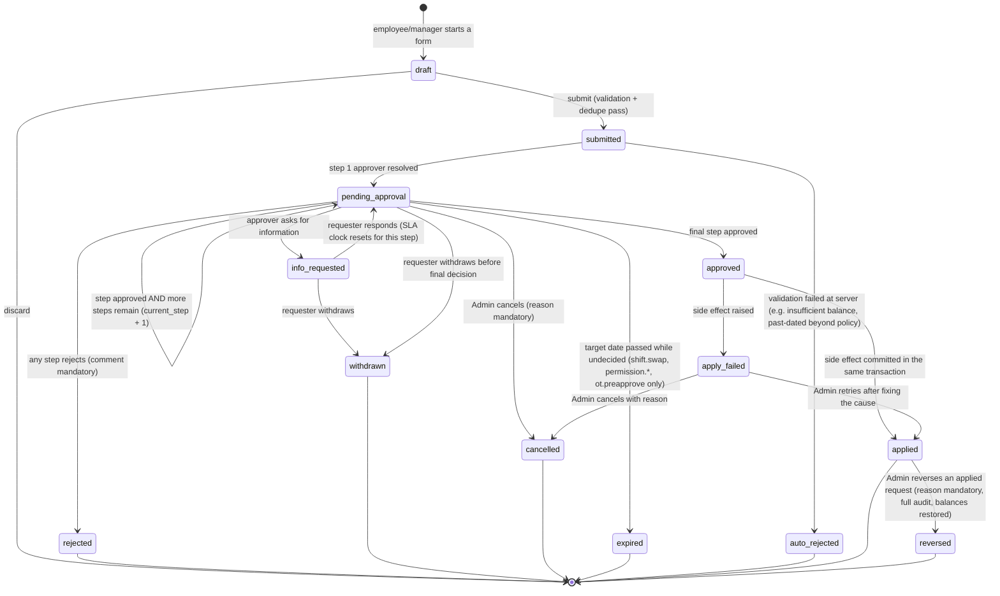

# 02 — PRD: Manager (Team Scope)

**Product:** Tamarind Tree HRMS · **Legal entity:** Machani Hospitalities LLP (LLPIN AAF-9371) · **Venue:** 88, Avalahalli, Anjanapura Post, JP Nagar 9th Phase, Kanakapura Road, Bengaluru 560108 · **All times IST (Asia/Kolkata)** · **Currency INR, Indian digit grouping**

> **Purpose.** This document specifies everything a **Manager** can see and do in the Tamarind Tree HRMS. A Manager is not a separate persona — it is an **Employee who additionally has reportees**. Therefore every capability in `01-prd-employee.md` is inherited verbatim and is *not* repeated here; this PRD specifies only the **additive team-scope surface**: the dual-context information architecture, the reportee-scope algebra (direct / indirect / all / dotted-line / delegated), the live Team Today board and its six KPI cards with exact formulas, thirteen fully-specified team analytics widgets, the complete approvals inbox with per-type approver chains, SLAs and escalation, the team roster with an explicit manager-visible field allowlist that becomes an RLS requirement in `04-data-model.md`, venue-specific shift & roster management against the event calendar, lean performance touchpoints, the team-scoped AI assistant contract, the manager notification matrix, the manager audit-event catalogue, and the hard edge cases (manager-of-manager, dual managers, self-approval, mid-period transfer, manager exit). Every number, formula, enum, label, threshold and copy string here is a decision, not a suggestion. Where the screenshotted incumbent product is defective, the correct behaviour is stated and a regression test is named.

---

## Table of contents

| § | Section |
|---|---|
| 1 | [Scope, definitions and relationship to other docs](#1-scope-definitions-and-relationship-to-other-docs) |
| 2 | [The dual-context model and information architecture](#2-the-dual-context-model-and-information-architecture) |
| 3 | [Reportee scope algebra — how "my team" is computed](#3-reportee-scope-algebra--how-my-team-is-computed) |
| 4 | [Team Today — the live Attendance Board and its six KPI cards](#4-team-today--the-live-attendance-board-and-its-six-kpi-cards) |
| 5 | [Shared widget contract, metric-labelling standard and formatting law](#5-shared-widget-contract-metric-labelling-standard-and-formatting-law) |
| 6 | [Team analytics widgets — full specifications](#6-team-analytics-widgets--full-specifications) |
| 7 | [Approvals — the manager's inbox](#7-approvals--the-managers-inbox) |
| 8 | [Team roster (people) and the manager-visible field allowlist](#8-team-roster-people-and-the-manager-visible-field-allowlist) |
| 9 | [Shift & roster management for the venue](#9-shift--roster-management-for-the-venue) |
| 10 | [Performance touchpoints (P2, entry points in v1)](#10-performance-touchpoints-p2-entry-points-in-v1) |
| 11 | [Manager AI assistant scope](#11-manager-ai-assistant-scope) |
| 12 | [Notification matrix for managers](#12-notification-matrix-for-managers) |
| 13 | [Manager-triggered audit events](#13-manager-triggered-audit-events) |
| 14 | [Edge cases and their resolutions](#14-edge-cases-and-their-resolutions) |
| 15 | [Defect-regression matrix (what we must not reproduce)](#15-defect-regression-matrix-what-we-must-not-reproduce) |
| 16 | [Performance budgets, telemetry and acceptance criteria](#16-performance-budgets-telemetry-and-acceptance-criteria) |
| 17 | [Assumptions the founding team must confirm](#17-assumptions-the-founding-team-must-confirm) |

---

## 1. Scope, definitions and relationship to other docs

### 1.1 What makes someone a Manager

There is **no `manager` role row**. Manager capability is *derived*, continuously, from data:

```
is_manager(u) := EXISTS (
    SELECT 1 FROM employees e
    WHERE e.status IN ('active','on_notice','on_probation','on_leave')
      AND (e.reporting_manager_id = employee_of(u)
        OR e.dotted_line_manager_id = employee_of(u))
  )
  OR EXISTS (
    SELECT 1 FROM approval_delegations d
    WHERE d.delegate_employee_id = employee_of(u)
      AND d.status = 'active'
      AND CURRENT_DATE BETWEEN d.from_date AND d.to_date
  )
```

**Decision (D-02-01): manager capability is derived, never granted.** Rationale: at Tamarind Tree a Banquet Captain acquires and loses reportees whenever HR re-parents an employee; a grantable role would drift out of sync with the org tree within a week and would silently leak or withhold team data. The only thing an Admin edits is `employees.reporting_manager_id` / `dotted_line_manager_id`; the nav, the RLS scope and the approval routing all follow automatically.

**Decision (D-02-02): the Team surface appears and disappears live.** When `is_manager` flips false (last reportee re-parented), the TEAM nav group disappears on the next auth/profile refresh (Supabase Realtime on the `employees` row set, ≤5 s), pending approvals are re-routed per §7.6, and any open `/team/*` route redirects to `/` with the toast: `"Your reporting line changed — you no longer have reportees."`

### 1.2 The three product personas (recap, authoritative in `00-master-plan.md`)

| Persona | Data scope | This doc |
|---|---|---|
| **Employee** | Own data only | `01-prd-employee.md` |
| **Manager** | Own data **+** reportee scope (direct / indirect / all / dotted / delegated) | **this doc** |
| **Admin** | Every entity, every field, full audit, full configurability | `03-prd-admin.md` |
| *(recommended)* **super_admin** | Destructive/irreversible only — payroll deletion, audit export, role grants, biometric template purge | `00-master-plan.md` §Roles, `08-architecture.md` §Security |

### 1.3 Non-goals for the Manager persona (v1)

| Not a manager capability | Where it lives instead | Why |
|---|---|---|
| Viewing or editing any reportee's salary, CTC, payslip, bank, PAN, Aadhaar, UAN, PF/ESI | Admin (`03-prd-admin.md` §Compensation) | Compensation confidentiality; §8.4 allowlist |
| Creating, deleting or re-parenting employees | Admin | Org-tree integrity is a single-writer concern |
| Editing raw attendance punches | Nobody — punches are immutable; corrections are *overlays* | `05-attendance-kiosk.md` §Immutability |
| Face/fingerprint enrolment or template management | Admin/HR on the kiosk | Biometric custody, `05-attendance-kiosk.md` |
| Approving their own requests | Escalates to skip-level or Admin | §7.7, §14.3 |
| Final approval of resignations | Manager *acknowledges*; Admin decides | §7.2 row 10 |
| Payroll runs, leave-policy configuration, shift-master configuration | Admin | Manager *consumes* shift masters; only rosters are manager-writable |
| Performance appraisal cycles, ratings, calibration | P2 (`03-prd-admin.md` §Performance) | v1 ships 1:1 notes + probation recommendation only (§10) |

### 1.4 Relationship to the other build-bible documents

| Doc | What this PRD takes from it | What this PRD hands to it |
|---|---|---|
| `00-master-plan.md` | Personas, module map, phase gating, success metrics | Manager module scope for the roadmap |
| `01-prd-employee.md` | Every "My …" screen the manager also has | Requirement that "My Requests" and "Approvals" share one request envelope |
| `03-prd-admin.md` | Shift masters, leave policies, event calendar, escalation targets, delegation override | Escalation destination queue (`admin_escalations`), roster-lock override, dotted-line field |
| `04-data-model.md` | `employees`, `attendance_days`, `attendance_events`, `leave_requests`, `requests`, `roster_assignments`, `venue_events`, `comp_off_ledger`, `audit_log` | **§3.4 scope functions + §8.4 field allowlist are hard RLS requirements**; §6 RPC signatures; §13 audit event codes |
| `05-attendance-kiosk.md` | Punch semantics, IST day anchoring, `first_in_at`/`last_out_at`, late/early/OT minute derivation, cross-midnight rule | Manager-visible attendance overlay semantics; no-show detection timing |
| `06-ai-agent.md` | Infographic answer renderer, tool schema | Manager tool allowlist + scope injection contract (§11) |
| `07-design-system.md` | Tamarind Tree palette, type, chart tokens, data-grid component, empty states | Widget shell anatomy (§5.1), badge vocabulary (§8.2), heatmap legend |
| `08-architecture.md` | Realtime, TanStack Query keys, RPC/Edge boundary, testing | Realtime refresh strategy (§4.5), performance budgets (§16) |
| `09-documents-contracts-comms.md` | Email templates, PDF export renderer | Manager notification templates (§12), roster PDF, roster export |

### 1.5 Tamarind Tree workforce reality that shapes this PRD

| Reality | Consequence for the Manager surface |
|---|---|
| Events run **Fri–Sun**; weekends are peak, Mon–Tue are recovery | Every analytics widget defaults to a **rolling 28-day** window (4 full weekend cycles), never "this month", so weekend-heavy patterns are not clipped mid-cycle |
| Departments: Banquet, Kitchen, Housekeeping, Security, Gardening/Horticulture, Sales & Events, Front Office, Maintenance, Admin/Accounts | Every widget supports a **department facet**; coverage is computed per (date × department × shift) |
| Shifts cross midnight (Event shift ends 01:30, Night security 06:30) | Attendance day = **shift-anchored IST day** (§4.3), not naive calendar day |
| Overtime is normal and expected | OT is a first-class metric with **pre-approval** (§7.2 row 5), not an exception report |
| Contract + probation staff are a large fraction | Roster badges and a dedicated **Probation/Confirmation due** widget (§6.12) |
| ~30–60 employees today, few hundred later | Scope resolved via a trigger-maintained closure table, not per-request recursion (§3.5) |
| One shared gate kiosk operated by a security guard | "Web/Remote Login" is a rare, **permissioned exception** the manager must authorise (§7.2 row 13), and is a KPI card so it stays visible |

### 1.6 Assumptions callout (see §17 for the confirmation list)

> **ASSUMPTION A-02-01.** "Manager" in the client's brief maps to the **reporting-line owner** of an employee, i.e. the person named in `employees.reporting_manager_id`. Department heads who are not in an employee's reporting line get visibility only via the dotted-line field or an Admin grant, never implicitly by department.
>
> **ASSUMPTION A-02-02.** The venue's **event calendar** (`venue_events`) is maintained by the Sales & Events team inside this HRMS (§9.1). If Tamarind Tree keeps events in an external CRM, §9 becomes read-only against an imported feed and the coverage widget degrades to "rostered vs planned headcount" without event context.
>
> **ASSUMPTION A-02-03.** Break punches are **not** captured by the gate kiosk in v1 (a single gate camera cannot distinguish a lunch exit from a check-out). The Frequent Breaks widget (§6.4) therefore reports **derived gap-based breaks** from intermediate scans plus a clearly labelled `"Break capture: derived"` badge — and shows an honest "not captured" state rather than the incumbent's silently-zero chart.
>
> **ASSUMPTION A-02-04.** Managers do **not** approve money amounts above ₹5,000 alone; local claims above that threshold co-route to Admin. The threshold is configurable by Admin (`approval_policies.claim_manager_limit_inr`, default `5000`).

---

## 2. The dual-context model and information architecture

### 2.1 The problem with the incumbent design

The screenshotted product forces the user to reason about *which product they are in*: a top-level `Manager | Attendance` tab pair, **plus** a circular "swap" role-switcher icon in the header, **plus** a `Manager Dashboard` quick-link tile on the landing page. Three different mechanisms for one idea. The consequences visible in the screenshots: the same person's data appears with different denominators in different places (`0/1` on the manager board versus `/17` for reportees), the header clock and the "Attendance" tab compete with the manager board, and it is never clear whether "Attendance" means *mine* or *my team's*.

### 2.2 Decisions

**Decision (D-02-03): no role switch, ever.** There is exactly one signed-in identity and one app. Personal and team surfaces are **different destinations in one navigation tree**, not different modes of the same screen. We delete the swap icon, the `Manager | Attendance` tab pair and the "Manager Dashboard" tile concept.

**Decision (D-02-04): the noun in the nav label carries the context.** Everything personal is prefixed **"My"**. Everything team is inside a visually separated **TEAM** group and is prefixed **"Team"**. No screen is ambiguous, so no screen needs a mode indicator.

**Decision (D-02-05): scope selection lives *inside* team screens, never in the global chrome.** A single segmented control (`Direct · Indirect · All`) plus an "Include dotted-line" switch sits in the team page header, is persisted per user, and is reflected in the URL. A global scope selector would silently change the meaning of unrelated screens.

**Decision (D-02-06): a manager's own row is excluded from team aggregates by default.** The incumbent mixes the manager into the Late Arrivals list (`ARGHYA GHOSH … 0/1`) but omits them from Hours Worked — an inconsistency. Our rule: **team widgets never include the viewing manager**; an explicit `Include me` toggle (default OFF, persisted) adds them, and when ON every widget shows the chip `Includes you`. The manager's own numbers live in `My Attendance` (`01-prd-employee.md`).

### 2.3 Navigation tree (exact)

```mermaid
graph TD
  A["Tamarind Tree HRMS<br/>(one identity, one app)"] --> ME["MY WORK"]
  A --> TEAM["TEAM<br/>(rendered only when is_manager = true)"]
  A --> COMPANY["COMPANY"]

  ME --> M1["Home  /"]
  ME --> M2["My Attendance  /me/attendance"]
  ME --> M3["My Leave & Requests  /me/requests"]
  ME --> M4["My Profile  /me/profile"]
  ME --> M5["My Pay  /me/pay"]
  ME --> M6["My Documents  /me/documents"]
  ME --> M7["My Assets  /me/assets"]

  TEAM --> T1["Team Today  /team"]
  TEAM --> T2["Approvals  /team/approvals  (badge)"]
  TEAM --> T3["Team Attendance  /team/attendance"]
  TEAM --> T4["Team Leave  /team/leave"]
  TEAM --> T5["Roster & Events  /team/roster"]
  TEAM --> T6["Team Analytics  /team/analytics"]
  TEAM --> T7["My Team (people)  /team/people"]
  TEAM --> T8["Performance  /team/performance  (P2)"]

  COMPANY --> C1["Policies  /company/policies"]
  COMPANY --> C2["Holidays  /company/holidays"]
  COMPANY --> C3["Handbook  /company/handbook"]
  COMPANY --> C4["Directory  /company/directory"]
  COMPANY --> C5["Help Desk  /company/helpdesk"]
```



Rendering rules for the nav:

| Rule | Spec |
|---|---|
| Group separator | The TEAM group is preceded by a 1 px `--tt-border` rule and the label `TEAM` in Poppins 600, 11 px, letter-spacing 0.08em, colour `--tt-muted`. Same treatment for `MY WORK` and `COMPANY`. |
| Badge | `Approvals` carries a terracotta (`#CE8F6F`) pill with the count of requests **awaiting my decision now** (status `pending` AND current step assignee = me, including delegated). Cap display at `99+`. Live via Realtime (§4.5). |
| Overdue emphasis | If any awaiting request has breached SLA, the badge switches to `--tt-danger` and gains a 2 px ring; tooltip: `"3 requests · 1 overdue"`. |
| Collapse | Desktop rail collapses to icons with hover tooltips (the incumbent's icon rail is fine); the TEAM group keeps its separator in collapsed mode. |
| Mobile | Bottom nav: `Home · Approvals · Team Today · My Attendance · More`. `More` is a sheet with the full tree. Managers get Approvals in the bottom bar because approval latency is the single biggest complaint in HRMS deployments. |
| Deep-linkability | **Every** team screen is a real route with query state — `?scope=direct&dotted=0&from=2026-06-28&to=2026-07-25&dept=banquet&emp=TT0031`. Tab-state-only navigation (the incumbent's model) is forbidden; a manager must be able to paste a link into WhatsApp and have a colleague land on the same view. |

### 2.4 Team page header anatomy (identical on `/team`, `/team/attendance`, `/team/leave`, `/team/analytics`, `/team/people`)

```
┌──────────────────────────────────────────────────────────────────────────────────────┐
│  ◆ Team Today                                    Live · updated 8s ago   ⟳   ⤓ Export│
│  Fri, 25-Jul-2026 · 09:32 IST · Shift day 25-Jul                                     │
│                                                                                      │
│  [ Direct (7) ] [ Indirect (12) ] [ All (19) ]     ⌥ Include dotted-line (3)  ☐ Me   │
│  Dept: All ▾   Location: Tamarind Tree ▾   Employment: All ▾                          │
│  ⓘ Covering for Priya Menon until 28-Jul-2026 — her approvals appear in your inbox.   │
└──────────────────────────────────────────────────────────────────────────────────────┘
```

| Element | Spec |
|---|---|
| Title + date line | `Team Today` / date in `EEE, DD-MMM-YYYY · HH:mm IST`. When a shift-anchored day differs from the calendar day (post-midnight), append `· Shift day DD-MMM`. |
| Live indicator | Dot + `Live · updated Ns ago`. Amber dot + `Reconnecting…` on Realtime drop; grey + `Paused — tab inactive` when the tab is hidden >2 min. |
| Scope segmented control | Three options with live counts in parentheses. Counts come from the same RPC as the board so they can never disagree. Disabled option when count = 0, with tooltip `"You have no indirect reportees."` |
| Include dotted-line | Switch, default OFF, persisted in `user_preferences.team_include_dotted`. When ON, dotted reportees are visible with a `Matrix` chip and are **excluded from approval routing** unless Admin set `dotted_line_approves = true` for that pair. |
| Include me | Checkbox, default OFF (D-02-06). |
| Facets | Department, Location (multi-entity/multi-venue ready), Employment type (`permanent · probation · contract · intern · consultant`). Multi-select, URL-encoded, persisted per user per page. |
| Delegation banner | Shown when I am a delegate; terracotta left border; names the delegator and the end date; links to §7.6 explanation. |
| Export | Exports **the current view with the current scope, facets and range** to CSV / XLSX / PDF. Every export writes `TEAM_EXPORT` to the audit log (§13). |

### 2.5 Cross-context handoffs (what happens when the two contexts touch)

| Situation | Behaviour |
|---|---|
| Manager opens a reportee's profile | Route `/team/people/:employee_code`. Renders the **8-tab profile shell** from `01-prd-employee.md` but with only the tabs the allowlist permits: `Overview · Employment · Attendance · Leave · Documents (shared-with-team only) · Notes`. `Payment`, `Salary` and `Personal` tabs are **not rendered at all** (not rendered-then-disabled — absent, so nothing hints at hidden data). |
| Manager is also somebody's reportee | Their own requests appear in `My Leave & Requests`; they never appear in their own Approvals inbox (§7.7). |
| Manager views a team screen while themselves on approved leave | Full read access; write actions (approve/reject/publish roster) show a non-blocking banner: `"You're on leave today. Priya Menon is covering your approvals — you can still act if you want to."` Actions remain enabled (managers do check in from weddings). |
| Employee with no reportees | TEAM group absent; `/team/*` returns the empty-state page `"Team view is for managers"` with a link to `Company → Directory`. |
| Admin who is also a manager | Sees `MY WORK`, `TEAM` **and** `ADMIN`. The Admin console never masquerades as the Team view; team data in `/team/*` is always scoped to their *own* reportees even for Admins (rationale: an Admin's team KPIs must mean the same thing as everyone else's). |

---

## 3. Reportee scope algebra — how "my team" is computed

### 3.1 The five relations

| Relation | Definition | Default in scope? | Approval routing? | Chip in UI |
|---|---|---|---|---|
| `direct` | `employees.reporting_manager_id = me` | Yes | Yes (L1) | — |
| `indirect` | Any descendant at depth ≥ 2 down the reporting tree | Only under `Indirect`/`All` | No (their L1 owns it); escalations arrive at L2 = me | `Indirect · L2` |
| `all` | `direct ∪ indirect` | — | As above | — |
| `dotted` | `employees.dotted_line_manager_id = me` (matrix/functional line, sourced from the incumbent's `Dotted Line Manager` custom field) | Only when `Include dotted-line` = ON | **No**, unless `org_matrix_rules.dotted_line_approves = true` for that pair | `Matrix` |
| `delegated` | Reportees of a manager who has an active delegation to me | Yes, merged in, always flagged | Yes, as `on_behalf_of` | `Covering · <delegator>` |

### 3.2 Canonical definition (recursive CTE — this is the specification)

```sql
-- app.reportee_scope(manager_employee_id, scope, include_dotted)
-- Returns one row per in-scope employee with the relation and tree depth.
CREATE OR REPLACE FUNCTION app.reportee_scope(
  p_manager       uuid,
  p_scope         text    DEFAULT 'direct',   -- 'direct' | 'indirect' | 'all'
  p_include_dotted boolean DEFAULT false
) RETURNS TABLE (employee_id uuid, relation text, depth int)
LANGUAGE sql STABLE PARALLEL SAFE AS $$
  WITH RECURSIVE tree AS (
      SELECT e.id, 1 AS depth
        FROM employees e
       WHERE e.reporting_manager_id = p_manager
         AND e.status <> 'deleted'
    UNION ALL
      SELECT c.id, t.depth + 1
        FROM employees c
        JOIN tree t ON c.reporting_manager_id = t.id
       WHERE t.depth < 12                 -- hard cycle/runaway guard
         AND c.status <> 'deleted'
  ),
  lines AS (
      SELECT id AS employee_id,
             CASE WHEN depth = 1 THEN 'direct' ELSE 'indirect' END AS relation,
             depth
        FROM tree
       WHERE (p_scope = 'all')
          OR (p_scope = 'direct'   AND depth = 1)
          OR (p_scope = 'indirect' AND depth > 1)
    UNION
      SELECT e.id, 'dotted', 1
        FROM employees e
       WHERE p_include_dotted
         AND e.dotted_line_manager_id = p_manager
         AND e.status <> 'deleted'
         AND p_scope IN ('direct','all')
  )
  -- A person reachable by both the solid and dotted line is reported once,
  -- with the stronger (solid) relation winning.
  SELECT employee_id,
         MIN(CASE relation WHEN 'direct' THEN 1 WHEN 'indirect' THEN 2 ELSE 3 END)
           ::int::text AS rel_rank,
         MIN(depth)
    FROM lines GROUP BY employee_id;
$$;
```

> The final `SELECT` above maps `rel_rank` back to a label in the wrapping view `app.v_reportee_scope` (`1→direct, 2→indirect, 3→dotted`). Written this way so the precedence rule is explicit and testable.

### 3.3 Effective manager identity (delegation fold-in)

```sql
-- Every manager identity I may act as right now: myself + anyone who delegated to me.
CREATE OR REPLACE FUNCTION app.effective_manager_ids(p_me uuid)
RETURNS SETOF uuid LANGUAGE sql STABLE AS $$
  SELECT p_me
  UNION
  SELECT d.delegator_employee_id
    FROM approval_delegations d
   WHERE d.delegate_employee_id = p_me
     AND d.status = 'active'
     AND (CURRENT_DATE AT TIME ZONE 'Asia/Kolkata')::date
         BETWEEN d.from_date AND d.to_date;
$$;
```

The team RPCs never take a manager id from the client. They resolve it server-side:

```sql
v_me := app.employee_id_of(auth.uid());
-- scope set for the request:
SELECT s.* FROM app.effective_manager_ids(v_me) m
  CROSS JOIN LATERAL app.reportee_scope(m, p_scope, p_include_dotted) s;
```

**Decision (D-02-07): the client may request a scope *shape* (`direct|indirect|all`, `include_dotted`) but never a manager id.** Rationale: a client-supplied manager id is a horizontal-privilege escalation waiting to happen; scope must be derived from `auth.uid()` inside the security barrier.

### 3.4 RLS requirement handed to `04-data-model.md`

```sql
-- Reusable predicate. SECURITY DEFINER, search_path pinned, STABLE.
CREATE OR REPLACE FUNCTION app.can_manage_employee(p_employee uuid)
RETURNS boolean LANGUAGE sql STABLE SECURITY DEFINER SET search_path = app, public AS $$
  SELECT EXISTS (
    SELECT 1
      FROM app.effective_manager_ids(app.employee_id_of(auth.uid())) m
      JOIN app.org_closure c ON c.ancestor_id = m
     WHERE c.descendant_id = p_employee
  ) OR EXISTS (
    SELECT 1 FROM employees e
     WHERE e.id = p_employee
       AND e.dotted_line_manager_id = app.employee_id_of(auth.uid())
  );
$$;
```

Every manager-readable table gets a policy of the shape:

```sql
CREATE POLICY manager_read ON attendance_days FOR SELECT TO authenticated
  USING (app.can_manage_employee(employee_id) OR employee_id = app.employee_id_of(auth.uid()));
```

**and** a column-level grant restriction so the allowlist of §8.4 is enforced in the database, not only in the UI (`REVOKE SELECT (pan_number, aadhaar_number, …) ON employees FROM authenticated;` plus a manager-facing view `app.v_team_employee` exposing exactly the allowlisted columns). `04-data-model.md` owns the final DDL; §8.4 is the normative column list.

### 3.5 Implementation: closure table, not per-request recursion

**Decision (D-02-08): maintain `org_closure` as a trigger-updated transitive-closure table.** The recursive CTE in §3.2 is the *definition*; `org_closure (ancestor_id, descendant_id, depth, path)` is the *implementation* used by RLS and every RPC.

| Concern | Spec |
|---|---|
| Trigger | `AFTER INSERT OR UPDATE OF reporting_manager_id OR DELETE ON employees` → `app.rebuild_org_closure_subtree(affected_root)`. Full rebuild is < 40 ms at 500 employees, so v1 rebuilds the whole table inside the trigger for simplicity and correctness; a subtree-only path is a P2 optimisation gated on `EXPLAIN` evidence. |
| Cycle prevention | `BEFORE UPDATE` trigger `app.assert_no_reporting_cycle()` raises `ERRCODE 'TT001'`, message `"Reporting cycle: <A> would report to its own descendant <B>."` Admin UI surfaces this verbatim. |
| Self-row | `org_closure` includes the `(x, x, 0)` self row so "team including me" is a single `depth >= 0` predicate. Team widgets use `depth >= 1` (D-02-06). |
| Depth cap | Application refuses to create a chain deeper than 12; Tamarind Tree's real depth is 3 (Partner → HoD → Supervisor → Staff). |
| Index | `PRIMARY KEY (ancestor_id, descendant_id)`, plus `INDEX (descendant_id)` for "who are all my managers" (used by escalation, §7.5). |
| Consistency test | Nightly job (and CI test) asserts `org_closure` equals the recursive CTE result; mismatch raises a `SEV2` alert and writes `ORG_CLOSURE_DRIFT` to the audit log. |

### 3.6 Escalation chain derivation (used by §7.5)

```sql
-- Ordered list of managers above an employee: L1, L2, L3 …
CREATE OR REPLACE FUNCTION app.manager_chain(p_employee uuid)
RETURNS TABLE (level int, manager_id uuid) LANGUAGE sql STABLE AS $$
  SELECT c.depth AS level, c.ancestor_id
    FROM app.org_closure c
   WHERE c.descendant_id = p_employee AND c.depth >= 1
   ORDER BY c.depth;
$$;
```

If the chain runs out (employee reports to a designated partner, or the manager slot is NULL), escalation targets the **Admin escalation queue** (`admin_escalations`, owned by `03-prd-admin.md`) and never silently stalls.

### 3.7 Scope worked example (Tamarind Tree, illustrative)

```
Designated Partner  (TT0001)
└── GM Operations  (TT0004)                       ← "me"
    ├── Banquet Manager (TT0011)          direct
    │   ├── Banquet Captain (TT0025)      indirect L2
    │   │   ├── Steward (TT0044)          indirect L3
    │   │   └── Steward (TT0045)          indirect L3
    │   └── Banquet Captain (TT0026)      indirect L2
    ├── Executive Chef (TT0012)           direct
    │   ├── Sous Chef (TT0031)            indirect L2
    │   └── Commis (TT0052, TT0053)       indirect L3
    ├── Housekeeping Supervisor (TT0013)  direct
    ├── Security Supervisor (TT0014)      direct
    └── Head Gardener (TT0015)            direct
Sales Manager (TT0009) — dotted line to GM Ops for event coordination → relation 'dotted'
```

| Toggle | Employees in scope |
|---|---|
| `Direct` | TT0011, TT0012, TT0013, TT0014, TT0015 → **5** |
| `Indirect` | TT0025, TT0026, TT0031, TT0044, TT0045, TT0052, TT0053 → **7** |
| `All` | **12** |
| `All` + dotted | **13** (TT0009 with a `Matrix` chip; excluded from approval routing) |
| `All` + dotted + Include me | **14** (own row appended, `Includes you` chip shown) |

---

## 4. Team Today — the live Attendance Board and its six KPI cards

Route `/team` (default landing for managers). Purpose: at 09:40 on a Saturday with three functions on the lawn, the GM must know in one glance who is in, who is missing, who is late and who is off — and reach each of those people in one click.

### 4.1 Page composition (top to bottom)

| # | Block | Notes |
|---|---|---|
| 1 | Team page header (§2.4) | Scope, facets, live indicator, export |
| 2 | **Six KPI cards** (§4.2) | Single row on desktop (6 × 1), 3 × 2 on tablet, horizontal snap-scroll on mobile |
| 3 | **Extended strip** (§4.4) — 4 additional cards we add | Visually lighter (no icon tile, smaller type) so the primary six stay dominant |
| 4 | Sub-tabs: `Attendance Board` · `Leave Board` | Matches the incumbent's IA, which is good |
| 5 | **Today's roster & events strip** | Horizontal list of today's `venue_events` with coverage chips (§9.5); absent on days with no event: `"No events scheduled today."` |
| 6 | Analytics widgets (§6.1–6.4 abbreviated "today" variants) | Full versions live on `/team/analytics`; `/team` shows Late Arrivals + Hours Worked only, both scoped to the last 7 days |
| 7 | Floating AI assistant (§11) | Bottom-right, `z-index: 40`, **never overlapping a primary action** — the incumbent's chatbot covers its own "Add Dependent" button; ours reserves an 88 px safe-area gutter and auto-shifts on collision detection |

### 4.2 The six KPI cards — exact definitions

Common vocabulary, evaluated for the **current shift-anchored IST day** `D` and the in-scope employee set `S` (§3):

| Symbol | Meaning |
|---|---|
| `sched(e,D)` | Employee `e` has a roster assignment on `D` with a working shift (`roster_assignments.shift_id IS NOT NULL AND assignment_type = 'work'`) |
| `off(e,D)` | `D` is `e`'s weekly off per `weekly_off_rules`, **or** a company holiday applicable to `e`, **or** `e` has an approved full-day leave / comp-off / on-duty-travel covering `D` |
| `shift_start(e,D)` / `shift_end(e,D)` | Timestamps from the assigned shift, anchored per §4.3 (may cross midnight) |
| `grace_in(e,D)` | `shifts.grace_in_minutes` for the assigned shift (default 10; Event shift 15) |
| `ad` | The `attendance_days` row for `(e,D)`: `first_in_at`, `last_out_at`, `worked_minutes`, `late_minutes`, `early_exit_minutes`, `ot_minutes`, `day_status`, `first_in_source` |
| `now` | `now() AT TIME ZONE 'Asia/Kolkata'` |

| # | Card | Icon | Exact definition | SQL-shaped formula | "Show" drill-down |
|---|---|---|---|---|---|
| 1 | **Attended** | check-in door | In-scope employees with **at least one punch** on `D`, regardless of lateness or channel. Includes those who have already checked out. | `COUNT(*) FILTER (WHERE ad.first_in_at IS NOT NULL)` | List: photo, name, code, department, shift, `First in 09:28 IST`, `Last out —`, channel chip (`Kiosk · Face` / `Kiosk · Finger` / `Web`), `On time`/`Late 12m` chip, `Still on duty 3h 04m`. Sort: first_in ascending. |
| 2 | **Off Today** | palm/umbrella | In-scope employees for whom `off(e,D)` is true. | `COUNT(*) FILTER (WHERE off_flag)` | Grouped list with sub-headers and counts: `Weekly off (4)`, `Public holiday (0)`, `On leave (2)` → per person the leave type + `Casual · 24-Jul → 26-Jul (3d)`, `Comp-off availed (1)`, `On duty / travel (0)`. Each row links to the approving request. |
| 3 | **Yet to Reach** | bus | Scheduled to work, **no punch yet**, and `now < shift_end`. | `COUNT(*) FILTER (WHERE sched AND NOT off_flag AND ad.first_in_at IS NULL AND now < shift_end)` | Two groups: **Not due yet (n)** (`now <= shift_start + grace`) showing `Due 14:00 · in 41m`; **Overdue (n)** (`now > shift_start + grace`) showing `Overdue by 1h 12m`, with per-row actions `Call`, `WhatsApp`, `Mark on duty (opens regularization on their behalf)`. Overdue rows carry an amber left border. |
| 4 | **On Time** | clock | Attended **and** the first punch is at or before `shift_start + grace_in`. | `COUNT(*) FILTER (WHERE ad.first_in_at IS NOT NULL AND ad.late_minutes = 0)` | List with `First in 09:26 IST · 4m early`. Sort: earliest first. |
| 5 | **Late In** | person-running | Attended **and** first punch after `shift_start + grace_in`. `late_minutes = GREATEST(0, first_in_at − (shift_start + grace_in))` in whole minutes. | `COUNT(*) FILTER (WHERE ad.late_minutes > 0)` | List with `Late 23m · first in 09:53 IST`, `3rd late day this month`, action `Waive lateness (opens regularization, reason mandatory)`. Sort: most late first. |
| 6 | **Web / Remote Login** | laptop-people | Attended where the **first punch of the day did not come from the gate kiosk** — i.e. an authorised off-site or web punch. | `COUNT(*) FILTER (WHERE ad.first_in_source NOT IN ('kiosk_face','kiosk_fingerprint'))` | List with channel (`Web · self-selfie`, `Mobile · geo`, `Admin manual`), geo/IP summary, the authorising request link (`Web-login permission #REQ-1042`), and a red `Unauthorised` chip if no permission exists — which is itself an exception the manager must resolve. |

**Reconciliation invariant (this is a test, not a hope):**

```
|S|  =  Attended  +  Off Today  +  Yet to Reach  +  No Show  +  Not Applicable
```

where `No Show` = scheduled, unpunched, `now >= shift_end` (extended card, §4.4) and `Not Applicable` = pre-joining, post-exit, or no roster published (extended card). Additionally:

```
Attended  =  On Time  +  Late In                    (partition, always)
Web/Remote Login  ⊆  Attended                       (subset, never additive)
```

**Decision (D-02-09): the board renders these invariants.** A thin footer line under the six cards reads `19 in scope = 12 attended + 4 off + 2 yet to reach + 1 no show + 0 n/a`. If the equality fails, the line turns red and reads `Counts don't reconcile — refresh or report this (ref: RECON-<uuid>)`, and the RPC logs `KPI_RECONCILIATION_FAILED`. Rationale: the incumbent shows `Weekly Offs 7` on one screen and `8` on another with no way for a user to know which is right; we make disagreement impossible to ship silently.

### 4.3 Shift-anchored IST day (why "today" is not naive)

The client's rule is *first scan of the IST day = check-in, last scan = check-out* (`05-attendance-kiosk.md` is authoritative). That rule is correct for the General, Morning and Afternoon shifts. It breaks for the Event shift (16:00 → 01:30) and Night Security (22:00 → 06:30), where a naive midnight boundary would split one duty into two days and record a check-out at 23:59 and a check-in at 00:01.

**Decision (D-02-10): the attendance day of a punch is the *shift-anchored* IST day.**

```
attendance_day(punch) :=
  IF assigned shift for the candidate day crosses midnight
     AND punch_ist_time < shift.day_cutoff        -- default 05:00 IST
  THEN (punch_ist_date - 1 day)
  ELSE punch_ist_date
```

`shifts.day_cutoff_time` defaults to `05:00` and is per-shift configurable by Admin. For non-crossing shifts the cutoff is `00:00`, so the client's plain rule holds exactly. Consequences visible in this PRD: the header shows `· Shift day 25-Jul` between 00:00 and 05:00 IST; the Team Today board at 01:00 on Sunday still shows Saturday's event crew as "attended, still on duty"; the reconciliation invariant is evaluated per shift-anchored day.

### 4.4 Extended cards (our additions beyond the incumbent's six)

Rendered as a lighter secondary strip. These exist because the incumbent's six cards cannot answer "who never showed up?" — the most operationally urgent question on an event morning.

| Card | Definition | Formula | Drill-down |
|---|---|---|---|
| **No Show** | Scheduled, not off, **no punch**, and `now >= shift_end`. | `COUNT(*) FILTER (WHERE sched AND NOT off_flag AND first_in_at IS NULL AND now >= shift_end)` | Rows with `Scheduled 14:00–22:30 · no punch`, actions `Mark absent`, `Raise regularization on behalf`, `Notify HR`. |
| **Still On Duty** | `first_in_at IS NOT NULL AND last_out_at IS NULL`. | `COUNT(*) FILTER (WHERE first_in_at IS NOT NULL AND last_out_at IS NULL)` | Rows with elapsed `6h 12m`, `Past shift end by 42m` in amber past `shift_end`, red past `shift_end + 120m`. |
| **Overtime Now** | Still on duty **and** elapsed beyond `shift_end` > 30 min. | `COUNT(*) FILTER (WHERE last_out_at IS NULL AND now > shift_end + interval '30 min')` | Rows with `OT so far 1h 10m`, pre-approval chip (`Approved 3h` / `Not pre-approved`), action `Pre-approve OT`. |
| **Not Applicable** | No roster published for `D`, or `D < date_of_joining`, or `D > last_working_day`. | `COUNT(*) FILTER (WHERE NOT sched AND NOT off_flag)` | Rows with the reason: `No roster published`, `Joins 01-Aug-2026`, `Exited 30-Jun-2026`. `No roster published` rows carry a direct link to `/team/roster` — this card is how a manager discovers they forgot to publish. |

### 4.5 Real-time refresh strategy

**Decision (D-02-11): Realtime-triggered invalidation with a coalescing window, plus a bounded poll floor, plus an explicit staleness indicator.** No naive 5-second polling (60 employees × 6 widgets would hammer the DB on event mornings), and no pure-Realtime design (a dropped socket must not silently freeze the board).

| Layer | Spec |
|---|---|
| Query key | `['team','today', {managerId, scope, dotted, includeMe, dept, location, employment, shiftDay}]`. `shiftDay` is part of the key so the 00:00/05:00 IST rollover re-fetches instead of showing yesterday. |
| Realtime channel | `supabase.channel('team-today:'+managerId)` subscribing to `postgres_changes` on `INSERT` to `attendance_events`, `INSERT/UPDATE` on `attendance_days`, `UPDATE` on `leave_requests` (status transitions) and `INSERT/UPDATE/DELETE` on `roster_assignments`. RLS filters the stream to in-scope rows. |
| Coalescing | On any event, schedule `invalidateQueries` after **2 500 ms**, resetting the timer on further events, with a **hard flush every 8 000 ms** so a continuous punch burst still refreshes. Rationale: on an event morning 40 guards' punches arrive in 90 seconds; one refresh per ~3 s is plenty and keeps the RPC count bounded. |
| Poll floor | `refetchInterval`: **30 s** during the arrival/departure windows (06:00–11:30 and 17:00–23:59 IST), **120 s** otherwise, **paused** when `document.hidden` for > 2 min (resumes with an immediate refetch and a `Refreshed` toast). |
| Staleness UI | `Live · updated Ns ago` counts up in real time. At > 90 s stale: amber `Reconnecting…`. At > 300 s: red banner `"Live updates lost — showing data from 09:12 IST"` with a `Reload` button. |
| Manual refresh | `⟳` button, always enabled, spins for the duration, and never hides the previous data (no layout-shifting skeletons on refresh — only on first load). |
| Optimistic actions | Approvals and roster edits apply optimistically to the local cache, then reconcile. On failure: revert + destructive toast naming the request id. |
| Day rollover | A single interval ticks at each minute boundary; when the shift-anchored day changes, the key changes, the board re-fetches and a toast announces `"New attendance day — 26-Jul-2026."` |
| Cost guard | All six primary cards + four extended cards come from **one** RPC (`rpc_team_today`) returning a single JSON payload. Ten cards must never be ten queries. |

### 4.6 `rpc_team_today` contract

```sql
-- Returns one JSON object. Never nulls; empty scope returns zeros and rows: [].
rpc_team_today(
  p_scope           text    DEFAULT 'direct',
  p_include_dotted  boolean DEFAULT false,
  p_include_me      boolean DEFAULT false,
  p_departments     uuid[]  DEFAULT NULL,
  p_locations       uuid[]  DEFAULT NULL,
  p_employment      text[]  DEFAULT NULL
) RETURNS jsonb
```

```jsonc
{
  "meta": {
    "manager_employee_id": "…",
    "scope": "direct", "include_dotted": false, "include_me": false,
    "shift_day": "2026-07-25",
    "generated_at_ist": "25-Jul-2026, 09:32:11 IST",
    "generated_at_utc": "2026-07-25T04:02:11Z",
    "employees_in_scope": 19,
    "acting_for": [{ "delegator": "Priya Menon", "until": "2026-07-28" }]
  },
  "cards": {
    "attended": 12, "off_today": 4, "yet_to_reach": 2,
    "on_time": 9, "late_in": 3, "web_remote_login": 1,
    "no_show": 1, "still_on_duty": 7, "overtime_now": 0, "not_applicable": 0
  },
  "reconciles": true,
  "rows": [
    { "employee_id": "…", "employee_code": "TT0031", "full_name": "Suraj Kumar",
      "photo_url": "…", "designation": "Sous Chef", "department": "Kitchen",
      "relation": "indirect", "depth": 2,
      "shift_code": "A", "shift_window_ist": "14:00–22:30",
      "state": "late_in",                 // one of the card states, exactly one
      "first_in_at_ist": "14:23", "last_out_at_ist": null,
      "late_minutes": 13, "early_exit_minutes": 0, "ot_minutes": 0,
      "first_in_source": "kiosk_face", "worked_minutes": 0,
      "off_reason": null, "not_applicable_reason": null,
      "late_days_this_month": 3, "authorisation_request_id": null }
  ]
}
```

**Decision (D-02-12): every row carries exactly one `state`.** The drill-downs are client-side filters over `rows`, so a person can never appear in two cards or be double-counted — the structural fix for the incumbent's cross-widget disagreement.

### 4.7 Empty and degraded states (exact copy)

| Condition | Heading | Body | Primary action |
|---|---|---|---|
| No reportees | `No team yet` | `Once employees are assigned to you as their reporting manager, your team appears here. Ask HR to set your reporting line.` | `Open Directory` |
| Scope has 0 after facets | `No one matches these filters` | `Try clearing the department or employment filters.` | `Clear filters` |
| No roster published for today | `Roster not published for 25-Jul-2026` | `Attendance still records, but "Yet to Reach", "On Time" and "Late In" need a published roster to be meaningful.` | `Publish roster` |
| Kiosk offline > 15 min | *(amber banner above the cards)* | `Gate kiosk last synced 09:04 IST. Punches are queued on the device and will appear when it reconnects.` | `View kiosk status` |
| RPC failure | `Couldn't load your team board` | `<error message>. Ref: <request-id>.` | `Retry` |

---

## 5. Shared widget contract, metric-labelling standard and formatting law

Every analytics widget in §6 is an instance of one component (`<TeamWidget>`) with one data contract. This section is the reason the widgets cannot contradict each other — the class of defect that dominates the screenshotted product.

### 5.1 Widget shell anatomy

```
┌───────────────────────────────────────────────────────────────────────────────────────┐
│ ▣  Late Arrivals   ⓘ            Avg 1.4 late days / employee   01-Jul → 25-Jul ▾  ⤓ ⋯ │
│ ───────────────────────────────────────────────────────────────────────────────────── │
│  LIST PANEL (40%)                        │  CHART PANEL (60%)                         │
│  Suraj Kumar  TT0031 · Sous Chef         │                                             │
│  Late on 17 of 17 working days   100.0%  │   [ chart ]                                 │
│  ▓▓▓▓▓▓▓▓▓▓▓▓▓▓▓▓▓▓▓▓                    │                                             │
│  Vinod Maurya TT0028 · Steward           │                                             │
│  Late on 0 of 17 working days      0.0%  │                                             │
│ ───────────────────────────────────────────────────────────────────────────────────── │
│  19 in scope · 12 with data in range · 17 working days · updated 09:32 IST             │
└───────────────────────────────────────────────────────────────────────────────────────┘
```

| Element | Spec |
|---|---|
| Icon tile | 36 px rounded tile, per-widget accent from the Tamarind Tree palette (`07-design-system.md`). No pastel candy colours; terracotta `#CE8F6F`, gold `#B99665`, plum `#564147`, navy `#121F38` and their tints only. |
| Title | Poppins 600, 15 px, sentence case. **No abbreviations, no DB column names.** |
| `ⓘ` tooltip | Mandatory. Contains: the plain-English definition, the exact formula, the inclusion/exclusion rules, and the sentence `"Working days exclude weekly offs, holidays, approved leave, and days before joining or after exit."` Copy for each widget is given in §6. |
| Header metric | The single most important aggregate, taken **verbatim from `payload.aggregates`** (never recomputed client-side). |
| Date-range picker | Per-widget, independent (the incumbent does this and it is right). Presets: `Last 7 days`, `Last 28 days` *(default)*, `This pay period (01–25 Jul)`, `Last pay period`, `This month`, `Last month`, `Custom…`. Displays as `01-Jul-2026 → 25-Jul-2026`. Max span 400 days; longer spans are refused with `"Pick a range of 400 days or less."` |
| `⤓` export | CSV / XLSX / PDF of exactly what is displayed (list + series + aggregates + meta header). Audited (§13). |
| `⋯` menu | `Explain this widget` (opens the AI assistant pre-prompted with the widget id and current range, §11), `Copy link`, `Reset range`, `Hide widget` (per-user layout preference). |
| Footer meta line | `N in scope · M with data in range · W working days · updated HH:mm IST`. This line is mandatory on every widget — it is how a manager knows whether "0" means "good" or "no data". |
| Drill-through | Clicking any list row, bar, slice, cell or point opens the **Drill-through drawer** (§5.5). |

### 5.2 The one payload shape

```ts
type WidgetPayload<Row, Agg, Point> = {
  meta: {
    widget: string;                 // 'late_arrivals'
    manager_employee_id: string;
    scope: 'direct' | 'indirect' | 'all';
    include_dotted: boolean;
    include_me: boolean;
    filters: { departments: string[]; locations: string[]; employment: string[] };
    range: { from: string; to: string; tz: 'Asia/Kolkata'; label: string };
    working_days_in_range: number;      // team-level, calendar-derived
    employees_in_scope: number;
    employees_with_data: number;
    sufficiency: 'ok' | 'sparse' | 'empty';   // sparse => banner, still renders
    generated_at_ist: string;
    generated_at_utc: string;
    capture_caveat?: string;            // e.g. 'Break capture: derived from gate scans'
  };
  aggregates: Agg;                  // EVERY number shown outside the chart
  rows: Row[];                      // list panel, already sorted server-side
  series: Point[];                  // chart, already bucketed server-side
};
```

**Decision (D-02-13): a number may appear in a widget only if it exists as a field in `aggregates`, `rows` or `series`.** No client-side `Math.round(reduce(...))`. Rationale: the incumbent's `Hours Worked Trend — Avg: 0Hrs` above a chart of five 9-hour days is exactly what happens when the header average and the plotted series are computed in two places. One SQL, one payload, one truth. Enforced by an ESLint rule banning arithmetic on `series`/`rows` inside widget components, plus a unit test per widget asserting `aggregates` is consistent with `series`.

**Decision (D-02-14): all bucketing, averaging and sorting happen in SQL.** Rationale: the same numbers must appear in the UI, in the CSV export, in the PDF, and in the AI agent's infographic. Four renderers, one computation.

### 5.3 Metric-labelling standard (kills the numerator/denominator defect)

The incumbent renders `133/17 hrs worked` in one widget (total ÷ working days) and `9/17 hrs worked` in the next (average ÷ working days) — same visual slot, different meaning. Forbidden.

**Law: a ratio is never rendered as bare `a/b`. Every quantity carries its noun.**

| Concept | Canonical label | Example |
|---|---|---|
| Count over an eligible base | `<n> of <N> <base noun>` | `Late on 3 of 17 working days` |
| Percentage of an eligible base | `<x.x>%` immediately after the count phrase | `Late on 3 of 17 working days · 17.6%` |
| Total of a duration | `Total <d>` | `Total 152h 30m` |
| Average of a duration | `Avg <d> / <unit>` | `Avg 8h 58m / day` |
| Average of a count | `Avg <x.x> <noun> / <unit>` | `Avg 1.2 breaks / day` |
| Rate over headcount | `<x.x> per employee` | `2.4 late days per employee` |
| Currency | `₹<Indian grouping>` | `₹1,10,000` |
| Never | `133/17`, `9/17`, `0/1`, `Avg: 0Hrs`, `1,700.00%` | — |

Additional laws:

| # | Law |
|---|---|
| L1 | **Percentages are clamped to `[0, 100]` by construction**, because numerator sets are always subsets of denominator sets. If a computed value falls outside, the RPC raises `TT_METRIC_RANGE` and the widget renders `—` with the footer note `"Metric unavailable — reported (ref …)"`. It never prints `1,700.00%`. |
| L2 | **Percentages use one decimal place** (`17.6%`), never two, never zero. Exactly `0.0%` and `100.0%` are printed in full. |
| L3 | **Zero denominator prints `—`, not `0.0%`.** With tooltip `"No working days in this range for this employee."` |
| L4 | **Durations are `Hh Mm`** (`8h 58m`), never decimal, except on chart axes where the unit is stated once in the axis title (`Hours worked (h)`). `0h 0m` prints as `0h`. |
| L5 | **Counts ≥ 10,000 use Indian grouping** (`1,20,450`). Counts below use plain digits. |
| L6 | **Dates are `DD-MMM-YYYY`** (`25-Jul-2026`). Date + time: `25-Jul-2026, 09:32 IST`. Month: `Jul 2026`. Range: `01-Jul-2026 → 25-Jul-2026`. Chart axis ticks: `25 Jul`. **`MM/DD/YYYY` is banned product-wide.** |
| L7 | **Open-ended dates are `NULL` and render as `—` or `Active`.** No `01-Jan-3000` sentinels. |
| L8 | **No internal codes as values.** Shift renders `G · General · 09:30–18:30`, not `G`. Pay period renders `01–25 Jul 2026`, not `PP001`. Late policy renders `Standard (10-min grace)`, not `None1`. |
| L9 | **Long numeric identifiers are TEXT end to end** (PF, UAN, ESI, account numbers) and are never passed through a float. Rendering `1.0202E+11` is a P0 bug. Import pipelines coerce to text and validate with a regex before insert (`03-prd-admin.md` §Import). |
| L10 | **Averages are computed over the days that have data**, and the denominator is named in the label. `Avg 8h 58m / worked day` and `Avg 6h 12m / working day` are different metrics and both may be shown — but never unlabelled. |

### 5.4 Working-day definition (single source, used by every widget)

```sql
-- app.working_days(employee_id, from_date, to_date) -> int
-- A working day for employee e on date d is a day where:
--   d BETWEEN e.date_of_joining AND COALESCE(e.last_working_day, 'infinity')
--   AND d is NOT e's weekly off per weekly_off_rules (incl. week-of-month applicability 1..5)
--   AND d is NOT a holiday applicable to e's location/company
--   AND e has NO approved full-day leave / comp-off / on-duty-travel covering d
--   AND a roster assignment of type 'work' exists for d
--       OR (no roster published AND e's default shift is a working shift)
```

`weekly_off_rules` supports the Indian pattern the incumbent exposes — two weekly offs, each with a week-of-month applicability set (`{1,2,3,4,5}`) — plus a `rotational` mode for shift staff where the off day comes from the published roster instead. Half-day leave counts as **0.5** working day and is stated in tooltips.

**Decision (D-02-15): `working_days` is a single SQL function used by every widget, the payroll engine and the AI agent.** Rationale: the incumbent's `Weekly Offs 7` vs `8` and `Paid Days 15` vs `16` disagreement is two implementations of one definition. One function, one answer, one place to fix.

### 5.5 Drill-through drawer (uniform behaviour)

Any click on data opens a right-side drawer (desktop 520 px, mobile full-screen sheet):

| Section | Content |
|---|---|
| Header | Employee chip (photo, name, code, designation, department, relation chip) or, for date-clicks, the date chip `Sat, 18-Jul-2026 · Event day · Sangeet (420 guests)` |
| Why this number | The literal computation for the clicked datum: `Late on 18-Jul: shift A starts 14:00, grace 10m, first punch 14:23 IST → late 13m.` This is the anti-mystery feature; every drill-through explains itself. |
| Day register | For an employee+range click: the per-day table `Date · Shift · Status · First in · Last out · Worked · Late · Early · OT · Source · Regularized`. Enterprise grid: per-column filter, sort, search, column chooser, page size, export, illustrated empty state (`07-design-system.md`). |
| Punches | `View punches` expander showing every raw `attendance_events` row (`09:28:14 IST · Kiosk-1 · Face · match 0.41 · guard TT0019`) — read-only, immutable, with the regularization overlay shown as a separate annotated row. |
| Actions | Contextual: `Raise regularization on behalf`, `Pre-approve OT`, `Add 1:1 note`, `Open profile`, `Message`. Every action is allowlist-checked and audited. |

### 5.6 Sufficiency and empty states (exact copy, per widget instance)

| `sufficiency` | Trigger | Rendering |
|---|---|---|
| `ok` | ≥ 5 working days in range **and** ≥ 1 employee with data | Normal |
| `sparse` | 1–4 working days in range, or < 3 employees with data | Renders normally **plus** an amber inline note: `Only 3 working days in this range — trends may be misleading.` Chart trendlines are suppressed; points remain. |
| `empty` | 0 rows | Illustrated empty state: heading `Nothing recorded for 01-Jul-2026 → 25-Jul-2026`, body `Your team has no attendance in this window. Try a wider range or clear the department filter.`, actions `Last 28 days` · `Clear filters`. **Never** an empty chart with axes and no data. |
| `not_captured` | Metric's source channel is unavailable (e.g. breaks, §6.4) | Neutral state: heading `Breaks aren't captured at the gate kiosk`, body `The gate camera records entry and exit, not lunch breaks. Enable in-out break scans in Admin → Attendance to populate this widget.`, action `How breaks are measured`. **Never a flat zero line pretending to be data.** |

---

## 6. Team analytics widgets — full specifications

All widgets live on `/team/analytics` in the order below; `/team` embeds §6.1 and §6.3 in 7-day form. Each has its own RPC, its own range picker, and its own export. Default range for all: **last 28 days ending yesterday**, because today is partial and a partial day silently drags averages down (another incumbent defect class).

**Decision (D-02-16): the default range ends *yesterday*, and any range that includes today shows the chip `Includes today (partial)`.** Today's live numbers are the job of the Team Today board (§4), not of trend analytics.

### 6.1 Late Arrivals

| Attribute | Specification |
|---|---|
| Purpose | Who is habitually late, and is the team getting better or worse? |
| Route/RPC | `rpc_team_late_arrivals(scope, include_dotted, include_me, from, to, departments, locations, employment)` |
| Accent | Terracotta `#CE8F6F` |
| Header metric | `Avg <x.x> late days / employee` |
| Late definition | `late_minutes > 0`, where `late_minutes = GREATEST(0, EXTRACT(epoch FROM (first_in_at − (shift_start + grace_in)))/60)::int`. Grace is per-shift (`G/M/A/N` = 10 min, `E` = 15 min). Regularized-and-waived days count as **not late** and carry a `Waived` chip in the drill-through. |
| List panel row | Photo · `Suraj Kumar` · `TT0031 · Sous Chef` · **`Late on 17 of 17 working days · 100.0%`** · horizontal bar (width = %) · `Avg lateness 24m` · `Worst 1h 12m on 18-Jul` |
| List sort | `late_pct DESC, late_days DESC, full_name ASC`. Employees with `working_days = 0` are listed last with `—`. |
| Percentage formula | `ROUND(100.0 * late_days / NULLIF(working_days, 0), 1)` — **`working_days` is per-employee, from §5.4, restricted to the selected range.** `late_days ⊆ working_days` by construction, so the value is in `[0, 100]` (L1). |
| Chart | **Grouped vertical bar chart.** X = date (`25 Jul`); Y = `Employees` (integer ticks only, no 1.5/4.5 half-employee gridlines — an incumbent defect). Two series: `On time` (gold `#B99665`) and `Late` (terracotta `#CE8F6F`), stacked. Tooltip: `Sat, 18-Jul-2026 — 3 late of 11 scheduled (27.3%)` and the names of the late employees (max 5, then `+2 more`). |
| Secondary chart toggle | `By date` (default) · `By employee` (horizontal bars of late %) · `By hour of first punch` (histogram in 15-min buckets around shift start — reveals whether lateness is a 5-minute drift or a 45-minute problem). |
| Aggregates | `{ late_days_total, working_days_total, late_pct_team, avg_late_days_per_employee, avg_lateness_minutes, employees_late_at_least_once, worst: {employee_code, date, minutes} }` |
| Drill-through | Row → drawer with the per-day register filtered to late days. Bar → drawer listing that date's late employees with punch times. |
| `ⓘ` copy | `A day is late when the first gate scan is after the shift start plus the shift's grace period (10 minutes for General/Morning/Afternoon/Night, 15 for Event). Percentage = late days ÷ that employee's working days in the range × 100. Working days exclude weekly offs, holidays, approved leave, and days before joining or after exit. Waived lateness (approved regularization) is not counted as late.` |
| Empty | §5.6 `empty` |
| Regression test | `RT-LATE-PCT`: an employee late on all 17 of 17 working days renders exactly `Late on 17 of 17 working days · 100.0%`. Never `1,700.00%`. |

### 6.2 Early Exits

| Attribute | Specification |
|---|---|
| Purpose | Who leaves before shift end — critical at a venue where teardown runs past midnight. |
| RPC | `rpc_team_early_exits(...)` (same signature family) |
| Accent | Plum `#564147` |
| Header metric | `Avg <x.x> early exits / employee` |
| Definition | `early_exit_minutes = GREATEST(0, EXTRACT(epoch FROM ((shift_end − grace_out) − last_out_at))/60)::int` where `grace_out` default 10 min. An early exit requires `last_out_at IS NOT NULL`; **missing check-outs are a separate state** (`No check-out`) and are counted separately, never silently treated as an early exit. |
| List row | `Late on…`-symmetric: `Left early on 4 of 17 working days · 23.5%` · `Avg 38m early` · `No check-out on 2 days` (amber chip linking to regularization) |
| Chart | Stacked vertical bars per date: `Full shift` (gold) · `Left early` (plum) · `No check-out` (grey hatch). Y = `Employees`, integer ticks. |
| Aggregates | `{ early_days_total, working_days_total, early_pct_team, avg_early_minutes, no_checkout_days_total, employees_early_at_least_once }` |
| Drill-through | Same as §6.1; the drawer's "Why this number" explains `Shift A ends 22:30, grace 10m, last punch 21:44 IST → early 36m.` |
| `ⓘ` copy | `A day is an early exit when the last gate scan is more than the grace period (10 minutes) before shift end. Days with no check-out scan are shown separately as "No check-out" and are not counted as early exits — they need a regularization instead.` |
| Regression test | `RT-EARLY-NOOUT`: a day with a check-in and no check-out appears under `No check-out` and is excluded from `early_days_total`. |

### 6.3 Hours Worked (including the bucket distribution)

| Attribute | Specification |
|---|---|
| Purpose | Utilisation and fatigue: who is under-deployed, who is being burned out by event weekends. |
| RPC | `rpc_team_hours_worked(...)` |
| Accent | Navy `#121F38` |
| Header metric | `Avg <Hh Mm> / worked day` **and** `Total <Hh Mm>` (two chips, each labelled — never one ambiguous ratio) |
| `worked_minutes` definition | `worked_minutes = (last_out_at − first_in_at) − break_minutes − unpaid_gap_minutes`, computed in `05-attendance-kiosk.md` and stored on `attendance_days`. Days with no check-out use the **shift end** as the cap and are flagged `capped` (never `NOW()`), with the drill-through stating `Capped at shift end 22:30 — no check-out scan.` |
| List row | Photo · `Vinod Maurya` · `TT0028 · Steward` · **`Total 153h 00m over 17 worked days`** · **`Avg 9h 00m / worked day`** · sparkline of daily hours · `OT 12h 30m` chip if > 0 |
| List sort | `total_worked_minutes DESC` with a toggle for `Avg ASC` (find the under-deployed). |
| Chart 1 — bucket distribution | **Donut** (not pie — donut carries the centre total, and `07-design-system.md` standardises on donuts). Unit of count = **employee-days**. Buckets, half-open intervals on hours: `< 4h` `[0,4)` · `4–5h` `[4,5)` · `5–6h` `[5,6)` · `6–7h` `[6,7)` · `7–8h` `[7,8)` · `≥ 8h` `[8,∞)`. Centre label: `34 employee-days`. Legend rows: `≥ 8h — 29 days · 85.3%` (count **and** percent, both from `aggregates`, never one or the other). Zero-count buckets are **listed in the legend with `0 days · 0.0%` but produce no slice and no `0` callout** — the incumbent's three floating `0` labels are visual noise. |
| Chart 1 colour ramp | Sequential terracotta→gold ramp with the `< 4h` bucket in `--tt-warning` and `≥ 8h` in the deepest terracotta; a diverging ramp is wrong here because the scale is ordinal-sequential. |
| Chart 2 — trend | **Line + area**, X = date, Y = `Hours worked (h)`, series = team average hours per worked day; optional overlay `Scheduled hours` (dashed gold) so a manager sees actual vs scheduled. Event days are marked with a small terracotta triangle on the X axis and named in the tooltip. |
| Aggregates | `{ total_worked_minutes, worked_days, working_days, avg_minutes_per_worked_day, avg_minutes_per_working_day, buckets: [{key, label, days, pct}], capped_days, employees_with_data, scheduled_minutes_total }` |
| Both averages exposed | `Avg / worked day` (denominator = days with a punch) and `Avg / working day` (denominator = §5.4 working days, so absences drag it down). Both are labelled; the header shows the first, the tooltip shows both (L10). |
| Drill-through | Bucket slice → drawer listing the employee-days in that bucket (`Suraj Kumar · 18-Jul · 5h 42m`). Row → per-day register. Trend point → that date's per-employee hours. |
| `ⓘ` copy | `Hours worked = last scan − first scan, minus breaks and unpaid gaps. The donut counts employee-days: one day worked by one person is one unit. "Avg / worked day" divides total hours by days with at least one scan; "Avg / working day" divides by scheduled working days, so absences lower it. Days with no check-out scan are capped at shift end and marked "capped".` |
| Regression tests | `RT-HOURS-AVG`: five days of exactly 9h 00m must render `Avg 9h 00m / worked day` in the header — never `Avg: 0Hrs`. `RT-HOURS-BUCKET`: exactly 8h 00m falls in `≥ 8h`; 7h 59m falls in `7–8h`. `RT-HOURS-SUM`: `Σ buckets.days = worked_days`. |

### 6.4 Frequent Breaks

| Attribute | Specification |
|---|---|
| Purpose | Spot excessive mid-shift absence from post — matters for Security and Banquet during a live function. |
| RPC | `rpc_team_breaks(...)` |
| Accent | Gold `#B99665` |
| Capture reality | See **A-02-03**. The single gate kiosk records every scan; a break is *derived*, not punched. Derivation: order the day's scans; a **break** is an interval between an outbound scan and the next inbound scan where `4 min ≤ gap ≤ 180 min` and the gap lies strictly inside `[first_in_at, last_out_at]`. Gaps < 4 min are treated as duplicate scans (the kiosk de-dupes at 60 s; 4 min is the safety band) and gaps > 180 min are flagged `long_absence` and excluded from break averages, surfacing instead in the drill-through as `Unexplained absence 3h 20m`. |
| Header metric | `Avg <x.x> breaks / day · Avg <Hh Mm> break time / day` + the badge `Derived from gate scans` |
| List row | `Vinod Maurya · TT0028 · Steward` · **`Avg 1.2 breaks / worked day`** · **`Avg 42m break time / worked day`** · `Longest 1h 05m on 18-Jul` |
| Chart | **Line with markers.** X = date; Y = `Average break time (h:mm)` — axis ticks formatted as durations (`0:15`, `0:30`), **not** the incumbent's `0.300H` / `0.800H` mixed-precision decimals. Markers only on working days; non-working days are rendered as light grey X-axis bands labelled `Weekly off` / `Holiday` on hover, so the absence of a marker is explained rather than mysterious. |
| Second series | `Breaks per day` (count) on a right-hand axis, gold dashed. Toggleable. |
| Aggregates | `{ avg_breaks_per_worked_day, avg_break_minutes_per_worked_day, total_breaks, total_break_minutes, longest: {employee_code, date, minutes}, long_absence_days, capture_mode: 'derived' | 'punched' }` |
| `not_captured` state | If the Admin setting `attendance.capture_breaks = false` **and** fewer than 5 % of worked days have ≥ 3 scans, render the §5.6 `not_captured` state rather than a flat zero line. This is the direct fix for the incumbent's honest-looking but meaningless `Avg: 0 breaks/day` chart. |
| Drill-through | Day → scan timeline visual: a horizontal band from first to last scan with break gaps cut out and labelled. |
| `ⓘ` copy | `Breaks are derived from gate scans: the time between leaving and returning, when the gap is between 4 minutes and 3 hours. Gaps over 3 hours are shown separately as unexplained absences. If your team scans only twice a day, no breaks can be measured — that is shown as "not captured", not as zero.` |
| Regression test | `RT-BREAK-LABEL`: the list row never renders `9/17 hrs worked`; it renders the two named averages. |

### 6.5 Absenteeism trend

| Attribute | Specification |
|---|---|
| Purpose | Is unplanned absence rising? Which department and which weekday? |
| RPC | `rpc_team_absenteeism(...)` |
| Accent | `--tt-danger` tint |
| Definitions | `absent_day` = a working day (§5.4) with `day_status = 'absent'` (no punch, no approved leave). `unplanned_leave_day` = approved leave applied **on or after** the leave start date (retrospective). `planned_leave_day` = approved leave applied before the start date. `absenteeism_rate = 100 × (absent_days + unplanned_leave_days) / working_days`. |
| Header metric | `Absenteeism <x.x>%` with a delta chip vs the previous equal-length period: `▲ 1.8 pts vs 03-Jun → 30-Jun` |
| Chart 1 | **Line**, X = ISO week (`W27`) or date (auto: weeks when range > 42 days), Y = `Absenteeism (%)` 0–100 with a dashed gold target line at the Admin-configured `absenteeism_target_pct` (default 4.0). |
| Chart 2 | **Small multiples / heat strip by weekday** — 7 cells `Mon…Sun` coloured by absenteeism rate, because at a wedding venue Monday-after-event absenteeism is the pattern to catch. Labelled `Absenteeism by weekday`. |
| List panel | Ranked employees: `Absent on 3 of 17 working days · 17.6%` · `2 unplanned leave days` · `Last absence 21-Jul-2026` |
| Aggregates | `{ absent_days, unplanned_leave_days, planned_leave_days, working_days, absenteeism_pct, prev_period_pct, delta_pts, by_weekday: [{weekday, pct}], by_department: [{department, pct}], target_pct }` |
| Drill-through | Weekday cell → the dates behind it. Employee → per-day register filtered to absences. |
| `ⓘ` copy | `Absenteeism = (absent days + leave applied on or after it started) ÷ working days × 100. Planned, pre-approved leave is not absenteeism. Weekly offs and holidays are never counted.` |

### 6.6 Overtime distribution

| Attribute | Specification |
|---|---|
| Purpose | OT is normal at Tamarind Tree; the risks are fatigue, statutory limits and cost creep. |
| RPC | `rpc_team_overtime(...)` |
| Accent | Terracotta deep |
| Definitions | `ot_minutes` per day from `05-attendance-kiosk.md`: `GREATEST(0, worked_minutes − shift_paid_minutes)` with a minimum qualifying block of **30 minutes** (below that, no OT) and rounding **down to the nearest 15 minutes**. Split into `ot_approved_minutes` (covered by an approved pre-approval, §7.2 row 5) and `ot_unapproved_minutes` (worked but not pre-approved — recorded, visible, and **excluded from payroll** until an Admin ratifies). |
| Header metric | `Total OT <Hh Mm>` · `Approved <Hh Mm>` · `Not pre-approved <Hh Mm>` (three chips) |
| Chart 1 | **Stacked bar** by employee (horizontal, top 15 then `Show all`): `Approved OT` (terracotta) + `Not pre-approved` (hatched amber). X = `Overtime (h)`. |
| Chart 2 | **Bar** by date with an event overlay: bars = team OT hours; terracotta triangles on dates with `venue_events`, tooltip naming the event. This is the chart that proves OT is event-driven and justifies headcount. |
| Statutory guard | A red rule at the Admin-configured weekly cap (`overtime.weekly_cap_hours`, default **12 h/week**, aligned to Karnataka Shops & Establishments practice — Admin owns the legal value, `03-prd-admin.md`). Employees over the cap in any ISO week appear in the list with a red `Over weekly OT cap: 14h 30m in W29` chip. Nothing is auto-blocked; the manager is warned and HR is notified (§12). |
| List row | `Suraj Kumar · TT0031` · `OT 18h 45m (approved 12h 00m · not pre-approved 6h 45m)` · `Highest week W29: 14h 30m` |
| Aggregates | `{ ot_minutes_total, ot_approved_minutes, ot_unapproved_minutes, employees_with_ot, max_week: {employee_code, iso_week, minutes}, over_cap_employees, weekly_cap_hours, by_date: [...], by_employee: [...] }` |
| Money | **Managers never see OT amounts in ₹.** Only hours. Cost sits in `03-prd-admin.md`. |
| Drill-through | Employee → per-day OT register with the pre-approval id per day. Date → who did OT and against which event. |
| `ⓘ` copy | `Overtime is time worked beyond the paid shift length, counted only in blocks of 30 minutes or more and rounded down to 15-minute steps. Overtime you pre-approved is shown separately from overtime that was worked without pre-approval — the latter is visible here but is not paid until HR ratifies it.` |

### 6.7 Attendance heatmap (employee × day)

| Attribute | Specification |
|---|---|
| Purpose | The single densest view: one screen answers "what did my team's month actually look like?" |
| RPC | `rpc_team_heatmap(scope, include_dotted, include_me, from, to, departments, locations, employment)` |
| Accent | Plum |
| Grid | Rows = employees (sorted `department, designation_rank, full_name`; sticky first column with photo + code). Columns = dates in range (sticky header showing `Sa 25`, weekday letter + day number; month band above). |
| Column budget | ≤ 62 columns renders per-day. > 62 columns auto-switches to **per-week cells** (cell = the dominant status that week, with a badge for mixed) and shows the chip `Weekly view — pick a shorter range for daily detail`. |
| Cell states + colours | `present_on_time` deep gold · `present_late` terracotta · `half_day` gold half-fill (diagonal split) · `weekly_off` neutral 8 % · `holiday` neutral 8 % with a dot · `leave_paid` plum 40 % · `leave_unpaid` plum 70 % · `comp_off` plum 25 % · `on_duty_travel` navy 30 % · `absent_no_show` `--tt-danger` · `not_joined` / `exited` diagonal grey hatch · `no_roster` empty with a dotted border |
| Accessibility | Colour is never the only channel: each cell carries a one-glyph token (`✓ ✓! ½ · ○ L U C D ✕ ⌀`) rendered at 9 px, and the full status is in the cell's `aria-label` and tooltip. Passes the `07-design-system.md` contrast rule in light and dark. |
| Overlays | Event days get a 2 px terracotta top border on the column header with the event name on hover. Regularized days get a small corner triangle. OT days get a bottom terracotta underline. |
| Row summary | Right-hand frozen columns: `P` (present) · `L` (leave) · `A` (absent) · `WO` (weekly off) · `H` (holiday) · `Late` · `OT (h)`. Each is a count, each labelled in the header tooltip. |
| Column summary | Bottom frozen row: `Present / Scheduled` per date (`11/13`), coloured by ratio. |
| Legend | Always visible above the grid, horizontally scrollable, with counts for the current range: `On time 142 · Late 23 · Half day 4 · Leave 18 · Absent 6 · Weekly off 96 · Holiday 4`. |
| Interaction | Cell click → drill-through drawer for that employee+date (punches, why-this-number, actions). Row-header click → employee profile. Column-header click → that date's Team Today-style snapshot. Shift-click a range of cells → bulk action menu (`Raise regularization for 3 days`, `Mark as on duty`) — each item still creates individual audited requests. |
| Export | XLSX preserves colours and glyphs and adds a legend sheet; PDF is landscape A3 for ≤ 40 employees, otherwise paginated by department. |
| Aggregates | `{ legend_counts: {...}, present_scheduled_by_date: [...], row_summaries: [...] }` |
| `ⓘ` copy | `Each cell is one employee on one day, coloured by that day's final status. Weekly offs and holidays are shown in grey so gaps are never mysterious. Days before joining or after exit are hatched. Cells with a dotted border mean no roster was published for that day.` |
| Empty | `No attendance in this range` per §5.6 |

### 6.8 Shift coverage vs event calendar

| Attribute | Specification |
|---|---|
| Purpose | The venue-specific widget with the highest operational value: on Saturday we need 6 banquet stewards, 4 kitchen and 3 security from 16:00 — do we have them? |
| RPC | `rpc_team_coverage(scope, from, to, departments)` |
| Accent | Navy |
| Data sources | `venue_events` + `event_staffing_requirements` (required headcount per event × department × shift) + `roster_assignments` + approved leave + `attendance_days` (for retrospective dates) |
| Definitions | `required` = `Σ event_staffing_requirements.required_headcount` for the (date, department, shift), falling back to `department_baseline_headcount` on non-event days. `rostered` = count of `roster_assignments` of type `work`. `available` = `rostered − approved_leave_overlap − known_no_show(for past dates)`. `gap = required − available` (positive = short, negative = surplus). |
| Layout | **Matrix**: rows = (department × shift), columns = dates. Cell shows `available/required` (`5/6`) coloured: green tint when `gap ≤ 0`; amber when `gap = 1`; red when `gap ≥ 2`; grey when `required = 0`. Event columns carry the event name and guest count in the header (`Sat 18 · Sangeet · 420`). |
| Event strip | Above the matrix, a horizontal timeline of events in the range: `18-Jul · Sangeet · 420 guests · setup 12:00 · guests 19:00 · teardown 01:30` with an aggregate coverage chip `Coverage 87% · 3 gaps`. |
| Gap panel | A list of every gap, ranked by severity then date: `Sat, 18-Jul · Banquet · Shift E (16:00–01:30) · short by 2 · required 8, rostered 7, on leave 1`. Each row has actions: `Assign from pool`, `Extend a shift (creates OT pre-approval)`, `Request contract staff (notifies Admin)`, `Ask for volunteers (notifies team)`. |
| Surge helper | For any date where `Σ gap ≥ 3`, a callout: `Event surge on 18-Jul — 3 open positions across Banquet and Kitchen.` with a one-click `Open surge planner` (§9.6). |
| Aggregates | `{ coverage_pct, total_required, total_available, gap_count, gap_days, worst: {date, department, shift, gap}, by_department: [...] }` |
| Manager visibility | Event fields visible to managers: `event_code, title, event_type, event_date, setup_start_at, guest_arrival_at, teardown_end_at, expected_guests, status, staffing requirements`. **Not visible**: client name, contact details, contract value, deposit status, sales notes (§8.4 extends to the event entity). |
| `ⓘ` copy | `Required headcount comes from each event's staffing plan; on non-event days it falls back to the department's baseline. Available = rostered staff minus anyone on approved leave. A red cell means you are short by two or more people.` |
| Empty | `No events or rosters in this range` with action `Open Roster & Events` |

### 6.9 Personalized Employee Insights

| Attribute | Specification |
|---|---|
| Purpose | One employee, deep: the view a manager opens before a 1:1 or a probation decision. |
| RPC | `rpc_employee_insights(employee_id, from, to)` — RLS-guarded by `app.can_manage_employee` |
| Accent | Gold |
| Employee selector | Searchable combobox over the current scope, showing photo + `Suraj Kumar · TT0031 · Sous Chef`. Deep-linkable (`?emp=TT0031`). Keyboard-first (type-ahead on name or code). |
| Chart 1 — Hours worked trend | **Area + line**, X = date, Y = `Hours worked (h)`. Title chip: **`Avg 8h 58m / worked day`** taken from `aggregates.avg_minutes_per_worked_day`. Dashed gold reference line = the employee's scheduled hours per day. Non-working days are grey bands. Brush/range selector beneath the axis (the incumbent has this and it is good). |
| Chart 2 — Clock-in time trend | **Scatter + line**, X = date, Y = **time of day, rendered as clock labels** (`08:00, 09:00, 10:00 …`) — **never** the incumbent's `11.3H` decimal-hours axis, which requires the reader to do arithmetic to learn the person arrived at 11:18. Horizontal terracotta band = the shift's allowed arrival window (`shift_start` to `shift_start + grace`). Points above the band are late and are terracotta; points inside are gold. Tooltip: `Sat, 18-Jul-2026 — first scan 14:23 IST · 13m late · Shift A 14:00–22:30`. |
| Chart 3 — Check-out time trend | Same construction for `last_out_at`, with the shift-end band; `No check-out` days are rendered as hollow markers on the axis with the label `No check-out`. |
| Strip below charts | Six stat tiles: `Working days 17` · `Present 15` · `Late days 3` · `Absent 1` · `Leave 1` · `OT 12h 30m`. Each tile drills through. |
| Behaviour panel | Plain-language observations generated **from the aggregates, deterministically (not by the LLM)**, max three: `Arrives on average 9 minutes after grace on event days.` · `Longest stretch without a day off: 9 days (11-Jul → 19-Jul).` · `Overtime concentrated on Fri–Sun (86% of OT hours).` Each has a `?` linking to its formula. Rationale for determinism: these appear next to probation decisions and must be reproducible and auditable. |
| Aggregates | `{ working_days, present_days, late_days, absent_days, leave_days, ot_minutes, avg_minutes_per_worked_day, avg_first_in_time_ist, median_first_in_time_ist, longest_streak_without_off_days, observations: [...] }` |
| `ⓘ` copy | `All figures are for the selected employee and range, in IST. The arrival chart shows the time of the first gate scan each day; the shaded band is the allowed arrival window for that day's shift, so anything above the band is late.` |
| Regression tests | `RT-INSIGHT-AVG`: header average equals the mean of the plotted series to the minute. `RT-INSIGHT-AXIS`: the arrival axis renders `11:18`, never `11.3H`. |

### 6.10 Leave Board (who is off when, with conflict warnings)

| Attribute | Specification |
|---|---|
| Purpose | Approve leave without wrecking an event, and see the month at a glance. |
| Route | `/team/leave` (also a sub-tab of `/team`) |
| RPC | `rpc_team_leave_board(scope, include_dotted, month_or_range, departments)` |
| Views | **Calendar** (default) · **Timeline** (Gantt) · **List** (enterprise grid) — segmented control, persisted. |
| Calendar view | Month grid. Each day cell lists up to 3 chips (`Vinod · CL`, `Suraj · SL ½`) then `+2`. Day header shows `Off 4 / 19`. Event days carry a terracotta top border and the event name. Weekly-off and holiday shading matches the heatmap legend so the two widgets are visually consistent. |
| Timeline view | Rows = employees, horizontal bars = leave spans, with today's line and event markers as vertical terracotta rules. Best for spotting overlap. |
| List view | Grid columns: `Employee · Code · Department · Leave type · From · To · Days · Half day · Status · Applied on · Approver · Reason · Conflict`. Full grid toolbar (per-column filter, sort, search, refresh, column chooser, page size, export). |
| Leave types | Rendered by name, never code: `Casual`, `Sick`, `Earned/Privilege`, `Comp-off`, `Loss of Pay`, `Maternity`, `Paternity`, `Bereavement`, `Marriage`. Balances shown where relevant. Authoritative list in `03-prd-admin.md`. |
| **Conflict warnings** | Computed on render *and* re-computed at the moment of approval (§7.4). Four conflict classes: |
| C1 — Event coverage | Approving would push `available < required` for a (date, department, shift) that has an event. Severity **hard**: dialog `Approving this leaves Banquet short by 2 on Sat, 18-Jul (Sangeet, 420 guests).` Requires `Approve anyway` + a mandatory reason ≥ 15 chars, stored on the request and audited. |
| C2 — Minimum headcount | Department falls below `department_min_headcount` on a non-event day. Severity **soft** (warning banner, no reason required). |
| C3 — Overlap with a peer | Another approved leave for the same designation in the same department on the same date. Severity **soft**, lists the peers. |
| C4 — Single point of failure | The employee holds a skill flagged `critical_skill` (e.g. `Fire Safety Marshal`, `Food Safety Supervisor`) and no other rostered employee holds it that day. Severity **hard**, same reason-required flow as C1. |
| Balance panel | Right rail: per-employee balance table `Type · Entitled · Used · Available · Encashable`, plus comp-off credits with expiry dates. Manager sees balances (needed to approve) but **never** any monetary value of leave encashment. |
| Aggregates | `{ off_days_by_date: [...], employees_off_total, conflicts: [{class, date, department, shift, detail, severity}], pending_requests, longest_absence: {...} }` |
| Actions | Approve / Reject / Request info directly from any view (opens the §7 approval sheet, never a silent inline approve). |
| `ⓘ` copy | `Shows approved and pending leave for your team. Warnings appear when approving would leave a department short on an event day, drop it below its minimum headcount, clash with a peer of the same role, or remove the only person with a critical certification that day.` |
| Empty | `Nobody is off in Jul 2026` with body `Approved and pending leave for your team will appear here.` |

### 6.11 Comp-off liability

| Attribute | Specification |
|---|---|
| Purpose | Weekend-heavy operations generate comp-off credits fast; unmanaged credits become an end-of-year staffing crisis and a payout liability. |
| RPC | `rpc_team_compoff_liability(scope, as_of)` |
| Accent | Gold |
| Ledger model | `comp_off_ledger(employee_id, entry_type 'earn'|'avail'|'expire'|'encash'|'adjust', days numeric(3,1), earned_on, expires_on, source_request_id, note)`. Credits are earned in **0.5** steps; expiry default **90 days** from `earned_on` (Admin-configurable, `03-prd-admin.md`). |
| Header metric | `Team liability <x.x> days` · `Expiring in 15 days <x.x> days` |
| List row | `Vinod Maurya · TT0028` · `Balance 3.5 days` · `Oldest credit 22-Apr-2026 · expires 21-Jul-2026` · red chip `1.0 day expires in 4 days` |
| Chart 1 | **Stacked bar by ageing bucket**: `0–30 d`, `31–60 d`, `61–90 d`, `Expires ≤ 15 d`, `Expired unused`. Y = `Days`. |
| Chart 2 | **Line**: earned vs availed per week over the range (two series), so a manager sees whether the team is burning credits down or accumulating. |
| Aggregates | `{ balance_days_total, by_bucket: [...], expiring_15d_days, expired_unused_days_last_90, earned_days_range, availed_days_range, top_holders: [...] }` |
| Actions | `Suggest comp-off dates` — proposes low-coverage-risk dates (non-event, department above minimum headcount) for the selected employee and pre-fills a comp-off avail request **on their behalf** (employee must accept; §7.2 row 3 note). |
| Money | Encashment value is Admin-only. Managers see **days**, never ₹. |
| `ⓘ` copy | `A comp-off credit is earned when someone works on their weekly off or a holiday, and expires 90 days later if unused. "Liability" is the total unused days your team holds. Expiring credits are the ones to schedule first.` |

### 6.12 Probation / confirmation due

| Attribute | Specification |
|---|---|
| Purpose | Probation dates slipping past unnoticed is the most common HR failure in hospitality; the incumbent only shows an `ON PROBATION` badge with no due-date management. |
| RPC | `rpc_team_probation_due(scope, days_ahead default 60)` |
| Accent | Terracotta |
| Rows | `Suraj Kumar · TT0031 · Sous Chef` · `Joined 01-Feb-2026` · `Probation ends 31-Jul-2026` · **`Due in 6 days`** · `Attendance 94% · Late days 3 · OT 18h` · recommendation state chip |
| Buckets | `Overdue` (red, probation end date passed with no decision) · `Due ≤ 7 days` (red) · `Due 8–30 days` (amber) · `Due 31–60 days` (neutral). Sorted overdue first. |
| Recommendation states | `not_started` → `draft` → `submitted` → `hr_decided (confirmed | extended | separated)`. The manager **recommends**; Admin/HR decides (§10.3). |
| Recommendation form | `Recommendation` (`Confirm` / `Extend by 1–3 months` / `Do not confirm`) · `Effective date` · `Strengths` (≥ 30 chars) · `Concerns` · `Evidence` (auto-attached attendance summary for the probation window, read-only) · `Discussed with employee on` (date, required). Submitting notifies HR and the skip-level manager. |
| Also covered | **Contract expiry**: a second tab in the same widget lists `employment_type = 'contract'` staff whose `contract_end_date` is within 60 days, with the same bucket colours and a `Recommend renewal` action. Rationale: at Tamarind Tree contract staff are numerous and their expiry has the same operational shape as probation. |
| Aggregates | `{ overdue, due_7, due_30, due_60, recommendations_pending, contract_expiring_60 }` |
| `ⓘ` copy | `Lists reportees whose probation or contract ends within the next 60 days, plus anyone already overdue for a decision. You recommend; HR records the final decision. Your recommendation must state that you discussed it with the employee.` |
| Empty | `No probation or contract decisions due in the next 60 days` |

### 6.13 Team attrition & tenure

| Attribute | Specification |
|---|---|
| Purpose | Retention is the manager's KPI too; hospitality attrition is high and early attrition (< 90 days) is the signal that matters. |
| RPC | `rpc_team_tenure_attrition(scope, from, to)` |
| Accent | Plum |
| Definitions | `avg_headcount = (headcount_start + headcount_end) / 2` over the range. `attrition_pct = 100 × exits / NULLIF(avg_headcount,0)`, **annualised** when the range < 365 days: `annualised = attrition_pct × 365 / range_days`, and both numbers are shown with explicit labels (`4.8% in period · 21.0% annualised`). `voluntary` vs `involuntary` from `separations.separation_type`. `early_attrition = exits with tenure < 90 days`. |
| Header metric | `Attrition <x.x>% in period · <x.x>% annualised` |
| Chart 1 | **Bar + line combo**: bars = exits per month (split voluntary / involuntary), line = rolling 12-month annualised attrition %. |
| Chart 2 | **Tenure distribution histogram**: buckets `< 3 m`, `3–6 m`, `6–12 m`, `1–2 y`, `2–5 y`, `5 y+`. Y = `Employees`. Median tenure printed as a chip. |
| List | Current team with `Tenure 1y 4m`, `Joined 12-Mar-2025`, and for exits in range: `Exited 30-Jun-2026 · Voluntary · Tenure 4m 12d · Reason: Better opportunity`. Exit **reasons** are visible to the manager at category level (`Better opportunity`, `Relocation`, `Personal`, `Performance`, `Conduct`, `End of contract`); **verbatim exit-interview notes are Admin-only**. |
| Aggregates | `{ headcount_start, headcount_end, avg_headcount, exits, voluntary, involuntary, attrition_pct_period, attrition_pct_annualised, early_attrition_count, median_tenure_days, buckets: [...] }` |
| `ⓘ` copy | `Attrition = exits ÷ average headcount for the range. Because short ranges exaggerate or understate the rate, we also show it annualised. Exits within 90 days of joining are highlighted separately as early attrition.` |
| Small-team caveat | When `avg_headcount < 8`, an amber note: `With a team this small, one exit moves the rate a lot — read the count, not the percentage.` |

### 6.14 Widget summary table (for the build backlog)

| # | Widget | RPC | Default range | Primary chart | Phase |
|---|---|---|---|---|---|
| 6.1 | Late Arrivals | `rpc_team_late_arrivals` | Last 28 d | Stacked bar by date | P1 |
| 6.2 | Early Exits | `rpc_team_early_exits` | Last 28 d | Stacked bar by date | P1 |
| 6.3 | Hours Worked (+ buckets) | `rpc_team_hours_worked` | Last 28 d | Donut + trend line | P1 |
| 6.4 | Frequent Breaks | `rpc_team_breaks` | Last 28 d | Duration line | P2 |
| 6.5 | Absenteeism trend | `rpc_team_absenteeism` | Last 90 d | Line + weekday strip | P1 |
| 6.6 | Overtime distribution | `rpc_team_overtime` | Last 28 d | Stacked bar by employee + date bar | P1 |
| 6.7 | Attendance heatmap | `rpc_team_heatmap` | Current pay period | Matrix | P1 |
| 6.8 | Shift coverage vs events | `rpc_team_coverage` | Next 14 d | Matrix + gap list | P1 |
| 6.9 | Personalized Employee Insights | `rpc_employee_insights` | Last 28 d | 3 trend charts | P1 |
| 6.10 | Leave Board | `rpc_team_leave_board` | Current month | Calendar / timeline / list | P1 |
| 6.11 | Comp-off liability | `rpc_team_compoff_liability` | As of today | Ageing bars + line | P1 |
| 6.12 | Probation / confirmation due | `rpc_team_probation_due` | Next 60 d | Bucketed list | P1 |
| 6.13 | Team attrition & tenure | `rpc_team_tenure_attrition` | Last 12 m | Bar+line, histogram | P2 |

---

## 7. Approvals — the manager's inbox

Route `/team/approvals`. The incumbent's Approvals screen is a single empty card reading `No Approvals Pending.` under a banner that promises to centralise "HR, payroll, finance, and operations". We keep the promise and build the machinery.

### 7.1 One request envelope for every type

**Decision (D-02-17): every approvable thing is a row in one `requests` table with a typed `payload`, plus rows in `request_steps`, plus an append-only `request_events` log.** Rationale: the employee's "My Requests", the manager's "Approvals", the Admin's oversight console, the SLA engine, the escalation engine, the notification engine and the audit trail then have exactly one contract to learn. Type-specific tables (`leave_requests`, `comp_off_ledger`, `roster_assignments`, …) hold the *effect*; the envelope holds the *process*.

```sql
requests (
  id uuid PK,
  request_no text UNIQUE,          -- 'REQ-2026-001042', human-quotable
  request_type text NOT NULL,      -- see §7.2
  subject_employee_id uuid NOT NULL,   -- whom it is about
  raised_by_employee_id uuid NOT NULL, -- who typed it (may differ: on-behalf)
  on_behalf boolean DEFAULT false,
  payload jsonb NOT NULL,          -- typed per request_type, JSON-schema validated
  status text NOT NULL,            -- see §7.3
  current_step int NOT NULL DEFAULT 1,
  priority text DEFAULT 'normal',  -- 'normal' | 'urgent' (urgent = affects today/tomorrow)
  sla_hours numeric NOT NULL,
  sla_due_at timestamptz NOT NULL, -- computed at submit, IST-aware
  escalation_level int DEFAULT 0,  -- 0 none, 1 skip-level, 2 admin
  submitted_at timestamptz,
  decided_at timestamptz,
  applied_at timestamptz,
  withdrawn_at timestamptz,
  created_at timestamptz DEFAULT now(),
  UNIQUE (request_type, subject_employee_id, (payload->>'dedupe_key'))
)

request_steps (
  id uuid PK, request_id uuid, step_no int,
  approver_employee_id uuid,        -- resolved at submit / re-resolved on escalation
  approver_role text,               -- 'l1_manager' | 'l2_manager' | 'admin_hr' | 'admin_finance' | 'counterparty'
  acted_by_employee_id uuid,        -- who actually clicked (may be a delegate)
  on_behalf_of_employee_id uuid,    -- set when a delegate acted
  decision text,                    -- 'approved' | 'rejected' | 'info_requested' | 'acknowledged'
  comment text,
  decided_at timestamptz,
  UNIQUE (request_id, step_no)
)

request_events (           -- append-only, no UPDATE/DELETE grants to anyone
  id bigserial PK, request_id uuid, event_code text, actor_employee_id uuid,
  actor_role text, from_status text, to_status text, detail jsonb,
  at_utc timestamptz DEFAULT now(),
  at_ist text            -- '25-Jul-2026, 09:32:11 IST' precomputed for exports
)
```

### 7.2 Request-type registry — approver chain, SLA, escalation, effect

SLA is measured in **elapsed hours from `submitted_at`**, IST. Reminders are only *delivered* between 07:30 and 21:30 IST (a venue supervisor should not be woken at 03:00), but the clock never pauses — the deadline is the deadline.

| # | `request_type` | Raised by | Approver chain (in order) | SLA | Escalation on breach | Effect on final approval |
|---|---|---|---|---|---|---|
| 1 | `leave.apply` | Employee | **L1 manager** → *(+ Admin HR if: total days > 3, or type ∈ {`loss_of_pay`, `maternity`, `paternity`}, or the dates cross the 25th pay cut-off, or balance is insufficient)* | **24 h** (`urgent` 8 h when start date ≤ tomorrow) | 12 h reminder → 24 h to **L2** → 48 h to **Admin HR queue** | `leave_requests.status='approved'`; balance debited; `roster_assignments` marked `leave`; `attendance_days.day_status='leave'` for the span; conflict reason stored if C1/C4 overridden |
| 2 | `compoff.earn` | Employee, or auto-proposed by the system when someone works a weekly off/holiday | **L1 manager** | **48 h** | 24 h reminder → 48 h L2 → 96 h Admin | `comp_off_ledger` credit (0.5 / 1.0 day), `expires_on = worked_date + 90 d` |
| 3 | `compoff.avail` | Employee (a manager may pre-fill on their behalf; the employee must confirm before it enters the queue) | **L1 manager** | **24 h** | as row 1 | Ledger debit; day marked `comp_off`; roster updated |
| 4 | `attendance.regularize` | Employee, or manager **on behalf** | **L1 manager** → **Admin HR** *(second step only when the change alters paid days, adds > 60 min of worked time, or waives a late/absent marking)* | **24 h** per step | 12 h reminder → 24 h L2 → 48 h Admin | An **overlay row** on `attendance_days` (`is_regularized=true`, `regularized_by`, `regularization_reason`, `original_*` retained). **Raw `attendance_events` are never mutated.** |
| 5 | `ot.preapprove` | Employee, or manager on behalf, or auto-proposed by the coverage widget | **L1 manager** (≤ 4 h/day) → **+ Admin HR** (> 4 h/day, or when the ISO-week total would exceed `overtime.weekly_cap_hours`) | **8 h**, and hard-required **before `shift_start`** for the target date; a post-hoc request is allowed but is flagged `retrospective` | 4 h reminder → 8 h L2 → 24 h Admin | `ot_approvals(employee_id, work_date, approved_minutes)`; OT beyond the approved minutes stays `ot_unapproved` |
| 6 | `shift.swap` | Employee, naming a counterparty | **Counterparty accepts** → **L1 of the requester** → **L1 of the counterparty** *(skipped when it is the same manager)* | **12 h** each step; the request auto-expires if the swap date arrives undecided | 6 h reminder → 12 h L2 of the respective manager → Admin | Both `roster_assignments` updated atomically; `roster_versions` bumped with reason `swap REQ-…`; both employees notified |
| 7 | `travel.requisition` | Employee | **L1 manager** → **Admin HR** → **Admin Finance** *(only when an advance is requested)* | **48 h** per step | 24 h reminder → 48 h L2 → 96 h Admin | `travel_requests` approved; on-duty days marked `on_duty_travel`; advance creates a payout task for Admin |
| 8 | `claim.local` | Employee | **L1 manager** (amount ≤ ₹5,000) → **+ Admin Finance** (> ₹5,000 or missing receipt) | **72 h** | 36 h reminder → 72 h L2 → 120 h Admin | `expense_claims` approved → enters the next reimbursement batch. Manager sees the ₹ amount here (it is the thing being approved) but no salary context. |
| 9 | `profile.field_change` | Employee | **L1 manager** for non-sensitive fields (address, emergency contact, skills, hobbies, mode of transport, shirt size) → **Admin HR only** for sensitive fields (legal name, DOB, bank, PAN/Aadhaar/UAN/PF/ESI, designation, department, reporting manager, salary) — the manager step is **skipped entirely** for sensitive fields | **72 h** | 36 h reminder → 72 h L2 → 120 h Admin | `employees` field updated **and** an `employee_field_history` row with `old_value`/`new_value`/`approved_by`/`approved_on` (the incumbent's History tab, done right) |
| 10 | `resignation.submit` | Employee | **L1 manager acknowledges** (cannot approve or deny; may recommend a last working day and add handover notes) → **Admin HR decides** | **24 h** for the acknowledgement | 12 h reminder → 24 h L2 → 48 h Admin (Admin can proceed without the acknowledgement, which is recorded) | `separations` row; notice period computed; exit checklist created; roster from LWD released |
| 11 | `asset.request` | Employee | **L1 manager** → **Admin (asset custodian)** | **48 h** | 24 h reminder → 48 h L2 → 96 h Admin | `asset_requests` approved → handover record on issue; asset history logs handover / return / recall |
| 12 | `permission.short_leave` | Employee | **L1 manager** | **4 h** (`urgent` by nature) | 2 h reminder → 4 h L2 → 8 h Admin | Late-in or early-exit waived up to 120 min for that date; day stays `present`; the waiver is visible in the drill-through |
| 13 | `permission.web_login` | Employee, or manager on behalf | **L1 manager** → **+ Admin HR** when the same employee has had > 4 web-login permissions in the trailing 30 days | **8 h** | 4 h reminder → 8 h L2 → 24 h Admin | An allowlist entry permitting off-kiosk punching on the named date(s) with geo-fence radius; the KPI card (§4.2 #6) shows `Authorised` instead of `Unauthorised` |
| 14 | `probation.recommendation` | Manager | **Admin HR decides** (no manager approval step) | **7 days** before the probation end date | Daily reminder from T-7; at T+0 escalates to L2 and Admin | `probation_decisions` row; on `confirmed`, `employees.employment_type='permanent'` and `confirmation_date` set |
| 15 | `roster.amend_locked` | Manager | **Admin HR** (because the roster is inside the 48 h lock window) | **8 h** | 4 h reminder → 8 h Admin escalation queue | `roster_assignments` updated, `roster_versions` bumped, both affected employees notified |

Notes on the registry:

| Note | Spec |
|---|---|
| N1 | **No request type auto-approves, ever.** Escalation moves the decision to a human; it never decides. Rationale: every one of these types has a payroll or safety consequence. |
| N2 | Sub-day leave (half-day) uses the same type with `payload.duration = 'first_half' | 'second_half'` and counts 0.5 day. |
| N3 | `dedupe_key` prevents duplicate submissions (e.g. `leave.apply` key = `from|to|type`); a duplicate returns the existing request with the toast `You already have request REQ-2026-001042 for these dates.` |
| N4 | A manager **may raise** rows 3, 4, 5, 13 on behalf of a reportee. `on_behalf = true`, the employee is notified immediately (`"Your manager raised REQ-… on your behalf"`), and the employee can withdraw it. A manager may **never** raise rows 1, 8, 9, 10 on someone's behalf. |
| N5 | Where a chain contains both L1 and Admin, both steps are required; approval at step 1 moves status to `pending_approval` at step 2, not to `approved`. |
| N6 | `sla_due_at` is stored, not computed on read, so an SLA policy change does not retroactively breach historical requests. |

### 7.3 Generic request lifecycle state machine



| Status | Manager sees it in | Terminal? |
|---|---|---|
| `draft` | Only the creator's own drafts | No |
| `submitted` | Transient (< 1 s) | No |
| `pending_approval` | **Awaiting me** (if I am the current approver) or **Awaiting others** tab | No |
| `info_requested` | `Waiting on employee` tab | No |
| `approved` | `Decided` tab | No |
| `applied` | `Decided` tab, with `Applied 25-Jul-2026, 09:33 IST` | Yes |
| `apply_failed` | `Needs attention` tab, red, plus an Admin alert | No |
| `rejected` / `withdrawn` / `cancelled` / `expired` / `auto_rejected` / `reversed` | `Decided` tab with the reason | Yes |

**Decision (D-02-18): `approved` and `applied` are distinct states.** Rationale: the incumbent's model conflates them, so a failed side effect looks like a successful approval. We commit the effect in the same transaction as the final approval where possible; where a side effect must call out (email, payout batch), the request sits at `approved` until `applied` and any failure is loudly visible.

### 7.4 Inbox UI

```
┌───────────────────────────────────────────────────────────────────────────────────────┐
│  ✓ Approvals                                        Live · updated 4s ago   ⟳  ⤓      │
│  [ Awaiting me (7) ] [ Overdue (1) ] [ Waiting on employee (2) ] [ Awaiting others (4)]│
│  [ Decided ] [ Needs attention (0) ]                                                   │
│  Type: All ▾   Employee: All ▾   Dept: All ▾   Raised: Last 30 days ▾   Sort: Oldest ▾ │
│  ─────────────────────────────────────────────────────────────────────────────────────│
│  ☐  🌴  Leave · Casual · 2 days              Vinod Maurya  TT0028 · Housekeeping       │
│         27-Jul-2026 → 28-Jul-2026            Applied 24-Jul, 18:04 IST                │
│         Balance after: Casual 6.0 → 4.0      ⏱ Due in 5h 12m                           │
│         ⚠ Coverage: Housekeeping short by 1 on 27-Jul (no event)                       │
│                                              [ Approve ]  [ Reject ]  [ Ask info ]     │
│  ─────────────────────────────────────────────────────────────────────────────────────│
│  ☐  ⏱  Regularization · Missed check-out     Suraj Kumar   TT0031 · Kitchen            │
│         18-Jul-2026 · requested out 01:45 IST   Applied 19-Jul, 10:22 IST              │
│         Punches: 15:58 in · (no out)   Shift E 16:00–01:30                             │
│         ⏱ OVERDUE by 1d 4h · escalates to Anand Rao in 3h                              │
│                                              [ Approve ]  [ Reject ]  [ Ask info ]     │
│  ─────────────────────────────────────────────────────────────────────────────────────│
│  2 selected   [ Approve 2 ]  [ Reject 2 ]                        (bulk bar, sticky)    │
└───────────────────────────────────────────────────────────────────────────────────────┘
```

| Element | Spec |
|---|---|
| Tabs | `Awaiting me` (default) · `Overdue` · `Waiting on employee` · `Awaiting others` · `Decided` · `Needs attention`. Counts live. `Awaiting others` exists so a manager can see what their L2 chain is sitting on without pestering. |
| Row anatomy | Type icon + type label + one-line summary · subject employee chip · the **decision-relevant facts inline** (dates, balance-after, punch context, amount, coverage impact) · SLA chip · action buttons. **A manager must never need to open a request to approve routine leave.** |
| SLA chip | `Due in 5h 12m` (neutral) → `Due in 1h 04m` (amber < 25 % remaining) → `OVERDUE by 1d 4h` (red) with the next escalation time. |
| Conflict line | Rendered inline from §6.10's conflict engine, re-evaluated at render **and** at click. Hard conflicts (C1, C4) make `Approve` open a confirmation with a mandatory reason. |
| Sort | `Oldest first` (default — fairness), `SLA soonest`, `Employee`, `Type`. |
| Filters | Type, employee, department, raised-date range, `Only conflicts`, `Only overdue`. URL-encoded. |
| Keyboard | `j`/`k` move, `a` approve, `r` reject (focuses the comment box), `i` ask info, `x` select, `⇧A` bulk approve. Every destructive shortcut still shows the confirm sheet. |
| Detail sheet | Right drawer: full payload rendered by type, the subject's mini attendance/leave context, the complete `request_events` timeline (`Submitted 24-Jul 18:04 by Vinod · Reminded 25-Jul 06:04 · You approved 25-Jul 09:33`), attachments, and the same action buttons. |
| Empty | Heading `You're all caught up`, body `No requests are waiting on you. New ones appear here instantly.`, illustration per `07-design-system.md`. **Not** the incumbent's bare `No Approvals Pending.` |
| Mobile | Card list with swipe-right = approve (confirm sheet), swipe-left = reject (comment sheet). Bulk selection via long-press. |

### 7.5 SLA, reminders and escalation engine

| Aspect | Spec |
|---|---|
| Clock | `sla_due_at = submitted_at + sla_hours` (stored). `urgent` requests (target date ≤ tomorrow) use the shortened SLA in §7.2. |
| Reminder cadence | At **50 %** of SLA and at **90 %**: in-app + email to the current approver. Delivered only 07:30–21:30 IST; a reminder that comes due outside the window is delivered at 07:30. |
| Breach → L2 | At **100 %** of SLA: `escalation_level = 1`, `request_steps.approver_employee_id` is reassigned to `app.manager_chain(subject)` level 2, the original approver stays visible as `Escalated from you` and is cc'd. The request appears in **both** inboxes but only the current approver can act. |
| Breach → Admin | At **200 %** of SLA: `escalation_level = 2`, approver becomes the `admin_escalations` queue. Admin can force-decide with a mandatory reason. |
| No chain | If there is no L2 (subject reports to a designated partner, or the manager slot is NULL), the first breach escalates straight to Admin. |
| Manager on leave | If the current approver has approved leave covering `now`, escalation is **immediate** rather than at 100 % — the request routes to their active delegate, or to L2 if no delegation exists (§7.6). |
| Weekend reality | SLAs are **not** paused on weekends. At Tamarind Tree the weekend *is* the operating peak; a leave request submitted Friday evening for Saturday must be decided Saturday. |
| Engine | A Supabase Edge Function `sla-sweeper` on a cron every **10 minutes** (IST-aware) that: (a) sends due reminders, (b) performs escalations, (c) expires date-passed request types, (d) writes `request_events`, (e) emits notifications. Idempotent — keyed on `(request_id, event_code, bucket)` so a re-run never double-notifies. Detailed in `08-architecture.md`. |
| Observability | An Admin dashboard tile shows `Requests breaching SLA now`, `Median time-to-decision by type`, `Escalation rate by manager` (`03-prd-admin.md`). Managers see their own median in §16. |

### 7.6 Delegation while away

```sql
approval_delegations (
  id uuid PK,
  delegator_employee_id uuid NOT NULL,
  delegate_employee_id  uuid NOT NULL,
  from_date date NOT NULL, to_date date NOT NULL,
  request_types text[] DEFAULT NULL,        -- NULL = all types
  reason text,
  created_by_employee_id uuid NOT NULL,     -- self, or Admin, or 'system'
  origin text NOT NULL,                     -- 'self' | 'admin' | 'system_auto'
  status text NOT NULL DEFAULT 'active',    -- 'active' | 'ended' | 'revoked'
  CHECK (delegator_employee_id <> delegate_employee_id),
  CHECK (to_date >= from_date)
)
```

| Rule | Spec |
|---|---|
| Who can create | The manager themselves (`origin='self'`), or an Admin (`origin='admin'`), or the system (`origin='system_auto'`). |
| Eligible delegate | Must be an active employee who is **either** a manager **or** an Admin, and must **not** be a descendant of the delegator's own reportees for the types being delegated *(prevents a steward approving their captain's leave)*. Enforced by a `BEFORE INSERT` trigger with message `"A delegate must be a manager or HR admin outside the affected team."` |
| No sub-delegation | A delegate cannot delegate onward. Enforced in the trigger. |
| Overlap | At most one `active` delegation per `(delegator, request_type)` per date. Overlapping insert fails with `"You already have a delegation to Priya Menon covering 26-Jul → 28-Jul."` |
| Max span | 60 days. Longer requires Admin. |
| **Auto-delegation (D-02-19)** | When a manager's leave is **approved** and no delegation covers those dates, the system creates a `system_auto` delegation to the manager's **L2** (or to the Admin HR queue if no L2), for all types, for the leave span + the following morning until 12:00 IST. Both parties are emailed. Rationale: the single biggest source of HRMS approval decay is a manager going on leave without arranging cover; the venue cannot wait. |
| What the delegate sees | The delegator's `Awaiting me` items, merged into their own inbox with a `Covering · Priya Menon` chip and the banner in §2.4. Team analytics for the delegator's team become visible for the delegation window, flagged `Covering`. |
| Audit | Every delegated decision records `acted_by_employee_id` (the delegate) **and** `on_behalf_of_employee_id` (the delegator), and the notification to the employee names both: `"Approved by Anand Rao, covering for Priya Menon."` |
| On return | An email + in-app digest `While you were away` listing every decision made on the manager's behalf, with links, plus a `Reverse a decision` action that raises an `admin` request (managers cannot silently undo a delegate's approval). |
| Revocation | The delegator or an Admin may revoke at any time; in-flight items immediately re-route back. Revocation is audited. |
| Expiry | The `sla-sweeper` sets `status='ended'` after `to_date` and re-routes anything still pending. |

### 7.7 Self-approval is structurally impossible

**Decision (D-02-20): a request can never be decided by its subject, by the person who raised it, or by anyone acting on their behalf.**

Enforcement, in three layers:

1. **Routing time.** When resolving `request_steps.approver_employee_id`, if the candidate approver equals `subject_employee_id` **or** `raised_by_employee_id`, skip to the next level in `app.manager_chain(subject)`. If that exhausts, route to the Admin HR queue and set `escalation_level = 2` with `request_events.event_code = 'SELF_APPROVAL_AVOIDED'`.
2. **Database.** A `BEFORE UPDATE` trigger on `request_steps`:
   ```sql
   IF NEW.acted_by_employee_id IN (r.subject_employee_id, r.raised_by_employee_id)
      OR NEW.on_behalf_of_employee_id IN (r.subject_employee_id, r.raised_by_employee_id)
   THEN RAISE EXCEPTION 'TT007: A request cannot be decided by its subject or its raiser.';
   ```
3. **UI.** The item never appears in the subject's `Awaiting me` tab; if reached by a stale deep link, the action buttons are absent and an info panel reads `"This is your own request — <name> is deciding it."`

Corollaries: a manager who is also a delegate cannot use the delegation to approve their own leave (layer 2 catches it). A manager approving a request for a reportee that they themselves raised on that reportee's behalf is also blocked — the request routes to L2, and the manager is told at raise time: `"Because you're raising this, Anand Rao will approve it."`

### 7.8 Bulk approve / reject

| Rule | Spec |
|---|---|
| Selection | Checkbox per row + `Select all on page`. Hard cap **50** per action, enforced server-side. |
| Homogeneity | Bulk **approve** requires all selected rows to be the same `request_type`. Mixed selections disable `Approve` with the tooltip `"Bulk approve works on one request type at a time."` Bulk **reject** allows mixed types (a manager clearing a stale queue). |
| Conflicts | If any selected row has a **hard** conflict (C1/C4), the bulk dialog lists those rows separately: `2 of 7 need a reason before approval` — they are held back and must be handled individually. The other 5 proceed. |
| Reject comment | **Mandatory, minimum 10 characters**, applied to all selected rows, with an optional per-row addendum. Empty or whitespace comments are refused: `"Tell them why — this comment goes to the employee."` |
| Approve comment | Optional. |
| Confirmation | A dialog itemises the impact: `Approving 5 leave requests · 7.5 leave days · affects 18-Jul (Sangeet), 20-Jul · Housekeeping drops to minimum headcount on 20-Jul.` |
| Atomicity | Executed as **one RPC, one transaction** (`rpc_bulk_decide(request_ids[], decision, comment)`). Any row failing validation aborts the whole batch and returns a per-row error list; nothing is half-applied. Rationale: partial bulk approvals are impossible for a human to reconcile. |
| Audit & notify | **Per request**: one `request_steps` row, one `request_events` row, one `audit_log` row, one notification to the employee. **Never** a merged "5 requests approved" notification to employees — each person gets their own message about their own request. The manager gets one summary toast: `Approved 5 requests · 0 failed`. |
| Rate limit | Max 200 decisions / 5 minutes per approver, to make runaway scripting visible. |

### 7.9 What a manager can and cannot do to a request

| Action | Manager | Note |
|---|---|---|
| Approve / reject at their step | ✅ | Reject requires a comment |
| Ask for information | ✅ | Sets `info_requested`, notifies the employee, resets this step's SLA on response |
| Add an internal note | ✅ | Visible to approvers and Admin, **not** to the employee; clearly labelled `Internal note` |
| Attach a file | ✅ | E.g. a duty roster screenshot supporting a rejection |
| Withdraw someone else's request | ❌ | Only the raiser or an Admin |
| Edit the payload | ❌ | Must `Ask info` and let the employee change it — an approver silently editing a request destroys consent |
| Change the approver chain | ❌ | Admin only |
| Reverse an applied request | ❌ | Raises `admin` request; Admin executes with reason |
| Backdate a decision | ❌ | `decided_at` is server time, always |
| Decide after final decision | ❌ | Idempotent RPC returns `"Already decided by … on …"` |

---

## 8. Team roster (people) and the manager-visible field allowlist

Route `/team/people`. This is the manager's people directory — the incumbent's "Direct Report" card strip, made complete.

### 8.1 Two presentations, one data source

| View | When | Spec |
|---|---|---|
| **Cards** (default) | ≤ 40 in scope | Responsive grid (4 / 3 / 2 / 1 columns). Card: cover strip in the department's accent tint, 56 px photo (initials fallback on a plum tile), `Full Name`, `TT0031 · Sous Chef`, `Kitchen · Tamarind Tree`, badge row (§8.2), then a 2-column mini-grid: `Shift G · 09:30–18:30`, `Weekly off Sun, Mon(2,4)`, `Joined 12-Mar-2025 · 1y 4m`, `Reports to me (direct)`. Footer actions: `Profile`, `Attendance`, `Add note`, `⋯` (Raise regularization · Pre-approve OT · Emergency contact). |
| **Grid** | > 40 in scope, or user toggles | Full enterprise data grid (`07-design-system.md`): per-column funnel filter, per-column sort, global search, refresh, column chooser, page size (10/25/50/100), items range (`1 – 25 of 41`), illustrated empty state. Default columns: `Photo · Employee code · Name · Designation · Department · Employment type · Relation · Shift · Weekly off · Joined · Tenure · Status · Probation ends · Contract ends · Attendance % (28 d) · Late days (28 d) · Leave balance (days) · Comp-off balance`. |

Both views share one RPC (`rpc_team_people(scope, include_dotted, include_me, filters, search, sort, page)`) and one export.

### 8.2 Badge vocabulary (exact labels and colours)

| Badge | Condition | Style |
|---|---|---|
| `On probation · ends 31-Jul` | `employment_type='probation'` | Gold `#B99665` fill, plum text |
| `Probation overdue` | probation end date passed, no decision | `--tt-danger` fill, white text |
| `Contract · ends 15-Sep` | `employment_type='contract'` | Navy outline |
| `Contract expiring · 12 days` | contract end within 30 days | `--tt-warning` fill |
| `Intern` / `Consultant` | matching employment type | Neutral outline |
| `Notice period · LWD 31-Aug` | `status='on_notice'` | Plum fill, white text |
| `New joiner · day 12` | tenure < 30 days | Terracotta outline |
| `Matrix` | relation = dotted | Neutral outline, dotted border |
| `Indirect · L2` | relation = indirect | Neutral outline |
| `On leave today` | approved leave covers today | Plum 40 % fill |
| `Weekly off today` | today is their weekly off | Neutral 8 % fill |
| `Absent today` | no-show today | `--tt-danger` outline |
| `Late 3 days this month` | `late_days_month >= 3` | `--tt-warning` outline |
| `OT over cap · W29` | ISO-week OT > cap | `--tt-danger` outline |
| `Critical skill: Fire Marshal` | `critical_skill` flag | Navy fill, white text |
| `Comp-off expiring · 1.0 d` | credit expires ≤ 15 days | Gold outline |

Badges are capped at 4 visible per card with `+2` opening a popover. Every badge is a filter: clicking it filters the roster to that condition.

### 8.3 Search, filters, export

| Feature | Spec |
|---|---|
| Search | Single input, debounced 250 ms, matches **name (fuzzy, trigram), employee code (prefix), designation, department, skills**. Placeholder: `Search your team by name, code, role or skill`. Not employee email (managers should not fish by email). |
| Filters | Department, Employment type, Relation (direct/indirect/dotted), Shift, Weekly-off day, Status, Probation due window, Contract expiry window, Attendance % band, `Has comp-off expiring`, `Critical skill`. Multi-select, URL-encoded, persisted. |
| Sort | Name, Employee code, Designation, Department, Tenure, Attendance %, Late days, Probation end date. |
| Export | CSV (raw values, UTF-8 BOM for Excel), XLSX (typed columns, frozen header, Tamarind Tree header band, all long numeric IDs as text so nothing becomes `1.0202E+11`), PDF (A4 landscape roster sheet with the Tamarind Tree logo, generated header `Team roster · GM Operations · All reportees (12) · as of 25-Jul-2026, 09:32 IST`, printed footer `Machani Hospitalities LLP — Confidential`). |
| Export scope guard | An export contains **only allowlisted columns** (§8.4). The export code path uses the same `app.v_team_employee` view as the UI — it is impossible to export a column the manager cannot see. |
| Export audit | `TEAM_EXPORT` audit row with the exact column list, row count, filters, scope and format (§13). |

### 8.4 Manager-visible field allowlist — **normative RLS requirement for `04-data-model.md`**

This is the security contract. `04-data-model.md` must implement it as (a) a manager-facing view `app.v_team_employee` exposing exactly the `M` columns, (b) column-level `REVOKE` on the base table for the `A` columns, and (c) RLS policies gated by `app.can_manage_employee`.

**Legend:** `M` = manager may read · `M✎` = manager may write · `A` = Admin only · `B` = break-glass (manager may reveal via an audited action, §8.5) · `S` = self only (the employee)

| Domain | Column | Manager | Rationale |
|---|---|---|---|
| Identity | `employee_code`, `full_name`, `preferred_name`, `title`, `photo_url` | M | Basic operation |
| Identity | `date_of_birth` | **A** — manager sees `birthday_day_month` only (`25-Sep`) | Birthday wishes need day+month; the year is PII |
| Identity | `gender` | M | Roster/facility planning; read-only |
| Identity | `blood_group` | **B** | Genuinely useful in a kitchen/venue emergency; audited reveal |
| Identity | `marital_status`, `father_or_spouse_name`, `father_or_spouse_type` | A | No operational need |
| Identity | `pan_number`, `aadhaar_number`, `uan_number`, `pf_number`, `esi_number`, `voter_id`, `passport_no`, `visa_*` | **A** | Statutory PII. **Never** manager-visible, masked even for Admin per `03-prd-admin.md` |
| Contact | `work_email`, `work_phone_extension`, `work_mobile` | M | Rostering and shift calls |
| Contact | `personal_email`, `personal_mobile` | **B** | Needed to reach a no-show on an event morning; audited reveal, employee notified |
| Contact | `correspondence_address`, `permanent_address` | A | No operational need |
| Contact | `emergency_contact_name`, `emergency_contact_relationship`, `emergency_contact_phone` | **B** | Emergency only; audited reveal, Admin + employee notified |
| Employment | `designation`, `department_id`, `section`, `location_id`, `company_id` | M | Core |
| Employment | `employment_type`, `status`, `date_of_joining`, `confirmation_date`, `probation_end_date`, `contract_end_date`, `last_working_day`, `notice_period_days` | M | Lifecycle management |
| Employment | `grade`, `band` | **A** | Correlates directly to pay bands |
| Employment | `reporting_manager_id`, `dotted_line_manager_id` | M (read) | Org clarity |
| Employment | `work_order_number` | M | Contract-staff deployment |
| Attendance config | `shift_id`, `weekly_off_rule_id`, `punch_mode`, `late_policy_id`, `attendance_policy_id`, `pay_period_id` | M (read) | Needed to interpret every metric |
| Attendance config | `selfie_attendance_allowed`, `web_attendance_allowed`, `ip_attendance_allowed`, `geofence_radius_m` | M (read) | Needed to judge web-login requests |
| Attendance data | `attendance_days.*`, `attendance_events.*` (own team) | M | The job |
| Attendance data | `attendance_events.match_score`, `kiosk_id`, `guard_employee_id` | M (read) | Dispute resolution |
| Biometrics | `face_template`, `face_embedding`, `fingerprint_credential_id`, `enrolment_images` | **A** (super_admin for purge) | Biometric custody; managers get *no* access, not even existence flags beyond `is_enrolled` |
| Biometrics | `is_face_enrolled`, `is_fingerprint_enrolled` | M (read) | So a manager can chase enrolment |
| Leave | `leave_requests.*`, `leave_balances.entitled/used/available` for own team | M | Approval requires it |
| Leave | `leave_encashment_amount_inr` | **A** | Money |
| Comp-off | `comp_off_ledger.*` (days, dates, expiry) | M | Liability management |
| Comp-off | comp-off **monetary** value | A | Money |
| Compensation | `salary_structure`, `basic`, `hra`, `lta`, `special_allowance`, `children_education`, `gross`, `employer_pf`, `ctc`, `salary_revisions`, `salary_history`, `payslips`, `form16`, `income_tax_declarations` | **A** | Absolute. A manager sees **no** compensation field, no aggregate, no band, no revision date, no hike % |
| Banking | `payment_mode`, `beneficiary_name`, `bank_name`, `branch`, `ifsc_code`, `account_number`, `upi_id` | **A** | Absolute |
| Overtime | `ot_minutes`, `ot_approved_minutes`, `ot_unapproved_minutes` | M | Operational |
| Overtime | `ot_amount_inr`, `ot_rate` | **A** | Money |
| Expenses | `expense_claims.amount_inr`, receipts, category, dates — **only for claims routed to me** | M | The thing being approved |
| Documents | Documents tagged `visibility = 'team'` (SOPs, training certificates, food-safety cards, licences) | M | Compliance checks |
| Documents | Documents tagged `visibility = 'hr'` or `'employee'` (offer letter, contract, Form 16, ID proofs, medical, disciplinary, background check, exit interview) | **A** | Confidential |
| Performance | `one_on_one_notes` authored by me, or shared with me | M✎ | §10 |
| Performance | `probation_recommendation` (mine) | M✎ | §10.3 |
| Performance | HR-authored disciplinary records, PIPs, warning letters, appraisal ratings by others | **A** | Confidential |
| Separation | `separation_type`, `exit_reason_category`, `last_working_day` | M | Handover planning |
| Separation | verbatim exit-interview notes, retention counter-offer details | **A** | Confidential |
| Assets | Assets assigned to my reportees: `asset_tag`, `category`, `issued_on`, `condition`, `due_return_on` | M | Recovery on exit |
| Assets | Asset purchase cost, vendor, invoice | **A** | Money |
| Personal profile | `skills`, `hobbies`, `about`, `languages`, `qualifications` | M | Deployment and development |
| Personal profile | `dependents_nominees` | **A** | PF/gratuity nomination PII |
| Custom fields | Fields flagged `custom_fields.manager_visible = true` (e.g. `Shirt Size`, `Mode of Transport`, `Dotted Line Manager`, `Dynamic WeekOff Calc`) | M | Uniform, transport, matrix |
| Custom fields | Fields flagged `manager_visible = false` (e.g. `Original DOB`) | **A** | Per-field Admin control |
| Roster | `roster_assignments` for my team | M✎ | §9 |
| Audit | `audit_log` rows for my team's attendance/leave/roster/approvals | M (read) | Transparency |
| Audit | Full org audit, exports, security events | **A** / super_admin | §13 |

**The single sentence for the RLS implementer:** *a manager may read operational and lifecycle data about their reportees, may write only rosters, approvals, notes and recommendations, and may never read money, banking, statutory identifiers, biometric templates, confidential HR documents or another manager's team.*

### 8.5 Break-glass reveal (`B` fields)

| Aspect | Spec |
|---|---|
| Trigger | A `Reveal emergency contact` / `Reveal personal phone` button on the reportee's card and profile. |
| Flow | Dialog: `"Reveal <employee>'s personal contact details? This is logged and <employee> and HR are notified. Choose a reason."` Reason picker (`Medical emergency at the venue` · `Unreachable during a live event` · `Safety check` · `Other — describe`) with a free-text box required for `Other`. |
| Result | The fields render for **15 minutes** in that session only, watermarked `Revealed 09:34 IST · logged`. Never included in any export, never cached, never in the AI agent's context. |
| Audit | `SENSITIVE_FIELD_REVEALED` with employee, field list, reason, manager, IST+UTC timestamps, IP, user agent. |
| Notification | Email + in-app to the subject employee **and** to Admin HR, immediately: `"Your manager Anand Rao viewed your emergency contact at 09:34 IST on 25-Jul-2026. Reason: Medical emergency at the venue."` |
| Rate limit | 5 reveals per manager per rolling 24 h; the 6th requires Admin approval. Rationale: emergencies are rare; a manager revealing ten personal numbers a day is doing something else. |

### 8.6 Reportee profile view (what the 8-tab shell becomes)

| Tab | Rendered for manager? | Content |
|---|---|---|
| Overview | ✅ | Photo, identity chips (designation, work email, joined, birthday day-month), badges, manager card, skills, hobbies, about, `Critical skills` |
| Employment | ✅ | Employment type, dates, department/section, location, shift + timings **by name**, weekly-off rule spelled out (`Sunday (all weeks), Saturday (weeks 2 & 4)`), punch mode (`Single punch at gate`), pay period (`01–25 of each month`), work order number, reporting + dotted lines |
| Attendance | ✅ | The employee's per-day register, punches, regularizations, §6.9 insights inline |
| Leave | ✅ | Balances, history, comp-off ledger (days only) |
| Documents | ✅ *(filtered)* | Only `visibility='team'` documents |
| Notes | ✅ | 1:1 notes (§10.1), probation recommendation (§10.3) |
| Payment | ❌ **absent** | Admin only |
| Salary | ❌ **absent** | Admin only |
| Personal | ❌ **absent** | Admin only (break-glass surfaces only the two emergency fields, in a dialog, never as a tab) |
| Custom | ✅ *(filtered)* | Only `manager_visible = true` custom fields |
| History | ✅ *(filtered)* | Field-change requests the manager approved or can approve; sensitive-field history hidden |

**Decision (D-02-21): forbidden tabs are absent, not disabled.** Rationale: a greyed-out "Salary" tab tells a manager that salary is one permission away and invites social-engineering pressure on HR. Absence is the better security posture and the better UX.

---

## 9. Shift & roster management for the venue

Route `/team/roster`. This is the module that makes the product specifically Tamarind Tree's rather than a generic HRMS: a five-acre venue where Friday–Sunday functions dictate who works when.

### 9.1 The two calendars

| Calendar | Owner | Manager access |
|---|---|---|
| **Event calendar** `venue_events` | Sales & Events team (Admin-configured permission `can_manage_events`) | **Read** for date, timing, type, expected guests, status, staffing requirements. **No** client identity or commercial data (§6.8). Managers may add **operational notes** to an event (`event_ops_notes`) and may propose staffing-requirement changes as a request to the event owner. |
| **Roster** `roster_assignments` | The manager of each employee | **Write**, within the lock rules (§9.4) |

```sql
venue_events (
  id uuid PK, event_code text UNIQUE,           -- 'EVT-2026-0184'
  title text, event_type text,                  -- wedding | reception | sangeet | mehendi | haldi |
                                                --  corporate | exhibition | photoshoot |
                                                --  private_party | maintenance_block
  event_date date, setup_start_at timestamptz, guest_arrival_at timestamptz,
  teardown_end_at timestamptz, expected_guests int,
  status text,                                  -- enquiry | blocked | confirmed | executed | cancelled
  lawn_area text, ops_notes text,
  sales_owner_employee_id uuid,
  client_name text,          -- ADMIN/SALES ONLY (column-revoked from managers)
  contract_value_inr numeric -- ADMIN ONLY
)

event_staffing_requirements (
  id uuid PK, event_id uuid, department_id uuid, shift_id uuid,
  required_headcount int, required_skills text[], notes text
)
```

### 9.2 Shift master (Tamarind Tree operating shifts)

Shift masters are Admin-owned (`03-prd-admin.md`); managers select from them. The v1 set:

| Code | Name | Window (IST) | Paid hrs | Grace in | Grace out | Break | Day cutoff | Typical departments |
|---|---|---|---|---|---|---|---|---|
| `G` | General / Admin | 09:30 – 18:30 | 8.0 | 10 m | 10 m | 60 m | 00:00 | Sales & Events, Front Office, Admin/Accounts |
| `M` | Morning Operations | 06:00 – 14:30 | 8.0 | 10 m | 10 m | 30 m | 00:00 | Housekeeping, Gardening |
| `A` | Afternoon Operations | 14:00 – 22:30 | 8.0 | 10 m | 10 m | 30 m | 00:00 | Banquet, Kitchen, Housekeeping |
| `E` | Event / Banquet | 16:00 – 01:30 (+1) | 8.5 | 15 m | 15 m | 45 m | **05:00** | Banquet, Kitchen, Security |
| `N` | Night Security | 22:00 – 06:30 (+1) | 8.0 | 10 m | 10 m | 30 m | **05:00** | Security |
| `S` | Split Duty | 09:00 – 13:00 & 17:00 – 21:00 | 8.0 | 10 m | 10 m | — | 00:00 | Gardening, Maintenance |
| `H` | Half Day | 09:30 – 14:00 | 4.0 | 10 m | 10 m | — | 00:00 | Any (approved half-day) |
| `WO` | Weekly Off | — | — | — | — | — | — | Marker assignment, not a working shift |
| `OFF-H` | Holiday | — | — | — | — | — | — | Marker assignment |

Rendering law: a shift is **always** displayed as `E · Event / Banquet · 16:00–01:30 (+1)`. Never bare `E` (L8). Split shifts show both windows.

### 9.3 Weekly roster publishing

```
/team/roster  →  view: [ Week ] [ Fortnight ] [ Month ]      week of 27-Jul → 02-Aug-2026
┌────────────────────────────────────────────────────────────────────────────────────────┐
│ EVENTS   Mon 27   Tue 28   Wed 29   Thu 30   Fri 31 ▲Mehendi  Sat 01 ▲Wedding  Sun 02  │
│          —        —        —        Setup    280 gst          720 gst        Teardown  │
│ ─────────────────────────────────────────────────────────────────────────────────────  │
│ BANQUET (required)  0   0   0   2   6   9   3                                          │
│  Vinod Maurya      WO  A   A   A   E   E   WO                                          │
│  Rakesh Naik       A   WO  A   A   E   E   A                                           │
│  … 6 more                                                                              │
│  Rostered           4   5   6   6   5   8   4                                          │
│  Gap                –   –   –   ✓   ⚠ −1  ⚠ −1  –                                      │
│ ─────────────────────────────────────────────────────────────────────────────────────  │
│ [ Copy last week ]  [ Apply template ▾ ]  [ Auto-fill from event plan ]                 │
│ Status: DRAFT · 3 changes unpublished          [ Preview ]  [ Publish week ]            │
└────────────────────────────────────────────────────────────────────────────────────────┘
```

| Capability | Spec |
|---|---|
| Grid | Rows grouped by department, then employee. Columns = dates. Cell = a shift chip; click opens a shift picker (keyboard-navigable, type `E` to assign Event). Drag a chip to copy across a row; shift-drag to fill a range. |
| Per-department header row | `required` headcount from the event plan (or baseline), so a manager rosters against demand, not from memory. |
| Per-department footer rows | `Rostered` and `Gap` with the §6.8 colour rules. |
| Constraint validation (live, on every edit) | **Hard blocks:** two shifts on one day for one person; a shift on an approved-leave day; less than **11 hours** rest between consecutive shifts (`E` 01:30 → `M` 06:00 = 4.5 h → blocked with `"Vinod would get only 4h 30m rest between Fri Event and Sat Morning. Minimum is 11 hours."`); more than **6 consecutive** working days without a weekly off; assigning a shift before joining or after LWD. **Soft warnings:** weekly hours > 48; projected OT > weekly cap; department below minimum headcount; the only critical-skill holder is off. |
| Templates | `roster_templates` (Admin- and manager-authored): `Standard week`, `Wedding weekend`, `Corporate weekday`, `Monsoon maintenance`. Applying a template fills only empty cells unless `Overwrite` is ticked. |
| `Copy last week` | Copies the previous week's published assignments, skipping people whose leave or employment status changed, and reports what it skipped. |
| `Auto-fill from event plan` | Deterministic greedy fill: for each (event, department, shift) requirement, pick from eligible employees ordered by `(fewest assigned hours this week, fewest event shifts this month, has required skill, not adjacent to a rest violation)`. Presents the proposal as **highlighted draft cells with an explanation per cell** (`Chosen: lowest hours this week (24h)`), and the manager accepts or edits. **Never auto-publishes.** |
| Draft vs published | Every edit lands in `DRAFT`. The header shows `3 changes unpublished`. Employees see **only published** rosters. |
| Publish | `Publish week` → confirmation listing the diff (`4 new assignments · 2 changed · 1 removed`), then: `roster_assignments.published_at/by` set, a `roster_versions` snapshot row written, and every affected employee notified (in-app + email) with their own week. Publishing is one transaction. |
| Versioning | `roster_versions(week_start, version_no, published_by, published_at, snapshot jsonb, reason)`. Full history visible via `View version history`, with a diff viewer. |
| Export | Week PDF per department (printed and pinned at the staff entrance — a real requirement at a venue where not everyone carries a smartphone), XLSX for planning, ICS feed per employee (`01-prd-employee.md` consumes it). |

### 9.4 Roster lock and amendments

| Rule | Spec |
|---|---|
| Publish deadline | A week's roster must be published by **Wednesday 18:00 IST** for the week starting the following Monday. The dashboard nags from Monday (§12). |
| Lock window | Once published, assignments for a date become **locked 48 hours before that date's shift start**. |
| Inside the lock | The manager can still *propose* a change; it becomes a `roster.amend_locked` request to Admin HR (§7.2 row 15) with a mandatory reason. Rationale: staff plan childcare and commutes around a published roster; a venue manager cannot silently move someone's Saturday at Friday midnight. |
| Emergency path | A `Emergency reassignment` action (no-show, illness, accident) applies immediately **and** files a retrospective `roster.amend_locked` request marked `emergency` for Admin ratification within 24 h. Reason mandatory. All parties notified. |
| Swaps inside the lock | Employee-initiated `shift.swap` (§7.2 row 6) is permitted inside the lock up to 12 h before shift start, because it is consensual. |
| Audit | Every assignment change writes `ROSTER_ASSIGNMENT_CHANGED` with old and new shift, date, reason and lock state. |

### 9.5 Coverage gaps and the today strip

The `/team` page's roster strip shows, for today and the next 3 days: each date, its events, and per-department `available/required` chips. A red chip is a one-click route into the gap panel (§6.8) with the surge planner.

### 9.6 Weekend / event surge planner

| Step | Spec |
|---|---|
| 1 — Demand | For the selected date(s), list every (department, shift) requirement with its gap. |
| 2 — Supply pool | Ranked candidate list drawn from: (a) in-scope employees rostered `WO` who are under 48 h for the week and have ≥ 11 h rest, (b) in-scope employees on a lighter shift who could move, (c) the **contract staff pool** (`contract_staff_pool`, Admin-maintained, with agency, skills, day rate visible **as a flag only**, not the rate). Each candidate shows `Hours this week 32h · Event shifts this month 3 · Rest OK · Skills: Food safety`. |
| 3 — Actions | Per candidate: `Assign (creates a roster change + comp-off earn expectation)`, `Extend current shift (creates an OT pre-approval)`, `Ask (sends an opt-in request the employee can accept or decline)`. The `Ask` path is the fair default and is pre-selected for weekly-off candidates. |
| 4 — Fairness ledger | A visible `Event shifts this quarter` count per employee, so the same three stewards are not burned every weekend. The planner sorts ascending on this count by default and shows the chip `Fairest first`. |
| 5 — Commitment | On assignment: employee notified, comp-off earn request auto-drafted for weekly-off work (employee confirms), OT pre-approval auto-drafted where projected hours exceed the shift, coverage recomputed live. |
| 6 — Escalation | If gaps remain after the pool is exhausted, `Request contract staff` files an Admin request with the shortfall, the date, the event and the manager's note. |

### 9.7 Shift-swap handling (manager side)

| Aspect | Spec |
|---|---|
| Inbox item | `Shift swap · 01-Aug · Vinod (E 16:00–01:30) ⇄ Rakesh (A 14:00–22:30)` with both employees' week context and a validation summary. |
| Auto-validation shown inline | `Rest OK for both · No leave clash · Coverage unchanged (Banquet 8/8) · Skills OK (both food-safety certified)`. If any check fails, it is listed in red and `Approve` requires an override reason. |
| Cross-manager swaps | When the two employees have different managers, both must approve; the UI shows `Waiting on Priya Menon (Kitchen)` after the first approval. |
| Effect | Atomic update of both assignments + `roster_versions` bump + notification to both employees + audit. |
| Refusal | Rejection requires a comment, which is shown to both employees. |

### 9.8 Overtime pre-approval (manager surface)

| Aspect | Spec |
|---|---|
| Entry points | The Overtime widget (§6.6), the Team Today `Overtime Now` card (§4.4), the surge planner (§9.6), the approvals inbox (§7.2 row 5), and a direct `Pre-approve OT` action on any reportee card. |
| Form | Employee (or multi-select for an event crew), date, `Approved minutes` (15-min steps, max 240/day without Admin co-approval), reason (picker: `Event teardown` · `Guest overrun` · `Staff shortage` · `Setup` · `Other`), linked event (optional, auto-suggested from `venue_events`). |
| Bulk | `Pre-approve OT for tonight's event crew` — select an event, pick the departments, set the minutes, one submit → one request per employee (never one merged request), each individually audited and notified. |
| Guard | If the approval would take an employee over the weekly cap, a hard warning with the current week total and a mandatory reason; HR is notified on submit. |
| Visibility | The employee sees their pre-approval in `My Attendance` before working it — the whole point is that nobody works unpaid hours hoping for later approval. |

---

## 10. Performance touchpoints (P2, entry points in v1)

**Decision (D-02-22): v1 ships three lean performance artefacts — 1:1 notes, lightweight goals/KRAs, and the probation/contract recommendation — and no appraisal cycle, no ratings, no calibration, no 360 feedback.** Rationale: a 60-person venue does not need a performance suite; it needs the manager to remember what was discussed and HR to have a defensible probation decision. Building the cycle machinery in v1 would consume the budget that attendance, rostering and approvals need. Full performance management is scoped in `03-prd-admin.md` as a P3 module.

### 10.1 1:1 notes (v1, P1-lite)

| Aspect | Spec |
|---|---|
| Route | `/team/people/:code` → `Notes` tab, and a `Add note` action on every reportee card and drill-through drawer |
| Model | `one_on_one_notes(id, employee_id, author_employee_id, met_on date, next_meeting_on date, agenda text, discussion text, actions jsonb[], visibility text, created_at, updated_at, edit_window_ends_at)` |
| Visibility values | `private_to_author` (default) · `shared_with_employee` (the employee sees it in `My Profile`) · `shared_with_hr` (Admin sees it) · `shared_with_both`. The badge on the note states its visibility in plain words: `Only you can see this` / `Shared with Vinod` / `Shared with HR`. |
| Editing | Editable for **24 hours** after creation, then locked; subsequent changes are appended as a dated addendum. Every version is audited. Rationale: notes may become evidence in a separation; silent retro-editing is unacceptable. |
| Actions/commitments | Each note may carry action items (`text`, `owner` = manager|employee, `due_on`, `status`). Open items appear on the manager's `/team` dashboard as a small `Open commitments (4)` chip and in the employee's Home when shared. |
| Prompts | The note form pre-fills a light agenda from data: `Attendance: 2 late days since your last 1:1` · `Comp-off: 1.0 day expires 09-Aug` · `Open action from 12-Jun: complete food-safety refresher`. Deterministic, not LLM-generated. |
| Cadence nudge | If a direct reportee has no note in 60 days, the roster card shows a neutral chip `No 1:1 in 68 days` and the manager gets a monthly digest listing them. Never a nag notification per person. |
| Deletion | Managers cannot delete a note; they can mark it `retracted` with a reason. Admin can delete with super_admin approval (`03-prd-admin.md`). |

### 10.2 Lightweight goals / KRAs (P2, entry points in v1)

| Aspect | Spec |
|---|---|
| Model | `goals(id, employee_id, set_by_employee_id, title, description, metric text, target text, weight_pct int, period_start, period_end, status 'draft'|'active'|'achieved'|'partially_achieved'|'missed'|'cancelled', progress_pct int, last_updated_by, updated_at)` |
| v1 scope | Create, edit, view, and mark progress. **No** scoring, no weighting maths feeding an appraisal, no calibration. Weights are captured for later use and must total 100 % when a set is activated. |
| Venue-appropriate examples (seeded as templates) | Banquet: `Guest complaints per event ≤ 1`; Kitchen: `Food-cost variance within 3%`; Housekeeping: `Pre-event readiness sign-off by T-2h, 100% of events`; Security: `Zero unauthorised gate entries`; Gardening: `Lawn readiness score ≥ 4/5 at every event`; Sales: `12 confirmed events per quarter`. |
| UI | On the reportee's `Notes` tab, a `Goals` panel: cards with progress bars, period chip, and a `Update progress` inline control. On `/team/performance` (P2), a team matrix of goals × status. |
| Entry points shipped in v1 | The `Goals` panel renders with an empty state and a working create form; the team matrix route exists behind the flag `feature.team_performance` (default OFF). Rationale: shipping the data model and the single-employee UI in v1 means no migration later. |

### 10.3 Probation / contract confirmation recommendation (v1, P1)

Covered mechanically in §6.12 and §7.2 row 14. Product rules:

| Rule | Spec |
|---|---|
| Who | The **direct** manager only. Indirect managers may add a comment; dotted-line managers are notified and may comment. |
| When | The form unlocks at **T-30 days** from `probation_end_date` and is required by **T-7**. |
| Evidence attached automatically | Attendance summary for the probation window (present/absent/late/leave/OT), roster reliability (`no-shows: 0`), 1:1 notes shared with HR, goal progress if any, any disciplinary flags **count only** (`2 HR records exist` — content stays Admin-only). |
| Required fields | Recommendation (`Confirm` / `Extend by 1–3 months` / `Do not confirm`), effective date, strengths (≥ 30 chars), concerns, `Discussed with the employee on <date>` (required — an unrecommended-and-unaware employee is a legal exposure). |
| Extension cap | Two extensions maximum, total probation ≤ 12 months; a third requires super_admin. |
| Outcome | HR decides; the manager is notified of the decision and its effective date; the employee is notified by HR (never by the system on the manager's behalf). |
| Audit | `PROBATION_RECOMMENDATION_SUBMITTED` with the full payload snapshot. |

### 10.4 Feedback (P2)

A single `Give feedback` action on a reportee (and, later, peer-to-peer) writing `feedback_notes(subject_employee_id, author_employee_id, kind 'appreciation'|'improvement', body, visibility, created_at)`. v1 ships `appreciation` only, shared with the employee and HR, surfaced on the employee's Home as a `Recognition` card — cheap, morale-positive, and it seeds the data for a later performance module. `improvement` feedback is P2 and gated behind the same flag as §10.2.

---

## 11. Manager AI assistant scope

The assistant is specified in `06-ai-agent.md` (Claude API via a Supabase Edge Function, infographic-first answers). This section defines the **manager contract** only.

### 11.1 Scope rule

**Decision (D-02-23): the assistant's data scope is computed server-side from `auth.uid()` and is identical to the manager's RLS scope — never wider, never client-specified.** The edge function injects a resolved scope object into the tool layer; the model never receives, and cannot request, a manager id or an employee id outside scope.

```jsonc
// injected server-side, not model-controllable
{
  "persona": "manager",
  "actor_employee_id": "…",
  "scope": {
    "self": true,
    "reportees": ["…", "…"],          // resolved via app.reportee_scope
    "relations": { "direct": 5, "indirect": 7, "dotted": 1 },
    "covering_for": ["…"],            // active delegations
    "departments": ["banquet","kitchen", "…"],
    "field_allowlist": "manager_v1"   // §8.4 profile name
  },
  "denied_domains": ["compensation","banking","statutory_ids","biometric_templates",
                     "hr_confidential_documents","other_teams","org_wide_analytics"]
}
```

### 11.2 Tool allowlist for the manager persona

| Tool | Returns | Notes |
|---|---|---|
| `get_team_today` | §4.6 payload | The board, verbatim |
| `get_team_metric` | Any §6 widget payload by `widget` + `range` + `filters` | Reuses the exact same RPCs, so the assistant's numbers are the UI's numbers by construction |
| `get_employee_insights` | §6.9 payload for one in-scope employee | Rejects out-of-scope ids with a scope error the model must surface honestly |
| `get_team_leave` | §6.10 payload | Includes conflicts |
| `get_team_roster` | Published roster + gaps for a date range | Read-only |
| `get_pending_approvals` | The manager's inbox summary by type with SLA state | Read-only |
| `get_team_people` | Allowlisted roster fields (§8.4) | Never `B` fields, never `A` fields |
| `get_events` | `venue_events` manager-visible fields | No client or commercial data |
| `explain_metric` | The formula + inclusion rules for a named metric | Serves the `Explain this widget` action |

**Write tools available to the manager persona:** none in v1. The assistant may **draft** an action and hand it to the UI as a pre-filled form the manager submits (`propose_action` returns a deep link with query params, e.g. `/team/approvals?ids=…&suggest=approve`), but the model never approves, rejects, publishes a roster or sends a notification. Rationale: approvals carry payroll and legal consequences; a human click is the audit anchor.

### 11.3 Answer format

Infographic-first, per `06-ai-agent.md`: a headline number, a chart built from the same tokens as the widgets (`07-design-system.md`), a two-to-four-line narrative, and a **provenance footer**: `Source: Team attendance · 28-Jun → 25-Jul-2026 · scope All reportees (12) · as of 25-Jul-2026, 09:41 IST`. Every answer carries the footer; an answer without provenance is a bug.

### 11.4 Representative manager prompts (must work on day one)

| Prompt | Expected answer shape |
|---|---|
| `Who is late most often this month?` | Ranked bar chart + top-3 narrative + `Late on 17 of 17 working days · 100.0%` labels |
| `Are we covered for Saturday's wedding?` | Coverage matrix for that date, gap callouts, a `Open surge planner` deep link |
| `How many overtime hours did my team do last weekend, and was it approved?` | Stacked bar approved vs not pre-approved, total in `Hh Mm`, per-employee table |
| `Who has comp-off expiring in the next two weeks?` | Ageing bars + a list with expiry dates + `Suggest comp-off dates` deep link |
| `Show me Suraj's attendance pattern before his probation review` | §6.9 three-chart set + the deterministic observations + a `Start recommendation` deep link |
| `What is waiting on me?` | Inbox breakdown by type with SLA status; overdue items highlighted |
| `Who has not had a 1:1 in two months?` | List with last-note dates |
| `What is Suraj's salary?` | Refusal with the reason and the route: `I can't show compensation — that's restricted to HR. Ask HR for a compensation query.` — and the refusal is logged as `AI_SCOPE_REFUSAL` |
| `Show me the Kitchen team's attendance` *(asked by a manager who does not manage Kitchen)* | Honest scope refusal naming what they *can* see |

### 11.5 Guardrails

| Guardrail | Spec |
|---|---|
| No PII in prompts to the model | Employee names and codes are passed; personal phone, email, addresses, statutory IDs, banking and biometric data are never in the context window. Break-glass (`B`) fields are excluded even while revealed in the UI. |
| Refusals are honest and specific | Never "I don't have access to that" alone; always name the boundary and the correct route. |
| No aggregate leakage | Team-of-one is a real case at Tamarind Tree (a supervisor with one reportee). When `employees_with_data < 2`, the assistant answers with the individual named explicitly rather than pretending anonymity — a "team average" over one person is a privacy fig leaf, not a protection. Where the manager asks for a comparison against the org, the assistant refuses (org-wide analytics is an Admin domain). |
| Prompt-injection defence | Free-text fields that reach the model (leave reasons, 1:1 notes, event ops notes, regularization comments) are delimited and labelled as untrusted data; the system prompt states that instructions inside data are content, not commands. Detailed in `06-ai-agent.md`. |
| Audit | Every question, resolved scope, tools called, and whether a refusal occurred is written to `ai_conversations` + `audit_log` (`AI_QUERY`), retained per `08-architecture.md`. |
| Rate limit | 60 questions per manager per day; 10 per minute. |

---

## 12. Notification matrix for managers

Channels: **In-app** (bell + badge, always), **Email** (Resend / Supabase SMTP, templates in `09-documents-contracts-comms.md`), **Digest** (a single email aggregating low-urgency items). Push and WhatsApp are P2.

**Decision (D-02-24): time-critical items are instant; behavioural patterns are digested.** Rationale: a manager who gets an email for every late arrival stops reading emails, and then misses the no-show. Quiet hours 21:30–07:30 IST hold non-urgent delivery; `urgent` items (no-show, coverage gap on today's event, SLA breach) ignore quiet hours.

| # | Event | In-app | Email | Timing | Digestible? |
|---|---|---|---|---|---|
| 1 | A request arrives for my decision | ✅ instant | ✅ | Instant, but email-batched at max 1 per 10 min per manager | No |
| 2 | Request reminder at 50 % SLA | ✅ | ✅ | At the mark, delivered 07:30–21:30 | No |
| 3 | Request reminder at 90 % SLA | ✅ | ✅ | Same | No |
| 4 | My SLA breached; escalating to L2 | ✅ | ✅ | Instant, ignores quiet hours | No |
| 5 | An item escalated **to me** from a reportee-manager | ✅ | ✅ | Instant | No |
| 6 | Reportee **no-show** (scheduled, unpunched, `shift_start + 30 min`) | ✅ | ✅ | Instant, ignores quiet hours | No |
| 7 | Reportee **late in** (> 30 min past grace) | ✅ | — | Rolled into the 11:00 IST daily digest | ✅ |
| 8 | Reportee **still on duty** past `shift_end + 120 min` | ✅ | ✅ | Instant (fatigue/safety) | No |
| 9 | Reportee crossed the weekly OT cap | ✅ | ✅ | Instant; HR cc'd | No |
| 10 | Unapproved OT recorded for a reportee | ✅ | — | Daily digest 11:00 IST | ✅ |
| 11 | **Coverage gap** on an event date within 72 h | ✅ | ✅ | On detection, then daily until resolved | No |
| 12 | Roster for next week **not published** | ✅ | ✅ | Mon 10:00, Tue 10:00, **Wed 09:00 and Wed 16:00** (deadline Wed 18:00), then escalates to Admin Thu 09:00 | No |
| 13 | Roster published (confirmation) | ✅ | — | Instant | No |
| 14 | A reportee's shift-swap needs my approval | ✅ | ✅ | Instant | No |
| 15 | Emergency reassignment applied to my team | ✅ | ✅ | Instant | No |
| 16 | Leave conflict detected on an event date (any pending leave) | ✅ | ✅ | On detection | No |
| 17 | Probation ends in 30 / 14 / 7 days | ✅ | ✅ | 09:30 IST on each mark | No |
| 18 | Probation recommendation **overdue** | ✅ | ✅ | Daily 09:30 from T+0; L2 cc'd from T+3 | No |
| 19 | Contract expiring in 45 / 30 / 7 days | ✅ | ✅ | 09:30 IST on each mark | No |
| 20 | Reportee comp-off credits expiring ≤ 15 days | ✅ | — | Weekly digest, **Mon 09:30 IST** | ✅ |
| 21 | Reportee submitted a resignation | ✅ | ✅ | Instant | No |
| 22 | Reportee's last working day in 7 / 1 days (handover) | ✅ | ✅ | 09:30 IST | No |
| 23 | New reportee assigned to me (transfer or new hire) | ✅ | ✅ | Instant, with an onboarding checklist link | No |
| 24 | A reportee moved away from me | ✅ | ✅ | Instant, listing what re-routed | No |
| 25 | Delegation started / ended / revoked | ✅ | ✅ | Instant, to both parties | No |
| 26 | `While you were away` summary | ✅ | ✅ | On the first login after a delegation window ends, or 09:30 the day after | No |
| 27 | Weekly team summary (attendance %, late days, OT, absenteeism, open approvals) | ✅ | ✅ | **Mon 09:30 IST** | It *is* the digest |
| 28 | Kiosk offline > 30 min during an arrival window | ✅ | ✅ | Instant (attendance data at risk) | No |
| 29 | A reportee's regularization was decided by HR after my approval | ✅ | — | Instant | ✅ |
| 30 | My own request decided (as an employee) | ✅ | ✅ | Instant | No — `01-prd-employee.md` owns this |
| 31 | No 1:1 with a direct reportee in 60 days | ✅ | — | Monthly digest, 1st working day 09:30 IST | ✅ |
| 32 | Bulk action completed | ✅ toast + bell | — | Instant | No |

Manager notification preferences (`/me/settings`): per-row `In-app` and `Email` toggles for every **digestible** row; rows marked "No" in the Digestible column are **mandatory** and cannot be disabled (they are safety, payroll or SLA events). Quiet-hours window is user-adjustable within 20:00–08:00 IST.

---

## 13. Manager-triggered audit events

**Decision (D-02-25): we audit every write, every export, every sensitive reveal and every scope-relevant read that a manager performs — but we do not audit ordinary page reads.** Rationale: the client's requirement is "even a minute change should be audited". Changes, exports and privileged reveals are the auditable surface; logging every dashboard render would produce millions of rows a month and bury the events that matter. Ordinary reads are covered by aggregate telemetry (§16), not by the audit log.

Every row carries the standard envelope from `04-data-model.md`: `id, event_code, actor_employee_id, actor_user_id, actor_role ('manager'), on_behalf_of_employee_id, subject_employee_id, entity_table, entity_id, field_name, old_value, new_value, request_id, reason, ip_address, user_agent, session_id, at_utc, at_ist, immutable (append-only, no UPDATE/DELETE grants).`

| Event code | Emitted when | Key payload |
|---|---|---|
| `REQUEST_APPROVED` | A manager approves a step | `request_id, request_type, step_no, subject, comment, sla_state, conflicts_overridden[]` |
| `REQUEST_REJECTED` | A manager rejects | `request_id, request_type, step_no, subject, comment (mandatory)` |
| `REQUEST_INFO_REQUESTED` | Manager asks for information | `request_id, question` |
| `REQUEST_ACKNOWLEDGED` | Resignation acknowledgement | `request_id, recommended_lwd, handover_notes` |
| `REQUEST_BULK_DECIDED` | Bulk action envelope | `decision, count, request_ids[], comment` *(plus one per-request row)* |
| `REQUEST_RAISED_ON_BEHALF` | Manager raises for a reportee | `request_id, request_type, subject, reason` |
| `REQUEST_CONFLICT_OVERRIDDEN` | Hard conflict (C1/C4) overridden on approval | `request_id, conflict_class, date, department, shift, reason (mandatory)` |
| `SELF_APPROVAL_AVOIDED` | Routing skipped a self-approval | `request_id, skipped_approver, new_approver` |
| `DELEGATION_CREATED` | Manager creates a delegation | `delegate, from_date, to_date, request_types[], origin, reason` |
| `DELEGATION_REVOKED` | Revoked early | `delegation_id, reason` |
| `DELEGATION_AUTO_CREATED` | System auto-delegation on manager leave | `delegator, delegate, span, trigger_request_id` |
| `DELEGATED_DECISION` | A delegate decides | `request_id, acted_by, on_behalf_of` *(emitted alongside the approve/reject row)* |
| `ROSTER_DRAFT_EDITED` | Any draft cell change | `employee, date, old_shift, new_shift` |
| `ROSTER_PUBLISHED` | Week published | `week_start, version_no, added, changed, removed, affected_employees[]` |
| `ROSTER_ASSIGNMENT_CHANGED` | A published assignment changes | `employee, date, old_shift, new_shift, lock_state, reason` |
| `ROSTER_LOCK_OVERRIDE_REQUESTED` | Amend inside the lock | `employee, date, requested_shift, reason, request_id` |
| `ROSTER_EMERGENCY_REASSIGNMENT` | Emergency path used | `employee, date, old_shift, new_shift, reason, ratification_request_id` |
| `ROSTER_TEMPLATE_APPLIED` | Template fill | `template_id, week_start, cells_filled, overwrite` |
| `ROSTER_AUTOFILL_ACCEPTED` | Auto-fill proposal accepted | `week_start, cells_accepted, cells_edited` |
| `SHIFT_SWAP_DECIDED` | Swap approved/rejected | `request_id, employee_a, employee_b, date, decision, validation_flags[]` |
| `OT_PREAPPROVED` | OT pre-approval granted | `employee, work_date, approved_minutes, reason, event_id, over_cap boolean` |
| `OT_PREAPPROVAL_REJECTED` | Rejected | `employee, work_date, requested_minutes, comment` |
| `REGULARIZATION_DECIDED` | Manager step on a regularization | `employee, work_date, requested_in, requested_out, decision, waives_late boolean, comment` |
| `LEAVE_DECIDED` | Manager step on leave | `employee, leave_type, from, to, days, decision, balance_before, balance_after, conflicts[]` |
| `COMPOFF_DECIDED` | Earn/avail decision | `employee, entry_type, days, earned_on, expires_on, decision` |
| `CLAIM_DECIDED` | Local claim decision | `employee, amount_inr, category, decision, comment` |
| `TRAVEL_DECIDED` | Travel requisition decision | `employee, destination, from, to, advance_requested, decision` |
| `ASSET_REQUEST_DECIDED` | Asset request decision | `employee, asset_category, decision` |
| `PROFILE_CHANGE_DECIDED` | Non-sensitive field change decision | `employee, field_name, old_value, new_value, decision` |
| `PROBATION_RECOMMENDATION_SUBMITTED` | Recommendation filed | `employee, recommendation, effective_date, strengths, concerns, discussed_on, evidence_snapshot` |
| `ONE_ON_ONE_NOTE_CREATED` | Note created | `employee, met_on, visibility` *(body hashed, not copied, to keep the log lean; the note row itself is versioned)* |
| `ONE_ON_ONE_NOTE_AMENDED` | Addendum added | `note_id, employee, addendum_length` |
| `ONE_ON_ONE_NOTE_RETRACTED` | Retracted | `note_id, reason` |
| `GOAL_CREATED` / `GOAL_UPDATED` | Goal write | `employee, goal_id, field, old, new` |
| `FEEDBACK_GIVEN` | Appreciation/improvement note | `employee, kind, visibility` |
| `SENSITIVE_FIELD_REVEALED` | Break-glass reveal (§8.5) | `employee, fields[], reason, reason_free_text` |
| `TEAM_EXPORT` | Any roster/widget/heatmap export | `widget_or_view, format, scope, filters, range, row_count, columns[]` |
| `TEAM_SCOPE_ESCALATED_VIEW` | Manager views an indirect reportee's individual register for the first time in a session | `employee, relation, depth` — the one read we audit, because indirect drill-down is the most abusable read |
| `AI_QUERY` | Assistant question | `question, resolved_scope, tools_called[], refused boolean, refusal_reason` |
| `AI_SCOPE_REFUSAL` | Assistant refused on scope | `question, denied_domain` |
| `NOTIFICATION_PREFERENCE_CHANGED` | Manager toggles a preference | `row_id, channel, old, new` |
| `KPI_RECONCILIATION_FAILED` | §4.2 invariant failed | `scope, shift_day, card_values, expected_total` |
| `ORG_CLOSURE_DRIFT` | §3.5 consistency check failed | `diff_count, sample[]` |

Manager-facing audit visibility: a manager can see **their own** audit trail (`/me/activity`) and the audit trail of **their team's attendance, leave, roster and approval events** (read-only, filtered, exportable — and that export is itself audited). Org-wide audit search and audit export are Admin/super_admin (`03-prd-admin.md`).

---

## 14. Edge cases and their resolutions

| # | Edge case | Resolution |
|---|---|---|
| 14.1 | **Manager of a manager** (GM Ops → Banquet Manager → Captain → Steward) | Scope toggle handles it: `Direct` shows the Banquet Manager; `Indirect` shows Captains and Stewards; `All` shows everyone below. Approvals still route to the **immediate** L1 (the Captain approves the Steward), and the GM appears only as the escalation target (L2 for the Captain's items, L3 for the Steward's). The GM can *see* an indirect reportee's data but cannot approve a request whose current step belongs to someone else — the item shows in `Awaiting others` with `Waiting on Rakesh Naik` and a `Nudge` button (sends a reminder, audited, max once per 12 h per request). |
| 14.2 | **Employee with two managers** (solid + dotted, e.g. a Steward who reports to the Banquet Manager and functionally to the Event Sales lead) | Exactly one **solid** line exists (`reporting_manager_id`) and it owns approvals, roster and probation. The dotted line (`dotted_line_manager_id`) grants **read** scope only, shows the `Matrix` chip, and gets **informational** notifications for leave and roster changes affecting event dates. Admin may set `org_matrix_rules.dotted_line_approves = true` for a specific pair, which inserts the dotted manager as a **parallel informational step** (they can comment; they cannot block). A second solid manager is structurally impossible — the column is single-valued and the closure table depends on it. |
| 14.3 | **Manager tries to approve their own request** | Structurally impossible (§7.7): routing skips them, the DB trigger raises `TT007`, and the UI never offers the action. At raise time the manager is told who will decide: `"Because this is your own request, Anand Rao will approve it."` If the manager is the top of the tree, it routes to the Admin HR queue. |
| 14.4 | **Manager is the only approver and is on leave** | Auto-delegation (D-02-19) creates cover to L2 (or Admin) for the leave span. If the manager is also the top of the tree, cover is the Admin HR queue. `urgent` items escalate immediately rather than waiting for the SLA. |
| 14.5 | **Reportee transferred mid-period** (moves from Banquet to Kitchen on 15-Jul) | `employees.reporting_manager_id` changes with an effective date recorded in `employee_assignments_history(employee_id, reporting_manager_id, department_id, from_date, to_date)`. **Attendance and leave history stay with the employee, and every widget attributes each *day* to the manager who owned it on that day.** So the old manager's July Late Arrivals shows 1–14 Jul and the new manager's shows 15–31 Jul; neither shows the other's days, and no day is double-counted. Pending requests re-route to the new manager with a notification to all three parties (`"REQ-… moved from Priya Menon to Anand Rao because Vinod's reporting line changed on 15-Jul-2026."`) unless the request's target dates fall entirely in the old period, in which case the old manager keeps it (they have the context). Both cases are audited. Roster assignments already published for after the transfer date transfer to the new manager as draft-editable. |
| 14.6 | **Manager leaves the organisation** | On `separations` creation, the system (a) blocks new delegation *to* them, (b) at T-7 days emails HR the list of reportees needing re-parenting and the count of open approvals, (c) on the last working day **hard-requires** an Admin re-parent action before the account is disabled — the exit checklist cannot complete while `reportees > 0` (`"5 reportees still report to Priya Menon. Assign a new manager to continue."`), (d) re-routes all pending requests to the new manager (or Admin if none), (e) transfers roster ownership, (f) preserves every historical audit and 1:1 note (notes shared with HR remain visible to HR; `private_to_author` notes become Admin-accessible only via a super_admin break-glass with reason, because the author can no longer consent). Their `Team` nav disappears at account disable; their historical decisions remain attributed to them forever. |
| 14.7 | **Reportee has no roster published** | Team Today counts them under `Not Applicable` with reason `No roster published` (§4.4) and the card links to `/team/roster`. Late/On-time/Yet-to-reach cannot be computed without a scheduled shift; those metrics show `—` for that person with the tooltip `"No shift scheduled — publish the roster to see punctuality."` Attendance still records punches; nothing is lost. |
| 14.8 | **Punch after midnight on a cross-midnight shift** | Shift-anchored day (D-02-10). The 01:12 IST scan belongs to the previous day's Event shift, appears as that day's `last_out_at`, and the Team Today board between 00:00 and 05:00 shows the previous shift day with the header note `· Shift day 25-Jul`. |
| 14.9 | **Employee punches on a weekly off or holiday** | Day status becomes `worked_on_off`. The system auto-drafts a `compoff.earn` request (0.5 day if < 5 h worked, 1.0 day if ≥ 5 h) and notifies the manager: `"Vinod worked 6h 20m on his weekly off (Sun 19-Jul). A comp-off credit is waiting for your approval."` The day appears in Hours Worked but is **excluded from the late/absenteeism denominators** (it was never a working day, §5.4). |
| 14.10 | **Two employees swap shifts across two managers** | §9.7: counterparty accepts, then both managers approve; the first approver sees `Waiting on Priya Menon (Kitchen)`. If one manager rejects, the swap dies and both employees are told who rejected and why. |
| 14.11 | **A reportee is also the manager's manager** (cycle attempt) | Prevented at write time by `app.assert_no_reporting_cycle` (§3.5) with the message shown verbatim in the Admin UI. Never reaches the manager surface. |
| 14.12 | **Scope becomes empty mid-session** (last reportee re-parented while the manager has `/team/analytics` open) | Realtime updates the scope; widgets render the `No team yet` state; the nav group disappears within 5 s; any in-flight RPC returns an empty payload rather than an error. |
| 14.13 | **A dotted-line manager attempts an approval** | The action is absent. If `dotted_line_approves = true`, they get a parallel informational step: they may `Comment` and `Endorse`, never `Approve`/`Reject`. Their endorsement is shown to the solid manager and audited. |
| 14.14 | **Delegate's delegation expires while a request sits in their inbox** | The `sla-sweeper` ends the delegation, re-routes the request back to the delegator, notifies both, and writes `DELEGATION_ENDED_REROUTE`. The item vanishes from the delegate's inbox with a toast if they are looking at it. |
| 14.15 | **Manager approves leave, then coverage changes** (an event is added to that date afterwards) | The leave stays approved (we do not retro-revoke someone's approved leave). The coverage widget flags the new gap, the manager is notified (matrix row 11), and the surge planner offers cover. If the manager genuinely must recall the person, they raise an Admin request — a manager cannot unilaterally cancel approved leave. |
| 14.16 | **Reportee on long leave (maternity/medical) for the whole range** | `working_days = 0` for them; every ratio renders `—` (L3), they are listed last with the chip `On approved leave 01-Jun → 30-Sep`, and they are excluded from team averages (documented in every `ⓘ` tooltip). They still appear in the roster and heatmap so nobody forgets they exist. |
| 14.17 | **New joiner mid-range** | Denominators start at `date_of_joining` per §5.4. The list row shows `Joined 14-Jul · 8 working days in range` so a `2 of 8` late ratio is never mistaken for a 28-day pattern — the exact confusion the incumbent's `0/1` vs `/17` mixture creates. |
| 14.18 | **Duplicate scans at the gate** | De-duplicated in `05-attendance-kiosk.md` (60-second window per employee). The manager's drill-through shows every raw event including duplicates, marked `duplicate — ignored`, so a dispute can always be reconstructed. |
| 14.19 | **Kiosk offline during an event evening** | Punches queue on the device and sync later. During the outage the board shows the amber banner (§4.7) and `Yet to Reach` is **not** promoted to `No Show` while the kiosk is known-offline — instead those rows show `Kiosk offline — status pending`. When sync completes, statuses resolve and the manager is notified of any real no-shows. |
| 14.20 | **Manager with 200+ reportees** (future scale) | Cards auto-switch to grid at 40; widgets paginate the list panel (top 25 + `Show all`); the heatmap paginates by department; exports stream server-side. All RPCs are budgeted at §16 limits for 500 in-scope employees. |

---

## 15. Defect-regression matrix (what we must not reproduce)

Every row is a named test in the manager test suite (`08-architecture.md` §Testing).

| # | Incumbent defect | Root cause | Our rule | Test id |
|---|---|---|---|---|
| 1 | `Attendence Details` misspelling | No copy review | All UI strings live in one typed dictionary with a spell-check step in CI; no inline literals in components | `RT-COPY-DICT` |
| 2 | `Date_Dt` column header in the UI | Auto-bound grid over a stored procedure | Every grid column has an explicit human label in the dictionary; a CI rule fails any column key matching `/_dt$|_id$|_fk$|^col\d/` without a label override | `RT-COPY-COLLABEL` |
| 3 | PF number as `1.0202E+11` | Long numeric ID stored/imported as float | All statutory and account identifiers are `TEXT` with format validation; imports coerce to text before insert; **no manager surface shows these at all** (§8.4) | `RT-DATA-IDTEXT` |
| 4 | `Benificiary Name` typo | Same as 1 | Same as 1 | `RT-COPY-DICT` |
| 5 | Late-arrival `1,700.00%` | Percentage computed against a wrong/stale denominator | §6.1 formula with a per-employee `working_days` denominator; numerator is a subset by construction; L1 clamp + `TT_METRIC_RANGE` guard | `RT-LATE-PCT` |
| 6 | `Avg: 0Hrs` above nine-hour days | Header average computed separately from the plotted series | D-02-13: one payload, `aggregates` is the only source for displayed numbers; ESLint ban on arithmetic over `series` in components; per-widget consistency unit test | `RT-HOURS-AVG` |
| 7 | `133/17` (total÷days) next to `9/17` (avg÷days) | Same visual slot, different semantics | §5.3 labelling law — every quantity carries its noun; bare `a/b` is banned by a lint rule on the metric formatter | `RT-LABEL-NOUN` |
| 8 | `Weekly Offs 7` vs `8`; `Paid Days 15` vs `16` | Two implementations of one boundary rule | D-02-15: one `app.working_days` function used everywhere; §4.2 reconciliation invariant rendered on screen and asserted in tests | `RT-RECONCILE` |
| 9 | Mixed date formats (`DD-MMM-YYYY`, `MM/DD/YYYY`, `JUN 2026`) | No formatting layer | L6: one date formatter, four allowed shapes, `MM/DD/YYYY` banned; a lint rule bans `toLocaleDateString` outside the formatter module | `RT-FMT-DATE` |
| 10 | `None1`, `PP001`, bare `G` shown as values | Config codes rendered raw | L8: every coded value renders through a display resolver (`code · name · detail`); a CI check asserts no enum code reaches a `<td>` without a label | `RT-FMT-CODE` |
| 11 | `Valid To 01-Jan-3000` | Sentinel dates instead of NULL | L7: open-ended = `NULL`, rendered `—` or `Active`; a DB check constraint rejects dates beyond `2100-01-01` on validity columns | `RT-DATA-SENTINEL` |
| 12 | `110000` in one table, `1,10,000` in another | Two serializers | L5 + one number formatter; **and managers never see salary at all** | `RT-FMT-NUMBER` |
| 13 | Chatbot bubble covering the `Add Dependent` button | Fixed `z-index`, no collision handling | Assistant FAB reserves an 88 px safe area, uses `z-index: 40` below dialogs (`50`) and toasts (`60`), and shifts up when a sticky action bar is present; a visual-regression test covers the bulk-action bar case | `RT-UI-FABCOLLIDE` |
| 14 | Policy screen with no empty-state guidance | Empty states not designed | Every list, chart and matrix has a designed empty state with a heading, body and action (§5.6); a Storybook story per widget in `empty`, `sparse` and `not_captured` states is mandatory for merge | `RT-UI-EMPTY` |
| 15 | Unmasked PAN, Aadhaar, bank account, no field-level masking | No field-level authorisation model | §8.4 allowlist enforced by column grants + a manager view + RLS; a security test attempts to select each `A` column as a manager and asserts failure | `RT-SEC-ALLOWLIST` |
| 16 | Non-integer axis ticks (`1.5`, `4.5` employees) | Auto-scaled axis on a count series | Count axes force integer ticks and a minimum domain of `[0, max(2, ceil(max))]` | `RT-CHART-INTAXIS` |
| 17 | `0.300H` / `0.800H` mixed-precision duration axis | Raw numeric axis on a duration | Duration axes format as `H:MM` via the duration formatter (L4) | `RT-CHART-DURAXIS` |
| 18 | `11.3H` on a clock-in-time axis | Time-of-day plotted as decimal hours | §6.9: time-of-day axes render clock labels (`11:18`) | `RT-INSIGHT-AXIS` |
| 19 | Zero-value pie callouts cluttering the chart | Library defaults | §6.3: zero buckets appear in the legend with `0 days · 0.0%` and produce no slice and no label | `RT-CHART-ZEROSLICE` |
| 20 | Flat zero break chart implying "no breaks" when nothing is captured | No capture-state modelling | §5.6 `not_captured` state with an honest explanation | `RT-BREAK-NOTCAPTURED` |
| 21 | Manager included in one widget's list and absent from another | No inclusion rule | D-02-06: managers are excluded from team widgets by default, with an explicit `Include me` toggle and a visible chip when ON | `RT-SCOPE-INCLUDEME` |
| 22 | Tab-state-only navigation, no deep links | Tabs instead of routes | §2.3: every team screen is a route with URL-encoded scope, range and facets | `RT-NAV-DEEPLINK` |

---

## 16. Performance budgets, telemetry and acceptance criteria

### 16.1 Performance budgets (at 500 in-scope employees, p95, Bengaluru → Supabase ap-south-1)

| Surface | Budget | Method |
|---|---|---|
| `/team` first contentful paint | ≤ 1.2 s | Route-level code splitting; the six cards render from one RPC |
| `rpc_team_today` | ≤ 250 ms server | One query over `attendance_days` + `roster_assignments` + `org_closure`, all indexed; no N+1 |
| Any §6 widget RPC | ≤ 400 ms server | Pre-aggregated daily rollup table `attendance_daily_rollup` refreshed on write (trigger) for ranges > 31 days |
| Heatmap (40 employees × 31 days) | ≤ 600 ms server, ≤ 100 ms client render | Server returns a compact `{e, d, s}` array, not objects |
| Approvals inbox (200 pending) | ≤ 300 ms | Indexed on `(approver_employee_id, status, sla_due_at)` |
| Bulk decide (50 items) | ≤ 2 s | Single transaction, set-based |
| Roster week grid (60 employees) | ≤ 500 ms | One query, client-side grid virtualisation |
| Export (5,000 rows XLSX) | ≤ 8 s, streamed | Edge function, streamed response, progress toast |
| Realtime event → UI update | ≤ 3 s | 2.5 s coalescing window (§4.5) |
| Bundle added by the manager module | ≤ 180 KB gzipped | Lazy-loaded charts; the analytics route is a separate chunk |

### 16.2 Telemetry (product analytics, not audit)

| Metric | Why |
|---|---|
| Median and p90 **time-to-decision** per request type per manager | The single best measure of whether the approvals product works |
| SLA breach rate per manager, per type | Feeds coaching, not punishment |
| Roster publish lead time (hours before Wednesday 18:00) | Predicts coverage quality |
| Coverage gap count per event, and gaps closed before the event | The venue's operational KPI |
| Widget engagement: opens, range changes, drill-throughs, exports per widget | Kill widgets nobody uses in v2 |
| Assistant usage: questions per manager per week, refusal rate, deep-link follow-through | Validates the AI investment |
| Break-glass reveal rate | Security signal |
| `KPI_RECONCILIATION_FAILED` count | Must be zero |
| Manager DAU/WAU and the Monday-digest click-through | Adoption |

### 16.3 Acceptance criteria (the manager module is done when all are true)

| # | Criterion |
|---|---|
| AC-01 | A manager with 5 direct and 7 indirect reportees sees exactly 5 / 7 / 12 across the scope toggle, with dotted-line adding exactly 1, and the same counts appear in the toggle labels and in every widget's footer meta line. |
| AC-02 | The six KPI cards reconcile with the scope size on 30 consecutive days of seeded data, including a cross-midnight Event shift day and a public holiday. |
| AC-03 | An employee late on all 17 of 17 working days renders `Late on 17 of 17 working days · 100.0%`. No percentage anywhere in the module can exceed 100.0. |
| AC-04 | Five consecutive 9-hour days render `Avg 9h 00m / worked day` in the Hours Worked header, and the same value appears in the CSV, the PDF and the AI answer. |
| AC-05 | Every widget renders correct `ok`, `sparse`, `empty` and (where applicable) `not_captured` states, verified by Storybook stories and visual regression. |
| AC-06 | All 15 request types route, remind, escalate at 100 % and 200 % of SLA, and land in the Admin queue when the chain is exhausted — verified by a time-travel test suite. |
| AC-07 | A manager cannot approve any request where they are the subject or the raiser, proven at the routing layer, the DB trigger layer and the API layer (three separate tests, including a hand-crafted API call). |
| AC-08 | Bulk reject with an empty comment is impossible; bulk approve of 50 mixed-conflict items applies atomically or not at all; each item produces its own audit row and its own employee notification. |
| AC-09 | A security test attempting to read every `A`-classified column as a manager (via the client, via a crafted PostgREST query, and via an RPC) fails on all three paths. |
| AC-10 | Break-glass reveal notifies the subject and Admin within 60 s, expires in 15 minutes, and never appears in any export. |
| AC-11 | Publishing a roster notifies every affected employee with their own week, writes a version snapshot, and locks dates 48 h before their shift start. |
| AC-12 | An 11-hour-rest violation, a double-shift, a leave clash and a 7-consecutive-day violation are all hard-blocked in the roster grid with the exact message strings in §9.3. |
| AC-13 | Auto-delegation fires on approval of a manager's leave, routes their pending items, and produces a `While you were away` digest on return. |
| AC-14 | A mid-period transfer attributes days to the correct manager on both sides with no double counting, verified against a hand-computed fixture. |
| AC-15 | A manager's exit cannot complete while they still have reportees; all pending items re-route; historical attribution is preserved. |
| AC-16 | The AI assistant answers the nine §11.4 prompts with correct numbers matching the UI to the digit, refuses the two out-of-scope prompts with the specified copy, and every answer carries a provenance footer. |
| AC-17 | All 32 notification rows fire on their specified trigger, respect quiet hours where allowed, and mandatory rows cannot be disabled. |
| AC-18 | Every audit event in §13 is emitted with the full envelope, and the `audit_log` table rejects `UPDATE` and `DELETE` for every role including Admin. |
| AC-19 | Every performance budget in §16.1 is met at 500 seeded in-scope employees. |
| AC-20 | Every regression test in §15 passes, and the CI copy dictionary contains zero misspellings and zero raw column labels. |
| AC-21 | The whole module is keyboard-navigable, passes WCAG AA contrast in light and dark, and the heatmap is legible without colour. |
| AC-22 | Every team screen is deep-linkable: pasting a URL reproduces scope, range, facets and selected employee exactly. |

---

## 17. Assumptions the founding team must confirm

| # | Assumption | Impact if wrong |
|---|---|---|
| A-02-01 | "Manager" = the person in `employees.reporting_manager_id`; department heads get visibility only via the dotted-line field | If Tamarind Tree wants department-wide visibility for HoDs regardless of reporting line, we add a third relation `department_head` and a corresponding RLS predicate — a one-day change if decided before §3 is built, a schema migration afterwards |
| A-02-02 | The venue **event calendar** lives inside this HRMS, maintained by Sales & Events | If events stay in an external CRM, §9.1 becomes a read-only import and the coverage widget loses guest counts and timing precision |
| A-02-03 | The gate kiosk captures **entry and exit only**; breaks are derived from intermediate scans | If Tamarind Tree wants true break punches, the kiosk needs a break mode (guard taps `Break out` / `Break in`), which adds a guard-training requirement and a `05-attendance-kiosk.md` change |
| A-02-04 | Manager claim-approval limit ₹5,000; above that Admin co-approves | Trivially configurable, but the number must be theirs |
| A-02-05 | Comp-off credits expire **90 days** after being earned | Affects §6.11 buckets and the liability number; Admin-configurable |
| A-02-06 | Weekly OT cap **12 hours** (Karnataka Shops & Establishments practice) — the client's compliance advisor must confirm the legally correct figure | Only the guard rail moves; nothing structural |
| A-02-07 | Roster publish deadline **Wednesday 18:00 IST** for the following week; lock **48 hours** before each shift | Both are single config values, but they drive the notification cadence in §12 row 12 |
| A-02-08 | Minimum rest between shifts **11 hours**; maximum **6** consecutive working days | Hard blocks in §9.3; must match Tamarind Tree's actual practice or staff will be unable to roster legitimate patterns |
| A-02-09 | Shift-anchored day cutoff **05:00 IST** for Event and Night shifts | Determines which calendar day a 02:00 punch belongs to, and therefore paid days; must be confirmed with whoever runs payroll |
| A-02-10 | Managers see **leave balances** but no monetary values anywhere | If Tamarind Tree wants managers to see OT cost or claim budgets, §8.4 needs an explicit money grant and §6.6 gains a cost chart |
| A-02-11 | Auto-delegation to L2 on approved manager leave is desirable | If the client prefers approvals to simply wait, we make D-02-19 an Admin toggle (default ON is our recommendation) |
| A-02-12 | Managers may see a reportee's **exit reason category** but not verbatim exit-interview notes | If HR wants reasons hidden entirely, remove the column from §8.4 and §6.13 |
| A-02-13 | Break-glass access to a reportee's personal phone and emergency contact is acceptable, with notification and audit | If not, those fields become Admin-only and the manager gets a `Ask HR to contact` action instead |
| A-02-14 | The nine department names in §1.5 are correct and complete | Only affects seed data and facet lists |
| A-02-15 | Contract-staff sourcing goes through Admin, not directly through the manager to an agency | If managers book agency staff directly, §9.6 step 6 becomes a real booking flow with agency contacts and rates |

---

*End of `02-prd-manager.md`. Cross-references: `00-master-plan.md`, `01-prd-employee.md`, `03-prd-admin.md`, `04-data-model.md`, `05-attendance-kiosk.md`, `06-ai-agent.md`, `07-design-system.md`, `08-architecture.md`, `09-documents-contracts-comms.md`.*
