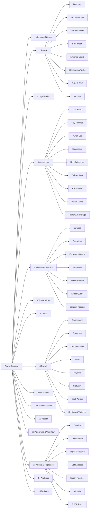
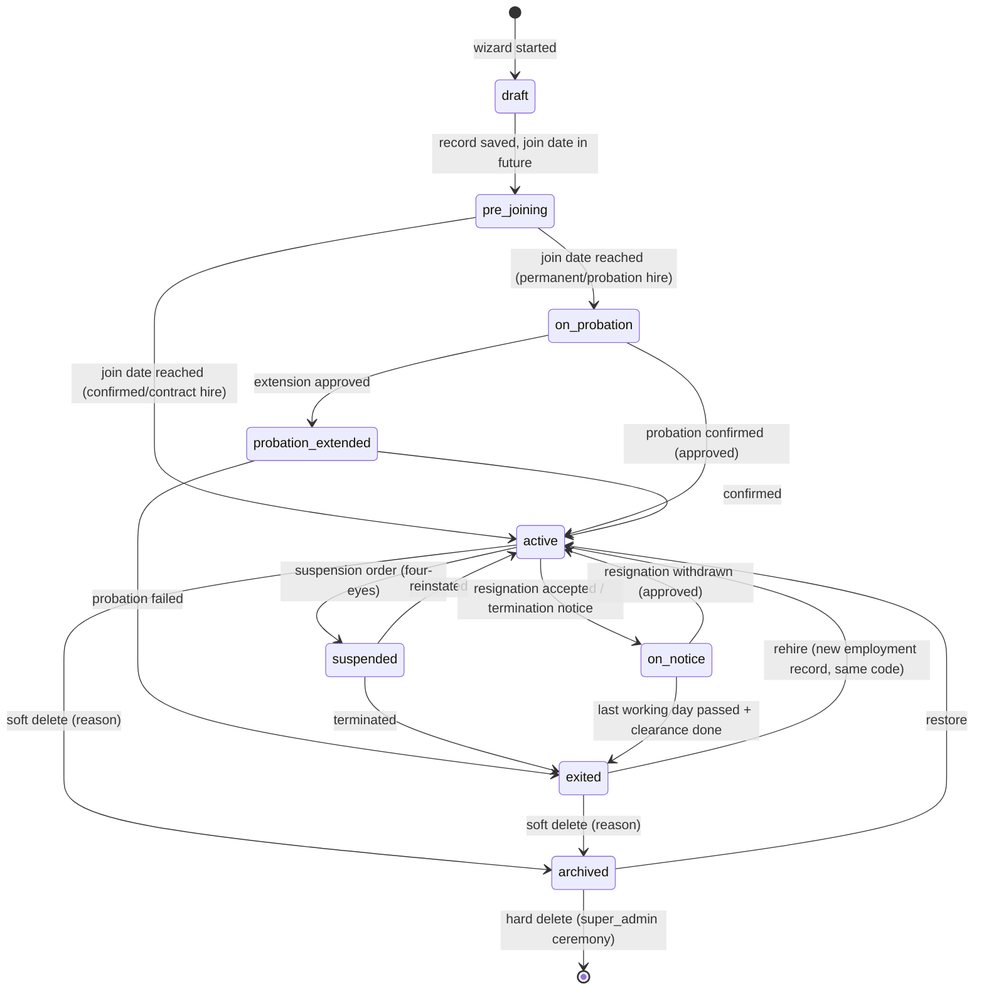
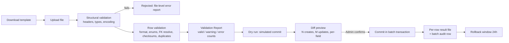
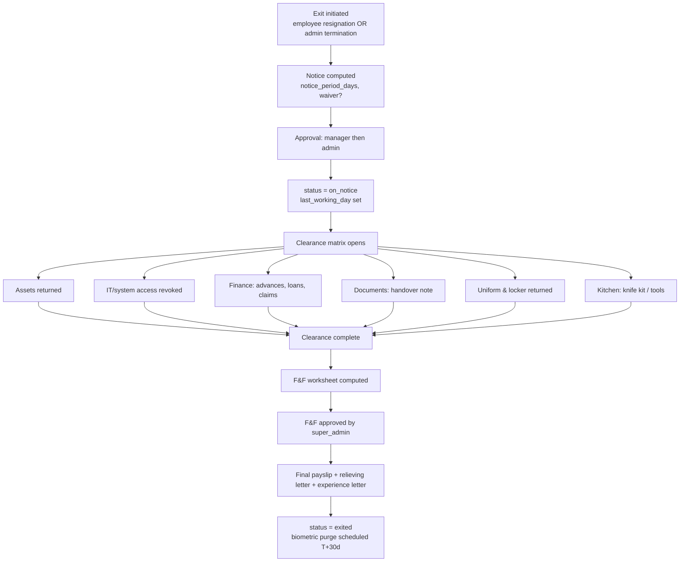
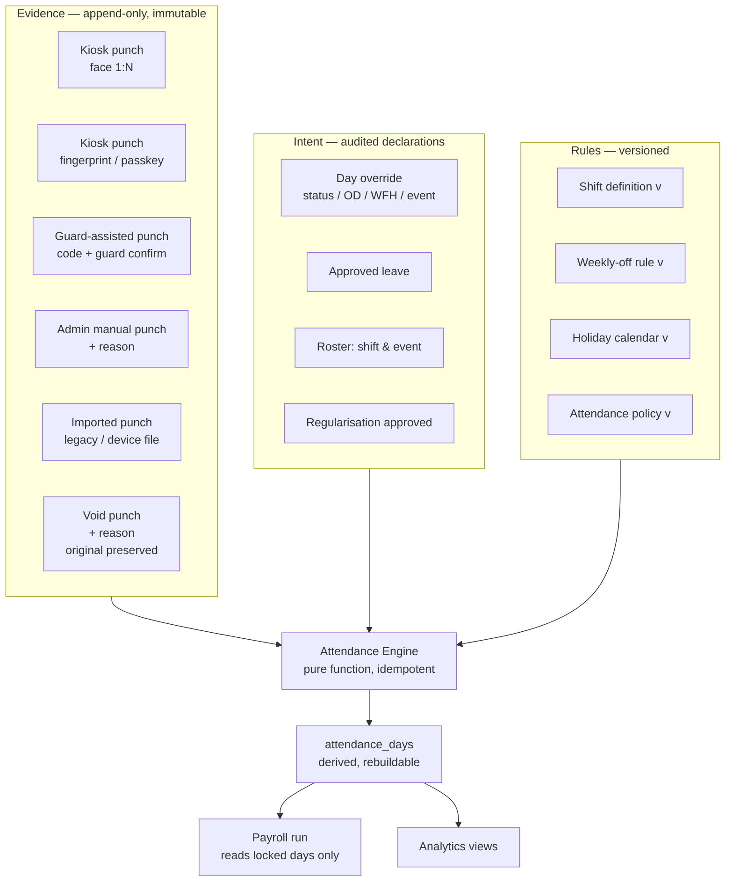
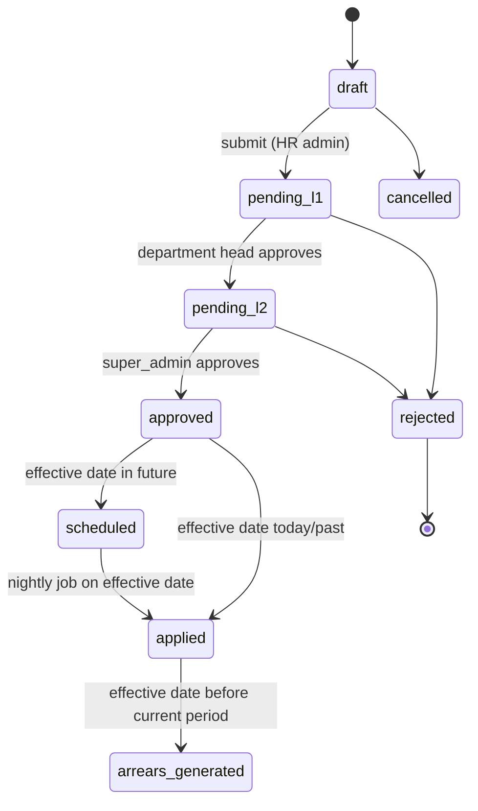
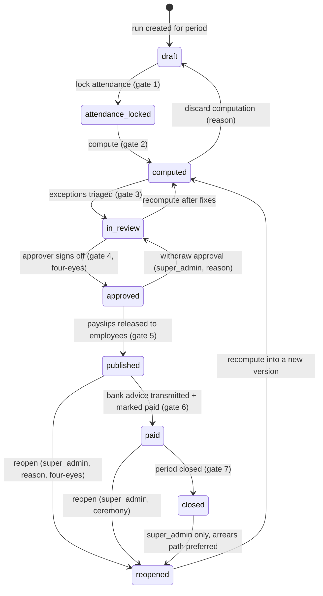

# 03 — Admin Console PRD
### Tamarind Tree HRMS · Machani Hospitalities LLP (MH LLP, LLPIN AAF-9371)
**Document owner:** Product · **Status:** Build-ready v1.0 · **All times IST (Asia/Kolkata)** · **All currency INR, Indian digit grouping**

---

## Purpose

This document specifies the **Admin Console** — the HR/operations control plane of the Tamarind Tree HRMS. It is the single authority on what an administrator can *see*, *change*, *approve*, *undo*, *export*, and *be held accountable for*. The client's instruction is the design brief verbatim: *"what should be visible, every controllability, every editable feature — everything should be controlled, with an audit trail. Everything should be timestamped; even a minute change should be audited. Attendance, everything."* and *"Every analytics should be there."* Accordingly this PRD treats three things as first-class product surfaces rather than plumbing: (a) the **raw-punch vs computed-day** separation that makes attendance defensible, (b) the **Audit & Compliance Console** that makes every mutation attributable and immutable, and (c) the **Analytics catalogue plus a binding Metric Dictionary** so that no two screens in the product can ever disagree about a number — the single most visible defect in the incumbent system we are replacing. Everything specified here is scoped to a ~30–60 person hospitality workforce at a 5-acre heritage event venue on Kanakapura Road, Bengaluru, that must scale cleanly to a few hundred employees across banquet, kitchen, housekeeping, security, gardening, sales and admin, with weekend-heavy event shifts, contract and probation staff, and normal overtime.

**Companion documents:** [`00-master-plan.md`](00-master-plan.md) · [`01-prd-employee.md`](01-prd-employee.md) · [`02-prd-manager.md`](02-prd-manager.md) · [`04-data-model.md`](04-data-model.md) · [`05-attendance-kiosk.md`](05-attendance-kiosk.md) · [`06-ai-agent.md`](06-ai-agent.md) · [`07-design-system.md`](07-design-system.md) · [`08-architecture.md`](08-architecture.md) · [`09-documents-contracts-comms.md`](09-documents-contracts-comms.md)

---

## Table of contents

| § | Section |
|---|---|
| 0 | [Decisions register, assumptions, and global conventions](#0-decisions-register-assumptions-and-global-conventions) |
| 1 | [Admin information architecture](#1-admin-information-architecture) |
| 2 | [Admin home — the Command Centre](#2-admin-home--the-command-centre) |
| 3 | [Employee lifecycle management](#3-employee-lifecycle-management) |
| 4 | [Organisation structure configuration](#4-organisation-structure-configuration) |
| 5 | [Attendance administration](#5-attendance-administration) |
| 6 | [Shift, roster & policy engine](#6-shift-roster--policy-engine) |
| 7 | [Leave administration](#7-leave-administration) |
| 8 | [Payroll administration](#8-payroll-administration) |
| 9 | [Document control](#9-document-control) |
| 10 | [Communications](#10-communications) |
| 11 | [Asset management](#11-asset-management) |
| 12 | [Approvals & workflow administration](#12-approvals--workflow-administration) |
| 13 | [The Audit & Compliance Console](#13-the-audit--compliance-console) |
| 14 | [Analytics & reporting](#14-analytics--reporting) |
| 15 | [System settings](#15-system-settings) |
| 16 | [Admin AI assistant (org-wide scope)](#16-admin-ai-assistant-org-wide-scope) |
| 17 | [Guard / kiosk operator administration](#17-guard--kiosk-operator-administration) |
| 18 | [Permission model — capability matrix](#18-permission-model--capability-matrix) |
| 19 | [Cross-cutting UX contract for the admin console](#19-cross-cutting-ux-contract-for-the-admin-console) |
| 20 | [Acceptance criteria & definition of done](#20-acceptance-criteria--definition-of-done) |
| 21 | [Open questions the client must confirm](#21-open-questions-the-client-must-confirm) |

---

# 0. Decisions register, assumptions, and global conventions

## 0.1 Entity note

The client referred to the company as *"MH LLP Machani Hospital"*. The correct legal entity is **Machani Hospitalities LLP** (LLPIN **AAF-9371**, incorporated 15-Mar-2016, RoC Bengaluru) — a **hospitality** business operating The Tamarind Tree event venue, not a hospital. Throughout the admin console, the *legal employer name* on payslips, letters and statutory files is `MACHANI HOSPITALITIES LLP`; the *brand name* in the UI chrome and employee-facing communications is `The Tamarind Tree`. Both are stored on the entity record (§4.1) and never hard-coded (a defect we observed in the reference repo, where company identity was scattered across components).

## 0.2 Decisions register

Every row is a decision, not an option. Rationale is one line. These bind the build.

| # | Area | Decision | Rationale |
|---|---|---|---|
| D-01 | Personas | Four tiers ship: `employee`, `manager`, `admin`, `super_admin`. `super_admin` is a **technical tier**, not a product persona. | Destructive and irreversible operations (payroll deletion, hard delete, role grants, biometric purge, audit export, period unlock) must be separable from day-to-day HR work; without it the only safe answer to "who can wipe payroll?" is "everyone in HR". |
| D-02 | Employee code | `TT` + 4-digit zero-padded monotonic sequence → **`TT0001`**. Extends to 5 digits past `TT9999`. Immutable for life; never reused; rehires keep their original code. | Short enough to speak aloud at the gate ("T-T-zero-zero-four-two") and to print on a swipe card; year-prefixed codes (`TT2026001`) leak joining year onto every artefact, break on rehire, and mis-sort after a year change. Flat sequences also avoid the incumbent's multi-prefix mess (`SSSRC062` vs `MIDCC001`). |
| D-03 | Second-class IDs | Contract, probation, seasonal and guard staff get codes from the **same** series. No `C-`/`TMP-` prefixes. | A prefix that encodes employment type becomes wrong the day someone is confirmed, and turns a neutral identifier into a status badge on their ID card. |
| D-04 | Kiosk device code | `TTK-01`, `TTK-02` … on `kiosk_devices.device_code`. Guard accounts are ordinary employee accounts with the `kiosk_operator` capability, device-pinned. | Keeps the three product personas intact; the guard is an employee of the venue, not a fourth persona. |
| D-05 | Time | Every timestamp is stored `timestamptz` (UTC on the wire) and **rendered IST**. Every calendar-day derivation uses `(ts AT TIME ZONE 'Asia/Kolkata')::date`. Audit rows carry **both** `occurred_at_utc` and `occurred_at_ist` (the latter generated, not written by clients). | The reference repo derived the attendance date from `toISOString()` — the UTC date — so any punch between 00:00 and 05:30 IST landed on the previous day. We will not repeat that. |
| D-06 | Date display | **One** format everywhere: `DD-MMM-YYYY` (`25-Jul-2026`). Times `HH:mm` 24-hour in operational/audit surfaces, `hh:mm a` in employee-facing surfaces. Durations `H:MM` (`8:45`). Month labels `MMM-YYYY` (`Jul-2026`). | The incumbent mixed `DD-MMM-YYYY`, `MM/DD/YYYY` and `JUN 2026` on adjacent cards. All formatting flows through `src/lib/format.ts` (`fmtDate`, `fmtDateTime`, `fmtTime`, `fmtDuration`, `fmtINR`, `fmtPercent`, `fmtRatio`) — no component may call `toLocaleString` directly (lint rule). |
| D-07 | Money | INR, `Intl.NumberFormat('en-IN')`, always 2 decimals, `₹` prefix, right-aligned, tabular numerals. Stored as `numeric(14,2)`; never `float`. | The incumbent showed `110000` in one table and `1,10,000` in another, and a PF number as `1.0202E+11`. Floats are banned for money and for identity numbers alike. |
| D-08 | Identity numbers | PAN, Aadhaar, UAN, PF, ESIC, bank account are **`text`**, never numeric. Import pipeline rejects any cell whose raw value matches `/[eE][+-]?\d+/` or has lost leading zeros. | Directly fixes the `1.0202E+11` defect at the source rather than at the renderer. |
| D-09 | Sentinel dates | Banned. Open-ended validity is `NULL`, rendered `No expiry`. Any `01-Jan-3000` found in migration data is converted to `NULL` with an audit note. | The incumbent's `Valid To 01-Jan-3000` leaks storage tricks into the UI and poisons date maths. |
| D-10 | Internal codes in UI | Banned. Every configuration object has a mandatory human `name` shown in the UI and an optional `code` shown only in exports and audit rows. `None1`, `PP001`, `None` become `No late deduction`, `Monthly 26→25`, `Standard General`. | Configuration names are product copy, not database keys. |
| D-11 | Raw column names in UI | Banned. Every grid column has an explicit label in a column registry; `Date_Dt` cannot happen because grids do not auto-bind to result-set keys. | |
| D-12 | Spelling / copy | `Attendance`, `Beneficiary`, `Organisation` (en-IN), `Comp-off`, `Weekly off`, `Payslip`, `Regularisation`. A copy lint file (`copy-blocklist.json`) fails CI on `Attendence`, `Benificiary`, `Attendence Details`. | The incumbent shipped `Attendence Details` and `Benificiary Name` in production. |
| D-13 | Attendance model | **Two-layer, permanently separated**: `attendance_punches` (append-only, immutable, never edited) and `attendance_days` (fully derived, freely recomputable). Admin edits punches or writes an explicit day **override**; the admin never hand-edits a derived field. | Makes recompute idempotent, makes payroll reproducible, and makes "who changed my attendance?" answerable in one query. This is the central architectural decision of the attendance domain. |
| D-14 | Face matching | **1:N identification** against the active template set, server-side, inside a Supabase Edge Function. The kiosk sends the live 128-D descriptor; the server chooses the identity and writes the punch. Client never asserts identity. | The client asked for "the system identifies who it is". The reference repo did 1:1 verification entirely client-side under row-ownership RLS — a UX gate, not a security boundary. |
| D-15 | Day boundary | First scan of the IST day = check-in; **extreme last** scan of the IST day = check-out; all intermediate scans retained and visible. A day with exactly one scan is `SINGLE_PUNCH` exception, not a zero-hours day. | Client instruction, verbatim. |
| D-16 | Pay period | Seeded as **`Monthly 26→25`**: attendance window 26th of previous month → 25th of current month; cutoff 25th 23:59:59 IST; payroll run 26th–28th; payday last working day. Configurable per entity. | The incumbent's `01–25` window silently orphans days 26–31, which is exactly where its `Paid Days 15 vs 16` and `Weekly Offs 7 vs 8` disagreements come from. A 26→25 window pays for every calendar day exactly once with zero estimation. Flagged in §21 for client sign-off. |
| D-17 | Ratios | `late_pct = late_days / working_days × 100`, clamped to `[0,100]`, rendered `—` when `working_days = 0`. Every ratio metric in the product is defined once in the Metric Dictionary (§14.2) and consumed from a single server-side view. | The incumbent rendered `17/17` late arrivals as `1,700.00%`. |
| D-18 | Averages | `avg = sum(values) / count(days_with_data)`; rendered `—` when `count = 0`. Never `0`. Denominator semantics are named in the metric key (`avg_hours_per_worked_day` vs `total_hours_over_working_days`) and shown in the widget's info tooltip. | The incumbent showed `Avg: 0Hrs` over a series of 9-hour days, and flipped numerator meaning between two adjacent widgets (`133/17` total vs `9/17` average). |
| D-19 | Sensitive-field masking | Salary, CTC, bank account, IFSC, PAN, Aadhaar, UAN, PF, ESIC, face template are **masked by default for every persona including admin**. Reveal is a per-field, per-record action that writes a `data_access` audit row. Aadhaar renders `XXXX XXXX 0484`. | The incumbent exposed full PAN, Aadhaar and bank account with no masking and no access log. DPDP Act 2023 makes the access log non-optional. |
| D-20 | Audit immutability | `audit_log` is append-only (no `UPDATE`/`DELETE` grants to any role, enforced by trigger and by revoked privileges), each row carrying `prev_hash` and `row_hash` forming a per-day hash chain anchored in `audit_anchors`. | "Even a minute change should be audited" implies the audit itself cannot be quietly edited. |
| D-21 | Reason strings | Every override, backdated write, unlock, mask-reveal, export of personal data, hard delete, and manual payroll edit requires a free-text `reason` of ≥ 15 characters, stored on the audit row. Enforced server-side, not in the form. | A reason box that the API does not enforce is decoration. |
| D-22 | Four-eyes | A defined set of actions (§18.3) require a **second distinct approver** who is not the initiator. Self-approval is rejected by the API. | |
| D-23 | Soft delete | Employees, and all configuration objects that payroll or attendance reference, are soft-deleted (`deleted_at`, `deleted_by`, `deletion_reason`) and remain fully queryable in Archive. Hard delete is `super_admin` + confirmation ceremony + is itself audited with a snapshot of the deleted payload. | |
| D-24 | Grid contract | One `DataGrid` component org-wide: per-column filter, per-column sort, global search, refresh, column chooser, density toggle, saved views, export (CSV/XLSX/PDF), server-side pagination with page sizes 10/25/50/100/200, sticky header, sticky first column, illustrated empty state, error state, skeleton loading state, keyboard navigation, and a URL-serialised state so any filtered view is shareable. Default page size **25** (not 5). | The incumbent's grids were good; its default page size of 5 and non-shareable state were not. |
| D-25 | Deep-linking | Every admin surface is a **real route** with URL-encoded filters. No tab-only state. | The reference repo made the entire admin app 12 tabs on one route — undeep-linkable, unbookmarkable, hostile to support. |
| D-26 | Recompute safety | The attendance recompute and payroll compute engines are **pure functions of versioned inputs**. Policy rows are versioned; a payroll run pins the version ids it used. Re-running a closed period reproduces byte-identical output. | "Payroll numbers must be reproducible." |
| D-27 | Empty states | Every list, chart and picker has an authored empty state with a one-line explanation and a primary action. The Company Policy screen's blank canvas (a real defect in the incumbent) is not permitted; CI has a check that every `DataGrid` and `ChartCard` receives an `emptyState` prop. | |
| D-28 | AI overlay | The AI assistant is a **right-side drawer** at `z-index: 40`, never a floating bubble overlapping content, and never over primary actions. | The incumbent's chatbot bubble physically covered the "Add Dependent" button. |
| D-29 | Probation | Default probation 90 days for permanent hires, 180 days for kitchen leadership roles (Sous Chef and above). Confirmation is an explicit dated event with an approval, not a silent date passing. | |
| D-30 | Event-linked operations | Attendance, overtime and incentives can be attributed to an **Event** (`events` table: event code, client name, date, hall, headcount, department demand). This is Tamarind Tree's core unit of work and unlocks `cost per event` analytics. | A wedding venue's labour cost is meaningless per-calendar-month and meaningful per-event. |

## 0.3 Assumptions callout

> **ASSUMPTIONS — confirm before Sprint 3.**
> 1. **A-01** Pay period is 26→25 monthly with payday on the last working day (D-16). If MH LLP's accounting runs 1→30 with a 25th attendance cutoff, we keep the entity-level config but seed differently; the engine is unaffected.
> 2. **A-02** Karnataka statutory baselines used for seed data: EPF 12 % on basic + DA capped at ₹15,000 wages (employer 12 % split 8.33 % EPS / 3.67 % EPF + 0.50 % EDLI + admin charges), ESI 0.75 % employee / 3.25 % employer for gross ≤ ₹21,000, Karnataka Professional Tax ₹200/month for monthly salary ≥ ₹25,000, Karnataka LWF ₹20 employee / ₹40 employer annually in December, gratuity provision 4.81 % of basic, statutory bonus 8.33 % for eligible wages ≤ ₹21,000. **All rates live in a versioned `statutory_rates` table; none are hard-coded.** Counsel/CA must confirm current-year values before the first live payroll run.
> 3. **A-03** Leave entitlements seeded per Karnataka Shops & Commercial Establishments Act, 1961: Earned Leave 1 day per 20 days worked (≈18/year, carry-forward cap 45), Sick Leave 12/year, Casual Leave 12/year, Maternity 182 days, Paternity 5 days (company policy). To be confirmed with counsel; all values are configuration, not code.
> 4. **A-04** One legal entity (MH LLP) and one primary work location (Avalahalli venue) at go-live; the schema is multi-entity and multi-location from day one because the Machani Group pattern (multiple LLPs, shared HR) is visible in the incumbent's data.
> 5. **A-05** The client's "shared mobile camera kiosk operated by a security guard" is a **single** device at go-live (`TTK-01`), with a second device (`TTK-02`) as hot spare at the staff entrance. Device count is configuration.
> 6. **A-06** Biometric fingerprint is delivered as **WebAuthn platform authenticator (passkey)** on the kiosk device and on employee phones — i.e. the device's own fingerprint sensor, server-verified. No dedicated fingerprint hardware is procured at go-live; the integration seam for a future L1 fingerprint reader is specified in §15.4.
> 7. **A-07** Employee-facing personal email is optional (many venue staff will not have one); the welcome credential delivery therefore supports **print-slip** and **WhatsApp-later** channels alongside email (§3.3).
> 8. **A-08** Salary for the majority of venue staff is monthly-fixed; hourly-rate staff are handled through OT and event incentives rather than a separate hourly payroll engine at v1.
> 9. **A-09** Attendance for gardening/housekeeping contract labour supplied by a vendor is tracked (headcount + hours, for vendor billing verification) but **not** paid through this payroll. A `workforce_type` of `vendor_contract` marks them and excludes them from payroll runs.
> 10. **A-10** The audit retention floor is **8 years** for payroll and statutory records (Income-tax Act / EPF record-keeping practice) and **3 years** for operational audit; biometric templates are purged 30 days after exit (§13.7).

## 0.4 Global conventions used by every admin screen

| Convention | Specification |
|---|---|
| Route prefix | `/admin/**`. Super-admin-only routes live under the same tree but are gated and visually marked with a `SUPER ADMIN` chip in the page header. |
| Page anatomy | Breadcrumb → page title + one-line purpose → context bar (entity/location/period selectors, persisted per user) → primary actions (max 2 buttons + overflow) → content → audit affordance ("View change history" link present on every record page). |
| Record page anatomy | Identity header (photo, name, code, status chips) → tab strip → per-section cards with a section-level Edit action → right rail with "Recent changes" (last 5 audit rows for this record) and "Open requests". |
| Editing model | Section-level edit dialogs with explicit Save/Cancel. Optimistic UI is **not** used for anything audited; the server's post-write row is authoritative and re-rendered. Every save dialog shows a **diff preview** ("3 fields will change") before commit for records where any changing field is audited-sensitive. |
| Destructive confirmation | Two tiers. *Tier 1* (reversible): confirm dialog naming the object. *Tier 2* (irreversible, super_admin): type the object's exact code (`TT0042`), select a reason from a taxonomy, type a free-text reason ≥ 15 chars, tick a consequences checklist, and (for four-eyes actions) name a second approver who must confirm in their own session within 24 h. |
| Bulk actions | Every grid supports selection → bulk action bar. Bulk actions above 25 rows run as a **background job** with a progress toast, produce a per-row result file, and write one `batch` audit row plus one child audit row per affected record. |
| Reason capture | A single `<ReasonDialog>` component (taxonomy select + free text + optional attachment) used by all override paths, so reasons are structured and analysable, not just free prose. |
| Impersonation | `super_admin` may "View as employee" (read-only) to debug a self-service issue. Sessions are banner-marked, time-boxed to 30 minutes, cannot write, and emit `security.impersonation.started/ended` audit rows. `admin` cannot impersonate. |
| Notifications | Admin bell = actionable items only (approvals, failures, expiries). Everything informational goes to the Alert Feed on the Command Centre. |
| Keyboard | `⌘K` global command palette (jump to employee by code/name, jump to any admin page, run a saved report). `g` `then` `a` → Attendance, `g` `p` → People, `g` `y` → Payroll. |
| Accessibility | WCAG 2.2 AA. All grids keyboard-operable; all charts have a "View as table" toggle and an accessible summary sentence generated from the metric definition. |
| Performance budget | Command Centre TTI ≤ 2.0 s on a 4 Mbps connection; any grid's first page ≤ 400 ms server time at 300 employees × 3 years of attendance; any analytics widget ≤ 1.5 s or it must be materialised. |

---

# 1. Admin information architecture

## 1.1 Navigation tree

The admin console uses a **persistent left sidebar** with 15 top-level sections, collapsible to an icon rail, plus a top bar carrying the entity/location context switcher, global search, live IST clock, alert bell, AI drawer trigger, and account menu. Sections expand to reveal pages; the active page is always reachable by URL.

## 1.2 Complete page inventory

`Tier` column: **A** = reachable by `admin` and `super_admin`; **S** = `super_admin` only; **A/S** = visible to `admin`, but one or more actions on the page are `super_admin`-gated (detailed in §18).

### Section 1 — Command Centre

| Route | Page | Purpose | Tier |
|---|---|---|---|
| `/admin` | Command Centre | Org-wide live KPIs, alert feed, quick actions, today's shift coverage vs events. | A |
| `/admin/alerts` | Alert Feed (full) | Full, filterable history of system alerts with acknowledge/assign/snooze. | A |
| `/admin/tasks` | My Admin Tasks | Everything awaiting *this* admin: approvals, failed jobs, expiring items assigned to them. | A |

### Section 2 — People

| Route | Page | Purpose | Tier |
|---|---|---|---|
| `/admin/people` | Employee Directory | The master grid: every employee, every column, saved views, bulk actions, export. | A |
| `/admin/people/new` | Add Employee wizard | 7-step onboarding wizard creating the employee, auth account, credentials, and onboarding tasks. | A |
| `/admin/people/import` | Bulk Import | Template download, upload, validate, dry-run, commit, per-row error export, batch rollback. | A |
| `/admin/people/:code` | Employee 360 | 13-tab record: the complete employee master. | A/S |
| `/admin/people/:code/attendance` | Employee 360 → Attendance | Per-employee day records, punches, exceptions, regularisations. | A |
| `/admin/people/:code/compensation` | Employee 360 → Compensation | Effective-dated salary structure, revisions, versioned history, arrears. | A/S |
| `/admin/people/:code/audit` | Employee 360 → History | Field-level change log for this employee, all sources. | A |
| `/admin/people/lifecycle` | Lifecycle Board | Kanban of probation due, contract expiring, notice period, clearance, F&F pending, rehire eligible. | A |
| `/admin/people/onboarding` | Onboarding Tasks | Checklist board across all new joiners (documents, face enrolment, asset issue, policy ack). | A |
| `/admin/people/transfers` | Transfers & Promotions | Effective-dated movement register with approval state. | A |
| `/admin/people/exits` | Exits & Clearance | Resignation/termination register, clearance matrix, F&F worksheet. | A/S |
| `/admin/people/archive` | Archive (soft-deleted) | Soft-deleted employees with reason, deleter, date; restore; hard-delete ceremony. | A/S |
| `/admin/people/rehire` | Rehire | Search exited employees, view exit reason and rehire eligibility, restore-with-new-employment. | A |

### Section 3 — Organisation

| Route | Page | Purpose | Tier |
|---|---|---|---|
| `/admin/org/entities` | Legal Entities | MH LLP and any future entity: legal name, brand name, LLPIN/CIN, PAN, TAN, GSTIN, PF/ESI codes, registered address, letterhead, signatories. | A/S |
| `/admin/org/locations` | Locations | Venue/office records with address, geofence, timezone (always IST), holiday calendar, default shift, kiosk devices. | A |
| `/admin/org/departments` | Departments | Banquet, Kitchen, Housekeeping, Security, Gardening & Grounds, Sales & Events, Finance & Admin, Maintenance. | A |
| `/admin/org/sections` | Sections | Sub-units under a department (Kitchen → Hot Kitchen, Cold Kitchen, Bakery, Dishwash). | A |
| `/admin/org/designations` | Designations | Job titles mapped to grade, department, and default policies. | A |
| `/admin/org/grades` | Grades & Bands | Grade ladder with salary band min/mid/max, OT eligibility default, notice period, probation days. | A |
| `/admin/org/cost-centres` | Cost Centres | Cost centre master for payroll allocation and per-event costing. | A |
| `/admin/org/chart` | Org Chart | Visual hierarchy, drag-to-reparent, dotted-line overlay, span-of-control heat. | A |
| `/admin/org/custom-fields` | Custom Field Designer | Define custom employee fields (type, options, required, visibility, editability, approval requirement). | A |
| `/admin/org/events` | Event Register | Venue events (weddings, corporate, shoots) with date, hall, guest count, departmental labour demand. | A |

### Section 4 — Attendance

| Route | Page | Purpose | Tier |
|---|---|---|---|
| `/admin/attendance/live` | Live Board | Real-time who's in / out / late / yet to reach / on leave, refreshed via Realtime; gate feed. | A |
| `/admin/attendance/days` | Day Records | The computed day record grid — the payroll-relevant truth. Filter by any dimension. | A |
| `/admin/attendance/punches` | Punch Log | The raw, immutable punch stream with match metadata, device, guard, photo thumbnail, confidence. | A |
| `/admin/attendance/punches/new` | Manual Punch | Insert a punch on behalf of an employee with mandatory reason and source `admin_manual`. | A |
| `/admin/attendance/exceptions` | Exception Dashboard | 14 exception classes with counts, age, assignee, bulk resolve. | A |
| `/admin/attendance/regularisations` | Regularisation Requests | Two-level approval queue for employee correction requests. | A |
| `/admin/attendance/bulk` | Bulk Actions | Mark absent/present/half-day/on-duty/WFH/on-event across a selection, with reason. | A |
| `/admin/attendance/recompute` | Recompute Console | Dry-run and commit a date-range recompute; view run history and diffs. | A/S |
| `/admin/attendance/locks` | Period Locks | Lock/unlock attendance periods; see what is locked and by whom. | A/S |
| `/admin/attendance/roster` | Roster Planner | Assign shifts by employee × date; templates; copy week; publish; conflict detection. | A |
| `/admin/attendance/coverage` | Event Coverage | Required vs rostered vs actually-present headcount per department per event. | A |

### Section 5 — Kiosk & Biometrics

| Route | Page | Purpose | Tier |
|---|---|---|---|
| `/admin/kiosk/devices` | Devices | Register, name, locate, pin, health-check, revoke kiosk devices; offline queue depth; app version. | A/S |
| `/admin/kiosk/operators` | Operators | Grant/revoke `kiosk_operator` to employees; device binding; shift window; active sessions; force sign-out. | A |
| `/admin/kiosk/enrolment` | Enrolment Queue | Employees without an active template, self-enrolments awaiting approval, failed enrolments. | A |
| `/admin/kiosk/templates` | Face Templates | Per-employee template versions, quality score, sample count, enroller, retire/re-enrol, threshold override. | A/S |
| `/admin/kiosk/match-review` | Match Review | Every identification attempt: top-3 candidates, distances, threshold used, accepted/rejected, photo. | A |
| `/admin/kiosk/abuse` | Abuse Review Queue | Buddy-punch candidates, duplicate-identity collisions, liveness failures, impossible-geometry scans. | A |
| `/admin/kiosk/consent` | Biometric Consent Register | Consent version, granted/withdrawn timestamps, method, witness — the DPDP artefact. | A |
| `/admin/kiosk/policy` | Matching & Liveness Policy | Global/device thresholds, liveness level, retry limits, fallback rules, photo retention. | A/S |
| `/admin/kiosk/purge` | Template Purge | Bulk purge of biometric templates for exited employees; irreversible. | S |

### Section 6 — Time Policies

| Route | Page | Purpose | Tier |
|---|---|---|---|
| `/admin/time/shifts` | Shift Master | Shift definitions incl. split-shift segments, grace, thresholds, night attribution, OT trigger. | A |
| `/admin/time/weekly-offs` | Weekly-Off Rules | Named rules with day-of-week + weeks-of-month (1–5) applicability and rotational patterns. | A |
| `/admin/time/holidays` | Holiday Calendars | Per-year calendars with national/regional/optional/restricted/venue-closure types, location scoping. | A |
| `/admin/time/attendance-policies` | Attendance Policy Sets | Late, early-going, OT, late→leave conversion, min-hours, sandwich, punch mode — as named sets. | A |
| `/admin/time/pay-periods` | Pay Periods | Named periods with window, cutoff, lock date, payday. | A/S |
| `/admin/time/assignments` | Policy Assignments | Assign any policy to org/entity/location/department/designation/grade/employment-type/employee with effective dates; conflict resolver preview. | A |
| `/admin/time/resolver` | "Why this policy?" | Diagnostic: pick an employee + date, see exactly which policy rows resolved and why. | A |

### Section 7 — Leave

| Route | Page | Purpose | Tier |
|---|---|---|---|
| `/admin/leave/types` | Leave Type Master | 20+ configurable attributes per leave type (§7.1). | A |
| `/admin/leave/balances` | Balances | Per-employee, per-type, per-year balance grid with drill to ledger. | A |
| `/admin/leave/ledger/:code` | Balance Ledger | Every credit/debit line with origin, actor, timestamp — the leave audit. | A |
| `/admin/leave/requests` | Leave Requests | All requests, all states, admin override with reason. | A |
| `/admin/leave/adjustments` | Manual Adjustments | Credit/debit a balance with mandatory reason and category. | A |
| `/admin/leave/comp-off` | Comp-Off Ledger | Earned comp-offs with earning event/date, expiry, availed/encashed state. | A |
| `/admin/leave/rollover` | Year-End Rollover | Dry-run and commit carry-forward, lapse, encashment; per-employee preview. | A/S |
| `/admin/leave/calendar` | Org Leave Calendar | Month/quarter grid of who is on leave, by department, with event overlay. | A |
| `/admin/leave/encashment` | Encashment | Encashment requests and payouts feeding payroll. | A |

### Section 8 — Payroll

| Route | Page | Purpose | Tier |
|---|---|---|---|
| `/admin/payroll/components` | Salary Components | Earnings, deductions, employer contributions; formula, taxability, PF/ESI applicability, computation order. | A/S |
| `/admin/payroll/structures` | Structure Templates | Reusable component sets per grade/designation. | A |
| `/admin/payroll/compensation` | Employee Compensation | Per-employee effective-dated structure with versioned history and CTC roll-up. | A/S |
| `/admin/payroll/revisions` | Revisions | Revision workflow: draft → approval → effective; arrears computation preview. | A/S |
| `/admin/payroll/runs` | Payroll Runs | Run lifecycle board with per-stage gates and exception counts. | A/S |
| `/admin/payroll/runs/:id` | Payroll Run detail | Register, exceptions, variance vs previous, approvals, publish, mark paid, close, reopen. | A/S |
| `/admin/payroll/payslips` | Payslips | All payslips, all periods; view, edit-with-reason, regenerate, re-issue, email. | A/S |
| `/admin/payroll/overtime` | Overtime & Event Incentives | OT derived from attendance; event incentive rules and payouts. | A |
| `/admin/payroll/reimbursements` | Reimbursements | Local claims, travel, expense payouts routed into payroll or off-cycle. | A |
| `/admin/payroll/statutory` | Statutory | PF/ESI/PT/TDS/LWF/gratuity settings, monthly liability, return files (ECR, ESI, PT). | A/S |
| `/admin/payroll/form16` | Form 16 Distribution | Upload/generate Part A & B, bulk distribute, track downloads. | A |
| `/admin/payroll/bank-advice` | Bank Advice | Generate NEFT/RTGS payment files per bank format; download register; mark transmitted. | A/S |
| `/admin/payroll/register` | Payroll Register | The canonical per-run register with every component column. | A |
| `/admin/payroll/variance` | Variance Report | This run vs previous with per-employee, per-component explanations. | A |
| `/admin/payroll/arrears` | Arrears & Reversals | Arrears queue, negative arrears, reversal/rollback path. | A/S |

### Section 9 — Documents

| Route | Page | Purpose | Tier |
|---|---|---|---|
| `/admin/documents/types` | Document Type Master | Type, category, required-for-role rules, expiry behaviour, retention, watermark, approval need. | A |
| `/admin/documents/repository` | Document Repository | Every document in the system, filterable by employee/type/status/expiry; bulk actions. | A |
| `/admin/documents/pending` | Approval Queue | Documents awaiting HR verification. | A |
| `/admin/documents/expiry` | Expiry Tracker | Expiring/expired documents with reminder cadence state (visa, passport, driving licence, FSSAI food-handler certificates, security guard licences). | A |
| `/admin/documents/templates` | Letter & Contract Templates | Offer letter, appointment letter, confirmation, increment, transfer, warning, relieving, experience, NOC. | A |
| `/admin/documents/generate` | Bulk Generation | Generate letters/Form 16 for a selection; preview; distribute. | A |
| `/admin/documents/esign` | E-Sign Requests | Signature request lifecycle, signer chain, reminders, evidence pack. | A |
| `/admin/documents/access-log` | Document Access Log | Who viewed/downloaded/printed which document, when, from where. | A |

### Section 10 — Communications

| Route | Page | Purpose | Tier |
|---|---|---|---|
| `/admin/comms/announcements` | Announcements | In-app announcements with audience, schedule, pin, expiry. | A |
| `/admin/comms/broadcasts` | Broadcasts | Email/WhatsApp(future) broadcast composer with audience builder and scheduling. | A |
| `/admin/comms/templates` | Message Templates | Named, versioned templates with merge tokens and preview. | A |
| `/admin/comms/policies` | Policy Publication | Publish a policy requiring acknowledgement; version; supersede. | A |
| `/admin/comms/acknowledgements` | Acknowledgement Compliance | Who has/hasn't acknowledged which policy version; nudge; export. | A |
| `/admin/comms/delivery` | Delivery Log | Per-recipient sent/delivered/bounced/opened/clicked/acknowledged with provider ids. | A |
| `/admin/comms/helpdesk` | Help Desk | Employee ticket queue with category, SLA, assignee, resolution. | A |

### Section 11 — Assets

| Route | Page | Purpose | Tier |
|---|---|---|---|
| `/admin/assets/master` | Asset Master | Non-consumable asset register (tag, category, serial, value, condition, location, custodian). | A |
| `/admin/assets/consumables` | Consumable Stock | Uniforms, chef coats, gloves, safety shoes: stock levels, issue, reorder point. | A |
| `/admin/assets/allocations` | Allocations | Issue/handover with employee acknowledgement; open allocations by employee. | A |
| `/admin/assets/returns` | Returns & Recalls | Return, recall, condition assessment, loss/damage recovery. | A |
| `/admin/assets/history` | Asset History | Chronological handover/return/recall/transfer/write-off trail per asset and per employee. | A |
| `/admin/assets/exit-liability` | Exit Liability | Open assets per exiting employee feeding clearance and F&F. | A |

### Section 12 — Approvals & Workflow

| Route | Page | Purpose | Tier |
|---|---|---|---|
| `/admin/workflow/inbox` | Approval Inbox | Everything awaiting admin action across all request types, with age and SLA. | A |
| `/admin/workflow/designer` | Workflow Designer | Per-request-type approval chains: levels, resolver, parallel/sequential, auto-approve, SLA, escalation. | A/S |
| `/admin/workflow/delegations` | Delegations | Who is covering for whom, with date range and scope. | A |
| `/admin/workflow/sla` | SLA & Escalations | Breach dashboard, escalation history, reminder cadence config. | A |
| `/admin/workflow/overrides` | Override Log | Every admin override of a workflow decision with reason and diff. | A |

### Section 13 — Audit & Compliance

| Route | Page | Purpose | Tier |
|---|---|---|---|
| `/admin/audit` | Audit Timeline | The unified, filterable event stream across every module. | A |
| `/admin/audit/diff/:eventId` | Diff Viewer | Field-level old → new with type-aware rendering and related-event context. | A |
| `/admin/audit/entity/:type/:id` | Entity History | All events for one entity, any module. | A |
| `/admin/audit/user/:userId` | User Activity Trail | Everything one actor did, including reads of sensitive fields. | A |
| `/admin/audit/sessions` | Login & Session Audit | Successful/failed logins, method (password/passkey/kiosk), IP, device, geo, session duration, forced sign-outs. | A |
| `/admin/audit/data-access` | Data-Access Audit | Every reveal/view/export of salary, bank, PAN, Aadhaar, face template, payslip, document. | A/S |
| `/admin/audit/exports` | Export Register | Every export: who, what, filters, row count, reason, file hash, download count. | A/S |
| `/admin/audit/integrity` | Integrity & Tamper Evidence | Hash-chain verification runs, anchor list, mismatch alerts. | S |
| `/admin/audit/dpdp` | DPDP Compliance Pack | Consent register, purpose register (RoPA), data-subject requests, breach log, retention schedule. | A/S |
| `/admin/audit/retention` | Retention Jobs | Scheduled purges, what they will delete, last run, dry-run preview. | S |

### Section 14 — Analytics

| Route | Page | Purpose | Tier |
|---|---|---|---|
| `/admin/analytics` | Analytics Home | Curated board of the 12 highest-value org KPIs with drill-through. | A |
| `/admin/analytics/attendance` | Attendance Analytics | Presence, punctuality, absenteeism, OT, coverage, kiosk usage, heatmaps. | A |
| `/admin/analytics/workforce` | Workforce Analytics | Headcount, joiners/leavers, attrition, tenure, span of control, diversity, probation, contract expiry. | A |
| `/admin/analytics/payroll` | Payroll & Cost Analytics | CTC trend, department cost, OT cost, cost per event, LOP impact, revision impact, statutory liability. | A/S |
| `/admin/analytics/leave` | Leave Analytics | Utilisation, liability/provision, comp-off liability, sandwich patterns, seasonality. | A |
| `/admin/analytics/compliance` | Compliance Analytics | Document completeness, expiry exposure, policy acknowledgement, consent coverage, audit volume. | A |
| `/admin/analytics/kiosk` | Kiosk Analytics | Scans/day, match confidence distribution, failure reasons, device uptime, guard throughput. | A |
| `/admin/analytics/ai` | AI Usage Analytics | Questions asked, intents, token spend, latency, satisfaction, denied-scope attempts. | A/S |
| `/admin/analytics/metrics` | Metric Dictionary | The binding definition of every metric in the product. | A |
| `/admin/analytics/scheduled` | Scheduled Reports | Recurring report deliveries: recipients, cadence, format, last run. | A |
| `/admin/analytics/builder` | Report Builder (P2) | Self-serve report composition over governed datasets. | A |
| `/admin/analytics/exports` | Data Exports & Warehouse | Full-table exports, warehouse sync config, API dataset endpoints. | S |

### Section 15 — Settings

| Route | Page | Purpose | Tier |
|---|---|---|---|
| `/admin/settings/branding` | Branding | Logo variants, palette, letterhead, payslip header, email header/footer, favicon, kiosk skin. | A |
| `/admin/settings/roles` | Roles & Permissions | Capability matrix editor; role assignment register. | S |
| `/admin/settings/flags` | Feature Flags | Per-module and per-feature toggles with audience targeting. | A/S |
| `/admin/settings/integrations` | Integrations | Email provider, WhatsApp (future), biometric hardware (future), accounting export, storage. | A/S |
| `/admin/settings/api` | API Keys & Webhooks | Key issue/rotate/revoke with scopes; webhook endpoints, secrets, delivery log, replay. | S |
| `/admin/settings/ai` | AI Configuration | Claude model, system prompts, tool allow-list, monthly budget, rate limits, redaction rules. | A/S |
| `/admin/settings/notifications` | Notification Templates | Every system email/in-app template, versioned, previewable, test-sendable. | A |
| `/admin/settings/localisation` | Localisation | Locale, date/number formats, week start, financial year, language packs (en-IN, kn-IN P2). | A |
| `/admin/settings/security` | Security | Password policy, session timeout, MFA, IP allowlist for admin, kiosk pinning, lockout. | S |
| `/admin/settings/backup` | Backup & Retention | Backup status, restore drills, retention schedule per data class. | S |
| `/admin/settings/health` | System Health | Edge function status, job queue, cron history, error rate, storage usage, Supabase quota. | A |

**Page count: 118 admin pages.** Every one is a route; none is a tab-only view.

## 1.3 Navigation rules

| Rule | Specification |
|---|---|
| Section visibility | A section is hidden entirely if the signed-in admin holds no capability inside it (avoids teaching users about doors they cannot open). `super_admin`-only pages show for `admin` **only** when the page has an admin-visible read mode; otherwise hidden. |
| Context scope | The top-bar entity + location selectors set a scope that persists across pages and is encoded in every URL (`?entity=mhllp&loc=avalahalli`). "All locations" is allowed and clearly labelled. |
| Global search | `⌘K` searches employees (code, name, phone, email, PAN last-4), pages, saved views, documents, assets, and audit event ids. Results are permission-filtered server-side. |
| Live clock | Header shows `Fri, 25-Jul-2026 · 09:26:25 IST` with a tooltip naming the server-time source; a client/server drift > 90 s raises a persistent warning banner because drift corrupts attendance judgement. |
| Breadcrumbs | Always three levels max: Section → Page → Record. |
| Return-to-context | Opening a record from a filtered grid preserves the grid state; "Back to results" returns to the exact filter set and scroll position. |

---

# 2. Admin home — the Command Centre

## 2.1 Purpose and layout

One screen that answers, in under five seconds: *is the venue staffed right now, is anything on fire, and what needs my signature?* Layout is a 12-column grid: a KPI strip (row 1), a live operations band (row 2), the alert feed + quick actions (row 3, split 8/4), and period-scoped org analytics (row 4).

## 2.2 KPI strip — live, org-wide

All values respect the header entity/location scope. Every tile is clickable and drills to a pre-filtered grid. Every tile shows its metric key on hover, which resolves to the Metric Dictionary entry (§14.2).

| # | Tile | Metric key | Definition | Refresh | Drill-through |
|---|---|---|---|---|---|
| 1 | Headcount | `headcount_active` | Employees with `employment_status ∈ (active, on_probation, on_notice)` and `deleted_at IS NULL`, as of now. | 60 s | `/admin/people?status=active` |
| 2 | Present now | `present_now` | Employees whose latest punch today is an *in*-state and who have no `last_out_at` set, within their shift window ± grace. | Realtime | `/admin/attendance/live?state=in` |
| 3 | On leave today | `on_leave_today` | Employees with an approved leave covering today (half-day counts as 0.5 in the numeric variant, 1 in the headcount variant — both keys exist and are labelled). | 5 min | `/admin/leave/calendar?date=today` |
| 4 | Weekly off today | `weekly_off_today` | Employees whose resolved weekly-off rule marks today as off. | 5 min | `/admin/attendance/days?status=weekly_off&date=today` |
| 5 | Yet to reach | `yet_to_reach` | Rostered today, shift start + grace has passed, no punch yet, not on leave/off. | Realtime | `/admin/attendance/live?state=yet_to_reach` |
| 6 | Late today | `late_today` | Punched in after shift start + grace. Count and worst offender name. | Realtime | `/admin/attendance/days?date=today&late=true` |
| 7 | Open approvals | `approvals_open` | Count grouped by type with an age badge for the oldest (`4d`). | 60 s | `/admin/workflow/inbox` |
| 8 | Attendance exceptions | `attendance_exceptions_open` | Unresolved exceptions in the current pay period. | 5 min | `/admin/attendance/exceptions` |
| 9 | Payroll status | `payroll_run_state` | Current period's run stage with a progress ring: Draft → Locked → Computed → Review → Approved → Published → Paid → Closed. Days to payday. | 5 min | `/admin/payroll/runs` |
| 10 | Kiosk health | `kiosk_health` | Worst device state: `Online` / `Degraded (queue 14)` / `Offline 22m` / `Revoked`. | 30 s | `/admin/kiosk/devices` |
| 11 | Expiring soon | `expiring_items_30d` | Documents + contracts + probations + licences expiring in ≤ 30 days, single count, breakdown on hover. | 1 h | `/admin/documents/expiry` |
| 12 | Enrolment gaps | `biometric_unenrolled` | Active employees with no active face template and no passkey. | 5 min | `/admin/kiosk/enrolment` |

**Rendering rules.** Zero is rendered `0` (a real value); unknown/not-applicable is rendered `—` with a tooltip explaining why. No tile ever shows a percentage whose denominator is zero. Trend arrows compare to the same weekday last week for daily metrics and to the previous period for period metrics; the comparison basis is written in the tooltip.

## 2.3 Live operations band

| Widget | Content | Interaction |
|---|---|---|
| Gate Feed | Reverse-chronological live list of the last 30 punches: employee photo thumbnail, name, code, `IN`/`OUT` chip, IST time, device, match confidence band (`High` ≥ 0.72 similarity / `Medium` / `Low`), guard name. Low-confidence rows are tinted and carry a `Review` action. | Click → Punch detail drawer with the captured frame, top-3 candidate scores, and "This is not the right person" escalation that voids the punch and opens an abuse-queue item. |
| Today's Coverage | Per department: `Rostered / Present / Short` with a compact bar. Departments short by ≥ 2 heads or ≥ 20 % are highlighted terracotta. | Click → `/admin/attendance/coverage?date=today`. |
| Events Today & Next 7 Days | Event cards: event code, client, hall, guest count, call time, departmental labour demand vs rostered. | Click → Event detail with roster gap actions. |
| Shift Clock Strip | Horizontal 24-hour timeline (00:00–23:59 IST) showing each active shift block and current time marker, so an admin can see at a glance that the C-shift handover is in 40 minutes. | Hover → shift roster count. |

## 2.4 Alert feed

The alert feed is a first-class object (`alerts` table), not toast noise. Alerts have severity, category, entity link, dedupe key, assignee, acknowledgement, snooze, and resolution. Every alert generation and state change is audited.

| Alert | Severity | Trigger | Auto-resolves when |
|---|---|---|---|
| Kiosk offline | Critical | No heartbeat from an active device for 10 min during 06:00–23:59 IST | Heartbeat resumes |
| Kiosk offline queue deep | High | Unsynced punch queue > 25 on any device | Queue < 5 |
| Unmatched face scans spike | High | ≥ 5 `UNMATCHED_FACE` events on one device within 30 min | Rate normalises |
| Possible buddy punching | High | Abuse rule fires (§5.9) | Reviewer closes the queue item |
| Duplicate identity at enrolment | Critical | New template within 0.35 distance of another employee's active template | Reviewer resolves |
| Attendance period unlocked | Critical | A locked period is unlocked | Period re-locked |
| Payroll compute failed | Critical | `payroll_runs.compute_error IS NOT NULL` | Successful recompute |
| Payroll variance out of band | High | Any employee's net pay deviates > 15 % from previous period without an explaining event | Reviewer annotates or corrects |
| Bank advice not transmitted | High | Run `approved` and payday − 1 day with no `bank_advice.transmitted_at` | Marked transmitted |
| Statutory return due | Medium | PF ECR / ESI / PT due date − 3 days | Marked filed |
| Document expiring | Medium | Any tracked document within its reminder window | Renewed or archived |
| Probation confirmation due | Medium | `probation_end_date` − 14 days, no decision | Decision recorded |
| Contract expiring | High | `contract_end_date` − 30 days, no renewal | Renewed or exit initiated |
| Policy acknowledgement overdue | Medium | Mandatory policy unacknowledged 7 days after publication | Acknowledged |
| Approval SLA breach | Medium | Any request older than its SLA | Decided |
| Failed logins | High | ≥ 5 failures for one account in 15 min, or ≥ 20 org-wide in 15 min | Cooldown |
| Audit chain mismatch | Critical | Integrity verification fails | Manual investigation closes it |
| Storage/quota pressure | Medium | Supabase storage > 80 % or DB > 80 % of plan | Below threshold |
| AI budget threshold | Medium | Monthly Claude spend > 80 % of budget | New month or budget raised |
| Face template quality low | Low | Active template quality score < 0.55 | Re-enrolled |

## 2.5 Quick actions

Six primary actions, chosen because they are what an HR admin at a venue actually does between 09:30 and 17:30: **Add Employee**, **Manual Punch**, **Approve Queue** (badge count), **Mark Attendance (bulk)**, **Publish Announcement**, **Run Report**. Overflow menu carries: Bulk Import, Generate Letter, Recompute Attendance, Open Payroll Run, Register Kiosk Device, Export Register.

## 2.6 Period analytics on the Command Centre

Four compact charts scoped by a single period selector (`This pay period` default; also This week / This month / Last month / Custom). Each has a "View as table" toggle and an accessible summary sentence.

| Chart | Type | Metric keys |
|---|---|---|
| Presence trend | Line, daily | `presence_rate_daily` |
| Attendance composition | Stacked bar, daily | `days_present`, `days_half`, `days_leave`, `days_weekly_off`, `days_holiday`, `days_absent` |
| Overtime hours by department | Horizontal bar | `ot_hours_by_department` |
| Punctuality | Donut | `on_time_days`, `late_days`, `grace_used_days` |

---

# 3. Employee lifecycle management

The employee master is the spine of the product. This section specifies every creation path, every field, every state transition, every approval, and every audit event. Schema details live in [`04-data-model.md`](04-data-model.md); this document is the behavioural contract.

## 3.1 Employment state machine

`employment_status` enum: `draft`, `pre_joining`, `on_probation`, `probation_extended`, `active`, `suspended`, `on_notice`, `exited`, `archived`.
`workforce_type` enum: `permanent`, `probation`, `fixed_term_contract`, `apprentice`, `intern`, `retainer`, `vendor_contract`.
`exit_type` enum: `resignation`, `termination_performance`, `termination_misconduct`, `contract_expiry`, `probation_failure`, `retirement`, `abandonment`, `death`, `mutual_separation`.

## 3.2 Employee 360 — the complete field inventory

The admin sees and can edit thirteen tabs. Column `Editable` values: `A` = admin, `S` = super_admin only, `E+A` = employee may propose, admin approves (maker-checker), `SYS` = system-derived, read-only everywhere.

### Tab 1 — Overview

| Field | Type | Editable | Validation / Notes |
|---|---|---|---|
| `photo_url` | image | A / E+A | ≤ 5 MB, JPEG/PNG/WebP, auto-cropped 1:1, stored in `employee-photos` bucket. Not the same asset as the face template. |
| `salutation` | enum | A | Mr, Ms, Mrs, Dr, Mx |
| `first_name`, `middle_name`, `last_name` | text | A | Title-cased on save; display name derived; `full_name` is `SYS` |
| `display_name` | text | A | Defaults to `first last`; used in kiosk greeting and grids |
| `employee_code` | text | SYS | `TT` + 4 digits, immutable (D-02) |
| `legacy_code` | text | A | For pre-migration identifiers; shown only in exports |
| `employment_status` | enum | SYS | Changed only via lifecycle actions, never a dropdown |
| `workforce_type` | enum | A | Change is an audited lifecycle event, not a field edit |
| `date_of_joining` | date | S | Changing DOJ after the first payroll run requires super_admin + reason + arrears recompute |
| `date_of_confirmation` | date | SYS | Set by probation confirmation event |
| `date_of_exit` | date | SYS | Set by exit event |
| `department_id`, `section_id`, `designation_id`, `grade_id`, `location_id`, `cost_centre_id` | fk | A | Changing any is a *transfer* event with effective dating (§3.6) |
| `reporting_manager_id` | fk | A | Cycle detection: an employee cannot be their own ancestor |
| `dotted_line_manager_id` | fk | A | Optional; grants read-only team visibility, no approval authority (D: approvals follow the solid line only) |
| `work_email` | email | A | Unique; `@thetamarindtree.in` default domain; optional for non-desk staff |
| `personal_email` | email | A / E+A | Optional (A-07) |
| `mobile_primary` | text | A / E+A | `^[6-9]\d{9}$`, unique |
| `about` | text | E+A | 500 chars; empty state copy: "No bio added yet." |
| `skills[]`, `languages[]` | text[] | E+A | Languages matter operationally (guest-facing roles) |
| `shirt_size`, `shoe_size` | enum | A / E+A | Uniform issue — real operational need at a venue |
| `blood_group` | enum | A / E+A | Printed on ID card; emergency use |
| `status_chips` | derived | SYS | `ON PROBATION`, `ON NOTICE`, `CONTRACT · ends 31-Dec-2026`, `NO FACE TEMPLATE`, `DOCS INCOMPLETE`, `SUSPENDED` |

### Tab 2 — Employment

| Field | Type | Editable | Notes |
|---|---|---|---|
| `entity_id` | fk | S | MH LLP |
| `probation_days`, `probation_end_date` | int / date | A | Defaults from grade (D-29) |
| `confirmation_decision`, `confirmation_notes` | enum / text | A | `confirmed`, `extended`, `failed` |
| `contract_start_date`, `contract_end_date` | date | A | Required when `workforce_type = fixed_term_contract`; `NULL` end = open-ended (never a sentinel) |
| `notice_period_days` | int | A | Defaults from grade |
| `work_order_number` | text | A | For vendor/contract labour billing linkage |
| `vendor_id` | fk | A | Required for `vendor_contract` |
| `ot_eligible` | bool | A | Defaults from grade; drives OT computation |
| `shift_id` (default) | fk | A | The employee's default shift; roster overrides per date |
| `weekly_off_rule_id` | fk | A | Named rule (§6.2) |
| `attendance_policy_id` | fk | A | Named policy set (§6.4) |
| `pay_period_id` | fk | A | Named period (§6.5) |
| `punch_mode` | enum | A | `single_punch` (first/last only) or `multi_punch` (all pairs) — see §5.3 |
| `holiday_calendar_id` | fk | A | Location default, overridable |
| `attendance_effective_from` | date | A | Date from which attendance rules apply (replaces the incumbent's opaque "Regularize Date") |
| `is_kiosk_operator` | bool | A | Grants guard capability (§17) |
| `exclude_from_analytics` | bool | S | For test accounts only; excluded records are visibly flagged, never silently hidden |

### Tab 3 — Compensation *(masked by default)*

| Field | Type | Editable | Notes |
|---|---|---|---|
| `current_structure_id` | fk | SYS | Points at the active `employee_salary_structures` version |
| Component grid | table | A + approval | Per component: monthly, annual, formula source, taxability, PF/ESI applicability |
| `gross_monthly (A)`, `employer_contribution (C)`, `ctc (A+C)` | numeric | SYS | Computed; labels match the client's mental model from the incumbent's Salary tab |
| `payment_mode` | enum | A | `bank_transfer`, `cheque`, `cash`, `upi` |
| Revision history | table | SYS | Effective-dated versions with `effective_from`, `effective_to` (NULL = current, rendered `Active`), revised-by, approver, reason |
| Revision KPIs | derived | SYS | `months_since_last_revision`, `last_revision_period`, `last_revision_pct`, `avg_months_between_revisions` |
| CTC timeline | chart | SYS | Line chart of CTC by effective date |

### Tab 4 — Statutory & Bank *(masked by default)*

| Field | Type | Editable | Validation |
|---|---|---|---|
| `pan` | text | A / E+A | `^[A-Z]{5}[0-9]{4}[A-Z]$`, uppercase, unique; masked `CWOPG****B` |
| `aadhaar` | text (encrypted) | A / E+A | 12 digits + Verhoeff checksum; stored encrypted; displayed `XXXX XXXX 0484`; reveal audited |
| `uan` | text | A | 12 digits |
| `pf_number` | text | A | Free-format text, e.g. `KN/BNG/0012345/000/0001234`; **text, never numeric** (D-08) |
| `pf_applicable`, `pf_join_date`, `pf_exit_date` | bool / date | A | |
| `esic_number` | text | A | 17 digits |
| `esi_applicable` | bool | SYS + A | Auto-derived from gross ≤ ₹21,000 with manual override + reason |
| `pt_state` | enum | A | Karnataka default |
| `bank_name`, `branch`, `ifsc`, `account_number`, `beneficiary_name`, `account_type` | text | A / E+A | IFSC `^[A-Z]{4}0[A-Z0-9]{6}$`; account 9–18 digits, text; beneficiary name compared to `full_name` with a soft warning on mismatch; **spelled "Beneficiary"** (D-12) |
| `upi_id` | text | A / E+A | Optional |
| `bank_proof_document_id` | fk | A | Cancelled cheque or passbook page; required before first payout (blocking) |
| `previous_employer_pf_transfer` | bool | A | Form 11 / 13 tracking |

### Tab 5 — Personal & Family

| Field | Type | Editable |
|---|---|---|
| `date_of_birth` (official), `date_of_birth_actual` | date | A / E+A (change requires document proof + approval) |
| `gender`, `marital_status`, `marriage_date`, `nationality`, `religion` (optional, nullable) | enum/date | A / E+A |
| `father_or_spouse_name`, `father_or_spouse_relation` | text/enum | A / E+A |
| `correspondence_address`, `permanent_address` (line1, line2, city, district, state, pincode, country) | structured | A / E+A |
| `phone_residence`, `phone_office`, `extension` | text | A / E+A |
| Emergency contacts (repeatable: name, relationship, phone, is_primary) | table | A / E+A |
| Dependents & nominees (repeatable: name, relationship, DOB, share %, nominee-for: PF/Gratuity/Insurance, is_dependent, is_nominee) | table | A / E+A; nominee share % per scheme must total 100 |
| Qualifications (repeatable: level, institution, board/university, specialisation, year, percentage/CGPA, document) | table | A / E+A |
| Previous employment (repeatable: employer, designation, from, to, last CTC, reason for leaving, reference contact, verified flag) | table | A |
| Identity documents (Aadhaar, PAN, Passport, Driving Licence, Voter ID, Visa/permit: number, issue, expiry, issuing authority, document) | table | A / E+A |
| Food-handler / medical fitness certificate (kitchen staff): number, issued, expiry, issuing authority | table | A — **required** for `department = Kitchen` |
| Security guard licence (PSARA): number, expiry | table | A — required for `department = Security` |

### Tab 6 — Custom Fields

Rendered from the Custom Field Designer (§4.9). Each field carries type, options, required flag, visibility (admin/manager/employee), editability, and whether employee edits require approval. Seeded set, replacing the incumbent's opaque list with self-explanatory names: `Uniform Shirt Size`, `Uniform Trouser Size`, `Safety Shoe Size`, `Mode of Commute`, `Two-Wheeler Registration No.`, `Preferred Language`, `Willing for Night Shift`, `Willing for Outdoor Events`, `Food Preference (for staff meals)`, `Locker Number`.

> **Decision.** The incumbent's `Selfie Attendance` / `Web Attendance` / `IP Attendance` custom flags are **not** custom fields in our product — attendance capture channels are first-class configuration on the attendance policy (§6.4), because they change payroll outcomes and must be versioned and audited as policy, not as free-form employee metadata.

### Tab 7 — Attendance

Embedded, employee-scoped version of §5: KPI strip for the selected period (14 KPIs, §5.2), the day-record grid, the punch log, exception list, regularisation history, roster, and a monthly calendar heat view. All actions available here are the same audited actions as the org-wide screens, pre-filtered to this employee.

### Tab 8 — Leave

Balances by type with drill to the ledger, request history with states, comp-off ledger, adjustment action, leave calendar for this employee, and encashment history.

### Tab 9 — Documents

Per-employee repository: type, name, category, uploaded by, uploaded on, verified by, verified on, status (`pending`, `verified`, `rejected`, `expired`, `superseded`), version, expiry, retention class, and per-document access log link. Missing-required-documents banner driven by the type master's required-for-role rules.

### Tab 10 — Assets

Open allocations, full handover/return history, acknowledgement state, condition at issue and return, and outstanding liability value.

### Tab 11 — Biometrics

Face template versions (quality, samples, enroller, device, active flag), passkey credentials, per-employee match history with confidence distribution, per-employee threshold override (super_admin), consent record with version and timestamps, and re-enrol / retire / purge actions.

### Tab 12 — Requests & Approvals

Every request this employee has raised (leave, regularisation, comp-off, profile change, reimbursement, travel, resignation, asset, helpdesk) with state, current approver, age, and the admin override action.

### Tab 13 — History (audit)

The employee's complete field-level change log — the surface the incumbent called "History", rebuilt properly: `Changed at (IST)`, `Actor`, `Actor role`, `Source`, `Field`, `Old value`, `New value`, `Reason`, `Approved by`, `Approval date`, `Request id`, `Event id`. Every column filterable and sortable; export requires a reason (D-21). Renders first-time population as `—` → `value` and labels it `Set`, distinguishing it from `Changed`.

## 3.3 Create employee — the onboarding wizard

Seven steps, save-as-draft at every step, resumable, with a live completeness meter. The wizard never blocks on optional data; it blocks only on the fields payroll and attendance cannot function without.

| Step | Fields | Blocking validations |
|---|---|---|
| 1 · Identity | Salutation, names, display name, DOB, gender, photo, mobile, personal email | Mobile format + uniqueness; DOB ⇒ age ≥ 18 (hard block; venue employs no minors) |
| 2 · Employment | Entity, location, department, section, designation, grade, workforce type, DOJ, reporting manager, dotted-line manager, probation days, contract dates, notice period, cost centre, work order/vendor | DOJ not > 90 days in the past without super_admin reason; contract end required for fixed-term; manager cycle check; designation must belong to the chosen department |
| 3 · Time rules | Default shift, weekly-off rule, attendance policy, pay period, holiday calendar, punch mode, OT eligibility, attendance effective from | All must resolve to a live, non-deleted policy; the wizard shows the resolved effective policy names in plain language |
| 4 · Compensation | Structure template or manual components, effective from, payment mode, revision reason | Gross ≥ applicable minimum wage for the designation's skill class (warning, overridable with reason); component formulas must resolve; CTC computed and displayed |
| 5 · Statutory & bank | PAN, Aadhaar, UAN, PF applicability, ESI applicability, bank details, bank proof | PAN/Aadhaar/IFSC format; bank proof required before the employee's first payroll run (soft at creation, hard at run) |
| 6 · Access & onboarding | Work email, roles (`employee` / + `manager`), credential delivery channel (email / print slip / both), face-enrolment task assignment, asset issue list, mandatory policies to acknowledge, document checklist | Work email uniqueness; at least one credential delivery channel |
| 7 · Review & create | Full read-only summary with a "what will happen" list | Explicit confirm |

**On confirm, atomically (single transaction + post-commit side effects):**

| # | Action | Detail |
|---|---|---|
| 1 | Allocate `employee_code` | From `employee_code_seq`, formatted `TT%04d`. Gap-free within a transaction; allocation is audited even if the transaction later fails (a burned code is recorded as `burned` so support can explain the gap). |
| 2 | Insert `employees` row | `employment_status = pre_joining` or `on_probation` depending on DOJ vs today. |
| 3 | Create auth account | Service-role Edge Function `admin-create-employee` (never client-side) with email pre-confirmed, so the admin's own session is untouched. |
| 4 | Assign roles | `employee` always; `manager` if selected. Role grant is a separate audited event. |
| 5 | Generate temporary password | 12 chars, 1 upper / 1 lower / 2 digits / 1 symbol, from CSPRNG; excludes ambiguous glyphs (`O0Il1`) because it will be read aloud or off a printed slip; `must_change_password = true`; single-use display. |
| 6 | Deliver credentials | Email (work + personal) via the `welcome_credentials` template, and/or a print slip PDF (A6, brand letterhead, employee code + temp password + login URL + QR to the login page). Temp password is shown to the admin exactly once and never stored in plaintext (only a hash + `delivered_at`). |
| 7 | Create onboarding tasks | Face enrolment (assignee: HR, due DOJ), document collection (per required-for-role rules), asset issue, policy acknowledgements, bank proof upload, PF/ESI enrolment forms, uniform issue, locker allocation. |
| 8 | Initialise leave balances | Pro-rated from DOJ per each leave type's proration rule. |
| 9 | Seed attendance | No day records are pre-created; the engine generates them from DOJ forward on the nightly build (§5.6). |
| 10 | Notify | Reporting manager (new joiner brief), Security/Guard (expect a new face for enrolment), Kitchen/Housekeeping supervisor if relevant. |

**Audit events emitted:** `employee.code.allocated`, `employee.record.created`, `auth.account.created`, `role.granted`, `employee.credentials.generated`, `employee.credentials.delivered`, `onboarding.tasks.created`, `leave.balance.initialised`, `notification.sent` (×n). Every one carries the wizard's `correlation_id` so the whole creation is one story in the audit timeline.

**Approval requirement:** none for creation itself (creation is the HR admin's job), **except** when the proposed compensation exceeds the designation's grade band maximum — then the record is created but compensation stays `pending_approval` and no payroll includes the employee until approved by `super_admin`.

## 3.4 Bulk import

Purpose: onboard the existing ~30–60 employees, and later handle seasonal intake, without re-creating the incumbent's data-quality disasters.

### 3.4.1 Template

Download produces `TT_Employee_Import_Template_v1.xlsx` with three sheets: `Employees`, `Reference Data` (valid values for every enum and every fk, generated live from the tenant's configuration), and `Instructions`. Every identity column (`pan`, `aadhaar`, `uan`, `pf_number`, `esic_number`, `bank_account_number`, `ifsc`, `mobile_primary`, `pincode`, `employee_code`) is **pre-formatted as Text** and the header row is locked. A CSV variant is offered with an explicit warning that Excel may mangle long numbers on re-save.

| Column group | Columns |
|---|---|
| Identity | `salutation`, `first_name`, `middle_name`, `last_name`, `display_name`, `date_of_birth`, `gender`, `mobile_primary`, `personal_email`, `blood_group` |
| Employment | `date_of_joining`, `workforce_type`, `department`, `section`, `designation`, `grade`, `location`, `cost_centre`, `reporting_manager_code`, `dotted_line_manager_code`, `probation_days`, `contract_start_date`, `contract_end_date`, `notice_period_days`, `work_order_number`, `vendor_name`, `ot_eligible` |
| Time rules | `default_shift_code`, `weekly_off_rule`, `attendance_policy`, `pay_period`, `holiday_calendar`, `punch_mode`, `attendance_effective_from` |
| Compensation | `structure_template`, `ctc_monthly`, or explicit per-component columns (`basic`, `hra`, `conveyance`, `special_allowance`, …), `compensation_effective_from`, `payment_mode` |
| Statutory & bank | `pan`, `aadhaar`, `uan`, `pf_applicable`, `pf_number`, `esi_applicable`, `esic_number`, `bank_name`, `branch`, `ifsc`, `bank_account_number`, `beneficiary_name`, `upi_id` |
| Personal | address fields, `father_or_spouse_name`, `marital_status`, `emergency_contact_name`, `emergency_contact_relationship`, `emergency_contact_phone` |
| Access | `work_email`, `is_manager`, `credential_channel` |

### 3.4.2 String-safe ingestion (the anti-`1.0202E+11` pipeline)

| Guard | Implementation |
|---|---|
| Parse as text | XLSX parsed with all cells coerced to string using the **raw stored string** where available; numeric cells that carry a `numFmt` other than `@` on an identity column are treated as **suspect**, not converted. |
| Scientific-notation detector | Any identity-column value matching `/^-?\d(\.\d+)?[eE][+-]?\d+$/` → row error `ERR_SCIENTIFIC_NOTATION` with the message: *"PF/UAN/account numbers must be text. Format the column as Text in Excel and re-upload — the value '1.0202E+11' has already lost digits and cannot be recovered."* We refuse to guess the original digits. |
| Leading-zero detector | Identity column whose length is shorter than the type's fixed length (Aadhaar 12, UAN 12, ESIC 17) → `ERR_TRUNCATED_ID`. |
| Float detector on money | Money columns parsed as decimal strings; `1.10000000000000e5` → error, not rounding. |
| Checksum validation | Aadhaar Verhoeff; PAN structural + fourth-character entity code sanity; IFSC bank-code existence against a shipped IFSC prefix list. |
| Date parsing | Only `DD-MMM-YYYY` and ISO `YYYY-MM-DD` accepted. Ambiguous `01/02/2026` is rejected with `ERR_AMBIGUOUS_DATE` rather than guessed — this is precisely how the incumbent ended up rendering `09/25/2000` next to `25-Sep-2000`. |
| Encoding | UTF-8 enforced; BOM stripped; smart quotes normalised; trailing whitespace trimmed; names title-cased but never re-spelled. |
| Duplicate detection | Within-file duplicates on `mobile_primary`, `pan`, `aadhaar`, `work_email`; against-DB duplicates on the same keys plus fuzzy name+DOB match reported as warnings. |

### 3.4.3 Flow

| Stage | Behaviour |
|---|---|
| Validation report | Grid of every row: row number, employee name, status (`ok` / `warning` / `error`), and every issue with field, code, message, and the offending raw value. Downloadable as `TT_Import_Errors_<batch>.xlsx` with the original row preserved and an `errors` column appended so the client can fix in place and re-upload. |
| Dry run | Executes the full commit path inside a transaction that is rolled back, producing the exact diff: `47 employees will be created`, `3 employees will be updated (11 fields)`, `2 rows skipped`. Codes that *would* be allocated are shown but not consumed. |
| Commit | One `import_batches` row (`file_hash`, `row_count`, `dry_run_of`, `initiated_by`, `reason`); per-row `import_rows` with outcome and the created entity id; all normal creation side effects (auth accounts, credentials, tasks, balances) run as queued jobs with their own audit rows and a per-row failure report. |
| Partial failure | Rows are committed individually inside a batch (savepoints), so one bad row never blocks 46 good ones. The batch is marked `completed_with_errors`. |
| Rollback | For 24 h, `super_admin` may roll back a batch: soft-deletes created employees, revokes their auth accounts, reverses balance initialisation. Rollback is itself a fully audited operation and is refused if any created employee already has attendance or payroll data. |
| Idempotency | Re-uploading the identical file (same `file_hash`) warns and requires explicit "import again anyway". |

**Audit events:** `import.batch.created`, `import.batch.validated`, `import.batch.dry_run`, `import.batch.committed`, `import.row.created`, `import.row.updated`, `import.row.failed`, `import.batch.rolled_back`.

## 3.5 Editing an employee

| Rule | Specification |
|---|---|
| Granularity | Section-level dialogs. The API accepts only changed fields; the server computes the diff against the current row and writes one `employee.record.updated` audit event with a `changes[]` array of `{field, old, new}` — one audit row per field, linked by `event_group_id`, so field-level filtering works. |
| Diff preview | Any save touching a *sensitive* field (compensation, statutory, bank, DOJ, department, designation, manager, employment status) shows a confirm dialog listing every change before commit. |
| Reason | Required for: DOJ change, employment-status change, compensation change, bank change, statutory-ID change, any change to a period already locked or paid. |
| Concurrency | Optimistic locking on `updated_at`; a stale save is rejected with a diff of what changed underneath and a "reload and reapply" action. Never last-write-wins on an audited record. |
| Employee-proposed changes | For `E+A` fields the employee's edit creates a `change_requests` row (`field`, `old_value`, `new_value`, `document_id?`, `reason`) which appears in the admin's approval inbox. On approval the field is written **by the system** with `source = approved_change_request`, and both the request and the write are audited with the approver's identity — the maker-checker pattern the incumbent's History tab implied but under-specified. |
| Field-level history | Every field on every tab has a hover affordance showing "Last changed 12-Jun-2026 by Priya S. (HR)" linking to the diff. |
| Bulk edit | Directory grid supports bulk edit of a governed subset: department, section, location, cost centre, reporting manager, shift, weekly-off rule, attendance policy, holiday calendar, OT eligibility, `exclude_from_analytics`. Compensation, statutory and bank fields are **never** bulk-editable. Bulk edit requires a reason and produces one batch audit row plus per-employee child rows. |

## 3.6 Transfer, promotion, designation change — effective dating

All movement flows through one object: `employee_movements`.

| Field | Notes |
|---|---|
| `movement_type` | `transfer`, `promotion`, `demotion`, `designation_change`, `department_change`, `location_change`, `grade_change`, `manager_change`, `cost_centre_change`, `workforce_type_change` |
| `effective_from` | Mandatory. May be future-dated; a nightly job applies due movements at 00:05 IST. |
| `from_*` / `to_*` | Snapshot of every changing attribute, both sides |
| `linked_revision_id` | Optional compensation revision applied with the same effective date |
| `reason`, `reason_category` | Mandatory |
| `approval_state` | `draft` → `pending` → `approved` → `applied` / `rejected` / `cancelled` |
| `applied_at`, `applied_by` | System when the nightly job runs; the movement remains visible before it applies |

| Behaviour | Specification |
|---|---|
| Approval | Promotion, grade change and any movement carrying a compensation revision require **two-level** approval: reporting manager's manager (or department head) then `super_admin`. Lateral transfers and manager changes require single admin approval. |
| Attendance impact | A location or shift change mid-period splits the day-record derivation at `effective_from`; historical days retain the policies that were resolved for them (policies are versioned, D-26). |
| Payroll impact | A movement with a compensation revision mid-period triggers **pro-rated computation** across the two structures, itemised on the payslip as two dated blocks — never averaged. |
| Org chart | Manager changes reparent the node from `effective_from`; the chart has a date scrubber so an admin can view the hierarchy as of any past date. |
| Audit | `movement.created`, `movement.approved`, `movement.applied`, `movement.cancelled`, plus the resulting `employee.record.updated` field rows with `source = movement:<id>`. |

## 3.7 Probation confirmation

| Element | Specification |
|---|---|
| Trigger | Alert at `probation_end_date − 14 days`; Lifecycle Board column `Probation due`. |
| Inputs | Manager's recommendation (`confirm` / `extend` / `terminate`), rating (1–5), comments, optional evidence documents, attendance summary auto-attached (present days, late days, absents, exceptions during probation), and any warnings issued. |
| Approval | Manager recommends → admin decides → `super_admin` counter-approval required for `terminate`. |
| Outcomes | `confirm` → `employment_status = active`, `date_of_confirmation` set, confirmation letter generated and e-signed, leave entitlements switched from probation to confirmed schedule, optional compensation revision. `extend` → new `probation_end_date` (max one extension; a second requires super_admin), extension letter. `terminate` → exit flow with `exit_type = probation_failure`. |
| Audit | `probation.recommendation.submitted`, `probation.decision.recorded`, `probation.extended`, `employee.confirmed`, `document.generated`, `document.esign.requested`. |

## 3.8 Contract renewal

| Element | Specification |
|---|---|
| Trigger | Alert at `contract_end_date − 30 days`, again at −14 and −7. |
| Actions | `renew` (new dates, optional revised terms), `convert_to_permanent`, `let_expire`. |
| Guard | If `contract_end_date` passes with no decision, the employee moves to `on_notice` automatically with a Critical alert and a blocking banner on the Command Centre — an expired contract with continued attendance is a real legal exposure at a venue that runs weekend events. Attendance continues to be recorded (never suppress facts), but the day records are flagged `CONTRACT_EXPIRED` and payroll for those days requires an explicit super_admin acknowledgement. |
| Audit | `contract.renewal.initiated`, `contract.renewed`, `contract.converted_to_permanent`, `contract.expired`, `contract.expiry.acknowledged`. |

## 3.9 Suspension

| Element | Specification |
|---|---|
| Inputs | Suspension order date, effective from, expected review date, allegation category, `pay_treatment` (`full_pay`, `subsistence_allowance_50pct`, `no_pay`), enquiry officer, documents. |
| Approval | Four-eyes: initiating admin + `super_admin`. |
| Effects | `employment_status = suspended`; kiosk identification continues to work but returns a **guard-visible** instruction "Do not admit — contact HR" (the kiosk shows no reason); punches are recorded with flag `SUSPENDED_SCAN`; roster assignments cancelled; approvals routed away from them if they are a manager; system access revoked or read-only per the order; payroll applies the chosen pay treatment. |
| Reinstatement | Records reinstatement date, outcome, and back-pay decision; back pay is an arrears item, itemised. |
| Audit | `employee.suspended`, `employee.suspension.reviewed`, `employee.reinstated`, `payroll.pay_treatment.changed`. |

## 3.10 Resignation, termination and exit

| Element | Specification |
|---|---|
| Initiation | Employee-initiated (resignation request from self-service) or admin-initiated (termination, contract expiry, abandonment). Abandonment requires ≥ 7 consecutive unexplained absents and two documented contact attempts. |
| Notice | `notice_period_days` from grade; `notice_waived_days` and `notice_recovery_days` captured explicitly; recovery is a payroll deduction line, computed as `basic_per_day × recovery_days`, itemised. |
| Last working day | Mandatory; drives roster removal, day-record generation cut-off, and access revocation timing (00:00 IST of LWD + 1). |
| Clearance matrix | Configurable checklist by department: rows are clearance owners (Reporting Manager, IT/Admin, Finance, Stores/Assets, Security, Housekeeping, Kitchen), each with status, remarks, recovery amount, and timestamp. F&F cannot be approved while any row is open unless `super_admin` force-closes with a reason. |
| Full & final settlement | Worksheet with: salary for worked days in final period, leave encashment (per type's encashment rule), comp-off encashment, gratuity (if ≥ 4 years 240 days — computed, with the formula and inputs displayed), pending reimbursements, incentives earned, **minus** notice recovery, asset loss/damage, advances/loans, excess leave availed, statutory deductions. Every line shows its formula and inputs (D-26). Net payable/recoverable displayed prominently in INR. |
| Approvals | F&F requires `super_admin`; any negative net (employee owes the company) requires an additional explicit acknowledgement and a recovery plan. |
| Documents | Relieving letter, experience/service certificate, F&F statement, Form 16 (at year end), PF withdrawal/transfer guidance, gratuity statement. Generated from templates, e-signed, delivered by email + downloadable for 12 months. |
| Access revocation | Auth account disabled at 00:00 IST after LWD; sessions terminated; roles revoked; passkeys deleted; kiosk operator capability revoked immediately. |
| Biometric handling | Face template set inactive on LWD; **purged** at LWD + 30 days by the retention job unless a legal hold exists. Purge is irreversible and audited with the template hash (not the template) retained as evidence of what was destroyed. |
| Exit interview | Structured form (reason taxonomy, would-rehire flag, feedback) feeding attrition analytics. |
| Rehire eligibility | `rehire_eligible` (`yes`, `no`, `with_approval`) + reason, set at exit, enforced at rehire. |
| Audit | `exit.initiated`, `exit.approved`, `exit.lwd.changed`, `clearance.item.updated`, `clearance.completed`, `fnf.computed`, `fnf.approved`, `fnf.paid`, `employee.exited`, `auth.account.disabled`, `biometric.template.deactivated`, `biometric.template.purged`, `document.generated`, `exit.interview.recorded`. |

## 3.11 Rehire

| Rule | Specification |
|---|---|
| Search | Exited employees searchable by name, code, mobile, PAN, Aadhaar last-4. |
| Guard | If `rehire_eligible = no`, rehire is blocked with the exit reason displayed; `with_approval` requires `super_admin`. |
| Identity | Same `employee_code` is reused (D-02). A **new** `employment_periods` row is created; the employee record carries a period list, and all attendance/payroll/leave data is period-scoped so the two stints never blend. Tenure metrics expose `tenure_current_period` and `tenure_total` as distinct metric keys. |
| Data reuse | Personal, statutory, qualification and document data are carried forward with a mandatory re-verification step (documents move to `pending` for re-verification; Aadhaar/PAN reconfirmed). Biometric template must be **re-enrolled** — purged templates are not recoverable, and consent must be re-captured against the current consent version. |
| Leave | Balances start fresh; prior-period balances remain visible in the ledger, clearly separated by period. |
| Audit | `employee.rehired`, `employment_period.created`, `document.reverification.required`, `biometric.consent.recaptured`. |

## 3.12 Soft delete, restore, hard delete

| Operation | Tier | Ceremony | Behaviour | Audit |
|---|---|---|---|---|
| Soft delete | A | Reason category + free text ≥ 15 chars; blocked if the employee has attendance in an unlocked period or an open payroll run | Sets `deleted_at`, `deleted_by`, `deletion_reason`; hides from directory default view and from analytics (with an explicit "excluding 3 archived" note, never a silent filter); auth account disabled; data fully retained and queryable in Archive | `employee.soft_deleted` |
| Restore | A | Confirm; conflicts (e.g. work email now taken) must be resolved first | Clears `deleted_at`; re-enables auth account with a forced password reset | `employee.restored` |
| Hard delete | **S** | Type the exact code, select legal basis (`DPDP erasure request`, `duplicate record created in error`, `test data`), free-text reason ≥ 15 chars, tick a consequences checklist naming each dependent record count that will be destroyed, **and** a second super_admin's confirmation within 24 h | Permanently removes the employee and cascaded personal data. **Refused outright** if the employee has any payroll record inside the statutory retention window (A-10) — in that case only anonymisation is offered: PII replaced with `REDACTED`, biometrics purged, financial records retained under a pseudonymous key | `employee.hard_delete.requested`, `employee.hard_delete.approved`, `employee.hard_deleted` (with a full pre-image payload hash and a summary of destroyed row counts), or `employee.anonymised` |

## 3.13 Lifecycle Board

Kanban with columns `Pre-joining`, `Probation due (≤14d)`, `Probation overdue`, `Contract expiring (≤30d)`, `On notice`, `Clearance in progress`, `F&F pending`, `Exited (≤90d)`. Each card shows photo, name, code, department, the driving date, days remaining (negative and red when overdue), and the next action button. Card counts are the same metric keys the Command Centre uses, so the two screens can never disagree.

---

# 4. Organisation structure configuration

Every object in this section is **versioned and soft-deletable**, referenced by effective-dated assignments, and never hard-deleted while any historical record points at it. Deleting a department does not rewrite last year's payslips.

## 4.1 Legal entities

| Field | Notes |
|---|---|
| `legal_name` | `MACHANI HOSPITALITIES LLP` — appears on payslips, letters, statutory files |
| `brand_name` | `The Tamarind Tree` — appears in UI chrome and employee comms |
| `entity_type` | `LLP` |
| `llpin_or_cin` | `AAF-9371` |
| `incorporation_date` | 15-Mar-2016 |
| `pan`, `tan`, `gstin` | Text, validated |
| `pf_establishment_code`, `esi_employer_code`, `pt_registration_number`, `lwf_registration_number`, `shops_establishment_registration` | Text |
| `registered_address` | Plot No. 04, Bommasandra Industrial Area, Anekal Taluk, Bengaluru 560099 |
| `communication_address` | 88, Avalahalli, Anjanapura Post, JP Nagar 9th Phase, Kanakapura Road, Bengaluru 560108 |
| `phone`, `email` | +91 9888399994 / +91 8069451080 · hello@tamarindtree.co |
| `financial_year_start` | 01-April |
| `letterhead_asset_id`, `payslip_header_asset_id`, `seal_asset_id` | Branding assets |
| `authorised_signatories[]` | Name, designation, specimen signature asset, valid from/to, document types they may sign |
| `default_pay_period_id`, `default_holiday_calendar_id` | |

Tier: read `A`, edit `S` (entity data drives statutory filings). Audit: `entity.created`, `entity.updated`, `entity.signatory.added/removed`.

## 4.2 Locations

| Field | Notes |
|---|---|
| `name`, `code` | `Avalahalli Venue` / `AVL` |
| `address` (structured), `latitude`, `longitude` | 12.86xx, 77.55xx |
| `geofence_radius_metres` | Default 250 m — used to flag out-of-geofence web/mobile punches, not to block kiosk punches (the kiosk *is* the gate) |
| `timezone` | `Asia/Kolkata`, locked |
| `holiday_calendar_id`, `default_shift_id`, `weekly_off_rule_id` | Location defaults |
| `working_days_per_week` | For metric denominators |
| `kiosk_device_ids[]` | Devices at this location |
| `head_id` | Location head employee |
| `is_active` | |

Seed: `Avalahalli Venue (AVL)` and `Corporate Office (COR)` if MH LLP maintains one. Audit: `location.created/updated/deactivated`.

## 4.3 Departments and sections

Seed departments and their operational character (this drives shift defaults, OT eligibility and analytics segmentation):

| Code | Department | Typical shifts | Weekend load | OT normal |
|---|---|---|---|---|
| `BQT` | Banquet & Service | A, B, E | Very high | Yes |
| `KIT` | Kitchen | K (split), A, B | Very high | Yes |
| `HKP` | Housekeeping | A, B, C | High | Yes |
| `SEC` | Security | A, B, C (24×7) | Constant | Yes |
| `GRD` | Gardening & Grounds | G, A | Medium | Occasionally |
| `SAL` | Sales & Events | G + event call | High | Yes (event days) |
| `FIN` | Finance & Admin | G | Low | Rare |
| `MNT` | Maintenance & Engineering | G, on-call | Medium | Yes |

Sections: e.g. `KIT → Hot Kitchen, Cold Kitchen / Garde Manger, Bakery & Pastry, Dishwash & Pot Wash, Stores`; `BQT → Banquet Service, Bar & Beverage, Captain Pool`; `HKP → Rooms/Cottages, Public Areas, Laundry & Linen`; `SEC → Gate, Patrol, CCTV`.

Fields per department: `name`, `code`, `head_id`, `parent_department_id` (for future grouping), `cost_centre_id`, `default_shift_id`, `default_attendance_policy_id`, `is_active`, `colour` (used consistently in every chart — one colour per department across the whole product, defined in [`07-design-system.md`](07-design-system.md)).

Audit: `department.created/updated/deactivated`, `section.*`.

## 4.4 Designations

| Field | Notes |
|---|---|
| `title`, `code` | `Banquet Captain` / `BQT-CAP` |
| `department_id`, `grade_id` | Designation belongs to exactly one department and one grade |
| `skill_class` | `unskilled`, `semi_skilled`, `skilled`, `highly_skilled` — drives the Karnataka minimum-wage check |
| `is_managerial` | Whether holders get the `manager` role by default |
| `default_probation_days`, `default_notice_days`, `default_ot_eligible` | Overridable per employee |
| `required_document_types[]` | E.g. Kitchen roles require food-handler certificate; Security requires PSARA licence; Drivers require licence |
| `required_licences[]` | With expiry tracking |
| `headcount_budget` | For vacancy analytics |

Audit: `designation.created/updated/deactivated`.

## 4.5 Grades and bands

| Field | Notes |
|---|---|
| `name`, `code`, `level` (int, 1 = lowest) | `G1 … G8` |
| `ctc_band_min`, `ctc_band_mid`, `ctc_band_max` (monthly INR) | Breaching max in the wizard requires super_admin approval (§3.3) |
| `default_probation_days`, `default_notice_days`, `default_ot_eligible` | |
| `leave_schedule_id` | Which leave entitlement set applies |
| `default_attendance_policy_id` | |
| `eligible_for_event_incentive` | |

Audit: `grade.created/updated`, and any band change emits `grade.band.changed` with old/new because it changes compensation governance.

## 4.6 Cost centres

`name`, `code`, `type` (`department`, `event`, `project`, `overhead`), `parent_cost_centre_id`, `owner_id`, `gl_code` (for accounting export), `is_active`. Payroll allocates every payslip line to a cost centre; event-linked labour allocates to the event's cost centre, which is what makes `cost_per_event` computable (§14.1).

## 4.7 Reporting hierarchy editor (Org Chart)

| Capability | Specification |
|---|---|
| Rendering | Vertical tree, collapsible, with photo, name, code, designation, department colour bar, direct-report count, and a span-of-control badge. Search jumps and highlights. Zoom + fit-to-screen. Print/PDF export at A3. |
| Drag-to-reparent | Dragging node B onto node A proposes `manager_change` for B (and offers "move B's whole subtree" vs "move B only, reparent B's reports to B's old manager"). The drop opens a confirmation with effective date and reason; nothing is applied until confirmed. Cycle creation is refused at drag time with an inline explanation. |
| Multi-select | Reparent several nodes in one movement batch. |
| Dotted line | Toggle overlay drawing dashed edges for `dotted_line_manager_id`. Dotted managers get read-only team visibility in the Manager persona ([`02-prd-manager.md`](02-prd-manager.md)) and never appear in approval chains (D). |
| Date scrubber | View the hierarchy as of any past date, reconstructed from `employee_movements`. |
| Vacancies | Show `headcount_budget` gaps as ghost nodes. |
| Health flags | Span > 12 (too wide), depth > 6 (too deep), manager on notice, manager with 0 reports but managerial designation, employee with no manager (only the top node may have none). |
| Audit | `org.reparent.proposed`, `movement.created` (per employee), `org.chart.exported`. |

## 4.8 Events register

| Field | Notes |
|---|---|
| `event_code` | `EVT-2026-0143` |
| `client_name`, `event_type` (`wedding`, `reception`, `corporate`, `photoshoot`, `exhibition`, `internal`), `date_from`, `date_to` | |
| `halls[]` | Garden Lawn, Bandstand, Pavilion, Banquet Hall |
| `guest_count_expected`, `guest_count_actual` | |
| `call_time`, `expected_close_time` | Drives shift `E` rostering and the OT forecast |
| `labour_demand[]` | Per department: required headcount and hours |
| `cost_centre_id` | |
| `sales_owner_id` | |
| `status` | `enquiry`, `confirmed`, `in_progress`, `completed`, `cancelled` |

Events are the join key between operations and cost. Attendance days can carry `event_id` (via roster), OT lines can carry `event_id`, and incentives are event-triggered. Audit: `event.created/updated/cancelled`, `event.labour_demand.changed`.

## 4.9 Custom field designer

| Field | Notes |
|---|---|
| `key` | Immutable snake_case, used in exports and API |
| `label` | Human label shown in UI (D-10) |
| `group` | Which profile tab/section it renders in |
| `data_type` | `text`, `long_text`, `number`, `decimal`, `date`, `boolean`, `single_select`, `multi_select`, `employee_ref`, `document_ref`, `currency` |
| `options[]` | For selects, with display order and `is_active` (retiring an option keeps historical values valid) |
| `required` | And `required_from_date` so making a field mandatory does not retroactively invalidate existing records |
| `visible_to[]` | `admin`, `manager`, `employee` |
| `editable_by[]` | `admin`, `employee_with_approval`, `system` |
| `include_in_export`, `include_in_grid_columns`, `searchable` | |
| `pii_class` | `none`, `personal`, `sensitive` — drives masking and DPDP treatment |
| `validation_regex`, `min`, `max`, `help_text` | |

Deleting a custom field is a soft delete; values are retained and visible in the audit trail. Audit: `custom_field.created/updated/retired`, and value changes flow through the normal `employee.record.updated` field audit with the custom key.
---

# 5. Attendance administration

Attendance is the client's most emphatic requirement and the domain where the incumbent system is weakest. This section defines the complete admin control surface. The kiosk experience, face-matching algorithm, thresholds, offline queue protocol and enrolment UX are specified in [`05-attendance-kiosk.md`](05-attendance-kiosk.md); this section defines what an administrator sees and can do.

## 5.1 The central distinction: raw punch log vs computed day record

> **This is the most important paragraph in the attendance domain.** There are two tables and they are never conflated in the data model, in the API, or in the UI.
>
> **`attendance_punches`** is the *evidence*. It is append-only. A punch is a fact that happened at the gate: a person stood in front of a camera at `2026-07-25 09:31:47+05:30`, the server identified them as `TT0042` with a match distance of `0.41`, on device `TTK-01`, with guard `TT0007` signed in. Punches are **never updated and never deleted**. A punch that should not count is *voided* — a new state on the punch row plus a void audit event — and the original values remain readable forever.
>
> **`attendance_days`** is the *interpretation*. One row per employee per IST calendar date. Every field on it is **derived** by the attendance engine from (punches ∪ day overrides ∪ approved leave ∪ roster ∪ resolved policy versions). It can be thrown away and rebuilt at any time and must produce identical output. An administrator **never types a value into a derived field**.
>
> When an admin needs to change what a day *means*, they either (a) insert or void a punch — changing the evidence — or (b) write an **`attendance_day_overrides`** row — changing the interpretation, with a mandatory reason. The engine then recomputes. This is why our attendance is defensible in a dispute and why the incumbent's is not: in the incumbent, an admin edit overwrote the record and the original was gone.

### 5.1.1 `attendance_punches` — admin-visible fields

| Field | Description |
|---|---|
| `punch_id` | ULID, shown in the UI and quotable in support conversations |
| `employee_id`, `employee_code` | Resolved identity |
| `punched_at` | `timestamptz`; displayed IST to the second |
| `punch_date_ist` | Generated column `(punched_at AT TIME ZONE 'Asia/Kolkata')::date` — the day-attribution key (D-05) |
| `direction_resolved` | `in` / `out` / `intermediate` — **derived at compute time**, shown as a read-only badge; the kiosk does not decide direction (D-15) |
| `source` | `kiosk_face`, `kiosk_fingerprint`, `kiosk_guard_assisted`, `admin_manual`, `self_web`, `self_mobile`, `import`, `api`, `system` |
| `device_id`, `device_code` | `TTK-01` |
| `operator_id` | The guard signed in on the device at the time |
| `match_distance`, `match_threshold_used`, `confidence_band` | Euclidean distance, the threshold in force, and `High`/`Medium`/`Low` |
| `candidate_scores` | Top-3 `{employee_code, distance}` — makes 1:N decisions auditable |
| `liveness_score`, `liveness_policy` | |
| `template_id`, `template_version` | Which enrolled template matched |
| `capture_asset_id` | The frame captured at scan time (retention per §5.10) |
| `latitude`, `longitude`, `accuracy_m` | Device-reported, for non-kiosk sources |
| `ip_address`, `user_agent` | |
| `queued_offline_at`, `synced_at`, `sync_lag_seconds` | Offline-tolerance evidence |
| `dedupe_key` | `employee_id + device_id + floor(epoch/60)` — prevents double-write on retry |
| `is_voided`, `voided_by`, `voided_at`, `void_reason` | Void, never delete |
| `created_by`, `created_at` | For manual/imported punches |
| `exception_flags[]` | Flags computed on ingest (§5.7) |

### 5.1.2 `attendance_days` — admin-visible fields

| Field | Derivation |
|---|---|
| `work_date` | IST calendar date |
| `employee_id` | |
| `shift_id`, `shift_code`, `shift_start`, `shift_end` | From roster for the date, else employee default |
| `event_id` | From roster, if the day was rostered to an event |
| `first_in_at`, `last_out_at` | Min and max non-voided punch of the IST day, per D-15 and the night-shift attribution rule (§6.1) |
| `punch_count` | Non-voided punches |
| `worked_minutes` | `single_punch`: `last_out − first_in` minus configured break deduction. `multi_punch`: sum of in/out pairs |
| `break_minutes` | `multi_punch`: sum of gaps between pairs. `single_punch`: the policy's fixed break deduction (labelled as such, never presented as observed data) |
| `status` | `present`, `half_day`, `absent`, `weekly_off`, `holiday`, `paid_leave`, `unpaid_leave`, `on_duty`, `wfh`, `comp_off_availed`, `suspended`, `not_marked` |
| `day_fraction` | Paid-days contribution: `1.0`, `0.5`, `0.0` |
| `late_minutes` | `max(0, first_in − (shift_start + grace_in))` |
| `early_going_minutes` | `max(0, (shift_end − grace_out) − last_out)` |
| `ot_minutes` | Per policy (§6.4); `0` if `ot_eligible = false` |
| `extra_working_minutes` | Worked minutes on a weekly-off or holiday, which convert to comp-off or OT per policy |
| `is_late`, `is_early_going`, `is_extra_working` | Booleans for counting |
| `late_deduction_leave_days` | Late-to-leave conversion output (§6.4) |
| `exception_flags[]` | §5.7 |
| `override_id` | If an override applies |
| `regularisation_id` | If a regularisation applies |
| `source_summary` | e.g. `2 kiosk punches, 1 admin manual` — visible provenance on every row |
| `computed_at`, `engine_version`, `policy_version_set` | Reproducibility (D-26) |
| `is_locked`, `lock_period_id` | |
| `payroll_run_id` | Which run consumed this day, if any |

## 5.2 Day Records grid (`/admin/attendance/days`)

The primary attendance surface. Columns (all filterable, sortable, hideable; default visible set marked ✓):

| Column | Default | Notes |
|---|---|---|
| Date ✓ | Yes | `DD-MMM-YYYY` + weekday; **never** `Date_Dt` (D-11) |
| Employee ✓ | Yes | Photo + name + code |
| Department ✓ / Section / Location ✓ | Dept, Loc | |
| Designation / Grade | No | |
| Shift ✓ | Yes | `Standard General · 09:30–18:30` — name + timings, not a bare `G` |
| Event | No | Event code if rostered to one |
| Status ✓ | Yes | Chip with the palette defined in `07-design-system.md` |
| First In ✓ / Last Out ✓ | Yes | IST `HH:mm`; `—` when absent |
| Punches ✓ | Yes | Count, click → punch drawer for that day |
| Worked ✓ | Yes | `H:MM` |
| Break | No | `H:MM` + `(policy)` suffix when policy-derived |
| Late ✓ | Yes | `H:MM`, red when > 0 |
| Early going | No | `H:MM` |
| OT ✓ | Yes | `H:MM` |
| Extra working | No | `H:MM` |
| Paid day fraction | No | `1.0 / 0.5 / 0.0` |
| Exceptions ✓ | Yes | Flag chips |
| Source | No | Provenance summary |
| Locked | No | Padlock icon + period name |
| Payroll run | No | Run reference |
| Last changed | No | Actor + IST timestamp, links to audit |

**KPI strip above the grid — the 14 metrics** (matching and correcting the incumbent's set; every one resolves to a Metric Dictionary key, §14.2): Total Days, Present (physical), Half Days, Weekly Offs, Holidays, Paid Leave, Unpaid Leave, Absent, Paid Days, Late Days, Late Hours, Early-Going Hours, Overtime Hours, Comp-Off Earned. Plus two we add because a venue needs them: Extra Working Days and Event Days.

> **Defect we do not reproduce.** In the incumbent, this KPI strip disagreed with the dashboard card (`Weekly Offs 7 vs 8`, `Paid Days 15 vs 16`) because two different queries applied different period boundaries. In our product **both surfaces call the same server-side function** `attendance_period_summary(employee_ids[], date_from, date_to)`; there is exactly one implementation and both the grid header and the dashboard render its output. A CI test asserts equality across the two consumers for a fixture month.

**Row actions:** View punches · View day detail · Insert punch · Add/edit override · Request recompute (this day) · View audit trail · Copy day reference (for support).

**Day detail drawer** shows a timeline visualisation: shift window as a band, grace zones shaded, each punch as a marker (with source icon and confidence), worked segments filled, late/early/OT segments annotated, plus the resolved policy names and a plain-language explanation: *"Marked Present. Worked 8:47 against Standard General (09:30–18:30). In at 09:31 — within 15-minute grace, not late. Out at 18:18 — 12 minutes before shift end, within 15-minute out-grace, not early-going. Overtime 0:00 (policy: OT after 30 minutes beyond shift end)."* This explanation string is generated from the same engine that computed the values, so it cannot drift.

## 5.3 Punch Log grid (`/admin/attendance/punches`)

Columns: Punch id · Timestamp (IST, to the second) · Employee · Direction (derived badge) · Source · Device · Operator (guard) · Match distance · Confidence band · Liveness · Template version · Captured frame (thumbnail, click to enlarge — access audited) · Lat/Long · IP · Sync lag · Voided? · Exception flags · Created by.

Filters include a **confidence-band filter** and a **sync-lag filter** (`> 5 min` surfaces offline-queued punches), both of which are how an admin investigates a disputed day.

Row actions: View detail · **Void punch** (reason required) · Escalate to Abuse Queue · View employee's day · View match candidates.

> **Punches are never editable.** If a punch's timestamp is wrong (e.g. a device clock drift incident), the correct remedy is: void the wrong punch with reason `device_clock_drift`, insert a manual punch with the correct time and a reason referencing the voided punch id. The audit trail then tells the whole story. The API has no `UPDATE` endpoint for punches at all.

## 5.4 Manual punch insert (`/admin/attendance/punches/new`)

| Field | Rule |
|---|---|
| Employee | Required; searchable by code/name |
| Date & time (IST) | Required; future timestamps refused; > 30 days in the past requires `super_admin` |
| Direction hint | Optional; if omitted the engine derives it |
| Reason category | Required: `kiosk_offline`, `device_failure`, `employee_forgot`, `face_match_failed`, `guard_error`, `off_site_duty`, `event_at_external_venue`, `clock_drift_correction`, `data_migration`, `other` |
| Reason text | Required, ≥ 15 chars |
| Supporting document | Optional attachment (guard register photo, email approval) |
| Linked regularisation | Optional; if this punch fulfils an employee's request, link it and the request auto-resolves |

Effects: inserts a punch with `source = admin_manual`, flags the resulting day `MANUAL_PUNCH_PRESENT`, triggers a targeted recompute of that employee-day, and emits `attendance.punch.inserted_manually`. If the target date is inside a locked period the insert is **refused** with a link to the unlock flow.

## 5.5 Day overrides, bulk marking and regularisations

### 5.5.1 Day override

`attendance_day_overrides`: `employee_id`, `work_date`, `override_status`, `override_day_fraction`, `override_ot_minutes` (optional), `event_id` (optional), `reason_category`, `reason_text`, `document_id`, `created_by`, `created_at`, `approved_by`, `superseded_by`. Overrides are **additive records**, so the history of interpretations is preserved; the latest non-superseded override wins.

| Override status | When used |
|---|---|
| `present` | Employee worked but no punch exists and no punch can be reconstructed |
| `half_day` | Partial day granted |
| `absent` | Employee punched (e.g. came to collect salary) but did not work |
| `on_duty` | Off-site duty: client meeting, vendor visit, external event, training |
| `wfh` | Work from home (Sales & Admin only, per policy) |
| `on_event` | Present at an external event venue |
| `holiday` / `weekly_off` | Correcting a calendar mis-assignment for one employee |
| `paid_leave` / `unpaid_leave` | Only via the leave module in normal operation; direct override is `super_admin` and flagged |
| `suspended` | Applied automatically by the suspension order |

### 5.5.2 Bulk actions (`/admin/attendance/bulk`)

Select a scope (department / section / designation / shift / individual list) and a date range, choose an action, provide one reason for the batch. Preview shows exactly how many employee-days will change and lists any that are locked (excluded, with a count). Above 25 employee-days it runs as a background job.

| Bulk action | Guardrails |
|---|---|
| Mark Present / Half-day / Absent | Cannot overwrite a day with an approved leave without also cancelling the leave (explicit checkbox, separate audit) |
| Mark On Duty / WFH / On Event | Requires `event_id` for On Event |
| Mark Weekly Off / Holiday | Warns if it contradicts the resolved calendar; the contradiction is recorded |
| Approve all pending regularisations in scope | Requires the reviewer to have opened each one at least once (anti-rubber-stamp: the API rejects bulk approval of items never fetched by this user) |
| Convert extra working to comp-off | Per policy; produces comp-off ledger credits |
| Clear override | Reverts to engine-derived values |

Audit: one `attendance.bulk_action.executed` batch row (scope, filters, count, reason) plus one `attendance.day.overridden` child per employee-day, all sharing `event_group_id`.

### 5.5.3 Regularisation requests (`/admin/attendance/regularisations`)

Employee-raised corrections (see [`01-prd-employee.md`](01-prd-employee.md)) with a **two-level chain**: reporting manager → admin. Configurable per §12.

| Field | Notes |
|---|---|
| Request type | `missed_check_in`, `missed_check_out`, `wrong_time`, `marked_absent_but_present`, `on_duty_not_recorded`, `shift_mismatch`, `other` |
| Requested in / out times | With the original derived values shown side by side |
| Employee reason | Mandatory |
| Evidence | Optional attachment |
| Manager decision | Approve / reject / return for info + comment |
| Admin decision | Approve / reject + comment |
| Cap | Max 3 regularisations per employee per pay period (configurable); the 4th requires admin to raise it on their behalf with a reason. Prevents regularisation becoming a parallel attendance system |
| Application | On final approval the system **inserts punches** (or writes an override) with `source = regularisation:<id>` — it never silently edits the day record |
| SLA | 3 working days per level; breach escalates to department head then admin (§12.4) |

Audit: `regularisation.requested`, `regularisation.level1.decided`, `regularisation.level2.decided`, `regularisation.applied`, `regularisation.cancelled`, plus the resulting punch/override events.

## 5.6 Recompute console (`/admin/attendance/recompute`)

| Element | Specification |
|---|---|
| Scope | Date range (max 366 days per run) × employee scope (all / entity / location / department / list). |
| Modes | **Dry run** (computes into a shadow table and reports a diff) and **Commit**. |
| Diff report | Per employee-day: field, old value, new value, and the reason the value changed (`policy version changed`, `punch voided`, `override added`, `leave approved`, `engine version upgraded`). Summary counts by field and by reason. Downloadable. |
| Idempotency | Running commit twice with no intervening input change produces zero diffs. A CI test enforces this over a 90-day fixture. |
| Locked periods | Excluded by default with a visible count; including them requires `super_admin` + reason and is treated as an unlock event. |
| Payroll safety | If any day in scope belongs to a `published` or later payroll run, the run is flagged `RECOMPUTE_AFTER_PUBLISH` and an arrears item is proposed rather than the payslip being silently changed. |
| Automatic nightly build | 00:20 IST: generate/refresh day records for `yesterday` and re-derive the trailing 3 days (to absorb late offline syncs). 02:00 IST on the 26th: full pay-period rebuild before the payroll cutoff. Both are ordinary recompute runs with audit rows and appear in the run history. |
| Engine versioning | `engine_version` is stamped on every day record; upgrading the engine requires an explicit backfill run, so an engine change can never silently restate history. |
| Audit | `attendance.recompute.dry_run`, `attendance.recompute.committed` (with counts, range, scope, reason, engine version), `attendance.recompute.failed`. |

## 5.7 Exception dashboard (`/admin/attendance/exceptions`)

Exceptions are first-class rows (`attendance_exceptions`) with lifecycle `open → acknowledged → resolved / dismissed`, an assignee, an age, and a resolution note. The dashboard shows a tile per class with open count and oldest age, then a unified grid.

| Code | Meaning | Detection rule | Default severity | Standard remedy |
|---|---|---|---|---|
| `MISSING_CHECKOUT` | In but never out | Day has punches, `punch_count` odd in multi-punch, or `last_out_at` = `first_in_at` in single-punch | High | Regularise, or insert manual out punch |
| `SINGLE_PUNCH` | Exactly one scan all day | `punch_count = 1` | High | Confirm the shift actually ended; insert out punch |
| `IMPOSSIBLE_DURATION` | Worked > 16 h or < 5 min | `worked_minutes > 960 or < 5` | High | Void erroneous punch |
| `DUPLICATE_SCAN` | Two accepted scans < 60 s apart | Time delta on same employee/device | Low | Auto-collapse (second punch auto-voided by rule with `system` actor) |
| `UNMATCHED_FACE` | No candidate under threshold | Kiosk reports no match | Medium | Enrol/re-enrol; guard-assisted punch |
| `LOW_CONFIDENCE_MATCH` | Accepted but distance in the grey band | `threshold − 0.06 ≤ d ≤ threshold` | Medium | Review captured frame; confirm or void |
| `OUT_OF_WINDOW_SCAN` | Punch far outside any assigned shift | Outside `shift_start − 3 h` … `shift_end + 4 h` | Medium | Confirm OD/event or correct roster |
| `NO_SHIFT_ASSIGNED` | Punch on a day with no resolvable shift | Roster and default both empty | High | Fix roster/default; blocks payroll |
| `PUNCH_ON_WEEKLY_OFF` | Worked on a weekly off | Status `weekly_off` with punches | Low | Convert to comp-off or OT |
| `PUNCH_ON_HOLIDAY` | Worked on a holiday | Status `holiday` with punches | Low | Same |
| `BACKDATED_MANUAL` | Manual punch > 7 days old | Source `admin_manual` + age | Medium | Review; visible in Override Log |
| `OFFLINE_LATE_SYNC` | Punch synced > 6 h after capture | `sync_lag_seconds > 21600` | Low | Investigate device connectivity |
| `MULTI_DEVICE_CONFLICT` | Same employee on two devices within 2 min | Cross-device check | High | Abuse queue |
| `POSSIBLE_BUDDY_PUNCH` | See §5.9 | Rule set | High | Abuse queue |
| `SCAN_WHILE_ON_LEAVE` | Punch on an approved-leave day | Overlap check | Medium | Cancel leave or void punch |
| `SCAN_WHILE_SUSPENDED` | Punch by suspended employee | Status check | High | Security escalation |
| `CONTRACT_EXPIRED_SCAN` | Punch after contract end | Date check | High | Renew or exit (§3.8) |
| `TEMPLATE_MISSING` | Active employee with no template on a working day | Nightly check | Medium | Enrolment queue |

Grid columns: Exception · Severity · Employee · Date · Detected at · Age · Assignee · Status · Related punch/day · Resolution note. Bulk acknowledge/resolve with one reason. Exceptions in the current pay period that remain `open` **block the payroll compute gate** by default (configurable per exception class, §8.5) — this is how attendance quality becomes non-optional rather than aspirational.

## 5.8 Period locks (`/admin/attendance/locks`)

| Element | Specification |
|---|---|
| Object | `attendance_lock_periods`: `pay_period_id`, `date_from`, `date_to`, `scope` (org / entity / location / department), `locked_by`, `locked_at`, `note`, `unlocked_by`, `unlocked_at`, `unlock_reason`. |
| Effect of a lock | Refuses: punch insert/void, override create/edit, regularisation application, bulk marking, recompute commit — for dates in range and scope. Reads are unaffected. Enforced in the database (trigger + RLS), not only in the API, so no code path can bypass it. |
| Lock trigger | Manual by admin, and automatic when a payroll run advances to `attendance_locked`. |
| Unlock | `super_admin` only, reason ≥ 15 chars, raises a **Critical alert** to all admins, and marks every affected payroll run `REQUIRES_REVIEW`. |
| Visibility | A locked day shows a padlock in every grid with a tooltip naming the period, who locked it and when. The employee's self-service view shows "Locked for payroll — raise a query with HR" instead of a Regularise button. |
| Audit | `attendance.period.locked`, `attendance.period.unlocked`, `attendance.locked_write.refused` (yes — refused attempts are audited, because repeated attempts are a signal). |

## 5.9 Kiosk-related anti-abuse controls

| Control | Specification |
|---|---|
| Duplicate-identity detection at enrolment | Every new template is matched against **all** active templates. If `min_distance < 0.35` to another employee: enrolment is **blocked**, a Critical alert fires, and a review item is created showing both photos and the distance. Twin/sibling cases are resolved by the reviewer, who may whitelist the pair with a reason — which raises both employees' match threshold to a stricter value automatically. |
| Liveness policy | Per device: `off`, `basic` (multi-frame motion + blink detection, screen-glare and moiré detection), `strict` (basic + challenge prompt: "turn head slightly"). Default `basic` at go-live, `strict` reviewed after 4 weeks of data. Failures are recorded, not silently retried. |
| Photo-of-a-photo defence | Frame-level checks (specular highlight pattern, texture entropy, screen-refresh moiré) plus a rule: three consecutive liveness failures on one device within 5 min locks scanning for 60 s and alerts. |
| Buddy-punching rules | (1) Same captured frame matching two identities above threshold. (2) Two different employees identified from frames < 8 s apart with near-identical background hashes. (3) An employee identified while an approved leave covers the day. (4) An employee identified twice on different devices within 2 min. (5) A guard's own account punching for > 8 distinct employees within 3 min in `guard_assisted` mode. (6) Statistical: an employee whose scans are always within 5 s of the same other employee's scans across ≥ 10 days. |
| Abuse review queue | Each item shows the captured frames, candidate scores, device, guard, and the rule that fired. Actions: dismiss (reason), void punch(es), escalate to HR case, retrain/re-enrol template, suspend kiosk operator. Every action audited. |
| Guard-assisted mode | Available only when a face scan fails twice. The guard selects the employee from a **name+photo confirmation list of the top 5 candidates** (never free search of the whole roster, to limit exposure), and the punch is recorded as `kiosk_guard_assisted` with the guard's identity, always flagged for review. A guard-assisted rate above 5 % of that guard's punches in a week raises an alert. |
| Threshold governance | Global threshold change is `super_admin` + reason and immediately visible in the Kiosk Analytics page as a vertical marker on the confidence-distribution chart, so its effect is observable. Per-employee overrides are bounded `[0.40, 0.58]`, require a reason, and expire after 180 days unless renewed. |
| Rate limiting | Max 12 accepted punches per employee per day; beyond that, punches are still recorded but flagged `EXCESSIVE_SCANS` and excluded from first/last derivation only if voided by a reviewer. We record everything and decide later — never drop data at the edge. |

## 5.10 Face template management (`/admin/kiosk/templates`)

| Capability | Specification |
|---|---|
| Enrolment (admin-operated) | On the kiosk or an admin device: capture **7 samples** across small pose/lighting variation, compute per-sample quality (face size, sharpness, brightness, pose yaw/pitch, occlusion), discard samples below quality floor, require ≥ 5 surviving samples, store the mean 128-D descriptor plus per-sample descriptors for future re-scoring. Reject enrolment if inter-sample variance is high (indicates multiple people or motion blur). |
| Enrolment (self-service) | Employee may self-enrol from their phone; the template lands in state `pending_approval` and is **not** used for identification until an admin approves it against their profile photo side by side. |
| Template record | `template_id`, `employee_id`, `version` (increments), `descriptor`, `sample_count`, `quality_score` (0–1), `enrolled_by`, `enrolled_at`, `device_id`, `model_version`, `is_active`, `approved_by`, `retired_at`, `retire_reason`, `match_threshold_override`, `consent_id`. |
| Versioning | Re-enrolment creates a **new version**; the previous version is retired, not overwritten (the reference repo overwrote it). Historical punches keep pointing at the template version that matched them. |
| Quality dashboard | Distribution of quality scores; employees below 0.55 flagged for re-enrolment; correlation of quality with match-failure rate shown, so re-enrolment effort is targeted. |
| Per-employee match history | Every identification attempt for this employee: date, distance, accepted/rejected, device, band. A rising distance trend (beard, weight change, glasses) triggers a "re-enrolment recommended" nudge. |
| Model upgrades | Changing the face-recognition model version invalidates cross-model distances. Policy: a model upgrade requires **re-computation of all templates from stored samples** (which is why samples are retained) and a parallel-run period where both models score every scan and the disagreement rate is reported before cutover. |
| Consent | No template may be created without an active `biometric_consents` row for the current consent version. The enrolment UI blocks until consent is captured (in-person, with the consent text displayed in English and Kannada, witnessed by the enroller). |
| Deletion / purge | Retire (reversible via re-enrolment) vs purge (irreversible). Purge is `super_admin`, requires reason, retains only `{template_hash, purged_at, purged_by, reason}` as destruction evidence. Automatic purge at exit + 30 days (A-10). |
| Storage & security | Descriptors stored in a dedicated table with column-level access restricted to the matching Edge Function's service role; **no client role can select the descriptor column**. Captured frames stored in a private bucket with 30-day retention (configurable 7–90) and access-audited. |

## 5.11 Kiosk device management (`/admin/kiosk/devices`)

| Field / capability | Specification |
|---|---|
| Registration | Admin creates a device record (`device_code`, `name`, `location_id`, `purpose`) and receives a **one-time pairing code** valid 15 min. The kiosk app exchanges it for a device-bound credential (key pair; private key in device secure storage). Devices cannot self-register. |
| Pinning | Punch-ingest requests must be signed by the device key; unsigned or unknown-device requests are rejected and audited as `kiosk.unknown_device.rejected`. |
| Health | `last_heartbeat_at`, `app_version`, `model_version`, `battery_pct`, `network_type`, `offline_queue_depth`, `oldest_queued_punch_at`, `camera_ok`, `clock_skew_seconds`, `storage_free_mb`. Heartbeat every 60 s. Clock skew > 90 s marks the device `Degraded` and stamps ingested punches with `CLOCK_SKEW` for review. |
| States | `pending_pairing`, `active`, `degraded`, `offline`, `revoked`. |
| Revoke | Immediate credential invalidation; queued punches already synced remain valid; unsynced punches on a revoked device are accepted for 24 h with an `ORPHANED_QUEUE` flag and reviewer confirmation, then refused (we would rather review 20 late punches than lose an employee's attendance). |
| Remote actions | Force sync · Clear cached roster · Rotate credential · Update allowed shift window · Set liveness level · Ping · Force sign-out operator · Push app-update prompt. Each is an audited command with an acknowledgement from the device. |
| Roster cache | Devices cache the active template set and roster for offline operation. Cache contents are the **minimum necessary**: employee code, display name, photo thumbnail, descriptor. No salary, no contact data, no leave data. Cache is encrypted at rest and expires after 72 h offline, after which the device falls back to store-and-forward with guard-assisted identification. |
| Audit | `kiosk.device.registered`, `kiosk.device.paired`, `kiosk.device.credential_rotated`, `kiosk.device.revoked`, `kiosk.device.command_sent`, `kiosk.device.health_degraded`, `kiosk.device.offline`, `kiosk.device.recovered`. |

## 5.12 Roster planner and event coverage

| Capability | Specification |
|---|---|
| Grid | Employees (rows) × dates (columns) for a week or fortnight; cells show shift code chips; colour by shift; weekly-off and holiday cells styled distinctly. Filter by department/section. |
| Assignment | Click-drag to paint a shift across cells; right-click for OD/leave/event; keyboard entry of shift codes for speed. |
| Templates | Save a week pattern as a named roster template per department (e.g. `Kitchen Weekend Heavy`), apply to any week, and "copy previous week". |
| Conflict detection | Same employee two shifts one day; shift assigned on an approved-leave day; insufficient rest gap (< 10 h between consecutive shifts — flagged, overridable with reason); exceeding max consecutive working days (default 6, configurable); exceeding weekly hours cap. |
| Publish | Roster is `draft` until published; publishing notifies affected employees (in-app + optional email) and locks the roster for edits without a reason. Post-publish changes are audited as `roster.changed_after_publish` and notify the employee. |
| Event coverage | Per event: required headcount per department (from the event's labour demand) vs rostered vs actually present (live on the event day). Shortfalls are actionable: "Roster 3 more Banquet Service" opens a filtered picker of available, non-conflicting, OT-eligible staff, sorted by fewest OT hours this period (a fairness default). |
| Audit | `roster.assigned`, `roster.cleared`, `roster.published`, `roster.changed_after_publish`, `roster.template.saved/applied`. |

---

# 6. Shift, roster & policy engine

Everything here is **named**, **versioned**, and **effective-dated**. Version rows are immutable; editing a policy creates a new version, and historical attendance keeps pointing at the version that governed it (D-26). This is the mechanism that makes recompute reproducible.

## 6.1 Shift master (`/admin/time/shifts`)

| Field | Type | Notes |
|---|---|---|
| `name` | text | Human name, shown everywhere: `Standard General` |
| `code` | text | Short code for the roster grid: `G` |
| `segments[]` | table | 1 segment for a normal shift, 2+ for split shifts (Kitchen). Each: `start_time`, `end_time`, `is_paid_break_between` |
| `crosses_midnight` | bool | Derived from segment times |
| `total_scheduled_minutes` | int | Derived |
| `grace_in_minutes` | int | Default 15 |
| `grace_out_minutes` | int | Default 15 |
| `full_day_min_minutes` | int | Default 480 (8 h) |
| `half_day_min_minutes` | int | Default 240 (4 h) |
| `absent_below_minutes` | int | Default 60 — below this, the day is `absent` even with punches, flagged for review |
| `break_policy` | enum + int | `none`, `fixed_deduction` (minutes), `observed` (multi-punch only), `paid` |
| `night_attribution_rule` | enum | `shift_start_date` (default), `majority_hours`, `shift_end_date` — determines which IST date a cross-midnight shift's hours belong to |
| `ot_starts_after_minutes` | int | Beyond scheduled end; default 30 |
| `max_ot_minutes_per_day` | int | Default 240; beyond needs approval |
| `punch_window_before_minutes` / `after_minutes` | int | For `OUT_OF_WINDOW_SCAN` detection; defaults 180 / 240 |
| `colour` | hex | Roster + chart colour |
| `is_active`, `effective_from`, `effective_to` | | |

### Seeded shifts for Tamarind Tree

| Code | Name | Timings (IST) | Notes |
|---|---|---|---|
| `G` | Standard General | 09:30 – 18:30 | Sales, Finance & Admin, Gardening; matches the venue's published hours |
| `A` | Morning | 06:00 – 14:30 | Housekeeping, Kitchen prep, Security |
| `B` | Afternoon | 14:00 – 22:30 | Banquet, Kitchen service, Security |
| `C` | Night | 22:00 – 06:30 (+1) | Security, Housekeeping night; `night_attribution_rule = shift_start_date` |
| `E` | Event Long | 16:00 – 02:00 (+1) | Wedding/reception service day; OT after 30 min; `crosses_midnight` |
| `K` | Kitchen Split | 09:00 – 14:00 **and** 18:00 – 23:00 | Two segments, unpaid gap; classic hospitality split |
| `H` | Half Day | 09:30 – 14:00 | Sanctioned short day |
| `O` | On Call | — | No fixed window; punches recorded, OT computed from actuals, requires `event_id` or override |

> **Decision.** Cross-midnight hours are attributed to the **shift start date** by default. A `C`-shift employee who scans in at 22:04 on 25-Jul and out at 06:12 on 26-Jul produces **one** day record for 25-Jul with `worked_minutes = 488`, and 26-Jul is not consumed. The alternative rules exist per shift because Security's 24×7 rota and Kitchen's split day genuinely differ; the rule is stated on the day-detail explanation string so nobody has to guess.

## 6.2 Weekly-off rules (`/admin/time/weekly-offs`)

| Field | Notes |
|---|---|
| `name` | `Sunday + Alternate Saturday`, `Rotational 6-on-1-off`, `Tuesday Off (Venue Standard)` |
| `pattern_type` | `fixed_days`, `week_of_month`, `rotational` |
| `entries[]` | Each: `day_of_week` (0–6), `weeks_of_month` int[] ⊂ {1,2,3,4,5}, `is_half_day` |
| `rotational_cycle_days` | For `rotational`: cycle length (e.g. 7), `offs_per_cycle` (e.g. 1) |
| `rotation_anchor_date` | Cycle origin |
| `rotation_offset_field` | Per-employee offset stored on the assignment so a team rotates staggered offs |
| `honour_public_holiday_overlap` | If an off coincides with a holiday, whether a compensatory off is credited |
| `effective_from`, `effective_to`, `is_active` | |

Week-of-month is computed as `ceil(day_of_month / 7)` — stated explicitly because the alternative (ISO week parity) gives different answers and the incumbent never said which it used. The rule editor shows a **live 12-month preview calendar** for the current year so an admin can see exactly which dates become offs before saving.

> **Venue reality.** For Tamarind Tree, Saturday and Sunday are the *busiest* days. Seeded default for operations departments is `Tuesday Off (Venue Standard)` with a rotational variant for Security; `Sunday + Alternate Saturday (2,4)` is seeded for Finance & Admin only. The incumbent's `Sunday/Saturday all weeks` default would be actively wrong here.

## 6.3 Holiday calendars (`/admin/time/holidays`)

| Field | Notes |
|---|---|
| Calendar: `name`, `year`, `entity_id`, `location_ids[]`, `is_default` | |
| Holiday: `date`, `name`, `type`, `is_paid`, `applies_to_departments[]` (empty = all), `notes` | |
| `type` | `national` (Republic Day, Independence Day, Gandhi Jayanti), `state_regional` (Ugadi, Karnataka Rajyotsava, Varamahalakshmi), `festival` (Ganesh Chaturthi, Deepavali), `optional_restricted` (employee may choose N from a list), `venue_closure` (maintenance shutdown) |
| `optional_quota` | Calendar-level: how many optional holidays each employee may claim per year |
| Working-on-holiday treatment | Per calendar: `comp_off`, `ot_at_multiplier`, `both_employee_choice`, `none` |

Actions: create calendar, clone from previous year (with a diff showing dates that moved), bulk import from CSV, publish (notifies employees, appears in their Upcoming Holidays widget), supersede. Karnataka's regional list and the National & Festival Holidays Act mandate are surfaced as a checklist so the admin cannot omit a statutory holiday by accident.

Audit: `holiday_calendar.created/cloned/published/superseded`, `holiday.added/updated/removed`.

## 6.4 Attendance policy sets (`/admin/time/attendance-policies`)

One named object bundling every rule that turns punches into paid outcomes. This is where `None1` and `None` are replaced by names a human can reason about (D-10).

| Group | Field | Default (seed: `Venue Operations Standard`) |
|---|---|---|
| Identity | `name`, `description`, `version`, `effective_from`, `effective_to` | `Venue Operations Standard` v1, from 01-Aug-2026 |
| Capture channels | `allow_kiosk_face`, `allow_kiosk_fingerprint`, `allow_guard_assisted`, `allow_self_web`, `allow_self_mobile_geo`, `allow_ip_restricted_web` | Kiosk face ✓, fingerprint ✓, guard-assisted ✓, self web ✗, mobile geo ✗ (✓ for Sales only), IP-restricted ✗ |
| Punch mode | `punch_mode` | `single_punch` (first in / last out) — matches the client's gate model |
| Lateness | `grace_in_minutes` (from shift), `late_after_grace`, `late_rounding_minutes` | 15, yes, 1 |
| Late → leave conversion | `late_to_leave_enabled`, `late_occurrences_threshold`, `late_window` (`pay_period`/`calendar_month`), `deduction_days_per_threshold`, `late_minutes_min_to_count` | Enabled: 3 late days per pay period ⇒ 0.5 day leave deduction (from Casual, then LOP); minimum 10 late minutes to count |
| Early going | `early_going_enabled`, `grace_out_minutes`, `early_occurrences_to_half_day` | Enabled, 15, 3 ⇒ 0.5 day |
| Half day / absent | `full_day_min_minutes`, `half_day_min_minutes`, `absent_below_minutes` | 480 / 240 / 60 |
| Overtime | `ot_enabled`, `ot_eligible_grades[]`, `ot_starts_after_minutes`, `ot_rounding_minutes`, `ot_weekday_multiplier`, `ot_weekly_off_multiplier`, `ot_holiday_multiplier`, `ot_night_multiplier`, `ot_max_daily_minutes`, `ot_max_period_minutes`, `ot_requires_manager_approval`, `ot_base` | Enabled; G1–G5; after 30 min; round to 15; ×1.5 weekday, ×2.0 weekly-off, ×2.0 holiday, ×1.5 night; 240/day, 2400/period; approval required above 120 min/day; base = `(basic + DA) / 26 / 8` per hour |
| Extra working | `extra_working_treatment` | `comp_off` (1 day off per full extra day, 0.5 per half) with `ot_at_multiplier` selectable per department |
| Sandwich rule | `sandwich_enabled`, `sandwich_scope` (`weekly_off`, `holiday`, `both`), `sandwich_condition` | **Disabled** by default — see decision below |
| Continuous absence | `absent_days_to_alert`, `absent_days_to_abandonment` | 3 / 7 |
| Rest & fatigue | `min_rest_hours_between_shifts`, `max_consecutive_working_days`, `max_weekly_hours` | 10 / 6 / 60 (flagged, not blocked) |
| Rounding | `worked_minutes_rounding`, `rounding_direction` | 1 minute, `nearest` — no favourable rounding in either direction |
| Regularisation | `max_regularisations_per_period`, `regularisation_backdate_limit_days` | 3 / 15 |
| Geofence | `geofence_enforced_for_self_punch`, `radius_m` | Yes / 250 |

> **Decision — sandwich rule off by default.** A sandwich rule (counting the intervening weekly off/holiday as leave when an employee is absent either side) is legal but corrosive to trust and disputed in Karnataka practice. It ships **configurable and disabled**, with a warning dialog on enabling that explains the employee-relations cost and requires `super_admin`. Rationale: for a 30–60 person venue where the same faces work every weekend, the goodwill cost exceeds the payroll saving.

> **Decision — late-to-leave, stated in plain language.** The incumbent showed a metric called `Late Deduction Leaves` with an opaque policy code `None1`. Ours renders as: *"3 late arrivals in a pay period deduct 0.5 day from Casual Leave (or LOP if the balance is nil). Late arrivals of under 10 minutes do not count. Grace is 15 minutes."* This exact sentence is generated from the policy record and shown on the employee's attendance dashboard, so the rule is never a mystery.

## 6.5 Pay periods (`/admin/time/pay-periods`)

| Field | Seed |
|---|---|
| `name` | `Monthly 26→25` |
| `code` | `MON-2625` (exports only) |
| `frequency` | `monthly` |
| `start_day_of_month`, `end_day_of_month`, `start_month_offset` | 26, 25, −1 |
| `attendance_cutoff` | End date 23:59:59 IST |
| `auto_lock_on_cutoff` | true |
| `payroll_run_window` | Cutoff + 1 to + 3 days |
| `payday_rule` | `last_working_day_of_month` |
| `period_label_rule` | Named by the **end month**: 26-Jun → 25-Jul is `Jul-2026` |
| `is_default`, `effective_from` | |

The Pay Period page shows a generated 24-month table of concrete periods (`Jul-2026: 26-Jun-2026 → 25-Jul-2026, cutoff 25-Jul 23:59, payday 31-Jul`) so there is never ambiguity about which dates a period covers. Changing a pay period definition requires `super_admin`, is refused if any affected period has a payroll run beyond `draft`, and emits `pay_period.definition.changed`.

## 6.6 Policy assignment and conflict resolution (`/admin/time/assignments`)

Any policy object (shift default, weekly-off rule, attendance policy, holiday calendar, pay period, leave schedule) is assigned through one table with one resolution algorithm.

| Field | Notes |
|---|---|
| `policy_type`, `policy_id`, `policy_version_id` | |
| `scope_type` | `org`, `entity`, `location`, `department`, `section`, `designation`, `grade`, `workforce_type`, `employee` |
| `scope_id` | |
| `effective_from`, `effective_to` | `NULL` end = open |
| `priority` | Integer tiebreaker, default 0 |
| `assigned_by`, `assigned_at`, `reason` | |

**Resolution order (deterministic, documented, and displayed to the user):**

1. Filter to assignments where `date ∈ [effective_from, effective_to]` and scope matches the employee.
2. Rank by **scope specificity**: `employee` (100) > `designation` (80) > `section` (70) > `department` (60) > `grade` (50) > `workforce_type` (40) > `location` (30) > `entity` (20) > `org` (10).
3. Tie → higher `priority`.
4. Tie → later `effective_from`.
5. Tie → later `assigned_at`.
6. Still tied → **hard error**, surfaced as an exception on the employee's day record (`POLICY_AMBIGUOUS`) and an alert. We refuse to silently pick one.

The assignment grid shows, per row, how many employees it currently affects, and warns when a new assignment will shadow an existing one (with the count and a link to the affected list).

## 6.7 Policy resolver diagnostic (`/admin/time/resolver`)

Pick an employee and a date; the page renders: the resolved shift (with segment times), weekly-off decision (and the rule entry that produced it), holiday decision (and calendar), attendance policy (with every effective value), pay period, leave schedule — and for each, the **full candidate list** showing which assignments matched, their specificity score, and why the winner won. This single page eliminates the class of support ticket that reads "why is Ravi marked absent on a Tuesday?"

---

# 7. Leave administration

## 7.1 Leave type master (`/admin/leave/types`)

| Field | Type | Notes |
|---|---|---|
| `name`, `code`, `description` | text | `Earned Leave` / `EL` |
| `colour` | hex | Used in every leave chart and calendar consistently |
| `is_paid` | bool | |
| `accrual_method` | enum | `annual_upfront`, `monthly_accrual`, `per_days_worked`, `none_manual`, `earned_from_event` (comp-off) |
| `accrual_rate`, `accrual_unit` | numeric | e.g. 1 day per 20 days worked; or 1.5 days/month |
| `accrual_frequency` | enum | `monthly`, `quarterly`, `annual`, `on_event` |
| `accrual_credit_day` | int | Day of period when accrual posts (default: 1st, after month-end attendance close) |
| `accrual_on_probation` | enum | `accrue_and_available`, `accrue_but_locked`, `no_accrual` |
| `proration_on_join` | enum | `full`, `pro_rata_days`, `pro_rata_months`, `none` |
| `proration_on_exit` | enum | Same |
| `max_balance_cap` | numeric | Ceiling |
| `carry_forward_allowed`, `carry_forward_cap`, `carry_forward_expiry_months` | | EL: yes, 45, no expiry |
| `lapse_on_year_end` | bool | CL/SL: yes |
| `encashment_allowed`, `encashment_cap`, `encashment_basis` | | EL: yes, 15 days/yr, `basic + DA` |
| `negative_balance_allowed`, `negative_balance_limit` | | Default false |
| `applicable_genders[]` | enum[] | Maternity: female; Paternity: male |
| `applicable_workforce_types[]` | enum[] | |
| `applicable_grades[]`, `applicable_departments[]` | | |
| `min_service_days_required` | int | e.g. EL available after 90 days |
| `notice_days_required` | int | EL: 7; CL: 1; SL: 0 |
| `max_consecutive_days` | int | CL: 3; EL: 15 without super_admin |
| `min_days_per_request`, `allow_half_day`, `allow_hourly` | | |
| `document_required_after_days` | int | SL: medical certificate after 2 days |
| `document_types_accepted[]` | | |
| `sandwich_rule_applies` | bool | Per type; respects the policy-level master switch |
| `holiday_weeklyoff_inclusion` | enum | `exclude` (default — offs inside a leave span are not deducted) / `include` |
| `clubbing_rules` | table | Which types may/may not be taken adjacent (e.g. CL cannot be clubbed with EL) |
| `approval_workflow_id` | fk | Which chain applies (§12) |
| `auto_approve_conditions` | jsonb | e.g. SL ≤ 1 day auto-approved with document |
| `counts_toward_attendance_as` | enum | `paid_day`, `unpaid_day`, `half_paid_day` — how it lands in payroll |
| `is_active`, `effective_from` | | |

### Seeded leave types

| Code | Name | Entitlement | Accrual | Carry-forward | Encashable | Notes |
|---|---|---|---|---|---|---|
| `EL` | Earned Leave | 18/yr | 1 day per 20 days worked, monthly credit | Yes, cap 45 | Yes, 15/yr | Karnataka S&E Act baseline (A-03) |
| `CL` | Casual Leave | 12/yr | Annual upfront, pro-rated on join | No, lapses | No | Max 3 consecutive |
| `SL` | Sick Leave | 12/yr | Annual upfront | No, lapses | No | Medical certificate after 2 days |
| `CO` | Comp-Off | Earned | On extra-working event | 90-day expiry | Yes, at manager discretion | §7.5 |
| `ML` | Maternity Leave | 182 days | On event | n/a | No | Maternity Benefit Act |
| `PL` | Paternity Leave | 5 days | On event | n/a | No | Company policy |
| `BL` | Bereavement Leave | 3 days/instance | On event | n/a | No | Immediate family |
| `MRG` | Marriage Leave | 3 days, once | On event | n/a | No | Company policy |
| `LOP` | Loss of Pay | Unlimited | n/a | n/a | No | The fallback; always visible on the payslip |
| `OD` | On Duty | n/a | n/a | n/a | No | Not a leave; a paid attendance status recorded here for one workflow |

## 7.2 Balances and ledger

| Surface | Specification |
|---|---|
| Balance grid (`/admin/leave/balances`) | Rows = employees, columns = leave types × (`Opening`, `Accrued`, `Availed`, `Adjusted`, `Encashed`, `Lapsed`, `Balance`), plus `As of` date selector. Every cell drills to the ledger filtered to that employee/type. Export includes the `as_of` date in the filename and a header row stating it (so a stale spreadsheet cannot be mistaken for current). |
| Ledger (`/admin/leave/ledger/:code`) | Append-only `leave_ledger`: `entry_id`, `employee_id`, `leave_type_id`, `entry_date`, `effective_period`, `direction` (`credit`/`debit`), `days`, `origin` (`accrual_job`, `leave_request:<id>`, `manual_adjustment:<id>`, `year_end_rollover:<id>`, `encashment:<id>`, `comp_off_earn:<punch/day ref>`, `comp_off_expiry`, `lop_conversion`, `late_deduction`, `exit_settlement`, `import`), `balance_after`, `actor`, `reason`, `document_id`. **Balance is never stored as a mutable number that someone can type into** — it is the running sum of the ledger, materialised for performance and re-derivable. Any mismatch between the materialised balance and the ledger sum raises a Critical alert. |
| Manual adjustment (`/admin/leave/adjustments`) | Employee, type, direction, days, effective date, reason category (`policy_exception`, `data_correction`, `management_grant`, `statutory_requirement`, `system_error_fix`, `settlement`), reason text ≥ 15 chars, optional document. Credits > 5 days or any debit require `super_admin`. Emits `leave.balance.adjusted`. |
| Recalculation | `leave.recompute(employee, year)` re-derives accruals from attendance and service, produces a dry-run diff, and commits with audit — the leave equivalent of the attendance recompute. |

## 7.3 Leave requests administration (`/admin/leave/requests`)

Grid: employee, type, from, to, days, half-day flag, reason, applied on, current approver, level, state (`pending_l1`, `pending_l2`, `approved`, `rejected`, `cancelled`, `withdrawn`, `auto_approved`), age, SLA state, documents, balance-at-application, conflict flags.

| Admin capability | Specification |
|---|---|
| Approve / reject on behalf | Allowed at any level with mandatory reason; recorded as `override_of_level_N` naming the bypassed approver. |
| Force-approve into negative balance | `super_admin` + reason; ledger shows the negative and payroll converts the excess to LOP with an itemised line. |
| Backdated leave | Allowed with reason; refused inside a locked period unless unlocked. |
| Cancel an approved leave | Reason required; restores balance via a ledger credit referencing the original debit; if the day is already paid, generates an arrears adjustment rather than editing the paid payslip. |
| Conflict view | Shows how many others in the same department/section are already on leave on those dates, and whether the dates overlap a confirmed event — the single most useful thing an admin can see before approving leave at a wedding venue. |
| Bulk decisions | Allowed with the anti-rubber-stamp rule from §5.5.2. |
| Audit | `leave.request.created`, `leave.request.approved`, `leave.request.rejected`, `leave.request.cancelled`, `leave.request.overridden`, `leave.request.escalated`, plus the ledger entries. |

## 7.4 Org leave calendar (`/admin/leave/calendar`)

Month/quarter grid: rows = employees (grouped by department, collapsible), columns = dates. Cells coloured by leave type, with holidays and weekly offs shaded and **confirmed events overlaid as a top band**. Filters: department, section, leave type, status. A density indicator per date shows `on_leave / rostered` with a warning when a date's leave load exceeds a configurable threshold (default 20 % of a department, or any leave on a confirmed event day) — the calendar actively tells the admin when the venue is about to be under-staffed for a wedding.

## 7.5 Comp-off ledger (`/admin/leave/comp-off`)

| Field | Notes |
|---|---|
| `earn_source_type`, `earn_source_id` | `attendance_day` (worked on weekly off/holiday) or `event` or `manual` |
| `earned_on_date`, `earned_days` | 1.0 or 0.5 based on hours worked vs `full_day_min_minutes` |
| `earn_reference` | Human string: `Worked 8:52 on Weekly Off, 26-Jul-2026 · Event EVT-2026-0143` — so the employee and admin both know exactly which day produced the credit (the incumbent showed a bare `C-off 0` with no provenance) |
| `expiry_date` | `earned_on + 90 days` (configurable) |
| `state` | `available`, `availed`, `encashed`, `expired`, `cancelled` |
| `availed_leave_request_id`, `encashment_id` | |
| `approved_by` | Manager approval to convert extra working into comp-off |

Automatic generation: the nightly attendance build creates comp-off credits for `extra_working` days where the resolved policy says `comp_off`, in state `pending_manager_confirmation`; the manager confirms (or converts to OT payment where policy allows the employee to choose). Expiry runs nightly, emits `leave.comp_off.expired`, and notifies the employee 14 and 3 days before expiry.

## 7.6 Year-end rollover (`/admin/leave/rollover`)

| Step | Behaviour |
|---|---|
| 1. Dry run | For a chosen leave year, compute per employee per type: closing balance, carry-forward (capped), lapse, auto-encashment. Produces a downloadable preview with totals and a per-employee grid. |
| 2. Review | Exceptions surfaced: employees with negative balances, employees exceeding caps, employees on long leave spanning the year end, employees who joined/exited mid-year. |
| 3. Commit | Writes ledger entries: `carry_forward_credit` in the new year, `lapse_debit` in the old, `encashment_debit` + a payroll payable item. Idempotent — a second commit for the same year is refused. |
| 4. Lock | The closed leave year is locked; adjustments to a locked year require `super_admin` + reason. |
| Audit | `leave.rollover.dry_run`, `leave.rollover.committed`, `leave.year.locked`, `leave.year.unlocked`. |

## 7.7 Encashment (`/admin/leave/encashment`)

Requests (employee-raised or admin-initiated), eligibility check against the type's cap and the employee's balance, computation shown with formula (`days × (basic + DA) / 26`), approval (`super_admin` above a configurable amount), and routing into the next payroll run as an earning line or as an off-cycle payment. Audit: `leave.encashment.requested/approved/paid`.

---

# 8. Payroll administration

Payroll is where auditability and reproducibility stop being nice ideas and start being legal obligations. The governing rule: **every number on a payslip must be traceable to its inputs, and re-running the same period with the same inputs must produce the identical output.**

## 8.1 Salary components (`/admin/payroll/components`)

| Field | Notes |
|---|---|
| `name`, `code`, `short_label` | `House Rent Allowance` / `HRA` / `HRA` |
| `component_type` | `earning`, `deduction_employee`, `contribution_employer`, `reimbursement`, `informational` |
| `calculation_type` | `fixed_amount`, `percent_of_component`, `percent_of_gross`, `formula`, `slab`, `attendance_derived`, `statutory_engine` |
| `base_component_id` | For percent-of |
| `formula` | Restricted expression language over named components and variables (`basic`, `gross`, `paid_days`, `period_days`, `ot_minutes`, `lop_days`). No arbitrary code. Parsed, validated, and **stored with its AST** so the same string always evaluates identically |
| `computation_order` | Integer; the engine evaluates strictly in this order and refuses cycles |
| `is_taxable`, `tax_section` | For TDS and Form 16 mapping |
| `pf_applicable`, `esi_applicable`, `pt_applicable`, `lwf_applicable` | Wage-base membership flags |
| `prorate_on_paid_days` | Whether the component scales with paid days (Basic: yes; Fixed conveyance: configurable) |
| `show_on_payslip`, `payslip_group`, `payslip_order` | |
| `gl_code`, `cost_centre_behaviour` | For accounting export |
| `is_active`, `effective_from`, `version` | |

### Seeded components and computation order

| Order | Component | Type | Calculation | Taxable | PF | ESI |
|---|---|---|---|---|---|---|
| 10 | Basic Salary | earning | fixed, pro-rated on paid days | Yes | Yes | Yes |
| 20 | Dearness Allowance | earning | percent_of Basic (0 % default, present for statutory correctness) | Yes | Yes | Yes |
| 30 | House Rent Allowance | earning | 40 % of Basic | Yes (with exemption) | No | Yes |
| 40 | Conveyance Allowance | earning | fixed ₹1,600 | Yes | No | Yes |
| 50 | Food / Meal Allowance | earning | fixed | Yes | No | Yes |
| 60 | Uniform Allowance | earning | fixed | Exempt (actuals) | No | Yes |
| 70 | Children Education Allowance | earning | fixed ₹200 | Partly exempt | No | Yes |
| 80 | Leave Travel Allowance | earning | fixed | Exempt on claim | No | Yes |
| 90 | Special Allowance | earning | balancing figure to reach gross | Yes | No | Yes |
| 100 | Overtime | earning | attendance_derived (§8.7) | Yes | No | Yes |
| 110 | Event Incentive | earning | attendance/event derived | Yes | No | Yes |
| 120 | Service Charge Share | earning | pooled distribution (if the venue operates one) | Yes | No | Yes |
| 130 | Arrears | earning | computed | Yes | Yes* | Yes* |
| 140 | Leave Encashment | earning | computed | Yes | No | No |
| 150 | Bonus (statutory) | earning | 8.33 % of eligible wages | Yes | No | No |
| 200 | Provident Fund (Employee) | deduction_employee | 12 % of PF wage base | — | — | — |
| 210 | ESI (Employee) | deduction_employee | 0.75 % of gross if ≤ ₹21,000 | — | — | — |
| 220 | Professional Tax | deduction_employee | Karnataka slab | — | — | — |
| 230 | TDS | deduction_employee | statutory_engine | — | — | — |
| 240 | Loss of Pay | deduction_employee | `(gross/period_days) × lop_days` | — | — | — |
| 250 | Late Deduction | deduction_employee | policy-derived leave/LOP conversion | — | — | — |
| 260 | Advance / Loan Recovery | deduction_employee | schedule-driven | — | — | — |
| 270 | Notice Recovery | deduction_employee | `(basic/26) × recovery_days` | — | — | — |
| 280 | Asset Loss Recovery | deduction_employee | manual with reference | — | — | — |
| 290 | LWF (Employee) | deduction_employee | ₹20 in December | — | — | — |
| 300 | Provident Fund (Employer) | contribution_employer | 12 % (8.33 % EPS + 3.67 % EPF) | — | — | — |
| 310 | EDLI | contribution_employer | 0.50 % | — | — | — |
| 320 | PF Admin Charges | contribution_employer | 0.50 % | — | — | — |
| 330 | ESI (Employer) | contribution_employer | 3.25 % | — | — | — |
| 340 | LWF (Employer) | contribution_employer | ₹40 in December | — | — | — |
| 350 | Gratuity Provision | contribution_employer / informational | 4.81 % of Basic | — | — | — |

Derived roll-ups shown exactly as the client's mental model expects (from the incumbent's Salary tab): **Gross Salary (A)**, **Employee Deductions (B)**, **Net Pay (A−B)**, **Employer Contribution (C)**, **CTC (A+C)** — with monthly and annual columns, Indian digit grouping, and one consistent number formatter (D-07).

Editing a component: creates a new version; the editor shows **how many employees and how many open payroll runs** the change affects and refuses if any run is beyond `computed` without an explicit recompute. `super_admin` for anything touching statutory flags or computation order.

## 8.2 Structure templates and employee compensation

| Surface | Specification |
|---|---|
| Structure templates (`/admin/payroll/structures`) | Named component sets per grade/designation (`G3 Banquet Standard`) with either explicit amounts or a **reverse-computation from CTC** ("given monthly CTC ₹28,000, derive Basic 50 %, HRA 40 % of Basic, balance to Special Allowance"). The reverse computation is shown step by step, never as a black box. |
| Employee compensation (`/admin/payroll/compensation`) | Per employee: current structure with every component (masked by default), effective dates, and the full versioned history exactly as the incumbent's Salary History table did — but with `Active` for the current row (never a sentinel date), one number format, and `effective_from`/`effective_to` both shown. |
| Versioning | `employee_salary_structures`: `version`, `effective_from`, `effective_to` (NULL = active), `ctc_monthly`, `ctc_annual`, `created_by`, `approved_by`, `revision_reason`, `revision_type`, `linked_movement_id`, `source` (`onboarding`, `annual_revision`, `promotion`, `correction`, `import`). Component lines in `employee_salary_components` referencing the version. |
| Revision KPIs | `months_since_last_revision`, `last_revision_period`, `last_revision_pct`, `previous_ctc`, `revised_ctc`, `increment_amount`, `months_between_revisions`, `avg_increment_pct` — the analytics the incumbent got right and we keep, with correct arithmetic. |
| CTC timeline chart | Line chart of CTC by effective date with revision markers; hover shows reason and approver. |

## 8.3 Revision workflow (`/admin/payroll/revisions`)

| Element | Specification |
|---|---|
| Batch revisions | Annual increment cycle: upload or generate a batch (per employee: current CTC, proposed CTC, %, budget impact), approve as a batch, apply with one effective date. Batch shows total budget impact vs an entered budget and flags overruns. |
| Band check | Proposed CTC outside the grade band raises a blocking warning requiring `super_admin`. |
| Arrears | If `effective_from` precedes the current open period, the engine computes arrears per period per component, shows the working, and adds an `Arrears` earning line with a drill-down table on the payslip. Negative arrears (a correction downward) require `super_admin` and an explicit consent note. |
| Letters | Approved revision generates an increment letter from a template, routed for e-signature (§9). |
| Audit | `compensation.revision.created`, `.approved`, `.rejected`, `.applied`, `.arrears_computed`, `compensation.band_breach.overridden`. |

## 8.4 Statutory configuration (`/admin/payroll/statutory`)

| Block | Fields |
|---|---|
| PF | `pf_enabled`, `employee_rate` 12 %, `employer_rate` 12 %, `wage_ceiling` ₹15,000, `restrict_to_ceiling` (bool — the single most consequential PF toggle, shown with a plain-language explanation of both behaviours), `eps_split` 8.33 %, `epf_split` 3.67 %, `edli_rate` 0.50 %, `admin_charge_rate` 0.50 %, `include_components[]`, `vpf_allowed`, `establishment_code` |
| ESI | `esi_enabled`, `wage_threshold` ₹21,000, `employee_rate` 0.75 %, `employer_rate` 3.25 %, `contribution_period_rule` (an employee crossing the threshold mid-contribution-period continues to contribute till period end — encoded, not left to memory), `employer_code` |
| Professional Tax | State = Karnataka, slab table (`monthly_from`, `monthly_to`, `amount`), seeded ₹0 below ₹25,000 and ₹200 at/above; `deduct_month_rule`, `annual_return_month` |
| TDS | `regime_default` (new/old), per-employee declaration and proof-verification state, projected annual income computation basis, `tds_recovery_mode` (`spread_remaining_months` / `deduct_now`), `form16_signatory_id` |
| LWF | Karnataka: ₹20 employee / ₹40 employer, deducted in December, remitted January |
| Gratuity | `provision_rate` 4.81 %, `eligibility_years` 5 (with the 4 years 240 days rule encoded), `formula` `(15/26) × last_drawn_basic_da × completed_years` |
| Bonus | Payment of Bonus Act: `eligible_wage_ceiling` ₹21,000, `calculation_ceiling` ₹7,000 or minimum wage (whichever higher), `min_rate` 8.33 %, `max_rate` 20 %, `payout_month` |
| Minimum wages | Karnataka schedule by skill class and zone, versioned, with an effective-dated table; payroll raises `BELOW_MINIMUM_WAGE` as a blocking exception |
| Rate versioning | Every block is a row in `statutory_rates` with `effective_from`; changing a rate never rewrites history. Old runs recompute with the rates that were in force. |

Outputs: monthly PF ECR text file, ESI contribution file, PT challan register, LWF register, TDS Form 24Q data extract, and a Statutory Liability summary with due dates and a filed/not-filed tracker. `super_admin` for rate edits; `admin` may generate files and mark them filed.

## 8.5 Payroll run lifecycle (`/admin/payroll/runs`)

| Gate | Blocking conditions (all must clear, or be explicitly waived with reason by `super_admin`) |
|---|---|
| 1 · Lock attendance | Period cutoff reached; nightly rebuild successful; no `NO_SHIFT_ASSIGNED` days; open blocking exceptions = 0 (classes configurable) |
| 2 · Compute | Every included employee has: active compensation structure, resolvable pay period, bank details + bank proof (for `bank_transfer` mode), PAN if TDS applies; no `POLICY_AMBIGUOUS` days |
| 3 · Triage | Zero unreviewed compute exceptions (§8.6); variance report generated and every out-of-band employee annotated |
| 4 · Approve | Approver ≠ the person who ran compute (four-eyes, D-22); total net, total statutory and headcount confirmed by typed entry of the net-pay total (a deliberate friction that catches wrong-period runs) |
| 5 · Publish | Approval present; payslip PDFs generated for every employee; notification template selected |
| 6 · Mark paid | Bank advice generated, transmitted, and UTR/reference captured (bulk or per employee) |
| 7 · Close | All employees paid or explicitly marked `payment_failed` with a follow-up action; statutory files generated |

**Run detail page tabs:** Summary (headcount, gross, deductions, net, employer cost, statutory totals) · Register · Exceptions · Variance · Employees (per-employee card with payslip preview) · Bank Advice · Statutory · Approvals · Audit.

**Run scope:** by default all payroll-eligible employees in the entity (`workforce_type ≠ vendor_contract`, `employment_status ∈ (on_probation, probation_extended, active, suspended, on_notice)` plus exits with worked days in the period). Exclusions are explicit, listed, and reason-tagged — never silent.

**Versioning:** each compute produces a `payroll_run_versions` row with the full input snapshot (`policy_version_set`, `statutory_rate_version_set`, `attendance_lock_id`, employee structure version ids) and a content hash. Two computes with identical inputs must produce an identical hash; a differing hash with identical declared inputs is a Critical alert (it means the engine is not deterministic).

## 8.6 Compute exceptions

| Code | Meaning | Gate |
|---|---|---|
| `NO_STRUCTURE` | No active compensation structure | Blocking |
| `NO_BANK_DETAILS` | Payment mode bank, no verified account | Blocking |
| `BELOW_MINIMUM_WAGE` | Gross below Karnataka minimum for skill class | Blocking |
| `NEGATIVE_NET` | Deductions exceed earnings | Blocking |
| `ZERO_PAID_DAYS` | No paid days in period (full LOP / on leave without pay) | Review |
| `ATTENDANCE_EXCEPTION_OPEN` | Employee has open attendance exceptions in period | Blocking (configurable) |
| `PF_WAGE_ANOMALY` | PF wage base changed > 20 % without a revision | Review |
| `ESI_THRESHOLD_CROSSED` | Gross crossed ₹21,000 mid-period | Review |
| `VARIANCE_HIGH` | Net deviates > 15 % from previous period unexplained | Review |
| `OT_ABOVE_CAP` | OT beyond `ot_max_period_minutes` | Review |
| `ARREARS_PRESENT` | Arrears included | Review (annotate) |
| `PAN_MISSING_TDS` | TDS applicable, no PAN (20 % flat rate applies) | Review |
| `NEW_JOINER_MID_PERIOD` / `EXIT_MID_PERIOD` | Pro-ration applied | Informational |
| `SUSPENDED_PAY_TREATMENT` | Suspension pay rule applied | Informational |

Every exception carries the employee, the computed values, an explanation, and a resolution action. `Review` exceptions require an annotation (typed note) before gate 3 clears; the annotations appear in the run's audit and in the variance report — so next month's admin knows why last month looked odd.

## 8.7 Overtime, event incentives, reimbursements

| Feature | Specification |
|---|---|
| OT derivation | From `attendance_days.ot_minutes` only — never typed. Per day: multiplier chosen by day type (weekday / weekly-off / holiday / night), hourly base `(basic + DA) / 26 / 8` (configurable divisor), rounded per policy. Payslip shows an OT detail table: date, shift, worked, OT minutes, multiplier, rate, amount. Approval: OT above the daily approval threshold must carry a manager approval, else it is computed but held as `ot_pending_approval` and excluded from the run with a visible count. |
| Event incentive rules | `incentive_rules`: `name`, `trigger` (`event_completed`, `guest_count_above`, `client_rating_above`, `zero_exception_month`), `applicable_departments[]`, `applicable_grades[]`, `amount_type` (`fixed`, `per_guest`, `percent_of_basic`, `pool_share`), `amount`, `pool_total`, `distribution_basis` (`equal`, `by_hours_worked_on_event`, `by_grade_weight`), `approval_required`, `cap_per_period`. Computation produces per-employee lines with the working shown. This is how a wedding venue actually rewards a Saturday-night team, and it makes `cost_per_event` complete. |
| Service charge / tip pool | Optional pooled distribution with a fully auditable allocation table (pool amount, eligible members, hours basis, per-head amount, rounding residue handling). |
| Reimbursements | Local conveyance claims, travel, meal, phone: claim → approval → payout channel (`with_payroll` or `off_cycle`). Tax treatment per component. Receipts attached, verified, retained per document retention. |
| Advances & loans | `advances`: amount, date, reason, approval, recovery schedule (instalments), outstanding balance; recovery lines auto-generated per period; early settlement supported. |

## 8.8 Payslips (`/admin/payroll/payslips`)

| Capability | Specification |
|---|---|
| Contents | Employer block (legal name, address, PF/ESI codes), employee block (name, code, designation, department, DOJ, PAN masked, UAN, bank account masked, location), period block (period name, dates, paid days, LOP days, weekly offs, holidays, leave availed), earnings table, deductions table, employer contributions (informational), net pay in figures **and words**, YTD columns, leave balance summary, and a footer stating it is system-generated with the run id and a verification QR linking to an authenticated verification page. |
| Generation | PDF per employee, generated server-side at publish, stored immutably in a private bucket with a content hash recorded on the payslip row. |
| Edit | Editing a **published** payslip is not an in-place edit: it creates a **revised version** (`payslip_versions`) with a mandatory reason, marks the prior version `superseded` (still downloadable, still hashed), regenerates the PDF, and notifies the employee that a revised payslip has been issued. `super_admin` only after `paid`. |
| Line-level traceability | Every payslip line stores `{component_id, component_version, formula, inputs{}, result}`. The payslip UI has a "Show working" toggle that renders, per line: `HRA = 40% × Basic(₹14,000) = ₹5,600` and `LOP = (₹28,000 / 30) × 2 days = ₹1,866.67`. This is the concrete implementation of "reproducible payroll". |
| Distribution | Email with password-protected PDF (password = employee code + DOB DDMM, communicated once) or in-app download only, per settings. Delivery and every download are audited. |
| Bulk actions | Regenerate (post-template change), re-email, download ZIP (reason required), export register. |

## 8.9 Bank advice (`/admin/payroll/bank-advice`)

| Element | Specification |
|---|---|
| Formats | Named `bank_advice_formats` with column mapping, delimiter, header/trailer, amount format, date format, and a validation script. Seeded profiles: ICICI Corporate Internet Banking, HDFC ENet, SBI CINB, plus a generic NEFT CSV and an RTGS variant for amounts ≥ ₹2,00,000. |
| Generation | Per run and per payment mode; only `approved` runs. Splits: bank transfer file, cash payout register (with a signature column for physical acknowledgement — real at a venue), cheque register, UPI list. |
| Validation | IFSC format + prefix existence, account-number length by bank, beneficiary-name length/charset, total amount tie-back to the run's net total (a mismatch blocks download), duplicate account detection (two employees sharing an account is flagged, not blocked — spouses legitimately do). |
| Security | File download requires reason capture (contains bank data); the file is hashed, the hash stored, and downloads are counted and audited. Files auto-expire from storage after 90 days. |
| Post-transmission | Mark transmitted (with UTR batch reference), then reconcile: import a bank response file or mark per-employee `paid` / `failed` with a failure reason; failures create a follow-up task and a `payment_failed` exception. |
| Audit | `bank_advice.generated`, `.downloaded`, `.transmitted`, `payment.marked_paid`, `payment.failed`, `payment.reconciled`. |

## 8.10 Register, variance, arrears and reversal

| Surface | Specification |
|---|---|
| Payroll register (`/admin/payroll/register`) | The canonical per-run table: one row per employee, one column per component, plus paid days, LOP, gross, deductions, net, employer cost, cost centre. Grand totals and per-department subtotals. Exports to XLSX with the run id, generation timestamp (IST), and generator's name in a header block, and a footer with the run's content hash — so a printed register is self-verifying. |
| Variance report (`/admin/payroll/variance`) | Per employee: previous net, current net, delta, delta %, and an **automatically attributed explanation** built from the events of the period: `Salary revised (+₹2,000)`, `3 LOP days (−₹2,800)`, `OT 12:30 (+₹1,406)`, `New joiner, 18 paid days`, `Arrears for May (+₹4,100)`, `Unexplained (−₹150)` — the last of which is the point: anything the system cannot attribute is labelled `Unexplained` and must be annotated before approval. Department and component roll-ups included. |
| Arrears queue (`/admin/payroll/arrears`) | Pending arrears from backdated revisions, recomputed attendance, cancelled leave on paid days, and reversed deductions. Each row: employee, source event, affected period, per-component delta, total, state (`pending`, `included_in_run:<id>`, `waived`). Waiver requires `super_admin` + reason. |
| Reversal / rollback | Preferred path for a discovered error in a `paid` run is a **forward correction** (arrears or recovery in the next run), because reversing paid money is an accounting event. Where a true reversal is required: `super_admin` opens a reversal, which creates a negative mirror run version, regenerates superseding payslips, produces a recovery/refund register, and requires a second super_admin confirmation. Reversal of a `closed` run additionally requires re-opening the period and is recorded as `payroll.run.reversed` with a mandatory narrative that appears on the run header forever. |
| Payslip deletion | Only `super_admin`, only for runs never published, only with reason. Published payslips are never deleted — they are superseded. |
| Audit | `payroll.run.created`, `.attendance_locked`, `.computed`, `.compute_failed`, `.exception_annotated`, `.approved`, `.approval_withdrawn`, `.published`, `.marked_paid`, `.closed`, `.reopened`, `.reversed`, `payslip.generated`, `payslip.revised`, `payslip.superseded`, `payslip.emailed`, `payslip.downloaded`, `payroll.register.exported`, `arrears.created/included/waived`. |

## 8.11 Form 16 and annual outputs (`/admin/payroll/form16`)

| Element | Specification |
|---|---|
| Part A | Uploaded from TRACES per employee per FY (bulk ZIP upload with filename-pattern mapping to employee codes, plus a manual mapping screen for unmatched files). |
| Part B | Generated from payroll data: salary details, exemptions, deductions under Chapter VI-A, tax computed, TDS deducted per quarter, with the signatory from the entity's authorised signatories. |
| Naming | `TT0042_Form16_PartA_FY2025-26.pdf` — employee code prefix (a pattern the incumbent got right and we keep), consistent FY notation, no spaces. |
| Distribution | Bulk publish to employee document repositories, email notification, download tracking. A distribution dashboard shows issued / downloaded / not-downloaded counts with a nudge action. |
| Other annual outputs | PF annual statement, ESI contribution history, PT annual return data, gratuity provision statement, salary certificate on demand, income-tax computation sheet per employee. |
| Audit | `form16.uploaded`, `form16.generated`, `form16.distributed`, `form16.downloaded` (per employee, per file — this is a data-access audit row too). |
---

# 9. Document control

Full generation, templating, e-signature and delivery mechanics are specified in [`09-documents-contracts-comms.md`](09-documents-contracts-comms.md). This section is the admin control surface.

## 9.1 Document type master (`/admin/documents/types`)

| Field | Notes |
|---|---|
| `name`, `code`, `category` | `Food Handler Medical Certificate` / `FHMC` / `Statutory & Compliance` |
| `categories` (seed) | `Identity & Address`, `Educational`, `Previous Employment`, `Statutory & Compliance`, `Employment Contracts & Letters`, `Payroll & Tax`, `Medical & Insurance`, `Training & Licences`, `Disciplinary`, `Exit`, `Other` |
| `required_for` | Rules: `all`, or by `department[]`, `designation[]`, `grade[]`, `workforce_type[]`, `nationality[]`. Drives the "missing documents" banner and the onboarding checklist |
| `required_before` | `joining`, `first_payroll`, `confirmation`, `not_blocking` — a real gate, e.g. bank proof required before first payroll |
| `has_expiry`, `expiry_source` | `document_field` (read from the record's expiry date) or `fixed_months_from_issue` |
| `reminder_schedule` | Array of day offsets before expiry, e.g. `[90, 60, 30, 14, 7, 1]`; recipients: employee, reporting manager, HR admin, department head |
| `requires_verification`, `verifier_role` | HR verifies; some types (medical, licence) may require department-head verification |
| `allows_multiple_versions`, `keep_versions` | |
| `retention_class` | `statutory_8y`, `employment_life_plus_3y`, `payroll_8y`, `biometric_exit_plus_30d`, `transient_1y` |
| `watermark_policy` | `none`, `viewer_identity` (name + code + IST timestamp diagonally), `confidential_band` |
| `download_allowed_roles[]`, `print_allowed` | |
| `pii_class` | `personal` / `sensitive` — sensitive types require reason capture on view |
| `max_file_mb`, `accepted_mime[]` | Default 10 MB; `application/pdf`, `image/jpeg`, `image/png` |
| `template_id` | For system-generated types |
| `is_active` | |

Seeded types include: Aadhaar, PAN, Passport, Visa/Work Permit, Driving Licence, Voter ID, Bank Proof (cancelled cheque/passbook), Educational Certificates, Previous Employer Relieving Letter, Previous Employer Payslips, Form 11 (PF), Form 2 (Nomination), ESI Registration, **Food Handler Medical Certificate (Kitchen — statutory under FSS Regulations)**, **PSARA Security Guard Licence (Security)**, Driver's Licence (Drivers), Fire-Safety Training Certificate, First-Aid Certificate, Offer Letter, Appointment Letter, Confirmation Letter, Increment Letter, Transfer Letter, Warning Letter, Show-Cause Notice, Relieving Letter, Experience Certificate, F&F Statement, Form 16 Part A, Form 16 Part B, Insurance Card, Medical Insurance Nomination, Police Verification, Address Proof, Uniform Acknowledgement, Asset Handover Acknowledgement, Policy Acknowledgement, NDA, Non-Compete (where lawful), Exit Interview Form.

## 9.2 Repository and approval queue

| Capability | Specification |
|---|---|
| Repository grid (`/admin/documents/repository`) | Columns: Employee · Document name · Type · Category · Version · Status · Uploaded by · Uploaded on (IST) · Verified by · Verified on · Issue date · Expiry date · Days to expiry · Retention class · Size · Views · Downloads · Last accessed. Filters on every column, including a `Days to expiry` numeric range and a `Missing required` pseudo-filter that lists employee × type gaps rather than existing rows. |
| Upload | Admin may upload on behalf of an employee (audited with `uploaded_on_behalf_of`). Virus scan on ingest; MIME sniffing (not extension trust); PDFs stripped of JavaScript; images stripped of EXIF GPS. |
| Versioning | New upload of the same type creates version N+1; prior versions remain, marked `superseded`, with the superseding document linked. Nothing is overwritten. |
| Approval workflow | `pending → verified / rejected` with verifier identity, timestamp, and rejection reason from a taxonomy (`illegible`, `expired`, `name_mismatch`, `wrong_document`, `incomplete`, `suspected_forgery`). Rejection notifies the employee with the reason and a re-upload action. `suspected_forgery` additionally creates an HR case and cannot be resolved by the rejecting admin alone (four-eyes). |
| Bulk verification | Allowed with the anti-rubber-stamp rule (each item must have been opened). |
| Expiry tracker (`/admin/documents/expiry`) | Grouped by urgency (`Expired`, `≤ 7 days`, `≤ 30`, `≤ 60`, `≤ 90`); shows reminder state per row (which reminders sent, when, to whom, delivery status) so an admin can prove a reminder went out. Bulk-nudge action. **Blocking behaviour:** an expired Food Handler Certificate or PSARA licence sets a `COMPLIANCE_BLOCK` flag on the employee that (a) shows on the kiosk to the guard as "Certificate expired — contact HR" and (b) raises a Critical alert. We do not block the punch — we record the fact and escalate, because refusing to record attendance would create a worse problem. |
| Watermarking | Applied at render/download time per type policy: viewer name, employee code, IST timestamp, and a document-access id, so a leaked PDF is traceable to the exact access event. |
| Access log (`/admin/documents/access-log`) | Every `view`, `download`, `print`, `email`, `share-link-created` with actor, role, IP, device, IST timestamp, reason (where required), and the resulting file hash. Filterable by document, employee, actor, action, date. This is the same store as the Data-Access Audit (§13.5) — one truth, two entry points. |
| Bulk generation (`/admin/documents/generate`) | Select employees + template → merge-field preview for the first three → generate → optional e-sign routing → distribute. Produces a batch with a per-employee result and one PDF each; failures (missing merge data) are listed with the missing field named. |
| E-sign (`/admin/documents/esign`) | Signer chain (employee, reporting manager, authorised signatory), sequential or parallel, identity gate (DOB or last-4 of a chosen ID), reminder cadence, expiry, and an **evidence pack** per completed signature: signed PDF, signer IP, device, IST timestamp, identity-gate method, page-view progress, and a hash chain of the events. |
| Audit | `document.uploaded`, `.version_added`, `.verified`, `.rejected`, `.expired`, `.renewed`, `.superseded`, `.deleted`, `.viewed`, `.downloaded`, `.printed`, `.emailed`, `.share_link_created`, `.share_link_revoked`, `document_type.created/updated`, `template.created/updated/published`, `esign.requested/reminded/signed/declined/expired/cancelled`, `document.bulk_generated`. |

---

# 10. Communications

## 10.1 Announcements (`/admin/comms/announcements`)

| Field | Notes |
|---|---|
| `title`, `body` (rich text), `banner_image` | |
| `audience` | Audience builder (§10.3) |
| `channels[]` | `in_app`, `email`, `kiosk_notice` (a short line the guard's kiosk shows after a successful punch — genuinely useful for "Staff meeting 4 PM today") |
| `priority` | `normal`, `important`, `critical` (critical shows as a dismissible-once banner) |
| `publish_at`, `expires_at`, `is_pinned` | |
| `requires_acknowledgement` | If true, tracked like a policy |
| `attachments[]` | |

## 10.2 Broadcasts and templates

| Surface | Specification |
|---|---|
| Broadcast composer (`/admin/comms/broadcasts`) | Subject, body (rich text with merge tokens), attachments, audience, send now / schedule (IST), test-send to self, and a **rendered preview per persona** with real merge data for a chosen sample employee. Rate-limited to protect sender reputation. |
| Merge tokens | `{{employee.display_name}}`, `{{employee.code}}`, `{{employee.department}}`, `{{employee.designation}}`, `{{payroll.period_name}}`, `{{leave.el_balance}}`, `{{document.expiry_date}}`, `{{entity.legal_name}}`, `{{brand.name}}`. Unresolved tokens **block** the send with the offending token named (never send `Dear {{name}}`). |
| Templates (`/admin/comms/templates`) | Named, versioned, categorised (`onboarding`, `payroll`, `attendance`, `leave`, `compliance`, `celebration`, `exit`). Publishing a new version keeps the old for reference; sent messages record the template version used. |
| Channels | Email via Resend (or Supabase SMTP), in-app, kiosk notice. WhatsApp is a specified future integration (§15.4) with the template-approval constraint documented. |
| Delivery log (`/admin/comms/delivery`) | Per recipient: queued, sent, delivered, bounced (hard/soft with provider reason), opened (count + last), clicked, acknowledged, unsubscribed. Provider message id retained for support. Bounce handling marks the address `suspect` after 2 hard bounces and surfaces it on the employee record. |
| Audit | `comms.announcement.published/updated/expired`, `comms.broadcast.created/scheduled/sent/cancelled`, `comms.template.created/published/retired`, `comms.message.delivered/bounced/opened/acknowledged`, `comms.audience.exported`. |

## 10.3 Audience builder

A reusable rule builder used by announcements, broadcasts, policies, and scheduled reports. Rules combine with AND/OR groups over: entity, location, department, section, designation, grade, workforce type, employment status, reporting manager (incl. "reports to X, any depth"), gender, tenure range, DOJ range, probation state, contract-expiry window, shift, has/hasn't acknowledged policy V, has/hasn't uploaded document type T, has/hasn't enrolled biometrics, leave balance threshold, and explicit include/exclude lists.

The builder always shows a **live recipient count and a sample of 10 names** before send, and the resolved recipient list is snapshotted at send time so the delivery log is stable even if the workforce changes. Audience definitions are savable and reusable (`Kitchen — all shifts`, `Weekend event crew`, `Probationers due in 30 days`).

## 10.4 Policy publication and acknowledgement compliance

| Element | Specification |
|---|---|
| Policy object | `title`, `category`, `sub_category`, `version`, `effective_from`, `body` (rich/HTML or uploaded PDF rendered to paginated HTML), `supersedes_version`, `requires_acknowledgement`, `acknowledgement_deadline_days`, `audience`, `attachments[]`, `owner_id`, `approved_by`. |
| Taxonomy | Two levels, matching the mental model of the incumbent's Category → Sub-category browser, but with real content behind it: `HR Policies` (Attendance & Punctuality, Leave, Code of Conduct, Anti-Harassment/POSH, Dress & Grooming, Disciplinary), `Operations` (Kitchen Hygiene & FSSAI, Guest Interaction, Event Day SOP, Bar Service & Excise, Emergency & Fire Safety), `Security` (Gate Protocol, Visitor Management, CCTV & Privacy), `IT & Data` (Acceptable Use, Biometric Data Notice, Data Protection). |
| Acknowledgement | Employee opens, scroll/page progress tracked, acknowledgement enabled at ≥ 90 % read progress, then an explicit "I have read and understood" with typed name (or e-signature for policies that require it, e.g. POSH and the Biometric Notice). Records IP, device, IST timestamp, policy version, read duration. |
| Compliance dashboard (`/admin/comms/acknowledgements`) | Matrix: rows = employees, columns = mandatory policy versions, cells = `✓ 12-Jun-2026` / `Pending 4d` / `Overdue 9d` / `N/A (joined after)`. Roll-up: overall compliance %, by department, by policy. Filter to "not acknowledged" and bulk-nudge. Export for an audit or an inspection visit. |
| Superseding | Publishing v2 marks v1 `superseded`, retains all v1 acknowledgements as historical evidence, and **re-requests** acknowledgement from the audience for v2 (with a diff view of what changed, generated from the two versions). |
| Empty state | Every policy category with no published policy shows: *"No policies published in this category yet. Publish one, or choose another category."* with a Publish action — directly fixing the incumbent's blank canvas. |
| Audit | `policy.created/published/superseded/withdrawn`, `policy.acknowledgement.requested/recorded/overdue`, `policy.acknowledgement.exported`. |

## 10.5 Help desk (`/admin/comms/helpdesk`)

Employee tickets with `category` (`Attendance query`, `Payslip query`, `Leave query`, `Document request`, `Asset request`, `IT access`, `Facility/Maintenance`, `Grievance`, `POSH complaint`, `Other`), priority, SLA, assignee, thread with attachments, internal notes (never visible to the employee, but audited), resolution code, satisfaction rating. **POSH complaints route to a restricted queue visible only to the Internal Committee members** with its own access audit and are excluded from general analytics. Audit: `helpdesk.ticket.created/assigned/replied/escalated/resolved/reopened/closed`, `helpdesk.restricted_queue.accessed`.

---

# 11. Asset management

## 11.1 Asset master (`/admin/assets/master`)

| Field | Notes |
|---|---|
| `asset_tag` | `TT-AST-00147` — printed/QR-labelled |
| `name`, `category`, `sub_category` | Seed categories: `IT Equipment`, `Mobile & Communication`, `Kitchen Equipment & Tools`, `Service Equipment`, `Uniform & PPE`, `Furniture`, `Vehicles & Buggies`, `Garden Equipment`, `Audio-Visual`, `Security Equipment`, `Keys & Access`, `Linen` |
| `consumable` | Boolean — drives which module manages it (§11.2) |
| `serial_number`, `make`, `model` | |
| `purchase_date`, `purchase_value`, `invoice_document_id`, `warranty_expiry`, `vendor` | |
| `condition` | `new`, `good`, `fair`, `poor`, `damaged`, `beyond_repair` |
| `status` | `in_stock`, `allocated`, `in_repair`, `lost`, `written_off`, `returned_to_vendor` |
| `location_id`, `custodian_department_id` | |
| `current_holder_employee_id` | Derived from the open allocation |
| `recovery_value_on_loss` | Used at exit liability; may differ from purchase value (depreciated) |
| `requires_acknowledgement` | Default true for value > ₹1,000 |
| `notes`, `photos[]` | |

## 11.2 Consumable stock (`/admin/assets/consumables`)

For uniforms, chef coats, aprons, safety shoes, gloves, caps, name badges, cleaning consumables. Fields: `item`, `variant` (size/colour), `unit`, `stock_on_hand`, `reorder_point`, `reorder_quantity`, `unit_cost`, `store_location`, `last_stocked_at`. Transactions: `receipt`, `issue`, `return`, `write_off`, `adjustment` — each with quantity, employee (for issue), reason, and actor. Issue against an employee decrements stock and creates an issue record with acknowledgement. Low-stock alerts at reorder point; a seasonal forecast widget suggests uniform quantities ahead of the wedding season based on last year's issues plus planned headcount.

## 11.3 Allocation, acknowledgement, return, recall

| Flow | Specification |
|---|---|
| Allocate / handover | Asset + employee + issue date + condition at issue + expected return date (optional) + accessories checklist + issuer + notes + photos. Generates a handover note PDF. |
| Employee acknowledgement | Three channels: in-app acceptance (with a typed confirmation), e-signature on the handover note, or **kiosk acknowledgement** (the employee scans at the kiosk and the guard's screen shows "Acknowledge receipt of: Chef Coat × 2, Safety Shoes × 1" with a confirm tap) — because a large share of venue staff will not use an app. Unacknowledged allocations older than 7 days are flagged. |
| Return | Return date, condition at return, receiver, damage assessment, recovery amount (with reason), photos. Condition downgrade beyond normal wear generates a recovery proposal that must be approved before it becomes a payroll deduction. |
| Recall | Admin-initiated recall with a reason and deadline; notifies employee and manager; overdue recalls escalate. |
| Transfer | Direct employee-to-employee transfer with both acknowledgements. |
| Write-off | `super_admin`, with reason, value, and approval; produces a write-off register entry for accounting. |
| Asset history (`/admin/assets/history`) | Chronological, immutable trail per asset and per employee: `allocated`, `acknowledged`, `returned`, `recalled`, `transferred`, `repaired`, `lost_reported`, `written_off`, with actor and IST timestamp — the "handovers, returns, and recalls" view the incumbent promised. |
| Exit liability (`/admin/assets/exit-liability`) | Per exiting employee: open allocations, expected recovery value, return status. Feeds the clearance matrix (§3.10) and blocks F&F approval while open items remain unless force-closed with reason. |
| Audit | `asset.created/updated/retired`, `asset.allocated`, `asset.acknowledged`, `asset.returned`, `asset.recalled`, `asset.transferred`, `asset.lost_reported`, `asset.written_off`, `asset.recovery_proposed/approved/waived`, `consumable.received/issued/returned/adjusted/written_off`. |

---

# 12. Approvals & workflow administration

## 12.1 Request-type catalogue

Every approvable object in the product, with its default chain. All are configurable.

| Request type | Default chain | SLA per level | Auto-approve rule |
|---|---|---|---|
| Leave — Casual/Sick ≤ 1 day | Reporting manager | 2 working days | SL ≤ 1 day with medical certificate → auto-approve |
| Leave — Casual/Sick > 1 day | Reporting manager → Department head | 2 + 2 days | — |
| Leave — Earned Leave | Reporting manager → Department head | 3 + 2 days | — |
| Leave — Maternity/Paternity/Bereavement | Reporting manager → HR admin | 1 + 1 day | Bereavement ≤ 3 days → auto-approve, HR notified |
| Leave — LOP | Reporting manager → HR admin | 2 + 2 days | — |
| Comp-off earn confirmation | Reporting manager | 3 days | Extra working ≥ full-day threshold on a confirmed event → auto-confirm |
| Comp-off availment | Reporting manager | 2 days | — |
| Leave encashment | Reporting manager → HR admin → super_admin (above ₹25,000) | 2 + 2 + 2 | — |
| Attendance regularisation | Reporting manager → HR admin | 3 + 2 days | Kiosk-offline window with a matching device incident → auto-approve with `system` actor and a visible note |
| Overtime above daily threshold | Reporting manager → Department head | 2 + 1 days | OT on a confirmed event within rostered call time → auto-approve |
| Profile field change | HR admin | 3 days | Non-sensitive fields (hobbies, languages, shirt size) → auto-approve |
| Sensitive field change (bank, PAN, Aadhaar, DOB) | HR admin → super_admin | 2 + 2 days | Never |
| Compensation revision | Department head → super_admin | 3 + 3 days | Never |
| Promotion / transfer | Department head → HR admin → super_admin (if compensation changes) | 3 + 2 + 2 | Never |
| Probation confirmation | Reporting manager → HR admin | 5 + 3 days | Never |
| Probation termination | Reporting manager → HR admin → super_admin | 3 + 2 + 2 | Never |
| Resignation acceptance | Reporting manager → HR admin | 2 + 2 days | Never |
| Notice-period waiver | HR admin → super_admin | 2 + 2 days | Never |
| Termination | HR admin → super_admin (four-eyes) | 1 + 1 day | Never |
| F&F settlement | HR admin → super_admin | 3 + 2 days | Never |
| Reimbursement / local claim | Reporting manager → HR admin (→ super_admin above ₹10,000) | 3 + 2 + 2 | Below ₹500 with receipt → auto-approve |
| Travel requisition | Reporting manager → Department head → HR admin | 2 + 2 + 1 | — |
| Advance / loan | Reporting manager → HR admin → super_admin | 2 + 2 + 2 | Never |
| Asset request | Reporting manager → Admin (stores) | 3 + 2 days | Consumable within entitlement → auto-approve |
| Asset loss/damage recovery | Reporting manager → HR admin | 2 + 2 days | Never |
| Document rejection appeal | HR admin | 3 days | — |
| Biometric re-enrolment | HR admin | 2 days | Match-failure rate > 20 % over 10 attempts → auto-approve |
| Self face-enrolment | HR admin | 2 days | Never (identity is the whole point) |
| Kiosk operator grant | HR admin → super_admin | 2 + 1 days | Never |
| Shift swap between employees | Both reporting managers (parallel) → Department head | 1 + 1 day | Same shift code, same department, both consent → auto-approve |
| Roster change after publish | Reporting manager | 1 day | — |
| Helpdesk escalation | Assignee → Department head | Per priority | — |

## 12.2 Workflow designer (`/admin/workflow/designer`)

| Capability | Specification |
|---|---|
| Chain definition | Ordered levels; each level has: `approver_resolution`, `mode` (`sequential` / `parallel_all` / `parallel_any`), `sla_hours`, `on_breach` (`remind`, `escalate_to`, `auto_approve`, `auto_reject`), `can_return_for_info`, `can_edit_request`, `requires_comment`, `requires_reason_on_reject`. |
| Approver resolution options | `reporting_manager`, `reporting_manager_plus_n_levels` (n up to 3), `department_head`, `section_head`, `location_head`, `role:<role>`, `named_user:<employee>`, `cost_centre_owner`, `dotted_line_manager` (explicitly available but **off** by default, D), `requester_self` (for acknowledgement-style flows), `any_of_group:<group>`. |
| Fallbacks | Every resolution has an ordered fallback list for when the resolver returns nobody (manager on leave with no delegate, vacant department head). Final fallback is always `role:admin`, and using a fallback is recorded on the approval so the chain's health is measurable. |
| Guards | An approver may never be the requester (self-approval refused server-side). A level whose resolved approver equals a previous level's approver is auto-collapsed with a note, so a chain does not ask the same person twice. |
| Conditional levels | A level may carry a condition (`amount > 10000`, `leave_days > 5`, `employee.grade.level >= 6`, `component == 'bank_account'`). Conditions are evaluated at submission and re-evaluated if the request is edited. |
| Amount/threshold matrices | For monetary requests, a threshold table drives how many levels apply. |
| Versioning | Publishing a chain creates a version; in-flight requests continue on the version they started on (critical — changing a chain must not orphan a pending request). |
| Simulation | "Test this chain" — pick an employee and request parameters, see the exact resolved approver list, level by level, with fallbacks that would fire. |
| Audit | `workflow.chain.created/published/retired`, `workflow.chain.simulated`, `workflow.level.condition_changed`. |

## 12.3 Delegation (`/admin/workflow/delegations`)

Fields: `from_employee`, `to_employee`, `date_from`, `date_to`, `scope` (`all`, `specific_request_types[]`), `reason`, `created_by`, `notify_both`. Rules: a delegate must not be a direct report of the delegator for compensation-related approvals (prevents a subordinate approving their manager's team's pay); delegation chains do not nest more than one level; every decision taken under delegation is stamped `decided_by X on behalf of Y` in the audit and on the request's history. Expiring delegations notify both parties 1 day before.

## 12.4 SLA, escalation and reminders (`/admin/workflow/sla`)

| Element | Specification |
|---|---|
| Clock | SLA is measured in **working hours** using the location's working days and the holiday calendar — not wall-clock hours, or a Friday-evening leave request would breach by Monday morning. |
| Reminders | At 50 %, 80 % and 100 % of SLA, then daily. In-app + email; the reminder cadence is configurable per request type. |
| Escalation | On breach: to the configured escalation target, with the original approver kept informed. Escalations are visible on the request and counted in analytics (`approval_sla_breach_rate` by approver, by request type). |
| Breach dashboard | Open breaches by approver, by type, by age, with the worst offender highlighted and a nudge action. Manager-level breach data also surfaces in [`02-prd-manager.md`](02-prd-manager.md). |
| Auto-decisions | Where a type allows `auto_approve` on breach, the decision is recorded with actor `system`, the rule that fired, and a visible `Auto-approved after SLA breach` badge on the request forever. Silent auto-approval is not permitted. |

## 12.5 Admin override (`/admin/workflow/overrides`)

Any admin may override any pending or decided request, with: a reason category (`operational_urgency`, `approver_unavailable`, `policy_exception`, `error_correction`, `management_decision`, `statutory_requirement`), free-text reason ≥ 15 chars, and an acknowledgement that the bypassed approver(s) will be notified. Overriding a **decided** request (reversing an approval or rejection) additionally requires `super_admin`. The Override Log lists every override with the request, the bypassed approvers, the reason, the resulting state change, and the downstream effects (ledger entries, punches, payroll items) — so an auditor can follow one override to all of its consequences. Audit: `approval.overridden`, `approval.decision_reversed`, `approval.bypassed_notified`.

---

# 13. The Audit & Compliance Console

This is a product surface, not a log file. The client's requirement — *"everything should be timestamped; even a minute change should be audited"* — is implemented as a queryable, exportable, tamper-evident system of record with its own dedicated UI.

## 13.1 Audit record structure

| Field | Notes |
|---|---|
| `event_id` | ULID — sortable by time, quotable in support |
| `event_group_id` | Groups the N field-level rows of one save, or the child rows of a batch operation |
| `correlation_id` | Spans a whole user journey (wizard, payroll run, import batch) |
| `occurred_at_utc` | `timestamptz`, server-assigned (`clock_timestamp()`), never client-supplied |
| `occurred_at_ist` | Generated column, `occurred_at_utc AT TIME ZONE 'Asia/Kolkata'` |
| `action` | `<module>.<entity>.<verb>` — the taxonomy in §13.9 |
| `entity_type`, `entity_id`, `entity_label` | Label is a denormalised human string (`TT0042 · Ravi Kumar`) so an audit row remains readable after the entity is deleted |
| `subject_employee_id` | Whose data this concerns (distinct from who acted) — makes "everything about Ravi" a single indexed query |
| `actor_type` | `user`, `system`, `cron`, `api_client`, `kiosk_device`, `service_role`, `anonymous` |
| `actor_id`, `actor_label`, `actor_role` | |
| `on_behalf_of_id` | For delegated or impersonated actions |
| `source` | `web_admin`, `web_employee`, `web_manager`, `kiosk`, `mobile`, `api`, `cron`, `system_trigger`, `import`, `ai_agent` |
| `ip_address`, `user_agent`, `device_id`, `session_id`, `geo_city`, `geo_country` | |
| `field` | For field-level rows |
| `old_value`, `new_value` | Text-serialised, with sensitive values stored **redacted** (`***`) and a separate `value_hash` so a change is provable without the audit table becoming a second copy of everyone's Aadhaar |
| `value_type` | `string`, `number`, `money`, `date`, `datetime`, `boolean`, `enum`, `json`, `reference`, `file` — drives type-aware diff rendering |
| `reason_category`, `reason_text` | Where required (D-21) |
| `approval_id`, `request_id`, `payroll_run_id`, `import_batch_id` | Contextual links |
| `severity` | `info`, `notable`, `sensitive`, `critical` — drives default filters and retention |
| `success`, `error_code`, `error_message` | Failed attempts are audited too |
| `prev_hash`, `row_hash` | Hash chain (§13.6) |

**Write path.** Audit rows are written by database triggers for every INSERT/UPDATE/DELETE on audited tables (so no application code path can skip them) **plus** explicit application-level rows for intent-bearing events (viewed, exported, approved, overridden) that a trigger cannot infer. Triggers derive the actor from a request-scoped session variable set by the API layer on every connection; a write with no actor context is rejected outright. Audit writes are in the same transaction as the change — if the audit cannot be written, the change does not happen.

## 13.2 Audit Timeline (`/admin/audit`)

The default view: reverse-chronological, virtualised, infinite-scroll stream of audit events with a left filter rail and a right detail panel.

| Filter | Type |
|---|---|
| Date/time range | Quick picks (Today, Yesterday, Last 7/30/90 days, This pay period, Custom) with IST times |
| Actor | Multi-select employee/system/api search |
| Actor role | `employee`, `manager`, `admin`, `super_admin`, `system`, `kiosk_operator`, `api_client` |
| Subject employee | Multi-select |
| Module | 15 modules |
| Action | Multi-select from the taxonomy, with a text search over action names |
| Entity type / entity id | |
| Field | Free text with autocomplete over known field names |
| Source | `web_admin`, `kiosk`, `api`, `cron`, `system`, `import`, `ai_agent`, … |
| Severity | |
| Success/failure | |
| IP / device | |
| Has reason | Boolean — "show me everything that required a justification" |
| Reason category | |
| Free text | Searches `entity_label`, `reason_text`, `old_value`, `new_value` (non-redacted only) |

Row rendering: severity dot · IST timestamp (with a relative tooltip) · actor chip (avatar + name + role) · a **plain-language sentence** generated per action type (`Priya S. (HR admin) changed Ravi Kumar's Bank Account Number · reason: "Employee submitted new passbook after bank merger"`) · source icon · entity link · expand caret. The plain-language sentence is generated from a per-action template registry, which is what makes the timeline readable by an HR manager rather than only by an engineer.

Saved filters (`Sensitive changes this month`, `All kiosk activity`, `Everything super_admin did`) and a subscribe action that emails a daily digest of a saved filter.

## 13.3 Field diff viewer (`/admin/audit/diff/:eventId`)

| Element | Specification |
|---|---|
| Header | Action, entity, actor, IST + UTC timestamps, source, IP/device, session id, correlation id, reason (category + text), linked approval/request. |
| Diff body | Grouped by field. Type-aware rendering: money shown formatted with the delta (`₹24,000.00 → ₹26,500.00 (+₹2,500.00, +10.42 %)`); dates shown `DD-MMM-YYYY` with the day delta; enums shown with their human labels not their codes; JSON shown as a structural diff; references shown as resolved labels (`Dept: Banquet → Kitchen`) not as UUIDs; files shown as name + hash + a link to the versioned object; booleans shown as `No → Yes`. First-time population renders `— → value` labelled **Set** (not "Changed"). |
| Redacted fields | Rendered as `••• → •••` with `Value changed (hidden)` and a `Reveal` action available to `super_admin` only, which itself writes a `data_access.audit_value.revealed` row. |
| Context | "Before/after in context": the 5 audit events immediately before and after in the same `event_group_id` / `correlation_id`, so a single field change is understood as part of its transaction. |
| Downstream effects | For events with consequences (a punch void, an approved leave, a compensation revision), a list of the derived records that changed as a result, each linked (day record recomputed, ledger entries written, payslip lines changed). This is the feature that turns an audit log into an investigation tool. |
| Actions | Copy event id · Copy permalink · Export this event (PDF evidence sheet, reason required) · View entity history · View actor trail. |

## 13.4 Per-entity history and per-user trail

| Surface | Specification |
|---|---|
| Entity history (`/admin/audit/entity/:type/:id`) | Every event for one entity across modules, with a compact timeline visualisation on the left (dots by month) and the event list on the right. Also embedded as the **History tab** on every record page (§3.2 Tab 13) — one implementation, two placements. |
| User activity trail (`/admin/audit/user/:userId`) | Everything one actor did: writes, reads of sensitive fields, exports, logins, approvals, overrides, AI questions. Grouped by day with per-day counts, and a heat strip showing activity by hour (useful for detecting an account used at 03:00). Includes a "sensitive actions only" toggle. Exporting a user trail requires `super_admin` + reason (it is, itself, personal data about an employee). |
| Comparison | Two-actor comparison view for investigations (e.g. which of two admins made a change in a window). |

## 13.5 Login, session and data-access audit

| Surface | Contents |
|---|---|
| Login & session (`/admin/audit/sessions`) | Event types: `auth.login.success`, `auth.login.failed` (with failure reason: bad password, unknown identifier, account disabled, locked out, MFA failed, passkey mismatch), `auth.logout`, `auth.session.expired`, `auth.session.revoked`, `auth.password.changed`, `auth.password.reset_requested/completed`, `auth.temp_password.used`, `auth.mfa.enrolled/challenged/failed`, `auth.passkey.registered/used/removed`, `auth.kiosk_operator.signed_in/signed_out`, `auth.impersonation.started/ended`, `auth.account.locked/unlocked`. Columns: timestamp IST, actor, method, result, IP, geo, device, user agent, session duration, concurrent-session count. A per-account view shows a login-pattern chart and flags anomalies (new device, new city, impossible travel, first login outside 06:00–23:00 IST). |
| Data-access audit (`/admin/audit/data-access`) | Every read of a protected field or object: `salary_structure`, `payslip`, `bank_details`, `pan`, `aadhaar`, `uan`, `pf_number`, `face_template`, `face_capture_frame`, `document:<type>`, `audit_value`, `employee_export`, `payroll_register`, `bank_advice`, `helpdesk_restricted_queue`. Each row: actor, role, subject employee, field/object, action (`viewed`, `revealed`, `downloaded`, `printed`, `exported`, `emailed`), reason (where required), IP, device, IST timestamp. Includes **aggregate views**: reads per admin per day (an admin who revealed 40 employees' bank details in an afternoon is a signal), most-accessed employees, and access outside business hours. |

## 13.6 Immutability and tamper evidence (`/admin/audit/integrity`)

| Mechanism | Specification |
|---|---|
| Append-only enforcement | `REVOKE UPDATE, DELETE ON audit_log FROM authenticated, anon, service_role;` plus a `BEFORE UPDATE OR DELETE` trigger that raises an exception unconditionally. Only a dedicated migration role (used by the retention job, §13.8) may delete, and only rows older than the retention floor, and every such deletion writes a summary row into `audit_retention_runs`. |
| Hash chain | `row_hash = sha256(prev_hash ‖ event_id ‖ occurred_at_utc ‖ action ‖ entity_type ‖ entity_id ‖ actor_id ‖ field ‖ old_value ‖ new_value ‖ reason_text)`, computed in the trigger. `prev_hash` is the `row_hash` of the previous row in the same daily partition, taken under a partition-scoped advisory lock so the chain is well-ordered under concurrency. |
| Daily anchor | At 00:10 IST a job closes the previous IST day's partition, computes the day's terminal hash and row count into `audit_anchors`, and writes the anchor to two places outside the primary table: an append-only Storage object and (P1) an external immutable sink. Anchors make a whole-table rewrite detectable even by someone with database superuser access. |
| Verification | On-demand and nightly: recompute the chain for a date range and compare to anchors. Result page shows per-day `verified / mismatch / not_anchored` with row counts. A mismatch raises a Critical alert and is itself audited. |
| Evidence export | A signed evidence pack for a chosen range: the audit rows (CSV + JSON), the anchors, the verification result, the generating actor, and a manifest hash — the artefact you hand to an auditor or a court. `super_admin` + reason. |
| Clock integrity | All timestamps are server-assigned; NTP drift on the database host is monitored; kiosk-reported capture times are stored separately from server-received times so a device clock cannot rewrite the audit's notion of when something happened. |

## 13.7 DPDP Act 2023 compliance pack (`/admin/audit/dpdp`)

| Artefact | Specification |
|---|---|
| Consent register | Per employee: consent artefact version, purpose list, granted/withdrawn timestamps (IST), method (in-person witnessed / in-app), witness, language of the notice presented, IP/device, and the current state. Separate consent items for: **biometric processing for attendance**, photograph use in internal directory, personal-email communications, and (if ever applicable) external background verification. Withdrawal of biometric consent is honoured within 24 h: template deactivated, employee moved to guard-assisted or card-based attendance, and the change audited. |
| Purpose register (RoPA) | Every data category the system holds, its purpose, legal basis, retention class, storage location, processors involved (Supabase, Resend, Anthropic, Vercel), cross-border transfer note, and the security measures applied. Exportable as the document a Data Protection Officer actually needs. |
| Data-subject requests | Intake (employee self-service or HR-logged), type (`access`, `correction`, `erasure`, `grievance`, `nomination_of_representative`), identity verification step, SLA countdown, task list, response artefact, and closure. `access` generates a complete personal-data pack (all tables, all documents, all audit rows about them) with a reason-captured export. `erasure` runs the anonymisation path (§3.12) and produces a certificate of the fields destroyed. |
| Breach log | Incident id, discovered at, discovered by, nature, data categories affected, employee count affected, containment actions, notification obligations assessed, notification sent to Data Protection Board / affected persons with timestamps, root cause, remediation, closure. Read-only after closure; amendments append. |
| Retention schedule | The living table of retention classes with their statutory basis, current row counts, next purge date, and last purge result. |
| Minor-data check | The system refuses to onboard employees under 18 (§3.3), which removes the DPDP verifiable-parental-consent obligation entirely — stated here so the choice is documented, not accidental. |
| Notices | Versioned privacy notice and biometric notice, with acknowledgement tracking through the policy module (§10.4). |

## 13.8 Retention (`/admin/audit/retention`)

| Retention class | Scope | Floor | Purge behaviour |
|---|---|---|---|
| `payroll_statutory_8y` | Payslips, registers, statutory files, Form 16, bank advice metadata | 8 financial years | Never auto-purged; archival export then manual super_admin purge |
| `employment_life_plus_3y` | Employee master, movements, contracts, letters | Exit + 3 years | Anonymise, retain financial linkage |
| `attendance_5y` | Punches, day records, exceptions | 5 years | Aggregate to monthly summaries, purge row detail |
| `biometric_exit_plus_30d` | Face templates, samples | Exit + 30 days | Hard purge, destruction evidence retained |
| `capture_frames_30d` | Kiosk scan frames | 30 days (configurable 7–90) | Hard purge |
| `audit_operational_3y` | `info`/`notable` audit rows | 3 years | Purge with a summary row |
| `audit_sensitive_8y` | `sensitive`/`critical` audit rows, data-access rows | 8 years | Never auto-purged |
| `comms_2y` | Delivery logs, message bodies | 2 years | Purge bodies, retain delivery metadata |
| `helpdesk_3y` | Tickets (POSH: 7 years, restricted) | 3 / 7 years | |
| `session_1y` | Session and login rows | 1 year | Failed-login rows retained 3 years |

Every purge runs as a job with a dry-run preview (row counts by class), a `super_admin` confirmation, and a `retention.purge.executed` audit row recording exactly what was destroyed in aggregate.

## 13.9 The auditable-action catalogue

Every action below writes an audit row. `Reason` = a reason string is mandatory. `2nd` = requires a second approver (four-eyes). `Sev` = default severity (`I`nfo, `N`otable, `S`ensitive, `C`ritical). Actions marked `SA` are super_admin-only.

### Authentication, session and access

| Action | Entity | Reason | 2nd | Sev |
|---|---|---|---|---|
| `auth.login.success` | session | — | — | I |
| `auth.login.failed` | session | — | — | N |
| `auth.login.blocked_ip` | session | — | — | S |
| `auth.logout` | session | — | — | I |
| `auth.session.expired` | session | — | — | I |
| `auth.session.revoked` | session | ✓ | — | N |
| `auth.password.changed` | user | — | — | N |
| `auth.password.reset_requested` | user | — | — | N |
| `auth.password.reset_completed` | user | — | — | N |
| `auth.password.reset_by_admin` | user | ✓ | — | S |
| `auth.temp_password.generated` | user | — | — | S |
| `auth.temp_password.used` | user | — | — | N |
| `auth.mfa.enrolled` | user | — | — | N |
| `auth.mfa.challenge_failed` | user | — | — | S |
| `auth.mfa.disabled` | user | ✓ | ✓ | C |
| `auth.passkey.registered` | credential | — | — | N |
| `auth.passkey.used` | credential | — | — | I |
| `auth.passkey.removed` | credential | ✓ | — | S |
| `auth.account.locked` | user | — | — | S |
| `auth.account.unlocked` | user | ✓ | — | S |
| `auth.account.disabled` | user | ✓ | — | S |
| `auth.account.enabled` | user | ✓ | — | S |
| `auth.kiosk_operator.signed_in` | device session | — | — | I |
| `auth.kiosk_operator.signed_out` | device session | — | — | I |
| `auth.kiosk_operator.force_signed_out` | device session | ✓ | — | N |
| `auth.impersonation.started` `SA` | session | ✓ | — | C |
| `auth.impersonation.ended` `SA` | session | — | — | N |
| `role.granted` | user_role | ✓ | ✓ (admin/super_admin grants) | C |
| `role.revoked` | user_role | ✓ | — | C |
| `capability.granted` | user | ✓ | — | S |
| `capability.revoked` | user | ✓ | — | S |

### Employee lifecycle

| Action | Entity | Reason | 2nd | Sev |
|---|---|---|---|---|
| `employee.code.allocated` | employee | — | — | I |
| `employee.record.created` | employee | — | — | N |
| `employee.record.updated` | employee (per field) | conditional | — | N/S |
| `employee.photo.changed` | employee | — | — | I |
| `employee.doj.changed` | employee | ✓ | ✓ (post-payroll) | S |
| `employee.status.changed` | employee | ✓ | — | S |
| `employee.workforce_type.changed` | employee | ✓ | — | S |
| `employee.manager.changed` | employee | ✓ | — | N |
| `employee.dotted_manager.changed` | employee | — | — | I |
| `employee.custom_field.changed` | employee | — | — | I |
| `employee.sensitive_field.changed` (PAN/Aadhaar/UAN/PF/ESIC/bank) | employee | ✓ | — | S |
| `employee.bank_details.changed` | employee | ✓ | ✓ | S |
| `employee.dependent.added/updated/removed` | dependent | — | — | I |
| `employee.qualification.added/updated/removed` | qualification | — | — | I |
| `employee.identity_document.added/updated/removed` | id_document | ✓ (remove) | — | S |
| `employee.emergency_contact.changed` | contact | — | — | I |
| `change_request.submitted` | change_request | — | — | I |
| `change_request.approved` | change_request | — | — | N |
| `change_request.rejected` | change_request | ✓ | — | N |
| `movement.created` | movement | ✓ | — | N |
| `movement.approved` | movement | — | conditional | S |
| `movement.applied` | movement | — | — | N |
| `movement.cancelled` | movement | ✓ | — | N |
| `probation.recommendation.submitted` | probation | — | — | I |
| `probation.decision.recorded` | probation | ✓ | — | N |
| `probation.extended` | probation | ✓ | — | N |
| `employee.confirmed` | employee | — | — | N |
| `contract.renewal.initiated` | contract | — | — | I |
| `contract.renewed` | contract | ✓ | — | N |
| `contract.converted_to_permanent` | employee | ✓ | — | N |
| `contract.expired` | employee | — | — | S |
| `contract.expiry.acknowledged` | employee | ✓ | — | S |
| `employee.suspended` | employee | ✓ | ✓ | C |
| `employee.suspension.reviewed` | employee | ✓ | — | S |
| `employee.reinstated` | employee | ✓ | — | S |
| `exit.initiated` | exit | ✓ | — | S |
| `exit.approved` | exit | — | — | S |
| `exit.lwd.changed` | exit | ✓ | — | S |
| `exit.notice_waived` | exit | ✓ | ✓ | S |
| `clearance.item.updated` | clearance | — | — | I |
| `clearance.force_closed` | clearance | ✓ | ✓ | S |
| `fnf.computed` | fnf | — | — | N |
| `fnf.approved` `SA` | fnf | ✓ | ✓ | C |
| `fnf.paid` | fnf | — | — | S |
| `employee.exited` | employee | — | — | S |
| `exit.interview.recorded` | exit | — | — | I |
| `employee.rehired` | employee | ✓ | — | S |
| `employee.soft_deleted` | employee | ✓ | — | S |
| `employee.restored` | employee | ✓ | — | S |
| `employee.hard_delete.requested` `SA` | employee | ✓ | ✓ | C |
| `employee.hard_deleted` `SA` | employee | ✓ | ✓ | C |
| `employee.anonymised` `SA` | employee | ✓ | ✓ | C |
| `import.batch.created` | import | — | — | I |
| `import.batch.validated` | import | — | — | I |
| `import.batch.dry_run` | import | — | — | I |
| `import.batch.committed` | import | ✓ | — | N |
| `import.row.created/updated/failed` | import row | — | — | I |
| `import.batch.rolled_back` `SA` | import | ✓ | — | C |

### Organisation structure

| Action | Entity | Reason | 2nd | Sev |
|---|---|---|---|---|
| `entity.created` `SA` | entity | ✓ | — | S |
| `entity.updated` `SA` | entity | ✓ | — | S |
| `entity.signatory.added` `SA` | signatory | ✓ | — | S |
| `entity.signatory.removed` `SA` | signatory | ✓ | — | S |
| `location.created/updated/deactivated` | location | conditional | — | N |
| `department.created/updated/deactivated` | department | conditional | — | N |
| `section.created/updated/deactivated` | section | — | — | I |
| `designation.created/updated/deactivated` | designation | — | — | N |
| `grade.created/updated` | grade | — | — | N |
| `grade.band.changed` | grade | ✓ | — | S |
| `cost_centre.created/updated/deactivated` | cost_centre | — | — | I |
| `org.reparent.proposed` | org | ✓ | — | N |
| `org.chart.exported` | org | ✓ | — | N |
| `custom_field.created/updated/retired` | custom_field | — | — | N |
| `event.created/updated/cancelled` | event | conditional | — | I |
| `event.labour_demand.changed` | event | — | — | I |

### Attendance

| Action | Entity | Reason | 2nd | Sev |
|---|---|---|---|---|
| `attendance.punch.ingested` | punch | — | — | I |
| `attendance.punch.rejected_duplicate` | punch | — | — | I |
| `attendance.punch.inserted_manually` | punch | ✓ | — | S |
| `attendance.punch.voided` | punch | ✓ | — | S |
| `attendance.punch.auto_voided_duplicate` | punch | — | — | I |
| `attendance.punch.frame_viewed` | punch | — | — | S |
| `attendance.day.computed` | day | — | — | I |
| `attendance.day.overridden` | day | ✓ | — | S |
| `attendance.day.override_cleared` | day | ✓ | — | N |
| `attendance.day.status_changed` | day | ✓ | — | S |
| `attendance.bulk_action.executed` | batch | ✓ | — | S |
| `attendance.recompute.dry_run` | run | — | — | I |
| `attendance.recompute.committed` | run | ✓ | — | S |
| `attendance.recompute.failed` | run | — | — | C |
| `attendance.period.locked` | lock | — | — | N |
| `attendance.period.unlocked` `SA` | lock | ✓ | ✓ | C |
| `attendance.locked_write.refused` | lock | — | — | N |
| `attendance.exception.raised` | exception | — | — | N |
| `attendance.exception.acknowledged` | exception | — | — | I |
| `attendance.exception.resolved` | exception | ✓ | — | N |
| `attendance.exception.dismissed` | exception | ✓ | — | N |
| `regularisation.requested` | request | — | — | I |
| `regularisation.level1.decided` | request | conditional | — | N |
| `regularisation.level2.decided` | request | conditional | — | N |
| `regularisation.applied` | request | — | — | N |
| `regularisation.cancelled` | request | ✓ | — | N |
| `roster.assigned` | roster | — | — | I |
| `roster.cleared` | roster | — | — | I |
| `roster.published` | roster | — | — | N |
| `roster.changed_after_publish` | roster | ✓ | — | N |
| `roster.template.saved/applied` | template | — | — | I |
| `attendance.engine.version_changed` `SA` | system | ✓ | ✓ | C |

### Kiosk and biometrics

| Action | Entity | Reason | 2nd | Sev |
|---|---|---|---|---|
| `kiosk.device.registered` | device | — | — | N |
| `kiosk.device.paired` | device | — | — | N |
| `kiosk.device.credential_rotated` | device | ✓ | — | S |
| `kiosk.device.revoked` | device | ✓ | — | S |
| `kiosk.device.command_sent` | device | — | — | I |
| `kiosk.device.health_degraded` | device | — | — | N |
| `kiosk.device.offline` | device | — | — | N |
| `kiosk.device.recovered` | device | — | — | I |
| `kiosk.unknown_device.rejected` | device | — | — | C |
| `kiosk.roster_cache.refreshed` | device | — | — | I |
| `kiosk.notice.published` | device | — | — | I |
| `biometric.consent.captured` | consent | — | — | S |
| `biometric.consent.withdrawn` | consent | ✓ | — | C |
| `biometric.template.enrolled` | template | — | — | S |
| `biometric.template.self_enrolled_pending` | template | — | — | N |
| `biometric.template.approved` | template | — | — | S |
| `biometric.template.rejected` | template | ✓ | — | N |
| `biometric.template.re_enrolled` | template | ✓ | — | S |
| `biometric.template.retired` | template | ✓ | — | S |
| `biometric.template.deactivated` | template | — | — | S |
| `biometric.template.purged` `SA` | template | ✓ | — | C |
| `biometric.template.bulk_purged` `SA` | batch | ✓ | ✓ | C |
| `biometric.threshold.global_changed` `SA` | policy | ✓ | ✓ | C |
| `biometric.threshold.employee_overridden` `SA` | template | ✓ | — | S |
| `biometric.liveness_policy.changed` `SA` | policy | ✓ | — | S |
| `biometric.duplicate_identity.detected` | template | — | — | C |
| `biometric.duplicate_identity.resolved` | template | ✓ | ✓ | C |
| `biometric.match.low_confidence_accepted` | punch | — | — | N |
| `biometric.match.rejected_no_candidate` | attempt | — | — | I |
| `biometric.liveness.failed` | attempt | — | — | N |
| `abuse.buddy_punch.flagged` | case | — | — | S |
| `abuse.case.dismissed` | case | ✓ | — | N |
| `abuse.case.escalated` | case | ✓ | — | S |
| `kiosk.guard_assisted.punch_recorded` | punch | ✓ | — | N |
| `kiosk.model.version_changed` `SA` | system | ✓ | ✓ | C |

### Time policies

| Action | Entity | Reason | 2nd | Sev |
|---|---|---|---|---|
| `shift.created/updated/version_published/deactivated` | shift | conditional | — | N |
| `weekly_off_rule.created/updated/deactivated` | rule | conditional | — | N |
| `holiday_calendar.created/cloned/published/superseded` | calendar | — | — | N |
| `holiday.added/updated/removed` | holiday | conditional | — | N |
| `attendance_policy.created` | policy | — | — | N |
| `attendance_policy.version_published` | policy | ✓ | — | S |
| `attendance_policy.deactivated` | policy | ✓ | — | S |
| `pay_period.created` | period | — | — | N |
| `pay_period.definition.changed` `SA` | period | ✓ | ✓ | C |
| `policy_assignment.created` | assignment | — | — | N |
| `policy_assignment.updated` | assignment | ✓ | — | N |
| `policy_assignment.deleted` | assignment | ✓ | — | N |
| `policy.ambiguity_detected` | system | — | — | C |

### Leave

| Action | Entity | Reason | 2nd | Sev |
|---|---|---|---|---|
| `leave_type.created/updated/deactivated` | leave_type | conditional | — | N |
| `leave.balance.initialised` | balance | — | — | I |
| `leave.accrual.posted` | ledger | — | — | I |
| `leave.balance.adjusted` | ledger | ✓ | conditional | S |
| `leave.balance.recomputed` | balance | ✓ | — | N |
| `leave.balance.mismatch_detected` | balance | — | — | C |
| `leave.request.created` | request | — | — | I |
| `leave.request.approved` | request | — | — | N |
| `leave.request.rejected` | request | ✓ | — | N |
| `leave.request.cancelled` | request | ✓ | — | N |
| `leave.request.withdrawn` | request | — | — | I |
| `leave.request.overridden` | request | ✓ | — | S |
| `leave.request.forced_negative` `SA` | request | ✓ | — | S |
| `leave.comp_off.earned` | comp_off | — | — | I |
| `leave.comp_off.confirmed` | comp_off | — | — | I |
| `leave.comp_off.availed` | comp_off | — | — | I |
| `leave.comp_off.expired` | comp_off | — | — | I |
| `leave.comp_off.cancelled` | comp_off | ✓ | — | N |
| `leave.encashment.requested` | encashment | — | — | I |
| `leave.encashment.approved` | encashment | — | conditional | S |
| `leave.encashment.paid` | encashment | — | — | S |
| `leave.rollover.dry_run` | rollover | — | — | I |
| `leave.rollover.committed` | rollover | ✓ | — | S |
| `leave.year.locked` | year | — | — | N |
| `leave.year.unlocked` `SA` | year | ✓ | — | C |

### Payroll

| Action | Entity | Reason | 2nd | Sev |
|---|---|---|---|---|
| `payroll.component.created` | component | — | — | N |
| `payroll.component.version_published` | component | ✓ | — | S |
| `payroll.component.statutory_flag_changed` `SA` | component | ✓ | ✓ | C |
| `payroll.component.computation_order_changed` `SA` | component | ✓ | — | S |
| `payroll.structure_template.created/updated` | template | — | — | N |
| `compensation.assigned` | comp | ✓ | — | S |
| `compensation.revision.created` | revision | ✓ | — | S |
| `compensation.revision.approved` | revision | — | ✓ | C |
| `compensation.revision.rejected` | revision | ✓ | — | N |
| `compensation.revision.applied` | revision | — | — | S |
| `compensation.revision.cancelled` | revision | ✓ | — | N |
| `compensation.band_breach.overridden` `SA` | revision | ✓ | ✓ | C |
| `compensation.arrears_computed` | arrears | — | — | S |
| `compensation.viewed` | comp | — | — | S |
| `statutory.rate.changed` `SA` | rate | ✓ | ✓ | C |
| `statutory.minimum_wage.updated` `SA` | rate | ✓ | — | S |
| `payroll.run.created` | run | — | — | N |
| `payroll.run.attendance_locked` | run | — | — | N |
| `payroll.run.computed` | run | — | — | N |
| `payroll.run.compute_failed` | run | — | — | C |
| `payroll.run.exception_annotated` | run | ✓ | — | N |
| `payroll.run.gate_waived` `SA` | run | ✓ | ✓ | C |
| `payroll.run.approved` | run | — | ✓ | C |
| `payroll.run.approval_withdrawn` `SA` | run | ✓ | — | C |
| `payroll.run.published` | run | — | — | S |
| `payroll.run.marked_paid` | run | — | — | S |
| `payroll.run.closed` | run | — | — | S |
| `payroll.run.reopened` `SA` | run | ✓ | ✓ | C |
| `payroll.run.reversed` `SA` | run | ✓ | ✓ | C |
| `payroll.run.discarded` | run | ✓ | — | S |
| `payslip.generated` | payslip | — | — | N |
| `payslip.edited` | payslip | ✓ | — | S |
| `payslip.revised` | payslip | ✓ | conditional | S |
| `payslip.superseded` | payslip | — | — | N |
| `payslip.regenerated` | payslip | ✓ | — | N |
| `payslip.emailed` | payslip | — | — | N |
| `payslip.viewed` | payslip | — | — | S |
| `payslip.downloaded` | payslip | — | — | S |
| `payslip.deleted` `SA` | payslip | ✓ | ✓ | C |
| `overtime.computed` | ot | — | — | I |
| `overtime.approved` | ot | — | — | N |
| `overtime.rejected` | ot | ✓ | — | N |
| `incentive.rule.created/updated` | rule | — | — | N |
| `incentive.computed` | incentive | — | — | N |
| `incentive.approved` | incentive | — | — | N |
| `reimbursement.submitted` | claim | — | — | I |
| `reimbursement.approved/rejected` | claim | conditional | — | N |
| `reimbursement.paid` | claim | — | — | N |
| `advance.granted` | advance | ✓ | ✓ | S |
| `advance.recovery_scheduled` | advance | — | — | I |
| `advance.settled` | advance | — | — | N |
| `bank_advice.generated` | advice | — | — | S |
| `bank_advice.downloaded` | advice | ✓ | — | S |
| `bank_advice.transmitted` | advice | — | — | S |
| `payment.marked_paid` | payment | — | — | S |
| `payment.failed` | payment | — | — | S |
| `payment.reconciled` | payment | — | — | N |
| `payroll.register.exported` | run | ✓ | — | S |
| `payroll.variance.annotated` | run | ✓ | — | N |
| `arrears.created` | arrears | — | — | N |
| `arrears.included_in_run` | arrears | — | — | I |
| `arrears.waived` `SA` | arrears | ✓ | — | S |
| `statutory.file.generated` | file | — | — | N |
| `statutory.file.marked_filed` | file | — | — | N |
| `form16.uploaded` | form16 | — | — | N |
| `form16.generated` | form16 | — | — | N |
| `form16.distributed` | batch | — | — | N |
| `form16.downloaded` | form16 | — | — | S |

### Documents

| Action | Entity | Reason | 2nd | Sev |
|---|---|---|---|---|
| `document_type.created/updated/deactivated` | doc_type | — | — | N |
| `document.uploaded` | document | — | — | N |
| `document.version_added` | document | — | — | N |
| `document.verified` | document | — | — | N |
| `document.rejected` | document | ✓ | — | N |
| `document.forgery_suspected` | document | ✓ | ✓ | C |
| `document.expired` | document | — | — | N |
| `document.renewed` | document | — | — | N |
| `document.superseded` | document | — | — | I |
| `document.deleted` `SA` | document | ✓ | — | S |
| `document.viewed` | document | conditional | — | S |
| `document.downloaded` | document | conditional | — | S |
| `document.printed` | document | conditional | — | S |
| `document.emailed` | document | — | — | S |
| `document.share_link_created` | document | ✓ | — | S |
| `document.share_link_revoked` | document | — | — | N |
| `document.bulk_generated` | batch | — | — | N |
| `document.reminder_sent` | document | — | — | I |
| `template.created/updated/published/retired` | template | — | — | N |
| `esign.requested` | esign | — | — | N |
| `esign.reminded` | esign | — | — | I |
| `esign.signed` | esign | — | — | S |
| `esign.declined` | esign | ✓ | — | N |
| `esign.expired` | esign | — | — | N |
| `esign.cancelled` | esign | ✓ | — | N |
| `esign.evidence_pack_exported` | esign | ✓ | — | S |

### Communications

| Action | Entity | Reason | 2nd | Sev |
|---|---|---|---|---|
| `comms.announcement.published/updated/expired` | announcement | — | — | I |
| `comms.broadcast.created/scheduled/cancelled` | broadcast | conditional | — | N |
| `comms.broadcast.sent` | broadcast | — | — | N |
| `comms.template.created/published/retired` | template | — | — | N |
| `comms.message.delivered/bounced/opened` | message | — | — | I |
| `comms.audience.saved` | audience | — | — | I |
| `comms.audience.exported` | audience | ✓ | — | S |
| `policy.created/published/superseded/withdrawn` | policy | conditional | — | N |
| `policy.acknowledgement.requested` | policy | — | — | I |
| `policy.acknowledgement.recorded` | ack | — | — | N |
| `policy.acknowledgement.overdue` | ack | — | — | N |
| `policy.acknowledgement.exported` | policy | ✓ | — | N |
| `helpdesk.ticket.created/assigned/replied/escalated/resolved/reopened/closed` | ticket | conditional | — | I |
| `helpdesk.restricted_queue.accessed` | queue | ✓ | — | C |

### Assets

| Action | Entity | Reason | 2nd | Sev |
|---|---|---|---|---|
| `asset.created/updated/retired` | asset | conditional | — | I |
| `asset.allocated` | allocation | — | — | N |
| `asset.acknowledged` | allocation | — | — | I |
| `asset.returned` | allocation | — | — | N |
| `asset.recalled` | allocation | ✓ | — | N |
| `asset.transferred` | allocation | — | — | N |
| `asset.lost_reported` | asset | ✓ | — | S |
| `asset.written_off` `SA` | asset | ✓ | ✓ | S |
| `asset.recovery_proposed` | recovery | ✓ | — | N |
| `asset.recovery_approved` | recovery | — | — | S |
| `asset.recovery_waived` `SA` | recovery | ✓ | — | S |
| `consumable.received/issued/returned/adjusted` | stock | conditional | — | I |
| `consumable.written_off` | stock | ✓ | — | N |

### Approvals and workflow

| Action | Entity | Reason | 2nd | Sev |
|---|---|---|---|---|
| `workflow.chain.created/published/retired` | chain | — | — | N |
| `workflow.chain.simulated` | chain | — | — | I |
| `approval.requested` | approval | — | — | I |
| `approval.approved` | approval | conditional | — | N |
| `approval.rejected` | approval | ✓ | — | N |
| `approval.returned_for_info` | approval | ✓ | — | I |
| `approval.auto_approved` | approval | — | — | N |
| `approval.escalated` | approval | — | — | N |
| `approval.sla_breached` | approval | — | — | N |
| `approval.reminder_sent` | approval | — | — | I |
| `approval.delegated` | delegation | ✓ | — | N |
| `approval.delegation_expired` | delegation | — | — | I |
| `approval.overridden` | approval | ✓ | — | S |
| `approval.decision_reversed` `SA` | approval | ✓ | — | C |
| `approval.self_approval_refused` | approval | — | — | N |

### Audit, analytics, AI and system

| Action | Entity | Reason | 2nd | Sev |
|---|---|---|---|---|
| `audit.timeline.exported` | audit | ✓ | — | S |
| `audit.value.revealed` `SA` | audit | ✓ | — | C |
| `audit.integrity.verified` | audit | — | — | N |
| `audit.integrity.mismatch` | audit | — | — | C |
| `audit.anchor.written` | audit | — | — | I |
| `audit.evidence_pack.exported` `SA` | audit | ✓ | — | C |
| `retention.purge.dry_run` | retention | — | — | I |
| `retention.purge.executed` `SA` | retention | ✓ | ✓ | C |
| `dpdp.dsr.received` | dsr | — | — | S |
| `dpdp.dsr.identity_verified` | dsr | — | — | S |
| `dpdp.dsr.fulfilled` | dsr | ✓ | — | S |
| `dpdp.breach.logged` | breach | ✓ | — | C |
| `dpdp.breach.notified` | breach | ✓ | — | C |
| `dpdp.breach.closed` | breach | ✓ | ✓ | C |
| `dpdp.personal_data_pack.exported` | employee | ✓ | — | C |
| `analytics.report.viewed` | report | — | — | I |
| `analytics.report.exported` | report | ✓ | — | S |
| `analytics.scheduled_report.created/updated/deleted` | schedule | — | — | N |
| `analytics.scheduled_report.delivered/failed` | schedule | — | — | I |
| `analytics.metric.definition_changed` `SA` | metric | ✓ | ✓ | C |
| `ai.question.asked` | ai_session | — | — | I |
| `ai.answer.generated` | ai_session | — | — | I |
| `ai.tool.invoked` | ai_session | — | — | I |
| `ai.scope_violation.blocked` | ai_session | — | — | C |
| `ai.config.changed` `SA` | ai_config | ✓ | — | S |
| `ai.budget.threshold_reached` | ai_config | — | — | N |
| `settings.branding.updated` | settings | — | — | N |
| `settings.roles_matrix.updated` `SA` | settings | ✓ | ✓ | C |
| `settings.feature_flag.toggled` | flag | ✓ | — | N |
| `settings.integration.configured` | integration | ✓ | — | S |
| `settings.integration.credential_rotated` `SA` | integration | ✓ | — | S |
| `settings.api_key.issued` `SA` | api_key | ✓ | — | C |
| `settings.api_key.rotated` `SA` | api_key | ✓ | — | C |
| `settings.api_key.revoked` `SA` | api_key | ✓ | — | S |
| `settings.webhook.created/updated/deleted` `SA` | webhook | ✓ | — | S |
| `settings.webhook.delivery_failed` | webhook | — | — | N |
| `settings.notification_template.updated` | template | — | — | N |
| `settings.security_policy.changed` `SA` | settings | ✓ | ✓ | C |
| `settings.ip_allowlist.changed` `SA` | settings | ✓ | ✓ | C |
| `settings.localisation.changed` | settings | — | — | I |
| `settings.backup.restore_initiated` `SA` | system | ✓ | ✓ | C |
| `system.cron.executed` | job | — | — | I |
| `system.cron.failed` | job | — | — | C |
| `system.migration.applied` | system | — | — | S |
| `system.health.degraded` | system | — | — | N |
| `data.bulk_export.executed` | export | ✓ | — | C |

**Total: 392 catalogue rows expanding to 465 distinct auditable action names** (rows written as `x.created/updated/deleted` register one action per verb). The taxonomy is enforced by a generated TypeScript union type plus a database check constraint against an `audit_action_registry` table, so an action name cannot be invented ad hoc in code without first registering it together with its severity, its reason requirement, its four-eyes requirement, and its plain-language rendering template. `04-data-model.md` carries the registry as seed data.

---

# 14. Analytics & reporting

The client asked for "every analytics". The risk in granting that wish is exactly what the incumbent demonstrates: many widgets, disagreeing numbers, and no way to tell which is right. So this section has two halves — a **catalogue** of what we build, and a **Metric Dictionary** that makes the catalogue trustworthy. The dictionary is not documentation; it is the implementation.

## 14.1 Analytics catalogue

Every report below is a real page or widget. `Audience` names the personas who can see it (admin implies super_admin). Drill-through means clicking a data point navigates to a pre-filtered grid of the underlying rows. Every report exports to CSV/XLSX and PDF, and every export writes an `analytics.report.exported` audit row with the filter set.

### A. Attendance analytics (`/admin/analytics/attendance`)

| # | Report / widget | Metrics | Dimensions | Filters | Chart | Drill-through |
|---|---|---|---|---|---|---|
| A1 | Presence trend | `presence_rate`, `headcount_expected`, `headcount_present` | Date (day/week/month) | Entity, location, dept, section, shift, workforce type | Line + reference band for target | Day records |
| A2 | Attendance composition | `days_present`, `days_half`, `days_weekly_off`, `days_holiday`, `days_paid_leave`, `days_unpaid_leave`, `days_absent` | Date, department | Same | Stacked bar (100 % toggle) | Day records |
| A3 | Punctuality scorecard | `on_time_days`, `late_days`, `late_pct`, `avg_late_minutes`, `grace_used_days` | Employee, department, shift | Period, dept, shift | Table + horizontal bar | Day records |
| A4 | Late-arrival leaderboard | `late_days`, `working_days`, `late_pct` | Employee | Period, dept | Table with ratio `17/17 · 100.0 %` | Day records — **the exact widget the incumbent rendered as `1,700.00 %`; ours is clamped and unit-tested** |
| A5 | Chronic-lateness watchlist | `late_days_rolling_30`, `late_streak_days` | Employee | Threshold | Table | Employee 360 |
| A6 | Absenteeism analysis | `absence_rate`, `unplanned_absence_rate`, `absence_days`, `bradford_factor` | Employee, dept, weekday, month | Period, dept | Heatmap (dept × weekday) + table | Day records |
| A7 | Absence pattern detector | `monday_absence_index`, `post_event_absence_index`, `adjacent_to_off_rate` | Employee | Period | Table with flags | Day records |
| A8 | Hours worked distribution | `worked_hours_bucket_counts` (`<4`, `4–5`, `5–6`, `6–7`, `7–8`, `≥8`, `≥10`, `≥12`) | Employee-day | Period, dept, shift | Donut + legend counts | Day records |
| A9 | Hours worked per employee | `total_worked_hours`, `avg_hours_per_worked_day`, `worked_days` | Employee | Period, dept | Table + bar | Day records — labels state numerator and denominator explicitly (D-18) |
| A10 | Overtime analysis | `ot_hours`, `ot_hours_per_employee`, `ot_cost`, `ot_hours_by_multiplier_band` | Employee, dept, date, event | Period, dept, event | Bar + line (hours vs cost) | OT lines |
| A11 | Overtime concentration | `ot_share_top5_pct`, `employees_above_ot_cap` | Employee | Period | Pareto | OT lines |
| A12 | Shift coverage vs demand | `rostered_headcount`, `present_headcount`, `demand_headcount`, `coverage_gap` | Date, shift, dept, event | Period, dept, event | Grouped bar with gap markers | Roster |
| A13 | Event staffing performance | `demand_vs_present_pct`, `ot_hours_per_event`, `late_arrivals_on_event_day` | Event | Date range, event type | Table + scatter (guests vs labour hours) | Event detail |
| A14 | Weekend/weekday load | `worked_hours`, `headcount_present` | Weekday | Period, dept | Radial/bar | Day records |
| A15 | Attendance heatmap | `presence_rate` | Employee × date | Period, dept | Calendar heatmap | Day record |
| A16 | Early-going analysis | `early_going_days`, `avg_early_minutes` | Employee, dept | Period | Table + bar | Day records |
| A17 | First-in / last-out clock trend | `avg_first_in_time`, `avg_last_out_time` | Date, employee | Period, dept | Dual line (time-of-day axis, labelled `HH:mm`, not `11.3H`) | Day records |
| A18 | Break analysis (multi-punch depts) | `avg_break_minutes_per_day`, `breaks_per_day`, `long_break_count` | Employee, date | Period, dept | Line + table | Punches |
| A19 | Exception funnel | `exceptions_raised`, `exceptions_resolved`, `mean_time_to_resolve_hours`, `open_by_class` | Exception class, dept, assignee | Period | Funnel + bar | Exceptions |
| A20 | Manual-intervention rate | `manual_punch_pct`, `override_pct`, `regularisation_pct` | Dept, admin actor | Period | Line + table | Punches / overrides |
| A21 | Regularisation analytics | `requests_raised`, `approval_rate`, `avg_decision_hours`, `top_reasons` | Employee, dept, reason | Period | Bar + table | Requests |
| A22 | Attendance data-quality index | `pct_days_from_kiosk_only`, `pct_days_with_manual_input`, `pct_days_with_exception` | Dept, month | Period | Gauge + trend | Day records |
| A23 | Rest & fatigue compliance | `short_rest_incidents`, `consecutive_days_over_cap`, `weekly_hours_over_cap` | Employee, dept | Period | Table with severity | Day records |
| A24 | Attendance vs payroll reconciliation | `paid_days_from_attendance`, `paid_days_on_payslip`, `delta` | Employee | Payroll run | Table (delta must be 0; non-zero rows are red) | Payslip + day records |

### B. Workforce analytics (`/admin/analytics/workforce`)

| # | Report | Metrics | Dimensions | Chart | Drill-through |
|---|---|---|---|---|---|
| B1 | Headcount trend | `headcount_active`, `headcount_by_type` | Month, dept, location, workforce type | Line + stacked area | Directory |
| B2 | Joiners & leavers | `joiners`, `leavers`, `net_change`, `replacement_rate` | Month, dept | Bar (±) with net line | Directory |
| B3 | Attrition | `attrition_rate_annualised`, `voluntary_attrition_rate`, `involuntary_rate`, `early_attrition_rate_90d` | Month, dept, grade, tenure band | Line + bar | Exits |
| B4 | Attrition reasons | `exit_count_by_reason`, `would_rehire_pct` | Reason taxonomy, dept | Treemap + table | Exit records |
| B5 | Tenure distribution | `tenure_band_counts`, `median_tenure_months` | Tenure band, dept | Histogram | Directory |
| B6 | Span of control | `direct_reports_count`, `span_distribution`, `managers_over_span_threshold` | Manager, dept | Histogram + table | Org chart |
| B7 | Org depth & structure health | `hierarchy_depth`, `orphan_count`, `vacant_positions` | Dept | Table + chart | Org chart |
| B8 | Diversity | `gender_split`, `gender_split_by_grade`, `gender_split_by_dept`, `pay_gap_by_grade` | Grade, dept | Stacked bar + table | Directory (aggregated only below n = 5 to protect individuals) |
| B9 | Probation pipeline | `probation_active`, `probation_due_30d`, `confirmation_rate`, `avg_days_to_decision` | Month, dept | Funnel + table | Lifecycle board |
| B10 | Contract expiry exposure | `contracts_expiring_30_60_90`, `expired_without_decision` | Month, dept | Timeline bar | Lifecycle board |
| B11 | Workforce mix | `pct_permanent`, `pct_contract`, `pct_vendor`, `pct_probation` | Month, dept | Stacked area | Directory |
| B12 | Age & demographics | `age_band_counts`, `avg_age`, `retirement_horizon_5y` | Age band, dept | Histogram | Directory |
| B13 | Internal mobility | `promotions`, `transfers`, `promotion_rate`, `avg_months_to_promotion` | Month, dept, grade | Bar + table | Movements |
| B14 | Manager load | `team_size`, `open_approvals_per_manager`, `avg_approval_hours` | Manager | Table + scatter | Approval inbox |
| B15 | New-hire onboarding health | `onboarding_task_completion_pct`, `days_to_biometric_enrolment`, `days_to_document_completion` | Cohort month | Funnel | Onboarding tasks |
| B16 | Language & skill coverage | `employees_by_language`, `skill_coverage_by_dept` | Language, skill, dept | Bar | Directory — operationally real for guest-facing roles |

### C. Payroll & cost analytics (`/admin/analytics/payroll`)

| # | Report | Metrics | Dimensions | Chart | Drill-through |
|---|---|---|---|---|---|
| C1 | Cost to company trend | `total_ctc_monthly`, `total_gross`, `total_net`, `total_employer_contribution` | Month | Line (multi-series) | Payroll register |
| C2 | Cost by department | `payroll_cost`, `cost_per_head`, `cost_share_pct` | Department, month | Stacked bar + treemap | Register |
| C3 | Cost by cost centre | `payroll_cost` | Cost centre, month | Bar | Register |
| C4 | Component breakdown | `component_amount`, `component_share_pct` | Component, month, dept | Stacked bar | Register |
| C5 | Overtime cost | `ot_cost`, `ot_cost_share_of_payroll`, `ot_cost_per_dept` | Month, dept, event | Line + bar | OT lines |
| C6 | **Cost per event** | `labour_cost_per_event`, `labour_hours_per_event`, `cost_per_guest`, `ot_share_of_event_cost` | Event, event type, month | Bar + scatter (guests vs cost) | Event detail — the metric a venue GM actually manages |
| C7 | LOP impact | `lop_days`, `lop_amount`, `lop_pct_of_gross` | Month, dept, employee | Bar | Payslips |
| C8 | Salary revision impact | `revision_count`, `avg_increment_pct`, `annualised_cost_impact` | Month, dept, grade | Waterfall | Revisions |
| C9 | Statutory liability | `pf_employee`, `pf_employer`, `esi_employee`, `esi_employer`, `pt`, `tds`, `lwf`, `total_statutory` | Month | Stacked bar + due-date table | Statutory files |
| C10 | Gratuity & leave provision | `gratuity_provision_balance`, `leave_encashment_liability` | Month, dept | Line | Provision detail |
| C11 | Payroll variance | `net_delta`, `net_delta_pct`, `unexplained_delta_count` | Employee, component, run | Table + tornado | Variance report |
| C12 | Cost per head trend | `cost_per_head`, `cost_per_head_by_grade` | Month, grade | Line | Register |
| C13 | Payroll accuracy | `payslips_revised_count`, `revision_rate_pct`, `arrears_amount`, `runs_reopened` | Month | KPI + trend | Runs |
| C14 | Pay-band position | `compa_ratio` (`ctc / grade_band_mid`), `below_band_count`, `above_band_count` | Grade, dept | Scatter + table | Compensation |
| C15 | Minimum-wage compliance | `employees_below_minimum`, `margin_above_minimum` | Skill class, dept | Table with severity | Compensation |
| C16 | Payment execution | `paid_on_time_pct`, `failed_payments`, `avg_days_to_payment` | Month | KPI + table | Payments |

### D. Leave analytics (`/admin/analytics/leave`)

| # | Report | Metrics | Dimensions | Chart | Drill-through |
|---|---|---|---|---|---|
| D1 | Utilisation | `leave_days_availed`, `utilisation_pct_of_entitlement` | Leave type, month, dept | Stacked bar | Requests |
| D2 | Balance & liability | `closing_balance_days`, `encashment_liability_inr` | Leave type, dept | Bar + KPI | Balances |
| D3 | Comp-off liability | `comp_off_available_days`, `comp_off_expiring_30d`, `comp_off_expired_days` | Dept, month | Bar + alert list | Comp-off ledger |
| D4 | Leave seasonality | `leave_days_availed` | Month, week-of-year, dept | Heatmap with event overlay | Calendar |
| D5 | Leave vs event conflict | `leave_days_on_event_days`, `conflict_count` | Event, dept | Table | Calendar |
| D6 | Approval performance | `avg_approval_hours`, `sla_breach_pct`, `rejection_rate` | Approver, leave type | Table | Requests |
| D7 | Sandwich & adjacency patterns | `leave_adjacent_to_off_pct`, `single_day_leave_pct` | Employee, dept | Table + flags | Requests |
| D8 | Unplanned vs planned | `unplanned_leave_pct` (applied ≤ 1 day before) | Dept, month | Line | Requests |
| D9 | LOP analysis | `lop_days`, `lop_employees`, `lop_reasons` | Dept, month | Bar | Day records |
| D10 | Zero-leave watchlist | `employees_with_zero_leave_90d` | Dept | Table | Directory — burnout signal, real in hospitality |
| D11 | Accrual reconciliation | `expected_accrual`, `posted_accrual`, `delta` | Employee, month | Table (delta must be 0) | Ledger |

### E. Compliance & document analytics (`/admin/analytics/compliance`)

| # | Report | Metrics | Chart |
|---|---|---|---|
| E1 | Document completeness | `required_docs_present_pct`, `employees_with_gaps`, `gaps_by_type` | Gauge + bar |
| E2 | Expiry exposure | `docs_expiring_30_60_90`, `docs_expired`, `compliance_blocks_active` | Timeline bar |
| E3 | Statutory certificate compliance | `food_handler_valid_pct` (Kitchen), `psara_valid_pct` (Security), `first_aid_trained_pct` | Gauge per department |
| E4 | Policy acknowledgement | `ack_compliance_pct`, `overdue_ack_count`, `days_to_ack_median` | Gauge + bar by policy |
| E5 | Biometric consent coverage | `consent_active_pct`, `consent_withdrawn_count`, `enrolment_coverage_pct` | Gauge |
| E6 | Audit activity | `audit_events_per_day`, `sensitive_events_count`, `override_count`, `reason_completeness_pct` | Line + bar |
| E7 | Data-access oversight | `sensitive_reads_per_admin`, `out_of_hours_access_count`, `export_count` | Table + heatmap by hour |
| E8 | Approval governance | `self_approval_attempts`, `overrides_count`, `four_eyes_completion_pct` | Table |
| E9 | DPDP posture | `dsr_open`, `dsr_avg_days_to_fulfil`, `breach_open`, `retention_jobs_overdue` | KPI board |
| E10 | Statutory filing calendar | `filings_due_30d`, `filings_late_count` | Calendar + table |

### F. Kiosk & biometric analytics (`/admin/analytics/kiosk`)

| # | Report | Metrics | Chart |
|---|---|---|---|
| F1 | Scan volume | `scans_per_day`, `scans_per_hour`, `punches_per_device` | Line + hour-of-day histogram |
| F2 | Match confidence distribution | `match_distance_histogram`, `pct_high_medium_low`, threshold marker | Histogram with a vertical threshold line and markers for every threshold change |
| F3 | Identification success | `first_attempt_success_pct`, `retry_rate`, `unmatched_rate`, `guard_assisted_rate` | Funnel + trend |
| F4 | Failure reasons | `failures_by_reason` (`no_face`, `no_candidate`, `low_confidence`, `liveness_failed`, `camera_error`, `network`) | Bar |
| F5 | Device health | `uptime_pct`, `offline_minutes`, `avg_queue_depth`, `max_sync_lag`, `clock_skew_events` | Line per device |
| F6 | Throughput at the gate | `median_seconds_per_scan`, `p95_seconds_per_scan`, `peak_queue_estimate` | Line + KPI — determines whether one kiosk is enough at shift change |
| F7 | Guard performance | `punches_processed`, `guard_assisted_pct`, `session_hours`, `abuse_flags_raised` | Table |
| F8 | Enrolment coverage & quality | `enrolled_pct`, `avg_template_quality`, `templates_below_quality_floor`, `re_enrolment_rate` | Gauge + histogram |
| F9 | Template ageing | `avg_days_since_enrolment`, `distance_drift_trend` | Line — predicts who needs re-enrolment |
| F10 | Abuse signals | `buddy_punch_flags`, `dismissed_pct`, `confirmed_cases`, `duplicate_identity_events` | Bar + table |

### G. AI-agent analytics (`/admin/analytics/ai`)

| # | Report | Metrics | Chart |
|---|---|---|---|
| G1 | Usage | `questions_asked`, `unique_users`, `questions_per_user`, `by_persona` | Line + bar |
| G2 | Intent mix | `questions_by_intent` (`my_attendance`, `my_payslip`, `leave_balance`, `org_headcount`, `payroll_cost`, `attrition`, `policy_lookup`, `other`) | Treemap |
| G3 | Quality | `answer_success_rate`, `clarification_rate`, `thumbs_up_pct`, `fallback_to_text_pct` | KPI + trend |
| G4 | Cost | `tokens_in`, `tokens_out`, `cost_inr`, `cost_per_question`, `budget_consumed_pct` | Line + gauge |
| G5 | Latency | `p50_latency_ms`, `p95_latency_ms`, `timeout_rate` | Line |
| G6 | Safety | `scope_violations_blocked`, `pii_redactions_applied`, `refusals` | Bar |
| G7 | Top questions | Ranked list with counts, for turning repeated questions into product features | Table |

### H. Curated executive board (`/admin/analytics`)

Twelve tiles for the venue's leadership, each drilling into the reports above: Headcount & mix · Presence rate (period) · Punctuality index · Overtime hours & cost · Cost to company trend · Cost per event · Attrition (rolling 12 m) · Leave liability · Payroll accuracy · Document compliance · Kiosk reliability · Open approvals & SLA. Exportable as a one-page PDF board pack with the generation timestamp and the metric definitions appended — so a printed board pack is self-documenting.

## 14.2 The Metric Dictionary (`/admin/analytics/metrics`)

> **This is the mechanism that prevents the incumbent's headline defect.** Every metric in the product exists exactly once, defined in a single registry, implemented in a single server-side SQL function or view, and consumed by every widget, every export, every scheduled report and the AI agent through that one implementation. A widget may not compute a metric in TypeScript. A CI check fails the build if a chart component contains arithmetic over raw rows.

Each registry entry carries: `metric_key`, `display_name`, `short_label`, `definition_sentence` (shown in the UI info tooltip and in exports), `unit`, `numerator`, `denominator`, `formula`, `grain`, `filters_supported`, `null_behaviour`, `rounding`, `owner`, `version`, `implementation` (function name), `related_metrics`, and `known_pitfalls`.

### Core definitions (extract — the registry ships with 140 entries; these are the ones that carry the most risk)

| Metric key | Display name | Formula | Grain | Null / zero behaviour | Rounding |
|---|---|---|---|---|---|
| `headcount_active` | Active headcount | `count(employees WHERE employment_status IN ('on_probation','probation_extended','active','on_notice','suspended') AND deleted_at IS NULL AND (exit_date IS NULL OR exit_date >= as_of))` | as-of date | — | integer |
| `working_days` | Working days | `count(attendance_days WHERE status NOT IN ('weekly_off','holiday'))` — i.e. days the employee was **expected** to work, including absences and leave | employee × period | 0 → dependent ratios render `—` | integer |
| `scheduled_days` | Scheduled days | `count(attendance_days)` — every calendar day in the period for which a day record exists | employee × period | — | integer |
| `days_present` | Present days | `count(status = 'present')` | employee × period | — | integer |
| `days_half` | Half days | `count(status = 'half_day')` | employee × period | — | integer |
| `paid_days` | Paid days | `sum(day_fraction)` over the period, where `day_fraction` is 1 for present/weekly_off/holiday/paid_leave/on_duty/wfh/comp_off_availed, 0.5 for half_day, 0 for absent/unpaid_leave | employee × period | — | 1 decimal |
| `presence_rate` | Presence rate | `(days_present + 0.5 × days_half) / working_days × 100` | any × period | `working_days = 0` → `—` | 1 decimal, clamped [0,100] |
| `absence_rate` | Absence rate | `days_absent / working_days × 100` | any × period | as above | 1 decimal, clamped |
| `late_days` | Late days | `count(is_late = true)` where `late_minutes >= policy.late_minutes_min_to_count` | employee × period | — | integer |
| `late_pct` | Late arrival % | `late_days / working_days × 100` | employee × period | `working_days = 0` → `—`; **clamped [0,100]** | 1 decimal |
| `avg_late_minutes` | Avg late minutes | `sum(late_minutes) / late_days` — *average over late days only, stated in the label* | employee × period | `late_days = 0` → `—` | integer minutes |
| `total_worked_hours` | Total hours worked | `sum(worked_minutes) / 60` | employee × period | — | 2 decimals, displayed `H:MM` |
| `worked_days` | Days with worked time | `count(worked_minutes > 0)` | employee × period | — | integer |
| `avg_hours_per_worked_day` | Avg hours / worked day | `sum(worked_minutes) / 60 / worked_days` | employee × period | `worked_days = 0` → `—` **never `0`** | `H:MM` |
| `avg_hours_per_working_day` | Avg hours / working day | `sum(worked_minutes) / 60 / working_days` | employee × period | as above | `H:MM` |
| `ot_hours` | Overtime hours | `sum(ot_minutes) / 60` after policy rounding, excluding `ot_pending_approval` | employee × period | — | `H:MM` |
| `ot_cost` | Overtime cost | `Σ(ot_minutes/60 × hourly_base × multiplier)` per day, summed | employee × period | — | INR 2 decimals |
| `extra_working_days` | Extra working days | `count(is_extra_working = true)` | employee × period | — | integer |
| `comp_off_available_days` | Comp-off available | `sum(comp_off.earned_days WHERE state='available' AND expiry_date >= as_of)` | employee, as-of | — | 1 decimal |
| `leave_days_availed` | Leave availed | `sum(leave_ledger.days WHERE direction='debit' AND origin LIKE 'leave_request%')` | employee × type × period | — | 1 decimal |
| `utilisation_pct_of_entitlement` | Leave utilisation | `leave_days_availed / (opening + accrued) × 100` | employee × type × year | denominator 0 → `—` | 1 decimal, clamped |
| `encashment_liability_inr` | Leave encashment liability | `Σ(encashable_balance_days × (basic + da) / 26)` | employee, as-of | — | INR |
| `attrition_rate_annualised` | Attrition rate | `leavers_in_period / avg_headcount_in_period × (12 / months_in_period) × 100`; `avg_headcount = (opening + closing)/2` | period × scope | `avg_headcount = 0` → `—` | 1 decimal |
| `early_attrition_rate_90d` | Early attrition | `count(exits WHERE tenure_days <= 90) / joiners_in_period × 100` | period | denominator 0 → `—` | 1 decimal |
| `median_tenure_months` | Median tenure | `percentile_cont(0.5)` over `months_between(as_of, doj)` for active employees | as-of × scope | no rows → `—` | 1 decimal |
| `tenure_current_period` / `tenure_total` | Tenure | Current employment period vs sum of all periods (rehire-aware) | employee | — | months |
| `span_of_control` | Span of control | `count(direct reports WHERE active)` | manager, as-of | — | integer |
| `total_ctc_monthly` | Monthly CTC | `Σ(gross_monthly + employer_contribution_monthly)` over active compensation versions effective on the as-of date | as-of × scope | — | INR |
| `cost_per_head` | Cost per head | `payroll_cost / headcount_active` | period × scope | headcount 0 → `—` | INR |
| `labour_cost_per_event` | Labour cost per event | `Σ(day_cost for employee-days attributed to the event) + Σ(ot_cost on those days) + Σ(event incentives)`; `day_cost = employee_gross_monthly / period_days` | event | no attributed days → `—` | INR |
| `cost_per_guest` | Labour cost per guest | `labour_cost_per_event / guest_count_actual` | event | guest count 0/null → `—` | INR 2 decimals |
| `lop_amount` | LOP amount | `Σ(gross_monthly / period_days × lop_days)` | employee × period | — | INR |
| `compa_ratio` | Compa-ratio | `ctc_monthly / grade_band_mid` | employee, as-of | band mid null → `—` | 2 decimals |
| `presence_rate_daily` | Daily presence rate | `headcount_present_on_date / headcount_expected_on_date × 100`; expected excludes weekly-off, holiday and approved leave | date × scope | expected 0 → `—` | 1 decimal |
| `first_attempt_success_pct` | Kiosk first-attempt success | `punches_accepted_on_first_attempt / identification_sessions × 100` | date × device | sessions 0 → `—` | 1 decimal |
| `guard_assisted_rate` | Guard-assisted rate | `guard_assisted_punches / total_punches × 100` | date × device × guard | — | 1 decimal |
| `manual_punch_pct` | Manual-input rate | `punches WHERE source='admin_manual' / total_punches × 100` | period × scope | — | 1 decimal |
| `approval_sla_breach_rate` | Approval SLA breach rate | `approvals_breached / approvals_decided × 100`, SLA measured in **working hours** | period × approver × type | denominator 0 → `—` | 1 decimal |
| `ack_compliance_pct` | Policy acknowledgement | `acknowledged / audience_size × 100` for the current version | policy version × scope | audience 0 → `—` | 1 decimal |
| `required_docs_present_pct` | Document completeness | `Σ(present required docs) / Σ(required docs) × 100` | scope, as-of | — | 1 decimal |

**Dictionary UI.** Searchable table with each metric's definition sentence, formula (rendered readably), grain, pitfalls, and a **"where used"** list of every widget and report that consumes it. Every chart in the product links its title to the dictionary entry. Changing a definition requires `super_admin` + reason + four-eyes and emits `analytics.metric.definition_changed`, and the change is stamped with a version so historical exports can state which definition version produced them.

**Consistency tests (CI, blocking).** For a fixture dataset: (1) every metric computed by its function equals a hand-calculated expected value; (2) the same metric requested through two different surfaces (dashboard tile, grid header, export, AI tool) returns identical values; (3) all ratio metrics with a zero denominator return `NULL`, never `0` or `Infinity`; (4) all ratio metrics are within their declared clamp; (5) `paid_days` from the attendance engine equals `paid_days` on the generated payslip for every employee (report A24 asserts this in production too).

## 14.3 Scheduled report delivery (`/admin/analytics/scheduled`)

| Field | Notes |
|---|---|
| `report_id`, `saved_filter_id` | Any catalogue report with a saved filter set |
| `recipients` | Employees, roles, or external email addresses (external requires `super_admin` and a reason, since it sends company data outside) |
| `cadence` | `daily 08:00 IST`, `weekly Mon 08:00`, `monthly 1st 08:00`, `pay-period close + 1 day`, `custom cron (IST)` |
| `format` | XLSX, CSV, PDF, or an inline HTML summary in the email body |
| `include_metric_definitions` | Default on for PDF |
| `delivery_log` | Last run, status, row count, file hash, per-recipient delivery state |
| `failure_handling` | Retry twice, then alert the owner |

Seeded schedules: Daily Attendance Exception Digest (08:00 to HR + department heads) · Weekly Overtime & Coverage Report (Mon 08:00 to GM) · Pay-Period Attendance Close Pack (26th 07:00 to HR) · Monthly Payroll Board Pack (payday + 1 to leadership) · Monthly Compliance & Expiry Report (1st 08:00 to HR) · Weekly Kiosk Health Report (Mon 08:00 to Security head + HR).

## 14.4 Custom report builder (P2) and data exports

| Surface | Specification |
|---|---|
| Report builder (P2) | Self-serve composition over **governed datasets** (not raw tables): `dim_employee`, `fact_attendance_day`, `fact_punch`, `fact_leave_ledger`, `fact_payroll_line`, `fact_approval`, `fact_document`, `fact_asset_movement`, `fact_audit_event`, `dim_event`, `dim_shift`, `dim_policy`. The builder only exposes registered metrics and dimensions — a user cannot invent a metric, which is how the Metric Dictionary stays authoritative even with self-service. Output: table, chart, or pivot; savable, shareable (permission-filtered), schedulable. |
| Data exports (`/admin/analytics/exports`) | Full-dataset exports for the governed datasets with a date-range guard, a row-count cap (100,000 per export, above which the job produces a multi-part archive), mandatory reason, and file hashing. Every export is registered in the Export Register (§13.5). |
| Warehouse hooks | (a) Read-only Postgres role scoped to the `analytics` schema of governed views, for BI tools; (b) a nightly Parquet/CSV drop to object storage; (c) a signed REST endpoint per dataset with cursor pagination for pull-based integration; (d) webhooks for event-level streaming (§15.5). All access is authenticated, scoped, rate-limited, and audited. |
| Accounting export | Payroll journal export (per cost centre, per GL code, per component) in a format configurable per accounting package, with a reconciliation total that must equal the run's register. |

---

# 15. System settings

## 15.1 Branding (`/admin/settings/branding`)

| Setting | Detail |
|---|---|
| Logos | Primary (`The-Tamarind-Tree-logos.png`, 609×405), alternate (`the-tamarind-tree-logo-main.png`, 500×349), monogram (`TTT-1.png`, 171×157) for the collapsed sidebar and kiosk, favicon (`favicon.png`). Upload replaces per-slot with a preview at every usage size; previous versions retained. |
| Palette | Primary `#CE8F6F` (terracotta/copper), secondary `#B99665` (muted gold), dark plum `#564147`, deep navy `#121F38`, plus semantic tokens. Editable with a live preview across a sample dashboard, payslip and email, and a **contrast checker** that blocks saving a combination failing WCAG AA. |
| Typography | Display serif (Unna / Cormorant) for headings, Poppins for UI — configurable but constrained to the licensed set. |
| Letterhead & documents | Header/footer for letters, payslip header, e-mail header/footer, document watermark text, seal/signature assets. Single source of truth: exports and PDFs read these settings, never hard-coded hex values (a defect in the reference repo). |
| Kiosk skin | Kiosk-specific: logo, background, greeting copy in English and Kannada, success/failure colours, font size (large, for outdoor daylight legibility). |
| Employer identity on documents | Pulled from the entity record (§4.1) — `MACHANI HOSPITALITIES LLP` with the venue address — never typed into a template. |
| Audit | `settings.branding.updated` with per-asset diffs. |

## 15.2 Roles & permissions (`/admin/settings/roles`)

| Capability | Specification |
|---|---|
| Matrix editor | Rows = capabilities (the §18 list), columns = roles. Checkbox grid with a search, a "changed" indicator, and a diff-before-save. Certain capabilities are **locked to `super_admin`** and cannot be granted to `admin` through the editor (hard-coded floor: role grants, hard delete, audit export, retention purge, biometric purge, period unlock, payroll reopen/reverse, security settings, API keys, metric definitions). |
| Role assignment register | Who holds which role, granted by whom, when, with a reason, and an expiry option (time-boxed admin access for a temporary HR contractor). Expiring grants notify and auto-revoke. |
| Custom roles (P2) | Named capability bundles (e.g. `Payroll Officer`, `Attendance Coordinator`) so a growing HR team need not all be full admins. v1 ships the four tiers plus the `kiosk_operator` capability; the matrix is built to support bundles from day one. |
| Least-privilege review | A quarterly prompt listing every admin/super_admin with their last-login and their sensitive-action count, asking the owner to confirm each still needs the access. Confirmations are audited. |
| Audit | `settings.roles_matrix.updated`, `role.granted`, `role.revoked`, `capability.granted/revoked`, `access_review.completed`. |

## 15.3 Feature flags (`/admin/settings/flags`)

Flags with `key`, `description`, `state` (`off`, `on`, `targeted`), targeting (roles, departments, employee list, percentage), `owner`, `expires_at` (flags must have an expiry or a justification for permanence, preventing flag rot), and a change log. Seeded flags: `self_face_enrolment`, `mobile_geo_punch`, `whatsapp_notifications`, `ai_agent_admin`, `ai_agent_employee`, `report_builder`, `multi_punch_mode`, `service_charge_pool`, `kannada_ui`, `passkey_login`, `event_incentives`, `strict_liveness`. Toggling a flag requires a reason and emits `settings.feature_flag.toggled`.

## 15.4 Integrations (`/admin/settings/integrations`)

| Integration | v1 state | Configuration | Notes |
|---|---|---|---|
| Email (Resend, or Supabase SMTP fallback) | Live | API key (write-only, masked, rotatable), from-address per purpose (`hr@`, `payroll@`, `noreply@`), reply-to, DKIM/SPF verification status with a green/red indicator, daily send cap, sandbox mode | Sending is disabled until DKIM verifies, so we never start life in a spam folder |
| Anthropic Claude | Live | See §15.6 | |
| Supabase Storage | Live | Bucket list, per-bucket privacy, size, lifecycle rules | |
| WhatsApp Business (future) | Seam only | Provider, phone number id, template registry with approval state, opt-in ledger | Template pre-approval and explicit opt-in are legal requirements; the opt-in ledger is built in v1 even though sending is not |
| Biometric hardware (future) | Seam only | Device protocol adapter (`ADMS/ISO 8583-style push`, `SDK pull`), device registry, field mapping to `attendance_punches`, clock-sync policy | Written so an L1 fingerprint reader or an access-control turnstile can be added without touching the attendance engine: any adapter must produce punch rows in the canonical shape |
| Accounting export | Live | Package profile, GL mapping per component and cost centre, export format, schedule | |
| Calendar (ICS) | Live | Holiday and roster feeds as authenticated ICS URLs per employee | Useful for managers planning around events |
| Identity provider / SSO (future) | Seam only | OIDC issuer, client, claim mapping, JIT provisioning rules | Relevant if the Machani Group centralises identity |
| Government portals | Manual | No API integration; the product produces the correct file formats (ECR, ESI, PT, 24Q) for manual upload | Stated explicitly so nobody plans around automation that does not exist |

Every integration credential is stored encrypted, never returned to the client after save (write-only fields showing `••••1234`), rotatable with a two-key overlap window, and every rotation is audited.

## 15.5 API keys & webhooks (`/admin/settings/api`)

| Element | Specification |
|---|---|
| API keys | `name`, `scopes[]` (read-only per dataset by default), `allowed_ips[]`, `expires_at` (mandatory, max 12 months), `last_used_at`, `created_by`, `revoked_at`. Key shown exactly once at issue. Per-key rate limits and per-key request log. |
| Webhooks | `endpoint_url` (HTTPS only), `events[]` (from the audit action taxonomy — a webhook subscribes to audit actions, which means the integration surface and the audit surface can never drift apart), `secret` (HMAC-SHA256 signature over the payload with a timestamp to prevent replay), `active`, retry policy (exponential backoff, 6 attempts over 24 h), delivery log with request/response bodies and status, and a manual replay action. |
| Payload | Canonical event envelope: `{event_id, action, occurred_at_utc, occurred_at_ist, entity_type, entity_id, subject_employee_code, actor_label, changes[], severity}`. **Never** includes sensitive field values — only that they changed. |
| Audit | `settings.api_key.issued/rotated/revoked`, `settings.webhook.created/updated/deleted`, `settings.webhook.delivery_failed`, `api.request.rate_limited`. |

## 15.6 AI configuration (`/admin/settings/ai`)

| Setting | Detail |
|---|---|
| Provider & model | Anthropic Claude; model id selectable from an allow-list with a note of each model's cost per million tokens; separate model choice for the employee agent (cheaper/faster) and the admin agent (stronger reasoning). |
| API key | Stored server-side only; the key never reaches the browser. All calls go through an Edge Function. |
| System prompts | Versioned per persona, editable by `super_admin`, with a diff and a required reason. Every AI answer records the prompt version used. |
| Tool allow-list | The agent may only call registered, parameterised tools (each backed by a governed metric or dataset). Per-persona allow-lists: the employee agent's tools are all self-scoped by construction; the admin agent's tools accept org-wide scope. Free-form SQL is never a tool. |
| Scope enforcement | Requests execute under the caller's RLS context, so a scope violation is impossible at the data layer, not merely discouraged by the prompt. Attempted violations are blocked and audited (`ai.scope_violation.blocked`). |
| Redaction | Outbound redaction rules: Aadhaar, PAN, bank account, full DOB and face descriptors are never sent to the model; the agent reasons over aggregates and masked identifiers. |
| Budget | Monthly INR budget, per-user daily question cap, per-question token cap, alert thresholds at 50/80/100 %, and a hard stop at 100 % that degrades gracefully to a "AI budget reached for this month — here is the report instead" state with a link to the equivalent analytics page. |
| Retention | AI conversation retention (default 90 days), with the question text and the tool calls retained for analytics and the model output retained for quality review; employees may delete their own conversation history. |
| Audit | `ai.config.changed`, `ai.question.asked`, `ai.answer.generated`, `ai.tool.invoked`, `ai.scope_violation.blocked`, `ai.budget.threshold_reached`. |

Full agent design, infographic rendering contract and tool schemas: [`06-ai-agent.md`](06-ai-agent.md).

## 15.7 Notification templates (`/admin/settings/notifications`)

Every system-generated message is a named, versioned template with subject, body (rich + plain-text alternative), merge tokens, channel(s), audience rule, and an enable toggle. Preview with sample data; test-send to self. Seeded templates (each with an IST-aware timestamp footer):

`welcome_credentials` · `password_reset` · `temp_password_reminder` · `first_login_prompt` · `face_enrolment_invitation` · `biometric_consent_notice` · `document_missing_reminder` · `document_expiring` · `document_verified` · `document_rejected` · `policy_published` · `policy_ack_reminder` · `policy_ack_overdue` · `leave_applied_to_manager` · `leave_decision_to_employee` · `leave_reminder_to_approver` · `comp_off_earned` · `comp_off_expiring` · `regularisation_submitted` · `regularisation_decided` · `attendance_absent_alert` · `attendance_late_notice` · `consecutive_absence_alert` · `roster_published` · `roster_changed` · `shift_reminder_night_before` · `event_briefing` · `payslip_published` · `payslip_revised` · `salary_revision_letter` · `probation_confirmation_due_manager` · `probation_confirmed` · `contract_expiring` · `contract_renewed` · `asset_allocated` · `asset_return_reminder` · `exit_initiated` · `clearance_pending` · `fnf_ready` · `relieving_letter_issued` · `form16_available` · `birthday_wish` · `work_anniversary` · `approval_pending_digest` · `sla_breach_notice` · `kiosk_offline_alert` · `payroll_run_stage_change` · `report_delivery`.

## 15.8 Localisation (`/admin/settings/localisation`)

Locale `en-IN` (default), timezone `Asia/Kolkata` (locked), first day of week (Monday), date format (locked to `DD-MMM-YYYY`, D-06 — exposed read-only so an admin can see the standard rather than break it), number format `en-IN` with lakh/crore grouping, currency INR, financial year April–March, leave year (April–March by default, configurable to calendar year), and a language pack toggle for **Kannada UI (P2)** with the kiosk and employee self-service prioritised — the population that most needs it is exactly the population using the kiosk.

## 15.9 Security (`/admin/settings/security`)

| Setting | Default |
|---|---|
| Password policy | Min 10 chars, 3 of 4 classes, blocklist of the 10,000 most common passwords, no reuse of last 5, max age 180 days for admin/super_admin (no forced rotation for employees, per current NIST guidance), lockout after 8 failures in 15 min for 30 min |
| Session | Idle timeout 30 min for admin, 8 h for employee; absolute max 12 h; concurrent-session limit 3 with a visible session list and remote sign-out |
| MFA | **Required** for `admin` and `super_admin` (TOTP or passkey); optional for employee; enforcement date configurable with a grace period |
| Passkeys | Enabled for login (server-verified WebAuthn); passkey-only accounts supported |
| IP allowlist | Optional per role; when enabled for `super_admin`, a break-glass procedure with a second super_admin's approval is documented and audited |
| Kiosk device pinning | Mandatory; unsigned punch ingest refused |
| Admin action re-authentication | Step-up re-auth (password or passkey) required for: role grants, hard delete, payroll reopen/reverse, period unlock, biometric purge, API key issue, security setting changes — even inside a live session |
| Audit of security changes | Every setting change is `critical` severity, four-eyes, and notifies all super_admins |
| Rate limiting | Per-IP and per-account on auth endpoints; per-key on API; per-user on exports (max 20/hour) and AI questions |
| Content security | Strict CSP, no inline scripts, signed URLs for all private storage with short TTL (5 min for documents, 60 s for face captures) |
| Data at rest / in transit | Postgres encryption at rest, TLS 1.2+ enforced, `pgcrypto` for Aadhaar and biometric descriptors, separate encryption key management documented in [`08-architecture.md`](08-architecture.md) |

## 15.10 Backup, restore and health

| Element | Specification |
|---|---|
| Backups | Supabase PITR retained 30 days (upgrade requirement stated in `08-architecture.md`); nightly logical dump to independent object storage with 90-day retention; weekly restore-drill checklist with a recorded result (a backup nobody has restored is a hope, not a backup). |
| Restore | `super_admin` + four-eyes + reason; restores are performed into a staging project first and diffed before any production action; the whole operation is audited and produces a written incident record. |
| Storage lifecycle | Per-bucket rules aligned to the retention classes (§13.8). |
| System health (`/admin/settings/health`) | Edge function status and error rates, cron job history (last run, duration, result, next run — including the nightly attendance build, accrual posting, comp-off expiry, reminder dispatch, anchor writing, retention checks), job queue depth, database size and connection usage, storage usage by bucket, realtime channel count, Supabase plan quota headroom, kiosk fleet summary, email provider status and bounce rate, and AI budget consumption. Each item has a green/amber/red state with the threshold shown, and amber/red states raise alerts (§2.4). |
| Status transparency | An internal status page (`/admin/settings/health`) is the single place support looks first; the Command Centre's Kiosk Health tile and any degraded-state banner link to it. |

---

# 16. Admin AI assistant (org-wide scope)

Specified in full in [`06-ai-agent.md`](06-ai-agent.md). The admin-side product requirements are:

| Requirement | Specification |
|---|---|
| Placement | Right-side drawer, opened from the top bar or `⌘J`, resizable, dockable. Never a floating bubble over content (D-28). |
| Scope | Org-wide. The agent answers about any employee, any period, any module the signed-in admin may access — enforced by executing every tool call under the caller's RLS context, not by prompt instruction. |
| Answer format | **Infographic-first.** Every answer returns a structured visual: KPI tiles, a chart (Recharts, using the product's chart theme), a compact table, or a small composed board — plus a one-paragraph narrative and the metric definitions used. Text-only answers are the exception, not the default. |
| Metric integrity | The agent's tools are the **same** governed metric functions the dashboards use (§14.2). The agent cannot compute a number itself. Consequently the AI's answer and the corresponding report always agree — which is the whole point. |
| Provenance | Every answer footer states: the metric keys used, the filters applied, the row count, the as-of timestamp in IST, and a "Open the full report" link to the equivalent analytics page. |
| Context awareness | The drawer knows the current page and record: on an employee's page, "why was he marked absent on Tuesday?" resolves the employee implicitly and answers from the policy resolver's output. |
| Action capability (P1, guarded) | The admin agent may *propose* actions (draft a broadcast, prepare a bulk regularisation, build an audience) but never execute a mutation directly. Proposals open the corresponding UI pre-filled, so every write still passes through the audited, reason-capturing form. This is a deliberate constraint: an AI that can silently change payroll is not compatible with "everything audited". |
| Refusals | Out-of-scope, ambiguous-without-clarification, and low-confidence answers are explicit: the agent says what it cannot determine and offers the report that would answer it. |
| Audit | Every question, tool call, and answer is audited with tokens and cost; scope-violation attempts are `critical`. |
| Example admin prompts the build must handle | "Overtime cost by department for this pay period, and how it compares to last." · "Who is on probation with a confirmation decision overdue?" · "Show me every manual attendance change Priya made in July, with reasons." · "Labour cost per guest for the last 10 weddings." · "Which employees have expired food-handler certificates?" · "Attrition by department for the last 12 months, with reasons." · "Which kiosk scans were low-confidence yesterday?" · "Leave liability if everyone encashed their maximum today." |

---

# 17. Guard / kiosk operator administration

Kiosk UX, offline protocol and matching specifics: [`05-attendance-kiosk.md`](05-attendance-kiosk.md). Admin-side requirements:

| Requirement | Specification |
|---|---|
| Operator model | A guard is an **employee** with the `kiosk_operator` capability, bound to one or more devices, optionally restricted to a shift window (e.g. only 05:30–14:30 IST). Not a fourth persona (D-04). |
| Grant / revoke | `/admin/kiosk/operators`: grant with a reason and an optional expiry; revoke immediately. Grants require admin, and `super_admin` counter-approval (§12.1), because a kiosk operator can influence attendance records. |
| Operator session | The guard signs into the kiosk with their employee code + PIN (6-digit, rotatable, not their account password — the kiosk is a shared device in a public place) or with a passkey on the device. Sessions are time-boxed to the shift window plus 60 minutes, and auto-end at shift end. |
| Data minimisation | The kiosk shell exposes **zero HR data**: no salary, no leave balances, no contact details, no attendance history. It shows only: the identified person's photo, display name, employee code, `IN`/`OUT`, the time, and at most one operational flag the guard must act on (`Do not admit — contact HR`, `Certificate expired — contact HR`). This is a hard requirement and a security review gate. |
| Admin visibility of operators | Per operator: active sessions, device, punches processed, guard-assisted rate, abuse flags raised, session history, and last activity. Anomalies (guard-assisted rate > 5 %, punches processed far outside their own shift, sessions on an unexpected device) raise alerts. |
| Remote controls | Force sign-out, reset PIN, revoke capability, send a device notice, force sync. |
| Guard-side accountability | Every punch records the operator on duty. A punch cannot be recorded with no operator session unless the device is in `unattended_mode` (configurable per device; off by default) — so at the gate, someone is always accountable. |
| Training & acknowledgement | Kiosk operators must acknowledge the Gate Protocol policy and the Biometric Data Notice before the capability activates; the acknowledgement state is visible on the operators page. |
| Audit | `capability.granted/revoked`, `auth.kiosk_operator.signed_in/out/force_signed_out`, `kiosk.guard_assisted.punch_recorded`, plus every punch's operator attribution. |

---

# 18. Permission model — capability matrix

## 18.1 Tiers

| Tier | Definition | Who holds it at Tamarind Tree |
|---|---|---|
| `employee` | Self-service only; sees only their own data | Everyone |
| `manager` | `employee` + team scope (direct / indirect / all reportees), approvals, team analytics | Department heads, captains, sous chefs, security supervisor |
| `admin` | HR/ops control plane: full read and normal write across all entities, with audit | HR manager, HR executive, venue GM (if HR is delegated) |
| `super_admin` | `admin` + destructive, irreversible and governance operations | Two named individuals, minimum; never fewer than two (single-holder risk) and rarely more |
| `kiosk_operator` (capability, not a tier) | Operate a named kiosk device to record punches; no HR data | Security guards on gate duty |

**Recommendation, stated explicitly as the client asked for three personas:** ship the fourth technical tier `super_admin`. Without it, every HR user who can edit an address can also delete a payroll run, purge biometric templates, unlock a locked period, grant themselves rights, and export the audit log. The three *product* personas remain three; `super_admin` is an administrative safety tier, presented in the UI as a `SUPER ADMIN` marker on the small set of pages and actions it gates, not as a separate product experience.

## 18.2 Capability matrix

`A` = admin, `S` = super_admin. `R` = requires a reason string. `4` = requires four-eyes (a second distinct approver). `Re` = requires step-up re-authentication.

| # | Capability | A | S | R | 4 | Re |
|---|---|---|---|---|---|---|
| 1 | View employee directory and all profile tabs | ✓ | ✓ | | | |
| 2 | Reveal a masked sensitive field (salary, bank, PAN, Aadhaar) | ✓ | ✓ | ✓ | | |
| 3 | Create employee | ✓ | ✓ | | | |
| 4 | Edit non-sensitive employee fields | ✓ | ✓ | | | |
| 5 | Edit statutory IDs / bank details | ✓ | ✓ | ✓ | ✓ | |
| 6 | Change date of joining after first payroll | | ✓ | ✓ | ✓ | |
| 7 | Bulk edit governed fields | ✓ | ✓ | ✓ | | |
| 8 | Bulk import — validate & dry run | ✓ | ✓ | | | |
| 9 | Bulk import — commit | ✓ | ✓ | ✓ | | |
| 10 | Bulk import — rollback batch | | ✓ | ✓ | | |
| 11 | Create movement (transfer/promotion) | ✓ | ✓ | ✓ | | |
| 12 | Approve movement with compensation change | | ✓ | | ✓ | |
| 13 | Record probation decision (confirm/extend) | ✓ | ✓ | ✓ | | |
| 14 | Terminate on probation failure | | ✓ | ✓ | ✓ | |
| 15 | Renew / convert contract | ✓ | ✓ | ✓ | | |
| 16 | Acknowledge expired-contract attendance | | ✓ | ✓ | | |
| 17 | Suspend / reinstate employee | ✓ | ✓ | ✓ | ✓ | |
| 18 | Initiate exit | ✓ | ✓ | ✓ | | |
| 19 | Waive notice period | | ✓ | ✓ | ✓ | |
| 20 | Force-close a clearance item | | ✓ | ✓ | ✓ | |
| 21 | Compute F&F | ✓ | ✓ | | | |
| 22 | Approve F&F | | ✓ | ✓ | ✓ | |
| 23 | Rehire (eligible) | ✓ | ✓ | ✓ | | |
| 24 | Rehire (marked not eligible) | | ✓ | ✓ | ✓ | |
| 25 | Soft delete employee | ✓ | ✓ | ✓ | | |
| 26 | Restore employee | ✓ | ✓ | ✓ | | |
| 27 | Hard delete employee | | ✓ | ✓ | ✓ | ✓ |
| 28 | Anonymise employee (DPDP erasure) | | ✓ | ✓ | ✓ | ✓ |
| 29 | Manage entities / signatories | | ✓ | ✓ | | |
| 30 | Manage locations, departments, sections, designations | ✓ | ✓ | | | |
| 31 | Change grade salary bands | | ✓ | ✓ | | |
| 32 | Reparent org chart nodes | ✓ | ✓ | ✓ | | |
| 33 | Manage custom fields | ✓ | ✓ | | | |
| 34 | Manage events register | ✓ | ✓ | | | |
| 35 | View punch log and day records | ✓ | ✓ | | | |
| 36 | View kiosk capture frames | ✓ | ✓ | | | |
| 37 | Insert manual punch (≤ 30 days back) | ✓ | ✓ | ✓ | | |
| 38 | Insert manual punch (> 30 days back) | | ✓ | ✓ | | |
| 39 | Void a punch | ✓ | ✓ | ✓ | | |
| 40 | Create / clear day override | ✓ | ✓ | ✓ | | |
| 41 | Override to paid/unpaid leave status directly | | ✓ | ✓ | | |
| 42 | Bulk attendance marking | ✓ | ✓ | ✓ | | |
| 43 | Approve regularisation (either level) | ✓ | ✓ | | | |
| 44 | Recompute attendance (dry run) | ✓ | ✓ | | | |
| 45 | Recompute attendance (commit, unlocked periods) | ✓ | ✓ | ✓ | | |
| 46 | Recompute attendance including locked periods | | ✓ | ✓ | ✓ | ✓ |
| 47 | Lock an attendance period | ✓ | ✓ | | | |
| 48 | Unlock an attendance period | | ✓ | ✓ | ✓ | ✓ |
| 49 | Change the attendance engine version | | ✓ | ✓ | ✓ | |
| 50 | Manage roster, publish roster | ✓ | ✓ | | | |
| 51 | Change roster after publish | ✓ | ✓ | ✓ | | |
| 52 | Register / pair kiosk device | ✓ | ✓ | | | |
| 53 | Rotate device credential | ✓ | ✓ | ✓ | | |
| 54 | Revoke kiosk device | ✓ | ✓ | ✓ | | |
| 55 | Grant / revoke `kiosk_operator` | ✓ | ✓ | ✓ | ✓ | |
| 56 | Enrol / approve face template | ✓ | ✓ | | | |
| 57 | Retire / re-enrol face template | ✓ | ✓ | ✓ | | |
| 58 | Purge a face template | | ✓ | ✓ | | ✓ |
| 59 | Bulk purge templates | | ✓ | ✓ | ✓ | ✓ |
| 60 | Change global match threshold | | ✓ | ✓ | ✓ | |
| 61 | Set per-employee threshold override | | ✓ | ✓ | | |
| 62 | Change liveness policy | | ✓ | ✓ | | |
| 63 | Resolve duplicate-identity collision | | ✓ | ✓ | ✓ | |
| 64 | Review / dismiss abuse cases | ✓ | ✓ | ✓ | | |
| 65 | Record / withdraw biometric consent | ✓ | ✓ | ✓ (withdraw) | | |
| 66 | Manage shifts, weekly-off rules, holiday calendars | ✓ | ✓ | | | |
| 67 | Publish an attendance-policy version | ✓ | ✓ | ✓ | | |
| 68 | Enable the sandwich rule | | ✓ | ✓ | ✓ | |
| 69 | Change a pay-period definition | | ✓ | ✓ | ✓ | |
| 70 | Manage policy assignments | ✓ | ✓ | | | |
| 71 | Manage leave types | ✓ | ✓ | | | |
| 72 | Adjust a leave balance (credit ≤ 5 days) | ✓ | ✓ | ✓ | | |
| 73 | Adjust a leave balance (credit > 5 days, or any debit) | | ✓ | ✓ | | |
| 74 | Approve / reject / override leave | ✓ | ✓ | ✓ (override) | | |
| 75 | Force leave into negative balance | | ✓ | ✓ | | |
| 76 | Commit year-end rollover | | ✓ | ✓ | | |
| 77 | Unlock a closed leave year | | ✓ | ✓ | ✓ | |
| 78 | Approve leave encashment (≤ ₹25,000) | ✓ | ✓ | | | |
| 79 | Approve leave encashment (> ₹25,000) | | ✓ | ✓ | | |
| 80 | View salary structures and payslips | ✓ | ✓ | ✓ (reveal) | | |
| 81 | Create salary components | ✓ | ✓ | | | |
| 82 | Change component statutory flags / computation order | | ✓ | ✓ | ✓ | |
| 83 | Assign / change employee compensation | ✓ | ✓ | ✓ | | |
| 84 | Approve a compensation revision | | ✓ | | ✓ | |
| 85 | Override a grade-band breach | | ✓ | ✓ | ✓ | |
| 86 | Change statutory rates / minimum wages | | ✓ | ✓ | ✓ | |
| 87 | Create a payroll run | ✓ | ✓ | | | |
| 88 | Lock attendance for a run | ✓ | ✓ | | | |
| 89 | Compute a payroll run | ✓ | ✓ | | | |
| 90 | Annotate compute exceptions | ✓ | ✓ | ✓ | | |
| 91 | Waive a payroll gate | | ✓ | ✓ | ✓ | ✓ |
| 92 | Approve a payroll run | ✓ | ✓ | | ✓ | ✓ |
| 93 | Withdraw payroll approval | | ✓ | ✓ | | |
| 94 | Publish payslips | ✓ | ✓ | | | |
| 95 | Edit / revise a published payslip | ✓ | ✓ | ✓ | | |
| 96 | Revise a payslip in a paid run | | ✓ | ✓ | ✓ | |
| 97 | Delete a payslip (unpublished run only) | | ✓ | ✓ | ✓ | ✓ |
| 98 | Mark payments paid / reconcile | ✓ | ✓ | | | |
| 99 | Close a payroll run | ✓ | ✓ | | | |
| 100 | Reopen a payroll run | | ✓ | ✓ | ✓ | ✓ |
| 101 | Reverse a payroll run | | ✓ | ✓ | ✓ | ✓ |
| 102 | Waive arrears | | ✓ | ✓ | | |
| 103 | Generate bank advice | ✓ | ✓ | | | |
| 104 | Download bank advice | ✓ | ✓ | ✓ | | |
| 105 | Mark bank advice transmitted | ✓ | ✓ | | | |
| 106 | Export payroll register | ✓ | ✓ | ✓ | | |
| 107 | Grant advances / loans | ✓ | ✓ | ✓ | ✓ | |
| 108 | Generate / distribute Form 16 | ✓ | ✓ | | | |
| 109 | Manage document types and templates | ✓ | ✓ | | | |
| 110 | Upload / verify / reject documents | ✓ | ✓ | ✓ (reject) | | |
| 111 | Flag suspected forgery | ✓ | ✓ | ✓ | ✓ | |
| 112 | Delete a document | | ✓ | ✓ | | |
| 113 | View / download sensitive documents | ✓ | ✓ | ✓ | | |
| 114 | Create an external share link for a document | ✓ | ✓ | ✓ | | |
| 115 | Bulk generate documents | ✓ | ✓ | | | |
| 116 | Request / cancel e-signature | ✓ | ✓ | ✓ (cancel) | | |
| 117 | Export an e-sign evidence pack | ✓ | ✓ | ✓ | | |
| 118 | Publish announcements | ✓ | ✓ | | | |
| 119 | Send a broadcast | ✓ | ✓ | | | |
| 120 | Send a broadcast to external addresses | | ✓ | ✓ | | |
| 121 | Publish / supersede a policy | ✓ | ✓ | | | |
| 122 | Export acknowledgement compliance | ✓ | ✓ | ✓ | | |
| 123 | Access the restricted (POSH) helpdesk queue | Committee only | Committee only | ✓ | | ✓ |
| 124 | Manage assets and consumables | ✓ | ✓ | | | |
| 125 | Allocate / return / recall assets | ✓ | ✓ | ✓ (recall) | | |
| 126 | Approve asset recovery deduction | ✓ | ✓ | ✓ | | |
| 127 | Waive asset recovery | | ✓ | ✓ | | |
| 128 | Write off an asset | | ✓ | ✓ | ✓ | |
| 129 | Publish an approval-workflow chain | ✓ | ✓ | ✓ | | |
| 130 | Create a delegation | ✓ | ✓ | ✓ | | |
| 131 | Override a pending approval | ✓ | ✓ | ✓ | | |
| 132 | Reverse a decided approval | | ✓ | ✓ | | |
| 133 | View the audit timeline | ✓ | ✓ | | | |
| 134 | Export audit rows | ✓ | ✓ | ✓ | | |
| 135 | Reveal a redacted audit value | | ✓ | ✓ | | ✓ |
| 136 | View the data-access audit | ✓ | ✓ | | | |
| 137 | Export a user activity trail | | ✓ | ✓ | | |
| 138 | Run integrity verification | | ✓ | | | |
| 139 | Export an audit evidence pack | | ✓ | ✓ | | ✓ |
| 140 | Log / close a DPDP breach record | ✓ | ✓ | ✓ | ✓ (close) | |
| 141 | Fulfil a data-subject request | ✓ | ✓ | ✓ | | |
| 142 | Export a personal-data pack | | ✓ | ✓ | | ✓ |
| 143 | Run a retention purge | | ✓ | ✓ | ✓ | ✓ |
| 144 | View analytics | ✓ | ✓ | | | |
| 145 | View payroll/cost analytics | ✓ | ✓ | | | |
| 146 | Export a report | ✓ | ✓ | ✓ | | |
| 147 | Create / edit scheduled reports | ✓ | ✓ | | | |
| 148 | Change a metric definition | | ✓ | ✓ | ✓ | |
| 149 | Run a bulk dataset export | | ✓ | ✓ | | ✓ |
| 150 | Configure warehouse / accounting export | | ✓ | ✓ | | |
| 151 | Update branding | ✓ | ✓ | | | |
| 152 | Edit the roles & permissions matrix | | ✓ | ✓ | ✓ | ✓ |
| 153 | Grant / revoke `admin` or `super_admin` | | ✓ | ✓ | ✓ | ✓ |
| 154 | Grant / revoke `manager` | ✓ | ✓ | ✓ | | |
| 155 | Toggle a feature flag | ✓ | ✓ | ✓ | | |
| 156 | Configure an integration | ✓ | ✓ | ✓ | | |
| 157 | Rotate an integration credential | | ✓ | ✓ | | ✓ |
| 158 | Issue / rotate / revoke an API key | | ✓ | ✓ | | ✓ |
| 159 | Create / edit a webhook | | ✓ | ✓ | | |
| 160 | Change AI configuration (model, prompts, budget) | | ✓ | ✓ | | |
| 161 | Edit notification templates | ✓ | ✓ | | | |
| 162 | Change localisation settings | ✓ | ✓ | | | |
| 163 | Change security settings | | ✓ | ✓ | ✓ | ✓ |
| 164 | Change the admin IP allowlist | | ✓ | ✓ | ✓ | ✓ |
| 165 | Initiate a restore | | ✓ | ✓ | ✓ | ✓ |
| 166 | View system health | ✓ | ✓ | | | |
| 167 | Impersonate (view as employee, read-only) | | ✓ | ✓ | | ✓ |
| 168 | Use the admin AI assistant | ✓ | ✓ | | | |

## 18.3 Four-eyes mechanics

| Element | Specification |
|---|---|
| Flow | Initiator performs the action → the system creates a `pending_second_approval` record holding the full intended payload → a named second approver (chosen by the initiator from eligible holders, or any eligible holder for open requests) is notified → they review the **exact payload and diff** in their own session and approve or reject with a reason → only then does the mutation execute. |
| Constraints | The second approver must be a different `user_id`, must hold the capability, and cannot be operating under a delegation from the initiator. Requests expire in 24 h (configurable per action). |
| Emergency path | If only one `super_admin` is reachable, a **break-glass** procedure exists: the action proceeds with a `break_glass = true` flag, a mandatory narrative, an immediate notification to every super_admin and to the entity's designated partner contact, and a mandatory post-hoc review task that appears on the Command Centre until closed. Break-glass usage is a `critical` audit event and is reported in the monthly compliance analytics. |
| Visibility | A "Pending second approval" panel on the Command Centre lists everything waiting, with age. |

## 18.4 Row-level scoping

Even within `admin`, data access is scoped by the entity/location context where the deployment has more than one entity, enforced by RLS predicates on `entity_id`. `super_admin` may hold cross-entity access. Manager scoping (direct/indirect/all reportees) is specified in [`02-prd-manager.md`](02-prd-manager.md); the admin console reuses the same reportee-resolution function so "all reportees of X" means the same thing in both consoles.

---

# 19. Cross-cutting UX contract for the admin console

## 19.1 The DataGrid contract

Every tabular surface uses one component with this behaviour. This is a build specification, not a preference.

| Feature | Behaviour |
|---|---|
| Columns | Declared in a per-page **column registry** with `key`, `label`, `type`, `width`, `align`, `sortable`, `filterable`, `filterType`, `defaultVisible`, `exportable`, `pii_class`, `tooltip`. Labels are authored strings — a database column name can never surface (D-11). |
| Filtering | Per-column filter appropriate to type: text (contains/equals/starts), number (range, comparison), date (range + relative presets), enum (multi-select with counts), boolean (tri-state), reference (searchable picker). Filters compose with AND; an "advanced" mode allows OR groups. Active filters render as removable chips above the grid with a "Clear all". |
| Sorting | Multi-column (shift-click), with stable ordering and a visible sort sequence indicator. |
| Search | Debounced global search over the page's declared searchable fields, server-side. |
| Pagination | Server-side, page sizes 10/25/50/100/200, default 25, with `1–25 of 1,347` (Indian grouping) and keyboard paging. |
| State | Fully URL-encoded (filters, sort, page, size, visible columns, density) so any view is shareable and bookmarkable, and the browser back button behaves. |
| Saved views | Named, per-user or shared, with a default-view option per page. Seeded views per page (e.g. Directory: `All active`, `On probation`, `Contract expiring`, `Missing biometrics`, `Missing documents`, `Exited this year`). |
| Column chooser | Reorderable, with pinning of the first column and a "reset to default". |
| Density | Comfortable / compact toggle, persisted per user. |
| Export | CSV, XLSX (with formatted headers, a metadata sheet stating filters, generation timestamp IST, generator name, and row count), PDF (for print). Identity columns exported as text with a leading apostrophe guard where the target is Excel, so a downloaded file cannot recreate the `1.0202E+11` defect on the way out either. Export writes an audit row with the filter set. |
| Bulk selection | Header checkbox with "select all matching filter" (not just the page) and an explicit count; bulk action bar with the count and the actions permitted for the selection. |
| Row actions | Consistent placement (trailing column, overflow menu), keyboard reachable, with destructive actions visually separated. |
| Loading | Skeleton rows matching the column layout — never a spinner over an empty box. |
| Empty states | Three distinct states, all authored: **no data yet** (with a primary action), **no results for these filters** (with "Clear filters"), and **error** (with the correlation id and a retry). Copy example: *"No attendance records for these filters. Try widening the date range or clearing the department filter."* |
| Errors | Inline, actionable, with a support reference; never a raw error string. |
| Realtime | Grids that show live operational data (Live Board, Gate Feed, Exceptions) subscribe to changes and show a "3 new rows — refresh" affordance rather than reordering under the user's cursor. |
| Performance | Virtualised rows; server-side everything; a hard 400 ms p95 budget for the first page at 300 employees × 3 years of history. |
| Accessibility | Full keyboard operation, `aria-sort`, row focus management, and a screen-reader summary of the active filters and result count. |

## 19.2 Chart contract

| Rule | Specification |
|---|---|
| Library | Recharts, wrapped in a `ChartCard` that owns the title, the metric-definition tooltip, the period selector, the legend, the empty/error/loading states, and the "View as table" toggle. |
| Data source | A governed metric function only (§14.2). A chart component contains no arithmetic. |
| Titles | State the metric and the period: `Overtime hours — Jul-2026 pay period (26-Jun to 25-Jul)`. Never a bare `Hours`. |
| Averages in titles | If an average is shown in a title, it is computed by the metric function and labelled with its denominator: `Avg 8:47 per worked day (18 days)`. The incumbent's `Avg: 0Hrs` over 9-hour days is impossible by construction. |
| Axes | Time-of-day axes render `HH:mm`, not decimal hours; duration axes render `H:MM`; money axes render `₹` with Indian grouping and a consistent unit note (`in ₹ thousand` where scaled); percentage axes are clamped to a sensible domain. Axis label precision is uniform (no `0.1H` next to `0.300H`). |
| Colour | Department colours are fixed org-wide; status colours come from the design tokens; series colours are colour-blind-safe and never encode meaning by colour alone. |
| Interaction | Hover tooltip with the exact value and its formatted unit; click drills through to the underlying rows; a per-widget period selector where the widget is independently scoped (a pattern the incumbent got right). |
| Zero vs null | A zero is plotted as zero; a missing value is a gap, never a zero. Legends state `no data` counts where relevant. |
| Print/export | Every chart exports as PNG and as its underlying table; board packs append metric definitions. |

## 19.3 Copy standards (extracts)

| Situation | Exact copy |
|---|---|
| Reason dialog title | `Why are you making this change?` |
| Reason helper | `This is recorded permanently in the audit trail with your name and the time. Minimum 15 characters.` |
| Locked-period write attempt | `This date is locked for payroll (Jul-2026, locked 25-Jul-2026 23:59 by Priya S.). A super admin must unlock the period before this can be changed.` |
| Hard-delete confirmation | `This permanently destroys 1 employee record, 412 attendance days, 1,204 punches, 8 documents and 3 payslips. It cannot be undone. Type TT0042 to continue.` |
| Masked field | `•••• 0484` with a `Reveal` link and the tooltip `Revealing this is recorded in the audit trail.` |
| Four-eyes pending | `Waiting for a second approver. Sent to Arun M. 12 minutes ago.` |
| Empty policy category | `No policies published in this category yet.` + `Publish a policy` |
| Kiosk offline banner | `Gate kiosk TTK-01 has been offline for 14 minutes. Punches are being queued on the device and will sync automatically.` |
| Metric with no data | `—` with the tooltip `No data for this period.` |
| Attendance explanation (generated) | `Marked Present. Worked 8:47 against Standard General (09:30–18:30). In 09:31 IST — within the 15-minute grace. Out 18:18 IST — within the 15-minute out-grace. Overtime 0:00 (starts after 30 minutes beyond shift end).` |

## 19.4 Non-functional requirements

| Requirement | Target |
|---|---|
| Command Centre TTI | ≤ 2.0 s on 4 Mbps / mid-range laptop |
| Grid first page (p95) | ≤ 400 ms server time at 300 employees × 3 years |
| Analytics widget (p95) | ≤ 1.5 s; anything slower is materialised nightly and labelled with its as-of time |
| Payroll compute | ≤ 60 s for 300 employees; progress reported per employee |
| Attendance recompute | ≤ 90 s for 300 employees × 31 days |
| Audit timeline query (p95) | ≤ 600 ms with any filter combination, at 10 million rows (daily partitions + covering indexes) |
| Export | ≤ 30 s for 50,000 rows, otherwise background job with email delivery |
| Availability | 99.5 % monthly for the admin console; the kiosk must function offline regardless of console availability |
| Browser support | Latest 2 versions of Chrome, Edge, Safari, Firefox; admin console is desktop-first (1280 px+) with a usable tablet layout; the kiosk is mobile-only |
| Mobile admin | The Command Centre, Approval Inbox, Live Board, Exceptions and Employee 360 read views are fully responsive; configuration and payroll surfaces are desktop-only by design and say so |
| Data volume assumptions | 300 employees, 12 punches/employee/day peak, 3 years online history ⇒ ~4 M punches, ~330 K day records, ~10 M audit rows — all sized in `08-architecture.md` |

---

# 20. Acceptance criteria & definition of done

## 20.1 Functional acceptance (must all pass to call the admin console done)

| # | Criterion |
|---|---|
| 1 | An admin can create an employee end-to-end in one session and the employee can sign in with the delivered credentials, change their password, and appear on the kiosk's roster within 60 s. |
| 2 | Importing a 60-row file containing a PF number formatted as `1.0202E+11`, an Aadhaar with a stripped leading zero, and a `01/02/2026` date produces three specific row errors and imports zero bad rows. |
| 3 | Voiding a punch, recomputing, and viewing the day record shows the old and new values, the actor, the reason, and the downstream effect — all reachable in ≤ 3 clicks from the day record. |
| 4 | The 14-KPI attendance strip and the Command Centre tiles return identical values for the same employee and period, verified by an automated test. |
| 5 | An employee with 17 late days out of 17 working days shows `17/17 · 100.0 %`, and an employee with 0 working days shows `—`, never `0 %` or `1,700 %`. |
| 6 | A widget whose plotted days are all 9 hours displays `Avg 9:00 per worked day (5 days)`. |
| 7 | Locking a period makes every attendance write path fail with the exact copy in §19.3, including via direct API calls with a valid admin token. |
| 8 | A payroll run cannot be approved by the person who computed it. |
| 9 | Two payroll computes of the same period with unchanged inputs produce identical content hashes. |
| 10 | Every payslip line exposes its formula and inputs via "Show working", and `paid_days` on the payslip equals `paid_days` from the attendance engine for all employees (report A24 shows zero deltas). |
| 11 | Recomputing attendance after a run is published proposes arrears and does not silently change the published payslip. |
| 12 | Revealing a masked Aadhaar writes a `data_access` audit row visible in the Data-Access Audit within 5 s. |
| 13 | The audit log rejects `UPDATE` and `DELETE` from every application role, verified by an integration test that attempts both. |
| 14 | Hash-chain verification passes for a 30-day fixture, and deliberately mutating one row in a test database causes verification to fail and raise the alert. |
| 15 | A DPDP access request produces a complete personal-data pack including audit rows about the subject. |
| 16 | Enrolling a template that is within 0.35 of another employee's template is blocked and creates a duplicate-identity review item. |
| 17 | Withdrawing biometric consent deactivates the template within 24 h and switches the employee to guard-assisted attendance without losing any past attendance data. |
| 18 | Every one of the 168 capabilities in §18.2 is enforced server-side; an `admin` token calling a `super_admin` endpoint receives 403 and the attempt is audited. |
| 19 | Every four-eyes action refuses self-approval. |
| 20 | Every grid's state round-trips through the URL; pasting a colleague's URL reproduces the identical view (subject to permissions). |
| 21 | Every list, chart and picker in the console renders an authored empty state — verified by an automated crawl that fails on any default-empty container. |
| 22 | The copy lint blocks `Attendence`, `Benificiary`, `Date_Dt`, `None1`, `PP001` and any `01-Jan-3000` in fixtures and source. |
| 23 | The AI assistant's answer to "overtime hours this pay period by department" matches report A10 exactly, and its footer names the metric key and filters used. |
| 24 | The kiosk operator's screen exposes no salary, leave, or contact data — verified by a security review checklist and an automated payload assertion on the kiosk API responses. |
| 25 | A scheduled report delivers on time in IST across a DST-free year and its delivery is logged per recipient. |
| 26 | All 465 registered audit actions are emitted at least once by the end-to-end test suite, and the registry contains no action that no code path emits. |

## 20.2 Phasing

| Phase | Admin scope |
|---|---|
| **P0 — Foundations** | Auth + roles + capability enforcement · audit spine (triggers, hash chain, timeline, diff viewer) · org structure · employee master + wizard + bulk import · Command Centre v1 · DataGrid · design system |
| **P1 — Attendance** | Punch log · day records + engine · overrides · manual punch · exceptions · recompute · locks · kiosk devices + operators + templates + consent + match review + abuse queue · shifts/weekly-offs/holidays/policies/assignments/resolver · roster + event coverage · attendance analytics |
| **P2 — Leave & payroll** | Leave types, balances, ledger, requests, comp-off, rollover, encashment · salary components, structures, compensation, revisions · payroll runs end-to-end, payslips, statutory, bank advice, register, variance, arrears · payroll analytics |
| **P3 — Documents, comms, assets, workflow** | Document types/repository/expiry/templates/bulk generation/e-sign/access log · announcements/broadcasts/policies/acknowledgement/helpdesk · assets and consumables · workflow designer, delegations, SLA, overrides |
| **P4 — Intelligence & governance** | Full analytics catalogue + Metric Dictionary + scheduled reports · AI assistant (org scope) · DPDP pack · retention jobs · integrity console · settings completion (flags, integrations, API/webhooks, security, backup, health) |
| **P5 — Scale** | Report builder · custom roles · Kannada UI · WhatsApp · biometric hardware adapter · warehouse hooks · multi-entity rollout |

---

# 21. Open questions the client must confirm

| # | Question | Our assumption in the meantime | Impact if different |
|---|---|---|---|
| 1 | **Pay period**: is the attendance/payroll window 26→25 with payday on the last working day, or does MH LLP run 1→30 with a 25th cutoff? | 26→25 (D-16) | Configuration only; no engine change. Affects seeded period labels and the payroll calendar. |
| 2 | **Statutory rates**: confirm current-year PF ceiling treatment (restrict-to-₹15,000 or actual wages), ESI applicability list, Karnataka PT slab, LWF amounts, and minimum-wage schedule by skill class and zone. | A-02 values | Rates are versioned data; a CA sign-off is required before the first live run. |
| 3 | **Leave entitlements**: confirm EL/CL/SL entitlement, carry-forward cap, encashment policy against the Karnataka S&E Act and MH LLP's existing practice. | A-03 values | Configuration only, but affects opening balances at migration. |
| 4 | **Weekly offs**: confirm the venue standard is a mid-week off (Tuesday) for operations departments, since Fri–Sun are event days. | Tuesday for ops, Sun + alt-Sat for Finance & Admin | Roster defaults and every attendance denominator. |
| 5 | **Sandwich rule**: confirm it stays disabled. | Disabled (§6.4) | Employee-relations and payroll impact. |
| 6 | **Overtime multipliers and OT-eligible grades**: confirm ×1.5 weekday / ×2.0 weekly-off & holiday, and the hourly base divisor (26 days × 8 hours). | As seeded | Direct payroll cost impact. |
| 7 | **Event incentives / service charge**: does the venue operate a tip or service-charge pool, and how is it distributed? | Rules engine built, no pool seeded | Determines whether §8.7's pool distribution ships in P2. |
| 8 | **Opening balances**: source and cut-over date for leave balances, comp-offs, YTD payroll, and prior-year Form 16s. | Bulk import at cut-over | Migration plan and first-payslip YTD accuracy. |
| 9 | **Vendor/contract labour**: confirm gardening/housekeeping contract staff are tracked for attendance but not paid through this payroll. | A-09 | Scope of payroll runs and headcount metrics. |
| 10 | **Kiosk devices**: how many, where, and does the staff entrance need a second device at shift change? Throughput report F6 will answer this empirically after 2 weeks. | One primary + one spare (A-05) | Hardware procurement; no software change. |
| 11 | **Biometric consent language**: confirm English + Kannada consent text and whether a physical signed consent form is also required. | Both languages, in-person witnessed, digital record | DPDP evidence quality. |
| 12 | **Fingerprint hardware**: is a dedicated fingerprint reader to be procured, or is the kiosk device's own sensor via passkey acceptable? | Passkey on device (A-06) | Adds a hardware adapter (seam already specified, §15.4). |
| 13 | **Super admin holders**: name the two (minimum) super admins and the break-glass escalation contact. | Two holders required; the client must supply the names before P0 sign-off | Governance cannot go live without named holders; a single holder is refused by policy. |
| 14 | **Probation lengths and notice periods** per grade. | 90 days (180 for senior kitchen), notice per grade | Letters, alerts, F&F recovery. |
| 15 | **Retention**: confirm 8 years for payroll/statutory and 30 days for biometric templates post-exit is acceptable to counsel. | A-10 | Retention jobs and storage sizing. |
| 16 | **Payslip delivery**: email with password-protected PDF, in-app only, or printed slips for non-desk staff? | In-app + email where an address exists; printing supported | Distribution workflow and paper process at the venue. |
| 17 | **External email sending** from broadcasts (e.g. to a vendor or an auditor): permitted at all? | Super admin + reason only | Data-egress governance. |
| 18 | **Financial year / leave year alignment**: leave year April–March or calendar? | April–March | Rollover timing. |
| 19 | **Multi-entity**: will other Machani Group entities share this instance? | Built multi-entity, seeded single (A-04) | Affects employee-code policy if a second entity wants its own series — resolvable with an entity-scoped sequence, decided now rather than later. |
| 20 | **POSH Internal Committee** membership (presiding officer, two internal members, one external member), for the restricted helpdesk queue. | Queue built but disabled until membership is supplied | The restricted queue stays disabled, and the venue remains non-compliant with the POSH Act until constituted. |

---

*End of `03-prd-admin.md`. Companion documents: [`00-master-plan.md`](00-master-plan.md) · [`01-prd-employee.md`](01-prd-employee.md) · [`02-prd-manager.md`](02-prd-manager.md) · [`04-data-model.md`](04-data-model.md) · [`05-attendance-kiosk.md`](05-attendance-kiosk.md) · [`06-ai-agent.md`](06-ai-agent.md) · [`07-design-system.md`](07-design-system.md) · [`08-architecture.md`](08-architecture.md) · [`09-documents-contracts-comms.md`](09-documents-contracts-comms.md)*
