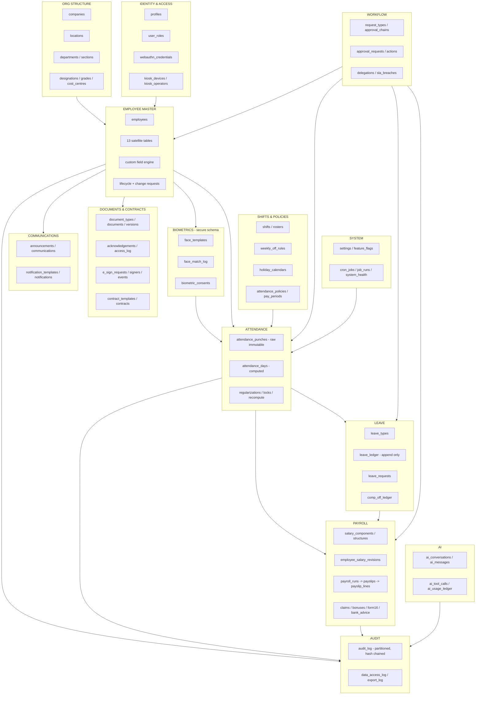
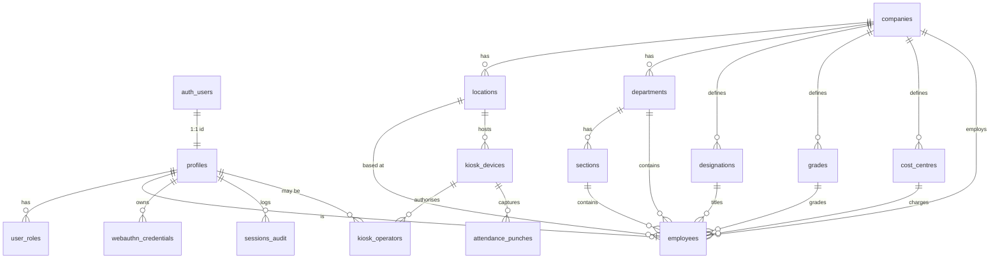
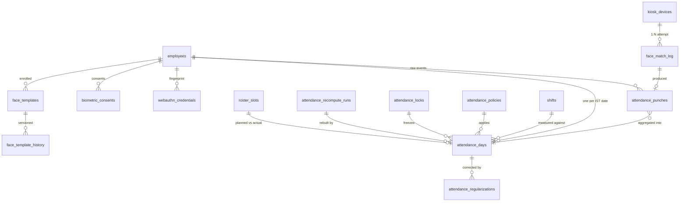
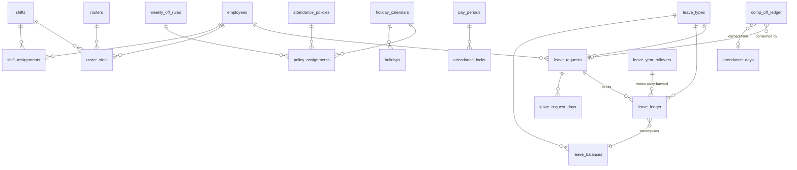
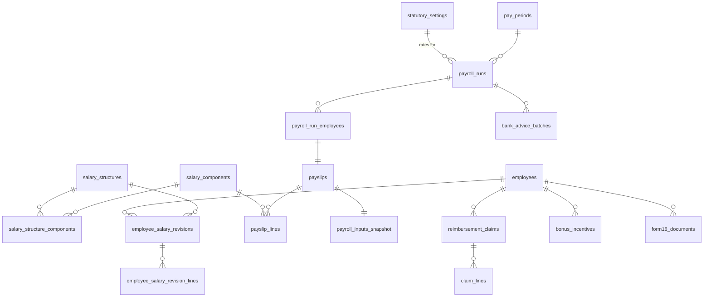
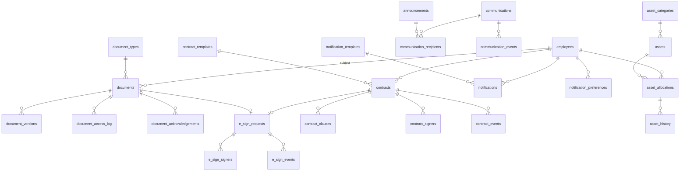
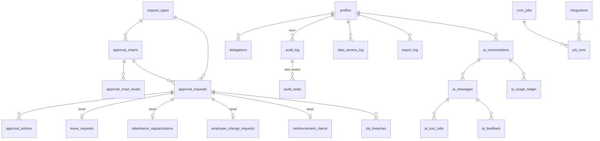

# 04 — Supabase Data Model & Backend Logic

> **Purpose.** This document is the single authoritative specification of the Tamarind Tree HRMS persistence layer: every Postgres schema object (table, column, type, default, constraint, index, enum, function, trigger, view, policy), every Row-Level-Security rule, the audit subsystem, the IST time model, the attendance derivation engine, storage buckets, realtime publications, the indexing/partitioning plan, the ordered migration file list, and the seed data. A developer with Supabase CLI access should be able to write `supabase/migrations/*.sql` directly from this document without asking a single clarifying question. It is written for **Machani Hospitalities LLP** (LLPIN AAF-9371, RoC Bengaluru) trading as **The Tamarind Tree**, a 5-acre heritage event venue in Bengaluru with shift-based, weekend-heavy hospitality operations. Backend project ref: **`aygxkkoltwltczfdbplr`**. Everything here is designed fresh — **no data, no schema and no trust assumption is inherited from the reference repo** (`/Users/user/TT/HRMS_TT/hrms-digitalchemy`); where that repo made a decision we reject, this document says so and states the replacement.

**Companion documents:** `00-master-plan.md` (vision, scope, roadmap) · `01-prd-employee.md` · `02-prd-manager.md` · `03-prd-admin.md` · `05-attendance-kiosk.md` (kiosk UX + face pipeline that writes into §ATTENDANCE) · `06-ai-agent.md` (the AI agent reads only the views in §9) · `07-design-system.md` · `08-architecture.md` (edge functions, deployment, secrets) · `09-documents-contracts-comms.md`.

---

## Table of contents

1. [Conventions (binding rules)](#1-conventions-binding-rules)
2. [Schema overview — ER diagrams by domain](#2-schema-overview--er-diagrams-by-domain)
3. [Table catalogue](#3-table-catalogue)
   - 3.1 [Domain: Identity & Access](#31-domain-identity--access)
   - 3.2 [Domain: Org Structure](#32-domain-org-structure)
   - 3.3 [Domain: Employee Master](#33-domain-employee-master)
   - 3.4 [Domain: Biometrics](#34-domain-biometrics)
   - 3.5 [Domain: Attendance](#35-domain-attendance)
   - 3.6 [Domain: Shifts, Rosters & Policies](#36-domain-shifts-rosters--policies)
   - 3.7 [Domain: Leave](#37-domain-leave)
   - 3.8 [Domain: Payroll](#38-domain-payroll)
   - 3.9 [Domain: Documents](#39-domain-documents)
   - 3.10 [Domain: Contracts & e-Sign](#310-domain-contracts--e-sign)
   - 3.11 [Domain: Communications & Notifications](#311-domain-communications--notifications)
   - 3.12 [Domain: Assets](#312-domain-assets)
   - 3.13 [Domain: Workflow & Approvals](#313-domain-workflow--approvals)
   - 3.14 [Domain: Audit](#314-domain-audit)
   - 3.15 [Domain: AI](#315-domain-ai)
   - 3.16 [Domain: System](#316-domain-system)
4. [Row Level Security — complete policy design](#4-row-level-security--complete-policy-design)
5. [Audit implementation](#5-audit-implementation)
6. [IST time handling](#6-ist-time-handling)
7. [The attendance derivation engine](#7-the-attendance-derivation-engine)
8. [Other key functions, triggers and jobs](#8-other-key-functions-triggers-and-jobs)
9. [Views, materialized views and the metric dictionary](#9-views-materialized-views-and-the-metric-dictionary)
10. [Storage buckets and access rules](#10-storage-buckets-and-access-rules)
11. [Realtime publication](#11-realtime-publication)
12. [Indexing, partitioning and performance plan](#12-indexing-partitioning-and-performance-plan)
13. [Migration file plan](#13-migration-file-plan)
14. [Seed data plan](#14-seed-data-plan)
15. [Appendix A — Defect-to-fix traceability](#appendix-a--defect-to-fix-traceability)
16. [Appendix B — Assumptions the team must confirm](#appendix-b--assumptions-the-team-must-confirm)

---

## 1. Conventions (binding rules)

These rules are **binding**. A migration that violates one of them fails code review.

### 1.1 Schemas

| Schema | Exposed to PostgREST | Contents | Rationale |
|---|---|---|---|
| `public` | **Yes** | All client-reachable tables and views. RLS enabled on **every** table without exception. | Supabase default API schema. |
| `secure` | **No** (removed from `db.schemas` in `config.toml`, `REVOKE ALL ... FROM anon, authenticated`) | `face_templates`, `face_template_history`, `face_match_log`, `webauthn_challenges`, `kiosk_devices.secret_hash`, `api_keys`, `id_number_vault`. | Biometric templates and device secrets must be **unreachable by any browser token**, not merely policy-protected. A schema that PostgREST cannot see cannot be queried even if an RLS policy is misauthored. This is the structural fix for the reference repo, where `employees.face_descriptor` was self-readable **and self-writable** by the employee. |
| `util` | No | Pure/IMMUTABLE helpers: `ist_date()`, `ist_ts()`, `business_date()`, `mask_tail()`, `minutes_between()`, `sha256_hex()`. | Keeps `public` free of non-table objects and keeps generated-column dependencies stable. |
| `app` | No | `SECURITY DEFINER` authorization helpers: `current_employee_id()`, `has_role()`, `is_admin()`, `is_super_admin()`, `is_manager_of()`, `set_context()`, `ctx()`. | Called from RLS policies. Not callable as RPC by clients (except `app.set_context` is deliberately **not** granted — the API layer uses `set_config` directly). |
| `audit` | No | Audit trigger functions, `audit.redacted_columns`, `audit.reason_required_tables`, `audit.chain_state`, `audit.excluded_columns`. The `audit_log` table itself lives in `public` (admins query it through the API) but is write-locked (§5.6). | Configuration for the audit engine must not be editable through the API. |
| `analytics` | No | Materialized views + their refresh functions. Read-through `public.v_*` wrappers expose them. | Lets us `REFRESH MATERIALIZED VIEW CONCURRENTLY` without touching client grants. |

### 1.2 Naming

| Object | Rule | Example |
|---|---|---|
| Table | `snake_case`, **plural** noun | `attendance_punches`, `leave_ledger` |
| Column | `snake_case`, no abbreviations except the approved list (`id`, `pct`, `qty`, `min`, `max`, `ist`, `utc`, `pf`, `esi`, `pan`, `uan`, `ifsc`, `ctc`, `ot`) | `late_minutes`, `day_fraction_paid` |
| Primary key | always `id uuid PRIMARY KEY DEFAULT gen_random_uuid()` (v4). Never `serial`, never composite, never natural. | |
| Foreign key column | `<singular_referenced_table>_id` | `employee_id`, `kiosk_device_id` |
| Foreign key constraint | `fk_<table>__<column>` | `fk_attendance_punches__employee_id` |
| Unique constraint | `uq_<table>__<cols>` | `uq_attendance_days__employee_ist_date` |
| Check constraint | `ck_<table>__<rule>` | `ck_employees__pan_format` |
| Index | `idx_<table>__<cols>[__<qualifier>]` | `idx_attendance_punches__emp_ist_date__live` |
| Enum type | `snake_case` singular, no `_enum` suffix | `attendance_status`, `punch_source` |
| RLS policy | `<table>__<audience>__<operation>` | `employees__self__select`, `payslips__admin__all` |
| Trigger | `trg_<table>__<purpose>` | `trg_employees__audit`, `trg_attendance_punches__enqueue_recompute` |
| Function | `verb_noun` in the owning schema | `compute_attendance_day`, `app.is_manager_of` |
| View | `v_<subject>[_<qualifier>]` | `v_attendance_day_enriched`, `v_team_employee_basic` |
| Materialized view | `mv_<subject>` in `analytics`, exposed as `v_<subject>` in `public` | `analytics.mv_attendance_monthly` → `public.v_attendance_monthly_summary` |
| Sequence (only for human-facing codes) | `seq_<purpose>` | `seq_employee_code_tt` |

**No raw column name ever reaches the UI.** The screenshotted product leaked `Date_Dt` into a grid header. Our rule: every grid column label comes from a TypeScript column definition with an explicit `header` string (see `07-design-system.md` §DataGrid). The database is free to be terse; the UI is never allowed to be.

### 1.3 Mandatory audit columns

Every table in `public` except append-only event logs (`attendance_punches`, `audit_log`, `leave_ledger`, `comp_off_ledger`, `*_events`, `*_log`, `ai_messages`) carries:

```sql
created_at  timestamptz NOT NULL DEFAULT now(),
created_by  uuid        NULL REFERENCES public.profiles(id) ON DELETE SET NULL,
updated_at  timestamptz NOT NULL DEFAULT now(),
updated_by  uuid        NULL REFERENCES public.profiles(id) ON DELETE SET NULL
```

`updated_at`/`updated_by` are maintained by `trg_<table>__touch` (`BEFORE UPDATE`), which sets `updated_at = now()` and `updated_by = app.ctx_actor_id()`. `created_by` is set by `trg_<table>__stamp` (`BEFORE INSERT`) when NULL. Application code must **never** write these four columns; the triggers own them. This is what makes "even a minute change is audited" true regardless of which code path performed the write.

Append-only tables instead carry `recorded_at timestamptz NOT NULL DEFAULT now()` and `recorded_by uuid` and have **no** `UPDATE`/`DELETE` grant to anyone (§4.9).

### 1.4 Soft delete

Applies to master and configuration entities only:

```sql
deleted_at      timestamptz NULL,
deleted_by      uuid        NULL REFERENCES public.profiles(id),
deletion_reason text        NULL,
CONSTRAINT ck_<table>__deletion_reason CHECK (deleted_at IS NULL OR (deleted_by IS NOT NULL AND length(btrim(deletion_reason)) >= 10))
```

Tables with soft delete: `employees`, `companies`, `locations`, `departments`, `sections`, `designations`, `grades`, `cost_centres`, `shifts`, `holiday_calendars`, `attendance_policies`, `leave_types`, `salary_components`, `salary_structures`, `document_types`, `documents`, `contract_templates`, `notification_templates`, `asset_categories`, `assets`, `request_types`, `approval_chains`, `employee_custom_field_defs`, `kiosk_devices`, `feature_flags`, `integrations`.

Rules:
- Every RLS `SELECT` policy for non-admins appends `AND deleted_at IS NULL`. Admin/super-admin can see soft-deleted rows (the "Deleted" console in `03-prd-admin.md` §Recycle bin).
- Unique constraints on soft-deletable business keys are **partial**: `CREATE UNIQUE INDEX uq_employees__employee_code ON employees(employee_code) WHERE deleted_at IS NULL;`
- **Hard delete is a `super_admin`-only operation performed by an edge function** that first writes an `audit_log` row with `action='hard_delete'` and the full `to_jsonb(OLD)` payload, then deletes. No client can issue `DELETE` on any table (no `DELETE` policy is ever created for `authenticated`).
- Event/ledger tables are never deleted and never soft-deleted; they are **voided** (`is_voided`, `voided_by`, `voided_at`, `void_reason`) or **reversed** (a compensating ledger line).

### 1.5 Time

- **Every** point-in-time column is `timestamptz`, stored in UTC. There is exactly one exception class: `date` columns that represent an IST business date (`ist_date`, `effective_from`, `pay_period.start_date`, …), and `time` columns that represent a wall-clock shift boundary (`shifts.start_time`).
- **We explicitly reject the reference repo's `clock_in_ist` / `clock_in_gst` pre-formatted string columns.** Reasons, all of which bit that codebase: (a) a formatted string cannot be compared, ordered, ranged, indexed or arithmetically differenced, so every consumer re-parses it; (b) it duplicates truth — the same instant now exists in two columns that can disagree after any correction; (c) it was computed with a **hard-coded +5:30 offset** in browser JS rather than the tz database, so any future zone change or a client with a skewed clock silently corrupts the record; (d) it hard-codes a presentation concern (locale, 12/24h) into storage. **Rule: store the instant, render in IST at the edge (`Intl.DateTimeFormat('en-IN', { timeZone: 'Asia/Kolkata' })`) or derive with `util.ist_ts()` inside a view.**
- Day-boundary logic never uses `date_trunc('day', ts)` (that is UTC) and never uses the client's date. It uses `util.ist_date(ts)`. See §6.
- The reference repo wrote `date = new Date().toISOString().split('T')[0]` — the **UTC** calendar date — as the attendance day key. For an IST-based venue this misfiles every punch between 00:00 and 05:29 IST into the previous day. Our `ist_date` generated column makes that class of bug unrepresentable.

### 1.6 Numbers, money and identifiers

| Kind | Type | Rule |
|---|---|---|
| Money (INR) | `numeric(14,2)` | Max ₹99,99,99,99,999.99. **Never** `float`/`double precision`/`real`. Rendered with Indian digit grouping (`en-IN`) by the UI — a single `formatINR()` helper, so "110000" and "1,10,000" can never appear in two tables of the same screen (a defect visible in the screenshots). |
| Percentage | `numeric(6,3)` | 0.000–100.000. Stored as a percentage (e.g. `10.000` = 10%), **never** as a 0–1 fraction. Every percentage metric name in §9 ends in `_pct`; the metric dictionary states that the value is already multiplied by 100, which is the fix for the `1,700.00%` late-arrival defect (a ratio multiplied by 100 twice). |
| Duration | `integer` **minutes** | Hours are never stored. All hour displays are `minutes / 60` computed at the edge with one formatter (`formatHM(minutes)` → `9:00`, `7:49`). This kills the `133/17` vs `9/17` numerator-semantics defect: `total_worked_minutes` and `avg_worked_minutes_per_present_day` are two differently named columns, not one ambiguous "hrs worked". |
| Ratio/rate | `numeric(9,4)` | e.g. OT multiplier `2.0000`, PF rate `12.0000`. |
| Counts | `integer` | |
| **All statutory / account / document numbers** | `text` | PF number, UAN, ESI, PAN, Aadhaar, passport, bank account, IFSC, GSTIN, LLPIN, swipe-card id, employee code. **Never numeric, never bigint.** This is the schema-level fix for `PF Number = 1.0202E+11`: a `text` column cannot be coerced to scientific notation by any importer. All bulk-import edge functions additionally coerce with `String(cell.w ?? cell.v)` reading the *formatted* cell value, and every such column has a `CHECK` regex so a float-mangled value is rejected at write time rather than displayed. |
| Booleans | `boolean NOT NULL DEFAULT false` | Never nullable three-state booleans; if a third state exists it is an enum. |
| Free JSON | `jsonb` | Only for genuinely schemaless payloads: audit old/new values, AI tool arguments, import row snapshots, template variables. Business fields are **never** hidden inside `jsonb` (the reference repo's `identity_documents jsonb` and `education_* jsonb` made those fields unqueryable, unvalidatable and unauditable at field level). |

Sentinel values are banned. `Valid To = 01-Jan-3000` (seen in the screenshots' swipe-card panel) becomes `valid_to date NULL` meaning "open-ended", with a `v_*` view exposing `COALESCE(valid_to::text,'No expiry')` for display. Every "no value" is `NULL`; every "not applicable" is `NULL` with an accompanying `*_not_applicable boolean` only where the distinction is legally material (e.g. `esi_not_applicable` when wages exceed the ESI ceiling).

### 1.7 Enums vs lookup tables

**The rule:**

> Use a **Postgres `ENUM`** when the set is closed, defined by product logic, branched on in TypeScript/SQL, and changing it requires a code change. Use a **lookup table** when the set is data that an Admin must be able to create, rename, reorder, deactivate or extend at runtime without a deploy.

| Postgres ENUMs (closed) | Lookup tables (admin-configurable) |
|---|---|
| `app_role`, `employment_type`, `employment_status`, `gender`, `marital_status`, `blood_group`, `punch_source`, `punch_direction`, `attendance_status`, `attendance_day_source`, `regularization_status`, `leave_request_status`, `leave_day_portion`, `ledger_entry_type`, `accrual_frequency`, `payroll_run_status`, `payslip_line_kind`, `payment_mode`, `document_status`, `esign_status`, `signer_status`, `approval_status`, `approval_action`, `notification_channel`, `notification_status`, `asset_allocation_status`, `audit_action`, `actor_source`, `ai_role`, `ai_feedback_verdict`, `custom_field_type`, `lifecycle_event_type`, `id_document_kind`, `holiday_type`, `week_of_month`, `job_run_status` | `companies`, `locations`, `departments`, `sections`, `designations`, `grades`, `cost_centres`, `shifts`, `weekly_off_rules`, `holiday_calendars`, `holidays`, `attendance_policies`, `pay_periods`, `leave_types`, `salary_components`, `salary_structures`, `document_types`, `contract_templates`, `notification_templates`, `request_types`, `approval_chains`, `asset_categories`, `employee_custom_field_defs`, `settings`, `feature_flags` |

Enum evolution rule: `ALTER TYPE ... ADD VALUE` only, in its **own migration file with no other statements** (Postgres cannot use a newly added enum value in the same transaction that added it). Values are never renamed or dropped; a deprecated value is removed from the TypeScript union and left in the type.

Every lookup table has: `id`, `code text NOT NULL` (stable machine key, uppercase snake, unique per company), `name text NOT NULL` (display), `description text`, `sort_order integer NOT NULL DEFAULT 100`, `is_active boolean NOT NULL DEFAULT true`, audit columns, soft-delete columns. **The UI always renders `name`, never `code`** — the fix for `Late = None1`, `Attendance = None`, `Pay Period = PP001` leaking internal codes into the screenshotted profile.

### 1.8 Constraint and validation policy

- Every FK is explicit, named, and has an `ON DELETE` action chosen deliberately: `RESTRICT` for master data referenced by history (default), `CASCADE` only from a parent to rows that are meaningless without it (`leave_request_days` ← `leave_requests`, `payslip_lines` ← `payslips`), `SET NULL` for optional attributions (`created_by`).
- Every FK column is indexed (Postgres does not do this automatically).
- Every `text` column that models a coded identifier has a `CHECK` regex. Canonical set:

```sql
ck_pan          CHECK (pan IS NULL OR pan ~ '^[A-Z]{5}[0-9]{4}[A-Z]$')
ck_aadhaar      CHECK (aadhaar_number IS NULL OR aadhaar_number ~ '^[2-9][0-9]{11}$')
ck_uan          CHECK (uan IS NULL OR uan ~ '^[0-9]{12}$')
ck_pf_number    CHECK (pf_number IS NULL OR pf_number ~ '^[A-Z]{2}/[A-Z]{3}/[0-9]{7}/[0-9]{3}/[0-9]{7}$' OR pf_number ~ '^[A-Z0-9/]{10,30}$')
ck_esi          CHECK (esi_number IS NULL OR esi_number ~ '^[0-9]{17}$')
ck_ifsc         CHECK (ifsc IS NULL OR ifsc ~ '^[A-Z]{4}0[A-Z0-9]{6}$')
ck_bank_account CHECK (account_number IS NULL OR account_number ~ '^[0-9]{6,20}$')
ck_mobile_in    CHECK (mobile IS NULL OR mobile ~ '^[6-9][0-9]{9}$')
ck_email        CHECK (email IS NULL OR email ~* '^[^@\s]+@[^@\s]+\.[a-z]{2,}$')
ck_gstin        CHECK (gstin IS NULL OR gstin ~ '^[0-9]{2}[A-Z]{5}[0-9]{4}[A-Z][0-9A-Z]{3}$')
ck_pincode      CHECK (pincode IS NULL OR pincode ~ '^[1-9][0-9]{5}$')
```

  Note `ck_aadhaar` deliberately rejects `1.0202E+11`-style mangling and leading-zero/1-prefixed impossibilities. Aadhaar is additionally Verhoeff-checksum validated in `util.is_valid_aadhaar(text)` and enforced by `CHECK (util.is_valid_aadhaar(aadhaar_number))`.
- Effective-dated tables (`employee_salary_revisions`, `policy_assignments`, `shift_assignments`, `salary_structures`) use `daterange` exclusion constraints so overlaps are impossible:

```sql
ALTER TABLE public.shift_assignments
  ADD CONSTRAINT ex_shift_assignments__no_overlap
  EXCLUDE USING gist (
    employee_id WITH =,
    daterange(effective_from, COALESCE(effective_to, 'infinity'::date), '[]') WITH &&
  ) WHERE (deleted_at IS NULL);
```
  (`btree_gist` extension required.)
- `NOT NULL` is the default posture. A nullable column must be justifiable as "genuinely unknown or not applicable".

### 1.9 Extensions required

`pgcrypto` (gen_random_uuid, digest), `btree_gist` (exclusion constraints), `pg_cron` (jobs), `pg_net` (async HTTP from cron to edge functions), `unaccent` + `pg_trgm` (employee/global search), `vector` (optional, for AI semantic search over policies — Phase 3), `tablefunc` (crosstab for a few analytics views).

---

## 2. Schema overview — ER diagrams by domain

### 2.1 Domain map



### 2.2 Identity, access & org structure



### 2.3 Employee master

```mermaid
erDiagram
    employees ||--o{ employee_addresses : ""
    employees ||--o{ employee_contacts : ""
    employees ||--o{ employee_dependents : ""
    employees ||--o{ employee_qualifications : ""
    employees ||--o{ employee_identity_documents : ""
    employees ||--|| employee_statutory : ""
    employees ||--o{ employee_bank_accounts : ""
    employees ||--o{ employee_swipe_cards : ""
    employees ||--o{ employee_skills : ""
    employees ||--o{ employee_hobbies : ""
    employees ||--o{ employee_custom_field_values : ""
    employee_custom_field_defs ||--o{ employee_custom_field_values : "typed by"
    employees ||--o{ employee_lifecycle_events : ""
    employees ||--o{ employee_change_requests : "requests"
    employees ||--o{ employees : "reports to"
    employees ||--o{ employee_role_assignments : "scoped mgmt"
```



### 2.4 Biometrics and attendance (the core loop)



### 2.5 Shifts, rosters, policies, leave



### 2.6 Payroll



### 2.7 Documents, contracts, communications, assets



### 2.8 Workflow, audit, AI, system



---

## 3. Table catalogue

Reading the tables below: **Null** column is `Y` if the column is nullable, `N` if `NOT NULL`. Where a default is `-`, there is none. Each table block ends with **Indexes**, **Constraints**, **RLS** (pattern code from §4.3) and, where non-obvious, **Notes**.

### 3.1 Domain: Identity & Access

#### `app_role` (enum)

```sql
CREATE TYPE public.app_role AS ENUM ('employee', 'manager', 'admin', 'super_admin');
```

Four tiers, ordered. **Decision:** the client asked for three personas; we add `super_admin` as a fourth *technical* tier because a set of operations are irreversible or catastrophic and must not be available to routine HR users: deleting a payroll run, purging a biometric template, exporting the audit log, granting/revoking roles, hard-deleting an employee, unlocking a locked attendance period, rotating a kiosk device secret, and changing `statutory_settings` retroactively. Rationale: with a single `admin` tier, the person who makes a payroll mistake is also the person who can erase the evidence — which defeats the audit requirement. `super_admin` implies `admin` implies `manager` implies `employee` in `app.has_role()`.

#### `profiles`

1:1 with `auth.users`. Holds only login-identity facts; all HR facts live in `employees`.

| Column | Type | Null | Default | Description |
|---|---|---|---|---|
| id | uuid | N | - | PK, **= `auth.users.id`**, `REFERENCES auth.users(id) ON DELETE CASCADE` |
| email | text | N | - | Login email, lowercased by trigger. Unique. |
| full_name | text | N | - | Display name as typed by HR. |
| avatar_url | text | Y | - | Storage path in `employee-photos`, not a public URL. |
| phone | text | Y | - | Login/OTP phone, E.164. |
| locale | text | N | `'en-IN'` | Reserved for future kn-IN / hi-IN. |
| timezone | text | N | `'Asia/Kolkata'` | Display zone only; storage is always UTC. |
| is_active | boolean | N | `true` | `false` blocks all RLS (see §4.4 `app.is_active_user()`). |
| must_change_password | boolean | N | `false` | Forces the change-password dialog. |
| last_login_at | timestamptz | Y | - | Written by `sessions_audit` trigger. |
| failed_login_count | integer | N | `0` | Reset on success; ≥10 sets `is_active=false` and raises a `system_health` alert. |
| created_at / created_by / updated_at / updated_by | | | | §1.3 |

**Indexes:** `uq_profiles__email` unique on `lower(email)`; `idx_profiles__is_active`.
**Constraints:** `ck_profiles__email` (§1.8).
**RLS:** P1 (self-select), P8 (admin-all). No client `INSERT` — profiles are created by the `handle_new_user` trigger on `auth.users` (§8.1).

#### `user_roles`

| Column | Type | Null | Default | Description |
|---|---|---|---|---|
| id | uuid | N | `gen_random_uuid()` | PK |
| user_id | uuid | N | - | → `profiles(id)` ON DELETE CASCADE |
| role | app_role | N | - | |
| granted_by | uuid | Y | - | → `profiles(id)`; NULL only for the bootstrap super-admin. |
| granted_at | timestamptz | N | `now()` | |
| granted_reason | text | N | - | **Mandatory**, ≥10 chars. Role grants are in `audit.reason_required_tables`. |
| revoked_at | timestamptz | Y | - | Soft revoke; `has_role()` ignores revoked rows. |
| revoked_by | uuid | Y | - | |
| revoke_reason | text | Y | - | |
| created_at … updated_by | | | | §1.3 |

**Indexes:** `uq_user_roles__user_role_live` unique on `(user_id, role) WHERE revoked_at IS NULL`; `idx_user_roles__role`.
**RLS:** P1 select-self, P9 (super-admin only for INSERT/UPDATE). **No `authenticated` write path exists** — grants go through the `admin-grant-role` edge function so the reason and the actor are always captured.
**Notes:** a `manager` role row is *not* how team scope is decided; team scope is derived from `employees.reporting_manager_id` (§4.4). The `manager` role only unlocks the manager UI surface. This separation means a manager who loses all reportees automatically loses team data even if the role row lingers.

#### `employee_role_assignments`

Scoped administrative delegation — "this person is an Admin **for the Kitchen department only**". Needed because a venue HR assistant may administer housekeeping and security but must not see banquet-management salaries.

| Column | Type | Null | Default | Description |
|---|---|---|---|---|
| id | uuid | N | `gen_random_uuid()` | PK |
| profile_id | uuid | N | - | → `profiles(id)` |
| role | app_role | N | - | `manager` or `admin` only (`ck_...__role`). |
| scope_kind | text | N | - | `'global' \| 'company' \| 'location' \| 'department' \| 'section' \| 'employee_list'` |
| company_id / location_id / department_id / section_id | uuid | Y | - | Exactly one set per `scope_kind` (check constraint). |
| employee_ids | uuid[] | Y | - | Used when `scope_kind='employee_list'`. |
| effective_from | date | N | `CURRENT_DATE` | |
| effective_to | date | Y | - | NULL = open-ended. |
| created_at … updated_by | | | | |

**Indexes:** `idx_era__profile_live` on `(profile_id) WHERE effective_to IS NULL`; GIN on `employee_ids`.
**RLS:** P9 (super-admin manages), P1 (self read).
**Notes:** `app.admin_scope_employee_ids()` (§4.4) materialises the visible employee set from this table; when a profile has a `global` row (the default for HR heads) the function short-circuits to "all".

#### `sessions_audit`

Append-only login/logout/refresh record. Supabase's `auth.audit_log_entries` is not queryable through the API and not joinable to employees, so we keep our own.

| Column | Type | Null | Default | Description |
|---|---|---|---|---|
| id | uuid | N | `gen_random_uuid()` | PK |
| profile_id | uuid | Y | - | NULL for a failed login with unknown email (email kept in `attempted_email`). |
| attempted_email | text | Y | - | Lowercased. |
| event | text | N | - | `login_success \| login_failed \| logout \| token_refresh \| password_reset_requested \| password_changed \| passkey_registered \| passkey_used \| mfa_challenge \| session_revoked` |
| auth_method | text | Y | - | `password \| passkey \| magic_link \| otp \| kiosk_pin` |
| ip | inet | Y | - | |
| user_agent | text | Y | - | |
| device_id | text | Y | - | Kiosk device id or browser fingerprint. |
| geo | jsonb | Y | - | `{country, region, city}` from the edge (never a third-party call from the browser). |
| failure_reason | text | Y | - | |
| recorded_at | timestamptz | N | `now()` | |

**Indexes:** `idx_sessions_audit__profile_time` on `(profile_id, recorded_at DESC)`; `idx_sessions_audit__event_time`; BRIN on `recorded_at`.
**RLS:** P1 select-self (employees see their own login history — a real security feature), P8 admin-all, **no** insert/update/delete for `authenticated` (written by edge functions with service role).

#### `webauthn_credentials`

Passkey / platform-fingerprint credentials. Used for **login** and as the **alternative biometric** the client asked for ("or take the biometric").

| Column | Type | Null | Default | Description |
|---|---|---|---|---|
| id | uuid | N | `gen_random_uuid()` | PK |
| profile_id | uuid | N | - | → `profiles(id)` ON DELETE CASCADE |
| credential_id | text | N | - | base64url; unique. |
| public_key | text | N | - | base64url COSE key. |
| sign_count | bigint | N | `0` | Replay counter; a non-increasing counter fails verification server-side. |
| transports | text[] | Y | - | `{internal,hybrid,usb}` |
| aaguid | text | Y | - | Authenticator model, for admin visibility. |
| device_label | text | Y | - | "Gate iPad", "Rakesh's phone". |
| purpose | text | N | `'login'` | `login \| attendance \| both` |
| backup_eligible | boolean | N | `false` | |
| last_used_at | timestamptz | Y | - | |
| revoked_at | timestamptz | Y | - | |
| created_at … updated_by | | | | |

**Indexes:** `uq_webauthn_credentials__credential_id`; `idx_webauthn_credentials__profile`.
**RLS:** P1 select-self (so a user can see and revoke their passkeys), **no client insert/update** — registration and verification happen in the `webauthn-register` edge function. Deleting is an `UPDATE revoked_at` through an RPC, never a `DELETE`.
**Notes:** the reference repo's fingerprint *attendance* path called `navigator.credentials.get()` with a **client-generated challenge and never sent the assertion to a server** — the browser decided whether attendance was legitimate. We reject that entirely: every fingerprint attendance assertion is verified in `kiosk-punch` against a **server-issued challenge** stored in `secure.webauthn_challenges`, and a punch is written only after `verifyAuthenticationResponse()` succeeds server-side.

#### `secure.webauthn_challenges`

| Column | Type | Null | Default | Description |
|---|---|---|---|---|
| id | uuid | N | `gen_random_uuid()` | PK |
| lookup | text | N | - | `profile_id` (registration) / lowercased email (login) / `kiosk:<device_id>` (attendance). |
| challenge | text | N | - | base64url, 32 random bytes. |
| purpose | text | N | - | `register \| login \| attendance` |
| expires_at | timestamptz | N | `now() + interval '3 minutes'` | |
| consumed_at | timestamptz | Y | - | Single-use; a consumed challenge is never re-verifiable. |
| recorded_at | timestamptz | N | `now()` | |

**Indexes:** `idx_wac__lookup_live` on `(lookup) WHERE consumed_at IS NULL`; `idx_wac__expires`.
**RLS:** table lives in `secure`; **zero grants** to `anon`/`authenticated`. Reaped by cron every 15 minutes.

#### `kiosk_devices`

The shared gate camera(s). One row per physical device.

| Column | Type | Null | Default | Description |
|---|---|---|---|---|
| id | uuid | N | `gen_random_uuid()` | PK |
| device_code | text | N | - | Human key, e.g. `TT-GATE-01`. Unique. |
| label | text | N | - | "Main Gate — Guard Post" |
| location_id | uuid | N | - | → `locations(id)` |
| device_kind | text | N | `'tablet_camera'` | `tablet_camera \| kiosk_pc \| mobile_pwa \| fingerprint_reader` |
| platform | text | Y | - | Reported UA/OS at registration. |
| is_active | boolean | N | `true` | |
| allowed_ip_cidrs | cidr[] | Y | - | Optional venue-network restriction. |
| allowed_geofence | jsonb | Y | - | `{lat, lng, radius_m}` — the punch edge function rejects captures outside it. |
| require_operator | boolean | N | `true` | Guard must be signed in for the kiosk to accept scans. |
| min_match_confidence | numeric(9,4) | N | `0.6200` | Per-device override of the global identification threshold (§05). |
| max_offline_queue | integer | N | `500` | Client-side queue cap before the kiosk refuses new scans. |
| clock_skew_seconds | integer | N | `0` | Last measured skew vs server; >120 s raises a `system_health` alert. |
| last_seen_at | timestamptz | Y | - | Heartbeat. |
| last_punch_at | timestamptz | Y | - | |
| app_version | text | Y | - | |
| enrolled_at | timestamptz | N | `now()` | |
| revoked_at | timestamptz | Y | - | |
| created_at … deletion_reason | | | | §1.3, §1.4 |

**Secret material lives in `secure.kiosk_device_secrets`** (`device_id`, `secret_hash text` (Argon2id), `secret_rotated_at`, `previous_secret_hash`, `rotation_grace_until`) so that even an admin-readable `kiosk_devices` row never exposes the shared secret.
**Indexes:** `uq_kiosk_devices__device_code`; `idx_kiosk_devices__location`.
**RLS:** P8 admin-all read, P9 super-admin write (rotation is super-admin only). `anon`/`authenticated` get **no** access; the kiosk app authenticates to the edge function with the device secret, not with a Supabase session.

#### `kiosk_operators`

The security guards who may operate a kiosk. **Decision:** guards get a Supabase auth account with the `employee` role plus a row here; they do **not** get `admin`. The kiosk UI is a separate route (`/kiosk`) that shows only the scanner and the last-10-scan strip — no HR data, matching the client's "no HR data exposed" requirement.

| Column | Type | Null | Default | Description |
|---|---|---|---|---|
| id | uuid | N | `gen_random_uuid()` | PK |
| profile_id | uuid | N | - | → `profiles(id)`; the guard's login. |
| employee_id | uuid | Y | - | → `employees(id)` when the guard is on payroll. |
| kiosk_device_id | uuid | Y | - | NULL = authorised on all active devices. |
| pin_hash | text | N | - | 6-digit PIN, Argon2id — used for fast operator switching between guard shifts without a full logout. Stored in `secure.kiosk_operator_secrets`, mirrored here as a NOT NULL FK-less pointer id. |
| can_enrol_faces | boolean | N | `false` | Enrolment is normally HR-only; a trained head-guard may be granted it. |
| can_manual_punch | boolean | N | `false` | Allows "camera failed — punch by employee code" with mandatory reason. |
| shift_window | text | Y | - | Informational, e.g. `19:00–07:00`. |
| is_active | boolean | N | `true` | |
| last_signed_in_at | timestamptz | Y | - | |
| created_at … updated_by | | | | |

**Indexes:** `uq_kiosk_operators__profile_device` unique `(profile_id, coalesce(kiosk_device_id,'00000000-0000-0000-0000-000000000000'::uuid))`.
**RLS:** P8 admin-all; the guard themself reads **only their own row** through the `kiosk-session` edge function (no direct table access).

#### `secure.api_keys`

Machine credentials for the kiosk, the biometric device bridge, and any future integration.

| Column | Type | Null | Default | Description |
|---|---|---|---|---|
| id | uuid | N | `gen_random_uuid()` | PK |
| name | text | N | - | `kiosk-gate-01`, `zkteco-bridge` |
| key_prefix | text | N | - | First 8 chars, shown in the admin UI for identification. |
| key_hash | text | N | - | Argon2id of the full key. The full key is displayed exactly once, at creation. |
| scopes | text[] | N | `'{}'` | e.g. `{punch:write, enrol:read}` |
| kiosk_device_id | uuid | Y | - | Binds a key to one device. |
| rate_limit_per_min | integer | N | `120` | Enforced in the edge function. |
| expires_at | timestamptz | Y | - | |
| last_used_at | timestamptz | Y | - | |
| revoked_at | timestamptz | Y | - | |
| created_at … updated_by | | | | |

**RLS:** in `secure`; no client access at all. Managed by the `admin-api-keys` edge function, super-admin only.

---

### 3.2 Domain: Org Structure

All six tables share the lookup-table shape from §1.7 (`id, code, name, description, sort_order, is_active`, audit + soft-delete columns) plus the columns below. All are `RLS: P7` (any authenticated user may read active rows — the org chart is not secret) and `P8/P9` for writes.

#### `companies`

| Extra column | Type | Null | Default | Description |
|---|---|---|---|---|
| legal_name | text | N | - | `MACHANI HOSPITALITIES LLP` |
| trade_name | text | N | - | `The Tamarind Tree` |
| entity_type | text | N | `'LLP'` | |
| registration_number | text | Y | - | LLPIN `AAF-9371` — **text**, never numeric. |
| incorporation_date | date | Y | - | `2016-03-15` |
| pan | text | Y | - | Company PAN. |
| tan | text | Y | - | For TDS returns / Form 16. |
| gstin | text | Y | - | |
| pf_establishment_code | text | Y | - | |
| esi_establishment_code | text | Y | - | |
| lwf_registration | text | Y | - | Karnataka Labour Welfare Fund. |
| shops_establishment_reg | text | Y | - | Karnataka Shops & Commercial Establishments registration. |
| registered_address | jsonb | N | - | `{line1,line2,city,state,pincode,country}` |
| employee_code_prefix | text | N | `'TT'` | Drives `generate_employee_code()` (§8.6). |
| employee_code_padding | integer | N | `4` | `TT0001` |
| logo_path | text | Y | - | Path in `brand` bucket. |
| financial_year_start_month | integer | N | `4` | April — India. |
| default_currency | text | N | `'INR'` | |
| is_default | boolean | N | `true` | Exactly one default (partial unique index). |

**Notes:** multi-entity is built in from day one because the group already runs multiple legal entities (the screenshots show `SSSRC` codes with `@machanigroup.com` email and an `MIDCC001` manager code — one HRMS instance, several entities). Tamarind Tree launches with a single row.

#### `locations`

| Extra column | Type | Null | Default | Description |
|---|---|---|---|---|
| company_id | uuid | N | - | → `companies(id)` |
| address | jsonb | N | - | Venue: `88, Avalahalli, Anjanapura Post, JP Nagar 9th Phase, Kanakapura Road, Bengaluru, Karnataka 560108` |
| city | text | N | `'Bengaluru'` | |
| state | text | N | `'Karnataka'` | Drives professional tax + LWF rules. |
| pincode | text | Y | - | |
| lat / lng | numeric(10,7) | Y | - | Geofence centre for kiosks and future mobile punch. |
| geofence_radius_m | integer | N | `300` | 5-acre site + parking. |
| timezone | text | N | `'Asia/Kolkata'` | Per-location, so a future Delhi office is a config change not a rewrite. |
| default_holiday_calendar_id | uuid | Y | - | → `holiday_calendars(id)` |
| is_primary | boolean | N | `false` | |

#### `departments`

| Extra column | Type | Null | Default | Description |
|---|---|---|---|---|
| company_id | uuid | N | - | |
| head_employee_id | uuid | Y | - | → `employees(id)`; department head for escalations and SLA routing. |
| cost_centre_id | uuid | Y | - | Default cost centre for payroll allocation. |
| is_operational | boolean | N | `true` | `true` for Banquet/Kitchen/Housekeeping/Security/Gardens/Maintenance (shift-rostered, OT-eligible); `false` for Sales/Finance/HR (general shift). Drives default policy assignment at hire. |

#### `sections`

`department_id uuid NOT NULL`, `head_employee_id uuid`. Example: Kitchen → *Hot Kitchen*, *Cold Kitchen*, *Bakery*, *Dishwash*; Banquet → *Service*, *Bar*, *Setup*.

#### `designations`

| Extra column | Type | Null | Default | Description |
|---|---|---|---|---|
| company_id | uuid | N | - | |
| grade_id | uuid | Y | - | Default grade for this title. |
| is_managerial | boolean | N | `false` | Used to suggest (never auto-grant) the `manager` role. |
| is_executive | boolean | N | `false` | C-level; excluded from team leaderboards. |
| default_shift_id | uuid | Y | - | e.g. Security Guard → `SEC-A`. |
| ot_eligible | boolean | N | `true` | Statutory: supervisory/managerial staff are OT-exempt. |

#### `grades`

`company_id`, `level integer NOT NULL` (1 = lowest), `min_ctc_monthly numeric(14,2)`, `max_ctc_monthly numeric(14,2)`, `leave_policy_id uuid`, `notice_period_days integer NOT NULL DEFAULT 30`, `probation_months integer NOT NULL DEFAULT 6`.
**Constraint:** `ck_grades__ctc_band CHECK (max_ctc_monthly IS NULL OR min_ctc_monthly IS NULL OR max_ctc_monthly >= min_ctc_monthly)`.

#### `cost_centres`

`company_id`, `parent_cost_centre_id uuid` (self-FK, for Banquet → Weddings / Corporate), `budget_monthly numeric(14,2)`, `owner_employee_id uuid`. Payroll cost analytics (`v_payroll_cost_monthly`) group by this.

---

### 3.3 Domain: Employee Master

#### Employee-related enums

```sql
CREATE TYPE public.employment_type   AS ENUM ('permanent','probation','contract','intern','consultant','casual','apprentice','retainer');
CREATE TYPE public.employment_status AS ENUM ('pre_joining','active','on_probation','confirmed','on_notice','suspended','on_long_leave','absconding','exited','retired','rehired');
CREATE TYPE public.gender            AS ENUM ('male','female','transgender','prefer_not_to_say');
CREATE TYPE public.marital_status    AS ENUM ('single','married','divorced','widowed','separated');
CREATE TYPE public.blood_group       AS ENUM ('A+','A-','B+','B-','AB+','AB-','O+','O-','unknown');
CREATE TYPE public.punch_mode        AS ENUM ('single_punch','multi_punch');
CREATE TYPE public.payment_mode      AS ENUM ('bank_transfer','cash','cheque','upi');
CREATE TYPE public.id_document_kind  AS ENUM ('aadhaar','pan','passport','visa','driving_licence','voter_id','ration_card','other');
CREATE TYPE public.custom_field_type AS ENUM ('text','number','date','boolean','single_select','multi_select','employee_ref','file');
CREATE TYPE public.lifecycle_event_type AS ENUM ('offer_accepted','joined','probation_started','confirmed','probation_extended','promoted','transferred','department_changed','manager_changed','salary_revised','suspended','reinstated','notice_started','resigned','terminated','absconded','retired','contract_ended','rehired','deceased');
```

#### `employees`

The spine of the product. Every field required by the 8 profile tabs in the screenshots is present as a **first-class column or a satellite row** — nothing hides in `jsonb`.

**Identity & basic (profile tab "Basic Info")**

| Column | Type | Null | Default | Description |
|---|---|---|---|---|
| id | uuid | N | `gen_random_uuid()` | PK |
| profile_id | uuid | Y | - | → `profiles(id)`. NULL for a pre-joining record or a worker with no login (some casual staff). Unique when set. |
| company_id | uuid | N | - | → `companies(id)` |
| employee_code | text | N | - | `TT0001`. Generated by `generate_employee_code()`. Immutable after insert (trigger). **text**, always. |
| title | text | Y | - | `Mr \| Ms \| Mrs \| Dr` (free text, validated against `settings` list). |
| first_name | text | N | - | |
| middle_name | text | Y | - | |
| last_name | text | N | - | |
| display_name | text | N | - | Generated by trigger as `first_name || ' ' || last_name` unless overridden; used everywhere in the UI. |
| preferred_name | text | Y | - | |
| name_in_local_script | text | Y | - | Kannada/Hindi name for statutory forms. |
| work_email | text | Y | - | Unique when set. Not all housekeeping staff get one. |
| personal_email | text | Y | - | |
| mobile | text | Y | - | Primary mobile; also in `employee_contacts` for history. |
| date_of_birth | date | Y | - | **Official** DOB (as on PAN/Aadhaar). |
| date_of_birth_actual | date | Y | - | The "Original DOB" custom field seen in the screenshots is promoted to a real column: in India document DOB and actual DOB commonly differ, and birthday greetings must use the real one while statutory forms use the official one. |
| gender | gender | Y | - | |
| blood_group | blood_group | N | `'unknown'` | Material for a venue with kitchens and heavy setup work. |
| photo_path | text | Y | - | `employee-photos/<employee_id>/avatar.jpg` |
| cover_photo_path | text | Y | - | Profile banner (screenshots have one). |
| about | text | Y | - | Bio. Empty state copy: "Add a short intro so your team knows you." |
| biometric_enrolment_id | text | Y | - | External ID on a fingerprint device (the screenshots' "Enrollment ID"). |

**Employment (profile tab "Employment")**

| Column | Type | Null | Default | Description |
|---|---|---|---|---|
| employment_type | employment_type | N | `'probation'` | |
| employment_status | employment_status | N | `'pre_joining'` | Maintained by `employee_lifecycle_events` trigger, never hand-edited. |
| date_of_join | date | Y | - | NULL until joined. |
| probation_months | integer | N | `6` | From grade default. |
| confirmation_due_date | date | Y | - | Generated: `date_of_join + probation_months`. Drives the probation notification job (§8.9) and the `ON PROBATION` badge. |
| confirmed_on | date | Y | - | |
| contract_start_date | date | Y | - | For `contract`/`retainer` staff. |
| contract_end_date | date | Y | - | Drives expiry notifications. |
| notice_period_days | integer | N | `30` | |
| department_id | uuid | Y | - | |
| section_id | uuid | Y | - | |
| designation_id | uuid | Y | - | |
| grade_id | uuid | Y | - | |
| location_id | uuid | Y | - | |
| cost_centre_id | uuid | Y | - | |
| reporting_manager_id | uuid | Y | - | → `employees(id)`. Solid line. Cycle-guarded (§8.11). |
| dotted_line_manager_id | uuid | Y | - | → `employees(id)`. The screenshots kept this as a custom field; matrix reporting is real in event operations (a banquet captain reports to F&B Manager and, for an event, to the Event Manager) so it is a column. |
| work_order_number | text | Y | - | Contract-labour work order (kept from the reference product; used for outsourced housekeeping crews). |
| is_ot_eligible | boolean | N | `true` | Seeded from designation; overridable with reason. |
| is_shift_worker | boolean | N | `true` | |
| punch_mode | punch_mode | N | `'multi_punch'` | **Decision:** default `multi_punch` (many scans/day allowed, first = in, last = out) because that is exactly the client's kiosk requirement. `single_punch` exists for staff who scan once. |
| attendance_policy_id | uuid | Y | - | Current policy; authoritative history in `policy_assignments`. |
| weekly_off_rule_id | uuid | Y | - | Current rule; history in `policy_assignments`. |
| holiday_calendar_id | uuid | Y | - | |
| shift_id | uuid | Y | - | Default shift; per-date truth is `roster_slots` then `shift_assignments`. |
| pay_period_id | uuid | Y | - | |
| attendance_regularize_from | date | Y | - | Earliest date this employee may regularize (the screenshots' "Regularize Date"). |
| allow_web_punch | boolean | N | `false` | The screenshots' "Web Attendance" custom flag as a column. |
| allow_mobile_selfie_punch | boolean | N | `false` | "Selfie Attendance". |
| restrict_punch_to_venue_ip | boolean | N | `true` | "IP Attendance". |
| exclude_from_attendance | boolean | N | `false` | Consultants/owners. |
| exclude_from_payroll | boolean | N | `false` | |

**Payment (profile tab "Payment")**

| Column | Type | Null | Default | Description |
|---|---|---|---|---|
| payment_mode | payment_mode | N | `'bank_transfer'` | Cash is real for daily-wage garden/setup crew. |
| primary_bank_account_id | uuid | Y | - | → `employee_bank_accounts(id)`; the active account. |

**Personal (profile tab "Personal")**

| Column | Type | Null | Default | Description |
|---|---|---|---|---|
| marital_status | marital_status | Y | - | |
| marriage_anniversary | date | Y | - | |
| father_or_spouse_name | text | Y | - | Required on PF/ESI nomination forms. |
| father_or_spouse_relation | text | Y | - | `father \| spouse` |
| mother_name | text | Y | - | |
| nationality | text | N | `'Indian'` | |
| religion | text | Y | - | Optional; used only for statutory returns that require it. |
| category | text | Y | - | `GEN \| OBC \| SC \| ST \| EWS` — required by some Karnataka labour returns. Access restricted (§4.7). |
| is_differently_abled | boolean | N | `false` | Statutory + facility planning. |
| disability_type | text | Y | - | |
| physical_address_same_as_permanent | boolean | N | `true` | |
| mode_of_transport | text | Y | - | Kept from the screenshots' custom fields; feeds conveyance allowance and late-night drop planning (relevant for staff leaving after a 1 a.m. event teardown). |
| uniform_size | text | Y | - | The "Shirt Size" field, promoted — a venue issues uniforms to every operational hire. |
| food_preference | text | Y | - | `veg \| non_veg \| jain \| eggetarian` — staff meals are provided. |

**Exit**

| Column | Type | Null | Default | Description |
|---|---|---|---|---|
| resignation_date | date | Y | - | Date the resignation was submitted. |
| last_working_day | date | Y | - | |
| exit_type | text | Y | - | `resignation \| termination \| end_of_contract \| retirement \| absconding \| death` |
| exit_reason | text | Y | - | |
| exit_interview_done | boolean | N | `false` | |
| is_rehire_eligible | boolean | Y | - | |
| full_and_final_settled_on | date | Y | - | |

**Derived / system**

| Column | Type | Null | Default | Description |
|---|---|---|---|---|
| profile_completeness_pct | numeric(6,3) | N | `0` | Maintained by `trg_employees__completeness` over a defined 22-field checklist. |
| face_enrolled_at | timestamptz | Y | - | Mirror flag only (the template itself is in `secure`), so a client can render "Face enrolled ✓" without any access to biometrics. |
| fingerprint_enrolled_at | timestamptz | Y | - | |
| search_tsv | tsvector | Y | - | Generated from name + code + designation + department for the global search bar. |
| created_at … deletion_reason | | | | §1.3, §1.4 |

**Indexes**

```sql
CREATE UNIQUE INDEX uq_employees__employee_code ON public.employees (employee_code) WHERE deleted_at IS NULL;
CREATE UNIQUE INDEX uq_employees__profile_id    ON public.employees (profile_id) WHERE profile_id IS NOT NULL AND deleted_at IS NULL;
CREATE UNIQUE INDEX uq_employees__work_email    ON public.employees (lower(work_email)) WHERE work_email IS NOT NULL AND deleted_at IS NULL;
CREATE INDEX idx_employees__manager      ON public.employees (reporting_manager_id) WHERE deleted_at IS NULL;
CREATE INDEX idx_employees__dept_status  ON public.employees (department_id, employment_status) WHERE deleted_at IS NULL;
CREATE INDEX idx_employees__location     ON public.employees (location_id) WHERE deleted_at IS NULL;
CREATE INDEX idx_employees__status_live  ON public.employees (employment_status) WHERE deleted_at IS NULL;
CREATE INDEX idx_employees__confirmation ON public.employees (confirmation_due_date) WHERE employment_status IN ('on_probation','probation');
CREATE INDEX idx_employees__contract_end ON public.employees (contract_end_date) WHERE contract_end_date IS NOT NULL;
CREATE INDEX idx_employees__search_tsv   ON public.employees USING gin (search_tsv);
CREATE INDEX idx_employees__name_trgm    ON public.employees USING gin (display_name gin_trgm_ops);
```

**Constraints:** `ck_employees__no_self_manager CHECK (id <> reporting_manager_id)`; `ck_employees__join_before_lwd CHECK (last_working_day IS NULL OR date_of_join IS NULL OR last_working_day >= date_of_join)`; `ck_employees__exit_fields CHECK (employment_status <> 'exited' OR (last_working_day IS NOT NULL AND exit_type IS NOT NULL))`; email/mobile regex checks per §1.8.

**RLS:** **No direct `SELECT` grant to `authenticated` at all** — see §4.6. Employees read `v_my_employee`, managers read `v_team_employee_basic`, admins read `v_admin_employee` (all `security_invoker`-aware wrappers over the base table with the correct column sets). Base-table policies exist for `INSERT/UPDATE` by admin (P8) and a narrow self-`UPDATE` (P2) limited to `about`, `photo_path`, `cover_photo_path`, `food_preference` via a column-level `GRANT UPDATE (...)`; every other self-edit must go through `employee_change_requests`.

#### `employee_addresses`

| Column | Type | Null | Default | Description |
|---|---|---|---|---|
| id | uuid | N | `gen_random_uuid()` | PK |
| employee_id | uuid | N | - | → `employees(id)` ON DELETE CASCADE |
| address_kind | text | N | - | `permanent \| correspondence \| emergency \| previous` |
| line1 / line2 / landmark | text | N/Y/Y | - | |
| city | text | N | - | |
| district | text | Y | - | |
| state | text | N | - | |
| pincode | text | N | - | Regex-checked. |
| country | text | N | `'India'` | |
| is_current | boolean | N | `true` | |
| valid_from / valid_to | date | Y | - | Address history. |
| created_at … updated_by | | | | |

**Indexes:** `uq_employee_addresses__kind_current` unique `(employee_id, address_kind) WHERE is_current`; `idx_employee_addresses__employee`.
**RLS:** P3 (self full, manager none, admin all). Home address is deliberately **not** visible to managers.

#### `employee_contacts`

Phones, emergency contacts and extensions — a table, not four columns, because staff change numbers constantly.

| Column | Type | Null | Default | Description |
|---|---|---|---|---|
| id | uuid | N | `gen_random_uuid()` | PK |
| employee_id | uuid | N | - | |
| contact_kind | text | N | - | `mobile \| alternate_mobile \| residence \| office \| office_extension \| emergency \| whatsapp` |
| value | text | N | - | Digits only for phones (regex per kind). |
| contact_name | text | Y | - | For `emergency`. |
| relationship | text | Y | - | For `emergency`. |
| is_primary | boolean | N | `false` | |
| is_verified | boolean | N | `false` | OTP-verified. |
| created_at … updated_by | | | | |

**Indexes:** `uq_employee_contacts__primary` unique `(employee_id, contact_kind) WHERE is_primary`; `idx_employee_contacts__employee`.
**RLS:** P3. **Exception:** the emergency contact of an employee is readable by their manager and by any active `kiosk_operator` **through the `emergency-contact` edge function only**, with the read written to `data_access_log` — a venue with 1,000 guests and open flame needs that reachable in 10 seconds, but not browsable.

#### `employee_dependents`

| Column | Type | Null | Default | Description |
|---|---|---|---|---|
| id | uuid | N | `gen_random_uuid()` | PK |
| employee_id | uuid | N | - | |
| full_name | text | N | - | |
| relationship | text | N | - | `spouse \| son \| daughter \| father \| mother \| father_in_law \| mother_in_law \| brother \| sister \| other` |
| date_of_birth | date | Y | - | |
| gender | gender | Y | - | |
| is_nominee | boolean | N | `false` | |
| nominee_share_pct | numeric(6,3) | Y | - | Per-scheme shares must total 100. |
| nominee_scheme | text | Y | - | `pf \| gratuity \| esi \| group_insurance` |
| is_dependent_for_insurance | boolean | N | `false` | |
| aadhaar_last4 | text | Y | - | Only last 4 stored for dependents (data minimisation). |
| created_at … updated_by | | | | |

**Constraints:** `ck_employee_dependents__share CHECK (nominee_share_pct IS NULL OR (nominee_share_pct > 0 AND nominee_share_pct <= 100))`; a deferred trigger validates that active nominee shares per `(employee_id, nominee_scheme)` sum to exactly 100.
**RLS:** P3.

#### `employee_qualifications`

`employee_id`, `qualification_kind` (`school \| diploma \| graduate \| post_graduate \| doctorate \| certification \| licence`), `degree_or_course text`, `specialisation text`, `institution text`, `board_or_university text`, `mode text` (`full_time \| part_time \| distance`), `start_year integer`, `end_year integer`, `grade_or_percentage text`, `certificate_number text`, `is_highest boolean`, `document_id uuid → documents(id)`, `verified_at timestamptz`, `verified_by uuid`.
Hospitality-specific: `licence_kind text` (`food_safety \| fssai_supervisor \| first_aid \| fire_safety \| bartending \| driving`), `licence_number text`, `licence_expiry date` — **`licence_expiry` feeds the document-expiry notification job**, because an expired FSSAI supervisor certificate or fire-safety licence is a venue-shutdown risk.
**Indexes:** `idx_employee_qualifications__employee`; `idx_employee_qualifications__licence_expiry`.
**RLS:** P4 (self + manager read, admin all).

#### `employee_identity_documents`

| Column | Type | Null | Default | Description |
|---|---|---|---|---|
| id | uuid | N | `gen_random_uuid()` | PK |
| employee_id | uuid | N | - | |
| document_kind | id_document_kind | N | - | |
| document_number | text | N | - | **text**, kind-specific regex enforced by trigger `trg_eid__validate`. |
| number_last4 | text | N | - | Generated column: `right(document_number, 4)` — this is what non-privileged reads see. |
| name_on_document | text | Y | - | |
| issue_date | date | Y | - | |
| expiry_date | date | Y | - | NULL = no expiry (never a year-3000 sentinel). |
| issuing_country | text | N | `'India'` | |
| issuing_authority | text | Y | - | |
| place_of_issue | text | Y | - | |
| visa_kind | text | Y | - | For `visa`: `employment \| business \| tourist`. |
| visa_valid_from / visa_valid_to | date | Y | - | |
| document_id | uuid | Y | - | → `documents(id)` — the scan. |
| is_verified | boolean | N | `false` | |
| verified_by / verified_at | uuid/timestamptz | Y | - | |
| is_current | boolean | N | `true` | Renewals create a new row. |
| created_at … updated_by | | | | |

**Indexes:** `uq_eid__kind_current` unique `(employee_id, document_kind) WHERE is_current`; `idx_eid__expiry` on `(expiry_date) WHERE expiry_date IS NOT NULL AND is_current`.
**RLS:** P6 (**sensitive**): `document_number` is not selectable by anyone through the API. Column-level `GRANT SELECT (id, employee_id, document_kind, number_last4, expiry_date, is_verified, ...)`; the full number is returned only by `rpc.reveal_identity_document(p_id uuid, p_reason text)` which requires `is_admin()`, requires a ≥10-char reason, and writes a `data_access_log` row. **This is the direct fix for the screenshots' fully exposed Aadhaar / PAN / bank account with no masking.**

#### `employee_statutory`

One row per employee (1:1).

| Column | Type | Null | Default | Description |
|---|---|---|---|---|
| employee_id | uuid | N | - | **PK** (1:1) |
| pf_applicable | boolean | N | `true` | |
| pf_number | text | Y | - | **text.** Regex-checked. |
| uan | text | Y | - | 12 digits, text. |
| pf_joining_date | date | Y | - | |
| pf_wage_ceiling_applied | boolean | N | `true` | `true` = contribute on ₹15,000 ceiling; `false` = on actual basic. |
| eps_applicable | boolean | N | `true` | |
| esi_applicable | boolean | N | `false` | Auto-set by a trigger when gross ≤ ₹21,000. |
| esi_number | text | Y | - | 17 digits, text. |
| esi_dispensary | text | Y | - | |
| pan | text | Y | - | Regex-checked. |
| aadhaar_number | text | Y | - | Verhoeff-validated; **read-restricted** like identity documents. |
| aadhaar_last4 | text | Y | - | Generated. |
| aadhaar_linked_to_uan | boolean | N | `false` | |
| professional_tax_applicable | boolean | N | `true` | Karnataka PT. |
| professional_tax_state | text | N | `'Karnataka'` | |
| lwf_applicable | boolean | N | `true` | Karnataka LWF (annual, December). |
| gratuity_eligible_from | date | Y | - | `date_of_join + 5 years` by default. |
| tax_regime | text | N | `'new'` | `old \| new`; employee-elected each FY. |
| tax_regime_locked_fy | text | Y | - | e.g. `2026-27`. |
| is_director_or_partner | boolean | N | `false` | Different TDS section. |
| created_at … updated_by | | | | |

**RLS:** P6 sensitive. Masked view `v_employee_statutory_masked` exposes `pan_masked = util.mask_tail(pan,4)` → `XXXXXX594B`, `aadhaar_masked` → `XXXX XXXX 0484`, `uan_masked`. Unmasked access only through `rpc.reveal_employee_statutory(employee_id, reason)`.

#### `employee_bank_accounts`

| Column | Type | Null | Default | Description |
|---|---|---|---|---|
| id | uuid | N | `gen_random_uuid()` | PK |
| employee_id | uuid | N | - | |
| beneficiary_name | text | N | - | **Correctly spelled** (the screenshotted product shipped "Benificiary Name"). All UI labels come from a reviewed i18n dictionary — see `07-design-system.md` §Copy. |
| bank_name | text | N | - | |
| branch | text | Y | - | |
| ifsc | text | N | - | Regex-checked. |
| account_number | text | N | - | **text.** Regex-checked. |
| account_number_last4 | text | N | - | Generated. |
| account_type | text | N | `'savings'` | `savings \| current \| salary` |
| upi_id | text | Y | - | For cash-alternative payouts. |
| is_verified | boolean | N | `false` | Penny-drop / cancelled-cheque verified. |
| verification_method | text | Y | - | `penny_drop \| cancelled_cheque \| passbook` |
| verified_by / verified_at | | Y | - | |
| is_active | boolean | N | `true` | |
| effective_from | date | N | `CURRENT_DATE` | |
| effective_to | date | Y | - | |
| created_at … updated_by | | | | |

**Indexes:** `uq_eba__active` unique `(employee_id) WHERE is_active`; `idx_eba__employee`.
**RLS:** P6 sensitive; masked view shows `account_number_last4` + bank + IFSC only. Any change to an active bank account requires an approval (`request_types.code='BANK_CHANGE'`) and fires a notification to the employee's registered mobile and email — the standard control against payroll-diversion fraud.

#### `employee_swipe_cards`

| Column | Type | Null | Default | Description |
|---|---|---|---|---|
| id | uuid | N | `gen_random_uuid()` | PK |
| employee_id | uuid | N | - | |
| card_number | text | N | - | **Independent of `employee_code`** (the screenshotted product reused the employee code as the card id, which makes card reissue impossible without changing identity). |
| card_technology | text | Y | - | `mifare \| em4100 \| hid_prox \| qr` |
| issued_on | date | N | `CURRENT_DATE` | |
| valid_from | date | N | `CURRENT_DATE` | |
| valid_to | date | Y | - | **NULL = no expiry.** No year-3000 sentinel. |
| status | text | N | `'active'` | `requested \| approved \| active \| lost \| damaged \| returned \| revoked` |
| approved_by / approved_at | | Y | - | |
| returned_on | date | Y | - | |
| remarks | text | Y | - | |
| created_at … updated_by | | | | |

**Indexes:** `uq_esc__card_number_active` unique `(card_number) WHERE status = 'active'`; `idx_esc__employee`.
**RLS:** P4.

#### `employee_custom_field_defs`

The metadata-driven custom-field engine. Admin defines fields; the UI renders them; values are typed.

| Column | Type | Null | Default | Description |
|---|---|---|---|---|
| id | uuid | N | `gen_random_uuid()` | PK |
| company_id | uuid | N | - | |
| code | text | N | - | `SHIRT_SIZE`, `TRANSPORT_MODE`. Unique per company. |
| label | text | N | - | Displayed. |
| help_text | text | Y | - | |
| field_type | custom_field_type | N | - | |
| options | jsonb | Y | - | For selects: `[{value,label,sort_order}]`. |
| is_required | boolean | N | `false` | |
| is_employee_editable | boolean | N | `false` | If true, employee edits raise a change request. |
| requires_approval | boolean | N | `true` | Maker-checker for this field. |
| is_pii | boolean | N | `false` | If true, values are redacted in audit and masked in exports. |
| section | text | N | `'additional'` | Which profile card it renders in. |
| sort_order | integer | N | `100` | |
| applies_to_employment_types | employment_type[] | Y | - | NULL = all. |
| applies_to_department_ids | uuid[] | Y | - | NULL = all. |
| validation_regex | text | Y | - | |
| min_value / max_value | numeric(14,2) | Y | - | For `number`. |
| is_active | boolean | N | `true` | |
| created_at … deletion_reason | | | | |

**RLS:** P7 read (the renderer needs defs), P8 write.

#### `employee_custom_field_values`

| Column | Type | Null | Default | Description |
|---|---|---|---|---|
| id | uuid | N | `gen_random_uuid()` | PK |
| employee_id | uuid | N | - | |
| field_def_id | uuid | N | - | → `employee_custom_field_defs(id)` |
| value_text | text | Y | - | Exactly one `value_*` populated, enforced by `ck_ecfv__one_value` matched against `field_def.field_type` in `trg_ecfv__validate`. |
| value_number | numeric(14,4) | Y | - | |
| value_date | date | Y | - | |
| value_boolean | boolean | Y | - | |
| value_json | jsonb | Y | - | Multi-select / employee-ref arrays. |
| value_document_id | uuid | Y | - | For `file`. |
| created_at … updated_by | | | | |

**Indexes:** `uq_ecfv__employee_field` unique `(employee_id, field_def_id)`; `idx_ecfv__field_def`.
**RLS:** P3 self-read, P8 admin-all, manager read only for non-PII defs (enforced in `v_team_custom_fields`).
**Notes:** typed columns rather than a single `value text` because the metric layer and the AI agent need to filter and aggregate (`WHERE value_text = 'XXL'`, `AVG(value_number)`) without casting, and because a date must not be storable as `09/25/2000` (a real defect in the screenshotted History tab, where a date change request recorded the value in a different format from every other date in the product).

#### `employee_skills` / `employee_hobbies`

Both: `id`, `employee_id`, `name text NOT NULL`, `slug text` (generated, `lower(unaccent(name))` for dedupe), `proficiency text` (`beginner \| intermediate \| advanced \| expert`, skills only), `years_experience numeric(4,1)` (skills only), `is_verified boolean`, `endorsed_by uuid[]`, `sort_order integer`, audit columns.
**Indexes:** `uq_employee_skills__employee_slug` unique `(employee_id, slug)`.
**RLS:** P4 (self write, manager+admin read, org-wide read for the directory is allowed — skills are the basis of "who can bartend on Saturday").

#### `employee_lifecycle_events`

The append-only employment story. `employees.employment_status` is a **projection** of this table maintained by a trigger — never edited directly.

| Column | Type | Null | Default | Description |
|---|---|---|---|---|
| id | uuid | N | `gen_random_uuid()` | PK |
| employee_id | uuid | N | - | |
| event_type | lifecycle_event_type | N | - | |
| effective_date | date | N | - | The business date the change takes effect (IST). |
| recorded_at | timestamptz | N | `now()` | When it was entered. Deliberately distinct from `effective_date` — backdated confirmations are normal. |
| recorded_by | uuid | N | - | |
| reason | text | N | - | Mandatory, ≥10 chars. |
| from_values | jsonb | Y | - | Snapshot of the affected employee columns before. |
| to_values | jsonb | Y | - | After. |
| approval_request_id | uuid | Y | - | → `approval_requests(id)` when the event needed approval. |
| document_id | uuid | Y | - | Letter generated for this event (promotion letter, confirmation letter). |
| is_reversed | boolean | N | `false` | |
| reversed_by_event_id | uuid | Y | - | Self-FK; a mistake is corrected by a reversing event, never a delete. |

**Indexes:** `idx_ele__employee_date` on `(employee_id, effective_date DESC)`; `idx_ele__type_date`.
**RLS:** P4 read (self + manager + admin), insert admin-only via RPC, **no update/delete for anyone**.

#### `employee_change_requests`

The maker-checker engine behind the profile **History** tab. One row per **field**, so the grid in the screenshots (`Field Name / Old Value / New Value / Approved-Rejected By / Date / Status`) is a direct `SELECT`.

| Column | Type | Null | Default | Description |
|---|---|---|---|---|
| id | uuid | N | `gen_random_uuid()` | PK |
| employee_id | uuid | N | - | Subject. |
| requested_by | uuid | N | - | → `profiles(id)`; may be the employee, their manager or HR. |
| request_group_id | uuid | N | `gen_random_uuid()` | Ties the fields edited in one form submission together so approval is per-form but audit is per-field. |
| entity_table | text | N | - | `employees \| employee_addresses \| employee_bank_accounts \| employee_custom_field_values \| …` |
| entity_id | uuid | Y | - | NULL when creating a new satellite row. |
| field_name | text | N | - | Column name **or** `custom:<field_def_code>`. |
| field_label | text | N | - | Human label snapshotted at request time, so the History grid never shows a raw column name. |
| old_value | jsonb | Y | - | `null` when the field was empty — the History grid renders an em dash, never "null". |
| new_value | jsonb | N | - | |
| is_sensitive | boolean | N | `false` | Values redacted in audit + notifications when true. |
| status | approval_status | N | `'pending'` | `pending \| approved \| rejected \| cancelled \| applied \| failed` |
| approval_request_id | uuid | Y | - | → `approval_requests(id)`. |
| decided_by | uuid | Y | - | |
| decided_at | timestamptz | Y | - | |
| decision_comment | text | Y | - | |
| applied_at | timestamptz | Y | - | Set by `apply_change_request()` (§8.10). |
| apply_error | text | Y | - | Populated on `failed` so a bad request is visible, not silently lost. |
| requested_at | timestamptz | N | `now()` | The grid's "Requested Date". |
| effective_from | date | Y | - | For future-dated changes (a transfer effective next month). |
| created_at … updated_by | | | | |

**Indexes:** `idx_ecr__employee_status` on `(employee_id, status)`; `idx_ecr__status_requested` on `(status, requested_at DESC)`; `idx_ecr__group`.
**RLS:** P1 self read + self insert (only for `is_employee_editable` fields, enforced by trigger), P5 manager read for reportees, P8 admin all. **`status` and `decided_*` are not client-writable** — decisions go through the approvals RPC.

---

### 3.4 Domain: Biometrics

Everything in this domain lives in the **`secure`** schema and is reachable **only** by edge functions using the service role. No browser, employee, manager, admin or guard session can read a face descriptor. This is a hard boundary, not a policy preference.

#### `secure.face_templates`

| Column | Type | Null | Default | Description |
|---|---|---|---|---|
| id | uuid | N | `gen_random_uuid()` | PK |
| employee_id | uuid | N | - | → `public.employees(id)` ON DELETE RESTRICT (a template is purged by an explicit super-admin job, never cascaded away silently). |
| descriptor | real[] | N | - | 128-float embedding from `@vladmandic/face-api` `faceRecognitionNet`. `real[]` (not `jsonb`) so distance can be computed in SQL and so a future `pgvector` migration is a type change, not a re-encode. |
| descriptor_dim | integer | N | `128` | Guards against a model swap producing incompatible vectors. |
| model_name | text | N | `'face_recognition_model'` | |
| model_version | text | N | `'v1-vladmandic-1.7'` | |
| detector | text | N | `'tiny_face_detector@416/0.5'` | Detector + input size + score threshold used at enrolment, so matching can be forced to use identical settings. |
| sample_count | integer | N | `5` | Number of frames averaged. |
| quality_score | numeric(6,4) | N | - | 0–1 composite: detector score × landmark sharpness × inter-sample cosine agreement. Enrolment is **rejected below 0.70**. |
| intra_sample_max_distance | numeric(6,4) | N | - | Max Euclidean distance among the averaged samples. `> 0.35` = inconsistent capture → reject. |
| yaw / pitch / roll | numeric(6,2) | Y | - | Head pose at capture; used to require a near-frontal enrolment. |
| brightness / blur_score | numeric(6,4) | Y | - | Capture quality telemetry. |
| version | integer | N | `1` | Increments on re-enrolment. |
| is_active | boolean | N | `true` | Exactly one active template per employee. |
| enrolled_by | uuid | N | - | → `profiles(id)` — HR or an authorised kiosk operator. |
| enrolled_at | timestamptz | N | `now()` | |
| enrolled_device_id | uuid | Y | - | → `public.kiosk_devices(id)` |
| enrolment_photo_path | text | Y | - | `face-enrolment-captures/<employee_id>/v<version>.jpg`, private bucket. |
| consent_id | uuid | N | - | → `secure.biometric_consents(id)`. **A template cannot exist without a consent record** (FK NOT NULL). |
| approved_by | uuid | Y | - | Set when the enrolment came from employee self-service and needed HR approval. |
| approved_at | timestamptz | Y | - | |
| deactivated_at | timestamptz | Y | - | |
| deactivation_reason | text | Y | - | |
| purged_at | timestamptz | Y | - | When set, `descriptor` is overwritten with a zero vector and the row is kept as evidence that a template once existed and was destroyed. |

**Indexes:** `uq_face_templates__employee_active` unique `(employee_id) WHERE is_active`; `idx_face_templates__active` on `(is_active) WHERE is_active`; `idx_face_templates__employee`.
**Constraints:** `ck_face_templates__dim CHECK (array_length(descriptor,1) = descriptor_dim)`; `ck_face_templates__quality CHECK (quality_score >= 0 AND quality_score <= 1)`.
**RLS:** RLS enabled with **zero policies**, schema not exposed, `REVOKE ALL FROM anon, authenticated`. Service role only.
**Notes:** the reference repo stored the descriptor on `employees.face_descriptor` as `jsonb`, **self-readable and self-writable** under an "employees can update own record" policy. That means an employee could read their own biometric vector, or overwrite it with a colleague's, and the "match" was decided in the browser. Our design makes the descriptor unreachable and makes matching a server operation.

#### `secure.face_template_history`

Immutable archive of every prior template version: `id`, `face_template_id`, `employee_id`, `version`, `descriptor real[]`, `quality_score`, `model_version`, `superseded_at timestamptz`, `superseded_by uuid`, `supersede_reason text`, `enrolment_photo_path`, `recorded_at`. Written by `trg_face_templates__version` on any `UPDATE` of `descriptor` or on deactivation. Retention: 24 months after employee exit, then purged by the biometric retention job with an `audit_log` entry.

#### `secure.biometric_consents`

Consent is a legal precondition under India's DPDP Act 2023 for processing biometric data.

| Column | Type | Null | Default | Description |
|---|---|---|---|---|
| id | uuid | N | `gen_random_uuid()` | PK |
| employee_id | uuid | N | - | |
| modality | text | N | - | `face \| fingerprint \| both` |
| consent_version | text | N | - | Version of the consent text shown, e.g. `bio-consent-v1`. |
| consent_text_hash | text | N | - | SHA-256 of the exact text displayed — proves what was agreed to. |
| purpose | text | N | `'attendance_identification'` | |
| granted | boolean | N | - | |
| granted_at | timestamptz | N | `now()` | |
| granted_via | text | N | - | `kiosk \| web \| paper_form` |
| signature_document_id | uuid | Y | - | Scan of the wet-ink form for staff who consent on paper. |
| witnessed_by | uuid | Y | - | The HR/guard who witnessed a kiosk consent. |
| ip | inet | Y | - | |
| device_id | uuid | Y | - | |
| withdrawn_at | timestamptz | Y | - | |
| withdrawal_reason | text | Y | - | |
| alternative_method | text | Y | - | What the employee uses instead after withdrawal: `swipe_card \| manual_register \| fingerprint`. **Withdrawal must never mean "cannot be paid"** — the punch engine accepts `source='manual'` punches for these employees with a mandatory operator reason. |
| recorded_at | timestamptz | N | `now()` | |

**Indexes:** `idx_biometric_consents__employee_modality`; `uq_biometric_consents__active` unique `(employee_id, modality) WHERE withdrawn_at IS NULL AND granted`.
**RLS:** `secure` schema. The **employee's own consent status** is surfaced through `public.v_my_biometric_status` (a `security_definer` view exposing only `modality, granted, granted_at, withdrawn_at`), so self-service withdrawal is possible without exposing the schema.

#### `secure.face_match_log`

**Every** 1:N identification attempt, matched or not. This is what makes a disputed punch defensible.

| Column | Type | Null | Default | Description |
|---|---|---|---|---|
| id | uuid | N | `gen_random_uuid()` | PK |
| attempted_at | timestamptz | N | `now()` | |
| ist_date | date | N | generated | `util.ist_date(attempted_at)` STORED. |
| kiosk_device_id | uuid | Y | - | |
| operator_id | uuid | Y | - | → `public.kiosk_operators(id)` — which guard was on the console. |
| candidate_set_size | integer | N | - | How many active templates were compared (the "N" in 1:N). |
| outcome | text | N | - | `matched \| no_match \| ambiguous \| no_face \| multiple_faces \| low_quality \| liveness_failed \| error \| duplicate_suppressed` |
| matched_employee_id | uuid | Y | - | NULL unless `matched`. |
| best_distance | numeric(8,5) | Y | - | Euclidean distance to the best candidate. |
| best_confidence | numeric(8,5) | Y | - | `1 - (best_distance / max_distance)`, normalised for display. |
| runner_up_employee_id | uuid | Y | - | |
| runner_up_distance | numeric(8,5) | Y | - | |
| margin | numeric(8,5) | Y | - | `runner_up_distance - best_distance`. `< 0.06` ⇒ `ambiguous` even if the best distance passes, because a wrong identification is worse than a retry. |
| candidate_scores | jsonb | Y | - | Top-5 `[{employee_id, distance}]` — retained 90 days then nulled by the retention job. |
| threshold_used | numeric(8,5) | N | - | The device threshold at decision time; a later threshold change cannot rewrite history. |
| model_version | text | N | - | |
| detector_score | numeric(6,4) | Y | - | |
| liveness_score | numeric(6,4) | Y | - | Blink/motion challenge result (§05). |
| capture_photo_path | text | Y | - | `kiosk-punch-photos/<ist_date>/<id>.jpg` |
| latency_ms | integer | Y | - | End-to-end; feeds `v_kiosk_health`. |
| produced_punch_id | uuid | Y | - | → `public.attendance_punches(id)`. NULL for a failed attempt. |
| ip | inet | Y | - | |
| app_version | text | Y | - | |
| error_detail | text | Y | - | |

**Indexes:** `idx_fml__ist_date_outcome` on `(ist_date, outcome)`; `idx_fml__employee_time` on `(matched_employee_id, attempted_at DESC)`; `idx_fml__device_time`; `idx_fml__punch`. Partitioned monthly by `attempted_at` (§12.4).
**RLS:** `secure`. Admin visibility is through `public.v_face_match_audit` (a `security_definer` view restricted by `app.is_admin()`) which exposes everything except `candidate_scores`, and through `rpc.reveal_face_match_candidates(id, reason)` for super-admins investigating a dispute.

#### `public.face_enrolment_requests`

Employee-initiated self-enrolment awaiting HR approval (the client allows either admin-led or self-enrolment with approval).

`id`, `employee_id`, `requested_at`, `requested_via` (`web \| kiosk`), `capture_path` (private bucket), `quality_score`, `status approval_status`, `reviewed_by`, `reviewed_at`, `review_comment`, `resulting_template_id uuid` (→ `secure.face_templates` — a nullable, non-FK pointer since cross-schema FKs to `secure` are permitted but we keep this one loose to avoid granting any visibility), audit columns.
**RLS:** P1 self insert/read, P8 admin all. The descriptor is computed **server-side in the `face-enrol` edge function** from the uploaded capture; the browser never computes or uploads a descriptor.

---

### 3.5 Domain: Attendance

#### Attendance enums

```sql
CREATE TYPE public.punch_source AS ENUM ('kiosk_face','kiosk_fingerprint','kiosk_card','kiosk_manual','web','mobile','biometric_device','manual_admin','import','system_regularization');
CREATE TYPE public.punch_direction AS ENUM ('in','out','break_start','break_end','undetermined');
CREATE TYPE public.attendance_status AS ENUM (
  'present','half_day','absent','weekly_off','holiday','on_leave','on_leave_half',
  'weekly_off_worked','holiday_worked','comp_off_availed','on_duty','work_from_home',
  'suspended','not_yet_joined','post_exit','pending' );
CREATE TYPE public.attendance_day_source AS ENUM ('computed','regularized','admin_override','imported','leave_applied','holiday_calendar','roster_absence');
CREATE TYPE public.regularization_status AS ENUM ('draft','pending','approved','rejected','cancelled','applied');
```

`attendance_status` notes — each value has exactly one meaning and one formula in §9.2:
- `pending` = an IST date in the past with no punches and no leave, awaiting the absent-marking job (which runs at 04:00 IST the next day). This prevents the screenshotted product's behaviour of showing *future and unprocessed* days as `Absents 10 (40%)` on the 25th of a month — a number that scared employees for no reason. Future dates get **no row at all**.
- `not_yet_joined` / `post_exit` = dates outside employment; excluded from every denominator.

#### `attendance_punches` — the immutable raw event log

**This is the system of record.** Nothing else in the product may claim to know when someone arrived. It is append-only: no `UPDATE` and no `DELETE` grant exists for any role including `service_role` (a rule + revoke, §4.9); a mistaken punch is **voided**, never edited.

| Column | Type | Null | Default | Description |
|---|---|---|---|---|
| id | uuid | N | `gen_random_uuid()` | PK |
| employee_id | uuid | N | - | → `employees(id)` ON DELETE RESTRICT |
| punched_at | timestamptz | N | - | The instant of the scan, **as measured by the server** (`now()` at edge-function time) unless the punch arrived from the kiosk offline queue, in which case the device-supplied instant is used and `is_offline_replay=true` with `device_clock_skew_seconds` recorded. |
| ist_date | date | N | generated | `GENERATED ALWAYS AS (util.ist_date(punched_at)) STORED`. **The** day key. |
| ist_time | time | N | generated | `GENERATED ALWAYS AS ((util.ist_ts(punched_at))::time) STORED`. For time-of-day histograms without re-deriving. |
| business_date | date | Y | - | Night-shift attribution (§6.4). Set by `trg_attendance_punches__business_date` to `ist_date` for day shifts and to `ist_date - 1` for a punch before the policy cutover on a night shift. All attendance aggregation keys on **`business_date` when present, else `ist_date`** — exposed as the generated-ish column `effective_date date GENERATED ALWAYS AS (COALESCE(business_date, ist_date)) STORED`. |
| effective_date | date | N | generated | See above. This is what `attendance_days.ist_date` joins to. |
| direction | punch_direction | N | `'undetermined'` | **Deliberately `undetermined` for kiosk scans.** The client's rule is "first scan of the IST day = check-in, last = check-out", so direction is *derived at aggregation time*, not asserted at capture time. A guard-console mistake cannot therefore corrupt the day. Web/mobile punches, which have explicit buttons, set `in`/`out`. Break punches set `break_start`/`break_end`. |
| source | punch_source | N | - | |
| kiosk_device_id | uuid | Y | - | → `kiosk_devices(id)`. Mandatory for `kiosk_*` sources (check constraint). |
| operator_id | uuid | Y | - | → `kiosk_operators(id)`. Which guard's session captured it. |
| face_match_log_id | uuid | Y | - | Pointer into `secure.face_match_log`. Mandatory for `kiosk_face`. |
| match_confidence | numeric(8,5) | Y | - | Copied from the match log so attendance queries never touch `secure`. |
| match_distance | numeric(8,5) | Y | - | |
| webauthn_credential_id | uuid | Y | - | For `kiosk_fingerprint`. |
| swipe_card_id | uuid | Y | - | For `kiosk_card`. |
| photo_path | text | Y | - | `kiosk-punch-photos/<effective_date>/<punch_id>.jpg`. Private, 180-day retention. |
| lat / lng | numeric(10,7) | Y | - | Kiosk device geo, or the mobile device's, when permitted. |
| location_accuracy_m | numeric(8,2) | Y | - | |
| geofence_ok | boolean | Y | - | Evaluated server-side against `locations.geofence_radius_m`. |
| ip | inet | Y | - | |
| user_agent | text | Y | - | |
| device_id | text | Y | - | Raw device identifier string as reported. |
| is_offline_replay | boolean | N | `false` | The kiosk was offline; this row arrived later. |
| queued_at | timestamptz | Y | - | When the device queued it. |
| device_clock_skew_seconds | integer | Y | - | Server-measured skew at replay time. `abs > 300` ⇒ the punch is flagged `needs_review=true`. |
| needs_review | boolean | N | `false` | Set by the ingest function for low confidence, large skew, geofence failure, or ambiguity. Surfaces in the admin "Punches to review" queue. |
| is_voided | boolean | N | `false` | |
| voided_by | uuid | Y | - | |
| voided_at | timestamptz | Y | - | |
| void_reason | text | Y | - | Mandatory when voiding (≥10 chars). |
| duplicate_of_punch_id | uuid | Y | - | Self-FK. Set when the debounce window suppressed a re-scan. |
| operator_note | text | Y | - | Guard's free text, e.g. "camera fogged, punched by code". |
| reason | text | Y | - | Mandatory for `manual_admin`, `kiosk_manual`, `import`, `system_regularization` (check constraint). |
| approval_request_id | uuid | Y | - | For punches created by an approved regularization. |
| recorded_at | timestamptz | N | `now()` | Row-insert time (differs from `punched_at` for offline replay and manual entry). |
| recorded_by | uuid | Y | - | The actor; NULL for pure device ingestion (then `operator_id` carries accountability). |
| request_id | uuid | Y | - | Correlates to the edge-function request and to `audit_log.request_id`. |

**Indexes**

```sql
-- hot path 1: recompute a day for one employee
CREATE INDEX idx_attendance_punches__emp_date_live
  ON public.attendance_punches (employee_id, effective_date, punched_at)
  WHERE is_voided = false;
-- hot path 2: today's board across all employees
CREATE INDEX idx_attendance_punches__date_live
  ON public.attendance_punches (effective_date, employee_id)
  WHERE is_voided = false;
-- hot path 3: kiosk health / per-device stream
CREATE INDEX idx_attendance_punches__device_time ON public.attendance_punches (kiosk_device_id, punched_at DESC);
-- hot path 4: debounce lookup (last punch for this employee)
CREATE INDEX idx_attendance_punches__emp_recent ON public.attendance_punches (employee_id, punched_at DESC);
-- review queue
CREATE INDEX idx_attendance_punches__review ON public.attendance_punches (effective_date) WHERE needs_review AND NOT is_voided;
-- time-range scans over the partitioned parent
CREATE INDEX idx_attendance_punches__punched_brin ON public.attendance_punches USING brin (punched_at);
```

**Constraints**

```sql
ck_ap__kiosk_device      CHECK (source::text NOT LIKE 'kiosk%' OR kiosk_device_id IS NOT NULL)
ck_ap__face_match        CHECK (source <> 'kiosk_face' OR face_match_log_id IS NOT NULL)
ck_ap__reason_required   CHECK (source NOT IN ('manual_admin','kiosk_manual','import','system_regularization')
                                OR length(btrim(coalesce(reason,''))) >= 10)
ck_ap__void_fields       CHECK (is_voided = false OR (voided_by IS NOT NULL AND voided_at IS NOT NULL
                                AND length(btrim(coalesce(void_reason,''))) >= 10))
ck_ap__not_future        CHECK (punched_at <= now() + interval '5 minutes')
ck_ap__confidence_range  CHECK (match_confidence IS NULL OR (match_confidence >= 0 AND match_confidence <= 1))
```

**Partitioning:** `PARTITION BY RANGE (punched_at)`, monthly partitions, created 3 months ahead by a cron job (§12.4).

**RLS:** P10 — the strictest pattern in the system.
- `SELECT`: self (own rows), manager (reportees, via `v_team_punches`), admin (all). Employees **can** see their own raw punches; that is the "View Punches" drill-down in the screenshots and it is a transparency feature.
- `INSERT`: **no policy for `anon` or `authenticated`. None.** Every punch is written by the `kiosk-punch`, `web-punch`, `admin-punch` or `import-punches` edge function with the service role, after server-side verification.
- `UPDATE`/`DELETE`: **no policy for anyone, and `REVOKE UPDATE, DELETE` from `service_role`** plus `CREATE RULE ap_no_update AS ON UPDATE TO attendance_punches DO INSTEAD NOTHING` is *not* used (rules silently swallow writes); instead a `BEFORE UPDATE OR DELETE` trigger raises `EXCEPTION 'attendance_punches is append-only'` unless `current_setting('app.allow_punch_void', true) = 'on'`, which only the `void-punch` edge function sets, and which permits changing **only** the void columns (verified column-by-column in the trigger).

> **The attack this prevents.** In the reference repo, `attendance` had the policy `employee_id IN (SELECT id FROM employees WHERE user_id = auth.uid())` for `INSERT` *and* `UPDATE`. Any authenticated employee could `POST /rest/v1/attendance` from a laptop at home with `clock_in_method:'face'`, arbitrary `lat/lng`, arbitrary IST strings, and any date — or `PATCH` yesterday's row to add three hours. The biometric check was a browser-side courtesy. In our design the client has **no** write path to the punch table at all; the only way a punch exists is that an edge function (a) authenticated a registered kiosk device by secret, (b) ran the 1:N match server-side against templates the client cannot read, (c) logged the attempt with candidate scores, and (d) inserted with the service role. An employee's Supabase JWT is worthless for fabricating attendance.

#### `attendance_days` — the computed per-employee-per-IST-date record

Exactly one row per `(employee_id, ist_date)` for every date within employment. Every KPI in the product reads this table or a view over it; **nothing recomputes attendance in the client**. This is the structural fix for the screenshots' `Weekly Offs 7 vs 8` and `Paid Days 15 vs 16` disagreement between a dashboard card and its own detail modal — two code paths, two boundary rules. Here there is one row, one writer, one formula.

| Column | Type | Null | Default | Description |
|---|---|---|---|---|
| id | uuid | N | `gen_random_uuid()` | PK |
| employee_id | uuid | N | - | |
| ist_date | date | N | - | The business date (matches `attendance_punches.effective_date`). |
| status | attendance_status | N | `'pending'` | The single authoritative day classification. |
| status_source | attendance_day_source | N | `'computed'` | How the status was arrived at. |
| shift_id | uuid | Y | - | The shift in force for this date (roster > assignment > employee default). |
| shift_start_at | timestamptz | Y | - | Materialised shift boundary instants for this date, so late/early maths never re-derives them. |
| shift_end_at | timestamptz | Y | - | For a night shift this is on the following calendar day. |
| shift_duration_minutes | integer | Y | - | Excluding the shift's unpaid break. |
| attendance_policy_id | uuid | Y | - | Policy in force. |
| weekly_off_rule_id | uuid | Y | - | |
| holiday_id | uuid | Y | - | Set when the date is a holiday. |
| roster_slot_id | uuid | Y | - | Planned assignment, for plan-vs-actual. |
| first_in_at | timestamptz | Y | - | `MIN(punched_at)` over non-voided punches for the date. |
| last_out_at | timestamptz | Y | - | `MAX(punched_at)`. NULL if only one punch exists. |
| first_in_punch_id | uuid | Y | - | Traceability to the exact raw row. |
| last_out_punch_id | uuid | Y | - | |
| punch_count | integer | N | `0` | Non-voided punches for the date. |
| gross_span_minutes | integer | N | `0` | `last_out_at - first_in_at` in minutes, `0` when `last_out_at IS NULL`. |
| break_minutes | integer | N | `0` | See §7.4. |
| break_count | integer | N | `0` | For the Frequent Breaks widget. |
| total_worked_minutes | integer | N | `0` | `gross_span_minutes - break_minutes`, floored at 0. |
| payable_worked_minutes | integer | N | `0` | `total_worked_minutes` capped by policy (`max_payable_minutes_per_day`, default 720). |
| is_late | boolean | N | `false` | `late_minutes > grace_in_minutes`. |
| late_minutes | integer | N | `0` | `GREATEST(0, first_in_at - shift_start_at)` in minutes — measured from **shift start**, not from the end of grace. Grace decides *whether* it counts; it does not reduce the count. Stated once here, used everywhere. |
| is_early_exit | boolean | N | `false` | |
| early_exit_minutes | integer | N | `0` | `GREATEST(0, shift_end_at - last_out_at)`. |
| overtime_minutes | integer | N | `0` | Only on working days, only above `shift_duration_minutes + ot_threshold_minutes`, only if `is_ot_eligible` and policy enables it. |
| approved_overtime_minutes | integer | N | `0` | The subset approved for payment. OT is **computed automatically but paid only when approved** (venue reality: a teardown that runs long is real OT; a staff member lingering in the canteen is not). |
| extra_work_minutes | integer | N | `0` | Minutes worked on a `weekly_off` or `holiday` — the screenshots' "Extra Working Hrs". Kept separate from `overtime_minutes` because it is compensated differently (comp-off or 2× pay). |
| day_fraction_paid | numeric(4,3) | N | `0.000` | 0.000 / 0.500 / 1.000 (and 1.500/2.000 never — extra pay is a payslip line, not a day fraction). This single column is the definition of "Paid Days". |
| leave_type_id | uuid | Y | - | Set for `on_leave`/`on_leave_half`. |
| leave_request_id | uuid | Y | - | |
| leave_day_fraction | numeric(4,3) | N | `0.000` | 0.5 for a half-day leave. |
| comp_off_ledger_id | uuid | Y | - | Set for `comp_off_availed`. |
| late_deduction_leave_days | numeric(4,3) | N | `0.000` | Leave auto-debited by the late-deduction rule (see §8.4). |
| is_holiday | boolean | N | `false` | Denormalised for fast filters; consistent by construction. |
| is_weekly_off | boolean | N | `false` | |
| is_working_day | boolean | N | generated | `GENERATED ALWAYS AS (NOT is_holiday AND NOT is_weekly_off AND status NOT IN ('not_yet_joined','post_exit')) STORED`. **The single definition of "working day"** — every denominator in §9 uses it, which is what stops the `0/1` vs `0/17` denominator drift seen across the manager widgets. |
| location_id | uuid | Y | - | Where the person actually worked (from the punch device's location). |
| department_id | uuid | Y | - | Snapshotted so historical reports survive a re-org. |
| designation_id | uuid | Y | - | Snapshotted. |
| manager_id | uuid | Y | - | Snapshotted reporting manager on that date — makes historical team analytics correct after a manager change. |
| manual_override_status | boolean | N | `false` | When true, `compute_attendance_day` preserves `status`. |
| manual_override_times | boolean | N | `false` | Preserves `first_in_at`/`last_out_at`. |
| manual_override_by | uuid | Y | - | |
| manual_override_at | timestamptz | Y | - | |
| manual_override_reason | text | Y | - | Mandatory when either override flag is true. |
| regularization_id | uuid | Y | - | The approved regularization that shaped this row. |
| anomaly_flags | text[] | N | `'{}'` | Machine findings: `{single_punch_only, span_over_16h, no_out_punch, punch_outside_shift, duplicate_suspected, offline_replay, low_confidence_match}`. Drives the admin exception queue instead of silently producing odd numbers. |
| computed_at | timestamptz | N | `now()` | |
| computed_version | integer | N | `1` | Engine version (§7.5). A version bump triggers a controlled backfill; it also lets us prove which rows were produced by which formula. |
| computed_by | text | N | `'engine'` | `engine \| batch \| admin_override \| import` |
| is_locked | boolean | N | `false` | |
| lock_id | uuid | Y | - | → `attendance_locks(id)` |
| payroll_run_id | uuid | Y | - | Set when consumed by a payroll run; a locked, consumed day is immutable. |
| created_at … updated_by | | | | |

**Indexes**

```sql
CREATE UNIQUE INDEX uq_attendance_days__employee_ist_date ON public.attendance_days (employee_id, ist_date);
CREATE INDEX idx_attendance_days__date_status   ON public.attendance_days (ist_date, status);
CREATE INDEX idx_attendance_days__emp_date_desc ON public.attendance_days (employee_id, ist_date DESC);
CREATE INDEX idx_attendance_days__manager_date  ON public.attendance_days (manager_id, ist_date);
CREATE INDEX idx_attendance_days__dept_date     ON public.attendance_days (department_id, ist_date);
CREATE INDEX idx_attendance_days__late          ON public.attendance_days (ist_date) WHERE is_late;
CREATE INDEX idx_attendance_days__anomaly       ON public.attendance_days USING gin (anomaly_flags) WHERE anomaly_flags <> '{}';
CREATE INDEX idx_attendance_days__unlocked      ON public.attendance_days (ist_date) WHERE NOT is_locked;
```

**Constraints:** `ck_ad__fraction CHECK (day_fraction_paid IN (0,0.5,1))`; `ck_ad__override_reason CHECK (NOT (manual_override_status OR manual_override_times) OR length(btrim(coalesce(manual_override_reason,''))) >= 10)`; `ck_ad__minutes_nonneg` on all minute columns; `ck_ad__worked_le_span CHECK (total_worked_minutes <= gross_span_minutes)`.

**RLS:** `SELECT` self / manager-scope / admin (P5). `INSERT`/`UPDATE`: **none for `authenticated`** — only `compute_attendance_day()` (SECURITY DEFINER) and the admin-override RPC write here. `DELETE`: nobody.

#### `attendance_regularizations`

Employee-raised corrections (the screenshots' "Regularize" button). Approval creates **new punches with `source='system_regularization'`**, then recomputes the day — the raw log is never rewritten.

| Column | Type | Null | Default | Description |
|---|---|---|---|---|
| id | uuid | N | `gen_random_uuid()` | PK |
| employee_id | uuid | N | - | |
| ist_date | date | N | - | |
| attendance_day_id | uuid | Y | - | |
| regularization_kind | text | N | - | `missed_in \| missed_out \| missed_both \| wrong_time \| marked_absent \| on_duty \| work_from_home \| shift_mismatch \| break_correction` |
| requested_first_in_at | timestamptz | Y | - | |
| requested_last_out_at | timestamptz | Y | - | |
| requested_status | attendance_status | Y | - | For `on_duty`/`work_from_home`. |
| employee_reason | text | N | - | ≥15 chars. |
| supporting_document_id | uuid | Y | - | |
| status | regularization_status | N | `'pending'` | |
| approval_request_id | uuid | Y | - | The generic workflow row. |
| decided_by | uuid | Y | - | |
| decided_at | timestamptz | Y | - | |
| decision_comment | text | Y | - | Mandatory on rejection. |
| applied_at | timestamptz | Y | - | |
| created_punch_ids | uuid[] | Y | - | Exactly which punches this created — full traceability. |
| month_quota_counter | integer | Y | - | Which regularization of the month this is (policy caps it, default 3/month). |
| created_at … updated_by | | | | |

**Indexes:** `idx_ar__employee_date`; `idx_ar__status_created`; `uq_ar__one_open_per_day` unique `(employee_id, ist_date) WHERE status IN ('draft','pending')`.
**Constraints:** `ck_ar__date_not_future CHECK (ist_date <= (util.ist_date(now())))`; `ck_ar__within_window` — trigger-enforced against `attendance_policies.regularization_window_days` (default 15) and `employees.attendance_regularize_from`.
**RLS:** P1 self insert/read/cancel-while-pending; P5 manager read + decide via RPC; P8 admin all.

#### `attendance_locks`

Freezes a date range so payroll cannot shift under a finalised payslip.

| Column | Type | Null | Default | Description |
|---|---|---|---|---|
| id | uuid | N | `gen_random_uuid()` | PK |
| company_id | uuid | N | - | |
| scope | text | N | `'company'` | `company \| location \| department \| employee` |
| location_id / department_id / employee_id | uuid | Y | - | Per scope. |
| pay_period_id | uuid | Y | - | Usually a lock == a pay period. |
| from_date | date | N | - | Inclusive. |
| to_date | date | N | - | Inclusive. **All ranges in this product are `[from, to]` inclusive**, stated once, used everywhere — the other cause of the 15-vs-16 paid-days defect. |
| lock_kind | text | N | `'soft'` | `soft` = recompute blocked, admin override allowed with reason; `hard` = only super-admin unlock. Payroll finalisation escalates soft → hard. |
| reason | text | N | - | ≥10 chars. |
| locked_by | uuid | N | - | |
| locked_at | timestamptz | N | `now()` | |
| unlocked_by | uuid | Y | - | |
| unlocked_at | timestamptz | Y | - | |
| unlock_reason | text | Y | - | |
| created_at … updated_by | | | | |

**Indexes:** `idx_al__range_live` GiST on `daterange(from_date,to_date,'[]')` `WHERE unlocked_at IS NULL`; `idx_al__employee_live`.
**RLS:** P7 read (employees must be able to see why they can't regularize), P8 insert (`soft`), P9 for `hard` locks and all unlocks.

#### `attendance_recompute_queue` and `attendance_recompute_runs`

**Queue** (append-only, drained): `id`, `employee_id`, `ist_date`, `reason text` (`punch_inserted \| punch_voided \| leave_approved \| leave_cancelled \| holiday_changed \| roster_changed \| shift_changed \| policy_changed \| regularization_applied \| manual \| backfill`), `enqueued_at timestamptz`, `enqueued_by uuid`, `source_table text`, `source_id uuid`, `priority smallint DEFAULT 5`, `claimed_at timestamptz`, `claimed_by text`, `processed_at timestamptz`, `attempts integer DEFAULT 0`, `last_error text`, `run_id uuid`.
**Indexes:** `uq_arq__pending` unique `(employee_id, ist_date) WHERE processed_at IS NULL` (natural dedupe — 12 scans in a day enqueue one job); `idx_arq__claimable` on `(priority, enqueued_at) WHERE processed_at IS NULL AND claimed_at IS NULL`.

**Runs** (one row per batch/backfill): `id`, `run_kind text` (`queue_drain \| nightly \| range_backfill \| version_upgrade \| single`), `requested_by uuid`, `reason text`, `from_date`, `to_date`, `employee_filter jsonb`, `engine_version integer`, `started_at`, `finished_at`, `days_targeted integer`, `days_written integer`, `days_skipped_locked integer`, `days_unchanged integer`, `errors integer`, `error_detail jsonb`, `status job_run_status`, `duration_ms integer`.
**RLS:** both P8 read, service-role write.

---

### 3.6 Domain: Shifts, Rosters & Policies

#### `shifts`

| Column | Type | Null | Default | Description |
|---|---|---|---|---|
| id, code, name, description, sort_order, is_active | | | | Lookup shape. `code` examples: `G`, `A`, `B`, `C`, `EVT`, `SEC-D`, `SEC-N`. |
| company_id | uuid | N | - | |
| start_time | time | N | - | IST wall clock, e.g. `09:30`. |
| end_time | time | N | - | e.g. `18:30`. |
| crosses_midnight | boolean | N | generated | `GENERATED ALWAYS AS (end_time <= start_time) STORED`. |
| duration_minutes | integer | N | - | Paid span excluding unpaid break; validated against start/end by trigger. |
| unpaid_break_minutes | integer | N | `60` | Deducted automatically when `auto_deduct_break` is set on the policy and no break punches exist. |
| paid_break_minutes | integer | N | `0` | Tea breaks; never deducted. |
| grace_in_minutes | integer | N | `10` | Shift-level default; the policy can override. |
| grace_out_minutes | integer | N | `10` | |
| half_day_minutes | integer | N | `240` | Below this, and above `absent_below_minutes`, the day is a half day. |
| absent_below_minutes | integer | N | `120` | Below this, `absent`. |
| full_day_minutes | integer | N | `480` | |
| min_minutes_for_present | integer | N | `240` | |
| ot_threshold_minutes | integer | N | `30` | OT starts only beyond shift duration + this. |
| night_shift | boolean | N | `false` | Drives night-shift allowance eligibility. |
| night_allowance_component_id | uuid | Y | - | → `salary_components(id)`. |
| day_cutover_time | time | N | `'05:00'` | Punches before this on a night shift belong to the previous business date (§6.4). |
| colour_hex | text | Y | - | Roster board colour; validated `^#[0-9A-Fa-f]{6}$`. |
| display_label | text | N | generated | `code || ' — ' || to_char(start_time,'HH12:MI AM') || ' to ' || to_char(end_time,'HH12:MI AM')` — one place produces `G — 09:30 AM to 06:30 PM`, so the profile card can never invent its own `G --- 09:30 AM - 06:30 PM` format. |

**Constraints:** `ck_shifts__thresholds CHECK (absent_below_minutes <= half_day_minutes AND half_day_minutes <= full_day_minutes)`.
**RLS:** P7 read, P8 write.

#### `shift_assignments`

Effective-dated default shift per employee. `id`, `employee_id`, `shift_id`, `effective_from date NOT NULL`, `effective_to date`, `assigned_by`, `reason text`, audit + soft delete.
**Constraint:** the `EXCLUDE USING gist` no-overlap constraint from §1.8.
**RLS:** P4 read, P8 write.

#### `rosters` and `roster_slots`

Weekly published schedule — essential for a venue where next Saturday needs 40 banquet staff and next Tuesday needs 6.

**`rosters`:** `id`, `company_id`, `location_id`, `department_id`, `week_start_date date` (IST Monday), `title text`, `status text` (`draft \| published \| locked`), `published_by`, `published_at`, `notes`, audit. Unique `(department_id, week_start_date) WHERE deleted_at IS NULL`.

**`roster_slots`:** `id`, `roster_id`, `employee_id`, `slot_date date`, `shift_id`, `section_id`, `event_id uuid` (nullable link to a booked event; see `03-prd-admin.md` §Event staffing), `planned_start_at timestamptz`, `planned_end_at timestamptz`, `role_label text` ("Bar", "Buffet", "Valet"), `is_weekly_off boolean`, `is_published boolean`, `swap_requested_with_employee_id uuid`, `swap_status text`, `attendance_day_id uuid` (filled by the engine for plan-vs-actual), `notes`, audit.
**Indexes:** `uq_roster_slots__employee_date` unique `(employee_id, slot_date) WHERE deleted_at IS NULL`; `idx_roster_slots__date_shift`.
**RLS:** P5 (self + team + admin). Employees see their own published slots; drafts are admin/manager only (`AND is_published` in the self policy).

#### `weekly_off_rules`

Reproduces and improves the screenshots' week-of-month weekly-off model, which is genuinely necessary in India (alternate-Saturday patterns) and in hospitality (mid-week offs because weekends are peak).

| Column | Type | Null | Default | Description |
|---|---|---|---|---|
| id, code, name, sort_order, is_active | | | | Lookup shape. |
| company_id | uuid | N | - | |
| rule_kind | text | N | `'fixed_weekdays'` | `fixed_weekdays \| rotational \| roster_driven \| days_per_week` |
| first_off_dow | smallint | Y | - | 0=Sunday … 6=Saturday. |
| first_off_weeks | smallint[] | Y | `'{1,2,3,4,5}'` | Week-of-month applicability, exactly the screenshots' `Weeks 1,2,3,4,5`. |
| second_off_dow | smallint | Y | - | |
| second_off_weeks | smallint[] | Y | - | |
| third_off_dow | smallint | Y | - | Some grades get 3 offs/fortnight. |
| third_off_weeks | smallint[] | Y | - | |
| offs_per_week | smallint | Y | - | For `days_per_week`/`roster_driven`: how many offs the roster must grant (statutory minimum 1 under the Karnataka Shops & Commercial Establishments Act). |
| week_of_month_basis | text | N | `'calendar_dom'` | `calendar_dom` = ceil(day_of_month/7); `iso_week_parity` = alternate weeks by ISO week number. Stated explicitly because "2nd Saturday" is ambiguous and the screenshotted product never said which it meant. |
| half_day_dow | smallint | Y | - | Saturday half-day patterns. |
| is_rotational | boolean | N | `false` | |
| rotation_pattern | smallint[] | Y | - | e.g. `{0,0,1,1,2,2}` cycling day-offset per week. |
| rotation_anchor_date | date | Y | - | Cycle origin. |
| description | text | Y | - | Rendered in the employee profile instead of a code. |

**Function:** `is_weekly_off(p_rule_id uuid, p_date date, p_employee_id uuid) returns boolean` — the single implementation. For `roster_driven`, it defers to `roster_slots.is_weekly_off`.
**RLS:** P7 read, P8 write.

#### `holiday_calendars` and `holidays`

**`holiday_calendars`:** lookup shape + `company_id`, `year integer`, `state text DEFAULT 'Karnataka'`, `is_default boolean`, `total_holiday_quota integer` (how many of the optional list an employee may pick), `optional_holiday_quota integer`.

**`holidays`:**

| Column | Type | Null | Default | Description |
|---|---|---|---|---|
| id | uuid | N | `gen_random_uuid()` | PK |
| holiday_calendar_id | uuid | N | - | |
| holiday_date | date | N | - | |
| name | text | N | - | `Ganesh Chaturthi` |
| local_name | text | Y | - | Kannada name. |
| holiday_type | holiday_type | N | `'national'` | `national \| state \| festival \| restricted \| optional \| company \| venue_closure` |
| is_paid | boolean | N | `true` | |
| is_optional | boolean | N | `false` | Employee elects from the restricted list. |
| applies_to_department_ids | uuid[] | Y | - | NULL = all. **Venue reality:** a festival is often a *peak event day*, so Banquet/Kitchen/Security may be excluded while Finance/HR are off. |
| applies_to_location_ids | uuid[] | Y | - | |
| working_if_event_booked | boolean | N | `true` | If an event is booked, operational departments work and earn `holiday_worked` + comp-off. |
| compensatory_off_if_worked | boolean | N | `true` | |
| pay_multiplier_if_worked | numeric(9,4) | N | `2.0000` | Karnataka: work on a holiday is paid at twice the ordinary rate (or comp-off). |
| description | text | Y | - | |
| is_active | boolean | N | `true` | |
| created_at … updated_by | | | | |

**Indexes:** `uq_holidays__calendar_date_name` unique `(holiday_calendar_id, holiday_date, name)`; `idx_holidays__date`.
**RLS:** P7 read (the Upcoming Holidays widget), P8 write.

#### `attendance_policies`

Every threshold that shapes the attendance engine, in one row, effective-dated through `policy_assignments`. **No threshold is hard-coded in TypeScript.**

| Column | Type | Null | Default | Description |
|---|---|---|---|---|
| id, code, name, description, is_active | | | | Lookup shape. `name` is what the profile shows — never `None1`. |
| company_id | uuid | N | - | |
| grace_in_minutes | integer | N | `10` | Overrides the shift value when not null. |
| grace_out_minutes | integer | N | `10` | |
| late_after_grace_counts_full | boolean | N | `true` | See `late_minutes` definition. |
| max_late_days_before_deduction | integer | N | `3` | Per calendar month. |
| late_deduction_leave_days | numeric(4,3) | N | `0.500` | Deduction applied when the threshold is crossed. |
| late_deduction_leave_type_id | uuid | Y | - | Which bucket is debited (default: Casual Leave). |
| late_deduction_reset_period | text | N | `'calendar_month'` | `calendar_month \| pay_period` |
| early_exit_deduction_enabled | boolean | N | `false` | |
| auto_deduct_break | boolean | N | `true` | Apply `shifts.unpaid_break_minutes` when no break punches exist. |
| min_break_minutes_to_count | integer | N | `15` | A 5-minute gap between two scans is not a break. |
| max_break_minutes_paid | integer | N | `0` | |
| overtime_enabled | boolean | N | `true` | |
| overtime_requires_approval | boolean | N | `true` | |
| overtime_multiplier | numeric(9,4) | N | `2.0000` | **Decision: 2.0, not the reference repo's 1.5.** The Karnataka Shops & Commercial Establishments Act requires overtime at twice the ordinary rate. Using 1.5 would create a statutory shortfall. |
| overtime_min_minutes | integer | N | `30` | OT below this is discarded (not rounded up). |
| overtime_rounding_minutes | integer | N | `15` | Rounded **down** to the nearest 15. |
| max_overtime_minutes_per_day | integer | N | `240` | |
| max_overtime_minutes_per_week | integer | N | `600` | Statutory guardrail; breaches raise an admin alert. |
| max_payable_minutes_per_day | integer | N | `720` | Caps `payable_worked_minutes`; a 20-hour span is an anomaly, not a payday. |
| extra_work_compensation | text | N | `'comp_off'` | `comp_off \| paid \| both \| none` |
| comp_off_min_minutes | integer | N | `240` | Minimum work on an off day to earn a half comp-off. |
| comp_off_full_day_minutes | integer | N | `480` | |
| comp_off_expiry_days | integer | N | `90` | |
| half_day_minutes | integer | Y | - | Overrides the shift value. |
| absent_below_minutes | integer | Y | - | |
| single_punch_treatment | text | N | `'half_day_flag_review'` | What to do when only one scan exists: `absent \| half_day \| present_flag_review \| half_day_flag_review`. **Decision: `half_day_flag_review`** — the employee demonstrably came to work (there is a face match), so marking them absent is wrong; but the day is flagged `single_punch_only` for manager confirmation. This is the single most common real-world kiosk failure mode and the screenshotted product's answer (`Log In --, Status Absent`) is unacceptable. |
| missing_out_grace_minutes | integer | N | `0` | If >0 and no out-punch exists, credit shift end minus this. Default 0 = credit nothing, rely on regularization. |
| regularization_window_days | integer | N | `15` | |
| max_regularizations_per_month | integer | N | `3` | |
| regularization_requires_manager | boolean | N | `true` | |
| absent_marking_delay_hours | integer | N | `6` | Hours after IST midnight before `pending` becomes `absent` (so a night-shift punch replayed from an offline kiosk at 03:00 is not mis-marked). |
| allow_web_punch | boolean | N | `false` | |
| allow_mobile_punch | boolean | N | `false` | |
| punch_debounce_seconds | integer | N | `120` | Re-scans inside this window are recorded with `duplicate_of_punch_id` and do not change the day. |
| min_confidence_for_auto_accept | numeric(8,5) | N | `0.6200` | Below this the punch is written with `needs_review=true`. |
| min_margin_for_auto_accept | numeric(8,5) | N | `0.0600` | Ambiguity guard. |
| require_liveness | boolean | N | `true` | |
| week_start_dow | smallint | N | `1` | Monday. Used for weekly OT caps. |
| created_at … deletion_reason | | | | |

**RLS:** P7 read, P8 write, and every change writes an audit row **with a mandatory reason** (`attendance_policies` is in `audit.reason_required_tables`) because a threshold change silently reprices everyone's pay.

#### `policy_assignments`

Effective-dated binding of any policy-ish entity to a scope. One table instead of five nullable columns on `employees`, so history is queryable.

`id`, `assignment_kind text` (`attendance_policy \| weekly_off_rule \| holiday_calendar \| leave_policy \| pay_period \| shift`), `policy_id uuid` (points at the relevant table per kind), `scope text` (`company \| location \| department \| section \| grade \| designation \| employment_type \| employee`), the corresponding scope FK columns, `effective_from date NOT NULL`, `effective_to date`, `priority smallint NOT NULL DEFAULT 100` (lower wins), `reason text`, audit + soft delete.
**Resolution function:** `resolve_policy(p_kind text, p_employee_id uuid, p_date date) returns uuid` — picks the live assignment with the narrowest scope, tie-broken by `priority` then `effective_from DESC`. Scope specificity order: `employee` (10) < `designation` (20) < `grade` (30) < `section` (40) < `department` (50) < `employment_type` (60) < `location` (70) < `company` (80).
**Indexes:** GiST on `daterange(effective_from, coalesce(effective_to,'infinity'),'[]')` per kind; `idx_pa__kind_scope`.
**RLS:** P7 read, P8 write.

#### `pay_periods`

The screenshots' `Pay Period PP001` with a `01–25` window. Attendance months and calendar months are **not** the same thing in Indian payroll and the product must say so out loud.

| Column | Type | Null | Default | Description |
|---|---|---|---|---|
| id | uuid | N | `gen_random_uuid()` | PK |
| company_id | uuid | N | - | |
| code | text | N | - | `2026-07` — human-meaningful, **not** `PP001`. |
| name | text | N | - | `July 2026 (26 Jun – 25 Jul)` — this exact string is what the UI shows. |
| period_kind | text | N | `'monthly'` | `monthly \| fortnightly \| weekly` |
| start_date | date | N | - | Inclusive. |
| end_date | date | N | - | Inclusive. |
| attendance_cutoff_date | date | N | - | Last date whose attendance feeds this run (usually `end_date`). |
| pay_date | date | N | - | Salary credit date. |
| financial_year | text | N | - | `2026-27` |
| month_days_basis | text | N | `'actual'` | `actual \| fixed_30 \| fixed_26`. **Decision: `actual`** (calendar days in the period). The reference repo's fixed 30-day month makes February overpay and July underpay; `fixed_26` exists only because some contract-labour agreements use it. |
| is_open | boolean | N | `true` | |
| attendance_locked_at | timestamptz | Y | - | |
| payroll_finalised_at | timestamptz | Y | - | |
| created_at … updated_by | | | | |

**Indexes:** `uq_pay_periods__company_code` unique; `idx_pay_periods__range` GiST.
**Constraints:** `ck_pp__range CHECK (end_date >= start_date)`; a trigger forbids overlapping periods of the same kind for a company.
**RLS:** P7 read, P8 write, P9 to reopen a finalised period.

---

### 3.7 Domain: Leave

#### Leave enums

```sql
CREATE TYPE public.leave_request_status AS ENUM ('draft','pending','approved','rejected','cancelled','withdrawn','cancellation_pending','partially_approved');
CREATE TYPE public.leave_day_portion   AS ENUM ('full_day','first_half','second_half');
CREATE TYPE public.ledger_entry_type   AS ENUM ('opening_balance','accrual','pro_rata_accrual','credit_adjustment','carry_forward_in','carry_forward_out','encashment','lapse','availed','availed_reversal','debit_adjustment','late_deduction','comp_off_credit','comp_off_debit','comp_off_expiry','settlement');
CREATE TYPE public.accrual_frequency   AS ENUM ('none','monthly','quarterly','half_yearly','annual','per_worked_days','on_confirmation');
```

#### `leave_types`

| Column | Type | Null | Default | Description |
|---|---|---|---|---|
| id, code, name, description, sort_order, is_active | | | | Lookup shape. Codes: `EL`, `CL`, `SL`, `LWP`, `ML`, `PL`, `BL`, `CO`, `OD`, `RH`. |
| company_id | uuid | N | - | |
| is_paid | boolean | N | `true` | `LWP` = false. |
| unit | text | N | `'day'` | `day \| half_day \| hour` |
| allow_half_day | boolean | N | `true` | |
| annual_quota_days | numeric(6,2) | Y | - | e.g. EL 18, CL 12, SL 12. |
| accrual_frequency | accrual_frequency | N | `'monthly'` | |
| accrual_days_per_period | numeric(6,3) | Y | - | EL: `1.500`/month. |
| accrual_on_working_days_basis | boolean | N | `false` | Karnataka S&E earned leave: 1 day per 20 days worked — set `true` and use `accrual_days_per_worked_days`. |
| accrual_days_per_worked_days | numeric(6,3) | Y | - | `0.050` = 1 per 20 worked days. |
| accrual_start_after_months | integer | N | `0` | Probationers may accrue but not avail. |
| availing_allowed_during_probation | boolean | N | `false` | |
| pro_rata_on_join | boolean | N | `true` | |
| pro_rata_on_exit | boolean | N | `true` | |
| max_balance_days | numeric(6,2) | Y | - | Cap. |
| carry_forward_allowed | boolean | N | `true` | |
| max_carry_forward_days | numeric(6,2) | Y | - | EL: 30. |
| carry_forward_expiry_months | integer | Y | - | |
| encashment_allowed | boolean | N | `false` | EL: true on exit. |
| max_encashment_days | numeric(6,2) | Y | - | |
| min_days_per_request | numeric(6,2) | N | `0.5` | |
| max_days_per_request | numeric(6,2) | Y | - | |
| max_consecutive_days | numeric(6,2) | Y | - | |
| min_notice_days | integer | N | `0` | EL: 7 (a venue cannot lose a captain the day before a wedding). |
| max_backdated_days | integer | N | `2` | SL can be applied 2 days late. |
| requires_document_after_days | numeric(6,2) | Y | - | SL > 2 days needs a medical certificate. |
| document_type_id | uuid | Y | - | Which document type satisfies it. |
| allow_negative_balance | boolean | N | `false` | |
| max_negative_days | numeric(6,2) | N | `0` | |
| sandwich_holidays | boolean | N | `false` | **Decision: `false` by default.** Holidays/weekly offs inside a leave span are **not** debited. Sandwiching is legal but toxic in hospitality where offs are mid-week; it is a per-type switch so HR can turn it on for LWP if they choose. |
| count_weekly_off_as_leave | boolean | N | `false` | |
| count_holiday_as_leave | boolean | N | `false` | |
| gender_restriction | gender | Y | - | ML → female; PL → male. |
| min_service_months | integer | N | `0` | ML: 0 (statutory), PL: 6. |
| max_times_in_service | integer | Y | - | ML: 2 (Maternity Benefit Act). |
| applies_to_employment_types | employment_type[] | Y | - | |
| requires_approval | boolean | N | `true` | |
| approval_chain_id | uuid | Y | - | |
| colour_hex | text | Y | - | Calendar/donut colour, matching `07-design-system.md`. |
| is_comp_off | boolean | N | `false` | Exactly one type has this true (`CO`), linking to `comp_off_ledger`. |
| is_system_managed | boolean | N | `false` | `LWP`, `CO`, `OD` — cannot be deleted. |
| created_at … deletion_reason | | | | |

**RLS:** P7 read, P8 write.

#### `leave_balances`

**A cache, not a source of truth.** Every value is derived from `leave_ledger`; the table exists so the balance card renders in one indexed read.

| Column | Type | Null | Default | Description |
|---|---|---|---|---|
| id | uuid | N | `gen_random_uuid()` | PK |
| employee_id | uuid | N | - | |
| leave_type_id | uuid | N | - | |
| leave_year | integer | N | - | Financial year start year (2026 = FY 2026-27). |
| opening_days | numeric(8,3) | N | `0` | |
| accrued_days | numeric(8,3) | N | `0` | |
| carried_forward_days | numeric(8,3) | N | `0` | |
| adjusted_days | numeric(8,3) | N | `0` | Net of credit/debit adjustments. |
| availed_days | numeric(8,3) | N | `0` | |
| pending_days | numeric(8,3) | N | `0` | Applied but not yet approved — shown separately so an employee cannot double-spend. |
| encashed_days | numeric(8,3) | N | `0` | |
| lapsed_days | numeric(8,3) | N | `0` | |
| available_days | numeric(8,3) | N | generated | `GENERATED ALWAYS AS (opening_days + accrued_days + carried_forward_days + adjusted_days - availed_days - encashed_days - lapsed_days) STORED`. |
| available_after_pending | numeric(8,3) | N | generated | `available_days - pending_days` — the spendable figure the apply-leave form validates against. |
| last_recomputed_at | timestamptz | N | `now()` | |
| ledger_high_water_mark | uuid | Y | - | Last ledger row folded in, for incremental recompute + drift detection. |
| created_at … updated_by | | | | |

**Indexes:** `uq_leave_balances__emp_type_year` unique `(employee_id, leave_type_id, leave_year)`; `idx_leave_balances__employee`.
**RLS:** P5 read (self, manager, admin), no client write (only `recompute_leave_balance()`).

#### `leave_ledger` — append-only

| Column | Type | Null | Default | Description |
|---|---|---|---|---|
| id | uuid | N | `gen_random_uuid()` | PK |
| employee_id | uuid | N | - | |
| leave_type_id | uuid | N | - | |
| leave_year | integer | N | - | |
| entry_type | ledger_entry_type | N | - | |
| days | numeric(8,3) | N | - | **Signed**: credits positive, debits negative. One sign convention, stated once. |
| effective_date | date | N | - | The business date the entry applies to. |
| description | text | N | - | Human sentence shown in the employee's ledger view. |
| source_table | text | Y | - | `leave_requests \| attendance_days \| leave_year_rollovers \| payroll_runs \| manual` |
| source_id | uuid | Y | - | |
| leave_request_id | uuid | Y | - | |
| attendance_day_id | uuid | Y | - | For `late_deduction`. |
| comp_off_ledger_id | uuid | Y | - | |
| payroll_run_id | uuid | Y | - | For encashment/settlement. |
| balance_after | numeric(8,3) | Y | - | Running balance snapshot at write time — makes any historical statement reproducible even after a policy change. |
| reversed_by_id | uuid | Y | - | Self-FK. Corrections are **reversing entries**, never edits. |
| reverses_id | uuid | Y | - | Self-FK. |
| reason | text | Y | - | Mandatory for `credit_adjustment`/`debit_adjustment`. |
| recorded_at | timestamptz | N | `now()` | |
| recorded_by | uuid | Y | - | NULL for system accrual jobs (then `source_table='cron'`). |

**Indexes:** `idx_leave_ledger__emp_type_date` on `(employee_id, leave_type_id, effective_date)`; `idx_leave_ledger__source`; `idx_leave_ledger__request`.
**Constraints:** `ck_ll__days_nonzero CHECK (days <> 0)`; `ck_ll__sign` per entry_type (accruals must be positive, `availed` must be negative, etc.).
**RLS:** P5 read; **no update/delete for anyone**; inserts only from SECURITY DEFINER functions.

#### `leave_requests`

| Column | Type | Null | Default | Description |
|---|---|---|---|---|
| id | uuid | N | `gen_random_uuid()` | PK |
| request_number | text | N | - | `LV-2026-000123`, generated. Unique. What the employee quotes to HR. |
| employee_id | uuid | N | - | |
| leave_type_id | uuid | N | - | |
| from_date | date | N | - | Inclusive. |
| to_date | date | N | - | Inclusive. |
| total_days | numeric(6,2) | N | - | Computed by `calc_leave_days()` from `leave_request_days`, never client-supplied. |
| paid_days | numeric(6,2) | N | - | |
| unpaid_days | numeric(6,2) | N | `0` | Overflow beyond balance when `allow_negative_balance` is false becomes LWP with explicit consent. |
| portion | leave_day_portion | N | `'full_day'` | For single-day requests. |
| reason | text | N | - | ≥10 chars. |
| contact_during_leave | text | Y | - | |
| address_during_leave | text | Y | - | Required for leave > 7 days (venue policy). |
| handover_to_employee_id | uuid | Y | - | **Mandatory for operational departments** — a banquet captain cannot vanish without a named cover. |
| handover_notes | text | Y | - | |
| status | leave_request_status | N | `'draft'` | |
| approval_request_id | uuid | Y | - | |
| current_approver_id | uuid | Y | - | Denormalised for the inbox query. |
| approved_days | numeric(6,2) | Y | - | Partial approval is supported. |
| decided_by / decided_at / decision_comment | | Y | - | |
| cancelled_by / cancelled_at / cancellation_reason | | Y | - | |
| supporting_document_id | uuid | Y | - | |
| is_backdated | boolean | N | generated | `from_date < util.ist_date(created_at)` |
| ledger_applied_at | timestamptz | Y | - | Set when debits were written; makes double-debiting impossible. |
| clash_summary | jsonb | Y | - | `{same_team_on_leave:[…], events_in_range:[…]}` snapshotted at submission so the approver sees what they saw. |
| created_at … updated_by | | | | |

**Indexes:** `uq_leave_requests__number`; `idx_leave_requests__employee_dates`; `idx_leave_requests__status_approver` on `(status, current_approver_id)`; `idx_leave_requests__range` GiST on `daterange(from_date,to_date,'[]')` for clash detection; `uq_leave_requests__no_overlap` enforced by trigger (a pending/approved request may not overlap another for the same employee).
**RLS:** P1 self CRUD-while-draft, P5 manager read/decide, P8 admin all.

#### `leave_request_days`

One row per calendar date in the request. This is what makes half-days, sandwiched holidays and partial approvals exact instead of arithmetic guesswork.

`id`, `leave_request_id` (CASCADE), `leave_date date`, `portion leave_day_portion`, `day_value numeric(4,3)` (1.000 / 0.500 / 0.000), `is_holiday boolean`, `is_weekly_off boolean`, `is_counted boolean` (false for offs/holidays when `sandwich_holidays=false`), `status leave_request_status` (per-day, for partial approval), `attendance_day_id uuid`, audit columns.
**Indexes:** `uq_lrd__request_date` unique `(leave_request_id, leave_date)`; `idx_lrd__date`.
**RLS:** inherits the parent's audience (P5 via the request join).

#### `comp_off_ledger`

Comp-off is first-class because a weekend-heavy venue generates it constantly.

| Column | Type | Null | Default | Description |
|---|---|---|---|---|
| id | uuid | N | `gen_random_uuid()` | PK |
| employee_id | uuid | N | - | |
| entry_type | text | N | - | `earned \| availed \| expired \| encashed \| cancelled \| adjusted` |
| days | numeric(6,3) | N | - | Signed. `0.5` or `1.0` granularity. |
| earned_on_date | date | Y | - | The off-day/holiday that was worked. |
| earned_from_attendance_day_id | uuid | Y | - | Traceable to the exact attendance row. |
| earned_minutes | integer | Y | - | The `extra_work_minutes` that generated it. |
| earn_source | text | Y | - | `weekly_off_worked \| holiday_worked \| event_overtime \| manual_grant` |
| event_reference | text | Y | - | "Sharma wedding, 14-Feb-2026" — makes the credit legible. |
| expires_on | date | Y | - | `earned_on_date + attendance_policies.comp_off_expiry_days`. |
| availed_via_leave_request_id | uuid | Y | - | |
| availed_on_date | date | Y | - | |
| status | text | N | `'available'` | `pending_approval \| available \| partially_used \| used \| expired \| cancelled` |
| days_remaining | numeric(6,3) | Y | - | For half-day consumption of a full-day credit. |
| approved_by / approved_at | | Y | - | Earning a comp-off requires manager confirmation that the extra work was authorised. |
| reason | text | Y | - | |
| recorded_at | timestamptz | N | `now()` | |
| recorded_by | uuid | Y | - | |

**Indexes:** `idx_col__employee_status`; `idx_col__expiring` on `(expires_on) WHERE status IN ('available','partially_used')`.
**RLS:** P5 read, service/RPC write.
**Notes:** consumption is **FIFO by `expires_on`**, implemented in `consume_comp_off()`. The expiry job (§8.3) writes `expired` rows and notifies the employee 14, 7 and 1 day before expiry — the screenshotted product had a comp-off counter with no expiry surface at all.

#### `leave_year_rollovers`

`id`, `company_id`, `from_leave_year integer`, `to_leave_year integer`, `leave_type_id`, `run_at timestamptz`, `run_by uuid`, `status job_run_status`, `employees_processed integer`, `days_carried numeric(12,3)`, `days_lapsed numeric(12,3)`, `days_encashed numeric(12,3)`, `dry_run boolean`, `report jsonb`, `error_detail text`.
**Notes:** always runnable as `dry_run=true` first, producing a downloadable per-employee preview. The rollover writes `carry_forward_out` (negative, old year) + `carry_forward_in` (positive, new year) + `lapse` rows so the ledger explains every day that disappeared.
**RLS:** P8 read, P9 execute.

---

### 3.8 Domain: Payroll

#### Payroll enums

```sql
CREATE TYPE public.payroll_run_status AS ENUM ('draft','inputs_locked','computed','in_review','approved','disbursement_pending','paid','closed','cancelled','failed');
CREATE TYPE public.payslip_line_kind  AS ENUM ('earning','deduction','employer_contribution','reimbursement','informational','arrear','recovery');
```

#### `salary_components`

| Column | Type | Null | Default | Description |
|---|---|---|---|---|
| id, code, name, description, sort_order, is_active | | | | Codes: `BASIC`, `HRA`, `CONV`, `SPL`, `LTA`, `CHILD_EDU`, `FOOD`, `UNIFORM`, `NIGHT_ALLOW`, `SERVICE_CHG`, `OT`, `ATT_BONUS`, `PF_EE`, `ESI_EE`, `PT`, `LWF_EE`, `TDS`, `ADVANCE`, `LOAN`, `LATE_DED`, `PF_ER`, `EPS_ER`, `EDLI_ER`, `ESI_ER`, `LWF_ER`, `GRATUITY_PROV`. |
| company_id | uuid | N | - | |
| line_kind | payslip_line_kind | N | - | |
| calc_kind | text | N | `'fixed'` | `fixed \| pct_of_component \| pct_of_gross \| pct_of_ctc \| balance \| formula \| slab \| attendance_prorated \| per_minute \| per_unit` |
| base_component_id | uuid | Y | - | For `pct_of_component` (HRA = 40% of BASIC). |
| percentage | numeric(9,4) | Y | - | |
| fixed_amount | numeric(14,2) | Y | - | |
| formula | text | Y | - | A restricted expression evaluated by `eval_component_formula()` over a whitelisted variable set (`basic`, `gross`, `ctc`, `paid_days`, `period_days`, `ot_minutes`, `per_minute_rate`, …). No arbitrary SQL, no `EXECUTE` of user text: the evaluator parses a fixed grammar. |
| slab_config | jsonb | Y | - | For `slab` (professional tax, TDS). `[{from, to, amount \| pct}]`. |
| is_taxable | boolean | N | `true` | |
| is_pf_wage | boolean | N | `false` | Included in PF wages (BASIC yes, HRA no). |
| is_esi_wage | boolean | N | `true` | |
| is_pt_wage | boolean | N | `true` | |
| is_lwf_wage | boolean | N | `false` | |
| is_gratuity_wage | boolean | N | `false` | BASIC + DA only. |
| prorate_on_paid_days | boolean | N | `true` | Fixed allowances prorate; reimbursements do not. |
| affects_gross | boolean | N | `true` | |
| affects_net | boolean | N | `true` | |
| affects_ctc | boolean | N | `true` | |
| ctc_bucket | text | N | `'A'` | `A` = gross earnings, `B` = variable/bonus, `C` = employer contributions. Reproduces the screenshots' `GROSS SALARY (A)`, `EMPLOYER CONTRIBUTION (C)`, `CTC (A+C)` **with the buckets defined in data rather than hardcoded in a component**. |
| statutory_reference | text | Y | - | "EPF Act 1952 s.6", "Karnataka Tax on Professions Act 1976" — printed in admin tooltips. |
| gl_code | text | Y | - | Finance export. |
| show_on_payslip | boolean | N | `true` | |
| show_if_zero | boolean | N | `false` | |
| created_at … deletion_reason | | | | |

**RLS:** P7 read (employees need component names for their payslip), P8 write, P9 for statutory components (`is_system_managed`).

#### `salary_structures` and `salary_structure_components`

**`salary_structures`:** lookup shape + `company_id`, `structure_kind text` (`ctc_based \| gross_based \| wage_based`), `applies_to_grade_ids uuid[]`, `applies_to_employment_types employment_type[]`, `effective_from date`, `effective_to date`, `version integer`, `is_template boolean`, audit + soft delete.

**`salary_structure_components`:** `id`, `salary_structure_id` (CASCADE), `salary_component_id`, `sequence integer` (evaluation order — `balance` components must evaluate last), `calc_kind_override text`, `percentage_override numeric(9,4)`, `fixed_amount_override numeric(14,2)`, `min_amount numeric(14,2)`, `max_amount numeric(14,2)`, `is_mandatory boolean`, audit.
**Indexes:** `uq_ssc__structure_component` unique `(salary_structure_id, salary_component_id)`; `idx_ssc__sequence`.

#### `employee_salary_revisions`

Effective-dated, versioned, approval-gated. Powers the Salary tab's revision KPIs, CTC timeline chart and versioned history with end dates.

| Column | Type | Null | Default | Description |
|---|---|---|---|---|
| id | uuid | N | `gen_random_uuid()` | PK |
| employee_id | uuid | N | - | |
| revision_number | integer | N | - | 1, 2, 3 … per employee. |
| salary_structure_id | uuid | Y | - | |
| effective_from | date | N | - | |
| effective_to | date | Y | - | NULL = current. Maintained by trigger when the next revision is inserted — **this is the "End Date / Active" column** in the screenshots' Salary History, produced by data rather than by a UI special case. |
| revision_kind | text | N | `'annual_increment'` | `initial \| annual_increment \| promotion \| market_correction \| role_change \| confirmation \| statutory_revision \| correction \| demotion` |
| monthly_gross | numeric(14,2) | N | - | Bucket A total. |
| monthly_employer_contribution | numeric(14,2) | N | `0` | Bucket C total. |
| monthly_ctc | numeric(14,2) | N | generated | `monthly_gross + monthly_employer_contribution` — **A+C, computed, never entered.** |
| annual_ctc | numeric(14,2) | N | generated | `monthly_ctc * 12` |
| previous_monthly_ctc | numeric(14,2) | Y | - | Snapshotted at insert. |
| increment_amount | numeric(14,2) | Y | - | generated `monthly_ctc - previous_monthly_ctc` |
| increment_pct | numeric(9,4) | Y | - | generated `round((monthly_ctc - previous_monthly_ctc) * 100 / nullif(previous_monthly_ctc,0), 4)` — a *percentage*, already ×100, per §1.6. |
| months_since_previous | integer | Y | - | generated from the previous revision's `effective_from`. Powers "Duration Between Revisions: 21 Months". |
| ctc_at_join | numeric(14,2) | Y | - | Denormalised for the timeline chart's first point. |
| status | approval_status | N | `'pending'` | |
| approval_request_id | uuid | Y | - | |
| proposed_by / approved_by / approved_at | | Y | - | |
| letter_document_id | uuid | Y | - | The increment letter. |
| notes | text | Y | - | |
| created_at … updated_by | | | | |

**`employee_salary_revision_lines`:** `id`, `revision_id` (CASCADE), `salary_component_id`, `monthly_amount numeric(14,2)`, `annual_amount numeric(14,2)` generated `monthly_amount*12`, `calc_note text`, `sequence integer`. This is the per-component breakup table the Salary tab renders (Basic / HRA / LTA / Special / Children Education / Employer PF), with `annual_amount` **derived** so `9,163 × 12 = 1,09,956` can never drift.

**Indexes:** `uq_esr__employee_revision` unique `(employee_id, revision_number)`; `ex_esr__no_overlap` EXCLUDE on `(employee_id, daterange(effective_from, coalesce(effective_to,'infinity'),'[]'))` for `status='approved'`; `idx_esr__employee_effective`.
**RLS:** P6 sensitive — self read (own revisions only), **manager: no** (a manager sees no salary data unless explicitly granted `SALARY_VIEW` capability via `employee_role_assignments`), admin all, and every read of another person's salary is written to `data_access_log`.

#### `payroll_runs`

| Column | Type | Null | Default | Description |
|---|---|---|---|---|
| id | uuid | N | `gen_random_uuid()` | PK |
| company_id | uuid | N | - | |
| pay_period_id | uuid | N | - | |
| run_number | text | N | - | `PR-2026-07-01`. Unique. |
| run_kind | text | N | `'regular'` | `regular \| off_cycle \| arrears \| bonus \| full_and_final \| correction` |
| status | payroll_run_status | N | `'draft'` | |
| employee_filter | jsonb | Y | - | Which employees; NULL = all eligible. |
| statutory_settings_id | uuid | N | - | The exact statutory rate set used — **pinned**, so recomputing an old run cannot apply today's PF ceiling. |
| engine_version | integer | N | `1` | |
| inputs_locked_at | timestamptz | Y | - | When attendance/leave inputs were frozen. |
| attendance_lock_id | uuid | Y | - | The lock created for this run. |
| computed_at / computed_by | | Y | - | |
| reviewed_at / reviewed_by | | Y | - | |
| approved_at / approved_by | | Y | - | Two-person rule: `approved_by <> computed_by` enforced by trigger. |
| paid_at / paid_by | | Y | - | |
| closed_at | timestamptz | Y | - | After closure the run is immutable; corrections require an `arrears` run. |
| cancelled_at / cancelled_by / cancellation_reason | | Y | - | |
| employee_count | integer | N | `0` | |
| total_gross | numeric(16,2) | N | `0` | |
| total_deductions | numeric(16,2) | N | `0` | |
| total_net | numeric(16,2) | N | `0` | |
| total_employer_cost | numeric(16,2) | N | `0` | |
| variance_vs_previous_pct | numeric(9,4) | Y | - | Computed at `computed`; > ±10% blocks approval until acknowledged with a reason. |
| exception_count | integer | N | `0` | Employees with anomalies (negative net, zero paid days, missing bank account). |
| notes | text | Y | - | |
| created_at … updated_by | | | | |

**RLS:** P8 read/create/compute; approval requires `admin` **plus** the two-person rule; `DELETE` never; cancellation is `P9` (super-admin) with mandatory reason.

#### `payroll_run_employees`

`id`, `payroll_run_id` (CASCADE), `employee_id`, `status text` (`pending \| computed \| excluded \| error \| held`), `exclusion_reason text`, `hold_reason text`, `error_detail text`, `computed_at`, `payslip_id uuid`, `retry_count integer`, audit.
**Indexes:** `uq_pre__run_employee` unique; `idx_pre__status`.

#### `payslips`

| Column | Type | Null | Default | Description |
|---|---|---|---|---|
| id | uuid | N | `gen_random_uuid()` | PK |
| payroll_run_id | uuid | N | - | |
| employee_id | uuid | N | - | |
| pay_period_id | uuid | N | - | |
| payslip_number | text | N | - | `TT0007/2026-07`. Unique. |
| period_start / period_end | date | N | - | Snapshotted. |
| pay_date | date | N | - | |
| period_days | integer | N | - | Calendar days in period (`month_days_basis`). |
| paid_days | numeric(6,3) | N | - | `SUM(attendance_days.day_fraction_paid)` + paid leave. **The one and only definition.** |
| lop_days | numeric(6,3) | N | `0` | Loss of pay. |
| present_days | numeric(6,3) | N | `0` | |
| weekly_off_days | numeric(6,3) | N | `0` | |
| holiday_days | numeric(6,3) | N | `0` | |
| leave_days_paid | numeric(6,3) | N | `0` | |
| leave_days_unpaid | numeric(6,3) | N | `0` | |
| overtime_minutes | integer | N | `0` | Approved only. |
| extra_work_minutes | integer | N | `0` | |
| late_deduction_days | numeric(6,3) | N | `0` | |
| gross_earnings | numeric(14,2) | N | `0` | |
| total_deductions | numeric(14,2) | N | `0` | |
| net_pay | numeric(14,2) | N | `0` | |
| net_pay_words | text | Y | - | "Rupees Twenty Two Thousand Four Hundred Only" — generated once, server-side. |
| employer_contributions | numeric(14,2) | N | `0` | |
| total_ctc_for_period | numeric(14,2) | N | `0` | |
| ytd_gross / ytd_deductions / ytd_net / ytd_tds | numeric(16,2) | N | `0` | Financial-year to date, needed for Form 16 and for the employee's tax view. |
| bank_account_id | uuid | Y | - | The account snapshotted at run time. |
| payment_mode | payment_mode | N | - | |
| payment_status | text | N | `'pending'` | `pending \| in_batch \| paid \| failed \| held \| reversed` |
| payment_reference | text | Y | - | UTR. |
| paid_on | date | Y | - | |
| bank_advice_batch_id | uuid | Y | - | |
| pdf_document_id | uuid | Y | - | → `documents(id)`, stored in the `payslips` bucket. |
| pdf_generated_at | timestamptz | Y | - | |
| emailed_at | timestamptz | Y | - | |
| viewed_at | timestamptz | Y | - | First view by the employee — proof of delivery. |
| is_reversed | boolean | N | `false` | |
| reversed_by_payslip_id | uuid | Y | - | Corrections are reversal + reissue, never edits. |
| computed_snapshot_id | uuid | Y | - | → `payroll_inputs_snapshot(id)` |
| created_at … updated_by | | | | |

**Indexes:** `uq_payslips__number`; `uq_payslips__run_employee` unique `(payroll_run_id, employee_id)`; `idx_payslips__employee_period` on `(employee_id, period_start DESC)`.
**RLS:** P6 sensitive — self read **only when the run status is `approved` or later** (`AND EXISTS (SELECT 1 FROM payroll_runs r WHERE r.id = payroll_run_id AND r.status IN ('approved','disbursement_pending','paid','closed'))`), so draft payroll is never visible; admin all; manager none.

#### `payslip_lines`

Every rupee traceable to its input.

| Column | Type | Null | Default | Description |
|---|---|---|---|---|
| id | uuid | N | `gen_random_uuid()` | PK |
| payslip_id | uuid | N | - | CASCADE |
| salary_component_id | uuid | Y | - | NULL only for ad-hoc lines, which then require `label` + `reason`. |
| label | text | N | - | Snapshotted component name — a later rename does not rewrite issued payslips. |
| line_kind | payslip_line_kind | N | - | |
| sequence | integer | N | - | Print order. |
| full_month_amount | numeric(14,2) | N | `0` | Entitlement before proration. |
| amount | numeric(14,2) | N | `0` | Actual. |
| calc_kind | text | N | - | Copied from the component at run time. |
| calc_basis | jsonb | N | `'{}'` | **The proof.** e.g. `{"basis":"pct_of_component","base_component":"BASIC","base_amount":22000.00,"percentage":40.0,"paid_days":24.5,"period_days":31,"proration":0.7903}`. Rendered in the admin payslip inspector and consumed by the AI agent when an employee asks "why is my HRA lower this month?" |
| ytd_amount | numeric(16,2) | N | `0` | |
| is_prorated | boolean | N | `false` | |
| is_arrear | boolean | N | `false` | |
| arrear_for_period_id | uuid | Y | - | |
| recorded_at | timestamptz | N | `now()` | |

**Indexes:** `idx_payslip_lines__payslip_seq` on `(payslip_id, sequence)`; `idx_payslip_lines__component`.
**RLS:** follows `payslips` (P6, via join). No update/delete.

#### `payroll_inputs_snapshot`

The immutable input bundle for one payslip. Without it, "recompute" is unfalsifiable.

`id`, `payroll_run_id`, `employee_id`, `payslip_id`, `snapshot jsonb NOT NULL`, `snapshot_hash text NOT NULL` (SHA-256 of canonical JSON), `attendance_days_included uuid[]`, `leave_ledger_included uuid[]`, `salary_revision_id uuid`, `statutory_settings_id uuid`, `policy_ids jsonb`, `engine_version integer`, `recorded_at`.
The `snapshot` contains: per-day attendance summary (date, status, worked minutes, OT, day fraction), leave debits, the salary revision's component lines, statutory rates, and the pay-period definition.
**RLS:** P8 read, service write, never updated.

#### `statutory_settings`

Effective-dated statutory rate set. Payroll runs **pin** a row.

| Column | Type | Null | Default | Description |
|---|---|---|---|---|
| id | uuid | N | `gen_random_uuid()` | PK |
| company_id | uuid | N | - | |
| effective_from | date | N | - | |
| effective_to | date | Y | - | |
| pf_employee_pct | numeric(9,4) | N | `12.0000` | |
| pf_employer_pct | numeric(9,4) | N | `12.0000` | |
| pf_wage_ceiling | numeric(14,2) | N | `15000.00` | |
| pf_admin_charges_pct | numeric(9,4) | N | `0.5000` | |
| eps_pct | numeric(9,4) | N | `8.3300` | |
| edli_pct | numeric(9,4) | N | `0.5000` | |
| esi_employee_pct | numeric(9,4) | N | `0.7500` | |
| esi_employer_pct | numeric(9,4) | N | `3.2500` | |
| esi_wage_ceiling | numeric(14,2) | N | `21000.00` | |
| pt_state | text | N | `'Karnataka'` | |
| pt_slabs | jsonb | N | - | `[{"from":0,"to":24999.99,"amount":0},{"from":25000,"to":null,"amount":200}]` |
| lwf_employee_amount | numeric(14,2) | N | `20.00` | Karnataka, annual (December). |
| lwf_employer_amount | numeric(14,2) | N | `40.00` | |
| lwf_frequency | text | N | `'annual_december'` | |
| gratuity_days_per_year | numeric(9,4) | N | `15.0000` | 15/26 formula. |
| gratuity_divisor | numeric(9,4) | N | `26.0000` | |
| gratuity_eligibility_years | numeric(9,4) | N | `5.0000` | |
| bonus_min_pct / bonus_max_pct | numeric(9,4) | N | `8.3300` / `20.0000` | Payment of Bonus Act. |
| bonus_wage_ceiling | numeric(14,2) | N | `21000.00` | |
| bonus_calculation_ceiling | numeric(14,2) | N | `7000.00` | |
| minimum_wage_config | jsonb | Y | - | Karnataka minimum wages by skill category for hospitality — **checked at payroll compute; a below-minimum gross blocks the run.** |
| tds_config | jsonb | N | - | Slabs for old/new regime, surcharge, cess, standard deduction. |
| overtime_multiplier_statutory | numeric(9,4) | N | `2.0000` | |
| max_weekly_hours | integer | N | `48` | |
| max_daily_hours | integer | N | `9` | |
| max_overtime_hours_per_quarter | integer | N | `50` | Karnataka S&E limit; breach raises a compliance alert. |
| notes | text | Y | - | |
| created_at … updated_by | | | | |

**RLS:** P7 read, **P9 write** (super-admin only). Changing a statutory rate retroactively is exactly the kind of act that must be irreversible-by-audit.

#### `form16_documents`

`id`, `employee_id`, `financial_year text` (`2025-26`), `part text` (`A \| B \| consolidated`), `document_id uuid`, `tan text`, `certificate_number text`, `total_income numeric(14,2)`, `total_tds numeric(14,2)`, `issued_on date`, `issued_by uuid`, `distributed_at timestamptz`, `acknowledged_at timestamptz`, `traces_reference text`, audit.
**Indexes:** `uq_f16__employee_fy_part` unique.
**Notes:** filenames follow `<employee_code>_FORM16_<PART>_FY<yyyy-yy>.pdf` — a **defined** convention, unlike the screenshotted product where two FYs of the same document used two different naming schemes (`FORM 16_Part-B F Y 2025-2026` vs `FORM16_PARTB_2024-25`).
**RLS:** P6 self read + admin.

#### `bank_advice_batches`

`id`, `payroll_run_id`, `batch_number text`, `bank_name text`, `format text` (`icici_h2h \| hdfc_neft \| sbi_ct \| npci_nach \| generic_csv`), `value_date date`, `total_amount numeric(16,2)`, `record_count integer`, `file_document_id uuid`, `checksum text`, `status text` (`draft \| generated \| downloaded \| uploaded_to_bank \| acknowledged \| partially_failed \| completed`), `downloaded_by uuid`, `downloaded_at`, `bank_reference text`, `failure_detail jsonb`, audit.
**RLS:** P8 read/write, download logged in `export_log` (it contains every bank account in the company).

#### `reimbursement_claims` and `claim_lines`

**`reimbursement_claims`:** `id`, `claim_number text` (unique, `CLM-2026-000045`), `employee_id`, `claim_type text` (`local_conveyance \| travel \| food \| medical \| telephone \| uniform \| fuel \| guest_hospitality \| misc`), `claim_kind text` (`local_claim \| travel_requisition_settlement`), `travel_requisition_id uuid`, `period_from date`, `period_to date`, `total_claimed numeric(14,2)`, `total_approved numeric(14,2)`, `currency text DEFAULT 'INR'`, `status approval_status`, `approval_request_id`, `decided_by/at/comment`, `payment_mode payment_mode`, `paid_via_payroll_run_id uuid`, `paid_via_payslip_id uuid`, `paid_on date`, `payment_reference text`, `advance_adjusted numeric(14,2)`, `cost_centre_id`, `event_reference text`, audit.

**`claim_lines`:** `id`, `claim_id` (CASCADE), `line_date date`, `expense_head text`, `description text`, `from_location text`, `to_location text`, `distance_km numeric(8,2)`, `rate_per_km numeric(9,2)`, `amount_claimed numeric(14,2)`, `amount_approved numeric(14,2)`, `receipt_document_id uuid`, `is_receipt_required boolean`, `rejection_reason text`, `tax_amount numeric(14,2)`, `gst_number text`, audit.
**Constraints:** `ck_claim_lines__approved_le_claimed CHECK (amount_approved IS NULL OR amount_approved <= amount_claimed)`.
**RLS:** P1 self, P5 manager approve, P8 admin all.

#### `bonus_incentives`

`id`, `employee_id`, `bonus_kind text` (`statutory_bonus \| diwali_bonus \| performance \| retention \| referral \| event_incentive \| service_charge_share \| spot_award`), `financial_year text`, `period_from/to date`, `basis jsonb` (e.g. `{events_served: 12, guest_score_avg: 4.6}`), `amount numeric(14,2)`, `is_taxable boolean`, `status approval_status`, `approval_request_id`, `approved_by/at`, `paid_via_payroll_run_id`, `paid_via_payslip_id`, `salary_component_id`, `reason text`, `recommended_by uuid`, audit.
**Notes:** `service_charge_share` matters for a venue — pooled service charge distributed by a documented rule; the `basis` jsonb records the pool, the points and the divisor so any staff member can be shown the arithmetic.
**RLS:** P6 self read (own, once approved), P8 admin all.

---

### 3.9 Domain: Documents

```sql
CREATE TYPE public.document_status AS ENUM ('draft','pending_review','approved','rejected','expired','superseded','archived');
```

#### `document_types`

| Column | Type | Null | Default | Description |
|---|---|---|---|---|
| id, code, name, description, sort_order, is_active | | | | Codes: `AADHAAR`, `PAN`, `PASSPORT`, `OFFER_LETTER`, `APPOINTMENT_LETTER`, `CONTRACT`, `RESUME`, `EDU_CERT`, `EXP_LETTER`, `RELIEVING_LETTER`, `PAYSLIP`, `FORM16`, `POLICY`, `SOP`, `MEDICAL_CERT`, `FSSAI_CERT`, `FIRE_SAFETY_CERT`, `POLICE_VERIFICATION`, `BANK_PROOF`, `CANCELLED_CHEQUE`, `PHOTO`, `SIGNATURE`, `NDA`, `INCREMENT_LETTER`, `WARNING_LETTER`, `EXIT_CLEARANCE`. |
| category | text | N | - | `identity \| employment \| education \| statutory \| payroll \| policy \| compliance \| medical \| exit \| other`. The screenshots' two-level Category → Sub-category browser maps to `category` → `document_types.name`. |
| sub_category | text | Y | - | |
| is_required_for_onboarding | boolean | N | `false` | |
| required_for_employment_types | employment_type[] | Y | - | |
| required_for_department_ids | uuid[] | Y | - | **Venue reality:** `FSSAI_CERT` required for Kitchen, `POLICE_VERIFICATION` required for Security. |
| requires_expiry | boolean | N | `false` | |
| expiry_reminder_days | integer[] | N | `'{60,30,14,7,1}'` | Notification schedule before expiry. |
| requires_approval | boolean | N | `false` | |
| requires_acknowledgement | boolean | N | `false` | Policies/SOPs. |
| acknowledgement_deadline_days | integer | Y | - | |
| requires_esign | boolean | N | `false` | |
| retention_years | integer | N | `8` | Default matches Indian statutory retention (8 years for payroll/PF records). |
| retention_basis | text | N | `'from_exit'` | `from_upload \| from_exit \| from_expiry \| indefinite` |
| allowed_mime_types | text[] | N | `'{application/pdf,image/jpeg,image/png}'` | |
| max_file_size_mb | integer | N | `10` | |
| storage_bucket | text | N | `'documents'` | |
| is_sensitive | boolean | N | `false` | Sensitive documents log every access. |
| visible_to_employee | boolean | N | `true` | A warning letter is visible; an internal HR note is not. |
| visible_to_manager | boolean | N | `false` | |
| template_id | uuid | Y | - | → `contract_templates(id)` when the document is generated. |
| created_at … deletion_reason | | | | |

**RLS:** P7 read, P8 write.

#### `documents`

| Column | Type | Null | Default | Description |
|---|---|---|---|---|
| id | uuid | N | `gen_random_uuid()` | PK |
| document_type_id | uuid | N | - | |
| company_id | uuid | N | - | |
| subject_kind | text | N | `'employee'` | `employee \| company \| policy \| asset \| payroll_run \| event \| vendor` |
| employee_id | uuid | Y | - | Set when `subject_kind='employee'`. |
| title | text | N | - | Display title. **Never the raw filename.** |
| file_name | text | N | - | Original upload name, kept for download. |
| storage_bucket | text | N | - | |
| storage_path | text | N | - | `documents/<company>/<employee_id>/<document_id>/<version>.pdf` |
| mime_type | text | N | - | |
| file_size_bytes | bigint | N | - | |
| checksum_sha256 | text | N | - | Detects silent corruption and proves the file served equals the file signed. |
| page_count | integer | Y | - | |
| current_version | integer | N | `1` | |
| status | document_status | N | `'approved'` | |
| issue_date | date | Y | - | |
| expiry_date | date | Y | - | NULL = no expiry. |
| uploaded_by | uuid | N | - | The screenshots' "Uploaded By". |
| uploaded_at | timestamptz | N | `now()` | "Uploaded On". |
| reviewed_by / reviewed_at / review_comment | | Y | - | |
| is_system_generated | boolean | N | `false` | Payslips, Form 16, letters. |
| generated_from_template_id | uuid | Y | - | |
| source_reference | jsonb | Y | - | e.g. `{payroll_run_id: …}` |
| requires_acknowledgement | boolean | N | `false` | Snapshotted from the type. |
| acknowledgement_due_on | date | Y | - | |
| esign_request_id | uuid | Y | - | |
| tags | text[] | N | `'{}'` | |
| is_confidential | boolean | N | `false` | |
| virus_scan_status | text | N | `'pending'` | `pending \| clean \| infected \| skipped`. An `infected` file is quarantined and never served. |
| retention_until | date | Y | - | Computed from the type; the retention job archives past it. |
| archived_at | timestamptz | Y | - | |
| created_at … deletion_reason | | | | |

**Indexes:** `idx_documents__employee_type` on `(employee_id, document_type_id) WHERE deleted_at IS NULL`; `idx_documents__expiry` on `(expiry_date) WHERE expiry_date IS NOT NULL AND deleted_at IS NULL`; `idx_documents__status`; `idx_documents__tags` GIN; `idx_documents__title_trgm` GIN.
**RLS:** P6-ish composite (§4.7): employee sees own documents **where `document_types.visible_to_employee`**; manager sees reportees' documents where `visible_to_manager`; admin sees all. Files are **never** public — access is always a short-lived signed URL minted by the `document-access` edge function, which writes `document_access_log` first.

#### `document_versions`

`id`, `document_id` (CASCADE), `version integer`, `storage_path text`, `file_name`, `file_size_bytes`, `checksum_sha256`, `mime_type`, `page_count`, `replaced_reason text`, `uploaded_by`, `uploaded_at`, `is_current boolean`.
**Indexes:** `uq_dv__document_version` unique.
**Notes:** replacing a document never overwrites storage — a new version object is written and the old one retained until the retention date.

#### `document_access_log`

Append-only. Every view, download, print and signed-URL mint.

`id`, `document_id`, `accessed_by uuid`, `accessed_by_role app_role`, `on_behalf_of uuid`, `access_kind text` (`view \| download \| print \| signed_url_minted \| email_attachment \| api`), `purpose text` (mandatory for `is_sensitive` types), `ip inet`, `user_agent text`, `device_id text`, `signed_url_expires_at timestamptz`, `bytes_served bigint`, `request_id uuid`, `recorded_at timestamptz`.
**Indexes:** `idx_dal__document_time`; `idx_dal__actor_time`; BRIN on `recorded_at`.
**RLS:** P8 read (admins audit access), self read of one's own accesses, no update/delete.

#### `document_acknowledgements`

`id`, `document_id`, `employee_id`, `assigned_at timestamptz`, `due_on date`, `first_opened_at`, `open_count integer`, `total_read_seconds integer`, `scroll_completion_pct numeric(6,3)`, `acknowledged_at timestamptz`, `acknowledgement_text text` (the exact sentence agreed to), `acknowledgement_text_hash text`, `signature_image_path text`, `ip inet`, `user_agent`, `device_id`, `status text` (`assigned \| opened \| acknowledged \| overdue \| waived`), `waived_by/at/reason`, `reminder_count integer`, `last_reminder_at`, audit.
**Indexes:** `uq_da__document_employee` unique; `idx_da__status_due`.
**Notes:** acknowledgement unlocks only at ≥90% scroll (carried forward from the reference repo's policy signer, which got this right) **and** a minimum dwell time of `ceil(page_count × 8) seconds`, so "I read the 40-page handbook in 4 seconds" cannot be recorded as informed consent.
**RLS:** P1 self, P5 manager read (compliance visibility of their team), P8 admin all.

#### `e_sign_requests`, `e_sign_signers`, `e_sign_events`

```sql
CREATE TYPE public.esign_status  AS ENUM ('draft','sent','partially_signed','completed','declined','expired','cancelled','voided');
CREATE TYPE public.signer_status AS ENUM ('pending','notified','viewed','identity_verified','signed','declined','delegated','expired');
```

**`e_sign_requests`:** `id`, `request_number text` (unique), `document_id uuid`, `contract_id uuid`, `subject_employee_id uuid`, `title text`, `message text`, `status esign_status`, `signing_order text` (`sequential \| parallel`), `expires_at timestamptz`, `reminder_schedule_days integer[] DEFAULT '{3,7,10}'`, `completed_document_id uuid` (the signed PDF with the certificate page), `certificate_hash text`, `created_by`, `sent_at`, `completed_at`, `cancelled_by/at/reason`, `legal_framework text DEFAULT 'IT Act 2000 s.10A (electronic record + audit trail)'`, audit.

**`e_sign_signers`:** `id`, `esign_request_id` (CASCADE), `signer_order integer`, `signer_kind text` (`employee \| manager \| hr \| authorised_signatory \| witness \| candidate \| external`), `employee_id uuid`, `full_name text`, `email text`, `mobile text`, `designation_snapshot text`, `access_token text` (unique, 32 random bytes, hashed at rest in `secure`), `token_expires_at`, `identity_check_kind text` (`otp_email \| otp_sms \| dob \| id_last4 \| custom_question \| none`), `identity_check_value_hash text`, `identity_verified_at`, `identity_attempts integer`, `status signer_status`, `notified_at`, `viewed_at`, `signed_at`, `signature_image_path text`, `signature_kind text` (`drawn \| typed \| uploaded \| aadhaar_esign`), `declined_reason text`, `ip inet`, `user_agent`, `geo jsonb`, `timezone text`, `pages_signed integer[]`, audit.

**`e_sign_events`:** append-only `id`, `esign_request_id`, `signer_id`, `event text` (`created \| sent \| delivered \| bounced \| opened \| viewed_page \| identity_passed \| identity_failed \| signed \| declined \| reminded \| expired \| cancelled \| completed \| certificate_generated`), `payload jsonb`, `ip`, `user_agent`, `recorded_at`, `recorded_by`.
**RLS:** signer access is **only** through the public `/sign/:token` route served by the `esign-flow` edge function (service role, token-gated); `authenticated` users see their own requests (P1) and admins see all (P8).

---

### 3.10 Domain: Contracts & e-Sign

**`contract_templates`:** lookup shape + `company_id`, `contract_kind text` (`employment_permanent \| employment_probation \| fixed_term \| internship \| consultant \| retainer \| casual_daily_wage \| nda \| non_compete \| training_bond`), `body_markdown text`, `variables jsonb` (`[{token, label, required, source}]` where `source` is a path like `employee.display_name` so generation is deterministic), `default_clause_ids uuid[]`, `governing_law text DEFAULT 'Laws of India; courts at Bengaluru, Karnataka'`, `jurisdiction text DEFAULT 'Bengaluru'`, `requires_witness boolean`, `signatory_designation_ids uuid[]`, `version integer`, `is_published boolean`, `published_by/at`, `approved_by_legal_at timestamptz`, audit + soft delete.
> **Note:** the reference repo's templates were ADGM (Abu Dhabi) law. Every template here is Indian-law: Karnataka Shops & Commercial Establishments Act 1961, the Code on Wages 2019, the Payment of Gratuity Act 1972, and DPDP Act 2023 consent language for biometric processing.

**`contracts`:** `id`, `contract_number text` (unique, `TT/CON/2026/0042`), `contract_template_id`, `employee_id` (nullable — a contract can precede the employee record), `candidate_name text`, `candidate_email text`, `candidate_mobile text`, `candidate_address jsonb`, `candidate_id_kind text`, `candidate_id_last4 text`, `contract_kind text`, `designation_id`, `department_id`, `location_id`, `grade_id`, `reporting_manager_id`, `start_date date`, `end_date date`, `probation_months integer`, `notice_period_days integer`, `monthly_ctc numeric(14,2)`, `annual_ctc numeric(14,2)`, `salary_structure_id`, `working_hours_text text`, `weekly_off_text text`, `variables jsonb` (resolved values), `rendered_html text`, `rendered_pdf_document_id uuid`, `status text` (`draft \| pending_internal_approval \| approved_to_send \| sent \| partially_signed \| signed \| declined \| expired \| cancelled \| superseded`), `esign_request_id uuid`, `approval_request_id uuid`, `sent_at`, `signed_at`, `superseded_by_contract_id uuid`, `linked_lifecycle_event_id uuid`, audit + soft delete.

**`contract_clauses`:** `id`, `contract_id` (CASCADE) **or** `contract_template_id` (exactly one, check constraint), `sequence integer`, `heading text`, `body_markdown text`, `is_mandatory boolean`, `is_ai_generated boolean`, `ai_message_id uuid` (→ `ai_messages`, so any AI-drafted clause is traceable to its prompt), `edited_by uuid`, `edited_at`, `clause_library_code text`, audit.

**`contract_signers`:** mirrors `e_sign_signers` for contract-specific ordering (candidate → HR → authorised signatory → witness) and is in fact a **view** over `e_sign_signers` filtered by `esign_request_id`. **Decision:** one signing engine, not two. The reference repo had a `contract_signers` table *and* a separate policy-signing path in `communication_recipients`, with duplicated token, identity-gate and audit logic; that duplication is where its signing bugs lived. Here `e_sign_requests` is the only signing engine, and contracts, policies and letters all use it.

**`contract_events`:** append-only audit trail specific to contract lifecycle (`created \| ai_drafted \| clause_edited \| internal_approved \| sent \| signed_by \| declined \| cancelled \| superseded \| linked_to_employee`), with `payload jsonb`, actor, IP, `recorded_at`.
**RLS:** P8 for contracts (HR), P1 for the employee's own signed contract (read-only, after `signed`), public token access only via the edge function.

---

### 3.11 Domain: Communications & Notifications

```sql
CREATE TYPE public.notification_channel AS ENUM ('in_app','email','sms','whatsapp','push','kiosk_display');
CREATE TYPE public.notification_status  AS ENUM ('queued','sending','sent','delivered','opened','clicked','failed','bounced','suppressed','cancelled');
```

**`announcements`** (the noticeboard; distinct from targeted communications): `id`, `company_id`, `title text`, `body_markdown text`, `announcement_kind text` (`general \| policy_change \| event_briefing \| celebration \| safety_alert \| roster_published \| holiday_notice`), `priority text` (`low \| normal \| high \| critical`), `banner_image_path text`, `publish_at timestamptz`, `expires_at timestamptz`, `audience jsonb` (`{all:true}` or `{department_ids:[…], location_ids:[…], employment_types:[…], employee_ids:[…]}`), `pinned boolean`, `requires_acknowledgement boolean`, `document_id uuid`, `published_by`, `published_at`, `view_count integer`, `status text` (`draft \| scheduled \| published \| archived`), audit + soft delete.
**RLS:** P7 read where published and audience-matching (`app.announcement_visible(id)`), P8 write.

**`communications`** (targeted, trackable sends — policy circulation, offer emails, payslip mails): `id`, `communication_number text` (unique), `company_id`, `subject text`, `body_html text`, `body_text text`, `template_id uuid`, `communication_kind text` (`policy \| circular \| payslip \| offer \| onboarding \| survey \| reminder \| custom`), `channels notification_channel[]`, `requires_signing boolean`, `document_id uuid`, `attachment_document_ids uuid[]`, `send_mode text` (`immediate \| scheduled \| drip`), `scheduled_at timestamptz`, `sent_at`, `status text` (`draft \| scheduled \| sending \| sent \| partially_failed \| cancelled`), `recipient_count integer`, `delivered_count integer`, `opened_count integer`, `signed_count integer`, `failed_count integer`, `from_name text`, `from_email text`, `reply_to text`, `cc_emails text[]`, `created_by`, `approved_by`, `approved_at`, audit.

**`communication_recipients`:** `id`, `communication_id` (CASCADE), `employee_id`, `email text`, `mobile text`, `personalisation jsonb`, `slug text` (unique short link for the public read/sign page), `token_hash text` (in `secure`), `status notification_status`, `sent_at`, `delivered_at`, `first_opened_at`, `open_count integer`, `last_opened_at`, `clicked_at`, `signed_at`, `document_acknowledgement_id uuid`, `bounce_kind text`, `failure_detail text`, `provider_message_id text`, audit.
**Indexes:** `uq_cr__communication_employee` unique; `uq_cr__slug` unique; `idx_cr__status`.

**`communication_events`:** append-only provider webhook trail: `id`, `communication_id`, `recipient_id`, `event text` (`queued \| sent \| delivered \| deferred \| bounced \| complained \| opened \| clicked \| unsubscribed \| signed`), `provider text` (`resend \| supabase_smtp \| msg91`), `provider_event_id text`, `payload jsonb`, `occurred_at timestamptz`, `recorded_at timestamptz`.

**`notification_templates`:** lookup shape + `company_id`, `channel notification_channel`, `subject_template text`, `body_template text`, `sms_template text` (≤160 chars, DLT-registered), `dlt_template_id text` (TRAI requirement for Indian SMS), `whatsapp_template_name text`, `variables jsonb`, `locale text DEFAULT 'en-IN'`, `is_transactional boolean`, `is_system boolean`, `preview_data jsonb`, audit + soft delete.
Seeded event codes: `LEAVE_APPLIED`, `LEAVE_DECIDED`, `REGULARIZATION_APPLIED`, `REGULARIZATION_DECIDED`, `PUNCH_MISSING_OUT`, `NO_SHOW_ALERT`, `PAYSLIP_READY`, `SALARY_CREDITED`, `PROBATION_DUE`, `CONTRACT_EXPIRING`, `DOCUMENT_EXPIRING`, `LICENCE_EXPIRING`, `COMP_OFF_EXPIRING`, `LEAVE_BALANCE_LAPSING`, `BIRTHDAY`, `WORK_ANNIVERSARY`, `ROSTER_PUBLISHED`, `SHIFT_CHANGED`, `APPROVAL_PENDING`, `APPROVAL_SLA_BREACH`, `POLICY_ACK_DUE`, `ASSET_RETURN_DUE`, `KIOSK_OFFLINE`, `FACE_ENROLMENT_REQUIRED`, `PASSWORD_CHANGED`, `NEW_DEVICE_LOGIN`.

**`notifications`:** `id`, `employee_id`, `profile_id`, `template_id`, `event_code text`, `channel notification_channel`, `title text`, `body text`, `deep_link text`, `payload jsonb`, `priority text`, `status notification_status`, `scheduled_for timestamptz`, `sent_at`, `delivered_at`, `read_at`, `dismissed_at`, `action_taken_at`, `provider_message_id text`, `failure_detail text`, `retry_count integer`, `dedupe_key text`, `expires_at`, `recorded_at`.
**Indexes:** `idx_notifications__profile_unread` on `(profile_id, recorded_at DESC) WHERE read_at IS NULL`; `uq_notifications__dedupe` unique `(dedupe_key) WHERE dedupe_key IS NOT NULL` (so a cron re-run cannot double-notify); `idx_notifications__scheduled` on `(scheduled_for) WHERE status='queued'`.
**RLS:** P1 self read + self update of `read_at`/`dismissed_at` only (column grant), P8 admin read, service write.

**`notification_preferences`:** `id`, `profile_id`, `event_code text`, `channel notification_channel`, `is_enabled boolean`, `quiet_hours_start time`, `quiet_hours_end time`, `digest_frequency text` (`immediate \| hourly \| daily \| weekly \| off`), audit.
**Indexes:** `uq_np__profile_event_channel` unique.
**Notes:** transactional/statutory notifications (`is_transactional`) ignore preferences — an employee cannot opt out of "your salary was credited" or a safety alert. Quiet hours are respected for everything else, which matters when half the staff finish at 01:30.

---

### 3.12 Domain: Assets

```sql
CREATE TYPE public.asset_allocation_status AS ENUM ('requested','approved','allocated','acknowledged','return_requested','returned','recalled','lost','damaged','written_off','transferred');
```

**`asset_categories`:** lookup shape + `company_id`, `is_consumable boolean NOT NULL DEFAULT false` (the screenshots' Consumable / Non-Consumable tabs), `default_return_required boolean`, `default_useful_life_months integer`, `requires_serial boolean`, `requires_acknowledgement boolean`, `depreciation_pct_per_year numeric(9,4)`, `parent_category_id uuid`, audit + soft delete.
Venue seed: Uniforms (consumable), Chef Knives, Walkie-Talkies, Access Cards, Mobile Phones, Laptops, Tablets (kiosk devices), Keys, Tool Kits, Safety Shoes (consumable), PPE (consumable), Gardening Equipment, Serving Trolleys, Sound Equipment, Vehicle Keys.

**`assets`:** `id`, `asset_tag text` (unique, `TT-AST-00142`), `asset_category_id`, `company_id`, `location_id`, `name text`, `description text`, `make text`, `model text`, `serial_number text`, `imei text`, `purchase_date date`, `purchase_cost numeric(14,2)`, `vendor text`, `invoice_document_id uuid`, `warranty_expiry date`, `insurance_expiry date`, `condition text` (`new \| good \| fair \| poor \| unserviceable`), `status text` (`in_stock \| allocated \| in_repair \| lost \| retired \| written_off`), `quantity numeric(12,3) NOT NULL DEFAULT 1` (consumables issue in quantity), `unit text` (`each \| pair \| set \| litre`), `reorder_level numeric(12,3)`, `custodian_employee_id uuid`, `photo_document_id uuid`, `qr_payload text`, `notes`, audit + soft delete.
**Indexes:** `uq_assets__asset_tag`; `uq_assets__serial` unique `(serial_number) WHERE serial_number IS NOT NULL`; `idx_assets__category_status`.

**`asset_allocations`:** `id`, `asset_id`, `employee_id`, `allocation_number text` (unique), `quantity numeric(12,3) DEFAULT 1`, `status asset_allocation_status`, `requested_at`, `approved_by/at`, `allocated_by`, `allocated_at`, `expected_return_date date`, `acknowledged_at timestamptz`, `acknowledgement_signature_path text`, `returned_at`, `received_by uuid`, `return_condition text`, `recall_requested_by/at`, `recall_reason text`, `loss_reported_at`, `loss_report_document_id uuid`, `recovery_amount numeric(14,2)`, `recovery_payslip_id uuid`, `handover_notes text`, `approval_request_id uuid`, audit.
**Indexes:** `idx_aa__employee_status`; `idx_aa__asset_open` on `(asset_id) WHERE status IN ('allocated','acknowledged','return_requested')`; `uq_aa__asset_single_holder` unique `(asset_id) WHERE status IN ('allocated','acknowledged') AND quantity = 1`.

**`asset_history`:** append-only chronological custody trail (the screenshots' "handovers, returns, and recalls"): `id`, `asset_id`, `allocation_id`, `employee_id`, `event text` (`created \| stock_in \| requested \| approved \| handed_over \| acknowledged \| transferred \| return_requested \| returned \| recalled \| repaired \| lost \| damaged \| written_off \| audited`), `from_employee_id`, `to_employee_id`, `quantity`, `condition_before text`, `condition_after text`, `location_id`, `notes text`, `document_id uuid`, `recorded_at`, `recorded_by`.
**RLS:** P1 self read (own allocations + own history), P5 manager read for reportees, P8 admin all.

---

### 3.13 Domain: Workflow & Approvals

```sql
CREATE TYPE public.approval_status AS ENUM ('draft','pending','in_progress','approved','rejected','cancelled','withdrawn','expired','auto_approved','escalated','applied','failed');
CREATE TYPE public.approval_action AS ENUM ('submit','approve','reject','request_info','provide_info','delegate','reassign','escalate','recall','cancel','comment','auto_approve','skip_level');
```

One generic approvals engine drives every request type, so the Approvals inbox is a single query and the SLA/escalation logic exists once.

**`request_types`:** lookup shape + `company_id`, `detail_table text NOT NULL` (`leave_requests`, `attendance_regularizations`, `employee_change_requests`, `reimbursement_claims`, `comp_off_ledger`, `asset_allocations`, `contracts`, `employee_salary_revisions`, `resignations`, `travel_requisitions`, `overtime_preapprovals`, `shift_swaps`, `web_punch_requests`, `income_tax_declarations`, `document_requests`, `advance_requests`), `default_approval_chain_id uuid`, `sla_hours integer NOT NULL DEFAULT 48`, `escalation_hours integer`, `auto_approve_after_hours integer` (NULL = never; **decision: NULL for everything with money or attendance impact** — silence is not consent), `allows_withdrawal boolean`, `allows_partial_approval boolean`, `requires_attachment boolean`, `icon text`, `form_schema jsonb` (renders the self-service form), `is_active boolean`, audit + soft delete.
Seed codes match the screenshots' My Applications launcher: `WEB_LOGIN`, `LEAVE`, `COMP_OFF`, `IT_DECLARATION`, `PAYSLIP_REQUEST`, `RESIGNATION`, `TRAVEL_REQUISITION`, `LOCAL_CLAIM`, plus ours: `ATT_REGULARIZATION`, `PROFILE_CHANGE`, `BANK_CHANGE`, `SHIFT_SWAP`, `OT_PREAPPROVAL`, `ASSET_REQUEST`, `DOCUMENT_REQUEST`, `ADVANCE_REQUEST`, `SALARY_REVISION`, `FACE_ENROLMENT`.

**`approval_chains`:** lookup shape + `company_id`, `request_type_id`, `applies_to_department_ids uuid[]`, `applies_to_grade_ids uuid[]`, `applies_to_employment_types employment_type[]`, `amount_from numeric(14,2)`, `amount_to numeric(14,2)` (claims above ₹10,000 route differently), `days_from numeric(6,2)`, `days_to numeric(6,2)` (leave > 5 days adds a level), `priority smallint`, `is_default boolean`, audit + soft delete.

**`approval_chain_levels`:** `id`, `approval_chain_id` (CASCADE), `level integer`, `approver_kind text` (`reporting_manager \| dotted_line_manager \| skip_level_manager \| department_head \| location_head \| specific_employee \| role \| any_of_role \| hr_admin \| finance \| super_admin`), `specific_employee_id uuid`, `role app_role`, `min_approvals integer DEFAULT 1` (for `any_of_role`), `is_optional boolean`, `can_edit_request boolean` (an approver may reduce approved days), `sla_hours integer`, `escalate_to_kind text`, `skip_if_same_as_previous boolean DEFAULT true` (avoids "approve your own request" when the requester *is* the manager), `notify_only boolean`, audit.
**Indexes:** `uq_acl__chain_level` unique.

**`approval_requests`** — the generic spine:

| Column | Type | Null | Default | Description |
|---|---|---|---|---|
| id | uuid | N | `gen_random_uuid()` | PK |
| request_number | text | N | - | Unique, prefixed by request type. |
| request_type_id | uuid | N | - | |
| approval_chain_id | uuid | N | - | Snapshotted chain. |
| detail_table | text | N | - | Denormalised for polymorphic joins. |
| detail_id | uuid | N | - | The row in that table. |
| subject_employee_id | uuid | N | - | Whose request it is. |
| raised_by | uuid | N | - | May differ (HR raising on behalf). |
| on_behalf_of | uuid | Y | - | |
| title | text | N | - | Inbox line, e.g. "Leave — 3 days EL (14–16 Feb)". |
| summary | jsonb | N | `'{}'` | Enough to render the inbox card without joining the detail table. |
| amount | numeric(14,2) | Y | - | For routing + analytics. |
| days | numeric(6,2) | Y | - | |
| status | approval_status | N | `'pending'` | |
| current_level | integer | N | `1` | |
| total_levels | integer | N | - | |
| current_approver_ids | uuid[] | N | `'{}'` | Materialised so the inbox is `WHERE app.current_employee_id() = ANY(current_approver_ids)`. |
| submitted_at | timestamptz | N | `now()` | |
| sla_due_at | timestamptz | N | - | `submitted_at + sla_hours`. |
| first_action_at | timestamptz | Y | - | |
| decided_at | timestamptz | Y | - | |
| decided_by | uuid | Y | - | Final decider. |
| decision_comment | text | Y | - | |
| applied_at | timestamptz | Y | - | When the side effect ran. |
| apply_error | text | Y | - | |
| cancelled_at / cancelled_by / cancellation_reason | | Y | - | |
| escalated_at / escalated_to | | Y | - | |
| priority | text | N | `'normal'` | |
| created_at … updated_by | | | | |

**Indexes:** `uq_ar__request_number`; `idx_ar__approver_pending` GIN on `current_approver_ids` `WHERE status IN ('pending','in_progress','escalated')`; `idx_ar__subject_status`; `idx_ar__sla` on `(sla_due_at) WHERE status IN ('pending','in_progress')`; `idx_ar__detail` on `(detail_table, detail_id)`.
**RLS:** P1 self (as subject or raiser), approver read/act (`app.current_employee_id() = ANY(current_approver_ids)`), P8 admin all. `status`/`current_level` are never client-writable — actions go through `rpc.act_on_approval(request_id, action, comment, payload)`.

**`approval_actions`** — append-only: `id`, `approval_request_id`, `level integer`, `actor_id uuid`, `actor_role app_role`, `acted_as text` (`approver \| delegate \| escalation \| admin_override`), `delegated_from uuid`, `action approval_action`, `comment text`, `payload jsonb` (edits made, e.g. approved days reduced), `ip inet`, `user_agent`, `device_id`, `acted_at timestamptz`, `time_to_action_seconds integer`.
**Indexes:** `idx_aa__request_level`; `idx_aa__actor_time`.

**`delegations`:** `id`, `delegator_profile_id`, `delegate_profile_id`, `request_type_ids uuid[]` (NULL = all), `scope text` (`approvals \| approvals_and_team_view`), `from_date date`, `to_date date`, `reason text`, `is_active boolean`, `created_by`, audit.
**Constraint:** no self-delegation, no overlapping active delegation for the same delegator + request type, max chain depth 1 (a delegate cannot re-delegate).
**Notes:** essential for a venue — the F&B manager is on the floor for a 12-hour wedding and cannot clear approvals.

**`sla_breaches`:** `id`, `approval_request_id`, `level integer`, `approver_id uuid`, `sla_due_at`, `breached_at`, `hours_overdue numeric(9,2)`, `escalated_to uuid`, `escalated_at`, `resolved_at`, `resolution text` (`acted \| escalated \| auto_approved \| cancelled`), `notified_count integer`, `recorded_at`.
**RLS:** P5 read (a manager sees their own breaches — visibility drives behaviour), P8 admin all.

---

### 3.14 Domain: Audit

```sql
CREATE TYPE public.audit_action AS ENUM ('insert','update','delete','soft_delete','restore','hard_delete','login','logout','login_failed','read_sensitive','export','approve','reject','cancel','void','override','recompute','lock','unlock','send','sign','enrol_biometric','purge_biometric','grant_role','revoke_role','impersonate','config_change','job_run');
CREATE TYPE public.actor_source AS ENUM ('web_employee','web_manager','web_admin','kiosk','edge_function','cron','import','ai_agent','service_role','migration');
```

#### `audit_log`

The central append-only field-level ledger. **One row per changed field.** Partitioned monthly by `occurred_at`, hash-chained for tamper evidence.

| Column | Type | Null | Default | Description |
|---|---|---|---|---|
| id | uuid | N | `gen_random_uuid()` | PK component (PK is `(id, occurred_at)` because of partitioning). |
| occurred_at | timestamptz | N | `now()` | Partition key. |
| ist_timestamp | timestamp | N | generated | `GENERATED ALWAYS AS (util.ist_ts(occurred_at)) STORED` — a *timestamp value* for IST-range queries and index-only scans, **not** a formatted string. |
| ist_date | date | N | generated | `util.ist_date(occurred_at)`. |
| seq | bigint | N | `nextval('audit_log_seq')` | Monotonic order within the chain; survives identical timestamps. |
| actor_id | uuid | Y | - | `profiles.id`. NULL only for `cron`/`migration`. |
| actor_employee_id | uuid | Y | - | Resolved once so audit queries never join. |
| actor_role | app_role | Y | - | The role the actor was *acting in* at the time. |
| actor_email | text | Y | - | Snapshotted — survives an email change or account deletion. |
| actor_source | actor_source | N | - | |
| on_behalf_of | uuid | Y | - | Set when HR acts for an employee, or a delegate acts for a manager. |
| impersonated_by | uuid | Y | - | Set during admin "view as employee" sessions. |
| action | audit_action | N | - | |
| entity_table | text | N | - | Fully qualified, e.g. `public.employees`. |
| entity_id | uuid | Y | - | |
| entity_label | text | Y | - | Human handle (`TT0007 — Rakesh Kumar`) resolved at write time so a 2029 audit search is readable after the row is gone. |
| subject_employee_id | uuid | Y | - | Whose data changed — makes "show me everything ever done to this employee" a single indexed query. |
| field_name | text | Y | - | NULL for whole-row `insert`/`delete` summary rows. |
| old_value | jsonb | Y | - | `null` vs absent is meaningful: `null` = the field was NULL; key absent = not applicable. |
| new_value | jsonb | Y | - | |
| is_redacted | boolean | N | `false` | True when the column is in `audit.redacted_columns`; values become `{"redacted":true,"sha256":"…","len":12}`. |
| reason | text | Y | - | Mandatory for tables in `audit.reason_required_tables`. |
| source | text | Y | - | Free-form route/function name, e.g. `kiosk-punch`, `POST /rest/v1/leave_requests`. |
| request_id | uuid | Y | - | Correlates all rows written by one API call — the "transaction" of a 12-field edit. |
| transaction_id | bigint | Y | `txid_current()` | Postgres txid, groups rows written in one DB transaction. |
| ip | inet | Y | - | |
| user_agent | text | Y | - | |
| device_id | text | Y | - | |
| session_id | text | Y | - | |
| approval_request_id | uuid | Y | - | Set when the change came from an approval. |
| prev_hash | text | Y | - | Hex SHA-256 of the previous chain row. |
| row_hash | text | N | - | `sha256(prev_hash || seq || occurred_at || actor_id || action || entity_table || entity_id || field_name || old_value || new_value || reason)` over a canonical serialisation. |
| chain_id | text | N | `'global'` | Reserved for future per-entity chains. |

**Indexes**

```sql
CREATE INDEX idx_audit_log__entity      ON public.audit_log (entity_table, entity_id, occurred_at DESC);
CREATE INDEX idx_audit_log__subject     ON public.audit_log (subject_employee_id, occurred_at DESC);
CREATE INDEX idx_audit_log__actor       ON public.audit_log (actor_id, occurred_at DESC);
CREATE INDEX idx_audit_log__action_time ON public.audit_log (action, occurred_at DESC);
CREATE INDEX idx_audit_log__request     ON public.audit_log (request_id);
CREATE INDEX idx_audit_log__field       ON public.audit_log (entity_table, field_name, occurred_at DESC);
CREATE INDEX idx_audit_log__occurred_brin ON public.audit_log USING brin (occurred_at);
CREATE INDEX idx_audit_log__search      ON public.audit_log USING gin (to_tsvector('simple', coalesce(entity_label,'') || ' ' || coalesce(reason,'') || ' ' || coalesce(field_name,'')));
```

**RLS:** `SELECT` for `admin`/`super_admin` only (P8-read). **No `INSERT` policy for `authenticated`** (writes come from SECURITY DEFINER triggers). **No `UPDATE` or `DELETE` policy for anyone**, plus:

```sql
REVOKE UPDATE, DELETE, TRUNCATE ON public.audit_log FROM authenticated, anon, service_role;
CREATE TRIGGER trg_audit_log__immutable
  BEFORE UPDATE OR DELETE ON public.audit_log
  FOR EACH ROW EXECUTE FUNCTION audit.refuse_mutation();
```

`audit.refuse_mutation()` raises unconditionally — it has no bypass setting, unlike the punch-void path. Dropping a partition is the only removal mechanism and it is a super-admin migration that first exports the partition to cold storage and records an `export_log` row.

#### `audit_seals`

Daily notarisation of the chain so tampering is detectable even by someone with database-owner rights.

`id`, `seal_date date` (unique), `first_seq bigint`, `last_seq bigint`, `row_count bigint`, `terminal_hash text`, `sealed_at timestamptz`, `sealed_by text DEFAULT 'cron:audit_seal'`, `external_anchor text` (optional: the hash emailed to the designated partner and/or written to an append-only external store), `verified_at timestamptz`, `verification_result text`.
A verification function `audit.verify_chain(p_from date, p_to date)` re-walks the chain and returns the first row where `row_hash` disagrees with recomputation.

#### `data_access_log`

Sensitive **reads**. Auditing writes only is half a control: the risk with salary, Aadhaar and bank data is *looking*.

`id`, `accessed_at timestamptz`, `ist_date date generated`, `actor_id`, `actor_role`, `actor_source`, `on_behalf_of`, `entity_table text`, `entity_id uuid`, `subject_employee_id uuid`, `fields text[]` (`{aadhaar_number}`, `{account_number, ifsc}`), `access_kind text` (`reveal \| export \| report \| ai_query \| bulk_view`), `purpose text NOT NULL` (≥10 chars), `record_count integer`, `filter_summary jsonb`, `ip`, `user_agent`, `device_id`, `request_id`, `recorded_at`.
**Indexes:** `idx_dalog__subject_time`; `idx_dalog__actor_time`; `idx_dalog__fields` GIN.
**Written by:** every `rpc.reveal_*` function, the `document-access` function, every export, and the AI agent's data layer (the agent's tool calls log the *fields* it read on the admin's behalf).
**RLS:** P8 read; an employee can also see who looked at their own sensitive data through `v_my_data_access` — a strong trust feature for staff being asked to hand over biometrics.

#### `export_log`

Every export leaving the system.

`id`, `exported_at`, `actor_id`, `actor_role`, `export_kind text` (`csv \| xlsx \| pdf \| bank_advice \| audit_dump \| api_bulk \| ai_infographic_data`), `subject text` (`employees \| attendance \| payroll \| audit_log \| documents \| leave \| assets \| face_match_log`), `filters jsonb`, `columns text[]`, `row_count integer`, `file_size_bytes bigint`, `contains_pii boolean`, `contains_salary boolean`, `contains_biometric boolean`, `storage_path text` (a copy of the exact file exported is retained 90 days — so "what did they take?" is answerable), `checksum_sha256 text`, `purpose text NOT NULL`, `approved_by uuid` (required when `contains_salary` or `row_count > 500`), `ip`, `user_agent`, `request_id`.
**RLS:** P8 read, service write. Audit-log exports are `super_admin` only.

---

### 3.15 Domain: AI

```sql
CREATE TYPE public.ai_role AS ENUM ('system','user','assistant','tool');
CREATE TYPE public.ai_feedback_verdict AS ENUM ('helpful','not_helpful','wrong_data','wrong_chart','offensive','other');
```

**`ai_conversations`:** `id`, `profile_id`, `employee_id`, `scope text NOT NULL` (`self \| team \| org` — **the hard data boundary**, set from the caller's role at conversation creation and immutable thereafter), `surface text` (`employee_dashboard \| manager_dashboard \| admin_console \| kiosk_help`), `title text` (auto-summarised), `model text` (e.g. `claude-opus-4-6`), `system_prompt_version text`, `message_count integer`, `total_input_tokens integer`, `total_output_tokens integer`, `total_cost_inr numeric(14,4)`, `started_at`, `last_message_at`, `is_archived boolean`, `pinned boolean`, audit.
**Indexes:** `idx_aic__profile_recent` on `(profile_id, last_message_at DESC)`.

**`ai_messages`:** append-only `id`, `conversation_id` (CASCADE), `sequence integer`, `role ai_role`, `content text`, `content_blocks jsonb` (the full Anthropic content array, including `tool_use`/`tool_result` blocks), `infographic_spec jsonb` (the validated chart/infographic descriptor the client renders — see `06-ai-agent.md`), `model text`, `stop_reason text`, `input_tokens integer`, `output_tokens integer`, `cache_read_tokens integer`, `cache_creation_tokens integer`, `latency_ms integer`, `error text`, `redacted boolean`, `recorded_at`.
**Indexes:** `uq_aim__conversation_sequence` unique; `idx_aim__conversation_time`.

**`ai_tool_calls`:** `id`, `message_id`, `conversation_id`, `tool_name text` (`get_my_attendance_summary`, `get_team_late_arrivals`, `get_payroll_cost_by_department`, …), `arguments jsonb`, `resolved_scope text`, `sql_view text` (**which view in §9 answered it** — the agent may only read the declared views, never base tables), `row_count integer`, `duration_ms integer`, `status text` (`ok \| denied \| error \| empty`), `denial_reason text` (e.g. `scope_violation: employee requested another employee's payslip`), `result_hash text`, `data_access_log_id uuid`, `recorded_at`.
**Notes:** every scope denial is a first-class row, not a swallowed error, so we can prove the employee-scope boundary holds.

**`ai_usage_ledger`:** `id`, `occurred_at`, `ist_date date generated`, `profile_id`, `conversation_id`, `message_id`, `model text`, `input_tokens`, `output_tokens`, `cache_read_tokens`, `cache_creation_tokens`, `input_cost_usd numeric(14,6)`, `output_cost_usd numeric(14,6)`, `total_cost_usd numeric(14,6)`, `usd_inr_rate numeric(12,4)`, `total_cost_inr numeric(14,4)`, `billing_month text`, `feature text` (`chat \| infographic \| document_extract \| email_draft \| contract_clause \| anomaly_summary`), `recorded_at`.
**Indexes:** `idx_aul__month_profile`; `idx_aul__ist_date`.
**Notes:** per-user and per-month spend caps are enforced from this ledger in the edge function (`settings.ai_monthly_budget_inr`, `settings.ai_per_user_daily_cap_inr`); breaching returns a graceful "the assistant is paused for today" rather than an unbounded bill.

**`ai_feedback`:** `id`, `message_id`, `conversation_id`, `profile_id`, `verdict ai_feedback_verdict`, `comment text`, `expected_answer text`, `screenshot_path text`, `triaged_by uuid`, `triaged_at`, `resolution text`, `recorded_at`.
**RLS (all AI tables):** P1 self (a user sees only their own conversations), P8 admin read for governance, **no cross-user read even for managers** (a manager reading their reportee's AI questions would be surveillance). Service role writes.

---

### 3.16 Domain: System

**`settings`:** `id`, `company_id`, `key text NOT NULL`, `value jsonb NOT NULL`, `value_kind text` (`string \| number \| boolean \| json \| date \| time \| duration_minutes \| money`), `scope text` (`global \| company \| location \| department`), `scope_id uuid`, `label text`, `description text`, `group_name text` (`attendance \| payroll \| leave \| notifications \| security \| ai \| branding \| kiosk`), `is_sensitive boolean`, `is_editable_by_admin boolean DEFAULT true` (else super-admin), `validation jsonb`, `default_value jsonb`, audit.
**Indexes:** `uq_settings__key_scope` unique `(company_id, key, scope, coalesce(scope_id, '00000000-0000-0000-0000-000000000000'::uuid))`.
Seeded keys include `attendance.ist_day_cutover_time`, `attendance.absent_marking_hour`, `kiosk.debounce_seconds`, `kiosk.min_confidence`, `kiosk.retain_punch_photos_days`, `payroll.two_person_approval`, `security.session_idle_minutes`, `security.reveal_reason_min_length`, `ai.monthly_budget_inr`, `branding.primary_hex` (`#CE8F6F`), `branding.secondary_hex` (`#B99665`), `branding.plum_hex` (`#564147`), `branding.navy_hex` (`#121F38`).
**RLS:** P7 read for non-sensitive, P8 write, P9 for `is_editable_by_admin=false`.

**`feature_flags`:** `id`, `key text` unique, `name`, `description`, `is_enabled boolean`, `rollout_pct integer` (0–100), `enabled_for_profile_ids uuid[]`, `enabled_for_department_ids uuid[]`, `enabled_for_roles app_role[]`, `kill_switch boolean`, `owner text`, `expires_at timestamptz` (flags must die), audit + soft delete.
**RLS:** P7 read, P9 write.

**`integrations`:** `id`, `code text` unique (`resend`, `anthropic`, `msg91`, `zkteco_bridge`, `razorpayx`, `tally`, `google_calendar`), `name`, `kind text` (`email \| sms \| ai \| biometric_device \| banking \| accounting \| calendar \| storage`), `is_enabled boolean`, `config jsonb` (**never secrets** — secret *names* only, e.g. `{"api_key_secret":"RESEND_API_KEY"}`; values live in Supabase Function secrets), `base_url text`, `webhook_secret_name text`, `last_success_at`, `last_failure_at`, `failure_count integer`, `health_status text`, `rate_limit_per_min integer`, audit + soft delete.
**RLS:** P8 read, P9 write.

**`cron_jobs`:** the registry that mirrors `pg_cron`, so the admin console can show jobs, their schedules and their last outcomes without touching `cron.job`.
`id`, `code text` unique, `name`, `description`, `schedule_cron text`, `schedule_human text` ("Every day at 04:00 IST"), `timezone text DEFAULT 'Asia/Kolkata'`, `target text` (`sql_function \| edge_function`), `target_name text`, `payload jsonb`, `is_enabled boolean`, `timeout_seconds integer`, `overlap_policy text` (`skip \| queue \| kill_previous`), `alert_on_failure boolean`, `alert_after_consecutive_failures integer DEFAULT 2`, `expected_max_duration_ms integer`, `last_run_id uuid`, `next_run_at timestamptz`, audit.
> **IST scheduling note:** `pg_cron` schedules are evaluated in the database timezone. The database timezone is set to `UTC` and **every schedule string is written in UTC with the IST intent documented in `schedule_human`** (04:00 IST = `30 22 * * *` UTC). This is stated here because getting it wrong silently shifts every nightly job by 5.5 hours. IST has no DST, so the offset never changes.

**`job_runs`:** `id`, `cron_job_id`, `job_code text`, `run_kind text` (`scheduled \| manual \| retry \| backfill`), `triggered_by uuid`, `status job_run_status` (`running \| succeeded \| failed \| skipped \| timed_out \| cancelled`), `started_at`, `finished_at`, `duration_ms integer`, `records_processed integer`, `records_failed integer`, `result jsonb`, `error text`, `error_stack text`, `attempt integer`, `lock_key text`, `recorded_at`.
**Indexes:** `idx_job_runs__code_time` on `(job_code, started_at DESC)`; `idx_job_runs__failed` on `(started_at DESC) WHERE status = 'failed'`.

**`system_health`:** rolling health facts the admin dashboard and the alerting job read.
`id`, `checked_at timestamptz`, `component text` (`kiosk:<device_code> \| edge:<function> \| cron:<code> \| db \| storage \| email \| ai \| integration:<code>`), `status text` (`ok \| degraded \| down \| unknown`), `metric_name text`, `metric_value numeric(16,4)`, `threshold numeric(16,4)`, `detail jsonb`, `message text`, `alert_sent_at timestamptz`, `acknowledged_by uuid`, `acknowledged_at`, `resolved_at`.
**Indexes:** `idx_system_health__component_time` on `(component, checked_at DESC)`; `idx_system_health__open` on `(checked_at DESC) WHERE resolved_at IS NULL AND status <> 'ok'`.
**RLS:** P8 read, service write.

**`import_batches` / `import_rows`** (bulk onboarding — the origin of the reference product's `1.0202E+11` defect, so it gets real modelling):
`import_batches`: `id`, `import_kind text` (`employees \| attendance \| leave_balances \| salary_structures \| assets \| holidays`), `file_document_id uuid`, `original_file_name`, `row_count integer`, `valid_count`, `invalid_count`, `imported_count`, `status text` (`uploaded \| validating \| validated \| importing \| completed \| failed \| rolled_back`), `dry_run boolean DEFAULT true`, `mapping jsonb` (column → field), `uploaded_by`, `validated_at`, `imported_at`, `rollback_at`, `error_summary jsonb`, audit.
`import_rows`: `id`, `batch_id`, `row_number integer`, `raw jsonb` (**the values exactly as read, as text** — every cell coerced with the formatted-value reader, never a numeric parse), `normalised jsonb`, `errors jsonb`, `status text` (`pending \| valid \| invalid \| imported \| skipped`), `created_entity_table text`, `created_entity_id uuid`, `recorded_at`.
**RLS:** P8.

---

## 4. Row Level Security — complete policy design

### 4.1 Principles

1. **RLS is enabled on every table in `public`, with no exceptions and no `USING (true)` policies** except where the row is genuinely public reference data (`holidays`, `shifts`, `departments`, …) and even then it is `USING (is_active AND deleted_at IS NULL)`.
2. **Default deny.** A table with RLS on and no matching policy returns zero rows and rejects writes. Every grant is deliberate.
3. **Reads are shaped by views, not only by policies**, wherever a role must see *some columns* of *some rows* (§4.6).
4. **The kiosk has no database session.** It talks to edge functions. Full stop (§4.8).
5. **Nothing client-side can read a biometric template.** The schema is not exposed (§3.4).
6. **The audit log is insert-only, forever, for everyone** (§4.9).
7. **Sensitive fields are not selectable; they are *revealed*** through logging RPCs (§4.7).
8. Policies are written against `app.*` SECURITY DEFINER helpers, never against inline sub-selects on `employees` — otherwise a policy on `employees` recurses into itself.

### 4.2 Helper functions (exact SQL)

```sql
-- ─────────────────────────────────────────────────────────────
-- Request context. The API layer (edge functions and PostgREST
-- pre-request hook) sets these with set_config(..., true) so they
-- are transaction-scoped and cannot leak between requests.
-- ─────────────────────────────────────────────────────────────
CREATE OR REPLACE FUNCTION app.ctx(p_key text)
RETURNS text LANGUAGE sql STABLE SET search_path = '' AS $$
  SELECT nullif(current_setting('app.' || p_key, true), '');
$$;

CREATE OR REPLACE FUNCTION app.ctx_actor_id()
RETURNS uuid LANGUAGE sql STABLE SET search_path = '' AS $$
  SELECT COALESCE(
    nullif(current_setting('app.actor_id', true), '')::uuid,  -- edge function acting for a user
    auth.uid()                                                -- normal PostgREST session
  );
$$;

CREATE OR REPLACE FUNCTION app.current_employee_id()
RETURNS uuid LANGUAGE sql STABLE SECURITY DEFINER SET search_path = '' AS $$
  SELECT e.id
  FROM public.employees e
  WHERE e.profile_id = app.ctx_actor_id()
    AND e.deleted_at IS NULL
  LIMIT 1;
$$;

CREATE OR REPLACE FUNCTION app.is_active_user()
RETURNS boolean LANGUAGE sql STABLE SECURITY DEFINER SET search_path = '' AS $$
  SELECT EXISTS (
    SELECT 1 FROM public.profiles p
    WHERE p.id = app.ctx_actor_id() AND p.is_active
  );
$$;

CREATE OR REPLACE FUNCTION app.has_role(p_role public.app_role)
RETURNS boolean LANGUAGE sql STABLE SECURITY DEFINER SET search_path = '' AS $$
  -- role hierarchy: super_admin > admin > manager > employee
  SELECT EXISTS (
    SELECT 1
    FROM public.user_roles ur
    WHERE ur.user_id = app.ctx_actor_id()
      AND ur.revoked_at IS NULL
      AND (
        ur.role = p_role
        OR (p_role = 'admin'    AND ur.role = 'super_admin')
        OR (p_role = 'manager'  AND ur.role IN ('admin','super_admin'))
        OR (p_role = 'employee' AND ur.role IN ('manager','admin','super_admin'))
      )
  );
$$;

CREATE OR REPLACE FUNCTION app.is_admin()       RETURNS boolean LANGUAGE sql STABLE AS $$ SELECT app.has_role('admin')       AND app.is_active_user() $$;
CREATE OR REPLACE FUNCTION app.is_super_admin() RETURNS boolean LANGUAGE sql STABLE AS $$ SELECT app.has_role('super_admin') AND app.is_active_user() $$;
CREATE OR REPLACE FUNCTION app.is_manager()     RETURNS boolean LANGUAGE sql STABLE AS $$ SELECT app.has_role('manager')     AND app.is_active_user() $$;

-- ─────────────────────────────────────────────────────────────
-- Team scope: recursive CTE over reporting_manager_id.
-- Returns every employee at or below p_manager_employee_id.
-- max_depth guards against a cycle that slipped past the guard trigger.
-- ─────────────────────────────────────────────────────────────
CREATE OR REPLACE FUNCTION app.reportee_ids(p_manager_employee_id uuid, p_max_depth integer DEFAULT 8)
RETURNS SETOF uuid LANGUAGE sql STABLE SECURITY DEFINER SET search_path = '' AS $$
  WITH RECURSIVE tree AS (
    SELECT e.id, 1 AS depth
    FROM public.employees e
    WHERE e.reporting_manager_id = p_manager_employee_id
      AND e.deleted_at IS NULL
    UNION ALL
    SELECT e.id, t.depth + 1
    FROM public.employees e
    JOIN tree t ON e.reporting_manager_id = t.id
    WHERE e.deleted_at IS NULL
      AND t.depth < p_max_depth
  )
  SELECT id FROM tree;
$$;

CREATE OR REPLACE FUNCTION app.direct_reportee_ids(p_manager_employee_id uuid)
RETURNS SETOF uuid LANGUAGE sql STABLE SECURITY DEFINER SET search_path = '' AS $$
  SELECT e.id FROM public.employees e
  WHERE e.reporting_manager_id = p_manager_employee_id AND e.deleted_at IS NULL;
$$;

-- Dotted-line reportees are visible for rostering/attendance but NOT for
-- leave approval or salary. Kept separate on purpose.
CREATE OR REPLACE FUNCTION app.dotted_reportee_ids(p_manager_employee_id uuid)
RETURNS SETOF uuid LANGUAGE sql STABLE SECURITY DEFINER SET search_path = '' AS $$
  SELECT e.id FROM public.employees e
  WHERE e.dotted_line_manager_id = p_manager_employee_id AND e.deleted_at IS NULL;
$$;

CREATE OR REPLACE FUNCTION app.is_manager_of(p_employee_id uuid)
RETURNS boolean LANGUAGE sql STABLE SECURITY DEFINER SET search_path = '' AS $$
  SELECT EXISTS (
    SELECT 1 FROM app.reportee_ids(app.current_employee_id()) r WHERE r = p_employee_id
  )
  OR EXISTS (  -- active delegation of team view
    SELECT 1
    FROM public.delegations d
    JOIN public.employees me ON me.profile_id = d.delegator_profile_id
    WHERE d.delegate_profile_id = app.ctx_actor_id()
      AND d.is_active
      AND d.scope = 'approvals_and_team_view'
      AND CURRENT_DATE BETWEEN d.from_date AND COALESCE(d.to_date, CURRENT_DATE)
      AND p_employee_id IN (SELECT app.reportee_ids(me.id))
  );
$$;

-- Scoped admin: which employees may this admin touch?
-- Returns NULL-free set; a 'global' assignment short-circuits to all.
CREATE OR REPLACE FUNCTION app.admin_scope_covers(p_employee_id uuid)
RETURNS boolean LANGUAGE sql STABLE SECURITY DEFINER SET search_path = '' AS $$
  SELECT app.is_super_admin()
      OR EXISTS (SELECT 1 FROM public.employee_role_assignments a
                 WHERE a.profile_id = app.ctx_actor_id() AND a.role = 'admin'
                   AND a.scope_kind = 'global'
                   AND CURRENT_DATE BETWEEN a.effective_from AND COALESCE(a.effective_to, CURRENT_DATE))
      OR EXISTS (SELECT 1
                 FROM public.employee_role_assignments a
                 JOIN public.employees e ON e.id = p_employee_id
                 WHERE a.profile_id = app.ctx_actor_id() AND a.role = 'admin'
                   AND CURRENT_DATE BETWEEN a.effective_from AND COALESCE(a.effective_to, CURRENT_DATE)
                   AND (
                        (a.scope_kind = 'company'       AND a.company_id    = e.company_id)
                     OR (a.scope_kind = 'location'      AND a.location_id   = e.location_id)
                     OR (a.scope_kind = 'department'    AND a.department_id = e.department_id)
                     OR (a.scope_kind = 'section'       AND a.section_id    = e.section_id)
                     OR (a.scope_kind = 'employee_list' AND e.id = ANY(a.employee_ids))
                   ));
$$;

-- Composite predicate used by nearly every policy.
CREATE OR REPLACE FUNCTION app.can_see_employee(p_employee_id uuid)
RETURNS boolean LANGUAGE sql STABLE AS $$
  SELECT p_employee_id = app.current_employee_id()
      OR app.is_manager_of(p_employee_id)
      OR (app.is_admin() AND app.admin_scope_covers(p_employee_id));
$$;

-- Reason gate for policies that require justification on write.
CREATE OR REPLACE FUNCTION app.has_reason(p_min_length integer DEFAULT 10)
RETURNS boolean LANGUAGE sql STABLE AS $$
  SELECT length(btrim(coalesce(app.ctx('reason'), ''))) >= p_min_length;
$$;
```

**Why `SECURITY DEFINER` + `SET search_path = ''`:** definer rights let the helper read `employees`/`user_roles` without recursing into their own RLS; an empty `search_path` with fully-qualified names blocks the classic search-path hijack. Every definer function is `REVOKE EXECUTE ... FROM public` then `GRANT EXECUTE ... TO authenticated` individually.

**Performance:** `app.reportee_ids()` is recursive and is called by policies. It is `STABLE`, so Postgres caches it per statement. For the team board we additionally maintain `analytics.mv_team_hierarchy` (§9) and the manager views read the materialised closure rather than the recursion. Benchmarked target: team-scope policy evaluation < 3 ms at 500 employees, depth ≤ 5.

### 4.3 Policy patterns

| Code | Name | `SELECT` predicate | Write rule |
|---|---|---|---|
| **P1** | Self-only | `employee_id = app.current_employee_id()` (or `profile_id = app.ctx_actor_id()`) | `INSERT` self with `WITH CHECK` on the same predicate; `UPDATE` only while `status IN ('draft','pending')`; no `DELETE`. |
| **P2** | Self-narrow-update | as P1 | `UPDATE` restricted by a **column-level** `GRANT UPDATE (col, …)` — the columns an employee may change without approval. |
| **P3** | Self + admin (private personal) | `employee_id = app.current_employee_id() OR (app.is_admin() AND app.admin_scope_covers(employee_id))` | Self insert/update; admin all. **Manager excluded.** |
| **P4** | Self + manager + admin (professional) | `app.can_see_employee(employee_id)` | Self insert/update where allowed; admin all. |
| **P5** | Team-scoped read, no self-write | `app.can_see_employee(employee_id)` | No client write; writes via SECURITY DEFINER RPC only. |
| **P6** | Sensitive | Masked columns only, via column grants + view; unmasked via `rpc.reveal_*` | Admin write with mandatory reason (`app.has_reason()` in `WITH CHECK`). |
| **P7** | Reference data | `is_active AND deleted_at IS NULL` for `authenticated`; admins see all | Admin write. |
| **P8** | Admin | `app.is_admin() AND app.admin_scope_covers(...)` where an employee subject exists, else `app.is_admin()` | Admin insert/update. No delete. |
| **P9** | Super-admin | `app.is_super_admin()` | Super-admin insert/update/hard-delete, always with a reason. |
| **P10** | Server-only | Read per P5; **no client write path at all** | Service role via edge function only. |

### 4.4 Complete table × role × operation matrix

Legend: **S** = select, **I** = insert, **U** = update, **D** = delete, **—** = no access, **RPC** = only through a SECURITY DEFINER function, **EF** = only through an edge function with the service role, **view** = access is via a view, not the base table. Every `U` for employee/manager is column-restricted. No row in this matrix grants `D` to anyone below super-admin, and several tables grant `D` to nobody.

| Table | Employee | Manager | Admin | Super-admin | Pattern |
|---|---|---|---|---|---|
| profiles | S(self), U(self: avatar_url, phone, locale) | S(team, view) | S,I,U | S,I,U | P1/P8 |
| user_roles | S(self) | S(self) | S | S,I,U | P9 |
| employee_role_assignments | S(self) | S(self) | S | S,I,U | P9 |
| sessions_audit | S(self) | S(self) | S | S | EF write |
| webauthn_credentials | S(self), U(self: revoked_at via RPC) | S(self) | S | S,U | EF write |
| secure.webauthn_challenges | — | — | — | — | EF only |
| kiosk_devices | — | — | S | S,I,U | P9 write |
| secure.kiosk_device_secrets | — | — | — | — | EF only |
| kiosk_operators | S(self, via EF) | — | S,I,U | S,I,U | P8 |
| secure.api_keys | — | — | — | — | EF only |
| companies | S(active) | S(active) | S,U | S,I,U | P7/P9 |
| locations / departments / sections / designations / grades / cost_centres | S(active) | S(active) | S,I,U | S,I,U,D(soft) | P7/P8 |
| **employees** | S(own row, `v_my_employee`) | S(team, `v_team_employee_basic`) | S(scope, `v_admin_employee`), I, U | S,I,U,D(hard via EF) | P10 + views |
| employee_addresses | S,I,U (self) | — | S,I,U | S,I,U | P3 |
| employee_contacts | S,I,U (self) | S(emergency only, via EF) | S,I,U | S,I,U | P3 |
| employee_dependents | S,I,U (self) | — | S,I,U | S,I,U | P3 |
| employee_qualifications | S,I,U (self, pending approval) | S(team) | S,I,U | S,I,U | P4 |
| employee_identity_documents | S(masked, self), I(self) | — | S(masked), I, U | S,U + reveal | P6 |
| employee_statutory | S(masked, self) | — | S(masked), I, U | S,U + reveal | P6 |
| employee_bank_accounts | S(masked, self), I(self → approval) | — | S(masked), I, U | S,U + reveal | P6 |
| employee_swipe_cards | S(self) | S(team) | S,I,U | S,I,U | P4 |
| employee_custom_field_defs | S(active) | S(active) | S,I,U | S,I,U | P7/P8 |
| employee_custom_field_values | S(self), I/U(self → approval) | S(team, non-PII) | S,I,U | S,I,U | P3/P8 |
| employee_skills / employee_hobbies | S(all active employees), I,U,D(self) | S | S,I,U | S,I,U | P4 |
| employee_lifecycle_events | S(self) | S(team) | S, I(RPC) | S,I | P4 + RPC |
| employee_change_requests | S(self), I(self) | S(team), act via RPC | S,I,U | S,I,U | P1/P5/P8 |
| secure.face_templates | — | — | — | — | EF only |
| secure.face_template_history | — | — | — | — | EF only |
| secure.biometric_consents | S(self via `v_my_biometric_status`) | — | S(via EF) | S(via EF) | EF only |
| secure.face_match_log | — | — | S(via `v_face_match_audit`) | S + reveal candidates | EF only |
| face_enrolment_requests | S,I(self) | — | S,U | S,U | P1/P8 |
| **attendance_punches** | S(self) | S(team) | S(scope) | S | **P10 — no client write** |
| **attendance_days** | S(self) | S(team) | S(scope), U(override via RPC) | S,U | P5 + RPC |
| attendance_regularizations | S,I(self), U(cancel while pending) | S(team), act via RPC | S,I,U | S,I,U | P1/P5/P8 |
| attendance_locks | S | S | S,I(soft) | S,I,U(hard/unlock) | P7/P8/P9 |
| attendance_recompute_queue | — | — | S | S | EF/RPC |
| attendance_recompute_runs | — | — | S | S,I | EF |
| shifts / shift_assignments | S(own assignment) | S(team) | S,I,U | S,I,U | P7/P4/P8 |
| rosters | S(published, own dept) | S,I,U(own team) | S,I,U | S,I,U | P5/P8 |
| roster_slots | S(self, published) | S,I,U(team) | S,I,U | S,I,U | P5/P8 |
| weekly_off_rules / holiday_calendars / holidays | S(active) | S(active) | S,I,U | S,I,U | P7/P8 |
| attendance_policies | S(own, via view) | S(team's) | S,I,U(reason) | S,I,U | P7/P8 |
| policy_assignments | S(own) | S(team) | S,I,U | S,I,U | P4/P8 |
| pay_periods | S(active) | S | S,I,U | S,I,U(reopen) | P7/P8/P9 |
| leave_types | S(applicable) | S | S,I,U | S,I,U | P7/P8 |
| leave_balances | S(self) | S(team) | S(scope) | S | RPC write |
| leave_ledger | S(self) | S(team) | S(scope) | S | RPC write, no U/D ever |
| leave_requests | S,I,U(self, draft),cancel | S(team), act via RPC | S,I,U | S,I,U | P1/P5/P8 |
| leave_request_days | S(via parent) | S(via parent) | S,I,U | S,I,U | inherits |
| comp_off_ledger | S(self) | S(team), approve via RPC | S(scope), I(RPC) | S,I | P5 + RPC |
| leave_year_rollovers | — | — | S | S,I | EF |
| salary_components | S(names only, view) | S(names only) | S,I,U | S,I,U | P7/P8 |
| salary_structures / _components | — | — | S,I,U | S,I,U | P8 |
| employee_salary_revisions | S(self) | — | S(scope), I, U | S,I,U | P6 |
| employee_salary_revision_lines | S(self, via parent) | — | S,I,U | S,I,U | P6 |
| payroll_runs | — | — | S,I,U | S,I,U,cancel | P8/P9 |
| payroll_run_employees | — | — | S,U | S,U | P8 |
| payslips | S(self, approved+) | — | S(scope) | S | P6 + EF write |
| payslip_lines | S(self, via parent) | — | S | S | P6 |
| payroll_inputs_snapshot | — | — | S | S | EF |
| statutory_settings | S(view) | S(view) | S | S,I,U | P7/P9 |
| form16_documents | S(self) | — | S,I | S,I | P6 |
| bank_advice_batches | — | — | S,I,U | S,I,U | P8 + export_log |
| reimbursement_claims / claim_lines | S,I,U(self, draft) | S(team), approve via RPC | S,I,U | S,I,U | P1/P5/P8 |
| bonus_incentives | S(self, approved) | S(team, recommend) | S,I,U | S,I,U | P6/P8 |
| document_types | S(active) | S(active) | S,I,U | S,I,U | P7/P8 |
| documents | S(self, `visible_to_employee`) | S(team, `visible_to_manager`) | S,I,U | S,I,U,D(hard) | P6-composite |
| document_versions | S(via parent) | S(via parent) | S,I | S,I | inherits |
| document_access_log | S(own accesses) | S(own accesses) | S | S | EF write, no U/D |
| document_acknowledgements | S(self), U(acknowledge via RPC) | S(team) | S,I,U | S,I,U | P1/P5/P8 |
| e_sign_requests / _signers / _events | S(self as subject/signer) | S(team) | S,I,U | S,I,U | P1/P8 + token EF |
| contract_templates | — | — | S,I,U | S,I,U | P8 |
| contracts | S(self, signed) | — | S,I,U | S,I,U | P8 |
| contract_clauses / contract_events | S(via parent, signed) | — | S,I,U | S,I,U | inherits |
| announcements | S(published, audience) | S + I(team, if granted) | S,I,U | S,I,U | P7/P8 |
| communications | — | — | S,I,U | S,I,U | P8 |
| communication_recipients | S(self) | — | S,I,U | S,I,U | P1/P8 |
| communication_events | — | — | S | S | EF write |
| notification_templates | — | — | S,I,U | S,I,U | P8 |
| notifications | S(self), U(self: read_at, dismissed_at) | S(self) | S(all) | S | P1/P8 + EF write |
| notification_preferences | S,I,U(self) | S,I,U(self) | S,I,U | S,I,U | P1/P8 |
| asset_categories | S(active) | S(active) | S,I,U | S,I,U | P7/P8 |
| assets | S(allocated to self) | S(team's) | S,I,U | S,I,U | P5/P8 |
| asset_allocations | S(self), I(request) | S(team), approve via RPC | S,I,U | S,I,U | P1/P5/P8 |
| asset_history | S(self) | S(team) | S | S | EF/RPC write |
| request_types / approval_chains / approval_chain_levels | S(active) | S(active) | S,I,U | S,I,U | P7/P8 |
| approval_requests | S(self as subject/raiser), S(as approver) | S(as approver + team) | S(scope) | S | RPC write only |
| approval_actions | S(via request) | S(via request), I via RPC | S | S | RPC write, no U/D |
| delegations | S,I,U(self as delegator) | S,I,U(self) | S,I,U | S,I,U | P1/P8 |
| sla_breaches | — | S(own) | S | S | EF write |
| **audit_log** | — | — | **S only** | **S only** | trigger write; **no U/D for anyone** |
| audit_seals | — | — | S | S | cron write |
| data_access_log | S(own subject rows, `v_my_data_access`) | — | S | S | EF/RPC write |
| export_log | — | — | S | S | EF write |
| ai_conversations / ai_messages / ai_tool_calls | S,I(self) | S,I(self) | S(all, governance) | S | P1/P8 |
| ai_usage_ledger | S(own) | S(own) | S(all) | S | EF write |
| ai_feedback | S,I(self) | S,I(self) | S,U | S,U | P1/P8 |
| settings | S(non-sensitive) | S(non-sensitive) | S,U(editable) | S,I,U | P7/P8/P9 |
| feature_flags | S(own evaluation, via RPC) | S | S | S,I,U | P7/P9 |
| integrations | — | — | S | S,I,U | P8/P9 |
| cron_jobs / job_runs / system_health | — | — | S | S,I,U | P8/P9 |
| import_batches / import_rows | — | — | S,I,U | S,I,U | P8 |

**Example policy SQL** (the three shapes the team will copy hundreds of times):

```sql
-- P1 self-only, with insert guard
ALTER TABLE public.leave_requests ENABLE ROW LEVEL SECURITY;

CREATE POLICY leave_requests__self__select ON public.leave_requests
  FOR SELECT TO authenticated
  USING (employee_id = app.current_employee_id());

CREATE POLICY leave_requests__self__insert ON public.leave_requests
  FOR INSERT TO authenticated
  WITH CHECK (employee_id = app.current_employee_id() AND status IN ('draft','pending'));

CREATE POLICY leave_requests__self__update ON public.leave_requests
  FOR UPDATE TO authenticated
  USING (employee_id = app.current_employee_id() AND status IN ('draft','pending'))
  WITH CHECK (employee_id = app.current_employee_id() AND status IN ('draft','pending','cancelled'));

-- P5 team-scoped read
CREATE POLICY leave_requests__manager__select ON public.leave_requests
  FOR SELECT TO authenticated
  USING (app.is_manager_of(employee_id));

-- P8 admin, scoped
CREATE POLICY leave_requests__admin__all ON public.leave_requests
  FOR ALL TO authenticated
  USING (app.is_admin() AND app.admin_scope_covers(employee_id))
  WITH CHECK (app.is_admin() AND app.admin_scope_covers(employee_id));

-- Column-level narrowing for the employee's own profile edits (P2)
REVOKE UPDATE ON public.employees FROM authenticated;
GRANT  UPDATE (about, photo_path, cover_photo_path, food_preference) ON public.employees TO authenticated;
```

### 4.5 What each persona actually sees, stated in one sentence each

- **Employee:** their own rows in every employee-scoped table, their own punches, their own computed days, their own approved payslips, the org's reference data, published announcements, and nothing else. They cannot see another employee's name-plus-attendance, salary, documents or AI conversations. They can see the org directory (name, designation, department, work email, photo) because a venue team needs to find each other.
- **Manager:** everything an employee sees for themselves, **plus** an allowlisted column set for their reportees (direct, indirect via recursion, and dotted-line for rostering), plus team attendance/leave/roster/approval data, plus team analytics. **No salary, no bank, no Aadhaar/PAN, no home address, no dependents, no medical documents, no AI conversations of reportees.**
- **Admin:** every field of every entity within their `employee_role_assignments` scope (global by default for the HR head), including the ability to override attendance, edit any master field, run payroll and see all analytics — with every read of a sensitive field and every write of any field recorded in `audit_log`/`data_access_log`.
- **Super-admin:** everything an admin can do, plus destructive/irreversible operations: hard delete, biometric purge, audit export, role grants, kiosk secret rotation, statutory-rate changes, payroll cancellation, hard attendance-lock unlock.

### 4.6 Manager column allowlisting — why views, not column privileges

The manager must see *some columns* of *some rows*. Postgres offers two mechanisms and only one of them can express that:

- **RLS policies** filter **rows**, not columns.
- **Column-level privileges** (`GRANT SELECT (a, b) ON t`) filter **columns**, but they are **table-wide and role-wide** — they cannot say "columns A,B for reportee rows and columns A..Z for your own row". A manager is *also* an employee; if we granted only the allowlisted columns, managers could no longer see their **own** salary or Aadhaar in their own profile. If we granted the full column set, RLS would happily return every reportee's bank account.

Additional problems with relying on column privileges alone: an error message from a rejected column can leak the existence and name of the column; `SELECT *` (which PostgREST issues for `select=*`) fails outright rather than degrading, so the client must enumerate columns forever; and there is no place to compute a *masked* value (`XXXX-1234`) — privileges are binary.

**Decision: revoke direct `SELECT` on the sensitive-bearing base tables from `authenticated` and expose purpose-built views.** Each view is created `WITH (security_invoker = true)` so the base table's RLS still applies (defence in depth: even if a view leaked, its rows are still row-filtered), and each view hard-codes the column list and any masking.

```sql
REVOKE SELECT ON public.employees FROM authenticated;

-- 1. My own record: everything about me.
CREATE VIEW public.v_my_employee WITH (security_invoker = true) AS
SELECT e.*  -- RLS on employees permits only my row for this predicate
FROM public.employees e
WHERE e.id = app.current_employee_id() AND e.deleted_at IS NULL;

-- 2. My team: the allowlist, and only the allowlist.
CREATE VIEW public.v_team_employee_basic WITH (security_invoker = true) AS
SELECT e.id, e.employee_code, e.display_name, e.photo_path,
       e.work_email, e.mobile,
       d.name  AS department_name, s.name AS section_name,
       g.name  AS designation_name, gr.name AS grade_name,
       l.name  AS location_name,
       e.employment_type, e.employment_status,
       e.date_of_join, e.confirmation_due_date,
       (e.employment_status IN ('probation','on_probation')) AS is_on_probation,
       e.reporting_manager_id, e.dotted_line_manager_id,
       e.shift_id, e.is_shift_worker, e.is_ot_eligible,
       e.face_enrolled_at IS NOT NULL AS is_face_enrolled,
       to_char(e.date_of_birth, 'DD Mon') AS birthday_display   -- day+month only, never the year
FROM public.employees e
LEFT JOIN public.departments  d  ON d.id  = e.department_id
LEFT JOIN public.sections     s  ON s.id  = e.section_id
LEFT JOIN public.designations g  ON g.id  = e.designation_id
LEFT JOIN public.grades       gr ON gr.id = e.grade_id
LEFT JOIN public.locations    l  ON l.id  = e.location_id
WHERE e.deleted_at IS NULL
  AND (   e.id = app.current_employee_id()
       OR app.is_manager_of(e.id)
       OR (app.is_admin() AND app.admin_scope_covers(e.id)) );

-- 3. Org directory: the smallest possible set, visible to everyone.
CREATE VIEW public.v_employee_directory WITH (security_invoker = true) AS
SELECT e.id, e.employee_code, e.display_name, e.photo_path, e.work_email,
       g.name AS designation_name, d.name AS department_name, l.name AS location_name
FROM public.employees e
LEFT JOIN public.designations g ON g.id = e.designation_id
LEFT JOIN public.departments  d ON d.id = e.department_id
LEFT JOIN public.locations    l ON l.id = e.location_id
WHERE e.deleted_at IS NULL AND e.employment_status IN ('active','confirmed','on_probation','probation','on_notice');

GRANT SELECT ON public.v_my_employee, public.v_team_employee_basic, public.v_employee_directory TO authenticated;
```

A base-table `SELECT` policy still exists for `employees` (so `security_invoker` views work), but because the base-table `GRANT` was revoked, no client can query `employees` directly — only through a view whose column list we control. The same treatment applies to `employee_statutory`, `employee_bank_accounts`, `employee_identity_documents`, `employee_salary_revisions`, `payslips` and `documents`.

### 4.7 Sensitive fields: masked by default, revealed with a reason

```sql
CREATE OR REPLACE FUNCTION util.mask_tail(p_value text, p_visible integer DEFAULT 4, p_mask char DEFAULT 'X')
RETURNS text LANGUAGE sql IMMUTABLE AS $$
  SELECT CASE
    WHEN p_value IS NULL OR length(p_value) = 0 THEN NULL
    WHEN length(p_value) <= p_visible THEN repeat(p_mask, length(p_value))
    ELSE repeat(p_mask, length(p_value) - p_visible) || right(p_value, p_visible)
  END;
$$;

CREATE OR REPLACE FUNCTION public.reveal_employee_statutory(p_employee_id uuid, p_reason text)
RETURNS TABLE (pan text, aadhaar_number text, uan text, pf_number text, esi_number text)
LANGUAGE plpgsql SECURITY DEFINER SET search_path = '' AS $$
BEGIN
  IF NOT app.is_admin() THEN
    RAISE EXCEPTION 'insufficient_privilege' USING errcode = '42501';
  END IF;
  IF NOT app.admin_scope_covers(p_employee_id) THEN
    RAISE EXCEPTION 'out_of_scope' USING errcode = '42501';
  END IF;
  IF length(btrim(coalesce(p_reason,''))) < 10 THEN
    RAISE EXCEPTION 'reason_required: provide at least 10 characters explaining why'
      USING errcode = '22023';
  END IF;

  INSERT INTO public.data_access_log (
    actor_id, actor_role, actor_source, entity_table, entity_id, subject_employee_id,
    fields, access_kind, purpose, record_count, ip, user_agent, device_id, request_id)
  VALUES (
    app.ctx_actor_id(),
    CASE WHEN app.is_super_admin() THEN 'super_admin'::public.app_role ELSE 'admin'::public.app_role END,
    COALESCE(app.ctx('source'), 'web_admin')::public.actor_source,
    'public.employee_statutory', p_employee_id, p_employee_id,
    ARRAY['pan','aadhaar_number','uan','pf_number','esi_number'],
    'reveal', btrim(p_reason), 1,
    nullif(app.ctx('ip'),'')::inet, app.ctx('user_agent'), app.ctx('device_id'),
    nullif(app.ctx('request_id'),'')::uuid);

  RETURN QUERY
  SELECT es.pan, es.aadhaar_number, es.uan, es.pf_number, es.esi_number
  FROM public.employee_statutory es
  WHERE es.employee_id = p_employee_id;
END;
$$;
```

Parallel functions: `reveal_employee_bank_account`, `reveal_identity_document`, `reveal_face_match_candidates` (super-admin), `reveal_employee_salary` (returns the full revision lines and logs it). The admin UI renders a "Reveal" affordance that opens a reason prompt — the pattern the screenshots already hinted at with the payslip `Show` toggle, but with an audit trail behind it.

### 4.8 The kiosk: service-role edge function only — a hard rule

> **Rule.** The kiosk application holds **no Supabase user session and no anon key with table access**. It authenticates to `POST /functions/v1/kiosk-punch` with (a) the device id, (b) an HMAC-SHA256 signature of the request body + a monotonic nonce + timestamp using the device secret from `secure.kiosk_device_secrets`, and (c) the guard's operator session token. The function alone — running with the service role — reads templates, performs the 1:N match, writes `secure.face_match_log`, inserts `attendance_punches`, and calls `compute_attendance_day`. There is **no client-side write path to any attendance table for any role**.

Why this matters, stated concretely: the kiosk is a **shared** device standing at a gate, operated by a guard, in a venue where hundreds of contractors pass through. If the kiosk held a database token capable of inserting attendance, then anyone who took the tablet for ninety seconds — or read the token out of the bundle, or intercepted it on the venue Wi-Fi — could write attendance for any employee, for any date, forever. Extracting a JavaScript bundle's key is trivial. Extracting the HMAC secret is harder, and even then the secret is device-bound, rate-limited, nonce-protected, geofenced and rotatable in one super-admin action that invalidates every replay.

This is exactly the failure mode of the reference implementation: `attendance` accepted client inserts under a row-ownership policy, so the "biometric gate" was decorative — a determined employee needed nothing more than the browser console and their own JWT to manufacture a month of perfect attendance, complete with plausible geolocation and a `clock_in_method: 'face'` label. Our design makes that specific attack impossible rather than merely discouraged.

Additional kiosk controls enforced inside the function: device active + not revoked; operator active and (if `require_operator`) signed in; request timestamp within ±120 s of server time; nonce unseen (replay cache in `secure.kiosk_nonces`, 10-minute TTL); IP within `allowed_ip_cidrs` when configured; capture geo within `allowed_geofence`; rate limit per device per minute; and **the punch is written even when the match fails**, as a `face_match_log` row with `outcome<>'matched'` and no punch — so a failed identification is never invisible.

### 4.9 Append-only enforcement

For `audit_log`, `leave_ledger`, `comp_off_ledger`, `attendance_punches`, `approval_actions`, `document_access_log`, `export_log`, `asset_history`, `contract_events`, `e_sign_events`, `communication_events`, `ai_messages`, `employee_lifecycle_events`, `face_template_history`, `face_match_log`:

```sql
-- 1. No policy grants UPDATE or DELETE.
-- 2. Privileges revoked at the SQL level, including from service_role for the audit tables.
REVOKE UPDATE, DELETE, TRUNCATE ON public.audit_log FROM anon, authenticated, service_role;
REVOKE UPDATE, DELETE, TRUNCATE ON public.leave_ledger FROM anon, authenticated;
-- 3. A trigger that raises, so even a superuser session sees an explicit failure.
CREATE OR REPLACE FUNCTION audit.refuse_mutation() RETURNS trigger
LANGUAGE plpgsql SECURITY DEFINER SET search_path = '' AS $$
BEGIN
  RAISE EXCEPTION '% is append-only: % is not permitted. Write a compensating row instead.',
    TG_TABLE_NAME, TG_OP USING errcode = '0A000';
END;
$$;
CREATE TRIGGER trg_audit_log__immutable BEFORE UPDATE OR DELETE ON public.audit_log
  FOR EACH ROW EXECUTE FUNCTION audit.refuse_mutation();
```

`attendance_punches` gets a variant, `audit.refuse_mutation_except_void()`, which permits an `UPDATE` **only** when `current_setting('app.allow_punch_void', true) = 'on'` **and** the only columns that differ are `is_voided, voided_by, voided_at, void_reason, duplicate_of_punch_id, needs_review`; it compares `to_jsonb(OLD) - allowed_keys` with `to_jsonb(NEW) - allowed_keys` and raises if they differ. `DELETE` is refused unconditionally.

**Why rules were not used:** `CREATE RULE ... DO INSTEAD NOTHING` makes the write silently succeed-and-do-nothing, which is worse than failing — a broken client would appear to work. We always raise.

---

## 5. Audit implementation

### 5.1 Design

One generic trigger function, attached to every audited table, that:
1. Runs `AFTER INSERT OR UPDATE OR DELETE ... FOR EACH ROW`.
2. Diffs `to_jsonb(OLD)` against `to_jsonb(NEW)`.
3. Writes **one `audit_log` row per changed field**, plus one summary row for `insert` and `delete`.
4. Skips columns in the per-table exclusion list.
5. Redacts values for columns in the redaction list.
6. Resolves the actor and request context from `app.*` settings and `auth.uid()`.
7. Enforces a mandatory `reason` for tables that require one.
8. Extends the hash chain.

Row-level (not statement-level) is required because we need per-row `entity_id` and per-field diffs. The cost is one `INSERT` per changed field; measured at ~40 µs per audit row, a 12-field employee edit costs well under a millisecond — acceptable, and the correctness is non-negotiable given the client's "even a minute change should be audited".

### 5.2 Configuration tables

```sql
CREATE TABLE audit.excluded_columns (
  entity_table text NOT NULL,
  column_name  text NOT NULL,
  note         text,
  PRIMARY KEY (entity_table, column_name)
);
-- Global exclusions applied to every table (entity_table = '*'):
--   updated_at, updated_by, search_tsv, computed_at, last_recomputed_at,
--   ledger_high_water_mark, profile_completeness_pct, view_count, open_count
-- Per-table examples:
--   ('public.attendance_days', 'computed_version')
--   ('public.notifications',   'retry_count')
--   ('public.assets',          'qr_payload')

CREATE TABLE audit.redacted_columns (
  entity_table text NOT NULL,
  column_name  text NOT NULL,
  mode         text NOT NULL DEFAULT 'hash',  -- 'hash' | 'mask_tail' | 'omit'
  PRIMARY KEY (entity_table, column_name)
);
-- Seeded with: employee_statutory.aadhaar_number, employee_statutory.pan,
-- employee_bank_accounts.account_number, employee_identity_documents.document_number,
-- profiles.phone, secure-mirrored columns, e_sign_signers.identity_check_value_hash,
-- kiosk_operators.pin_hash, and every column of employee_custom_field_values whose
-- def has is_pii = true (resolved dynamically in the trigger).

CREATE TABLE audit.reason_required_tables (
  entity_table text PRIMARY KEY,
  min_length   integer NOT NULL DEFAULT 10,
  applies_to   text NOT NULL DEFAULT 'update_delete'  -- 'all' | 'update_delete' | 'delete'
);
-- Seeded: public.employees, public.employee_salary_revisions, public.employee_statutory,
-- public.employee_bank_accounts, public.attendance_days, public.attendance_locks,
-- public.attendance_policies, public.statutory_settings, public.payroll_runs,
-- public.user_roles, public.leave_balances, public.kiosk_devices, public.settings,
-- public.holidays, public.pay_periods, public.leave_types, public.documents

CREATE TABLE audit.chain_state (
  chain_id    text PRIMARY KEY DEFAULT 'global',
  last_seq    bigint NOT NULL DEFAULT 0,
  last_hash   text   NOT NULL DEFAULT repeat('0', 64),
  updated_at  timestamptz NOT NULL DEFAULT now()
);
INSERT INTO audit.chain_state (chain_id) VALUES ('global');
```

### 5.3 The trigger function (exact SQL)

```sql
CREATE OR REPLACE FUNCTION audit.log_changes()
RETURNS trigger
LANGUAGE plpgsql
SECURITY DEFINER
SET search_path = ''
AS $$
DECLARE
  v_table        text := TG_TABLE_SCHEMA || '.' || TG_TABLE_NAME;
  v_old          jsonb;
  v_new          jsonb;
  v_key          text;
  v_old_val      jsonb;
  v_new_val      jsonb;
  v_action       public.audit_action;
  v_entity_id    uuid;
  v_subject_id   uuid;
  v_label        text;
  v_actor_id     uuid := app.ctx_actor_id();
  v_actor_emp    uuid;
  v_actor_email  text;
  v_actor_role   public.app_role;
  v_source       public.actor_source;
  v_reason       text := nullif(btrim(coalesce(app.ctx('reason'), '')), '');
  v_request_id   uuid := nullif(app.ctx('request_id'), '')::uuid;
  v_ip           inet := nullif(app.ctx('ip'), '')::inet;
  v_ua           text := app.ctx('user_agent');
  v_device       text := app.ctx('device_id');
  v_on_behalf    uuid := nullif(app.ctx('on_behalf_of'), '')::uuid;
  v_impersonator uuid := nullif(app.ctx('impersonated_by'), '')::uuid;
  v_approval_id  uuid := nullif(app.ctx('approval_request_id'), '')::uuid;
  v_reason_cfg   audit.reason_required_tables%ROWTYPE;
  v_redact       audit.redacted_columns%ROWTYPE;
  v_changed      integer := 0;
BEGIN
  -- ── 1. Normalise OLD/NEW ────────────────────────────────────────────
  IF TG_OP = 'INSERT' THEN
    v_new := to_jsonb(NEW); v_old := '{}'::jsonb; v_action := 'insert';
  ELSIF TG_OP = 'UPDATE' THEN
    v_new := to_jsonb(NEW); v_old := to_jsonb(OLD);
    v_action := CASE
      WHEN (v_old ? 'deleted_at') AND v_old->>'deleted_at' IS NULL AND v_new->>'deleted_at' IS NOT NULL THEN 'soft_delete'
      WHEN (v_old ? 'deleted_at') AND v_old->>'deleted_at' IS NOT NULL AND v_new->>'deleted_at' IS NULL THEN 'restore'
      ELSE 'update'
    END;
  ELSE
    v_old := to_jsonb(OLD); v_new := '{}'::jsonb; v_action := 'hard_delete';
  END IF;

  v_entity_id  := COALESCE(v_new->>'id', v_old->>'id')::uuid;
  v_subject_id := COALESCE(v_new->>'employee_id', v_old->>'employee_id',
                           CASE WHEN TG_TABLE_NAME = 'employees'
                                THEN COALESCE(v_new->>'id', v_old->>'id') END)::uuid;

  -- ── 2. Mandatory reason ─────────────────────────────────────────────
  SELECT * INTO v_reason_cfg FROM audit.reason_required_tables WHERE entity_table = v_table;
  IF v_reason_cfg.entity_table IS NOT NULL THEN
    IF (v_reason_cfg.applies_to = 'all')
       OR (v_reason_cfg.applies_to = 'update_delete' AND TG_OP IN ('UPDATE','DELETE'))
       OR (v_reason_cfg.applies_to = 'delete' AND TG_OP = 'DELETE') THEN
      IF v_reason IS NULL OR length(v_reason) < v_reason_cfg.min_length THEN
        RAISE EXCEPTION
          'reason_required: % on % needs app.reason of at least % characters',
          TG_OP, v_table, v_reason_cfg.min_length USING errcode = '22023';
      END IF;
    END IF;
  END IF;

  -- ── 3. Actor identity, snapshotted ──────────────────────────────────
  SELECT p.email INTO v_actor_email FROM public.profiles p WHERE p.id = v_actor_id;
  SELECT e.id    INTO v_actor_emp   FROM public.employees e WHERE e.profile_id = v_actor_id AND e.deleted_at IS NULL;
  v_actor_role := CASE
    WHEN v_actor_id IS NULL THEN NULL
    WHEN app.has_role('super_admin') THEN 'super_admin'
    WHEN app.has_role('admin')       THEN 'admin'
    WHEN app.has_role('manager')     THEN 'manager'
    ELSE 'employee' END;
  v_source := COALESCE(nullif(app.ctx('source'), ''), 'web_employee')::public.actor_source;

  -- ── 4. Human label for the entity, resolved once ────────────────────
  v_label := audit.entity_label(v_table, v_entity_id, COALESCE(v_new, v_old));

  -- ── 5. Emit rows ────────────────────────────────────────────────────
  IF TG_OP = 'UPDATE' THEN
    FOR v_key IN
      SELECT k FROM (
        SELECT jsonb_object_keys(v_new) AS k
        UNION SELECT jsonb_object_keys(v_old)
      ) keys
      WHERE k NOT IN (SELECT column_name FROM audit.excluded_columns
                      WHERE entity_table IN ('*', v_table))
      ORDER BY k
    LOOP
      v_old_val := v_old -> v_key;
      v_new_val := v_new -> v_key;
      CONTINUE WHEN v_old_val IS NOT DISTINCT FROM v_new_val;

      SELECT * INTO v_redact FROM audit.redacted_columns
        WHERE entity_table = v_table AND column_name = v_key;
      IF v_redact.column_name IS NOT NULL THEN
        v_old_val := audit.redact_value(v_old_val, v_redact.mode);
        v_new_val := audit.redact_value(v_new_val, v_redact.mode);
      END IF;

      PERFORM audit.write_row(
        v_action, v_table, v_entity_id, v_label, v_subject_id, v_key,
        v_old_val, v_new_val, (v_redact.column_name IS NOT NULL),
        v_reason, v_actor_id, v_actor_emp, v_actor_email, v_actor_role, v_source,
        v_on_behalf, v_impersonator, v_approval_id, v_request_id, v_ip, v_ua, v_device);
      v_changed := v_changed + 1;
    END LOOP;

    -- A no-op UPDATE (touch with no field change) still leaves a trace.
    IF v_changed = 0 THEN
      PERFORM audit.write_row('update', v_table, v_entity_id, v_label, v_subject_id, NULL,
        NULL, NULL, false, COALESCE(v_reason, 'no field changed'),
        v_actor_id, v_actor_emp, v_actor_email, v_actor_role, v_source,
        v_on_behalf, v_impersonator, v_approval_id, v_request_id, v_ip, v_ua, v_device);
    END IF;

  ELSE
    -- INSERT / DELETE: one summary row carrying the whole tuple, redacted.
    PERFORM audit.write_row(
      v_action, v_table, v_entity_id, v_label, v_subject_id, NULL,
      CASE WHEN TG_OP = 'DELETE' THEN audit.redact_tuple(v_table, v_old) END,
      CASE WHEN TG_OP = 'INSERT' THEN audit.redact_tuple(v_table, v_new) END,
      EXISTS (SELECT 1 FROM audit.redacted_columns WHERE entity_table = v_table),
      v_reason, v_actor_id, v_actor_emp, v_actor_email, v_actor_role, v_source,
      v_on_behalf, v_impersonator, v_approval_id, v_request_id, v_ip, v_ua, v_device);
  END IF;

  RETURN NULL;  -- AFTER trigger
END;
$$;
```

Supporting functions:

```sql
-- Redaction of a single value
CREATE OR REPLACE FUNCTION audit.redact_value(p_val jsonb, p_mode text)
RETURNS jsonb LANGUAGE sql IMMUTABLE SET search_path = '' AS $$
  SELECT CASE
    WHEN p_val IS NULL OR p_val = 'null'::jsonb THEN p_val
    WHEN p_mode = 'omit'      THEN jsonb_build_object('redacted', true)
    WHEN p_mode = 'mask_tail' THEN jsonb_build_object('redacted', true,
                                     'masked', util.mask_tail(p_val #>> '{}', 4))
    ELSE jsonb_build_object('redacted', true,
           'sha256', encode(extensions.digest(p_val #>> '{}', 'sha256'), 'hex'),
           'len', length(p_val #>> '{}'))
  END;
$$;

-- Redaction across a whole tuple (insert/delete summary rows)
CREATE OR REPLACE FUNCTION audit.redact_tuple(p_table text, p_tuple jsonb)
RETURNS jsonb LANGUAGE sql STABLE SET search_path = '' AS $$
  SELECT COALESCE(jsonb_object_agg(k,
           CASE WHEN r.column_name IS NULL THEN p_tuple -> k
                ELSE audit.redact_value(p_tuple -> k, r.mode) END), '{}'::jsonb)
  FROM jsonb_object_keys(p_tuple) k
  LEFT JOIN audit.redacted_columns r
         ON r.entity_table = p_table AND r.column_name = k
  WHERE k NOT IN (SELECT column_name FROM audit.excluded_columns
                  WHERE entity_table IN ('*', p_table));
$$;

-- Human-readable entity label; extended per table as the product grows.
CREATE OR REPLACE FUNCTION audit.entity_label(p_table text, p_id uuid, p_tuple jsonb)
RETURNS text LANGUAGE plpgsql STABLE SECURITY DEFINER SET search_path = '' AS $$
DECLARE v text;
BEGIN
  CASE p_table
    WHEN 'public.employees' THEN
      v := coalesce(p_tuple->>'employee_code','?') || ' — ' || coalesce(p_tuple->>'display_name','?');
    WHEN 'public.attendance_days' THEN
      SELECT e.employee_code || ' — ' || (p_tuple->>'ist_date') INTO v
      FROM public.employees e WHERE e.id = (p_tuple->>'employee_id')::uuid;
    WHEN 'public.payslips' THEN
      v := coalesce(p_tuple->>'payslip_number','?');
    WHEN 'public.leave_requests' THEN
      v := coalesce(p_tuple->>'request_number','?');
    ELSE
      v := coalesce(p_tuple->>'name', p_tuple->>'title', p_tuple->>'code',
                    p_tuple->>'request_number', p_id::text);
  END CASE;
  RETURN left(v, 200);
END;
$$;

-- The single writer: extends the hash chain and inserts.
CREATE OR REPLACE FUNCTION audit.write_row(
  p_action public.audit_action, p_table text, p_entity_id uuid, p_label text,
  p_subject uuid, p_field text, p_old jsonb, p_new jsonb, p_redacted boolean,
  p_reason text, p_actor uuid, p_actor_emp uuid, p_actor_email text,
  p_actor_role public.app_role, p_source public.actor_source,
  p_on_behalf uuid, p_impersonator uuid, p_approval uuid,
  p_request uuid, p_ip inet, p_ua text, p_device text)
RETURNS void LANGUAGE plpgsql SECURITY DEFINER SET search_path = '' AS $$
DECLARE
  v_seq       bigint;
  v_prev_hash text;
  v_now       timestamptz := clock_timestamp();
  v_payload   text;
  v_hash      text;
BEGIN
  -- Serialise chain extension. Transaction-scoped advisory lock: concurrent
  -- writers queue for microseconds; the chain stays strictly ordered.
  PERFORM pg_advisory_xact_lock(hashtext('audit_chain_global'));

  UPDATE audit.chain_state
     SET last_seq = last_seq + 1, updated_at = v_now
   WHERE chain_id = 'global'
  RETURNING last_seq, last_hash INTO v_seq, v_prev_hash;

  v_payload := concat_ws('|', v_prev_hash, v_seq::text, v_now::text,
                 coalesce(p_actor::text,''), p_action::text, p_table,
                 coalesce(p_entity_id::text,''), coalesce(p_field,''),
                 coalesce(p_old::text,''), coalesce(p_new::text,''),
                 coalesce(p_reason,''));
  v_hash := encode(extensions.digest(v_payload, 'sha256'), 'hex');

  INSERT INTO public.audit_log (
    occurred_at, seq, actor_id, actor_employee_id, actor_role, actor_email, actor_source,
    on_behalf_of, impersonated_by, action, entity_table, entity_id, entity_label,
    subject_employee_id, field_name, old_value, new_value, is_redacted, reason,
    source, request_id, ip, user_agent, device_id, approval_request_id,
    prev_hash, row_hash)
  VALUES (
    v_now, v_seq, p_actor, p_actor_emp, p_actor_role, p_actor_email, p_source,
    p_on_behalf, p_impersonator, p_action, p_table, p_entity_id, p_label,
    p_subject, p_field, p_old, p_new, p_redacted, p_reason,
    app.ctx('source_route'), p_request, p_ip, p_ua, p_device, p_approval,
    v_prev_hash, v_hash);

  UPDATE audit.chain_state SET last_hash = v_hash WHERE chain_id = 'global';
END;
$$;
```

### 5.4 Attaching the trigger

```sql
-- One attach per audited table. Written out explicitly (not generated in a DO block)
-- so the migration is greppable and reviewable.
CREATE TRIGGER trg_employees__audit
  AFTER INSERT OR UPDATE OR DELETE ON public.employees
  FOR EACH ROW EXECUTE FUNCTION audit.log_changes();
```

**Attached to (69 tables):** `profiles`, `user_roles`, `employee_role_assignments`, `webauthn_credentials`, `kiosk_devices`, `kiosk_operators`, `companies`, `locations`, `departments`, `sections`, `designations`, `grades`, `cost_centres`, `employees`, `employee_addresses`, `employee_contacts`, `employee_dependents`, `employee_qualifications`, `employee_identity_documents`, `employee_statutory`, `employee_bank_accounts`, `employee_swipe_cards`, `employee_custom_field_defs`, `employee_custom_field_values`, `employee_skills`, `employee_hobbies`, `employee_change_requests`, `face_enrolment_requests`, `attendance_days`, `attendance_regularizations`, `attendance_locks`, `shifts`, `shift_assignments`, `rosters`, `roster_slots`, `weekly_off_rules`, `holiday_calendars`, `holidays`, `attendance_policies`, `policy_assignments`, `pay_periods`, `leave_types`, `leave_balances`, `leave_requests`, `leave_request_days`, `salary_components`, `salary_structures`, `salary_structure_components`, `employee_salary_revisions`, `employee_salary_revision_lines`, `payroll_runs`, `payroll_run_employees`, `payslips`, `statutory_settings`, `form16_documents`, `bank_advice_batches`, `reimbursement_claims`, `claim_lines`, `bonus_incentives`, `document_types`, `documents`, `document_acknowledgements`, `e_sign_requests`, `e_sign_signers`, `contract_templates`, `contracts`, `contract_clauses`, `announcements`, `communications`, `notification_templates`, `notification_preferences`, `asset_categories`, `assets`, `asset_allocations`, `request_types`, `approval_chains`, `approval_chain_levels`, `approval_requests`, `delegations`, `settings`, `feature_flags`, `integrations`, `cron_jobs`, `import_batches`, plus `secure.face_templates` and `secure.biometric_consents` (biometric lifecycle is audited even though the data is invisible).

**Deliberately not attached** (they are themselves append-only logs; auditing an audit is infinite regress): `audit_log`, `audit_seals`, `data_access_log`, `export_log`, `sessions_audit`, `attendance_punches` (its insert *is* the audit record; voids are audited via a dedicated `void-punch` function that writes an `audit_log` row with `action='void'`), `leave_ledger`, `comp_off_ledger`, `approval_actions`, `asset_history`, `contract_events`, `e_sign_events`, `communication_events`, `notifications`, `ai_*`, `job_runs`, `system_health`, `attendance_recompute_queue`, `import_rows`, `secure.face_match_log`.

### 5.5 Actor and reason resolution from the API layer

Every write path sets context before touching data.

**Edge functions (Deno):**
```ts
await sql`SELECT set_config('app.actor_id',   ${actorId},   true),
                 set_config('app.actor_role', ${role},      true),
                 set_config('app.source',     ${'edge_function'}, true),
                 set_config('app.source_route', ${'kiosk-punch'}, true),
                 set_config('app.request_id', ${requestId}, true),
                 set_config('app.ip',         ${ip},        true),
                 set_config('app.user_agent', ${ua},        true),
                 set_config('app.device_id',  ${deviceId},  true),
                 set_config('app.reason',     ${reason ?? ''}, true)`;
```
The `true` third argument makes each setting **local to the transaction**, so a pooled connection cannot carry one user's identity into the next request — a real risk with PgBouncer in transaction mode.

**PostgREST writes:** a `pre-request` hook function (`app.pgrst_pre_request()`) is configured via `PGRST_DB_PRE_REQUEST`; it reads the JWT claims and the `X-Request-Id`, `X-Reason`, `X-Client-Device` headers from `current_setting('request.headers', true)` and applies the same `set_config` calls. Any table in `reason_required_tables` therefore fails with a clear `reason_required` error if the client forgot the `X-Reason` header — the client library (`src/lib/api.ts`) makes the reason a required argument for those mutations, so the failure surfaces at compile time, not in production.

**Impersonation:** admin "view as employee" mints a scoped, read-only, 15-minute context in which `app.impersonated_by` is the admin and `app.actor_id` remains the admin (we never pretend to *be* the employee). Every row read in that mode is logged to `data_access_log` with `access_kind='bulk_view'`.

### 5.6 Tamper evidence and verification

- `prev_hash`/`row_hash` form a chain across all partitions, ordered by `seq`.
- `audit.verify_chain(from_date, to_date)` recomputes every hash and returns the first divergence, its `seq`, and both hashes.
- The `audit_seal` cron job (02:15 IST daily) writes an `audit_seals` row with the terminal hash for the previous IST day, emails it to the designated partner mailbox, and optionally posts it to an external append-only store. **This is what makes the chain meaningful:** a chain alone can be recomputed wholesale by anyone with write access to the table; an externally-witnessed daily terminal hash cannot.
- `audit.chain_state` is in the `audit` schema with no client grants, so nobody can rewind `last_seq`.
- Retention: partitions are kept online for 25 months and archived (compressed `COPY` to the `imports`/`archive` bucket, checksummed, `export_log` row written) for 8 years, matching Indian statutory retention for wage and PF records.

---

## 6. IST time handling

### 6.1 The canonical rule

> **Store `timestamptz` (UTC). Derive IST. Never store a formatted IST string. Never key a business day off a UTC date.**

Asia/Kolkata is **UTC+05:30 with no daylight saving** and has not changed since 1945, so IST arithmetic is a constant offset in practice. We still use the tz database rather than a hard-coded `+5:30` because (a) correctness should not depend on a political fact staying true, (b) `AT TIME ZONE 'Asia/Kolkata'` is self-documenting, and (c) the moment a second location in another zone is added (`locations.timezone` already exists), offset-hardcoded code becomes silently wrong. **DST is irrelevant for IST — stated explicitly so nobody adds DST-handling complexity — but it is emphatically relevant for the reference repo's practice of computing `GST = UTC+4` and `IST = UTC+5:30` in browser JavaScript, which is exactly how you get two "authoritative" strings that disagree with the stored instant.**

### 6.2 Helper functions (exact SQL)

```sql
-- IMMUTABLE wrapper. Required because generated columns and index expressions
-- reject STABLE functions, and `ts AT TIME ZONE 'Asia/Kolkata'` is only STABLE
-- (Postgres must assume the tz database could change).
--
-- Safety of the IMMUTABLE assertion: Asia/Kolkata has been a fixed UTC+05:30
-- with no DST since 1945; the risk of a tzdata change altering historic values
-- is effectively zero. Documented risk acceptance: IF the IANA definition of
-- Asia/Kolkata ever changes, every index and generated column depending on
-- these functions must be rebuilt (REINDEX + a full attendance recompute).
-- That procedure is written up in 08-architecture.md §Runbooks.
CREATE OR REPLACE FUNCTION util.ist_ts(p_ts timestamptz)
RETURNS timestamp
LANGUAGE sql IMMUTABLE PARALLEL SAFE STRICT SET search_path = '' AS $$
  SELECT p_ts AT TIME ZONE 'Asia/Kolkata';
$$;

CREATE OR REPLACE FUNCTION util.ist_date(p_ts timestamptz)
RETURNS date
LANGUAGE sql IMMUTABLE PARALLEL SAFE STRICT SET search_path = '' AS $$
  SELECT (p_ts AT TIME ZONE 'Asia/Kolkata')::date;
$$;

CREATE OR REPLACE FUNCTION util.ist_time(p_ts timestamptz)
RETURNS time
LANGUAGE sql IMMUTABLE PARALLEL SAFE STRICT SET search_path = '' AS $$
  SELECT (p_ts AT TIME ZONE 'Asia/Kolkata')::time;
$$;

-- The inverse: build a UTC instant from an IST date + wall-clock time.
-- Used to materialise shift_start_at / shift_end_at.
CREATE OR REPLACE FUNCTION util.ist_instant(p_date date, p_time time)
RETURNS timestamptz
LANGUAGE sql IMMUTABLE PARALLEL SAFE STRICT SET search_path = '' AS $$
  SELECT ((p_date + p_time) AT TIME ZONE 'Asia/Kolkata');
$$;

-- "Today" and "now" in IST business terms.
CREATE OR REPLACE FUNCTION util.ist_today()
RETURNS date LANGUAGE sql STABLE SET search_path = '' AS $$
  SELECT util.ist_date(now());
$$;

-- Whole minutes between two instants, always non-negative, NULL-safe.
CREATE OR REPLACE FUNCTION util.minutes_between(p_from timestamptz, p_to timestamptz)
RETURNS integer LANGUAGE sql IMMUTABLE PARALLEL SAFE SET search_path = '' AS $$
  SELECT CASE
    WHEN p_from IS NULL OR p_to IS NULL THEN 0
    ELSE GREATEST(0, (EXTRACT(EPOCH FROM (p_to - p_from)) / 60)::integer)
  END;
$$;

-- Business date with a shift day-cutover. A punch at 02:10 IST on 15-Feb for a
-- night shift whose cutover is 05:00 belongs to business date 14-Feb.
CREATE OR REPLACE FUNCTION util.business_date(p_ts timestamptz, p_cutover time DEFAULT '05:00')
RETURNS date LANGUAGE sql IMMUTABLE PARALLEL SAFE STRICT SET search_path = '' AS $$
  SELECT CASE
    WHEN (p_ts AT TIME ZONE 'Asia/Kolkata')::time < p_cutover
      THEN ((p_ts AT TIME ZONE 'Asia/Kolkata')::date - 1)
    ELSE   ((p_ts AT TIME ZONE 'Asia/Kolkata')::date)
  END;
$$;

-- Week-of-month for the weekly-off engine (calendar day-of-month basis).
CREATE OR REPLACE FUNCTION util.week_of_month(p_date date)
RETURNS smallint LANGUAGE sql IMMUTABLE PARALLEL SAFE STRICT SET search_path = '' AS $$
  SELECT (ceil(EXTRACT(DAY FROM p_date) / 7.0))::smallint;   -- 1..5
$$;

-- IST financial year label: 2026-07-25 -> '2026-27'
CREATE OR REPLACE FUNCTION util.financial_year(p_date date)
RETURNS text LANGUAGE sql IMMUTABLE PARALLEL SAFE STRICT SET search_path = '' AS $$
  SELECT CASE WHEN EXTRACT(MONTH FROM p_date) >= 4
    THEN EXTRACT(YEAR FROM p_date)::int || '-' || right((EXTRACT(YEAR FROM p_date)::int + 1)::text, 2)
    ELSE (EXTRACT(YEAR FROM p_date)::int - 1) || '-' || right(EXTRACT(YEAR FROM p_date)::text, 2)
  END;
$$;
```

### 6.3 Generated columns and indexing

```sql
-- On the punch table (already listed in §3.5):
ist_date       date GENERATED ALWAYS AS (util.ist_date(punched_at)) STORED,
ist_time       time GENERATED ALWAYS AS (util.ist_time(punched_at)) STORED,
effective_date date GENERATED ALWAYS AS (COALESCE(business_date, util.ist_date(punched_at))) STORED,

-- On audit_log:
ist_timestamp timestamp GENERATED ALWAYS AS (util.ist_ts(occurred_at)) STORED,
ist_date      date      GENERATED ALWAYS AS (util.ist_date(occurred_at)) STORED,

-- On face_match_log, data_access_log, ai_usage_ledger: ist_date likewise.
```

Because these are **stored generated columns** built on `IMMUTABLE` functions, they are indexable with plain btree indexes and usable in partition constraints, foreign keys and unique constraints. There is no `WHERE util.ist_date(punched_at) = $1` in application code anywhere — queries filter the generated column directly, so every day query is an index scan.

### 6.4 Night-shift attribution — the rule, stated once

A venue runs events until 01:00–02:00 and has a 22:00–06:30 security shift. Without a rule, one shift's work lands on two dates and both days look wrong.

**Rule.**
1. Each shift carries `day_cutover_time` (default `05:00` IST; `attendance_policies` may override per policy via `settings.attendance.ist_day_cutover_time`).
2. For an employee whose resolved shift for the *candidate* date `crosses_midnight = true`, a punch whose IST clock time is **before** the cutover is attributed to the **previous** business date.
3. For day shifts (`crosses_midnight = false`), `business_date = ist_date` always, **except** that a punch before the cutover is still attributed to the previous date when the previous date's resolved shift crossed midnight (handles the guard who works 22:00 Fri → 06:30 Sat: the 06:30 out-punch belongs to Friday).
4. `attendance_days.ist_date` is always the **business date**. So the security guard's Friday row shows `first_in 22:00 Fri`, `last_out 06:30 Sat`, `worked 8h00`, `is_late` measured against Friday's 22:00 shift start.
5. The attribution is computed **once**, at punch insert, by `trg_attendance_punches__business_date`, and stored — never re-derived at read time, so a later shift change cannot silently re-file historical punches. A deliberate re-attribution is a `recompute` run with a reason.

```sql
CREATE OR REPLACE FUNCTION public.set_punch_business_date()
RETURNS trigger LANGUAGE plpgsql SECURITY DEFINER SET search_path = '' AS $$
DECLARE
  v_ist_date  date := util.ist_date(NEW.punched_at);
  v_ist_time  time := util.ist_time(NEW.punched_at);
  v_cutover   time;
  v_prev_cross boolean;
  v_this_cross boolean;
BEGIN
  SELECT s.day_cutover_time, s.crosses_midnight
    INTO v_cutover, v_this_cross
  FROM public.shifts s
  WHERE s.id = public.resolve_shift_for_date(NEW.employee_id, v_ist_date);

  v_cutover := COALESCE(v_cutover, '05:00'::time);

  SELECT s.crosses_midnight INTO v_prev_cross
  FROM public.shifts s
  WHERE s.id = public.resolve_shift_for_date(NEW.employee_id, v_ist_date - 1);

  IF v_ist_time < v_cutover AND COALESCE(v_prev_cross, false) THEN
    NEW.business_date := v_ist_date - 1;
  ELSIF v_ist_time < v_cutover AND COALESCE(v_this_cross, false) THEN
    NEW.business_date := v_ist_date - 1;
  ELSE
    NEW.business_date := v_ist_date;
  END IF;

  RETURN NEW;
END;
$$;

CREATE TRIGGER trg_attendance_punches__business_date
  BEFORE INSERT ON public.attendance_punches
  FOR EACH ROW EXECUTE FUNCTION public.set_punch_business_date();
```

### 6.5 Rendering

- The client renders every instant with `new Intl.DateTimeFormat('en-IN', { timeZone: 'Asia/Kolkata', ... })` through **one** module (`src/lib/datetime.ts`) exposing `formatDate` (`25-Jul-2026`), `formatDateTime` (`25-Jul-2026, 9:07 AM`), `formatTime` (`9:07 AM`), `formatHM(minutes)` (`9:00`), `formatMonth` (`Jul 2026`), `formatRange`. **One format per semantic type, product-wide** — the screenshotted product mixed `DD-MMM-YYYY`, `MM/DD/YYYY`, `JUN 2026` and `14 SEP` across four widgets on one page.
- Server-generated documents (payslip PDF, Form 16, contracts) render IST from the stored instant in the edge function with the same formatting table, and stamp `Generated 25-Jul-2026 09:07 IST` in the footer.
- The header live clock is `Asia/Kolkata` derived from the client clock but **reconciled against a server `now()` on every page load**; a skew > 60 s shows a subtle warning, because a skewed staff device is exactly how attendance disputes start.

---

## 7. The attendance derivation engine

This is the heart of the product. Everything else reports what this function decides.

### 7.1 Contract

```sql
compute_attendance_day(
  p_employee_id uuid,
  p_ist_date    date,
  p_reason      text    DEFAULT NULL,
  p_force       boolean DEFAULT false   -- ignore "unchanged" short-circuit, still respects locks
) RETURNS public.attendance_days
```

Properties, all of which are testable:
- **Deterministic.** Same punches + same policy + same roster ⇒ same output row. No `now()` in any computed value except `computed_at`.
- **Idempotent.** Running it 50 times produces one row and identical values.
- **Total.** It produces a row for every date in employment, including weekly offs, holidays, leave days and future-dated leave, so denominators are never guessed from gaps.
- **Lock-respecting.** If a `hard` lock covers the date, it raises; if a `soft` lock covers it, it skips and records a `days_skipped_locked` count unless the caller is admin with `app.allow_locked_recompute='on'` and a reason.
- **Override-preserving.** `manual_override_status` / `manual_override_times` fields are never trampled.
- **Traceable.** Writes `first_in_punch_id` / `last_out_punch_id`, `computed_version`, `computed_by`, and an `audit_log` trail via the table trigger.

### 7.2 Algorithm, step by step

1. **Guard:** employee exists, not soft-deleted, `exclude_from_attendance = false`. Resolve `date_of_join` and `last_working_day`; if `p_ist_date` is outside employment, upsert a row with `status = 'not_yet_joined'` or `'post_exit'`, `is_working_day = false`, `day_fraction_paid = 0`, and return.
2. **Locks:** `SELECT` covering rows from `attendance_locks`. `hard` ⇒ raise `attendance_locked`. `soft` ⇒ return the existing row unchanged (recording the skip) unless overridden.
3. **Resolve context for the date** (all through `resolve_policy()` so history is honoured):
   - `shift_id` ← `roster_slots` (highest priority) → `shift_assignments` → `employees.shift_id` → department default.
   - `attendance_policy_id`, `weekly_off_rule_id`, `holiday_calendar_id`, `pay_period_id`.
   - Materialise `shift_start_at = util.ist_instant(p_ist_date, shift.start_time)` and `shift_end_at = util.ist_instant(p_ist_date + (shift.crosses_midnight)::int, shift.end_time)`.
   - Snapshot `department_id`, `section_id`, `designation_id`, `manager_id`, `location_id`, `cost_centre_id` **as of `p_ist_date`** (from `employee_lifecycle_events` history where available, else current).
4. **Classify the calendar day:** `is_holiday` ← `holidays` for the calendar, honouring `applies_to_department_ids` and `working_if_event_booked`; `is_weekly_off` ← `is_weekly_off(rule, date, employee)` or `roster_slots.is_weekly_off`.
5. **Read punches** (the only source):
   ```sql
   SELECT * FROM public.attendance_punches
   WHERE employee_id = p_employee_id
     AND effective_date = p_ist_date
     AND is_voided = false
   ORDER BY punched_at;
   ```
6. **Derive the day's boundaries:** `first_in_at = MIN(punched_at)`, `last_out_at = MAX(punched_at)` — **exactly the client's rule: first scan of the day is check-in, last scan is check-out.** If `punch_count = 1`, `last_out_at` is NULL and `single_punch_only` is flagged.
7. **Breaks** (§7.4).
8. **Worked minutes:** `gross_span_minutes = util.minutes_between(first_in_at, last_out_at)`; `total_worked_minutes = GREATEST(0, gross_span - break_minutes)`; `payable_worked_minutes = LEAST(total_worked_minutes, policy.max_payable_minutes_per_day)`.
9. **Punctuality:** `late_minutes = util.minutes_between(shift_start_at, first_in_at)`; `is_late = late_minutes > grace_in`; `early_exit_minutes = util.minutes_between(last_out_at, shift_end_at)`; `is_early_exit = early_exit_minutes > grace_out`. Both are 0 on non-working days.
10. **Overtime / extra work:**
    - Working day: `overtime_minutes = 0` unless `policy.overtime_enabled AND employee.is_ot_eligible AND designation.ot_eligible`; then `raw_ot = payable_worked_minutes - shift_duration_minutes - ot_threshold_minutes`; if `raw_ot < policy.overtime_min_minutes` ⇒ 0; else floor to `overtime_rounding_minutes` and cap at `max_overtime_minutes_per_day`. `extra_work_minutes = 0`.
    - Weekly off / holiday: `overtime_minutes = 0`; `extra_work_minutes = payable_worked_minutes`.
11. **Status and paid fraction** (decision table, evaluated top-down — first match wins):

| # | Condition | `status` | `day_fraction_paid` |
|---|---|---|---|
| 1 | outside employment | `not_yet_joined` / `post_exit` | 0.0 |
| 2 | `employment_status='suspended'` on this date | `suspended` | per suspension order (default 0.5) |
| 3 | approved full-day leave exists | `on_leave` | `leave_type.is_paid ? 1.0 : 0.0` |
| 4 | approved half-day leave **and** worked ≥ `half_day_minutes` | `on_leave_half` | `0.5 + (paid ? 0.5 : 0.0)` |
| 5 | approved comp-off availed | `comp_off_availed` | 1.0 |
| 6 | approved On Duty / WFH regularization | `on_duty` / `work_from_home` | 1.0 |
| 7 | `is_holiday` and `payable_worked_minutes ≥ policy.comp_off_min_minutes` | `holiday_worked` | 1.0 (+ comp-off credit or 2× pay line) |
| 8 | `is_holiday` | `holiday` | `is_paid ? 1.0 : 0.0` |
| 9 | `is_weekly_off` and `payable_worked_minutes ≥ policy.comp_off_min_minutes` | `weekly_off_worked` | 1.0 (+ comp-off credit) |
| 10 | `is_weekly_off` | `weekly_off` | 1.0 |
| 11 | `punch_count = 0` and date ≥ today | `pending` | 0.0 (**no row for future dates at all**) |
| 12 | `punch_count = 0` and date < today and `now() < ist_midnight(date+1) + absent_marking_delay_hours` | `pending` | 0.0 |
| 13 | `punch_count = 0` and past the delay | `absent` | 0.0 |
| 14 | `punch_count = 1` (single-punch) | per `policy.single_punch_treatment` (default `half_day` + flag `single_punch_only`) | 0.5 |
| 15 | `payable_worked_minutes < absent_below_minutes` | `absent` | 0.0 |
| 16 | `payable_worked_minutes < half_day_minutes` | `half_day` | 0.5 |
| 17 | otherwise | `present` | 1.0 |

12. **Anomaly flags:** `single_punch_only`, `no_out_punch`, `span_over_16h` (`gross_span_minutes > 960`), `punch_outside_shift` (first_in more than 4 h before shift start), `low_confidence_match` (any punch `match_confidence < policy.min_confidence_for_auto_accept`), `offline_replay`, `needs_review_punch`, `worked_on_leave` (leave approved but punches exist — a real and important conflict), `ot_without_approval`.
13. **Upsert** with `ON CONFLICT (employee_id, ist_date) DO UPDATE`, preserving override columns, setting `computed_at = now()`, `computed_version = <engine constant>`, `computed_by`.
14. **Side effects, each idempotent and keyed:**
    - `weekly_off_worked` / `holiday_worked` above the threshold ⇒ upsert a `comp_off_ledger` `earned` row keyed on `earned_from_attendance_day_id` (so recompute never double-credits).
    - Crossing `policy.max_late_days_before_deduction` within the reset period ⇒ insert one `leave_ledger` `late_deduction` row keyed by `(employee_id, leave_type, period)`; reversal happens automatically if a regularization removes the lateness.
    - Newly-`absent` day ⇒ enqueue an `NO_SHOW_ALERT` notification (deduped).
    - `no_out_punch` at 22:00 IST ⇒ `PUNCH_MISSING_OUT` notification to employee + manager.

### 7.3 Reference implementation (SQL)

```sql
CREATE OR REPLACE FUNCTION public.compute_attendance_day(
  p_employee_id uuid,
  p_ist_date    date,
  p_reason      text    DEFAULT NULL,
  p_force       boolean DEFAULT false)
RETURNS public.attendance_days
LANGUAGE plpgsql SECURITY DEFINER SET search_path = ''
AS $$
DECLARE
  ENGINE_VERSION constant integer := 1;
  e              public.employees;
  pol            public.attendance_policies;
  sh             public.shifts;
  v_shift_id     uuid;
  v_lock         public.attendance_locks;
  v_row          public.attendance_days;
  v_existing     public.attendance_days;
  v_is_holiday   boolean := false;
  v_holiday_id   uuid;
  v_is_woff      boolean := false;
  v_slot         public.roster_slots;
  v_first        timestamptz; v_last timestamptz;
  v_first_id     uuid;        v_last_id uuid;
  v_count        integer := 0;
  v_span         integer := 0;
  v_break        integer := 0;
  v_break_ct     integer := 0;
  v_worked       integer := 0;
  v_payable      integer := 0;
  v_late         integer := 0;
  v_early        integer := 0;
  v_ot           integer := 0;
  v_extra        integer := 0;
  v_status       public.attendance_status;
  v_fraction     numeric(4,3) := 0;
  v_flags        text[] := '{}';
  v_shift_start  timestamptz; v_shift_end timestamptz;
  v_shift_mins   integer;
  v_grace_in     integer; v_grace_out integer;
  v_leave        record;
  v_reg          record;
  v_min_present  integer; v_half integer; v_absent_below integer;
BEGIN
  -- 1. employee guard ------------------------------------------------------
  SELECT * INTO e FROM public.employees
   WHERE id = p_employee_id AND deleted_at IS NULL;
  IF NOT FOUND THEN RAISE EXCEPTION 'employee_not_found: %', p_employee_id; END IF;
  IF e.exclude_from_attendance THEN RETURN NULL; END IF;

  IF e.date_of_join IS NULL OR p_ist_date < e.date_of_join THEN
    RETURN public.upsert_attendance_day(p_employee_id, p_ist_date,
             'not_yet_joined'::public.attendance_status, 0, ENGINE_VERSION);
  END IF;
  IF e.last_working_day IS NOT NULL AND p_ist_date > e.last_working_day THEN
    RETURN public.upsert_attendance_day(p_employee_id, p_ist_date,
             'post_exit'::public.attendance_status, 0, ENGINE_VERSION);
  END IF;

  -- 2. locks ---------------------------------------------------------------
  SELECT * INTO v_lock FROM public.attendance_locks l
   WHERE l.unlocked_at IS NULL
     AND p_ist_date BETWEEN l.from_date AND l.to_date
     AND (l.scope = 'company'
       OR (l.scope='location'   AND l.location_id   = e.location_id)
       OR (l.scope='department' AND l.department_id = e.department_id)
       OR (l.scope='employee'   AND l.employee_id   = e.id))
   ORDER BY CASE l.lock_kind WHEN 'hard' THEN 0 ELSE 1 END
   LIMIT 1;

  IF v_lock.id IS NOT NULL THEN
    IF v_lock.lock_kind = 'hard'
       AND COALESCE(current_setting('app.allow_locked_recompute', true), 'off') <> 'on' THEN
      RAISE EXCEPTION 'attendance_locked: % is hard-locked by % (%)',
        p_ist_date, v_lock.id, v_lock.reason USING errcode = '55006';
    END IF;
    IF v_lock.lock_kind = 'soft'
       AND COALESCE(current_setting('app.allow_locked_recompute', true), 'off') <> 'on' THEN
      SELECT * INTO v_existing FROM public.attendance_days
       WHERE employee_id = p_employee_id AND ist_date = p_ist_date;
      RETURN v_existing;
    END IF;
  END IF;

  -- 3. resolve shift + policy ---------------------------------------------
  v_shift_id := public.resolve_shift_for_date(p_employee_id, p_ist_date);
  SELECT * INTO sh  FROM public.shifts s WHERE s.id = v_shift_id;
  SELECT * INTO pol FROM public.attendance_policies ap
   WHERE ap.id = public.resolve_policy('attendance_policy', p_employee_id, p_ist_date);

  v_shift_start := util.ist_instant(p_ist_date, sh.start_time);
  v_shift_end   := util.ist_instant(p_ist_date + (CASE WHEN sh.crosses_midnight THEN 1 ELSE 0 END),
                                    sh.end_time);
  v_shift_mins  := sh.duration_minutes;
  v_grace_in    := COALESCE(pol.grace_in_minutes,  sh.grace_in_minutes);
  v_grace_out   := COALESCE(pol.grace_out_minutes, sh.grace_out_minutes);
  v_half        := COALESCE(pol.half_day_minutes,      sh.half_day_minutes);
  v_absent_below:= COALESCE(pol.absent_below_minutes,  sh.absent_below_minutes);
  v_min_present := sh.min_minutes_for_present;

  -- 4. holiday / weekly off ----------------------------------------------
  SELECT h.id INTO v_holiday_id
  FROM public.holidays h
  WHERE h.holiday_calendar_id = public.resolve_policy('holiday_calendar', p_employee_id, p_ist_date)
    AND h.holiday_date = p_ist_date
    AND h.is_active
    AND (h.applies_to_department_ids IS NULL OR e.department_id = ANY(h.applies_to_department_ids))
  LIMIT 1;
  v_is_holiday := v_holiday_id IS NOT NULL;

  SELECT * INTO v_slot FROM public.roster_slots rs
   WHERE rs.employee_id = p_employee_id AND rs.slot_date = p_ist_date AND rs.deleted_at IS NULL;

  v_is_woff := COALESCE(v_slot.is_weekly_off,
                 public.is_weekly_off(
                   public.resolve_policy('weekly_off_rule', p_employee_id, p_ist_date),
                   p_ist_date, p_employee_id));

  -- 5/6. punches -> boundaries -------------------------------------------
  SELECT count(*),
         min(punched_at), max(punched_at),
         (array_agg(id ORDER BY punched_at))[1],
         (array_agg(id ORDER BY punched_at DESC))[1]
    INTO v_count, v_first, v_last, v_first_id, v_last_id
  FROM public.attendance_punches
  WHERE employee_id = p_employee_id
    AND effective_date = p_ist_date
    AND is_voided = false;

  IF v_count = 1 THEN
    v_last := NULL; v_last_id := NULL;
    v_flags := v_flags || 'single_punch_only';
  END IF;

  -- 7. breaks -------------------------------------------------------------
  SELECT COALESCE(sum(gap_minutes), 0), count(*)
    INTO v_break, v_break_ct
  FROM (
    SELECT util.minutes_between(punched_at,
             lead(punched_at) OVER (ORDER BY punched_at)) AS gap_minutes,
           direction,
           lead(direction) OVER (ORDER BY punched_at) AS next_direction
    FROM public.attendance_punches
    WHERE employee_id = p_employee_id AND effective_date = p_ist_date AND is_voided = false
  ) g
  WHERE ( (g.direction = 'break_start' AND g.next_direction = 'break_end')
          OR (e.punch_mode = 'multi_punch' AND g.direction = 'undetermined'
              AND g.next_direction = 'undetermined') )
    AND g.gap_minutes >= pol.min_break_minutes_to_count;

  IF v_break = 0 AND pol.auto_deduct_break AND v_count >= 2 THEN
    v_break := sh.unpaid_break_minutes;
  END IF;

  -- 8. worked minutes -----------------------------------------------------
  v_span    := util.minutes_between(v_first, v_last);
  v_worked  := GREATEST(0, v_span - v_break);
  v_payable := LEAST(v_worked, pol.max_payable_minutes_per_day);
  IF v_span > 960 THEN v_flags := v_flags || 'span_over_16h'; END IF;
  IF v_count >= 1 AND v_last IS NULL THEN v_flags := v_flags || 'no_out_punch'; END IF;

  -- 9. punctuality --------------------------------------------------------
  IF NOT v_is_holiday AND NOT v_is_woff AND v_first IS NOT NULL THEN
    v_late  := util.minutes_between(v_shift_start, v_first);
    v_early := util.minutes_between(v_last, v_shift_end);
    IF v_first < v_shift_start - interval '4 hours'
      THEN v_flags := v_flags || 'punch_outside_shift'; END IF;
  END IF;

  -- 10. overtime / extra work --------------------------------------------
  IF v_is_holiday OR v_is_woff THEN
    v_extra := v_payable;
  ELSIF pol.overtime_enabled AND e.is_ot_eligible THEN
    v_ot := v_payable - v_shift_mins - pol.ot_threshold_minutes;
    IF v_ot < pol.overtime_min_minutes THEN
      v_ot := 0;
    ELSE
      v_ot := LEAST((v_ot / pol.overtime_rounding_minutes) * pol.overtime_rounding_minutes,
                    pol.max_overtime_minutes_per_day);
    END IF;
  END IF;

  -- 11. status decision table --------------------------------------------
  SELECT lr.id AS request_id, lt.id AS type_id, lt.is_paid, lrd.day_value, lrd.portion
    INTO v_leave
  FROM public.leave_request_days lrd
  JOIN public.leave_requests lr ON lr.id = lrd.leave_request_id
  JOIN public.leave_types    lt ON lt.id = lr.leave_type_id
  WHERE lr.employee_id = p_employee_id
    AND lrd.leave_date = p_ist_date
    AND lr.status IN ('approved','partially_approved')
    AND lrd.status = 'approved'
    AND lrd.is_counted
  LIMIT 1;

  SELECT * INTO v_reg FROM public.attendance_regularizations ar
   WHERE ar.employee_id = p_employee_id AND ar.ist_date = p_ist_date
     AND ar.status = 'applied' AND ar.requested_status IN ('on_duty','work_from_home')
   LIMIT 1;

  IF v_leave.request_id IS NOT NULL AND v_leave.day_value = 1.0 THEN
    v_status := 'on_leave';  v_fraction := CASE WHEN v_leave.is_paid THEN 1.0 ELSE 0.0 END;
    IF v_count > 0 THEN v_flags := v_flags || 'worked_on_leave'; END IF;
  ELSIF v_leave.request_id IS NOT NULL AND v_leave.day_value = 0.5 THEN
    v_status := 'on_leave_half';
    v_fraction := (CASE WHEN v_leave.is_paid THEN 0.5 ELSE 0.0 END)
                + (CASE WHEN v_payable >= v_half THEN 0.5 ELSE 0.0 END);
  ELSIF v_reg.id IS NOT NULL THEN
    v_status := v_reg.requested_status; v_fraction := 1.0;
  ELSIF v_is_holiday AND v_payable >= pol.comp_off_min_minutes THEN
    v_status := 'holiday_worked'; v_fraction := 1.0;
  ELSIF v_is_holiday THEN
    v_status := 'holiday'; v_fraction := 1.0;
  ELSIF v_is_woff AND v_payable >= pol.comp_off_min_minutes THEN
    v_status := 'weekly_off_worked'; v_fraction := 1.0;
  ELSIF v_is_woff THEN
    v_status := 'weekly_off'; v_fraction := 1.0;
  ELSIF v_count = 0 THEN
    IF p_ist_date >= util.ist_today()
       OR now() < util.ist_instant(p_ist_date + 1, '00:00')
                  + make_interval(hours => pol.absent_marking_delay_hours) THEN
      v_status := 'pending'; v_fraction := 0.0;
    ELSE
      v_status := 'absent';  v_fraction := 0.0;
    END IF;
  ELSIF v_count = 1 THEN
    v_status := CASE pol.single_punch_treatment
                  WHEN 'absent' THEN 'absent'::public.attendance_status
                  WHEN 'present_flag_review' THEN 'present'::public.attendance_status
                  ELSE 'half_day'::public.attendance_status END;
    v_fraction := CASE v_status WHEN 'absent' THEN 0.0
                                WHEN 'present' THEN 1.0 ELSE 0.5 END;
  ELSIF v_payable < v_absent_below THEN
    v_status := 'absent';   v_fraction := 0.0;
  ELSIF v_payable < v_half THEN
    v_status := 'half_day'; v_fraction := 0.5;
  ELSE
    v_status := 'present';  v_fraction := 1.0;
  END IF;

  -- 13. upsert, preserving overrides -------------------------------------
  INSERT INTO public.attendance_days AS ad (
    employee_id, ist_date, status, status_source, shift_id, shift_start_at, shift_end_at,
    shift_duration_minutes, attendance_policy_id, weekly_off_rule_id, holiday_id, roster_slot_id,
    first_in_at, last_out_at, first_in_punch_id, last_out_punch_id, punch_count,
    gross_span_minutes, break_minutes, break_count, total_worked_minutes, payable_worked_minutes,
    is_late, late_minutes, is_early_exit, early_exit_minutes,
    overtime_minutes, extra_work_minutes, day_fraction_paid,
    leave_type_id, leave_request_id, leave_day_fraction,
    is_holiday, is_weekly_off, location_id, department_id, designation_id, manager_id,
    anomaly_flags, computed_at, computed_version, computed_by)
  VALUES (
    p_employee_id, p_ist_date, v_status, 'computed', v_shift_id, v_shift_start, v_shift_end,
    v_shift_mins, pol.id,
    public.resolve_policy('weekly_off_rule', p_employee_id, p_ist_date),
    v_holiday_id, v_slot.id,
    v_first, v_last, v_first_id, v_last_id, v_count,
    v_span, v_break, v_break_ct, v_worked, v_payable,
    (v_late > v_grace_in), v_late, (v_early > v_grace_out), v_early,
    v_ot, v_extra, v_fraction,
    v_leave.type_id, v_leave.request_id, COALESCE(v_leave.day_value, 0),
    v_is_holiday, v_is_woff, e.location_id, e.department_id, e.designation_id,
    e.reporting_manager_id,
    v_flags, now(), ENGINE_VERSION, COALESCE(current_setting('app.compute_source', true), 'engine'))
  ON CONFLICT (employee_id, ist_date) DO UPDATE SET
    status                 = CASE WHEN ad.manual_override_status THEN ad.status ELSE EXCLUDED.status END,
    status_source          = CASE WHEN ad.manual_override_status THEN ad.status_source ELSE EXCLUDED.status_source END,
    first_in_at            = CASE WHEN ad.manual_override_times THEN ad.first_in_at ELSE EXCLUDED.first_in_at END,
    last_out_at            = CASE WHEN ad.manual_override_times THEN ad.last_out_at ELSE EXCLUDED.last_out_at END,
    shift_id               = EXCLUDED.shift_id,
    shift_start_at         = EXCLUDED.shift_start_at,
    shift_end_at           = EXCLUDED.shift_end_at,
    shift_duration_minutes = EXCLUDED.shift_duration_minutes,
    attendance_policy_id   = EXCLUDED.attendance_policy_id,
    weekly_off_rule_id     = EXCLUDED.weekly_off_rule_id,
    holiday_id             = EXCLUDED.holiday_id,
    roster_slot_id         = EXCLUDED.roster_slot_id,
    first_in_punch_id      = EXCLUDED.first_in_punch_id,
    last_out_punch_id      = EXCLUDED.last_out_punch_id,
    punch_count            = EXCLUDED.punch_count,
    gross_span_minutes     = EXCLUDED.gross_span_minutes,
    break_minutes          = EXCLUDED.break_minutes,
    break_count            = EXCLUDED.break_count,
    total_worked_minutes   = EXCLUDED.total_worked_minutes,
    payable_worked_minutes = EXCLUDED.payable_worked_minutes,
    is_late                = EXCLUDED.is_late,
    late_minutes           = EXCLUDED.late_minutes,
    is_early_exit          = EXCLUDED.is_early_exit,
    early_exit_minutes     = EXCLUDED.early_exit_minutes,
    overtime_minutes       = EXCLUDED.overtime_minutes,
    extra_work_minutes     = EXCLUDED.extra_work_minutes,
    day_fraction_paid      = CASE WHEN ad.manual_override_status THEN ad.day_fraction_paid ELSE EXCLUDED.day_fraction_paid END,
    leave_type_id          = EXCLUDED.leave_type_id,
    leave_request_id       = EXCLUDED.leave_request_id,
    leave_day_fraction     = EXCLUDED.leave_day_fraction,
    is_holiday             = EXCLUDED.is_holiday,
    is_weekly_off          = EXCLUDED.is_weekly_off,
    location_id            = EXCLUDED.location_id,
    department_id          = EXCLUDED.department_id,
    designation_id         = EXCLUDED.designation_id,
    manager_id             = EXCLUDED.manager_id,
    anomaly_flags          = EXCLUDED.anomaly_flags,
    computed_at            = now(),
    computed_version       = EXCLUDED.computed_version,
    computed_by            = EXCLUDED.computed_by
  RETURNING * INTO v_row;

  -- 14. side effects (each idempotent) -----------------------------------
  PERFORM public.sync_comp_off_for_day(v_row.id);
  PERFORM public.sync_late_deduction(p_employee_id, p_ist_date);

  RETURN v_row;
END;
$$;
```

### 7.4 Break derivation, stated precisely

Because the client's kiosk allows many scans a day and asserts no direction, "break" must be inferred:

| Mode | Rule |
|---|---|
| `multi_punch` with ≥ 4 punches | Every *interior* gap (between consecutive punches that are neither the first nor the last) of at least `policy.min_break_minutes_to_count` (default 15) counts as a break. `break_minutes` = sum of those gaps; `break_count` = their number. |
| `multi_punch` with 2–3 punches | No interior gap qualifies (or only one very short one) ⇒ `break_minutes = shifts.unpaid_break_minutes` if `policy.auto_deduct_break`, else 0. |
| Explicit `break_start`/`break_end` pairs (web/mobile) | Only matched pairs count; an unmatched `break_start` is ignored and flagged. |
| `single_punch` mode | Breaks are always `shifts.unpaid_break_minutes` under `auto_deduct_break`. |

This yields the Frequent Breaks widget honestly: at a kiosk-only site, `break_count` will genuinely be 0 for most staff, and the widget says "No break scans recorded — breaks are auto-deducted per shift policy (60 min)" rather than plotting a meaningless flat zero line with a misleading axis, which is what the screenshotted product did.

### 7.5 Idempotency, versioning and enqueueing

- **Idempotency** comes from `uq_attendance_days__employee_ist_date` plus a pure function of stored inputs. Two concurrent computes for the same key serialise on the unique index; the loser's `ON CONFLICT` branch writes identical values.
- **`computed_version`** is a compile-time constant in the function. Changing any formula requires (a) bumping the constant in a migration, (b) a `attendance_recompute_runs` row of kind `version_upgrade` with a reason, (c) a bounded backfill that skips locked periods and reports rows whose values changed. We can then answer "was this day computed under the old or the new rule?" from the row itself.
- **Enqueue on punch:**

```sql
CREATE OR REPLACE FUNCTION public.enqueue_attendance_recompute()
RETURNS trigger LANGUAGE plpgsql SECURITY DEFINER SET search_path = '' AS $$
BEGIN
  INSERT INTO public.attendance_recompute_queue
    (employee_id, ist_date, reason, source_table, source_id, enqueued_by, priority)
  VALUES (NEW.employee_id, NEW.effective_date,
          CASE WHEN TG_OP = 'INSERT' THEN 'punch_inserted' ELSE 'punch_voided' END,
          TG_TABLE_NAME, NEW.id, app.ctx_actor_id(), 3)
  ON CONFLICT (employee_id, ist_date) WHERE processed_at IS NULL DO NOTHING;
  RETURN NULL;
END;
$$;

CREATE TRIGGER trg_attendance_punches__enqueue
  AFTER INSERT OR UPDATE OF is_voided ON public.attendance_punches
  FOR EACH ROW EXECUTE FUNCTION public.enqueue_attendance_recompute();
```

  The same enqueue trigger (with a different `reason`) is attached to `leave_request_days` (on status change), `holidays`, `roster_slots`, `shift_assignments`, `policy_assignments` (fan-out to affected employees × date range via a statement-level trigger), and `attendance_regularizations` (on `applied`).

- **Synchronous compute at the kiosk:** the `kiosk-punch` edge function calls `compute_attendance_day` **in the same transaction** as the insert, so the guard's screen can show "Rakesh Kumar — IN 09:24 (on time)" or "OUT 18:41 — 9h 02m today" immediately. The queue is the safety net for everything else (leave approvals, roster edits, offline replays), drained by `pg_cron` every minute:

```sql
CREATE OR REPLACE FUNCTION public.drain_attendance_recompute_queue(p_limit integer DEFAULT 500)
RETURNS integer LANGUAGE plpgsql SECURITY DEFINER SET search_path = '' AS $$
DECLARE r record; v_done integer := 0; v_run uuid;
BEGIN
  INSERT INTO public.attendance_recompute_runs (run_kind, engine_version, started_at, status)
  VALUES ('queue_drain', 1, now(), 'running') RETURNING id INTO v_run;

  FOR r IN
    UPDATE public.attendance_recompute_queue q
       SET claimed_at = now(), claimed_by = 'cron', run_id = v_run
     WHERE q.id IN (
       SELECT id FROM public.attendance_recompute_queue
        WHERE processed_at IS NULL AND claimed_at IS NULL
        ORDER BY priority, enqueued_at
        LIMIT p_limit
        FOR UPDATE SKIP LOCKED)
    RETURNING q.id, q.employee_id, q.ist_date, q.reason
  LOOP
    BEGIN
      PERFORM public.compute_attendance_day(r.employee_id, r.ist_date, r.reason);
      UPDATE public.attendance_recompute_queue
         SET processed_at = now() WHERE id = r.id;
      v_done := v_done + 1;
    EXCEPTION WHEN OTHERS THEN
      UPDATE public.attendance_recompute_queue
         SET claimed_at = NULL, attempts = attempts + 1, last_error = SQLERRM
       WHERE id = r.id;
    END;
  END LOOP;

  UPDATE public.attendance_recompute_runs
     SET finished_at = now(), days_written = v_done, status = 'succeeded'
   WHERE id = v_run;
  RETURN v_done;
END;
$$;
```

  `FOR UPDATE SKIP LOCKED` makes the drainer safely concurrent; a per-item `EXCEPTION` block means one bad day cannot stall the queue. Failed items retry with `attempts` backoff and alert after 5 attempts.

- **Batch range recompute** (`recompute_attendance_range(p_from date, p_to date, p_employee_ids uuid[], p_reason text)`) iterates employees × dates, respects locks, records `days_targeted/written/skipped_locked/unchanged`, and is the only supported way to reprocess history. It is `super_admin`-gated, runs in batches of 2,000 days per transaction, and is idempotent, so an interrupted run is simply re-run.

### 7.6 Worked examples (regression fixtures)

These become the seed of the engine test suite in `08-architecture.md` §Testing.

| # | Scenario | Punches (IST) | Shift | Expected |
|---|---|---|---|---|
| 1 | Normal day | 09:24, 13:02, 13:48, 18:41 | G 09:30–18:30, break 60, grace 10 | first_in 09:24, last_out 18:41, span 557, break 46 (interior gap ≥15), worked 511, `present`, `is_late` false, late_minutes 0, OT 0 (511−480−30 = 1 < 30), fraction 1.0 |
| 2 | Late arrival | 09:47, 18:35 | G, grace 10 | span 528, no interior gap ⇒ auto break 60, worked 468; late_minutes 17 (09:47 − 09:30), `is_late` true (17 > 10); `present`, fraction 1.0; OT 0 (468 < 480). The 17 minutes are counted from **shift start**, not from 09:40. |
| 3 | Single scan only | 10:02 | G | punch_count 1, last_out NULL, worked 0, status `half_day` (policy default), fraction 0.5, flags `{single_punch_only, no_out_punch}`, employee notified to regularize |
| 4 | Night security | 21:58 (14-Feb), 06:34 (15-Feb) | SEC-N 22:00–06:30, cutover 05:00 | both punches get `business_date = 14-Feb`; row on 14-Feb: span 516, break 0 (no interior gap; night shift `unpaid_break_minutes = 0`), worked 516, `present`, OT 6 → below `overtime_min_minutes` ⇒ 0 |
| 5 | Wedding teardown | 15:55, 02:20 (next day) | EVT 16:00–01:30, cutover 05:00 | attributed to the event date; span 625, worked 625, shift 570, OT raw 625−570−30 = 25 < 30 ⇒ 0. With a 03:10 out: raw 75 → floor 15 ⇒ 75, `approved_overtime_minutes` 0 until the manager approves |
| 6 | Worked on weekly off | 08:58, 17:30 on a Tuesday off | G | `weekly_off_worked`, extra_work 452, fraction 1.0, comp-off credit 1.0 day (≥ 480? 452 < 480 ⇒ **0.5 day**), expires +90 days |
| 7 | Approved leave, but scanned | 11:00 | approved full-day CL | `on_leave`, fraction 1.0, flag `worked_on_leave` → admin exception queue |
| 8 | No scan, yesterday, before 04:00 cutoff | none | G | `pending`, fraction 0 — **not** `absent` yet |
| 9 | No scan, yesterday, after cutoff | none | G | `absent`, fraction 0, NO_SHOW_ALERT sent |
| 10 | Future date | none | G | **no row created at all** |
| 11 | Regularized missed-out | 09:20 + approved regularization out 18:30 | G | a new punch `source=system_regularization` at 18:30 with reason; recompute → `present`, `status_source = 'regularized'`, `regularization_id` set, original single punch untouched |
| 12 | Holiday with event | 09:00, 22:40 on 14-Sep (Ganesh Chaturthi, Banquet excluded from holiday) | EVT | holiday does not apply to Banquet ⇒ ordinary working day, OT computed normally |

---

## 8. Other key functions, triggers and jobs

### 8.1 Bootstrap: `handle_new_user()`

`AFTER INSERT ON auth.users`, SECURITY DEFINER. Creates the `profiles` row from `NEW.email` / `NEW.raw_user_meta_data->>'full_name'`, grants the `employee` role, and links to a pre-created `employees` row when `raw_user_meta_data->>'employee_code'` matches an employee with `profile_id IS NULL`.
> **Rejected pattern:** the reference repo hard-coded `cto@digitalabbot.io` in this trigger to auto-grant `super_admin`. A privilege rule embedded in a trigger for one email address is unauditable and travels with the schema forever. Ours: the **first** user created in a fresh database gets `super_admin` (guarded by `NOT EXISTS (SELECT 1 FROM user_roles WHERE role='super_admin')`), the grant is written to `audit_log` with `reason = 'bootstrap: first user'`, and every subsequent grant is an explicit super-admin action.

### 8.2 `recompute_leave_balance(p_employee_id uuid, p_leave_type_id uuid, p_leave_year integer)`

Folds `leave_ledger` into `leave_balances`:

```sql
INSERT INTO public.leave_balances AS lb (employee_id, leave_type_id, leave_year,
  opening_days, accrued_days, carried_forward_days, adjusted_days,
  availed_days, encashed_days, lapsed_days, pending_days,
  last_recomputed_at, ledger_high_water_mark)
SELECT p_employee_id, p_leave_type_id, p_leave_year,
  COALESCE(SUM(days) FILTER (WHERE entry_type = 'opening_balance'), 0),
  COALESCE(SUM(days) FILTER (WHERE entry_type IN ('accrual','pro_rata_accrual','comp_off_credit')), 0),
  COALESCE(SUM(days) FILTER (WHERE entry_type = 'carry_forward_in'), 0),
  COALESCE(SUM(days) FILTER (WHERE entry_type IN ('credit_adjustment','debit_adjustment')), 0),
  -ABS(COALESCE(SUM(days) FILTER (WHERE entry_type IN ('availed','late_deduction','comp_off_debit')), 0))
    - COALESCE(SUM(days) FILTER (WHERE entry_type = 'availed_reversal'), 0) * -1,
  ABS(COALESCE(SUM(days) FILTER (WHERE entry_type = 'encashment'), 0)),
  ABS(COALESCE(SUM(days) FILTER (WHERE entry_type IN ('lapse','carry_forward_out')), 0)),
  (SELECT COALESCE(SUM(lrd.day_value), 0)
     FROM public.leave_request_days lrd
     JOIN public.leave_requests lr ON lr.id = lrd.leave_request_id
    WHERE lr.employee_id = p_employee_id AND lr.leave_type_id = p_leave_type_id
      AND lr.status = 'pending' AND lrd.is_counted),
  now(), (SELECT max(id::text)::uuid FROM public.leave_ledger …)
FROM public.leave_ledger
WHERE employee_id = p_employee_id AND leave_type_id = p_leave_type_id AND leave_year = p_leave_year
ON CONFLICT (employee_id, leave_type_id, leave_year) DO UPDATE SET … ;
```

Triggered by: any `leave_ledger` insert (`AFTER INSERT` statement-level, per distinct key), any `leave_requests` status change, and a nightly drift check that recomputes every balance and raises a `system_health` row for any mismatch — because a cached balance that silently drifts is how employees lose days.

### 8.3 Comp-off expiry job — `expire_comp_off()`

Daily 01:30 IST. For every `comp_off_ledger` row with `status IN ('available','partially_used')` and `expires_on < util.ist_today()`: insert an `expired` row for `days_remaining`, set the source row's `status='expired'`, `days_remaining=0`, and write a `leave_ledger` `comp_off_expiry` entry. Notifies at −14/−7/−1 days via `COMP_OFF_EXPIRING`. Idempotent by `(source_id, 'expired')` uniqueness.

### 8.4 Accrual job — `accrue_leave(p_as_of date)`

Monthly on the 1st at 01:00 IST (and on-demand with `dry_run`). For each active employee × leave type with `accrual_frequency='monthly'`:
- `days = accrual_days_per_period`, prorated by `paid_days_in_previous_month / days_in_previous_month` when `pro_rata_on_join` and the employee joined mid-month, and by `attendance-based` rules when `accrual_on_working_days_basis` (Karnataka earned leave = 1 day per 20 days worked, computed from `SUM(day_fraction_paid)`).
- Skipped when `accrual_start_after_months` has not elapsed.
- Capped at `max_balance_days`; the excess is written as a `lapse` row with description "Accrual capped at N days" so nothing vanishes silently.
- Idempotent via a unique index on `leave_ledger (employee_id, leave_type_id, entry_type, effective_date) WHERE entry_type IN ('accrual','pro_rata_accrual')`.

`sync_late_deduction(p_employee_id, p_ist_date)` (called from the engine): counts `is_late` days in the reset period; if `count % max_late_days_before_deduction = 0` and no deduction exists for that count bucket, inserts a `late_deduction` ledger row of `-late_deduction_leave_days` with description "3rd late arrival in July 2026". If a regularization later removes a late day and the count drops below the bucket, the deduction is reversed with an `availed_reversal`-style compensating entry. **This is the "Late Deduction Leaves" KPI in the screenshots, made reversible.**

### 8.5 `sync_comp_off_for_day(p_attendance_day_id uuid)`

Idempotent comp-off crediting: if `status IN ('weekly_off_worked','holiday_worked')` and `extra_work_minutes >= policy.comp_off_min_minutes`, upsert one `comp_off_ledger` `earned` row keyed on `earned_from_attendance_day_id`, with `days = 1.0` when `extra_work_minutes >= comp_off_full_day_minutes` else `0.5`, `expires_on = ist_date + comp_off_expiry_days`, `status='pending_approval'` (manager confirms the extra work was authorised). If the day is later recomputed to a non-working-off status, the credit is cancelled (`status='cancelled'`) rather than deleted.

### 8.6 `generate_employee_code(p_company_id uuid)`

```sql
CREATE OR REPLACE FUNCTION public.generate_employee_code(p_company_id uuid)
RETURNS text LANGUAGE plpgsql SECURITY DEFINER SET search_path = '' AS $$
DECLARE v_prefix text; v_pad integer; v_next integer;
BEGIN
  SELECT employee_code_prefix, employee_code_padding INTO v_prefix, v_pad
    FROM public.companies WHERE id = p_company_id FOR UPDATE;   -- row lock serialises
  SELECT COALESCE(MAX(substring(employee_code FROM '[0-9]+$')::integer), 0) + 1
    INTO v_next
    FROM public.employees
   WHERE company_id = p_company_id
     AND employee_code ~ ('^' || v_prefix || '[0-9]+$');
  RETURN v_prefix || lpad(v_next::text, v_pad, '0');   -- TT0001 — always text
END;
$$;
```

Attached as `BEFORE INSERT` on `employees` when `employee_code IS NULL`, plus a `BEFORE UPDATE` guard that raises if anyone tries to change an existing code (identity is permanent; a re-branding changes `display_name`, never the code).

### 8.7 `resolve_shift_for_date(p_employee_id uuid, p_date date)`

Priority: published `roster_slots.shift_id` → live `shift_assignments` → `employees.shift_id` → `designations.default_shift_id` → company default shift (`G`). Returns `uuid`. `STABLE`, used by the punch trigger and the engine.

### 8.8 `is_weekly_off(p_rule_id uuid, p_date date, p_employee_id uuid)`

Evaluates `weekly_off_rules`: for `fixed_weekdays`, `EXTRACT(DOW FROM p_date) = first_off_dow AND util.week_of_month(p_date) = ANY(first_off_weeks)` (repeated for second/third); for `rotational`, offsets the DOW by `rotation_pattern[((weeks since rotation_anchor_date) % array_length) + 1]`; for `roster_driven`, defers to `roster_slots.is_weekly_off`; for `days_per_week`, returns false (the roster is authoritative) but a weekly validation job flags any employee with fewer than `offs_per_week` offs in a Mon–Sun window — a **statutory** breach under the Karnataka Shops & Commercial Establishments Act, surfaced in the admin compliance panel.

### 8.9 Notification jobs

| Job | Schedule (IST) | Logic |
|---|---|---|
| `mark_absent_days` | 04:00 daily | For yesterday: `compute_attendance_day` for every active employee with no row or `pending` status, flipping to `absent` past the delay. Enqueues `NO_SHOW_ALERT`. |
| `missing_out_punch_sweep` | 22:00, 03:00 | Days with `no_out_punch` ⇒ `PUNCH_MISSING_OUT` to employee + manager with a one-tap regularize deep link. |
| `probation_due` | 09:00 daily | `confirmation_due_date` in {30, 15, 7, 0} days ⇒ notify manager + HR; overdue > 15 days ⇒ escalate to department head. |
| `contract_expiry` | 09:05 daily | `employees.contract_end_date` in {60, 30, 15, 7} days ⇒ notify HR + manager. |
| `document_expiry` | 09:10 daily | `documents.expiry_date`, `employee_identity_documents.expiry_date`, `employee_qualifications.licence_expiry` against `document_types.expiry_reminder_days`. **Includes FSSAI and fire-safety certificates — a venue-critical control.** |
| `comp_off_expiring` | 09:15 daily | −14/−7/−1 days. |
| `leave_balance_lapsing` | 09:20 on the 1st of Jan/Feb/Mar | Days that will lapse at FY end. |
| `birthday_anniversary` | 08:00 daily | Uses `date_of_birth_actual` when present; day+month only. |
| `approval_sla_sweep` | every 30 min | Writes `sla_breaches`, notifies, escalates per `approval_chain_levels.escalate_to_kind`. |
| `roster_publish_reminder` | Wed 11:00 | If next week's roster is unpublished for any operational department. |
| `kiosk_health_sweep` | every 5 min | `last_seen_at` older than 10 min ⇒ `KIOSK_OFFLINE` to admin + a `system_health` row. Also flags `clock_skew_seconds > 120`. |
| `audit_seal` | 02:15 daily | §5.6. |
| `partition_maintenance` | 03:00 on the 25th | Creates next-3-months partitions for `attendance_punches`, `audit_log`, `secure.face_match_log`. |
| `retention_sweep` | 03:30 daily | Nulls `face_match_log.candidate_scores` older than 90 days, deletes `kiosk-punch-photos` objects older than `settings.kiosk.retain_punch_photos_days` (default 180), archives audit partitions older than 25 months, purges `webauthn_challenges`, expires signed URLs. Every deletion writes an `audit_log` row with `action='config_change'`/`'hard_delete'` and a machine reason. |
| `biometric_purge` | manual (super-admin) | For exited employees past retention: overwrite `descriptor` with zeros, set `purged_at`, write `audit_log` `action='purge_biometric'` and a `data_access_log` row. |
| `leave_accrual` | 01:00 monthly | §8.4 |
| `comp_off_expiry` | 01:30 daily | §8.3 |
| `attendance_queue_drain` | every minute | §7.5 |
| `balance_drift_check` | 02:45 daily | §8.2 |
| `payroll_reminder` | 09:00 on `pay_period.attendance_cutoff_date − 2` | Nudges HR to resolve exceptions before the lock. |

### 8.10 `apply_change_request(p_change_request_id uuid)`

Runs after approval, in one transaction:
1. Re-read the request; assert `status='approved'` and `applied_at IS NULL`.
2. Set `app.reason = 'change request ' || request_number || ' approved by ' || approver`.
3. Dispatch on `entity_table`:
   - `employees` → dynamic single-column `UPDATE` built from a **whitelist** of updatable columns (`format('UPDATE public.employees SET %I = $1 WHERE id = $2', field_name)` where `field_name` is verified against `information_schema.columns` **and** against `app_settings.employee_self_editable_fields`; a value not in the whitelist raises). Value cast via `jsonb_populate_record` semantics to avoid text-cast surprises.
   - satellite tables → insert or update the referenced row.
   - `employee_custom_field_values` → upsert the typed value column matching the def's `field_type`.
4. Set `applied_at`, `status='applied'`. On exception, set `status='failed'`, `apply_error = SQLERRM`, and notify HR — a failed application is visible, never silent.
5. The `employees` table trigger produces the field-level `audit_log` rows automatically, carrying the change-request reason.

### 8.11 Guard triggers

| Trigger | Table | Purpose |
|---|---|---|
| `trg_employees__no_manager_cycle` | employees | Walks `reporting_manager_id` up to depth 20; raises `manager_cycle_detected` if it revisits the row. |
| `trg_employees__immutable_code` | employees | `employee_code` cannot change. |
| `trg_employees__status_projection` | employee_lifecycle_events | Maintains `employees.employment_status`, `confirmed_on`, `last_working_day`, `resignation_date` from events. |
| `trg_employees__self_edit_guard` | employees | On `UPDATE` where the actor is the subject and not admin: raises if any column outside the self-editable whitelist changed. Belt and braces behind the column-level `GRANT`. |
| `trg_profiles__email_guard` | profiles | An employee cannot change their own login email (account-takeover vector); HR does it. |
| `trg_leave_requests__no_overlap` | leave_requests | Rejects a pending/approved overlap for the same employee. |
| `trg_leave_requests__balance_guard` | leave_requests | On submit: rejects when `available_days - pending_days < total_days` unless the type allows negative balance or the employee explicitly elected LWP overflow. |
| `trg_payroll_runs__two_person` | payroll_runs | `approved_by <> computed_by`. |
| `trg_attendance_days__lock_guard` | attendance_days | Rejects any `UPDATE` while `is_locked` unless `app.allow_locked_recompute='on'` with a reason. |
| `trg_employee_dependents__nominee_shares` | employee_dependents | Deferred constraint trigger: active nominee shares per scheme total exactly 100. |
| `trg_salary_structure__balance_last` | salary_structure_components | A `balance` component must have the highest `sequence`. |
| `trg_*__touch` / `trg_*__stamp` | all | §1.3. |
| `trg_documents__virus_gate` | documents | Rejects setting `status='approved'` while `virus_scan_status <> 'clean'`. |

---

## 9. Views, materialized views and the metric dictionary

### 9.1 Why this section is the most important one for the UI

Every defect in the screenshotted product's analytics — `1,700.00%`, `Avg: 0Hrs`, `133/17` vs `9/17`, `Weekly Offs 7` vs `8`, `Paid Days 15` vs `16` — has the same root cause: **each widget computed its own metric in its own code path.** Our rule:

> **Every number displayed anywhere — an employee KPI card, a manager widget, an admin report, a payslip line, an AI-generated infographic — comes from a named column of a named view in this section. If a widget needs a number that is not here, the number gets added here first. No metric is ever computed in a React component, and the AI agent is only permitted to read these views.**

### 9.2 Metric dictionary

| Metric (display name) | Source | Formula / definition |
|---|---|---|
| Total Days | `v_attendance_period_summary.total_days` | `(end_date - start_date) + 1` over the **inclusive** period |
| Physical Present | `.present_days` | `COUNT(*) WHERE status IN ('present','weekly_off_worked','holiday_worked','on_duty','work_from_home')` |
| Half Days | `.half_days` | `COUNT(*) WHERE status = 'half_day'` |
| Absents | `.absent_days` | `COUNT(*) WHERE status = 'absent'` — **excludes `pending`** |
| Unprocessed | `.pending_days` | `COUNT(*) WHERE status = 'pending'`. Surfaced separately with the label "Awaiting processing", never folded into Absents |
| Weekly Offs | `.weekly_off_days` | `COUNT(*) WHERE is_weekly_off` (includes `weekly_off_worked`) |
| Holidays | `.holiday_days` | `COUNT(*) WHERE is_holiday` (includes `holiday_worked`) |
| Leaves | `.leave_days` | `SUM(leave_day_fraction)` |
| Comp Off availed | `.comp_off_days` | `COUNT(*) WHERE status = 'comp_off_availed'` |
| **Paid Days** | `.paid_days` | `SUM(day_fraction_paid)` — **one definition, used by the dashboard card, the details modal and the payslip.** |
| Working Days | `.working_days` | `COUNT(*) WHERE is_working_day` (the generated column) |
| Late Days | `.late_days` | `COUNT(*) WHERE is_late` |
| Late Hours | `.late_minutes` → `formatHM` | `SUM(late_minutes) WHERE is_late` |
| Early Days | `.early_exit_days` | `COUNT(*) WHERE is_early_exit` |
| Early Going Hours | `.early_exit_minutes` | `SUM(early_exit_minutes) WHERE is_early_exit` |
| Overtime Hours | `.overtime_minutes` | `SUM(overtime_minutes)`; the paid figure is `SUM(approved_overtime_minutes)`, exposed as a **separate** column `approved_overtime_minutes` |
| Extra Working Hours | `.extra_work_minutes` | `SUM(extra_work_minutes)` — off-day/holiday work only |
| Total Worked Hours | `.total_worked_minutes` | `SUM(total_worked_minutes)` |
| Avg Hours per Present Day | `.avg_worked_minutes_per_present_day` | `SUM(total_worked_minutes) / NULLIF(COUNT(*) FILTER (WHERE punch_count > 0), 0)` |
| Avg Hours per Working Day | `.avg_worked_minutes_per_working_day` | `SUM(total_worked_minutes) / NULLIF(COUNT(*) FILTER (WHERE is_working_day), 0)` |
| **Late Arrival %** | `.late_pct` | `ROUND(late_days * 100.0 / NULLIF(working_days, 0), 2)` — **already a percentage** (§1.6). 17 late of 17 working days = `100.00`, never `1,700.00` |
| Attendance % | `.attendance_pct` | `ROUND(paid_days * 100.0 / NULLIF(total_days, 0), 2)` |
| Late Deduction Leaves | `.late_deduction_leave_days` | `SUM(late_deduction_leave_days)` |
| Break Hours | `.break_minutes` | `SUM(break_minutes)` |
| Avg Breaks per Day | `.avg_breaks_per_present_day` | `SUM(break_count) / NULLIF(COUNT(*) FILTER (WHERE punch_count > 0), 0)` |
| Attended (today) | `v_attendance_today_board.attended` | `status IN ('present','half_day','weekly_off_worked','holiday_worked','on_duty','work_from_home') AND punch_count > 0` |
| Off Today | `.off_today` | `status IN ('weekly_off','holiday','on_leave','on_leave_half','comp_off_availed')` |
| Yet to Reach | `.yet_to_reach` | `is_working_day AND punch_count = 0 AND now() < shift_start_at + grace` |
| Late In (today) | `.late_in` | `is_late` |
| On Time (today) | `.on_time` | `punch_count > 0 AND NOT is_late` |
| Not Reached (overdue) | `.overdue` | `is_working_day AND punch_count = 0 AND now() >= shift_start_at + grace` — the honest version of "Yet to Reach" once the shift has started |
| Web Login | `.web_punch_count` | punches with `source IN ('web','mobile')` |
| Leave Balance | `v_leave_balance_current.available_days` | `leave_balances.available_days` (generated column) |
| Leave Balance (spendable) | `.available_after_pending` | `available_days - pending_days` |
| Monthly CTC | `v_employee_current_salary.monthly_ctc` | `monthly_gross + monthly_employer_contribution` |
| CTC Revision % | `v_salary_revisions.increment_pct` | `(new − old) * 100 / old`, a percentage |
| Months Since Last Revision | `.months_since_last_revision` | `date_part('month', age(util.ist_today(), effective_from))` on the latest approved revision |
| Payroll Cost | `v_payroll_cost_monthly.total_cost` | `SUM(gross_earnings + employer_contributions)` |
| Cost per Employee | `.cost_per_employee` | `total_cost / NULLIF(employee_count, 0)` |
| Headcount | `v_headcount_daily.headcount` | employees with `date_of_join <= d AND (last_working_day IS NULL OR last_working_day >= d)` |
| Attrition % (annualised) | `v_headcount_monthly.attrition_pct` | `exits_in_month * 12 * 100.0 / NULLIF(avg_headcount, 0)` |
| Kiosk Success Rate | `v_kiosk_health.match_success_pct` | `matched * 100.0 / NULLIF(total_attempts, 0)` |
| Kiosk p95 Latency | `.p95_latency_ms` | `percentile_disc(0.95) WITHIN GROUP (ORDER BY latency_ms)` |
| Approval SLA Compliance % | `v_approval_sla.on_time_pct` | `on_time * 100.0 / NULLIF(decided, 0)` |

### 9.3 View catalogue

| View | Kind | Contents | Refresh |
|---|---|---|---|
| `v_my_employee` | view | Full own record | live |
| `v_team_employee_basic` | view | Manager allowlist (§4.6) | live |
| `v_employee_directory` | view | Org-wide minimal set | live |
| `v_admin_employee` | view | All columns + masked sensitive columns + resolved lookup names, admin-scoped | live |
| `v_employee_statutory_masked` | view | `pan_masked`, `aadhaar_masked`, `uan_masked`, applicability flags | live |
| `v_employee_bank_masked` | view | `bank_name`, `ifsc`, `account_number_last4`, `is_verified` | live |
| `v_my_biometric_status` | view (definer) | Own consent + enrolment flags, no descriptor | live |
| `v_attendance_day_enriched` | view | `attendance_days` + employee code/name/photo, department/section/designation names, shift `display_label`, location name, manager name, holiday name, leave type name, `worked_hm` text, `late_hm`, punch-count, anomaly flags, `is_regularized` | live |
| `v_attendance_punch_detail` | view | Per-punch drill-down ("View Punches"): IST time, direction (derived: first=IN, last=OUT, middle=SCAN), source label, device label, operator name, confidence badge, photo signed-path token, void state | live |
| `v_attendance_period_summary` | view | Every metric in §9.2 for an arbitrary `(employee_id, from, to)` — implemented as a **function-backed view** `f_attendance_period_summary(from, to)` returning a set, so widget and payslip share one query | live |
| `v_attendance_monthly_summary` | **matview** `analytics.mv_attendance_monthly` | Same metrics grouped by `(employee_id, pay_period_id)` and `(employee_id, year, month)` | every 15 min + on lock |
| `v_attendance_today_board` | view | The manager/admin live board: one row per in-scope employee with today's status, shift, first_in, last_out, worked so far, late flag, expected arrival | live |
| `v_attendance_hour_buckets` | view | Hours-worked distribution `<4 / 4–5 / 5–6 / 6–7 / 7–8 / ≥8` per scope and range, with bucket **counts and percentages computed in the view** | live |
| `v_attendance_late_trend` | view | Per-date late/on-time/absent counts for the arrivals bar chart | live |
| `v_attendance_in_trend` | view | Per-employee per-date first-in **minutes since midnight IST** (`.first_in_minutes`) plus `first_in_hm` for labels — replaces the screenshotted "11.3H" that meant 11:18 | live |
| `v_break_trend` | view | Per-date avg break minutes + break counts, with a `has_break_data boolean` so the UI can say "no break scans" instead of plotting zeros | live |
| `v_team_hierarchy` | **matview** `analytics.mv_team_hierarchy` | Recursive closure: `(manager_employee_id, employee_id, depth, path, is_direct)` | on `employees` manager change (trigger → refresh queue) + hourly |
| `v_leave_balance_current` | view | Per employee × type: entitlement, availed, pending, available, expiring-soon days, and the type's colour | live |
| `v_leave_ledger_statement` | view | Human-readable ledger with running balance | live |
| `v_leave_calendar` | view | Team leave calendar for the roster board: employee, date, type, portion, status | live |
| `v_comp_off_balance` | view | Available comp-off with nearest expiry | live |
| `v_payslip_detail` | view | Payslip header + lines with labels, `calc_basis`, YTD | live |
| `v_employee_current_salary` | view | Latest approved revision + component lines + A/B/C buckets + CTC | live |
| `v_salary_revisions` | view | Revision history with `increment_amount`, `increment_pct`, `months_since_previous`, ordered for the CTC timeline chart | live |
| `v_payroll_cost_monthly` | **matview** `analytics.mv_payroll_cost_monthly` | By month × department × cost centre: gross, deductions, net, employer cost, headcount, cost per employee, OT cost, overtime share | after each payroll run + nightly |
| `v_payroll_variance` | view | Current run vs previous per employee and per component, with `variance_pct` — the pre-approval sanity check | live |
| `v_headcount_daily` | **matview** `analytics.mv_headcount_daily` | Headcount by date × department × employment type; joiners, exits | nightly |
| `v_headcount_monthly` | view | Monthly aggregation + attrition, tenure buckets, probation counts | live over the matview |
| `v_kiosk_health` | view | Per device per day: attempts, matched, no-match, ambiguous, liveness failures, success %, p50/p95 latency, offline replays, last_seen, skew | live (over `secure.face_match_log`, definer) |
| `v_enrolment_coverage` | view | Employees without an active face template or consent, by department — the operational gap list | live |
| `v_approval_inbox` | view | Pending approvals for the current actor across all request types, with SLA countdown and age | live |
| `v_approval_sla` | view | Per approver per request type: decided, on-time, breached, avg hours to decide | live |
| `v_document_compliance` | view | Per employee: required document types missing, expired, expiring in 60 days | live |
| `v_policy_acknowledgement_status` | view | Per document: assigned, opened, acknowledged, overdue | live |
| `v_asset_custody` | view | Current allocations per employee with age and expected return | live |
| `v_audit_trail_employee` | view | Everything ever done to one employee, with actor name, IST timestamp, field label, old→new, reason | live |
| `v_my_data_access` | view | Who read my sensitive fields, when and why | live |
| `v_exception_queue` | view | Union of every open exception: punches needing review, days with anomaly flags, unapproved OT, missing bank accounts, expired documents, SLA breaches, kiosk offline, negative net pay. **The admin's morning list.** | live |
| `v_ai_context_employee_self` | view | The **only** attendance/leave/salary surface the AI agent may read in `self` scope, pre-joined and pre-labelled | live |
| `v_ai_context_team` / `v_ai_context_org` | views | Manager and admin scopes for the agent | live |

### 9.4 Refresh strategy

- **Live views** are plain views; correctness over caching. Every one of them is index-supported so the p95 is < 150 ms at 500 employees × 3 years.
- **Materialized views** are refreshed `CONCURRENTLY` (each therefore has a unique index) by `refresh_analytics(p_name text)` recorded in `job_runs`. Schedules: `mv_attendance_monthly` every 15 min plus immediately after an `attendance_locks` insert or a payroll compute; `mv_team_hierarchy` hourly plus on manager change; `mv_payroll_cost_monthly` after each run and nightly; `mv_headcount_daily` nightly at 02:00 IST.
- Every matview carries a `refreshed_at timestamptz` column (constant per refresh) and the UI shows "as of 09:15 IST" next to any matview-backed number, so a stale figure is never mistaken for a live one.
- Employee-facing numbers (my attendance, my leave balance, my payslip) **never** come from a matview — an employee must never see a stale personal figure.

---

## 10. Storage buckets and access rules

| Bucket | Public | Path convention | Access rule | Retention |
|---|---|---|---|---|
| `employee-photos` | No | `<employee_id>/avatar-<version>.jpg`, `<employee_id>/cover-<version>.jpg` | Owner writes own folder; org-wide **read via signed URL** minted by the API (directory avatars); admin all. Max 2 MB, jpeg/png/webp, resized to 512 px server-side. | Until exit + 1 year |
| `face-enrolment-captures` | **No — service role only** | `<employee_id>/v<version>.jpg` | **No `anon`/`authenticated` policy of any kind.** Only edge functions with the service role. Even admins view a capture through `document-access`-style signed URLs with a logged reason. | 24 months post-exit, then purged with the template |
| `kiosk-punch-photos` | **No** | `<ist_date>/<punch_id>.jpg` | Service role writes; admin reads via short signed URL (60 s) with `data_access_log`; employee may view **their own** punch photos (transparency). | `settings.kiosk.retain_punch_photos_days`, default 180 days, then hard-deleted by the retention job |
| `documents` | No | `<company_id>/<employee_id>/<document_id>/v<version>.<ext>` | All reads through `document-access` edge function → 5-minute signed URL + `document_access_log`. Writes by owner (own folder, allowed types) and admin. Virus-scan gate before `approved`. | Per `document_types.retention_years` |
| `payslips` | No | `<company_id>/<financial_year>/<employee_code>/<payslip_number>.pdf` | Employee reads own **only when the run is approved**; admin all; both logged. | 8 years |
| `contracts` | No | `<company_id>/contracts/<contract_number>/v<version>.pdf` + `/signed/<contract_number>.pdf` | Signers via tokenised edge function; employee reads own signed copy; admin all. | 8 years post-exit |
| `communications` | No | `<communication_id>/<file>` | Recipients via tokenised link; admin all. | 3 years |
| `brand` | **Yes (read)** | `logo/…`, `email/…`, `favicon/…` | Public read (email clients cannot present a bearer token); admin write. Contains only Tamarind Tree marks — the four assets already in `/Users/user/TT/HRMS_TT/assets/brand/`. | Indefinite |
| `imports` | No | `<batch_id>/<original_name>` and `<batch_id>/errors.csv` | Admin only; contains PII from spreadsheets. | 90 days |
| `exports` | No | `<export_log_id>/<file>` | Creator + super-admin only; the retained copy of every export (§3.14). | 90 days |
| `signatures` | No | `<employee_id>/signature.png`, `<esign_signer_id>/signature.png` | Service role writes; read only in document rendering. | Same as parent document |
| `archive` | No | `audit/<yyyy-mm>/audit_log.csv.gz` | Super-admin only. | 8 years |

**Signed-URL policy.** No bucket except `brand` is public. Default TTL 300 s; 60 s for punch photos and biometric captures; 900 s for a payslip download the user just clicked. URLs are minted **per request, per object, per user** — never cached in the database, never embedded in an email (emails carry a deep link into the app, which then mints the URL after authentication). Every mint is logged for `documents`, `payslips`, `contracts`, `kiosk-punch-photos` and `face-enrolment-captures`.

**Storage RLS example:**

```sql
CREATE POLICY employee_photos__own_write ON storage.objects
  FOR INSERT TO authenticated
  WITH CHECK (
    bucket_id = 'employee-photos'
    AND (storage.foldername(name))[1] = app.current_employee_id()::text
  );

-- face-enrolment-captures: no policy is created for authenticated at all.
-- The bucket is reachable only with the service-role key.
```

---

## 11. Realtime publication

Supabase Realtime is opt-in per table. We publish only what genuinely needs to push, because every published table is an extra WAL consumer and an extra RLS evaluation per event.

| Table | Events | Why |
|---|---|---|
| `attendance_punches` | INSERT | The guard's kiosk strip and the manager's live board must show a scan within a second. Filtered per subscriber by RLS. |
| `attendance_days` | INSERT, UPDATE | The employee's own "Log In / Log Out / Time Spent / Status" card updates the moment the engine recomputes — the screenshotted product needed a page refresh. |
| `approval_requests` | INSERT, UPDATE | Approval badge counts and the inbox, without polling. |
| `notifications` | INSERT | The bell. |
| `leave_requests` | UPDATE | Status change reflected instantly for the applicant. |
| `roster_slots` | INSERT, UPDATE, DELETE | Roster board collaboration: two managers editing next Saturday must not overwrite each other blindly. |
| `kiosk_devices` | UPDATE | Admin kiosk-health tiles (`last_seen_at`, `last_punch_at`). |
| `payroll_runs` | UPDATE | Long-running compute progress. |
| `attendance_recompute_runs` | UPDATE | Backfill progress bar. |
| `announcements` | INSERT, UPDATE | Noticeboard and safety alerts (a venue evacuation notice must not wait for a refresh). |
| `system_health` | INSERT | Admin alert banner. |
| `ai_messages` | INSERT | Streaming assistant responses are delivered over the function's SSE stream, not Realtime; this publication exists only so a second tab of the same user stays in sync. |

**Not published** (deliberately): `employees`, `payslips`, `documents`, every `*_ledger`, `audit_log`, all `secure.*`. Reasons: no UI needs sub-second updates for them; publishing salary or audit rows over WebSockets multiplies the surface for an RLS mistake; and `audit_log` write volume would flood the replication slot.

---

## 12. Indexing, partitioning and performance plan

### 12.1 Hot paths and their targets

| Path | Query shape | Index used | Target p95 |
|---|---|---|---|
| Kiosk punch insert (incl. 1:N match) | `INSERT attendance_punches` + `compute_attendance_day` in one tx | `idx_attendance_punches__emp_date_live`, `uq_attendance_days__employee_ist_date` | **< 250 ms** end-to-end from HTTP to response (of which match ≈ 60 ms for 500 templates in-memory) |
| 1:N face match candidate load | `SELECT employee_id, descriptor FROM secure.face_templates WHERE is_active` | `idx_face_templates__active` | < 30 ms; cached in the function's warm instance for 60 s with a version token |
| Today's board (all staff) | `v_attendance_today_board` for `ist_date = today` | `idx_attendance_days__date_status` | < 120 ms at 500 employees |
| Team board | same + `manager_id` filter | `idx_attendance_days__manager_date` | < 80 ms |
| Month summary for one employee | `f_attendance_period_summary` | `idx_attendance_days__emp_date_desc` | < 40 ms |
| Org month summary (admin) | `mv_attendance_monthly` | unique index on `(employee_id, pay_period_id)` | < 60 ms |
| Employee punch drill-down | `effective_date = d AND employee_id = e` | `idx_attendance_punches__emp_date_live` | < 30 ms |
| Debounce check on scan | `employee_id = e ORDER BY punched_at DESC LIMIT 1` | `idx_attendance_punches__emp_recent` | < 10 ms |
| Audit search by employee | `subject_employee_id = e ORDER BY occurred_at DESC LIMIT 50` | `idx_audit_log__subject` + partition pruning | < 200 ms over 3 years |
| Audit search by field | `entity_table, field_name, occurred_at` | `idx_audit_log__field` | < 300 ms |
| Global search | `search_tsv @@ plainto_tsquery` + trigram fallback | `idx_employees__search_tsv`, `idx_employees__name_trgm` | < 60 ms |
| Approval inbox | `current_approver_ids @> ARRAY[me]` | GIN `idx_ar__approver_pending` | < 40 ms |
| Payroll compute (one employee) | reads 31 `attendance_days` + ledger + revision | existing btrees | < 80 ms; 500 employees ≈ 40 s in one run |

### 12.2 Index hygiene rules

- Every FK column indexed; every `WHERE`-heavy boolean uses a **partial** index rather than a full one (`WHERE is_voided = false`, `WHERE processed_at IS NULL`) — smaller, hotter, cheaper.
- Composite index column order follows equality-then-range (`(employee_id, effective_date, punched_at)`).
- BRIN on append-only timestamps (`punched_at`, `occurred_at`, `recorded_at`) for cheap wide-range scans, alongside btree for point lookups.
- No index is added without a named query in §12.1. Unused indexes are dropped after a `pg_stat_user_indexes` review each quarter — they cost write throughput on the punch path, which is the one path that must never slow down.
- `ANALYZE` is scheduled after every partition creation and after any backfill of more than 50,000 rows.

### 12.3 Query-side rules

- Never `SELECT *` from a wide table through PostgREST; the client enumerates columns (also required by §4.6).
- All lists are keyset-paginated (`WHERE (ist_date, id) < ($1, $2) ORDER BY ist_date DESC, id DESC LIMIT 50`), not `OFFSET`-paginated. The screenshotted product's "Items per page: 5" with `OFFSET` degrades badly; ours stays flat.
- Aggregates for arbitrary ranges go through the function-backed summary view so the plan is stable and cacheable.

### 12.4 Partitioning

| Table | Strategy | Detail |
|---|---|---|
| `attendance_punches` | `RANGE (punched_at)`, **monthly** | ~500 employees × ~4 scans × 30 days ≈ 60k rows/month. Partitions created 3 months ahead by `partition_maintenance`; kept online 36 months; older partitions `DETACH`ed and archived (never dropped without an archive + `export_log`). PK is `(id, punched_at)`. All indexes are per-partition (declared on the parent). |
| `audit_log` | `RANGE (occurred_at)`, **monthly** | The highest-volume table: a 12-field employee edit is 12 rows, and every punch/leave/payslip write adds rows. Estimated 200k–600k rows/month at 500 employees. Online 25 months, then archived for 8 years. PK `(id, occurred_at)`. |
| `secure.face_match_log` | `RANGE (attempted_at)`, **monthly** | Includes failed attempts, so volume exceeds punches. `candidate_scores` nulled at 90 days; partitions archived at 24 months. |
| `data_access_log` | `RANGE (accessed_at)`, **quarterly** | Lower volume. |
| `notifications` | `RANGE (recorded_at)`, **quarterly** | Read rows purged at 12 months. |
| Everything else | not partitioned | Master data and per-employee-per-day tables stay well under 10 M rows for the foreseeable horizon (`attendance_days` = 500 × 365 = 182k rows/year). |

Partition creation function:

```sql
CREATE OR REPLACE FUNCTION public.ensure_monthly_partition(p_table regclass, p_month date)
RETURNS text LANGUAGE plpgsql SECURITY DEFINER SET search_path = '' AS $$
DECLARE
  v_start date := date_trunc('month', p_month)::date;
  v_end   date := (date_trunc('month', p_month) + interval '1 month')::date;
  v_name  text := replace(p_table::text, '.', '_') || '_' || to_char(v_start, 'YYYY_MM');
BEGIN
  IF NOT EXISTS (SELECT 1 FROM pg_class WHERE relname = v_name) THEN
    EXECUTE format('CREATE TABLE %I PARTITION OF %s FOR VALUES FROM (%L) TO (%L)',
                   v_name, p_table::text, v_start, v_end);
    EXECUTE format('ANALYZE %I', v_name);
  END IF;
  RETURN v_name;
END;
$$;
```

Partition boundaries are **UTC month boundaries** on a `timestamptz` key. That means an IST-month query spans two partitions for 5.5 hours' worth of rows — accepted, because pruning still eliminates every other month, and the alternative (partitioning on the generated `ist_date`) would prevent us from ever partitioning by the true event instant. Stated here so nobody "fixes" it later without understanding the trade-off.

### 12.5 Capacity model

| Table | Rows/year at 60 staff | Rows/year at 400 staff |
|---|---|---|
| `attendance_punches` | ~90k | ~600k |
| `attendance_days` | ~22k | ~146k |
| `secure.face_match_log` | ~110k | ~730k |
| `audit_log` | ~1.2 M | ~7 M |
| `payslip_lines` | ~14k | ~96k |
| `notifications` | ~90k | ~600k |

Estimated storage at 400 staff after 3 years: ~14 GB including indexes and 3 years of punch photos at 40 KB each (~90 GB in storage, hence the 180-day photo retention that brings it to ~9 GB steady state).

---

## 13. Migration file plan

Files live in `/Users/user/TT/HRMS_TT/supabase/migrations/`. Naming: `<UTC timestamp>_<slug>.sql`. They are ordered so that every object exists before it is referenced; each file is idempotent-safe (`CREATE ... IF NOT EXISTS` where legal) and wrapped in an explicit transaction except where Postgres forbids it (enum value additions, `CREATE INDEX CONCURRENTLY`).

| # | File | Contents |
|---|---|---|
| 001 | `20260801000100_extensions_and_schemas.sql` | `CREATE EXTENSION` pgcrypto, btree_gist, pg_trgm, unaccent, pg_cron, pg_net; `CREATE SCHEMA` secure, util, app, audit, analytics; revoke `ALL` on the non-public schemas from anon/authenticated; set `search_path` conventions. |
| 002 | `20260801000200_util_functions.sql` | `util.ist_ts`, `ist_date`, `ist_time`, `ist_instant`, `ist_today`, `minutes_between`, `business_date`, `week_of_month`, `financial_year`, `mask_tail`, `sha256_hex`, `is_valid_aadhaar` (Verhoeff), `slugify`. |
| 003 | `20260801000300_enums.sql` | Every enum in §3 in dependency order. |
| 004 | `20260801000400_identity_core.sql` | `profiles`, `user_roles`, `employee_role_assignments`, `sessions_audit`; `handle_new_user()`; touch/stamp trigger functions. |
| 005 | `20260801000500_app_auth_helpers.sql` | `app.ctx`, `ctx_actor_id`, `current_employee_id`, `is_active_user`, `has_role`, `is_admin`, `is_super_admin`, `is_manager`, `reportee_ids`, `direct_reportee_ids`, `dotted_reportee_ids`, `is_manager_of`, `admin_scope_covers`, `can_see_employee`, `has_reason`, `pgrst_pre_request`. |
| 006 | `20260801000600_audit_engine.sql` | `audit.excluded_columns`, `redacted_columns`, `reason_required_tables`, `chain_state`; `public.audit_log` (partitioned parent) + first 6 partitions; `audit_seals`; `data_access_log`; `export_log`; `audit.redact_value`, `redact_tuple`, `entity_label`, `write_row`, `log_changes`, `refuse_mutation`, `refuse_mutation_except_void`, `verify_chain`; revokes and immutability triggers. |
| 007 | `20260801000700_org_structure.sql` | `companies`, `locations`, `departments`, `sections`, `designations`, `grades`, `cost_centres` + indexes + RLS + audit triggers. |
| 008 | `20260801000800_employees.sql` | `employees` (all columns), `generate_employee_code`, code/cycle/self-edit guards, `search_tsv` trigger, indexes, base RLS (no direct grant). |
| 009 | `20260801000900_employee_satellites.sql` | `employee_addresses`, `_contacts`, `_dependents`, `_qualifications`, `_identity_documents`, `_statutory`, `_bank_accounts`, `_swipe_cards`, `_skills`, `_hobbies` + validation triggers + RLS. |
| 010 | `20260801001000_employee_custom_fields.sql` | `employee_custom_field_defs`, `_values` + type-validation trigger + RLS. |
| 011 | `20260801001100_employee_lifecycle.sql` | `employee_lifecycle_events`, status-projection trigger, `employee_change_requests`, `apply_change_request`. |
| 012 | `20260801001200_biometrics_secure.sql` | `secure.biometric_consents`, `face_templates`, `face_template_history`, `face_match_log` (partitioned) + partitions, `webauthn_challenges`, `kiosk_nonces`, `kiosk_device_secrets`, `kiosk_operator_secrets`, `api_keys`; zero-grant RLS; `public.v_my_biometric_status`, `public.v_face_match_audit`, `public.face_enrolment_requests`. |
| 013 | `20260801001300_kiosk.sql` | `kiosk_devices`, `kiosk_operators` + RLS + audit triggers. |
| 014 | `20260801001400_shifts_policies.sql` | `shifts`, `shift_assignments` (+ exclusion constraint), `weekly_off_rules`, `holiday_calendars`, `holidays`, `attendance_policies`, `policy_assignments`, `pay_periods`; `resolve_policy`, `resolve_shift_for_date`, `is_weekly_off`. |
| 015 | `20260801001500_rosters.sql` | `rosters`, `roster_slots` + RLS + enqueue triggers. |
| 016 | `20260801001600_attendance_punches.sql` | `attendance_punches` (partitioned parent) + 6 partitions + indexes + constraints + `set_punch_business_date` + append-only enforcement + RLS (read-only). |
| 017 | `20260801001700_attendance_days.sql` | `attendance_days`, `attendance_regularizations`, `attendance_locks`, `attendance_recompute_queue`, `attendance_recompute_runs` + indexes + RLS. |
| 018 | `20260801001800_attendance_engine.sql` | `upsert_attendance_day`, `compute_attendance_day`, `sync_comp_off_for_day`, `sync_late_deduction`, `enqueue_attendance_recompute` (+ triggers on punches, leave days, holidays, roster slots, policy assignments, regularizations), `drain_attendance_recompute_queue`, `recompute_attendance_range`, `mark_absent_days`. |
| 019 | `20260801001900_leave.sql` | `leave_types`, `leave_balances`, `leave_ledger`, `leave_requests`, `leave_request_days`, `comp_off_ledger`, `leave_year_rollovers`; `calc_leave_days`, `recompute_leave_balance`, `accrue_leave`, `expire_comp_off`, `consume_comp_off`; guards + RLS. |
| 020 | `20260801002000_payroll_masters.sql` | `salary_components`, `salary_structures`, `salary_structure_components`, `statutory_settings`, `eval_component_formula`; RLS. |
| 021 | `20260801002100_payroll_revisions.sql` | `employee_salary_revisions`, `_lines` (+ exclusion constraint, generated columns, end-dating trigger); RLS. |
| 022 | `20260801002200_payroll_runs.sql` | `payroll_runs`, `payroll_run_employees`, `payslips`, `payslip_lines`, `payroll_inputs_snapshot`, `bank_advice_batches`, `form16_documents`; two-person trigger; RLS. |
| 023 | `20260801002300_payroll_compute.sql` | `compute_payslip(employee_id, payroll_run_id)`, `compute_payroll_run`, `finalise_payroll_run`, `reverse_payslip`; PF/ESI/PT/LWF/TDS/OT/gratuity-provision logic reading pinned `statutory_settings`; minimum-wage guard. |
| 024 | `20260801002400_claims_bonus.sql` | `reimbursement_claims`, `claim_lines`, `bonus_incentives`; RLS. |
| 025 | `20260801002500_documents.sql` | `document_types`, `documents`, `document_versions`, `document_access_log`, `document_acknowledgements`; RLS + virus gate. |
| 026 | `20260801002600_esign_contracts.sql` | `e_sign_requests`, `e_sign_signers`, `e_sign_events`, `contract_templates`, `contracts`, `contract_clauses`, `contract_events`, `v_contract_signers`; RLS. |
| 027 | `20260801002700_communications.sql` | `announcements`, `communications`, `communication_recipients`, `communication_events`, `notification_templates`, `notifications`, `notification_preferences`; RLS. |
| 028 | `20260801002800_assets.sql` | `asset_categories`, `assets`, `asset_allocations`, `asset_history`; RLS. |
| 029 | `20260801002900_workflow.sql` | `request_types`, `approval_chains`, `approval_chain_levels`, `approval_requests`, `approval_actions`, `delegations`, `sla_breaches`; `create_approval_request`, `act_on_approval`, `advance_approval`, `resolve_approvers`, `sla_sweep`; RLS. |
| 030 | `20260801003000_ai.sql` | `ai_conversations`, `ai_messages`, `ai_tool_calls`, `ai_usage_ledger`, `ai_feedback`; RLS. |
| 031 | `20260801003100_system.sql` | `settings`, `feature_flags`, `integrations`, `cron_jobs`, `job_runs`, `system_health`, `import_batches`, `import_rows`; `ensure_monthly_partition`, `partition_maintenance`, `retention_sweep`, `refresh_analytics`. |
| 032 | `20260801003200_reveal_functions.sql` | `reveal_employee_statutory`, `reveal_employee_bank_account`, `reveal_identity_document`, `reveal_employee_salary`, `reveal_face_match_candidates` + grants. |
| 033 | `20260801003300_views_employee.sql` | `v_my_employee`, `v_team_employee_basic`, `v_employee_directory`, `v_admin_employee`, masked views; the `REVOKE SELECT` on base tables. |
| 034 | `20260801003400_views_attendance.sql` | `v_attendance_day_enriched`, `v_attendance_punch_detail`, `f_attendance_period_summary`, `v_attendance_today_board`, `v_attendance_hour_buckets`, `v_attendance_late_trend`, `v_attendance_in_trend`, `v_break_trend`, `v_exception_queue`. |
| 035 | `20260801003500_views_leave_payroll.sql` | `v_leave_balance_current`, `v_leave_ledger_statement`, `v_leave_calendar`, `v_comp_off_balance`, `v_payslip_detail`, `v_employee_current_salary`, `v_salary_revisions`, `v_payroll_variance`. |
| 036 | `20260801003600_matviews_analytics.sql` | `analytics.mv_team_hierarchy`, `mv_attendance_monthly`, `mv_payroll_cost_monthly`, `mv_headcount_daily` + unique indexes + `public.v_*` wrappers + refresh functions. |
| 037 | `20260801003700_views_governance.sql` | `v_kiosk_health`, `v_enrolment_coverage`, `v_approval_inbox`, `v_approval_sla`, `v_document_compliance`, `v_policy_acknowledgement_status`, `v_asset_custody`, `v_audit_trail_employee`, `v_my_data_access`, `v_ai_context_*`. |
| 038 | `20260801003800_audit_triggers_attach.sql` | The 69 `CREATE TRIGGER ... audit.log_changes()` statements, seeded `excluded_columns`, `redacted_columns`, `reason_required_tables`. |
| 039 | `20260801003900_storage_buckets.sql` | `storage.buckets` inserts + all `storage.objects` policies (§10). |
| 040 | `20260801004000_realtime_publication.sql` | `ALTER PUBLICATION supabase_realtime ADD TABLE ...` for the 12 tables in §11. |
| 041 | `20260801004100_cron_schedules.sql` | `cron.schedule` for every job in §8.9 with UTC expressions + matching `cron_jobs` registry rows. |
| 042 | `20260801004200_seed_reference.sql` | §14.1–14.4: company, location, departments, sections, designations, grades, cost centres, shifts, weekly-off rules. |
| 043 | `20260801004300_seed_policies_calendars.sql` | §14.5–14.7: attendance policies, pay periods FY2026-27, holiday calendar + Karnataka 2026 holidays, leave types. |
| 044 | `20260801004400_seed_payroll.sql` | §14.8: salary components, two salary structures, `statutory_settings` effective 01-Apr-2026. |
| 045 | `20260801004500_seed_workflow_documents.sql` | §14.9–14.10: document types, request types, approval chains + levels, notification templates. |
| 046 | `20260801004600_seed_settings_flags.sql` | §14.11: settings rows, feature flags, integrations registry, asset categories. |
| 047 | `20260801004700_seed_demo_optional.sql` | **Guarded by `settings.seed_demo_data = true`.** 12 sample employees across venue departments, a published roster week, 30 days of synthetic punches, one payroll run — for demos and for the engine's regression fixtures. Never applied to production. |
| 048 | `20260801004800_grants_final.sql` | Explicit `GRANT`/`REVOKE` sweep: revoke `ALL` on all tables from `anon`; grant the exact per-table/per-column privileges from §4.4; `REVOKE EXECUTE` on all functions from `public` then grant per function. A final assertion block that fails the migration if any table in `public` has `relrowsecurity = false` or has zero policies. |

Each migration has a matching `supabase/tests/<nnn>_*.test.sql` using pgTAP (see `08-architecture.md` §Testing): RLS negative tests ("an employee cannot select another employee's punch"), engine fixtures from §7.6, audit assertions ("a 3-field update writes exactly 3 audit rows with the right old/new values"), and append-only assertions ("UPDATE audit_log raises 0A000").

---

## 14. Seed data plan

### 14.1 Roles and bootstrap

`app_role` values exist as an enum. The first authenticated user receives `super_admin` (§8.1) with `granted_reason='bootstrap: first user'`. Seed also creates the `HR Admin` capability scope: an `employee_role_assignments` row with `scope_kind='global'`, `role='admin'` for the HR head once that employee exists.

### 14.2 Company and location

| Field | Value |
|---|---|
| `legal_name` | `MACHANI HOSPITALITIES LLP` |
| `trade_name` | `The Tamarind Tree` |
| `entity_type` | `LLP` |
| `registration_number` | `AAF-9371` |
| `incorporation_date` | `2016-03-15` |
| `employee_code_prefix` / `padding` | `TT` / `4` → `TT0001` |
| `financial_year_start_month` | `4` |
| `default_currency` | `INR` |

Location `TTT-VENUE` — *Tamarind Tree, Avalahalli*: `88, Avalahalli, Anjanapura Post, JP Nagar 9th Phase, Kanakapura Road, Bengaluru, Karnataka 560108`; `city='Bengaluru'`, `state='Karnataka'`, `pincode='560108'`, `timezone='Asia/Kolkata'`, `geofence_radius_m=300`, `is_primary=true`. (Latitude/longitude to be captured on site — see Appendix B.)

### 14.3 Departments and sections

| Dept code | Name | Operational | Typical sections |
|---|---|---|---|
| `BANQ` | Banquet & Service | Yes | Service, Bar, Setup & Teardown, Steward |
| `KITCH` | Kitchen & Culinary | Yes | Hot Kitchen, Cold Kitchen, Bakery, Dishwash, Stores |
| `HK` | Housekeeping | Yes | Public Area, Rooms & Cottages, Laundry, Washrooms |
| `SEC` | Security | Yes | Gate & Kiosk, Patrol, Parking & Valet |
| `GARD` | Horticulture & Gardens | Yes | Lawns, Nursery, Water Bodies |
| `MAINT` | Maintenance & Engineering | Yes | Electrical, Plumbing, HVAC, Carpentry, Sound & Light |
| `SALES` | Sales & Events | No | Weddings, Corporate, Photoshoots |
| `MKTG` | Marketing | No | — |
| `FO` | Front Office & Guest Relations | Yes | Reception, Concierge |
| `FIN` | Finance & Accounts | No | Payables, Receivables, Payroll |
| `HR` | Human Resources & Admin | No | Recruitment, Payroll & Compliance, Admin |
| `PUR` | Stores & Purchase | No | — |
| `TRAN` | Transport | Yes | — |

### 14.4 Designations, grades, cost centres

Designations (28 rows) include: General Manager, Operations Manager, Banquet Manager, Banquet Captain, Steward, Bartender, Executive Chef, Sous Chef, Chef de Partie, Commis I/II/III, Kitchen Helper, Housekeeping Supervisor, Housekeeping Attendant, Laundry Attendant, Security Supervisor, Security Guard, Valet, Head Gardener, Gardener, Maintenance Supervisor, Electrician, Plumber, Sales Manager, Event Executive, Front Office Executive, Accountant, HR Executive, Store Keeper, Driver. `is_managerial` set for Manager/Supervisor/Captain/Chef roles; `ot_eligible=false` for GM, Operations Manager, department managers and Executive Chef; `default_shift_id` set for Security Guard (`SEC-D`), Housekeeping Attendant (`HK-A`), Gardener (`HK-A`), and everyone else `G`.

Grades: `G1` (helpers/attendants, level 1, probation 3 months, notice 15 days) through `G7` (GM, level 7, probation 6, notice 90). Cost centres: `CC-VENUE`, `CC-BANQ`, `CC-KITCH`, `CC-HK`, `CC-SEC`, `CC-GARD`, `CC-MAINT`, `CC-SALES`, `CC-ADMIN`, with `CC-BANQ` sub-split into `CC-BANQ-WED` and `CC-BANQ-CORP`.

### 14.5 Shifts

| Code | Name | Start | End | Duration | Unpaid break | Night | Cutover | Notes |
|---|---|---|---|---|---|---|---|---|
| `G` | General | 09:30 | 18:30 | 480 | 60 | No | 05:00 | Admin, Sales, Finance, HR — matches the screenshots' `G` |
| `HK-A` | Housekeeping Early | 05:30 | 14:00 | 450 | 60 | No | 05:00 | Gardens + housekeeping start before guests |
| `BANQ-A` | Banquet Morning | 07:00 | 16:00 | 480 | 60 | No | 05:00 | |
| `BANQ-B` | Banquet Afternoon | 14:00 | 23:00 | 480 | 60 | No | 05:00 | |
| `EVT` | Event Long | 16:00 | 01:30 | 510 | 60 | Yes | 05:00 | Wedding service through teardown |
| `KIT-A` | Kitchen Morning | 06:00 | 15:00 | 480 | 60 | No | 05:00 | |
| `KIT-B` | Kitchen Evening | 13:00 | 22:00 | 480 | 60 | No | 05:00 | |
| `SEC-D` | Security Day | 07:00 | 19:00 | 660 | 60 | No | 05:00 | 12-hour post; 660 paid minutes |
| `SEC-N` | Security Night | 19:00 | 07:00 | 660 | 60 | Yes | 05:00 | |
| `MAINT-G` | Maintenance General | 08:00 | 17:00 | 480 | 60 | No | 05:00 | |
| `SPLIT` | Split Shift | 10:00 | 22:00 | 480 | 240 | No | 05:00 | Long unpaid mid-day break, common in F&B |

Grace: 10 minutes in/out for all except `SEC-*` (5 minutes — a relieving guard cannot be late).

### 14.6 Weekly-off rules

| Code | Name | Rule |
|---|---|---|
| `WO-SUN` | Sunday Off | `fixed_weekdays`, first_off_dow 0, weeks {1,2,3,4,5} — office staff |
| `WO-SUN-ALTSAT` | Sunday + Alternate Saturday | first_off_dow 0 weeks {1,2,3,4,5}; second_off_dow 6 weeks {2,4} — Finance/HR |
| `WO-MIDWEEK-TUE` | Tuesday Off | first_off_dow 2 weeks {1,2,3,4,5} — **the operational default**, because Fri–Sun are peak event days |
| `WO-MIDWEEK-WED` | Wednesday Off | first_off_dow 3 |
| `WO-ROSTER` | Roster Driven | `roster_driven`, `offs_per_week = 1` — Banquet/Kitchen/Housekeeping/Security; the roster grants the off and the weekly validation job enforces the statutory minimum of one per week |

### 14.7 Attendance policies, pay periods, holiday calendar, leave types

**Attendance policies (3):**

| Code | Name | Key values |
|---|---|---|
| `AP-OPS` | Operations (shift staff) | grace 10/10, late threshold 3/month → 0.5 CL, OT enabled, multiplier 2.0, `overtime_requires_approval` true, min 30, round 15, max 240/day, extra work → comp_off, comp-off expiry 90 days, `single_punch_treatment='half_day_flag_review'`, regularization window 15 days / 3 per month, absent delay 6 h |
| `AP-OFFICE` | Office (general shift) | grace 15/15, late threshold 4/month, OT disabled (`ot_eligible` false at designation level), extra work → comp_off, regularization window 15 days / 2 per month |
| `AP-SECURITY` | Security (12-hour posts) | grace 5/5, late threshold 2/month, OT enabled with `max_overtime_minutes_per_day` 180, `auto_deduct_break` false (guards eat at post), night allowance component `NIGHT_ALLOW` |

**Pay periods** for FY 2026-27: monthly, `start_date = 26th of previous month`, `end_date = 25th`, `attendance_cutoff_date = end_date`, `pay_date = last day of the period month`, `month_days_basis='actual'`. Codes `2026-04` … `2027-03`. Names read `July 2026 (26 Jun – 25 Jul)`. This reproduces the screenshotted 1–25 window intent while making the boundary explicit and inclusive.

**Holiday calendar `KA-2026`** (`state='Karnataka'`, `year=2026`, `optional_holiday_quota=2`). Two dates are anchored by the screenshots (Ganesh Chaturthi Mon 14-Sep-2026 and Gandhi Jayanti Fri 02-Oct-2026) and both check out against the 2026 calendar.

| Date | Day | Holiday | Type | Ops depts work? |
|---|---|---|---|---|
| 01-Jan-2026 | Thu | New Year's Day | company | Yes (events) |
| 14-Jan-2026 | Wed | Makara Sankranti | state | Yes |
| 26-Jan-2026 | Mon | Republic Day | national | No |
| 15-Feb-2026 | Sun | Maha Shivaratri (V) | festival | Yes |
| 04-Mar-2026 | Wed | Holi (V) | restricted | Yes |
| 19-Mar-2026 | Thu | Ugadi (V) | state | No |
| 20-Mar-2026 | Fri | Eid-ul-Fitr (V) | restricted | Yes |
| 03-Apr-2026 | Fri | Good Friday | restricted | Yes |
| 14-Apr-2026 | Tue | Dr. B. R. Ambedkar Jayanti | state | No |
| 01-May-2026 | Fri | May Day / Labour Day | state | Yes |
| 27-May-2026 | Wed | Bakrid / Eid-ul-Adha (V) | restricted | Yes |
| 15-Aug-2026 | Sat | Independence Day | national | Yes (events) |
| 14-Sep-2026 | **Mon** | **Ganesh Chaturthi** | state | Yes |
| 02-Oct-2026 | **Fri** | **Gandhi Jayanti** | national | Yes |
| 20-Oct-2026 | Tue | Vijayadashami / Ayudha Puja (V) | state | Yes |
| 01-Nov-2026 | Sun | Kannada Rajyotsava | state | Yes |
| 08-Nov-2026 | Sun | Deepavali (V) | state | Yes |
| 09-Nov-2026 | Mon | Balipadyami (V) | restricted | Yes |
| 25-Dec-2026 | Fri | Christmas | national | Yes (peak) |

Rows marked **(V)** are lunar/notification-dependent and must be reconciled against the Karnataka Government Gazette holiday notification for 2026 before go-live; the seed inserts them with `is_active=true` and a note in `description`, and the admin console flags any `(V)` holiday whose date has not been confirmed (see Appendix B). For every row where operational departments work, `applies_to_department_ids` excludes `BANQ, KITCH, HK, SEC, FO, GARD, MAINT, TRAN`, `working_if_event_booked=true`, `compensatory_off_if_worked=true`, `pay_multiplier_if_worked=2.0`.

**Leave types (10):**

| Code | Name | Quota/yr | Accrual | Carry fwd | Notes |
|---|---|---|---|---|---|
| `EL` | Earned Leave | 18 | monthly 1.5 | 30 max | Encashable on exit; Karnataka S&E alternative basis 1 per 20 worked days available via `accrual_on_working_days_basis` |
| `CL` | Casual Leave | 12 | monthly 1.0 | No | Max 3 consecutive |
| `SL` | Sick Leave | 12 | monthly 1.0 | No | Medical certificate required beyond 2 days |
| `LWP` | Leave Without Pay | — | none | — | System-managed |
| `CO` | Compensatory Off | — | earned | 90-day expiry | `is_comp_off=true` |
| `ML` | Maternity Leave | 182 days | on eligibility | — | Maternity Benefit Act; female; max 2 in service |
| `PL` | Paternity Leave | 5 | on event | No | Company policy; 6 months' service |
| `BL` | Bereavement Leave | 3 | on event | No | |
| `MRL` | Marriage Leave | 5 | once in service | No | Common in Indian hospitality |
| `OD` | On Duty | — | none | — | Off-site work; system-managed, no balance |

`sandwich_holidays=false` for every type at seed. Probation staff accrue `EL` but cannot avail it (`availing_allowed_during_probation=false`); `CL`/`SL` are available from month 2.

### 14.8 Salary components, structures, statutory settings

**Components** (25 rows) as listed in §3.8, with: `BASIC` = 50% of gross (`pct_of_gross`, bucket A, PF wage, gratuity wage), `HRA` = 40% of BASIC, `CONV` fixed ₹1,600, `FOOD` fixed ₹1,250 (staff meals provided; component exists for CTC transparency), `UNIFORM` fixed ₹500 for operational departments, `NIGHT_ALLOW` ₹150 per night-shift day (`per_unit`, unit = night-shift days from `attendance_days` where the shift is `night_shift`), `OT` = `per_minute` at `2.0 × (basic + da) / (26 × 8 × 60)`, `SPL` = `balance` (bucket A, evaluated last), `CHILD_EDU` ₹200 (matching the screenshots' component set), `PF_EE`/`PF_ER` 12% of PF wage capped at ₹15,000, `ESI_EE` 0.75% / `ESI_ER` 3.25% when gross ≤ ₹21,000, `PT` from the Karnataka slab (₹200/month at gross ≥ ₹25,000), `LWF_EE` ₹20 / `LWF_ER` ₹40 in December, `GRATUITY_PROV` = `15/26 × basic / 12` (bucket C, informational).

**Structures (2):** `SS-OPS-2026` (wage-based, grades G1–G3: BASIC 50%, HRA 40% of basic, CONV, FOOD, UNIFORM, SPL balance) and `SS-STAFF-2026` (CTC-based, grades G4–G7: BASIC, HRA, CONV, LTA, CHILD_EDU, SPL balance, employer PF).

**`statutory_settings`** one row effective `2026-04-01` with the values in §3.8 (PF 12%/₹15,000 ceiling, EPS 8.33%, EDLI 0.5%, ESI 0.75%/3.25% with ₹21,000 ceiling, Karnataka PT slab, LWF ₹20/₹40 annual December, gratuity 15/26 after 5 years, bonus 8.33%–20% with ₹21,000/₹7,000 ceilings, OT multiplier 2.0, max 48 h/week, 9 h/day, 50 OT hours/quarter, both TDS regimes for FY 2026-27, and `minimum_wage_config` populated from the current Karnataka minimum-wage notification for hotels and restaurants by skill category).

### 14.9 Document types and request types

Document types: the 26 codes in §3.9, with `AADHAAR`, `PAN`, `BANK_PROOF`, `PHOTO`, `EDU_CERT` marked `is_required_for_onboarding`; `FSSAI_CERT` required for `KITCH`; `POLICE_VERIFICATION` required for `SEC`, `TRAN`, `HK`; `MEDICAL_CERT` (food handler fitness) required for `KITCH` and `BANQ` with `requires_expiry=true` and annual renewal; `POLICY`/`SOP` with `requires_acknowledgement=true` and a 7-day deadline.

Request types: the 18 codes in §3.13 with SLAs — `LEAVE` 24 h, `ATT_REGULARIZATION` 48 h, `COMP_OFF` 48 h, `LOCAL_CLAIM` 72 h, `TRAVEL_REQUISITION` 48 h, `SHIFT_SWAP` 12 h, `OT_PREAPPROVAL` 6 h, `RESIGNATION` 72 h, `PROFILE_CHANGE` 72 h, `BANK_CHANGE` 24 h, `SALARY_REVISION` 120 h, `FACE_ENROLMENT` 24 h. `auto_approve_after_hours` is NULL for all of them.

Approval chains (seed): `AC-LEAVE-STD` (L1 reporting_manager → L2 hr_admin when `days > 5`), `AC-LEAVE-LONG` (L1 reporting_manager → L2 department_head → L3 hr_admin when `days > 15`), `AC-REG-STD` (L1 reporting_manager), `AC-CLAIM-SMALL` (L1 reporting_manager, ≤ ₹10,000), `AC-CLAIM-LARGE` (L1 reporting_manager → L2 finance → L3 super_admin, > ₹10,000), `AC-BANK-CHANGE` (L1 hr_admin → L2 finance), `AC-SALARY` (L1 department_head → L2 hr_admin → L3 super_admin), `AC-OT` (L1 reporting_manager), `AC-SHIFT-SWAP` (L1 reporting_manager, `skip_if_same_as_previous`), `AC-PROFILE` (L1 hr_admin), `AC-FACE-ENROL` (L1 hr_admin).

### 14.10 Notification templates

One `in_app` + one `email` template per event code in §3.11 (26 codes → 52 rows), plus `sms` templates with DLT placeholders for the six that matter on a shop floor where staff have no email: `NO_SHOW_ALERT`, `ROSTER_PUBLISHED`, `SHIFT_CHANGED`, `SALARY_CREDITED`, `PUNCH_MISSING_OUT`, `LEAVE_DECIDED`. All copy is in the Tamarind Tree voice defined in `07-design-system.md` §Copy, is spell-checked, and uses the same date/number formatters as the UI.

### 14.11 Settings, flags, asset categories, kiosk

`settings`: ~40 rows covering the keys in §3.16, including `branding.primary_hex='#CE8F6F'`, `branding.secondary_hex='#B99665'`, `branding.plum_hex='#564147'`, `branding.navy_hex='#121F38'`, `attendance.ist_day_cutover_time='05:00'`, `kiosk.min_confidence=0.62`, `kiosk.min_margin=0.06`, `kiosk.debounce_seconds=120`, `kiosk.retain_punch_photos_days=180`, `security.reveal_reason_min_length=10`, `ai.monthly_budget_inr=15000`, `seed_demo_data=false`.

`feature_flags`: `kiosk_fingerprint_fallback`, `mobile_selfie_punch`, `ai_agent_admin_scope`, `ai_agent_employee_scope`, `roster_auto_suggest`, `payroll_auto_run`, `go_social`, `help_desk`, `income_tax_module` — each with an `expires_at` so nothing becomes permanent scaffolding.

`asset_categories`: the 15 venue categories in §3.12.

`kiosk_devices`: one seeded row `TT-GATE-01` — "Main Gate — Guard Post", `device_kind='tablet_camera'`, `location_id=TTT-VENUE`, `require_operator=true`, `min_match_confidence=0.62`, `allowed_geofence` = venue centre + 300 m. Its secret is generated at provisioning time by the `admin-api-keys` function and displayed once.

---

## Appendix A — Defect-to-fix traceability

Every defect catalogued from the 30 client screenshots, and the schema-level or engine-level mechanism that makes it impossible here.

| # | Observed defect | Root cause | Our fix | Where |
|---|---|---|---|---|
| 1 | Header reads "Attendence Details" | Unreviewed copy | All UI strings come from one reviewed i18n dictionary; a spelling CI check runs over it | `07-design-system.md` §Copy |
| 2 | Grid column labelled `Date_Dt` | Auto-bound grid over a stored procedure | Column labels are explicit TS `header` strings; no auto-binding | §1.2, `07-design-system.md` |
| 3 | PF Number rendered `1.0202E+11` | Long numeric ID imported as a float | All statutory/account numbers are `text` with `CHECK` regexes; importers read the **formatted** cell value; `import_rows.raw` keeps text | §1.6, §3.3, §3.16 |
| 4 | "Benificiary Name" | Typo in a form label | Reviewed dictionary; the column itself is `beneficiary_name` | §3.3 |
| 5 | Late arrival shows `1,700.00%` for 17/17 | Ratio multiplied by 100 twice | `late_pct` defined once as `late_days*100/working_days`; §1.6 states percentages are stored ×100; metric dictionary is the single source | §9.2 |
| 6 | "Avg: 0Hrs" while every plotted day is 9 h | Average computed over the wrong array | `avg_worked_minutes_per_present_day` and `..._per_working_day` are **named view columns** with explicit denominators; no component computes averages | §9.2, §9.3 |
| 7 | `133/17` (total hrs / days) vs `9/17` (avg hrs / days) in adjacent widgets | Two ad-hoc numerators sharing a label | Hours are never stored; `total_worked_minutes` and `avg_worked_minutes_*` are distinct columns with distinct labels | §1.6, §9.2 |
| 8 | Weekly Offs 7 (card) vs 8 (modal); Paid Days 15 vs 16 | Two code paths, inclusive/exclusive boundary drift | One `attendance_days` row per day; one `f_attendance_period_summary`; all ranges are `[from, to]` **inclusive**, stated once | §3.5, §3.6, §9 |
| 9 | Mixed date formats (`25-Jul-2026`, `09/25/2000`, `JUN 2026`, `14 SEP`) | Per-widget formatting | One `datetime.ts` with one formatter per semantic type; server documents use the same table | §6.5 |
| 10 | Internal codes shown as values (`None1`, `None`, `PP001`) | Lookup `code` rendered instead of `name` | Every lookup has `code` + `name`; the UI renders `name`; `pay_periods.name` is a sentence | §1.7, §3.6 |
| 11 | `Valid To = 01-Jan-3000` | Sentinel instead of NULL | `valid_to` nullable; views render "No expiry"; sentinels banned | §1.6, §3.3 |
| 12 | Unformatted `110000` in one table, `1,10,000` in another | Two serializers | One `formatINR()`; money is `numeric(14,2)` everywhere | §1.6 |
| 13 | Chatbot bubble overlapping the "Add Dependent" button | z-index/layout | Reserved FAB safe area in the layout system | `07-design-system.md` |
| 14 | No empty-state guidance on the policy screen | Missing state | Every list/selector has a designed empty state with a next action | `01-prd-employee.md`, `07-design-system.md` |
| 15 | Unmasked PAN, Aadhaar, bank account, UAN | No field-level protection | Sensitive columns not selectable; masked views; `reveal_*` RPCs with mandatory reason + `data_access_log` | §4.7, §3.3 |
| 16 | `Absents 10 (40%)` on the 25th, counting unprocessed days | Absent = "no record" | `pending` status distinct from `absent`; no rows for future dates; `mark_absent_days` runs after a 6-hour grace | §3.5, §7.2 |
| 17 | `Log In --, Status Absent` when a scan clearly happened | Single-punch treated as no attendance | `single_punch_treatment='half_day_flag_review'`, flagged for review, employee notified to regularize | §3.6, §7.2 |
| 18 | Break chart flat at 0 with a 1.1H axis and mixed precision | Plotting absent data | `v_break_trend.has_break_data`; the UI shows an explanatory empty state; `formatHM` for all durations | §9.3 |
| 19 | Card id = employee code (reissue impossible) | Conflated identity | `employee_swipe_cards.card_number` independent of `employee_code` | §3.3 |
| 20 | Form 16 filenames inconsistent across years | Ad-hoc naming | Defined convention `<code>_FORM16_<PART>_FY<yyyy-yy>.pdf` | §3.8 |
| 21 | *(reference repo)* Client could insert arbitrary attendance rows | RLS checked ownership only | No client write path to `attendance_punches`; HMAC-authenticated kiosk edge function; server-side 1:N match | §4.8 |
| 22 | *(reference repo)* Employee could read/overwrite own face descriptor | Descriptor on a self-writable table | Templates in the unexposed `secure` schema, service role only, consent-gated, versioned | §3.4 |
| 23 | *(reference repo)* Fingerprint attendance decided in the browser | Assertion never sent to a server | Server-issued challenge + server verification before any punch | §3.1 |
| 24 | *(reference repo)* `attendance.date` = UTC calendar date | `toISOString().split('T')[0]` | `ist_date`/`effective_date` generated from `util.ist_date()`; night-shift cutover rule | §6 |
| 25 | *(reference repo)* Pre-formatted `clock_in_ist`/`clock_in_gst` strings | Storing presentation | Rejected explicitly; store `timestamptz`, derive IST | §1.5, §6.1 |
| 26 | *(reference repo)* Fixed 30-day payroll month | Simplification | `pay_periods.month_days_basis='actual'` | §3.6 |
| 27 | *(reference repo)* OT multiplier 1.5 | Non-compliant for Karnataka | Default 2.0 with a `statutory_reference` | §3.6, §3.8 |
| 28 | *(reference repo)* `cto@…` hard-coded for super-admin in a trigger | Unauditable privilege rule | First-user bootstrap with an audit reason; all later grants explicit | §8.1 |
| 29 | *(reference repo)* Business fields buried in `jsonb` | Convenience | Business fields are columns; `jsonb` only for genuinely schemaless payloads | §1.6 |
| 30 | *(reference repo)* Two parallel signing engines (contracts vs policies) | Duplicated logic | One `e_sign_requests` engine for contracts, policies and letters | §3.10 |

## Appendix B — Assumptions the team must confirm

Each of these is a decision we have already made and implemented in the schema; the row states the assumption and what would change if the client disagrees. None of them blocks migration authoring.

| # | Assumption | Impact if wrong |
|---|---|---|
| B1 | **Pay period runs 26th → 25th**, inclusive, with salary credited on the last day of the period month. The screenshots showed a `01–25` window, which is ambiguous about what happens to the 26th–31st; we assume those days belong to the following period rather than being unpaid. | `pay_periods` seed rows only (data, not schema). |
| B2 | **Weekly offs for operational departments are roster-driven with one off per week**, typically mid-week, because Fri–Sun are peak event days. Office staff get Sunday + alternate Saturday. | `weekly_off_rules` + `policy_assignments` seed. |
| B3 | **Overtime is computed automatically but paid only after manager approval.** Unapproved OT appears as an exception, not as pay. | Set `overtime_requires_approval=false` in `AP-OPS` to auto-pay. |
| B4 | **A single kiosk scan makes the day a half day, flagged for review** — not absent. | One policy field (`single_punch_treatment`). |
| B5 | **Face identification thresholds:** Euclidean distance ≤ 0.62 with a runner-up margin ≥ 0.06, 1:N against all active templates, liveness required. These are stricter than the reference repo's 0.52 *verification* threshold because 1:N identification across ~400 templates has a far higher false-accept risk than 1:1. Final values are to be tuned on real enrolment data during the pilot (procedure in `05-attendance-kiosk.md`). | `kiosk_devices.min_match_confidence` + `attendance_policies` fields; no schema change. |
| B6 | **Punch photos retained 180 days**, face-match candidate scores 90 days, biometric templates 24 months post-exit. | `settings` + retention job constants. |
| B7 | **Karnataka 2026 holiday dates marked (V) in §14.7 are astronomically/notification-dependent** and must be reconciled against the Karnataka Government Gazette holiday notification for 2026 before go-live. The two dates anchored by the client's own screenshots (Ganesh Chaturthi 14-Sep-2026, Gandhi Jayanti 02-Oct-2026) are confirmed. | `holidays` seed rows. |
| B8 | **Venue latitude/longitude must be captured on site** to set the 300 m geofence; until then `geofence_ok` is recorded but not enforced. | `locations.lat/lng` + `kiosk_devices.allowed_geofence`. |
| B9 | **One legal entity at launch** (Machani Hospitalities LLP). Multi-entity is modelled but seeded with a single company. If other Machani Group entities join, only seed data changes. | None (schema already multi-entity). |
| B10 | **`super_admin` is a fourth technical tier**, held by at most two people (the CTO and one designated partner), used only for the destructive operations listed in §3.1. | Role seeding + `03-prd-admin.md` §Roles. |
| B11 | **Statutory rates as of 01-Apr-2026** (PF ₹15,000 ceiling, ESI ₹21,000 ceiling, Karnataka PT ₹200 at ≥ ₹25,000, LWF ₹20/₹40) must be verified against current notifications by the payroll consultant before the first live run. Karnataka minimum-wage figures for hotels/restaurants must be loaded into `minimum_wage_config`. | One `statutory_settings` row; payroll runs pin the row they used, so a correction is a new effective-dated row, never a rewrite. |
| B12 | **Employees who withdraw biometric consent are punched manually by the guard** with a mandatory reason, and are never penalised for it. | `biometric_consents.alternative_method`; `kiosk_operators.can_manual_punch`. |
| B13 | **Managers see no salary data for their reportees.** If the client wants banquet managers to see their team's cost, it is granted per person via `employee_role_assignments` with a `SALARY_VIEW` scope, not by widening the manager role. | `v_team_employee_basic` column list. |
| B14 | **Employee self-service edits are maker-checker for everything except `about`, photo, cover photo and food preference.** | Column grants + `employee_self_editable_fields` setting. |
| B15 | **The AI agent reads only the `v_ai_context_*` views**, never base tables, and its scope is fixed at conversation creation. | `06-ai-agent.md` + `ai_conversations.scope`. |


