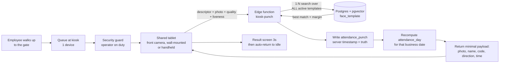
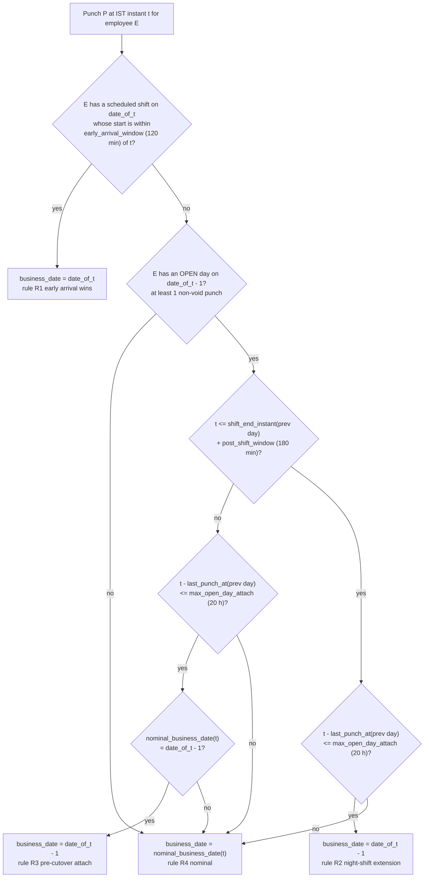
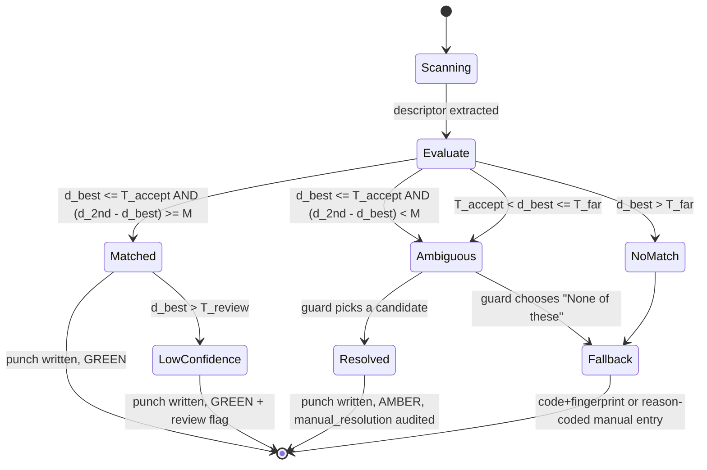
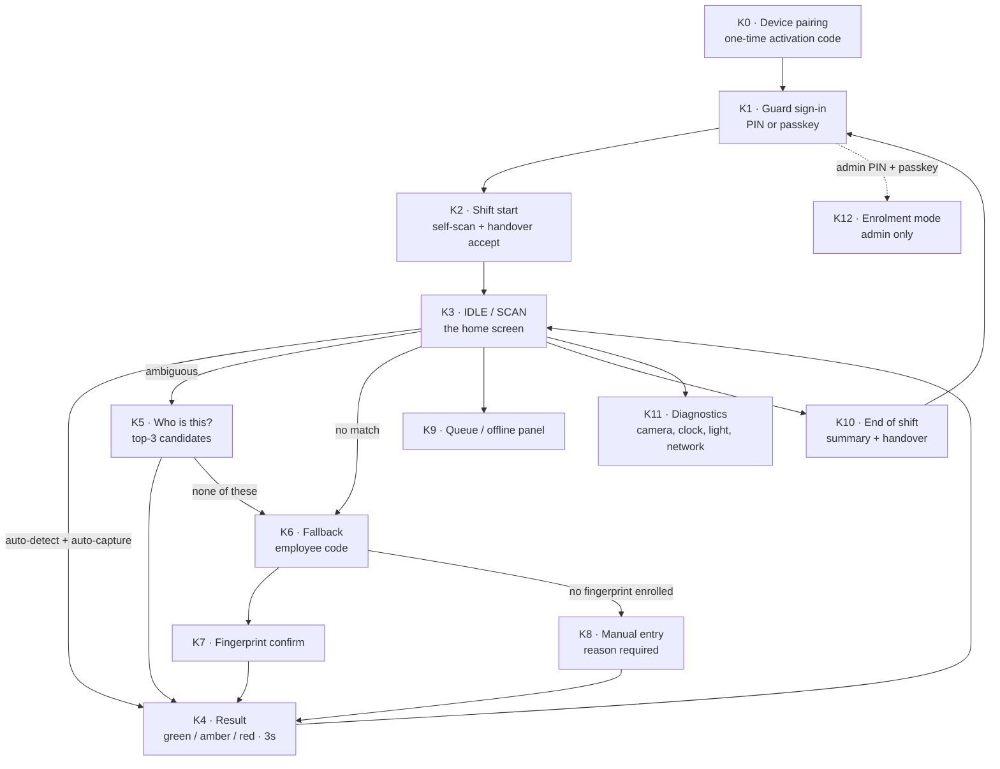
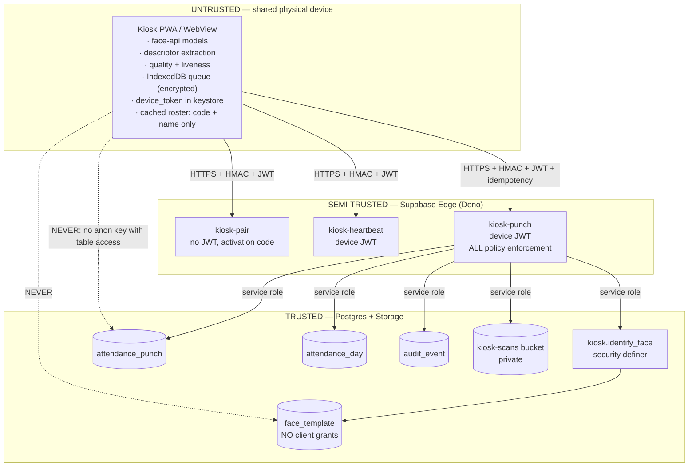
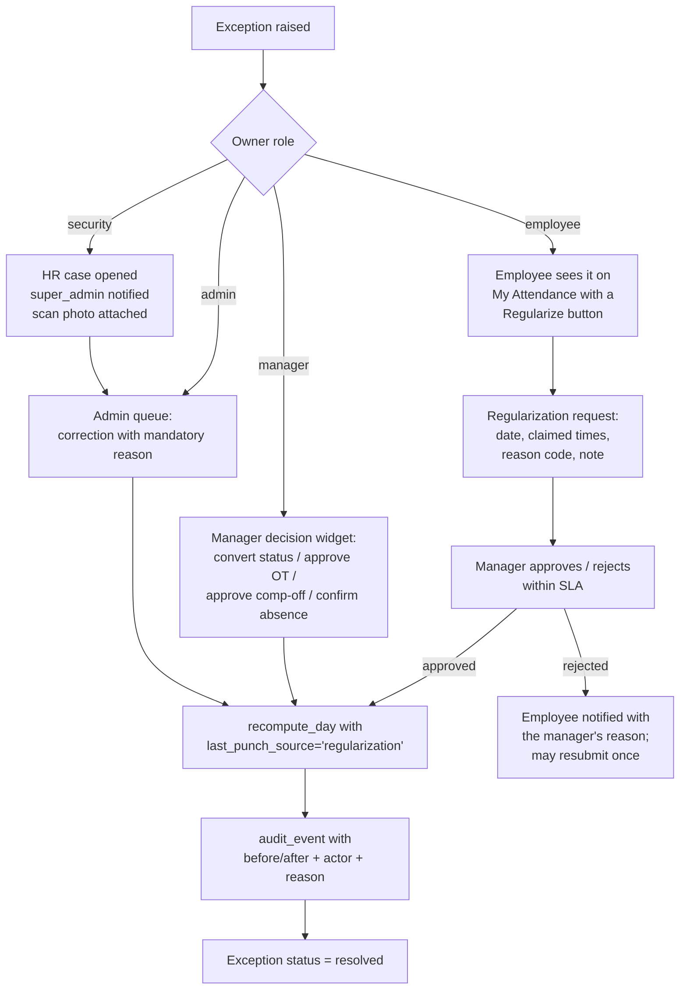

# 05 — Attendance Kiosk & Attendance Engine

**Product:** Tamarind Tree HRMS · **Entity:** Machani Hospitalities LLP (MH LLP, LLPIN AAF-9371) · **Venue:** 88, Avalahalli, Anjanapura Post, JP Nagar 9th Phase, Kanakapura Road, Bengaluru 560108 · **Timezone of record:** Asia/Kolkata (IST, UTC+05:30) · **Doc owner:** Staff Engineer + Principal PM · **Status:** Build bible, implementable as written.

**Purpose.** This document specifies the client's signature feature end to end: a single shared mobile camera kiosk at the venue gate, operated by a security guard, at which every employee scans their face (or fingerprint) and the system *identifies* who they are against all active biometric templates, then records a punch on the correct IST business date. It covers the operating model and how it differs from the reference repo's 1:1 self-verification design; the exact punch → day-record rules including cross-midnight event shifts; enrolment, consent and purge under India's DPDP Act 2023; the full 1:N matching algorithm with pgvector SQL, thresholds, margin rule and a FAR/FRR tuning plan; anti-spoofing and anti-abuse controls; offline tolerance; the complete guard/kiosk UX with exact on-screen copy; the security architecture and JSON contracts of the kiosk path; the attendance derivation engine with every formula stated once so two widgets can never disagree; the exception taxonomy and remediation paths; alternate capture channels and their trust levels; hardware, rollout, privacy and the test plan. Read it with `04-data-model.md` (tables, RLS, audit, IST helpers) beside you; `03-prd-admin.md` owns the admin consoles referenced here, `02-prd-manager.md` owns team analytics, `01-prd-employee.md` owns regularization UX, `06-ai-agent.md` consumes the metrics defined in §9, `07-design-system.md` owns the visual tokens the kiosk uses, and `08-architecture.md` owns deployment, secrets and CI.

---

## Table of contents

| § | Section |
|---|---|
| 1 | [Operating model — one shared kiosk, one guard, 1:N identification](#1-operating-model) |
| 2 | [Attendance rules — punches, business date, first/last, worked scenarios](#2-attendance-rules) |
| 3 | [Enrolment — capture protocol, quality gates, consent, purge](#3-enrolment) |
| 4 | [Matching — the 1:N algorithm, pgvector, thresholds, tuning](#4-matching) |
| 5 | [Anti-spoofing & anti-abuse](#5-anti-spoofing--anti-abuse) |
| 6 | [Offline tolerance](#6-offline-tolerance) |
| 7 | [The guard / kiosk interface](#7-the-guard--kiosk-interface) |
| 8 | [Security architecture of the kiosk path](#8-security-architecture-of-the-kiosk-path) |
| 9 | [The attendance derivation engine](#9-the-attendance-derivation-engine) |
| 10 | [Exceptions & remediation](#10-exceptions--remediation) |
| 11 | [Alternate capture channels & trust levels](#11-alternate-capture-channels--trust-levels) |
| 12 | [Hardware & deployment](#12-hardware--deployment) |
| 13 | [Rollout plan](#13-rollout-plan) |
| 14 | [Privacy & compliance](#14-privacy--compliance) |
| 15 | [Test plan](#15-test-plan) |
| 16 | [Appendix A — configuration registry](#16-appendix-a--configuration-registry) |
| 17 | [Appendix B — enum registry](#17-appendix-b--enum-registry) |
| 18 | [Appendix C — assumptions the team must confirm](#18-appendix-c--assumptions-the-team-must-confirm) |

---

## 1. Operating model

### 1.1 The gate reality at Tamarind Tree

Tamarind Tree is a five-acre event venue with one controlled vehicular/pedestrian gate on Kanakapura Road, a security cabin at that gate manned 24×7, and a workforce of banquet, kitchen, housekeeping, security, gardening, sales and admin staff. Events run Friday to Sunday and frequently end after midnight. Most operational staff do not carry a company smartphone, do not have a company email they check, and will not reliably log into a web app. The gate is the one place every single person passes through, twice a day, every day.

Therefore attendance is captured at the gate, on **one shared device**, by **one accountable operator**.



### 1.2 Actors and accountability

| Actor | What they do at the gate | What they are accountable for | What they can see |
|---|---|---|---|
| **Employee** (scanner) | Stands in front of the camera, faces it, waits ~1.5 s | Being physically present when their face is scanned | Their own name, code, photo and the punch confirmation on the result screen for ~3 s. Nothing else. |
| **Guard** (kiosk operator) | Signs into the kiosk at shift start, keeps the queue moving, resolves ambiguous/no-match cases, runs the fingerprint or code fallback, hands over at shift end | Every punch recorded during their operator session; every fallback and manual entry they authorise; the end-of-shift count reconciling with the physical queue | Kiosk screens only. Names + photos + codes of the top-3 candidates during a disambiguation. Today's own-session scan count. Nothing else — no salary, no contact details, no employee list, no history. |
| **Admin / HR** (`admin`) | Enrols templates, reviews the low-confidence queue, corrects records, configures shifts/policies | Enrolment quality, exception clearance SLA, the accuracy of the register that feeds payroll | Everything (see `03-prd-admin.md`). |
| **Manager** | Reviews team exceptions, approves regularizations, comp-off and OT | Their team's attendance integrity | Team scope only (see `02-prd-manager.md`). |
| **Super admin** (`super_admin`) | Purges biometric templates, exports audit, revokes devices, unlocks a locked pay period | Irreversible operations | Everything + destructive controls. |

**Decision 1.2.1 — the guard is an operator, not an approver.** The guard can never change *what* a punch means (in/out, time, date) — those are derived server-side. The guard can only (a) trigger a scan, (b) pick from a system-offered candidate list, (c) run a fallback capture, (d) submit a reason-coded manual entry that is flagged for admin review. Rationale: keeps the trust boundary at the server and keeps the guard's job to 3 buttons.

**Decision 1.2.2 — the guard is also an employee and punches at the same kiosk.** The first act of a shift is the guard self-scanning, which both records their check-in and opens the operator session (`kiosk_operator_session.opened_by_punch_id`). Punches where `operator_employee_id = subject_employee_id` are stamped `self_operated = true` and appear in the weekly review sample at 100%. Rationale: no separate mechanism for guards, but self-service is visible and audited.

### 1.3 What changes versus the reference repo (and every consequence)

The reference repo (`/Users/user/TT/HRMS_TT/hrms-digitalchemy`) implements **1:1 self-verification on the employee's own logged-in device**: the employee signs in, `FaceAttendance.tsx` fetches *their own* `employees.face_descriptor`, computes a Euclidean distance in the browser against a threshold of `0.52`, and on success the *browser* inserts the `attendance` row under an RLS policy that only checks row ownership. Nothing about the biometric claim is verified server-side. We are replacing that model wholesale.

| Dimension | Reference repo (1:1, client-trusted) | Tamarind Tree kiosk (1:N, server-authoritative) | Consequence we must engineer |
|---|---|---|---|
| Who is at the device | The employee, logged in as themselves | Anyone in the queue; the device is logged in as a *device*, with a *guard* as operator | **No employee login at the gate.** No Supabase user session for the scanner. Employee identity is an *output* of the system, not an input. |
| Question asked | "Is this the person whose descriptor I already fetched?" | "Which of the N active employees is this, if any?" | **Identification, not verification.** Search cost is O(N); false-accept risk scales with N; a margin rule between best and second-best becomes mandatory. |
| Where matching happens | In the browser, on the employee's phone | In a Deno edge function using the service role | **All matching moves server-side.** The device never receives any other employee's template. A compromised kiosk cannot forge a match. |
| What the client can write | `INSERT` into `attendance` directly via anon key + RLS | Nothing. The kiosk has no table-level grants at all | **Kiosk holds no Supabase anon key with table access.** It holds a device token, exchanges it for a short-lived JWT, and can call exactly one function. |
| Who is accountable | The employee (self-attested) | The guard on duty (operator session) + the device (pinned record) | **Every punch carries `operator_employee_id`, `kiosk_device_id`, `operator_session_id`.** Buddy-punching becomes a reviewable human act, not an invisible API call. |
| Threshold semantics | `0.52` Euclidean, one global value, never tuned | `T_accept` default `0.45` Euclidean on L2-normalised 128-D + margin `M ≥ 0.06`, tuned by a FAR/FRR study, overridable per employee | **Stricter by design** because 1:N with N≈60→600 multiplies false-accept exposure by N. |
| Failure of match | "Face not recognized", employee retries or gives up | Three explicit outcomes with three distinct guard flows and a mandatory audited fallback | **No dead ends at the gate.** A person physically present must always leave with a recorded event. |
| Timestamp | `new Date().toISOString()` from the client; `date` = **UTC calendar date** | `now()` on the database; `business_date` derived in IST with a configurable cutover | **The reference repo's UTC date is a bug for India.** A punch at 04:30 IST is 23:00 UTC *the previous day* — their `UNIQUE(employee_id, date)` would file it under the wrong day. We derive the date in IST, with a night-shift-aware cutover. |
| Geolocation | Browser GPS, **mandatory**, blocking hard-error if denied | Not used as a gate. The device is pinned by egress IP / network identity; GPS is advisory metadata only | **Indoor/covered-gate GPS is unreliable** and a mandatory GPS gate would block real punches. Pinning a fixed device is a stronger and cheaper control. |
| Photo of the event | Not captured | **Every scan stores a JPEG** in a private bucket, retained per policy | Buddy-punch review, dispute resolution and DPDP-compliant evidence all become possible. |
| Fingerprint | `navigator.credentials.get()` with a client-generated challenge, assertion **never sent to a server** — success decided in the browser | Server-issued challenge, server-verified assertion (`@simplewebauthn/server`), counter checked, bound to the kiosk device and operator session | **The reference fingerprint flow is decorative.** Ours is a real cryptographic assertion. |
| Breaks | Only `clock_in` / `clock_out`; the screenshotted product shows "Avg: 0 breaks/day" for every employee | Unlimited punches stored as first-class rows; break derivation is an explicit, documented mode per employee | **Break data becomes real** instead of structurally always-zero. |
| Enrolment | Employee self-enrols from their dashboard, 5 samples averaged, writes `employees.face_descriptor` via their own RLS UPDATE | Admin/HR enrols at the kiosk, or employee self-captures and an admin **approves**; written only by the server; duplicate-check against all existing templates | **An employee can no longer overwrite their own biometric identity.** Template forgery and accidental cross-enrolment are both blocked. |
| Storage shape | `jsonb` array of 128 floats on the employee row | `vector(128)` in a dedicated versioned `face_template` table, with lifecycle states and consent linkage | Indexable, versionable, revocable, purgeable — see §3.4 and `04-data-model.md`. |

**Decision 1.3.1 — we keep exactly two things from the reference implementation:** the model choice (`@vladmandic/face-api`, TinyFaceDetector + 68-point tiny landmarks + `face_recognition_model` producing a 128-D descriptor, ~6.7 MB of weights served from `/models`) and the idle-time model warm-up pattern (`loadFaceModels()` / `warmFaceModels()`). Rationale: the weights are proven, on-device, free, and work offline in a WebView; everything above them was rebuilt.

### 1.4 Non-negotiable invariants

These are the statements every reviewer should be able to check any PR against.

| # | Invariant |
|---|---|
| **INV-1** | The **server timestamp** (`server_received_at`, from Postgres `now()`) is the record of truth for when a punch happened. The device timestamp is metadata only, never used for derivation of an online punch. |
| **INV-2** | The kiosk device has **no direct database access**. Its only capability is `POST /functions/v1/kiosk-punch` (plus `kiosk-pair`, `kiosk-heartbeat`). |
| **INV-3** | A face descriptor of *another* employee never reaches the kiosk. Only the matched (or candidate) employee's display name, code and photo do. |
| **INV-4** | **No biometric event is ever silently dropped.** Debounced, spoof-suspected, unmatched, post-lock and offline-late punches are all persisted with a flag and a reason. |
| **INV-5** | Raw face images are **never** the matching input in production, and raw images are never stored in the same table as the descriptor. Descriptors live in `face_template`; images live in the private `biometric-refs` and `kiosk-scans` buckets. |
| **INV-6** | Every derived attendance metric is computed in **exactly one place** (`attendance.recompute_day`) and read by everything else. No widget recomputes anything. |
| **INV-7** | Every create/update/delete on any attendance, template, device, consent or override row writes an `audit_event` row with actor, IST + UTC timestamps, before/after JSON, and reason where applicable. |
| **INV-8** | The kiosk shows no HR data. The complete allow-list of what it may render is in §7.12. |
| **INV-9** | A person physically at the gate always leaves with a recorded event — matched, resolved, fallback or reason-coded manual. "Nothing happened" is not a permitted outcome. |
| **INV-10** | Biometric consent is a precondition for enrolment, and withdrawal of consent deactivates the template within one transaction. |

---

## 2. Attendance rules

### 2.1 Vocabulary (used identically in code, UI and every other doc)

| Term | Meaning | Storage |
|---|---|---|
| **Punch** | One recorded biometric (or alternate-channel) event for one employee at one instant. Not typed as in/out at write time. | `attendance_punch` row |
| **Business date** | The IST calendar date the punch is attributed to, after cutover logic. All attendance is bucketed by this, never by UTC date. | `attendance_punch.business_date`, `attendance_day.business_date` |
| **Check-in** | The **earliest** non-void punch of a business date. Derived. | `attendance_day.first_punch_at` / `first_punch_id` |
| **Check-out** | The **latest** non-void punch of a business date, when there are ≥ 2 non-void punches. Derived. The last one always wins. | `attendance_day.last_punch_at` / `last_punch_id` |
| **Intermediate punch** | Any non-void punch that is neither first nor last. Always stored, always shown in "View Punches", may or may not create a break depending on punch mode. | `attendance_punch` |
| **Void punch** | A punch excluded from derivation: debounced duplicate, hard-rejected spoof, or admin-voided with reason. Retained for audit. | `attendance_punch.is_void = true`, `void_reason` |
| **Day record** | One row per employee per business date holding every derived metric and the day status. Recomputed idempotently from punches + shift + calendar + leave. | `attendance_day` |
| **Exception** | A machine-detected problem with a day or a punch, with severity, owner and remediation path. | `attendance_exception` |
| **Operator session** | A guard's bounded period of custody of the kiosk. | `kiosk_operator_session` |

**Decision 2.1.1 — punches are untyped at write time.** We do not store "IN" or "OUT" on the punch. Direction is a *derived view* of the day, so the client's rule "the extreme last scan is check-out" is structurally guaranteed rather than dependent on write order. The kiosk *displays* a direction (see §2.4) computed by the server at write time as a courtesy to the human, and that displayed value is stored as `display_direction` for audit of what the guard was told — but derivation never reads it.

### 2.2 Business date and the cutover

Storing `punch_at timestamptz` (a UTC instant) is correct; deriving the day in UTC is not. The reference repo's `date = new Date().toISOString().split("T")[0]` puts every punch between 00:00 and 05:29 IST on the wrong day. Our rule:

**Nominal cutover.** `attendance.business_date_cutover_minutes = 300` (05:00 IST), configurable org-wide and overridable per department.

```sql
-- 04-data-model.md owns this function; restated here because it is the heart of §2.
create or replace function attendance.nominal_business_date(
  p_punch_at timestamptz,
  p_cutover_minutes int default 300
) returns date
language sql immutable as $$
  select ((p_punch_at at time zone 'Asia/Kolkata')
          - make_interval(mins => p_cutover_minutes))::date;
$$;
```

| Punch instant (IST) | minus 300 min | Nominal business date |
|---|---|---|
| 14-Nov-2026 09:14 | 14-Nov 04:14 | **2026-11-14** |
| 14-Nov-2026 23:58 | 14-Nov 18:58 | **2026-11-14** |
| 15-Nov-2026 00:20 | 14-Nov 19:20 | **2026-11-14** |
| 15-Nov-2026 04:30 | 14-Nov 23:30 | **2026-11-14** |
| 15-Nov-2026 04:59:59 | 14-Nov 23:59:59 | **2026-11-14** |
| 15-Nov-2026 05:00:00 | 15-Nov 00:00:00 | **2026-11-15** |

**Night-shift extension.** A banquet event shift can legitimately end at 05:10 or 05:40 IST, past the nominal cutover. The nominal rule alone would file that check-out on the *next* day, creating a fake single-punch day and a fake missing-checkout. So business-date assignment is an ordered decision list, evaluated per punch, per employee:



| Rule | Condition | Result | Why it exists |
|---|---|---|---|
| **R1** | E has a shift on `date(t)` starting within ±120 min of `t` | `business_date = date(t)` | A gardener arriving 05:30 for a 06:00 shift must open a *new* day even if yesterday is still open. R1 outranks everything. |
| **R2** | Previous business date is open, `t ≤ shift_end(prev) + 180 min`, and gap from last punch ≤ 20 h | `business_date = date(t) − 1` | Event shift 18:00→03:00; staff clear the venue and punch out at 05:40. |
| **R3** | Previous business date is open, `t` is before the nominal cutover, gap ≤ 20 h | `business_date = date(t) − 1` | The plain "scan at 04:30 after a midnight event" case, even without a scheduled night shift. |
| **R4** | Otherwise | `business_date = nominal_business_date(t)` | Default. |

`shift_end_instant(prev)` accounts for cross-midnight shifts: for shift N `18:00–03:00` assigned to 14-Nov, `shift_end_instant = 15-Nov 03:00 IST`; with the 180-minute post-shift window the attach horizon is 15-Nov 06:00 IST.

**Config:** `attendance.early_arrival_window_minutes = 120`, `attendance.post_shift_window_minutes = 180`, `attendance.max_open_day_attach_hours = 20`.

**Decision 2.2.1 — business date is computed once, at write time, and stored.** It is not a generated column and not recomputed on read. If an admin later changes a shift assignment or the cutover, a `business_date` re-derivation job runs, writes `audit_event` rows for every punch it moves, and recomputes both affected days. Rationale: read paths must never disagree with each other, and payroll must be able to prove what a punch was attributed to at the time it was locked.

### 2.3 First scan, last scan, and everything between

| Rule | Statement |
|---|---|
| **AR-1** | The first non-void punch of a business date is the **check-in**. `attendance_day.first_punch_at`. |
| **AR-2** | The last non-void punch of a business date is the **check-out**, *provided* `non_void_punch_count ≥ 2`. `attendance_day.last_punch_at`. |
| **AR-3** | The number of punches per business date is **unlimited**. Every one is stored and visible in "View Punches" with time, channel, confidence, operator, device and photo thumbnail. |
| **AR-4** | Adding a later punch **always** moves the check-out. There is no "already checked out" lock during the business date. |
| **AR-5** | If `non_void_punch_count = 1`, the day has a check-in and **no** check-out. Treatment in §2.3.1. |
| **AR-6** | A second punch by the same employee within `attendance.debounce_seconds = 120` of their previous punch on the same business date is stored with `is_void = true`, `void_reason = 'debounce'`, and does not affect any metric. The guard is told it was already recorded. |
| **AR-7** | Punches are ordered by `punch_at` (server instant). Ties (same microsecond, impossible in practice) break by `device_monotonic_seq`, then `id`. |

#### 2.3.1 Single-punch day — the exact treatment

A single scan means the person was demonstrably at the gate but we cannot compute a duration. Options considered: (a) mark absent — punishes a present employee for a hardware/queue failure, unacceptable; (b) auto-fill check-out at shift end — fabricates data into payroll, unacceptable; (c) mark present with a null duration and force remediation — chosen.

| Field | Value on a single-punch day |
|---|---|
| `first_punch_at` | the punch |
| `last_punch_at` | `NULL` |
| `worked_minutes_gross` / `_paid` | `NULL` (**not** 0 — a null means "unknown", a zero means "measured zero"; every widget must render `—`, never `0`) |
| `break_minutes` | `NULL` |
| `late_minutes` | computed normally from `first_punch_at` (we know when they arrived) |
| `early_exit_minutes` | `NULL` |
| `overtime_minutes` | `0` |
| `day_status` | `present_incomplete` |
| `paid_day_value` | `attendance.single_punch_provisional_paid_value = 1.0` until remediated; recomputed on remediation |
| `is_payroll_blocking` | `true` if unresolved when the pay period closes |
| Exception raised | `EXC-MISSING-CHECKOUT` (severity **high**) |

`present_incomplete` is a real status, shown in employee/manager/admin UI as **"Present · check-out missing"** with a **Regularize** action. Remediation: employee raises a regularization with a claimed check-out time and reason (`01-prd-employee.md` §Regularization); manager approves; the day is recomputed with `last_punch_source = 'regularization'` and the derived duration is flagged `is_derived_from_claim = true` so OT from a claimed time can be policy-blocked. Admin may instead post a correction directly (always with reason + audit).

**Decision 2.3.1.1 — a provisional paid value of 1.0.** Rationale: at a hospitality venue the overwhelming cause of a single punch is a queue/hardware/guard-flow failure, not absence; withholding pay by default would be both unfair and an HR incident. The exception is high severity, blocks period close, and appears on the manager's dashboard, so it cannot be quietly abused.

### 2.4 Displayed direction (what the guard and employee are told)

Computed at write time purely for the human on the screen:

| Condition at write time | `display_direction` | On-screen copy |
|---|---|---|
| This is the first non-void punch of the business date | `check_in` | "Checked in at 09:14 IST" |
| There is exactly one earlier non-void punch | `check_out` | "Checked out at 18:32 IST" |
| There are ≥ 2 earlier non-void punches | `punch` | "Punch recorded · 18:32 IST · scan #4 today" |
| Punch was debounced | `duplicate` | "Already recorded at 09:14 — you're done" |

### 2.5 Weekly offs and holidays

Scanning on a non-working day is **normal** at Tamarind Tree — events run Friday to Sunday. It is never an error.

| Situation | Day status | Metrics | Downstream |
|---|---|---|---|
| Scan on a weekly-off day | `weekly_off_worked` | `extra_working_minutes = worked_minutes_paid`; `worked_minutes_*` populated normally; `overtime_minutes = 0` (the whole day is extra work, not overtime on top of a shift) | Comp-off credit per §9.9; paid at the extra-working/OT rate per policy if the employee is OT-eligible |
| Scan on a company holiday | `holiday_worked` | same as above | same |
| Scan on a declared event-blackout day (no shift assigned but working) | `on_duty` | normal | normal |
| No scan on a weekly-off day | `weekly_off` | all durations `NULL`, `paid_day_value = 1.0` | none |
| No scan on a holiday | `holiday` | all durations `NULL`, `paid_day_value = 1.0` | none |

Weekly-off determination follows the screenshotted product's model, which we keep because Indian rostering needs it: two weekly-off slots per employee (`first_weekly_off`, `second_weekly_off`), each with a week-of-month applicability set drawn from `{1,2,3,4,5}` (so "2nd and 4th Saturday off" is expressible). Week-of-month is computed as `ceil(day_of_month / 7)` in IST — stated explicitly because ISO week numbering would give a different answer. Rotational rosters override the rule-based weekly off via `shift_assignment.is_weekly_off = true` on specific dates, and the roster always wins over the rule. See `04-data-model.md` for `weekly_off_rule` and `shift_assignment`.

Comp-off credit requires manager approval and is capped; the accrual formula is §9.9.

### 2.6 Worked scenarios

Reference employee for all scenarios: **TT0042 · Ravi Kumar · Banquet Steward**. Shifts used:

| Code | Name | Window (IST) | Span | `standard_minutes` | `unpaid_break_minutes` | `grace_in` | `grace_out` |
|---|---|---|---|---|---|---|---|
| `G` | General | 09:30 – 18:30 | 540 | 540 | 0 | 10 | 10 |
| `E1` | Event Evening | 15:00 – 00:00 | 540 | 540 | 0 | 10 | 10 |
| `N` | Night Event | 18:00 – 03:00 | 540 | 540 | 0 | 10 | 10 |

Org config in force: cutover 05:00, debounce 120 s, OT threshold 30 min, OT rounding 15 min (floor), `min_minutes_full_day = 420`, `min_minutes_half_day = 240`.

#### Summary table

| # | Scenario | Raw scans (IST) | Business date | Non-void punches | Derived day record | Exceptions |
|---|---|---|---|---|---|---|
| 1 | Normal day, shift G | 14-Nov 09:41, 14-Nov 19:12 | 2026-11-14 | 2 | `present`; in 09:41; out 19:12; gross 571; paid 571; break 0; late 1; early 0; OT 0; paid 1.0 | none |
| 2 | Single punch | 15-Nov 09:28 | 2026-11-15 | 1 | `present_incomplete`; in 09:28; out `NULL`; gross `NULL`; late 0; paid 1.0 provisional | `EXC-MISSING-CHECKOUT` (high) |
| 3 | Six punches, SinglePunch mode | 16-Nov 09:22, 12:05, 12:41, 15:58, 16:19, 18:44 | 2026-11-16 | 6 | `present`; in 09:22; out 18:44; gross 562; paid 562; break 0; late 0; OT 0; paid 1.0 | none |
| 3b | Same six punches, DualPunch mode | as above | 2026-11-16 | 6 | `present`; gross 562; **break 57**; paid 505; OT 0; paid 1.0 | none |
| 4 | Cross-midnight event shift E1 | 17-Nov 14:52, 18-Nov 00:37 | 2026-11-17 | 2 | `present`; in 14:52; out 18-Nov 00:37; gross 585; paid 585; late 0; early 0; OT 15; paid 1.0 | `EXC-OT-UNAPPROVED` (low) until approved |
| 5 | Scan at 04:30 after a midnight event | 20-Nov 17:55, 21-Nov 04:30 | 2026-11-20 (rule R3/R2) | 2 | `present`; in 17:55; out 21-Nov 04:30; gross 635; paid 635; OT 60; paid 1.0 | `EXC-OT-UNAPPROVED` (low); `EXC-LONG-DURATION` (low, > 600 min) |
| 6 | Weekly-off scan (Sunday, off by rule) | 22-Nov 10:02, 22-Nov 16:40 | 2026-11-22 | 2 | `weekly_off_worked`; gross 398; paid 398; extra_working 398; OT 0; paid 1.0 + comp-off 0.5 pending approval | `EXC-COMPOFF-PENDING` (info) |
| 7 | Duplicate scans 20 s apart | 23-Nov 09:31:04, 09:31:24 | 2026-11-23 | 1 (second is void) | `present_incomplete` until an evening punch arrives; second punch stored `is_void=true, void_reason='debounce'` | none from the duplicate itself |
| 8 | Scan after period lock | 26-Oct 09:20 arriving 03-Nov (offline device recovered) into a period locked 31-Oct | 2026-10-26 | 1, `post_lock = true` | Locked `attendance_day` **not** mutated; an `attendance_adjustment` row is created for the next open period | `EXC-POST-LOCK-PUNCH` (high, admin) |
| 9 | Scan while on approved leave | 24-Nov 09:35, 18:10 (full-day casual leave approved) | 2026-11-24 | 2 | `day_status` stays `leave`; durations computed and stored; `paid_day_value` from leave = 1.0; work not paid twice | `EXC-SCAN-ON-LEAVE` (medium, manager) |
| 10 | Scan by a resigned employee | 30-Nov 09:12, template deactivated 28-Nov | — | 0 (no punch created) | none | `EXC-INACTIVE-IDENTITY` (high, security) |
| 11 | Sub-minimum hours | 25-Nov 09:30, 12:35 | 2026-11-25 | 2 | `half_day`; gross 185 → below `min_minutes_half_day` 240 → see below | `EXC-SUB-MINIMUM-HOURS` (medium) |
| 12 | Impossible duration | 27-Nov 08:02, 28-Nov 04:55 (shift G) | 2026-11-27 | 2 | `present_incomplete`; duration 1253 min > `max_plausible_minutes` 900 → out rejected as check-out, held for review | `EXC-IMPOSSIBLE-DURATION` (high) |
| 13 | Clock-skewed offline punch | device clock 8 min fast; punch captured "09:40", synced 11:02 | per reconstructed instant | 1 | punch_at reconstructed from monotonic queue age; device time kept as metadata | `EXC-CLOCK-SKEW` (medium) |
| 14 | Unmatched face, resolved by fingerprint | 29-Nov 09:18 no-match → fingerprint fallback 09:19 | 2026-11-29 | 1 (channel `kiosk_fingerprint`) | `present_incomplete` until evening; `confidence_band = 'fallback'` | `EXC-FACE-NO-MATCH` (info, enrolment queue) |

#### Detailed walk-throughs

**Scenario 1 — normal day.** Shift G. `first = 09:41`, `last = 19:12`.
`worked_minutes_gross = 19:12 − 09:41 = 9 h 31 m = 571`. `unpaid_break_minutes = 0` → `worked_minutes_paid = 571`.
`late_minutes = max(0, 09:41 − (09:30 + 10 min)) = max(0, 09:41 − 09:40) = 1` → `is_late_day = true`, `late_hours = 0.02`.
`early_exit_minutes = max(0, (18:30 − 10 min) − 19:12) = 0`.
`overtime_minutes_raw = max(0, 571 − 540 − 30) = 1`; floor to 15-minute units → `overtime_minutes = 0`.
`day_status = present`, `paid_day_value = 1.0`.
*Note the deliberate consequence:* a 1-minute lateness is recorded truthfully as 1 minute and one late day. It does not become 0 because of rounding, and it does not become an hour. The screenshotted product's "Late Hrs 0 / Late Days 0" while showing 11:18 clock-ins is exactly the failure we are avoiding.

**Scenario 3 / 3b — six punches, and why punch mode matters.** Punches at 09:22, 12:05, 12:41, 15:58, 16:19, 18:44.
*SinglePunch (Tamarind Tree default):* only the extremes count. `gross = 18:44 − 09:22 = 562`. Breaks are not inferred; `break_minutes = 0`; the four intermediate punches are visible in "View Punches" and are used for the gate-activity audit only.
*DualPunch (opt-in per employee/department):* pairs are `(09:22,12:05)`, `(12:41,15:58)`, `(16:19,18:44)`.
`worked = 163 + 197 + 145 = 505`. Gaps between pairs = `12:41−12:05 = 36` and `16:19−15:58 = 21` → `break_minutes = 57`. `gross = 562` (span), `paid = 562 − 57 = 505`. Both numbers are stored; `gross` is the span, `paid` is what payroll uses. **The two are separately named so no widget can confuse them.**
*Odd punch count in DualPunch:* with `n` odd and `n ≥ 3`, alternating pairing is undecidable (`n−2` interior punches cannot pair). Rule: raise `EXC-ODD-PUNCH-COUNT` (medium), degrade that single day to SinglePunch arithmetic (`paid = gross − shift.unpaid_break_minutes`), and flag `break_derivation = 'degraded'`. Deterministic, honest, and reviewable.

**Scenario 4 — cross-midnight event shift.** Shift E1 `15:00–00:00` assigned to 17-Nov; `shift_end_instant = 18-Nov 00:00`. Punch 17-Nov 14:52 → R1 (shift starts 15:00, within 120 min) → BD 17-Nov. Punch 18-Nov 00:37 → date(t) = 18-Nov; R1? no shift on 18-Nov starting near 00:37 → no. Previous day open? yes. `t ≤ 18-Nov 00:00 + 180 min = 03:00`? yes. Gap `00:37 − 14:52 = 9 h 45 m ≤ 20 h`? yes → **R2** → BD 17-Nov.
`gross = 14:52 → 00:37 = 585`. `late = max(0, 14:52 − 15:10) = 0`. `early_exit = max(0, (00:00 − 10) − 00:37) = 0`.
`OT_raw = max(0, 585 − 540 − 30) = 15` → floor 15 → `overtime_minutes = 15`. Payable only with an approved OT record (§9.8).

**Scenario 5 — 04:30 scan after a midnight event.** Shift N `18:00–03:00` on 20-Nov; `shift_end_instant = 21-Nov 03:00`, attach horizon 06:00. Punch 21-Nov 04:30: R1 no; previous open yes; `04:30 ≤ 06:00` yes; gap `10 h 35 m ≤ 20 h` yes → **R2** → BD 20-Nov. Even with no scheduled night shift, R3 would catch it because `nominal_business_date(21-Nov 04:30) = 20-Nov`.
`gross = 17:55 → 04:30 = 635`. `OT_raw = max(0, 635 − 540 − 30) = 65` → floor to 15 → **60**. `EXC-LONG-DURATION` fires at `> attendance.long_duration_minutes = 600` as an informational flag for the manager, not a block.

**Scenario 6 — weekly-off work and comp-off.** 22-Nov is Sunday, `first_weekly_off = Sunday`, weeks `{1,2,3,4,5}` → weekly off. Two punches → `weekly_off_worked`. `gross = 10:02 → 16:40 = 398`; `extra_working_minutes = 398`.
Comp-off: `398 ≥ compoff_half_day_minutes (240)` and `< compoff_full_day_minutes (480)` → **0.5 day** credit, status `pending_approval`, expiry 90 days. `overtime_minutes = 0` by rule §2.5 — a whole worked day off-roster is extra working, not overtime.

**Scenario 8 — punch after period lock.** Pay period `PP-2026-10` (26-Sep→25-Oct… see §9.11) is locked. A device recovered from a fault syncs a 26-Oct punch on 03-Nov. The punch **is written** (INV-4) with `post_lock = true` and `sync_lag_minutes` recorded. The locked `attendance_day` is *not* mutated. Instead `attendance_adjustment` captures the delta (paid-day change, OT change) for application in the next open period, with a reason string that appears on the payslip as an arrears/adjustment line (see `03-prd-admin.md` §Payroll adjustments). Only `super_admin` may unlock a period to restate it.

**Scenario 10 — resigned employee.** `face_template.status` moves to `inactive` at 23:59:59 IST of `last_working_date`. The 1:N search runs against active templates only. To avoid the guard being told "unknown person" about someone they know, the function performs a **second, restricted search** against templates deactivated within `attendance.inactive_lookback_days = 90`; if that hits above `T_accept`, the outcome is `identity_inactive`: **no punch is created**, the guard sees "Not authorised. Please contact HR." and `EXC-INACTIVE-IDENTITY` fires to HR + security with the scan photo attached.

**Scenario 11 — sub-minimum hours.** `gross = 09:30 → 12:35 = 185`. `185 < min_minutes_half_day (240)` → `day_status = absent_short` with `paid_day_value = attendance.short_day_paid_value = 0.0`, `EXC-SUB-MINIMUM-HOURS` (medium) to the manager. The employee can regularize (e.g. "sent home after site inspection") and the manager can convert the day to `half_day`, `on_duty` or `leave`. We deliberately do **not** silently pay a 3-hour day as full.

**Scenario 12 — impossible duration.** `08:02 → next-day 04:55 = 1253 min`, above `attendance.max_plausible_minutes = 900`. The later punch is not accepted as the day's check-out; it is stored with `held_for_review = true` and excluded from derivation until an admin decides (attach to this day, move to the next day, or void). The day meanwhile reports `present_incomplete`. Rationale: a 21-hour "worked" day silently entering payroll is worse than an exception queue item.

**Scenario 13 — clock-skewed offline punch.** See §6.5. The punch is accepted; the *device timestamp* is rejected as a source of truth and `punch_at` is reconstructed as `server_received_at − queue_age_ms` where `queue_age_ms` comes from `performance.now()` monotonic deltas, not the wall clock.

---
## 3. Enrolment

### 3.1 Who enrols, and how

Three enrolment modes. All three end in a `face_template` row; only two of them end in an *active* one.

| Mode | Who operates | Where | Result | When used |
|---|---|---|---|---|
| **M1 — Admin enrolment at the kiosk** (default) | Admin/HR, signed into the kiosk in **Enrolment Mode** (a separate PIN-gated mode, not the guard's session) | Gate kiosk or HR cabin tablet | `face_template.status = 'active'` immediately | Onboarding day, the enrolment drive (§13.1), re-enrolment |
| **M2 — Admin enrolment from the web console** | Admin/HR on a laptop with a webcam | `/admin/attendance/enrolment` | `active` immediately | Office staff, corrections, when the kiosk is busy |
| **M3 — Employee self-capture** | Employee on their own phone, logged in | `/me/biometrics` | `face_template.status = 'pending_approval'`; **not** used for matching until an admin approves it side-by-side against the HR photo | Remote/new staff, template refresh, employees who prefer not to queue |

**Decision 3.1.1 — self-enrolment never self-activates.** The reference repo let an employee write their own descriptor with an RLS `UPDATE`. That makes identity theft a one-click operation. Under M3 the employee submits; an admin sees the three captured reference frames next to the employee's existing HR photo and either **Approves** (template goes active, previous template versioned out) or **Rejects with reason**. Both actions are audited.

**Decision 3.1.2 — enrolment is a distinct kiosk mode, never available inside a guard session.** A guard cannot enrol anyone. Entering Enrolment Mode requires an admin PIN + the admin's passkey on the same device, ends the guard session, and is logged. Rationale: enrolment is the root of trust; guards must not be able to add a face.

### 3.2 Capture protocol

Identical in all three modes so template quality is comparable.

| Step | Requirement |
|---|---|
| **Samples** | **7** accepted frames (reference repo used 5; we raise it because 1:N needs a tighter centroid). Minimum 5 accepted to finish; below 5 the session fails and must restart. |
| **Spread** | Frames are taken ≥ **400 ms** apart, and the session must span ≥ 3.5 s, so 7 identical frames from a still photo are unlikely to all pass motion checks. |
| **Pose script** | The UI guides through 5 prompts, ~2 frames each: 1) "Look straight at the camera", 2) "Turn your head slightly left", 3) "Turn your head slightly right", 4) "Tilt your chin down a little", 5) "Look straight again and smile". Yaw target ±15°, pitch ±10° — enough variation to widen the template's tolerance without corrupting the centroid. |
| **Lighting** | Face-region mean luminance in `[0.30, 0.85]` (0–1 scale) and inter-quartile luminance spread ≤ 0.45 (rejects hard backlight/half-lit faces). The kiosk's ring light is on during enrolment. |
| **Glasses/headwear** | Captured **as normally worn**. If the employee wears glasses daily, enrol with glasses on for 4 frames and off for 3, producing a template tolerant of both. Caps and turbans stay on; the forehead is not required. Masks are removed for enrolment. |
| **Detector** | `TinyFaceDetectorOptions({ inputSize: 512, scoreThreshold: 0.6 })` for enrolment (higher fidelity than the scan path, latency is not critical here), `.withFaceLandmarks(true).withFaceDescriptor()`. |
| **Single face only** | If more than one face is detected in a frame, the frame is discarded and the UI says "Only the person being enrolled should be in frame." |

### 3.3 Quality gating (hard thresholds)

Every candidate frame must pass **all** of these or it is silently discarded and the session continues until 7 pass or the 45-second budget expires.

| Gate | Metric | Threshold | Rationale |
|---|---|---|---|
| Detector confidence | `detection.score` | `≥ 0.60` | Weak detections yield noisy descriptors. |
| Face size | `min(box.width, box.height)` in source pixels | `≥ 160 px` (enrolment), `≥ 110 px` (scan) | Below ~110 px the recognition net's descriptor degrades measurably. |
| Face fraction | face box area / frame area | `0.06 – 0.60` | Too far / too close. |
| Sharpness | variance of Laplacian over the grayscale face crop | `≥ 120` (enrolment), `≥ 70` (scan) | Motion blur is the single biggest cause of false rejects at a busy gate. |
| Brightness | mean luminance of face crop | `0.30 – 0.85` | See §3.2. |
| Contrast | std-dev of luminance of face crop | `≥ 0.06` | Rejects washed-out/backlit frames. |
| Landmark symmetry | \|left-eye→nose\| / \|right-eye→nose\| | `0.70 – 1.43` | Cheap proxy for extreme yaw. |
| Eyes open | eye-aspect-ratio from the 68-point landmarks | `≥ 0.18` on ≥ 5 of 7 frames | A blink-frame descriptor is a poor centroid contributor. |
| Occlusion | mouth+nose landmark visibility confidence | `≥ 0.5` | Rejects mask/hand-over-face frames at enrolment. |

Thresholds live in `attendance.quality_gates` (JSONB, versioned) so they can be tuned without a deploy; every change writes an `audit_event` and bumps `quality_gate_version`, which is stamped onto each template and each punch.

### 3.4 Duplicate check (the anti-cross-enrolment gate)

Before a template is written, the computed centroid is searched against **all** existing templates (active *and* `pending_approval`, and inactive templates within `inactive_lookback_days`), excluding the employee being enrolled.

| Outcome | Condition | Behaviour |
|---|---|---|
| **Clean** | best distance `> T_dup_warn` | Write the template. |
| **Warn** | `T_dup_block < d ≤ T_dup_warn` | Write the template but raise `EXC-ENROL-NEAR-DUPLICATE` (medium) naming both employees, and force a per-employee threshold review (§4.7). Expected for genuine siblings/twins on staff. |
| **Block** | `d ≤ T_dup_block` | **Refuse** the enrolment. On-screen: "This face is already enrolled as another employee. Enrolment stopped. HR must resolve this before continuing." Log `EXC-ENROL-DUPLICATE-BLOCKED` (high) with both employee ids and both reference frames. |

Defaults: `T_dup_block = 0.32`, `T_dup_warn = 0.42` (Euclidean on L2-normalised 128-D). These are deliberately stricter than `T_accept = 0.45` because at enrolment we are protecting the whole system's integrity and a false block costs 60 seconds of HR time, whereas a false accept costs permanent identity confusion.

### 3.5 What is stored (and what is not)

```
face_template
  id                     uuid pk
  employee_id            uuid  → employee
  version                int   -- 1,2,3… per employee
  status                 face_template_status  -- pending_approval | active | inactive | purged
  descriptor             vector(128)   -- L2-normalised centroid of the accepted frames
  descriptor_model        text  -- 'faceapi-rn34-128d-v1'
  sample_count           int
  sample_distances       numeric[]  -- each frame's distance to the final centroid (tightness audit)
  intra_template_spread  numeric    -- max(sample_distances); a QA signal, see below
  quality_gate_version   int
  captured_channel       face_capture_channel  -- kiosk_enrol | web_admin | employee_self
  captured_by            uuid  -- actor employee/user id
  kiosk_device_id        uuid null
  consent_id             uuid  → biometric_consent (NOT NULL for active)
  reference_image_paths  text[]  -- private bucket keys, may be emptied by retention job
  approved_by            uuid null
  approved_at            timestamptz null
  activated_at           timestamptz null
  deactivated_at         timestamptz null
  deactivation_reason    text null
  purged_at              timestamptz null
  created_at / updated_at timestamptz
```

| Rule | Detail |
|---|---|
| **Descriptor, not image, is the matcher input** | The 128-D float vector is what is searched. It is not reversible to a photograph. |
| **L2-normalised at capture** | The centroid is normalised to unit length **before** storage, so Euclidean and cosine distance are monotonically equivalent (§4.4) and thresholds are stable. |
| **Reference images are optional and separate** | Up to 3 of the 7 accepted frames are stored as JPEG (max 640×640, quality 80) in the **private** `biometric-refs` bucket at `biometric-refs/{employee_id}/{template_id}/{n}.jpg`. Purpose: admin approval of M3, dispute resolution, re-enrolment comparison. Never public, never signed for longer than 120 s, never sent to the kiosk. Retention: `privacy.reference_image_retention_days = 400` from `activated_at`, then auto-deleted while the descriptor survives. |
| **`intra_template_spread` is a QA gate** | If `max(sample_distances) > 0.30`, the enrolment is flagged `low_cohesion` and the operator is prompted to redo it: "Captures don't agree with each other. Let's try again with steadier lighting." A loose template is the #1 cause of later false rejects. |
| **No raw video, ever** | Frames are processed in-memory; the MediaStream is stopped on session end; no video is written to disk or network. |

### 3.6 Template versioning and re-enrolment

- **One active template per employee.** Enforced by a partial unique index `unique (employee_id) where status = 'active'`.
- Re-enrolment writes `version = max(version)+1`. On activation the previous active template flips to `inactive` with `deactivation_reason = 'superseded_by_v{n}'`. Old versions are retained (descriptor only) for `privacy.superseded_template_retention_days = 180` so a disputed punch from last month can be re-explained, then purged by the retention job.
- Every punch stores `matched_template_id` and `matched_template_version`, so a historical match is always explainable against the exact vector that produced it.
- **Mandatory re-enrolment triggers** (system raises `EXC-TEMPLATE-DEGRADED`, admin schedules a recapture):
  | Trigger | Threshold |
  |---|---|
  | Rolling 30-day false-reject rate for this employee | `> 15 %` of their scans end in no-match/ambiguous |
  | Mean matched distance drift | 30-day mean matched distance `> T_accept − 0.05` |
  | Template age | `> 730` days |
  | Reported appearance change | employee or manager raises it (beard/weight/injury/glasses change) — self-service button "My face has changed – request re-enrolment" |
- **Additive refresh (P2, flagged now so the schema supports it):** rather than replacing, allow up to 3 active *sub-templates* per employee (`face_template.slot`) so glasses-on / glasses-off / beard variants can coexist and the search takes the min distance across slots. The `unique` index above becomes `unique (employee_id, slot) where status='active'`. Not in v1; `slot` ships as a column defaulting to 1 so no migration is needed later.

### 3.7 Consent — DPDP Act 2023

Biometric data is personal data under the Digital Personal Data Protection Act, 2023. Enrolment is blocked without a consent record. Full compliance treatment in §14; the mechanics:

```
biometric_consent
  id uuid pk
  employee_id uuid
  purpose_code text          -- 'attendance_identification'  (single purpose, hard-coded allow-list)
  notice_version text        -- e.g. 'TT-BIO-NOTICE-v1.0'
  consent_text_hash text     -- sha256 of the exact text shown
  language text              -- 'en' | 'kn' | 'hi'
  granted_at timestamptz
  granted_at_ist text        -- '14-Nov-2026 10:12 IST' (display copy, computed once)
  captured_by uuid           -- HR user who witnessed
  capture_channel text       -- 'kiosk' | 'web_admin' | 'employee_self'
  signature_image_path text null   -- private bucket, on-glass signature at enrolment
  employee_ack_method text   -- 'on_glass_signature' | 'otp' | 'wet_signature_scanned'
  withdrawn_at timestamptz null
  withdrawn_reason text null
  withdrawn_recorded_by uuid null
  alternate_channel_granted text null  -- what they were switched to on withdrawal
```

| Requirement | Implementation |
|---|---|
| **Itemised notice before consent** | The notice (drafted in §14.3) is displayed in full, in the employee's chosen language, on the enrolment screen, and must be scrolled to the end before the Agree control enables. |
| **Free, specific, informed, unconditional, unambiguous** | Single purpose only. A visible, equally prominent **"I do not consent — use my employee code instead"** button on the same screen. Refusing consent must not affect employment; HR enables the code+fingerprint channel for that employee instead. |
| **Evidence of consent** | `consent_text_hash` pins the exact wording; on-glass signature or OTP; witness recorded. |
| **Withdrawal is as easy as giving** | Self-service in `/me/biometrics` → "Withdraw biometric consent", plus an HR-side path, plus a written request accepted by HR. |
| **Effect of withdrawal (single transaction)** | 1) all templates for that employee → `status='inactive'`, reason `consent_withdrawn`; 2) reference images deleted immediately; 3) descriptor scheduled for purge at `privacy.post_withdrawal_descriptor_hold_days = 30` (held only to explain punches already recorded, not usable for matching because the template is inactive); 4) `attendance_channel_permission` for that employee switches to `kiosk_code_fingerprint`; 5) scan photos already captured are retained under their own retention clock, since they are attendance evidence, not biometric templates — this is stated in the notice; 6) HR + the employee's manager notified; 7) full `audit_event`. |
| **No dark pattern** | The withdrawal button is a normal-weight destructive-secondary button, not hidden behind three menus, and the confirmation dialog explains exactly the five consequences above in plain language. |

### 3.8 Deletion and purge on exit

| Trigger | Action | Actor |
|---|---|---|
| Employee marked `resigned` / `terminated` with `last_working_date` | At 23:59:59 IST of `last_working_date`: all templates → `inactive`, reason `separation`. Reference images deleted. | System (nightly job + immediate on save) |
| `privacy.template_purge_after_exit_days = 90` elapses | Descriptor overwritten with `NULL`, `status='purged'`, `purged_at` set. The row survives as an audit shell (who enrolled, when, when purged) — the vector does not. | System |
| Legal hold / active dispute on the employee's attendance | Purge deferred; `purge_hold_reason` set; visible in the admin privacy dashboard with the hold owner and review date. | Admin, reviewed monthly |
| Immediate purge request (data-principal erasure) | `super_admin` only. Purges descriptors and reference images now; retains the audit shell and the attendance record (attendance is a statutory record under Karnataka Shops & Establishments / payroll law and is not erased). | `super_admin` |
| Scan photos | Independent clock: `privacy.scan_photo_retention_days = 90` from capture, then hard-deleted from `kiosk-scans`. Photos attached to an **open exception or dispute** are retained until 30 days after closure. | System |

**Decision 3.8.1 — purge is a real overwrite, not a soft delete.** `descriptor = NULL` plus a `purged_at` stamp, and the storage objects are removed via the Storage admin API, not just unlinked. A nightly verification job asserts `count(*) = 0` where `status='purged' and descriptor is not null` and alarms if not.

---

## 4. Matching

### 4.1 The pipeline end to end

```mermaid
sequenceDiagram
    autonumber
    participant P as Person at gate
    participant K as Kiosk (WebView/PWA)
    participant F as Edge fn kiosk-punch
    participant DB as Postgres + pgvector
    participant S as Storage kiosk-scans

    P->>K: steps in front of camera
    K->>K: getUserMedia stream, 30fps preview
    K->>K: TinyFaceDetector every 250ms<br/>inputSize 320, scoreThreshold 0.5
    K->>K: quality gates (size/blur/brightness)
    K->>K: passive liveness heuristics
    K->>K: withFaceLandmarks + withFaceDescriptor<br/>→ 128-D float array
    K->>K: L2-normalise descriptor
    K->>K: capture JPEG 640x640 q0.75 of the frame
    K->>F: POST /kiosk-punch  {descriptor, photo, quality, liveness, device meta}<br/>Authorization: kiosk JWT, x-idempotency-key
    F->>F: verify JWT → device row; check status, geofence, rate limit
    F->>F: verify operator session open
    F->>DB: select * from kiosk.identify_face(descriptor, T_accept, M, 3)
    DB-->>F: ranked candidates with distances
    alt confident match
        F->>S: put kiosk-scans/{bd}/{punch_id}.jpg
        F->>DB: insert attendance_punch (server now(), business_date via rules R1..R4)
        F->>DB: select attendance.recompute_day(employee_id, business_date)
        F->>DB: insert audit_event
        F-->>K: 200 {outcome:"matched", employee, direction, time_ist, day summary}
        K->>P: GREEN result screen 3s, name + photo + "Checked in at 09:14 IST"
    else ambiguous (best beats T_accept but margin < M)
        F->>S: put kiosk-scans/pending/{resolution_id}.jpg
        F->>DB: insert kiosk_resolution (candidates, expires in 120s)
        F-->>K: 200 {outcome:"ambiguous", candidates:[3], resolution_token}
        K->>P: AMBER screen, guard picks the right person
    else no match
        F->>DB: insert kiosk_resolution + unmatched_scan
        F-->>K: 200 {outcome:"no_match", resolution_token}
        K->>P: RED screen, guard runs fallback
    end
```

### 4.2 On-device stage (exact parameters)

| Parameter | Enrolment | Scan (kiosk) | Reason for the difference |
|---|---|---|---|
| Detector | `TinyFaceDetector` | `TinyFaceDetector` | Same net; 193 KB, runs at 20–30 fps on a mid-range tablet. |
| `inputSize` | `512` | `320` | Scan needs speed at the gate; 320 keeps detection under ~35 ms/frame on a Snapdragon 6-class SoC while still resolving a face at 1.2 m. Enrolment can afford 512. |
| `scoreThreshold` | `0.60` | `0.50` | Scan is permissive at detection and strict at quality gating + matching; enrolment is strict everywhere. |
| Landmarks | `face_landmark_68_tiny_model` (77 KB) | same | Needed for descriptor alignment and for the eye-aspect-ratio liveness/blink signal. |
| Descriptor net | `face_recognition_model` (6.44 MB), 128-D | same | Must be identical between enrolment and scan or distances are meaningless. Enforced by `descriptor_model` string equality check server-side; a mismatch returns `KIOSK_DESCRIPTOR_MODEL_MISMATCH`. |
| Detect cadence | on prompt | every `250 ms` | Balance between responsiveness and CPU/battery. |
| Auto-capture | operator taps "Capture" per prompt | automatic on **2 consecutive** frames passing all gates, taking the sharper of the two | Removes a tap from the hot path; two frames avoids firing on a passer-by. |
| Scan budget | 45 s | `attendance.scan_timeout_ms = 8000` | Reference repo used 12 s; at a queue of 20 that is 4 minutes of dead time. 8 s then a clear retry beats a long silent wait. |
| Models source | `/models` served from the app origin, cached by the service worker | same | Works offline after first load; ~6.7 MB one-time. |
| Warm-up | on app start | on app start **and** after every result screen | `warmFaceModels()` pattern from the reference repo, plus keeping the graph hot between people in the queue. |

**Decision 4.2.1 — descriptor extraction stays on-device; the search does not.** Sending a 128-float vector (≈1 KB JSON, ≈512 B as base64 Float32) plus a 40–90 KB JPEG per scan is ~100 KB per punch, or ~12 MB/month for 60 employees × 2 punches × 30 days. Sending raw frames for server-side extraction would be 10× that and would need GPU on the server. On-device extraction + server-side search is the right split: cheap bandwidth, zero client trust.

**Decision 4.2.2 — the photo is not optional.** If the JPEG is missing or fails its `sha256` check, the function returns `KIOSK_PHOTO_REQUIRED` and no punch is written (the one exception to INV-9's "always a record": the person simply rescans, and the failure itself is logged as a `kiosk_scan_failure` row). Rationale: a punch without a photo cannot be reviewed for buddy-punching, which defeats the control.

### 4.3 Server-side 1:N search

Schema and index (see `04-data-model.md` for the migration file that owns this):

```sql
create extension if not exists vector;

-- descriptor column, L2-normalised unit vectors
alter table face_template
  add column descriptor vector(128);

-- Exact search is the production path at Tamarind Tree's scale.
-- The index exists for headroom and is only used above the threshold in §4.3.1.
create index face_template_descriptor_hnsw
  on face_template using hnsw (descriptor vector_cosine_ops)
  with (m = 16, ef_construction = 64)
  where status = 'active';

create index face_template_active_idx
  on face_template (employee_id) where status = 'active';
```

The identification function:

```sql
create schema if not exists kiosk;

create or replace function kiosk.identify_face(
  p_descriptor   vector(128),
  p_accept       numeric  default 0.45,   -- Euclidean on unit vectors
  p_margin       numeric  default 0.06,   -- Euclidean gap best vs second-best
  p_limit        int      default 3,
  p_include_inactive_days int default 0   -- >0 → also search recently deactivated
)
returns table (
  rank              int,
  employee_id       uuid,
  template_id       uuid,
  template_version  int,
  template_status   face_template_status,
  cosine_distance   numeric,
  euclidean_distance numeric,
  effective_accept  numeric,
  is_accepted       boolean
)
language sql
stable
security definer
set search_path = public, kiosk
as $$
with candidates as (
  select
    t.employee_id,
    t.id                as template_id,
    t.version           as template_version,
    t.status            as template_status,
    (t.descriptor <=> p_descriptor)::numeric              as cos_d,
    sqrt(2 * (t.descriptor <=> p_descriptor))::numeric     as euc_d,
    coalesce(e.face_accept_threshold, p_accept)            as eff_accept
  from face_template t
  join employee e on e.id = t.employee_id
  where t.descriptor is not null
    and (
      t.status = 'active'
      or (p_include_inactive_days > 0
          and t.status = 'inactive'
          and t.deactivated_at > now() - make_interval(days => p_include_inactive_days))
    )
    and e.deleted_at is null
  order by t.descriptor <=> p_descriptor
  limit greatest(p_limit, 2)
),
ranked as (
  select c.*, row_number() over (order by c.euc_d) as rnk
  from candidates c
)
select
  r.rnk::int,
  r.employee_id,
  r.template_id,
  r.template_version,
  r.template_status,
  round(r.cos_d, 6),
  round(r.euc_d, 6),
  round(r.eff_accept, 4),
  ( r.rnk = 1
    and r.euc_d <= r.eff_accept
    and ( (select count(*) from ranked x where x.rnk = 2) = 0
          or (select x.euc_d from ranked x where x.rnk = 2) - r.euc_d >= p_margin )
  ) as is_accepted
from ranked r
order by r.rnk;
$$;
```

Notes on the SQL:

- `<=>` is pgvector's **cosine distance**. Because every stored descriptor and every incoming descriptor is L2-normalised, `d_euclidean = sqrt(2 · d_cosine)` exactly, so we compute the cosine distance (which the index understands) and report the Euclidean value the thresholds are expressed in. Conversion table in §4.4.
- `security definer` because the kiosk path runs under the service role and `face_template` has no client-facing RLS grant at all. The function is `revoke execute from public/anon/authenticated` and `grant execute to service_role` only.
- Per-employee threshold override via `employee.face_accept_threshold` (§4.7).
- `p_include_inactive_days` supports the resigned-employee second pass (Scenario 10).

#### 4.3.1 Exact scan vs index — the decision

| Active templates | Path | Expected latency (Supabase micro/small, warm) |
|---|---|---|
| ≤ 2,000 | **Sequential exact scan** (the planner will ignore HNSW for tiny tables anyway; we do not force it) | 1.5–6 ms |
| > 2,000 | HNSW with `set local hnsw.ef_search = 100`, then **re-rank the returned set exactly** and apply the margin rule on exact distances | 4–12 ms |

**Decision 4.3.1.1 — exact search in v1.** At 60 employees the whole table is ~30 KB and a sequential scan is both faster and *more correct* than any ANN index. ANN recall < 1.0 in a 1:N identification with a margin rule is dangerous: a missed second-best silently converts an ambiguous case into a confident (possibly wrong) match. We ship the HNSW index for future scale but the function does not depend on it, and above 2,000 templates we always re-rank exactly before applying the margin. Rationale: correctness of the margin rule must not be probabilistic.

### 4.4 Thresholds

All thresholds are Euclidean distances between **L2-normalised** 128-D descriptors.

| Symbol | Config key | Default | Meaning |
|---|---|---|---|
| `T_accept` | `attendance.face_accept_threshold` | **0.45** | Best candidate must satisfy `d ≤ T_accept` to be a match. |
| `M` | `attendance.face_margin` | **0.06** | `d(second) − d(best) ≥ M`, else ambiguous. |
| `T_review` | `attendance.face_review_threshold` | **0.38** | A match with `d > T_review` is accepted but marked `confidence_band = 'low'` and enters the review queue. |
| `T_dup_block` | `attendance.face_dup_block_threshold` | 0.32 | Enrolment hard block (§3.4). |
| `T_dup_warn` | `attendance.face_dup_warn_threshold` | 0.42 | Enrolment warn (§3.4). |
| `T_far` | `attendance.face_far_threshold` | 0.62 | Above this we say "no match" without offering candidates; between `T_accept` and `T_far` we offer the top-3 for guard disambiguation. |

Euclidean ↔ cosine conversion (`d_euc = sqrt(2·d_cos)`, `d_cos = d_euc²/2`, `cos_sim = 1 − d_cos`):

| `d_euc` | `d_cos` | `cos_sim` |
|---|---|---|
| 0.32 | 0.0512 | 0.9488 |
| 0.38 | 0.0722 | 0.9278 |
| 0.42 | 0.0882 | 0.9118 |
| **0.45** | **0.1013** | **0.8988** |
| 0.52 | 0.1352 | 0.8648 |
| 0.62 | 0.1922 | 0.8078 |

**Why 0.45 and not the reference repo's 0.52 or face-api's documented 0.6.** Those numbers are for **1:1 verification**, where the only question is "is this the one person I already claimed to be". In 1:N identification with `N` templates, the probability of at least one false accept per scan is roughly `1 − (1 − FAR₁)^N`. If a per-comparison FAR at 0.52 is ~0.1 %, then at N = 60 the per-scan false-accept probability is ≈ 5.8 %, and at N = 400 it is ≈ 33 %. That is unusable for a payroll input. Tightening to 0.45 cuts the per-comparison FAR by roughly an order of magnitude on dlib-family 128-D descriptors, and the margin rule `M` removes the residual "two people both plausible" case by routing it to a human instead of guessing. The cost is a higher false-reject rate, which we deliberately absorb because a false reject costs one rescan at the gate while a false accept corrupts pay and destroys trust in the system.

**Decision 4.4.1 — 0.45 / 0.06 are launch defaults, not final values, and must be replaced by measured values from the §4.6 study before cutover.** No one should treat these numbers as tuned. They are the starting point for a real FAR/FRR measurement on Tamarind Tree's actual staff, actual gate lighting and actual device.

### 4.5 The three outcomes



| Outcome | Server condition | Punch written? | Kiosk state | Guard action | Flags on the record |
|---|---|---|---|---|---|
| **Confident match** | `d_best ≤ T_accept` **and** `d_2nd − d_best ≥ M` | Yes, immediately | **GREEN** full-screen: photo, name, code, "Checked in at 09:14 IST" | none — auto-returns to idle in 3 s | `match_mode='auto'`, `confidence_band='high'` if `d ≤ T_review` else `'low'` |
| **Ambiguous** | `d_best ≤ T_accept` but margin `< M`; **or** `T_accept < d_best ≤ T_far` | Not yet | **AMBER**: "Who is this? Tap the right person." Top-3 cards, each with reference photo, name, code. Plus "None of these". | Tap the correct person, or "None of these" → fallback | `match_mode='guard_resolved'`, `confidence_band='resolved'`, `resolution_candidates` jsonb keeps all 3 with distances, `resolved_by = operator` |
| **No match** | `d_best > T_far`, or no face template exists at all | No | **RED**: "Not recognised. Use employee code." | Code + fingerprint (§7.7), or reason-coded manual entry (§7.8) | Punch (if any) gets `channel='kiosk_fingerprint'` or `'kiosk_manual'`, `confidence_band='fallback'`; the unmatched descriptor + photo are stored in `unmatched_scan` for the enrolment-quality queue |

An `identity_inactive` fourth outcome (Scenario 10) writes no punch and shows RED with "Not authorised. Please contact HR."

**Decision 4.5.1 — the ambiguous window extends above `T_accept` up to `T_far`.** A near-miss at 0.49 is far more likely to be the right person with bad lighting than a stranger. Offering the guard the top-3 with photos turns a false reject into a 1-tap resolution, and because the guard is looking at both the person and the photo, human verification here is strong. Every such punch is flagged and reviewed, so the path cannot be abused invisibly.

### 4.6 Threshold tuning plan (FAR / FRR study)

Run this before cutover (§13.3) and repeat quarterly.

| Step | What | Detail |
|---|---|---|
| **1. Build the labelled set** | 500+ ground-truth scans | During the parallel run (§13.2) the guard confirms identity on **every** scan via a one-tap "Correct / Not correct" on the result screen (`kiosk.label_mode = true`). Each scan stores descriptor, all top-5 distances, the system's answer, the guard's label, plus device/lighting/time metadata. Target: ≥ 500 scans covering ≥ 90 % of enrolled staff, both day and night lighting, and ≥ 50 scans from the 21:00–05:00 window. |
| **2. Genuine and impostor distributions** | From the labelled set, compute the distribution of `d(descriptor, own template)` (genuine) and `d(descriptor, every other template)` (impostor — this gives ~500 × (N−1) impostor comparisons for free, e.g. 29,500 at N=60). | Impostor pairs come free from the same data; no staged spoof attempts needed for this step. |
| **3. Compute the curves** | For `T` in `[0.30, 0.70]` step `0.005`: `FRR(T) = P(d_genuine > T)`, `FAR₁(T) = P(d_impostor ≤ T)`, and the operationally meaningful `FAR_scan(T,N) = 1 − (1 − FAR₁(T))^(N−1)`. Plot ROC and DET. | Reported in the admin **Biometric accuracy** dashboard, not in a spreadsheet on someone's laptop. |
| **4. Pick `T_accept`** | The largest `T` such that `FAR_scan(T, N_planned) ≤ 0.1 %` where `N_planned = ceil(1.5 × current active templates)` (headroom for hiring). Then verify `FRR(T) ≤ 3 %`. If both cannot hold, **fix enrolment quality first** (§3.5 `intra_template_spread`, lighting, re-enrol the worst 10 %) rather than loosening `T`. | Acceptance gate: `FAR_scan ≤ 0.1 %` **and** `FRR ≤ 3 %`. |
| **5. Pick `M`** | Smallest `M` such that ≥ 99 % of genuine matches in the labelled set still clear the margin, while every observed near-collision pair (siblings, similar-looking staff) is routed to ambiguous rather than auto-matched. | Typically lands in 0.05–0.09. |
| **6. Per-employee overrides** | Any employee whose personal FRR at the chosen `T` exceeds 10 % gets either a re-enrolment (first choice) or an override (§4.7). | Overrides are the exception, re-enrolment is the fix. |
| **7. Lock and record** | The chosen values, the dataset id, the curves, and the sign-off are written to `biometric_threshold_study` with the approver. Changing `T_accept` in production **requires** a reference to a study row. | Prevents someone "fixing" false rejects by quietly raising the threshold. |
| **8. Monitor** | Weekly: no-match rate, ambiguous rate, mean matched distance, per-employee FRR, distance drift. Any 7-day window where ambiguous+no-match > 8 % of scans opens an investigation. | Dashboard spec in `03-prd-admin.md`. |

### 4.7 Per-employee threshold overrides

`employee.face_accept_threshold numeric null` (and `face_margin_override numeric null`).

| Rule | Detail |
|---|---|
| Range | Only `[T_accept − 0.04, T_accept + 0.06]`. Anything outside is rejected by a check constraint. |
| Who | `admin` may set within range; `super_admin` may set the wider bound. |
| Requires | A reason (free text, min 20 chars) **and** a linked study/incident id. |
| Loosening (`> T_accept`) | Additionally forces `require_operator_confirm = true` on that employee's punches for 30 days — the guard must tap "Yes, that's them" on the GREEN screen — and every such punch enters the review queue. |
| Tightening (`< T_accept`) | Allowed freely within range; used for near-duplicate pairs found at enrolment (§3.4 Warn). |
| Expiry | Overrides carry `expires_at` (default 180 days) and auto-revert with a notification. |
| Audit | Set/change/expire all write `audit_event` with before/after. |

---
## 5. Anti-spoofing & anti-abuse

### 5.1 Threat model

| # | Threat | Realistic at a venue gate? | Control |
|---|---|---|---|
| T1 | Buddy punching — colleague scans for an absent friend | **This is the primary threat.** 1:N makes it *harder* than the reference model (you cannot log in as someone else), but a printed photo or a phone screen held to the camera is the obvious attempt. | Passive liveness (§5.2) + mandatory scan photo + guard presence + review queue (§5.7) |
| T2 | Photo-of-photo / screen replay | Yes | Passive liveness: texture/moiré, specular highlight, screen-border detection, micro-motion, blink |
| T3 | Video replay on a phone | Yes | Motion coherence + specular/moiré + guard presence |
| T4 | Silicone mask / high-end 3D spoof | No (cost/effort far exceeds the value of one shift) | Accepted risk; documented; ML liveness at P2 |
| T5 | Twins / siblings on staff | Plausible in a family-heavy hospitality workforce | Margin rule `M` forces ambiguous → guard picks; near-duplicate enrolment warning; per-employee tightened threshold |
| T6 | Guard collusion — guard resolves an ambiguous scan to an absent friend, or posts manual entries | **Yes, the highest-value insider threat** | Operator session binding, 100 % review of `guard_resolved` and `manual` punches, weekly per-guard anomaly report, manual-entry rate limit, photo evidence of who was actually in frame |
| T7 | Device theft / off-site use | Yes | Device pinning by egress IP + BSSID, device token revocation, remote suspend, geofence advisory, "device moved" alert |
| T8 | Replaying a captured API request | Yes if the token leaks | Short-lived JWT (10 min), idempotency keys, nonce per scan, TLS, rate limits, descriptor-freshness binding |
| T9 | Forged descriptor (crafted vector to match a target) | Requires the target's template, which the kiosk never sees | INV-3; plus liveness+photo mismatch would be visible in review |
| T10 | Clock manipulation on the device | Yes (trivial) | Server timestamp is truth (INV-1); device time rejected as a source; skew detection |
| T11 | Camera covered / lens smeared to force manual entries | Yes | Tamper detection (§5.6) + manual-entry rate limit + alert |
| T12 | Mass punch injection to inflate OT | Yes | Rate limits per device and per employee; OT requires pre-approval to be payable |

### 5.2 Passive liveness (v1)

No user action required — nothing to explain to a queue of 20 people. All signals run on-device during the 8-second scan window; scores and verdicts are sent to the server, which enforces the policy.

| Signal | How | Weight | Notes |
|---|---|---|---|
| **Micro-motion coherence** | Track the 68 landmarks across the last 6 detected frames; compute per-landmark displacement variance and the ratio of non-rigid (facial) to rigid (whole-head) motion. A flat photo produces near-pure rigid motion. | 0.30 | Strongest cheap signal. |
| **Blink / eye-aspect-ratio dynamics** | EAR from landmarks; look for at least one EAR dip > 25 % below the session median within the window. | 0.20 | Present within 8 s for most people; **absence does not fail the scan alone** (some people don't blink on cue, and it would punish honest users). |
| **Specular highlight distribution** | Detect saturated pixel clusters in the face crop; a phone/tablet screen produces a large, geometrically regular highlight and a printed photo often produces none. | 0.15 | Tuned against the kiosk's own ring light, which produces a known, small, twin-catchlight pattern. |
| **Moiré / high-frequency texture** | FFT band energy ratio in the 0.25–0.45 Nyquist band over the face crop; screens produce a characteristic peak. | 0.15 | Screen-replay killer. |
| **Screen-border / rectangle detection** | Hough-line rectangle enclosing the face with a plausible aspect ratio. | 0.10 | Catches a hand-held phone in frame. |
| **Depth-from-parallax proxy** | Change in inter-ocular distance vs face-box scale across frames; a rigid plane scales uniformly, a real head does not. | 0.10 | Weak but nearly free. |

`liveness.passive_score ∈ [0,1]` is the weighted sum. Policy:

| Score | Verdict | Behaviour |
|---|---|---|
| `≥ 0.70` | `pass` | Normal flow. |
| `0.45 – 0.69` | `weak` | Punch is written but flagged `liveness_band='weak'`, enters the review queue, and the kiosk prints a subtle nudge: "Move a little closer and look straight at the camera." |
| `< 0.45` | `fail` | Punch is **not** written automatically. Kiosk shows AMBER: "Please look directly at the camera — no photos or phone screens." Two consecutive fails for the same detected face escalate to a guard-confirmed path: the guard must tap "I confirm this person is physically present" and the punch is written with `liveness_band='fail_guard_confirmed'`, `match_mode='guard_confirmed'`, high-priority review, and a security notification to HR. |

`attendance.liveness_pass_threshold = 0.70`, `attendance.liveness_fail_threshold = 0.45`.

**Decision 5.2.1 — a liveness failure never permanently blocks a real person.** Rationale: at a gate with 20 people queuing, a hard block on a false-positive spoof detection produces a paper register and a broken system. Instead we escalate to a human who is physically standing there, and we make that escalation loud, rare, reviewed, and attributable to a named guard.

**P2 — ML liveness.** A small on-device anti-spoof CNN (e.g. a MobileNetV3-small binary classifier at 128×128 on the face crop, ~1.5 MB, trained/fine-tuned on print+replay attacks including our own captured attack set from §15.4) replacing signals 3–6 and raising the fail threshold. Explicitly **out of v1 scope**; the schema already carries `liveness_model` and `liveness_scores jsonb` so adding it needs no migration.

### 5.3 Mandatory scan photo

| Rule | Detail |
|---|---|
| Every accepted scan stores a JPEG | 640×640 max, quality 0.75, typically 40–90 KB; the exact frame the descriptor came from. |
| Path | `kiosk-scans/{business_date}/{punch_id}.jpg` in a **private** bucket. |
| Access | Admin and the employee's manager via a 120-second signed URL only; the employee can see their own scan photos in their punch log. Never public, never in an email, never in an export unless `super_admin` runs an evidence export with a reason. |
| Integrity | Client sends `sha256` of the bytes; the server verifies before writing and stores the digest on the punch row. |
| Unmatched / ambiguous scans | Also stored (under `kiosk-scans/unmatched/{scan_id}.jpg`) — these are the ones the enrolment-quality queue needs most. |
| Retention | `privacy.scan_photo_retention_days = 90`; longer if attached to an open exception/dispute (until +30 days after closure). |
| Buddy-punch review | The review queue (§5.7) shows the scan photo beside the matched employee's reference photo, side by side, at the same size, with the distance and liveness score. |

### 5.4 Debounce and rate limits

| Control | Key | Default | Behaviour on breach |
|---|---|---|---|
| Per-employee debounce | `attendance.debounce_seconds` | 120 | Punch stored `is_void=true, void_reason='debounce'`; kiosk: "Already recorded at 09:14 — you're done." Returns HTTP 200 with `outcome:"debounced"`. |
| Per-employee punches per business date | `attendance.max_punches_per_day` | 20 | 21st+ stored `is_void=true, void_reason='rate_limit_day'`; `EXC-EXCESSIVE-PUNCHES` (low) to the manager. |
| Per-device scans per minute | `kiosk.rate_scans_per_minute` | 40 | HTTP 429 `KIOSK_RATE_LIMITED` with `retry_after_ms`; kiosk shows "Slow down a moment" and the queue continues 2 s later. |
| Per-device scans per hour | `kiosk.rate_scans_per_hour` | 900 | 429; alert to admin. |
| Manual entries per operator session | `kiosk.max_manual_per_session` | 5 | 6th requires an admin PIN on the device; `EXC-MANUAL-ENTRY-BURST` (high) to HR. |
| Guard-resolved ambiguous per operator session | `kiosk.max_resolutions_per_session` | 15 | Above this, resolutions still work but each one notifies HR in real time. |
| Failed operator PIN attempts | `kiosk.max_pin_attempts` | 5 in 15 min | Operator sign-in locked for 15 min; scanning continues under the previous session if still open; alert to admin. |
| Unmatched scans in 10 minutes | `kiosk.unmatched_burst_threshold` | 8 | Suspected camera/lighting/tamper problem → `EXC-KIOSK-DEGRADED` (high) + device diagnostics prompt on screen. |

### 5.5 Session, device and network binding

Every punch row carries all of: `kiosk_device_id`, `operator_session_id`, `operator_employee_id`, `device_egress_ip`, `device_app_version`, `device_model`, `descriptor_model`, `quality_gate_version`, `liveness_model`, `client_clock_skew_ms`, `device_monotonic_seq`, `photo_sha256`.

| Control | Implementation |
|---|---|
| **Device pinning (primary)** | `kiosk_device.allowed_egress_cidrs text[]` — the venue's static/most-recent public IPs plus the 4G failover ranges. A request from outside the list is rejected with `KIOSK_GEOFENCE_VIOLATION` unless `kiosk_device.allow_roaming = true` (used only for the spare device during an outage, time-boxed). Every egress-IP change is recorded and alerted. |
| **Device pinning (secondary, advisory)** | Wi-Fi BSSID reported by the wrapper app (Android only) and, if available, GPS. Recorded as metadata; a mismatch raises `EXC-DEVICE-MOVED` (medium) but does **not** block, because indoor GPS at a covered gate is unreliable and blocking would deny real punches. |
| **Device attestation** | The device holds a long-lived `device_token` (opaque 256-bit, stored in the OS keystore via the wrapper, or `IndexedDB` + a WebCrypto non-extractable key for the PWA fallback). Every request is signed: `X-Kiosk-Signature = HMAC-SHA256(device_secret, method + path + body_sha256 + timestamp + nonce)`. Nonces are single-use for 10 minutes (Redis-less: a `kiosk_nonce` table with a 10-minute TTL sweep). |
| **Short-lived JWT** | `kiosk-pair`/`kiosk-heartbeat` exchange the device token for a 10-minute JWT scoped to `role: kiosk_device`, `device_id`, `venue_id`. `kiosk-punch` accepts only this JWT. |
| **PIN code** | Device activation requires a 6-digit one-time code generated in the admin console with a 15-minute TTP, single use. |
| **Operator session** | Opened by guard PIN (6-digit, per-employee, rotatable) or passkey; bound to a roster-derived shift window; auto-closes at `shift_end + 60 min` or after `kiosk.operator_idle_timeout_minutes = 90` of no scans; a punch with no open session is rejected `KIOSK_OPERATOR_SESSION_INVALID`. |
| **Revocation** | Admin can suspend a device instantly (`kiosk_device.status = 'suspended'`); the next heartbeat (≤ 60 s) wipes the local queue **after** forcing a sync attempt, clears the token, and shows "This device has been deactivated. Contact HR." |

### 5.6 Tamper detection

| Signal | Detection | Response |
|---|---|---|
| **Camera covered / lens obstructed** | 5 consecutive frames with mean luminance < 0.06 **or** Laplacian variance < 12 across the whole frame while a scan is requested | Kiosk RED banner "Camera is blocked — please clean or uncover the lens", diagnostic self-test offered, `EXC-KIOSK-CAMERA-BLOCKED` (high) with a heartbeat alert to admin after 60 s |
| **Camera permission revoked / stream lost** | `getUserMedia` failure or `MediaStreamTrack.onended` | Same banner + immediate heartbeat alert; the kiosk offers the fingerprint channel so the gate keeps working |
| **Clock skew** | `skew_ms = device_now − server_now` from the `x-server-time` response header on every heartbeat and punch | See §5.6.1 |
| **App tampering / version drift** | `device_app_version` below `kiosk.min_app_version` | Punches accepted for a 48-hour grace window with `EXC-KIOSK-STALE-APP` (low), then hard-refused with `KIOSK_APP_UPDATE_REQUIRED` and an on-screen update instruction |
| **Device moved** | Egress IP / BSSID change | §5.5 |
| **Unmatched burst** | §5.4 | Suggests lens smear, ring-light failure, or a deliberate attempt to force manual entries |
| **Enclosure opened** (P2, hardware) | Kiosk mount tamper switch or the tablet's own "device removed from mount" NFC tag loss | Alert only |

#### 5.6.1 Clock skew — the exact rule

**Rule KS-1.** `server_received_at = now()` in Postgres is the record of truth for every online punch. `punch_at = server_received_at` for online punches. The device timestamp is stored in `device_captured_at` as metadata and is **never** used in any derivation.

**Rule KS-2.** We reject the **device timestamp**, not the punch. If `|skew_ms| > kiosk.max_clock_skew_ms = 60000`:
- the punch is still accepted (refusing it would deny a real employee a real punch — the worse failure);
- `clock_skew_rejected = true` is stamped on the punch and `EXC-CLOCK-SKEW` (medium) is raised;
- the kiosk shows a persistent amber banner: "This device's clock is wrong. Times are still recorded correctly by the server, but please fix the device clock.";
- the kiosk is **forbidden from entering offline mode** until skew is back under 60 s, because offline ordering depends on device time. `offline_allowed = false` is pushed in the punch/heartbeat response.

**Rule KS-3.** For an **offline-queued** punch whose capture-time skew exceeded 60 s, `punch_at` is reconstructed as `server_received_at − queue_age_ms`, where `queue_age_ms` is measured with `performance.now()` monotonic deltas recorded at enqueue and at flush — not with the wall clock. `EXC-CLOCK-SKEW` is raised with both values so an admin can correct it if the reconstruction looks wrong.

**Rule KS-4.** The kiosk continuously corrects its display clock using `server_offset_ms` from the last response and shows server-derived IST time in the header. It never shows the OS clock.

### 5.7 Review queues

Three queues in the admin console (`03-prd-admin.md` owns the screens; this doc owns the entry rules).

| Queue | Entry rule | SLA | Reviewer |
|---|---|---|---|
| **Low-confidence & override review** | Every punch where `confidence_band ∈ ('low','resolved','fallback')`, `liveness_band ∈ ('weak','fail_guard_confirmed')`, `match_mode ∈ ('guard_resolved','guard_confirmed','manual')`, `self_operated = true`, or `require_operator_confirm` was active | 3 business days | `admin` |
| **Random integrity sample** | `attendance.review_sample_rate = 0.05` of all `match_mode='auto'`, `confidence_band='high'` punches per week, sampled deterministically by `hashtext(punch_id) % 100 < 5` so the sample is reproducible | Weekly | `admin` |
| **Enrolment quality queue** | Every `unmatched_scan`; every employee with a 30-day personal FRR > 10 %; every `EXC-TEMPLATE-DEGRADED` | Weekly | `admin` |

Review UI shows, side by side and at equal size: the scan photo, the matched employee's reference frames, the distance, the second-best distance and name, the liveness score breakdown, the operator, the device, the IST time, and the resulting day record. Actions: **Confirm**, **Reject → void punch + recompute day + notify manager**, **Reassign to another employee (reason required)**, **Send for re-enrolment**, **Escalate as suspected buddy punch** (opens an HR case, notifies `super_admin`). Every action is audited.

Weekly per-guard anomaly report (auto-emailed to HR): resolutions per 100 scans, manual entries per session, no-match rate, mean scan-to-scan interval, share of punches in the last 5 minutes of their session, and a rank against the other guards. Outliers get a conversation, not an accusation — but the data exists.

---

## 6. Offline tolerance

The gate must keep working when the venue's link drops mid-event. Non-negotiable: the network is not on the critical path of recording attendance.

### 6.1 What runs offline

| Capability | Offline? | Notes |
|---|---|---|
| Camera, detection, landmarks, descriptor extraction | **Yes** | Models are cached by the service worker (~6.7 MB, one-time). |
| Quality gates, liveness heuristics | **Yes** | Fully on-device. |
| **1:N identification** | **No** | Templates never leave the server (INV-3). This is a deliberate, accepted cost. |
| Recording the event | **Yes** | Queued locally with the descriptor + photo; identity is resolved on sync. |
| Fingerprint (WebAuthn) verification | **No** | Needs a server-issued challenge. Offline fingerprint falls back to code-entry + queued capture. |
| Employee-code entry | **Yes** | A signed, cached roster of `{employee_code, display_name}` for **active employees only** is refreshed on every heartbeat, encrypted at rest in IndexedDB with a non-extractable WebCrypto key, and wiped on device suspend or 24 h staleness. This is the *only* employee data cached, it contains no photo, and codes+names are already visible on staff ID cards. |

**Decision 6.1.1 — we do not cache templates for offline matching.** Rationale: caching 60–600 face descriptors on a shared gate tablet turns a stolen device into a biometric database breach and a DPDP incident. Queue-then-identify gives the same operational continuity with none of that exposure. The operational cost is that offline punches show "Recorded — identity confirming" instead of a name.

### 6.2 The local queue

```
IndexedDB: tt-kiosk / store: punch_queue  (keyPath: idempotency_key)
{
  idempotency_key: string        // uuidv4 generated at capture; the dedup key end to end
  device_monotonic_seq: number   // strictly increasing per device across reboots (persisted counter)
  captured_at_device: string     // ISO-8601 with +05:30 offset
  captured_perf_ms: number       // performance.now() at capture, for KS-3 reconstruction
  boot_id: string                // uuid per app start, so perf deltas are only compared within a boot
  descriptor: Float32Array(128)  // stored as ArrayBuffer
  descriptor_model: string
  photo_blob: Blob               // JPEG, hard-capped at 200 KB
  photo_sha256: string
  quality: {...}
  liveness: {...}
  operator_session_id: string
  operator_employee_id: string
  claimed_employee_code: string | null  // set only if the guard used code entry offline
  manual_reason_code: string | null
  attempts: number
  last_error: string | null
  state: 'pending' | 'sending' | 'failed'
}
```

- **Encrypted at rest.** The descriptor and photo blobs are AES-GCM encrypted with a non-extractable key held in IndexedDB (`CryptoKey`, `extractable: false`), so a casual filesystem dump of the tablet yields ciphertext.
- **Photos are the space constraint.** At ~90 KB each, 500 queued punches ≈ 45 MB. Quota is checked with `navigator.storage.estimate()` before every enqueue.
- **Monotonic sequence** is persisted (`localStorage` + IndexedDB mirror) and never resets, so ordering survives reboots and is independent of the wall clock.

### 6.3 Sync

| Aspect | Rule |
|---|---|
| Trigger | `online` event, every 20 s while pending items exist, on app foreground, and after every successful punch. |
| Order | Strictly ascending `device_monotonic_seq`. |
| Concurrency | 1 in flight, then batches of 5 once 3 consecutive successes prove the link is healthy. |
| Backoff | 2 s, 5 s, 15 s, 60 s, then every 120 s, with ±20 % jitter. |
| Idempotency | `X-Idempotency-Key: <idempotency_key>` header. The server keeps `kiosk_request_log(idempotency_key pk, punch_id, response_json, created_at)` for 30 days; a replay returns the **original** response with `replayed: true` and creates nothing. |
| On success | Item deleted from the queue; its photo blob revoked. |
| On 4xx (permanent) | Item moves to `state='failed'` with the error; surfaced to the guard and to admin; never silently dropped. A `failed` item can be retried by an admin from the console (which re-posts it server-side from the payload the kiosk uploads with the failure report). |
| Server records | `device_captured_at`, `server_received_at`, `sync_lag_minutes = (server_received_at − device_captured_at)/60`, `was_offline_queued = true`. |
| Identity resolution on sync | The queued descriptor goes through the same `kiosk.identify_face` call. A confident match writes the punch normally with `was_offline_queued = true`. Ambiguous or no-match creates an `unresolved_offline_punch` row plus `EXC-OFFLINE-UNRESOLVED` (high) with the photo and the top-3 candidates, resolved by an admin in the console — not by the guard, who has long since gone home. |

### 6.4 Limits and what the guard is told

| Limit | Key | Default | Behaviour at the limit |
|---|---|---|---|
| Max offline window | `kiosk.max_offline_hours` | 12 | Beyond 12 h the kiosk refuses new scans: RED screen, "Offline too long. Use the paper register and tell HR." with the printable register format (§12.5). |
| Max queued punches | `kiosk.max_queue_depth` | 500 | Same refusal at 500. |
| Storage guard | — | `estimate().quota × 0.8` | Same refusal, with "Device storage is full." |
| Offline forbidden | — | when `skew > 60 s` (KS-2) or device suspended | Kiosk refuses to scan offline and says so. |

On-screen states (exact copy):

| Condition | Header chip | Body helper |
|---|---|---|
| Online, queue empty | `● Online` (green dot) | — |
| Online, syncing | `↻ Syncing 7 left` | "Sending queued punches…" |
| Offline, queue < 100 | `● Offline · 23 saved` (amber dot) | "Working offline. Punches are saved on this device and will sync automatically. Names will appear after sync." |
| Offline, queue ≥ 100 | `● Offline · 138 saved` (amber, pulsing) | "Still offline. 138 punches saved. Please tell HR the internet is down." |
| Offline > 8 h | `● Offline 8h 20m · 210 saved` (red) | "Offline for over 8 hours. HR has been notified. Keep scanning — but if the screen turns red, switch to the paper register." |
| Refusing | `■ Cannot record` (red) | "Offline too long. Use the paper register and tell HR. Register form: gate cabin drawer." |

The offline result screen (no identity yet):

> **Recorded ✓**
> 14-Nov-2026 · 21:47 IST · saved on this device
> *Name will show once the internet is back.*

Admin visibility: every device's `queue_depth`, `oldest_queued_at`, `last_heartbeat_at`, `skew_ms`, `battery_pct`, `app_version` and `online` state appear on the admin **Kiosk health** panel, refreshed by heartbeat every 60 s (30 s while a queue exists). Alerts fire at `queue_depth > 50`, `last_heartbeat_at > 10 min`, `oldest_queued_at > 2 h`, `battery_pct < 20`.

### 6.5 Offline worked example

Link drops 20:05. Event runs late. 34 staff punch out between 23:40 and 00:55; 6 more at 04:20–04:40 after clearing the venue. Link returns 05:12.

1. All 40 punches sit in IndexedDB with `device_monotonic_seq` 811→850 and photos, encrypted.
2. At 05:12 sync begins in seq order. Each posts with its own idempotency key.
3. Server writes each punch with `punch_at`: because these are queued, `punch_at = device_captured_at` **when** `|skew| ≤ 60 s` (which it is, the device is NTP-synced) — this is the one case where device time is used, and it is exactly why KS-2 forbids offline mode when the clock is wrong. `server_received_at = 05:12…`, `sync_lag_minutes` 250–330.
4. Business dates: the 23:40–00:55 punches → `nominal_business_date` = the event day (R2/R3/R4 all agree). The 04:20–04:40 punches → R2 (night shift N, attach horizon 06:00) → also the event day. Two punch-outs correctly land on the same business date as their check-ins.
5. `attendance.recompute_day` runs once per `(employee, business_date)` pair after the batch, not per punch, using a debounced recompute queue.
6. Two punches come back ambiguous (bad night lighting) → `EXC-OFFLINE-UNRESOLVED`, admin resolves them at 09:30 from the console using the scan photos.
7. Guard's end-of-shift summary at 06:00 showed "40 saved, 0 sent" and instructed them to note it in the handover; HR saw the offline alert at 20:15 the night before.

---

## 7. The guard / kiosk interface

### 7.1 Design principles

| Principle | Consequence |
|---|---|
| **One primary action per screen** | The idle screen has exactly one: scan. Everything else is a small header chip or a footer control. |
| **Readable at 1.5 m, in sunlight, at night** | Minimum body text 20 px, primary numerals 44–72 px, contrast ≥ 7:1, no thin weights below 500. |
| **Thumb-reachable, one-handed, gloved** | All interactive targets ≥ 64 × 64 px, ≥ 16 px apart, bottom 40 % of the screen for guard controls. No hover states, no long-press, no swipe-only actions, no drag. |
| **Zero HR data** | §7.12 is an allow-list, enforced by a lint rule on the kiosk bundle that fails the build if it imports anything from the HR data layer. |
| **Never blocks the queue** | Every error state has a forward path within one tap. |
| **Colour is never the only signal** | Green/amber/red always pair with an icon and a word (✓ Checked in / ? Who is this / ✕ Not recognised). |
| **Brand, quietly** | Tamarind Tree terracotta `#CE8F6F` as the primary, deep navy `#121F38` as the dark surface, serif (Unna) only for the venue name in the header; everything functional is Poppins. Night theme is the default after 18:00 IST. |

### 7.2 Screen map



### 7.3 K0 — Device pairing / activation

One-time, done by an admin. The device is useless until paired.

| Element | Copy / behaviour |
|---|---|
| Title | **Set up this kiosk** |
| Body | "Enter the 6-digit activation code from the HR console. HR → Attendance → Kiosk devices → Add device." |
| Input | 6 large digit boxes, numeric keypad, auto-advance |
| Fields shown after code accepted | Device name (prefilled "Gate Kiosk 1", editable), venue (fixed "Tamarind Tree — Main Gate"), timezone (fixed "Asia/Kolkata"), language (English / ಕನ್ನಡ / हिन्दी) |
| Action | **Activate this device** |
| On success | "Activated. This device is now Gate Kiosk 1." → runs the K11 self-test automatically → K1 |
| On failure | "That code is wrong or has expired. Ask HR for a new one." (codes are single-use, 15-minute TTL) |
| Under the hood | `POST /kiosk-pair` → server verifies code, creates/updates `kiosk_device` (status `active`, `allowed_egress_cidrs` seeded from the request IP `/32` plus whatever admin pre-entered), returns `device_token`; token is stored in the OS keystore (wrapper) or as a non-extractable WebCrypto key + wrapped secret (PWA); device installs the service worker and pre-caches the 6.7 MB of models. |

### 7.4 K1 — Guard sign-in

| Element | Copy / behaviour |
|---|---|
| Header | Tamarind Tree monogram, **Gate Kiosk 1**, live IST clock `21:47:03` (server-derived), online/offline chip |
| Title | **Guard sign-in** |
| Primary | Numeric keypad + 6 masked dots. Placeholder label: "Your 6-digit guard PIN" |
| Secondary | **Use fingerprint instead** (passkey / platform authenticator, when the guard has one enrolled on this device) |
| Helper | "Only the guard on duty should sign in. Every scan is recorded under your name." |
| Errors | Wrong PIN: "That PIN didn't work. 3 tries left." · Locked: "Too many tries. Try again in 15 minutes, or call HR on 8069451080." · Not on roster: "You're not on the roster for this shift. A supervisor can still sign you in with an override PIN." |
| Roster binding | The PIN resolves to an employee with the `kiosk_operator` capability; the session is bound to their rostered shift window. An off-roster sign-in requires a supervisor override PIN and raises `EXC-OFF-ROSTER-OPERATOR` (medium). |
| Session | `kiosk_operator_session` opened with `opened_at`, `expected_close_at = shift_end + 60 min`, `device_id`. |

### 7.5 K2 — Shift start & handover accept

| Element | Copy |
|---|---|
| Title | **Good evening, Manjunath.** |
| Sub | "Shift: 18:00 – 02:00 · Gate Kiosk 1" |
| Card 1 | **Scan your own face to start** — "This records your check-in and starts your shift on the kiosk." Big camera view, auto-captures. |
| Card 2 (only if the previous session left items) | **From the last shift** — "12 punches still waiting to sync · Oldest 21:14" and **Accept and continue**. |
| Card 3 | **Today so far** — "Scans this shift: 0 · Last scan: —" |
| Action | **Start scanning** (enabled after the self-scan succeeds) |
| Skip path | If the guard's own face fails (they can be the one with a bad template), **Start without my scan** is available, records `EXC-OPERATOR-SELF-SCAN-SKIPPED` (low), and the guard's own attendance falls to the fallback path. The gate is never blocked by the operator's own biometrics. |

### 7.6 K3 — Idle / scan (the home screen)

This screen is 90 % of the product. It must be beautiful and stupid-simple.

```
┌──────────────────────────────────────────────────────────┐
│ 🌳 Tamarind Tree · Gate Kiosk 1     ● Online   21:47:03 │  44px header
├──────────────────────────────────────────────────────────┤
│                                                          │
│         ┌────────────────────────────────┐               │
│         │                                │               │
│         │      LIVE CAMERA (mirrored)    │               │  ~62% of height
│         │      soft terracotta oval      │               │
│         │      guide, 2px, animated      │               │
│         │                                │               │
│         └────────────────────────────────┘               │
│                                                          │
│              Look at the camera                          │  36px, centre
│              ಕ್ಯಾಮೆರಾ ಕಡೆ ನೋಡಿ · कैमरे की ओर देखें        │  22px, muted
│                                                          │
├──────────────────────────────────────────────────────────┤
│  Scans this shift  47        [ Use code ]  [ ⚙ ]         │  footer 96px
└──────────────────────────────────────────────────────────┘
```

| Element | Spec |
|---|---|
| Camera | Front camera, mirrored, `640×480` capture at `min 24 fps`, object-fit cover inside a rounded 32 px container. Never freezes between people. |
| Oval guide | 2 px terracotta oval, gently breathing. Turns solid + thickens to 4 px the instant a face passes all quality gates, which is the pre-capture affordance. |
| Auto-detect | Detection every 250 ms; auto-capture on 2 consecutive passing frames. **No tap required for the normal case.** |
| Progress | A 3-segment arc around the oval fills as (1) face found, (2) quality OK, (3) captured. Total typical time to capture: 0.8–1.6 s. |
| Prompt copy (cycles by state) | idle → "Look at the camera" · face too far → "Come a little closer" · too close → "Take half a step back" · dark → "Move under the light" · blurry/moving → "Hold still for a moment" · multiple faces → "One person at a time, please" · after a result → "Next person" |
| Footer left | `Scans this shift 47` (this operator session only — not an org total) |
| Footer right | **Use code** (opens K6 directly, for someone the guard already knows will fail, e.g. a bandaged face) and a gear icon → K9/K10/K11 menu |
| Offline chip | Replaces `● Online` per §6.4 |
| Night mode | After 18:00 IST the surface goes deep navy `#121F38`, text warm white, screen brightness forced to 100 %, and the ring light is requested via torch API if the mount has no separate lamp. |
| Idle behaviour | Never sleeps while a session is open (`navigator.wakeLock`); dims to 40 % after 3 min of no face and returns to full on any face detection. |

### 7.7 K4 — Result screen

Auto-returns to K3 after `kiosk.result_dwell_ms = 3000` (2,000 for the second and later scans of the same person, 4,500 for amber/red). A tap anywhere returns immediately, so the guard can keep a fast queue moving.

**Green — confident check-in**

```
┌──────────────────────────────────────────────────────────┐
│                        ✓                                 │  96px glyph, success green
│                 ┌──────────┐                             │
│                 │  photo   │  128px circular reference    │
│                 └──────────┘                             │
│                  RAVI KUMAR                              │  44px, 600 weight
│                    TT0042                                │  24px, muted
│                                                          │
│            Checked in at 09:14 IST                       │  32px
│                                                          │
│                  Next person →                           │  20px, muted
└──────────────────────────────────────────────────────────┘
```

| State | Glyph + colour | Headline copy | Sub-copy |
|---|---|---|---|
| First punch of the day | ✓ green `#2E7D57` | **Checked in at 09:14 IST** | "Next person" |
| Second punch of the day | ✓ green | **Checked out at 18:32 IST** | "Time at work today: 9h 18m" |
| Third+ punch | ✓ green | **Punch recorded · 16:19 IST** | "Scan 4 today" |
| Debounced duplicate | ✓ muted grey | **Already recorded at 09:14** | "You're done — next person" |
| Low confidence accepted | ✓ green + small amber dot | **Checked in at 09:14 IST** | "Recorded. HR will double-check this one." |
| `require_operator_confirm` on | ✓ green, screen **waits** | **Is this Ravi Kumar (TT0042)?** | Buttons: **Yes, that's them** / **No, someone else** |
| Weekly-off / holiday work | ✓ green + calendar chip | **Checked in at 10:02 IST** | "Today is your weekly off — this is recorded as extra work." |
| Employee on approved leave | ✓ green + amber chip | **Checked in at 09:35 IST** | "You're marked on leave today. HR has been told." |

Kannada / Hindi variants for the six critical strings (see Assumption A-7 — these must be reviewed by a native speaker before launch):

| English | ಕನ್ನಡ | हिन्दी |
|---|---|---|
| Look at the camera | ಕ್ಯಾಮೆರಾ ಕಡೆ ನೋಡಿ | कैमरे की ओर देखें |
| Next person | ಮುಂದಿನ ವ್ಯಕ್ತಿ | अगला व्यक्ति |
| Checked in | ಪ್ರವೇಶ ದಾಖಲಾಗಿದೆ | प्रवेश दर्ज हुआ |
| Checked out | ನಿರ್ಗಮನ ದಾಖಲಾಗಿದೆ | निकास दर्ज हुआ |
| Not recognised | ಗುರುತಿಸಲಾಗಿಲ್ಲ | पहचान नहीं हो पाई |
| Try again | ಮತ್ತೊಮ್ಮೆ ಪ್ರಯತ್ನಿಸಿ | फिर से कोशिश करें |

Feedback beyond the screen (a noisy gate at 23:00 with a queue): a short 120 ms success chime + 40 ms haptic on green; a distinct two-tone 300 ms tone on amber; a low 500 ms tone on red. Volume is a device setting the guard can mute; the visual state is never dependent on audio.

### 7.8 K5 — Ambiguous: "Who is this?"

| Element | Spec / copy |
|---|---|
| Header | **Who is this?** · sub: "Tap the right person, or use their employee code." |
| Cards | Up to 3, side by side on a 10″ tablet (stacked on a phone). Each card: 160 px reference photo, **RAVI KUMAR**, `TT0042`, and a subtle confidence bar (3 bars / 2 bars / 1 bar — **never** the raw distance number, which would leak model internals to the gate and mean nothing to a guard). |
| Fourth card | **None of these** — outlined, same size, always present, never smaller than the candidates (no dark pattern). |
| Live camera | Shrinks to a 120 px thumbnail top-right so the guard can still compare the face in front of them with the photos. |
| Timeout | 45 s → auto-cancels, RED "Timed out. Please scan again." The resolution token expires at 120 s server-side. |
| On tap | `resolve_and_punch` with `chosen_employee_id`, the `resolution_token`, and `resolution_reason = 'guard_selected_candidate'`. Result screen shows green with a small amber dot. |
| Record | `match_mode='guard_resolved'`, `confidence_band='resolved'`, `resolution_candidates` retains all three with their distances, `resolved_by_operator_employee_id`, and the scan photo. Enters the review queue at 100 %. |
| Copy on the follow-up green | **Checked in at 09:14 IST** · "Confirmed by Manjunath (guard)." |

### 7.9 K6 — Fallback: employee code

| Element | Copy / behaviour |
|---|---|
| Header | **Not recognised** · sub: "Enter the employee code, then confirm with fingerprint." |
| Input | Large numeric/alphanumeric keypad. Employee codes are `TT####`; the `TT` prefix is pre-filled and fixed, so the guard types 4 digits. |
| As-you-type | After 4 characters, shows **name only** from the cached signed roster: "TT0042 · Ravi Kumar" with a **Confirm** button. If the code is unknown: "No employee with that code. Check the ID card." |
| Why name-only | The kiosk deliberately does not show a photo at this step, so a code alone can never be used to *browse* for a face to impersonate. The photo appears only after the fingerprint succeeds. |
| No browsing | There is **no employee list, no search, no directory**. Only exact-code lookup. |
| Next | → K7 fingerprint. If the employee has no passkey enrolled on this device: **Continue without fingerprint** → K8 manual entry. |
| Offline | Code entry works offline against the cached roster; fingerprint does not, so offline code entry goes straight to K8 with `reason_code='offline_no_fingerprint'`. |

### 7.10 K7 — Fingerprint / biometric alternative

The client asked for fingerprint as an alternative to face ("scan the face of the person (or take the biometric)"). Implementation: WebAuthn platform authenticator on the kiosk device (`@simplewebauthn`), used as a *second* biometric factor keyed to the claimed employee code — **not** as a login.

| Aspect | Spec |
|---|---|
| Enrolment | At onboarding, on the kiosk in Enrolment Mode, the employee registers their fingerprint on the **kiosk device's** sensor. This creates a `webauthn_credential` row bound to `(employee_id, kiosk_device_id)` with `purpose = 'attendance'`. Because a platform authenticator is device-bound, an employee must be enrolled on each device they will use — so both the primary and the spare kiosk. HR enrols on both during onboarding. |
| Verification | `POST /kiosk-punch {op:'fingerprint_challenge', employee_code}` → server returns options with a fresh server-generated challenge stored in `webauthn_challenges` (service-role only, 90 s TTL) → device runs `navigator.credentials.get()` → `POST {op:'fingerprint_verify', credential_response, challenge_id}` → server verifies signature, `rpId`, origin, and the **signature counter** (a non-increasing counter is a cloned-authenticator signal → hard reject + security alert). |
| Never client-decided | The assertion is always verified server-side. This is the explicit fix for the reference repo's `FingerprintAttendance.tsx`, whose assertion was never sent anywhere and whose success was decided in the browser. |
| Copy | **Place your finger on the sensor** · sub: "Ravi Kumar · TT0042" · on success → K4 green with "Confirmed by fingerprint." · on failure → "Fingerprint didn't match. Try once more, or the guard can record this manually." (2 attempts, then K8) |
| Record | `channel='kiosk_fingerprint'`, `confidence_band='fallback'`, `match_mode='fingerprint'`, plus the face scan photo if one was captured before the no-match (it usually was — useful evidence). |
| Trust | Equal to a confident face match for attendance purposes, but it still enters the review queue because it means the face path failed and the template probably needs attention. |
| Hygiene note | A shared fingerprint sensor at a food-service venue is a hygiene consideration; face is the default and fingerprint is the exception, which is also why we do not make fingerprint the primary channel. |

### 7.11 K8 — Manual entry with reason

The escape hatch of last resort. Deliberately slower than every other path.

| Element | Copy / behaviour |
|---|---|
| Header | **Record manually** · sub: "Use this only when face and fingerprint both fail." |
| Field 1 | Employee code (as K6, resolves to a name) |
| Field 2 | **Reason** — a required single-select list (no free text as the primary, so the data is analysable): `face_not_recognised`, `fingerprint_unavailable`, `injury_or_bandage`, `newly_joined_not_enrolled`, `camera_problem`, `device_offline`, `other` |
| Field 3 | Free-text note, **required and min 15 characters when reason = `other`**, optional otherwise |
| Field 4 | A photo of the person is **still captured** (the camera is on) unless the camera is the failure — then `photo_absent_reason` is recorded |
| Confirm | Two-step: **Record manually** → confirmation sheet "This will be reviewed by HR. Recorded under Manjunath (guard)." → **Yes, record** |
| Limits | 5 per operator session; the 6th requires an admin PIN typed on the device (§5.4) |
| Record | `channel='kiosk_manual'`, `match_mode='manual'`, `confidence_band='manual'`, `manual_reason_code`, `manual_note`, operator, device. 100 % review, `EXC-MANUAL-PUNCH` (medium) to the manager and HR. |
| What the guard cannot do | Set the time (server time only), set the date (derived), choose in/out (derived), or record for an inactive employee (blocked with "Not authorised. Contact HR."). |

### 7.12 What the kiosk must NEVER show

Enforced as an allow-list, not a deny-list. The kiosk bundle is a separate Vite entry (`src/kiosk/`) with an ESLint boundary rule (`no-restricted-imports` on `@/features/hr/**`, `@/features/payroll/**`, `@/features/employee/**`) and a CI check that fails if the kiosk bundle references any field outside this list.

**Permitted fields, exhaustively:** `employee.display_name`, `employee.employee_code`, `employee.reference_photo` (only for the matched employee, or the ≤3 candidates during a live disambiguation, via a 120-second signed URL), `punch.display_direction`, `punch.server_time_ist`, `day.worked_minutes` (only as "Time at work today" on a check-out screen), `day.punch_count`, `day.is_weekly_off_or_holiday`, `day.is_on_approved_leave` (boolean only — never the leave type or reason), the operator's own name and shift window, the operator's own session scan count, device/queue/network status.

**Forbidden, without exception:** salary, CTC, any pay component, payslips · phone numbers, personal or work email, addresses · Aadhaar, PAN, PF, UAN, ESI, bank details · date of birth, marital status, dependents, blood group, emergency contacts · designation, department, grade, reporting manager · any employee list, directory, search, or autocomplete over names · any other employee's photo except live disambiguation candidates · attendance history beyond today's punch count for the person just scanned · leave balances, leave types, leave reasons · documents, contracts, policies · any org-wide count or analytics · other guards' sessions or counts · the raw match distance, the threshold values, or any descriptor.

### 7.13 K9 — Queue / offline panel

Reached from the gear menu, and auto-shown when a sync failure needs attention.

| Element | Copy |
|---|---|
| Title | **Punch queue** |
| Rows | `● Waiting to send — 23` · `↻ Sending — 1` · `▲ Needs HR — 2` |
| Detail list | Time (IST), "Saved on this device", state. No names for unsynced items (identity is unknown until sync — this is honest, not a bug). |
| Actions | **Try sending now** (forces a sync attempt) · **Copy report for HR** (copies a plain-text summary the guard can WhatsApp to HR: device name, queue depth, oldest item, last error — no personal data) |
| `Needs HR` explainer | "These couldn't be sent. HR can fix them from the office. Nothing is lost." |

### 7.14 K10 — End-of-shift summary & handover

| Element | Copy |
|---|---|
| Title | **End of shift — Manjunath** |
| Stat block | `Scans recorded 118` · `People 61` · `Checked in 61` · `Checked out 57` |
| Attention block | `Resolved by you 4` · `Recorded manually 1` · `Not recognised 3` · `Still waiting to sync 0` |
| Reconciliation prompt | "Does 61 people match what you saw at the gate? If not, tell HR before you leave." with **Yes, matches** / **No, there's a difference** (the latter opens a required note that goes to HR as `EXC-HANDOVER-MISMATCH`, medium) |
| Handover | **Hand over to the next guard** → K1 with the outgoing session closed, or **End shift and lock kiosk** if no one is taking over (kiosk shows a locked screen with the venue phone number; the camera is off). |
| Own check-out | **Scan your face to check out** — the guard's own check-out punch, taken *before* the session closes so it is attributed to their own session. |
| Server side | `kiosk_operator_session` closed with `closed_at`, all counters, `reconciliation_ack`, `handover_to_employee_id`. The summary is also emailed/WhatsApped to HR nightly as part of the daily gate report. |

### 7.15 K11 — Diagnostics (self-test)

Runs automatically at pairing, at every shift start, and on demand. Each check has a one-tap fix hint. Guard-runnable, no jargon.

| Check | Pass criterion | Failure hint |
|---|---|---|
| Camera | stream open, ≥ 20 fps, whole-frame Laplacian variance ≥ 40 | "Clean the lens with the cloth in the drawer." |
| Light | mean face-region luminance in `[0.30, 0.85]` on a test capture | "Switch on the gate lamp." / "Angle the kiosk away from the road lights." |
| Clock | `|skew| ≤ 5 s` | "Turn on automatic date & time in the device settings." |
| Network | heartbeat round-trip < 2,000 ms | "Check the Wi-Fi. If it's down, keep scanning — punches are saved." |
| Storage | free ≥ 200 MB | "Tell HR the device storage is full." |
| Battery | ≥ 30 % or charging | "Plug the kiosk in." |
| Models | all 3 model files present in cache | "Connect to Wi-Fi once to finish setup." |
| App version | `≥ kiosk.min_app_version` | "Tap Update, then reopen." |

Result screen: a plain checklist with ✓ / ✕ and **All good — start scanning** or **2 things need attention**.

### 7.16 Accessibility & ergonomics

| Constraint at this gate | Design response |
|---|---|
| **Direct sunlight 11:00–15:00 on the west-facing cabin** | Matte anti-glare screen protector; auto-brightness overridden to 100 % while a session is open; high-contrast day theme (dark text on warm white, ≥ 7:1); the camera oval and status glyphs are large enough to read washed-out. Physical: the mount is angled 15° down and hooded (§12.2). |
| **Night, 21:00–05:00, low ambient light** | Navy night theme, ring light at 4000 K on a light sensor trigger, and the screen itself is used as fill light (the camera view is rendered on a bright background during capture). |
| **Gloved hands (kitchen, housekeeping, gardening)** | All targets ≥ 64 px; no pinch, no swipe, no long-press, no drag anywhere in the kiosk; capacitive-glove note in the guard SOP; the *employee* path requires zero touching at all. |
| **One-handed use while holding a torch or register** | Every guard control sits in the bottom 40 % of the screen and within a 380 px-wide thumb arc from either side; the layout is symmetric so left- and right-handed guards are equal. |
| **Noisy gate (generators, band, traffic)** | No audio-only feedback; audio is additive. Haptics on the device. Visual state changes are full-screen colour, readable from the queue. |
| **Rain / humidity** | IP-rated enclosure, hooded mount, sealed charging port (§12.2). |
| **Low literacy / language** | Every action has an icon + a word; Kannada and Hindi strings; the employee path is wordless (stand, look, see your own face and a green tick). |
| **Height variation, wheelchair** | Mount centre at 1,450 mm with a ±15° tilt joint, giving a usable capture band for faces from ~1,150 mm to ~1,900 mm; the handheld mode exists precisely for anyone the fixed mount does not serve. Camera FOV verified at 0.6–1.5 m. |
| **Screen reader** | The kiosk is not a screen-reader surface (it is operated visually at a gate), but all guard controls carry `aria-label`s and the app passes `eslint-plugin-jsx-a11y`; the *employee-facing* HRMS meets WCAG 2.2 AA per `07-design-system.md`. |
| **Colour-vision deficiency** | Green/amber/red always paired with ✓ / ? / ✕ glyphs and a word; the palette is checked for deuteranopia and protanopia. |

---
## 8. Security architecture of the kiosk path

### 8.1 Trust boundaries



| Boundary rule | Enforcement |
|---|---|
| The kiosk holds **no Supabase anon/publishable key with table access**. | The kiosk bundle ships with only `SUPABASE_FUNCTIONS_URL`. There is no `createClient()` call in `src/kiosk/**` — enforced by an ESLint `no-restricted-imports` rule on `@supabase/supabase-js` inside that directory and a CI grep. |
| The only endpoints the kiosk may call are `kiosk-pair`, `kiosk-heartbeat`, `kiosk-punch`. | Function-level: each checks `role: 'kiosk_device'` in the JWT. Network-level: a Supabase Edge gateway policy (or Vercel edge middleware in front, per `08-architecture.md`) restricts the kiosk origin to those three paths. |
| `face_template` has **no** RLS policy granting any client role. | `revoke all on face_template from anon, authenticated;` The only readers are `kiosk.identify_face` (security definer) and admin console queries that go through a `security definer` view exposing metadata but **not** the `descriptor` column (column-level `revoke select (descriptor)`). |
| The service-role key exists only in edge-function secrets. | Never in the client bundle; rotated quarterly per `08-architecture.md`. |
| Kiosk JWTs are short-lived and narrowly scoped. | 10-minute TTL, custom claims `{role:'kiosk_device', device_id, venue_id, ver}`, signed with a dedicated `KIOSK_JWT_SECRET` distinct from Supabase's auth secret so a kiosk token can never be mistaken for a user token. |

### 8.2 Endpoint contracts

#### 8.2.1 `POST /functions/v1/kiosk-pair`

Request (no JWT; rate-limited to 10/hour/IP):

```json
{
  "activation_code": "482913",
  "device": {
    "public_key_jwk": { "kty": "EC", "crv": "P-256", "x": "…", "y": "…" },
    "model": "SM-X210",
    "os": "Android 14",
    "app_version": "1.4.0",
    "screen": { "w": 1200, "h": 1920, "dpr": 2 },
    "proposed_name": "Gate Kiosk 1"
  }
}
```

Response `200`:

```json
{
  "device_id": "9f1c…",
  "device_name": "Gate Kiosk 1",
  "device_token": "kdt_…",
  "venue": { "id": "…", "name": "Tamarind Tree — Main Gate", "timezone": "Asia/Kolkata" },
  "config": {
    "scan_timeout_ms": 8000,
    "debounce_seconds": 120,
    "result_dwell_ms": 3000,
    "detector": { "input_size": 320, "score_threshold": 0.5 },
    "quality_gate_version": 3,
    "quality_gates": { "min_face_px": 110, "min_blur_var": 70, "brightness": [0.30, 0.85], "min_det_score": 0.60 },
    "liveness": { "pass": 0.70, "fail": 0.45 },
    "max_offline_hours": 12,
    "max_queue_depth": 500,
    "languages": ["en", "kn", "hi"],
    "min_app_version": "1.3.0"
  },
  "server_time": "2026-11-14T09:14:05.117+05:30"
}
```

#### 8.2.2 `POST /functions/v1/kiosk-heartbeat`

Request (device JWT):

```json
{
  "device_id": "9f1c…",
  "queue_depth": 23,
  "oldest_queued_at": "2026-11-14T21:14:02.000+05:30",
  "battery_pct": 64,
  "charging": true,
  "app_version": "1.4.0",
  "device_now": "2026-11-14T21:47:03.221+05:30",
  "network": { "type": "wifi", "bssid_hash": "sha256:…", "downlink_mbps": 18.4 },
  "camera_ok": true,
  "last_scan_at": "2026-11-14T21:46:12.000+05:30",
  "operator_session_id": "…"
}
```

Response `200`:

```json
{
  "server_time": "2026-11-14T21:47:03.688+05:30",
  "skew_ms": -467,
  "offline_allowed": true,
  "device_status": "active",
  "config_version": 7,
  "config": { "…": "sent only when config_version changed" },
  "roster_version": 41,
  "roster": [ { "code": "TT0042", "name": "Ravi Kumar" } ],
  "roster_signature": "…",
  "commands": []
}
```

`commands` may contain `{"type":"wipe_queue_after_sync"}`, `{"type":"force_selftest"}`, `{"type":"end_operator_session","reason":"…"}`, `{"type":"suspend"}`. Every command execution is acknowledged on the next heartbeat and audited.

#### 8.2.3 `POST /functions/v1/kiosk-punch`

Headers: `Authorization: Bearer <kiosk JWT>`, `X-Idempotency-Key: <uuid>`, `X-Kiosk-Signature: <hmac>`, `X-Kiosk-Nonce: <uuid>`, `Content-Type: application/json`.

Request, `op = "identify_and_punch"`:

```json
{
  "op": "identify_and_punch",
  "device_id": "9f1c…",
  "operator_session_id": "7a2b…",
  "descriptor": [0.0421, -0.1187, "… 128 floats, L2-normalised …"],
  "descriptor_model": "faceapi-rn34-128d-v1",
  "descriptor_norm": 1.0000,
  "captured_at_device": "2026-11-14T09:14:03.221+05:30",
  "captured_perf_ms": 918442.7,
  "boot_id": "b1c2…",
  "device_monotonic_seq": 4817,
  "was_offline_queued": false,
  "photo": {
    "content_type": "image/jpeg",
    "bytes_b64": "/9j/4AAQSk…",
    "sha256": "3f8a…",
    "width": 640,
    "height": 640
  },
  "quality": {
    "det_score": 0.91,
    "face_px": 218,
    "face_fraction": 0.19,
    "blur_var": 142.7,
    "brightness": 0.47,
    "contrast": 0.11,
    "eye_aspect_ratio": 0.27,
    "landmark_symmetry": 1.04,
    "quality_gate_version": 3
  },
  "liveness": {
    "passive_score": 0.82,
    "verdict": "pass",
    "scores": { "motion": 0.88, "blink": 1.0, "specular": 0.71, "moire": 0.90, "border": 1.0, "parallax": 0.62 },
    "model": "heuristic-v1",
    "frames_analysed": 6
  },
  "device_context": {
    "app_version": "1.4.0",
    "clock_skew_ms": -467,
    "battery_pct": 64,
    "gps": { "lat": 12.8564, "lng": 77.5461, "accuracy_m": 38 },
    "network_type": "wifi"
  }
}
```

Response `200`, confident match:

```json
{
  "outcome": "matched",
  "replayed": false,
  "punch": {
    "id": "p_8c1d…",
    "business_date": "2026-11-14",
    "server_time": "2026-11-14T09:14:05.402+05:30",
    "server_time_ist_display": "14-Nov-2026 09:14 IST",
    "display_direction": "check_in",
    "confidence_band": "high",
    "match_mode": "auto",
    "punch_index_today": 1
  },
  "employee": {
    "employee_code": "TT0042",
    "display_name": "Ravi Kumar",
    "reference_photo_url": "https://…/kiosk-ref/…?token=…",
    "reference_photo_expires_in": 120
  },
  "day": {
    "punch_count": 1,
    "first_punch_ist": "09:14",
    "last_punch_ist": null,
    "worked_minutes": null,
    "is_weekly_off_or_holiday": false,
    "is_on_approved_leave": false,
    "status_hint": "present_open"
  },
  "kiosk": {
    "message_primary": "Checked in at 09:14 IST",
    "message_secondary": "Next person",
    "state": "green",
    "dwell_ms": 3000,
    "require_operator_confirm": false
  },
  "server_time": "2026-11-14T09:14:05.402+05:30",
  "skew_ms": -467,
  "offline_allowed": true
}
```

Response `200`, ambiguous:

```json
{
  "outcome": "ambiguous",
  "resolution_token": "rt_9d3e…",
  "resolution_expires_in": 120,
  "candidates": [
    { "rank": 1, "employee_code": "TT0042", "display_name": "Ravi Kumar",   "reference_photo_url": "…", "confidence_bars": 3 },
    { "rank": 2, "employee_code": "TT0117", "display_name": "Ravi Kumar M.", "reference_photo_url": "…", "confidence_bars": 2 },
    { "rank": 3, "employee_code": "TT0088", "display_name": "Suresh Babu",  "reference_photo_url": "…", "confidence_bars": 1 }
  ],
  "kiosk": {
    "message_primary": "Who is this?",
    "message_secondary": "Tap the right person, or use their employee code.",
    "state": "amber",
    "dwell_ms": 45000
  },
  "server_time": "2026-11-14T09:14:05.402+05:30"
}
```

Raw distances are **not** returned to the device (§7.12); they are written to `attendance_punch.resolution_candidates` server-side.

Response `200`, no match:

```json
{
  "outcome": "no_match",
  "resolution_token": "rt_1f0a…",
  "resolution_expires_in": 120,
  "kiosk": {
    "message_primary": "Not recognised",
    "message_secondary": "Enter the employee code, then confirm with fingerprint.",
    "state": "red",
    "dwell_ms": 4500,
    "next_screen": "code_entry"
  }
}
```

Response `200`, debounced:

```json
{
  "outcome": "debounced",
  "employee": { "employee_code": "TT0042", "display_name": "Ravi Kumar", "reference_photo_url": "…" },
  "punch": { "id": "p_8c1d…", "is_void": true, "void_reason": "debounce" },
  "kiosk": { "message_primary": "Already recorded at 09:14", "message_secondary": "You're done — next person", "state": "grey", "dwell_ms": 2000 }
}
```

Response `200`, identity inactive:

```json
{
  "outcome": "identity_inactive",
  "kiosk": { "message_primary": "Not authorised", "message_secondary": "Please contact HR.", "state": "red", "dwell_ms": 6000 }
}
```

Other `op` values:

| `op` | Payload additions | Purpose |
|---|---|---|
| `resolve_and_punch` | `resolution_token`, `chosen_employee_id` \| `chosen_employee_code`, `resolution_reason` | Guard picked a candidate (K5) |
| `fingerprint_challenge` | `employee_code` | Returns WebAuthn assertion options |
| `fingerprint_verify` | `employee_code`, `challenge_id`, `credential_response` | Verifies and writes the punch (`channel='kiosk_fingerprint'`) |
| `manual_punch` | `employee_code`, `manual_reason_code`, `manual_note?`, `photo?` | K8 |
| `report_scan_failure` | `failure_code`, `quality`, `liveness`, `photo?` | Records a `kiosk_scan_failure` row for diagnostics; writes no punch |
| `label_scan` | `punch_id`, `label` (`correct` \| `incorrect`), `correct_employee_code?` | Only accepted while `kiosk.label_mode = true` during the tuning study (§4.6) |

### 8.3 Error codes

| Code | HTTP | Kiosk behaviour | On-screen copy |
|---|---|---|---|
| `KIOSK_DEVICE_UNKNOWN` | 401 | Clear token, go to K0 | "This device is not set up. Ask HR for an activation code." |
| `KIOSK_DEVICE_SUSPENDED` | 403 | Force sync, then wipe queue, lock | "This device has been deactivated. Contact HR." |
| `KIOSK_TOKEN_EXPIRED` | 401 | Silent re-mint via `kiosk-heartbeat`, retry once | (none) |
| `KIOSK_SIGNATURE_INVALID` | 401 | Log, re-mint, retry once; then lock | "Security check failed. Restart the app." |
| `KIOSK_NONCE_REPLAY` | 409 | Regenerate nonce, retry once | (none) |
| `KIOSK_OPERATOR_SESSION_INVALID` | 409 | Go to K1 | "Your shift session ended. Please sign in again." |
| `KIOSK_GEOFENCE_VIOLATION` | 403 | Lock scanning, alert | "This device is not at the venue network. Contact HR." |
| `KIOSK_RATE_LIMITED` | 429 | Wait `retry_after_ms`, keep camera live | "Just a moment…" |
| `KIOSK_DESCRIPTOR_INVALID` | 422 | Rescan | "Couldn't read that. Please try again." |
| `KIOSK_DESCRIPTOR_MODEL_MISMATCH` | 422 | Force app update | "Update needed. Tap Update, then reopen." |
| `KIOSK_QUALITY_REJECTED` | 422 | Rescan with the specific hint from the response | "Move under the light." / "Come a little closer." / "Hold still." |
| `KIOSK_LIVENESS_FAILED` | 422 | AMBER, offer guard-confirm on 2nd consecutive | "Please look directly at the camera — no photos or phone screens." |
| `KIOSK_PHOTO_REQUIRED` | 422 | Rescan | "Couldn't save the photo. Please try again." |
| `KIOSK_PHOTO_HASH_MISMATCH` | 422 | Rescan | "Couldn't save the photo. Please try again." |
| `KIOSK_EMPLOYEE_INACTIVE` | 403 | RED, no punch | "Not authorised. Please contact HR." |
| `KIOSK_EMPLOYEE_NOT_FOUND` | 404 | Stay on K6 | "No employee with that code. Check the ID card." |
| `KIOSK_RESOLUTION_EXPIRED` | 410 | Back to K3 | "Timed out. Please scan again." |
| `KIOSK_FINGERPRINT_FAILED` | 401 | 2 tries then K8 | "Fingerprint didn't match. Try once more." |
| `KIOSK_FINGERPRINT_NOT_ENROLLED` | 404 | Straight to K8 | "No fingerprint on this device. The guard can record this manually." |
| `KIOSK_COUNTER_REGRESSION` | 403 | Block, alert security | "Security check failed. Contact HR." |
| `KIOSK_MANUAL_LIMIT_REACHED` | 429 | Ask for admin PIN | "Manual limit reached for this shift. An admin PIN is needed." |
| `KIOSK_PERIOD_LOCKED` | 200 + flag | Punch **is** written with `post_lock=true`; green screen with a note | "Recorded ✓ — HR will confirm this one (old date)." |
| `KIOSK_APP_UPDATE_REQUIRED` | 426 | Block scanning | "Update needed. Tap Update, then reopen." |
| `KIOSK_IDEMPOTENT_REPLAY` | 200 | Treat as success, dequeue | (original result re-shown, or silent during sync) |
| `KIOSK_INTERNAL` | 500 | Queue locally and retry with backoff | "Saved on this device. Will send automatically." |

**Decision 8.3.1 — a `500` never loses a punch.** Any 5xx or network failure causes the kiosk to enqueue locally exactly as if it were offline, and the guard sees a normal "Recorded ✓ (saved on this device)". Rationale: server availability must not be visible at the gate.

### 8.4 What `kiosk-punch` does, in order

```mermaid
sequenceDiagram
    autonumber
    participant K as Kiosk
    participant EF as kiosk-punch (Deno)
    participant DB as Postgres (service role)
    participant ST as Storage (private)

    K->>EF: POST identify_and_punch + JWT + HMAC + idempotency key
    EF->>EF: 1. verify JWT signature, exp, role=kiosk_device
    EF->>EF: 2. verify HMAC over body + nonce freshness
    EF->>DB: 3. select kiosk_request_log where idempotency_key = ?
    alt already processed
        DB-->>EF: stored response
        EF-->>K: 200 original response {replayed:true}
    else new request
        EF->>DB: 4. load kiosk_device; check status, allowed_egress_cidrs, min_app_version
        EF->>DB: 5. load kiosk_operator_session; must be open and belong to this device
        EF->>DB: 6. rate-limit check (device/min, device/hr, manual/session)
        EF->>EF: 7. validate descriptor: length 128, finite floats, |norm-1| <= 0.02
        EF->>EF: 8. validate quality gates + liveness policy
        EF->>EF: 9. verify photo sha256; reject if absent
        EF->>DB: 10. select * from kiosk.identify_face(descriptor, T_accept, M, 3)
        DB-->>EF: ranked candidates
        alt not accepted
            EF->>DB: insert unmatched_scan / kiosk_resolution
            EF->>ST: put kiosk-scans/unmatched/{id}.jpg
            EF-->>K: 200 ambiguous | no_match
        else accepted
            EF->>DB: 11. load employee: active? consent valid? channel permitted?
            EF->>DB: 12. debounce check: last non-void punch within 120s?
            EF->>DB: 13. resolve business_date via rules R1..R4
            EF->>DB: 14. period lock check → post_lock flag
            EF->>ST: 15. put kiosk-scans/{business_date}/{punch_id}.jpg
            EF->>DB: 16. insert attendance_punch (server now(), all provenance columns)
            EF->>DB: 17. select attendance.recompute_day(employee_id, business_date)
            EF->>DB: 18. raise exceptions if any (leave clash, long duration, low confidence…)
            EF->>DB: 19. insert audit_event (actor=operator, subject=employee, device, before/after)
            EF->>DB: 20. insert kiosk_request_log (idempotency_key, response)
            EF-->>K: 200 matched + minimal payload
        end
    end
```

Every step that can fail returns one of the §8.3 codes; steps 15–20 run inside a single transaction except the Storage write, which happens first so a failed DB transaction leaves at most an orphan object that a nightly sweeper removes.

**Latency budget** (p95 target, in-region ap-south-1):

| Stage | Budget |
|---|---|
| On-device detect + descriptor | 220 ms |
| JPEG encode | 40 ms |
| Network round trip (venue Wi-Fi → edge) | 180 ms |
| Auth + validation | 15 ms |
| `identify_face` (N ≤ 2,000, exact) | 8 ms |
| Storage put | 90 ms |
| Insert + recompute + audit | 45 ms |
| **Total person-visible time** | **≤ 700 ms** from a good frame to the green screen; **≤ 2.0 s** from stepping up to leaving |

Throughput target: **20 people in 120 seconds** (6 s per person including walk-up), verified in §15.5.

---

## 9. The attendance derivation engine

This section is normative. Every number that appears anywhere in the product — employee dashboard, manager widgets, admin grids, AI-agent infographics, payroll — comes from `attendance_day` (or an aggregate over it) and is produced by exactly one function.

### 9.1 The single computation site

```sql
-- 04-data-model.md owns the full body; this is the contract.
create or replace function attendance.recompute_day(
  p_employee_id uuid,
  p_business_date date,
  p_reason text default 'punch_write'
) returns attendance_day
language plpgsql security definer;
```

| Rule | Detail |
|---|---|
| **Idempotent** | Running it twice with the same inputs produces byte-identical output. |
| **Total** | It computes *every* column of `attendance_day`. There is no "some fields are filled in elsewhere". |
| **Triggered by** | punch insert/void/update; shift-assignment change; weekly-off rule change; holiday change; leave approval/cancellation; regularization approval; OT/comp-off approval; manual admin correction; a nightly sweep for every employee for `business_date = yesterday` (catches no-show days, which have no punch to trigger on). |
| **Debounced** | Writes enqueue `(employee_id, business_date)` into `attendance_recompute_queue`; a 2-second debounce coalesces bursts (a batch offline sync of 40 punches triggers ~40 enqueues but only as many recomputes as there are distinct pairs). |
| **Audited** | Every recompute that changes any value writes one `audit_event` with the before/after diff and `p_reason`. |
| **Locked periods** | If `p_business_date` falls in a locked pay period, the function computes into `attendance_adjustment` instead of mutating `attendance_day`, and returns the *unchanged* day row. |
| **No other writer** | `attendance_day` has `revoke insert, update, delete from anon, authenticated;`. Only this function (and a `super_admin` restate path) writes it. |

**Decision 9.1.1 — this is the answer to the screenshotted product's contradictions.** In the reference screenshots the dashboard said "Weekly Offs 7 / Paid Days 15" while the detail modal said "Weekly Offs 8 / Paid Days 16" for the same period, and "Avg: 0Hrs" appeared over a chart where every plotted day was 9 hours. Both are symptoms of the same disease: multiple independent computations of the same concept. One function, one row per day, everything else reads it.

### 9.2 Inputs

| Input | Source | Notes |
|---|---|---|
| Punches | `attendance_punch where employee_id, business_date, is_void = false, held_for_review = false` ordered by `punch_at` | The raw truth |
| Shift | `shift_assignment` for that date → `shift` | Roster wins over the default `employee.default_shift_id` |
| Weekly off | `shift_assignment.is_weekly_off` (roster) else `weekly_off_rule` evaluation (§2.5) | Roster wins |
| Holiday | `holiday` for the date and the employee's location | Location-scoped |
| Leave | approved `leave_request` overlapping the date, with `leave_duration ∈ (full_day, first_half, second_half)` | Half-day leave interacts with hours, see §9.10 |
| Punch mode | `employee.punch_mode ∈ ('single_punch','dual_punch')`, default `single_punch` | Mirrors the screenshots' `Swipe Attendance = SinglePunch` |
| Policies | `attendance_policy` assigned to the employee (grace, OT, late-deduction, comp-off, minimum-hours) | Versioned; the version in force on that date is used, never "current" |
| Approvals | `overtime_request`, `comp_off_credit`, `regularization_request`, `on_duty_request` | Approved rows only |

**Decision 9.2.1 — policies are date-effective and the version in force on the business date is used.** Rationale: recomputing March with April's grace period silently changes historical pay. `attendance_policy_version` is stamped onto every `attendance_day` row.

### 9.3 The `attendance_day` output columns (the canonical metric names)

| Column | Type | Meaning | Nullable when |
|---|---|---|---|
| `punch_count` | int | non-void punches | never (0 allowed) |
| `first_punch_at` / `first_punch_id` | timestamptz / uuid | check-in | no punches |
| `last_punch_at` / `last_punch_id` | timestamptz / uuid | check-out | `punch_count < 2` |
| `worked_minutes_gross` | int | span first→last | `punch_count < 2` |
| `break_minutes` | int | derived per punch mode | `punch_count < 2` |
| `worked_minutes_paid` | int | gross − breaks − unpaid break policy | `punch_count < 2` |
| `scheduled_minutes` | int | the shift's `standard_minutes` for that date | no shift (weekly off/holiday) |
| `late_minutes` | int | §9.5 | no first punch |
| `is_late_day` | bool | `late_minutes > 0` | never |
| `early_exit_minutes` | int | §9.6 | `punch_count < 2` |
| `is_early_day` | bool | `early_exit_minutes > 0` | never |
| `overtime_minutes` | int | §9.8, computed | never (0 allowed) |
| `overtime_minutes_approved` | int | approved subset | never |
| `extra_working_minutes` | int | §2.5, off/holiday work | never |
| `day_status` | enum | §9.10 | never |
| `paid_day_value` | numeric(3,2) | 0.00 / 0.50 / 1.00 | never |
| `is_payroll_blocking` | bool | unresolved high-severity exception | never |
| `late_deduction_leave_days` | numeric(3,2) | §9.7, allocated on the day that triggers it | never |
| `comp_off_credit_days` | numeric(3,2) | §9.9 | never |
| `break_derivation` | enum | `none` / `paired` / `degraded` | never |
| `attendance_policy_version` | int | provenance | never |
| `computed_at`, `computed_reason` | timestamptz, text | provenance | never |

Every one of these has exactly one display label, fixed in `07-design-system.md`, used everywhere:

| Column | Label | Format |
|---|---|---|
| `worked_minutes_gross` | "Time at work" | `9h 31m` |
| `worked_minutes_paid` | "Paid hours" | `9h 31m` |
| `break_minutes` | "Breaks" | `57m` |
| `late_minutes` | "Late by" | `1m` |
| `early_exit_minutes` | "Left early by" | `0m` |
| `overtime_minutes` | "Overtime" | `1h 00m` |
| `extra_working_minutes` | "Extra working" | `6h 38m` |
| `paid_day_value` | "Paid day" | `1.0` / `0.5` / `0` |

**Never** render a duration as a bare decimal like `7.82` or `9.000H` (both appear in the screenshotted product). Durations are `H h M m`. Decimal hours appear only inside chart axes, and then always with a unit label and 2 decimals.

### 9.4 Worked minutes and breaks

```
punches P₁ … Pₙ (non-void, ascending)

worked_minutes_gross = ⌊ (Pₙ − P₁) / 60s ⌋            for n ≥ 2, else NULL

SinglePunch mode:
  break_minutes        = 0
  break_derivation     = 'none'
  worked_minutes_paid  = max(0, worked_minutes_gross − shift.unpaid_break_minutes)

DualPunch mode, n even:
  pairs                = (P₁,P₂), (P₃,P₄), …, (Pₙ₋₁,Pₙ)
  worked_in_pairs      = Σ ⌊(P₂ᵏ − P₂ᵏ₋₁)/60s⌋
  break_minutes        = worked_minutes_gross − worked_in_pairs
  break_derivation     = 'paired'
  worked_minutes_paid  = max(0, worked_in_pairs − shift.unpaid_break_minutes)

DualPunch mode, n odd and n ≥ 3:
  raise EXC-ODD-PUNCH-COUNT (medium)
  break_minutes        = 0
  break_derivation     = 'degraded'
  worked_minutes_paid  = max(0, worked_minutes_gross − shift.unpaid_break_minutes)

n = 1:  worked_minutes_gross = worked_minutes_paid = break_minutes = NULL
n = 0:  all NULL
```

Rounding: every duration is **floored to whole minutes** at the point of computation, once. No metric is ever computed from an already-rounded value (no double rounding). Seconds are preserved in `punch_at` for audit and in "View Punches".

Worked example (Scenario 3b): `P = 09:22, 12:05, 12:41, 15:58, 16:19, 18:44`.
`gross = 18:44 − 09:22 = 562`. Pairs: `12:05−09:22 = 163`, `15:58−12:41 = 197`, `18:44−16:19 = 145` → `worked_in_pairs = 505`. `break_minutes = 562 − 505 = 57`. `unpaid_break_minutes = 0` → `worked_minutes_paid = 505`.

**On the screenshotted product's zero-break problem.** Their manager dashboard shows "Avg: 0 breaks/day" for every employee, and their break-hours chart is flat at 0H across every plotted day. That is structural: their `attendance` table has exactly one `clock_in` and one `clock_out` column with `UNIQUE(employee_id, date)`, so a break is *unrepresentable*. Our model stores unlimited punches as first-class rows, so break data exists the moment DualPunch is enabled; and where SinglePunch is in force we render breaks as **"Not tracked"**, never as `0`. A metric that cannot be measured must say so.

### 9.5 Lateness

```
shift_start_instant      = the IST instant of shift.start_time on business_date
                           (for a cross-midnight shift, the start is on business_date itself)
grace_in                 = shift.grace_in_minutes  (default 10)

late_minutes = max(0, ⌊(first_punch_at − (shift_start_instant + grace_in)) / 60s⌋)
is_late_day  = late_minutes > 0
late_hours   = round(late_minutes / 60, 2)          -- display only
```

If there is no shift for the date (weekly off / holiday / unrostered) `late_minutes = 0` and `is_late_day = false`.

Worked example: shift G start 09:30, grace 10 → threshold 09:40. `first_punch_at = 09:41` → `late_minutes = 1`, `is_late_day = true`, `late_hours = 0.02`.
Second example: `first_punch_at = 11:18` (the reference screenshots' actual clock-in) → `late_minutes = 98`, `late_hours = 1.63`, `is_late_day = true`. Their product reported "Late Hrs 0 / Late Days 0" for exactly this data. Ours cannot.

**Late-arrival ratio (the 1,700 % bug).** The manager widget shows a per-employee ratio. The canonical definition:

```
late_eligible_days = count of days in range where day_status ∈ ('present','present_incomplete','half_day')
                                          AND scheduled_minutes IS NOT NULL
late_days          = count of those days where is_late_day
late_ratio_pct     = CASE WHEN late_eligible_days = 0 THEN NULL
                          ELSE round(100.0 * late_days / late_eligible_days, 2) END
display            = '{late_days} / {late_eligible_days} late arrivals · {late_ratio_pct}%'
                     or '— · no eligible days' when NULL
```

`17 / 17` renders as `100.00%`, never `1,700.00%`. The reference bug is a double ×100 (a ratio already expressed as a percentage, multiplied by 100 again). Guarded by: (a) the formula above being the only implementation, (b) a unit test asserting `late_ratio_pct(17,17) = 100.00`, and (c) a `check (late_ratio_pct is null or late_ratio_pct between 0 and 100)` constraint on the materialized aggregate.

### 9.6 Early exit

```
shift_end_instant = the IST instant of shift.end_time; for a cross-midnight shift this is on
                    business_date + 1 day
grace_out         = shift.grace_out_minutes  (default 10)

early_exit_minutes = CASE WHEN last_punch_at IS NULL THEN NULL
                          ELSE max(0, ⌊((shift_end_instant − grace_out) − last_punch_at)/60s⌋) END
is_early_day       = coalesce(early_exit_minutes, 0) > 0
```

Worked example: shift G end 18:30, grace 10 → threshold 18:20. `last_punch_at = 17:42` → `early_exit_minutes = 38`.

### 9.7 Late-deduction leaves

The screenshots surface "Late Deduction Leaves" as a KPI. Our policy, stated concretely:

```
policy: late_days_per_deduction = 3      (attendance_policy.late_days_per_deduction)
        deduction_days_per_trigger = 0.5 (attendance_policy.late_deduction_days)
        window = calendar month of business_date, IST
        grace_late_minutes_ignored = 0    (any late_minutes > 0 counts as a late day)

Within a month, order the employee's late days ascending. On the k-th late day where
k mod 3 = 0, set late_deduction_leave_days = 0.5 on THAT day. All other days get 0.

month_late_deduction_days = Σ late_deduction_leave_days over the month
                          = floor(month_late_days / 3) * 0.5
```

Worked example: 7 late days in November → deductions land on the 3rd and 6th late days → `month_late_deduction_days = floor(7/3) × 0.5 = 1.0 day`. The deduction is debited from the casual-leave balance (or, if the balance is zero, converted to loss-of-pay), by an approved leave-adjustment row so the employee sees a normal, explainable leave transaction — never a silent balance change.

Allocating the deduction to a specific day (rather than a floating monthly total) is deliberate: it makes the number reproducible, drillable, and immune to recompute order.

### 9.8 Overtime

```
policy: ot_threshold_minutes  = 30   (minutes beyond scheduled before OT starts)
        ot_rounding_minutes   = 15   (floor)
        ot_daily_cap_minutes  = 240
        ot_requires_pre_approval = true
        ot_multiplier         = 2.00  (statutory double-time; see Assumption A-4)

On a working day (scheduled_minutes IS NOT NULL):
  ot_raw            = max(0, worked_minutes_paid − scheduled_minutes − ot_threshold_minutes)
  overtime_minutes  = least(ot_daily_cap_minutes,
                            floor(ot_raw / ot_rounding_minutes) * ot_rounding_minutes)

On a weekly off / holiday (scheduled_minutes IS NULL):
  overtime_minutes      = 0
  extra_working_minutes = worked_minutes_paid          -- the whole day is extra work

Payability:
  overtime_minutes_approved = least(overtime_minutes,
                                    approved minutes on overtime_request for this date)
  If ot_requires_pre_approval and no approved request exists:
      overtime_minutes_approved = 0
      raise EXC-OT-UNAPPROVED (low)  → manager can approve retrospectively within
      attendance_policy.ot_retro_approval_days = 7
  Payroll pays ONLY overtime_minutes_approved. overtime_minutes is the measurement;
  overtime_minutes_approved is the money.
```

Worked examples:
- Scenario 4: `paid = 585`, `scheduled = 540` → `ot_raw = 585 − 540 − 30 = 15` → floor(15/15)×15 = **15 min**.
- Scenario 5: `paid = 635` → `ot_raw = 65` → floor(65/15)×15 = 60 → **60 min**.
- Scenario 1: `paid = 571` → `ot_raw = 1` → floor(1/15)×15 = 0 → **0 min**.
- A 13-hour event day: `paid = 780` → `ot_raw = 210` → **210 min** (under the 240 cap).
- A 15-hour day: `paid = 900` → `ot_raw = 330` → floored 330 → capped at **240 min**, and `EXC-OT-CAP-EXCEEDED` (medium) records the uncapped 330 so the excess is visible to HR even though it is not paid as OT.

Separating **measurement** from **payability** is the single most important OT decision: the register always tells the truth about hours worked, and the money follows an approval trail.

### 9.9 Comp-off accrual

```
policy: compoff_half_day_minutes = 240
        compoff_full_day_minutes = 480
        compoff_requires_approval = true
        compoff_expiry_days      = 90
        compoff_max_balance_days = 6

On day_status ∈ ('weekly_off_worked', 'holiday_worked'):
  comp_off_credit_days =
      CASE WHEN extra_working_minutes >= 480 THEN 1.0
           WHEN extra_working_minutes >= 240 THEN 0.5
           ELSE 0 END

A comp_off_credit row is created with status 'pending_approval', expires_at = business_date + 90 days.
Manager approval moves it to 'available'. Balance is capped at 6 days; a credit that would
exceed the cap is created as 'lapsed_cap' with a notification, and the OT-payout path is offered instead.
```

Worked example (Scenario 6): `extra_working_minutes = 398` → `398 ≥ 240` and `< 480` → **0.5 day**, pending approval, expiring 20-Feb-2027.

An employee cannot have both `comp_off_credit_days > 0` and `overtime_minutes_approved > 0` for the same date — enforced by a check at approval time; the manager picks one (`compensation_choice ∈ ('comp_off','overtime_pay')`), defaulting to comp-off per Tamarind Tree's stated preference. Double-dipping on the same worked minutes is a payroll integrity bug, not a feature.

### 9.10 Day status and paid days

`day_status` is a single enum resolved by **strict precedence** — the first matching rule wins, always evaluated in this order:

| # | Rule | `day_status` | `paid_day_value` |
|---|---|---|---|
| 1 | Business date is before `employee.date_of_joining` or after `last_working_date` | `not_employed` | `0` |
| 2 | Approved full-day leave exists | `leave` | from leave type (`paid_leave` → 1.0, `lop` → 0) |
| 3 | Approved half-day leave exists **and** punches show ≥ `min_minutes_half_day` | `half_day_leave` | `0.5` (leave) + `0.5` (worked) = `1.0` |
| 4 | Approved half-day leave exists **and** punches show < `min_minutes_half_day` | `half_day_leave_short` | `0.5`, `EXC-SUB-MINIMUM-HOURS` |
| 5 | Approved on-duty / official-travel record exists | `on_duty` | `1.0` |
| 6 | Approved work-from-home record exists (admin staff only) | `wfh` | `1.0` |
| 7 | Approved comp-off availed | `comp_off_availed` | `1.0` |
| 8 | Date is a holiday **and** `punch_count ≥ 1` | `holiday_worked` | `1.0` (+ comp-off/OT per §9.9) |
| 9 | Date is a holiday | `holiday` | `1.0` |
| 10 | Date is a weekly off **and** `punch_count ≥ 1` | `weekly_off_worked` | `1.0` (+ comp-off/OT) |
| 11 | Date is a weekly off | `weekly_off` | `1.0` |
| 12 | `punch_count = 1` | `present_incomplete` | `1.0` provisional (§2.3.1) |
| 13 | `punch_count ≥ 2` and `worked_minutes_paid ≥ min_minutes_full_day` (420) | `present` | `1.0` |
| 14 | `punch_count ≥ 2` and `worked_minutes_paid ≥ min_minutes_half_day` (240) | `half_day` | `0.5`, `EXC-SUB-MINIMUM-HOURS` |
| 15 | `punch_count ≥ 2` and `worked_minutes_paid < 240` | `absent_short` | `0.0`, `EXC-SUB-MINIMUM-HOURS` |
| 16 | `punch_count = 0` and the business date is in the future | `scheduled` | `NULL` |
| 17 | `punch_count = 0` and today, before `shift_end_instant` | `yet_to_reach` | `NULL` |
| 18 | `punch_count = 0`, past, no leave, no approval | `absent` | `0.0`, `EXC-ABSENT-NO-INTIMATION` (low) |

**Decision 9.10.1 — `scheduled` and `yet_to_reach` are distinct from `absent`.** The screenshotted product's donut showed "Absents 10 (40%)" on 25-Jul for a month in progress — i.e. it counted **future and not-yet-arrived days as absent**, which is simply wrong and makes the whole dashboard untrustworthy. Our donut for a period-to-date shows `Present / Weekly off / Holiday / Leave / Comp-off / Absent / Yet to come`, and `Yet to come` is rendered in a neutral grey with an explicit label. Aggregations over `paid_day_value` skip `NULL` rows rather than treating them as zero.

**Paid days (the reconciliation identity).** For any period:

```
paid_days = Σ paid_day_value over business dates in [period_start, period_end]
            where day_status <> 'not_employed' and paid_day_value is not null

total_days      = count of business dates in the period
accounted_days  = count of rows with paid_day_value is not null
pending_days    = count of rows with paid_day_value is null   -- scheduled / yet_to_reach

INVARIANT: accounted_days + pending_days + not_employed_days = total_days
```

This identity is asserted by a unit test and by a nightly reconciliation job. It is the direct fix for the "Weekly Offs 7 vs 8, Paid Days 15 vs 16" disagreement: both numbers come from summing the same column over the same date range, and the date range is defined once (§9.11).

### 9.11 Pay period boundaries

The screenshots show a pay period of `01–25` with code `PP001`. Tamarind Tree's payroll cutoff is confirmed as the 25th (Assumption A-3).

```
pay_period
  code            text    -- 'PP-2026-11'
  label           text    -- 'Nov 2026 (26-Oct → 25-Nov)'
  start_date      date    -- 2026-10-26
  end_date        date    -- 2026-11-25
  pay_date        date    -- 2026-11-30
  status          enum    -- open | processing | locked | paid
  locked_at       timestamptz
  locked_by       uuid
```

| Rule | Detail |
|---|---|
| Boundaries are **inclusive** on both ends and defined by business date, never by punch timestamp. | Kills every inclusive/exclusive off-by-one. |
| A period is a **row**, not a formula in code. | So a one-off change (festival advance, a 24-day period) is data, not a deploy. |
| Every `attendance_day` stores `pay_period_id` at compute time. | Aggregations join on it rather than re-deriving date maths. |
| Labels always show the real range. | Never a bare "PP001" (an internal code leaking to the UI, one of the reference product's defects) and never a bare "July 2026" for a 26-Jun→25-Jul period. The label reads **"Nov 2026 · 26-Oct-2026 – 25-Nov-2026"**. |
| Lock | `locked` freezes `attendance_day` for that period; post-lock punches go to `attendance_adjustment` (§2.6 Scenario 8). Only `super_admin` can unlock, with a mandatory reason, and every unlock/restate is audited and notified to the CFO-equivalent. |

### 9.12 Aggregate metric definitions (so the manager widgets cannot disagree)

Every aggregate widget in `02-prd-manager.md` reads from these named definitions. The screenshotted product flipped numerator semantics between widgets ("133/17 hrs worked" meaning total/days in one widget, "9/17 hrs worked" meaning average/days in the next). We fix the vocabulary:

| Metric | Formula | Display template |
|---|---|---|
| `total_worked_hours` | `Σ worked_minutes_paid / 60` over days with non-null value | `"153h 00m total"` |
| `worked_days` | count of days with `worked_minutes_paid is not null` | `"17 days"` |
| `avg_worked_hours_per_worked_day` | `total_worked_hours / worked_days`, `NULL` if `worked_days = 0` | `"9.00 h/day avg"` or `"— (no data)"` |
| `avg_worked_hours_per_scheduled_day` | `total_worked_hours / count(scheduled_minutes is not null)` | `"8.41 h/scheduled day"` |
| `hours_bucket_distribution` | count of worked days in each of `<4 / 4–5 / 5–6 / 6–7 / 7–8 / ≥8` hours, bucketing on `worked_minutes_paid` with **left-closed, right-open** intervals except the last | `"≥8 h — 29 days (85.3%)"` |
| `late_ratio_pct` | §9.5 | `"17 / 17 late arrivals · 100.00%"` |
| `avg_breaks_per_day` | `Σ break_count / worked_days`; `NULL` and rendered `"Not tracked"` when the employee is in SinglePunch mode | `"1.4 breaks/day"` or `"Not tracked"` |
| `avg_break_hours` | `Σ break_minutes / 60 / worked_days` | `"0.95 h"` |
| `first_in_trend` | per day, `first_punch_at` as IST minutes-from-midnight, plotted as `HH:MM` | axis ticks `"09:00"`, tooltip `"09:41 IST"` |
| `attended_today` | count of team members with `punch_count ≥ 1` on today's business date | `"Attended 43"` |
| `off_today` | `day_status ∈ ('weekly_off','holiday','leave','comp_off_availed')` | `"Off today 6"` |
| `yet_to_reach` | `day_status = 'yet_to_reach'` | `"Yet to reach 4"` |
| `on_time_today` | `punch_count ≥ 1 and is_late_day = false and scheduled_minutes is not null` | `"On time 39"` |
| `late_in_today` | `punch_count ≥ 1 and is_late_day = true` | `"Late in 4"` |
| `web_login_today` | `punch_count ≥ 1 and exists a punch with channel = 'web'` | `"Web login 2"` |

Three hard display rules that follow:

1. **Never show `0` where the value is `NULL`.** Render `—` plus a reason tooltip ("no punches recorded", "breaks not tracked", "period not started"). The reference product's "Avg: 0Hrs" over 9-hour days is precisely this bug.
2. **Every ratio shows its numerator and denominator.** `"17 / 17"`, never a bare percentage, and the denominator's definition is in the widget's info tooltip verbatim from this table.
3. **Averages state what they average over.** `"9.00 h/day avg over 17 worked days"`. Two widgets may show different averages only if their labels differ.

### 9.13 Data-hygiene rules inherited as fixes

| Reference product defect | Our rule |
|---|---|
| "Attendence" misspelled in a modal title | Copy is centralised in `src/i18n/en.ts`; a CI spell-check runs over the string catalogue with an allow-list of Indian-payroll terms. |
| Raw column name `Date_Dt` shown as a grid header | Grid columns are declared with explicit `header` labels; a lint rule fails any column whose header matches `/_dt$|_id$|^[a-z_]+$/`. |
| PF number rendered `1.0202E+11` | All statutory identifiers (PF, UAN, ESI, Aadhaar, PAN, account numbers) are `text` in the schema and validated by regex on write. Import coerces to text before parse. A `check (pf_number ~ '^[A-Z0-9/]{5,25}$')` makes a float literally unstorable. |
| "Benificiary Name" | Same string catalogue + spell-check. |
| `1,700.00%` late ratio | §9.5 formula + range constraint + unit test. |
| "Avg: 0Hrs" over 9-hour data | §9.12 rule 1 + a test asserting `avg_worked_hours_per_worked_day` over five 9-hour days = `9.00`. |
| Numerator/denominator semantics flipping between widgets | §9.12 named metrics; widgets may only reference these names. |
| Dashboard vs modal KPI disagreement | §9.1 single computation site + §9.10 paid-days identity test. |
| Mixed date formats (`DD-MMM-YYYY`, `MM/DD/YYYY`, `JUN 2026`) | One formatter module. Dates `DD-MMM-YYYY` (`14-Nov-2026`), times `HH:mm` 24-hour with an `IST` suffix on any absolute timestamp, months `MMM-YYYY` (`Nov-2026`), never US ordering. Enforced by a lint rule banning `toLocaleDateString` outside the formatter module. |
| Internal codes as values (`None1`, `PP001`) | Every lookup renders `label`, never `code`; the code is available in a hover tooltip and in exports as a separate column. A grid cell whose value matches the row's `code` column and has no `label` fails a dev-mode assertion. |
| Year-3000 sentinel dates (`01-Jan-3000`) | Open-ended validity is `NULL` with a `valid_to is null` meaning "no expiry", rendered as **"No expiry"**. A migration check forbids any date `> 2200-01-01`. |
| Unformatted integers in one table, Indian grouping in another | One `formatINR()` / `formatQty()` pair used everywhere; Indian digit grouping (`1,10,000`), `₹` prefix on money, right-aligned numerals, tabular figures. |
| Chatbot z-index colliding with buttons | The AI launcher lives in a dedicated portal layer with a reserved 88 px safe-area inset that content respects; `06-ai-agent.md` owns it. |
| No empty-state guidance on the policy screen | Every empty state carries an illustration, a headline, one sentence of guidance, and a primary action. |
| Unmasked PAN / bank / Aadhaar | Field-level masking by default (`XXXX XXXX 4870`), reveal is a per-field action that writes an `audit_event` naming the viewer, the field and the subject. |

---
## 10. Exceptions & remediation

### 10.1 The exception model

```
attendance_exception
  id                uuid pk
  code              text          -- 'EXC-MISSING-CHECKOUT'
  severity          exception_severity  -- info | low | medium | high | critical
  employee_id       uuid
  business_date     date null
  punch_id          uuid null
  attendance_day_id uuid null
  detected_at       timestamptz
  detected_by       text          -- 'recompute_day' | 'nightly_sweep' | 'kiosk-punch' | 'admin'
  detail            jsonb         -- machine-readable specifics
  owner_role        text          -- 'employee' | 'manager' | 'admin' | 'security'
  status            exception_status -- open | acknowledged | in_remediation | resolved | dismissed
  blocks_payroll    boolean
  sla_due_at        timestamptz
  resolved_at       timestamptz null
  resolved_by       uuid null
  resolution_type   text null     -- 'regularization_approved' | 'admin_correction' | 'no_action_needed' | …
  resolution_note   text null
```

| Severity | Meaning | SLA | Payroll |
|---|---|---|---|
| `info` | Informational, no action expected | none | no |
| `low` | Should be looked at | 5 business days | no |
| `medium` | Needs a decision | 3 business days | no, but appears on the period-close checklist |
| `high` | Must be resolved before the period closes | 2 business days | **blocks** |
| `critical` | Security or integrity incident | 4 hours | **blocks** + immediate notification |

Notification routing: `employee` → in-app + email + WhatsApp (if opted in); `manager` → in-app + daily digest, immediate for high/critical; `admin` → in-app queue + daily digest; `security` → immediate email + WhatsApp to the HR lead and `super_admin`.

### 10.2 The taxonomy

| Code | Detection rule | Sev | Owner | Blocks payroll | Remediation path |
|---|---|---|---|---|---|
| `EXC-MISSING-CHECKOUT` | `punch_count = 1` on a past business date | high | employee → manager | yes | Employee regularization with claimed check-out time + reason; manager approves; day recomputed with `last_punch_source='regularization'`. Or admin correction with reason. |
| `EXC-SINGLE-PUNCH-TODAY` | `punch_count = 1` and business date is today, after `shift_end + 60 min` | info | employee | no | Auto-closes if a later punch arrives; converts to `EXC-MISSING-CHECKOUT` at the nightly sweep. |
| `EXC-SUB-MINIMUM-HOURS` | `worked_minutes_paid < min_minutes_half_day` on a working day, or `< min_minutes_full_day` where full day was scheduled | medium | manager | no | Manager converts to `half_day`, `on_duty`, `leave`, or accepts `absent_short`. Employee may regularize with a reason first. |
| `EXC-IMPOSSIBLE-DURATION` | `(last − first) > attendance.max_plausible_minutes` (900) | high | admin | yes | Admin decides: attach the late punch to the next business date, void it, or accept with a reason. The punch sits `held_for_review = true` and is excluded from derivation meanwhile. |
| `EXC-LONG-DURATION` | `worked_minutes_paid > attendance.long_duration_minutes` (600) but `≤ 900` | low | manager | no | Informational; usually a genuine event day. Manager acknowledges; if OT is claimed, approve the OT request. |
| `EXC-OUT-OF-WINDOW-PUNCH` | Punch outside `[shift_start − 180 min, shift_end + 180 min]` on a day with a shift | low | manager | no | Acknowledge, or reassign the shift, or convert to `on_duty`. |
| `EXC-FACE-NO-MATCH` | Scan returned `no_match` | info | admin (enrolment queue) | no | Review the unmatched scan photo; if it is a real employee, schedule re-enrolment; if a stranger, note it for security. |
| `EXC-LOW-CONFIDENCE-MATCH` | Accepted match with `d > T_review` | low | admin | no | Review queue (§5.7): confirm, reject+void, or reassign. |
| `EXC-AMBIGUOUS-RESOLVED-MANUALLY` | `match_mode = 'guard_resolved'` | low | admin | no | Review queue; if a candidate pair recurs, tighten one employee's threshold or re-enrol both. |
| `EXC-MANUAL-PUNCH` | `match_mode = 'manual'` | medium | manager + admin | no | Verify against the roster and the scan photo; confirm or void. |
| `EXC-MANUAL-ENTRY-BURST` | > 5 manual entries in one operator session | high | admin + security | no | Investigate the operator and the device; run K11 diagnostics; possible camera failure or collusion. |
| `EXC-LIVENESS-WEAK` | `liveness_band = 'weak'` | low | admin | no | Review; if recurrent for one employee, re-enrol or adjust the ring light. |
| `EXC-LIVENESS-FAIL-CONFIRMED` | `liveness_band = 'fail_guard_confirmed'` | high | security | no | Mandatory review of the scan photo within 4 h; if a spoof, open an HR case. |
| `EXC-OFFLINE-LATE-SYNC` | `sync_lag_minutes > attendance.late_sync_alert_minutes` (120) | low | admin | no | Acknowledge; investigate connectivity. |
| `EXC-OFFLINE-UNRESOLVED` | A queued punch that could not be identified on sync | high | admin | yes | Admin resolves identity from the scan photo + top-3 candidates, or voids it. |
| `EXC-DUPLICATE-SUPPRESSED` | Debounced punch written void | info | none | no | None. Visible in the punch log for transparency. |
| `EXC-EXCESSIVE-PUNCHES` | `punch_count > 20` in a business date | low | manager | no | Acknowledge; check for a queue-loop or a faulty auto-capture. |
| `EXC-CLOCK-SKEW` | `\|clock_skew_ms\| > 60000` at capture | medium | admin | no | Fix the device clock (K11 hint); admin verifies the reconstructed `punch_at`. |
| `EXC-SCAN-ON-LEAVE` | `punch_count ≥ 1` while approved full-day leave covers the date | medium | manager | no | Manager chooses: cancel the leave and pay the work day (restores the leave balance), keep the leave and treat the scan as incidental (e.g. came in to collect something), or convert to `comp_off`/`on_duty`. |
| `EXC-INACTIVE-IDENTITY` | Face matched a template deactivated within `inactive_lookback_days`, or a code entered for a non-active employee | high | security + HR | no | Verify the separation date; if the person is genuinely still employed, HR corrects the record and re-activates the template; otherwise a security note. **No punch is created.** |
| `EXC-POST-LOCK-PUNCH` | A punch whose business date falls in a `locked`/`paid` period | high | admin | yes (for the adjustment) | Admin reviews the `attendance_adjustment` and includes it in the next payroll run, or `super_admin` unlocks and restates. |
| `EXC-ABSENT-NO-INTIMATION` | `day_status = 'absent'` after the nightly sweep | low | manager | no | Manager marks it as leave (with the employee's application), `on_duty`, or confirms absence (LOP). |
| `EXC-ODD-PUNCH-COUNT` | DualPunch employee with odd `punch_count ≥ 3` | medium | manager | no | Manager reviews the punch list and either accepts the degraded span calculation or voids the stray punch with a reason. |
| `EXC-OT-UNAPPROVED` | `overtime_minutes > 0` and `overtime_minutes_approved = 0` | low | manager | no | Manager approves retro-actively within 7 days, or declines (hours remain recorded, unpaid). |
| `EXC-OT-CAP-EXCEEDED` | `ot_raw > ot_daily_cap_minutes` | medium | manager + admin | no | Visible so chronic over-scheduling is not hidden; HR reviews rostering. |
| `EXC-COMPOFF-PENDING` | A comp-off credit awaiting approval > 7 days | info | manager | no | Approve or decline. |
| `EXC-ENROL-NEAR-DUPLICATE` | Enrolment within `T_dup_warn` of another employee | medium | admin | no | Tighten one or both employees' thresholds; document the pair; verify with a live A/B test at the kiosk. |
| `EXC-ENROL-DUPLICATE-BLOCKED` | Enrolment within `T_dup_block` | high | admin + security | no | HR investigates identity (possible duplicate employee record, or an impersonation attempt). |
| `EXC-TEMPLATE-DEGRADED` | Personal 30-day FRR > 15 %, or mean matched distance > `T_accept − 0.05`, or template age > 730 d | low | admin | no | Schedule re-enrolment. |
| `EXC-KIOSK-CAMERA-BLOCKED` | §5.6 | high | admin | no | Guard cleans/uncovers the lens; if unresolved in 30 min, dispatch the spare device. |
| `EXC-KIOSK-DEGRADED` | ≥ 8 unmatched scans in 10 minutes | high | admin | no | Run K11; check the ring light; consider the spare device. |
| `EXC-KIOSK-OFFLINE` | No heartbeat for > 10 min during a rostered shift | high | admin | no | Contact the gate; check the link; the guard keeps scanning offline. |
| `EXC-KIOSK-QUEUE-DEEP` | `queue_depth > 50` | medium | admin | no | Investigate connectivity; prepare the paper-register fallback if it keeps growing. |
| `EXC-DEVICE-MOVED` | Egress IP / BSSID change on a pinned device | medium | admin + security | no | Verify with the guard; update `allowed_egress_cidrs` if the ISP changed, otherwise suspend the device. |
| `EXC-OFF-ROSTER-OPERATOR` | Operator session opened outside the roster with a supervisor override | medium | admin | no | Verify the shift swap; update the roster. |
| `EXC-OPERATOR-SELF-SCAN-SKIPPED` | Guard started a session without their own scan | low | manager | no | Guard's own attendance goes through the normal fallback; manager confirms. |
| `EXC-HANDOVER-MISMATCH` | Guard answered "No, there's a difference" at K10 | medium | admin | no | Read the guard's note; reconcile against the roster; correct records with reason. |
| `EXC-REGULARIZATION-STALE` | An open regularization request older than 5 business days | medium | manager | yes if the underlying exception blocks | Escalates to the manager's manager, then to HR at 10 days. |

### 10.3 Remediation: who fixes what



| Path | Who can use it | Constraints |
|---|---|---|
| **Employee regularization** | The employee, for their own days | Only for `EXC-MISSING-CHECKOUT`, `EXC-SUB-MINIMUM-HOURS`, `EXC-ABSENT-NO-INTIMATION`, `EXC-OUT-OF-WINDOW-PUNCH`, `EXC-FACE-NO-MATCH` (where they have no punch at all). Max `attendance_policy.regularizations_per_month = 3` (a 4th needs HR approval, which is the point — chronic regularization is a signal). Claimed times must be within `[shift_start − 180, shift_end + 180]`. Cannot claim OT; a regularized day's OT is `0` unless an admin overrides with a reason. |
| **Manager decision** | The employee's reporting manager (or dotted-line manager if configured) | Cannot change punch times. Can change `day_status` within an allow-list, approve OT/comp-off, confirm absence. Every action carries a reason and is audited. |
| **Admin correction** | `admin` | Can do anything on an open period, always with a reason ≥ 15 chars. Can void a punch, insert a manual punch (channel `admin_manual`), reassign a punch to another employee (with a security note), change a shift assignment. |
| **Super-admin restate** | `super_admin` only | Unlock a locked period, restate a paid period, purge biometrics, bulk-void punches. Requires a reason and generates a notification to HR leadership. |
| **Never permitted** | Anyone | Editing `attendance_punch.punch_at` for a kiosk punch. If a time is wrong, the punch is **voided with a reason** and a new `admin_manual` punch is inserted. The original is retained. Rationale: an immutable biometric event log is the whole point of the audit story. |

---

## 11. Alternate capture channels & trust levels

### 11.1 The channel registry

`attendance_punch.channel` enum, and the per-employee permission that gates it (`attendance_channel_permission`, which is the clean re-implementation of the screenshots' `Selfie Attendance` / `Web Attendance` / `IP Attendance` custom-field flags):

| Channel | Enum value | Who may use it | Gate | Trust | Effect on the record |
|---|---|---|---|---|---|
| **Kiosk face** (default) | `kiosk_face` | Everyone with an active template + valid consent | none beyond enrolment | **T1 — highest** | `confidence_band` from the match; counts fully; OT eligible; no extra review |
| **Kiosk fingerprint** | `kiosk_fingerprint` | Anyone with a passkey enrolled on that device | server-verified assertion | **T1** | Counts fully; enters the review queue because the face path failed |
| **Kiosk code + fingerprint** | `kiosk_code_fingerprint` | Employees who declined biometric consent, or whose face fails | code + server-verified assertion | **T1** | Counts fully; the standing channel for consent-decliners |
| **Kiosk manual (guard)** | `kiosk_manual` | Guard, reason-coded | ≤ 5 per session | **T3 — low** | Counts, but `EXC-MANUAL-PUNCH` (medium), 100 % review, and OT from a manual-only day requires explicit admin approval |
| **Web punch** | `web` | Only employees with `web_punch_enabled = true` | logged-in session **+** IP allow-list **+** optional geofence **+** optional selfie | **T2 — medium** | Counts; flagged `channel='web'`; feeds the manager's "Web Login" KPI; OT eligible only if `web_ot_allowed = true` (default false) |
| **Mobile selfie punch** (P2) | `mobile_selfie` | Off-site event staff with `mobile_punch_enabled = true` | logged-in session + 1:1 face verify against their own template + GPS within the assigned site geofence + liveness | **T2** | Counts; `EXC-OFFSITE-PUNCH` (info) with the site name; requires an assigned off-site event |
| **Admin manual entry** | `admin_manual` | `admin` / `super_admin` | reason ≥ 15 chars | **T3** | Counts; always audited; visible with an "Added by HR" badge everywhere it appears, including on the employee's own view |
| **Bulk import** | `import` | `super_admin`, migration only | signed CSV + dry-run + row-level report | **T4 — lowest** | Counts; `source_batch_id` on every row; can never be used for a date inside an open period after go-live; OT is always `0` on imported days |

### 11.2 Web punch — the exact policy

The screenshots expose three per-employee flags (`Selfie Attendance`, `Web Attendance`, `IP Attendance`) as unlabelled dropdowns in a custom-fields table. We promote them to a first-class, explicit permission row:

```
attendance_channel_permission
  employee_id        uuid
  channel            punch_channel
  is_enabled         boolean
  requires_selfie    boolean       -- capture + store a selfie with the punch
  requires_ip_match  boolean       -- request IP must be in allowed_cidrs
  allowed_cidrs      cidr[]
  requires_geofence  boolean
  geofence_center    geography(point) null
  geofence_radius_m  int null
  ot_allowed         boolean default false
  granted_by         uuid
  granted_reason     text
  valid_from         date
  valid_to           date null      -- NULL = no expiry, rendered "No expiry"
```

| Rule | Detail |
|---|---|
| Default | **Disabled for everyone.** Web punch is an exception granted per person, with a reason and (usually) an expiry. |
| Who gets it | Sales staff doing client meetings off-site, admin staff on approved WFH, executives travelling. Not banquet/kitchen/housekeeping/security/gardening. |
| IP policy | `requires_ip_match = true` by default when granted; `allowed_cidrs` seeded with the venue's ranges plus, if the grant is for travel, left empty with `requires_ip_match = false` and a mandatory selfie + geofence instead. |
| Selfie | When `requires_selfie = true`, the web punch runs a **1:1 verification** against the employee's own template (this is the only place 1:1 is used, and it is legitimate because the user is authenticated). Threshold `T_accept` + liveness. The selfie is stored in `kiosk-scans/web/`. |
| Rate | Max 6 web punches per employee per business date; max 2 per hour. |
| Visibility | Every web punch is labelled "Web" in the punch log and rolls up into the manager's "Web Login" KPI, so a pattern of web-only attendance is visible without anyone having to ask. |
| Audit | The grant, every change, and every expiry are audited; a monthly report lists everyone with web punch enabled and why. |

### 11.3 Trust level → effect table

| Trust | Channels | Auto-counts toward paid days | OT eligible | Review | Payroll flag |
|---|---|---|---|---|---|
| **T1** | `kiosk_face`, `kiosk_fingerprint`, `kiosk_code_fingerprint` | Yes | Yes | Sampled (5 %) / 100 % for fingerprint paths | none |
| **T2** | `web`, `mobile_selfie` | Yes | Only if `ot_allowed` | 100 % of first 30 days per employee, then 20 % sample | `channel_note` on the payslip register |
| **T3** | `kiosk_manual`, `admin_manual` | Yes | Only with explicit admin approval | 100 % | `manual_entry` flag on the period-close checklist |
| **T4** | `import` | Yes | Never | Batch-level sign-off | `imported` flag; excluded from accuracy statistics |

A day whose **only** punches are T3/T4 is flagged `day_provenance = 'manual_only'` on `attendance_day` and appears in a dedicated period-close report. If `manual_only` days exceed `attendance.manual_only_alert_pct = 3 %` of an employee's month or of the org's month, `EXC-MANUAL-DEPENDENCE` (medium) fires — this is the tripwire that catches "the camera has been broken for three weeks and nobody said anything".

---

## 12. Hardware & deployment

### 12.1 Device specification

| Attribute | Requirement | Recommended (as of build time) |
|---|---|---|
| Form factor | 10–11″ tablet, Android 13+ or iPadOS 17+ | **Samsung Galaxy Tab A9+ (11″, SM-X210, 8 GB / 128 GB, Wi-Fi)** — primary; **Galaxy Tab A9+ 5G** as the spare so it has independent connectivity |
| SoC | ≥ Snapdragon 695 / Helio G99 class; must sustain ≥ 20 fps TinyFaceDetector at `inputSize 320` | Snapdragon 695 |
| RAM | ≥ 6 GB (models + WebGL context + queue) | 8 GB |
| Storage | ≥ 64 GB free ≥ 8 GB (queue photos, model cache) | 128 GB |
| Front camera | ≥ 5 MP, ≥ 75° FOV, fixed focus acceptable, must hold focus at 0.6–1.5 m | 5 MP / 80° |
| Screen | ≥ 10.5″, ≥ 400 nits, matte protector fitted | 11″ / 450 nits |
| Browser/runtime | Chrome 120+ WebView with WebGL2 + WebAssembly SIMD; installed as a PWA in a minimal Android wrapper (kiosk mode, single-app pinning, auto-launch on boot, keystore access for the device token) | Custom WebView wrapper, ~300 lines |
| Biometric sensor | Capacitive fingerprint for the WebAuthn fallback | Side-mounted sensor on the A9+ 5G variant; where absent, the fallback is code + guard confirmation and the fingerprint channel is disabled on that device |
| Battery | ≥ 7,000 mAh, must survive 4 h unplugged | 7,040 mAh |
| Connectivity | 5 GHz Wi-Fi (802.11ac) primary + 4G SIM failover on at least one device | Wi-Fi 5 + LTE on the spare |
| OS policy | Auto-updates disabled during event season; updates applied in a Monday window; screen timeout off; automatic date & time **on** | MDM-enforced (§12.6) |

**Decision 12.1.1 — Android, not iOS, for the primary.** Rationale: single-app pinning, boot-launch, keystore access from a WebView wrapper, and BSSID reporting are all straightforward on Android and awkward or impossible on iPadOS; the hardware is ~3× cheaper per unit; and a spare is affordable.

### 12.2 Mount, lighting, enclosure

| Item | Spec |
|---|---|
| Mount | Wall-mounted VESA-style lockable tablet enclosure on a swivel/tilt arm, at the gate cabin window. Screen centre at **1,450 mm** AFFL, tilt adjustable ±15°, swivel ±30° so the guard can hand-hold the arm toward a shorter or seated person. Key-locked; the tablet cannot be removed without the key. |
| Hood | A 120 mm matte-black hood over the top and sides of the screen — the single cheapest fix for both sun glare and night reflection. |
| Lighting | A 5 W, **4000 K**, diffused LED bar mounted **above and 200 mm in front** of the screen, angled down 20° at the face plane, switched by an ambient light sensor at < 80 lux. Never behind the subject (backlight is the #1 cause of quality-gate rejections). Not a bare bulb; diffused, or specular highlights will trip the liveness detector. |
| Background | A matte, mid-tone (not white, not black) panel behind the scanning position, 1.2 m wide, so auto-exposure has a stable reference. |
| Standing mark | A painted floor mark at **0.9 m** from the screen with a footprint icon and "Stand here" in English/Kannada/Hindi. |
| Environmental | IP54-rated enclosure, sealed USB-C pass-through, silica desiccant sachet replaced quarterly (Bengaluru monsoon humidity). |
| Power | Permanent USB-C PD supply on the gate cabin circuit, which is already on the venue's UPS/DG changeover. Cable run in conduit. |
| Cable | Right-angle USB-C, strain-relieved, replaced annually (the highest-failure component in every kiosk deployment). |

### 12.3 Network

| Item | Spec |
|---|---|
| Primary | Venue Wi-Fi, dedicated SSID `TT-KIOSK` on its own VLAN, WPA3-Personal, no client isolation exemptions needed (the kiosk only talks outbound to HTTPS). AP within 12 m line-of-sight of the gate cabin. |
| Bandwidth need | Trivial: ~100 KB per punch, ~12 MB/month at 60 staff. A 2 Mbps link is ample. Latency matters more than bandwidth. |
| Failover | 4G SIM on the spare device; the primary device's `allowed_egress_cidrs` includes the venue's static IP **and** the mobile carrier's published ranges are handled by setting `allow_roaming = true` on the spare only. |
| Egress pinning | The venue's public IP is static (confirm with the ISP — Assumption A-6). If it is dynamic, `allowed_egress_cidrs` is set to the ISP's allocated /24s and `EXC-DEVICE-MOVED` becomes advisory. |
| DNS/TLS | Standard; certificate pinning is **not** used (it breaks on cert rotation and the HMAC + JWT already bind the channel). |
| Firewall | Outbound 443 only, to the Supabase project host and the app host. No inbound. |

### 12.4 Failure modes and the SLA

| Failure | Detection | Immediate fallback | Restore SLA |
|---|---|---|---|
| Camera fails | K11 / `EXC-KIOSK-CAMERA-BLOCKED` | Fingerprint channel, then code + guard manual entry | Spare device deployed within **30 minutes** |
| Device dead / stolen / dropped | No heartbeat > 10 min → `EXC-KIOSK-OFFLINE` | Spare device (pre-paired, kept charged in the HR cabin safe) | **30 minutes** in operating hours, **2 hours** otherwise |
| Network down | Heartbeat failure | Offline queue (§6), up to 12 h / 500 punches | Punches sync automatically; no action needed |
| Network down > 12 h | Kiosk refuses | **Paper register** (§12.5) + bulk import | Import within **24 h** of restoration |
| Supabase / edge outage | 5xx | Offline queue (identical path to a network outage) | Automatic |
| Power outage | Battery, ≥ 4 h | Nothing changes | Automatic |
| Guard cannot sign in | PIN lock / roster gap | Supervisor override PIN | Immediate |
| Both devices fail | — | Paper register | New device provisioned within **1 business day**; pairing takes < 5 minutes |

### 12.5 The paper register fallback (single-point-of-failure mitigation)

The risk register in `00-master-plan.md` lists "single shared kiosk is a single point of failure" as a top risk. The mitigations, in order:

1. **A pre-paired, charged spare device** in the HR cabin safe, tested monthly. This is the primary mitigation and it makes the SPOF a 30-minute inconvenience rather than a payroll incident.
2. **Offline tolerance** (§6) so the far more common failure — the network — is invisible.
3. **The paper register**, for the residual case. A pre-printed A4 form lives in the gate cabin drawer:

| Column | |
|---|---|
| S.No | |
| Employee code (`TT____`) | |
| Name | |
| Time IN (24-h) | |
| Time OUT (24-h) | |
| Employee signature | |
| Guard initials | |

Header fields: date (DD-MMM-YYYY), guard name, device/failure reason, page N of M. Footer: "Every entry must be signed by the employee. Hand this sheet to HR the same day."

4. **Bulk import path**: HR scans the sheet, enters it in `/admin/attendance/paper-register-import` (a form that mirrors the sheet, one row per person, with the scanned image attached as evidence). Each row becomes an `admin_manual` punch pair with `manual_reason_code = 'paper_register'`, `source_document_path` pointing at the scan, and `EXC-MANUAL-PUNCH` per day. Import is blocked for dates in a locked period without `super_admin`.
5. **Contractual SLA on the mitigation itself**: the spare device is verified charged and paired on the **1st of every month** by HR as a checklist item in the admin console, and a missed check raises `EXC-SPARE-DEVICE-UNVERIFIED` (medium) to HR.

### 12.6 Fleet management

| Concern | Approach |
|---|---|
| MDM | Android Enterprise (Google Zero-Touch or the free Android Management API tier) enforcing: single-app kiosk mode, disable settings access, disable Play Store, disable USB debugging, force automatic date & time, disable screen timeout, remote reboot, remote wipe. |
| App distribution | The wrapper APK is served from an internal URL and updated via MDM; the web app inside it updates itself through the service worker with a version gate (`kiosk.min_app_version`). |
| Rollout of app updates | Never during an event window. A staged release: spare device first, 48 h soak, then primary, in a Monday 10:00–12:00 IST window. |
| Inventory | `kiosk_device` rows carry `serial_number`, `asset_tag`, `purchased_on`, `warranty_until`, `assigned_location`, and link to the asset module in `03-prd-admin.md`. |
| Monthly checklist | Spare charged + paired; lens cleaned; ring light working; desiccant checked; cable inspected; K11 self-test green on both devices; queue empty. Recorded in the admin console with the checker's name. |

---
## 13. Rollout plan

### 13.1 The enrolment drive

| Phase | When | What | Owner | Exit criterion |
|---|---|---|---|---|
| **E0 — Notice** | T−10 days | The DPDP notice (§14.3) is posted at the gate, in the staff canteen and on the notice board, in English, Kannada and Hindi. A 10-minute all-staff briefing per shift explains what is being collected, why, that consent is optional, and what the alternative is. Questions logged and answered. | HR lead | All three shifts briefed; the Q&A log published |
| **E1 — Pilot enrolment** | T−7 days | 8 volunteers across 4 departments (banquet, kitchen, housekeeping, security), including 2 who wear glasses, 1 with a beard, 1 with a headscarf. Measures capture time and `intra_template_spread`. | Admin + HR | Median enrolment ≤ 150 s; median `intra_template_spread` ≤ 0.22; zero duplicate blocks |
| **E2 — Main drive** | T−6 → T−2 days | Two enrolment stations (kiosk + HR-cabin laptop) running 10:00–18:00 and 20:00–23:00 to catch event-shift staff. Batches of 6 by department. Each employee: notice → consent → 7-sample capture → immediate verification scan → ID-card photo check by HR. | Admin | ≥ 95 % of active employees enrolled and **verified with a live test scan** |
| **E3 — Stragglers & declines** | T−2 → T−1 | Remaining staff enrolled on shift; anyone declining consent has `kiosk_code_fingerprint` enabled and their fingerprint registered on both devices. | HR | 100 % of active employees have a working attendance channel |
| **E4 — Fingerprint backfill** | T−2 → T−1 | Every employee registers a fingerprint on **both** devices, whether or not they consented to face. | Admin | ≥ 90 % fingerprint coverage (the rest use code + guard confirmation) |

Enrolment budget: ~2.5 minutes per employee including the notice and the verification scan. 60 employees ≈ 2.5 person-days across two stations. Plan for 4 person-days.

### 13.2 Parallel run

| Aspect | Detail |
|---|---|
| Duration | **14 consecutive days**, including at least **2 full event weekends** (Fri–Sun) and at least **3 nights** with post-midnight clearing. |
| Both systems | The existing register (paper or whatever is in use today) continues in full, signed as usual. The kiosk runs in `label_mode = true` (§4.6): the guard taps **Correct** / **Not correct** on every result screen, which is the labelling instrument for the FAR/FRR study. |
| Nothing derived from the kiosk goes to payroll | Payroll for the parallel period is computed from the existing register. The kiosk's `attendance_day` rows are computed and visible to admin, marked `is_shadow = true`. |
| Daily reconciliation | Every morning HR compares yesterday's kiosk day records against the register, person by person, and records every difference in a `parallel_run_discrepancy` table with a cause code: `kiosk_missed`, `register_missed`, `time_difference_minor` (≤ 5 min), `time_difference_major` (> 5 min), `identity_error`, `both_wrong`. |
| Instrumentation captured | Every scan's descriptor, top-5 distances, quality metrics, liveness scores, device/lighting/time metadata, the system's answer, and the guard's label. |
| Weekly review | Day 7 and Day 14: FAR/FRR curves recomputed, worst-performing templates re-enrolled, lighting and mount adjusted, thresholds proposed. |

### 13.3 Accuracy acceptance criteria (the cutover gate)

Cutover is a **go/no-go decision with numeric gates**, signed off by the HR lead and the CTO. All of the following must hold over the parallel-run dataset:

| # | Criterion | Threshold | Measured on |
|---|---|---|---|
| **A1** | Correct identification rate | **≥ 99.0 %** | ≥ 500 labelled scans (the "correct" answer is the guard's label) |
| **A2** | False accepts (system named the wrong person and it was accepted automatically) | **exactly 0** | the full labelled set — a single false accept is a no-go and forces a threshold and enrolment review |
| **A3** | False rejects (no-match or ambiguous for an enrolled, present employee) | **≤ 3.0 %** of scans | the full labelled set |
| **A4** | Night-window accuracy (21:00–05:00 IST) | **≥ 98.0 %** correct identification over ≥ 100 scans in that window | the night subset |
| **A5** | Day-record agreement with the paper register | **≥ 99.5 %** of employee-days agree on `day_status`, and **≥ 98 %** agree on check-in/out within **± 5 minutes** | all employee-days in the parallel run |
| **A6** | Throughput | 20 people processed in **≤ 150 s** measured at the gate, twice, once at night | live measurement |
| **A7** | p95 person-visible latency | **≤ 2.0 s** from stepping up to the green screen | telemetry |
| **A8** | Offline recovery | A deliberate 3-hour network cut during an event, with ≥ 40 queued punches, syncs with **zero** loss and **zero** duplicates | staged drill |
| **A9** | Spoof resistance | The §15.4 adversarial suite: **0** successful print or screen-replay accepts out of 30 attempts | staged drill |
| **A10** | Enrolment coverage | **100 %** of active employees have a working channel; **≥ 95 %** have an active face template | `face_template` + `attendance_channel_permission` audit |
| **A11** | Exception backlog | **0** open `high`/`critical` exceptions from the parallel run at cutover | exception queue |
| **A12** | Guard competence | Every guard on the roster has completed the §13.4 training and passed the 6-task practical check | training record |

If A1–A4 fail, the remedy is **enrolment quality and lighting first**, then thresholds — never "loosen the threshold to make the number go green". If A2 fails, `T_accept` is tightened and the offending pair re-enrolled and re-tested.

### 13.4 Guard training

A single 40-minute session per guard, delivered at the gate on the actual device, plus a laminated one-page SOP that stays in the cabin. Script:

> **1. What this is (3 min).** "This tablet records who comes in and goes out. It recognises faces by itself — you do not tell it who anyone is. Your job is to keep the queue moving and to help when it cannot recognise someone."
>
> **2. Signing in (3 min).** "At the start of your shift, sign in with your PIN, then scan your own face. Every scan for the whole shift is recorded under your name. That is why you never let someone else use your PIN."
>
> **3. The normal case (5 min).** "One person at a time, on the floor mark. They look at the camera. It shows their photo, name and 'Checked in at 09:14'. Then say 'next'. You do not need to touch the screen. Practise with 5 people."
>
> **4. Green, amber, red (8 min).** "Green tick with a name — done. Amber question mark — it is not sure; three photos come up; look at the person, look at the photos, tap the right one. If none of them is right, tap 'None of these'. Red cross — it did not recognise them; type their employee code, then they put their finger on the sensor."
>
> **5. When someone cannot be recognised at all (5 min).** "Cut face, bandage, brand new joiner — use 'Record manually', pick the reason, and confirm. HR checks every one of these, so only use it when the other ways fail. You can do five per shift; after that you need HR."
>
> **6. Internet down (4 min).** "The chip at the top says Offline and a number. Keep scanning — everything is saved on the tablet and sends itself later. Names will not show until it sends. If the screen goes red and says use the paper register, use the register in the drawer and get every person to sign."
>
> **7. Things that are not your problem, and things that are (4 min).** "Not your problem: deciding who is late, who gets overtime, what anyone is paid — the system and HR do that, and this tablet will never show you anyone's pay or phone number. Your problem: keeping the lens clean, keeping the tablet plugged in, telling HR when something looks wrong, and finishing your shift with the handover screen."
>
> **8. End of shift (3 min).** "Tap the gear, then 'End of shift'. It shows how many people you scanned. If that number does not look like what you saw, tap 'No, there's a difference' and write what happened. Then scan your own face to check out, and hand over."
>
> **9. Practical check (5 min).** Six tasks, all must pass: sign in; process a normal scan; resolve an ambiguous scan; run the code + fingerprint fallback; record one manual entry with a reason; complete the end-of-shift handover.

Refresher: 10 minutes at the start of every month, and immediately for any guard whose weekly anomaly report is an outlier.

### 13.5 Cutover and first-week monitoring

**Cutover day (T+0):** kiosk becomes the system of record; the paper register continues for **7 more days** as a belt-and-braces backup (signed but not reconciled daily unless a discrepancy is reported); `label_mode` stays on for 7 days to keep growing the golden dataset; `is_shadow` cleared on `attendance_day`.

**First-week monitoring dashboard** (admin home, auto-refresh 60 s; spec owned by `03-prd-admin.md`, contents specified here):

| Tile | Metric | Green / Amber / Red |
|---|---|---|
| Scans today | count, and scans/hour sparkline | — |
| Identification rate | `matched / total scans` (rolling 24 h) | ≥ 99 % / 97–99 % / < 97 % |
| Ambiguous rate | `ambiguous / total` | ≤ 2 % / 2–5 % / > 5 % |
| No-match rate | `no_match / total` | ≤ 1 % / 1–3 % / > 3 % |
| Manual entries | count today, by guard | 0–2 / 3–5 / > 5 |
| Mean matched distance | rolling 24 h, with the `T_review` line drawn | < 0.34 / 0.34–0.38 / > 0.38 |
| Liveness weak/fail | counts | ≤ 1 % / 1–3 % / > 3 % |
| p95 latency | ms, person-visible | ≤ 2,000 / 2,000–3,500 / > 3,500 |
| Kiosk health | online, queue depth, oldest queued, battery, skew, app version, camera OK — per device | — |
| Open exceptions | by severity, with the oldest age | 0 high / 1–3 high / > 3 high or any critical |
| Missing check-outs | count for yesterday | ≤ 2 % of present days / 2–5 % / > 5 % |
| Employees not seen in 3 days | list with department | — |
| Per-employee FRR leaderboard | worst 10 by 7-day personal FRR | any > 15 % → schedule re-enrolment |
| Guard anomaly | resolutions and manual entries per 100 scans, per guard | — |
| Paper-register fallbacks | count of days with any `paper_register` import | 0 / 1 / > 1 |

Daily 09:30 IST standing review for the first two weeks: HR lead + admin + one engineer, 15 minutes, driven entirely off this dashboard. Any red tile gets an owner and a same-day action.

**Rollback plan.** If A1/A2-equivalent metrics degrade in production week 1 (identification < 97 % for 24 h, or any confirmed false accept), the kiosk stays running for *capture* but payroll reverts to the paper register for that period, the threshold study is re-run, and cutover is re-gated. This is a documented, pre-agreed decision so nobody has to invent it under pressure.

---

## 14. Privacy & compliance

### 14.1 What law applies

| Instrument | Relevance |
|---|---|
| **Digital Personal Data Protection Act, 2023 (DPDP)** | Face descriptors and scan photos are personal data. MH LLP is the **Data Fiduciary**; each employee is a **Data Principal**. Obligations: itemised notice, valid consent (or a lawful legitimate use), purpose limitation, data minimisation, accuracy, storage limitation, security safeguards, breach notification to the Data Protection Board and affected principals, grievance redressal, and honouring principal rights. |
| **Information Technology (Reasonable Security Practices) Rules, 2011, Rule 3** | Biometrics are "sensitive personal data or information" under the still-operative SPDI rules; requires consent, a published privacy policy, and reasonable security practices. |
| **Karnataka Shops and Commercial Establishments Act, 1961** + Rules | Requires attendance and wage registers to be maintained; this is the statutory basis for **retaining the attendance record** even after biometric data is erased. |
| **Payment of Wages Act / Minimum Wages Act / Factories-equivalent OT provisions** | OT computation and record retention. Attendance records are retained **3 years** minimum (we set 8 years, §14.5). |
| **Contract labour** (if any staff are on a contractor's rolls) | The contractor is a separate fiduciary for their workers; our kiosk records their attendance on MH LLP premises under a data-sharing clause in the contractor agreement. Flagged as Assumption A-8. |

**Decision 14.1.1 — we rely on consent, not on "legitimate use", for biometrics.** DPDP's employment-related legitimate-use ground (§7(i)) could arguably cover attendance, but biometrics carry a high sensitivity and a real alternative exists (code + fingerprint), so consent is both the safer and the more honest basis. The alternative channel is what makes the consent genuinely free.

### 14.2 Purpose limitation and minimisation

| Rule | Implementation |
|---|---|
| Single declared purpose | `biometric_consent.purpose_code` is constrained to `'attendance_identification'`. There is no second purpose in the allow-list. Adding one requires a new notice version and fresh consent. |
| **No** surveillance use | Face templates and scan photos are never used for: CCTV matching, monitoring how long someone stayed in a room, productivity scoring, emotion/attention inference, or matching against any external database. Written into the notice and into the engineering charter. A code-level control: `face_template.descriptor` is readable only by `kiosk.identify_face` and the enrolment functions — there is no general-purpose search endpoint. |
| Minimisation | We store a 128-D vector, not an image, for matching. Reference images are capped at 3 and auto-expire. Scan photos are 640×640, not full-resolution video. No audio is ever captured. No continuous recording — the camera produces frames only during an active scan. |
| No cross-border transfer | Supabase project region **ap-south-1 (Mumbai)**. Storage buckets in the same region. The Anthropic Claude API used by the AI agent (`06-ai-agent.md`) **never** receives biometric data, scan photos, or descriptors — the agent operates on aggregated attendance metrics only, and this is enforced by an allow-list of fields in the agent's tool schema. Email (Resend) receives names and dates, never biometrics. |
| No third-party biometric processor | All face processing is on-device (the tablet) or in our own Postgres. No cloud face-recognition vendor is used, so there is no biometric data processor to contract with or audit. This is a deliberate architectural choice with a compliance dividend. |

### 14.3 Notice and consent text (draft — to be reviewed by counsel)

Displayed in full on the enrolment screen in the employee's chosen language, scrolled to the end before the Agree control enables. Also printed and posted at the gate and canteen.

> **NOTICE AND CONSENT — FACE AND FINGERPRINT ATTENDANCE**
> Machani Hospitalities LLP (The Tamarind Tree), 88 Avalahalli, Anjanapura Post, JP Nagar 9th Phase, Kanakapura Road, Bengaluru 560108
> Notice version TT-BIO-NOTICE-v1.0
>
> **1. What we want to collect.** With your permission we will take 7 photographs of your face at the time of enrolment. From those photographs our software creates a **numeric code (a "face template")** that describes your face as a list of 128 numbers. Your photographs are **not** used to recognise you day to day — only the numeric code is. Separately, when you scan at the gate, the system saves **one photograph of that scan** as proof of the attendance entry. If you choose the fingerprint option, your fingerprint stays inside your device's secure chip; we never receive or store your fingerprint image.
>
> **2. Why we want it.** For one purpose only: **to record your attendance — the time you arrive and the time you leave — so that your attendance, leave, overtime and salary are correct.** We will not use it for anything else. We will not use it to watch you during the day, to track where you go inside the property, to measure your performance, or to match your face against any police, government or outside database.
>
> **3. Who can see it.** The numeric code can be read only by the attendance system itself. No person, including HR, can see or download the numeric code. Your scan photographs can be seen by HR and by your reporting manager, and by you, only to check or correct an attendance entry.
>
> **4. Where it is kept.** On secure servers located **in India**. Your face data is never sent outside India and is never given to any other company.
>
> **5. How long we keep it.** Your face template is kept while you work here and for **90 days** after your last working day, then it is permanently deleted. Your enrolment reference photographs are deleted after **400 days**. Each scan photograph is deleted after **90 days**, unless it is needed to settle an attendance dispute, in which case it is kept until 30 days after the dispute is closed. Your **attendance record itself** — the dates and times — is kept for **8 years**, because the law requires us to maintain attendance and wage registers. Deleting your face data does not delete your attendance record.
>
> **6. You do not have to agree.** Giving this permission is your choice. **If you say no, nothing bad will happen to you** — your pay, your job and your standing are not affected in any way. You will instead mark attendance by entering your employee code and confirming with your fingerprint on the gate device, or the security guard will record it for you. Tell HR and we will set that up the same day.
>
> **7. You can change your mind at any time.** You can withdraw this permission whenever you like — in the app under *My Profile → Biometrics → Withdraw consent*, or by telling HR in writing or in person. When you withdraw: your face template stops being used **immediately**, your enrolment photographs are deleted **immediately**, the numeric code is permanently deleted within **30 days**, and you are switched to the employee-code method the same day. Scan photographs already taken are kept for their normal 90 days because they are proof of attendance entries already recorded.
>
> **8. Your rights.** You may ask us for: a copy of the information we hold about you; correction of anything wrong; deletion of your face data; the names of anyone we have shared it with (we do not share it); and you may nominate someone to exercise these rights if you are unable to. Ask HR, or write to the address below. We will respond within **30 days**.
>
> **9. If you have a complaint.** Speak to our Grievance Officer first: **[NAME], HR Lead, Machani Hospitalities LLP — hello@tamarindtree.co — +91 8069451080**, who will respond within **7 working days**. If you are not satisfied, you may complain to the Data Protection Board of India.
>
> **10. Keeping it safe.** Your face data is encrypted, access-controlled, and every single access is logged. If there is ever a data breach affecting your information, we will inform you and the Data Protection Board.
>
> ---
> **☐ I have read and understood this notice. I agree to Machani Hospitalities LLP collecting and using my face template and scan photographs for recording my attendance, as described above.**
> **☐ I do not agree. Please set up employee-code attendance for me instead.**
>
> Name: ____________  Employee code: TT____  Date: __-___-____  Signature: ____________
> Witnessed by (HR): ____________

Companion strings for the two buttons on the enrolment screen — equal visual weight, no dark pattern:
**"I agree — enrol my face"** / **"I do not agree — use my employee code"**.

### 14.4 Data-principal rights — how each is served

| Right | Mechanism | SLA |
|---|---|---|
| Access / copy | `/me/privacy` → **Download my data** produces a JSON + PDF pack: profile, attendance days, punches (with channel, confidence band, device, operator), consent history, exception history, and the *existence* of a face template with its version, dates and quality metrics — but **not** the descriptor itself (a raw biometric vector export would create a new, exportable copy of biometric data for no benefit; stated in the pack). | 7 days, self-service instant |
| Correction | Regularization + the maker-checker field-change workflow in `01-prd-employee.md`; attendance corrections per §10.3 | per SLA in §10.1 |
| Erasure of biometrics | `/me/biometrics` → **Withdraw consent** (immediate deactivation, 30-day purge), or HR request for immediate `super_admin` purge | immediate / 30 days |
| Erasure of attendance record | **Refused with a reason** — statutory retention (§14.5). The refusal, its ground and the notification to the principal are recorded. | 7 days |
| Grievance redressal | Named Grievance Officer in the notice; a `grievance` ticket type in the Help Desk module with a 7-working-day first response and an escalation to `super_admin` at 14 days | 7 working days |
| Nomination | `employee.data_nominee_name/relationship/contact` captured at onboarding, so a nominee can exercise rights on death or incapacity | — |
| Withdraw consent | §3.7 | same day |

### 14.5 Retention schedule

| Data | Retention | Config key | Basis |
|---|---|---|---|
| Face template (descriptor) | Employment + **90 days** | `privacy.template_purge_after_exit_days` | Purpose exhausted at exit; short tail for dispute resolution |
| Superseded template versions | **180 days** from supersession | `privacy.superseded_template_retention_days` | Explaining historical matches |
| Enrolment reference images | **400 days** from activation | `privacy.reference_image_retention_days` | One full annual cycle for re-enrolment comparison |
| Scan photos | **90 days**, or dispute close + 30 days | `privacy.scan_photo_retention_days` | Attendance evidence |
| Unmatched scan photos | **30 days** | `privacy.unmatched_scan_retention_days` | Enrolment quality only |
| Consent records | **8 years** after withdrawal or exit | `privacy.consent_retention_years` | Proof that processing was lawful |
| `attendance_punch` (metadata, no biometrics) | **8 years** | `privacy.attendance_retention_years` | Karnataka S&E + wages legislation (statutory minimum 3 y; 8 y chosen to cover limitation periods) |
| `attendance_day` | **8 years** | same | same |
| `audit_event` | **8 years**, append-only, never editable | `privacy.audit_retention_years` | Audit integrity is the product promise |
| Kiosk device logs / heartbeats | **180 days** | `privacy.device_log_retention_days` | Operational |
| `kiosk_request_log` (idempotency) | **30 days** | `privacy.idempotency_retention_days` | Replay protection window |
| Golden dataset (labelled scans + descriptors) | **2 years**, consent-flagged separately | `privacy.golden_dataset_retention_years` | Model tuning; employees are told at enrolment that scans may be used to improve accuracy, and may opt out of the dataset while still using the kiosk |

A nightly retention job executes the schedule, logs every deletion count per class to `retention_run`, and alarms if any class has been failing for 3 consecutive nights. A monthly report goes to the Grievance Officer.

### 14.6 Security safeguards specific to biometric data

| Safeguard | Detail |
|---|---|
| Encryption at rest | Supabase Postgres and Storage are encrypted at rest by the platform. The `descriptor` column additionally lives in a table with no client grants. Kiosk-side queue blobs are AES-GCM encrypted with a non-extractable key (§6.2). |
| Encryption in transit | TLS 1.3 only; HSTS on the app origin. |
| Access control | `descriptor` column: `revoke select` from every role except the service role. Reference and scan images: private buckets, 120-second signed URLs only, no public policy. Every signed-URL mint writes an `audit_event` naming the requester, the subject and the reason. |
| Least privilege | `kiosk.identify_face` returns identity and distances, never descriptors. No endpoint anywhere returns a descriptor. |
| Logging | Every read of a scan photo, every enrolment, every purge, every threshold change, every consent event → `audit_event`. |
| Separation of duties | Enrolment (admin) ≠ threshold changes (admin, with a study reference) ≠ purge and audit export (`super_admin`). |
| Key management | `KIOSK_JWT_SECRET`, device HMAC secrets and the service-role key are edge-function secrets, rotated quarterly; device secrets are rotated on every re-pair and on any suspicion. |
| Pen-test / review | A biometric-path-focused review before cutover and annually: token replay, IDOR on scan photos, signed-URL scope, descriptor exfiltration attempts, RLS bypass attempts. |

### 14.7 Biometric data breach playbook

Assume the scenario: a kiosk tablet is stolen, or a signed-URL enumeration is discovered, or a service-role key leaks.

| Phase | Actions | Owner | Clock |
|---|---|---|---|
| **0 — Detect** | Alerts from: device heartbeat loss + `EXC-DEVICE-MOVED`, anomalous signed-URL minting rate, unexpected `kiosk.identify_face` call volume, Supabase audit-log anomalies, or a human report. | On-call engineer | T+0 |
| **1 — Contain (≤ 1 h)** | Suspend the affected device(s) (`status='suspended'`, next heartbeat wipes the queue). Rotate `KIOSK_JWT_SECRET` and all device secrets → every kiosk re-pairs. Rotate the service-role key. Revoke all outstanding signed URLs by rotating the storage signing secret. If a key leaked, rotate the Supabase JWT secret and force re-auth for all users. | CTO | T+1 h |
| **2 — Assess (≤ 24 h)** | Determine exactly what was exposed. Key question for a stolen device: **were any descriptors on it?** By design (Decision 6.1.1) **no templates are ever cached on a device** — the worst case is (a) the encrypted local queue: up to 500 scan photos + descriptors *of that day's scans*, and (b) the cached roster of employee codes + names. Enumerate affected employees precisely from `attendance_punch` and the queue manifest reported at the last heartbeat. | CTO + HR lead | T+24 h |
| **3 — Notify (≤ 72 h)** | Notify the **Data Protection Board of India** in the prescribed form. Notify **every affected employee** individually (in person + written, in their language) with: what happened, what data, when, what we have done, what they should watch for, and the Grievance Officer's contact. Notify the Designated Partners of MH LLP. If more than 100 employees or any evidence of misuse, brief counsel before sending. | HR lead + counsel | T+72 h |
| **4 — Remediate (≤ 7 days)** | Re-enrol every affected employee with a **new template version** (a leaked descriptor cannot be "changed" like a password, but a new version plus tightened thresholds and mandatory operator confirmation for 30 days limits the exposure). Delete the exposed scan photos where retention allows. Patch the root cause. Re-run the §15 adversarial suite. | CTO | T+7 d |
| **5 — Review (≤ 30 days)** | Written post-mortem: timeline, root cause, blast radius, why controls did or did not work, and the specific changes made. Presented to MH LLP leadership. Filed with the consent and audit records. Update this playbook. | CTO + HR lead | T+30 d |
| **Standing preparation** | The notification templates (Board + employee, in all three languages) are pre-drafted and stored in `docs/incident/`. A quarterly tabletop drill exercises phases 0–3 in 60 minutes. Contact tree (CTO, HR lead, Designated Partners, counsel) reviewed quarterly. | HR lead | quarterly |

**Decision 14.7.1 — the architecture is designed so that the most likely breach (a stolen tablet) is not a biometric database breach.** No templates on the device, encrypted queue, immediate remote suspend, and a queue that only ever holds one day's scans. This is the single highest-leverage privacy decision in the document, and it is the direct reason we accepted "no offline matching" in §6.1.

---

## 15. Test plan

### 15.1 Unit tests (Vitest, pure functions and SQL)

| Area | Cases (each an assertion, not a smoke test) |
|---|---|
| `nominal_business_date` | The six rows of the §2.2 table, exactly; plus 00:00:00, 04:59:59.999, 05:00:00.000 boundaries; plus a leap-day and a DST-free sanity check (IST has no DST, asserted explicitly so nobody adds an offset later) |
| Business-date rules R1–R4 | One test per rule, plus the four ordering conflicts: R1 vs R2 (early arrival beats an open previous day), R2 vs R4 (night shift beats nominal), R3 with no shift assigned, and the `max_open_day_attach_hours` cut-off at 19 h 59 m vs 20 h 01 m |
| Worked minutes | SinglePunch n=0,1,2,3,6; DualPunch n=2,4,6 (even) and n=3,5 (odd → degraded + exception); the §9.4 numeric example asserting 562/505/57 |
| Late | grace boundary at exactly `shift_start + grace` (→ 0), one second past (→ 0 after floor), 60 s past (→ 1), the 11:18 example (→ 98); no-shift day (→ 0) |
| Late ratio | `(17,17) → 100.00`; `(0,17) → 0.00`; `(0,0) → NULL`; assert it never returns 1700 |
| Early exit | boundary, negative clamp, cross-midnight shift end |
| Overtime | the five §9.8 examples; the cap at 240; rounding floor at 14 and 15 minutes; weekly-off day → 0 OT and full `extra_working_minutes`; unapproved → `overtime_minutes_approved = 0` |
| Late-deduction leaves | 2 late days → 0; 3 → 0.5 allocated on the 3rd; 7 → 1.0 total allocated on the 3rd and 6th; month boundary in IST |
| Comp-off | 239 → 0; 240 → 0.5; 479 → 0.5; 480 → 1.0; balance cap at 6 |
| Day status | one test per rule 1–18 of §9.10, in order, including the precedence conflicts (leave + punches, holiday + punches, weekly off + punches, half-day leave + short hours) |
| Paid-days identity | random 90-day fixtures × 200 iterations asserting `accounted + pending + not_employed = total` |
| Aggregates | `avg_worked_hours_per_worked_day` over five 9-hour days = `9.00` (the "Avg: 0Hrs" regression test); buckets left-closed/right-open at exactly 4.0, 5.0, 8.0 hours |
| Thresholds | Euclidean↔cosine conversion round-trips to 6 dp for the §4.4 table; `is_accepted` truth table over (best, second, margin, per-employee override) |
| Formatters | `formatINR(110000) === '1,10,000'`; `formatDuration(571) === '9h 31m'`; `formatDate` gives `14-Nov-2026`; assert no `toLocaleDateString` outside the module (lint test); assert `NULL` renders `—` and never `0` |
| Quality gates | each gate's pass/fail either side of its threshold |
| Debounce | 119 s → void; 121 s → counted; different employees at 20 s → both counted |

Coverage gate: **100 % branch coverage on `src/domain/attendance/**` and every SQL function in `attendance.*` and `kiosk.*`.** Not 80 % — these are the formulas that decide people's pay.

### 15.2 Integration tests (against a real Postgres, `pgTAP` + a Deno test harness)

| Scenario | Assertion |
|---|---|
| Punch → day record | Insert punch via the edge function; assert `attendance_day` exists with the right derived values; assert exactly one `audit_event` |
| Every §2.6 scenario 1–14 | Each is an integration test with the exact expected day record and exception set from the table |
| Idempotency | Same `X-Idempotency-Key` twice → one punch, second response `replayed:true`, identical body |
| Recompute triggers | Approving a leave, changing a shift assignment, approving a regularization, voiding a punch each recompute the affected day(s) and only those |
| Debounce coalescing | 40 punches for 12 employees inserted in 2 s → exactly 12 recomputes (assert on `attendance_recompute_queue` history) |
| Period lock | Punch into a locked period → `attendance_day` unchanged, `attendance_adjustment` created, `EXC-POST-LOCK-PUNCH` raised |
| RLS | As `authenticated` employee: cannot select `face_template`; cannot select another employee's punches; cannot update `attendance_day`. As `admin`: can read all, cannot select the `descriptor` column. As `anon`: nothing |
| Kiosk authz matrix | Missing JWT / expired JWT / wrong role / suspended device / out-of-CIDR / closed operator session / bad HMAC / replayed nonce → each returns exactly its §8.3 code |
| `identify_face` correctness | Seed 200 synthetic templates; assert exact-scan ranking equals brute-force NumPy ranking; assert the margin rule; assert per-employee override is applied; assert inactive templates are excluded unless `p_include_inactive_days > 0` |
| Storage scoping | A signed URL for employee A's scan photo cannot be used to reach employee B's (path traversal, ID substitution); URL expiry is honoured |
| Exception lifecycle | Raise → notify → remediate → resolve, asserting SLA fields and audit rows at each step |
| Consent gate | Enrolment without consent → refused; withdrawal → template inactive in the same transaction, next scan yields `no_match`, channel permission flipped |
| Purge | Exit + 90 days → descriptor `NULL`, `status='purged'`, storage objects gone; the nightly verifier finds zero violations |

### 15.3 End-to-end tests (Playwright, against a seeded staging project)

| Flow | Steps |
|---|---|
| Device pairing | Admin creates a device → code → kiosk pairs → self-test passes → device appears healthy in admin |
| Guard shift | Sign in with PIN → self-scan → start scanning → K10 handover → session closed with counters |
| Normal punch | Injected descriptor for a seeded employee → green screen with the right name, code, direction and IST time → auto-return in 3 s → day record correct |
| Second punch | Same employee later → "Checked out at …" with "Time at work today: 9h 18m" |
| Ambiguous | Seed two near-identical templates → amber screen with 3 candidates → tap one → punch written with `match_mode='guard_resolved'` → appears in the review queue |
| No match | Unenrolled descriptor → red → code entry → name shown → fingerprint (virtual authenticator) → green |
| Manual entry | No fingerprint → reason list → note → two-step confirm → `EXC-MANUAL-PUNCH` raised; the 6th manual in a session demands an admin PIN |
| Offline | `context.setOffline(true)` → 12 scans → queue chip counts up → offline result screen copy asserted → back online → all 12 sync in seq order, zero duplicates |
| Forbidden data | Automated assertion crawling every kiosk screen's DOM for any string matching salary/phone/email/Aadhaar/PAN patterns or any employee name other than the operator and the current subject/candidates → must find none |
| Employee side | Employee sees the punch in "My Attendance", sees the swipes widget (Log In / Log Out / Time Spent / Status), raises a regularization for a single-punch day; manager approves; day recomputes |
| Manager side | KPI tiles (`Attended / Off Today / Yet to Reach / On Time / Late In / Web Login`) reconcile against the seeded fixtures exactly |
| Accessibility | Axe scan of every kiosk screen; all interactive targets ≥ 64 px asserted from computed styles; contrast ≥ 7:1 on kiosk text |

### 15.4 Adversarial / security tests (manual, scripted, with a written result sheet)

Run before cutover and quarterly. Each attempt is logged with the outcome and the resulting confidence band and liveness score, so the suite doubles as the liveness-tuning dataset.

| # | Attack / condition | Attempts | Pass criterion |
|---|---|---|---|
| S1 | Printed A4 colour photo of an enrolled employee, matte | 5 | 0 accepts |
| S2 | Printed photo, glossy, under the ring light | 5 | 0 accepts |
| S3 | Photo displayed on a phone screen, brightness max | 5 | 0 accepts |
| S4 | Photo on a phone screen, tilted to defeat moiré | 5 | 0 accepts |
| S5 | Video of the employee looking around and blinking, played on a tablet | 5 | 0 accepts |
| S6 | Printed photo with eye-holes cut out and a live person behind | 3 | 0 accepts |
| S7 | Photo held at an angle with slight hand motion (defeating the motion heuristic) | 5 | 0 accepts |
| S8 | **Twins / siblings** (recruit the closest-looking pair on staff, or two volunteers) | 20 cross-attempts | 0 auto-accepts of the wrong person; every cross-attempt lands in `ambiguous` |
| S9 | Surgical mask worn | 10 | Either correct identification or no-match; **never** a wrong identification |
| S10 | Sunglasses | 10 | Same as S9 |
| S11 | Clear glasses when enrolled without, and vice versa | 20 | ≥ 90 % correct identification (this is the case the glasses-on/glasses-off enrolment protocol exists for) |
| S12 | Beard grown/shaved since enrolment (simulate with two employees at different states) | 10 | ≥ 85 % correct; otherwise `EXC-TEMPLATE-DEGRADED` fires and re-enrolment is prompted |
| S13 | Cap, turban, dupatta over the head, hairnet (kitchen) | 20 | ≥ 95 % correct |
| S14 | Strong backlight (subject in front of the open gate at 16:00) | 10 | Either correct or a quality rejection with the right hint; never a wrong identification |
| S15 | Near-darkness with the ring light off | 10 | Quality rejection with "Move under the light"; never a wrong identification |
| S16 | Heavy rain, wet face, water on the lens | 10 | Correct or quality rejection |
| S17 | Two faces in frame (queue crowding) | 10 | "One person at a time, please"; never a punch for the wrong person |
| S18 | Fast walk-past without stopping | 10 | No punch created (auto-capture requires 2 consecutive passing frames) |
| S19 | Token replay: capture a valid `kiosk-punch` request and re-send it | 5 | `KIOSK_IDEMPOTENT_REPLAY` or `KIOSK_NONCE_REPLAY`; never a second punch |
| S20 | Forged descriptor: craft a vector at distance 0.40 from a known template | 3 | Accepted **only** if the attacker already had the template — which they cannot obtain from any endpoint; documented as out of reach, and the attempt is visible in review because the scan photo will not match |
| S21 | Device off-network (mobile hotspot) | 3 | `KIOSK_GEOFENCE_VIOLATION` |
| S22 | Device clock set 30 minutes forward | 3 | Punch accepted with server time; `EXC-CLOCK-SKEW`; offline mode refused |
| S23 | Camera covered with tape mid-shift | 1 | `EXC-KIOSK-CAMERA-BLOCKED` within 60 s, guard hint shown, fingerprint channel offered |
| S24 | Guard PIN brute force | 10 | Locked after 5 attempts in 15 min; alert raised |
| S25 | Signed-URL enumeration on `kiosk-scans` | 100 | All 403; expiry honoured; every mint audited |
| S26 | Attempt to read `face_template.descriptor` as `authenticated` and as `admin` | 4 | Both denied |
| S27 | Employee attempts to self-activate a template via any API | 3 | Denied; only the enrolment function with an admin actor can activate |

### 15.5 Load and endurance

| Test | Setup | Pass criterion |
|---|---|---|
| **Gate rush** | 200 punches in 15 minutes (≈ 13/min) from a scripted client against staging, with realistic 90 KB photos | 0 errors; p95 end-to-end ≤ 2.0 s; p99 ≤ 3.5 s; all 200 punches present exactly once; all day records correct |
| **Real queue** | 20 real people through the physical kiosk, twice (day and night) | ≤ 150 s total; 0 wrong identifications; guard reports no confusion |
| **Identify at scale** | Seed 5,000 templates; 500 identify calls | p95 `identify_face` ≤ 25 ms with exact re-ranking; ranking identical to brute force |
| **Offline burst** | 500 punches queued offline, then reconnect on a throttled 1 Mbps link | All sync within 20 minutes; 0 duplicates; 0 losses; recompute count equals distinct (employee, date) pairs |
| **Recompute storm** | Change the weekly-off rule for 600 employees across a 60-day range (36,000 day recomputes) | Completes in ≤ 10 minutes as a background job; no request-path latency regression above 10 %; every changed day audited |
| **Endurance** | Kiosk left running 72 h with a scan every 3 minutes | No memory growth beyond 15 % of baseline (WebGL/tensor leak check), no camera stall, no queue corruption, battery/charge cycle stable |
| **Storage growth** | Project 12 months of scan photos at 600 employees × 2 punches × 30 days × 90 KB with a 90-day retention | ≤ 10 GB steady state; asserted against the retention job's actual deletions |

### 15.6 The golden dataset

| Aspect | Detail |
|---|---|
| What it is | A versioned, consent-flagged corpus of labelled scans: `descriptor`, `top-5 distances`, `quality`, `liveness`, `device`, `lighting bucket`, `hour of day`, the system's answer, and the human ground-truth label. Built primarily from the parallel run's `label_mode` (§13.2) plus the adversarial suite's attack samples (labelled `spoof`). |
| Size targets | ≥ 500 genuine labelled scans at cutover; ≥ 3,000 by month 6; ≥ 150 spoof samples across print/screen/video. |
| Consent | Employees are told at enrolment (notice §5/§8) that scans may be used to improve accuracy, and may **opt out of the dataset** while continuing to use the kiosk (`employee.golden_dataset_opt_out`). Opted-out scans are excluded at collection time, not filtered later. |
| Storage | Descriptors and metadata in a `golden_scan` table; images only for spoof samples and for scans the employee explicitly permitted; 2-year retention. |
| Use | (1) Re-deriving FAR/FRR before any threshold change — a threshold change **requires** a study row referencing a dataset version; (2) regression-testing the liveness heuristics and, later, the ML liveness model; (3) catching drift (mean matched distance by month); (4) evaluating any future model upgrade **offline** before it touches production. |
| Model-upgrade protocol | A new descriptor model is evaluated on the golden dataset offline; if adopted, **every** employee must be re-enrolled (descriptors from different models are not comparable), so a model change is a project, not a deploy. `descriptor_model` on both templates and punches makes mixed-model states detectable and rejectable. |
| Governance | The dataset is owned by the CTO, access is `super_admin` only, every export is audited, and it is never sent to any third party or external API. |

---

## 16. Appendix A — configuration registry

All keys live in `app_setting` (org-scoped, versioned, audited) unless marked *policy* (per-employee via `attendance_policy`) or *shift* (per-shift row). Changing any of these writes an `audit_event` and, where marked †, requires a linked study or approval record.

| Key | Default | Scope |
|---|---|---|
| `attendance.business_date_cutover_minutes` | `300` (05:00 IST) | org / department |
| `attendance.early_arrival_window_minutes` | `120` | org |
| `attendance.post_shift_window_minutes` | `180` | org |
| `attendance.max_open_day_attach_hours` | `20` | org |
| `attendance.debounce_seconds` | `120` | org |
| `attendance.max_punches_per_day` | `20` | org |
| `attendance.max_plausible_minutes` | `900` | org |
| `attendance.long_duration_minutes` | `600` | org |
| `attendance.scan_timeout_ms` | `8000` | org |
| `attendance.single_punch_provisional_paid_value` | `1.0` | org |
| `attendance.short_day_paid_value` | `0.0` | org |
| `attendance.min_minutes_full_day` | `420` | policy |
| `attendance.min_minutes_half_day` | `240` | policy |
| `attendance.face_accept_threshold` († `T_accept`) | `0.45` | org, per-employee override |
| `attendance.face_margin` († `M`) | `0.06` | org |
| `attendance.face_review_threshold` (`T_review`) | `0.38` | org |
| `attendance.face_far_threshold` (`T_far`) | `0.62` | org |
| `attendance.face_dup_block_threshold` | `0.32` | org |
| `attendance.face_dup_warn_threshold` | `0.42` | org |
| `attendance.inactive_lookback_days` | `90` | org |
| `attendance.liveness_pass_threshold` | `0.70` | org |
| `attendance.liveness_fail_threshold` | `0.45` | org |
| `attendance.quality_gates` (JSON, versioned) | see §3.3 | org |
| `attendance.review_sample_rate` | `0.05` | org |
| `attendance.late_sync_alert_minutes` | `120` | org |
| `attendance.manual_only_alert_pct` | `3` | org |
| `attendance.regularizations_per_month` | `3` | policy |
| `attendance.late_days_per_deduction` | `3` | policy |
| `attendance.late_deduction_days` | `0.5` | policy |
| `attendance.ot_threshold_minutes` | `30` | policy |
| `attendance.ot_rounding_minutes` | `15` | policy |
| `attendance.ot_daily_cap_minutes` | `240` | policy |
| `attendance.ot_requires_pre_approval` | `true` | policy |
| `attendance.ot_retro_approval_days` | `7` | policy |
| `attendance.ot_multiplier` († ) | `2.00` | policy |
| `attendance.compoff_half_day_minutes` | `240` | policy |
| `attendance.compoff_full_day_minutes` | `480` | policy |
| `attendance.compoff_expiry_days` | `90` | policy |
| `attendance.compoff_max_balance_days` | `6` | policy |
| `shift.grace_in_minutes` | `10` | shift |
| `shift.grace_out_minutes` | `10` | shift |
| `shift.unpaid_break_minutes` | `0` | shift |
| `kiosk.rate_scans_per_minute` | `40` | device |
| `kiosk.rate_scans_per_hour` | `900` | device |
| `kiosk.max_manual_per_session` | `5` | org |
| `kiosk.max_resolutions_per_session` | `15` | org |
| `kiosk.max_pin_attempts` | `5 / 15 min` | org |
| `kiosk.unmatched_burst_threshold` | `8 / 10 min` | org |
| `kiosk.max_clock_skew_ms` | `60000` | org |
| `kiosk.max_offline_hours` | `12` | org |
| `kiosk.max_queue_depth` | `500` | org |
| `kiosk.operator_idle_timeout_minutes` | `90` | org |
| `kiosk.result_dwell_ms` | `3000` | org |
| `kiosk.min_app_version` | `1.3.0` | org |
| `kiosk.label_mode` | `false` (true during the study) | org |
| `privacy.template_purge_after_exit_days` | `90` | org |
| `privacy.superseded_template_retention_days` | `180` | org |
| `privacy.reference_image_retention_days` | `400` | org |
| `privacy.scan_photo_retention_days` | `90` | org |
| `privacy.unmatched_scan_retention_days` | `30` | org |
| `privacy.post_withdrawal_descriptor_hold_days` | `30` | org |
| `privacy.consent_retention_years` | `8` | org |
| `privacy.attendance_retention_years` | `8` | org |
| `privacy.audit_retention_years` | `8` | org |
| `privacy.device_log_retention_days` | `180` | org |
| `privacy.idempotency_retention_days` | `30` | org |
| `privacy.golden_dataset_retention_years` | `2` | org |

---

## 17. Appendix B — enum registry

| Enum | Values |
|---|---|
| `punch_channel` | `kiosk_face`, `kiosk_fingerprint`, `kiosk_code_fingerprint`, `kiosk_manual`, `web`, `mobile_selfie`, `admin_manual`, `import` |
| `punch_match_mode` | `auto`, `guard_resolved`, `guard_confirmed`, `fingerprint`, `manual`, `admin`, `import` |
| `punch_confidence_band` | `high`, `low`, `resolved`, `fallback`, `manual`, `imported` |
| `punch_liveness_band` | `pass`, `weak`, `fail_guard_confirmed`, `not_applicable` |
| `punch_display_direction` | `check_in`, `check_out`, `punch`, `duplicate` |
| `punch_void_reason` | `debounce`, `rate_limit_day`, `admin_void`, `spoof_rejected`, `reassigned`, `import_correction` |
| `face_template_status` | `pending_approval`, `active`, `inactive`, `purged` |
| `face_capture_channel` | `kiosk_enrol`, `web_admin`, `employee_self` |
| `attendance_day_status` | `not_employed`, `scheduled`, `yet_to_reach`, `present`, `present_incomplete`, `half_day`, `absent_short`, `absent`, `weekly_off`, `weekly_off_worked`, `holiday`, `holiday_worked`, `leave`, `half_day_leave`, `half_day_leave_short`, `comp_off_availed`, `on_duty`, `wfh` |
| `break_derivation` | `none`, `paired`, `degraded` |
| `day_provenance` | `biometric`, `mixed`, `manual_only`, `imported` |
| `exception_severity` | `info`, `low`, `medium`, `high`, `critical` |
| `exception_status` | `open`, `acknowledged`, `in_remediation`, `resolved`, `dismissed` |
| `kiosk_device_status` | `pending_activation`, `active`, `suspended`, `retired` |
| `manual_reason_code` | `face_not_recognised`, `fingerprint_unavailable`, `injury_or_bandage`, `newly_joined_not_enrolled`, `camera_problem`, `device_offline`, `paper_register`, `other` |
| `pay_period_status` | `open`, `processing`, `locked`, `paid` |
| `compensation_choice` | `comp_off`, `overtime_pay` |

---

## 18. Appendix C — assumptions the team must confirm

Stated explicitly so nobody discovers them during UAT. Each has a default we have already built to, so work is not blocked.

| # | Assumption | Built to | Who confirms |
|---|---|---|---|
| **A-1** | There is exactly **one** gate kiosk position, at the main gate cabin on Kanakapura Road, and every employee passes it. Staff entering through a service gate during large events do not exist, or are handled by the handheld mode of the same device. | One primary device + one pre-paired spare; the mount arm allows handheld use | Venue Ops |
| **A-2** | The business-date cutover is **05:00 IST**. Events can run to ~03:00 with clearing to ~05:30, which the night-shift extension (R2, +180 min) covers. | Cutover 300 min, post-shift window 180 min | HR + Banquet Ops |
| **A-3** | The pay period runs **26th → 25th** (the screenshots' `01–25` window with a 25th cutoff), pay date end-of-month. | `pay_period` rows seeded 26→25 | Finance |
| **A-4** | The overtime multiplier is **2.00× (double time)**, per the ordinary rule for Karnataka shops and establishments, and OT requires pre-approval. If MH LLP applies 1.5× contractually for some grades, it is a per-policy value. | `ot_multiplier = 2.00`, per-policy | Finance + counsel |
| **A-5** | Default punch mode is **SinglePunch** (first/last only), matching the screenshotted configuration. Kitchen and banquet may later move to DualPunch for real break tracking. | `punch_mode = 'single_punch'` default, DualPunch implemented and tested | HR + Ops |
| **A-6** | The venue's public IP is **static**, so egress pinning is a hard control. | `allowed_egress_cidrs` as a hard gate, with an ISP-range fallback documented | IT / ISP |
| **A-7** | The Kannada and Hindi strings in §7.7 are indicative and **must be reviewed by a native speaker** before launch; the kiosk ships English-first with the other two behind a language toggle. | Full i18n catalogue with `en` complete, `kn`/`hi` marked `needs_review` | HR |
| **A-8** | All gate-scanning staff are **on MH LLP's rolls**. If housekeeping or security is supplied by a contractor, a data-sharing clause and a separate consent flow for the contractor's workers are required. | Single-fiduciary model; contractor flag exists on `employee` | HR + counsel |
| **A-9** | Guards are willing and able to operate a tablet, and at least one guard per shift is comfortable in English or has the Kannada UI. | Kannada/Hindi UI, 40-minute training, laminated SOP | Security Ops |
| **A-10** | A ring light and a hooded mount at the gate cabin are permitted by the venue's aesthetic/heritage constraints (this is an award-winning heritage venue and the gate is visible to arriving guests). | Matte black hood, 4000 K diffused bar, dark enclosure; a wooden fascia option is available | Venue Ops / brand owner |
| **A-11** | Employees are permitted to be photographed at each scan and this is acceptable to the workforce. If it is not, the scan photo can be reduced to a low-resolution thumbnail — but the buddy-punch control weakens materially, so this is a conscious trade-off, not a toggle to flip casually. | Full 640×640 photo, 90-day retention, disclosed in the notice | HR |
| **A-12** | Fingerprint hardware is available on the chosen tablets. The Galaxy Tab A9+ Wi-Fi variant has **no** fingerprint sensor; if the fingerprint channel is required at the gate, the 5G variant (side sensor) or an external USB-C FIDO2 key must be used. | Documented in §12.1; the code+guard-confirmation fallback works without any sensor | Procurement |
| **A-13** | ~60 employees today, scaling to a few hundred. Exact search is correct at that scale; the HNSW index is headroom. | Exact scan ≤ 2,000 templates, then exact re-rank over ANN | HR / leadership |
| **A-14** | Attendance retention of **8 years** is acceptable to Finance and counsel (statutory minimum is 3 years under Karnataka S&E). | 8 years, configurable | Finance + counsel |

---

**Cross-references.** `00-master-plan.md` (scope, phasing, risk register), `01-prd-employee.md` (My Attendance, swipes widget, regularization UX), `02-prd-manager.md` (team KPIs and the widgets that read §9.12), `03-prd-admin.md` (attendance console, enrolment screens, review queues, kiosk health, period close), `04-data-model.md` (all tables, RLS, `audit_event`, IST helpers, `attendance.recompute_day` body), `06-ai-agent.md` (the metrics the agent may query, and the biometric field allow-list), `07-design-system.md` (kiosk tokens, formatters, empty states, labels), `08-architecture.md` (edge functions, secrets, CI, deployment, monitoring), `09-documents-contracts-comms.md` (the consent notice as a versioned, acknowledgeable document and the biometric-notice acknowledgement trail).
