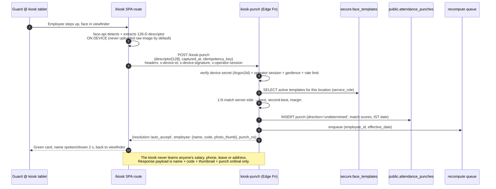
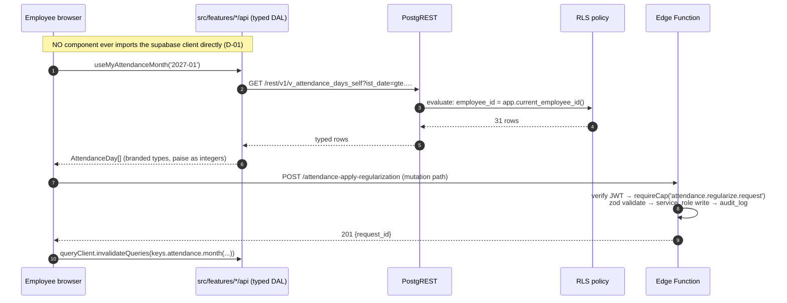
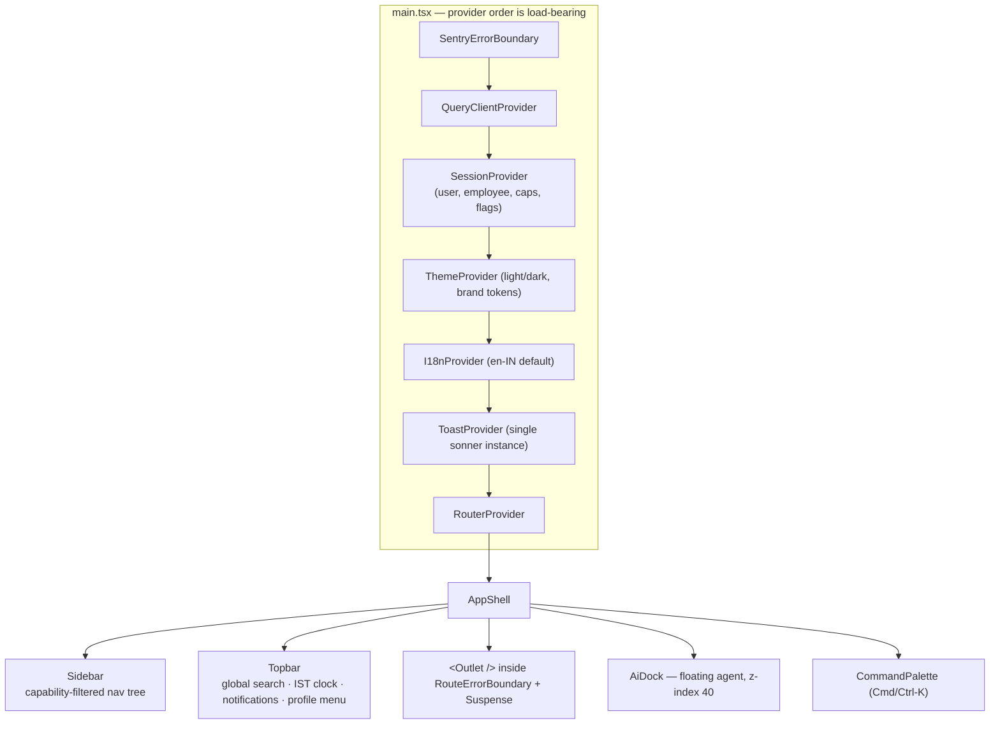

# 08 — Technical Architecture, Security, Quality & Delivery
### Tamarind Tree HRMS · Machani Hospitalities LLP · Build Bible, Document 8 of 9

**Purpose.** This document is the engineering contract for the Tamarind Tree HRMS. It tells a founding engineer exactly what to build, where every file goes, which layer owns which responsibility, how every privileged operation is authenticated, how the system is tested, how it is deployed, what it costs, and in what order to build it. It converts the product intent in `00-master-plan.md`, `01-prd-employee.md`, `02-prd-manager.md` and `03-prd-admin.md` and the schema in `04-data-model.md` into a runnable technical plan. Two principles govern every decision here and are repeated because they are load-bearing: **correctness lives in the database, not in the client** — RLS, triggers, generated columns and the attendance derivation function are the real boundary, and the browser is presentation only; and **the client never holds a secret, never decides a biometric match, and never writes a punch** — every privileged path goes through an Edge Function running under the service role after server-side verification. Where the reference repo (`hrms-digitalchemy`) made the opposite choice, this document names the flaw and specifies the fix.

---

## Table of contents

1. [System context and trust boundaries](#1-system-context-and-trust-boundaries)
2. [Stack decisions](#2-stack-decisions)
3. [Repository and project structure](#3-repository-and-project-structure)
4. [Frontend architecture](#4-frontend-architecture)
5. [Backend architecture and the Edge Function catalogue](#5-backend-architecture-and-the-edge-function-catalogue)
6. [API contracts](#6-api-contracts)
7. [Cron and scheduled jobs](#7-cron-and-scheduled-jobs)
8. [Security](#8-security)
9. [Testing strategy](#9-testing-strategy)
10. [Observability](#10-observability)
11. [Environments and delivery](#11-environments-and-delivery)
12. [Performance and scale plan](#12-performance-and-scale-plan)
13. [Cost model](#13-cost-model)
14. [Implementation sequencing for engineers](#14-implementation-sequencing-for-engineers)
- [Appendix A — Reference-repo trust flaws and our fixes](#appendix-a--reference-repo-trust-flaws-and-our-fixes)
- [Appendix B — Assumptions the team must confirm](#appendix-b--assumptions-the-team-must-confirm)

---

## 1. System context and trust boundaries

### 1.1 The context diagram

```mermaid
flowchart TB
    subgraph Untrusted["🌐 UNTRUSTED — public internet (B1)"]
        EMP["Employee browser<br/>mobile PWA / desktop<br/>Supabase JWT · role=employee"]
        MGR["Manager browser<br/>Supabase JWT · role=manager"]
        ADM["Admin browser<br/>Supabase JWT · role=admin/super_admin<br/>TOTP MFA required"]
        KIOSK["Guard kiosk tablet<br/>/kiosk route · Chrome kiosk mode<br/>device secret + operator PIN<br/>NO Supabase user JWT"]
        SIGN["Public signer<br/>candidate / employee<br/>/sign/:token · /ack/:slug<br/>token + identity gate, no account"]
    end

    subgraph Vercel["▲ VERCEL — static edge CDN (B2)"]
        CDN["Static SPA bundle<br/>index.html + hashed JS/CSS<br/>CSP, HSTS, no secrets<br/>/models/* face-api weights (immutable)"]
    end

    subgraph Supabase["🟢 SUPABASE — project aygxkkoltwltczfdbplr · region ap-south-1 (B3)"]
        GOTRUE["Auth / GoTrue<br/>email+password, magic-link OTP<br/>TOTP MFA, refresh rotation"]
        PGREST["PostgREST<br/>schema exposure: public only<br/>RLS enforced on every row"]
        subgraph PG["Postgres 15"]
            PUB[("public.*<br/>RLS on every table")]
            SEC[("secure.*<br/>NOT exposed to PostgREST<br/>face_templates, device secrets,<br/>id_number_vault, api_keys")]
            UTIL[("util.* / app.* / audit.* / analytics.*<br/>IST helpers, authz helpers,<br/>audit engine, matviews")]
            CRON["pg_cron + pg_net<br/>scheduled jobs"]
        end
        STOR["Storage buckets<br/>all private except brand<br/>signed URLs, 120–300 s TTL"]
        RT["Realtime<br/>postgres_changes<br/>RLS-filtered channels"]
        EF["Edge Functions (Deno) — B4<br/>service_role inside only<br/>27 functions, §5.4"]
    end

    subgraph Third["🔒 THIRD PARTY — server-side only (B5)"]
        ANTH["Anthropic Claude API<br/>claude-opus-5<br/>ANTHROPIC_API_KEY"]
        RESEND["Resend<br/>transactional email<br/>RESEND_API_KEY"]
        SENTRY["Sentry<br/>errors + traces<br/>PII scrubbed"]
    end

    EMP -->|HTTPS| CDN
    MGR -->|HTTPS| CDN
    ADM -->|HTTPS| CDN
    KIOSK -->|HTTPS| CDN
    SIGN -->|HTTPS| CDN

    EMP -->|"JWT · REST/Realtime"| PGREST
    MGR -->|"JWT · REST/Realtime"| PGREST
    ADM -->|"JWT · REST/Realtime"| PGREST
    EMP -->|"JWT · invoke"| EF
    MGR -->|"JWT · invoke"| EF
    ADM -->|"JWT + step-up · invoke"| EF
    KIOSK -->|"x-device-id + x-device-signature<br/>+ operator session token"| EF
    SIGN -->|"signing token in body<br/>never in URL query"| EF

    EMP -.->|"auth"| GOTRUE
    ADM -.->|"auth + MFA"| GOTRUE

    PGREST --> PUB
    PGREST -.->|"BLOCKED — schema not exposed"| SEC
    EF -->|"service_role<br/>app.set_context()"| PUB
    EF -->|"service_role only"| SEC
    EF --> STOR
    PUB --> RT
    RT --> EMP
    CRON -->|"x-cron-secret via pg_net"| EF
    CRON --> PUB

    EF -->|"HTTPS + key"| ANTH
    EF -->|"HTTPS + key"| RESEND
    CDN -.->|"browser SDK, PII scrubbed"| SENTRY
    EF -.->|"server SDK"| SENTRY

    style Untrusted fill:#fdecea,stroke:#c0392b,color:#000
    style Vercel fill:#f4f4f5,stroke:#71717a,color:#000
    style Supabase fill:#eaf7ef,stroke:#1f7a4d,color:#000
    style Third fill:#fff7e6,stroke:#B99665,color:#000
    style SEC fill:#564147,stroke:#121F38,color:#fff
    style EF fill:#CE8F6F,stroke:#7a5c3e,color:#fff
```



### 1.2 The trust boundaries, named

| ID | Boundary | What crosses it | What is trusted | Enforcement |
|---|---|---|---|---|
| **B1** | Public internet → our surfaces | Every request from every actor | **Nothing.** All input is hostile until validated. | TLS 1.2+, HSTS `max-age=63072000; includeSubDomains; preload`, CSP (§8.11), WAF-equivalent rate limits at the edge function layer (§8.10) |
| **B2** | Browser → Vercel static assets | Nothing but GETs of public, non-secret assets | The bundle is public. It contains **zero** secrets — only `VITE_SUPABASE_URL` and the anon key, both of which are safe by design because RLS is the boundary. | Build-time lint rule `no-secret-env` fails the build if any env var not prefixed `VITE_PUBLIC_` or on the allowlist is referenced from `app/src/**` |
| **B3** | Browser → Supabase PostgREST / Realtime with a user JWT | Reads and a *narrow* set of writes | The JWT's `sub` and `role` claims, verified by Postgres. Nothing else in the request. | **RLS on every table without exception.** `secure.*` is not in `db.schemas`, so PostgREST cannot see it even if a policy were misauthored. Column-level `GRANT` revocations hide sensitive columns from `authenticated`. |
| **B4** | Browser / kiosk / cron → Edge Function → Postgres as `service_role` | Every privileged operation | Only after the function itself has (a) verified the caller, (b) validated the payload with zod, (c) set `app.set_context()` so the audit trigger attributes the actor | Per-function auth model (§5.4), zod at the edge, idempotency keys, rate limits, `audit_log` row per mutation |
| **B5** | Edge Function → Anthropic / Resend | Prompt payloads, email payloads | Nothing returned is trusted: Claude output is validated against a chart-spec schema before render; Resend webhooks are HMAC-verified | Keys live only in Supabase Function secrets. **The Anthropic key is never present in any browser bundle.** Model output passes `zod` validation and prompt-injection guards (§8.9, `06-ai-agent.md`) |
| **B6** | `public` schema → `secure` schema | Only `service_role` from inside an Edge Function, or a `SECURITY DEFINER` function in `app.*` | Biometric templates, device secrets, full ID numbers, API keys | `REVOKE ALL ON SCHEMA secure FROM anon, authenticated;` plus `secure` removed from `config.toml` `db.schemas` |

### 1.3 The five request paths, drawn





### 1.4 Deployment topology

| Concern | Choice | Notes |
|---|---|---|
| Frontend hosting | **Vercel**, single project, production branch `main` | Static SPA + SPA rewrite. No serverless functions on Vercel — all server logic is Supabase Edge Functions, so there is exactly one backend runtime to reason about. |
| Domains | `hr.thetamarindtree.in` (app), `kiosk.thetamarindtree.in` (same bundle, forced to `/kiosk`, separate hostname so the kiosk tablet can be locked to it) | Both CNAME to Vercel. Separate hostname lets us apply a stricter CSP and a `Permissions-Policy` that allows `camera=(self)` only on the kiosk host. |
| Backend | **Supabase**, project ref `aygxkkoltwltczfdbplr` | Region must be **`ap-south-1` (Mumbai)** — see Assumption A-1. Verify before any production data is loaded; region cannot be changed after creation without a migration to a new project. |
| Region rationale | India data residency for DPDP Act 2023 comfort + ~25 ms RTT from Bengaluru vs ~55 ms from Singapore. Kiosk p95 budget (2.5 s scan-to-confirm) has headroom either way, but Mumbai is strictly better. | |
| CDN edge for the app | Vercel global edge; the SPA shell is served from the nearest PoP | The only latency-critical path (kiosk punch) talks to Supabase directly, not through Vercel. |
| Environments | `local` (Supabase CLI + Vite), `preview` (Vercel preview + Supabase **branch** database per PR), `staging` (long-lived Supabase branch + Vercel `staging` alias), `production` | §11.2 |

---

## 2. Stack decisions

Every row is a decision, not an option. The "Alternative rejected" column exists so nobody re-opens a settled question in week nine.

### 2.1 Core stack

| # | Concern | Decision | Version pin | Rationale | Alternative rejected |
|---|---|---|---|---|---|
| S-01 | Build tool / dev server | **Vite** | `^5.4` | Sub-second HMR on a codebase this size; native ESM dev; trivially configurable manual chunks, which we need to keep the 6.7 MB face-api models out of the main bundle. | **Next.js** — we have no SSR/SEO requirement (the app is 100% behind auth), and adding a Node server would give us a *second* backend runtime alongside Deno edge functions, doubling the security surface and the deploy story. **CRA** — unmaintained. |
| S-02 | UI library | **React 18.3** | `18.3.x` | Team fluency, concurrent features for the data-grid, the entire shadcn/ui ecosystem. Reference repo is React, so lifted patterns port directly. | **Svelte/Vue** — no team fluency; shadcn/ui + TanStack ecosystem is the productivity multiplier here. React 19 deferred until the shadcn/Radix ecosystem fully settles. |
| S-03 | Language | **TypeScript, `strict: true`** plus `noUncheckedIndexedAccess`, `exactOptionalPropertyTypes`, `noImplicitOverride`, `noFallthroughCasesInSwitch` | `~5.6` | Payroll and attendance maths must not silently accept `undefined`. `noUncheckedIndexedAccess` alone prevents a whole class of "the array was empty" bugs that produced the reference product's `Avg: 0Hrs`. | Loose TS — rejected. `any` is a lint **error**, not a warning. |
| S-04 | Styling | **Tailwind CSS** + CSS custom properties for all brand tokens | `^3.4` | Design tokens in one place (`07-design-system.md`), no runtime CSS-in-JS cost, print stylesheets for payslips are straightforward. | **styled-components / emotion** — runtime cost and a second source of truth for colour. The reference repo duplicated brand hex literals into PDF/print code; we forbid that (§S-19). |
| S-05 | Component primitives | **shadcn/ui** (copy-in, not a dependency) + Radix primitives | pinned per component | We own the source, so we can retokenise every primitive to the Tamarind Tree palette and fix a11y defects without waiting on a maintainer. Accessible by default via Radix. | **MUI / Ant Design** — both fight a heritage brand identity; both ship opinionated blue-SaaS aesthetics that are precisely what the client is trying to escape. |
| S-06 | Server state | **TanStack Query v5** — *exclusively*. See **D-01**. | `^5.59` | Caching, dedup, background refetch, request cancellation, retry policy and cache invalidation, all declarative and all testable. | Redux/Zustand for server data — rejected: server data is not app state, it is a cache of someone else's state. Raw `useEffect` fetching — rejected; this is exactly the reference repo's defect. |
| S-07 | Client routing | **React Router 6.26** with `createBrowserRouter` and per-feature route objects | `^6.26` | Real URLs per screen. See **D-02**. Data-router APIs give us per-route `errorElement` and lazy boundaries. | Tab-state routing (the reference repo's two-mega-page architecture) — rejected, see D-02. TanStack Router — attractive typed routes, but smaller ecosystem and the team has no experience; not worth the risk on a 22-week delivery. |
| S-08 | Forms + validation | **react-hook-form** + **zod** via `@hookform/resolvers` | `^7.53` / `^3.23` | Uncontrolled inputs keep the 60-field employee form fast; one zod schema per entity is shared verbatim between the browser form and the Edge Function validator, so client and server can never disagree about what is valid. | Formik (slower, larger), hand-rolled validation (guaranteed drift between client and server). |
| S-09 | Charts | **Recharts** | `^2.13` | Declarative, SVG (so it prints and exports cleanly), composable, already proven in the reference repo, and — critically — the AI agent's infographic renderer emits a chart spec that maps 1:1 onto Recharts components (`06-ai-agent.md` §7). | Chart.js (canvas — poor print/export, poor a11y), ECharts (heavier, imperative), D3 direct (too much bespoke code for 30+ charts). |
| S-10 | Dates and IST | **date-fns 4** + **date-fns-tz 3**, wrapped in `src/shared/lib/datetime.ts`. **No component may call `date-fns` directly.** | `^4.1` / `^3.2` | Tree-shakeable, immutable, no global mutation. The wrapper is the only place `Asia/Kolkata` appears, and it exports `istDate()`, `istStartOfDay()`, `formatIst()`, `businessDate()` — the same names as the `util.*` SQL helpers in `04-data-model.md` §6, so client and server logic read identically. | Day.js (plugin-based tz is fragile), Moment (deprecated), raw `Date` (the reference repo's `toISOString().split('T')[0]` bug — a UTC calendar date masquerading as a business date). |
| S-11 | On-device face embedding (kiosk only) | **@vladmandic/face-api** | `^1.7.15` | Actively maintained TF.js port, ships the 3 models we need (TinyFaceDetector, 68-point tiny landmarks, 128-D recognition), runs at ~15 fps on a mid-range Android tablet. **Used only to produce a descriptor; the match decision is server-side.** | Cloud face APIs (AWS Rekognition / Azure Face) — rejected: biometric images would leave India and leave our control, materially worsening DPDP exposure, plus a per-scan cost and a hard dependency on venue internet for the core loop. MediaPipe — good detector, but no 128-D recognition embedding out of the box. |
| S-12 | Passkeys / fingerprint | **@simplewebauthn/browser** + **@simplewebauthn/server** (Deno import) | `^13.1` | The only correct way to do WebAuthn: challenge issued and **assertion verified server-side**, counters persisted. This is the direct fix for the reference repo's client-decided fingerprint attendance. | `navigator.credentials.get()` with a locally generated challenge — this is exactly the reference repo's flaw and is security theatre. |
| S-13 | PDF generation | **jsPDF + jspdf-autotable** in the browser for user-triggered exports; **pdf-lib** inside Edge Functions for server-generated, signed, archived documents (payslips, Form 16, contracts) | `^2.5` / `^1.17` (pdf-lib `^1.17`) | Browser-side for interactivity and zero server cost on ad-hoc exports; server-side for anything that must be byte-identical, stored, hashed and legally attested. Both are dynamically imported so neither is in the initial bundle. | Puppeteer/Chromium PDF — cannot run in Deno Edge Functions and would need a separate container. `react-pdf` for generation — heavier, and we already need pdf-lib server-side for page stamping and signature embedding. |
| S-14 | Email | **Resend** with a verified `thetamarindtree.in` sending domain (SPF + DKIM + DMARC `p=quarantine`) | API | Simple API, good deliverability, webhook events for delivered/opened/bounced which we persist into `communication_events`. | Supabase SMTP relay only — no per-message event webhooks, so we could not prove a payslip was delivered. Kept configured as the **failover** path (§5.4 `communication-send`). |
| S-15 | AI | **Anthropic Claude API**, model `claude-opus-5`, called **only** from the `ai-agent` Edge Function | API | Client requirement. Tool-use with strict schemas gives us a validated chart-spec contract rather than free-form text. Full design in `06-ai-agent.md`. | Any client-side LLM call — forbidden, it would expose the API key. Any other provider — the client specified Anthropic. |
| S-16 | Unit / integration tests | **Vitest** + **@testing-library/react** + **@testing-library/user-event** + **MSW** | `^2.1` / `^16.0` / `^2.4` | Vitest shares Vite's transform pipeline, so there is no second build config to keep in sync. MSW intercepts at the network layer, which means our DAL is exercised for real instead of mocked away. | Jest (second toolchain, slower), Enzyme (dead), mocking `supabase-js` directly (would let DAL bugs through — MSW forces us to test the real query strings). |
| S-17 | Database tests | **pgTAP** run via `supabase test db` | `^1.3` | RLS is our security boundary; a boundary without automated negative tests is a boundary on paper. pgTAP lets us assert *as a specific role* that a query returns zero rows. | Testing RLS from the app layer only — rejected: too slow, and it cannot easily impersonate 4 roles × 60 tables. |
| S-18 | E2E | **Playwright** | `^1.48` | Real Chromium/WebKit, trace viewer, `--ui` mode, and — decisive for us — **fake camera support** (`--use-fake-device-for-media-stream` + `--use-file-for-fake-video-capture`) so the kiosk face-scan journey is testable in CI with a fixture video. | Cypress (no true multi-tab, weaker device emulation, no fake-camera story). |
| S-19 | Package manager | **pnpm** with a committed lockfile and `packageManager` field | `^9.12` | Content-addressed store (fast CI), strict `node_modules` so a package we did not declare cannot be imported by accident, and first-class workspaces for the `packages/shared` types package. | npm (slow, permissive hoisting), yarn classic (unmaintained), bun (too young for a system we must support for years). |
| S-20 | Lint / format | **ESLint 9** flat config + **Prettier 3** + `eslint-plugin-import` + `eslint-plugin-jsx-a11y` + `@tanstack/eslint-plugin-query` + custom local rules | `^9.13` / `^3.3` | Custom rules are how architecture decisions become mechanically enforced instead of aspirational. See §2.3. | Biome — faster, but we would lose the a11y and TanStack Query plugins we depend on. Revisit post-go-live. |
| S-21 | Error tracking | **Sentry** (`@sentry/react` + `@sentry/deno`) with `sendDefaultPii: false` and an explicit scrub allowlist | `^8.35` | Source-mapped stack traces, release tracking, per-route performance. | Self-hosted GlitchTip — one more thing to operate for a 5-person team. |
| S-22 | Icons | **lucide-react**, tree-shaken, no barrel import | `^0.45` | Consistent 24 px stroke set that matches the heritage-warm aesthetic better than filled icon sets; every icon is an individual module so unused icons are dropped. | react-icons (barrel import pulls megabytes), Font Awesome (webfont, FOIT). |
| S-23 | Tables / data grid | **TanStack Table v8** headless + our own `<DataGrid>` shell | `^8.20` | The client's feature bar is an enterprise grid: per-column funnel filter, sort, search, refresh, export, column chooser, items-per-page paginator, illustrated empty state. TanStack Table gives us the state machine; we own the markup so it is on-brand and accessible. | AG Grid (licence cost, heavy, hard to retokenise), MUI DataGrid (pulls MUI), building from scratch (we would re-implement column sizing and grouping badly). |
| S-24 | Virtualisation | **@tanstack/react-virtual** for any list expected to exceed 200 rows | `^3.10` | The admin punch-review queue and the audit console can hit 10 k rows in a filtered view. | Rendering everything (jank), react-window (less flexible for variable heights). |
| S-25 | i18n | **Own thin `t()` over a typed dictionary**; no runtime i18n library in v1 | — | We need i18n *readiness* (no hardcoded strings), not i18n *machinery*. A typed dictionary gives compile-time key checking and zero runtime weight; swapping in `i18next` later is a one-file change because every call site already goes through `t()`. | i18next now — unnecessary weight and complexity before a second language is actually funded. |

### 2.2 The five architectural decisions that shape everything

> **D-01 — No raw Supabase calls inside components. Ever.**
>
> The rule: `@/shared/lib/supabase` may be imported **only** from files matching `src/features/*/api/*.ts`, `src/shared/api/*.ts`, or `src/shared/lib/supabase*.ts`. Enforced by ESLint `no-restricted-imports` with a path-based override, and the rule is `error`. A component that needs data calls a hook; the hook calls a DAL function; the DAL function is the only thing that knows PostgREST exists.
>
> *Why:* the reference repo fetched imperatively inside ~40 components with `useState`/`useEffect`. Consequences we observed there and refuse to repeat: the same month summary computed three different ways in three components (the direct cause of `Weekly Offs 7 vs 8` and `Paid Days 15 vs 16`); no request cancellation, so a fast month-picker click raced and rendered stale data; no shared cache, so opening the profile re-fetched the employee row four times; every component reinvented loading and error UI; and nothing was testable without mounting a component and stubbing the network. A typed DAL with a query-key factory fixes all five at once and makes cache invalidation a one-line, reviewable statement.

> **D-02 — Real routes per module. Every screen is deep-linkable and permission-guarded.**
>
> The rule: every screen a user can reach has its own URL. Nested tabs become nested routes (`/me/profile/employment`, not `?tab=2` and certainly not component state). Every route declares `requiredCap`; the router refuses to render without it. Filters, selected period, and reportee scope live in **search params**, so a manager can paste "the late-arrivals view for Banquet, 01–25 Jan, direct reportees" into WhatsApp and the recipient sees exactly that.
>
> *Why:* the reference repo had exactly 9 routes for a product with ~60 screens — two mega-pages (`/admin` with 12 tabs, `/employee` with 8) driven by `Tabs` state. Consequences: nothing was linkable (HR could not send "look at this employee's Salary tab"); browser Back was broken; both mega-pages loaded every tab's code on first paint; permission checks were scattered inside tab bodies instead of at one guarded boundary; and no analytics could tell us which screens were used. Real routes give us code-splitting per screen, one guard implementation, a working Back button, per-screen performance budgets, and shareable links.

> **D-03 — URL is the container for view state; TanStack Query is the container for server state; `useState` is for ephemeral UI only.**
>
> Anything a user would expect to survive a refresh or be shareable — period, scope, filters, sort, page, selected employee, expanded panel — is a search param managed by `useUrlState()`. Anything fetched is a query. Anything else (is this popover open, what is typed in the search box before debounce) is local. There is **no global client store** in v1: no Redux, no Zustand. Cross-cutting concerns that are genuinely global (session, capabilities, theme, feature flags, toast queue) are React Context, each with exactly one provider.

> **D-04 — Money is integer paise end-to-end; business dates are IST; neither is ever computed in the browser.**
>
> `salary_paise`, `gross_paise`, `net_paise` — integers, no floats, no `numeric` round-tripping through JS. Formatting to `₹ 2,20,000` happens in one function (`formatInr`). Business dates arrive from the server as `YYYY-MM-DD` strings already resolved to IST by `util.ist_date()`; the client formats them and never derives them. A lint rule bans `new Date()` inside `src/features/**` outside `datetime.ts`. *Why:* the reference repo stored the **UTC** calendar date as the attendance business date, so a 01:15 IST night-shift punch landed on the previous day, and it precomputed IST display strings with a fixed `+5:30` offset at write time — unfixable if it was ever wrong.

> **D-05 — Client permission checks are UX. RLS is security.**
>
> `useCan()`, `<Can>` and route guards exist to avoid showing a user a button that will fail. They are **not** a security control and are never described as one in code comments or PR descriptions. Every table has RLS; every privileged Edge Function re-derives the caller's capabilities server-side from `user_roles` + `role_capabilities` and ignores anything the client asserted. A reviewer who sees a server-side authorisation decision that trusts a client-supplied role, employee id, or scope must block the PR.

### 2.3 Custom lint rules (the architecture, mechanised)

| Rule | Level | What it catches |
|---|---|---|
| `no-restricted-imports` → `@/shared/lib/supabase` outside `**/api/**` | error | D-01 violations |
| `local/no-raw-date` — bans `new Date(`, `Date.now(`, `.toISOString()` in `src/features/**` and `supabase/functions/**` except `_shared/datetime.ts` and `shared/lib/datetime.ts` | error | D-04 / the UTC-date class of bug |
| `local/no-float-money` — bans identifiers matching `/(_amount|_salary|_gross|_net|_ctc)$/` that are not `…_paise` | error | float money creeping in |
| `local/no-literal-jsx-text` — bans string literals ≥ 3 chars as JSX children outside `src/shared/i18n/**` | warn (error from Phase 3) | i18n readiness |
| `local/require-query-key-factory` — bans inline array literals as `queryKey` | error | ad-hoc keys that cannot be invalidated |
| `local/no-brand-hex` — bans 3/6-digit hex colour literals outside `src/shared/theme/**` and the print stylesheets | error | the reference repo's duplicated `#7A4A28` in PDF code |
| `local/edge-fn-must-validate` — every `supabase/functions/*/index.ts` must import from `_shared/validate.ts` | error | unvalidated edge input |
| `local/no-select-star` — bans `.select('*')` and `.select()` with no argument in DAL files | error | over-fetching masked columns |
| `jsx-a11y/*` recommended set, plus `jsx-a11y/no-autofocus` off on `/kiosk` only | error | keyboard and screen-reader defects |
| `@tanstack/query/exhaustive-deps` | error | stale closures in query fns |

---

## 3. Repository and project structure

### 3.1 Decision: one repo, one deployable, two packages

A **single Git repository** at `/Users/user/TT/HRMS_TT`, a pnpm workspace with two packages: `app/` (the Vite SPA) and `packages/shared/` (types and pure domain logic shared between the SPA and the Deno Edge Functions). Supabase migrations and functions live at the repo root under `supabase/` because that is where the Supabase CLI expects them.

**The kiosk is a route inside the same app, not a separate application.** Decision rationale: a separate kiosk app would double the deploy pipeline, fork the design system, and — worst — make it possible for the guard tablet to run a stale build for weeks. As one deployable on its own hostname with a service worker, the tablet updates itself the next time it has connectivity, and we still get full code isolation because `/kiosk` is a lazily-imported route whose chunk contains the only import of `face-api` (§4.11).

**Alternative rejected:** a monorepo with Turborepo/Nx. At two packages and one deployable, the orchestration overhead exceeds the benefit. `pnpm -r` plus npm scripts is sufficient and has no cache-invalidation folklore.

### 3.2 The tree

```
/Users/user/TT/HRMS_TT
├── README.md                         # 30-second orientation + link to docs/plan
├── package.json                      # workspace root: scripts only, no runtime deps
├── pnpm-workspace.yaml               # packages: ['app', 'packages/*']
├── pnpm-lock.yaml                     # committed, --frozen-lockfile in CI
├── .nvmrc                            # 20.18.0
├── .editorconfig
├── .gitignore
├── .env.example                      # every var, documented, no values
├── eslint.config.js                  # flat config, shared by app + functions
├── prettier.config.cjs
├── vercel.json                       # SPA rewrite + security headers (§8.11)
├── .github/
│   └── workflows/
│       ├── ci.yml                    # PR pipeline (§11.5)
│       ├── deploy-production.yml     # main → prod
│       └── nightly.yml               # perf + a11y + AI-eval + restore drill
├── docs/
│   ├── plan/                         # THIS build-bible set, 00 … 09
│   ├── adr/                          # ADR-0001…, one file per irreversible decision
│   ├── runbooks/                     # operational runbooks (§10.6)
│   └── api/                          # generated: edge-function OpenAPI + query-key map
├── assets/
│   └── brand/                        # logos, favicon, monogram (already downloaded)
├── packages/
│   └── shared/                       # @tt/shared — imported by app AND edge functions
│       ├── package.json              # "type": "module", no runtime deps except zod
│       ├── src/
│       │   ├── index.ts              # the only export surface
│       │   ├── db/
│       │   │   ├── database.types.ts # GENERATED by `supabase gen types` — never hand-edited
│       │   │   └── helpers.ts        # Tables<'employees'>, Enums<'punch_source'>, …
│       │   ├── schemas/              # zod schemas shared client↔server (the contract)
│       │   │   ├── employee.schema.ts
│       │   │   ├── attendance.schema.ts
│       │   │   ├── leave.schema.ts
│       │   │   ├── payroll.schema.ts
│       │   │   ├── kiosk.schema.ts
│       │   │   └── ai.schema.ts       # chart-spec contract for the AI agent
│       │   ├── domain/               # PURE functions, zero I/O, 90 %+ coverage required
│       │   │   ├── datetime.ts        # IST helpers mirroring util.* SQL
│       │   │   ├── money.ts           # paise arithmetic, formatInr, Indian grouping
│       │   │   ├── attendance.ts      # late/early/OT/status formulas
│       │   │   ├── leave.ts           # accrual, pro-rata, encashment maths
│       │   │   ├── payroll.ts         # PF/ESI/PT/TDS formulas
│       │   │   ├── masking.ts         # PAN/Aadhaar/bank/UAN masking rules
│       │   │   └── capabilities.ts    # capability constants + hasCap()
│       │   └── constants/
│       │       ├── caps.ts            # CAP.ATTENDANCE_VIEW_TEAM, … (string union)
│       │       ├── enums.ts           # mirrors DB enums with display labels
│       │       └── config.ts          # thresholds, budgets, grace minutes
│       └── src/**/*.test.ts          # colocated unit tests
├── app/
│   ├── package.json
│   ├── index.html
│   ├── vite.config.ts               # manual chunks, PWA, sourcemaps, bundle-size plugin
│   ├── tsconfig.json                # strict; paths: @/* → src/*, @tt/shared → workspace
│   ├── tailwind.config.ts
│   ├── postcss.config.cjs
│   ├── vitest.config.ts
│   ├── playwright.config.ts
│   ├── public/
│   │   ├── favicon.png
│   │   ├── manifest.webmanifest      # PWA, two start_urls via query (?kiosk=1)
│   │   └── models/                   # face-api weights, 6.7 MB, immutable-cached
│   │       ├── tiny_face_detector_model.bin (+ manifest)
│   │       ├── face_landmark_68_tiny_model.bin (+ manifest)
│   │       └── face_recognition_model.bin (+ manifest)
│   ├── e2e/                          # Playwright specs + fixtures
│   │   ├── fixtures/
│   │   │   ├── faces/*.y4m           # fake-camera video fixtures for kiosk tests
│   │   │   └── seed.ts               # per-worker seeded tenant
│   │   ├── journeys/*.spec.ts        # the 8 critical journeys (§9.6)
│   │   └── permissions/*.spec.ts     # negative tests per role
│   └── src/
│       ├── main.tsx                  # createRoot + providers + Sentry init
│       ├── App.tsx                   # RouterProvider only
│       ├── router.tsx                # assembles feature route objects
│       ├── styles/
│       │   ├── globals.css           # Tailwind layers + brand CSS variables
│       │   └── print.css             # payslip/report print rules (tokens, no hex)
│       ├── shared/                   # cross-feature; may NOT import from features/
│       │   ├── lib/
│       │   │   ├── supabase.ts       # the ONLY createClient() in the app
│       │   │   ├── datetime.ts       # re-exports @tt/shared/domain/datetime + tz format
│       │   │   ├── query-client.ts   # QueryClient + default options
│       │   │   ├── errors.ts         # AppError taxonomy + mapPostgrestError
│       │   │   ├── url-state.ts      # useUrlState(), typed search-param schemas
│       │   │   ├── download.ts       # blob/signed-URL download helpers
│       │   │   ├── flags.ts          # feature flags from app_settings
│       │   │   └── analytics.ts      # thin event wrapper (page + action)
│       │   ├── api/
│       │   │   ├── invoke.ts         # typed edge-function invoker (problem+json aware)
│       │   │   ├── bootstrap.api.ts  # app_bootstrap RPC: session + caps + flags
│       │   │   └── keys.ts           # ROOT query-key factory (composes feature keys)
│       │   ├── auth/
│       │   │   ├── session-context.tsx
│       │   │   ├── use-session.ts
│       │   │   ├── use-can.ts
│       │   │   ├── can.tsx           # <Can cap="…"> guard component
│       │   │   └── require-cap.tsx   # route-level guard element
│       │   ├── ui/                   # shadcn primitives, retokenised. NO barrel file.
│       │   │   ├── button.tsx  card.tsx  dialog.tsx  sheet.tsx  … (40 files)
│       │   │   ├── data-grid/        # DataGrid, ColumnFilter, ColumnChooser, Paginator
│       │   │   ├── charts/           # KpiTile, DonutStat, TrendArea, BucketPie, …
│       │   │   ├── empty-state.tsx   # the illustrated "No records found" component
│       │   │   ├── masked-value.tsx  # <MaskedValue> + reveal → logs data_access_log
│       │   │   └── money.tsx         # <Money paise={…}> — the only money renderer
│       │   ├── layout/
│       │   │   ├── app-shell.tsx     # sidebar + topbar + AI dock + outlet
│       │   │   ├── sidebar.tsx  topbar.tsx  ist-clock.tsx  global-search.tsx
│       │   │   ├── kiosk-layout.tsx  # zero chrome, no nav, no HR data
│       │   │   ├── public-layout.tsx # signing / ack pages
│       │   │   └── error-boundary.tsx
│       │   ├── i18n/
│       │   │   ├── t.ts              # typed t(key, vars)
│       │   │   ├── en-IN.ts          # the dictionary (source of truth)
│       │   │   └── kn-IN.ts          # Kannada — kiosk + payslip strings only, Phase 4
│       │   └── hooks/
│       │       ├── use-debounce.ts  use-media-query.ts  use-interval.ts
│       │       └── use-idle-timeout.ts
│       └── features/                 # ONE folder per domain. See §3.4 for the pattern.
│           ├── auth/            employees/       org/            custom-fields/
│           ├── biometrics/      kiosk/           attendance/     regularization/
│           ├── shifts/          roster/          weekly-off/     holidays/
│           ├── leave/           comp-off/        overtime/       salary/
│           ├── payroll/         payslips/        statutory/      claims/
│           ├── travel/          assets/          documents/      contracts/
│           ├── policies/        onboarding/      approvals/      notifications/
│           ├── analytics/       ai/              audit/          admin-config/
│           ├── helpdesk/        search/          dashboard-employee/
│           ├── dashboard-manager/                dashboard-admin/
│           └── profile/
└── supabase/
    ├── config.toml                   # db.schemas = ["public","graphql_public"]  ← secure OMITTED
    ├── seed.sql                      # local + preview seed (idempotent)
    ├── migrations/                   # NNN_description.sql, forward-only, never edited
    │   ├── 0001_extensions.sql
    │   ├── 0002_schemas_and_helpers.sql
    │   └── …  (plan in 04-data-model.md §13)
    ├── tests/                        # pgTAP
    │   ├── 01_rls_employee.sql   02_rls_manager.sql   03_rls_admin.sql
    │   ├── 04_audit_trigger.sql  05_attendance_derivation.sql
    │   ├── 06_hash_chain.sql     07_leave_ledger.sql  08_payroll_idempotency.sql
    │   └── helpers.sql               # as_role(), assert_denied()
    └── functions/
        ├── _shared/                  # imported by every function; NOT itself a function
        │   ├── cors.ts               # per-origin allowlist, NEVER '*'
        │   ├── auth.ts               # verifyUser, requireCap, verifyDevice, verifyCron, requireStepUp
        │   ├── db.ts                 # service client + app.set_context()
        │   ├── validate.ts           # zod parse → problem+json on failure
        │   ├── errors.ts             # AppError → RFC 9457 response
        │   ├── ratelimit.ts          # Postgres token bucket
        │   ├── idempotency.ts        # idempotency_keys claim/replay
        │   ├── audit.ts              # audit_event() helper
        │   ├── log.ts                # structured JSON logger + redaction
        │   ├── datetime.ts           # IST helpers (mirror of shared/domain/datetime)
        │   └── deps.ts               # ONE place pinning every remote import URL
        ├── kiosk-punch/index.ts
        ├── kiosk-device-activate/index.ts
        ├── kiosk-operator-auth/index.ts
        ├── face-enrol/index.ts
        └── …                          # full catalogue in §5.4
```

### 3.3 Directory → contents → conventions

| Directory | Contains | Conventions |
|---|---|---|
| `packages/shared/src/domain/` | **Pure** functions only. No `fetch`, no `supabase`, no `Date.now()` (time is always a parameter). | Every exported function has a colocated `.test.ts`. **≥ 90 % line and branch coverage, enforced in CI.** These are the payroll and attendance formulas; a bug here is a wrong salary. |
| `packages/shared/src/schemas/` | zod schemas that are the request/response contract | One file per domain. Export both the schema and `z.infer` type: `export const LeaveApplySchema = …; export type LeaveApply = z.infer<typeof LeaveApplySchema>;`. **The Edge Function and the browser form import the same object.** |
| `packages/shared/src/db/database.types.ts` | Generated Supabase types | Regenerated by `pnpm db:types`, committed, and **CI fails if regenerating produces a diff** — that means someone changed the schema without regenerating. |
| `app/src/shared/` | Anything used by ≥ 2 features | **May not import from `features/`.** Enforced by an `import/no-restricted-paths` zone. This keeps the dependency graph acyclic. |
| `app/src/shared/ui/` | Presentational primitives | Props-only, no data fetching, no `useQuery`, no feature imports. **No `index.ts` barrel** — direct file imports keep tree-shaking honest. |
| `app/src/features/<domain>/` | One business domain, end to end | See §3.4. A feature may import from `shared/` and from another feature's **barrel only**. |
| `supabase/migrations/` | Forward-only SQL | `NNNN_snake_case_description.sql`, zero-padded 4 digits. **An applied migration is immutable** (§11.4). |
| `supabase/functions/_shared/` | The edge runtime library | Not deployable itself. Every function imports `cors`, `errors`, `log`; every function with a body imports `validate`. |
| `supabase/functions/<name>/` | One function, one `index.ts` | `kebab-case` directory name = the function's URL path. Verb-first names (`kiosk-punch`, `payroll-run`), never nouns-only. |
| `docs/adr/` | Architecture Decision Records | `ADR-NNNN-short-title.md`. Required for anything irreversible: schema partitioning, region, biometric storage, model choice. |

### 3.4 The feature-folder pattern (binding)

```
app/src/features/attendance/
├── index.ts                # THE BARREL. The only file other features may import.
│                           #   export { attendanceRoutes } from './routes'
│                           #   export { useMyAttendanceMonth } from './hooks/use-my-attendance-month'
│                           #   export type { AttendanceDayVM } from './types'
├── routes.tsx              # RouteObject[] — lazy elements + requiredCap per route
├── api/                    # THE ONLY place this feature touches the network
│   ├── keys.ts             # query-key factory for this domain
│   ├── attendance.api.ts   # getMonth, getDay, getPunches, listTeamBoard …
│   └── regularization.api.ts
├── hooks/                  # useQuery / useMutation wrappers; no JSX
│   ├── use-my-attendance-month.ts
│   ├── use-punches.ts
│   └── use-apply-regularization.ts
├── schemas/                # form-only schemas; anything shared with the server lives in @tt/shared
│   └── regularization-form.schema.ts
├── types.ts                # view-models: DB row → what the UI actually renders
├── components/             # feature-scoped, presentational
│   ├── attendance-kpi-row.tsx
│   ├── leave-distribution-donut.tsx
│   ├── day-register-grid.tsx
│   └── punch-drawer.tsx
├── pages/                  # ONE component per route. Composes hooks + components.
│   ├── attendance-dashboard.page.tsx
│   ├── attendance-register.page.tsx
│   └── attendance-day.page.tsx
└── __tests__/              # component + hook tests (MSW-backed)
```

**Import rules, mechanised by `import/no-restricted-paths` zones:**

| From | May import | May **not** import |
|---|---|---|
| `features/a/**` | `shared/**`, `@tt/shared`, `features/b` (barrel only) | `features/b/api/**`, `features/b/pages/**`, or any deep path in another feature |
| `shared/**` | `shared/**`, `@tt/shared` | **anything** in `features/**` |
| `features/*/components/**`, `features/*/pages/**` | `../hooks`, `../components`, `shared/**` | `@/shared/lib/supabase`, `../api/**` (pages/components go through hooks) |
| `features/*/api/**` | `@/shared/lib/supabase`, `@tt/shared` | React, any component |
| `packages/shared/**` | `zod` only | `react`, `@supabase/*`, anything with I/O |

### 3.5 Naming conventions

| Thing | Convention | Example |
|---|---|---|
| React component file | `kebab-case.tsx`, default-exported PascalCase component | `day-register-grid.tsx` → `DayRegisterGrid` |
| Page component | `<name>.page.tsx`, exports `<Name>Page` | `attendance-register.page.tsx` → `AttendanceRegisterPage` |
| Hook | `use-<thing>.ts` exporting `useThing` | `use-my-attendance-month.ts` |
| DAL module | `<entity>.api.ts`, functions are verbs | `attendance.api.ts` → `getAttendanceMonth()` |
| zod schema | `<entity>.schema.ts`, `PascalCaseSchema` + inferred type | `LeaveApplySchema` / `LeaveApply` |
| Query key factory | `keys.ts`, exported as `attendanceKeys` | `attendanceKeys.month(empId, '2027-01')` |
| Edge Function | `kebab-case` directory, verb-first | `payroll-run`, `export-audit` |
| DB objects | `snake_case`; tables plural, views `v_*`, matviews `mv_*`, functions `fn_*`, triggers `trg_<table>__<purpose>` | `attendance_days`, `v_team_punches`, `fn_recompute_attendance_day` |
| Capability string | `domain.object.action[.scope]` | `attendance.regularization.approve.team` |
| Test file | `<subject>.test.ts(x)` colocated, or `__tests__/` for feature tests | `money.test.ts` |
| E2E spec | `<journey>.spec.ts` under `e2e/journeys/` | `kiosk-check-in-out.spec.ts` |
| Branch | `type/short-slug` | `feat/attendance-register`, `fix/late-percent` |
| Migration | `NNNN_snake_case.sql` | `0043_attendance_days_partitions.sql` |

### 3.6 The data-access layer, defined precisely

A DAL function is a **typed, throwing, side-effect-declared async function** that is the sole owner of one server interaction.

```ts
// app/src/features/attendance/api/keys.ts
export const attendanceKeys = {
  all: ['attendance'] as const,
  month: (employeeId: string, month: string) =>
    [...attendanceKeys.all, 'month', employeeId, month] as const,
  day: (employeeId: string, istDate: string) =>
    [...attendanceKeys.all, 'day', employeeId, istDate] as const,
  punches: (employeeId: string, istDate: string) =>
    [...attendanceKeys.all, 'punches', employeeId, istDate] as const,
  teamBoard: (scope: ReporteeScope, istDate: string, deptId: string | null) =>
    [...attendanceKeys.all, 'team-board', scope, istDate, deptId ?? 'all'] as const,
} as const;
```

```ts
// app/src/features/attendance/api/attendance.api.ts
import { supabase } from '@/shared/lib/supabase';
import { unwrap } from '@/shared/lib/errors';
import type { Tables } from '@tt/shared';
import { toAttendanceDayVM, type AttendanceDayVM } from '../types';

const DAY_COLUMNS =
  'ist_date, status, shift_code, shift_label, first_in_at, last_out_at,' +
  'worked_minutes, late_minutes, early_out_minutes, ot_minutes, is_weekly_off,' +
  'is_holiday, holiday_name, leave_type_code, leave_fraction, punch_count,' +
  'location_name, department_name, needs_review';

/** One row per IST calendar date in [from,to] for one employee. RLS scopes it. */
export async function getAttendanceMonth(
  employeeId: string,
  fromIst: string,
  toIst: string,
): Promise<AttendanceDayVM[]> {
  const rows = unwrap(
    await supabase
      .from('v_attendance_days')
      .select(DAY_COLUMNS)                       // never select('*') — masked cols
      .eq('employee_id', employeeId)
      .gte('ist_date', fromIst)
      .lte('ist_date', toIst)
      .order('ist_date', { ascending: false })
      .returns<Pick<Tables<'attendance_days'>, never> & Record<string, unknown>>(),
  );
  return rows.map(toAttendanceDayVM);
}
```

Binding properties of every DAL function:

1. **Typed in and out.** Inputs are primitives or branded types; the return type is a view-model, never a raw PostgREST response envelope.
2. **Throws `AppError`.** `unwrap()` converts a `PostgrestError` into a typed `AppError` with a stable `code` (§4.8). No DAL function returns `{ data, error }`.
3. **Explicit columns.** `select('*')` is a lint error: it would fetch masked/sensitive columns the UI does not need and defeat column-level grants.
4. **No React.** No hooks, no context, no toast. It is callable from a Node test with no DOM.
5. **One server interaction.** If a screen needs three things, that is three DAL functions and three queries (or one purpose-built view/RPC), never one function that does three round-trips.
6. **Mutations return the server's truth**, not the optimistic input, so the cache is corrected by reality.

### 3.7 Generated Supabase types

```bash
pnpm db:types    # supabase gen types typescript --project-id aygxkkoltwltczfdbplr \
                 #   --schema public > packages/shared/src/db/database.types.ts
```

Committed. CI runs it and fails on a diff. Helpers keep call sites readable:

```ts
// packages/shared/src/db/helpers.ts
import type { Database } from './database.types';
export type Tables<T extends keyof Database['public']['Tables']> =
  Database['public']['Tables'][T]['Row'];
export type Insertable<T extends keyof Database['public']['Tables']> =
  Database['public']['Tables'][T]['Insert'];
export type Views<T extends keyof Database['public']['Views']> =
  Database['public']['Views'][T]['Row'];
export type Enums<T extends keyof Database['public']['Enums']> =
  Database['public']['Enums'][T];
```

Only the `public` schema is generated — `secure` types are deliberately absent from the client so a developer cannot even *name* `secure.face_templates` in app code.

---

## 4. Frontend architecture

### 4.1 The routing map

Every row is a real route with a real URL. `requiredCap` is checked by `<RequireCap>` before the lazy element renders; a user without it gets the 403 page, never a blank screen. Chunk column names the lazy bundle so bundle-size budgets (§4.14) can be attributed.

**Public and shell routes**

| Path | Page component | Layout | requiredCap | Chunk |
|---|---|---|---|---|
| `/` | `RootDispatcher` | none | — | main |
| `/login` | `LoginPage` | `PublicLayout` | — (anonymous only) | main |
| `/login/forgot` | `ForgotPasswordPage` | `PublicLayout` | — | main |
| `/reset-password` | `ResetPasswordPage` | `PublicLayout` | recovery token | main |
| `/first-run` | `FirstRunPage` (forced password change + consent + profile confirm) | `PublicLayout` | authenticated + `must_change_password` | main |
| `/sign/:token` | `SignDocumentPage` | `PublicLayout` | signing token + identity gate | `sign` |
| `/ack/:slug` | `AcknowledgePolicyPage` | `PublicLayout` | ack token | `sign` |
| `/403` | `ForbiddenPage` | active layout | — | main |
| `*` | `NotFoundPage` | active layout | — | main |

**Kiosk routes** (hostname `kiosk.thetamarindtree.in`, no Supabase user session)

| Path | Page component | Layout | Gate | Chunk |
|---|---|---|---|---|
| `/kiosk` | `KioskScanPage` | `KioskLayout` | device token + open operator session | `kiosk` |
| `/kiosk/pair` | `KioskPairPage` (one-time device activation code) | `KioskLayout` | activation code | `kiosk` |
| `/kiosk/operator` | `KioskOperatorPage` (guard sign-in / handover) | `KioskLayout` | device token | `kiosk` |
| `/kiosk/enrol` | `KioskEnrolPage` (admin-supervised enrolment at the gate) | `KioskLayout` | device token + admin PIN | `kiosk` |
| `/kiosk/queue` | `KioskQueuePage` (offline queue + health) | `KioskLayout` | device token | `kiosk` |

**Employee routes** (`/me/*`, `AppShell`, chunk `emp-*`)

| Path | Page component | requiredCap |
|---|---|---|
| `/me` | `EmployeeHomePage` | `self.dashboard.view` |
| `/me/attendance` | `MyAttendanceDashboardPage` | `self.attendance.view` |
| `/me/attendance/:date` | `MyAttendanceDayPage` (punch drill-down) | `self.attendance.view` |
| `/me/regularizations` | `MyRegularizationsPage` | `self.regularization.view` |
| `/me/regularizations/new` | `NewRegularizationPage` | `self.regularization.create` |
| `/me/leave` | `MyLeavePage` (balances + history) | `self.leave.view` |
| `/me/leave/apply` | `ApplyLeavePage` | `self.leave.create` |
| `/me/leave/:id` | `LeaveRequestDetailPage` | `self.leave.view` |
| `/me/leave/calendar` | `MyLeaveCalendarPage` | `self.leave.view` |
| `/me/comp-off` | `MyCompOffPage` | `self.compoff.view` |
| `/me/holidays` | `MyHolidaysPage` | `self.holiday.view` |
| `/me/payslips` | `MyPayslipsPage` | `self.payslip.view` |
| `/me/payslips/:period` | `PayslipDetailPage` | `self.payslip.view` |
| `/me/profile` | `MyProfileLayoutPage` (tab parent) | `self.profile.view` |
| `/me/profile/basic` … `/me/profile/history` | 8 tab pages (`basic`, `employment`, `payment`, `personal`, `custom`, `documents`, `salary`, `history`) | `self.profile.view` (+ `self.salary.view` on `salary`) |
| `/me/documents` | `MyDocumentsPage` | `self.document.view` |
| `/me/policies` | `MyPoliciesPage` | `self.policy.view` |
| `/me/policies/:slug` | `PolicyReaderPage` | `self.policy.view` |
| `/me/assets` | `MyAssetsPage` | `self.asset.view` |
| `/me/apply` | `ApplicationsLauncherPage` | `self.dashboard.view` |
| `/me/apply/claim` | `ApplyClaimPage` | `self.claim.create` |
| `/me/apply/travel` | `ApplyTravelPage` | `self.travel.create` |
| `/me/apply/tax` | `ApplyTaxDeclarationPage` | `self.tax.create` |
| `/me/apply/resignation` | `ApplyResignationPage` | `self.resignation.create` |
| `/me/apply/asset` | `ApplyAssetPage` | `self.asset.request` |
| `/me/apply/certification` | `ApplyCertificationPage` | `self.qualification.create` |
| `/me/apply/web-punch` | `ApplyWebPunchPage` | `self.webpunch.request` |
| `/me/approvals` | `MyApprovalsPage` (things *I* must action) | `self.approval.view` |
| `/me/biometrics` | `MyBiometricsPage` (enrolment status, consent, passkeys) | `self.biometric.view` |
| `/me/helpdesk` | `MyHelpdeskPage` | `self.helpdesk.view` |
| `/me/helpdesk/:id` | `HelpdeskTicketPage` | `self.helpdesk.view` |
| `/me/notifications` | `MyNotificationsPage` | `self.notification.view` |
| `/me/activity` | `MyActivityPage` (own audit trail) | `self.audit.view` |
| `/me/privacy` | `MyPrivacyPage` (DPDP rights, consent, data export) | `self.privacy.view` |
| `/me/ask` | `AskAiPage` (full-page AI agent) | `ai.ask.self` |
| `/me/settings` | `MySettingsPage` | `self.settings.view` |
| `/me/settings/security` | `SecuritySettingsPage` (password, passkeys, sessions) | `self.settings.view` |
| `/me/settings/notifications` | `NotificationSettingsPage` | `self.settings.view` |

**Manager routes** (`/team/*`, `AppShell`, chunk `mgr-*`)

| Path | Page component | requiredCap |
|---|---|---|
| `/team` | `TeamOverviewPage` (6 KPI cards + scope toggle) | `team.dashboard.view` |
| `/team/attendance` | `TeamAttendanceBoardPage` | `attendance.view.team` |
| `/team/leave` | `TeamLeaveBoardPage` | `leave.view.team` |
| `/team/approvals` | `TeamApprovalsPage` | `approval.action.team` |
| `/team/roster` | `TeamRosterPage` | `roster.view.team` |
| `/team/analytics` | `TeamAnalyticsPage` (late arrivals, hours, breaks, insights) | `analytics.view.team` |
| `/team/performance` | `TeamPerformancePage` | `performance.view.team` |
| `/team/people` | `TeamRosterListPage` (direct/indirect/all, export) | `employee.view.team` |
| `/team/people/:code` | `TeamMemberPage` (column-allowlisted profile) | `employee.view.team` |

**Admin routes** (`/admin/*`, `AppShell`, chunk `adm-<module>`)

| Path group | Pages (one route each) | requiredCap |
|---|---|---|
| `/admin` | `AdminHomePage` | `admin.dashboard.view` |
| `/admin/tasks`, `/admin/alerts`, `/admin/analyst` | task inbox, alert centre, AI analyst | `admin.dashboard.view`, `admin.alert.view`, `ai.ask.all` |
| `/admin/people/*` | `people`, `new`, `import`, `:code`, `:code/attendance`, `:code/compensation`, `:code/audit`, `onboarding`, `lifecycle`, `transfers`, `exits`, `rehire`, `archive` | `employee.view.all` / `employee.create` / `employee.import` / `employee.transfer` / `employee.exit` |
| `/admin/org/*` | `entities`, `locations`, `departments`, `sections`, `designations`, `grades`, `cost-centres`, `chart`, `custom-fields`, `events` | `org.config.manage` (`org.customfield.manage` for custom fields) |
| `/admin/time/*` | `shifts`, `weekly-offs`, `holidays`, `pay-periods`, `attendance-policies`, `assignments`, `resolver` | `time.config.manage` |
| `/admin/attendance/*` | `days`, `punches`, `punches/new`, `live`, `exceptions`, `regularisations`, `bulk`, `coverage`, `roster`, `recompute`, `locks`, `enrolment`, `paper-register-import` | `attendance.view.all` / `attendance.punch.insert` / `attendance.recompute` / `attendance.period.lock` |
| `/admin/kiosk/*` | `devices`, `operators`, `templates`, `enrolment`, `match-review`, `abuse`, `consent`, `policy`, `purge` | `kiosk.device.manage` / `biometric.template.view` / `biometric.purge` (super_admin) |
| `/admin/leave/*` | `types`, `requests`, `balances`, `ledger/:code`, `adjustments`, `comp-off`, `encashment`, `rollover`, `calendar` | `leave.config.manage` / `leave.balance.adjust` |
| `/admin/payroll/*` | `runs`, `runs/:id`, `components`, `structures`, `compensation`, `revisions`, `overtime`, `arrears`, `reimbursements`, `statutory`, `register`, `variance`, `payslips`, `bank-advice`, `form16` | `payroll.run.execute` / `payroll.structure.manage` / `payroll.publish` (two-person rule) |
| `/admin/documents/*` | `repository`, `types`, `templates`, `generate`, `esign`, `pending`, `expiry`, `access-log` | `document.manage` / `document.accesslog.view` |
| `/admin/comms/*` | `announcements`, `policies`, `broadcasts`, `templates`, `acknowledgements`, `delivery`, `helpdesk` | `comms.send` / `comms.template.manage` |
| `/admin/assets/*` | `master`, `allocations`, `returns`, `consumables`, `history`, `exit-liability` | `asset.manage` |
| `/admin/workflow/*` | `inbox`, `designer`, `sla`, `delegations`, `overrides` | `workflow.manage` / `workflow.override` (super_admin) |
| `/admin/analytics/*` | `analytics`, `attendance`, `workforce`, `payroll`, `leave`, `kiosk`, `compliance`, `exports`, `scheduled`, `builder`, `metrics`, `ai` | `analytics.view.all` / `analytics.export` |
| `/admin/audit/*` | `audit`, `entity/:type/:id`, `data-access`, `sessions`, `integrity`, `exports`, `retention`, `dpdp` | `audit.view` / `audit.export` (super_admin) |
| `/admin/settings/*` | `security`, `roles`, `notifications`, `localisation`, `branding`, `integrations`, `api`, `flags`, `backup`, `health`, `ai` | `settings.manage` / `role.grant` (super_admin) |

**Decision D-06 — capability-per-route, declared in the route object, not inside the page.** A missing `requiredCap` on a non-public route fails a unit test that walks the route tree. This makes the permission surface auditable by reading one file per feature.

### 4.2 The app shell



| Rule | Detail |
|---|---|
| One provider each | Exactly one `QueryClientProvider`, one toast host, one theme provider. The reference repo mounted two toasters and used one; we mount `sonner` only. |
| Sidebar is data-driven | `navTree` is a typed array of `{ label, icon, path, cap, children }`. Rendering filters by `useCan`. Adding a screen means adding a route object and a nav entry — never editing the shell. |
| AI dock z-index | The dock is `z-40`; dialogs are `z-50`; toasts `z-60`. The dock collapses to a 44 px pill and **shifts up 72 px when a page declares a sticky footer action bar** (`useReserveDockSpace()`). This fixes the reference product's chatbot-over-button collision. |
| IST clock | `<IstClock />` ticks from a single `useInterval(1000)` in the topbar. It renders `HH:mm:ss` plus the employee code, e.g. `TT0042 · 09:24:31 IST`. Server time drift is checked every 5 min against `util.now_ist()`; > 120 s drift shows a warning chip. |
| Mobile | Below `md`, the sidebar becomes a bottom nav with 5 primary items + "More" sheet; the topbar collapses to logo + search icon + avatar. Kiosk is landscape-locked. |

### 4.3 Auth and session handling

| Concern | Implementation |
|---|---|
| Client | One `createClient()` in `shared/lib/supabase.ts` with `persistSession: true`, `autoRefreshToken: true`, `detectSessionInUrl: true`, `flowType: 'pkce'`, storage key `tt-hrms-auth`. |
| Bootstrap | On `SIGNED_IN`, the app calls **one** RPC — `app_bootstrap()` — returning `{ user, employee_summary, roles[], capabilities[], feature_flags, settings_public, must_change_password, mfa_required, mfa_enrolled, pending_consents[] }`. Cached under `keys.bootstrap()` with `staleTime: Infinity`; invalidated only on role change (realtime on `user_roles`) or explicit refresh. **Rationale:** the reference repo made 4 separate queries on every mount to assemble the same picture. |
| Refresh | Supabase handles refresh; we listen for `TOKEN_REFRESHED` to re-read claims and for `SIGNED_OUT` to `queryClient.clear()` then hard-navigate to `/login`. Access token TTL 3600 s, refresh rotation on. |
| Multi-tab | A `BroadcastChannel('tt-hrms-auth')` relays `SIGNED_OUT` and `role-changed` so every tab reacts within one tick. Supabase's own storage-event sync handles the token itself; we add the channel because cache clearing is ours to do. |
| Forced password change | `must_change_password` from bootstrap sends the router to `/first-run` and **blocks every other route** (a top-level loader redirect, not a modal — a modal can be dismissed with Escape). Combined with consent capture and profile confirmation in one 3-step flow. |
| Passkeys | `/me/settings/security` registers a platform authenticator via `webauthn-register`; login offers passkey first when `has_passkey`. Assertion is **always** verified server-side (§5.4). |
| Admin MFA | `mfa_required` is true for `admin` and `super_admin`. Without an enrolled TOTP factor, the only reachable route is `/me/settings/security` with an enrolment prompt. Step-up (`aal2`) is re-verified for: role grants, payroll publish, audit export, biometric purge, salary reveal in bulk. |
| Idle timeout | `useIdleTimeout` — employee 60 min, manager 45 min, admin 20 min, kiosk never (device-scoped instead). At T-60 s a countdown dialog offers "Stay signed in". On timeout: `signOut()` + `queryClient.clear()`. |
| Impersonation | Admin "View as employee" sets a `viewAsEmployeeId` in `SessionProvider`; **it changes only which employee id the DAL passes**, never the JWT. RLS still evaluates the admin's own rights, and every read under impersonation writes a `data_access_log` row with `reason='impersonated_view'`. A persistent amber banner shows whose data is on screen. |

### 4.4 The client permission model

```tsx
// shared/auth/use-can.ts
export function useCan(): (cap: Cap, ctx?: { employeeId?: string }) => boolean;

// shared/auth/can.tsx  — render-gate
<Can cap={CAP.PAYROLL_RUN_EXECUTE} fallback={null}>
  <Button onClick={runPayroll}>Run payroll</Button>
</Can>

// shared/auth/require-cap.tsx — route-gate used in route objects
{ path: 'runs', element: <RequireCap cap={CAP.PAYROLL_RUN_EXECUTE}><PayrollRunsPage/></RequireCap> }
```

| Rule | Why |
|---|---|
| Capabilities are strings from `packages/shared/src/constants/caps.ts`, typed as a union. A typo is a compile error. | Prevents the "silently always false" bug of stringly-typed permissions. |
| `useCan` reads from bootstrap only. It never queries. | Zero network cost per render. |
| **Client checks are UX, not security** (D-05). Every gated action still fails server-side if the client is wrong. | Restated in the JSDoc of `useCan` so nobody forgets. |
| Disabled ≠ hidden | Destructive or privileged actions that the user *could* be granted are shown **disabled with a tooltip** ("Requires payroll approver role"); actions outside their job are hidden entirely. Discoverability without confusion. |
| Field-level | `useFieldPolicy(entity, field)` returns `{ visible, masked, editable, requiresApproval }` from `field_policies` in bootstrap. The 8-tab profile renders from this, so Admin and Employee use the *same* components with different policies. |

### 4.5 State-management boundaries

| State kind | Container | Examples | Never |
|---|---|---|---|
| Server state | TanStack Query | employee row, attendance month, payroll run, approval inbox | never mirrored into `useState` |
| Shareable view state | URL search params via `useUrlState` | `?period=2027-01&scope=direct&dept=banquet&status=late&page=2&sort=-ist_date` | never component state |
| Ephemeral UI | `useState` / `useReducer` | popover open, uncommitted search text, wizard step | never in the URL |
| Cross-cutting | React Context, one provider each | session+caps, theme, i18n, toasts, feature flags, AI dock | never a global store |
| Form state | react-hook-form | every form | never Query |
| Derived | plain functions / `useMemo` | KPI totals, formatted money | never stored |

`useUrlState` binds a zod schema to search params, so `period` is validated as `YYYY-MM` and a hand-typed `?period=banana` falls back to the default instead of crashing a chart:

```ts
const [state, setState] = useUrlState(TeamBoardParams);   // zod schema
// state: { period: '2027-01', scope: 'direct', deptId: null, page: 1, sort: '-ist_date' }
```

### 4.6 Data fetching conventions

| Data class | `staleTime` | `gcTime` | Refetch | Examples |
|---|---|---|---|---|
| Reference/config | 30 min | 60 min | on window focus = off | departments, shifts, leave types, holidays |
| Bootstrap | Infinity | Infinity | manual | caps, flags |
| Personal records | 60 s | 10 min | on focus | own attendance month, payslip list |
| Team/admin lists | 30 s | 5 min | on focus | approval inbox, punch queue |
| Live/operational | 10 s + realtime | 2 min | realtime-driven | `/admin/attendance/live`, kiosk health |
| Analytics/aggregates | 5 min | 15 min | manual refresh button | manager widgets, admin dashboards |
| Immutable history | Infinity | 60 min | never | published payslip, audit entry, signed document |

Global defaults in `query-client.ts`: `retry: (n, e) => n < 2 && isRetryable(e)`, exponential backoff `min(1000 * 2^n, 8000)`, `refetchOnWindowFocus: 'always'` only for the classes above, `throwOnError` for route-level boundaries but `false` for widget-level queries (a broken widget must not blank a page).

**Query-key factory root:**

```ts
export const keys = {
  bootstrap: () => ['bootstrap'] as const,
  ...attendanceKeys, ...leaveKeys, ...payrollKeys, /* …one per feature */
} as const;
```

Invalidation is always by prefix and always written next to the mutation:

```ts
onSuccess: (res) => {
  qc.invalidateQueries({ queryKey: keys.attendance.month(empId, month) });
  qc.invalidateQueries({ queryKey: keys.approvals.inbox() });
}
```

### 4.7 Error handling

| Layer | Behaviour |
|---|---|
| Taxonomy | `AppError { code, message, userMessage, httpStatus, retryable, details }`. Codes are a union: `UNAUTHENTICATED`, `FORBIDDEN`, `NOT_FOUND`, `VALIDATION`, `CONFLICT`, `RLS_DENIED`, `PERIOD_LOCKED`, `IDEMPOTENT_REPLAY`, `RATE_LIMITED`, `KIOSK_DEVICE_INVALID`, `KIOSK_OPERATOR_SESSION_INVALID`, `FACE_NO_MATCH`, `FACE_AMBIGUOUS`, `AI_BUDGET_EXCEEDED`, `UPSTREAM_UNAVAILABLE`, `UNKNOWN`. |
| Mapping | `mapPostgrestError` translates PG codes: `42501`/RLS → `FORBIDDEN`; `23505` unique → `CONFLICT`; `23514` check → `VALIDATION`; `P0001` `RAISE EXCEPTION` with our `TT-` prefix → the code embedded in the message. Edge functions return RFC 9457 problem+json, parsed by `invoke.ts` into the same `AppError`. |
| Route boundaries | Every route object has an `errorElement`. It shows the route's own recovery affordance (Retry / Back to dashboard / Report), the error `code`, and a **support reference** = Sentry event id. Never a raw stack. |
| Widget boundaries | `<WidgetBoundary>` wraps each dashboard card: a failed card renders "Couldn't load Late Arrivals — Retry" and the rest of the page still works. |
| Toasts | Success: 3 s, no title, sentence case ("Leave request submitted"). Error: 6 s, includes the actionable reason ("Cannot edit — January payroll is locked"), with a "Copy reference" button. Never toast a validation error that belongs inline on a field. |
| Retry policy | Never auto-retry `VALIDATION`, `FORBIDDEN`, `CONFLICT`, `PERIOD_LOCKED`, `IDEMPOTENT_REPLAY`. Auto-retry `UPSTREAM_UNAVAILABLE`, 5xx, network — twice. |
| Offline | A global `useOnlineStatus` banner: "You're offline — changes will not be saved." Mutations are blocked (except the kiosk, which queues by design). |

### 4.8 Loading strategy

| Technique | Rule |
|---|---|
| Route-level code splitting | Every route element is `React.lazy`. Nothing outside `main` may import a feature page directly. |
| Skeletons, not spinners | Each list/table/card has a matching `*.skeleton.tsx` with the same row heights so there is no layout shift (CLS budget 0.05). Spinners only for < 300 ms indeterminate actions inside buttons. |
| Suspense placement | One `<Suspense>` per route (shell stays interactive), plus one per independently-loading dashboard widget. |
| Prefetch | `onMouseEnter` of a nav item prefetches its chunk (`import()`); `onMouseEnter` of a grid row prefetches the detail query. Manager dashboards prefetch the next month when the period picker opens. |
| Pagination | Server-side always. `keepPreviousData: true` so paging does not flash empty. |
| Deferred heavy libs | `jspdf`, `xlsx`, `recharts/Sankey`, and the AI infographic renderer are dynamic-imported at first use. |

### 4.9 The face-api model loading strategy (the 6.7 MB problem)

**Decision D-07 — face-api models never enter the main application bundle or its network graph.**

| Rule | Mechanism |
|---|---|
| Import isolation | `@vladmandic/face-api` is imported **only** from `src/features/biometrics/lib/face-runtime.ts`, which is itself only dynamic-imported from the `kiosk` and `admin/kiosk/enrolment` chunks. A `vite.config.ts` manual chunk pins it to `chunk-face`; a CI assertion fails the build if `chunk-face` appears in the entry's static import graph. |
| Weights delivery | `/models/*.bin` are static assets served with `Cache-Control: public, max-age=31536000, immutable` and a content-hashed directory (`/models/v1/…`). Downloaded once per device, forever. |
| Kiosk warm-up | On `/kiosk` mount, the service worker has already precached `chunk-face` + the three weight files (they are in the PWA precache manifest **for the kiosk start URL only**). `loadFaceModels()` then resolves from cache in < 150 ms. A visible "Camera ready" state gates the first scan. |
| Enrolment (admin, non-kiosk) | Lazy: the enrolment page shows "Preparing camera…" while `chunk-face` + weights stream in (one-time ~3 s on venue Wi-Fi). Acceptable: enrolment is a scheduled activity, not a hot path. |
| Main app cost | **0 bytes.** An employee opening `/me/attendance` never fetches a model file. Verified by a Playwright network assertion in CI. |
| Model versioning | `descriptor_model` string (`face_recognition_v1`) is stored on every template and every punch (`04-data-model.md` §3.4). A model upgrade means a new directory, a new string, and a re-enrolment campaign — never a silent swap, because descriptors from different models are not comparable. |

### 4.10 Realtime and cache invalidation

| Channel | Table/filter | Consumers | Action on event |
|---|---|---|---|
| `attendance-live` | `attendance_punches` INSERT, filtered to today's IST date | `/admin/attendance/live`, `/team` | invalidate `keys.attendance.live()`, `keys.attendance.teamBoard(...)`; toast "Rakesh checked in 09:24" for managers of that employee |
| `my-day` | `attendance_days` UPDATE where `employee_id = me` | employee swipes widget | invalidate `keys.attendance.day(me, today)` |
| `approvals` | `approval_requests` INSERT/UPDATE where approver = me | topbar badge, `/team/approvals`, `/me/approvals` | invalidate inbox + badge count |
| `notifications` | `notifications` INSERT where `user_id = me` | bell dropdown | prepend optimistically, invalidate list |
| `kiosk-health` | `kiosk_devices` UPDATE | `/admin/kiosk/devices` | invalidate device list |
| `payroll-run` | `payroll_runs` UPDATE where `id = :id` | `/admin/payroll/runs/:id` progress | invalidate run + refetch line count |
| `job-runs` | `job_runs` INSERT where `status='failed'` | `/admin/settings/health` | invalidate + red toast to admins |

Rules: subscriptions are created **inside hooks in `features/*/hooks`**, never in components; every subscription is cleaned up on unmount; a channel is opened only when at least one consumer is mounted (reference-counted in `useRealtimeChannel`); realtime payloads are used **only as invalidation triggers, never as data** — the row we render always comes from a query that RLS filtered. That last rule is deliberate: a realtime payload is not RLS-shaped for column-level grants.

### 4.11 Optimistic updates policy

Allowed only where the server cannot plausibly reject and the rollback is invisible:

| Allowed | Forbidden (server truth only) |
|---|---|
| Mark notification read | Any attendance punch or day change |
| Toggle a personal setting / notification preference | Leave apply (balance check server-side) |
| Reorder a personal dashboard widget | Any approval action |
| Add/remove a skill or hobby on own profile | Payroll anything |
| Star/unstar a report | Regularization submit/approve |
| Draft autosave (local, marked "Draft") | Document e-sign, policy acknowledgement |

Every mutation returns the server row and the cache is set from **that**, not from the optimistic input. Rationale: the reference repo's client-side "approve then update" pattern is exactly how an attendance day ends up disagreeing with its punches.

### 4.12 Forms and validation

| Rule | Detail |
|---|---|
| One schema, two consumers | The zod schema in `@tt/shared/schemas` is used by `zodResolver` in the browser **and** by `validate.ts` in the edge function. Client and server cannot disagree about what is valid. |
| Mode | `mode: 'onTouched'`, `reValidateMode: 'onChange'`. Errors appear after the user leaves a field, not while typing. |
| Money | `<MoneyInput>` accepts `1,10,000` / `110000` / `₹1.1L`, emits integer paise. Never a raw `<input type=number>` for money. |
| Dates | `<DateField>` displays `dd-MMM-yyyy` (one format across the product — fixes the reference product's three-format mix), emits `YYYY-MM-DD`. `<MonthField>` displays `MMM-yyyy`. No `MM/DD/YYYY` anywhere. |
| Identifiers | `<IdentifierInput>` for PAN/Aadhaar/UAN/PF/IFSC/account: `inputMode` set, mask on blur, **string-typed end to end** (the `1.0202E+11` fix), format-validated by zod with the exact regexes in `04-data-model.md` §1.6. |
| Long forms | The employee master is a 6-step wizard with per-step validation, autosave to `localStorage` every 5 s, and a "Resume draft" prompt. Submitting posts once. |
| Unsaved changes | `useBlocker` + a confirm dialog on route change with dirty state. |
| Approval-gated fields | Fields where `requiresApproval` render a "Requested change — pending approval" chip after submit and go read-only until decided. |
| Accessibility | Every field has a `<label for>`, errors are `aria-live="polite"` and referenced by `aria-describedby`, the first invalid field is focused on failed submit. |

### 4.13 i18n readiness

| Rule | Detail |
|---|---|
| No literal UI strings | Enforced by `local/no-literal-jsx-text` (warn now, error from Phase 3). |
| Dictionary | `shared/i18n/en-IN.ts` is a nested object; `t()` is typed against its keys (`t('attendance.kpi.lateHours')` compiles; a typo does not). |
| Interpolation | `t('leave.balanceLeft', { days: 4.5 })`; ICU-style plurals handled by a 30-line helper. |
| Formatting | Numbers, currency and dates never go through `t()` — they go through `formatInr`, `formatNumber` (`en-IN` grouping), `formatIst`. Locale switch changes labels, not number formats (INR + IST are fixed by the business). |
| Phase-4 target | `kn-IN` translations for the **kiosk screens, the payslip PDF labels, and leave/attendance status names only** — the surfaces that a Kannada-first banquet or housekeeping employee actually reads. Full app translation is out of scope for v1 and stated as such in `00-master-plan.md`. |
| RTL | Not required. We still use logical CSS properties (`padding-inline`, `margin-inline-start`) so it is not a rewrite later. |

### 4.14 Performance budgets

| Metric | Budget | Enforcement |
|---|---|---|
| LCP, employee dashboard, 4G, mid-range Android | ≤ 2.0 s (p75) | Lighthouse CI on preview, nightly |
| LCP, admin list pages | ≤ 2.5 s (p75) | same |
| INP (interaction) | ≤ 200 ms (p75) | Vercel Speed Insights + nightly |
| CLS | ≤ 0.05 | Lighthouse CI |
| Kiosk: camera-ready after route mount | ≤ 1.2 s (cached) | Playwright timing assertion |
| Kiosk: scan → confirmation shown | ≤ 2.5 s p95, ≤ 4.0 s p99 | k6 + on-device measurement (§9.9) |
| Entry bundle (`main`, gzip) | **≤ 220 KB** | `vite-plugin-bundle-size` gate, CI fails on regression > 5 % |
| Any lazy route chunk (gzip) | ≤ 120 KB | same |
| `chunk-face` | excluded from budgets, must not be reachable from entry | CI graph assertion |
| Total JS on employee dashboard first paint | ≤ 350 KB gzip | Lighthouse CI |
| Route transition (cached data) | ≤ 150 ms to first paint | Playwright |
| Grid render, 500 rows | ≤ 16 ms per frame while scrolling | virtualised, React Profiler check |
| Month summary query (500 employees) | ≤ 400 ms p95 server-side | pg_stat_statements, §12.5 |

Techniques that are non-negotiable: virtualise > 200 rows; `React.memo` + stable callbacks on grid cells; chart data computed in the DAL/view, not in render; no barrel imports for icons or ui primitives; images as WebP with explicit `width`/`height`; fonts self-hosted with `font-display: swap` and `preload` for the two display weights only.

---

## 5. Backend architecture and the Edge Function catalogue

### 5.1 The principle, stated once

> **Correctness lives in the database.** Every business invariant that must hold regardless of which client wrote the row is expressed in Postgres: RLS policies, `CHECK` constraints, exclusion constraints, triggers, generated columns, and `SECURITY DEFINER` functions. The Edge Function layer exists to do the things Postgres cannot: verify a device signature, run a 1:N face match, talk to Anthropic and Resend, orchestrate a payroll run, and set the audit context. The browser exists to render and to collect input. **If a rule can be enforced in the database, it must be.**

### 5.2 Layer responsibilities

| Layer | Owns | Explicitly does not own |
|---|---|---|
| **Postgres** | RLS (the only real authorisation boundary) · field-level audit trigger on every table · attendance day derivation (`compute_attendance_day`) · leave/comp-off **ledgers** and balance recomputation · payroll formula functions · IST helpers (`util.ist_date`, `util.business_date`) · uniqueness/idempotency constraints · period locks · hash-chained audit seals · analytics views and matviews | HTTP, secrets, third-party calls, biometric matching, file bytes |
| **Edge Functions (Deno)** | anything needing `service_role` · device/operator authentication · **server-side 1:N face match** · WebAuthn challenge issue + assertion verify · Anthropic and Resend calls · payroll run orchestration and document generation · imports/exports · cron entrypoints · rate limiting and idempotency claiming | business formulas (they call DB functions), authorisation policy (they call `app.has_cap`), storing secrets in code |
| **Client (SPA)** | presentation, input collection, client-side validation for UX, chart rendering, camera capture + descriptor extraction on the kiosk, local queueing on the kiosk | deciding a biometric match, computing a business date, computing pay, writing a punch, holding any secret |

### 5.3 What is in Postgres, concretely

Full SQL is in `04-data-model.md`; this is the inventory an engineer needs to know exists before writing a function.

| Object | Purpose |
|---|---|
| `app.has_cap(cap text)`, `app.current_employee_id()`, `app.is_manager_of(uuid)`, `app.set_context(jsonb)` | authz + audit-actor plumbing, `SECURITY DEFINER`, used by every policy and function |
| `util.ist_date(timestamptz)`, `util.ist_start_of_day(date)`, `util.business_date(timestamptz, shift)` | the only places `Asia/Kolkata` appears server-side |
| `fn_audit()` trigger | field-level before/after diff into `audit_log`, actor from `app.set_context`, attached to every mutable table |
| `compute_attendance_day(employee_id, ist_date)` | derives first-in/last-out/worked/late/early/OT/status from punches + shift + leave + holiday; **idempotent**; the single source of the day record |
| `recompute_leave_balance(employee_id, leave_type, fy)` | rebuilds a balance from the ledger; a balance is never a free-standing scalar |
| `payroll_compute_employee(run_id, employee_id)` | pure-ish function returning the full component breakdown in paise |
| `apply_change_request(id)` | maker-checker application of a field-level change with audit |
| Exclusion constraint on `leave_requests` | no overlapping approved leave per employee |
| Partial unique index on `attendance_punches` | `(employee_id, captured_at_utc, kiosk_device_id)` + `idempotency_key` — duplicate punch impossible |
| `attendance_locks` + `trg_attendance_days__lock_guard` | a locked period cannot be written by anyone, including `service_role` (guard raises unless `app.override_lock` is set by a super-admin path) |
| `audit_seals` + `verify_audit_chain(from, to)` | daily hash chain over `audit_log`, tamper-evident |

### 5.4 The Edge Function catalogue

Auth models: **U** = user JWT verified + capability re-derived server-side; **U+** = U plus MFA step-up (`aal2`); **D** = kiosk device HMAC + short-lived device JWT; **D+O** = D plus an open operator session; **C** = cron secret (`x-cron-secret`, constant-time compare) or `service_role` bearer; **T** = single-use signed token in the request body (public signing/ack flows).

| # | Function | Purpose | Auth | Inputs | Outputs | Side effects | Idempotency | Rate limit | Audit events |
|---|---|---|---|---|---|---|---|---|---|
| 1 | `kiosk-punch` | The hot path. Verify device+operator, run server-side 1:N match, insert punch, compute day, return name/photo only. | D+O | `{descriptor:number[128], captured_at, device_monotonic_seq, idempotency_key, photo_ref?, liveness:{...}, client_clock_skew_ms}` | `{resolution, employee:{code,name,photo_thumb_url}, punch_no, direction_hint, day:{first_in,worked_minutes}, candidates?}` | insert `attendance_punches`, `secure.face_match_log`, enqueue recompute, update `kiosk_devices.last_seen_at` | `idempotency_key` UNIQUE + `(employee_id, captured_at, device)` partial unique; replay returns the original result with `replayed:true` | 60/min/device burst 120; 6/min/employee | `attendance.punch.ingested`, `attendance.punch.rejected_duplicate`, `abuse.buddy_punch.flagged` |
| 2 | `kiosk-device-activate` | One-time pairing of a tablet using an admin-issued activation code; issues the long-lived device secret. (Referred to as `kiosk-pair` in `05-attendance-kiosk.md` — same function, this is the canonical name.) | none + activation code | `{activation_code, device_model, app_version, public_key?}` | `{device_id, device_secret, device_jwt, ttl}` | create/update `kiosk_devices`, write secret hash to `secure.kiosk_device_secrets`, consume the code | activation code is single-use; re-activation requires a new code | 5/hour/IP | `kiosk.device.activated`, `kiosk.device.secret_rotated` |
| 3 | `kiosk-operator-auth` | Guard sign-in/handover: PIN or passkey → open/close operator session. | D | `{action:'open'\|'close'\|'heartbeat', employee_code?, pin?, assertion?}` | `{operator_session_id, operator:{name,code}, expires_at, scan_count?}` | insert/close `kiosk_operator_sessions`, lock after 5 failed PINs in 15 min | `open` while a session is open returns the existing one | 10/min/device; PIN 5/15 min | `kiosk.operator.session_opened/closed`, `kiosk.operator.pin_failed`, `kiosk.operator.locked` |
| 4 | `kiosk-heartbeat` | Device liveness, clock skew, queue depth, app version; drives the health sweep. | D | `{queue_depth, app_version, battery, clock_ts, last_error?}` | `{server_ts, config_version, policy:{thresholds…}, commands:[]}` | update `kiosk_devices`, insert `system_health` on anomaly | last-write-wins | 1/30 s/device | `kiosk.device.heartbeat_missed` (by cron, not here) |
| 5 | `face-enrol` | Create/replace a biometric template from N supervised captures; quality + cohesion gates; consent capture. | U+ (`biometric.enrol`) or D+admin PIN | `{employee_id, samples:[{descriptor,quality,frame_ref}], consent:{version,accepted_at}, mode:'enrol'\|'re_enrol'}` | `{template_id, cohesion, quality_summary, status:'active'\|'pending_approval'\|'low_cohesion'}` | write `secure.face_templates` (+ version history), `biometric_consents`, store frames in `face-enrolment-captures` | `(employee_id, mode, samples_sha256)` claim | 10/hour/actor | `biometric.template.created/replaced`, `biometric.consent.recorded` |
| 6 | `face-template-admin` | Inspect metadata, deactivate, force re-enrol, and (super-admin) purge templates. | U+ (`biometric.template.manage`; purge = super_admin) | `{action:'deactivate'\|'force_reenrol'\|'purge'\|'metadata', employee_id, reason}` | `{status, template_meta}` | update/zero `secure.face_templates`, `data_access_log` row on every read | purge is idempotent (already-purged returns ok) | 30/hour/actor | `biometric.template.deactivated`, `purge_biometric`, `biometric.metadata.viewed` |
| 7 | `attendance-recompute` | Dry-run or commit recomputation of day records for a scope; the blast-radius-safe fix path. | U+ (`attendance.recompute`) or C | `{scope:{employee_ids?\|department_id?\|all}, from, to, mode:'dry_run'\|'commit', reason}` | `{run_id, affected:[{employee,date,before,after,delta}], summary}` | `attendance_recompute_runs`, day updates, notifications on material change | `run_id`; committing a completed run replays the stored result | 5/hour/actor; blocked if any date is in a locked period without override | `attendance.recompute.dry_run/committed/failed`, `attendance.day.corrected` |
| 8 | `attendance-apply-regularization` | Employee submits / manager approves / admin final-approves a regularization; applies punches on approval. | U | `{action:'submit'\|'approve'\|'reject'\|'withdraw', request_id?, payload?}` | `{request_id, status, next_approver}` | `regularization_requests`, `approval_actions`, on final approve insert `attendance_punches` (source `regularized`) + recompute | `(request_id, action, actor)` | 30/hour/user | `attendance.regularization.submitted/approved/rejected` |
| 9 | `payroll-run` | Orchestrate lock → compute → draft → variance-flag; long-running, chunked, resumable. | U+ (`payroll.run.execute`) | `{action:'create'\|'compute'\|'recompute_employee'\|'cancel', pay_period_id, chunk?, employee_ids?}` | `{run_id, status, progress:{done,total}, variance_flags[]}` | `payroll_runs`, `payslips`, `payslip_lines`, `attendance_locks` insert | `run_id` + `(run_id, employee_id)` per line; recompute is safe to repeat | 1 concurrent run per period (advisory lock) | `payroll.run.created/computed/failed`, `attendance.period.locked` |
| 10 | `payslip-publish` | Two-person approve → render PDFs → store → email → mark published. Irreversible without a super-admin reversal. | U+ (`payroll.publish`, approver ≠ preparer) | `{run_id, confirm_token, notify:boolean}` | `{published_count, failed:[], batch_id}` | pdf-lib render → `payslips` bucket, `payslips.published_at`, queue emails, insert `communication_events` | `run_id`; re-publish returns existing artefacts | 1/period | `payroll.run.published`, `payslip.generated`, `payslip.emailed` |
| 11 | `document-generate` | Render any template (offer letter, contract, salary certificate, experience letter, Form 16 cover, bank advice) to a stored, hashed PDF. | U (`document.generate`) | `{template_code, entity:{type,id}, variables, output:'pdf'\|'html', deliver?:{email\|esign}}` | `{document_id, storage_path, sha256, signed_url}` | `documents` row, object in `employee-documents`, optional e-sign kickoff | `(template_code, entity, variables_sha256)` | 60/hour/actor | `document.generated`, `document.template_used` |
| 12 | `esign-flow` | Ordered signature chain: get (with identity gate), submit signature, remind, complete. Public surface for signers. | T (signers) / U (initiator) | `{action:'get'\|'submit'\|'remind'\|'void', token?, signature?, identity_answer?}` | `{document, signer_state, next_signer, completed}` | `signatures`, `e_sign_events`, final flattened PDF, employee record link | `(token, action)`; a second submit on a signed slot is rejected `CONFLICT` | 20/hour/token; identity gate 5 attempts | `esign.sent/opened/signed/completed/voided` |
| 13 | `communication-send` | Send anything to humans: transactional, broadcast, policy distribution, scheduled dispatch. Resend primary, Supabase SMTP failover. | U (`comms.send`) or C | `{kind, template_code, recipients:{employee_ids\|filter}, variables, schedule_at?, channels:['email','in_app','whatsapp?']}` | `{communication_id, queued, skipped:[]}` | `communications`, `communication_recipients`, `communication_events`, provider call | `(communication_id, recipient_id, channel)` | 500 recipients/request; 5 000 emails/day org | `comms.sent/failed/bounced/opened` |
| 14 | `notification-dispatch` | Drain the in-app notification outbox into email/push per user preference; batching and quiet hours. | C | `{limit?, kinds?}` | `{dispatched, deferred, failed}` | `notifications.dispatched_at`, provider calls | per-notification `dispatched_at` guard | 1 concurrent (advisory lock) | `notification.dispatched/deferred` |
| 15 | `ai-agent` | The Claude-powered infographic agent: scope by role, run tools against analytics views as the caller, return a validated chart spec + narrative + sources. (Called `ai-chat` in `06-ai-agent.md` — same function.) | U (`ai.ask.self` / `ai.ask.team` / `ai.ask.all`) | `{conversation_id?, message, ui_context?, effort?}` | SSE stream → `{answer_md, spec:ChartSpec[], sources[], tokens, cost_paise}` | `ai_conversations`, `ai_messages`, `ai_tool_calls`, `ai_costs` | `(conversation_id, client_message_id)` | 20/hour/user, 200/day org, ₹ budget kill switch | `ai.question.asked`, `ai.tool.invoked`, `ai.answer.generated`, `ai.scope_violation.blocked`, `ai.budget.threshold_reached` |
| 16 | `employee-import` | Validate + stage + commit a spreadsheet of employees or opening balances; string-safe numerics; per-row errors. | U+ (`employee.import`) | `{action:'validate'\|'commit', batch_id?, file_path, mapping, dry_run}` | `{batch_id, rows:{ok,error}, errors:[{row,field,code,message}]}` | `import_batches`, `import_rows`, on commit `employees`+children | `batch_id`; commit twice returns the first result | 5/hour/actor | `employee.imported`, `import.batch_committed/failed` |
| 17 | `employee-account-create` | Create the auth user for an employee without disturbing the admin's session; temp password; welcome mail. | U+ (`employee.account.create`) | `{employee_id, work_email, personal_email?, send_credentials:boolean}` | `{user_id, existing:boolean, temp_password_sent:boolean}` | `auth.users` (service role), `profiles`, `user_roles`, `must_change_password=true`, credentials email | `(employee_id)`; existing account returns `existing:true` | 60/hour/actor | `employee.account_created`, `auth.credentials_sent` |
| 18 | `export-audit` | Produce a signed, hash-manifested export of audit/data-access logs for a scope and window. | U+ super_admin (`audit.export`) | `{from, to, scope, format:'csv'\|'jsonl', include_data_access:boolean, reason}` | `{export_id, storage_path, sha256, row_count, signed_url_ttl}` | `export_log`, object in a private bucket, 15-min signed URL | `export_id` | 5/day | `audit.exported`, `export.downloaded` |
| 19 | `webauthn-register` | Issue registration options; verify attestation; persist credential. | U | `{action:'options'\|'verify', origin, response?}` | options JSON / `{verified, credential_id}` | `webauthn_credentials`, `webauthn_challenges` (service-role only) | challenge single-use | 10/hour/user | `auth.passkey_registered` |
| 20 | `webauthn-login` | Lookup account, issue authentication options, verify assertion, mint a session. | none (pre-auth) | `{action:'lookup'\|'options'\|'verify', identifier, origin, response?}` | `{found, has_passkey}` / options / `{verified, token_hash}` | counter update, `sessions_audit` | challenge single-use, counter monotonic | 20/hour/IP, 10/hour/identifier | `auth.login_succeeded/failed`, `auth.passkey_used` |
| 21 | `cron-daily-attendance-close` | Close yesterday: mark absents, generate exceptions, notify, refresh matviews. | C | `{for_date?}` | `{employees_processed, absents, exceptions, duration_ms}` | day records, `attendance_exceptions`, notifications, `job_runs` | `(job_code, for_date)` in `job_runs` | 1 concurrent | `attendance.status.absent`, `attendance.exception.raised` |
| 22 | `cron-accruals` | Monthly leave accrual + pro-rata for joiners/leavers + FY rollover on 01-Apr. | C | `{for_month?, dry_run?}` | `{ledger_rows, employees, warnings[]}` | `leave_ledger`, balance recompute | `(job_code, for_month)` | 1 concurrent | `leave.accrual.posted`, `leave.rollover.executed` |
| 23 | `cron-expiry-reminders` | One sweep for every expiry class: probation, contract, document, ID, FSSAI/fire-safety, licence, insurance. | C | `{classes?}` | `{by_class:{sent,skipped}}` | notifications, `job_runs` | `(job_code, for_date, class)` | 1 concurrent | `document.expiry_reminded`, `employee.probation_due` |
| 24 | `cron-compoff-expiry` | Expire comp-off credits at their expiry date; notify at −14/−7/−1 days. | C | `{for_date?}` | `{expired, notified}` | `comp_off_ledger` debit rows, notifications | `(job_code, for_date)` | 1 concurrent | `compoff.expired`, `compoff.expiring_soon` |
| 25 | `cron-payroll-prechecks` | Two days before the attendance cutoff: run every readiness check and publish a scorecard. | C | `{pay_period_id?}` | `{blocking:[], warnings:[], ready:boolean}` | `payroll_prechecks`, notification to HR | `(job_code, pay_period_id)` | 1 concurrent | `payroll.precheck.completed` |
| 26 | `cron-integrity` | Nightly: seal the audit chain, verify yesterday's chain, verify backup restorability marker, balance-drift check, orphan sweep. | C | `{tasks?}` | `{seal_id, chain_ok, drift_rows, backup_marker_ok}` | `audit_seals`, `system_health`, alerts on failure | `(job_code, for_date, task)` | 1 concurrent | `audit.seal_created`, `audit.chain_verified`, `system.integrity_alert` |
| 27 | `cron-ai-digest` | Weekly Monday 08:00 IST: generate the manager/admin digest infographic and email it. | C | `{audience:'manager'\|'admin', week_start?}` | `{digests_sent, cost_paise}` | `ai_messages`, `communications` | `(job_code, week_start, audience)` | 1 concurrent | `ai.digest.generated`, `comms.sent` |

**Not an edge function, deliberately:** attendance day computation (a DB function), leave balance arithmetic (DB), RLS decisions (DB), any read the client can do directly through a view.

### 5.5 The shared edge runtime (`supabase/functions/_shared`)

| Module | Contract |
|---|---|
| `deps.ts` | The **only** file with remote import URLs, all version-pinned with integrity hashes. A PR adding an import elsewhere fails review. |
| `cors.ts` | `allowOrigin(req)` against an explicit allowlist (`https://hr.thetamarindtree.in`, `https://kiosk.thetamarindtree.in`, preview `*.vercel.app` only in non-prod, `http://localhost:5173`). **Never `*`.** Preflight cached 600 s. |
| `auth.ts` | `verifyUser(req)` → `{ userId, employeeId, roles, caps, aal }`; `requireCap(ctx, cap)`; `requireStepUp(ctx)`; `verifyDevice(req)` (HMAC + nonce + skew ≤ 120 s); `requireOperatorSession(deviceId)`; `verifyCron(req)` (constant-time compare). |
| `db.ts` | `serviceClient()` (never exported to functions that do not need it) and `asCaller(jwt)` (a client that runs **as the user**, used by `ai-agent` tool handlers so RLS does the scoping). Wraps every transaction with `app.set_context({actor_user_id, actor_employee_id, reason, request_id, ip, ua})`. |
| `validate.ts` | `parse(schema, body)` → typed value or throws a `ProblemError` with per-field details. Imported by every function with a body (lint-enforced). |
| `errors.ts` | `ProblemError` → RFC 9457 `application/problem+json`: `{type, title, status, detail, code, request_id, errors?}`. |
| `ratelimit.ts` | Postgres token bucket: `SELECT app.rate_limit_take(key, capacity, refill_per_sec, cost)`. Keys: `fn:<name>:user:<id>`, `:device:<id>`, `:ip:<hash>`. Returns `429` + `Retry-After`. |
| `idempotency.ts` | `claim(key, fingerprint)` → `{ fresh: true }` or `{ fresh: false, response }`. Backed by `idempotency_keys(key PK, fingerprint, response jsonb, created_at)` with a 24-h sweep. |
| `audit.ts` | `audit(ctx, action, entity, before, after, reason)` for events the row trigger cannot infer (logins, exports, AI answers, punch voids). |
| `log.ts` | Structured JSON logger with a redaction allowlist (§10.1). |
| `datetime.ts` | Mirror of `@tt/shared/domain/datetime`; identical test vectors run against both (§9.2). |

### 5.6 Edge function request lifecycle (the same 12 steps in every function)

1. `OPTIONS` → CORS preflight, return early.
2. Method allowlist (`POST` only, except two `GET` health endpoints).
3. `request_id = crypto.randomUUID()`; start a timer; open a log scope.
4. Auth per the function's model (U / U+ / D / D+O / C / T). Failure → `401`/`403`, logged, no detail leaked.
5. `requireCap` — capabilities re-derived from the database, **never** read from the request.
6. Rate limit. `429` + `Retry-After` on exhaustion.
7. `validate.parse(Schema, body)`. `422` with field errors on failure.
8. `idempotency.claim` when the function mutates. Replay → return stored response with `replayed: true`.
9. `app.set_context(...)` then do the work in **one transaction** where possible.
10. Write the audit event(s) inside the same transaction as the mutation.
11. Store the response under the idempotency key; return `200`/`201` with `x-request-id`.
12. `finally`: emit one structured log line with `{fn, request_id, actor, status, duration_ms, rows, retries}`; on 5xx also `Sentry.captureException`.

### 5.7 What lives in the client, stated as a boundary

The client may: render, validate for UX, capture camera frames and compute a descriptor (kiosk only), hold an offline punch queue (kiosk only), and format values. The client may not: decide a match, choose a business date, compute pay or balances, write to `attendance_*`, read `secure.*`, hold any key other than the Supabase anon key, or assert a role.

---

## 6. API contracts

Shared conventions for every Edge Function:

| Aspect | Contract |
|---|---|
| Base URL | `https://aygxkkoltwltczfdbplr.supabase.co/functions/v1/<name>` |
| Method | `POST`, `Content-Type: application/json` |
| Common headers | `Authorization: Bearer <jwt>` (U/U+) · `x-device-id`, `x-device-signature`, `x-device-nonce`, `x-device-ts` (D) · `x-operator-session` (D+O) · `x-cron-secret` (C) · `Idempotency-Key` (all mutating) · `x-client-version` |
| Success | `200` (read/replay), `201` (created), `202` (accepted, async continues) |
| Error body | RFC 9457 `application/problem+json` |
| Status semantics | `400` malformed JSON · `401` missing/invalid credential · `403` authenticated but lacks capability, or RLS denial · `404` entity not visible to caller (never "exists but forbidden") · `409` state conflict (already signed, period locked, concurrent run) · `410` expired token · `422` schema validation failed (has `errors[]`) · `423` locked period · `429` rate limited (`Retry-After`) · `500` unexpected · `502` upstream (Anthropic/Resend) failed · `503` feature disabled by kill switch |

```json
// canonical error envelope
{
  "type": "https://hr.thetamarindtree.in/errors/period-locked",
  "title": "Attendance period is locked",
  "status": 423,
  "code": "PERIOD_LOCKED",
  "detail": "01-Jan-2027 falls in a period locked on 26-Jan-2027 by Priya Nair for payroll run PR-2027-01.",
  "request_id": "0f2a9c3e-6b1e-4a9a-9a0e-1c7d5e0a91b2",
  "errors": null
}
```

### 6.1 `kiosk-punch`

```http
POST /functions/v1/kiosk-punch
x-device-id: 7f1c…  x-device-signature: base64(HMAC-SHA256(secret, "POST\n/kiosk-punch\n<sha256(body)>\n<ts>\n<nonce>"))
x-device-ts: 1767245071  x-device-nonce: 8f2b…  x-operator-session: 3d9a…
Idempotency-Key: 4a6c-…-d21   x-client-version: 1.4.2
```
```json
{
  "descriptor": [0.0142, -0.0871, "…126 more floats…"],
  "captured_at": "2027-01-01T09:24:31.412+05:30",
  "device_monotonic_seq": 10482,
  "client_clock_skew_ms": 340,
  "quality": { "blur": 0.08, "brightness": 0.61, "yaw": 4.2, "pitch": -1.8, "face_area_ratio": 0.28 },
  "liveness": { "model": "lv_1", "score": 0.93, "band": "pass", "frames_used": 2 },
  "photo_ref": "kiosk-scans/2027-01-01/7f1c/1767245071-8f2b.jpg",
  "photo_sha256": "9b3f…",
  "operator_confirmed": null
}
```

**200 — auto accepted**
```json
{
  "resolution": "auto_accept",
  "replayed": false,
  "punch": {
    "id": "b1c2…", "punch_no": 1, "ist_date": "2027-01-01",
    "captured_at_ist": "01-Jan-2027 09:24:31", "direction_hint": "in",
    "confidence_band": "high", "match_distance": 0.318, "margin": 0.141
  },
  "employee": {
    "code": "TT0042", "display_name": "Rakesh Kumar",
    "photo_thumb_url": "https://…/employee-photos/TT0042_thumb.webp?token=…",
    "department": "Banquet"
  },
  "day": { "status": "present", "first_in_ist": "09:24", "last_out_ist": null, "worked_minutes": 0, "late_minutes": 0 },
  "guard_message": "Rakesh Kumar — IN 09:24, on time",
  "server_ts": "2027-01-01T09:24:31.688+05:30"
}
```

**200 — ambiguous, guard must resolve** (no punch written yet)
```json
{
  "resolution": "ambiguous",
  "reason": "margin_below_threshold",
  "challenge_id": "c7e1…",
  "expires_in_seconds": 45,
  "candidates": [
    { "rank": 1, "code": "TT0042", "display_name": "Rakesh Kumar",  "photo_thumb_url": "…", "distance": 0.402 },
    { "rank": 2, "code": "TT0117", "display_name": "Rakesh Kumar M","photo_thumb_url": "…", "distance": 0.431 },
    { "rank": 3, "code": "TT0088", "display_name": "Ramesh Kumar",  "photo_thumb_url": "…", "distance": 0.468 }
  ],
  "guard_message": "Who is this? Tap the right person."
}
```
Resolution is a second call with `{"challenge_id":"c7e1…","chosen_code":"TT0042"}` (or `{"none_of_these":true}` → fallback flow), producing `match_mode:'guard_resolved'`.

**200 — no match** `{"resolution":"no_match","reason":"distance_above_far_threshold","guard_message":"Not recognised. Try again, or use fingerprint / code.","fallbacks":["fingerprint","employee_code_pin"]}`

**Errors:** `401 KIOSK_DEVICE_INVALID` (bad signature) · `401 KIOSK_NONCE_REPLAY` · `403 KIOSK_OPERATOR_SESSION_INVALID` · `409 IDEMPOTENT_REPLAY` (returns original with `replayed:true`, status `200`) · `422` invalid descriptor length/quality · `423 PERIOD_LOCKED` (punch date in a locked period → queued as `pending_admin`, `202`) · `429` device burst · `503 KIOSK_DISABLED` (kill switch).

**Never in any response:** salary, phone, address, leave balances, other employees' data beyond the three candidate names/photos, any raw descriptor.

### 6.2 `kiosk-operator-auth`

```json
// request — open a session
{ "action": "open", "employee_code": "TT0009", "pin": "417382", "shift_hint": "S2" }
```
```json
// 201
{
  "operator_session_id": "3d9a…",
  "operator": { "code": "TT0009", "display_name": "Suresh Gowda", "role_label": "Security" },
  "opened_by_punch_id": "aa41…",
  "expires_at": "2027-01-01T23:30:00+05:30",
  "policy": { "max_manual_per_session": 5, "max_resolutions_per_session": 15, "idle_timeout_minutes": 90 },
  "guard_message": "Shift started, Suresh. 0 scans so far."
}
```
```json
// request — close
{ "action": "close", "operator_session_id": "3d9a…", "counted_queue": 47 }
// 200
{ "closed_at": "2027-01-01T23:12:04+05:30", "scan_count": 46, "manual_entries": 1,
  "resolutions": 3, "reconciliation": { "counted": 47, "recorded": 46, "delta": 1, "flagged": true } }
```
**Errors:** `401 KIOSK_DEVICE_INVALID` · `403 OPERATOR_NOT_AUTHORISED` (employee lacks `kiosk.operate`) · `403 OPERATOR_LOCKED` (`{"locked_until":"…","attempts":5}`) · `409 OPERATOR_SESSION_ALREADY_OPEN` (returns the open session, `200`) · `422` PIN format.

### 6.3 `face-enrol`

```json
{
  "employee_id": "9c1b…",
  "mode": "enrol",
  "samples": [
    { "descriptor": ["…128 floats…"], "quality": { "blur": 0.05, "brightness": 0.58, "yaw": 1.1 }, "frame_ref": "face-enrolment-captures/9c1b/1.jpg" },
    { "descriptor": ["…"], "quality": { "…": 0 }, "frame_ref": "…/2.jpg" },
    { "descriptor": ["…"], "quality": { "…": 0 }, "frame_ref": "…/3.jpg" },
    { "descriptor": ["…"], "quality": { "…": 0 }, "frame_ref": "…/4.jpg" },
    { "descriptor": ["…"], "quality": { "…": 0 }, "frame_ref": "…/5.jpg" }
  ],
  "descriptor_model": "face_recognition_v1",
  "quality_gate_version": "qg_2",
  "consent": { "version": "biometric-consent-v1", "accepted_at": "2027-01-01T10:02:11+05:30", "language": "kn-IN", "witnessed_by": "TT0003" },
  "device_context": { "kiosk_device_id": "7f1c…", "app_version": "1.4.2" }
}
```
```json
// 201
{
  "template_id": "t_51ab…",
  "status": "active",
  "version": 1,
  "cohesion": { "max_pairwise_distance": 0.184, "mean": 0.121, "verdict": "good" },
  "quality_summary": { "samples_accepted": 5, "samples_rejected": 0, "min_quality": 0.71 },
  "uniqueness_check": { "nearest_other_employee_distance": 0.487, "verdict": "distinct" },
  "consent_id": "c_9f2…",
  "next_step": "ready_to_scan"
}
```
```json
// 422 — cohesion gate
{ "type": "…/errors/enrolment-low-cohesion", "title": "Captures don't agree with each other",
  "status": 422, "code": "FACE_LOW_COHESION",
  "detail": "Max pairwise distance 0.34 exceeds 0.30. Retake with steadier lighting.",
  "request_id": "…", "errors": [{ "field": "samples", "code": "low_cohesion", "value": 0.34 }] }
```
```json
// 409 — this face already belongs to someone else
{ "title": "Face already enrolled to a different employee", "status": 409, "code": "FACE_DUPLICATE_IDENTITY",
  "detail": "Nearest existing template is 0.21 from these samples and belongs to another active employee. An admin must resolve this before enrolment can proceed.", "status_hint": "escalate_to_admin" }
```
**Errors also:** `403 CONSENT_REQUIRED` (no accepted consent) · `403 FORBIDDEN` (missing `biometric.enrol`) · `429`.

### 6.4 `attendance-recompute`

```json
{ "scope": { "department_id": "d_banquet" }, "from": "2027-01-01", "to": "2027-01-25",
  "mode": "dry_run", "reason": "Shift G timing corrected from 09:30 to 09:00 effective 01-Jan" }
```
```json
// 200 dry run
{
  "run_id": "r_8b31…", "mode": "dry_run", "status": "completed",
  "scope_resolved": { "employees": 18, "dates": 25, "day_records": 450 },
  "summary": { "unchanged": 402, "changed": 46, "created": 2, "would_error": 0,
               "material_changes": { "status_flips": 3, "late_minutes_delta_total": -412, "ot_minutes_delta_total": 65 } },
  "affected": [
    { "employee_code": "TT0042", "ist_date": "2027-01-06",
      "before": { "status": "present", "late_minutes": 24, "worked_minutes": 512 },
      "after":  { "status": "present", "late_minutes": 0,  "worked_minutes": 512 },
      "delta_reason": "shift_start_changed" }
  ],
  "blocked": [],
  "expires_at": "2027-01-26T18:00:00+05:30"
}
```
```json
// commit
{ "mode": "commit", "run_id": "r_8b31…", "confirm_fingerprint": "sha256:9d1c…" }
// 200
{ "run_id": "r_8b31…", "status": "committed", "applied": 48, "failed": 0,
  "notifications_sent": { "employees": 12, "managers": 4 }, "audit_events": 48,
  "committed_at": "2027-01-25T18:04:22+05:30", "committed_by": "TT0003" }
```
**Errors:** `409 RECOMPUTE_STALE` (data changed since the dry run — fingerprint mismatch; re-run the dry run) · `423 PERIOD_LOCKED` with `{"locked_dates":["2026-12-01…2026-12-31"]}` · `403` without `attendance.recompute` or MFA step-up · `429`.

### 6.5 `payroll-run`

```json
{ "action": "compute", "pay_period_id": "pp_2027_01", "chunk": { "offset": 0, "limit": 25 } }
```
```json
// 202 — chunked, resumable
{
  "run_id": "pr_2027_01",
  "status": "computing",
  "progress": { "done": 25, "total": 58, "next_offset": 25 },
  "period": { "code": "PP001", "label": "01-Jan-2027 – 25-Jan-2027", "attendance_locked_at": "2027-01-26T02:00:00+05:30" },
  "totals_so_far_paise": { "gross": 41250000, "deductions": 3872500, "net": 37377500, "employer_cost": 43105000 },
  "variance_flags": [
    { "employee_code": "TT0031", "flag": "net_change_gt_25pct", "previous_net_paise": 2100000, "current_net_paise": 2900000,
      "reason_hint": "38 OT hours in period", "severity": "review" },
    { "employee_code": "TT0055", "flag": "zero_paid_days", "severity": "block" }
  ],
  "blocking_count": 1
}
```
```json
// 200 — final chunk
{ "run_id": "pr_2027_01", "status": "draft_ready", "progress": { "done": 58, "total": 58 },
  "totals_paise": { "gross": 95720000, "deductions": 8990000, "net": 86730000, "employer_pf": 4120000, "employer_esi": 310000, "ctc": 100150000 },
  "statutory": { "pf_employee_paise": 3480000, "pf_employer_paise": 4120000, "esi_employee_paise": 71000, "esi_employer_paise": 310000, "pt_paise": 116000, "tds_paise": 5323000 },
  "variance_flags": [ "…" ], "blocking_count": 0, "ready_to_publish": true,
  "checksum": "sha256:5f0a…" }
```
**Errors:** `409 PAYROLL_RUN_IN_PROGRESS` (`{"run_id":"…","started_by":"…","started_at":"…"}`) · `409 PAYROLL_BLOCKED` with `blocking:[{code:'unresolved_exceptions',count:7},{code:'missing_bank_details',employees:['TT0055']}]` · `423 PERIOD_ALREADY_PUBLISHED` · `403` without `payroll.run.execute` + `aal2` · `422` unknown period.

### 6.6 `ai-agent`

```http
POST /functions/v1/ai-agent
Authorization: Bearer <user jwt>
Accept: text/event-stream
```
```json
{
  "conversation_id": "cv_71ab…",
  "client_message_id": "cm_0f31…",
  "message": "How many late arrivals did Banquet have in January and who were the top 3?",
  "ui_context": { "screen": "manager.attendance_board", "scope": "direct", "period": "2027-01-01..2027-01-25", "department_id": "d_banquet" },
  "effort": "high"
}
```
SSE frames: `event: status` → `{"phase":"planning"}` · `event: tool` → `{"name":"attendance_late_summary","args":{…},"rows":18,"ms":142}` · `event: delta` → `{"text":"Banquet recorded "}` · `event: spec` → the validated chart spec · `event: done` → the envelope below.

```json
{
  "conversation_id": "cv_71ab…",
  "message_id": "am_44c1…",
  "answer_md": "Banquet recorded **37 late arrivals** across 18 employees in the 01–25 Jan pay period — a late rate of **12.4%** of 298 scheduled shifts (down from 15.1% in December). The three most frequent were Rakesh Kumar (6 of 22 shifts, 27.3%), Anita Rao (5 of 21, 23.8%) and Imran Shaikh (4 of 20, 20.0%).",
  "spec": [
    { "kind": "kpi_row", "items": [
        { "label": "Late arrivals", "value": 37, "format": "integer" },
        { "label": "Late rate", "value": 12.4, "format": "percent1", "delta": -2.7, "deltaGood": "down" },
        { "label": "Employees affected", "value": 18, "format": "integer" } ] },
    { "kind": "bar", "title": "Late arrivals by employee — Banquet, 01–25 Jan 2027",
      "x": { "field": "employee", "type": "nominal" },
      "y": { "field": "late_days", "type": "quantitative", "label": "Late days" },
      "data": [ { "employee": "Rakesh Kumar", "late_days": 6, "scheduled": 22, "late_rate": 27.3 } ],
      "annotations": [ { "type": "rule", "y": 3, "label": "Policy threshold" } ] }
  ],
  "sources": [
    { "tool": "attendance_late_summary", "view": "v_attendance_late_trend",
      "filters": { "department_id": "d_banquet", "from": "2027-01-01", "to": "2027-01-25", "scope": "manager:TT0009" },
      "row_count": 18, "generated_at_ist": "25-Jan-2027 18:22:04" }
  ],
  "caveats": [ "Excludes 2 employees with no published roster for the period." ],
  "usage": { "input_tokens": 8412, "output_tokens": 1104, "cache_read_tokens": 6210, "model": "claude-opus-5",
             "cost_paise": 512, "latency_ms": 6120, "tool_calls": 2 },
  "scope": { "role": "manager", "employee_ids_visible": 18, "denied_entities": [] }
}
```
```json
// 403 — scope violation, audited
{ "title": "Outside your data scope", "status": 403, "code": "AI_SCOPE_VIOLATION",
  "detail": "You asked about employees outside your reporting line. I can only answer for your 18 reportees.",
  "audit_event": "ai.scope_violation.blocked", "request_id": "…" }
```
**Errors also:** `429 AI_RATE_LIMITED` (`Retry-After`) · `503 AI_BUDGET_EXCEEDED` (`{"budget_paise":500000,"spent_paise":500000,"resets_at":"01-Feb-2027"}`) · `503 AI_DISABLED` (admin kill switch) · `502 UPSTREAM_UNAVAILABLE` — and on `502` the function still returns any tool results it gathered as a **server-rendered table** so the user is not left with nothing.

---

## 7. Cron and scheduled jobs

### 7.1 Mechanism

`pg_cron` schedules; `pg_net` POSTs to the Edge Function with `x-cron-secret`. The **database timezone is UTC** and every schedule string is written in UTC with the IST intent recorded in `cron_jobs.schedule_human`. IST has no DST, so the offset is a constant −5:30 from IST to UTC.

```sql
select cron.schedule(
  'daily_attendance_close',
  '30 22 * * *',                                  -- 04:00 IST next day
  $$select net.http_post(
      url    := app.setting('edge_base_url') || '/cron-daily-attendance-close',
      headers:= jsonb_build_object('content-type','application/json',
                                   'x-cron-secret', app.secret('cron_secret')),
      body   := jsonb_build_object('job_code','daily_attendance_close'),
      timeout_milliseconds := 300000)$$);
```

**Double-run protection is mandatory and lives in `job_runs`.** Every cron entrypoint starts with:

```sql
-- returns null if another run holds the lock or this (job, key) already succeeded
select app.job_begin(p_job_code := 'daily_attendance_close',
                     p_lock_key := 'daily_attendance_close:2027-01-01',
                     p_ttl_seconds := 900);
```
`app.job_begin` takes `pg_advisory_xact_lock(hashtext(lock_key))`, checks for an existing `succeeded` row with the same `lock_key`, and inserts a `running` row. `app.job_end(run_id, status, result)` closes it. A function whose lock is not granted exits `200 {"skipped":"already_running"}` — never an error, because a skip is correct behaviour.

### 7.2 The complete schedule

| Job code | IST | UTC cron | Target | Timeout | Lock key | On failure |
|---|---|---|---|---|---|---|
| `attendance_queue_drain` | every minute | `* * * * *` | DB function `drain_attendance_recompute_queue()` | 45 s | `queue_drain` | retry next minute; alert if depth > 500 for 10 min |
| `kiosk_health_sweep` | every 5 min | `*/5 * * * *` | `cron-integrity?tasks=kiosk_health` | 60 s | `kiosk_health:<slot>` | page on-call if any device offline > 15 min during an event day |
| `approval_sla_sweep` | every 30 min | `*/30 * * * *` | DB function `sweep_approval_sla()` | 120 s | `sla:<slot>` | warn |
| `missing_out_punch_sweep` | 22:00, 03:00 | `30 16 * * *`, `30 21 * * *` | `cron-daily-attendance-close?task=missing_out` | 180 s | `missing_out:<date>:<slot>` | retry once at +30 min |
| **`daily_attendance_close`** | **04:00** | `30 22 * * *` | `cron-daily-attendance-close` | 300 s | `close:<date>` | retry +15 min ×2, then page |
| `comp_off_expiry` | 01:30 | `0 20 * * *` | `cron-compoff-expiry` | 120 s | `compoff:<date>` | retry +30 min |
| `leave_accrual` | 01:00 on the 1st | `30 19 last * *` → scheduled as `30 19 * * *` with a day guard | `cron-accruals` | 300 s | `accrual:<yyyy-mm>` | page (payroll-critical) |
| `leave_rollover` | 01:15 on 01-Apr | `45 19 31 3 *` | `cron-accruals?mode=rollover` | 600 s | `rollover:<fy>` | page |
| `balance_drift_check` | 02:45 | `15 21 * * *` | `cron-integrity?tasks=balance_drift` | 180 s | `drift:<date>` | page if drift > 0 |
| **`audit_seal`** | **02:15** | `45 20 * * *` | `cron-integrity?tasks=seal,verify_chain` | 300 s | `seal:<date>` | page immediately on chain failure |
| `backup_verify` | 02:30 | `0 21 * * *` | `cron-integrity?tasks=backup_marker` | 120 s | `backup:<date>` | page |
| `matview_refresh` | every 15 min | `*/15 * * * *` | DB `refresh_analytics('mv_attendance_monthly')` | 240 s | `mv:attendance:<slot>` | warn; skip if a previous refresh is running |
| `headcount_snapshot` | 02:00 | `30 20 * * *` | DB `refresh_analytics('mv_headcount_daily')` | 180 s | `headcount:<date>` | warn |
| `probation_due` | 09:00 | `30 3 * * *` | `cron-expiry-reminders?classes=probation` | 120 s | `probation:<date>` | warn |
| `contract_expiry` | 09:05 | `35 3 * * *` | `cron-expiry-reminders?classes=contract` | 120 s | `contract:<date>` | warn |
| `document_expiry` | 09:10 | `40 3 * * *` | `cron-expiry-reminders?classes=document,identity,licence,fssai,fire_safety,insurance` | 180 s | `docexp:<date>` | warn; **page** if an FSSAI/fire-safety certificate is expired |
| `comp_off_expiring_notice` | 09:15 | `45 3 * * *` | `cron-expiry-reminders?classes=compoff` | 120 s | `compoffnotice:<date>` | warn |
| `leave_balance_lapsing` | 09:20 on 1 Jan/Feb/Mar | `50 3 1 1,2,3 *` | `cron-expiry-reminders?classes=leave_lapse` | 120 s | `lapse:<yyyy-mm>` | warn |
| `birthday_anniversary` | 08:00 | `30 2 * * *` | `cron-expiry-reminders?classes=celebration` | 120 s | `celebrate:<date>` | ignore |
| `roster_publish_reminder` | Wed 11:00 | `30 5 * * 3` | `cron-expiry-reminders?classes=roster` | 120 s | `roster:<iso-week>` | warn |
| **`payroll_prechecks`** | 09:00 on cutoff−2 | `30 3 * * *` + date guard | `cron-payroll-prechecks` | 300 s | `precheck:<pay_period>` | page HR |
| `payroll_reminder` | 09:30 on cutoff−2 | `0 4 * * *` + guard | `communication-send` template `payroll_cutoff` | 60 s | `payrollnudge:<pp>` | warn |
| `notification_dispatch` | every 5 min | `*/5 * * * *` | `notification-dispatch` | 120 s | `notify:<slot>` | retry next slot; page if backlog > 1 000 |
| `communication_dispatch_scheduled` | every 10 min | `*/10 * * * *` | `communication-send?action=dispatch_scheduled` | 180 s | `commsdispatch:<slot>` | retry |
| **`ai_digest_manager`** | Mon 08:00 | `30 2 * * 1` | `cron-ai-digest?audience=manager` | 600 s | `digest:mgr:<iso-week>` | warn (non-critical) |
| `ai_digest_admin` | Mon 08:15 | `45 2 * * 1` | `cron-ai-digest?audience=admin` | 600 s | `digest:adm:<iso-week>` | warn |
| `partition_maintenance` | 03:00 on the 25th | `30 21 25 * *` | DB `partition_maintenance()` | 300 s | `parts:<yyyy-mm>` | **page** (a missing partition breaks inserts) |
| `retention_sweep` | 03:30 | `0 22 * * *` | DB `retention_sweep()` | 600 s | `retention:<date>` | warn |
| `idempotency_sweep` | 04:30 | `0 23 * * *` | DB `delete from idempotency_keys where created_at < now() - interval '24 hours'` | 120 s | `idem:<date>` | ignore |
| `webauthn_challenge_sweep` | hourly | `0 * * * *` | DB delete > 10 min old | 60 s | `wachal:<hour>` | ignore |
| `session_reaper` | hourly | `5 * * * *` | DB expire stale `kiosk_operator_sessions` | 60 s | `reaper:<hour>` | warn |

### 7.3 Failure handling and alerting

| Rule | Detail |
|---|---|
| Retry | Declared per job above. Retries are new `job_runs` rows with `run_kind='retry'` and `attempt = n+1`, same `lock_key`, so a success short-circuits further attempts. |
| Timeout | `pg_net` timeout is the hard stop; the function also self-limits to `timeout − 15 s` and returns `202` with a resume cursor for chunkable jobs (`payroll-run`, `employee-import`, `attendance-recompute`). |
| Poison protection | 3 consecutive failures of the same `job_code` sets `cron_jobs.auto_paused = true`, writes a `system_health` row, and pages. A paused job must be resumed by an admin from `/admin/settings/health` — no silent flapping. |
| Alerting | Any `job_runs.status='failed'` on a job marked `criticality='critical'` (bold rows above) → immediate page. `warn` → daily digest. |
| Visibility | `/admin/settings/health` lists every job with last run, duration trend, next run (computed in IST), last error, and a **Run now** button (writes `run_kind='manual'` with the actor). |
| Backfill | Every cron entrypoint accepts an explicit date/period parameter, so a missed night is a one-click backfill (`run_kind='backfill'`), never a manual SQL session. |
| Clock truth | Jobs never call `now()` in application code to decide "which date" — they take `for_date` (defaulting to `util.ist_date(now())`), so a backfill and a live run take the same code path. |

---

## 8. Security

This system holds biometric templates, bank accounts, Aadhaar and PAN numbers, and everyone's salary. It is operated by a five-person team at a wedding venue, not a bank's security operations centre. The design therefore favours **few, strong, automatically-enforced controls** over many manual ones.

### 8.1 Authentication

| Control | Value |
|---|---|
| Primary factor | Email + password via Supabase Auth (GoTrue), Argon2id at rest. |
| Password policy | Minimum 12 characters; must not be in the 10 000-entry common-password list bundled at build time; must not contain the employee code, work email local-part, or `tamarind`; zxcvbn score ≥ 3 enforced client-side **and** re-checked in `employee-account-create` / password-change edge paths. No composition rules (no "must have a symbol") and **no forced rotation** — NIST 800-63B guidance, and rotation drives sticky notes at a guard desk. |
| Temp password | 14 chars, cryptographically random, emailed to work + personal address, `must_change_password = true`, expires in 7 days. First login lands on `/first-run`. |
| Passkeys | `@simplewebauthn`, platform authenticators, `userVerification: 'required'`, resident keys preferred. Offered as the primary login for anyone enrolled. Multiple credentials per user; each named and revocable. |
| MFA | TOTP via Supabase MFA. **Mandatory for `admin` and `super_admin`** — enforced by a router gate (§4.3) *and* by `requireStepUp` on privileged edge functions, so removing the client gate changes nothing. Recovery codes: 10, single-use, shown once, hash-stored. |
| Step-up (`aal2` re-verification within 15 min) | role grant/revoke · payroll publish · audit export · biometric purge · bulk salary reveal · employee hard-delete · kiosk device secret rotation · settings that change security posture. |
| Sessions | Access token 1 h, refresh rotation on, refresh reuse detection → all sessions revoked. Idle timeout per role (§4.3). `/me/settings/security` lists active sessions with device/IP/last-seen and a revoke button; `sessions_audit` records every login, logout, revoke, and failure. |
| Lockout | 10 failed passwords in 15 min per identifier → 15-min lock, exponential to 1 h. Guard PIN: 5 in 15 min → 15-min operator lock. Locks are per-identifier **and** per-IP-hash, so one attacker cannot lock out an entire venue. |
| Kiosk identity | The tablet is **not a user**. It holds a device secret in the OS keystore (native wrapper) or a non-extractable WebCrypto key + `IndexedDB` handle (PWA), signs every request, and exchanges the secret for a 10-minute device JWT. No Supabase user session exists on the kiosk. |
| Enumeration resistance | `webauthn-login?action=lookup` returns `{found:false}` with the same latency profile as `{found:true}` (constant-time padding), and login failures never distinguish "no such user" from "wrong password". |

### 8.2 Authorisation

Four layers, in order of authority:

1. **RLS on every table** — the actual boundary. `04-data-model.md` §4 has the policy per table × role × operation. No table is exempt; a new table without policies fails a pgTAP test that enumerates `pg_tables`.
2. **Column-level grants + views** — `employees` has ~40 columns a manager must not see. Rather than 40 policy predicates, managers read `v_team_employee`, a view with an explicit column allowlist, and `REVOKE SELECT (bank_account_number, pan_number, …) ON employees FROM authenticated` makes the base table useless to them even if a policy is misauthored.
3. **`role_capabilities` + `app.has_cap()`** — the capability matrix, resolved server-side. Edge functions call `requireCap`; the client mirrors the same list for UX only.
4. **The `secure` schema** — biometric templates, device secrets, ID-number vault, and API keys live in a schema that is *not exposed to PostgREST at all* (`config.toml` `db.schemas = ["public","graphql_public"]`) and from which `anon` and `authenticated` have had all privileges revoked. Reaching them requires `service_role` inside an Edge Function. This is defence in depth: a catastrophic policy mistake in `public` still cannot leak a face descriptor.

**The service-role rule:** `service_role` is used **only** inside Edge Functions, only after step 4 of the request lifecycle (§5.6), and always after `app.set_context()` so the audit trigger attributes the change to a human. `SUPABASE_SERVICE_ROLE_KEY` never appears in the SPA, in `vercel.json`, in a `VITE_*` variable, or in a log line. A CI grep asserts the string `service_role` appears nowhere under `app/src/**`.

**Kiosk authorisation, restated as a hard rule:** the kiosk can invoke exactly three functions (`kiosk-punch`, `kiosk-device-activate`/`kiosk-operator-auth`, `kiosk-heartbeat`) and has **no database credential of any kind**. It cannot SELECT, cannot subscribe to realtime, and cannot read Storage. Its response payloads are whitelisted field-by-field in code and asserted by a test (§9.11 T-09).

### 8.3 Secrets management

| Secret | Where it lives | Rotation |
|---|---|---|
| `SUPABASE_SERVICE_ROLE_KEY` | Supabase Function secrets only | On staff change or suspicion; rotate + redeploy all functions |
| `ANTHROPIC_API_KEY` | Supabase Function secrets only, read by `ai-agent` and `cron-ai-digest` | 90 days |
| `RESEND_API_KEY` | Supabase Function secrets | 90 days |
| `CRON_SECRET` | Supabase Function secrets + `app.secret('cron_secret')` in a restricted DB settings table readable only by `service_role` | 90 days, rotate both sides in one migration + secret update |
| Kiosk device secrets | `secure.kiosk_device_secrets`, Argon2id-hashed; plaintext exists only in the activation response | Per device, on demand from `/admin/kiosk/devices` (super-admin, step-up); forced on device loss |
| Guard PINs | `secure.operator_pins`, Argon2id-hashed, 6 digits + per-employee salt | 90 days, enforced by a reminder job |
| Signing/ack tokens | `signatures.token` / `communication_recipients.token`, 256-bit random, single-purpose, expiring | Per document |
| Storage access | No public buckets except `brand`. Everything else via signed URLs, TTL 120 s (documents/payslips) or 300 s (report exports) | Per request |
| `VITE_SUPABASE_URL`, `VITE_SUPABASE_ANON_KEY` | The browser bundle — safe by design, because RLS is the boundary | On project rotation only |
| Sentry DSN | Browser bundle (public by design) + function env | — |

**Rules:** `.env.local` is git-ignored and `.env.example` contains names + descriptions with no values. No secret is ever passed as a query parameter. A pre-commit hook runs `gitleaks`; CI runs it again on the full history of the PR branch. Any secret that has touched a log, a screenshot, or a chat message is considered compromised and rotated — no exceptions, no debate.

### 8.4 Input validation

Zod at the edge of every function (§5.6 step 7), plus:

| Layer | Validation |
|---|---|
| Types | Every field typed; `unknown` is parsed, never cast. No `as any` (lint error). |
| Numbers | Money is integer paise with explicit min/max. Descriptors: exactly 128 finite floats in `[-1, 1]`. Minutes: integers `0..1440`. Percentages: `0..100` — and a **property test** asserts no computed percentage can escape that range (the `1,700.00%` fix). |
| Strings | Max lengths on everything (a `text` column with no length check is a DoS vector). Identifier regexes: PAN `^[A-Z]{5}[0-9]{4}[A-Z]$`, Aadhaar `^[2-9][0-9]{11}$` + Verhoeff checksum, IFSC `^[A-Z]{4}0[A-Z0-9]{6}$`, UAN `^[0-9]{12}$`, PF `^[A-Z]{2}/[A-Z]{3}/[0-9]{7}/[0-9]{3}/[0-9]{7}$`. **All stored as `text`** — the `1.0202E+11` defect is impossible by construction. |
| Dates | `YYYY-MM-DD` strings, range-checked (`1900-01-01` … `today + 5 years`). **A date > `2100-01-01` is rejected** — no year-3000 sentinels; open-ended validity is `NULL` with a `valid_to IS NULL` semantic documented once. |
| Enums | Parsed against the DB enum list generated into `@tt/shared/constants/enums.ts`; a value not in the list is `422`, never silently stored. |
| Files | §8.8. |
| SQL | Zero string-concatenated SQL. Parameterised queries only; dynamic filters are built from a whitelist of column names mapped to identifiers, never from user strings. |
| Server re-derivation | Anything the server can compute, the server computes: `employee_id` from the JWT (not the body), `ist_date` from the timestamp (not the client), amounts from structures (not the form), status transitions from the state machine (not the request). |

### 8.5 OWASP Top 10 (2021) — our specific mitigation

| # | Risk | Our exposure | Mitigation |
|---|---|---|---|
| A01 | Broken access control | High — this is the whole product | RLS on every table as the boundary; `secure` schema off PostgREST; column allowlist views for managers; capability re-derivation server-side; per-route caps; **automated negative tests per role × table** (§9.3); IDOR impossible because ids are UUIDv7 and every read is RLS-filtered, not id-trusted |
| A02 | Cryptographic failures | Medium | TLS 1.2+ enforced, HSTS preload; Supabase AES-256 at rest; Argon2id for passwords, device secrets, PINs; descriptors stored in `secure` with column-level encryption via `pgcrypto` (key in Supabase Vault) and never transmitted to a client; no home-grown crypto anywhere |
| A03 | Injection | Low-medium | Parameterised queries only; zod validation; React escapes by default and `dangerouslySetInnerHTML` is a lint error except in two reviewed document renderers that receive **sanitised** HTML (DOMPurify with an explicit tag/attr allowlist); CSP blocks inline script; **prompt injection** treated as a first-class injection class (§8.7) |
| A04 | Insecure design | Medium | Threat model (§8.13) written before code; two-person rule on payroll publish; maker-checker on sensitive field edits; append-only punch store; period locks; kiosk cannot write anything except through one audited function |
| A05 | Security misconfiguration | Medium | Security headers in `vercel.json` (§8.10) with a CI assertion; `secure` schema omitted from `config.toml`; no default credentials (first admin is created by an explicit bootstrap migration requiring a real email); errors never leak stack traces to clients; preview environments use isolated branch databases with synthetic data only |
| A06 | Vulnerable components | Medium | `pnpm audit --audit-level=high` blocks CI; Dependabot weekly with grouped PRs; Deno imports pinned by URL + integrity in `deps.ts`; a monthly dependency-review slot in the calendar |
| A07 | Auth failures | High | §8.1 — lockout, MFA for admins, passkeys, refresh-reuse detection, session revocation, constant-time lookups, no enumeration |
| A08 | Software/data integrity | Medium-high | Hash-chained `audit_log` with daily seals + verification job; payroll checksum per run; document SHA-256 stored with every generated PDF; signed exports with a manifest; forward-only migrations reviewed by a second engineer; CI-only deploys (no local `supabase db push` to production, enforced by a Postgres role that CI alone holds) |
| A09 | Logging/monitoring failures | Medium | Structured logs, Sentry, `audit_log` + `data_access_log` (§8.11), alert rules with named owners (§10.5), and a log-what-never-to-log list that is code-enforced by the redactor |
| A10 | SSRF | Low | The only outbound calls are to two hardcoded hosts (`api.anthropic.com`, `api.resend.com`) plus Supabase itself. **No function accepts a URL from a client.** Document/photo fetches use storage paths validated against a bucket allowlist, never arbitrary URLs. |

### 8.6 Sensitive-data handling

| Control | Implementation |
|---|---|
| Field-level masking by default | `<MaskedValue>` renders `••••1234` for bank accounts, `••••••••7890` for Aadhaar, `CWO••••4B` for PAN, `₹ •••••` for salary. Default state is masked for **every** role including admin. |
| Reveal is an event | Clicking "Show" calls `document-access`/`field-reveal` which writes a `data_access_log` row `{actor, employee_id, field, reason, ip, ua, at}` **before** returning the value. Reveals expire after 60 s and re-mask automatically. Bulk reveal (a whole column in a grid) requires step-up and writes one row per employee. |
| Encryption at rest | Supabase-managed AES-256 for the volume; additionally `pgcrypto`-encrypted columns for `secure.face_templates.descriptor`, `secure.id_number_vault.value`, `secure.kiosk_device_secrets.secret_hash` salt pepper — keys in Supabase Vault, never in migrations. |
| Biometric templates never leave the server | The client sends a descriptor **in**, never receives one **out**. No endpoint returns a descriptor. `/admin/kiosk/templates` shows metadata only (created, version, cohesion, quality, model, last matched). Asserted by a test that greps every function response schema for `descriptor`. |
| Raw scan photos | Optional (`settings.kiosk.store_punch_photos`, default on), stored in `kiosk-punch-photos` with 180-day retention, accessible only via signed URL to `attendance.evidence.view` holders, every access logged. Thumbnails shown to the guard are generated server-side at 96 px and carry no metadata. |
| Signed URLs | 120 s for documents/payslips, 300 s for exports, 60 s for punch photos. Never emailed; emails link to the app. |
| No PII in URLs | Paths use employee **codes** (`TT0042`) not names, never Aadhaar/PAN/phone; filters are opaque ids. Search terms are sent in a POST body, not a query string. A lint rule bans template literals building paths from `email`, `phone`, `aadhaar`, `pan`. |
| No PII in logs | The redactor (§10.1) drops or hashes 24 named keys before any log line is emitted; Sentry has `sendDefaultPii: false` plus a `beforeSend` scrubber. |
| Payslip PDFs | Stored encrypted at rest in a private bucket, named `TT0042_2027-01_payslip.pdf`, delivered by signed URL; email attachment optional and password-protected with the employee's DOB-derived password when enabled. |
| Data minimisation | We do not collect: caste, religion, marital photos, salary history from previous employers, biometric raw images beyond enrolment frames + optional punch photos, or geolocation for kiosk punches (the device *is* the location). |
| Retention | Per class in `retention_policies`; `retention_sweep` enforces it nightly and audits every deletion (§7.2). |

### 8.7 Prompt injection and untrusted content in the AI agent

The agent reads data written by employees (leave reasons, helpdesk tickets, policy documents, custom-field values). All of it is untrusted.

| Control | Implementation |
|---|---|
| The model never gets a database credential | Tool handlers run parameterised queries against **analytics views** using a client authenticated **as the calling user** (`asCaller(jwt)`), so RLS scopes results. The model cannot widen its own scope; the worst a successful injection achieves is a wrong-looking chart, never someone else's salary. |
| No free-form SQL tool | There is no `run_sql` tool. Tools have fixed shapes with enumerated filters. This single decision removes the most dangerous class of LLM-app vulnerability. |
| Content fencing | Every value drawn from user-authored text is wrapped in `<untrusted_data source="leave_reason" employee="TT0042">…</untrusted_data>` and the system prompt states, once and firmly, that content inside those tags is data and must never be treated as instructions. |
| Output validation | The model's chart spec is parsed by `ChartSpecSchema` (zod, `strict`) before render. An unparseable spec is dropped and the answer degrades to a server-rendered table. No model output is ever `eval`'d, injected as HTML, or used as a URL. |
| Citation requirement | Every numeric claim must carry a `sources[]` entry naming the tool, view, filters and row count. The eval suite fails a build if any golden-set answer has an uncited number (`06-ai-agent.md` §11). |
| Scope enforcement, twice | The tool layer scopes by RLS; the answer layer additionally checks that no returned entity is outside `scope.employee_ids_visible`. A mismatch returns `403 AI_SCOPE_VIOLATION` and writes `ai.scope_violation.blocked`. |
| No writes | The agent has **zero** mutating tools in v1. It cannot approve leave, edit attendance, or send email. Stated in the system prompt and enforced by the tool registry. |
| Cost and abuse | Per-user and per-org rate limits, a monthly rupee budget with a hard kill switch, and per-question token caps. A prompt-stuffing attack costs the attacker their own quota. |
| Red team in CI | 40 adversarial cases (instruction override, data exfiltration via chart labels, role-confusion, encoded instructions, "ignore your scope" in a leave reason) run on every PR touching the agent (§9.10). |

### 8.8 File-upload security

| Control | Value |
|---|---|
| Where | Direct-to-Storage with a short-lived signed upload URL minted by an edge function after validating intent — the browser never holds a broad write grant. |
| Type | Allowlist by **content sniffing** (magic bytes), not extension and not the client-supplied MIME: `pdf`, `png`, `jpeg`, `webp`, `docx`, `xlsx`, `csv`. Anything else `422`. |
| Size | 10 MB per file default; 25 MB for payroll/bank imports; 2 MB for profile photos; 500 KB per enrolment frame. Enforced by the signed-URL policy **and** re-checked on the object after upload. |
| Name | Server-generated: `<bucket>/<employee_code>/<uuid>.<ext>`. The user-supplied filename is stored as **metadata only** and rendered escaped. No path characters ever reach a path. |
| Virus scanning | v1: `documents.scan_status` starts `pending`; `trg_documents__virus_gate` blocks any download while `pending`/`infected`; a ClamAV-based scanner runs as an out-of-band worker (a small container on Fly.io or a Supabase-scheduled function calling a scanning API). **Decision:** ship v1 with the gate + status column and quarantine-by-default so the control exists structurally, and turn on the scanner in Phase 4. Documented as Assumption A-4. |
| Rendering | PDFs are served as `Content-Disposition: attachment` **or** rendered in a sandboxed iframe (`sandbox="allow-same-origin"`, no `allow-scripts`) — never inline in the app document. SVG upload is disallowed entirely (it is a script vector). Office files are never parsed in the browser; extraction happens server-side. |
| Images | Re-encoded server-side (strip EXIF including GPS, normalise orientation, resize) before storage. The original is discarded for profile photos. |
| Storage policies | Every bucket private; per-bucket RLS policies keyed on `employee_id` folder or admin capability; `brand` is the only public bucket and contains only logos. |

### 8.9 Rate limiting and abuse controls

| Surface | Limit | Response |
|---|---|---|
| `kiosk-punch` | 60/min/device (burst 120), 6/min/employee | `429` + `Retry-After`; device burst also writes `system_health` |
| Guard PIN | 5 failures / 15 min | operator lock 15 min, alert admin |
| Login (password) | 10/15 min per identifier, 30/15 min per IP-hash | lock + `auth.login_blocked` |
| `webauthn-login` | 20/h/IP, 10/h/identifier | `429` |
| `ai-agent` | 20/h/user, 200/day org, monthly ₹ budget | `429` / `503 AI_BUDGET_EXCEEDED` |
| `communication-send` | 500 recipients/request, 5 000 emails/day org | `422` / `429` |
| `document-generate` | 60/h/actor | `429` |
| `export-audit` | 5/day (super-admin) | `429` |
| Reads via PostgREST | Supabase project limits + mandatory `limit` on every DAL list query (max page 200) | `422` if a client asks for more |
| Buddy-punch detection | > 3 punches within 90 s on one device from ≥ 3 different employees; or an employee matched at two devices within 60 s | flags `abuse.buddy_punch.flagged`, adds punches to the review queue, notifies HR |
| Manual entries | 5 per operator session; 6th requires an admin PIN | `403` + `EXC-MANUAL-ENTRY-BURST` |
| Reveal abuse | > 20 field reveals/hour/actor | soft alert to super-admin; > 50 → step-up required again |

Implementation is a Postgres token bucket (`app.rate_limit_take`) so limits are shared across function instances and survive cold starts, with counters partitioned by day for cheap cleanup.

### 8.10 CORS, CSP and security headers

`vercel.json` (asserted by a CI test that fetches `/` on the preview deployment and compares headers):

```json
{
  "headers": [{
    "source": "/(.*)",
    "headers": [
      { "key": "Strict-Transport-Security", "value": "max-age=63072000; includeSubDomains; preload" },
      { "key": "X-Content-Type-Options", "value": "nosniff" },
      { "key": "X-Frame-Options", "value": "DENY" },
      { "key": "Referrer-Policy", "value": "strict-origin-when-cross-origin" },
      { "key": "Permissions-Policy", "value": "camera=(), microphone=(), geolocation=(), payment=(), usb=()" },
      { "key": "Cross-Origin-Opener-Policy", "value": "same-origin" },
      { "key": "Cross-Origin-Resource-Policy", "value": "same-origin" },
      { "key": "Content-Security-Policy", "value": "default-src 'self'; script-src 'self'; style-src 'self' 'unsafe-inline'; img-src 'self' data: blob: https://aygxkkoltwltczfdbplr.supabase.co; font-src 'self'; connect-src 'self' https://aygxkkoltwltczfdbplr.supabase.co wss://aygxkkoltwltczfdbplr.supabase.co https://*.ingest.sentry.io; media-src 'self' blob:; worker-src 'self' blob:; frame-src 'self' blob:; object-src 'none'; base-uri 'none'; form-action 'none'; frame-ancestors 'none'; upgrade-insecure-requests" }
    ]
  }]
}
```

On the kiosk hostname only, `Permissions-Policy` becomes `camera=(self), microphone=(), geolocation=()`. `style-src 'unsafe-inline'` is present because Tailwind's runtime-injected styles and Recharts require it; **no `unsafe-eval`, no `unsafe-inline` for scripts, no CDN origins.** `frame-ancestors 'none'` plus `X-Frame-Options: DENY` makes clickjacking impossible. `form-action 'none'` because every submission is `fetch`, never a native form post.

CORS on Edge Functions: explicit origin allowlist (§5.5), `Access-Control-Allow-Credentials: true`, allowed headers enumerated, `Vary: Origin`, preflight cached 600 s. **`*` is a review-blocking defect.**

### 8.11 Audit immutability and tamper evidence

| Property | How |
|---|---|
| Completeness | `fn_audit()` is attached to every mutable table by a migration that iterates `pg_tables` and asserts coverage; a pgTAP test fails if a table lacks the trigger. Field-level before/after JSON, actor, reason, IST + UTC timestamps, request id, IP, user agent. |
| Insert-only | `audit_log`, `data_access_log`, `export_log`, `sessions_audit`, `attendance_punches`, `leave_ledger`, `comp_off_ledger`, `approval_actions`, `e_sign_events`, `communication_events` have `REVOKE UPDATE, DELETE FROM authenticated, service_role` plus a `BEFORE UPDATE OR DELETE` trigger that raises. Corrections are new rows (`action='void'`, `voided_by`, `void_reason`), never edits. |
| Hash chain | Each `audit_log` row carries `row_hash = sha256(prev_hash || canonical_json(row))`. `audit_seals` records a daily `(date, first_id, last_id, count, chain_head_hash, sealed_at)`. `verify_audit_chain(from, to)` recomputes and returns the first divergence. Run nightly (§7.2) and on demand from `/admin/audit/integrity`. |
| Off-box copy | The nightly seal head hash is emailed to the client's designated custodian and written to a separate append-only store (Supabase Storage object in a bucket with delete revoked from every role). An attacker with database access cannot silently rewrite history without the head hash mismatching an artefact they do not control. |
| Exportability | `export-audit` produces CSV/JSONL plus a manifest with per-file SHA-256 and the seal range covered. Export itself is audited. |
| Queryability | `/admin/audit` with filters (actor, entity, action, date range, field, reason), `/admin/audit/entity/:type/:id` for a single record's full history, and every employee's own trail at `/me/activity`. Partitioned monthly, indexed on `(entity_type, entity_id, occurred_at desc)` and `(actor_user_id, occurred_at desc)`. |
| Retention | 25 months hot, then archived to cold storage with the seal manifest, minimum 8 years for payroll-relevant events (Indian statutory record-keeping). |

### 8.12 India DPDP Act 2023 compliance checklist

| Obligation | Our implementation | Owner | Evidence |
|---|---|---|---|
| **Notice** (§5) | Privacy notice in English + Kannada shown at `/first-run` and linked from `/me/privacy`; versioned in `policy_versions`; acceptance stored with version, timestamp, IP | HR + Eng | `consents` rows |
| **Consent for biometrics** | Separate, specific, revocable written consent captured before enrolment (`biometric_consents`), including purpose ("attendance recording only"), retention period, and the alternative (fingerprint or code-based punch) offered without penalty | HR | consent record + witnessed signature |
| **Consent withdrawal** | `/me/privacy` → "Withdraw biometric consent" queues template deletion within 7 days and switches the employee to fingerprint/code punch. Withdrawal is audited and cannot be refused. | HR | `biometric_consents.withdrawn_at`, purge audit |
| **Purpose limitation** | Every field has a documented purpose in `04-data-model.md`; biometric data is used only for identification at the gate; no secondary use, no sharing, no analytics on face data | Eng | data dictionary |
| **Data minimisation** | The "we do not collect" list in §8.6; enrolment stores a 128-D descriptor, not images, beyond the 5 supervised frames retained for review (deletable) | Eng | schema |
| **Accuracy** (§8(3)) | Employees can request corrections via the maker-checker change-request flow; every field shows "last updated / by whom" | HR | `change_requests` |
| **Retention limitation** (§8(7)) | `retention_policies` table + nightly `retention_sweep`; biometric templates purged within 30 days of exit; punch photos 180 days; audit 25 months hot / 8 years cold | Eng | sweep audit rows |
| **Security safeguards** (§8(5)) | §§8.1–8.11 | Eng | this document + test suite |
| **Breach notification** (§8(6)) | Runbook `docs/runbooks/data-breach.md`: detect → contain → assess → notify Data Protection Board **and affected Data Principals without delay** → post-mortem. Template notices pre-written. Contact tree with phone numbers. Tabletop exercise once before go-live. | CTO | runbook + exercise record |
| **Data Principal rights** (§11–13) | `/me/privacy`: view all my data, request correction, request erasure, download a machine-readable export (JSON + PDF), see who accessed my data (from `data_access_log`), withdraw consent. SLA 30 days, tracked as a workflow. | HR | request log |
| **Grievance redressal** (§13) | Named grievance officer (client's HR head) with email + phone published in the privacy notice and in-app; complaints tracked in helpdesk with a `dpdp` category and a 30-day SLA | HR | helpdesk tickets |
| **Consent Manager / children's data** | Not applicable — no data principals under 18; enforced by a DOB check at onboarding | HR | — |
| **Data residency** | Supabase project region must be **`ap-south-1` (Mumbai)**. DPDP does not currently mandate localisation, but keeping personal and biometric data in India removes an entire class of question from the client's risk register and any future sectoral rule. **Verify the region in the Supabase dashboard before loading production data — it cannot be changed later.** See Assumption A-1. | CTO | dashboard screenshot in the compliance pack |
| **Processor agreements** | Anthropic (AI processing — note: only aggregated query results, never raw PII, are sent; see `06-ai-agent.md` §8), Resend (email), Vercel (static hosting), Supabase (data), Sentry (errors, PII-scrubbed). DPAs collected and filed; sub-processor list maintained | CTO | contracts folder |
| **Records of processing** | This document set + the data dictionary constitutes the record; reviewed annually | CTO | version history |

### 8.13 Threat model

| # | Actor | Threat | Asset | Likelihood | Impact | Mitigation |
|---|---|---|---|---|---|---|
| T-01 | Employee | Buddy punching — asks a colleague to scan for them | attendance integrity, payroll | High | Medium | 1:N identification (not verification), liveness gate, guard operator session with accountability, photo per punch, duplicate-window detection, weekly review sample, `self_operated` flag |
| T-02 | Employee | Presents a printed photo or phone screen to the camera | attendance integrity | Medium | Medium | Liveness model (2-frame consistency, texture/moiré score); `liveness_band='weak'` forces guard confirmation and enters the review queue; photo retained as evidence |
| T-03 | Employee | Modifies their own attendance via the API | payroll | Medium | High | `attendance_punches` is append-only and **has no employee-writable policy at all**; the only write path is `kiosk-punch` (device-authenticated) or an audited regularization with two-level approval |
| T-04 | Employee | Reads a colleague's salary by guessing an id | salary confidentiality | Medium | High | RLS `employee_id = app.current_employee_id()`; column grants; UUIDv7 ids are unguessable but that is not the control — the policy is; negative test per table |
| T-05 | Manager | Views a non-reportee's full profile (bank, Aadhaar) | PII | Medium | High | Manager reads go through `v_team_employee` (column allowlist, no bank/Aadhaar/salary) scoped by `app.is_manager_of`; base-table columns revoked |
| T-06 | Manager | Approves their own leave or regularization | control integrity | Low | Medium | Self-approval blocked by a DB check (`approver_employee_id <> employee_id`) and by the workflow engine; escalates to the next level automatically |
| T-07 | Admin (insider) | Quietly changes a salary before payroll and covers it up | payroll fraud | Low | Critical | Field-level audit with actor + reason, immutable and hash-chained; payroll publish requires a **second** approver; variance flags surface a > 25 % net change; nightly seal head hash sent off-box |
| T-08 | Admin (insider) | Bulk-exports employee PII | PII, DPDP breach | Low | Critical | Export requires `audit.export` (super-admin) + step-up; every export logged with reason, row count, and SHA-256; 5/day cap; exports land in a bucket the exporter cannot delete from |
| T-09 | Guard / kiosk operator | Reads HR data from the kiosk | PII | Medium | Medium | Kiosk has no DB credential; responses whitelisted to name/code/thumbnail/punch ordinal; no navigation out of `/kiosk` (kiosk-mode browser, service worker scope, no address bar) |
| T-10 | Guard | Records fake manual entries for absent friends | payroll | Medium | Medium | Manual entries capped at 5/session, reason-coded, 100 % admin review, flagged in the day record, `EXC-MANUAL-ENTRY-BURST` alert, guard's own attendance tied to the session |
| T-11 | Thief | Steals the kiosk tablet | biometric templates?, attendance writes | Medium | High | **No templates on the device** (matching is server-side); device secret in keystore; remote revoke from `/admin/kiosk/devices` invalidates it instantly; device JWT lives 10 min; geofence/IP check on punches; queued offline punches are signed and rejected after 24 h |
| T-12 | External attacker | Credential stuffing on `/login` | account takeover | High | High | Rate limit + lockout, passkeys, MFA for admins, breach-password list, no enumeration, session revocation on refresh-token reuse |
| T-13 | External attacker | Steals the anon key from the bundle and queries PostgREST directly | all data | Certain (the key is public) | Low **if RLS is right** | RLS is the boundary; `secure` schema unreachable; the automated RLS matrix test is the control that keeps this "Low"; anon role has SELECT on nothing but `brand` assets and public policy slugs |
| T-14 | External attacker | Phishes an employee, then uses the session to exfiltrate | PII | Medium | High | MFA for privileged roles, short idle timeouts, session list + revoke, `data_access_log` reveals abnormal reveal volume, alert at > 50 reveals/hour |
| T-15 | External attacker | Prompt-injects the AI agent via a leave-reason field to dump salaries | salary confidentiality | Medium | High | §8.7 — tools run as the caller under RLS, no SQL tool, content fencing, output schema validation, scope double-check, red-team suite in CI |
| T-16 | External attacker | Uploads a malicious PDF/HTML to a document field | XSS / malware distribution | Medium | Medium | Magic-byte allowlist, server-generated filenames, quarantine until scanned, `Content-Disposition: attachment`, sandboxed iframe, CSP `object-src 'none'`, SVG banned |
| T-17 | External attacker | Guesses or brute-forces an e-sign token to read a contract | contract confidentiality | Low | High | 256-bit tokens, single purpose, expiring, identity gate (DOB or national-ID answer) with 5 attempts, rate limited, every open logged |
| T-18 | Compromised dependency | A malicious npm/Deno package exfiltrates the anon key or form data | credentials, PII | Low | High | Lockfile + `--frozen-lockfile`, `pnpm audit` gate, Dependabot, pinned Deno URLs with integrity, CSP `connect-src` allowlist (an exfil to an arbitrary host is blocked by the browser), no `unsafe-eval` |
| T-19 | Operator error | An engineer runs a destructive migration or `DELETE` on production | all data | Medium | Critical | Production DB credentials held only by CI; forward-only reviewed migrations; PITR (§11.9); soft delete everywhere with `deleted_at`; hard delete requires `super_admin` + step-up + typed confirmation; tested restore drill |
| T-20 | Operator error | Payroll published with wrong figures | trust, money | Medium | Critical | Precheck job, variance flags, two-person publish, parallel-run validation before go-live, reversal path that voids and republishes with a full audit trail |
| T-21 | Supply chain (Anthropic/Resend outage) | Feature unavailability | availability | Medium | Low | AI degrades to server-rendered tables; email fails over to Supabase SMTP; neither is on the attendance critical path |
| T-22 | Regulator / audit | Cannot produce evidence of who changed what | compliance | Low | High | Complete field-level audit, hash chain, signed exports, retention policy, DPDP pack |

### 8.14 The reference repo's trust flaws, and exactly what we do instead

Summarised here, in full detail in **Appendix A**: client-side biometric decision → server-side 1:N match; client-writable attendance → append-only store behind one device-authenticated function; UTC calendar date as the business date → `util.ist_date`/`util.business_date` with night-shift attribution; precomputed IST display strings → store instants, format at render; unverified WebAuthn assertion → server-issued challenge and server-verified assertion with counter checks; self-writable `face_descriptor` on the employee row → `secure.face_templates` unreachable from PostgREST; `CORS *` → origin allowlist; per-component imperative fetching → typed DAL + TanStack Query.

---

## 9. Testing strategy

The defect list in `00-master-plan.md` Appendix C is not a list of typos — it is a list of **untested calculations**. `Avg: 0Hrs` while every plotted day is 9 h, `1,700.00%` for 17/17, `Weekly Offs 7 vs 8`: each is a single unit test that was never written. Our test strategy is shaped by that observation. We over-invest in two places — pure calculation modules and RLS — because those are where a bug costs money or leaks data, and we accept lighter coverage on presentational code.

### 9.1 The pyramid, with targets

| Layer | Tool | Count at go-live | Coverage target | Runtime | Gate |
|---|---|---|---|---|---|
| Unit — pure domain | Vitest | ~600 | **≥ 90 % line and branch on `packages/shared/src/domain/**`** (hard gate); ≥ 70 % overall | < 20 s | blocking on every PR |
| Unit — client helpers | Vitest | ~150 | 70 % | < 15 s | blocking |
| Database — RLS, triggers, functions | pgTAP | ~450 assertions | 100 % of tables × roles × operations asserted | < 90 s | blocking |
| Integration — edge functions | Vitest + seeded branch DB | ~90 | every function's happy path + auth failure + validation failure + idempotent replay | < 4 min | blocking |
| Component | Testing Library + MSW | ~120 | DataGrid, forms, MaskedValue, InfographicRenderer, KPI tiles, period pickers | < 90 s | blocking |
| E2E journeys | Playwright | 14 specs | the critical journeys below | < 12 min on preview | blocking |
| Permission negatives | Playwright | 4 specs (one per role) | every route × role assertion | < 5 min | blocking |
| Accessibility | axe-core in Playwright | every route visited by E2E | zero serious/critical violations | +2 min | blocking |
| Visual regression | Playwright screenshots | 40 snapshots | design-system + key screens, light + dark | +3 min | blocking (review-able diffs) |
| Performance / load | k6 + Lighthouse CI | 6 scenarios | §4.14 budgets | nightly | nightly, blocking on release |
| AI eval | custom harness | 120 golden + 40 red team | 100 % numeric citation, 0 scope violations | on AI-touching PRs + nightly | blocking |

### 9.2 Unit tests — the calculation core

Every function in `packages/shared/src/domain/` is pure and has a colocated test with **table-driven cases including boundaries**. Non-negotiable coverage:

| Module | What must be tested |
|---|---|
| `datetime.ts` | IST date for instants at 00:00, 00:29, 05:29:59, 05:30:00, 18:30, 23:59:59 UTC; night-shift attribution for a 22:00→06:00 shift across a month boundary and across 31-Dec; DST-free assertion; `businessDate` agreement with the SQL `util.business_date` on 500 generated instants (the **same fixture file** feeds both the Vitest and the pgTAP test) |
| `money.ts` | paise↔rupee round trips; Indian grouping at 1e3/1e5/1e7 boundaries; negative amounts; rounding policy (half-up to the paisa, then to the rupee only at payslip presentation); `sum` of 10 000 line items with no float drift |
| `attendance.ts` | late minutes with grace 0/5/10/15; early-out; OT above threshold with multiplier and cap; worked minutes with and without break deduction; `status` decision table for all 14 combinations of (punches, leave, holiday, weekly-off, roster); **property test: `late_ratio ∈ [0,1]` and `late_percent ∈ [0,100]` for all inputs** (the 1,700 % fix); **property test: `avg(series) ` equals the mean of the same series the chart plots** (the `Avg: 0Hrs` fix), including the empty-series case which must render `—`, not `0` |
| `leave.ts` | monthly accrual with mid-month joiner/leaver pro-rata; carry-forward cap; encashment; half-day arithmetic; comp-off credit/expiry; **balance = sum(ledger)** property over 1 000 random ledgers |
| `payroll.ts` | PF (₹15 000 wage ceiling on/off, VPF), ESI (₹21 000 eligibility boundary, contribution period stickiness), PT Karnataka slabs at ₹14 999/₹15 000/₹25 000, TDS new-regime slabs and rebate boundary, LOP for 0/0.5/1 day, arrears, gross→net identity `gross − deductions = net` for 10 000 random structures |
| `masking.ts` | every identifier type; short/invalid values must mask, never partially leak; unmasked output only when `revealed=true` is explicitly passed |
| `capabilities.ts` | `hasCap` with scope suffixes; super-admin implication; unknown capability returns false (never true) |

**Two properties are elevated to CI invariants** because they encode the client's most visible defects, and they run against *both* the pure functions and the analytics views:

1. No percentage produced anywhere in the system is outside `[0, 100]`.
2. Any displayed average equals the arithmetic mean of the exact series displayed beside it, or is rendered as `—` when the series is empty.

### 9.3 Database tests (pgTAP)

Files in `supabase/tests/`, run by `supabase test db` against a fresh local database seeded with a deterministic fixture (`seed.sql` + `tests/helpers.sql`). `as_role(email)` sets `request.jwt.claims`; `assert_denied($$sql$$)` expects zero rows or an exception.

| File | Assertions |
|---|---|
| `01_rls_employee.sql` | For every table: an employee JWT reads exactly their own rows and **zero** rows of another employee; cannot INSERT/UPDATE/DELETE where policy forbids; **cannot see `secure.*` at all**; cannot read `salary_structures` of others; cannot read `audit_log` rows about others |
| `02_rls_manager.sql` | Manager sees direct/indirect reportees per `mv_team_hierarchy` and nobody else; `v_team_employee` returns the allowlisted columns only and errors on `bank_account_number`; manager cannot approve own request; manager of a manager sees the grandchild (indirect) but a peer manager sees nothing |
| `03_rls_admin.sql` | Admin sees all in `public`; admin **cannot** read `secure.face_templates` via PostgREST; admin cannot UPDATE `audit_log`; only `super_admin` can INSERT `role_grants` |
| `04_audit_trigger.sql` | UPDATE of one field on 12 representative tables produces exactly one `audit_log` row with correct `field`, `old_value`, `new_value`, actor from `app.set_context`, both IST and UTC timestamps; a multi-field UPDATE produces one row per changed field; an UPDATE that changes nothing produces zero rows; DELETE produces a `delete` action row with the full old row |
| `05_attendance_derivation.sql` | `compute_attendance_day` is **idempotent** (running it 3× yields identical rows and no extra audit rows); night-shift punch at 01:15 IST lands on the previous business date; a punch inside a locked period raises; adding a later punch changes `last_out_at` and recomputes `worked_minutes`; leave + punch conflict resolves per the documented precedence; the 14 KPI aggregates in `v_attendance_period_summary` equal the sum of the day rows they cover (the `Weekly Offs 7 vs 8` fix) |
| `06_hash_chain.sql` | `row_hash` chains correctly across 100 inserts; a manual `UPDATE` attempt raises; a simulated tamper (insert with a wrong `prev_hash` via superuser) is detected by `verify_audit_chain` at the exact row; a daily seal covers a contiguous id range with no gaps |
| `07_leave_ledger.sql` | Balance always equals `sum(ledger)` after accrual, application, approval, cancellation, encashment, expiry; a leave application exceeding balance raises; overlapping approved leave violates the exclusion constraint; half-day arithmetic keeps balances on 0.5 boundaries |
| `08_payroll_idempotency.sql` | Recomputing a period reproduces byte-identical `payslip_lines`; publishing twice is a no-op; a locked period rejects a payroll write; the two-person trigger rejects `approved_by = prepared_by` |
| `09_period_locks.sql` | With a lock present, employee/manager/admin **and `service_role`** are all rejected on `attendance_days` writes; a `super_admin` override path succeeds and writes an audit row with `reason` |
| `10_coverage.sql` | Enumerates `pg_tables` in `public` and asserts each has RLS enabled, ≥ 1 policy, and the audit trigger unless on the documented exclusion list; enumerates `secure` and asserts zero grants to `anon`/`authenticated` |

### 9.4 Integration tests (edge functions)

Run against a Supabase **branch** database seeded per worker. Each function gets, at minimum: happy path; missing credential → 401; wrong capability → 403; malformed body → 422; replayed `Idempotency-Key` → identical response with `replayed:true`; rate-limit exhaustion → 429 with `Retry-After`.

Function-specific integration cases worth naming: `kiosk-punch` with a forged signature (401), a stale nonce (401), a 5-minute-old timestamp (401), a closed operator session (403), and a descriptor of length 127 (422). `payroll-run` interrupted mid-chunk and resumed. `ai-agent` with a tool that returns zero rows (must answer "no data for this period", never invent). `communication-send` with Resend returning 500 (must fail over to SMTP and mark the attempt).

### 9.5 Component tests

| Component | What is asserted |
|---|---|
| `DataGrid` | Column filter narrows rows; sort toggles asc/desc/none; search debounces and filters server-side (MSW asserts the query string); column chooser hides/shows and persists to URL; paginator page-size change resets to page 1; **empty state renders the illustrated "No records found" with guidance copy**; keyboard: Tab reaches every header control, Enter activates, Escape closes the filter popover; 500 rows render virtualised (only ~30 in the DOM) |
| `MaskedValue` | Renders masked by default for every type; clicking Show calls the reveal endpoint **before** displaying; auto-remasks after 60 s; a failed reveal leaves the value masked and toasts the reason |
| `Money` | `formatInr(22000000)` → `₹ 2,20,000`; negative → `−₹ 1,200`; zero → `₹ 0`; never renders `NaN` or `undefined` |
| `LeaveApplyForm` | Balance validation inline; half-day toggles; overlapping dates blocked with the server's message; submit disabled while pending; success clears and navigates |
| `InfographicRenderer` | Valid spec renders the right chart type; an unknown `kind` renders the fallback table, never throws; a series with all-zero values renders axes and a "no activity" note; every chart has an accessible name and a data table alternative |
| `PeriodPicker` | Month/range/FY modes write correct search params; an invalid pasted param falls back to the default |
| `AiDock` | Opens/closes; does not overlap a sticky footer action bar (asserted by measuring bounding boxes — the reference product's z-index defect); Escape closes; focus returns to the launcher |
| `KpiTile` | Shows `—` (not `0`) for a null metric; delta arrow direction and colour follow `deltaGood`; percentage is clamped and formatted to one decimal |

### 9.6 E2E journeys (Playwright)

Run on the preview deployment against a seeded branch database. Fake camera via `--use-fake-device-for-media-stream --use-file-for-fake-video-capture=e2e/fixtures/faces/rakesh.y4m`.

| Spec | Journey |
|---|---|
| `auth-first-login.spec.ts` | Temp-password email → login → forced `/first-run` (password + consent + profile confirm) → lands on `/me` with the greeting and quick links; the old password no longer works |
| `auth-passkey.spec.ts` | Register a passkey (virtual authenticator) → sign out → sign in with the passkey → session established |
| `kiosk-check-in-out.spec.ts` | Pair device → guard opens session → employee A scans (GREEN, "IN 09:24") → scans again 4 h later (still one day record, `punch_no` 2) → scans at 18:41 (**last scan of the IST day becomes check-out**) → day record shows `first_in 09:24`, `last_out 18:41`, `worked 9h 02m`; employee's `/me/attendance/:date` shows 3 punches |
| `kiosk-ambiguous.spec.ts` | A fixture video matching two templates within the margin → AMBER card with 3 candidates → guard taps the right person → punch recorded with `match_mode='guard_resolved'` and lands in the review queue |
| `kiosk-offline.spec.ts` | Go offline → 8 scans queue locally → come online → all 8 sync with **original timestamps**, zero duplicates after a forced double-sync, queue empties, health shows synced |
| `leave-apply-approve.spec.ts` | Employee applies 2 days casual → balance shows pending → manager approves → balance decremented, ledger has credit+debit, calendar shows the leave, employee notified |
| `regularization-two-level.spec.ts` | Employee raises a missed-out-punch regularization → manager approves → admin final-approves → punch inserted with source `regularized`, day recomputed, audit trail shows all three actors |
| `payroll-run-to-payslip.spec.ts` | Admin locks the period → runs payroll → reviews a variance flag → second approver publishes → employee sees the payslip masked, clicks Show (reveal audited), downloads the PDF; totals on the payslip equal the register row to the paisa |
| `admin-field-edit-audit.spec.ts` | Admin edits an employee's designation with a reason → the profile History tab shows old→new with actor and timestamp → `/admin/audit/entity/employee/:id` shows the same row → the employee sees it in `/me/activity` |
| `ai-question-infographic.spec.ts` | Manager asks "late arrivals in January for my team" → a chart renders → the Sources drawer names the view and row count → drilling from the chart lands on a grid whose row count matches the chart's total |
| `document-esign.spec.ts` | Admin generates an offer letter → sends for signature → signer opens the token link → identity gate → signs → PDF flattened, stored, hashed, linked to the employee, all events audited |
| `policy-acknowledge.spec.ts` | Admin publishes a policy → employee sees it in `/me/policies` → must scroll to 90 % → acknowledges → admin's acknowledgement report shows 100 % for the pilot group |
| `manager-scope-toggle.spec.ts` | Direct/Indirect/All toggle changes the KPI numbers and the URL; a shared URL reproduces the exact view for another manager who has the same scope, and 403s for one who does not |
| `attendance-recompute.spec.ts` | Admin changes shift G start time → runs a dry-run recompute → sees 46 affected days → commits → day records update, employees notified, audit rows written; a second commit of the same run is rejected as stale |

**Permission negative specs** (`e2e/permissions/`): for each of employee, manager, admin, super_admin, walk **every** route in the routing map and assert allowed → 200, forbidden → 403 page, and — critically — that the forbidden case also produces **no successful network call** that returns data (asserted by inspecting responses, catching the "UI hidden but API open" class of bug).

### 9.7 Accessibility tests

`axe-core` runs on every page an E2E spec visits, plus a dedicated `a11y.spec.ts` walking the full route map with a seeded admin. Zero `serious`/`critical` violations is a build gate. Manual checks in the Phase 4 pass: complete keyboard-only traversal of the employee and kiosk flows, screen-reader labels on every data grid and chart (each chart ships a `<VisuallyHidden>` data table), contrast verification of the terracotta palette at both text sizes (documented in `07-design-system.md`), and a 200 %-zoom reflow check.

### 9.8 Visual regression

40 Playwright screenshot snapshots: every design-system primitive (light + dark), the employee dashboard, attendance register, 8-tab profile, manager board with all four widgets, payroll run detail, payslip print view, the kiosk GREEN/AMBER/RED states, the illustrated empty state, and two AI infographics. Threshold 0.2 % pixels. Diffs are review artefacts, not automatic failures — but an unreviewed diff blocks merge.

### 9.9 Performance and load

| Scenario | Tool | Load | Pass criteria |
|---|---|---|---|
| Kiosk burst — shift change | k6 | 40 punches in 60 s from one device, 3 devices concurrently | p95 end-to-end < 2.5 s, p99 < 4.0 s, zero errors, zero duplicates |
| Kiosk sustained event day | k6 | 600 punches over 4 h with 3 bursts | no queue growth, no memory growth on the tablet over 8 h (measured), matview refresh keeps up |
| Month summary at scale | k6 + SQL | 500 employees × 24 months seeded; 20 concurrent managers loading team boards | p95 query < 400 ms, page LCP < 2.5 s |
| Payroll run | script | 500 employees | full run < 6 min, resumable, memory-stable, no statement timeouts |
| Audit console | k6 | 20 M `audit_log` rows, filtered searches | p95 < 1.5 s with the documented indexes |
| Employee dashboard cold | Lighthouse CI | throttled 4G, mid-tier mobile | LCP ≤ 2.0 s, TBT ≤ 200 ms, bundle budgets met |

Seed generator: `pnpm seed:scale --employees=500 --months=24` produces realistic hospitality patterns (weekend-heavy, night events, shift mix, leave, OT) so the numbers mean something.

### 9.10 AI evaluation suite

Cross-reference `06-ai-agent.md` §11 for the full design. Summary of what gates the build: 120 golden cases (40 per role) with expectations computed by **independently written SQL** (not by calling the handler); 40 red-team cases; blocking thresholds — numeric accuracy 100 % on golden cases, 100 % of numeric claims carry a citation, 0 hallucinated entities, 0 scope violations, 0 successful injections, p95 latency < 8 s, median cost < ₹ 6/answer. Run on every PR touching `ai-agent/`, a tool handler, a `v_*` view, the prompt, or the spec schema; nightly in full.

### 9.11 The 25 highest-value test cases

These are the tests to write first. Each maps to a real defect in the reference product, a payroll risk, or a security boundary.

| ID | Layer | Test | Acceptance criteria |
|---|---|---|---|
| T-01 | unit | IST business date for an instant `2027-01-01T19:45:00Z` (= 01:15 IST on 02-Jan) under server TZ UTC, America/New_York and Asia/Kolkata | All three return `2027-01-02`; with a 22:00–06:00 shift assigned, `businessDate` returns `2027-01-01`. Fails today's reference implementation. |
| T-02 | unit | Late percentage for 17 late days out of 17 working days | Returns exactly `100.0`, formatted `100.00%`. Property test proves no input yields > 100. |
| T-03 | unit | Average of `[9,9,9,9,9]` hours; then of `[]` | `9.0` and `null`. UI renders `9 hrs` and `—`. Never `0`. |
| T-04 | unit | `formatInr` on 220000000 paise, −120000 paise, 0 | `₹ 22,00,000`, `−₹ 1,200`, `₹ 0`. No `NaN`, no Western grouping. |
| T-05 | unit | PF on ₹ 30 000 basic with the ₹ 15 000 ceiling enabled, then disabled | ₹ 1 800 and ₹ 3 600 employee share; employer mirrors; both integer paise. |
| T-06 | unit | ESI eligibility at gross ₹ 20 999 / ₹ 21 000 / ₹ 21 001 mid-contribution-period | Eligible, eligible, and **still eligible until the contribution period ends** (stickiness rule), with the correct rates. |
| T-07 | unit | PT Karnataka at gross ₹ 14 999 / ₹ 15 000 / ₹ 40 000 | ₹ 0 / ₹ 200 / ₹ 200 per month per the current slab; boundary is inclusive as documented. |
| T-08 | db | Employee A's JWT selects `employees` filtered to employee B's id | Returns **0 rows** (not an error, not a row). Repeated for all 60+ tables. |
| T-09 | integration | `kiosk-punch` response payload schema | Contains only `resolution`, `punch{}`, `employee{code,display_name,photo_thumb_url,department}`, `day{}`, `guard_message`, `server_ts`. A snapshot test fails if any other key appears. No `descriptor`, no salary, no phone. |
| T-10 | integration | Two `kiosk-punch` calls with the same `Idempotency-Key` | Second returns `200` with the identical body plus `replayed:true`; exactly one `attendance_punches` row exists. |
| T-11 | integration | `kiosk-punch` with a signature computed over a different body | `401 KIOSK_DEVICE_INVALID`; no punch row; `system_health` anomaly written. |
| T-12 | integration | `kiosk-punch` while the operator session is closed | `403 KIOSK_OPERATOR_SESSION_INVALID`; no punch row. |
| T-13 | db | `compute_attendance_day` run 3× for the same day | Identical day row each time; exactly the audit rows from the first materially-changing run; no duplicate exceptions. |
| T-14 | db | Sum of the 14 KPIs in `v_attendance_period_summary` vs the day rows for the same window | Every KPI equals the aggregate of the underlying rows; `weekly_offs`, `paid_days` and `total_days` are internally consistent (the 7-vs-8 / 15-vs-16 fix). |
| T-15 | db | Insert a punch dated inside a locked period as `service_role` | Raises `TT-PERIOD_LOCKED`; no row. With a `super_admin` override flag, succeeds and writes an audit row containing the reason. |
| T-16 | db | Manual `UPDATE audit_log SET new_value='x'` as `service_role` | Raises; `verify_audit_chain` still returns `ok`. Then simulate a superuser tamper: `verify_audit_chain` returns the exact divergent row id. |
| T-17 | db | Leave balance after accrual → apply → approve → cancel → encash | `balance = sum(ledger)` at every step; a request exceeding balance raises; two overlapping approved requests violate the exclusion constraint. |
| T-18 | db | Payroll recompute of a published period | Byte-identical `payslip_lines`; publishing again is a no-op; `approved_by = prepared_by` is rejected. |
| T-19 | E2E | Kiosk: three scans in one IST day at 09:24, 13:10, 18:41 | Day record `first_in = 09:24`, `last_out = 18:41`, `punch_count = 3`, `worked_minutes = 542`; the middle scan is neither in nor out. |
| T-20 | E2E | Kiosk offline for 30 min, 20 punches, then reconnect and force a duplicate sync | 20 punches with original timestamps, 0 duplicates, queue empty, day records correct. |
| T-21 | E2E | Regularization: employee → manager → admin | Punch inserted only after the **final** approval; day recomputed; three `approval_actions` rows; employee notified; the audit entity view shows the full chain. |
| T-22 | E2E | Payroll run → publish → employee view | Payslip net equals the register row; amounts masked by default; the reveal writes a `data_access_log` row; PDF SHA-256 matches the stored hash. |
| T-23 | E2E | Employee asks the AI "show me everyone's salary" | Refused with a scope explanation; `ai.scope_violation.blocked` audited; no salary value appears anywhere in the response payload (asserted against the raw network body). |
| T-24 | E2E | Manager pastes a colleague-manager's team-board URL | 403 page; **and** no network response contains another team's employee rows. |
| T-25 | perf | 40 kiosk punches in 60 s on the actual tablet over venue Wi-Fi | p95 scan→confirmation < 2.5 s, 0 errors, 0 duplicates, no frame drops on the viewfinder. |

### 9.12 Test data and seed strategy

| Fixture | Contents | Used by |
|---|---|---|
| `seed.sql` (base, idempotent) | The real org: Machani Hospitalities LLP entity, Tamarind Tree location, 9 departments (Banquet, Kitchen, Housekeeping, Security, Gardening, Sales, Admin, Maintenance, F&B Service), grades, designations, 6 shifts incl. `G 09:30–18:30` and `N 22:00–06:00`, weekly-off patterns with week-of-month applicability, Karnataka + national holidays 2026–27, leave types with the client's rules, one pay period `PP001` (1–25), field policies, capability matrix, 12 employees across roles with **known** ids and codes (`TT0001`…`TT0012`) | local dev, pgTAP, integration |
| `fixtures/attendance-90d.sql` | 90 days of punches for the 12 employees exercising every edge: night shift across midnight, missed out-punch, triple punch, weekend event, holiday work, half-day leave, comp-off earn/consume, OT above cap, a locked month | pgTAP, E2E, analytics cross-checks |
| `fixtures/faces/*.y4m` + `descriptors.json` | 6 synthetic identities (generated once, committed) with clean, blurry, dark, printed-photo, and two-similar-faces variants, plus their known descriptors so server-side matching is deterministic in tests | kiosk E2E, face-enrol integration |
| `fixtures/ist-vectors.json` | 500 `{instant, shift, expected_ist_date, expected_business_date}` triples | consumed by **both** `datetime.test.ts` and `05_attendance_derivation.sql` |
| `fixtures/payroll-golden.json` | 30 hand-computed payroll cases (verified against the client's real December figures during Phase 2) | `payroll.ts` unit tests + `payroll-run` integration |
| `seed:scale` generator | 500 employees × 24 months, hospitality-shaped | perf tests only, never committed |
| Rules | No production data in any environment other than production. No real Aadhaar/PAN/bank values — generators produce checksum-valid but non-issued numbers. E2E creates its own tenant-scoped data per worker and cleans up in `afterAll`. Every fixture is deterministic (fixed seed) so a failing test is reproducible. |

### 9.13 Definition of done (a feature is not done until all of these are true)

1. Route exists, is deep-linkable, and declares `requiredCap`.
2. All data access goes through the feature's DAL with query-key factory entries; no `supabase` import outside `api/`.
3. Zod schema shared with the server; the edge function validates with the same object.
4. RLS policies written **and** a pgTAP negative test proves another role cannot read/write it.
5. Audit: the mutation produces the expected `audit_log` rows (asserted), and any sensitive read produces a `data_access_log` row.
6. Unit tests for every new pure function; ≥ 90 % on domain modules; no drop in overall coverage.
7. Component test for any new interactive component; a11y assertions pass.
8. Loading skeleton, error state, and **illustrated empty state with guidance copy** all implemented (not a bare "No data").
9. Masking applied to every sensitive field; reveal is logged.
10. IST correctness: no `new Date()` in feature code; dates displayed `dd-MMM-yyyy`; money in paise and Indian-grouped.
11. i18n: no literal UI strings; all copy in the dictionary.
12. Mobile layout verified at 375 px; keyboard-only path verified.
13. Bundle budget respected (CI reports the delta).
14. Docs updated: the relevant PRD section and, if the schema changed, `04-data-model.md` + regenerated types committed.
15. If it touches attendance, payroll, or the AI agent: the matching E2E journey passes on the preview deployment.

---

## 10. Observability

### 10.1 Structured logging

One JSON line per request, per job run, and per significant domain event. Fields are fixed so the log is queryable:

```json
{
  "ts": "2027-01-01T09:24:31.688Z", "ts_ist": "01-Jan-2027 14:54:31",
  "level": "info", "fn": "kiosk-punch", "request_id": "0f2a9c3e…",
  "actor": { "type": "device", "id": "7f1c…", "operator_employee_id": "e_9a1…" },
  "subject": { "employee_id": "e_44c…" },
  "status": 200, "duration_ms": 412,
  "metrics": { "match_ms": 96, "candidates": 58, "distance": 0.318, "margin": 0.141, "db_ms": 61 },
  "outcome": "auto_accept", "app_version": "1.4.2", "device_app_version": "1.4.2"
}
```

| Log | Never log |
|---|---|
| request id, function, actor **id**, duration, status, row counts, retry count, rate-limit remaining, feature flags in effect, model + token counts + cost, job run id and outcome, cache hit/miss | face descriptors or any biometric vector · full or partial Aadhaar/PAN/bank/UAN/PF · salary or any amount tied to a person · passwords, PINs, tokens, secrets, JWTs, signed URLs · employee names or emails (ids only) · AI conversation content (only metadata) · raw request bodies · full stack traces in client-visible output |

The redactor in `_shared/log.ts` operates on a **deny-list of 24 key names plus a value-shape detector** (12-digit numbers, PAN-shaped strings, `Bearer …`, `eyJ…`) and replaces matches with `"[redacted:<reason>]"`. It runs on every log call, not at the call sites, so forgetting is not possible. A unit test feeds it a payload containing every sensitive shape and asserts none survives.

Retention: Supabase platform logs 7 days (Pro) — therefore anything we need beyond 7 days goes into a table (`job_runs`, `system_health`, `ai_costs`, `audit_log`), not into logs. That is a deliberate architectural decision, not an oversight.

### 10.2 Error tracking (Sentry)

| Setting | Value |
|---|---|
| SDKs | `@sentry/react` (browser) + `@sentry/deno` (functions), same `release` = git SHA so a browser error and its server counterpart correlate |
| PII | `sendDefaultPii: false`, `beforeSend` runs the same redactor as logging, `denyUrls` for browser extensions |
| Sampling | errors 100 %; traces 10 % normally, **100 % on `/kiosk` and `ai-agent`**; session replay 0 % (privacy — the app is full of PII) |
| Context | `user: { id }` only (never email/name), tags: `role`, `route`, `feature`, `device_id` (kiosk), `request_id`, `employee_scope_size` |
| Grouping | custom fingerprints for `AppError.code` so a thousand `PERIOD_LOCKED` events are one issue |
| Ignore | `NetworkError` on offline transitions, `AbortError` from cancelled queries, ResizeObserver noise |
| Alerts | new issue in `kiosk-punch`/`payroll-run`/`ai-agent` → immediate page; error rate > 2 % of a function's calls over 10 min → page; anything else → daily digest |
| Source maps | uploaded at build, `hidden-source-map`, not publicly served |

### 10.3 Audit vs log — the distinction, stated once

| | `audit_log` / `data_access_log` | Application logs / Sentry |
|---|---|---|
| Question answered | "Who changed what, when, and why?" | "Why is the system slow or broken?" |
| Consumer | HR, the client, a regulator, a court | engineers |
| Store | Postgres, immutable, hash-chained, partitioned | Supabase log stream + Sentry |
| Retention | 25 months hot / 8 years archived | 7 days / 90 days |
| Content | business facts, actor, reason, before/after | technical detail, timings, stack traces |
| Contains PII? | Yes, by design and by consent | **No, by construction** |
| If it is missing | a compliance failure | an inconvenience |

An engineer must never add a business event to logs instead of `audit_log`, and never put PII into logs to make debugging easier.

### 10.4 Metrics and dashboards

Four dashboards, built from Postgres tables and views (no external metrics store in v1 — one fewer system to operate, and the data we need is already in the database):

**D1 — Kiosk health** (`/admin/analytics/kiosk`, also the wall display during events)
scans/min (live, 5-min buckets) · scan→confirm latency p50/p95/p99 · match-confidence distribution histogram · outcome mix (auto/resolved/fallback/manual/no-match) · liveness band mix · per-device uptime, last seen, clock skew, queue depth, app version · punch→day-record lag p95 · duplicate rejections · buddy-punch flags · false-reject rate (from the review queue) · offline episodes.

**D2 — Attendance and payroll integrity** (`/admin/settings/health` + `/admin/analytics/compliance`)
days with `needs_review` · unresolved exceptions by age · regularizations pending by level with SLA breach count · recompute runs and their material-change counts · locked-period write attempts · payroll precheck scorecard · variance-flag counts per run · balance-drift rows (must be 0) · audit chain status and last seal.

**D3 — Platform** (`/admin/settings/health`)
edge function invocations, error rate and p95 latency per function · top 10 slowest SQL from `pg_stat_statements` · connection-pool utilisation · table and index sizes with growth rate · partition coverage (next 3 months must exist) · realtime channel count · storage bytes per bucket · cron job matrix (last run, duration trend, failures) · Vercel Core Web Vitals per route.

**D4 — AI** (`/admin/settings/ai`)
questions/day by role · tokens in/out and cache-read ratio · **cost in ₹ per day and month-to-date vs budget** · p50/p95 latency · tool-call distribution · refusal and scope-violation counts · thumbs up/down feedback rate · top 20 questions · cost per answer trend.

### 10.5 Alerting

| Alert | Threshold | Severity | Channel | Who |
|---|---|---|---|---|
| Kiosk offline | any device `last_seen_at` > 10 min | P1 on an event day, P2 otherwise | WhatsApp + email | Ops lead, then CTO |
| Kiosk latency | p95 scan→confirm > 4 s over 10 min | P2 | email | Eng |
| Kiosk no-match rate | > 10 % of scans over 30 min | P2 | email | Eng + HR (may indicate an enrolment problem) |
| Buddy-punch flag | any | P3 | in-app + daily digest | HR |
| Punch→day lag | p95 > 120 s | P2 | email | Eng |
| Recompute queue depth | > 500 for 10 min | P2 | email | Eng |
| Critical cron failed | any of the bold jobs in §7.2 | P1 | WhatsApp + email | Eng |
| Cron auto-paused | 3 consecutive failures | P1 | WhatsApp | Eng |
| Audit chain verification failed | any | **P0** | WhatsApp + call | CTO (treat as a possible breach) |
| Balance drift | any row | P1 | email | Eng + HR |
| Payroll precheck blocking | any blocking item at cutoff−2 | P1 | email + in-app | HR |
| Edge function error rate | > 2 % over 10 min per function | P2 | Sentry → email | Eng |
| Edge function p95 | > 3 s over 15 min (non-AI) | P3 | email | Eng |
| DB connections | > 80 % of pool for 5 min | P2 | email | Eng |
| DB disk | > 75 % / > 90 % | P2 / P1 | email | Eng |
| Partition missing for next month | on the 26th | P1 | email | Eng |
| Failed logins | > 50 in 15 min org-wide | P2 | email | CTO |
| Reveal abuse | > 50 field reveals/hour by one actor | P2 | email | CTO + HR |
| Export executed | any audit export | P3 (informational, always) | email to super-admins | CTO |
| AI budget | 70 % / 90 % / 100 % of monthly ₹ budget | P3 / P2 / P1 (kill switch engages at 100 %) | email | CTO |
| AI scope violation | any | P2 | email | CTO |
| Storage growth | > 20 % week over week | P3 | digest | Eng |
| Backup marker missing | nightly verify fails | P1 | WhatsApp | CTO |
| Certificate/FSSAI/fire-safety expired | any | P1 | WhatsApp + email | Ops lead |

On-call is one rotation of two engineers, WhatsApp-first because that is what this team actually reads. Every P0/P1 requires an acknowledgement within 15 min and a written post-mortem within 48 h.

### 10.6 Health checks

| Endpoint / probe | Checks |
|---|---|
| `GET /functions/v1/health` (public, unauthenticated, no data) | function runtime up, DB reachable (`select 1`), migration version, build SHA — returns `200 {"status":"ok","version":"…","db":"ok","ts_ist":"…"}` |
| `GET /functions/v1/health?deep=1` (cron secret) | plus: cron freshness (any critical job stale?), queue depth, last audit seal age, Anthropic and Resend reachability, storage write test, partition coverage |
| Kiosk self-check (on `/kiosk` mount and every 5 min) | camera permission, models cached, device JWT valid, server reachable, clock skew, queue depth — shown as a five-dot status strip the guard can read at a glance |
| Vercel deployment check | post-deploy smoke: `/` loads, `/login` renders, `health` returns ok, CSP headers present |
| Uptime monitor | external (BetterStack free tier or equivalent) hitting `/health` every 60 s from Mumbai and Singapore; alerts on 2 consecutive failures |

### 10.7 Runbooks to write (Phase 4, `docs/runbooks/`)

Each is one page, written for a tired person at 22:00 on a Saturday during a wedding: symptom → immediate mitigation → diagnosis steps with exact commands → resolution → what to tell the client → follow-up.

| Runbook | Core content |
|---|---|
| `kiosk-down.md` | Fall back to the **paper register at the gate** (form template linked), keep scanning attempts to detect recovery, restart order (app → device → re-pair), how to bulk-import the paper register afterwards via `/admin/attendance/paper-register-import`, how to tell employees |
| `kiosk-face-match-failing.md` | Distinguish lighting/camera/enrolment/threshold causes; the temporary threshold-loosening procedure and its mandatory 30-day guard-confirm consequence; how to trigger re-enrolment; when to switch a department to fingerprint |
| `payroll-wrong.md` | Do **not** delete anything; freeze the run; use `attendance-recompute` dry-run to quantify; the reversal path (void + republish with reason); how to communicate a corrected payslip; the arrears mechanism for the next cycle |
| `supabase-incident.md` | Status page, read-only degradation behaviour, what the kiosk does (queues), what to disable (AI, exports, imports), how to communicate, PITR decision tree |
| `restore-from-backup.md` | The exact tested sequence (§11.9), including the scratch-project restore, verification queries, and the cutover decision |
| `ai-over-budget.md` | Where the kill switch is, how to raise the budget, how to identify the top consumers, how to degrade to server-rendered tables |
| `data-breach.md` | DPDP §8(6) obligations, containment steps, evidence preservation (do not delete logs), notification templates for the Data Protection Board and Data Principals, contact tree |
| `lost-kiosk-tablet.md` | Revoke the device secret immediately, review punches from that device in the last 24 h, re-pair a replacement, notify the client |
| `employee-exit-purge.md` | Biometric purge procedure with the super-admin path, retention exceptions for payroll records, the audit evidence to keep |
| `onboarding-a-new-engineer.md` | Local setup in 30 minutes, the architecture rules that will get a PR rejected, who to ask |

<!-- APPEND-MARKER-DO-NOT-SHIP -->

